# 大模型基础之机器学习

## 1、机器学习

| **学习类型**                       | **标准解释**                                                 | **通俗比喻**                                                 | **典型应用场景**                                   |
| ---------------------------------- | ------------------------------------------------------------ | ------------------------------------------------------------ | -------------------------------------------------- |
| **有监督学习** *(Supervised)*      | 提供带 **标签** 的数据（输入 $X$ + 答案 $Y$），让模型学习映射规律。 | **有刷题集和标准答案**。 做完一道题，对照答案改错。          | 垃圾邮件分类、房价预测、图像识别。                 |
| **无监督学习** *(Unsupervised)*    | 只提供 **无标签** 的数据（只有输入 $X$），让模型自己寻找内部规律。 | **没有答案，自己分类整理**。 把一堆杂物按相似形状归类。      | 用户分群（聚类）、降维、**LLM 预训练（自监督）**。 |
| **半监督学习** *(Semi-Supervised)* | 少量带标签数据 + 大量无标签数据混合训练，降低标注成本。      | **老师只教几道例题**，剩下大部分练习题自己琢磨。             | 医学影像诊断（标注成本高）、文本分类。             |
| **强化学习** *(Reinforcement)*     | 没有现成答案，模型通过与环境交互，靠 **奖励/惩罚（Reward）** 调整策略。 | **玩游戏或训狗**。 做对了给肉吃（奖励），做错了扣分（惩罚）。 | AlphaGo 围棋、自动驾驶、**大模型 RLHF（对齐）**。  |

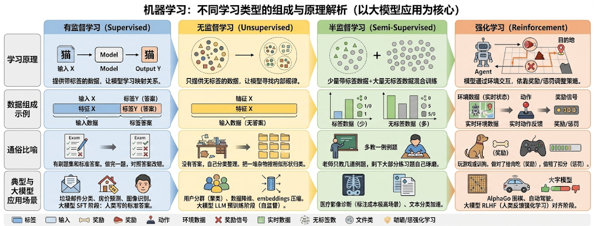

## 2、MSE 公式

**MSE（Mean Squared Error，均方误差）** 是机器学习和统计学中最常用的 **评价指标** 与损失函数（Loss Function）之一。

简单来说，它是用来 **衡量模型的预测值与真实值之间“平均差了多少”**。数值越小，说明模型的预测越精准。

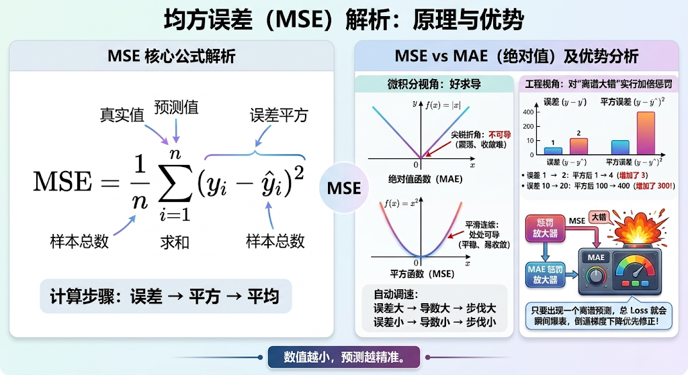

### 2.1 拆解名称：MSE 是怎么算出来的？

它的名字本身就是它的计算步骤：

1. **误差（Error）**：用“预测值”减去“真实值”（$y_{预测} - y_{真实}$）。
2. **平方（Squared）**：把这个误差平方一下（$(y_{预测} - y_{真实})^2$）。
3. **均（Mean）**：把所有样本的平方误差加起来，求一个平均数。

用数学公式表达就是：

$$\text{MSE} = \frac{1}{n} \sum_{i=1}^{n} (y_i - \hat{y}_i)^2$$

- $y_i$：第 $i$ 个样本的真实答案。
- $\hat{y}_i$：模型预测出来的答案。
- $n$：总共有多少个样本。

**不平方确实不行**。最直接的替换方案通常是 **取绝对值**（即平均绝对误差 MAE：$\frac{1}{n}\sum \vert{}y_i - \hat{y}_i\vert{}$），但 MSE 选择“平方”主要出于以下 **两个核心原因**：

### 2.2 微积分视角：为了“好求导”（数学上的绝对优势）

在利用 **梯度下降法** 训练模型时，我们需要对损失函数进行求导。

- **如果用绝对值（不平方）**：

  绝对值函数 $f(x) = \vert{}x\vert{}$ 在 $x = 0$ 处是一个 **尖锐折角**（不可导）。这意味着当模型的预测值刚好等于真实值时，梯度会突变，计算机在处理导数时需要做大量的逻辑判断，且在最小值附近容易产生剧烈震荡、难以平滑收敛。

- **如果用平方（MSE）**：

  平方函数 $f(x) = x^2$ 是一条 **平滑连续的抛物线**，在任意一点都处处可导。

  - **求导极简**：$x^2$ 的导数就是简单的 $2x$。
  - **自动调速**：当误差很大时，$2x$ 的导数很大，梯度的步子跨得大，**加速下山**；当误差接近 0 时，$2x$ 的导数接近 0，梯度的步子自动变小，**平稳落到谷底**。

### 2.3 工程视角：对“离谱大错”实行加倍惩罚

平方运算对 **大误差有极强的放大效应**：

- 误差从 $1 \rightarrow 2$：平方后从 $1 \rightarrow 4$（增加了 3）。
- 误差从 $10 \rightarrow 20$：平方后从 $100 \rightarrow 400$（增加了 300！）。

**为什么需要这种放大？**

在大多数工程实际中，模型“稍微预测偏一点”是可以接受的，但“出现一次离谱的大错”往往是致命的。平方项就像一个“惩罚放大器”**：只要出现一个离谱的预测，总 Loss 就会瞬间爆表。这会倒逼梯度下降算法** 优先去修正那些错得最离谱的样本，让模型的整体表现更加稳定。

## 3、多元线性回归算法

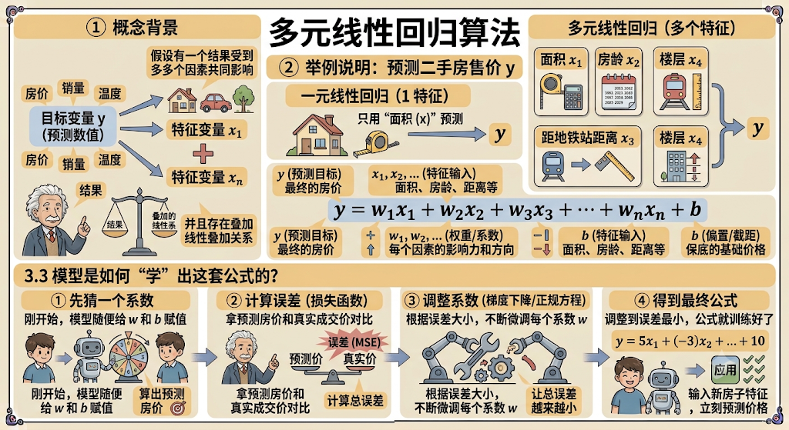

### 3.1 概念背景

**多元线性回归（Multiple Linear Regression）** 就是一种用来 **预测数值** 的统计与机器学习算法。

它的核心思想是：**假设有一个结果（目标变量 $y$），受到了多个因素（特征变量 $x_1, x_2, \dots, x_n$）的共同影响，并且它们之间存在叠加的线性叠加关系。**

### 3.2 举例说明

假设你要预测某套 **二手房的售价（$y$）**：

- **一元线性回归**：只用“面积（$x$）”这一个因素来预测房价。
- **多元线性回归**：同时考虑“面积（$x_1$）”、“房龄（$x_2$）”、“距离地铁站距离（$x_3$）”、“楼层（$x_4$）”等 **多个因素** 来共同预测房价。

计算公式可以写成这样：

$$y = w_1 x_1 + w_2 x_2 + w_3 x_3 + \dots + w_n x_n + b$$

- **$y$（预测目标）**：最终的房价。
- **$x_1, x_2, \dots$（特征输入）**：面积、房龄、距离等。
- **$w_1, w_2, \dots$（权重/系数）**：每个因素的影响力和方向。比如：
  - 面积的系数 $w_1$ 是正数（面积越大，价格越高）；
  - 房龄的系数 $w_2$ 是负数（房龄越老，价格越低）。
- **$b$（偏置/截距）**：保底的基础价格。

机器学习要做的事情，就是给它看海量的二手房成交历史数据（有监督学习），让模型 **自动算出最合理的一组权重系数 $w$ 和偏置 $b$**。

### 3.3 模型是怎么“学”出这套公式的？

1. **先猜一个系数**：刚开始，模型随便给 $w$ 和 $b$ 赋值，算出一个预测房价。
2. **计算误差（损失函数）**：拿预测房价和真实成交价对比，计算总误差（通常用均方误差 MSE）。
3. **调整系数（梯度下降/正规方程）**：根据误差大小，不断微调每个系数 $w$，让总误差越来越小。
4. **得到最终公式**：调整到误差最小的时候，这套数学公式就训练好了，以后输入一套新房子的特征，就能立刻给出预测价格。

## 4、梯度下降法与模型训练

### 4.1 定义

**梯度下降（Gradient Descent）** 核心思想只有一句话：**在不确定最佳参数时，顺着山坡最陡的方向往山谷走，直到找到误差最低的那个点。**

### 4.2 结合案例说明

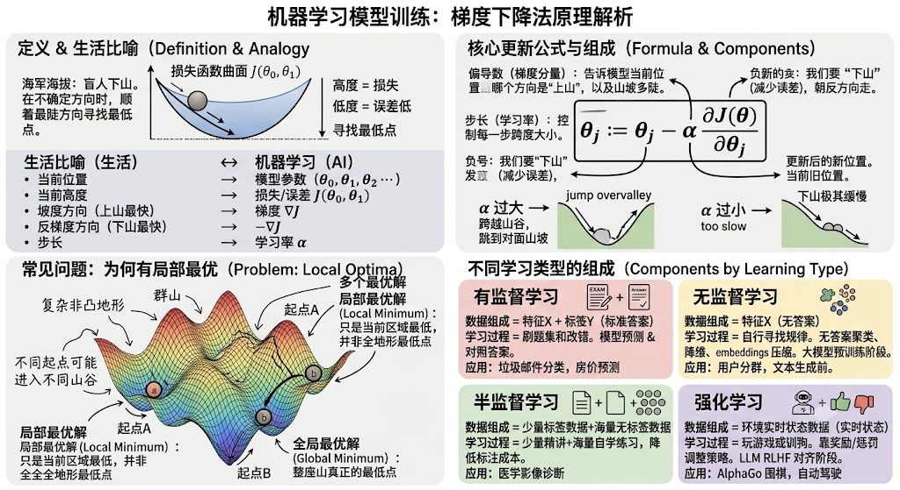

**海拔高度** = 损失/误差 $J(\theta_0, \theta_1)$（高度越高，模型预测得越烂；越低越好）。

**你的位置** = 模型参数 $\theta_0, \theta_1$（比如上面二手房例子里的权重 $w$ 和偏置 $b$）。

**坡度方向（梯度）** = 导数/偏导数，指示了函数上升最快的方向。因此反方向（减去梯度）就是下降最快的方向。

**步长（学习率 $\alpha$）** = 你每一步迈多大。

看你截图中画圈和推导的部分：

- **三维曲面图（Loss / $J(\theta)$）**：

  - 横轴 $\theta_0, \theta_1$ 是模型的两个参数。
  - 纵轴（Z 轴）是损失值 $J(\theta_0, \theta_1)$。
  - 右图手写了 **“群山”** 和 **“多个最优解”**：因为真实地形不一定是个光滑的碗（左图），它可能有好几个山谷。起点不一样，最终下到的谷底可能不同（局部最优解 vs 全局最优解）。

- **核心更新公式**：

  $$\theta_j := \theta_j - \alpha \frac{\partial}{\partial \theta_j} J(\theta_0, \theta_1)$$

  - **$\theta_j$**：当前的参数（现在的绝对位置）。
  - **$\frac{\partial}{\partial \theta_j} J(\dots)$（偏导数/梯度）**：告诉模型当前位置往哪个方向走是“上山”，以及山坡有多陡。
  - **$-\alpha$（减去学习率乘以梯度）**：
    - **负号**：因为我们要 **下山**（减少误差），所以要朝梯度的反方向走。
    - **$\alpha$（学习率/步长）**：控制每一步跨多大。如果 $\alpha$ 太大，可能会一脚跨过山谷迈到对面山上；如果 $\alpha$ 太小，下山会极其缓慢。

### 4.3 常见问题：为什么会有“局部最优”？

右图中用紫色和黑色两条线展示了不同的下山路径：

- **If you start here...**：起点不同，下降路径就不同。
- 如果地形有多个山谷（非凸函数）：
  - 走到了 **局部最优解（Local Minimum）**：只是这片区域最低，但全山还有更低的谷底。
  - 走到了 **全局最优解（Global Minimum）**：整座山真正的最低点。

### 4.4 数学补课

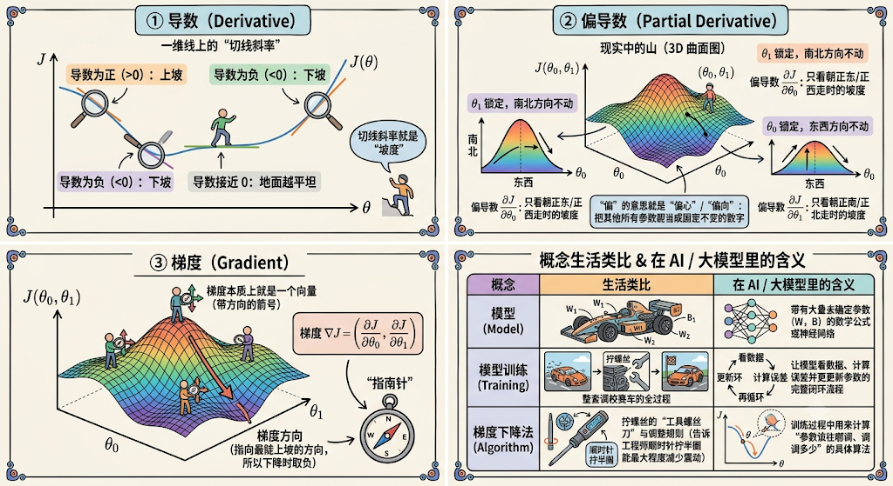

##### ① 导数（Derivative）：一维线上的“切线斜率”

想象你站在一条一维的山脊（一元函数线）上：

- **导数就是“坡度”**。
- 导数为正（$>0$）：说明往前走是 **上坡**。
- 导数为负（$<0$）：说明往前走是 **下坡**。
- 导数绝对值越大：说明坡度越陡；绝对值越小（接近 $0$）：说明地面越平坦。

##### ② 偏导数（Partial Derivative）：只沿着某一个方向看坡度

现实中的山（比如你刚刚截图里的 3D 曲面图）是三维的，你的位置由两个参数组成：$\theta_0$（东/西方向）和 $\theta_1$（南/北方向）。

当你站在山上时：

- **偏导数 $\frac{\partial J}{\partial \theta_0}$**：**锁定南北方向不动**，只看你 **朝正东/正西走** 时的坡度。
- **偏导数 $\frac{\partial J}{\partial \theta_1}$**：**锁定东西方向不动**，只看你 **朝正南/正北走** 时的坡度。

**“偏”的意思就是“偏心”/“偏向”**：求某一个参数的偏导数时，把其他所有参数都当成固定不变的数字，只关注这一个维度上的坡度变化。

##### ③ 梯度（Gradient）：把各个方向的偏导数打包成一个“指南针”

**梯度本质上就是一个向量（带方向的箭号）。**

它是把所有维度算出来的偏导数 **拼在一起** 组合而成的：

$$\text{梯度 } \nabla J = \left( \frac{\partial J}{\partial \theta_0}, \frac{\partial J}{\partial \theta_1} \right)$$

| **概念**                    | **生活类比**                                                 | **在 AI / 大模型里的含义**                         |
| --------------------------- | ------------------------------------------------------------ | -------------------------------------------------- |
| **模型（Model）**           | 一辆还没调校好的赛车                                         | 带有大量未确定参数（$W, B$）的数学公式或神经网络   |
| **模型训练（Training）**    | **整套调校赛车的全过程**（试驾 $\rightarrow$ 发现不稳定 $\rightarrow$ 拧螺丝 $\rightarrow$ 再试驾） | 让模型看数据、计算误差并更新参数的完整闭环流程     |
| **梯度下降法（Algorithm）** | **拧螺丝的“工具螺丝刀”与调整规则**（告诉工程师顺时针拧半圈能最大程度减少震动） | 训练过程中用来计算“参数该往哪调、调多少”的具体算法 |

## 5、升维、降维、early stopping、惩罚项

### 5.1 升维（Dimensionality Increase）与 降维（Dimensionality Reduction）

这里的“维”指的是 **数据的特征数量**（比如描述一套房子用 2 个指标就是 2 维，用 100 个指标就是 100 维）。

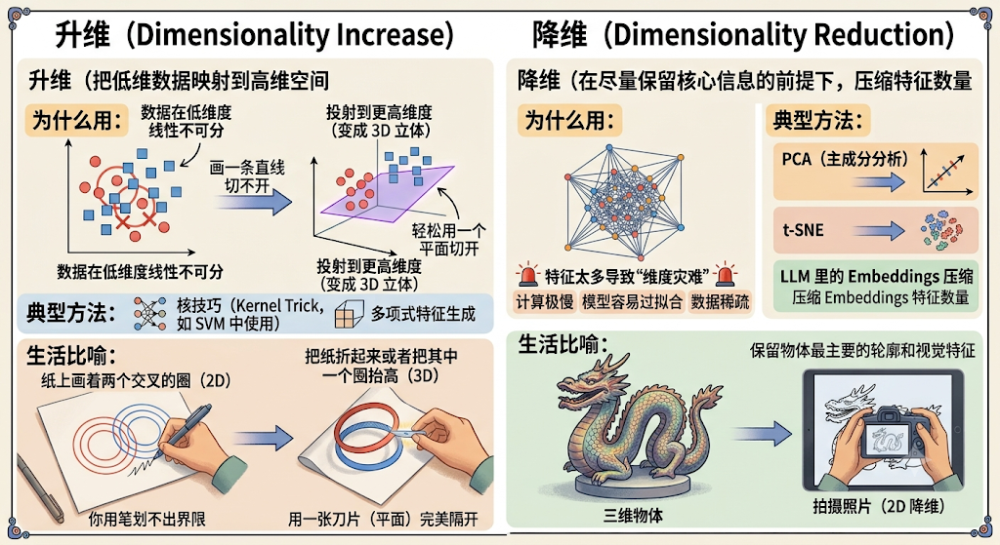

- **升维：把低维数据映射到高维空间**
  - **为什么用：** 当数据在低维度线性不可分（比如一圈红球包围着蓝球，画一条直线切不开）时，把它投射到更高的维度（变成 3D 立体），就能轻松用一个平面切开。
  - **典型方法：** 核技巧（Kernel Trick，如 SVM 中使用）、多项式特征生成。
  - **生活比喻：** 纸上画着两个交叉的圈（2D），你用笔划不出界限；但把纸折起来或者把其中一个圈抬高（3D），就能用一张刀片（平面）完美隔开。
- **降维：在尽量保留核心信息的前提下，压缩特征数量**
  - **为什么用：** 特征太多会导致“维度灾难”（计算极慢、模型容易过拟合、数据稀疏）。
  - **典型方法：** PCA（主成分分析）、t-SNE、LLM 里的 Embeddings 压缩。
  - **生活比喻：** 拍摄三维物体的照片。照片是 2D 的（降维了），但依然保留了物体最主要的轮廓和视觉特征。

### 5.2 Early Stopping（早停法）

在训练模型时，我们会把数据分成 **训练集（平时刷的题）\**和\** 验证集（模拟考试）**。

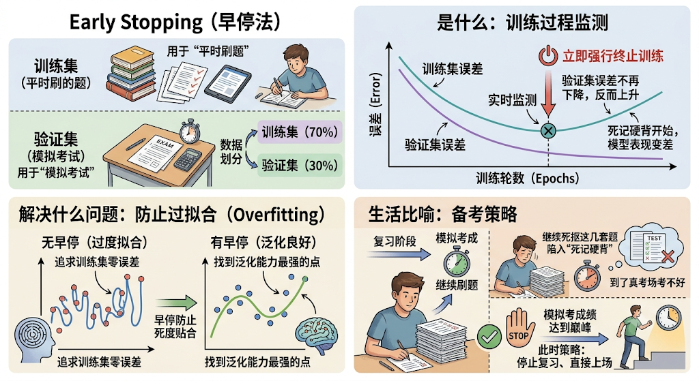

- **是什么：** 在训练过程中，实时监测模型在验证集上的表现。当发现训练集误差一直在下降（模型还在死记硬背），但验证集误差不再下降甚至开始上升时，**立刻强行终止训练**。
- **解决什么问题：** 防止 **过拟合（Overfitting）**。
- **生活比喻：** 备考复习时，如果你刷题刷到一定程度，模拟考成绩已经达到了巅峰，再继续死抠这几套题就会陷入“死记硬背”，到了真考场反而考不好。这时候最好的策略就是停止复习、直接上场。

### 5.3 惩罚项（Penalty / Regularization，正则化）

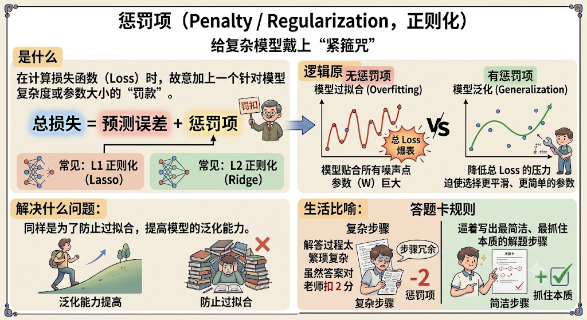

- **是什么：** 在计算损失函数（Loss）时，故意加上一个 **针对模型复杂度或参数大小的“罚款”**。

  $$\text{总损失} = \text{预测误差} + \text{惩罚项}$$

  常见的有 **L1 正则化（Lasso）** 和 **L2 正则化（Ridge）**。

- **逻辑原理：** 如果模型为了完美贴合训练数据中的每一个噪声点，把参数（$W$）调得极其巨大或极度复杂，惩罚项就会让总 Loss 爆表。为了降低总 Loss，模型不得不被迫 **选择更平滑、更简单的参数**。

- **解决什么问题：** 同样是为了防止过拟合，提高模型的泛化能力。

- **生活比喻：** 答题卡规则。如果解答过程写得太繁琐复杂，虽然答案对了，但老师会因为“步骤过于冗余”扣你 2 分（惩罚项）。这会逼着你写出最简洁、最抓住本质的解题步骤。

## 6、正则与归一化

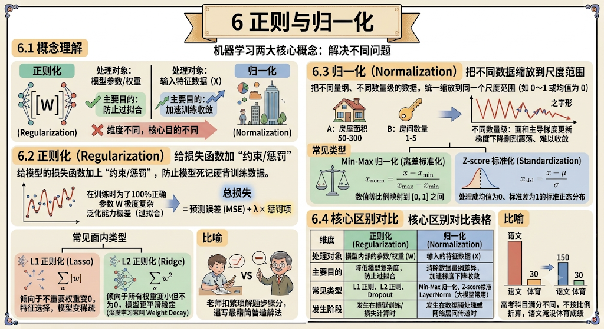

### 6.1 概念理解

**正则化（Regularization）\**和\** 归一化（Normalization）\**是机器学习中两个经常被一起提及、但\** 解决完全不同问题** 的核心概念：

- **正则化**：作用于 **模型参数/权重**，目的是 **防止过拟合**。
- **归一化**：作用于 **输入特征数据**，目的是 **加速训练收敛**。

### 6.2 正则化（Regularization）

**一句话理解**：给模型的损失函数加上“约束/惩罚”，防止模型死记硬背训练数据。

在训练时，模型为了把训练集做到 100% 正确，倾向于把参数 $W$ 调整得很大或极度复杂，导致泛化能力极差（过拟合）。正则化通过在损失函数后加上 **惩罚项** 来解决这个问题：

$$\text{总损失} = \text{预测误差 (MSE)} + \lambda \times \text{惩罚项}$$

- **L1 正则化（Lasso）**：惩罚项是权重绝对值的和（$\sum \vert{}w\vert{}$）。
  - **特点**：倾向于把不重要的权重直接 **变成 0**，从而实现 **特征选择**，让模型变稀疏。
- **L2 正则化（Ridge）**：惩罚项是权重的平方和（$\sum w^2$）。
  - **特点**：倾向于让所有权重都 **尽量变小但不为 0**，使模型更平滑稳定（深度学习中常叫 Weight Decay）。

> **比喻**：老师在打分时，不仅看你写出的答案对不对，还要对复杂的解题步骤扣分，逼着你写出最精简、最具普遍适用性的解题方法。

### 6.3 归一化（Normalization）

**一句话理解**：把不同量纲、不同数量级的数据，统一缩放到同一个尺度范围（如 $0 \sim 1$ 或均值为 $0$）。

如果特征 A 是“房屋面积”（数值 $50 \sim 300$），特征 B 是“房间数量”（数值 $1 \sim 5$）。如果不做处理，面积的巨大数值会完全主导梯度的更新方向，导致梯度下降时像“走之字形”一样剧烈震荡、难以收敛。

- **Min-Max 归一化（离差标准化）**：

  将数值等比例映射到 $[0, 1]$ 之间。

  $$x_{\text{norm}} = \frac{x - x_{\text{min}}}{x_{\text{max}} - x_{\text{min}}}$$

- **Z-score 标准化（Standardization）**：

  将数据处理成均值为 $0$、标准差为 $1$ 的标准正态分布。

  $$x_{\text{std}} = \frac{x - \mu}{\sigma}$$

> **比喻**：高考不同科目的满分不同（语文 150 分，体育 30 分），如果不按比例折算（归一化）直接加总分，语文成绩就会彻底淹没体育成绩的作用。

### 6.4 核心区别对比

| **维度**     | **正则化 (Regularization)**    | **归一化 (Normalization)**                              |
| ------------ | ------------------------------ | ------------------------------------------------------- |
| **处理对象** | 模型内部的 **参数/权重 ($W$)**  | 输入的 **特征数据 ($X$)**                                |
| **主要目的** | 降低模型复杂度，**防止过拟合** | 消除数据量纲差异，**加速梯度下降收敛**                  |
| **常见类型** | L1 正则、L2 正则、Dropout      | Min-Max 归一化、Z-score 标准化、LayerNorm（大模型常用） |
| **发生阶段** | 发生在 **模型训练/损失计算** 时  | 发生在 **数据预处理** 或 **网络层间传递** 时                |

## 7、惩罚的处理

**惩罚项** 的本质，就是在损失函数（Loss Function）里直接加上一笔“罚款”。

梯度下降的唯一目标是 **让总 Loss 越小越好**。一旦加入了这笔罚款，模型为了让总 Loss 变小，就不得不 **在“预测得准”和“少交罚款”之间做权衡**，从而主动把参数控制在合理的范围。

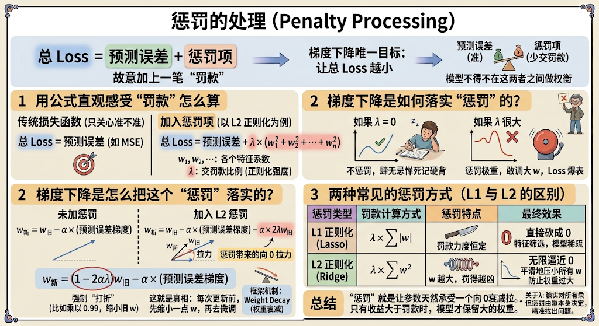

### 7.1 用公式直观感受“罚款”怎么算

传统的损失函数只关心预测准不准：

$$\text{总 Loss} = \text{预测误差 (如 MSE)}$$

加入了惩罚项（以常用的 **L2 正则化** 为例）之后：

$$\text{总 Loss} = \text{预测误差} + \lambda \times (w_1^2 + w_2^2 + \dots + w_n^2)$$

- **$w_1, w_2, \dots$（模型参数/权重）**：模型学出来的各个特征系数。
- **$\lambda$（惩罚系数/正则化强度）**：你自己设置的交罚款比例。
  - 如果 $\lambda = 0$：不惩罚，模型继续肆无忌惮地把 $w$ 调得极大去死记硬背。
  - 如果 $\lambda$ 很大：惩罚极重，模型只要敢把 $w$ 调大一点，总 Loss 就会瞬间爆表。

### 7.2 梯度下降是怎么把这个“惩罚”落实的？

在模型训练过程中，梯度下降更新参数的数学过程非常形象：

**未加惩罚时** 的参数更新：

$$w_{\text{新}} = w_{\text{旧}} - \alpha \times (\text{预测误差对 } w \text{ 的梯度})$$

**加入 L2 惩罚后**（对 $w^2$ 求导得到 $2w$）：

$$w_{\text{新}} = w_{\text{旧}} - \alpha \times (\text{预测误差的梯度}) - \alpha \times 2\lambda w_{\text{旧}}$$

把公式变形一下，看得更清楚：

$$w_{\text{新}} = (1 - 2\alpha\lambda) w_{\text{旧}} - \alpha \times (\text{预测误差的梯度})$$

- **注意这个 $(1 - 2\alpha\lambda)$**：因为 $\alpha$ 和 $\lambda$ 都是大于 0 的小数，所以 $(1 - 2\alpha\lambda)$ **永远小于 1**（比如 $0.99$）。
- **这就是惩罚的真相**：**每次更新参数前，先强制把旧的 $w$ 打个折（比如乘以 0.99 缩小一点），然后再根据误差去微调。**
- 在深度学习框架里，这个机制叫 **Weight Decay（权重衰减）**。

### 7.3 两种常见的惩罚方式（L1 与 L2 的区别）

| **惩罚类型**          | **罚款计算方式**                                             | **惩罚特点**                                                 | **最终效果**                                                 |
| --------------------- | ------------------------------------------------------------ | ------------------------------------------------------------ | ------------------------------------------------------------ |
| **L1 正则化 (Lasso)** | $\lambda \times \sum \Vert{}w\Vert{}$ *(按权重的绝对值罚款)* | **不论 $w$ 大小，罚款力度恒定**。 就算 $w$ 已经很小了，依然会被硬生生拉到 0。 | **直接把不重要的 $w$ 砍成 0**。 实现“特征筛选”，让模型变得很稀疏。 |
| **L2 正则化 (Ridge)** | $\lambda \times \sum w^2$ *(按权重的平方罚款)*               | **$w$ 越大，罚得越凶；$w$ 很小时，罚款微乎其微**。 它只会无限逼近 0，但很难真正变成 0。 | **把所有 $w$ 都平滑地压小**。 防止某些权重过大导致模型过于敏感。 |

### 总结

所谓“惩罚”，就是 **通过数学求导的机制，让每一个参数在更新时都天然承受一个向 0 衰减的拉力**。只有当某个特征对预测极其重要、带来的收益远远大于罚款时，模型才会给它保留较大的权重。

你问到了机器学习的核心逻辑！那个长得像“入”的符号读作 **Lambda（$\lambda$）**。

答案是：**$\lambda$ 确实对所有权重一视同仁地乘同一个系数，但最终每个权重真正受到的“惩罚力度”，是由它自己的大小（$w_i$）决定的，并且算法完全能精准找出是哪个 $w$ 出了问题。**

我们可以从两个角度来理解：

### 7.4 扩展：$\lambda$ 的作用和怎么知道哪个权重出现问题

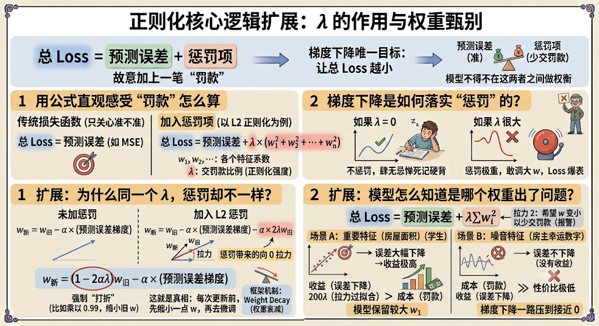

#### ① 为什么用同一个 $\lambda$，惩罚却不一样？

看公式里惩罚项的形式：$\lambda \times w_i^2$。

当我们用梯度下降对它求导、计算“惩罚拉力”时，对 $w_i^2$ 求导得到的是 **$2 \times \lambda \times w_i$**：

- **如果某个权重 $w_1 = 100$（非常大，容易导致过拟合/出问题）**：

  它受到的惩罚拉力是 $2 \times \lambda \times 100 = \mathbf{200\lambda}$（**拉力极大**）。

- **如果某个权重 $w_2 = 0.1$（很小，非常安全）**：

  它受到的惩罚拉力是 $2 \times \lambda \times 0.1 = \mathbf{0.2\lambda}$（**拉力极小**）。

虽然 $\lambda$ 是同一个全局系数（相当于“税率”），但因为 **大权重的基数大、平方增长快**，它产生的“罚款总额”和“下拉力”会远远大于小权重。

### ② 模型怎么知道是哪个权重出了问题？

模型靠的是 **总 Loss 的两部分在进行“力量博弈”**：

$$\text{总 Loss} = \underbrace{\text{预测误差}}_{\text{拉力 1：希望 } w \text{ 变大以拟合数据}} + \underbrace{\lambda \sum w_i^2}_{\text{拉力 2：希望 } w \text{ 变小以少交罚款}}$$

梯度下降在更新每一个权重 $w_i$ 时，都是单独计算它的方向的：

1. **如果 $w_1$ 对应的特征（如房屋面积）对预测极其重要**：
   - 把 $w_1$ 调大，**预测误差会大幅下降**（收益极高）。
   - 虽然 $\lambda w_1^2$ 会带来罚款，但“误差下降带来的收益”远大于“罚款成本”。
   - **结果**：模型选择保留较大的 $w_1$。
2. **如果 $w_2$ 对应的特征（如房主的幸运数字）纯属噪音/没用**：
   - 把 $w_2$ 调大，**预测误差几乎不下降**（没有收益），甚至会搞砸其他预测。
   - 但 $\lambda w_2^2$ 却在实打实地增加罚款成本。
   - **结果**：模型会发现这个 $w_2$“性价比极低”，梯度下降就会把它一路压到接近 0。

### ③ 实际举例

我们用一个预测“手机二次转卖二手价”的真实场景，来走一遍完整的流程。

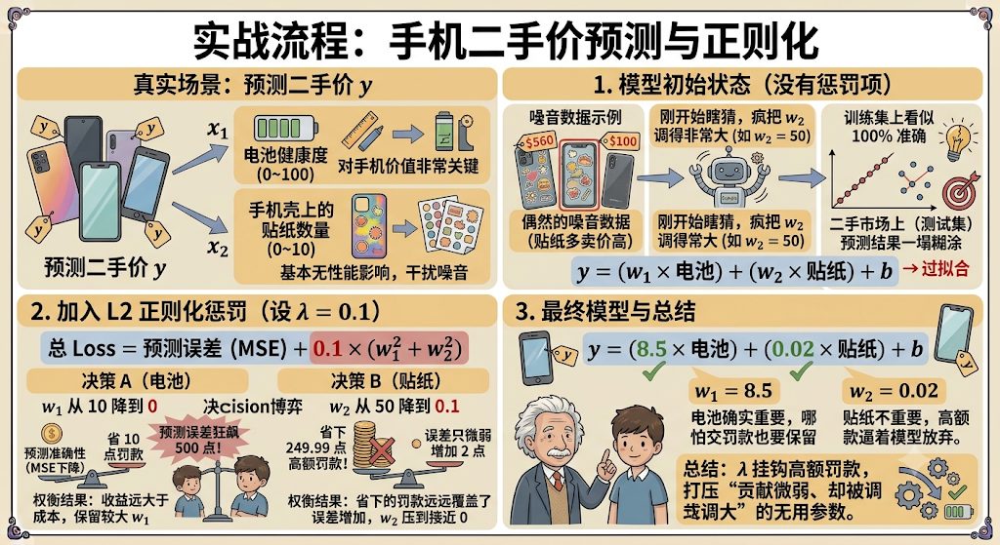

假设我们要预测手机的转卖价格 $y$，输入两个特征：

- $x_1$：**电池健康度**（0~100，对手机价值非常关键）
- $x_2$：**手机壳上的贴纸数量**（0~10，基本对手机性能无影响，纯属干扰噪音）

#### 1. 模型初始状态（没有惩罚项）

模型刚开始瞎猜，给出了初始参数：

$$y = (w_1 \times \text{电池}) + (w_2 \times \text{贴纸}) + b$$

假设在训练集数据中，刚好有几台贴纸多的手机卖出了高价（这只是偶然的**噪音数据**）。

- 没有正则化时，模型为了强行把这几个噪音点预测准确，疯狂把贴纸的权重 $w_2$ 调得非常大（比如 $w_2 = 50$）。
- 结果：模型在训练集上看似 100% 准确，但拿到真实的二手市场（测试集）上，预测结果一塌糊涂——这就是**过拟合**。

#### 2. 加入 L2 正则化惩罚（设 $\lambda = 0.1$）

现在我们在损失函数里加上惩罚项：

$$\text{总 Loss} = \text{预测误差 (MSE)} + 0.1 \times (w_1^2 + w_2^2)$$

此时，梯度下降在更新这两个权重时，会面临两个不同的决策：

##### 决策 A：处理电池健康度权重 $w_1$

- **如果把 $w_1$ 从 10 降到 0**：
  - **罚款变少**：$0.1 \times 10^2 = 10 \rightarrow 0$，省了 **10** 点罚款。
  - **误差爆表**：预测价格完全脱离实际，预测误差（MSE）狂飙了 **500** 点！
- **权衡结果**：收益（减少 500 误差）远大于成本（多付 10 罚款）。梯度下降选择**保留较大的 $w_1$**。

##### 决策 B：处理贴纸数量权重 $w_2$

- **如果把 $w_2$ 从 50 降到 0.1**：
  - **罚款变少**：$0.1 \times 50^2 = 250 \rightarrow 0.001$，直接省下了 **249.99** 点高额罚款！
  - **误差变化**：因为贴纸本来就和手机价值无关，降低 $w_2$ 后，预测误差（MSE）只微弱增加了 **2** 点。
- **权衡结果**：省下的罚款（249.99）远远覆盖了误差的微小增加（2）。梯度下降会**狠狠地把 $w_2$ 压到接近 0**。

#### 3. 最终训练出来的模型

经过梯度下降的博弈，模型调整出了最终权重：

- $w_1 = 8.5$（电池确实重要，哪怕交点罚款也要保留）
- $w_2 = 0.02$（贴纸不重要，高额罚款逼着模型放弃了这个干扰特征）

**总结**：$\lambda$ 不需要知道哪个参数有问题。它只负责**按权重平方挂钩高额罚款**，那些“对预测结果贡献微弱、却被调得很大”的无用参数，会因为**性价极低**而被梯度下降优先打压掉。

## 8、逻辑回归、softmax 回归、损失函数

在机器学习中，**逻辑回归** 和 **Softmax 回归** 是处理 **分类任务**（判断“是什么”）最核心的两个算法，而 **损失函数** 则是用来 **评估预测好坏** 的通用一把尺子。

我们可以把它们放在一个清晰的框架里理解：

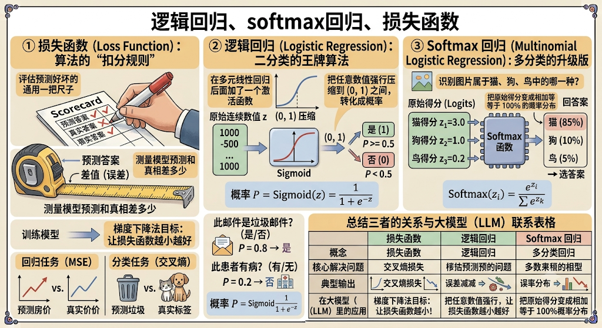

### ① 损失函数（Loss Function）：算法的“扣分规则”

**一句话理解**：用来测量模型预测出来的答案，和真实答案相比 **差了多少**。

在训练模型时，梯度下降法需要一个目标——**让损失函数算出的值越小越好**。

- 不同的任务类型会使用不同的损失函数：
  - **回归任务（预测连续数值，如房价）**：常用我们前面讲的 **MSE（均方误差）**。
  - **分类任务（预测类别，如垃圾邮件、猫狗识别）**：常用 **交叉熵损失函数（Cross-Entropy Loss）**。

### ② 逻辑回归（Logistic Regression）：二分类的王牌算法

不要被名字里的“回归”骗了，**逻辑回归本质上是一个“分类”算法，专门用来做二分类（非 A 即 B）**。

比如：

- 这封邮件是不是垃圾邮件？（是 / 否）
- 这个患者有没有得病？（有 / 无）

#### 核心原理：

我们前面讲过多元线性回归，算出来的结果 $z = w_1 x_1 + w_2 x_2 + b$ 是一个可能极大或极小的连续数值（比如 $z = 1000$ 或 $z = -500$）。

但概率只能在 **$0 \sim 1$（0% ~ 100%）** 之间。逻辑回归做的事情非常简单：**在多元线性回归后面加了一个 Sigmoid 激活函数，把任意数值强行压缩到 $(0, 1)$ 之间，转化成概率**。

- **公式**：$\text{概率 } P = \text{Sigmoid}(z) = \frac{1}{1 + e^{-z}}$
- **逻辑**：算出来的 $P \ge 0.5$ 就判为“是”（类别 1）， $P < 0.5$ 就判为“否”（类别 0）。

### ③ Softmax 回归（Multinomial Logistic Regression）：多分类的升级版

如果分类任务不仅仅是“二选一”，而是“多选一”（比如识别手写数字 $0 \sim 9$、识别图片是“猫/狗/鸟/鱼”），逻辑回归就不够用了，这时就需要 **Softmax 回归**。

#### 它的核心原理：

假设我们要识别一张图片属于猫、狗、鸟中的哪一种：

1. 模型会先算出三个原始得分（Unnormalized Scores / Logits）：

   - 猫得分 $z_1 = 3.0$
   - 狗得分 $z_2 = 1.0$
   - 鸟得分 $z_3 = 0.2$

2. **通过 Softmax 函数处理**：

   Softmax 把这组原始得分变成 **相加等于 100% 的概率分布**：

   $$\text{Softmax}(z_i) = \frac{e^{z_i}}{\sum e^{z_k}}$$

   - 算出来的结果可能就是：猫（**85%**）、狗（**10%**）、鸟（**5%**）。

3. 选择概率最大的那个作为最终预测答案（猫）。

### 总结三者的关系与大模型联系

| **概念**         | **核心解决问题**           | **典型输出**                     | **大模型（LLM）里的应用**                                    |
| ---------------- | -------------------------- | -------------------------------- | ------------------------------------------------------------ |
| **损失函数**     | 评估“预测和真相对比差多少” | 一个代表总错误的数字             | 大模型训练时用交叉熵损失（Cross-Entropy）来算下一个词预测得准不准。 |
| **逻辑回归**     | **二分类**（是/否）        | $0 \sim 1$ 之间的概率值          | 常用于判定生成内容是否违规、二元意图识别等。                 |
| **Softmax 回归** | **多分类**（多选一）       | 加起来等于 1（100%）的多个概率值 | **大模型生成词的核心**：在预训练词表（比如 5 万个词）里，最后一层就是用 **Softmax** 算出下一个最可能接上的词是哪一个。 |

### ④ 扩展，公式 e 的理解

这两个公式里之所以都出现了 **自然常数 $e$（以 $e \approx 2.718$ 为底的指数函数 $e^x$）**，并不是数学家凭空捏造的，而是因为它在处理数据时拥有 **三个极其关键的数学特性**。

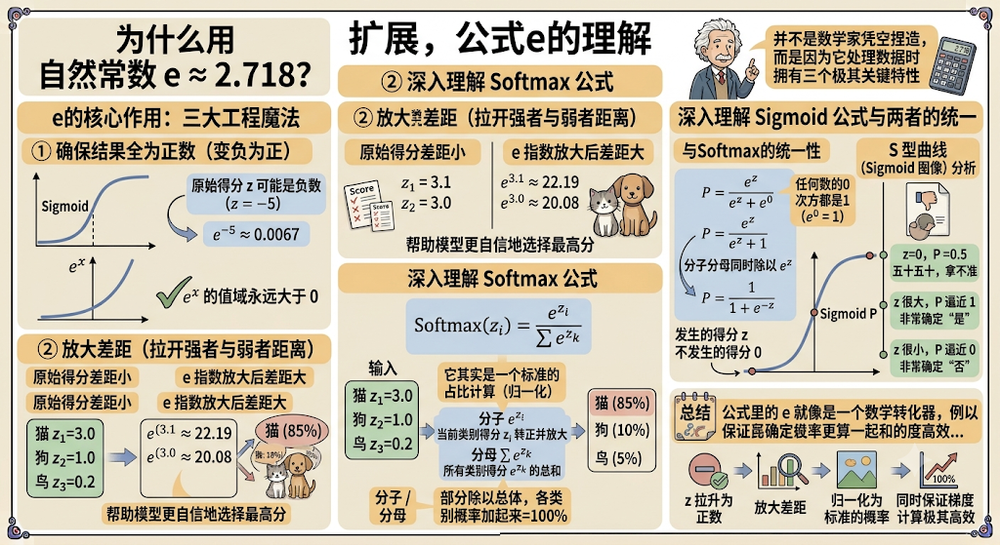

#### 1. $e$ 的核心作用：三大工程魔法

不管是 Sigmoid 还是 Softmax，引入 $e^x$（指数函数）主要发挥了以下三个作用：

##### ① 确保结果全为正数（变负为正）

- **问题**：模型算出来的原始得分 $z$ 可能是负数（比如 $z = -5$）。但现实中 **概率不可能为负数**（概率必须在 $0 \sim 1$ 之间）。
- **$e$ 的作用**：指数函数 $e^x$ 的值域 **永远大于 0**。无论输入 $z$ 是负得再离谱（如 $e^{-100} \approx 0$），算出来的结果也一定是正数。

##### ② 放大差距（拉开强者与弱者的距离）

- **问题**：如果得分非常接近（比如猫得分 3.1，狗得分 3.0），模型很难果断做出选择。

- **$e$ 的作用**：$e^x$ 是一个 **爆炸式增长** 的曲线。

  - $e^{3.0} \approx 20.08$

  - $e^{3.1} \approx 22.19$

    原先只差 $0.1$ 的得分，经过 $e$ 指数放大后差距立刻变大，这能让 Softmax 输出的概率分布更集中，帮助模型更自信地选择最高分（也就是大模型输出词汇时的决策机制）。

##### ③ 求导极简（导数还是它自己）

- 在梯度下降时，我们需要对公式求导。$e^x$ 的导数依然是 $e^x$（$(e^x)' = e^x$）。

- 这种特性使得 Sigmoid 和 Softmax 与 **交叉熵损失函数（Cross-Entropy）** 结合求导时，复杂的指数项会被巧妙地 **抵消掉**，最终算出来的梯度形式异常简洁：

  $$\text{梯度} = \text{预测概率} - \text{真实标签}$$

  这在工程计算上极大地节省了算力。

#### 2. 深入理解 Softmax 公式

$$\text{Softmax}(z_i) = \frac{e^{z_i}}{\sum e^{z_k}}$$

它的结构拆解开来其实就是一个标准的 **占比计算（归一化）**：

1. **分子 $e^{z_i}$**：先把当前类别的得分 $z_i$ 用 $e$ 转成大于 0 的数值，并放大差距。
2. **分母 $\sum e^{z_k}$**：把所有类别的 $e^{z_k}$ 加起来，求个 **总和**。
3. **分子 / 分母**：用“部分”除以“总体”，就把各个类别的得分变成了 **加起来等于 100%（即 1）的概率分布**。

#### 3. 深入理解 Sigmoid 公式与两者的统一

$$\text{Sigmoid}(z) = \frac{1}{1 + e^{-z}}$$

看似 Sigmoid 和 Softmax 长得不一样，但 Sigmoid 本质上就是 Softmax 在二分类场景下的特例。

在二分类中，假设事件发生的得分是 $z$，不发生的得分是 $0$：

- 根据 Softmax 的逻辑，发生的概率就是：

  $$\text{P} = \frac{e^z}{e^z + e^0}$$

- 因为任何数的 0 次方都是 1（$e^0 = 1$），所以：

  $$\text{P} = \frac{e^z}{e^z + 1}$$

- 分子分母同时除以 $e^z$，就得到了你看到的公式：

  $$\text{P} = \frac{1}{1 + e^{-z}}$$

**S 型曲线（Sigmoid 图像）**：

- 当 $z = 0$ 时，$\text{P} = \frac{1}{1 + 1} = 0.5$（五十五十，拿不准）；
- 当 $z$ 很大时，$e^{-z}$ 接近 0，$\text{P}$ 迅速逼近 $1$（非常确定“是”）；
- 当 $z$ 很小时，$e^{-z}$ 极趋近于无穷大，$\text{P}$ 迅速逼近 $0$（非常确定“否”）。

#### 总结

公式里的 $e$ 就像是一个“数学转化器”：它把模型算出的无界、可能为负的原始得分 $z$，拉升为正数、放大差距，并优雅地归一化为标准的概率，同时保证了梯度下降时计算极其高效。

## 8、正向传播和反向传播

在大模型和神经网络中，**正向传播（Forward Propagation）** 和 **反向传播（Backpropagation）** 是模型进行一次训练学习时 **闭环中的两个核心阶段**。

简单来说：**正向传播负责“做题给出答案”，反向传播负责“对照答案算账改错”。**

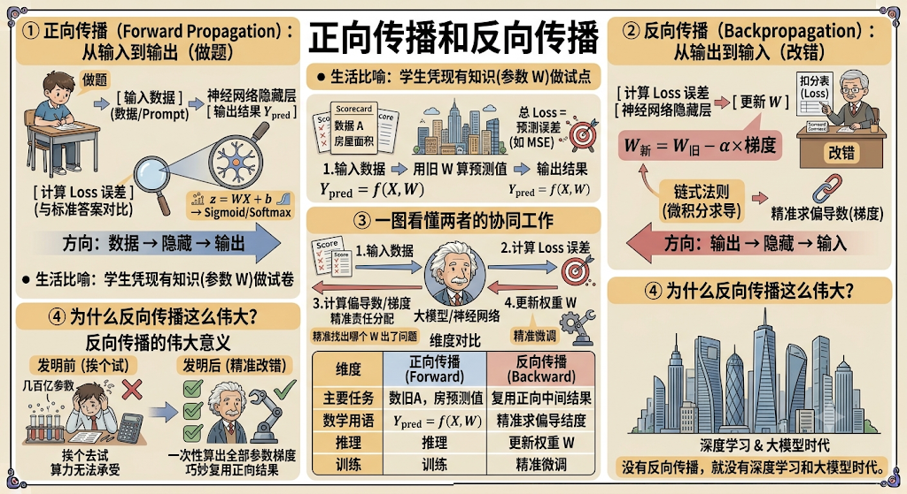

### ① 正向传播（Forward Propagation）：从输入到输出（做题）

- **方向**：从网络的数据 **输入层 $\rightarrow$ 隐藏层 $\rightarrow$ 输出层**。

- **干了什么**：

  数据（例如图片像素、文字 Prompt）进入神经网络，每一层的神经元拿着当前的权重参数 $W$ 和偏置 $b$，对数据进行加权计算和激活函数转换（$z = WX + b \rightarrow \text{Sigmoid/Softmax}$），一层一层向下传递，最终在最后一层 **算出预测结果**。

- **核心目的**：拿到模型的预测答案，并结合真实标准答案，计算出 **总损失误差（Loss）**。

> **生活比喻**：学生拿到试卷，凭着自己大脑里现有的知识（当前参数 $W$），从第一道题顺着推到最后一道题，写下自己的答案，然后交给老师打出总扣分（计算 Loss）。

### ② 反向传播（Backpropagation）：从输出到输入（改错）

- **方向**：从网络的数据 **输出层 $\rightarrow$ 隐藏层 $\rightarrow$ 输入层**（反过来倒推）。

- **干了什么**：

  拿到正向传播算出的总 Loss 之后，利用微积分里的 **链式法则（Chain Rule）**，从后往前 **一层一层计算每个参数 $W$ 的偏导数（梯度）**。

- **核心目的**：精准算出每一个参数 $W$ 对最终的错误 Loss 贡献了多少责任，并配合 **梯度下降法** 更新这些参数（$W_{\text{新}} = W_{\text{旧}} - \alpha \times \text{梯度}$）。

> **生活比喻**：老师拿着扣分表（Loss），从最后一题倒着往前查改：第 10 步推导错了（导致扣 5 分），归咎于第 8 步公式记错了（梯度大小），从而精准指出大脑里哪一块知识点（哪个权重 $W$）需要修改。

### ③ 一图看懂两者的协同工作

在训练大模型时，这个过程会在海量数据上重复成千上万次：

Plaintext

```python
[ 输入数据 X ]
     │
     ▼ (正向传播：用 W 算预测值)
[ 输出结果 Y_pred ] ──► [ 计算 Loss 误差 ]
                              │
     ▲                        ▼ (反向传播：求偏导算梯度)
     └────── (更新权重 W) ─────┘
```

| **维度**              | **正向传播 (Forward)**             | **反向传播 (Backward)**        |
| --------------------- | ---------------------------------- | ------------------------------ |
| **主要任务**          | 算预测值、算 Loss                  | 算各参数的偏导数（梯度）       |
| **用到的数学**        | 矩阵乘法、激活函数                 | 链式法则（微积分求导）         |
| **推理（使用 AI）时** | **需要**（只跑正向传播就能出答案） | **不需要**（不训练就不改参数） |
| **训练（学习 AI）时** | **需要**                           | **需要**                       |

### ④ 为什么反向传播这么伟大？

在反向传播算法被发明之前，想要调整拥有成千上万个参数的网络，几乎只能挨个去试，算力根本无法承受。

反向传播通过 **链式法则**，巧妙地复用了正向传播时计算出的中间结果，使得 **一次性算出网络中几百亿甚至上千亿个参数的偏导数** 成为可能。可以说，没有反向传播，就没有现在的深度学习和大模型时代。

## 9、模型微调

**模型微调（Fine-Tuning）** 简单来说，就是 **让一个已经具备通用知识的“高材生”大模型，去专门学习某个特定领域的专长，使其成为该领域的专家。**

我们可以把整个过程分为“预训练”和“微调”两个阶段来理解：

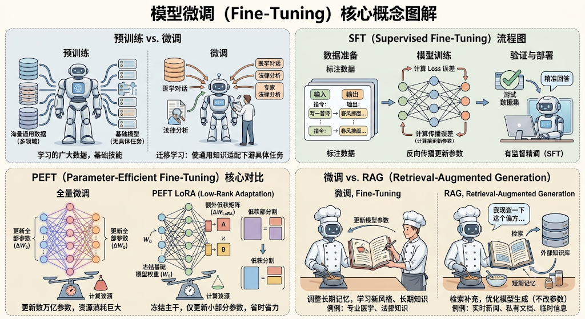

### 9.1 通俗比喻：从“大学通用教育”到“岗前专业培训”

- **预训练（Pre-training）**：

  模型通过阅读互联网上的海量文本（如几万亿字的数据），学会了通用语言结构、百科知识和逻辑推理。这相当于一个学生完成了大学基础教育，成为了一个 **懂很多通用知识的“高材生”**（比如基础的 LLaMA、Qwen 或 GPT 基础模型）。

- **模型微调（Fine-Tuning）**：

  虽然这个高材生什么都知道一点，但他可能不懂你公司的内部流程、不懂专业的医疗病历分析，或者说话风格不符合你的要求。

  微调就是 **用少量（几千到几万条）高质量的“特定领域数据”对这个高材生进行专项训练**，让他迅速掌握特定岗位的技能。

### 9.2 微调的核心技术原理

在前面的学习中，我们知道了训练模型本质上就是通过 **正向传播算出 Loss**，再通过 **反向传播和梯度下降更新参数 $W$**。

微调在技术实现上主要有两种方式：

- **全量微调（Full Fine-Tuning）**：

  在微调时，**更新大模型内部所有的参数 $W$**。

  - **优缺点**：效果最好，但需要消耗巨大的显存和算力（几百亿参数全部求偏导算梯度，成本极高）。

- **高效参数微调（PEFT / LoRA 等）**：

  **冻结（锁定）大模型绝大部分原始参数不变**，只在旁边插入一小部分可训练的“外挂参数”（比如 LoRA 增加的小矩阵）。

  - **优缺点**：训练时只需要对极少量的参数求偏导，**显存消耗直接降低 80% 以上**，用单张消费级显卡就能跑起来，是目前工业界最主流的做法。

### 9.3 大模型开发中的“微调”处于什么位置？

在前文提及的大模型训练体系中，微调主要对应 **SFT（Supervised Fine-Tuning，有监督指令微调）** 阶段：

| **阶段**                    | **数据类型**                            | **训练目的**                         | **例子**                                 |
| --------------------------- | --------------------------------------- | ------------------------------------ | ---------------------------------------- |
| **预训练**                  | TB 级别的海量无标签文本                 | 学会语言结构与世界百科知识           | 让模型能够顺着话往下接文本               |
| **指令微调 (SFT)**          | 几万条高质 QA 对 `(Prompt -> Response)` | 让模型学会 **听懂人类指令并规范回答** | 教模型“回答客服问题”、“写指定格式的代码” |
| **人类反馈强化学习 (RLHF)** | 人类对回答的打分与排序数据              | 纠正偏见、减少幻觉，符合人类偏好     | 让模型的回答更有礼貌、更安全             |

### 9.4 什么时候需要微调，什么时候用 RAG（检索增强）？

在实际工程落地上，很多人会混淆“微调”和“挂载知识库（RAG）”：

- **改风格、学规矩、增技能 $\rightarrow$ 用微调（Fine-Tuning）**：

  如果你想让大模型以某种特定的语气说话（比如扮演老中医）、输出特定格式的 JSON 代码，或者学会某种特殊的推理逻辑，微调是最管用的。

- **查资料、看最新文档、补充实时私有知识 $\rightarrow$ 用 RAG（知识库检索）**：

  如果只是想让大模型回答“公司昨天的最新财务报表”，直接通过 RAG 挂载文档比微调更准确且不容易产生幻觉。