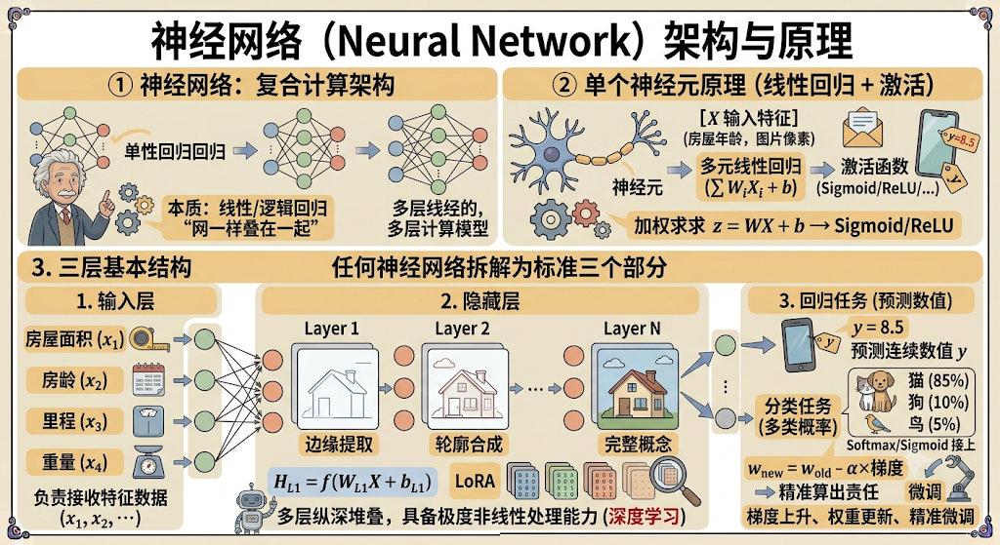
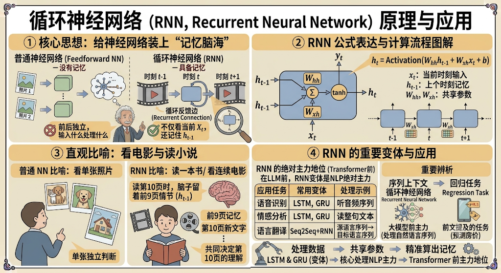
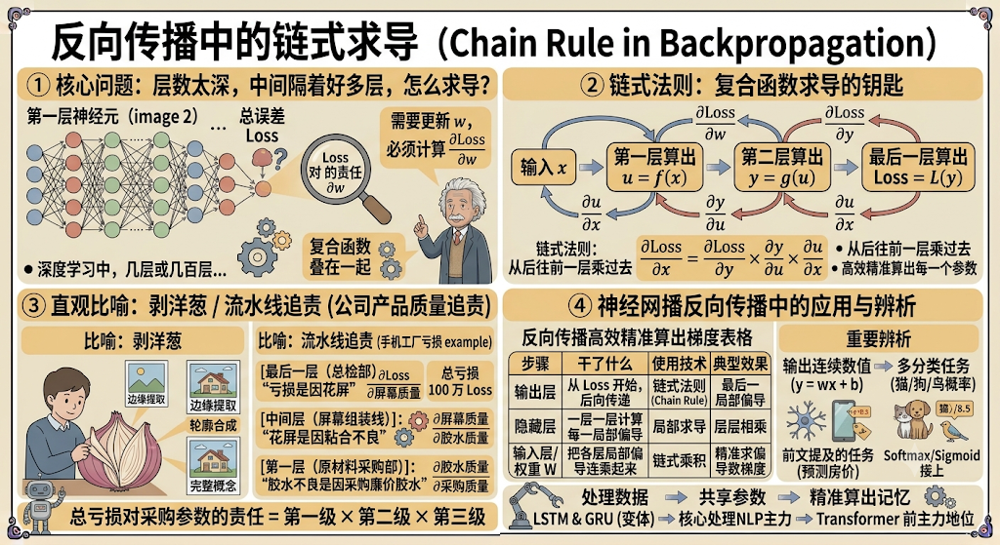
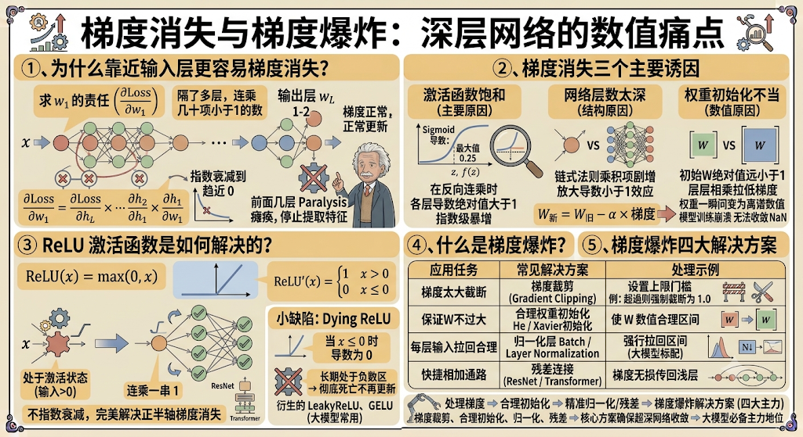
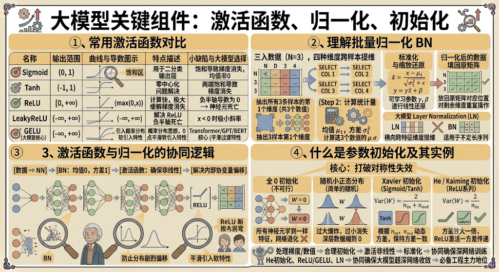
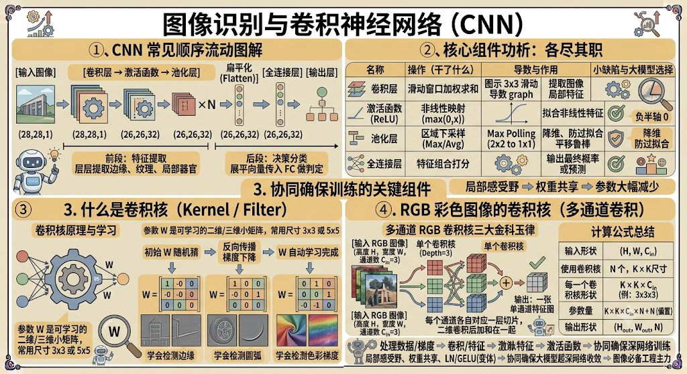
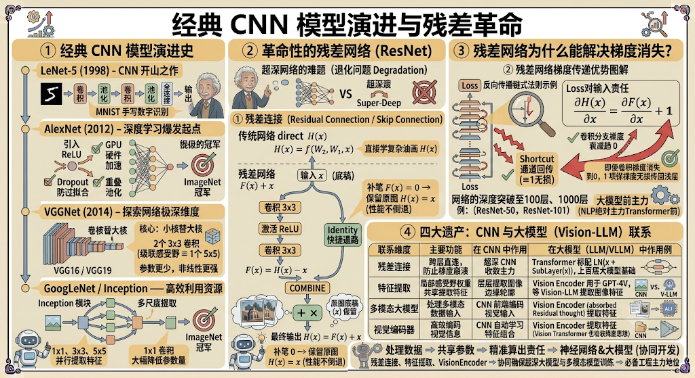
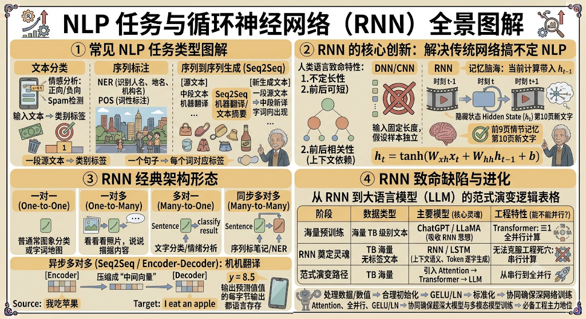
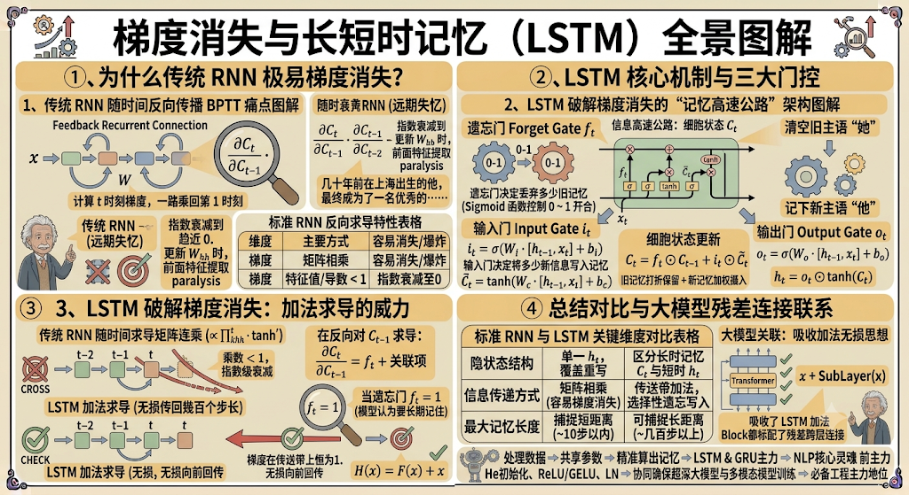
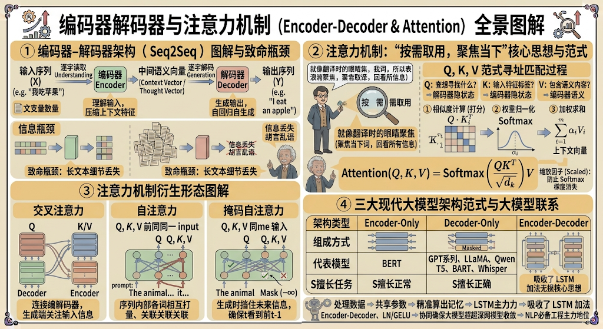

> 📌 **[AI 大模型与云原生全栈知识库](./README.md)** / **模块三：人工智能与大模型理论基础**
> 🏠 [返回主页 README](./README.md) \| ⚡ [面试 30 分钟速记](./interview/00_面试冲刺30分钟速记卡片.md) \| 🎓 [本模块面试题](./interview/02_大模型与Transformer理论面试题.md)

---

# 大模型基础之机器学习总结（2）

## 一、神经网络

**神经网络本质上就是把多个线性回归/逻辑回归像“网一样叠在一起”构成的复合计算架构。**

如果把单个神经元看作一个简单的多元线性回归（加权求和 $z = WX + b$ + 激活函数），那么神经网络就是通过把这些神经元分层纵深堆叠，让模型具备处理极度复杂的非线性问题的能力。



### 神经网络的三层基本结构

任何神经网络都可以拆解为标准的三个部分：

- **输入层（Input Layer）**：
  - 数据的入口。负责接收特征数据（如房屋的年龄、里程、重量等，或者图片的像素值 $x_1, x_2, \dots, x_n$）。
- **隐藏层（Hidden Layers）**：
  - 神经网络的“思维大脑”。可以有一层或几十上百层（多层就叫“深度学习”）。
  - 数据在这里被一层层提取特征。第一层隐藏层可能提取简单的边缘信息，第二层提取局部轮廓，最后一层提取完整概念。每一层节点都拿着自己的权重矩阵 $W$ 对上一层的输出进行转换。
- **输出层（Output Layer）**：
  - 给出最终预测结果的地方。
  - 如果是回归任务（预测房价），输出就是一个连续数值 $y$；
  - 如果是分类任务（识别猫/狗/鸟），输出层就会接上你之前学的 **Softmax** 或 **Sigmoid**，输出各个类别的概率。

## 二、回归神经网络和反向传播

**递归/循环神经网络（RNN）** 和 **反向传播的链式求导** 是深度学习处理动态数据（如文本、序列）和进行模型训练时最核心的两个概念。

### 1、 循环神经网络（RNN，Recurrent Neural Network）

常见的普通神经网络（前馈神经网络）是没有“记忆”的，输入什么就处理什么，前后两次输入之间完全独立。但现实生活中很多数据是**有先后顺序的序列数据**（比如语言、音频、股票走势）。



#### 核心思想：给神经网络装上“记忆脑海”

循环神经网络通过在结构中增加一个**循环反馈边（Recurrent Connection）**，让网络不仅能接收当前的输入 $X_t$，还能**记住上一时刻的隐藏状态 $h_{t-1}$**。

- **直观比喻（看电影与读小说）**：

  - **普通神经网络**：像看单张照片，每张照片独立判断。
  - **RNN**：像看连续的电影或读一本书。你在看第 10 页时，脑子里还留着前 9 页的情节（$h_{t-1}$）。第 10 页的理解，是由“前 9 页的记忆 + 第 10 页的新文字”共同决定的。

- **公式表达**：

  在 $t$ 时刻的记忆/隐藏状态 $h_t$ 计算方式为：

  $$h_t = \text{Activation}(W_{hh} h_{t-1} + W_{xh} x_t + b)$$

  - $x_t$：当前时刻的输入（例如当前读到的词）。
  - $h_{t-1}$：上一个时刻留存下来的记忆。
  - $W_{hh}, W_{xh}$：共享的权重参数。

> **注意辨析**：工业界常说的“回归神经网络”如果在序列模型上下文中，通常指的是 **Recurrent Neural Network（循环神经网络）**；如果是指输出连续数值的神经网络，则属于“回归任务（Regression Task）”。在大模型（LLM）的 Transformer 架构诞生前，RNN 及其变体（LSTM、GRU）是处理自然语言处理（NLP）的绝对主力。

### 2、反向传播中的链式求导（Chain Rule in Backpropagation）

在深度学习中，神经网络往往由几层甚至几百层复合函数叠在一起组成。要通过梯度下降来更新第一层或中间某一层神经元的权重 $w$，必须计算**总误差 Loss 对该权重 $w$ 的偏导数（$\frac{\partial \text{Loss}}{\partial w}$）**。



#### 核心问题：层数太深，中间隔着好多层，怎么求导？

微积分里的**链式法则（Chain Rule）** 就是解决“复合函数求导”的钥匙。

#### 核心思想：多级责任分配（“剥洋葱”/“流水线追责”）

假设一个简单的三层复合计算过程：

输入 $x \rightarrow$ 第一层算出 $u = f(x) \rightarrow$ 第二层算出 $y = g(u) \rightarrow$ 最后一层算出 $\text{Loss} = L(y)$。

如果你想知道最前面的 $x$（或权重 $w$）对最后的 Loss 有多大影响，不能一步到位，必须从后往前**一层一层乘过去**：

$$\frac{\partial \text{Loss}}{\partial x} = \frac{\partial \text{Loss}}{\partial y} \times \frac{\partial y}{\partial u} \times \frac{\partial u}{\partial x}$$

#### 直观比喻（公司产品质量追责）

假设某工厂生产手机，最终产品不合格导致公司亏损了 100 万（$\text{Loss}$）：

1. **最后一层（总检部）**：算出亏损主要是因为“手机屏幕花屏”（$\frac{\partial \text{Loss}}{\partial \text{屏幕质量}}$）。
2. **中间层（屏幕组装线）**：算出屏幕花屏是因为“外围胶水粘合不良”（$\frac{\partial \text{屏幕质量}}{\partial \text{胶水质量}}$）。
3. **第一层（原材料采购部）**：算出胶水不良是因为“采购了廉价胶水”（$\frac{\partial \text{胶水质量}}{\partial \text{采购参数}}$）。

**链式求导的过程**，就是把这三级的责任相乘（$\text{总亏损对采购参数的责任} = \text{第一级} \times \text{第二级} \times \text{第三级}$）。

在神经网络的反向传播（Backpropagation）中：

- 算法从输出层的 Loss 开始，**从后往前**一层一层计算每一层的偏导数；
- 通过链式法则**把各层的局部偏导数连乘起来**；
- 最终高效精准地算出网络中每一个权重 $w$ 对应的梯度，完成参数更新。

## 三、梯度消失

**梯度消失（Gradient Vanishing）** 和 **梯度爆炸（Gradient Exploding）** 是深度神经网络（尤其是网络层数变深时）在反向传播训练过程中最常见的两大数值衰减/暴涨痛点。



### 1、为什么靠近输入层（浅层）更容易梯度消失？

反向传播是通过微积分的**链式法则**从输出层（后方）往输入层（前方）**倒着计算梯度**的。

假设网络有 $L$ 层，求最靠近输入层（第一层）的权重 $w_1$ 的梯度时，公式需要将后方所有层的局部导数相乘：

$$\frac{\partial \text{Loss}}{\partial w_1} = \frac{\partial \text{Loss}}{\partial h_L} \times \frac{\partial h_L}{\partial h_{L-1}} \times \dots \times \frac{\partial h_2}{\partial h_1} \times \frac{\partial h_1}{\partial w_1}$$

- **输出层（靠近 Loss）**：只乘了 1~2 个导数项，梯度正常，能够正常更新。
- **输入层（靠近输入 $X$）**：中间隔了几十甚至上百层，**需要连乘几十个小于 1 的小数**。
- **结果**：越往套路前面的层传，连乘项越多，算出来的梯度就会以指数级衰减到极趋近于 $0$。导致靠近输入层的权重 $w_1$ 几乎分不到责任、停止更新，前面几层的特征提取网络彻底“瘫痪”。

### 2、梯度消失的三个主要方面（诱因）

梯度消失主要由以下三个因素叠加导致：

- **激活函数饱和（主要原因）**：

  传统的激活函数如 Sigmoid，其导数公式为 $f'(x) = f(x)(1 - f(x))$，导数最大值只有 **$0.25$**。如果输入值极大或极小（进入两侧平坦的饱和区），导数甚至直接逼近 $0$。连乘一堆小于 $0.25$ 的数字，梯度会迅速归零。

- **网络层数太深（结构原因）**：

  随着神经网络层数增加（例如从 3 层变成 100 层），链式法则连乘的项数剧增，放大了一小于 1 的导数连乘效应。

- **权重初始化不当（数值原因）**：

  如果初始化的权重矩阵 $W$ 数值被设置得过小（绝对值远小于 1），在层层矩阵相乘的过程中，也会将传过来的梯度信号拉低至 0。

### 3、ReLU 激活函数是如何解决梯度消失的？

为了解决 Sigmoid 等函数的梯度消失问题，研究者引入了 **ReLU（Rectified Linear Unit，修正线性单元）**。

$$\text{ReLU}(x) = \max(0, x)$$

- **导数特性**：

  - 当 $x > 0$ 时，$\text{ReLU}'(x) = \mathbf{1}$（恒等于 1）；
  - 当 $x \le 0$ 时，$\text{ReLU}'(x) = 0$。

- **解决逻辑**：

  只要神经元处于激活状态（输入大于 0），它的导数就永远是 **1**。在反向传播进行链式连乘时，乘以一连串的 $1$ **不会造成梯度的指数级衰减**，从而完美解决了正半轴上的梯度消失问题，使得超深网络（如 ResNet、Transformer）的训练成为可能。

> **补充小缺陷（Dying ReLU）**：当输入 $x \le 0$ 时导数为 0，如果某个神经元不幸长期处于负数区，它就会彻底“死亡”不再更新。工业界因此衍生出了 LeakyReLU、GELU（大模型中最常用）等变体。

### 4、什么是梯度爆炸？

梯度爆炸与梯度消失正好相反。

- **现象**：在反向传播链式连乘时，如果各层的导数或权重矩阵数值较大（绝对值大于 1，例如乘以一连串 1.5），连乘几百次后，梯度会呈现**指数级暴增**。
- **后果**：算出来的梯度变成巨大的数值甚至 `NaN`（内存溢出）。在更新参数时（$W_{\text{新}} = W_{\text{旧}} - \alpha \times \text{梯度}$），导致权重一瞬间被推到一个极大的离谱数值，模型训练直接崩溃震荡，无法收敛。
- **常见解决方案**：
  1. **梯度裁剪（Gradient Clipping）**：给梯度设置一个上限门槛（比如 1.0），一旦超过强制截断。
  2. **合理的权重初始化**：如 He 初始化、Xavier 初始化，保证权重既不过大也不过小。
  3. **归一化层**：如 Batch Normalization、Layer Normalization（大模型标准配置），强行把每层输入拉回合理数值区间。
  4. **残差连接（ResNet / Transformer 跳接）**：通过快捷相加通路，让梯度可以直接无损传回浅层。

## 四、激活函数、批量归一化、参数初始化

在大模型与深度学习中，**激活函数**、**批量归一化（Batch Normalization）** 以及 **参数初始化** 是保证超深网络能够正常训练、防止梯度消失/爆炸的关键工程组件。



### 1、激活函数（Activation Function）

激活函数的主要作用是引入**非线性表达能力**。如果没有激活函数，再深的神经网络也只是一个大型的多元线性回归，无法拟合现实世界中的复杂曲线。

- **常用激活函数对比**：
  - **Sigmoid**：将数值映射到 $(0, 1)$，常用于二分类输出层。缺点是在两端容易**饱和**导致梯度消失，且均值非 0。
  - **Tanh**：将数值映射到 $(-1, 1)$，解决了零中心化问题，但两端依然会发生饱和导致梯度消失。
  - **ReLU**：$\max(0, x)$，计算速度极快，正半轴导数恒为 1，极大缓解了梯度消失；缺点是负半轴导数为 0，容易导致“神经元死亡（Dying ReLU）”。
  - **LeakyReLU / PReLU**：为了解决 ReLU 负半轴死亡问题，在 $x < 0$ 时赋予一个极小的斜率（如 $0.01x$）。
  - **GELU（高斯误差线性单元）**：引入了概率分布思想，在 0 点附近拥有平滑的曲线（即你提到的“软引入”或平滑过渡特性，避免了像 ReLU 那样在 0 点处硬拐弯）。**GELU 是目前 Transformer 和主流大模型（如 GPT、BERT、LLaMA 等）中最核心的激活函数之一**。

### 2、批量归一化（Batch Normalization, BN）

**批量归一化**的本质是：在网络传输的中间层，**把同一个 Batch（批次）内的数据在同一个特征维度上强行拉回到“均值为 0、方差为 1”的分布区间**，防止数据分布在层层传递中剧烈偏移（即内部协变量偏移 Internal Covariate Shift）。

#### 理解你描述的归一化过程：

> **“三行数据四种维度，取出三行数据的一种维度，做归一化，把归一化的数据放到之前的维度数据中”**

你的描述完全精准地还原了 **Batch Normalization（BN）** 的运算逻辑：

1. **数据形态**：假设一个小批次（Batch）有 3 条样本（三行数据），每个样本包含 4 个特征维度（四列维度），即形状为 $(N=3, D=4)$ 的矩阵。
2. **按列提维**：BN 并不是针对某一条样本做归一化，而是跨样本（纵向）提维。比如抽出所有 3 条样本的“第 1 个维度”（共 3 个数值）。
3. **计算均值与方差**：计算这 3 个数值的均值 $\mu_1$ 和方差 $\sigma_1^2$。
4. **标准化与缩放还原**：
   - 公式：$\hat{x} = \frac{x - \mu_1}{\sqrt{\sigma_1^2 + \epsilon}}$
   - 接着乘上可学习的参数 $\gamma$ 和 $\beta$ 进行线性还原：$y = \gamma \hat{x} + \beta$。
5. **填回原矩阵**：把归一化后的这 3 个新数值放回原矩阵的“第 1 个维度”位置。对剩下 3 个维度重复上述操作。

*(注：大模型通常采用 **Layer Normalization (LN)**，与 BN 纵向跨样本提维不同，LN 是**横向跨特征维度**提维，即对单条样本内部的所有特征维度求均值和方差，以适应不定长的序列数据。)*

### 3、参数初始化（Parameter Initialization）

如果在训练前把网络里的所有权重 $W$ 全部初始化为全 0 或同一个常数，会导致所有神经元正向传播和反向传播的计算完全相同，陷入“对称性断裂失效”。因此必须打破对称性，进行合理的随机初始化。

- **全 0 初始化（不可行）**：所有神经元学到一模一样的特征，网络退化。

- **随机小正态分布（简单的随机）**：如果设置过大，会导致梯度爆炸；设置过小，深层网络数据会缩到 0，导致梯度消失。

- **Xavier / Glorot 初始化（适用于 Sigmoid / Tanh）**：

  根据输入节点数 $n_{\text{in}}$ 和输出节点数 $n_{\text{out}}$ 动态调整方差，保持正反向传播时信号的方差一致：

  $$\text{Var}(W) = \frac{2}{n_{\text{in}} + n_{\text{out}}}$$

- **He / Kaiming 初始化（专门针对 ReLU 系列）**：

  由于 ReLU 会把一半的负数置为 0（方差折半），Kaiming 初始化在 Xavier 的基础上把方差放大了一倍，使得在经过 ReLU 激活后，数据方差依然能稳定传递：

  $$\text{Var}(W) = \frac{2}{n_{\text{in}}}$$

## 五、图像识别和卷积神经网络

**卷积神经网络（CNN，Convolutional Neural Network）\**是专门针对图像、视频等二维/三维网格结构数据设计的深度学习架构。相比于传统全连接神经网络，它通过\**局部感受野**和**权重共享**两大特性，大幅减少了参数量，并具备了对平移不敏感的图像特征提取能力。



### 1、 卷积神经网络的常见顺序

一个经典的 CNN 模型（如 LeNet、AlexNet）数据流动顺序通常为：

$$\text{输入图像} \rightarrow [\text{卷积层} \rightarrow \text{激活函数} \rightarrow \text{池化层}] \times N \rightarrow \text{扁平化 (Flatten)} \rightarrow \text{全连接层} \rightarrow \text{输出层}$$

- **前段（特征提取段）**：反复交替使用“卷积 + 激活 + 池化”，层层提取从边缘、纹理到局部器官等抽象特征。
- **后段（决策分类段）**：将提取出的三维特征图展平为一维向量，传入全连接层做最终的分类或回归判定。

### 2、核心组件解析：卷积、池化与全连接

- **卷积层（Convolution Layer）**：
  - **干了什么**：拿着一个小矩阵（卷积核）在输入图像上做滑动窗口加权求和计算。
  - **作用**：提取图像的局部特征（如横线、竖线、特定拐角等）。
- **激活函数（Activation Function，如 ReLU）**：
  - **干了什么**：对卷积输出的特征图进行非线性映射（如 $\max(0, x)$）。
  - **作用**：赋予网络拟合复杂非线性特征的能力。
- **池化层（Pooling Layer，如 Max Pooling / Avg Pooling）**：
  - **干了什么**：在特征图上按区域（如 $2 \times 2$）下采样，只保留最大值或平均值。
  - **作用**：降维减小数据量、防止过拟合，并增强模型对图像轻微平移、缩放的鲁棒性。
- **全连接层（Fully Connected Layer，FC）**：
  - **干了什么**：将前面提炼出的高阶特征进行全局组合打分。
  - **作用**：输出最终的概率（结合 Softmax）或连续预测数值。

### 3、什么是卷积核（Convolutional Kernel / Filter）？

卷积核本质上就是一个**带有参数的二维/三维小权重矩阵**（常见尺寸为 $3 \times 3$ 或 $5 \times 5$）。

- **原理**：卷积核上的数值就是可学习的权重 $W$。在正向传播时，它在输入特征图上像探照灯一样按指定步长（Stride）一步步滑动，把对应位置的像素值相乘后累加，再加上偏置 $b$，生成新的特征图（Feature Map）。
- **学习过程**：初始时卷积核里的参数是随机的。通过反向传播和梯度下降，卷积核会自动学习出不同的参数组合——有的卷积核学会了检测边缘，有的学会了检测圆弧，有的学会了检测色彩梯度。

### 4、关于 RGB 彩色图像的卷积核（多通道卷积）

彩色图像通常由 **R（红）、G（绿）、B（蓝）** 3 个通道（Channel）组成，输入数据的形状为 $(\text{高度 } H, \text{宽度 } W, \text{通道数 } C_{in} = 3)$。

关于 RGB 卷积核的处理规则，需要记住以下**三大金科玉律**：

1. **单个卷积核的深度必须等于输入的通道数**：

   对于 RGB 3 通道图像，**每一个卷积核本身也是 3 层的三维张量**（如尺寸为 $3 \times 3 \times 3$）。R、G、B 每个通道各自对应卷积核的一层切片，分别与该通道的图像做二维卷积后**加和在一起**，再加上偏置，最终只输出**一张单通道的二维特征图**。

2. **输出特征图的通道数取决于“卷积核的个数”**：

   如果你希望输出 32 个特征通道（即提取 32 种不同特征），你就需要使用 **32 个不同的 $3 \times 3 \times 3$ 卷积核**。

3. **计算公式总结**：

   假设输入形状为 $(H, W, C_{in})$，使用 $N$ 个尺寸为 $K \times K$ 的卷积核：

   - 每一个卷积核的形状：$K \times K \times C_{in}$
   - 卷积核的参数量：$K \times K \times C_{in} \times N + N$（偏置）
   - 卷积后的输出形状：$(H_{out}, W_{out}, N)$

## 六、经典CNN模型、残差网络

在卷积神经网络（CNN）的发展史上，为了解决网络加深带来的梯度消失、退化以及参数量过大等问题，学术界提出了许多里程碑式的经典架构。



### 1、经典 CNN 模型演进史

- **LeNet-5 (1998)**：
  - **地位**：CNN 的开山之作（由 Yann LeCun 提出），最初用于手写数字识别（MNIST）。
  - **结构**：`输入 -> 卷积 -> 池化 -> 卷积 -> 池化 -> 全连接 -> 输出`。
  - **贡献**：奠定了“卷积 + 下采样 + 全连接”的标准 CNN 结构范式。
- **AlexNet (2012)**：
  - **地位**：深度学习爆发的起点，夺得 ImageNet 冠军。
  - **创新点**：首次引入 **ReLU** 激活函数解决梯度消失；引入 **Dropout** 防止过拟合；利用 **GPU 硬件加速** 进行大型网络训练；使用重叠池化。
- **VGGNet (2014)**：
  - **地位**：探索网络极深维度的经典之作（常见 VGG16、VGG19）。
  - **核心思想**：**小卷积核替代大卷积核**。证明了用 2 个 $3 \times 3$ 卷积核级联，感受野等价于 1 个 $5 \times 5$ 卷积核，但参数量更少且增加了非线性表达能力。
- **GoogLeNet / Inception (2014)**：
  - **地位**：同期的 ImageNet 冠军，注重高效利用计算资源。
  - **核心思想**：提出 **Inception 模块**，在同一层并行使用 $1 \times 1$、$3 \times 3$、$5 \times 5$ 不同尺寸的卷积核，多尺度提取特征；同时大量使用 $1 \times 1$ 卷积进行**升降维压缩**，大幅降低了参数量。

### 2、革命性的残差网络（ResNet, 2015）

在 ResNet 出现前，人们发现网络并不是越深越好：当层数增加到一定程度（如 20 层增加到 56 层），训练集和测试集的误差都会**不降反升**。这并非过拟合，而是出现了**网络退化问题（Degradation Problem）**。

何恺明（Kaiming He）团队提出了 **ResNet（Residual Network）**，一举解决了超深网络的训练难题，斩获了当年的 ImageNet 冠军。

#### ① 残差连接（Residual Connection / Skip Connection）

传统网络试图让网络层直接学习目标映射函数 $H(x)$。而 ResNet 改变了思维方式：它让网络层去学习**残差（残余差值） $F(x) = H(x) - x$**。

$$\text{最终输出 } H(x) = F(x) + x$$

- **结构形式**：在普通卷积分支旁边，增加一条“跨层直连”的快捷通路（Identity Shortcut），直接把输入 $x$ 无损地加到卷积层的输出 $F(x)$ 上。
- **通俗比喻**：
  - **传统网络**：要求你从头学习画一张复杂的油画（直接学习 $H(x)$）。
  - **残差网络**：先给你一张原图的底稿（$x$），你只需要在上面修改补笔画出细节差值（学习 $F(x)$）。即便你的补笔毫无贡献（$F(x) = 0$），最次也能保留原图（$H(x) = x$），性能绝不倒退。

#### ② 残差网络为什么能解决梯度消失？

在反向传播求导时，残差结构 $H(x) = F(x) + x$ 对 $x$ 求导得到：

$$\frac{\partial H(x)}{\partial x} = \frac{\partial F(x)}{\partial x} + \mathbf{1}$$

注意公式里的 **$+1$**：

在链式法则层层相乘时，就算卷积分支 $\frac{\partial F(x)}{\partial x}$ 的梯度衰减到了 0（发生了梯度消失），**$+1$ 项依然能保证梯度能够无损、直接地沿着 Shortcut 快捷通道一路回传到最前方的浅层网络**。

这一突破使得网络的深度一举突破了 **100 层、甚至 1000 层**（如 ResNet-50, ResNet-101, ResNet-152）。

### 3、CNN 与当前大模型（LLM）的联系

虽然现在大语言模型（LLM）的主力架构是 **Transformer**，但 ResNet 留下的遗产无处不在：

1. **残差连接（Residual Connection）**：Transformer 的每个 Encoder/Decoder Block（如 Self-Attention 和 FFN 旁边）都标配了残差跨层连接（`LayerNorm(x + SubLayer(x))`），这是训练上百层大模型不崩盘的基础。
2. **多模态大模型（Vision-LLM）**：像 GPT-4V、Qwen-VL 等多模态大模型在处理图片输入时，前端依然普遍采用基于 CNN 或 Vision Transformer（吸收了残差思想）的视觉编码器（Vision Encoder）来提取图像特征。

## 七、NLP任务与循环神经网络

在深度学习的发展历程中，**自然语言处理（NLP）** 与 **循环神经网络（RNN）** 有着密不可分的联系。在 Transformer 架构大行其道之前，RNN 及其变体是处理文本、语音等序列数据的绝对霸主。



### 1、 常见的 NLP 任务类型

自然语言处理的本质是**将人类的文本语言转化为计算机可计算的数学向量，并进行特征提取与生成**。常见任务可以分为以下几类：

- **文本分类（Sequence Classification）**：
  - **输入**：一段文本。
  - **输出**：类别标签（如情感分析：正向/负向；垃圾邮件检测：是/否）。
- **序列标注（Sequence Labeling）**：
  - **输入**：一个句子（包含 $N$ 个词）。
  - **输出**：每个词对应的标签（如命名实体识别 NER：识别人名、地名、机构名；词性标注 POS）。
- **序列到序列生成（Seq2Seq）**：
  - **输入**：一段源文本。
  - **输出**：一段新生成的文本（如机器翻译、文本摘要、对话生成/问答）。

### 2、为什么传统网络搞不定 NLP？RNN 的核心创新

传统的全连接网络（DNN）和卷积神经网络（CNN）要求输入数据必须是固定长度的，且**假设输入样本之间是独立的**。

但人类语言有两个致命特性：

1. **不定长性**：句子可长可短。
2. **前后相关性（时序性）**：一个词的意思高度依赖于上下文（如“我吃苹果”和“苹果发布新手机”中的“苹果”）。

RNN 的核心创新在于**引入了隐藏状态（Hidden State，$h_t$）作为“记忆”**，在处理当前词 $x_t$ 时，会把上一时刻的记忆 $h_{t-1}$ 一起带入计算：

$$h_t = \text{tanh}(W_{xh} x_t + W_{hh} h_{t-1} + b)$$

### 3、RNN 在 NLP 中的经典架构形态

针对不同的 NLP 任务，RNN 可以灵活变换出多种输入输出形态：

- **一对一（One-to-One）**：普通图像分类或单词级别映射。
- **一对多（One-to-Many）**：看图说话（Image Captioning），输入一张图片，生成一句描述文本。
- **多对一（Many-to-One）**：文本分类/情感分析，读完一整句文本，最后输出一个分类结果。
- **同步多对多（Many-to-Many）**：序列标注/NER，输入 $N$ 个词，每个词实时输出对应的标签。
- **异步多对多（Seq2Seq / Encoder-Decoder）**：**机器翻译的核心范式**。
  - **编码器（Encoder）**：RNN 把输入的源语言句子（如中文）逐字读取，最终压缩成一个包含全句语义的“中间向量”；
  - **解码器（Decoder）**：另一个 RNN 拿着这个“中间向量”，逐字解码生成目标语言（如英文）。

### 4、传统 RNN 的致命缺陷与进化（LSTM / GRU）

传统标准 RNN 在处理长文本时存在严重的问题：**随着句子变长，反向传播时会出现严重的“梯度消失”或“梯度爆炸”，导致它只能记住最近的几个词，发生“远期失忆”。**

为了解决长距离依赖问题，研究者提出了 RNN 的进化变体：

- **LSTM（长短期记忆网络，Long Short-Term Memory）**：
  - **核心创新**：引入了细胞状态（Cell State）作为信息高速公路，并设计了三个“门”控结构来精确控制记忆：
    - **遗忘门（Forget Gate）**：决定丢弃上一时刻的哪些旧记忆。
    - **输入门（Input Gate）**：决定把当前时刻的哪些新信息存入记忆。
    - **输出门（Output Gate）**：决定从记忆中提取哪些信息作为当前隐状态输出。
- **GRU（门控循环单元，Gated Recurrent Unit）**：
  - **核心创新**：LSTM 的精简版。将遗忘门和输入门合并为**更新门（Update Gate）**，并结合**重置门（Reset Gate）**。参数量更少，计算速度更快，效果与 LSTM 相当。

### 5、从 RNN 到 大模型（Transformer）的范式演变

虽然 RNN 系列（LSTM/GRU）完美解决了序列建模问题，但它有一个**无法被克服的工程死穴：串行计算（无法并行化）**。

由于 $h_t$ 的计算必须等待 $h_{t-1}$ 算完，计算机（特别是 GPU）无法同时并行处理一整句文本里的所有词，这导致在大规模数据上训练极其缓慢。

- **演变路径**：

  $$\text{RNN / LSTM} \xrightarrow{\text{引入 Attention 机制解决信息瓶颈}} \text{Transformer (完全抛弃 RNN，实现全并行计算)} \xrightarrow{\text{海量预训练}} \text{ChatGPT / LLaMA 等大语言模型 (LLM)}$$

今天的大模型（LLM）虽然不再使用 RNN 结构，但 RNN 奠定的 **Seq2Seq 思想**、**上下文语义依赖** 以及 **按 Token 逐字生成（自回归生成）** 的模式，依然是现代 AI 处理 NLP 任务的核心灵魂。

## 八、梯度消失、长短时记忆

在前文提及的序列模型（NLP）发展脉络中，**梯度消失**是传统 RNN 无法处理长文本的致命伤，而长短时记忆网络（LSTM）则是为此诞生的革命性架构。



### 1、为什么传统 RNN 极易出现“梯度消失”？

传统 RNN 在时间维度上的反向传播叫 **BPTT（Backpropagation Through Time，随时间反向传播）**。

在 BPTT 中，计算 $t$ 时刻的梯度要一路倒推乘回第 1 时刻。由于隐状态更新公式中包含权重矩阵 $W_{hh}$ 和激活函数（如 $\tanh$），梯度计算公式中会出现 **$W_{hh}^T$ 的连乘项**：

$$\text{梯度} \propto \prod_{k=1}^{t} W_{hh}^T \cdot \tanh'(\dots)$$

- **如果 $W_{hh}$ 特征值 $< 1$ 且 $\tanh$ 导数 $< 1$**：每向前倒推一步就要乘一个小于 1 的数。当句子长度超过 10~20 个词时，连乘几十次会导致**梯度以指数级迅速衰减至 0**。
- **直观后果（远期失忆）**：网络在更新参数时，前面的词分不到任何责任（梯度为 0）。例如处理句子 *“几十年前在上海出生的他，最终成为了一名优秀的……”*，网络走到句尾时，已经**彻底忘记了最前面的主语“他”**，无法正确预测后续词汇。

### 2、长短时记忆网络（LSTM）的核心工作机制

为了破解长距离梯度消失，LSTM 引入了专门负责长时记忆的 **细胞状态（Cell State，$C_t$）**，并通过 **3 个“门（Gates）”** 来精确控制信息的存取与遗忘。

Plaintext

```python
               ┌──────────────────────────────┐ (信息高速公路：细胞状态 C_t)
               │     [×]──────────────[+]     │
               │      │                │      │
               │  [遗忘门 f_t]    [输入门 i_t] │
               │      │                │      │
 输入 (x_t, h_t-1) ───┴────────────────┴──────┴──► 隐藏状态 h_t
```

#### ① 细胞状态（Cell State）：记忆的传送带 / 高速公路

细胞状态 $C_t$ 就像一条贯穿全过程的传送带。信息在这条线上流动时**只有少量的线性加减操作**，没有复杂的矩阵乘法，从而保证了信息可以长距离无损传输。

#### ② 三大门控机制（以 Sigmoid 函数控制 $0 \sim 1$ 开合度）

- **遗忘门（Forget Gate, $f_t$）**：**决定上一时刻的旧记忆要丢弃多少。**

  $$f_t = \sigma(W_f \cdot [h_{t-1}, x_t] + b_f)$$

  - *比喻*：清空脑海里的旧主语。若主语发生了切换，遗忘门会输出接近 $0$ 的值，擦除原有的旧记忆。

- **输入门（Input Gate, $i_t$）**：**决定当前的新信息要写入多少到记忆中。**

  $$i_t = \sigma(W_i \cdot [h_{t-1}, x_t] + b_i)$$

  $$\tilde{C}_t = \tanh(W_c \cdot [h_{t-1}, x_t] + b_c) \quad (\text{候选新记忆})$$

  - *比喻*：记下刚读到的新主语“他”。

- **细胞状态更新**：

  $$C_t = f_t \odot C_{t-1} + i_t \odot \tilde{C}_t$$

  - *旧记忆打折保留 + 新记忆加权摄入*，合成为当前时刻的最新长时记忆 $C_t$。

- **输出门（Output Gate, $o_t$）**：**决定从当前长时记忆中提取什么作为隐状态 $h_t$ 输出。**

  $$o_t = \sigma(W_o \cdot [h_{t-1}, x_t] + b_o)$$

  $$h_t = o_t \odot \tanh(C_t)$$

### 3、LSTM 为什么能战胜“梯度消失”？

LSTM 解决梯度消失的关键，在于其**细胞状态的加法更新机制**：

$$C_t = f_t \odot C_{t-1} + \text{新记忆项}$$

在反向传播对 $C_{t-1}$ 求偏导数时，计算公式为：

$$\frac{\partial C_t}{\partial C_{t-1}} = f_t + \text{其他关联项}$$

- **关键点**：传统 RNN 是**矩阵乘法（连乘）**，而 LSTM 是**加法求导**。
- 当遗忘门 $f_t = 1$ 时（即模型认为该信息需要长期记住），梯度在传送带上传播时**乘数恒为 1**。
- 这意味着梯度可以**无损地沿时间轴向前回传几百个步长**，完美消除了长距离传播中的指数级衰减。

### 总结对比

| **维度**         | **传统 RNN**                                                 | **长短时记忆网络（LSTM）**              |
| ---------------- | ------------------------------------------------------------ | --------------------------------------- |
| **隐状态结构**   | 单一隐状态 $h_t$，每次强行覆盖重写                           | 区分长时记忆 $C_t$ 与短时隐状态 $h_t$   |
| **信息传递方式** | 复杂的非线性矩阵相乘（容易梯度消失/爆炸）                    | 传送带加法传输，门控机制选择性遗忘/写入 |
| **最大记忆长度** | 仅能捕捉十几步以内的短期依赖                                 | 可有效捕捉几百步以上的长距离依赖        |
| **大模型关联**   | Transformer 中的**残差连接（$x + \text{SubLayer}(x)$）**吸收了 LSTM“加法无损传输”的核心思想 |                                         |

## 九、编码器解码器、注意力机制

**编码器-解码器架构（Encoder-Decoder）** 与 **注意力机制（Attention Mechanism）** 是现代自然语言处理（NLP）乃至整个大语言模型（LLM）的基石。它们彻底解决了传统序列模型处理长距离依赖和复杂翻译/生成任务时的瓶颈。



### 1、 编码器-解码器架构（Encoder-Decoder / Seq2Seq）

在现实中的许多 NLP 任务（如机器翻译、文本摘要、对话生成）中，**输入序列的长度和输出序列的长度通常是不相等的**。为了处理这种“不定长到不定长”的映射，研究者提出了编码器-解码器架构。

Plaintext

```python
输入序列 (X) ──► [ 编码器 Encoder ] ──► 中间语义向量 (Context Vector) ──► [ 解码器 Decoder ] ──► 输出序列 (Y)
```

- **编码器（Encoder）**：
  - **干了什么**：负责“理解”输入。它逐字读取输入序列 $X = (x_1, x_2, \dots, x_T)$，提取上下文特征，最终将整个输入序列压缩整理成一个固定长度的**中间语义向量（Context Vector / Thought Vector）**。
- **解码器（Decoder）**：
  - **干了什么**：负责“生成”输出。它拿这个中间语义向量作为初始依据，结合上一步自己生成的词，**自回归（Autoregressive）地**一步步预测并生成目标序列 $Y = (y_1, y_2, \dots, y_T)$。

#### 传统 Encoder-Decoder 的致命瓶颈（信息瓶颈）

在没有注意力机制之前，编码器必须把**一整段长文本（甚至几千字）的所有信息，硬生生压缩进一个固定维度的向量（比如 512 维）中**。

- **结果**：文本一旦变长，开头的很多细节信息就会在压缩过程中丢失，导致解码器生成时出现“信息丢失”和“胡言乱语”。

### 2、 注意力机制（Attention Mechanism）

为了突破固定中间向量带来的“信息瓶颈”，研究者提出了**注意力机制**（最初由 Bahdanau 等人在 2014 年提出）。

#### 核心思想：按需取用，聚焦当下

人类在翻译句子时，绝不会把整篇文章背下来再翻译，而是**看一句、译一句，翻译到哪个词，眼睛就盯在原文对应的几个词上**。

注意力机制打破了“固定中间向量”的限制：**允许解码器在生成每一个词时，动态地去回看编码器所有位置的信息，并给输入序列的不同位置分配不同的权重（注意力分数）。**

#### 核心公式与三要素（$Q, K, V$ 范式）

在深度学习与 Transformer 中，注意力机制被抽象为经典的 **Query（查询）、Key（键）、Value（值）** 寻址匹配过程：

1. **查询向量（Query, $Q$）**：我当前想寻找什么信息？（如解码器当前时刻的隐状态）。
2. **键向量（Key, $K$）**：输入序列各个位置的特征标签是什么？（如编码器各个位置的隐状态）。
3. **值向量（Value, $V$）**：输入序列各个位置包含的具体语义内容是什么？

计算分为三步：

1. **相似度计算（打分）**：计算 $Q$ 和各个 $K_i$ 的匹配程度（如点积 $Q \cdot K_i^T$）。
2. **权重归一化**：经过 **Softmax** 函数，将得分转化为加和等于 1 的**注意力权重（Attention Weights）** $\alpha_i$。
3. **加权求和**：用权重 $\alpha_i$ 对各个 $V_i$ 进行加权求和，得到当前时刻的动态上下文向量。

$$\text{Attention}(Q, K, V) = \text{Softmax}\left(\frac{QK^T}{\sqrt{d_k}}\right)V$$

> **公式中的 $\sqrt{d_k}$ 作用**：缩放因子（Scaled），防止维度 $d_k$ 很大时点积分数过大，导致 Softmax 梯度消失。

### 3、注意力机制的衍生形态

- **交叉注意力（Cross-Attention）**：

  $Q$ 来自解码器（Decoder），而 $K$ 和 $V$ 来自编码器（Encoder）。用于连接编解码器，让生成端关注输入端信息。

- **自注意力（Self-Attention）**：

  **$Q, K, V$ 全部来自于同一个输入序列自身**。

  - *作用*：让序列内部的各个词相互打量、计算关联度。例如在句子 *“The animal didn't cross the street because **it** was too tired.”* 中，Self-Attention 可以精准计算出代词 **“it”** 和前面的 **“animal”** 拥有极高的相关度权重。

- **掩码自注意力（Masked Self-Attention）**：

  在解码器自回归生成时使用。通过在注意力分数矩阵上加上一个上三角掩码（Mask，填为 $-\infty$），**强行挡住当前词后面的“未来信息”**，确保模型在预测第 $t$ 个词时，只能看到前 $t-1$ 个词。

### 4、三大现代大模型架构范式

基于编码器与解码器的不同组合，演化出了现代大模型的三大流派：

| **架构类型**                      | **组成方式**                                  | **代表模型**                        | **擅长任务**                                           |
| --------------------------------- | --------------------------------------------- | ----------------------------------- | ------------------------------------------------------ |
| **Encoder-Only**  *(仅编码器)*    | 只保留 Encoder  (双向注意力)                  | **BERT**                            | 文本理解、分类、实体识别、向量提取（Embeddings）       |
| **Decoder-Only**  *(仅解码器)*    | 只保留 Decoder  (单向掩码注意力)              | **GPT 系列、LLaMA、Qwen、DeepSeek** | **当前主流通用大模型**：自回归文本生成、对话、代码编写 |
| **Encoder-Decoder**  *(完整结构)* | Encoder + Decoder  (双向 + 单向 + 交叉注意力) | **T5、BART、Whisper**               | 强约束变换任务：机器翻译、文本摘要、语音识别           |

---
> 🏠 **[返回主页 README](./README.md)** \| ◀️ **上一篇：[11. 机器学习总结 (一)](./11%E5%A4%A7%E6%A8%A1%E5%9E%8B%E5%9F%BA%E7%A1%80%E4%B9%8B%E6%9C%BA%E5%99%A8%E5%AD%A6%E4%B9%A0%E6%80%BB%E7%BB%93.md)** \| ▶️ **下一篇：[13. Transformer 架构入门](./13Transformer%E6%9E%B6%E6%9E%84%E5%85%A5%E9%97%A8.md)** \| 🎓 **[进入本模块面试高频题](./interview/02_大模型与Transformer理论面试题.md)**
