> 📌 **[AI 大模型与云原生全栈知识库](./README.md)** / **模块三：人工智能与大模型理论基础**
> 🏠 [返回主页 README](./README.md) \| ⚡ [面试 30 分钟速记](./interview/00_面试冲刺30分钟速记卡片.md) \| 🎓 [本模块面试题](./interview/02_大模型与Transformer理论面试题.md)

---

# Transformer架构入门

## 一、整体把握Transformer结构

在 Transformer 问世之前，处理 NLP 任务的主流是 **RNN / LSTM**。但 RNN 有两个致命伤：

1. **无法并行计算**：必须算完 $t-1$ 时刻才能算 $t$ 时刻，训练极慢。
2. **长距离信息丢失**：即便有 LSTM，句子太长时前面的信息依然容易被稀释。

2017 年，Google 提出了 Transformer 架构（论文 *《Attention Is All You Need》*），彻底抛弃了 RNN 的循环结构，**完全基于自注意力机制（Self-Attention）**，实现了全句并行计算。

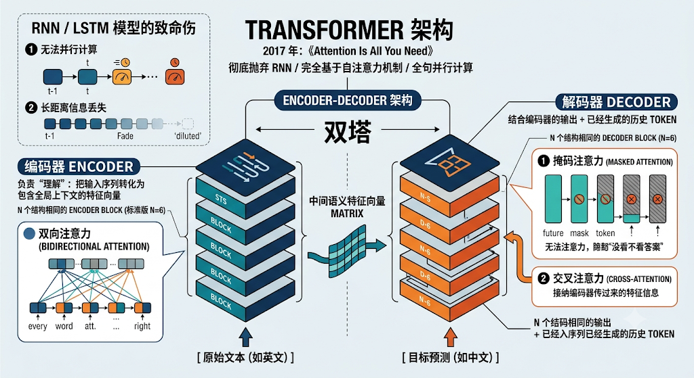

#### 1. 经典“双塔”结构：Encoder-Decoder

从宏观上看，Transformer 是一个标准的 **编码器-解码器（Encoder-Decoder）** 架构：

```python
       [ 原始文本 (如英文) ]
                 │
                 ▼
      ┌─────────────────────┐
      │   编码器 Encoder     │  ──► 负责“理解”：把输入序列转化为包含全局上下文的特征向量
      └─────────────────────┘
                 │
                 │ (中间语义特征向量 Matrix)
                 ▼
      ┌─────────────────────┐
      │   解码器 Decoder     │  ◄── 结合编码器的输出 + 已经生成的历史 Token
      └─────────────────────┘
                 │
                 ▼
       [ 目标预测 (如中文) ]
```

- **编码器（Encoder，左塔）**：
  - 由 $N$ 个结构相同的 **Encoder Block** 堆叠而成（标准版 $N=6$）。
  - **特点**：采用了**双向注意力（Bidirectional Attention）**，句子里的每一个词都能“同时看到”左边和右边所有的词。
- **解码器（Decoder，右塔）**：
  - 由 $N$ 个结构相同的 **Decoder Block** 堆叠而成（$N=6$）。
  - **特点**：采用了**掩码注意力（Masked Attention）**，在预测当前词时，强行遮挡未来的词，确保模型不能“偷看答案”。同时它还包含一个**交叉注意力（Cross-Attention）**，用于接纳编码器传过来的特征信息。

## 二、什么是语言模型

理解了 Transformer 的宏观结构，我们需要搞清楚它要解决的核心任务——**语言模型（Language Model, LM）**。

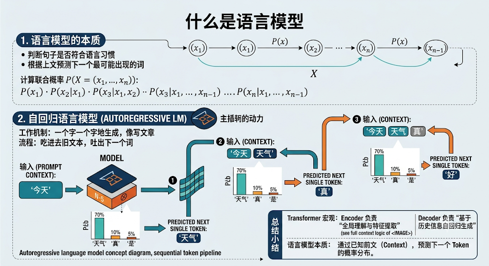

#### 1. 语言模型的本质

简单来说，语言模型的任务就是：**判断一个句子是否符合人类的语言习惯，或者根据上文预测下一个最可能出现的词。**

用数学公式表达，就是计算一个词序列 $X = (x_1, x_2, \dots, x_n)$ 发生的**联合概率** $P(X)$：

$$P(x_1, x_2, \dots, x_n) = P(x_1) \cdot P(x_2 \vert{} x_1) \cdot P(x_3 \vert{} x_1, x_2) \dots P(x_n \vert{} x_1, \dots, x_{n-1})$$

#### 2. 自回归语言模型（Autoregressive LM）

像现在的 **GPT 系列、LLaMA、DeepSeek**，它们本质上都是**自回归生成模型（Autoregressive Model）**：

- **工作机制**：就像我们写文章一样，**一个字一个字地往外接**。
- **流程**：输入“今天” $\rightarrow$ 预测“天气” $\rightarrow$ 把“今天天气”重新喂给模型 $\rightarrow$ 预测“真好”。

Plaintext

```python
输入: "今天"              ──► 预测: "天气"
输入: "今天 天气"         ──► 预测: "真"
输入: "今天 天气 真"      ──► 预测: "好"
```

这种“吃进去旧文本，吐出下一个词”的自回归特性，正是由 Transformer 的 **Decoder** 部分驱动的！

### 总结小结

1. **Transformer 宏观**：Encoder 负责“全局理解与特征提取”，Decoder 负责“基于历史信息自回归生成”。
2. **语言模型本质**：通过已知的前文（Context），预测下一个 Token 的概率分布。

## 三、理解Self Attention

我们将进入 Transformer 最灵魂的部分——**Self-Attention（自注意力机制）**。

一句话先总结它的核心使命：**让句子里的每一个 Token 都能跨越空间距离，主动去打量句子里的其他 Token，并计算出它们之间的关联度，从而为当前 Token 注入全局上下文语义。**

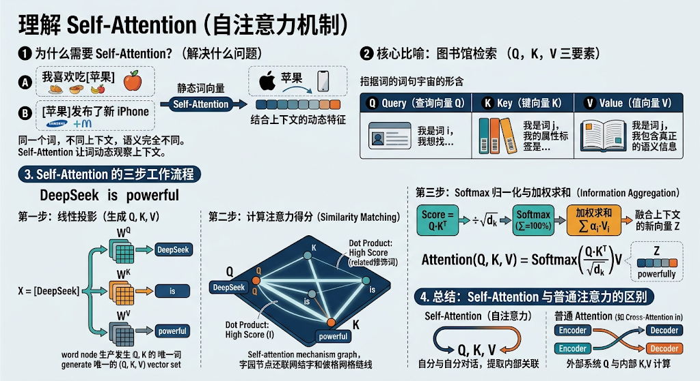

### 1. 为什么需要 Self-Attention？（解决什么问题）

在传统的词向量（Word Embedding）中，每一个词的向量是静止不变的。

比如 “苹果” 这个词：

- 在 “我喜欢吃苹果” 里，它是**水果**；
- 在 “苹果发布了新 iPhone” 里，它是**科技公司**。

如果只用固定的词向量，计算机无法区分这两种语义。而 Self-Attention 机制能够动态观察上下文：

- 当它处理 “苹果” 时，它发现后面有 “iPhone”，于是**把注意力分给 “iPhone”**，然后把 “科技公司” 的相关语义融入到 “苹果” 的新向量表示中。
- 这样，每一个词经过 Self-Attention 之后，都从一个**静态的词**变成了**结合了全句上下文的动态特征**。

### 2. 核心比喻：图书馆检索（$Q, K, V$ 三要素）

理解 Self-Attention 的关键，在于理解 **Query（查询向量 $Q$）、Key（键向量 $K$）、Value（值向量 $V$）**。

我们可以把 Self-Attention 计算想象成你去**图书馆查资料**：

| **符号** | **英文全称** | **角色**    | **图书馆比喻**                  | **文本中的含义**                         |
| -------- | ------------ | ----------- | ------------------------------- | ---------------------------------------- |
| **$Q$**  | Query        | **查询**    | 你写在检索卡片上的**问题/需求** | “我是词 $i$，我想找能补充我语义的其他词” |
| **$K$**  | Key          | **键/索引** | 每一本书书脊上的**标签/主题词** | “我是词 $j$，我的属性和特征标签是这些”   |
| **$V$**  | Value        | **值/内容** | 书本里存储的**具体知识内容**    | “我是词 $j$，我包含的真正语义信息”       |

### 3. Self-Attention 的三步工作流程

假设我们有一个输入句子：“`DeepSeek is powerful`”。

#### 第一步：线性投影（生成 $Q, K, V$）

输入每个词的词向量 $X$（通过矩阵乘法，乘以三个独立的权重矩阵 $W^Q, W^K, W^V$），分别为每一个词生成属于它的 $Q, K, V$ 三个向量：

$$Q = X \cdot W^Q$$

$$K = X \cdot W^K$$

$$V = X \cdot W^V$$

> **为什么要用三个不同的矩阵？**
>
> 让同一个词在“去主动找别人（$Q$）”、“被别人查找（$K$）”以及“提供具体语义（$V$）”时扮演不同的角色，解耦特征表达。

#### 第二步：计算注意力得分（Similarity Matching）

拿当前词的 **Query ($Q$)**，去和句子中**所有词的 Key ($K$)** 做点积（Dot Product）：

$$\text{Score} = Q \cdot K^T$$

- **点积的几何意义**：两个向量方向越一致，点积越大，说明**相关性越高**。
- 比如计算 “`DeepSeek`” 的 $Q$ 与 “`powerful`” 的 $K$ 的点积，得到的分数很高，说明 “`powerful`” 是修饰 “`DeepSeek`” 的关键词。

#### 第三步：Softmax 归一化与加权求和（Information Aggregation）

把计算出的得分转化成概率，并把所有词的 **Value ($V$)** 按概率融合在一起：

1. **除以缩放因子 $\sqrt{d_k}$**：防止点积结果过大导致 Softmax 梯度消失。
2. **Softmax 归一化**：将得分转化为加和为 100% 的注意力权重（$\alpha$）。
3. **加权求和**：用权重 $\alpha$ 去乘各自的 $V$，最后加在一起，得到融合了上下文的新向量 $Z$。

数学公式即为 Transformer 论文中最经典的方程：

$$\text{Attention}(Q, K, V) = \text{Softmax}\left(\frac{Q K^T}{\sqrt{d_k}}\right) V$$

### 4. 总结：Self-Attention 与普通注意力的区别

- **普通 Attention（Cross-Attention）**：$Q$ 来自外部（比如 Decoder），$K$ 和 $V$ 来自另一端（比如 Encoder）。
- **Self-Attention（自注意力）**：$Q, K, V$ **全部来自于同一个输入句子自身**。它实现了“自己与自己对话，自己提取自己内部的关联”。

## 四、Token Embedding

在了解了 Self-Attention 的原理之后，我们要回答一个更底层的工程问题：**计算机本质上只认识数字，它是如何把人类的文本“文字”，转化成能够喂给 Self-Attention 计算的向量矩阵的？**

这就需要用到 **Token Embedding（词嵌入 / 标记向量化）**。

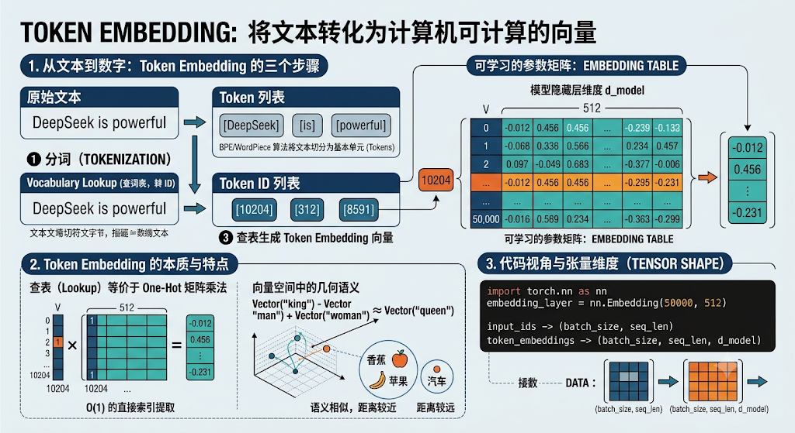

### 1. 从文本到数字：Token Embedding 的三个步骤

将一段文本转化为网络能处理的张量，需要经过以下三个核心步骤：

Plaintext

```python
原始文本: "DeepSeek is powerful"
    │
    ▼ 1. Tokenization (分词)
Token 列表: ["DeepSeek", "is", "powerful"]
    │
    ▼ 2. Vocabulary Lookup (查词表，转 Index)
Token ID 列表: [10204, 312, 8591]
    │
    ▼ 3. Embedding Matrix (查嵌入矩阵)
张量 Matrix: shape 为 (3, d_model) 的连续浮点数向量
```

#### ① 分词（Tokenization）

- 文本首先会被**分词器（Tokenizer）** 切分成一个个小的单元，称为 **Token**。
- Token 不一定是一个完整的单词，在现代大模型（如 BPE、WordPiece 算法）中，它可能是单词、词根，甚至是单个字符或字节（例如：`unbelievable` 会被切分为 `un` + `believ` + `able`）。

#### ② 映射为 Token ID（词表索引）

- 模型内部维护着一张巨大的静态词表（**Vocabulary**，比如包含 50,000 或 100,000 个 Token）。
- 分词器会把每个 Token 映射为词表里对应的**唯一整数 ID**（例如："DeepSeek" $\rightarrow$ 10204）。此时数据变成了形状为 `(seq_len,)` 的一维整数数组。

#### ③ 查表生成 Token Embedding 向量

- 离散的整数 ID 是无法做梯度下降和几何距离计算的，因此需要映射到一个高维连续向量空间。

- 模型内部有一个可学习的参数矩阵 **Embedding Table**，形状为：

  $$\text{Embedding Table Shape} = (V, d_{\text{model}})$$

  - $V$：词表大小（Vocabulary Size，如 50,000）。
  - $d_{\text{model}}$：模型的隐藏层维度（Hidden Dimension，如 Transformer base 是 512，LLaMA 等大模型是 4096 或更高）。

- **查表（Lookup）**：输入索引 ID，直接从 Embedding Table 里**抽出第 ID 行的那个 $d_{\text{model}}$ 维向量**。

### 2. Token Embedding 的本质与特点

1. **查表（Lookup）本质上等价于 One-Hot 矩阵乘法**：

   虽然代码实现上是 $O(1)$ 的直接索引提取，但数学上它等价于用一个高维的 One-Hot 向量去乘以 Embedding 矩阵。

2. **向量空间中的几何语义**：

   在初始状态下，Embedding Table 里的数值是随机初始化的。但经过海量文本训练后，Embedding 矩阵会学会将语义相似的词拉近：

   - $\text{Vector("king")} - \text{Vector("man")} + \text{Vector("woman")} \approx \text{Vector("queen")}$
   - “苹果” 和 “香蕉” 在向量空间中的距离会远远小于 “苹果” 和 “汽车”。

### 3. 代码视角与张量维度（Tensor Shape）

在 PyTorch 中，实现 Token Embedding 只需要一行代码：

```python
import torch
import torch.nn as nn

# 假设词表大小为 50000，模型维度为 512
vocab_size = 50000
d_model = 512

# 定义 Embedding 层
embedding_layer = nn.Embedding(num_embeddings=vocab_size, embedding_dim=d_model)

# 假设输入一个 Batch 的文本（Batch Size = 2，句子长度 Seq Len = 3）
# 输入是整数类型的 Token ID
input_ids = torch.tensor([
    [10204, 312, 8591],  # 句子 1: "DeepSeek is powerful"
    [ 2004, 512,  991]   # 句子 2
]) # Shape: (2, 3) -> (batch_size, seq_len)

# 前向传播得到 Token Embeddings
token_embeddings = embedding_layer(input_ids)

print("输出形状:", token_embeddings.shape)
# 输出形状: torch.Size([2, 3, 512]) -> (batch_size, seq_len, d_model)
```

### 总结与递进

- **输入**：`shape = (batch_size, seq_len)` 的整数 ID 矩阵。
- **输出**：`shape = (batch_size, seq_len, d_model)` 的高维浮点数特征矩阵。

**思考一个问题**：

此时得到的 `token_embeddings` 矩阵里，`"DeepSeek"` 无论是在句子的第 1 个位置，还是在第 100 个位置，它查出来的 Embedding 向量是**完全一模一样**的（因为 Embedding Table 是静态查表）。

为了让模型知道每个词在句子中的**前后顺序关系**，我们就必须引入下一个章节：**“五、Positional Encoding 位置编码”**！

## 五、Positional Encoding 位置编码

在上一节中我们提到，静态查表得到的 **Token Embedding** 只代表词本身的语义。无论一个词在句首还是句尾，查出来的向量都是一模一样的。

而 Transformer 的 Self-Attention 机制是**完全并行**计算的（不像 RNN 那样按顺序一个字一个字读入），它默认把句子看作一个**没有顺序的词集合（Bag of Words）**。

为了让模型能够感知词与词之间的**前后位置关系**，我们必须把“位置信息”强行注入到向量中，这就是 **Positional Encoding（位置编码）**。

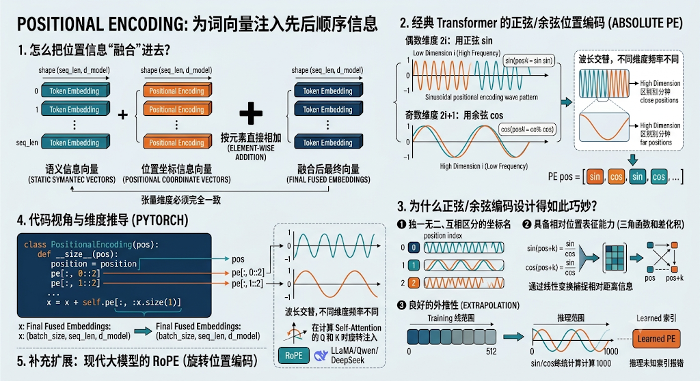

### 1. 怎么把位置信息“融合”进去？

Transformer 采用了极度简单粗暴但有效的方法：**直接相加（Element-wise Addition）**。

$$\text{Final Embedding} = \text{Token Embedding} + \text{Positional Encoding}$$

- **张量维度对齐**：Positional Encoding 矩阵的形状必须与 Token Embedding 矩阵完全一致，都是 `(seq_len, d_model)`。
- **物理意义**：把带有语义信息的向量（Token Embedding）与带有位置坐标信息的向量（Positional Encoding）在同一个高维空间中进行**线性叠加**。

### 2. 经典 Transformer 的正弦/余弦位置编码（Absolute PE）

在 2017 年的原版 Transformer 论文中，作者提出了基于**正弦（Sin）和余弦（Cos）函数**的绝对位置编码公式：

$$\text{PE}_{(pos, 2i)} = \sin\left(\frac{pos}{10000^{2i / d_{\text{model}}}}\right)$$

$$\text{PE}_{(pos, 2i+1)} = \cos\left(\frac{pos}{10000^{2i / d_{\text{model}}}}\right)$$

其中：

- $pos$：词在句子中的绝对位置（例如第 0 个词、第 1 个词...）。
- $i$：向量内部维度的索引（从 $0$ 到 $d_{\text{model}}/2$）。
- $2i$ 表示偶数维度用正弦 $\sin$， $2i+1$ 表示奇数维度用余弦 $\cos$。

### 3. 为什么正弦/余弦编码设计得如此巧妙？

#### ① 波长交替，不同维度频率不同

- 在高维向量中，低维度位置（$i$ 小）对应波长极短的高频正弦波（敏感感知相对较近的距离）；
- 高维度位置（$i$ 大）对应波长极长的低频正弦波（感知长距离跨度）。
- 这样，每一个位置 $pos$ 都会得到一个**独一无二、互相区分的坐标签名向量**。

#### ② 具备相对位置表征能力（三角函数和差化积）

根据高中数学公式：

$$\sin(\alpha + \beta) = \sin\alpha \cos\beta + \cos\alpha \sin\beta$$

这意味对于固定距离 $k$ 的两个位置 $pos$ 和 $pos + k$，**位置 $pos+k$ 的编码向量，可以表示为位置 $pos$ 编码向量的线性变换**。模型通过矩阵乘法，能够非常自然地捕捉到“词 A 与 词 B 相对相隔了 $k$ 个词”这种相对距离信息。

#### ③ 良好的外推性（Extrapolation）

由于正弦/余弦是周期函数，就算训练时句长最长只有 512，在推理时遇到长度为 1000 的句子，公式依然能无缝计算出第 1000 个位置的坐标向量，不会像可学习位置编码（Learned PE）那样遇到未见过的 pos 索引就报错。

### 4. 代码视角与维度推导 (PyTorch)

```python
import torch
import torch.nn as nn
import math

class PositionalEncoding(nn.Module):
    def __init__(self, d_model: int, max_len: int = 5000):
        super().__init__()
        
        # 初始化一个 (max_len, d_model) 的全 0 矩阵
        pe = torch.zeros(max_len, d_model)
        
        # 生成位置索引列向量 pos: shape (max_len, 1)
        position = torch.arange(0, max_len, dtype=torch.float).unsqueeze(1)
        
        # 计算分母项 div_term: shape (d_model / 2,)
        div_term = torch.exp(torch.arange(0, d_model, 2).float() * (-math.log(10000.0) / d_model))
        
        # 偶数维度填 sin，奇数维度填 cos
        pe[:, 0::2] = torch.sin(position * div_term)
        pe[:, 1::2] = torch.cos(position * div_term)
        
        # 增加 Batch 维度: (1, max_len, d_model)，方便做广播相加
        pe = pe.unsqueeze(0)
        
        # 注册为 buffer（不参与梯度更新）
        self.register_buffer('pe', pe)

    def forward(self, x):
        # x shape: (batch_size, seq_len, d_model)
        # 加上对应长度的位置编码
        x = x + self.pe[:, :x.size(1)]
        return x
```

### 5. 补充扩展：现代大模型的 RoPE（旋转位置编码）

虽然原版 Transformer 用的是正弦/余弦绝对位置编码，但在现在的现代大模型（LLaMA、Qwen、DeepSeek 等）中，最主流的位置编码方案已经演变成了 **RoPE（Rotary Position Embedding，旋转位置编码）**。

- **RoPE 的核心点**：它不是在输入层简单相加，而是在计算 Self-Attention 的 $Q$ 和 $K$ 时，通过一个**旋转矩阵**直接将位置信息“旋转注入”到向量中。
- **优势**：完美地结合了绝对位置编码与相对位置编码的优势，具备极强的外推与长上下文扩展能力（如扩展到 32k/128k 上下文）。

### 总结小结

1. **解决问题**：补齐 Transformer 并行计算缺失的序列先后顺序信息。
2. **运算方式**：与 Token Embedding 做直接的**按元素相加**（`Token Embed + Pos Embed`）。
3. **输出形状**：依然保持为 `(batch_size, seq_len, d_model)`，随后正式喂入 **Self-Attention** 展开计算！

## 六、Self Attention计算

在完成 **Token Embedding** 与 **Positional Encoding** 的相加后，我们得到了一个融合了“静态语义”和“位置坐标”的最终输入张量 $X$。

本节我们将通过矩阵张量维度（Tensor Shape）推导，一步步拆解 **Self-Attention** 的具体计算全流程。

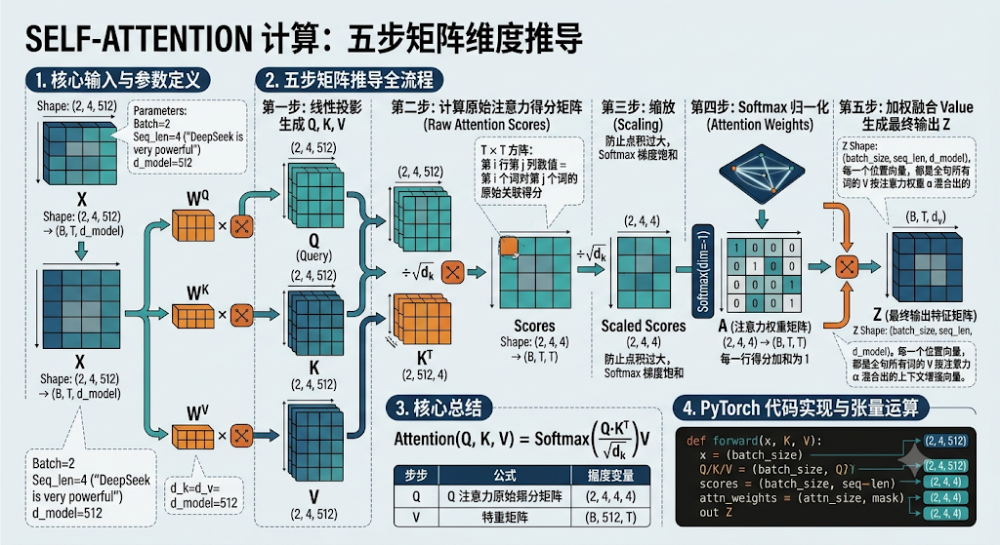

### 1. 核心输入与参数定义

假设我们处理的输入矩阵为 $X$：

- $X \in \mathbb{R}^{B \times T \times d_{\text{model}}}$
  - $B$ (batch_size)：批次大小（如 2）
  - $T$ (seq_len)：文本序列长度（如 4，假设句子为 `"DeepSeek is very powerful"`）
  - $d_{\text{model}}$：隐藏层特征维度（如 512）

我们需要三个**可学习的线性投影矩阵**：

- $W^Q \in \mathbb{R}^{d_{\text{model}} \times d_k}$

- $W^K \in \mathbb{R}^{d_{\text{model}} \times d_k}$

- $W^V \in \mathbb{R}^{d_{\text{model}} \times d_v}$

  *(注：通常 $d_k = d_v = d_{\text{model}}$，即 512)*

### 2. 五步矩阵推导全流程

#### 第一步：线性投影生成 $Q, K, V$

用输入矩阵 $X$ 分别乘以三个权重矩阵：

$$Q = X \cdot W^Q \quad \implies \text{Shape: } (B, T, d_k)$$

$$K = X \cdot W^K \quad \implies \text{Shape: } (B, T, d_k)$$

$$V = X \cdot W^V \quad \implies \text{Shape: } (B, T, d_v)$$

#### 第二步：计算原始注意力得分矩阵（Raw Attention Scores）

将 Query 矩阵 $Q$ 与 Key 矩阵 $K$ 的转置做矩阵乘法。由于需要对最后两个维度做乘法（$T \times d_k$ 乘以 $d_k \times T$）：

$$\text{Scores} = Q \cdot K^T \quad \implies \text{Shape: } (B, T, T)$$

- **维度 $(B, T, T)$ 的物理含义**：

  它是一个 $T \times T$ 的方阵。矩阵中第 $i$ 行第 $j$ 列的数值，代表**第 $i$ 个词对第 $j$ 个词的原始关联度得分**（比如 `"DeepSeek"` 对 `"powerful"` 的得分）。

#### 第三步：缩放（Scaling）

为了防止 $d_k$ 很大时，点积数值过大导致后续 Softmax 进人饱和区（梯度极小），将 Scores 除以 $\sqrt{d_k}$：

$$\text{Scaled Scores} = \frac{Q \cdot K^T}{\sqrt{d_k}} \quad \implies \text{Shape: } (B, T, T)$$

#### 第四步：Softmax 归一化（Attention Weights）

对 Scaled Scores 的最后一个维度（每一行）做 Softmax，使每一行所有词的得分加和为 1：

$$A = \text{Softmax}\left(\frac{Q \cdot K^T}{\sqrt{d_k}}\right) \quad \implies \text{Shape: } (B, T, T)$$

- 此时矩阵 $A$ 即为**注意力权重矩阵**，里面所有的数值均处于 $(0, 1)$ 之间。

#### 第五步：加权融合 Value 生成最终输出 $Z$

用注意力权重矩阵 $A$ 乘以 Value 矩阵 $V$：

$$Z = A \cdot V \quad \implies (B, T, T) \times (B, T, d_v) = \text{Shape: } (B, T, d_v)$$

- **最终输出 $Z$ 的 Shape**：`(batch_size, seq_len, d_model)`。
- 每一个位置的向量，都是全句所有词的 $V$ 按照注意力权重 $\alpha$ 混合出来的**上下文增强向量**。

### 3. 代码实现与张量计算 (PyTorch)

```python
import torch
import torch.nn as nn
import torch.nn.functional as F

class SingleHeadSelfAttention(nn.Module):
    def __init__(self, d_model: int):
        super().__init__()
        self.d_model = d_model
        self.d_k = d_model
        
        # 定义三个线性变换矩阵
        self.W_q = nn.Linear(d_model, d_model, bias=False)
        self.W_k = nn.Linear(d_model, d_model, bias=False)
        self.W_v = nn.Linear(d_model, d_model, bias=False)

    def forward(self, x):
        # x shape: (batch_size, seq_len, d_model)
        B, T, C = x.shape
        
        # 1. 线性投影生成 Q, K, V
        Q = self.W_q(x)  # (B, T, d_k)
        K = self.W_k(x)  # (B, T, d_k)
        V = self.W_v(x)  # (B, T, d_v)
        
        # 2. 计算 Scaled Dot-Product Scores
        # K.transpose(-2, -1) 将最后两个维度转置: (B, d_k, T)
        scores = torch.matmul(Q, K.transpose(-2, -1)) / (self.d_k ** 0.5)  # (B, T, T)
        
        # 3. Softmax 归一化
        attn_weights = F.softmax(scores, dim=-1)  # (B, T, T)
        
        # 4. 乘以 V 聚合语义
        Z = torch.matmul(attn_weights, V)  # (B, T, d_v)
        
        return Z, attn_weights

# 测试运算
x = torch.randn(2, 4, 512)  # Batch=2, Seq_len=4, d_model=512
attention_layer = SingleHeadSelfAttention(d_model=512)
out, weights = attention_layer(x)

print("输出 Z 形状:", out.shape)          # torch.Size([2, 4, 512])
print("权重 A 形状:", weights.shape)      # torch.Size([2, 4, 4])
```

### 4. 核心总结

$$\text{Attention}(Q, K, V) = \text{Softmax}\left(\frac{QK^T}{\sqrt{d_k}}\right)V$$

| **步骤**     | **矩阵公式**                                     | **维度变化 (Batch=2, Seq=4, d=512)** | **说明**               |
| ------------ | ------------------------------------------------ | ------------------------------------ | ---------------------- |
| **投影**     | $Q, K, V = XW^Q, XW^K, XW^V$                     | $(2, 4, 512)$                        | 解耦特征角色           |
| **打分**     | $\text{Scores} = Q \cdot K^T$                    | $(2, 4, 4)$                          | 计算两两词之间的相关度 |
| **缩放归一** | $A = \text{Softmax}(\text{Scores} / \sqrt{d_k})$ | $(2, 4, 4)$                          | 转化为概率分布         |
| **融合**     | $Z = A \cdot V$                                  | $(2, 4, 512)$                        | 输出强化后的特征矩阵   |

## 七、多头注意力

掌握了单头 Self-Attention 的推导后，理解多头注意力（Multi-Head Attention, MHA）就非常自然了。

如果说单头 Attention 是**让一个人去观察全句关系**，那么多头 Attention 就是**组成一个“专家观察团”，让多个头（Heads）同时从不同的子空间（Subspaces）去观察全句关系**。

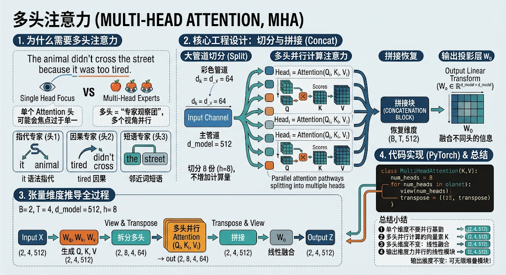

### 1. 为什么需要多头注意力（Multi-Head Attention）？

单个 Attention 头可能会面临“注意力焦点过于单一”的问题。

比如处理句子：“`The animal didn't cross the street because it was too tired.`”

- **头 1（指代专家）**：专注于计算 `it` 和 `animal` 之间的语法指代关系。
- **头 2（因果专家）**：专注于计算 `tired` 和 `didn't cross` 之间的因果逻辑关系。
- **头 3（位置/邻近专家）**：专注于捕获相邻词（如 `the` 和 `street`）之间的短语结构。

如果只有一个头，模型很难在同一个注意力矩阵里兼顾这么多维度的信息；而拆分成多个头后，**每个头可以在各自独立的子空间里自由学习不同角度的语义特征**。

### 2. 核心工程设计：切分与拼接（不增加额外计算量）

多头注意力最巧妙的工程设计在于：**它并没有暴增计算量，而是把原始维度 $d_{\text{model}}$ 切分成了 $h$ 份。**

假设：

- 模型维度 $d_{\text{model}} = 512$
- 头数 $h = 8$
- 每个头的维度 $d_k = d_v = d_{\text{model}} / h = 512 / 8 = 64$

#### 多头计算的四个步骤：

1. **线性投影生成大 $Q, K, V$**：

   与单头一样，先用 $X$ 生成形状为 `(B, T, 512)` 的 $Q, K, V$。

2. **维度重构与切分（Split Heads）**：

   将最后一个维度 $512$ 拆成 `8 x 64`，并调整张量顺序为 `(B, h, T, 64)`。

   - 此时相当于得到了 **8 个独立的 $Q, K, V$ 组**，每个组在自己的 `64` 维空间里并行做单头 Attention。

3. **8 个头并行计算注意力（Parallel Attention）**：

   对每个头独立执行：

   $$\text{head}_i = \text{Attention}(Q_i, K_i, V_i) \quad \implies \text{Shape: } (B, h, T, 64)$$

4. **拼接与最终投影（Concat & Linear）**：

   - **拼接（Concat）**：把 8 个头的输出在最后一个维度拼回去，形状恢复为 `(B, T, 512)`。

   - **输出线性变换（$W^O$）**：乘以一个最终的输出投影矩阵 $W^O \in \mathbb{R}^{d_{\text{model}} \times d_{\text{model}}}$，融合不同头的信息：

     $$\text{MultiHead}(Q, K, V) = \text{Concat}(\text{head}_1, \dots, \text{head}_h) \cdot W^O$$

### 3. 张量维度（Tensor Shape）推导全过程

以 $B=2, T=4, d_{\text{model}}=512, h=8$ 为例：

```python
输入 X: (2, 4, 512)
  │
  ├─► 1. 线性变换生成 Q, K, V ──────────────────────► (2, 4, 512)
  │
  ├─► 2. View & Transpose 拆分多头 ───────────────► (2, 8, 4, 64)
  │                                                      │
  │                                            (在 64 维空间并行算 QK^T/sqrt(dk)V)
  │                                                      │
  ├─► 3. 多头并行 Attention 计算结果 ─────────────► (2, 8, 4, 64)
  │
  ├─► 4. Transpose & View 拼接 8 个头 (Concat) ───► (2, 4, 512)
  │
  └─► 5. 乘以 W_o 线性层融合 ─────────────────────► (2, 4, 512)
```

### 4. 代码实现 (PyTorch)

```python
import torch
import torch.nn as nn
import torch.nn.functional as F

class MultiHeadAttention(nn.Module):
    def __init__(self, d_model: int, num_heads: int):
        super().__init__()
        assert d_model % num_heads == 0, "d_model 必须能被 num_heads 整除"
        
        self.d_model = d_model
        self.num_heads = num_heads
        self.d_k = d_model // num_heads  # 每个头的维度
        
        # 线性变换矩阵（这里用一次大矩阵乘法同时生成所有头的 Q, K, V，工程更高效）
        self.W_q = nn.Linear(d_model, d_model, bias=False)
        self.W_k = nn.Linear(d_model, d_model, bias=False)
        self.W_v = nn.Linear(d_model, d_model, bias=False)
        
        # 最终输出融合层
        self.W_o = nn.Linear(d_model, d_model, bias=False)

    def forward(self, x):
        B, T, C = x.shape  # C = d_model
        
        # 1. 线性变换并拆分多头: (B, T, d_model) -> (B, T, h, d_k) -> (B, h, T, d_k)
        Q = self.W_q(x).view(B, T, self.num_heads, self.d_k).transpose(1, 2)
        K = self.W_k(x).view(B, T, self.num_heads, self.d_k).transpose(1, 2)
        V = self.W_v(x).view(B, T, self.num_heads, self.d_k).transpose(1, 2)
        
        # 2. 计算 Scaled Dot-Product Attention
        # Q: (B, h, T, d_k), K^T: (B, h, d_k, T) -> Scores: (B, h, T, T)
        scores = torch.matmul(Q, K.transpose(-2, -1)) / (self.d_k ** 0.5)
        attn_weights = F.softmax(scores, dim=-1)
        
        # 3. 乘以 V 得到每个头的输出: (B, h, T, d_k)
        out = torch.matmul(attn_weights, V)
        
        # 4. 拼接所有头 (Concat): (B, h, T, d_k) -> (B, T, h, d_k) -> (B, T, d_model)
        out = out.transpose(1, 2).contiguous().view(B, T, self.d_model)
        
        # 5. 输出线性变换
        return self.W_o(out)

# 测试代码
x = torch.randn(2, 4, 512)
mha = MultiHeadAttention(d_model=512, num_heads=8)
output = mha(x)

print("MHA 输出形状:", output.shape)  # torch.Size([2, 4, 512])
```

### 总结小结

1. **核心思想**：多视角并行观察，丰富特征表达。
2. **维度变化**：输入 `(B, T, 512)` $\rightarrow$ 拆分多头 `(B, 8, T, 64)` $\rightarrow$ 并行计算 $\rightarrow$ 拼接恢复 `(B, T, 512)`。
3. **输出维度不变**：进出都是 `(B, T, d_model)`，这保证了多头注意力模块可以像积木一样无限堆叠！

掌握了 Multi-Head Attention 后，下一节我们就把“残差连接”和“Feed Forward”拼装进来，组装成完整的 **“八、Encoder Block（编码器块）”**！

## 八、Encoder Block

在掌握了多头注意力（Multi-Head Attention）之后，把组件像积木一样拼装起来，就能组装出 Transformer 的前半壁江山——**Encoder Block（编码器块）**。

一个标准的 Transformer 编码器由 **$N$ 个完全相同的 Encoder Block** 串联堆叠而成（标准版 $N=6$）。

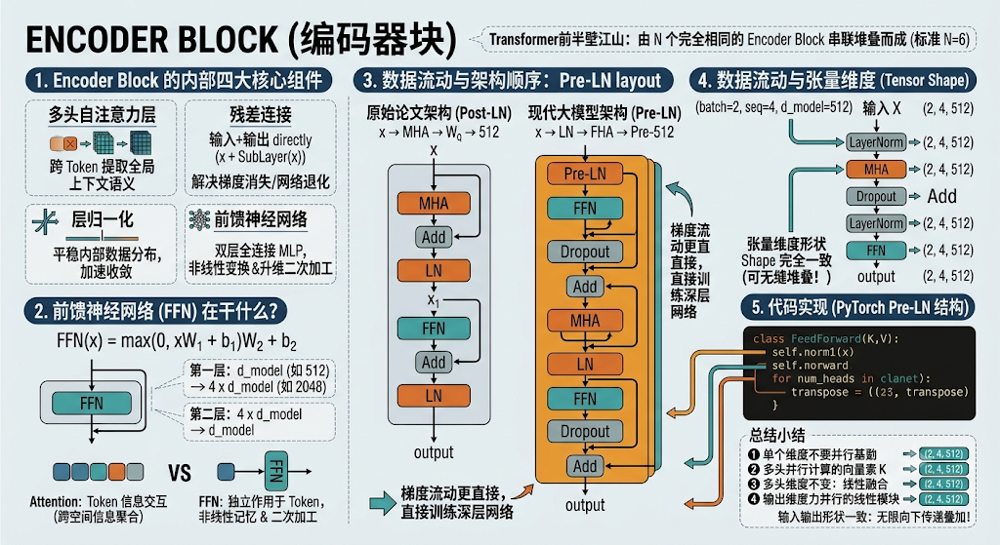

### 1. Encoder Block 的内部四大核心组件

每个 Encoder Block 内部包含两个主要的子层（Sub-layers），以及两个用于保证深层网络稳定训练的辅助结构：

1. **多头自注意力层（Multi-Head Self-Attention）**：负责跨 Token 提取全局上下文语义。
2. **残差连接（Residual Connection）**：将子层的输入与输出直接相加（即 $x + \text{SubLayer}(x)$），解决深层网络训练时的**梯度消失与网络退化**问题。
3. **层归一化（Layer Normalization, LN）**：对每个样本在特征维度上进行归一化，平稳内部数据分布，加速收敛。
4. **前馈神经网络（Feed-Forward Network, FFN）**：一个双层全连接 MLP，负责对每个 Token 的特征进行非线性变换与升维二次加工。

### 2. 前馈神经网络（FFN）在干什么？

FFN 的计算公式非常简单：

$$\text{FFN}(x) = \max(0, x W_1 + b_1) W_2 + b_2$$

- **结构**：第一层将维度从 $d_{\text{model}}$（如 512）**升维扩展 4 倍**到 $4 \times d_{\text{model}}$（如 2048），经过激活函数（ReLU 或 GELU）后再由第二层**降维压缩**回 $d_{\text{model}}$（512）。
- **与 Attention 的分工**：
  - **Attention**：负责 Token **之间**的信息交互（跨空间信息聚合）；
  - **FFN**：独立作用于**每个 Token 自身**，在升维空间中对提取到的特征做非线性记忆与二次加工。

### 3. 数据流动与架构顺序：Post-LN vs Pre-LN

#### ① 原始论文架构（Post-LN）

原版 Transformer 采用的是 **Post-LN**，即“先计算，再相加，最后做 LayerNorm”：

$$x^{(1)} = \text{LayerNorm}(x + \text{MultiHeadAttention}(x))$$

$$x^{(2)} = \text{LayerNorm}(x^{(1)} + \text{FFN}(x^{(1)}))$$

#### ② 现代大模型架构（Pre-LN）

现在的现代大模型（LLaMA、Qwen、DeepSeek 等）普遍采用 **Pre-LN**（先做 LayerNorm，再进入计算分支，最后残差相加）：

$$x^{(1)} = x + \text{MultiHeadAttention}(\text{LayerNorm}(x))$$

$$x^{(2)} = x^{(1)} + \text{FFN}(\text{LayerNorm}(x^{(1)}))$$

- **优势**：Pre-LN 的梯度流动更直接，不需要复杂的 Warm-up 调整就能直接训练几百层深度的网络。

### 4. 数据流动与张量维度（Tensor Shape）

整个 Encoder Block 的最大工程亮点在于：**输入和输出的张量形状（Shape）保持完全一致**！

Plaintext

```python
输入 X: (batch_size, seq_len, d_model)   -->  (2, 4, 512)
  │
  ├──► [ LayerNorm ]
  │         │
  │         ▼
  ├──► [ Multi-Head Self-Attention ] ──► (2, 4, 512)
  │         │
  │   (残差相加 Add)
  ├─────────┴──────────────────────────► (2, 4, 512)
  │
  ├──► [ LayerNorm ]
  │         │
  │         ▼
  ├──► [ Feed-Forward Network (升维到 2048 再降回 512) ]
  │         │
  │   (残差相加 Add)
  └─────────┴──────────────────────────► (2, 4, 512)
```

### 5. 代码实现 (PyTorch Pre-LN 结构)

```python
import torch
import torch.nn as nn

class FeedForward(nn.Module):
    """前馈神经网络：升维 4 倍再降维"""
    def __init__(self, d_model: int, d_ff: int = None, dropout: float = 0.1):
        super().__init__()
        if d_ff is None:
            d_ff = 4 * d_model  # 默认升维 4 倍 (如 512 -> 2048)
            
        self.net = nn.Sequential(
            nn.Linear(d_model, d_ff),
            nn.GELU(),  # 现代大模型多采用 GELU 激活函数
            nn.Dropout(dropout),
            nn.Linear(d_ff, d_model),
            nn.Dropout(dropout)
        )

    def forward(self, x):
        return self.net(x)


class EncoderBlock(nn.Module):
    """标准的单个 Encoder Block (Pre-LN 架构)"""
    def __init__(self, d_model: int, num_heads: int, dropout: float = 0.1):
        super().__init__()
        # 多头自注意力模块 (使用上一节写好的或官方的 MHA)
        self.attn = nn.MultiheadAttention(embed_dim=d_model, num_heads=num_heads, batch_first=True)
        self.ffn = FeedForward(d_model)
        
        # 两个 LayerNorm
        self.norm1 = nn.LayerNorm(d_model)
        self.norm2 = nn.LayerNorm(d_model)
        
        self.dropout = nn.Dropout(dropout)

    def forward(self, x):
        # 1. 第一层：Pre-LN + MHA + 残差连接
        norm_x = self.norm1(x)
        attn_out, _ = self.attn(norm_x, norm_x, norm_x)  # Q=K=V=norm_x
        x = x + self.dropout(attn_out)  # 残差相加
        
        # 2. 第二层：Pre-LN + FFN + 残差连接
        x = x + self.ffn(self.norm2(x))  # 残差相加
        
        return x

# 测试代码
x = torch.randn(2, 4, 512)  # (Batch=2, Seq=4, d_model=512)
encoder_block = EncoderBlock(d_model=512, num_heads=8)
out = encoder_block(x)

print("Encoder Block 输出形状:", out.shape)  # torch.Size([2, 4, 512])
```

### 总结小结

1. **核心逻辑**：Encoder Block = Self-Attention + FFN + 残差连接 + LayerNorm。
2. **主要作用**：输入全句 Token，输出**充分蕴含全句上下文语义**的高维向量表示矩阵。
3. **可无缝堆叠**：输入输出形状完全一致，使得 $N$ 个 Encoder Block 可以像模块一样无限向下传递叠加。

搞懂了 Encoder，下一节我们进入 Decoder（解码器）的核心机密：**“九、Masked Self Attention（掩码自注意力）”**！

## 九、Masked Self Attention

在理解了 **Encoder Block** 的全貌后，我们来到了 Transformer 解码器（Decoder）的核心机密——**Masked Self-Attention（掩码自注意力机制）**。

一句话概括它的存在意义：**在训练自回归语言模型（如 GPT、LLaMA）时，强行阻止模型“偷看未来的答案”。**

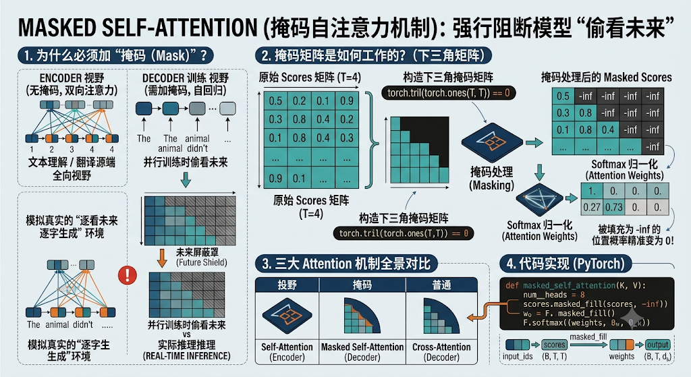

### 1. 为什么必须加“掩码（Mask）”？

- **Encoder 的特点**：做文本理解或翻译源端处理时，整句话在输入时就已经全部给齐了，所以每一个 Token 都可以“同时看到”左边和右边的所有 Token（双向注意力）。
- **Decoder 的特点**：在进行文本生成（自回归）时，生成是**按时间顺序一个字一个字往外吐**的。
  - 当模型在预测第 3 个词时，它在现实中**只能看到前 2 个词**。
  - 但在并行训练（Training）时，为了提升效率，我们会把一整句完整的目标文本一次性喂给 Decoder。如果不加干预，Self-Attention 就会利用其全局打分的能力，直接“偷看”到第 3 个词甚至句尾的词，导致训练时损失（Loss）轻松变为 0，但到了实际推理预测时一塌糊涂。

为了让模型在训练时模拟真实的“逐字生成”环境，我们必须把**当前位置之后的未来信息强行遮挡（Mask）掉**。

### 2. 掩码矩阵是如何工作的？（下三角矩阵）

回忆我们第六节推导的 Raw Scores 矩阵公式：

$$\text{Scores} = \frac{Q \cdot K^T}{\sqrt{d_k}} \quad \implies \text{Shape: } (T, T)$$

这个 $T \times T$ 矩阵中：

- 第 $i$ 行代表“第 $i$ 个词在寻找信息”；
- 第 $j$ 列代表“第 $j$ 个词提供的信息”。

如果 $j > i$，就说明**第 $j$ 个词是未来才会出现的词**。

#### 掩码操作（Masking）

我们构造一个**下三角掩码矩阵（Tril Mask Matrix）**：保留主对角线及其左下角的部分，将右上角（即 $j > i$ 的未来区域）全部填充为 **$-\infty$（负无穷大）**。

Plaintext

```python
原始 Scores 矩阵 (T=4):                  掩码处理后的 Masked Scores:
[ 0.5,  0.2,  0.1,  0.9 ]                [  0.5, -inf, -inf, -inf ]
[ 0.3,  0.8,  0.4,  0.2 ]   ──► Mask ──► [  0.3,  0.8, -inf, -inf ]
[ 0.1,  0.6,  0.7,  0.5 ]                [  0.1,  0.6,  0.7, -inf ]
[ 0.4,  0.3,  0.2,  0.8 ]                [  0.4,  0.3,  0.2,  0.8 ]
```

#### 为什么是填 $-\infty$？

这是因为后面要对每一行执行 **Softmax** 归一化。根据指数函数特性：

$$e^{-\infty} \to 0$$

当一个得分被填入 $-\infty$ 后，经过 Softmax 算出的**注意力权重（Attention Weight）就会精准变为 0**！这意味着未来 Token 的 $V$（Value）在加权求和时完全不参与计算，信息流被彻底阻断。

### 3. 三大 Attention 机制全景对比

到目前为止，Transformer 里的三种 Attention 形式我们就全部集齐了：

| **注意力类型**            | **作用位置** | **Q,K,V 来源**                       | **掩码情况**   | **视觉视野**                              |
| ------------------------- | ------------ | ------------------------------------ | -------------- | ----------------------------------------- |
| **Self-Attention**        | Encoder      | 全部来自 Encoder 输入                | **无掩码**     | **全向视野**：能看到全局所有词            |
| **Masked Self-Attention** | Decoder      | 全部来自 Decoder 输入                | **下三角掩码** | **单向/因果视野**：只能看到过去和当前的词 |
| **Cross-Attention**       | Decoder      | $Q$ 来自 Decoder $K, V$ 来自 Encoder | **无掩码**     | **跨塔对齐**：拿着生成进度查源端特征      |

### 4. 代码实现 (PyTorch)

在 PyTorch 中，实现 Masked Self-Attention 非常简单，只需利用 `torch.tril` 构造掩码，再使用 `masked_fill` 方法填入 $-\infty$：

```python
import torch
import torch.nn as nn
import torch.nn.functional as F

def masked_self_attention(Q, K, V):
    # Q, K, V shape: (batch_size, seq_len, d_k)
    B, T, d_k = Q.shape
    
    # 1. 计算原始点积分数: (B, T, T)
    scores = torch.matmul(Q, K.transpose(-2, -1)) / (d_k ** 0.5)
    
    # 2. 构造下三角掩码矩阵: 上三角部分为 True
    # torch.tril(torch.ones(T, T)) 得到下三角为 1，上三角为 0 的矩阵
    mask = torch.tril(torch.ones(T, T)) == 0  # 形状 (T, T)
    
    # 3. 将未来位置 (True 的位置) 填充为 -inf
    scores = scores.masked_fill(mask.unsqueeze(0), float('-inf'))
    
    # 4. Softmax 归一化: 被填充为 -inf 的位置概率变为 0
    attn_weights = F.softmax(scores, dim=-1)
    
    # 5. 加权融合 V: (B, T, d_k)
    output = torch.matmul(attn_weights, V)
    
    return output, attn_weights

# 测试运算
T = 4  # 假设序列长度为 4
d_k = 64
Q = K = V = torch.randn(1, T, d_k)

out, weights = masked_self_attention(Q, K, V)

print("掩码后的注意力权重矩阵 (注意上三角全为 0):")
print(weights[0].detach().numpy().round(3))
```

输出的注意力权重矩阵形如：

```python
[[1.    0.    0.    0.   ]   <-- 第 1 个词只能看到自己
 [0.27  0.73  0.    0.   ]   <-- 第 2 个词能看到第 1, 2 个词
 [0.15  0.35  0.5   0.   ]   <-- 第 3 个词能看到第 1, 2, 3 个词
 [0.10  0.20  0.30  0.40 ]]  <-- 第 4 个词能看到前 4 个词
```

### 总结小结

1. **核心逻辑**：通过在 $QK^T$ 得分矩阵的未来区域加上 $-\infty$ 掩码，强行阻断未来信息传导。
2. **应用场景**：Decoder 模块以及所有自回归生成大模型（如 GPT/LLaMA）的标准配制。

掌握了 Masked Self-Attention，我们就破解了 Decoder 的核心秘密！接下来我们看看 Transformer 处理完所有 Block 后的最后一步：**“十、终端输出（Linear & Softmax Projection）”**！

## 十、终端输出

当数据流经 $N$ 个 Encoder/Decoder Block 的层层提炼后，最终输出的依然是一个形状为 `(batch_size, seq_len, d_model)` 的高维连续特征矩阵。

**“终端输出（Unembedding Projection）”** 的核心任务，就是**把这个高维抽象向量，投影回模型的离散词表（Vocabulary），并转化为概率分布，最终选出下一个输出的 Token**。

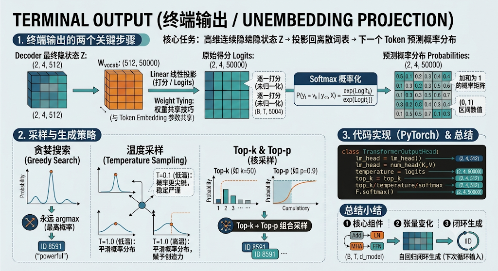

### 1. 终端输出的两个关键步骤

终端输出模块主要包含两层计算：**Linear 投影层** 与 **Softmax 激活层**。

Plaintext

```python
Decoder 最终隐状态向量 Z: shape (B, T, d_model)   -->  (2, 4, 512)
          │
          ▼ 1. Linear 线性投影 (打分 / Logits)
矩阵 W_vocab: shape (d_model, vocab_size)        -->  (512, 50000)
          │
          ▼
原始得分 Logits: shape (B, T, vocab_size)         -->  (2, 4, 50000)
          │
          ▼ 2. Softmax 概率化
预测概率分布 Probabilities: (B, T, vocab_size)    -->  加和为 1 的概率矩阵
          │
          ▼ 3. 采样 / 解码 (Sampling / Decoding)
选出概率最高或采样的 Token ID                     -->  如 ID 8591 ("powerful")
```

#### ① Linear 线性投影（生成 Logits）

- **计算**：将维度为 $d_{\text{model}}$ 的向量，乘以一个线性投影矩阵 $W_{\text{vocab}} \in \mathbb{R}^{d_{\text{model}} \times V}$（其中 $V$ 是词表大小 `vocab_size`，如 50,000）。
- **输出**：形状变为 `(batch_size, seq_len, vocab_size)` 的矩阵。
- **物理意义**：为词表中包含的这 50,000 个 Token **逐一打分**（未归一化的得分，称为 **Logits**）。分数越高，说明模型认为当前位置是该词的可能性越大。

> **权重共享技巧（Weight Tying）**：
>
> 在许多经典 Transformer 及现代大模型中，这里的 $W_{\text{vocab}}$ 矩阵与最开始 **Token Embedding** 的 Embedding Table 是**共享同一套参数**（或互为转置）的。这不仅大幅减少了模型参数量，还能让输入与输出的词语义空间保持强一致性。

#### ② Softmax 概率归一化

对最后一个维度（`vocab_size`）做 Softmax 计算：

$$P(y_t = v_k \mid y_{<t}, X) = \frac{e^{\text{Logit}_k}}{\sum_{j=1}^{V} e^{\text{Logit}_j}}$$

- 将 50,000 个离散得分转化为加和等于 **100%** 的标准概率分布。

### 2. 采样与生成策略（从概率到最终文字）

得到了概率分布后，模型如何决定真正“吐出”哪个字？这就是解码采样策略（Sampling Strategy）：

1. **贪婪搜索（Greedy Search）**：
   - **逻辑**：永远选择概率最高（`argmax`）的那个词。
   - **优缺点**：计算最快，但容易导致生成的文本重复、枯燥。
2. **温度采样（Temperature Sampling）**：
   - **逻辑**：在 Softmax 前将 Logits 除以温度系数 $T$（$\frac{\text{Logits}}{T}$）。
   - **$T$ 极小（如 0.1）**：概率分布更尖锐，生成内容极度稳定严谨；
   - **$T$ 较大（如 0.8~1.2）**：平滑概率分布，赋予模型更高的创造力和随机性。
3. **Top-k & Top-p (Nucleus) 采样**：
   - **Top-k**：只保留概率最高的 前 $k$ 个词，屏蔽剩下的低概率词；
   - **Top-p（核采样）**：按概率从大到小排序，累计概率达到 $p$（如 0.9）停止，只在这部分候选词中按比例采样。**这是现代大模型（如 ChatGPT、LLaMA）最常用的默认采样组合。**

### 3. 代码实现 (PyTorch)

```python
import torch
import torch.nn as nn
import torch.nn.functional as F

class TransformerOutputHead(nn.Module):
    def __init__(self, d_model: int, vocab_size: int):
        super().__init__()
        # 终端线性投影层: d_model (512) -> vocab_size (50000)
        self.lm_head = nn.Linear(d_model, vocab_size, bias=False)

    def forward(self, x, temperature: float = 1.0, top_k: int = None):
        # x shape: (batch_size, seq_len, d_model)
        
        # 1. 映射为未归一化的 Logits: (B, T, vocab_size)
        logits = self.lm_head(x)
        
        # 2. 引入温度系数 Temperature 调节
        logits = logits / temperature
        
        # 3. 如果设置了 Top-k，进行 Logits 裁剪
        if top_k is not None:
            v, _ = torch.topk(logits, min(top_k, logits.size(-1)))
            # 将 Top-k 之外的位置填充为 -inf
            logits[logits < v[:, :, [-1]]] = float('-inf')
        
        # 4. Softmax 转化为概率分布: (B, T, vocab_size)
        probs = F.softmax(logits, dim=-1)
        
        return logits, probs

# 测试代码
B, T, d_model, vocab_size = 2, 4, 512, 50000
decoder_output = torch.randn(B, T, d_model)

head = TransformerOutputHead(d_model=d_model, vocab_size=vocab_size)
logits, probs = head(decoder_output, temperature=0.7, top_k=50)

print("Logits 形状:", logits.shape)  # torch.Size([2, 4, 50000])
print("Probabilities 形状:", probs.shape)  # torch.Size([2, 4, 50000])

# 预测最后一个 Token 的 ID (贪婪选择)
next_token_id = torch.argmax(probs[:, -1, :], dim=-1)
print("预测的下一个 Token ID:", next_token_id)  # 如 shape: (2,) -> [8591, 10204]
```

### 总结小结

1. **核心组件**：Linear 映射层 + Softmax 激活层。
2. **张量变化**：`(B, T, d_model)` $\rightarrow$ `(B, T, vocab_size)` $\rightarrow$ 概率分布 $\rightarrow$ 选出下一个 Token ID。
3. **闭环生成**：选出 Token ID 后，查词表得到文字，并把该词重新追加到输入端，触发下一次循环预测（自回归）。

## 十一、Transformer总结及训练

在搞懂了从 Token Embedding、Self-Attention、Encoder/Decoder 到终端输出的所有前向传播细节后，本节我们对 Transformer 进行**全局汇总**，并剖析它是**如何在训练阶段实现高效学习**的。

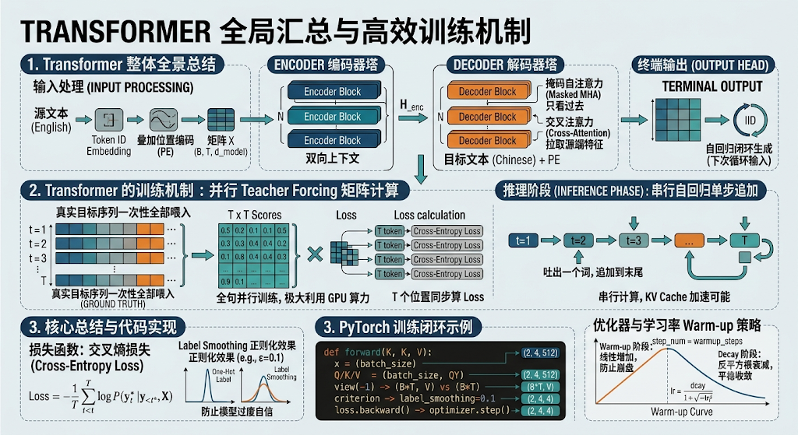

### 1. Transformer 整体全景总结

把前面所有的积木拼在一起，Transformer 的完整数据流动闭环如下：

1. **输入处理**：
   - 源文本 $\rightarrow$ Token ID $\rightarrow$ **Token Embedding** $\rightarrow$ 叠加 **Positional Encoding** $\rightarrow$ 矩阵 $X$。
2. **Encoder（编码器塔）**：
   - 输入 $X$ 流经 $N$ 个 Encoder Block（**Pre-LN + MHA + FFN + 残差连接**）。
   - 输出充分融合了全句双向上下文信息的语义矩阵 $H_{enc}$。
3. **Decoder（解码器塔）**：
   - 目标文本输入 $\rightarrow$ 同样叠加位置编码 $\rightarrow$ 流经 $N$ 个 Decoder Block。
   - **掩码自注意力（Masked MHA）**：只看过去，挡住未来信息。
   - **交叉注意力（Cross-Attention）**：以 Decoder 当前隐状态为 $Q$，以 Encoder 输出 $H_{enc}$ 为 $K, V$，拉取源端特征。
4. **终端输出（Output Head）**：
   - 经过线性投影映射至 `vocab_size` 维度，经 Softmax 输出全词表概率分布，自回归预测下一个词。

### 2. Transformer 的训练机制（Training Dynamics）

Transformer 在训练阶段与推理（Inference）阶段最大的区别在于：**训练是高度并行的，而推理是单步串行的。**

#### ① 教师强制与并行训练（Teacher Forcing & Parallel Training）

- **推理（Inference）**：自回归生成，吐出一个词，追加到末尾，再算下一个词，循环 $T$ 次。
- **训练（Training）**：如果我们等模型一步步生成再去算 Loss，训练几百亿 Token 会慢到崩溃。因此训练时采用 **Teacher Forcing（教师强制）** 策略：
  - **直接把完整的正确目标序列（Ground Truth）一次性全部喂给 Decoder**。
  - 依靠 **Masked Self-Attention** 强行挡住未来 Token，实现**在一次前向传播中，同时计算序列中所有 $T$ 个位置的损失（Loss）**，极大利用了 GPU 的并行计算能力。

#### ② 损失函数：交叉熵损失（Cross-Entropy Loss）

模型在各个位置生成的 Logits 与真实标签（Target Token ID）之间计算**多分类交叉熵损失**：

$$\text{Loss} = -\frac{1}{T} \sum_{t=1}^{T} \log P(y_t^* \mid y_{<t}^*, X)$$

- **Label Smoothing（标签平滑）**：原论文在训练时引入了 Label Smoothing（如 $\epsilon = 0.1$），将硬性的 One-Hot 标签平滑化，防止模型对自己给出的预测过度自信，起到正则化防过拟合的作用。

#### ③ 优化器与学习率 Warm-up 策略

Transformer 的训练对学习率极其敏感，原论文采用了带 **Warm-up（预热）** 的 **Adam 优化器**（$\beta_1=0.9, \beta_2=0.98$）：

$$\text{lr} = d_{\text{model}}^{-0.5} \cdot \min\left(\text{step}_{\text{num}}^{-0.5}, \text{step}_{\text{num}} \cdot \text{warmup}_{\text{steps}}^{-1.5}\right)$$

- **前 $k$ 步（Warm-up 阶段）**：学习率从 0 **线性增加**。由于刚开始权重是随机的、梯度不稳定，小学习率能防止模型崩盘。
- **后期（Decay 阶段）**：学习率按**反平方根按步衰减**，帮助模型平稳收敛到局部最优解。

### 3. 代码实现 (PyTorch 训练闭环示例)

```python
import torch
import torch.nn as nn

# 假设 Batch Size = 2, 序列长度 T = 4, 词表大小 V = 50000
batch_size, seq_len, vocab_size = 2, 4, 50000

# 1. 模拟终端输出的 Logits 与 真实标签 Target IDs
logits = torch.randn(batch_size, seq_len, vocab_size, requires_grad=True)
targets = torch.tensor([[101, 205, 309, 412],
                        [101, 502, 110, 888]], dtype=torch.long)

# 2. 定义交叉熵损失函数 (忽略 Padding 的 Token ID，如 pad_idx=0)
criterion = nn.CrossEntropyLoss(ignore_index=0, label_smoothing=0.1)

# PyTorch CrossEntropyLoss 期望输入维度: (N, C) 或 (N, C, d1, d2...)
# 将 logits 展平为 (B * T, vocab_size)，targets 展平为 (B * T)
loss = criterion(logits.view(-1, vocab_size), targets.view(-1))

print("计算得到的训练 Loss:", loss.item())

# 3. 反向传播与梯度更新
loss.backward()
# optimizer.step() ...
```

### 总结对比

| **维度**     | **训练阶段 (Training)**                      | **推理阶段 (Inference)**                          |
| ------------ | -------------------------------------------- | ------------------------------------------------- |
| **输入方式** | 一次性喂入全部真实目标文本 (Teacher Forcing) | 仅喂入 Prompt，后续依赖自回归逐步追加             |
| **掩码作用** | Mask 强行阻断未来信息，**实现全句并行训练**  | 自然时间推移，无须偷看（每次只算最末尾位置）      |
| **计算效率** | **并行（矩阵乘法）**，充分榨干 GPU           | **串行（Auto-regressive）**，可使用 KV Cache 加速 |
| **核心指标** | Cross-Entropy Loss, Perplexity (PPL)         | Bleu, Rouge, Human Evaluation                     |

## 十二、架构代码实现

完成了前面的所有模块推导后，我们将把 **Token Embedding、Positional Encoding、Multi-Head Attention、Feed-Forward Network、Encoder Block、Decoder Block 以及 Terminal Output** 整合在一起，提供一份结构清晰、可直接运行的完整 **Transformer 架构 PyTorch 代码实现**。

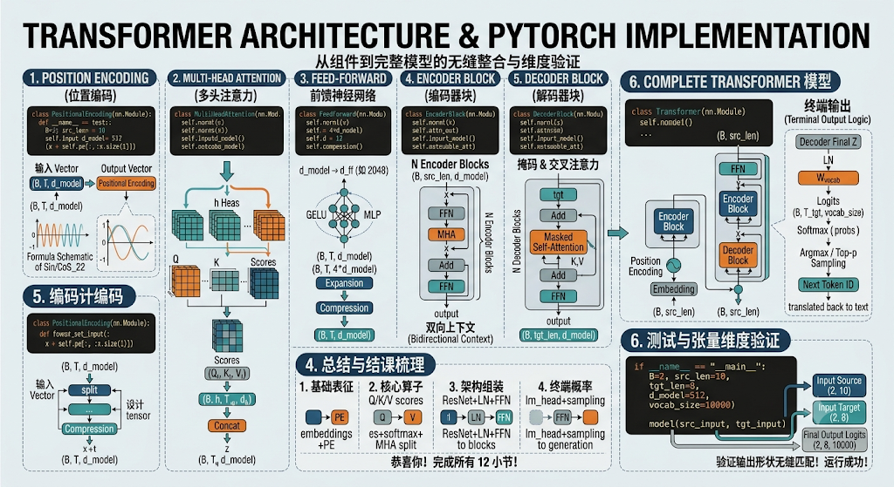

### 1. 完整代码实现 (PyTorch)

```python
import torch
import torch.nn as nn
import torch.nn.functional as F
import math

# ==========================================
# 1. 位置编码 (Positional Encoding)
# ==========================================
class PositionalEncoding(nn.Module):
    def __init__(self, d_model: int, max_len: int = 5000):
        super().__init__()
        pe = torch.zeros(max_len, d_model)
        position = torch.arange(0, max_len, dtype=torch.float).unsqueeze(1)
        div_term = torch.exp(torch.arange(0, d_model, 2).float() * (-math.log(10000.0) / d_model))
        
        pe[:, 0::2] = torch.sin(position * div_term)
        pe[:, 1::2] = torch.cos(position * div_term)
        self.register_buffer('pe', pe.unsqueeze(0))

    def forward(self, x):
        # x: (batch_size, seq_len, d_model)
        return x + self.pe[:, :x.size(1)]

# ==========================================
# 2. 多头注意力模块 (Multi-Head Attention)
# ==========================================
class MultiHeadAttention(nn.Module):
    def __init__(self, d_model: int, num_heads: int):
        super().__init__()
        assert d_model % num_heads == 0
        self.d_model = d_model
        self.num_heads = num_heads
        self.d_k = d_model // num_heads

        self.W_q = nn.Linear(d_model, d_model, bias=False)
        self.W_k = nn.Linear(d_model, d_model, bias=False)
        self.W_v = nn.Linear(d_model, d_model, bias=False)
        self.W_o = nn.Linear(d_model, d_model, bias=False)

    def forward(self, q, k, v, mask=None):
        B, T_q, _ = q.shape
        _, T_k, _ = k.shape

        # 线性投影并拆分多头: (B, T, h, d_k) -> (B, h, T, d_k)
        Q = self.W_q(q).view(B, T_q, self.num_heads, self.d_k).transpose(1, 2)
        K = self.W_k(k).view(B, T_k, self.num_heads, self.d_k).transpose(1, 2)
        V = self.W_v(v).view(B, T_k, self.num_heads, self.d_k).transpose(1, 2)

        # 计算 Scaled Dot-Product Attention: (B, h, T_q, T_k)
        scores = torch.matmul(Q, K.transpose(-2, -1)) / math.sqrt(self.d_k)
        
        if mask is not None:
            # mask 为 True 的位置填入 -inf
            scores = scores.masked_fill(mask == 0, float('-inf'))

        attn_weights = F.softmax(scores, dim=-1)
        out = torch.matmul(attn_weights, V)  # (B, h, T_q, d_k)

        # 拼接多头并做最终投影: (B, T_q, d_model)
        out = out.transpose(1, 2).contiguous().view(B, T_q, self.d_model)
        return self.W_o(out)

# ==========================================
# 3. 前馈神经网络 (Feed-Forward Network)
# ==========================================
class FeedForward(nn.Module):
    def __init__(self, d_model: int, d_ff: int = None, dropout: float = 0.1):
        super().__init__()
        if d_ff is None:
            d_ff = 4 * d_model
        self.net = nn.Sequential(
            nn.Linear(d_model, d_ff),
            nn.GELU(),
            nn.Dropout(dropout),
            nn.Linear(d_ff, d_model),
            nn.Dropout(dropout)
        )

    def forward(self, x):
        return self.net(x)

# ==========================================
# 4. Encoder Block (Pre-LN 架构)
# ==========================================
class EncoderBlock(nn.Module):
    def __init__(self, d_model: int, num_heads: int, dropout: float = 0.1):
        super().__init__()
        self.attn = MultiHeadAttention(d_model, num_heads)
        self.ffn = FeedForward(d_model, dropout=dropout)
        self.norm1 = nn.LayerNorm(d_model)
        self.norm2 = nn.LayerNorm(d_model)

    def forward(self, x, mask=None):
        # Pre-LN + Self-Attention + Residual
        x = x + self.attn(self.norm1(x), self.norm1(x), self.norm1(x), mask)
        # Pre-LN + FFN + Residual
        x = x + self.ffn(self.norm2(x))
        return x

# ==========================================
# 5. Decoder Block (Pre-LN 架构)
# ==========================================
class DecoderBlock(nn.Module):
    def __init__(self, d_model: int, num_heads: int, dropout: float = 0.1):
        super().__init__()
        self.self_attn = MultiHeadAttention(d_model, num_heads)
        self.cross_attn = MultiHeadAttention(d_model, num_heads)
        self.ffn = FeedForward(d_model, dropout=dropout)
        
        self.norm1 = nn.LayerNorm(d_model)
        self.norm2 = nn.LayerNorm(d_model)
        self.norm3 = nn.LayerNorm(d_model)

    def forward(self, x, enc_output, tgt_mask=None, memory_mask=None):
        # 1. Masked Self-Attention
        x = x + self.self_attn(self.norm1(x), self.norm1(x), self.norm1(x), tgt_mask)
        # 2. Cross-Attention (Q来自Decoder, K和V来自Encoder)
        x = x + self.cross_attn(self.norm2(x), enc_output, enc_output, memory_mask)
        # 3. FFN
        x = x + self.ffn(self.norm3(x))
        return x

# ==========================================
# 6. 完整 Transformer 模型
# ==========================================
class Transformer(nn.Module):
    def __init__(self, src_vocab_size: int, tgt_vocab_size: int, d_model: int = 512, 
                 num_heads: int = 8, num_encoder_layers: int = 6, num_decoder_layers: int = 6, 
                 max_len: int = 5000, dropout: float = 0.1):
        super().__init__()
        
        # Embeddings & PE
        self.src_embed = nn.Embedding(src_vocab_size, d_model)
        self.tgt_embed = nn.Embedding(tgt_vocab_size, d_model)
        self.pos_enc = PositionalEncoding(d_model, max_len)
        self.dropout = nn.Dropout(dropout)

        # Encoder & Decoder Stacks
        self.encoder_layers = nn.ModuleList([
            EncoderBlock(d_model, num_heads, dropout) for _ in range(num_encoder_layers)
        ])
        self.decoder_layers = nn.ModuleList([
            DecoderBlock(d_model, num_heads, dropout) for _ in range(num_decoder_layers)
        ])

        # Terminal LayerNorm & Unembedding Head
        self.final_norm = nn.LayerNorm(d_model)
        self.lm_head = nn.Linear(d_model, tgt_vocab_size, bias=False)

    def generate_square_subsequent_mask(self, sz: int, device):
        """生成因果掩码 (下三角矩阵)"""
        mask = torch.tril(torch.ones(sz, sz, device=device))
        return mask.unsqueeze(0).unsqueeze(0)  # (1, 1, sz, sz)

    def forward(self, src, tgt):
        # src: (B, T_src), tgt: (B, T_tgt)
        device = src.device
        
        # 1. 构造 Target 因果掩码 (防止 Decoder 偷看未来 Token)
        tgt_seq_len = tgt.size(1)
        tgt_mask = self.generate_square_subsequent_mask(tgt_seq_len, device)

        # 2. Encoder 前向传播
        src_x = self.dropout(self.pos_enc(self.src_embed(src)))
        enc_out = src_x
        for layer in self.encoder_layers:
            enc_out = layer(enc_out)

        # 3. Decoder 前向传播
        tgt_x = self.dropout(self.pos_enc(self.tgt_embed(tgt)))
        dec_out = tgt_x
        for layer in self.decoder_layers:
            dec_out = layer(dec_out, enc_out, tgt_mask=tgt_mask)

        # 4. 终端输出
        dec_out = self.final_norm(dec_out)
        logits = self.lm_head(dec_out)  # (B, T_tgt, tgt_vocab_size)
        return logits
```

### 2. 测试与张量维度验证

我们可以写一段测试脚本，模拟一次真实的输入和前向传播流程：

```python
if __name__ == "__main__":
    # 超参数定义
    src_vocab = 10000
    tgt_vocab = 10000
    d_model = 512
    batch_size = 2
    src_len = 10
    tgt_len = 8

    # 实例化模型
    model = Transformer(
        src_vocab_size=src_vocab, 
        tgt_vocab_size=tgt_vocab, 
        d_model=d_model, 
        num_heads=8, 
        num_encoder_layers=6, 
        num_decoder_layers=6
    )

    # 伪造输入数据 (Token IDs)
    src_input = torch.randint(0, src_vocab, (batch_size, src_len))  # (2, 10)
    tgt_input = torch.randint(0, tgt_vocab, (batch_size, tgt_len))  # (2, 8)

    # 前向计算
    logits = model(src_input, tgt_input)

    print("===== 张量维度验证 =====")
    print("输入 Source 形状: ", src_input.shape)
    print("输入 Target 形状: ", tgt_input.shape)
    print("输出 Logits 形状: ", logits.shape)
    
    # 验证输出形状是否符合预期: (batch_size, tgt_len, tgt_vocab_size)
    assert logits.shape == (batch_size, tgt_len, tgt_vocab)
    print("\n运行成功！Transformer 架构全链路张量维度无缝匹配！")
```

### 总结与结课梳理

恭喜你！到这里我们已经完成了 Transformer 课程所有 12 个小节的完整复习与代码落地。

我们可以将整个学习路径总结为以下 **四重演进**：

1. **基础表征**：文本 $\rightarrow$ Token ID $\rightarrow$ `Token Embedding + Positional Encoding`（获得几何与位置坐标）。
2. **核心算子**：计算 $Q, K, V$ 点积分数 $\rightarrow$ `Softmax` 归一化 $\rightarrow$ `Multi-Head` 多视角切分与并行拼接。
3. **架构组装**：通过 `ResNet` 残差连接 + `LayerNorm` + `FFN` 组装成无损传输的 Encoder 与带下三角掩码的 Decoder Block。
4. **终端概率**：高维向量经 `lm_head` 映射回 `vocab_size` $\rightarrow$ 结合 `Top-p/Top-k` 采样完成自回归文本生成。

---
> 🏠 **[返回主页 README](./README.md)** \| ◀️ **上一篇：[12. 机器学习总结 (二)](./12%E5%A4%A7%E6%A8%A1%E5%9E%8B%E5%9F%BA%E7%A1%80%E4%B9%8B%E6%9C%BA%E5%99%A8%E5%AD%A6%E4%B9%A0%E6%80%BB%E7%BB%932.md)** \| ▶️ **下一篇：[14.1 LangChain 介绍](./14.1Langchain%E4%BB%8B%E7%BB%8D.md)** \| 🎓 **[进入本模块面试高频题](./interview/02_大模型与Transformer理论面试题.md)**
