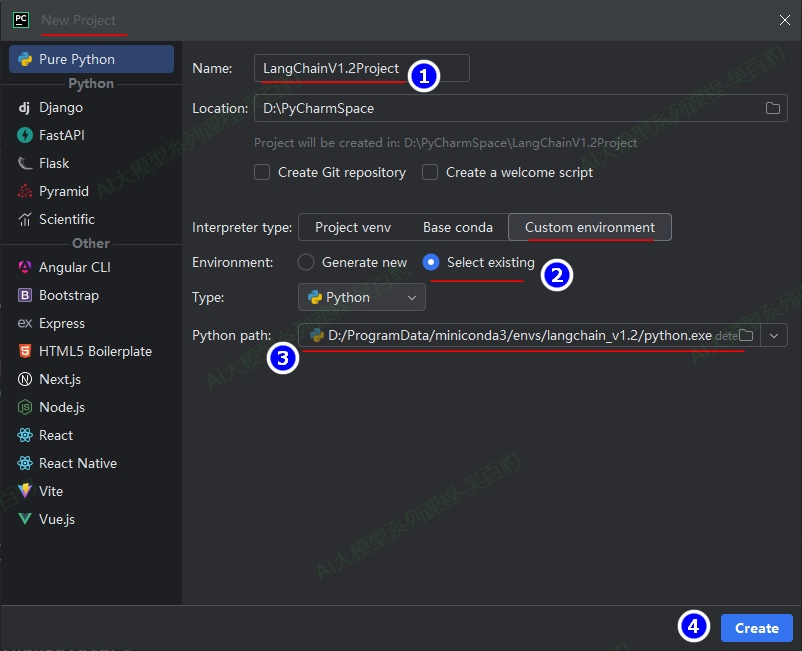

# 1\. **LangChain介绍**

## 1.1. **LangChain的由来**

LangChain是一个用于**开发由大语言模型（LLM）驱动的应用程序的开源框架**，它并非仅是对模型API的简单封装，而是提供了一个预构建的智能体（Agent）架构和丰富的工具集成，使开发者无需从零搭建复杂的集成架构，就能快速构建基于LLM的高级应用。

LangChain这一开源框架诞生于2022年10月，由哈佛大学的Harrison Chase（哈里森·蔡斯）创建，**其名称来源于"Language"（语言模型）和"Chain"（链式连接）的组合**，体现了其核心设计理念——**将大语言模型与其他计算资源和数据源以链式方式连接，构建出功能更加强大的AI应用**。

LangChain的诞生源于一个关键洞察：单一的大语言模型虽然能力强大，但在实际应用场景中存在明显局限。具体如下：

* LLM的知识受限于其训练数据，无法获取训练时点之后的信息；
* 模型无法直接与外部系统（如数据库、API）交互；
* 模型本身不具备状态保持能力，难以进行连贯的多轮对话。

所以要构建真正实用的AI应用，必须将大语言模型与外部工具、数据源和记忆机制有机结合，从而催生了LangChain框架的设计理念。

2024年是LangChain架构重大变革的一年。随着开发者从构建原型转向生产环境部署，对更精细工作流控制的需求日益增长，LangChain团队推出了LangGraph作为底层智能体编排框架，并将原有的链和智能体标记为弃用，转而采用基于LangGraph构建的统一智能体抽象。2025年10月20日LangChain团队正式发布LangChain v1.0.0与LangGraph v1.0.0，标志着框架的成熟和标准化，为企业级AI应用提供了稳定基础。

LangChain&LangGraph文档地址如下：

英文文档地址：[https://docs.langchain.com/oss/python/langchain/overview](https://docs.langchain.com/oss/python/langchain/overview)

中文文档地址：[https://docs.langchain.org.cn/oss/python/langchain/overview](https://docs.langchain.org.cn/oss/python/langchain/overview)

## 1.2. **LangChain核心特点**

LangChain作为一个成熟的大模型应用开发框架，具备如下核心特点：

**1) 统一的模型接口**

LangChain通过统一的API抽象层，解决了不同模型提供商接口各异的问题。各大模型提供商（如OpenAI、Anthropic、Google等）都有独特的API接口、参数规范和响应格式。LangChain通过标准化模型交互接口，使开发者可以无缝切换不同模型而无需重写大量代码。这一特性不仅降低了技术锁定风险，还使得开发者能够轻松利用最新最先进的模型，加速实验和创新周期。

**2) 模块化架构**

LangChain采用高度模块化架构，将复杂的大模型应用分解为可复用的构建块。核心组件包括模型（Models）、提示模板（Prompts）、记忆（Memory）、链（Chains）、智能体（Agents）和工具（Tools）等。这种设计使开发者可以像搭积木一样组合各种功能，快速构建符合特定需求的AI应用。

组件的可组合性体现在LangChain表达式语言（LCEL）中，它允许开发者通过管道操作符（|）将多个组件连接成复杂的工作流。例如，一个简单的检索增强生成流程可以通过组合检索器、提示模板和LLM来实现。这种声明式的工作流定义方式不仅代码简洁，而且天然支持流式输出、异步调用和并行执行等高级特性，显著提升了开发效率和运行时性能。

**3) 智能体与工具调用**

智能体是LangChain最强大的特性之一，它将大语言模型从被动的文本生成器转变为能够主动决策和执行任务的智能系统。智能体的核心思想是使用LLM作为"大脑"，通过观察-思考-行动的循环来动态决定如何解决用户问题。

LangChain智能体支持丰富的外部工具集成，包括搜索引擎、数据库、API接口等。工具是标准的函数接口，包含名称、描述和执行函数三个基本要素。智能体通过分析用户查询，自动选择适当的工具，执行后根据结果决定下一步行动，直至问题解决。这种机制极大地扩展了大模型的能力边界，使其能够处理需要实时数据或具体操作的任务。

**4) 记忆管理机制**

LangChain的记忆系统使大模型应用能够保持对话状态和历史上下文，实现了真正有意义的多轮交互。记忆机制解决了纯LLM应用的无状态性问题，通过维护短期和长期记忆，使AI应用能够参考之前的对话内容，提供更加连贯和个性化的体验。

记忆系统的分层架构支持不同存储后端（内存、文件、数据库）和检索策略。开发者可以根据应用需求选择适当的记忆类型，如客服系统可能需要长期记忆用户偏好，而数据查询应用可能只需短期记忆当前会话上下文。这种灵活的记忆管理是构建高质量对话应用的关键。

## 1.3. **LangChain使用场景**

LangChain广泛适用于如下场景：

**1) 检索增强生成（RAG）**

检索增强生成是LangChain最经典的应用场景，解决了大模型知识滞后和幻觉问题。RAG系统通过将外部知识源（文档、数据库等）向量化存储，在生成答案前先检索相关信息，使模型能够基于最新、最相关的数据生成回答。

**2) Agent智能体构建**

智能体应用将大语言模型作为推理引擎，使其能够自主规划并执行复杂任务。智能体通过分析用户目标，动态选择和执行适当的工具，逐步推进任务完成。

典型应用包括智能旅行规划，智能体可以依次调用航班查询、酒店预订、景点推荐等工具，生成完整行程；市场调研智能体可以自动搜索行业报告、分析数据并生成简报；数据分析智能体可以连接数据库，根据自然语言查询生成SQL并执行分析。

**3) 对话系统与聊天机器人**

LangChain为构建上下文感知的对话系统提供了完整支持。通过记忆管理系统，对话应用能够保持多轮对话的连贯性，记住用户偏好和历史交互。

对话系统可以集成外部工具和知识源，提供超越通用聊天机器人的专业服务。例如，电商客服机器人可以连接订单数据库，提供个性化推荐和售后支持；教育助手可以结合教材内容，解答学生的学习问题。

**4) 数据连接与处理**

LangChain强大的数据连接能力使大模型能够与各种数据源和结构化数据交互。这包括从非结构化文档中提取信息、查询数据库、分析数据等任务。

例如：从PDF合同中自动提取关键信息（各方、金额、条款）；将自然语言转换为SQL查询数据库；基于Excel数据生成趋势分析和报告。

**5) 内容生成与自动化写作**

LangChain优化了结构化内容生成流程，通过提示模板和输出解析器确保生成内容符合特定格式和质量要求。应用场景包括自动生成报告、邮件、合同等结构化文档。例如，周报生成工具可以从业务系统提取数据，按固定格式生成报告；法律文书生成可以基于模板和用户输入，产出符合规范的法律文件。

**6) 多模态应用开发**

随着多模态模型的发展，LangChain也扩展了对多种媒体类型的支持。多模态应用可以处理图像、音频、视频等非文本数据，结合语言模型的推理能力，实现更丰富的交互体验。典型应用包括图像分析系统，用户上传图片，LangChain调用图像识别API生成描述，再让LLM基于描述回答问题；语音交互系统将用户语音转换为文本，处理后再将答案转换为语音输出。

## 1.4. **LangChain快速上手**

### **1.4.1. python环境准备**

LangChain 1.2版本要求Python版本为3.10+以上，这里我们使用anconda 来创建和管理python环境，这里默认大家已经安装好了anconda(也可以安装minicoda)，本课程使用python环境为3.13.11版本，按照如下方式创建python3.13环境：

```python
#创建一个名为langchain_v1.2的环境，指定Python版本是3.13.11
conda create --name langchain_v1.2 python=3.13.11

#查看anconda安装好的python环境
conda env list
langchain_v1.2           D:\ProgramData\miniconda3\envs\langchain_v1.2

#在命令行窗口切换到某python环境
conda activate langchain_v1.2
(langchain_v1.2) C:\Users\wubai>python -V
Python 3.13.11

#在命令行退出当前python环境
conda deactivate langchain_v1.2

#删除一个已有的anconda管理的python环境
conda remove --name langchain_v1.2 --all
```

### **1.4.2. 创建项目及配置**

创建好Python环境后，创建python项目并指定python环境，同时把基本的配置文件配置好。按照如下步骤进行设置。

**1) 创建python项目**

在IDEA中创建Langchainv12Project项目并指定python环境为“langchain\_v1.2”。




**2) 安装必要依赖**

想要正常使用LangChain还需要在该环境中安装如下依赖。

```python
# 切换conda环境
conda activate langchain_v1.2

#安装依赖
python -m pip install langchain==1.2.0  langchain-deepseek==1.0.1  dotenv==0.9.9 -i https://pypi.tuna.tsinghua.edu.cn/simple
```

注意：langchain-deepseek 是使用deepseek 大模型必要依赖，dotenv是从项目根目录.env文件中加载自定义环境变量必要依赖。

**3) 创建.env文件**

在项目根目录下创建“.env”文件并写入如下内容，该文件中后续配置一些大模型的API\_KEY和BASE\_URL。

```python
DEEPSEEK_API_KEY=sk-xxxx
DEEPSEEK_BASE_URL=https://api.deepseek.com
```

**4) 创建“env\_**[**utils.py**](http://utils.py)**”文件**

该文件中通过dotenv加载并获取.env文件中配置的环境变量，后续方便在项目中使用这些环境变量配置的值。

```python
import os

from dotenv import load_dotenv

# override=True 确保.env文件优先
load_dotenv(override=True)

# 从环境变量读取配置
DEEPSEEK_API_KEY = os.getenv("DEEPSEEK_API_KEY")
DEEPSEEK_BASE_URL = os.getenv("DEEPSEEK_BASE_URL")
```

**5) 创建“my\_**[**llm.py**](http://llm.py)**”文件**

该文件后续会创建各种大模型，方便在项目中使用。如下，创建deepseek LLM。

```python
from langchain_deepseek import ChatDeepSeek

from env_utils import DEEPSEEK_API_KEY, DEEPSEEK_BASE_URL

# 创建DeepSeek LLM
deepseek_llm = ChatDeepSeek(
    api_key=DEEPSEEK_API_KEY,
    api_base=DEEPSEEK_BASE_URL,
    model="deepseek-chat",
)
```

### **1.4.3. 快速上手案例-Agent查询天气**

该案例中使用langchain创建agent，该agent可以调用查询天气工具进行天气查询，天气查询工具通过代码模拟生成。

quick\_[start.py](http://start.py) 代码如下：

```python
from langchain.agents import create_agent

from my_llm import deepseek_llm


def get_weather(city: str) -> str:
    # 模拟天气查询
    """获取给定城市的天气。"""
    return f"{city} 天气晴朗！"

# 创建Agent
agent = create_agent(
    model=deepseek_llm,
    tools=[get_weather],
    system_prompt="你是一个助手，你可以查询城市的天气。",
)

# 调用Agent
resp = agent.invoke(
    {"messages": [{"role": "user", "content": "查询北京的天气"}]}
)

print(resp)
```

以上代码运行结果如下：

```python
{'messages': [
	HumanMessage(
		content='查询北京的天气', 
		additional_kwargs={}, 
		response_metadata={}, 
		id='ead4d302-a74e-4bab-9a3e-35a6233ed4c7'
		), 

	AIMessage(
		content='我来帮您查询北京的天气。', 
		additional_kwargs={'refusal': None},
		response_metadata={'token_usage': {'completion_tokens': 50, 'prompt_tokens': 309, 'total_tokens': 359, 'completion_tokens_details': None, 'prompt_tokens_details': {'audio_tokens': None, 'cached_tokens': 256}, 'prompt_cache_hit_tokens': 256, 'prompt_cache_miss_tokens': 53}, 'model_provider': 'deepseek', 'model': 'deepseek-chat', 'system_fingerprint': 'fp_eaab8d114b_prod0820_fp8_kvcache', 'id': '222ab7cd-7984-479f-ae03-659aff0355b4', 'finish_reason': 'tool_calls', 'logprobs': None}, 
		id='lc_run--019b9785-13e6-7d52-b947-41bf1a1e33dd-0', 
		tool_calls=[{'name': 'get_weather', 'args': {'city': '北京'}, 'id': 'call_00_Y1R8gZcaaQ4IXPqKfUUBns4G', 'type': 'tool_call'}], 
		invalid_tool_calls=[], 
		usage_metadata={'input_tokens': 309, 'output_tokens': 50, 'total_tokens': 359, 'input_token_details': {'cache_read': 256}, 'output_token_details': {}}
		), 

	ToolMessage(
		content='北京 天气晴朗！', 
		name='get_weather', 
		id='6f3a21fd-cb05-4b3b-9fca-f1584d78ad01', 
		tool_call_id='call_00_Y1R8gZcaaQ4IXPqKfUUBns4G'
		), 

	AIMessage(
		content='根据查询结果，北京今天的天气是晴朗的！', 
		additional_kwargs={'refusal': None}, 
		response_metadata={'token_usage': {'completion_tokens': 11, 'prompt_tokens': 381, 'total_tokens': 392, 'completion_tokens_details': None, 'prompt_tokens_details': {'audio_tokens': None, 'cached_tokens': 320}, 'prompt_cache_hit_tokens': 320, 'prompt_cache_miss_tokens': 61}, 'model_provider': 'deepseek', 'model': 'deepseek-chat', 'system_fingerprint': 'fp_eaab8d114b_prod0820_fp8_kvcache', 'id': '9c667481-e7af-4169-88ad-2b71c530a395', 'finish_reason': 'stop', 'logprobs': None}, 
		id='lc_run--019b9785-1f25-7881-abb9-656577b5ab60-0', 
		tool_calls=[], 
		invalid_tool_calls=[], 
		usage_metadata={'input_tokens': 381, 'output_tokens': 11, 'total_tokens': 392, 'input_token_details': {'cache_read': 320}, 'output_token_details': {}})
]}
```
