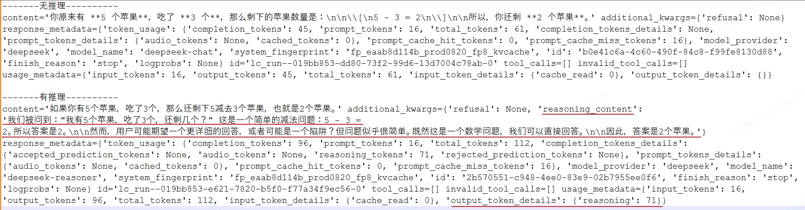
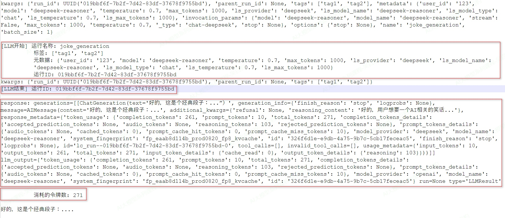

> 📌 **[AI 大模型与云原生全栈知识库](./README.md)** / **模块四：LangChain 框架与应用开发**
> 🏠 [返回主页 README](./README.md) \| ⚡ [面试 30 分钟速记](./interview/00_面试冲刺30分钟速记卡片.md) \| 🎓 [本模块面试题](./interview/03_LangChain与Agent架构面试题.md)

---

# 2\. **Models 模型**

## 2.1. **模型初始化**

LangChain 支持所有主流模型提供商，包括 OpenAI、Anthropic、Google、Azure、AWS Bedrock 等，每个提供商都提供多种具有不同功能的模型(Chat、Embedding、图像、多模态等)，有关 LangChain 支持模型的完整列表，请参阅：[https://docs.langchain.com/oss/python/integrations/providers/all\_providers](https://docs.langchain.com/oss/python/integrations/providers/all_providers)

LangChain中使用模型可以单独使用或者在Agent中使用，无论哪种使用方式，都要进行模型初始化，本小节重点讲解LangChain中单独使用模型的初始化方式，关于在Agent中使用大模型可以学习后续章节。

在 LangChain 中初始化模型，主要可以通过直接使用特定的Model Class和使用统一的init\_chat\_model函数这两种方式来实现，下面分别介绍。

### **2.1.1. Model Class方式初始化模型**

Model Class方式初始化模型最为直接，需要根据要使用的模型提供商，导入对应的具体类（如 ChatOpenAI, ChatAnthropic）并进行实例化。

下面以聊天模型为例介绍常见的聊天模式初始化：ChatOpenAI、ChatAnthropic、ChatDeepSeek、ChatOllama、ChatHunyuan、ChatTongyi、ChatZhipuAI按照如下步骤初始化各个模型。

**1) 安装必要依赖**

```python
#切换python环境
conda activate langchain_v1.2

#安装ChatOpenAI依赖包
pip install langchain-openai==1.1.6

#安装ChatAnthropic依赖包
pip install langchain-anthropic==1.3.1

#安装ChatDeepSeek 依赖包
pip install langchain-deepseek==1.0.1

#安装ChatOllama 依赖包
pip install langchain-ollama==1.0.1

#安装 ChatHunyuan、ChatTongyi、ChatZhipuAI依赖包
pip install langchain-community==0.4.1

#安装 ChatHunyuan依赖包
pip install tencentcloud-sdk-python==3.1.28

#安装 ChatTongyi依赖包
pip install dashscope==1.25.6

#安装 ChatZhipuAI依赖包
pip install pyjwt==2.10.1
```

**2) 在.env中配置各个模型所需的API\_KEY和模型BASE\_URL环境变量**

```python
DEEPSEEK_API_KEY=sk-...4
DEEPSEEK_BASE_URL=https://api.deepseek.com

OPENAI_API_KEY=sk-...F
OPENAI_BASE_URL=https://api.uchat.site/v1

ANTHROPIC_API_KEY=sk-...F
ANTHROPIC_BASE_URL=https://api.uchat.site

HUNYUAN_APP_ID=1...8
HUNYUAN_SECRET_ID=A...7
HUNYUAN_SECRET_KEY=Y0...W

DASHSCOPE_API_KEY=sk-...4
DASHSCOPE_BASE_URL=https://dashscope.aliyuncs.com/compatible-mode/v1

ZHIPUAI_API_KEY=e...k
ZHIPUAI_BASE_URL=https://open.bigmodel.cn/api/paas/v4
```

注意：以上OpenAI和Anthropic对应的apikey和base\_url 是通过中转key进行连接。

**3) 在env\_**[**util.py**](http://util.py)**文件中获取配置的API\_KEY和BASE\_URL环境变量的值**

```python
import os

from dotenv import load_dotenv

# override=True 确保.env文件优先
load_dotenv(override=True)

# 从环境变量读取配置
DEEPSEEK_API_KEY = os.getenv("DEEPSEEK_API_KEY")
DEEPSEEK_BASE_URL = os.getenv("DEEPSEEK_BASE_URL")

OPENAI_API_KEY = os.getenv("OPENAI_API_KEY")
OPENAI_BASE_URL = os.getenv("OPENAI_BASE_URL")

ANTHROPIC_API_KEY = os.getenv("ANTHROPIC_API_KEY")
ANTHROPIC_BASE_URL = os.getenv("ANTHROPIC_BASE_URL")

HUNYUAN_APP_ID = os.getenv("HUNYUAN_APP_ID")
HUNYUAN_SECRET_ID = os.getenv("HUNYUAN_SECRET_ID")
HUNYUAN_SECRET_KEY = os.getenv("HUNYUAN_SECRET_KEY")

DASHSCOPE_API_KEY = os.getenv("DASHSCOPE_API_KEY")
DASHSCOPE_BASE_URL = os.getenv("DASHSCOPE_BASE_URL")

ZHIPUAI_API_KEY = os.getenv("ZHIPUAI_API_KEY")
ZHIPUAI_BASE_URL = os.getenv("ZHIPUAI_BASE_URL")
```

**4) 在my\_**[**llm.py**](http://llm.py)**中创建各个聊天大模型对象**

```python
from langchain_anthropic import ChatAnthropic
from langchain_community.chat_models import ChatHunyuan, ChatTongyi, ChatZhipuAI
from langchain_deepseek import ChatDeepSeek
from langchain_ollama import ChatOllama
from langchain_openai import ChatOpenAI

from env_utils import DEEPSEEK_API_KEY, DEEPSEEK_BASE_URL, OPENAI_API_KEY, OPENAI_BASE_URL, ANTHROPIC_API_KEY, \
    ANTHROPIC_BASE_URL, HUNYUAN_APP_ID, HUNYUAN_SECRET_ID, HUNYUAN_SECRET_KEY, DASHSCOPE_API_KEY, DASHSCOPE_BASE_URL, \
    ZHIPUAI_API_KEY, ZHIPUAI_BASE_URL

# 创建DeepSeek LLM
deepseek_llm = ChatDeepSeek(
    api_key=DEEPSEEK_API_KEY,
    api_base=DEEPSEEK_BASE_URL, # 注意：这里是api_base，不是base_url
    model="deepseek-chat",
)


openai_llm = ChatOpenAI(
    api_key=OPENAI_API_KEY,
    base_url=OPENAI_BASE_URL,
    model="gpt-4",
)

anthropic_llm = ChatAnthropic(
    api_key=ANTHROPIC_API_KEY,
    base_url=ANTHROPIC_BASE_URL,
    model="claude-3-5-haiku-latest",
)


ollama_llm = ChatOllama(
    base_url="http://192.168.1.106:11434",
    model="deepseek-r1:1.5b",
)

hunyuan_llm = ChatHunyuan(
    hunyuan_app_id = HUNYUAN_APP_ID,
    hunyuan_secret_id = HUNYUAN_SECRET_ID,
    hunyuan_secret_key = HUNYUAN_SECRET_KEY,
    model="hunyuan-lite",
)

tongyi_llm = ChatTongyi(
    api_key=DASHSCOPE_API_KEY,
    model="qwen-plus",
)


zhipu_llm = ChatZhipuAI(
    api_key=ZHIPUAI_API_KEY,
    model="glm-4",
)
```

注意：使用不同的模型可能传入的参数名称不同，可以参考对应的源码。

**5) 创建init\_**[**model.py**](http://model.py)**文件测试连接各个大模型**

```python
from my_llm import openai_llm, anthropic_llm, deepseek_llm, ollama_llm, hunyuan_llm, tongyi_llm, zhipu_llm

print(openai_llm.invoke("请介绍一下你自己"))
print(anthropic_llm.invoke("请介绍一下你自己"))
print(deepseek_llm.invoke("请介绍一下你自己"))
print(ollama_llm.invoke("请介绍一下你自己"))
print(hunyuan_llm.invoke("请介绍一下你自己"))
print(tongyi_llm.invoke("请介绍一下你自己"))
print(zhipu_llm.invoke("请介绍一下你自己"))
```

使用Model Class方式初始化模型注意如下几点：

* **关于ChatOpenAI Model Class 进一步扩展使用**

如果一些模型供应商也同时兼容OpenAI ,那么也可以直接使用ChatOpenAI方式进行连接，这样对于一些目前LangChain不支持的模型供应商，但这些供应商支持标准的OpenAI 方式连接，就可以使用这种方式。例如：

```python
# 通过ChatOpenAI 连接deepseek模型
deepseek_llm2 = ChatOpenAI(
    api_key=DEEPSEEK_API_KEY,
    base_url=DEEPSEEK_BASE_URL,
    model="deepseek-chat",
)

#通过ChatOpenAI 连接通义千问模型
tongyi_llm2 = ChatOpenAI(
    api_key=DASHSCOPE_API_KEY,
    base_url=DASHSCOPE_BASE_URL,
    model="qwen-plus",
)

#通过ChatOpenAI 连接智普AI模型
zhipu_llm2 = ChatOpenAI(
    api_key=ZHIPUAI_API_KEY,
    base_url=ZHIPUAI_BASE_URL,
    model="glm-4",
)
```

* **关于各个聊天模型LangChain使用方式可以参考如下官网**

| **模型**供应商 | **LangChain使用相关链接**                                                                                                     |
| -------------------- | ----------------------------------------------------------------------------------------------------------------------------------- |
| **OpenAI**     | https://docs.langchain.com/oss/python/integrations/chat/openai                                                                      |
| **Anthropic**  | [https://docs.langchain.com/oss/python/integrations/chat/anthropic](https://docs.langchain.com/oss/python/integrations/chat/anthropic) |
| **DeepSeek**   | https://docs.langchain.com/oss/python/integrations/chat/deepseek                                                                    |
| **Ollama**     | https://docs.langchain.com/oss/python/integrations/chat/ollama                                                                      |
| **腾讯混元**   | https://docs.langchain.com/oss/python/integrations/chat/tencent_hunyuan                                                             |
| **通义千问**   | https://docs.langchain.com/oss/python/integrations/chat/tongyi                                                                      |
| **智普AI**     | [https://docs.langchain.com/oss/python/integrations/chat/zhipuai](https://docs.langchain.com/oss/python/integrations/chat/zhipuai)     |

* **关于各个聊天模型在线API\_Key及BaseURL查找**

OpenAI:

> api_key地址：https://platform.openai.com/api-keys
>
> base_url地址：固定值：https://api.openai.com/v1
>
> 模型地址：[https://platform.openai.com/docs/models](https://platform.openai.com/docs/models)
>
> 模型价格：https://platform.openai.com/docs/pricing

Anthropic:

> api_key地址：https://console.anthropic.com/settings/keys
>
> base_url地址：https://console.anthropic.com/docs/zh-CN/get-started
>
> 模型地址：https://console.anthropic.com/docs/zh-CN/about-claude/models/overview
>
> 模型价格：https://console.anthropic.com/docs/zh-CN/about-claude/pricing

DeepSeek:

> api_key地址：[https://platform.deepseek.com/api_keys](https://platform.deepseek.com/api_keys)
>
> base_url地址:https://api-docs.deepseek.com/zh-cn/
>
> 模型地址：[https://api-docs.deepseek.com/zh-cn/quick_start/pricing](https://api-docs.deepseek.com/zh-cn/quick_start/pricing)
>
> 模型价格：[https://api-docs.deepseek.com/zh-cn/quick_start/pricing](https://api-docs.deepseek.com/zh-cn/quick_start/pricing)

腾讯混元：

> api_key地址：[https://console.cloud.tencent.com/cam/capi](https://console.cloud.tencent.com/cam/capi)
>
> base_url地址：https://cloud.tencent.com/document/api/1729/105701
> 模型地址：[https://cloud.tencent.com/document/product/1729/104753](https://cloud.tencent.com/document/product/1729/104753)
>
> 模型价格：https://cloud.tencent.com/document/product/1729/97731

通义千问：

> api_key地址：[https://bailian.console.aliyun.com/?tab=model#/api-key](https://bailian.console.aliyun.com/?tab=model#/api-key)
>
> base_url地址：[https://bailian.console.aliyun.com/?tab=api#/api](https://bailian.console.aliyun.com/?tab=api#/api)
>
> 模型地址：[https://bailian.console.aliyun.com/?tab=model#/model-market/all](https://bailian.console.aliyun.com/?tab=model#/model-market/all)
>
> 模型价格：https://bailian.console.aliyun.com/?tab=doc#/doc/?type=model&url=2987148

智普AI:

> api_key地址：[https://bigmodel.cn/usercenter/proj-mgmt/apikeys](https://bigmodel.cn/usercenter/proj-mgmt/apikeys)
>
> base_url地址：https://docs.bigmodel.cn/cn/api/introduction
>
> 模型地址：[https://docs.bigmodel.cn/cn/guide/start/model-overview](https://docs.bigmodel.cn/cn/guide/start/model-overview)
>
> 模型价格：https://open.bigmodel.cn/pricing

| 模型供应商          | 相关链接                                                                                                                                                                                                                                                                                                                      |
| ------------------- | ----------------------------------------------------------------------------------------------------------------------------------------------------------------------------------------------------------------------------------------------------------------------------------------------------------------------------- |
| **OpenAI**    | api_key地址：https://platform.openai.com/api-keys&#x3c;br />&#x3c;br />base_url地址：固定值：https://api.openai.com/v1&#x3c;br />模型地址：https://platform.openai.com/docs/models&#x3c;br />模型价格：https://platform.openai.com/docs/pricing                                                                               |
| **Anthropic** | api_key地址：https://console.anthropic.com/settings/keys&#x3c;br />base_url地址：https://console.anthropic.com/docs/zh-CN/get-started&#x3c;br />模型地址：https://console.anthropic.com/docs/zh-CN/about-claude/models/overview&#x3c;br />模型价格：https://console.anthropic.com/docs/zh-CN/about-claude/pricing             |
| **DeepSeek**  | api_key地址：https://platform.deepseek.com/api_keys&#x3c;br />base_url地址:https://api-docs.deepseek.com/zh-cn/&#x3c;br />模型地址：https://api-docs.deepseek.com/zh-cn/quick_start/pricing&#x3c;br />模型价格：https://api-docs.deepseek.com/zh-cn/quick_start/pricing                                                       |
| **腾讯混元**  | api_key地址：https://console.cloud.tencent.com/cam/capi&#x3c;br />base_url地址：https://cloud.tencent.com/document/api/1729/105701&#x3c;br />模型地址：https://cloud.tencent.com/document/product/1729/104753&#x3c;br />模型价格：https://cloud.tencent.com/document/product/1729/97731                                       |
| **通义千问**  | api_key地址：https://bailian.console.aliyun.com/?tab=model#/api-key&#x3c;br />base_url地址：https://bailian.console.aliyun.com/?tab=api#/api&#x3c;br />模型地址：https://bailian.console.aliyun.com/?tab=model#/model-market/all&#x3c;br />模型价格：https://bailian.console.aliyun.com/?tab=doc#/doc/?type=model&url=2987148 |
| **智普AI**    | api_key地址：https://bigmodel.cn/usercenter/proj-mgmt/apikeys&#x3c;br />base_url地址：https://docs.bigmodel.cn/cn/api/introduction&#x3c;br />模型地址：https://docs.bigmodel.cn/cn/guide/start/model-overview&#x3c;br />模型价格：https://open.bigmodel.cn/pricing                                                            |

### **2.1.2. init\_chat\_model初始化模型**

init\_chat\_model 初始化模型是LangChain v1.0版本后推出的模型统一初始化方法，该方法像一个智能工厂，需要传入“model”（模型）、“model\_provider”（模型提供商）、“api\_key”、“base\_url”参数自动创建出对应的模型实例。初始化模型后，调用模型方式与ModelClass 方式完全一致。

model\_provider支持的常见参数:openai、anthropic、deepseek、ollama，同样，如果使用的模型供应商没有对应的provider，但是该模型供应商支持标准OpenAI访问，那么可以设置“model\_provider”为“openai”。

下面基于上文创建的.env、env\_[utils.py](http://utils.py)文件来演示init\_chat\_model方式初始化模型使用。

**1) 创建“init\_**[**llm.py**](http://llm.py)**”文件使用 init\_chat\_model方式初始化模型**

```python
from langchain.chat_models import init_chat_model
from langchain_core.language_models import BaseChatModel

from env_utils import DEEPSEEK_API_KEY, DEEPSEEK_BASE_URL, OPENAI_API_KEY, OPENAI_BASE_URL, ANTHROPIC_API_KEY, \
    ANTHROPIC_BASE_URL, DASHSCOPE_API_KEY, DASHSCOPE_BASE_URL, ZHIPUAI_API_KEY, ZHIPUAI_BASE_URL

deepseek_llm: BaseChatModel = init_chat_model(
    model="deepseek-chat",
    model_provider="deepseek",
    api_key=DEEPSEEK_API_KEY,
    base_url=DEEPSEEK_BASE_URL,
)


openai_llm = init_chat_model(
    model="gpt-4",
    model_provider="openai",
    api_key=OPENAI_API_KEY,
    base_url=OPENAI_BASE_URL,
)

anthropic_llm = init_chat_model(
    model="claude-3-5-haiku-latest",
    model_provider="anthropic",
    api_key=ANTHROPIC_API_KEY,
    base_url=ANTHROPIC_BASE_URL,
)


ollama_llm = init_chat_model(
    model="deepseek-r1:1.5b",
    model_provider="ollama",
    base_url="http://192.168.1.106:11434",
)


tongyi_llm = init_chat_model(
    model="qwen-plus",
    model_provider="openai",
    api_key=DASHSCOPE_API_KEY,
    base_url=DASHSCOPE_BASE_URL,

)

zhipu_llm = init_chat_model(
    model="glm-4",
    model_provider="openai",
    api_key=ZHIPUAI_API_KEY,
    base_url=ZHIPUAI_BASE_URL,

)
```

**2) 在init\_**[**model.py**](http://model.py)**文件追加写入如下内容测试连接各个大模型**

```python
from init_llm import deepseek_llm, openai_llm, anthropic_llm, ollama_llm, tongyi_llm, zhipu_llm

print(deepseek_llm.invoke("请介绍一下你自己"))
print(openai_llm.invoke("请介绍一下你自己"))
print(anthropic_llm.invoke("请介绍一下你自己"))
print(ollama_llm.invoke("请介绍一下你自己"))
print(tongyi_llm.invoke("请介绍一下你自己"))
print(zhipu_llm.invoke("请介绍一下你自己"))
```

### **2.1.3. 模型初始化参数解释**

在LangChain中，Model Class 和init\_chat\_model初始化模型共同的参数及解释：

| **参数**        | **类型** | **参数描述**                                                       |
| --------------------- | -------------- | ------------------------------------------------------------------------ |
| **model**       | string         | 指定要使用的模型标识符。                                                 |
| **api_key**     | string         | 用于身份验证的API密钥。建议通过环境变量设置，避免硬编码。                |
| **base_url**    | string         | 指定API端点。                                                            |
| **temperature** | number         | 控制输出的随机性，值越低，结果越确定、保守；值越高，结果越多样、有创意。 |
| **max_tokens**  | number         | 限制模型响应生成的最大令牌数，有效控制回复长度。                         |
| **timeout**     | number         | 设置等待模型响应的最大时间（秒），超时则取消请求。                       |
| **max_retries** | number         | 定义请求失败（如网络问题、速率限制）时的最大重试次数，提高鲁棒性。       |

特别提示：

* Model Class初始化模型中每个聊天模型可能有额外的参数，可以参考对应的LangChain集成页面查看；model\_provider是init\_chat\_model方法中指定模型供应商的参数。
* Token并非简单的“字”或“词”，而是大模型通过分词器（Tokenizer）将输入文本拆分后的最小语义单元。不同的模型采用不同的分词算法（如BPE、WordPiece），因此同一段文本在不同模型中的Token数量可能不同。
  * 英文Token估算：1个Token约对应0.75个英文单词或4个字符；
  * 中文Token估算：1个汉字通常对应1~2个Token，但优化较好的模型（如通义千问、文心一言）约1:1的映射。

## 2.2. **模型调用**

在 LangChain 中，模型调用（Invocation）是指通过特定方法触发大语言模型生成输出的过程。根据不同的应用场景和需求，LangChain 提供了几种核心的调用方式，主要是 invoke(), stream()和 batch()方法，以及它们的异步版本 ainvoke(), astream(), 和 abatch(),下面将系统地介绍这些方法。

| **核心方法**  | **主要特点**          | **适用场景**                                   |
| ------------------- | --------------------------- | ---------------------------------------------------- |
| **invoke()**  | 阻塞式，一次性返回完整结果  | 简单问答、批处理任务、无需实时反馈的场景。           |
| **ainvoke()** | 非阻塞，提高系统吞吐量      | 高并发Web应用、IO密集型任务。                        |
| **stream()**  | 流式输出，实时返回每个token | 聊天机器人、长文本生成、需要提升用户体验的交互应用。 |
| **asteam()**  | 非阻塞，提高系统吞吐量      | 高并发Web应用、IO密集型任务。                        |
| **batch()**   | 批量处理多个输入            | 高并发场景，需要同时处理大量请求。                   |
| **abatch()**  | 非阻塞，提高系统吞吐量      | 高并发Web应用、IO密集型任务。                        |

### **2.2.1. Invoke调用模型**

invoke()是最直接、最常用的模型调用方法。它的工作模式是阻塞式的，即程序会等待模型完全生成整个响应后，再一次性将结果返回给用户。

invoke方法非常灵活，支持三种形式的输入：单条消息、消息列表（字典格式）、消息列表（消息对象格式）。

**1) 单条消息**

该方式是最简单的方式，直接传入一个问题或指令，适用于不需要保留对话历史的简单生成任务。

```python
from init_llm import deepseek_llm

# 单条消息调用
resp = deepseek_llm.invoke("请介绍一下你自己")
print(resp.content)  # 输出:你好！我是DeepSeek，由深度求索公司创造的AI助手...
```

**2) 消息列表（字典格式）**

该方式用于表达多轮对话历史，每条消息都需要通过 role字段指定其角色（如 system, user, assistant）。

```python
from init_llm import deepseek_llm
#消息列表（字典格式）调用
conversation = [
    {"role": "system", "content": "你是一个有帮助的助手，可以将汉语翻译成英语。"},
    {"role": "user", "content": "翻译: 我喜欢编程"},
    {"role": "assistant", "content": "I love programming."},
    {"role": "user", "content": "翻译: 我喜欢大模型"}
]
resp= deepseek_llm.invoke(conversation)
print(resp.content)  # 输出: I like large models.
```

**3) 消息列表（消息对象格式）**

这是LangChain推荐的方式，使用内置的消息类（如 SystemMessage, HumanMessage, AIMessage），类型更安全，功能也更丰富。

```python
from init_llm import deepseek_llm
from langchain_core.messages import SystemMessage, HumanMessage, AIMessage

conversation = [
    SystemMessage("你是一个有帮助的助手，可以将汉语翻译成英语。"),
    HumanMessage("翻译: 我喜欢编程"),
    AIMessage("I love programming."),
    HumanMessage("翻译: 我喜欢大模型")
]
resp = deepseek_llm.invoke(conversation)
print(resp.content)  # 输出: I like large models.
```

使用Invoke时注意如下几点：

* 关于Message types有 System message、Human message、AI message 、ToolMessage四种，解释如下：
  * System message：用于在对话开始时为模型设定角色、行为准则和上下文背景。它像是给AI助手的一份工作说明书，决定了其回答问题的风格、领域和专业范围。
  * HumanMessage：代表用户的输入，包含简单的文本问题，也可以是复杂的多模态内容（如图片、音频、文档等）。在多轮对话中，它表示用户的一次发言。
  * AIMessage ：代表模型的输出或回复，包括生成的文本、工具调用、元数据等。
  * ToolMessage：将工具执行的结果返回给模型，让模型基于这个结果继续生成回复。
* 在“消息列表（字典格式）”输入中，支持“system、user、assistant”写法，在某些支持高级功能（如工具调用）的场景下，还可能看到 "tool"等角色，虽然 "user"和 "human"有时可以互换，但遵循你选择的主要模型提供商（如OpenAI）的惯例使用 "user"是最稳妥的做法。
* ChatModel（聊天模型）的 invoke方法返回的是一个 AIMessage对象，你需要通过 .content属性来获取模型生成的文本内容。

### **2.2.2. 流式调用模型**

流式传输调用大模型允许大语言模型（LLM）在生成内容的过程中，逐块（Chunk）地实时输出结果，而不是等待整个响应完全生成后再一次性返回。流式调用大模型使用方式是通过调用 [model.stream](http://model.stream)()方法会返回一个迭代器（Iterator），你可以通过循环来实时处理每一个新生成的内容块。

使用示例：

```python
from typing import Iterator
from langchain_core.messages import AIMessageChunk
from init_llm import deepseek_llm

resp : Iterator[AIMessageChunk] = deepseek_llm.stream("使用20个字给我介绍什么是大模型？")

for chunk in resp:
    # print(chunk,type(chunk))
    #end="" 避免打印时自动换行，flush=True 及时刷新输出
    print(chunk.content, end="|", flush=True)
```

注意：stream()方法是流式调用，立即返回一个迭代器，逐个产生 AIMessageChunk对象。每个块都包含输出内容的一部分，并且这些块可以通过拼接，最终组合成一个完整的消息，其最终效果与使用 invoke()得到的结果一致。

### **2.2.3. 批量调用模型**

LangChain 中的批处理功能是一种通过并行处理多个独立请求来显著提升性能、降低成本的强大机制。批处理的核心思想是将多个独立的请求集合成一个批次，并行发送给模型处理。这与逐个顺序调用（invoke）相比，能大幅减少网络往返开销和等待时间，尤其适合处理问答、文本分类、情感分析等独立任务。

batch使用示例：

```python
from langchain_core.runnables.utils import Output

from init_llm import deepseek_llm

responses:list[Output] = deepseek_llm.batch([
    "为什么鹦鹉的羽毛是彩色的？",
    "飞机是如何飞行的？",
    "什么是量子计算？"
])

for response in responses:
    print(response.content)
```

以上运行代码后输出结果如下：

```python
========================================
鹦鹉羽毛的绚丽色彩主要源于**色素沉积**、**结构色**以及**两者结合**的复杂机制，这些特征在进化中具有重要的生物学意义。以下是详细的解释：
... ...
========================================
这是一个非常棒的问题！飞机的飞行是一个复杂但可以被基本原理解释的现象。简单来说，飞机能够飞行主要依赖于四个关键物理原理的协同作用：**升力、推力、重力（重量）和阻力**。
... ...
========================================
量子计算是一种**利用量子力学原理进行信息处理的新型计算范式**，其核心在于利用量子比特（qubit）超越传统计算机的限制。以下是关键概念的清晰解析：
... ...
```

batch()特点是等待所有请求处理完毕，按原始输入顺序返回结果列表。当输入列表很大或单个模型调用耗时差异显著时，batch\_as\_completed()允许应用在收到第一个结果后立即开始后续处理，而不必等待最慢的那个请求，也就是说

batch\_as\_completed() 每个请求完成后立即 yield 结果，结果可能乱序，但包含索引信息。

batch\_as\_completed使用示例如下：

```python
from typing import Iterator

from langchain_core.runnables.utils import Output

from init_llm import deepseek_llm

responses:Iterator[tuple[int, Output | Exception]] = deepseek_llm.batch_as_completed([
    "为什么鹦鹉的羽毛是彩色的？",
    "飞机是如何飞行的？",
    "什么是量子计算？"
])

for response in responses:
    print(response) # response 是一个元组，包含索引和输出
    # response 包含结果及其在原始列表中的索引
    print(f"第 {response[0]} 个问题回答完毕: {response[1].content}")
```

以上代码运行结果如下：

```python
(0, AIMessage(content='鹦鹉羽毛的绚丽色彩主要源于... ...也展现了生物适应环境的多样性。', additional_kwargs={'refusal': None}, response_metadata={'token_usage': {'completion_tokens': 479, 'prompt_tokens': 12, 'total_tokens': 491, 'completion_tokens_details': None, 'prompt_tokens_details': {'audio_tokens': None, 'cached_tokens': 0}, 'prompt_cache_hit_tokens': 0, 'prompt_cache_miss_tokens': 12}, 'model_provider': 'deepseek', 'model_name': 'deepseek-chat', 'system_fingerprint': 'fp_eaab8d114b_prod0820_fp8_kvcache', 'id': 'c06c849a-8f33-4814-9994-bdf9ec8181f8', 'finish_reason': 'stop', 'logprobs': None}, id='lc_run--019bb62c-0fdb-7672-a5c9-17262b980f48-0', tool_calls=[], invalid_tool_calls=[], usage_metadata={'input_tokens': 12, 'output_tokens': 479, 'total_tokens': 491, 'input_token_details': {'cache_read': 0}, 'output_token_details': {}}))
第 0 个问题回答完毕: 鹦鹉羽毛的绚丽色彩主要源于**色素沉积**和**结构色**的复杂结合，这两种机制共同... ...

(2, AIMessage(content='量子计算是一种... ...经典计算协同解决问题。', additional_kwargs={'refusal': None}, response_metadata={'token_usage': {'completion_tokens': 609, 'prompt_tokens': 8, 'total_tokens': 617, 'completion_tokens_details': None, 'prompt_tokens_details': {'audio_tokens': None, 'cached_tokens': 0}, 'prompt_cache_hit_tokens': 0, 'prompt_cache_miss_tokens': 8}, 'model_provider': 'deepseek', 'model_name': 'deepseek-chat', 'system_fingerprint': 'fp_eaab8d114b_prod0820_fp8_kvcache', 'id': '1ea8920c-5f59-4647-ad4d-9f57667169f3', 'finish_reason': 'stop', 'logprobs': None}, id='lc_run--019bb62c-0fdc-7e21-9238-5be55277fb12-0', tool_calls=[], invalid_tool_calls=[], usage_metadata={'input_tokens': 8, 'output_tokens': 609, 'total_tokens': 617, 'input_token_details': {'cache_read': 0}, 'output_token_details': {}}))
第 2 个问题回答完毕: 量子计算是... ...解决问题。

(1, AIMessage(content='这是一个... ...由翱翔于天际。', additional_kwargs={'refusal': None}, response_metadata={'token_usage': {'completion_tokens': 1098, 'prompt_tokens': 9, 'total_tokens': 1107, 'completion_tokens_details': None, 'prompt_tokens_details': {'audio_tokens': None, 'cached_tokens': 0}, 'prompt_cache_hit_tokens': 0, 'prompt_cache_miss_tokens': 9}, 'model_provider': 'deepseek', 'model_name': 'deepseek-chat', 'system_fingerprint': 'fp_eaab8d114b_prod0820_fp8_kvcache', 'id': 'c900a219-024c-406f-b786-cb4181828f30', 'finish_reason': 'stop', 'logprobs': None}, id='lc_run--019bb62c-0fdb-7672-a5c9-17345aae478b-0', tool_calls=[], invalid_tool_calls=[], usage_metadata={'input_tokens': 9, 'output_tokens': 1098, 'total_tokens': 1107, 'input_token_details': {'cache_read': 0}, 'output_token_details': {}}))
第 1 个问题回答完毕: 这是一个既简单... ...天际。
```

此外，当需要处理大量输入时，为了避免对模型服务造成过大压力或触发速率限制，可以通过 RunnableConfig字典中的 max\_concurrency参数来控制最大并行数。

使用示例如下：

```python
# 限制最多同时进行5个并发调用
model.batch(
    large_list_of_inputs,
    config={
        'max_concurrency': 5  # 限制最大并发数为5
    }
)
```

### **2.2.4. 异步调用模型**

在LangChain框架中，异步方法（ainvoke、astream、abatch）与它们的同步版本（invoke、stream、batch）相比，具备如下特点：

* 避免阻塞主线程：同步调用会阻塞程序执行，而异步方法让应用程序在等待API响应时保持响应性。
* 优化资源利用：异步操作可以更高效地利用系统资源，减少空闲等待时间

下面通过一个完整的示例展示如何在LangChain中使用异步方法调用模型。

```python
import asyncio
import time
from langchain.chat_models import init_chat_model

from env_utils import DEEPSEEK_API_KEY, DEEPSEEK_BASE_URL

# 初始化模型
llm = init_chat_model(
    model="deepseek-chat",
    model_provider="deepseek",
    api_key=DEEPSEEK_API_KEY,
    base_url=DEEPSEEK_BASE_URL,
)


async def demo_async_invoke():
    """演示单个异步调用的非阻塞特性"""
    print("=== 演示：ainvoke 的异步（非阻塞）效果 ===")

    print("程序开始...")

    # 1. 发起一个异步请求，但不等待它完成
    print(">>> 发起异步模型调用 (ainvoke)...")
    async_task = llm.ainvoke("用一句话解释人工智能。")

    # 2. 在等待模型响应的同时，主程序可以继续执行其他任务
    print(">>> 模型请求已发送，程序无需等待，继续执行...")
    for i in range(3):
        # 等待1s
        await asyncio.sleep(1)
        print(f">>> 正在执行第{i + 1}个任务... ")

    # 3. 现在，我们需要模型的结果了，所以用 await 等待它完成
    print(">>> 其他任务已完成，现在等待模型返回结果...")
    response = await async_task  # 此时才开始等待

    print(f">>> 模型返回: {response.content}")


async def demo_async_stream():
    """演示异步调用的非阻塞特性"""
    print("=== 演示：astream 的异步（非阻塞）效果 ===")

    print("程序开始...")

    # 1. 发起异步流式请求，但不立即处理结果
    print(">>> 发起异步流式调用 (astream)...")
    stream_resp = llm.astream("请一句话解释机器学习的基本概念。")

    # 2. 在等待流式响应的同时，执行其他任务
    print(">>> 流式请求已发送，程序无需等待，继续执行...")
    for i in range(3):
        # 等待1s
        await asyncio.sleep(1)
        print(f">>> 正在执行第{i + 1}个任务... ")

    # 3. 现在开始处理流式结果
    print(">>> 其他任务已完成，开始处理流式结果...")

    print(">>> 流式输出: ", end="", flush=True)
    async for chunk in stream_resp:
        if hasattr(chunk, 'content'):
            print(chunk.content, end="", flush=True)
    print(">>> 流式输出结束\n")

async def demo_async_batch():
    """演示单个异步调用的非阻塞特性"""
    print("=== 演示：abatch 的异步（非阻塞）效果 ===")

    print("程序开始...")

    # 准备批量输入（即使是单个输入，也用列表形式）
    questions = ["用一句话说明深度学习与传统机器学习的区别"]

    # 1. 发起异步批量请求
    print(">>> 发起异步批量调用 (abatch)...")
    batch_resp = llm.abatch(questions)

    # 2. 在等待批量处理的同时，执行其他任务
    print(">>> 批量请求已发送，程序无需等待，继续执行...")
    for i in range(3):
        # 等待1s
        await asyncio.sleep(1)
        print(f">>> 正在执行第{i + 1}个任务... ")

    # 3. 等待批量处理结果
    print(">>> 其他任务已完成，现在等待批量处理结果...")
    responses = await batch_resp

    for response in responses:
        print(f">>> 批量响应: {response.content}")

async def main():
    """主函数"""
    await demo_async_invoke()
    await demo_async_stream()
    await demo_async_batch()


if __name__ == "__main__":
    asyncio.run(main())
```

以上代码运行后的结果如下：

```python
=== 演示：ainvoke 的异步（非阻塞）效果 ===
程序开始...
>>> 发起异步模型调用 (ainvoke)...
>>> 模型请求已发送，程序无需等待，继续执行...
>>> 正在执行第1个任务... 
>>> 正在执行第2个任务... 
>>> 正在执行第3个任务... 
>>> 其他任务已完成，现在等待模型返回结果...
>>> 模型返回: 人工智能是让机器模拟人类智能行为的技术。
=== 演示：astream 的异步（非阻塞）效果 ===
程序开始...
>>> 发起异步流式调用 (astream)...
>>> 流式请求已发送，程序无需等待，继续执行...
>>> 正在执行第1个任务... 
>>> 正在执行第2个任务... 
>>> 正在执行第3个任务... 
>>> 其他任务已完成，开始处理流式结果...
>>> 流式输出: 机器学习是让计算机从数据中自动学习规律并做出预测或决策的技术。>>> 流式输出结束

=== 演示：abatch 的异步（非阻塞）效果 ===
程序开始...
>>> 发起异步批量调用 (abatch)...
>>> 批量请求已发送，程序无需等待，继续执行...
>>> 正在执行第1个任务... 
>>> 正在执行第2个任务... 
>>> 正在执行第3个任务... 
>>> 其他任务已完成，现在等待批量处理结果...
>>> 批量响应: 深度学习通过多层神经网络自动学习数据的层次化特征，而传统机器学习更依赖人工设计的特征和浅层模型。
```

## 2.3. **模型结构化输出**

调用模型时，我们可以设置结构化输出来约束大模型输出结果，使其符合预定义的数据结构（如 JSON、Pydantic 模型或字典），而不是任意的自然文本。确保模型生成的结果能够被程序精准解析，并无缝集成到下游系统（如数据库、API 或前端展示逻辑）中，从而显著提升应用的可靠性和自动化程度。

### **2.3.1. 定义输出结构的模式**

在 LangChain 中，可以使用如下三种方式定义期望的输出结构：Pydantic 模型、TypedDict、JSON Schema，调用大模型时，三种方式都可通过“with\_structured\_output”方法来返回结构化结果。

#### **2.3.1.1. Pydantic 模型（推荐）**

Pydantic 模型是使用 Python 的 Pydantic 库定义强类型数据模型,支持复杂嵌套结构。适合需要严格数据验证和复杂结构的场景，如生成 API 响应。

Pydanitc是一个基于 Python 类型注解的库，它通过在运行时强制执行类型提示，确保数据的正确性和一致性，定义这种类型时需要创建一个继承自BaseModel的类，使用类型提示（如 str, int）和 Field函数来声明每个字段的名称、类型、默认值和描述。使用方式参考：[https://docs.pydantic.dev/latest/concepts/models/#basic-model-usage。](https://docs.pydantic.dev/latest/concepts/models/#basic-model-usage。)

* **示例一（返回简单结构）**

```python
from pydantic import BaseModel, Field

from init_llm import deepseek_llm


class Movie(BaseModel):
    title: str = Field(description="电影标题")
    year: int = Field(description="上映年份")
    director: str = Field(description="导演")
    rating: float = Field(description="评分（10分制）")

# 设置模型结构化输出
model_with_structure  = deepseek_llm.with_structured_output(Movie)

# 调用模型并获取结构化输出
resp:Movie = model_with_structure.invoke("给我介绍下电影《星际穿越》")

print(type(resp))
print(resp)
```

运行代码后结果如下：

```python
<class '__main__.Movie'>
title='星际穿越' year=2014 director='克里斯托弗·诺兰' rating=9.3
```

注意：定义类型中字段的description 可以不写，但是强烈建议写上，这样可以帮助模型理解该字段应该存入什么样的数据。

* **示例二:（返回嵌套结构）**

```python
"""
使用 Pydantic 定义嵌套结构
"""
from pydantic import BaseModel, Field
from typing import List

# 1. 定义嵌套的 Pydantic 模型
class Actor(BaseModel):
    name: str = Field(description="演员姓名")
    role: str = Field(description="饰演的角色")

class Movie(BaseModel):
    title: str = Field(description="电影标题")
    year: int = Field(description="上映年份")
    director: str = Field(description="导演")
    cast: List[Actor] = Field(description="演员列表")  # 定义列表字段
    rating: float = Field(description="评分")

# 2. 初始化模型并绑定输出结构
structured_model = deepseek_llm.with_structured_output(Movie)

# 3. 调用模型，直接获取 Movie 实例
response = structured_model.invoke("请介绍电影《盗梦空间》")

# 4. 访问嵌套数据
print(f"电影名: {response.title}")
print(f"上映年份: {response.year}")
print(f"导演: {response.director}")
print(f"演员列表: {response.cast}")
print(f"评分: {response.rating}")
```

以上代码输出结果如下：

```python
电影名: 盗梦空间
上映年份: 2010
导演: 克里斯托弗·诺兰
演员列表: [Actor(name='莱昂纳多·迪卡普里奥', role='多姆·柯布'), Actor(name='约瑟夫·高登-莱维特', role='亚瑟'), Actor(name='艾伦·佩姬', role='阿里阿德涅'), Actor(name='汤姆·哈迪', role='伊姆斯'), Actor(name='渡边谦', role='斋藤'), Actor(name='玛丽昂·歌迪亚', role='梅尔')]
评分: 8.8
```

#### **2.3.1.2. TypedDict**

TypedDict 是 Python 3.8+ 引入的一种类型提示工具，它允许为字典对象定义固定的键名和对应的值类型。TypeDict是使用 Python 的 TypedDict来定义带有类型提示的字典结构，无需额外依赖，适合需要快速定义字典结构且无需 Pydantic 重量级功能的场景。

* **示例一（返回简单结构）**

```python
"""
使用 TypedDict 模型定义结构化输出
"""
from init_llm import deepseek_llm
from typing_extensions import TypedDict, Annotated


class MovieTypedDict(TypedDict):
    title: Annotated[str, "电影的正式名称，例如《盗梦空间》"]
    year: Annotated[int, "电影的公映年份，使用四位数字表示"]
    director: Annotated[str, "电影导演的全名"]
    rating: Annotated[float, "电影在10分制下的评分，可包含一位小数"]

# 设置模型结构化输出
model_with_structure  = deepseek_llm.with_structured_output(MovieTypedDict)

# 调用模型并获取结构化输出
resp:MovieTypedDict = model_with_structure.invoke("给我介绍下电影《星际穿越》")

print(type(resp))
print(resp)
```

代码运行结果如下：

```python
<class 'dict'>
{'title': '星际穿越', 'year': 2014, 'director': '克里斯托弗·诺兰', 'rating': 9.4}
```

* **示例二（返回嵌套结构）**

```python
from typing import TypedDict, List, Annotated

from init_llm import deepseek_llm

# 使用TypedDict定义嵌套结构
class Actor(TypedDict):
    name: Annotated[str, "演员姓名"]
    role: Annotated[str, "饰演的角色"]

class Movie(TypedDict):
    title: Annotated[str, "电影标题"]
    year: Annotated[int, "上映年份"]
    director: Annotated[str, "导演"]
    cast: Annotated[List[Actor], "演员列表"]  # 嵌套列表定义
    rating: Annotated[float, "评分"]

# 设置模型结构化输出
model_with_structure  = deepseek_llm.with_structured_output(Movie)

# 调用模型并获取结构化输出
resp:Movie = model_with_structure.invoke("给我介绍下电影《盗梦空间》")

# 访问嵌套数据
print(f"电影名: {resp['title']}")
print(f"上映年份: {resp['year']}")
print(f"导演: {resp['director']}")
print(f"演员列表:{resp['cast']}")
print(f"评分: {resp['rating']}")
```

以上代码运行结果如下：

```python
电影名: 盗梦空间
上映年份: 2010
导演: 克里斯托弗·诺兰
演员列表:[{'name': '莱昂纳多·迪卡普里奥', 'role': '多姆·柯布'}, {'name': '约瑟夫·高登-莱维特', 'role': '亚瑟'}, {'name': '艾伦·佩姬', 'role': '阿里阿德涅'}, {'name': '汤姆·哈迪', 'role': '伊姆斯'}, {'name': '渡边谦', 'role': '斋藤'}, {'name': '玛丽昂·歌迪亚', 'role': '梅尔'}]
评分: 8.8
```

#### **2.3.1.3. JSON Schema**

JSON Schema是提供一个标准的 JSON Schema 字典来定义结构。适合需要与多种编程语言交互或进行复杂数据约束定义的场景。

* **使用示例一（返回简单结构）**

```python
"""
使用 JSON Schema 模型定义结构化输出
"""
from init_llm import deepseek_llm

# 使用 JSON Schema（最灵活，跨语言友好）
json_schema = {
    "title": "MovieInfo",
    "description": "包含电影标题、上映年份、导演和评分的电影对象",
    "type": "object",
    "properties": {
        "title": {"type": "string", "description": "电影标题"},
        "year": {"type": "integer", "description": "上映年份"},
        "director": {"type": "string", "description": "导演"},
        "rating": {"type": "number", "description": "评分（10分制）"}
    },
    "required": ["title", "year", "director", "rating"]
}

# 设置模型结构化输出
model_with_structure  = deepseek_llm.with_structured_output(json_schema)

# 调用模型并获取结构化输出
resp = model_with_structure.invoke("给我介绍下电影《星际穿越》")

print(type(resp))
print(resp)
```

运行结果如下：

```python
<class 'dict'>
{'title': '星际穿越', 'year': 2014, 'director': '克里斯托弗·诺兰', 'rating': 8.6}
```

注意以上代码中定义json\_schema的时候指定的title, description, type, properties, required是是遵循 JSON Schema 规范的标准关键字，是固定写法。几个关键字的解释如下：

> title：为整个 Schema 或特定属性提供一个人类可读的标题，不能是中文，用于提高可读性。

> description：提供更详细的文字描述，说明 Schema 或属性的用途等，和 title一样，旨在帮助理解。

> type：定义当前数据节点必须是什么数据类型。常见类型有 string, number, integer, boolean, object, array, null。object即是json对象。

> properties：用于定义JSON 对象（Object）中可以包含哪些属性（键），以及每个属性对应的值类型和说明。

> required：当 type为 "object"时使用，是一个数组，列出了对象中必须存在的属性名。

* **使用示例二（返回嵌套结构）**

```python
"""
使用 JSON Schema 定义嵌套结构
"""
# 1. 定义嵌套的 JSON Schema
project_schema = {
    "title": "MovieInfo",
    "description": "包含电影标题、上映年份、导演、演员和评分的电影对象",
    "type": "object",
    "properties": {
        "title": {"type": "string", "description": "电影标题"},
        "year": {"type": "integer", "description": "上映年份"},
        "director": {"type": "string", "description": "导演"},
        "cast": {  # 定义嵌套数组
            "type": "array",
            "description": "演员列表",
            "items": {
                "type": "object",
                "properties": {
                    "name": {"type": "string", "description": "演员姓名"},
                    "role": {"type": "string", "description": "演员角色"}
                },
                "required": ["name", "role"]
            }
        },
        "rating": {"type": "number", "description": "评分（10分制）"}
    },
    "required": ["title", "year", "director", "cast", "rating"]
}

# 绑定 JSON Schema 到模型
structured_model = deepseek_llm.with_structured_output(project_schema)

# 调用模型
response = structured_model.invoke("生成一个关于《星际穿越》的电影信息，包含导演、演员、评分")
print(response)
```

以上代码运行后结果如下：

```python
{'title': '星际穿越', 'year': 2014, 'director': '克里斯托弗·诺兰', 'rating': 8.6, 'cast': [{'name': '马修·麦康纳', 'role': '库珀'}, {'name': '安妮·海瑟薇', 'role': '艾米莉亚·布兰德'}, {'name': '杰西卡·查斯坦', 'role': '墨菲·库珀（成年）'}, {'name': '迈克尔·凯恩', 'role': '布兰德教授'}, {'name': '马特·达蒙', 'role': '曼恩博士'}, {'name': '麦肯吉·弗依', 'role': '墨菲·库珀（10岁）'}, {'name': '蒂莫西·柴勒梅德', 'role': '汤姆·库珀（15岁）'}, {'name': '卡西·阿弗莱克', 'role': '汤姆·库珀（成年）'}]}
```

### **2.3.2. 获取结构化结果方式**

以上定义输出结构的三种模式中，我们都是通过调用“with\_structured\_output”来获取结构化输出结果，除了这种方式外，还可以通过使用输出解释器来获取结构化输出结果。下面介绍这两种获取结构化结果的方式。

#### **2.3.2.1. 使用with\_structured\_output**

这种方式是最新、最简洁的API，直接让模型“理解”你需要的数据结构，并返回解析好的对象。但是一些国内大模型不支持这种方式，例如：deepseek-reasoner不支持该方式，那么就考虑其他两种方式。

此外，我们可以在with\_structured\_output方法中传入include\_raw=True参数同时获取原始的 AI 消息对象,从而访问令牌用量等元数据，操作如下：

```python
from pydantic import BaseModel, Field

from init_llm import deepseek_llm


class Movie(BaseModel):
    title: str = Field(description="电影标题")
    year: int = Field(description="上映年份")
    director: str = Field(description="导演")
    rating: float = Field(description="评分（10分制）")

# 设置模型结构化输出
model_with_structure  = deepseek_llm.with_structured_output(Movie,include_raw=True)

# 调用模型并获取结构化输出
resp:Movie = model_with_structure.invoke("给我介绍下电影《星际穿越》")

print(type(resp))
print(resp)
```

以上代码运行结果如下：

```python
<class 'dict'>
{'raw': AIMessage(content='', additional_kwargs={'refusal': None}, response_metadata={'token_usage': {'completion_tokens': 93, 'prompt_tokens': 373, 'total_tokens': 466, 'completion_tokens_details': None, 'prompt_tokens_details': {'audio_tokens': None, 'cached_tokens': 320}, 'prompt_cache_hit_tokens': 320, 'prompt_cache_miss_tokens': 53}, 'model_provider': 'deepseek', 'model_name': 'deepseek-chat', 'system_fingerprint': 'fp_eaab8d114b_prod0820_fp8_kvcache', 'id': '679228cd-956f-49bf-85b5-38ec684baca3', 'finish_reason': 'tool_calls', 'logprobs': None}, id='lc_run--019bbc7f-2c63-7611-a2e6-c413c2d11e52-0', tool_calls=[{'name': 'Movie', 'args': {'title': '星际穿越', 'year': 2014, 'director': '克里斯托弗·诺兰', 'rating': 9.3}, 'id': 'call_00_WCnHeO1OYKS1gjuJfvmB1QHz', 'type': 'tool_call'}], invalid_tool_calls=[], usage_metadata={'input_tokens': 373, 'output_tokens': 93, 'total_tokens': 466, 'input_token_details': {'cache_read': 320}, 'output_token_details': {}}), 'parsed': Movie(title='星际穿越', year=2014, director='克里斯托弗·诺兰', rating=9.3), 'parsing_error': None}
```

#### **2.3.2.2. 使用输出解析器**

这种方法更传统，依赖于在提示词中明确指示模型输出特定格式的文本，然后使用解析器进行转换。其流程是：提示词指导 (引导生成指定类型）→ 模型生成文本 → 解析器转换。

使用示例如下：

```python
from langchain.chat_models import init_chat_model
from langchain_core.output_parsers import JsonOutputParser
from langchain_core.prompts import ChatPromptTemplate
from pydantic import BaseModel, Field

from env_utils import DEEPSEEK_API_KEY, DEEPSEEK_BASE_URL


deepseek_reasoner_llm = init_chat_model(
    model="deepseek-reasoner",
    model_provider="deepseek",
    api_key=DEEPSEEK_API_KEY,
    base_url=DEEPSEEK_BASE_URL,
)

# 1. 定义结构
class Movie(BaseModel):
    title: str = Field(description="电影标题")
    year: int = Field(description="上映年份")

# 2. 创建解析器和提示模板
parser = JsonOutputParser(pydantic_object=Movie)

prompt = ChatPromptTemplate.from_template("""
回答用户问题。
问题：{question}
你必须始终输出一个包含title(电影标题)和year(上映年份)的 JSON 对象。
""")

# 3. 创建链
chain = prompt | deepseek_reasoner_llm | parser

# 4. 调用（返回字典）
response = chain.invoke({"question": "介绍电影《盗梦空间》"})
print(response)
```

以上代码运行结果如下：

```python
{'title': '盗梦空间', 'year': 2010}
```

## 2.4. **模型工具调用（了解）**

大模型工具调用（Tool Calling）可以扩展模型能力，使模型能够突破纯文本生成的限制，与外部系统和功能进行交互。在LangChain框架中，这一功能也被称为函数调用（Function Calling），两种术语可以互换使用。

### **2.4.1. 模型调用工具步骤**

如下是定义一个查询天气工具，工具名称为get\_weather，具体工具创建可以参考Agent章节部分工具创建方式。

```python
@tool
def get_weather(location: str) -> str:
    """获取指定位置的天气"""
    return f" {location}的天气是晴朗的。"
```

大模型使用工具前，需要通过“bind\_tools()”方法将工具与模型绑定，让模型能够识别可用工具，绑定后，模型会根据输入内容自动判断是否需要调用工具：

```python
from init_llm import deepseek_llm
model_with_tools = deepseek_llm.bind_tools([get_weather])
# 查询触发工具调用
response = model_with_tools.invoke("北京今天天气如何？")
print(type(response))
response.pretty_print()
```

以上代码运行后response对象是一个AIMessage，大模型根据用户提问如果调用了工具，该对象输出内容中只有调用工具的参数请求信息，并不会主动调用工具，如下：

```python
================================== Ai Message ==================================

我来帮您查询北京的天气情况。
Tool Calls:
  get_weather (call_00_KSFvPw6CQnMrR97Cp6y65k5v)
 Call ID: call_00_KSFvPw6CQnMrR97Cp6y65k5v
  Args:
    location: 北京
```

所以如果真正要大模型根据工具调用结果进行回复，完整的调用流程包括如下四个步骤：

1\. 模型绑定工具：通过model.bind\_tools(\[...\])绑定一个或者多个工具。

2\. 模型生成工具调用请求：用户输入问题，如果调用工具，模型返回工具调用信息（如工具名称和参数）。

3\. 开发者手动执行工具：用户从响应中提取工具调用信息并手动调用对应的工具。

4\. 将工具执行结果传递给模型生成最终结果：将之前用户提问内容和手动执行工具结果返回模型，模型最终生成回复。

按照以上步骤，实现大模型调用天气工具查询天气并输出结果的完整实现代码如下：

```python
from langchain.tools import tool
from langchain_core.messages import HumanMessage

from init_llm import deepseek_llm


@tool
def get_weather(location: str) -> str:
    """获取指定位置的天气"""
    return f" {location}的天气是晴朗的。"

# 1.模型绑定工具
model_with_tools = deepseek_llm.bind_tools([get_weather])

messages = []
# human_message = HumanMessage(content="北京的天气")
human_message = HumanMessage(content="海水为什么是咸的？")
messages.append(human_message)

# 2. 模型生成调用工具请求
response = model_with_tools.invoke(messages)

print("response", response)
messages = []
messages.append(response)

#3.开发者根据模型的响应，调用工具并获取结果
for tool_call in response.tool_calls:
    if tool_call['name'] == 'get_weather':
        # 调用工具并获取结果
        tool_result = get_weather.invoke(tool_call)
        messages.append(tool_result)

#4. 模型根据工具调用结果生成最终响应
final_response = model_with_tools.invoke(messages)
print("final_response", final_response)
print(final_response.content)
```

代码运行后结果如下：

```python
根据查询结果，北京目前的天气是晴朗的。
```

特别注意：大模型调用工具是单次推理，直接响应，需要开发者手动执行工具并管理循环，适合简单、确定的任务。

### **2.4.2. 模型多工具调用**

大模型调用工具是单次推理，即每次运行调用一个工具，当调用多个工具时，需要用户自己管理多次调用循环。

案例：模型调用多个工具进行回复

```python
from langchain_openai import ChatOpenAI
from langchain_core.tools import tool
from langchain_core.messages import HumanMessage, AIMessage, ToolMessage

from init_llm import deepseek_llm


# 定义股票查询工具
@tool
def get_stock_price(company: str, timeframe: str = "today") -> str:
    """获取指定公司的股票价格信息

    Args:
        company: 公司名称（如：苹果公司, 微软公司, 谷歌公司）
        timeframe: 时间范围（today-今日, week-本周, month-本月）
    """
    # 模拟股票数据
    mock_data = {
        "苹果公司": {"today": 185.20, "week": 183.50, "month": 180.75},
        "微软公司": {"today": 415.86, "week": 412.30, "month": 405.42},
        "谷歌公司": {"today": 15.42, "week": 15.20, "month": 14.85}
    }

    if company in mock_data:
        price = mock_data[company].get(timeframe, "未知时间范围")
        return f"{company} {timeframe}价格: {price}美元"
    else:
        return f"未找到股票代码 {company} 的数据"


# 定义新闻搜索工具
@tool
def search_news(company: str) -> str:
    """搜索指定公司的财经新闻

    Args:
        company: 公司名称
    Return:
        公司的财经新闻，每个新闻占一行
    """
    # 模拟新闻数据
    mock_news = {
        "苹果公司": [
            "苹果发布新款iPhone，股价上涨3%",
            "苹果与欧盟达成反垄断和解协议",
            "苹果将在印度扩大生产规模"
        ],
        "微软公司": [
            "微软Azure云业务季度增长超预期",
            "微软完成对Nuance的收购",
            "微软推出新一代AI助手Copilot"
        ],
        "谷歌公司": [
            "谷歌发布新AI模型，性能提升20%",
            "谷歌与OpenAI合作，开发新的AI助手",
            "谷歌在欧洲展开AI研究项目"
        ]
    }

    news_list = mock_news.get(company, [f"未找到{company}的相关新闻"])
    return "\n".join(news_list)


# 1. 初始化模型并绑定工具
tools = [get_stock_price, search_news]
model_with_tools = deepseek_llm.bind_tools(tools)

message = []
# human_message = HumanMessage(content="苹果公司今天的股价是多少？最近有什么新闻？")
# human_message = HumanMessage(content="比较一下微软和苹果的股价")
human_message = HumanMessage(content="腾讯最近有什么重大新闻？")
# human_message = HumanMessage(content="海水为什么是咸的？")
message.append(human_message)

# 2. 工具调用
while True:
    response = model_with_tools.invoke(message)

    message.append(response)

    # 如果有调用工具，处理工具调用响应
    # 3.开发者根据模型的响应，调用工具并获取结果
    if response.tool_calls:
        for tool_call in response.tool_calls:
            if tool_call["name"] == "get_stock_price":
                stock_result = get_stock_price.invoke(tool_call)
                print("stock_result", stock_result)
                message.append(stock_result)
            if tool_call["name"] == "search_financial_news":
                news_result = search_news.invoke(tool_call)
                print("news_result", news_result)
                message.append(news_result)
    else:
        print("没有工具调用，直接返回答案")
        break

print("response", response)
print(response.content)
```

以上示例中，有两个工具get\_stock\_price（获取公司股票价格）、search\_news（获取新闻），当用户提问“苹果公司今天的股价是多少？最近有什么新闻？”显然需要调用两个工具，那么第一次“model\_with\_tools.invoke(message)”调用执行会调用到“get\_stock\_price”工具（AIMessage对象中的tool\_calls有工具调用），第二次“model\_with\_tools.invoke(message)”会调用到“search\_news”工具（AIMessage对象中的tool\_calls有工具调用），当不再调用工具时，返回的AIMessage对象中的tool\_calls为空，所以我们使用一个While循环来自己管理工具多次调用循环，这样最终将所有消息交个大模型后，得到最终结果。

## 2.5. **模型其他使用**

### **2.5.1. Reasoning-模型推理**

大模型的“推理”能力，指的是其处理复杂问题时，模拟人类思维过程，进行逻辑链式思考和多步骤分析，而不仅仅是依赖模式匹配或简单检索来给出答案。

如果底层模型支持推理（一般是“深度思考模型”或“推理模型”，例如：deepseek-r1、openai o1/o3、qwen3-max等），我们可以在输出结果中显示推理过程。

这里以Deepseek中的“deepseek-reasoner”为例，可以看到输出结果会有推理过程。示例如下：

```python
"""
模型推理演示
"""
from langchain.chat_models import init_chat_model

from env_utils import DEEPSEEK_API_KEY, DEEPSEEK_BASE_URL

deepseek_llm1 = init_chat_model(
    model="deepseek-chat",
    model_provider="deepseek",
    api_key=DEEPSEEK_API_KEY,
    base_url=DEEPSEEK_BASE_URL,
)

deepseek_llm2 = init_chat_model(
    model="deepseek-reasoner",
    model_provider="deepseek",
    api_key=DEEPSEEK_API_KEY,
    base_url=DEEPSEEK_BASE_URL,
)

print("-------无推理----------")
print(deepseek_llm1.invoke("我有5个苹果，吃了3个，还剩几个？"))

print("-----------------")

print(deepseek_llm2.invoke("我有5个苹果，吃了3个，还剩几个？"))
```

以上输出结果如下：



我们也可以在流式/非流式调用大模型过程中获取推理输出内容，示例：

```python
from langchain.chat_models import init_chat_model
from env_utils import DEEPSEEK_API_KEY, DEEPSEEK_BASE_URL

deepseek_llm2 = init_chat_model(
    model="deepseek-reasoner",
    model_provider="deepseek",
    api_key=DEEPSEEK_API_KEY,
    base_url=DEEPSEEK_BASE_URL,
)

# 获取模型推理结果
# 非流式输出获取推理过程
response = deepseek_llm2.invoke("10个字解释为什么天空是蓝色的？")
reasoning_steps = [b for b in response.content_blocks if b["type"] == "reasoning"]
print(" ".join(step["reasoning"] for step in reasoning_steps))

# 流式输出获取推理过程
for chunk in deepseek_llm2.stream("10个字解释为什么天空是蓝色的？"):
    reasoning_steps = [r for r in chunk.content_blocks if r["type"] == "reasoning"]
    print(reasoning_steps if reasoning_steps else chunk.text)
```

注意：content_block是从消息中返回标准的、带类型的 ContentBlock 字典。关于LangChain中某些对象中的属性可以参考：[https://reference.langchain.org.cn/python/langchain/](https://reference.langchain.org.cn/python/langchain/)

### **2.5.2. Rate limiting-速率限制**

大模型服务商（如OpenAI、Anthropic）通常会设定调用速率上限，例如每分钟或每秒最多允许一定数量的请求或处理的Token数量。如果短时间内发送过多请求，就会收到 429 Too Many Requests错误，导致后续请求失败。

LangChain 提供了 InMemoryRateLimiter对象用于限制调用大模型，实现在客户端主动控制请求发送的节奏，确保不会超过服务商的限制，调用大模型时通过rate\_limiter参数指定该速率限制对象。此限制器是线程安全的，可以由同一进程中的多个线程共享。

InMemoryRateLimiter对象参数如下：

| **参数名**      | **作用**                                                             |
| --------------------- | -------------------------------------------------------------------------- |
| requests_per_second   | 核心限制：每秒允许的最大请求数。例如：0.1表示平均每10秒才允许发送1个请求。 |
| check_every_n_seconds | 控制检查频率的时间粒度。例如：0.1表示每100毫秒检查一次是否可发送新请求。   |
| max_bucket_size       | 允许的瞬时突发请求量。例如：10表示最多允许连续突发10个请求。               |

使用示例如下：

```python
import time

from langchain.chat_models import init_chat_model
from langchain_core.language_models import BaseChatModel
from langchain_core.rate_limiters import InMemoryRateLimiter

from env_utils import DEEPSEEK_API_KEY, DEEPSEEK_BASE_URL

# 初始化速率限制器
rate_limiter = InMemoryRateLimiter(
    requests_per_second=0.1,  # 每10s 允许1个请求
    check_every_n_seconds=0.1,  # 每100毫秒检查一次，控制更精细
    max_bucket_size=5,  # 允许短时间突发5个请求，应对流量小高峰
)

# 将限制器绑定到模型
deepseek_llm: BaseChatModel = init_chat_model(
    model="deepseek-chat",
    model_provider="deepseek",
    api_key=DEEPSEEK_API_KEY,
    base_url=DEEPSEEK_BASE_URL,
    rate_limiter=rate_limiter,  # 关键步骤
)


# 使用此model进行批量调用时，LangChain会自动控制节奏
# 例如，在一个循环中调用 model.invoke()
for i in range(3):
    response = deepseek_llm.invoke("你好")
    print(response.content)
    print(time.time()) # 打印当前时间，用于查看请求间隔，返回时间单位为秒
```

以上代码运行后结果如下，每次调用间隔10s：

```python
你好！很高兴见到你！... 
1xxxx1078.4443293

你好！...
1xxx1088.1831949

你好！我是deepseek...
1xxx1099.4302862
```

### **2.5.3. Invocation Config-调用配置**

在调用模型时（如使用 invoke(), ainvoke(), stream()等方法时），我们可以传入config参数（类型为 RunnableConfig）允许在运行时（即在调用模型时）动态地配置和控制模型的行为，而无需在初始化时就固定所有参数，这为应用带来了极大的灵活性和可维护性。如下：

```python
deepseek_llm.invoke(
    "你好",
    config={
        "run_name": "...",      # 在LangSmith中这次运行会显示为指定名称
        "tags": ["tag1", "tag2"],           # 打上标签便于分类查找
        "metadata": {"user_id": "123"},     # 记录用户ID
        "callbacks": [custom_handler],      # 启用自定义回调函数
        "configurable":{
            "model": "deepseek-reasoner",   # 配置模型参数
            "temperature": 0.7,             # 配置温度参数
            "max_tokens": 100               # 配置最大令牌数
        }
    }
)
```

config中支持配置的参数如下：

| **配置项** | **类型**            | **描述**                                                                                                      |
| ---------------- | ------------------------- | ------------------------------------------------------------------------------------------------------------------- |
| run_name         | str                       | 为当前运行设置一个可读的名称。如在LangSmith追踪系统中快速定位和识别不同的运行任务。                                 |
| tags             | List[str]                 | 为运行设置标签，用于分类和过滤。如在LangSmith追踪系统中快速定位和识别不同的运行任务。                               |
| metadata         | Dict[str,Any]             | 附加任意的键值对元数据。记录本次调用的业务上下文，如{"user_id": "123", "session_id": "abc"}                         |
| callbacks        | List[BaseCallbackHandler] | 设置回调处理器，在运行的不同阶段（开始、流输出、结束等）触发。与一些监控平台（如LangSmith）集成进行深度追踪和调试。 |
| max_concurrency  | int                       | 限制当前可运行对象的最大并发运行数。防止对API接口或本地资源造成过大压力，实现简单的速率限制。                       |
| recursion_limit  | int                       | 限制运行时递归调用的最大深度。主要在复杂的工作流（如Agent执行多步工具调用）中，防止出现无限递归循环。               |
| configurable     | Dict[Str,Any]             | 一个万能字典，用于传递其他可配置参数。实现更高级的动态行为，如配置可替代的模型或组件。                              |

以上configurable中可配置的参数与init\_chat\_model初始化模型参数一样，与在初始化模型时设置的参数（如 temperature=0.7）的关键区别在于：

* 初始化参数：是模型的默认设置，适用于该模型实例的大部分场景。
* 运行时 config：是单次调用的特定设置，优先级更高，允许针对本次调用进行特殊调整。

**使用示例：**

```python
from langchain.chat_models import init_chat_model
from langchain_core.callbacks import StdOutCallbackHandler, BaseCallbackHandler

from env_utils import DEEPSEEK_API_KEY, DEEPSEEK_BASE_URL

class MyCustomCallbackHandler(BaseCallbackHandler):
    def on_llm_start(self, serialized, prompts, **kwargs):
        # **kwargs 中的参数有如下
        print("kwargs:", kwargs)

        # 从 kwargs 中提取配置信息
        run_name = kwargs.get("name")  # 对应 config 中的 'run_name'
        tags = kwargs.get("tags", [])
        metadata = kwargs.get("metadata", {})
        run_id = kwargs.get("run_id")

        print(f"[LLM开始] 运行名称: {run_name}")
        print(f"          标签: {tags}")
        print(f"          元数据: {metadata}")
        print(f"          运行ID: {run_id}")

        # 可以在这里执行更复杂的操作，比如：
        # 1. 将信息记录到日志系统或数据库
        # 2. 根据 metadata 中的 user_id 进行用户行为分析
        # 3. 根据 tags 对运行进行分类和监控
        # 4. 触发自定义事件，比如发送通知到监控系统

    def on_llm_end(self, response, **kwargs):
        # **kwargs 中的参数有如下
        print("kwargs:", kwargs)

        # 提取运行结束时的信息
        run_id = kwargs.get("run_id")
        print(f"[LLM结束] 运行ID: {run_id}")
        # 可以在这里记录运行结束的信息，比如消耗的令牌数等
        # 从response中提取模型消耗令牌数
        print("response:", response)

        # 消耗的令牌数
        num_tokens = response.llm_output["token_usage"]["total_tokens"]
        print(f"          消耗的令牌数: {num_tokens}")

# 使用您的自定义回调
custom_handler = MyCustomCallbackHandler()

# 1. 初始化模型
deepseek_llm = init_chat_model(
    model="deepseek-chat",
    model_provider="deepseek",
    api_key=DEEPSEEK_API_KEY,
    base_url=DEEPSEEK_BASE_URL,
    # 指定可调整参数
    configurable_fields=("model", "model_provider", "temperature", "max_tokens"),
)

# 2. 准备 config 字典
config = {
    "run_name": "joke_generation",      # 在LangSmith中这次运行会显示为 "joke_generation"
    "tags": ["tag1", "tag2"],           # 打上标签便于分类查找
    "metadata": {"user_id": "123"},     # 记录用户ID
    "callbacks": [custom_handler],      # 启用自定义回调
    "configurable":{
        "model": "deepseek-reasoner",   # 配置模型参数
        "temperature": 0.7,             # 配置温度参数
        "max_tokens": 1000              # 配置最大令牌数
    }
}

# 3. 调用模型并传入 config
response = deepseek_llm.invoke(
    "给我讲个AI相关的笑话",
    config=config
)

print(response.content)
```

以上代码运行结果如下：



使用config时注意如下几点：

* config中参数run\_name、tags、callbacks主要用在LangSmith中，用于追踪、筛选和调试；metadata可以配置用户指定的一些信息，在工作流开发中，当整个流程被包装为Runnable链时，可以将这些参数传递给后续的链节点使用。
* 配置configurable覆盖默认参数时需要在“init\_chat\_model”初始化模型中指定“configurable\_fields”参数来指定模型运行时可替换的参数有哪些，如果init\_chat\_model初始化模型时没有配置“configurable\_fields”参数且没有配置“model”，那么"model", "model\_provider"两个参数默认是可配置的。
* 以上MyCustomCallbackHandler是自定义回调函数，其中on\_llm\_start方法在模型调用开始执行，on\_llm\_end方法在模型调用结束执行，回调函数可以对接外部系统进行数据记录操作。
* 关于config中可配参数的解释参考：

> https://reference.langchain.com/python/langchain_core/runnables/?_gl=1*r34k3j*_gcl_au*MjA0ODg2Mzc0NS4xNzY0MzQyNDg4*_ga*NjMzMjI3NTA2LjE3NjIxNTcwODg.*_ga_47WX3HKKY2*czE3Njg0MDYxMjUkbzQwJGcwJHQxNzY4NDA2MTI1JGo2MCRsMCRoMA..#langchain_core.runnables.RunnableConfig

---
> 🏠 **[返回主页 README](./README.md)** \| ◀️ **上一篇：[14.1 LangChain 介绍](./14.1Langchain%E4%BB%8B%E7%BB%8D.md)** \| ▶️ **下一篇：[14.3 Agent 智能体](./14.3Agent%E6%99%BA%E8%83%BD%E4%BD%93.md)** \| 🎓 **[进入本模块面试高频题](./interview/03_LangChain与Agent架构面试题.md)**
