# 3\. **Agent 智能体**

## 3.1. **Agent介绍**

### **3.1.1. 什么是Agent**

在LangChain框架中，Agent（智能体）是一个高级组件，它通过将大型语言模型（LLM）与一系列外部工具（Tools）相结合，构建了一个能够自主推理并执行复杂任务的智能系统。其核心思想是利用LLM作为推理引擎（Reasoning Engine），让模型能够动态地决定为解决用户问题所需采取的行动序列，包括选择何种工具、以何种顺序调用，并迭代地处理工具返回的结果，直至任务完成。

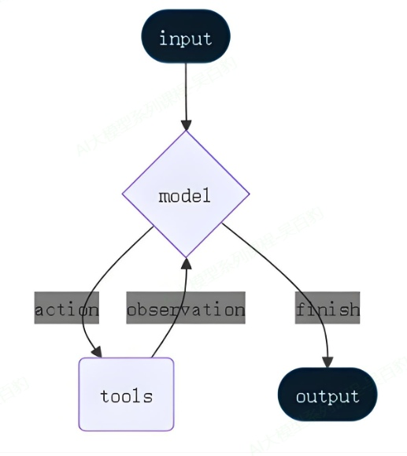

简单来说，一个Agent不再仅仅是生成文本的模型，而是一个具备“思考-行动-观察”循环的自主工作者。当用户提出一个复杂需求时，Agent会像人类一样，先理解任务、规划步骤、使用合适的工具（如搜索网络、查询数据库、执行计算）获取信息，最后综合所有信息给出最终答案。

### **3.1.2. Agent原理与执行流程**

Agent的核心工作原理遵循ReAct（Reasoning + Acting，推理+行动）框架，即在一个循环中交替进行推理和行动，这个过程会涉及到模型、工具、记忆、中间件等核心组件。

以下是一个具体的ReAct循环示例，演示Agent如何解决“找出当前最流行的无线耳机并检查库存”的任务。

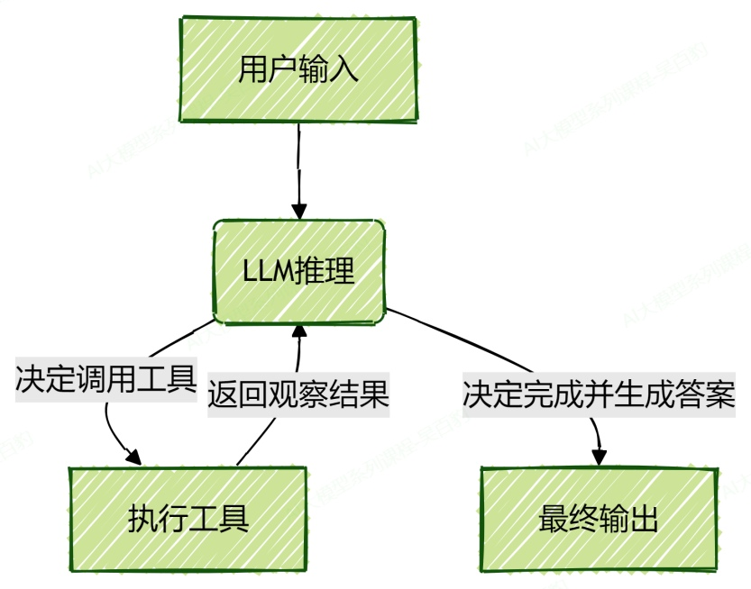

**1) 输入解析与初始推理**

**输入**：用户查询：“找出当前最流行的无线耳机并检查库存”。

**推理**：LLM分析任务后认为：“要找出‘最流行’的产品，需要最新的市场信息，我应该先使用搜索工具。”

**2) 第一次行动与观察**

**行动**：Agent调用search\_products工具，参数为“wireless headphones”。

**观察**：工具返回结果：“找到5款匹配产品。Top结果：WH-1000XM5, ...”

**3) 迭代推理**

**推理**：LLM根据搜索结果分析：“WH-1000XM5是排名第一的型号。现在需要确认其库存状态才能回答用户问题。”

**4) 第二次行动与观察**

**行动**：Agent调用check\_inventory工具，参数为“WH-1000XM5”。

**观察**：工具返回：“产品WH-1000XM5：库存10件。”

**5) 最终输出**

**推理**：LLM综合所有信息后认为：“已获得所需信息，可以生成最终答案。”

**行动**：模型生成最终答案，不再调用工具。

### **3.1.3. LLM、LLM工具调用与Agent区别**

如下对比LLM、LLM工具调用和Agent工具调用三者的区别：

| **对比角度** | **LLM**                        | **LLM+工具调用**                   | **Agent工具调用**                            |
| ------------------ | ------------------------------------ | ---------------------------------------- | -------------------------------------------------- |
| **本质定位** | 文本生成器，基于训练数据生成连贯文本 | 增强型LLM，通过函数调用扩展能力边界      | 一个具备规划和执行能力的智能系统，以任务闭环为目标 |
| **核心功能** | 语言理解、文本生成、知识问答         | 基础工具调用、实时数据获取、简单操作执行 | 多步规划、工具编排、状态管理、错误恢复             |
| **工作模式** | 单次交互，静态响应                   | 单轮“请求-调用-响应”                   | 多轮“感知-规划-执行-反馈”循环（ReAct框架）       |
| **系统架构** | 单一模型接口                         | 模型+工具绑定+手动执行循环               | LLM+规划+记忆+工具使用+防护措施                    |
| **状态管理** | 需外部维护状态                       | 需外部维护状态                           | 内置记忆系统，支持短期/长期状态管理                |
| **错误处理** | 失败即终止，无自动恢复               | 失败即终止，无自动恢复                   | 支持重试、回滚等恢复机制                           |

## 3.2. **Agent创建与调用**

### **3.2.1. Agent创建方式**

在 LangChain 1.2 中，create\_agent API 是构建智能体的核心方式。它通过将语言模型与工具相结合，创建能够自主决策并执行复杂任务的系统。

模型是 Agent 的“大脑”，负责决策和推理。LangChain 在模型配置上提供了极大的灵活性，支持**静态模型**和**动态模型**两种方式，以适应不同的应用场景和成本考量。

#### **3.2.1.1. 静态模型**

静态模型在 Agent 创建时一次性配置，在整个执行过程中保持不变。这是最简单、最常用的方法。

代码示例：使用创建好的模型构建Agent。

```python
"""
创建一个静态模型的智能体
"""
import json

from langchain.agents import create_agent
from langchain.chat_models import init_chat_model
from langchain.tools import tool
from langgraph.graph.state import CompiledStateGraph
from env_utils import DEEPSEEK_API_KEY, DEEPSEEK_BASE_URL


@tool
def get_weather(city: str) -> str:
    """获取指定城市的天气信息。"""
    return f"{city}的天气为晴朗，25°C。"

# 通过模型实例创建，可精细控制参数
deepseek_llm = init_chat_model(
    model="deepseek-chat",
    model_provider="deepseek",
    api_key=DEEPSEEK_API_KEY,
    base_url=DEEPSEEK_BASE_URL,
)

agent:CompiledStateGraph = create_agent(deepseek_llm, tools=[get_weather])

print(type(agent)) # CompiledStateGraph

resp : dict = agent.invoke( {"messages": [{"role": "user", "content": "查询北京的天气"}]})
print(type(resp)) # dict
print(resp)
```

运行结果如下：

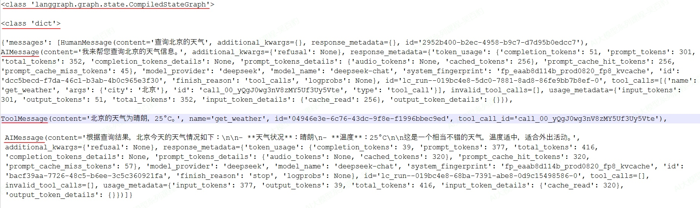

注意：

1\. 新版langchain中（1.0+）创建智能体API做了统一，由 create\_agent创建 agent，create\_agent函数返回的本身就是一个具备执行能力的实体，这个实体内部基于 LangGraph 构建了一个执行图（Graph）。

2\. create\_agent方法传递的参数为model（Agent使用的模型）和tools（Agent使用的工具），更多参数参考：[https://reference.langchain.com/python/langchain/agents/](https://reference.langchain.com/python/langchain/agents/)

3\. agent.invoke是调用Agent，传入的参数为固定格式：” {"messages": \[{"role": "...", "content": "..."}\]}”

#### **3.2.1.2. 动态模型**

动态模型允许在运行时根据当前对话的状态或上下文智能地选择不同的模型，这对于优化成本和处理不同复杂度的任务非常有用，这是通过中间件机制实现的。

代码示例：当对话消息数大于等于3条后，使用复杂模型，否则使用简单模型。

```python
from langchain.tools import tool

from langchain.agents import create_agent
from langchain.agents.middleware import wrap_model_call, ModelRequest, ModelResponse
from langchain.chat_models import init_chat_model

from env_utils import DEEPSEEK_API_KEY, DEEPSEEK_BASE_URL, DASHSCOPE_API_KEY, DASHSCOPE_BASE_URL

# 定义两个模型：基础版和高级版
basic_model = init_chat_model(
    model="deepseek-chat",
    model_provider="deepseek",
    api_key=DEEPSEEK_API_KEY,
    base_url=DEEPSEEK_BASE_URL,
)

advanced_model = init_chat_model(
    model="qwen-plus",
    model_provider="openai",
    api_key=DASHSCOPE_API_KEY,
    base_url=DASHSCOPE_BASE_URL,
)

# 1. 定义动态模型选择中间件
@wrap_model_call
def dynamic_model_selection(request: ModelRequest, handler) -> ModelResponse:
    """根据对话消息数动态选择模型"""
    #获取当前对话内容
    # current_messages = request.state["messages"]
    # print(f"当前对话内容: {current_messages}")

    # 获取当前对话消息数
    message_count = len(request.state["messages"])

    print(f"当前对话消息数: {message_count}")

    if message_count >=3:
        # 对话消息数超过2条，切换至更强大的模型处理复杂对话
        model = advanced_model
    else:
        model = basic_model

    return handler(request.override(model=model))


# 2.定义工具
@tool
def get_current_location() -> str:
    """获取当前位置。"""
    return "当前位置为北京市。"

@tool
def get_weather(city: str) -> str:
    """获取指定城市的天气信息。"""
    return f"{city}的天气为晴朗，25°C。"

# 2. 创建Agent，并传入动态模型选择中间件
agent = create_agent(
    model=basic_model,  # 此处设置一个默认模型
    tools=[get_current_location,get_weather],  # 集成工具
    system_prompt="你是一个助手，可以帮助用户回答各种问题。",
    middleware=[dynamic_model_selection]  # 挂载中间件
)

# 模拟一个对话的调用，包含获取当前位置和天气信息
print(agent.invoke({"messages": [{"role": "user", "content": "获取当前位置，并告诉我天气情况"}]}))

```

以上代码运行结果如下,可以看到每次调用模型前都会执行“dynamic\_model\_selection”方法，根据对话消息条数进行模型选择。

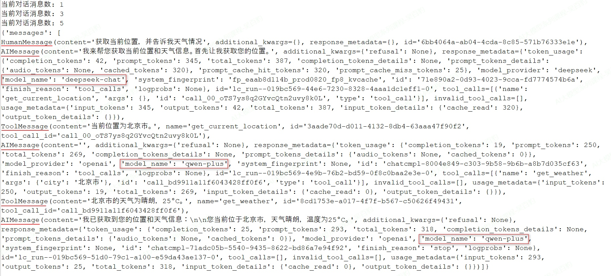

注意：

1\. @wrap\_model\_call 标记的方法是模型选择中间件方法，create\_agent时通过middleware参数指定该方法。

2\. @wrap\_model\_call方法中的两个参数含义：

* request:ModelRequest,封装了当前模型调用的所有请求信息。
* handler:回调函数,代表后续处理链，调用它会继续执行模型调用流程,通过 handler(request.override(...))传递修改后的请求。

3\. agent.invoke()启动了一个复杂的、可能包含多次LLM调用和工具调用的推理循环。wrap\_model\_call在这个循环的每个推理步骤（LLM调用）前都会被触发。

### **3.2.2. Agent调用**

invoke是 Agent 最基本的同步调用方法，它会阻塞程序执行直到返回最终结果。

示意代码如下：

```python
...
agent :CompiledStateGraph = create_agent(deepseek_llm, tools=[get_weather])

print(type(agent)) # CompiledStateGraph

resp = agent.invoke( {"messages": [{"role": "user", "content": "查询北京的天气"}]})
...
```

以上代码中，invoke中传入的 {"messages": \[{"role": "user", "content": "查询北京的天气"}\]}对应的是 invoke方法中的 input参数，这种写法在基于消息（Message）的LangChain Agent中是一种标准且常见的输入格式，其核心输入就是一系列消息（messages），每条消息通常包含 role（如 "user", "assistant", "system", "tool"）和 "content"。

我们也可以在message列表的开头加入"system"角色的消息来定义Agent的行为,代码如下：

```python
from langchain.agents import create_agent
from langchain.tools import tool
from langgraph.graph.state import CompiledStateGraph

from init_llm import deepseek_llm


@tool
def get_weather(city: str) -> str:
    """获取指定城市的天气信息。"""
    return f"{city}的天气为晴朗，25°C。"


agent :CompiledStateGraph = create_agent(deepseek_llm, tools=[get_weather])

resp = agent.invoke( {
    "messages": [
        {"role": "system", "content": "你是一个天气查询助手，只回答天气相关的问题，其他问题请直接回答：我不清楚这问题答案。"},
        {"role": "user", "content": "100加上50等于多少？"}

    ]
})

print(resp)
print(resp["messages"][-1].content)
```

以上代码运行结果如下：

```python
{'messages': [SystemMessage(content='你是一个天气查询助手，只回答天气相关的问题，其他问题请直接回答：我不清楚这问题答案。', additional_kwargs={}, response_metadata={}, id='bfd2371c-b547-434a-82c5-57793405c9de'), HumanMessage(content='100加上50等于多少？', additional_kwargs={}, response_metadata={}, id='60044614-ce2d-4574-be62-ce9c8e2b089a'), AIMessage(content='我不清楚这问题答案。', additional_kwargs={'refusal': None}, response_metadata={'token_usage': {'completion_tokens': 6, 'prompt_tokens': 328, 'total_tokens': 334, 'completion_tokens_details': None, 'prompt_tokens_details': {'audio_tokens': None, 'cached_tokens': 320}, 'prompt_cache_hit_tokens': 320, 'prompt_cache_miss_tokens': 8}, 'model_provider': 'deepseek', 'model_name': 'deepseek-chat', 'system_fingerprint': 'fp_eaab8d114b_prod0820_fp8_kvcache', 'id': 'f8fa9bba-acb9-44e2-a94c-a3e8d7a6783f', 'finish_reason': 'stop', 'logprobs': None}, id='lc_run--019bc7bb-e2e4-7393-9c4d-66edd3ff3dcf-0', tool_calls=[], invalid_tool_calls=[], usage_metadata={'input_tokens': 328, 'output_tokens': 6, 'total_tokens': 334, 'input_token_details': {'cache_read': 320}, 'output_token_details': {}})]}

我不清楚这问题答案。
```

我们也可以通过如下方式格式化输出工具调用结果：

```python
# 格式化输出所有消息
for msg in resp["messages"]:
    msg.pretty_print()
```

pretty_print()是LangChain框架中消息对象（例如 HumanMessage, AIMessage, SystemMessage等）自带的一个方法，主要用于在控制台或 Notebook 环境中美化并打印消息的内容和元数据，使其更易于阅读。

以上代码执行后，格式化结果如下：

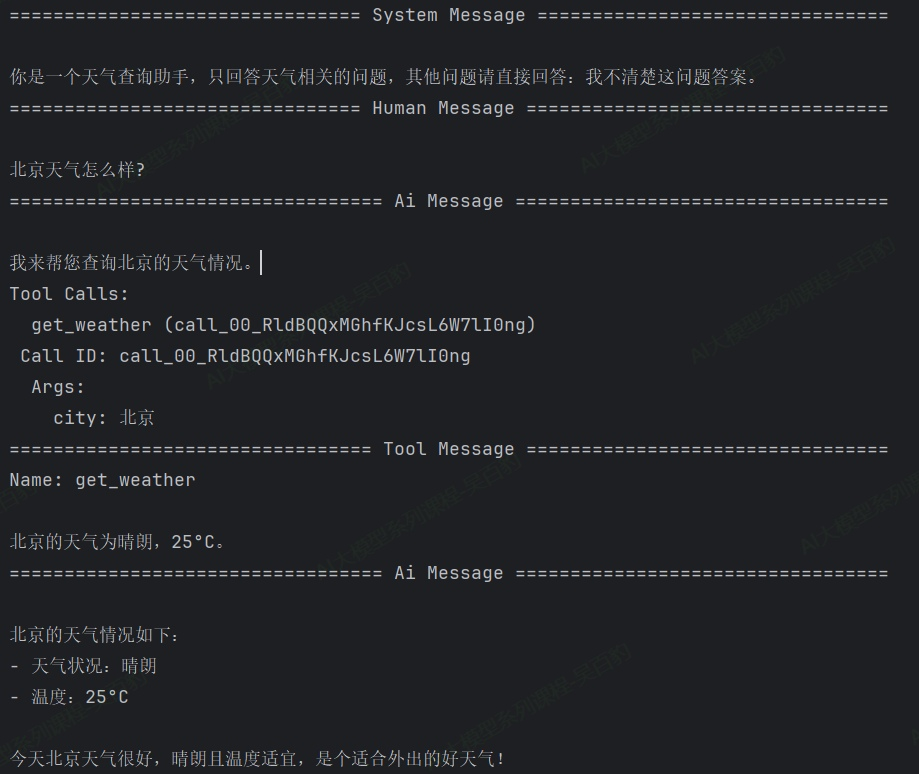

## 3.3. **提示词（Prompt）**

在LangChain中，提示词为Agent提供了任务背景、行为准则和操作指南。通过 system\_prompt参数设置，它本质上定义了Agent的“角色”和“使命”。

提示词设置有两种方式：基础设置和动态设置。

### **3.3.1. 基础提示词设置**

提示词基础设置是在“create\_agent”的时候传入一个参数system\_prompt，这个参数可以是str或者SystemMessage类型。

**案例：使用字符串和SystemMessage设置系统提示词。**

```python
from langchain.agents import create_agent
from langchain.agents.middleware import dynamic_prompt, ModelRequest
from langchain_core.messages import SystemMessage
from langchain_core.tools import BaseTool, tool
from typing import TypedDict
import json

from init_llm import deepseek_llm


# 工具：实现两数相加
@tool
def add_numbers(a: int, b: int) -> str:
    """计算并返回两个数的和。"""
    return f"和为：{a + b}"

if __name__ == '__main__':
    """创建客服助手Agent"""
    # 创建带有动态提示词中间件的Agent
    agent = create_agent(
        model=deepseek_llm,
        tools=[add_numbers],# 工具列表
        # system_prompt="你是一个数学助手，可以实现两数相加。"
        system_prompt = SystemMessage(content="你是一个数学助手，可以实现两数相加。")
    )

    resp = agent.invoke(
        {"messages": [{"role": "user", "content": "10加上20再加上30是多少？"}]},
    )

    print("resp:",resp)
    result = resp["messages"][-1].content
    print(result)
```

以上代码运行结果如下：

```python
10加上20再加上30的和是60。
```

### **3.3.2. 动态提示词设置**

对于需要根据运行时上下文或Agent状态调整提示词的高级场景，可以使用中间件（Middleware）实现动态提示词。例如，通过 @dynamic\_prompt装饰器创建中间件，根据用户角色生成不同的系统提示。

**案例：构建客户问题处理的Agent，对于普通用户和VIP用户采用不同的提示词。**

```python
from langchain.agents import create_agent
from langchain.agents.middleware import dynamic_prompt, ModelRequest
from langchain_core.tools import BaseTool, tool
from typing import TypedDict
import json

from init_llm import deepseek_llm


# 工具1：模拟查询订单信息
@tool
def query_order_info(order_id: str) -> str:
    """根据订单ID查询订单的详细信息，包括状态、商品列表和创建时间。"""
    # 模拟数据库查询结果
    order_database = {
        "ORD123456": {"status": "已发货", "items": ["手机X1"], "create_time": "2025-01-15"},
        "ORD654321": {"status": "待付款", "items": ["耳机Y1"], "create_time": "2025-01-18"}
    }
    order_data = order_database.get(order_id)
    if order_data:
        return json.dumps(order_data, ensure_ascii=False)
    else:
        return f"错误：未找到订单 {order_id}。"

# 工具2：模拟检索常见问题解答
@tool
def search_faq(keyword: str) -> str:
    """根据关键词从知识库中检索相关的政策条款或解决方案。"""
    # 模拟FAQ知识库
    faq_knowledge_base = {
        "退货": "支持7天无理由退货，商品需完好且包装齐全。",
        "保修": "电子产品享受1年免费保修服务。",
        "发货": "下单后48小时内发货，偏远地区可能延迟。"
    }
    # 简单关键词匹配
    for topic, answer in faq_knowledge_base.items():
        if topic in keyword:
            return answer
    return f"未找到与'{keyword}'直接相关的政策，请尝试其他关键词或联系人工客服。"

# 定义运行时上下文的数据结构
class AgentContext(TypedDict):
    query_type: str  # 用于动态判断问题类型，例如 'normal'（普通用户） 或 'vip'（vip用户）

# 动态提示词中间件：根据问题类型调整Agent的“角色”和回答策略
@dynamic_prompt
def dynamic_support_prompt(request: ModelRequest) -> str:
    """
    根据 query_type 生成不同的系统提示词。
    """
    # print("request:", request)
    query_type = request.runtime.context.get("query_type", "normal")
    base_instruction = "你是一名专业的电商客服助手。请根据工具查询结果，准确、清晰地回答用户问题。"

    if query_type == "vip":
        # 针对复杂或需要升级处理的问题
        return f"""{base_instruction}
                当前角色：高级支持专员
                工作要求：
                1.深度分析：仔细分析用户描述，识别潜在的根本问题。
                2.精准分类：将问题明确归类（如“物流问题”、“产品质量”、“售后申请”）。
                3.方案规划：若工具能解决，提供具体步骤；若需人工，明确告知后续流程。
                请使用更专业、严谨的语言。
                """
    else:
        # 针对常规客服问题
        return f"""{base_instruction}
                当前角色：一线客服助手
                工作要求：
                1.快速响应：优先使用工具获取订单/政策信息。
                2.直接解答：对于明确问题（如退货、物流），直接给出基于知识的答案。
                3.简洁友好：回复要简单明了，避免复杂术语。
                保持友好和高效的沟通风格。
                """

if __name__ == "__main__":
    """创建客服助手Agent"""
    # 创建带有动态提示词中间件的Agent
    agent = create_agent(
        model=deepseek_llm,
        tools=[query_order_info, search_faq], # 工具列表
        middleware=[dynamic_support_prompt],  # 挂载动态提示词中间件
        context_schema=AgentContext  # 关联上下文schema
    )

    """演示动态提示词效果"""
    # user_query = "我的订单ORD123456还没收到，包装破损了怎么办？"
    user_query = "我的订单ORD654321已签收，但是物品坏了怎么办？"
    print(f"用户问题：{user_query}\n")

    print("场景一：普通客服模式 (query_type: 'normal')")
    result_normal = agent.invoke(
        {"messages": [{"role": "user", "content": user_query}]},
        context={"query_type": "normal"}  # 标准模式
    )

    # print("result_normal:", result_normal)
    # 提取Agent的最后一条回复
    final_response_normal = result_normal["messages"][-1].content
    print(final_response_normal)

    print("\n" + "="*50)

    print("场景二：VIP模式 (query_type: 'vip')")
    result_vip = agent.invoke(
        {"messages": [{"role": "user", "content": user_query}]},
        context={"query_type": "vip"}
    )
    # print("result_vip:", result_vip)
    # 提取Agent的最后一条回复
    final_response_vip = result_vip["messages"][-1].content
    print(final_response_vip)
```

以上代码运行结果如下：

```python
用户问题：我的订单ORD654321已签收，但是物品坏了怎么办？

场景一：普通客服模式 (query_type: 'normal')
根据查询到的信息，我为您提供以下建议：

**关于您的情况：**
1. 订单状态显示"待付款"，但您已签收商品且发现损坏
2. 这可能是系统状态更新延迟，或者存在其他特殊情况

**建议解决方案：**

1. **立即拍照取证**：请拍摄清晰的商品损坏照片，包括外包装、商品本身和损坏部位

2. **联系人工客服**：由于您的订单状态异常（显示待付款但已签收），建议您：
   - 通过在线客服或客服热线联系人工客服
   - 提供订单号ORD654321和损坏照片
   - 说明具体情况：已签收但商品损坏

3. **售后处理**：根据我们的退货政策，商品需完好才能享受7天无理由退货。但**商品损坏属于质量问题**，通常会有专门的售后处理流程。

**温馨提示：**
- 请尽快联系客服，避免超过售后处理时限
- 保留好所有相关证据（照片、物流签收记录等）
- 不要自行处理损坏商品，等待客服指导

由于订单状态异常，建议您优先联系人工客服处理，他们会为您核实具体情况并提供专业的解决方案。

==================================================
场景二：VIP模式 (query_type: 'vip')
基于目前的信息，我为您提供以下专业分析和建议：

## 问题分类：产品质量问题

### 当前情况分析：
1. **订单状态异常**：系统显示"待付款"状态与您描述的"已签收"不符
2. **商品损坏**：您明确表示收到的物品已损坏

### 建议处理方案：

**第一步：核实订单信息**
请确认订单号ORD654321是否正确。如果可能，请提供：
- 准确的订单号
- 签收时间
- 损坏物品的具体情况描述和照片

**第二步：标准售后流程**
根据我们的退货政策：
- 支持7天无理由退货，商品需完好且包装齐全
- 对于质量问题，我们有专门的售后处理流程

**第三步：立即行动建议**
由于订单状态显示异常，我建议您：
1. **联系人工客服**：通过官方客服渠道说明情况
2. **提供证据**：准备商品损坏的清晰照片或视频
3. **保留包装**：保持商品原包装完整

### 后续处理路径：
1. **如果订单确实已签收**：我们将为您启动质量问题售后流程
2. **如果订单状态有误**：需要技术部门核实系统状态
3. **紧急处理**：建议立即通过官方客服渠道联系，获取优先处理

**重要提醒**：请尽快联系客服，以便在签收后的有效时间内启动售后流程。质量问题通常有特殊的处理标准和时效要求。

您是否需要我协助您查找官方客服联系方式，或者有其他相关信息需要补充？
```

以上代码中，注意如下几点：

1\. 首先定义2个工具，两个工具模拟客服系统中操作

* query\_order\_info：根据订单ID查询订单基本信息（如状态、商品、创建时间）。
* search\_faq:从知识库中检索与用户问题相关的政策或解决方案（如退货流程、保修期限）。

2\. 针对普通用户和vip用户使用agent时采用不同的提示词，这里使用动态提示词，动态提示词能根据运行时上下文（如用户身份、问题类型）实时生成最合适的系统提示词，实现精准化、个性化回复。动态提示词通过“create\_agent”时传入指定自己定义中间件函数。

3\. create\_agent中context\_schema参数作用是定义运行时上下文有哪些数据，是一个TypedDict类型，这样可以指定执行单次任务时可能需要的动态数据（如用户ID，用户等级）等。定义上下文可使用哪些数据步骤如下：

首先使用TypedDict定义上下文的数据结构,如：

```python
class AgentContext(TypedDict):
    query_type: str  # 定义一个名为 query_type，类型为字符串的字段
    # user_id: int    # 可以继续扩展其他字段，例如用户ID
```

然后，在 create\_agent时通过 context\_schema参数告知Agent你所定义的上下文结构，最后在调用 agent.invoke时，通过 context参数传入符合该结构的实际数据：

```python
result = agent.invoke(
    {"messages": [...]},
    context={"query_type": "vip"}  # 这里传入的数据必须符合 AgentContext 的定义
)
```

## 3.4. **Tools工具**

在LangChain中，工具（Tools）是赋予大语言模型与外部世界交互能力的关键组件。它们实际上是具有明确定义输入和输出的可调用函数，模型能根据对话上下文决定何时调用工具以及传递哪些参数。工具让智能体能够获取实时数据、执行代码、查询外部数据库等，从而突破模型自身知识局限，构建功能强大的AI应用。

### **3.4.1. 工具创建方式**

创建工具有三种核心方式:使用@tool装饰器创建工具、使用Pydantic模型定义工具、使用Json Schema定义工具。下面进行介绍。

#### **3.4.1.1. 使用@tool装饰器定义工具（推荐）**

使用@tool装饰器定义工具是最直接的工具创建方法，能自动将普通 Python 函数转化为智能体可调用的工具。

**使用@tool装饰器创建工具示例：**

```python
"""
@tool 装饰器创建工具
"""
from langchain.agents import create_agent
from langchain_core.tools import tool
from init_llm import deepseek_llm


@tool("get_employee_info")
def get_employee_info(employee_id: str) -> str:
    """
    根据员工ID查询员工的详细信息，包括姓名、部门和职位。

    Args:
        employee_id (str): 员工的唯一标识ID，例如 'E001'

    Returns:
        str: 包含员工详细信息的JSON字符串
    """
    # 模拟一个简单的数据库
    mock_employee_database = {
        "E001": {"name": "张三", "department": "技术部", "position": "高级软件工程师", "email": "zhangsan@company.com"},
        "E002": {"name": "李四", "department": "市场部", "position": "市场经理", "email": "lisi@company.com"},
        "E003": {"name": "王五", "department": "人力资源部", "position": "招聘专员", "email": "wangwu@company.com"}
    }

    print(f"正在查询数据库，员工ID: {employee_id}")

    # 查询数据库
    employee_record = mock_employee_database.get(employee_id)

    if employee_record:
        # 返回格式化的员工信息
        return employee_record
    else:
        return f"未找到ID为 {employee_id} 的员工信息"


# 创建Agent
agent = create_agent(
    model=deepseek_llm,
    tools=[get_employee_info],
    system_prompt="你是一个助手，你可以查询员工的详细信息。",
)

resp = agent.invoke({"messages": [{"role": "user", "content": "请帮我查一下员工E001的详细信息"}]})

print("resp", resp)

print(resp["messages"][-1].content)
```

以上代码运行结果如下：

```python
正在查询数据库，员工ID: E001
resp {'messages': [HumanMessage(content='请帮我查一下员工E001的详细信息', additional_kwargs={}, response_metadata={}, id='9256e1fc-4872-466b-9d64-5a7476cc5e98'), AIMessage(content='我来帮您查询员工E001的详细信息。', additional_kwargs={'refusal': None}, response_metadata={'token_usage': {'completion_tokens': 56, 'prompt_tokens': 357, 'total_tokens': 413, 'completion_tokens_details': None, 'prompt_tokens_details': {'audio_tokens': None, 'cached_tokens': 320}, 'prompt_cache_hit_tokens': 320, 'prompt_cache_miss_tokens': 37}, 'model_provider': 'deepseek', 'model_name': 'deepseek-chat', 'system_fingerprint': 'fp_eaab8d114b_prod0820_fp8_kvcache', 'id': '47aaf9c8-d2f5-4d93-8a25-3eab5b99df92', 'finish_reason': 'tool_calls', 'logprobs': None}, id='lc_run--019bda1a-902e-79b3-98b5-336e900f2e97-0', tool_calls=[{'name': 'get_employee_info', 'args': {'employee_id': 'E001'}, 'id': 'call_00_8jUxo4LYp8VXqTHAVlBHyGFa', 'type': 'tool_call'}], invalid_tool_calls=[], usage_metadata={'input_tokens': 357, 'output_tokens': 56, 'total_tokens': 413, 'input_token_details': {'cache_read': 320}, 'output_token_details': {}}), ToolMessage(content='{"name": "张三", "department": "技术部", "position": "高级软件工程师", "email": "zhangsan@company.com"}', name='get_employee_info', id='14fbd48a-3261-4a13-8e9c-22032830969e', tool_call_id='call_00_8jUxo4LYp8VXqTHAVlBHyGFa'), AIMessage(content='根据查询结果，员工E001的详细信息如下：\n\n- **姓名**：张三\n- **部门**：技术部\n- **职位**：高级软件工程师\n- **邮箱**：zhangsan@company.com\n\n这位员工是技术部的高级软件工程师。', additional_kwargs={'refusal': None}, response_metadata={'token_usage': {'completion_tokens': 56, 'prompt_tokens': 462, 'total_tokens': 518, 'completion_tokens_details': None, 'prompt_tokens_details': {'audio_tokens': None, 'cached_tokens': 448}, 'prompt_cache_hit_tokens': 448, 'prompt_cache_miss_tokens': 14}, 'model_provider': 'deepseek', 'model_name': 'deepseek-chat', 'system_fingerprint': 'fp_eaab8d114b_prod0820_fp8_kvcache', 'id': '80c2bfc5-463b-4978-998f-c3ebd2d96e51', 'finish_reason': 'stop', 'logprobs': None}, id='lc_run--019bda1a-9b48-7b21-aa51-2b10b2dd9753-0', tool_calls=[], invalid_tool_calls=[], usage_metadata={'input_tokens': 462, 'output_tokens': 56, 'total_tokens': 518, 'input_token_details': {'cache_read': 448}, 'output_token_details': {}})]}
根据查询结果，员工E001的详细信息如下：

- **姓名**：张三
- **部门**：技术部
- **职位**：高级软件工程师
- **邮箱**：zhangsan@company.com

这位员工是技术部的高级软件工程师。
```

注意：

1\. @tool装饰器创建工具默认的名称与函数名相同，也可以通过“@tool("get\_employee\_info")”指定新名称。

2\. @tool定义工具时，可以在函数内进行注释，可以使用python注释（无需参数和返回值说明），也可以使用“Google风格”对工具进行注解，即使用 Args:、Returns:、Raises:等关键字，这种方式可读性强。Agent通过工具的这些注释来理解工具的用途和调用时机，因此清晰、准确的文档字符串是工具能被正确调用的前提。

3\. 也可以在@tool定义工具时传入description参数，传入description参数后，它会完全替代函数的文档字符串成为工具的唯一描述。

```python
@tool("calculator", description="Performs arithmetic calculations. Use this for any math problems.")
def calc(expression: str) -> str:
    """Evaluate mathematical expressions."""
    return str(eval(expression))
```

4\. 不要使用config或runtime作为参数名，这些是LangChain内部保留的特殊参数字段

#### **3.4.1.2. 使用Pydantic模型定义工具（推荐）**

Pydantic 模型模式的主要优势在于能够精确控制工具参数的格式和验证规则，让大模型更准确地理解如何调用工具。这种方式特别适合参数复杂、有特定约束条件的业务场景。

**使用Pydantic模型定义工具示例：**

```python
from langchain.agents import create_agent
from pydantic import BaseModel, Field, field_validator
from typing import Literal, Optional
from langchain_core.tools import tool
import json
from init_llm import deepseek_llm


# 1.定义复杂的工单查询参数模型
class TicketQueryInput(BaseModel):
    """工单查询输入参数 - 支持多种筛选条件"""
    ticket_id: Optional[str] = Field(
        default=None,
        description="工单ID"
    )
    assigner: Optional[str] = Field(
        default=None,
        description="负责人姓名"
    )
    status: Optional[Literal["open", "in_progress", "resolved", "closed"]] = Field(
        default=None,
        description="工单状态: open(待处理), in_progress(处理中), resolved(已解决), closed(已关闭)"
    )
    priority: Optional[Literal["low", "medium", "high", "urgent"]] = Field(
        default=None,
        description="优先级: low(低), medium(中), high(高), urgent(紧急)"
    )

    @field_validator("ticket_id")
    def convert_ticket_id_to_upper(cls, v: Optional[str]) -> Optional[str]:
        """将工单ID转换为大写"""
        return v.upper() if v else None


# 2. 使用@tool装饰器定义工具，并通过args_schema指定参数模型
@tool(args_schema=TicketQueryInput)
def query_tickets(
        ticket_id: Optional[str] = None,
        assigner: Optional[str] = None,
        status: Optional[str] = None,
        priority: Optional[str] = None,
) -> str:
    """
    查询工单系统，支持多条件筛选。

    此工具用于从工单管理系统中检索符合特定条件的工单信息。
    至少需要提供一个筛选条件，否则返回最近创建的工单。
    """
    try:
        # 模拟一个简单的工单数据库
        mock_tickets_db = [
            {"ticket_id": "TK2025012001", "assigner": "张三", "title": "登录页面加载缓慢", "status": "open", "priority": "low"},
            {"ticket_id": "TK2025012002", "assigner": "李四", "title": "用户头像上传失败", "status": "open", "priority": "medium"},
            {"ticket_id": "TK2025011901", "assigner": "张三", "title": "支付成功通知未发送", "status": "resolved", "priority": "high"},
            {"ticket_id": "TK2025011902", "assigner": "马六", "title": "订单查询接口返回空值", "status": "closed", "priority": "high"},
        ]

        filtered_tickets = mock_tickets_db

        if ticket_id:
            filtered_tickets = [t for t in filtered_tickets if t["ticket_id"] == ticket_id]

        if assigner:
            filtered_tickets = [t for t in filtered_tickets if t["assigner"] == assigner]

        if status:
            filtered_tickets = [t for t in filtered_tickets if t["status"] == status]

        if priority:
            filtered_tickets = [t for t in filtered_tickets if t["priority"] == priority]

        if not filtered_tickets:
            return "未找到符合条件的工单"

        # 格式化返回结果
        result = {
            "total_count": len(filtered_tickets),
            "tickets": filtered_tickets
        }

        return json.dumps(result, ensure_ascii=False, indent=2)

    except Exception as e:
        return f"查询工单时发生错误: {str(e)}"


# 3.创建智能体
agent = create_agent(
    model=deepseek_llm,
    tools=[query_tickets],
    system_prompt="你是一个助手，你可以查询工单系统的工单信息。",
)

# 4. 测试智能体
# 4.1 测试基本功能
# response1 = agent.invoke({"messages": [{"role": "user", "content": "请帮我查一下TK2025012001工单的详细信息"}]})
# print("response1 content", response1["messages"][-1].content)
#
# response2 = agent.invoke({"messages": [{"role": "user", "content": "请帮我查一下张三负责的工单"}]})
# print("response2 content", response2["messages"][-1].content)
#
# response3 = agent.invoke({"messages": [{"role": "user", "content": "请帮我查一下所有高优先级的工单"}]})
# print("response3 content", response3["messages"][-1].content)
#
# response4 = agent.invoke({"messages": [{"role": "user", "content": "请帮我查一下所有关闭工单"}]})
# print("response4 content", response4["messages"][-1].content)


# 4.2 测试 Pydantic 参数验证
response5 = agent.invoke({"messages": [{"role": "user", "content": "请帮我查一下tk2025012001工单的详细信息"}]})
print(response5)
print("response5 content", response5["messages"][-1].content)
```

以上代码注意如下问题：

1\. 这种方式定义工具，通过 @tool(args\_schema=PydanticModelCls)将这个 Pydantic 模型与工具函数关联。

2\. PydanticModelCls 需要继承自 BaseModel的类，使用类型提示（如 str, int）和 Field函数来声明每个字段的名称、类型、默认值和描述。每个字段的 description参数至关重要，它直接影响大模型理解参数含义的能力。

3\. 可以利用 Pydantic 的类型系统进行参数验证，当大模型需要调用工具前，Pydantic 会自动验证参数的类型和有效性。

4\. 在 convert\_ticket\_id\_to\_upper方法中的 cls，代表的是 这个 Pydantic 模型类本身，在这里也就是 TicketQueryInput这个类。@field\_validator装饰器将对应方法标记为类方法，类方法的第一个参数约定俗成地命名为 cls，它指向类而不是类的实例。这样，在验证逻辑中如果需要访问类的其他属性或方法，就可以通过 cls来操作。

5\. json.dumps()是 Python 标准库 json模块中的函数，用于将 Python 对象（如字典、列表）序列化成一个 JSON 格式的字符串。

(1) ensure\_ascii=False: 这个参数默认值为 True，表示所有非 ASCII 字符（如中文）会被转换成 \\uXXXX形式的转义序列。设置为 False后，中文、表情符号等字符就能在 JSON 字符串中正常显示，而不是一堆乱码。

(2) indent=2: 这个参数用于美化输出，使生成的 JSON 字符串具有可读性。数字 2表示使用两个空格作为缩进层级，让结构清晰可见。如果不需要格式化，可设为 None。

#### **3.4.1.3. 使用Json Schema定义工具**

在 LangChain 中，还可以直接使用 JSON Schema 字典来定义工具的参数模式。这种方式提供了极大的灵活性，特别适合参数结构需要动态生成的场景。

**使用JsonSchema定义工具示例（查询书籍Agent）：**

```python
from langchain.agents import create_agent
from langchain_core.tools import tool
import json
from init_llm import deepseek_llm

# 1. 直接使用JSON Schema字典定义复杂的查询参数
book_query_schema = {
    "type": "object",
    "properties": {
        "title_keyword": {
            "type": "string",
            "description": "图书标题关键词，支持模糊匹配"
        },
        "author": {
            "type": "string",
            "description": "图书作者姓名"
        },
        "category": {
            "type": "string",
            "enum": ["技术", "文学", "历史", "科学", "经济学", "传记"],
            "description": "图书分类"
        }
    },
    "required": [], # 至少需要提供标题关键词、作者或分类中的一个条件，所以这里为空
}

# 2. 使用@tool装饰器定义工具，并通过args_schema指定JSON Schema
@tool(args_schema=book_query_schema)
def query_books(title_keyword: str = None,
                author: str = None,
                category: str = None) -> str:
    """
    根据多种条件查询企业图书库中的图书信息。

    此工具用于从企业图书管理系统中检索图书。
    至少需要提供标题关键词、作者或分类中的一个条件。
    """
    try:
        # 模拟一个简单的图书数据库
        mock_books_db = [
            {"book_id": "BK1001", "title": "人工智能导论", "author": "张明", "category": "技术"},
            {"book_id": "BK1002", "title": "机器学习实战", "author": "李华", "category": "技术"},
            {"book_id": "BK1003", "title": "中国近代史", "author": "王伟", "category": "历史"},
            {"book_id": "BK1004", "title": "红楼梦", "author": "曹雪芹", "category": "文学"},
            {"book_id": "BK1005", "title": "经济学原理", "author": "刘强", "category": "经济学"},
            {"book_id": "BK1006", "title": "文学导论", "author": "张明", "category": "文学"},
            {"book_id": "BK1007", "title": "Python编程基础", "author": "王丽", "category": "技术"}
        ]

        filtered_books = mock_books_db

        # 根据条件过滤图书
        if title_keyword:
            filtered_books = [book for book in filtered_books if title_keyword.lower() in book["title"].lower()]
        if author:
            filtered_books = [book for book in filtered_books if book["author"] == author]
        if category:
            filtered_books = [book for book in filtered_books if book["category"] == category]

        if not filtered_books:
            return "未找到符合条件的图书。"

        # 格式化返回结果
        result = {
            "total_count": len(filtered_books),
            "books": filtered_books
        }

        return json.dumps(result, ensure_ascii=False, indent=2)

    except Exception as e:
        return f"查询图书时发生错误: {str(e)}"


# 3. 创建智能体
agent = create_agent(
    model=deepseek_llm,
    tools=[query_books],
    system_prompt="你是一个企业图书管理员，可以帮助员工查询图书信息。",
)

# 4. 测试智能体
# 测试1：按图书种类精确查询
response1 = agent.invoke({"messages": [{"role": "user", "content": "请帮我查一下历史类图书"}]})
print("=== 测试1：按图书种类精确查询 ===")
print(response1["messages"][-1].content)

# 测试2：多条件组合查询
response2 = agent.invoke({"messages": [{"role": "user", "content": "我想找张明写的技术类图书"}]})
print(response2)
print("\n=== 测试2：多条件组合查询 ===")
print(response2["messages"][-1].content)

# 测试3：关键词模糊查询
response3 = agent.invoke({"messages": [{"role": "user", "content": "搜索包含'Python'关键词的图书"}]})
print("\n=== 测试3：关键词模糊查询 ===")
print(response3["messages"][-1].content)
```

代码运行结果如下：

```python
=== 测试1：按图书种类精确查询 ===
根据查询结果，企业图书库中目前有1本历史类图书：

**《中国近代史》**
- 作者：王伟
- 图书ID：BK1003
- 分类：历史

如果您想查找特定主题的历史书籍，或者需要更详细的图书信息，请告诉我，我可以进一步帮您查询。

=== 测试2：多条件组合查询 ===
根据查询结果，我找到了张明写的一本技术类图书：

**图书信息：**
- **书名：** 《人工智能导论》
- **作者：** 张明
- **分类：** 技术
- **图书编号：** BK1001

目前图书库中只找到了这一本张明写的技术类图书。如果您想查找其他作者的技术类图书，或者有其他查询需求，请告诉我。

=== 测试3：关键词模糊查询 ===
根据搜索结果，企业图书库中有1本包含'Python'关键词的图书：

**《Python编程基础》**
- 图书编号：BK1007
- 作者：王丽
- 分类：技术

这是目前图书库中唯一一本标题包含'Python'的图书。如果您想查找其他编程相关的技术书籍，或者需要更具体的搜索条件，请告诉我。
```

以上代码注意如下问题：

1\. Json Schema定义工具方式通过 @tool(args\_schema=json\_schema\_dict)将一个符合 JSON Schema 标准的字典与工具函数关联。

2\. JSON Schema 是行业标准，用于描述 JSON 数据结构和验证规则。

(1) type：定义当前数据节点必须是什么数据类型。常见类型有 string, number, integer, boolean, object, array, null。object即是json对象。

(2) properties：用于定义JSON 对象（Object）中可以包含哪些属性（键），以及每个属性对应的值类型和说明。

(3) required：当 type为 "object"时使用，是一个数组，列出了对象中必须存在的属性名。本案例中指定为空表示json对象中的属性都是非必须。

#### **3.4.1.4. 工具创建总结**

LangChain提供的三种核心的工具创建方式对比特点如下：

* **@tool装饰器**

最直接的方法，通过在函数上方添加一个装饰器，就能将其变成智能体可以调用的工具。优势是代码量极少，非常适合快速验证想法或创建参数简单的工具。

* **Pydantic 模型**

当工具的参数变得复杂，需要枚举值、范围限制或更复杂的业务逻辑验证时，Pydantic 模型是理想选择。提供强大的类型检查和数据验证。可以使用 Literal类型限定参数为固定选项，或用 Field设置默认值、描述，甚至用 @field\_validator实现自定义校验规则（如将工单ID转为大写）。非常适合参数结构稳定的企业内部工具，如工单查询、客户信息管理等。

* **JSON Schema**

工具参数模式可以基于数据库配置或用户输入在运行时动态生成，可以选择这种方式，适用于需要高度动态行为的工具，或与已有 JSON Schema 定义的外部系统打通的场景。

### **3.4.2. 调用工具错误处理**

调用工具错误处理是指当智能体调用外部工具（如API、数据库查询等）遇到异常时，系统能够优雅地捕获、处理这些错误，并向大模型返回有意义的错误信息，而不是让未处理的异常直接中断整个流程。

当Agent调用工具异常时，我们可以使用@wrap\_tool\_call中间件来灵活处理调用工具发生的异常错误，如下：

```python
from langchain.agents import create_agent
from langchain.agents.middleware import wrap_tool_call
from langchain.messages import ToolMessage


@wrap_tool_call
def handle_tool_errors(request, handler):
    """使用自定义消息处理工具执行错误"""
    try:
        return handler(request)
    except Exception as e:
        # 向模型返回自定义错误消息
        return ToolMessage(
            content=f"调用工具错误:请检查输入参数并重试. ({str(e)})",
            tool_call_id=request.tool_call["id"]
        )

agent = create_agent(
    model="gpt-4o",
    tools=[search, get_weather],
    middleware=[handle_tool_errors]
)
```

当工具调用失败时，Agent将返回带有自定义错误消息的ToolMessage，ToolMessage必须传递content（工具执行的结果或错误信息）和tool\_call\_id（所调工具唯一标识符，将此消息与引发此次调用的特定 AIMessage中的工具调用关联起来）两个核心参数。

```python
[
    ...
    ToolMessage(
        content="调用工具错误:请检查输入参数并重试。({str(e)})",
        tool_call_id="..."
    ),
    ...
]
```

以上中间件的执行时机如下：用户提问 → LLM分析并决定调用工具 → LangChain准备工具调用参数 → 错误处理中间件介入 → 实际工具执行 → 结果/错误返回。所以@wrap\_tool\_call中间件执行流程如下：

1) 当Agent需要调用工具时，执行流程会先经过所有注册的 wrap\_tool\_call中间件。
2) 每个中间件都可以选择直接处理请求，或者将请求通过“handler(request)”传递给下一个处理程序,下一个处理程序就是执行工具。
3) 最终到达实际的工具执行层，然后结果再逆序返回。

**案例一：模拟调用股票工具发生访问错误，使用@wrap\_tool\_call进行错误处理。**

```python
from langchain.agents import create_agent
from langchain.agents.middleware import wrap_tool_call
from langchain.messages import ToolMessage
from langchain_core.tools import tool
import requests

from init_llm import deepseek_llm


# 定义可能失败的工具：股票查询工具
@tool
def get_stock_price(symbol: str) -> str:
    """
    获取指定股票代码的当前价格
    Arg:
        symbol: 股票代码（例如：TCEHY）
    Returns:
        股票当前价格（例如："股票 TCEHY 当前价格为 123.45"）
    """
    print(f"=====调用股票查询工具: {symbol}")
    try:
        # 模拟可能失败的API调用
        response = requests.get(f"https://api.example.com/stocks/{symbol}", timeout=1)
        return f"股票 {symbol} 当前价格为 {response['price']}"
    except requests.exceptions.RequestException as e:
        print(f"=====查询股票数据失败: {str(e)}")
        raise Exception(f"查询股票数据失败: {str(e)}")

# 自定义错误处理中间件
@wrap_tool_call
def handle_tool_errors(request, handler):
    """处理工具执行错误的自定义中间件"""
    print(f"=====调用处理错误handle: {request}")
    try:
        return handler(request)
    except Exception as e:
        print(f"=====工具执行错误: {str(e)}")
        # 返回结构化的错误信息给模型
        return ToolMessage(
            content=f"工具执行错误：{str(e)}。请检查股票代码是否正确或稍后重试。", # 错误信息
            tool_call_id=request.tool_call["id"] # 从请求中获取工具调用ID
        )

# 创建智能体并注册错误处理中间件
agent = create_agent(
    model=deepseek_llm,
    tools=[get_stock_price],
    middleware=[handle_tool_errors],
    system_prompt="你是一个股票查询助手，可以帮助用户查询股票价格信息。"
)

# 调用智能体
response = agent.invoke({"messages": [{"role": "user", "content": "查询股票 TCEHY 的当前价格"}]})
print(f"=====调用智能体响应: {response}")
print(response["messages"][-1].content)
```

代码运行结果：

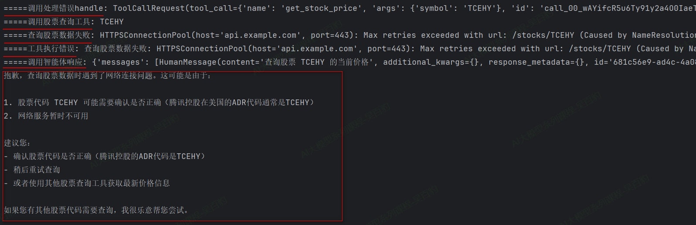

**案例二：通过大模型查询/更新工单操作，使用@wrap\_tool\_call处理错误。**

```python
from langchain.agents import create_agent
from langchain.agents.middleware import wrap_tool_call
from langchain.messages import ToolMessage
from langchain_core.tools import tool, ToolException
import json
import random

from init_llm import deepseek_llm

# 模拟工单数据库
TICKET_DATABASE = {
    "T001": {"title": "登录问题", "status": "处理中", "assignee": "张三"},
    "T002": {"title": "支付失败", "status": "已解决", "assignee": "李四"},
    "T003": {"title": "页面加载慢", "status": "待处理", "assignee": "王五"}
}


@tool
def query_ticket(ticket_id: str) -> str:
    """
    根据工单ID查询工单详情
    Args:
        ticket_id (str): 工单ID
    Returns:
        str: 工单详情的JSON字符串
    """
    # 模拟网络不稳定：50%概率失败
    if random.random() < 0.5:
        raise ConnectionError("数据库连接超时，请稍后重试")

    if ticket_id not in TICKET_DATABASE:
        raise ToolException(f"工单ID {ticket_id} 不存在")

    ticket = TICKET_DATABASE[ticket_id]
    return json.dumps(ticket, ensure_ascii=False, indent=2)


@tool
def update_ticket_status(ticket_id: str, new_status: str) -> str:
    """
    更新工单状态
    Args:
        ticket_id (str): 工单ID
        new_status (str): 工单新状态
    Returns:
        str: 更新成功的消息
    """
    valid_statuses = ["待处理", "处理中", "已解决", "已关闭"]

    if ticket_id not in TICKET_DATABASE:
        raise ToolException(f"工单ID {ticket_id} 不存在")

    if new_status not in valid_statuses:
        raise ToolException(f"状态必须是: {', '.join(valid_statuses)}")

    # 模拟权限检查失败
    if random.random() < 0.2:
        raise PermissionError("权限不足：只有管理员可以关闭工单")

    TICKET_DATABASE[ticket_id]["status"] = new_status
    return f"工单 {ticket_id} 状态已更新为: {new_status}"


# 分层错误处理中间件
@wrap_tool_call
def intelligent_error_handler(request, handler):
    """智能错误处理：根据错误类型返回不同的指导信息"""
    try:
        return handler(request)
    except ConnectionError as e:
        return ToolMessage(
            content=f"系统暂时繁忙：{str(e)}。建议您稍后重试此操作。",
            tool_call_id=request.tool_call["id"]
        )
    except PermissionError as e:
        return ToolMessage(
            content=f"权限限制：{str(e)}。如需执行此操作，请联系管理员。",
            tool_call_id=request.tool_call["id"]
        )
    except ToolException as e:
        return ToolMessage(
            content=f"输入验证失败：{str(e)}。请检查输入参数是否正确。",
            tool_call_id=request.tool_call["id"]
        )
    except Exception as e:
        return ToolMessage(
            content=f"意外错误：{str(e)}。技术团队已收到通知，请稍后重试。",
            tool_call_id=request.tool_call["id"]
        )


# 创建智能体
agent = create_agent(
    model=deepseek_llm,
    tools=[query_ticket, update_ticket_status],
    middleware=[intelligent_error_handler],
    system_prompt="""你是企业客服工单系统助手，可以帮助用户查询和更新工单状态。
    当工具调用失败时，你会收到明确的错误提示，请根据错误类型给予用户相应的指导。"""
)


# 测试用例
def test_error():
    """测试各种错误场景"""
    test_cases = [
        "查询工单T999的详情",  # 不存在的工单ID
        "把工单T001状态更新为完结状态",  # 无效状态
        "查询工单T001的详情",  # 正常查询（可能触发随机错误）
        "关闭工单T002"  # 权限相关操作
    ]

    for query in test_cases:
        try:
            print("=" * 50)
            response = agent.invoke({
                "messages": [{"role": "user", "content": query}]
            })

            print(f"用户查询: {query}")
            # 提取最后一条消息内容
            result = response["messages"][-1]
            print(f"助手回复: {result.content}")


        except Exception as e:
            print(f"系统异常: {e}")


if __name__ == "__main__":
    test_error()
```

代码运行结果如下：

```python
==================================================
用户查询: 查询工单T999的详情
助手回复: 抱歉，查询工单T999时遇到了系统繁忙的问题，数据库连接超时了。这可能是由于：

1. 数据库服务器暂时过载
2. 网络连接问题
3. 系统维护中

建议您：
- 稍等几分钟后重试查询
- 如果问题持续存在，可能需要联系系统管理员检查数据库状态

您希望我稍后再帮您查询，还是有其他工单需要处理？
==================================================
用户查询: 把工单T001状态更新为完结状态
助手回复: 现在我看到工单T001的当前状态是"处理中"。根据错误提示，可用的状态选项是：待处理、处理中、已解决、已关闭。您说的"完结状态"应该对应"已解决"或"已关闭"状态。

请问您希望将工单T001更新为哪个状态？
1. **已解决** - 表示问题已经解决，但可能还需要用户确认
2. **已关闭** - 表示工单已经完全结束

请告诉我您希望使用哪个状态，我将为您更新。
==================================================
用户查询: 查询工单T001的详情
助手回复: 根据查询结果，工单T001的详情如下：

**工单ID:** T001
**标题:** 登录问题
**状态:** 处理中
**负责人:** 张三

这是一个关于登录问题的工单，目前状态为"处理中"，由张三负责处理。
==================================================
用户查询: 关闭工单T002
助手回复: 目前系统暂时繁忙，数据库连接超时了。建议您稍等一会儿再尝试关闭工单T002。

您可以：
1. 等待几分钟后再次尝试
2. 或者联系系统管理员确认数据库连接状态

如果您知道工单T002的当前状态，我可以直接尝试帮您更新状态为"已关闭"。您知道这个工单目前的状态吗？
```

## 3.5. **Agent结构化输出**

结构化输出是LangChain Agent的核心功能之一，它允许Agent以特定、可预测的格式返回数据，而不是传统的自然语言响应。通过结构化输出，开发者可以直接获得JSON对象、Pydantic模型或数据类等结构化数据，这些数据能够被应用程序直接使用，无需复杂的解析过程。

### **3.5.1. 结构化输出支持的策略**

LangChain的create\_agent函数自动处理结构化输出的全过程。用户只需通过“response\_format”参数设置期望的输出模式（Schema），当模型生成结构化数据时，系统会自动捕获、验证并将结果存储在Agent状态的structured\_response键中。

```python
create_agent(
    ...
    response_format: Union[
        ProviderStrategy[StructuredResponseT],
        ToolStrategy[StructuredResponseT],
        type[StructuredResponseT],
        None,
    ]
```

create\_agent函数中的response\_format参数是控制结构化输出的核心配置项，支持四种不同的策略设置方式：

**1) ProviderStrategy\[StructuredResponseT\]**

这种设置方式是使用模型提供商的原生结构化输出功能实现结构化输出,适用于支持原生结构化输出的模型。这里所说的“原生结构化输出”指的是大语言模型（LLM）提供商通过其API直接提供的、在模型响应阶段就强制保证输出格式符合预定规范的能力，这种能力能够在模型生成内容的源头确保结构化准确性。支持原生结构化输出的模型有OpenAI、Anthropic Claude或xAI Grok（中转key不支持）。这些模型构建的Agent结构化输出时，可以使用ProviderStrategy策略。

ProviderStrategy使用示例：

```python
from pydantic import BaseModel
from langchain.agents import create_agent
from langchain.agents.structured_output import ProviderStrategy

class ContactInfo(BaseModel):
    name: str
    email: str
    phone: str

agent = create_agent(
    model="gpt-4o",
    response_format=ProviderStrategy(ContactInfo)
)
```

**2) ToolStrategy\[StructuredResponseT\]**

对于不支持原生结构化输出的模型，LangChain采用“ToolStrategy”工具调用的方式实现结构化输出。此策略兼容绝大多数支持工具调用的现代模型，其核心原理是动态创建一个"虚拟工具"，该工具的输入参数对应着期望的数据结构。

当模型需要生成最终答案时，系统会引导模型"调用"这个虚拟工具，从而间接产生符合要求的结构化数据。

ToolStrategy使用示例：

```python
from pydantic import BaseModel
from langchain.agents import create_agent
from langchain.agents.structured_output import ToolStrategy


class ContactInfo(BaseModel):
    name: str
    email: str
    phone: str

agent = create_agent(
    model="gpt-4o-mini",
    tools=[search_tool],
    response_format=ToolStrategy(ContactInfo)
)

result = agent.invoke({
    "messages": [{"role": "user", "content": "Extract contact info from: John Doe, john@example.com, (555) 123-4567"}]
})

result["structured_response"]
# ContactInfo(name='John Doe', email='john@example.com', phone='(555) 123-4567')
```

**3) type\[StructuredResponseT\]**

当直接传入一个定义类型时，LangChain会根据模型能力自动选择策略：如果模型支持原生结构化输出（如OpenAI、Anthropic Claude或xAI Grok），则优先使用ProviderStrategy；否则使用ToolStrategy。

**特别注意**：在LangChain 1.0及以上版本中，直接传递模式（如response\_format=ContactInfo）不再支持，必须显式使用ToolStrategy或ProviderStrategy。（经过测试，目前langchain1.2版本还可使用）。

type使用示例：

```python
from pydantic import BaseModel, Field
from langchain.agents import create_agent


class ContactInfo(BaseModel):
    """Contact information for a person."""
    name: str = Field(description="The name of the person")
    email: str = Field(description="The email address of the person")
    phone: str = Field(description="The phone number of the person")

agent = create_agent(
    model="gpt-5",
    response_format=ContactInfo  # Auto-selects ProviderStrategy
)

result = agent.invoke({
    "messages": [{"role": "user", "content": "Extract contact info from: John Doe, john@example.com, (555) 123-4567"}]
})

print(result["structured_response"])
# ContactInfo(name='John Doe', email='john@example.com', phone='(555) 123-4567')
```

**4) None**

**默认配置**，表示不以结构化输出，以自然语言响应用户问题。

综上所述，在实际大模型Agent开发场景中，如果使用到了结构化输出，**推荐使用“ToolStrategy”策略**，所以后续重点介绍这种策略方式结构化输出。

### **3.5.2. ToolStrategy**

ToolStrategy通过工具调用（Tool Calling）实现结构化输出，适用于任何支持工具调用的现代模型。

ToolStrategy的配置包含三个主要参数：

```python
class ToolStrategy(Generic[SchemaT]):
    schema: type[SchemaT]
    tool_message_content: str | None
    handle_errors: Union[bool, str, type[Exception], tuple[type[Exception], ...], Callable[[Exception], str]]
```

* schema（必需参数）：与提供商策略的schema参数功能一致，支持Pydantic模型、数据类、TypedDict、JSON Schema，同时还支持联合类型（允许模型根据输入内容选择最匹配的数据结构）。
* tool\_message\_content（可选参数）：用于自定义生成结构化输出时，会话历史中记录的提示信息。默认使用展示输出数据的标准响应语句。
* handle\_errors（可选参数）：用于指定数据校验失败时的重试策略，默认值为True。

#### **3.5.2.1. 四种结构化输出Schema**

下面以构建客户关系管理Agent案例来演示四种Schema进行结构化输出代码实现。

**1\. Pydantic类型Schema（推荐）**

Pydantic类型的Scheam支持数据验证，**是优先推荐使用的方式**。

Agent使用Pydantic类型Schema结构化输出代码实现：

```python
from langchain_core.messages import SystemMessage
from pydantic import BaseModel, Field, field_validator
from typing import Literal
from langchain.agents import create_agent
from langchain.agents.structured_output import ToolStrategy
from langchain.tools import tool

from init_llm import deepseek_llm


# 定义工具
@tool
def search_customer_database(query: str) -> str:
    """
    在客户数据库中搜索信息
    Args:
        query (str): 客户查询字符串，例如 "张三" 或 "李四"
    Returns:
        str: 客户记录字符串，包含客户姓名、等级、最近购买日期和累计消费
    """
    # 模拟数据库查询结果
    if "张三" in query.lower():
        return "客户记录：张三，VIP客户，最近购买日期：2024-01-15，累计消费：$15,000"
    elif "李四" in query.lower():
        return "客户记录：李四，普通客户，最近购买日期：2023-12-20，累计消费：$3,200"
    else:
        return f"关于客户{query}，无记录"

@tool
def send_email(customer: str) -> str:
    """
    发送感谢邮件
    Args:
        customer (str): 客户名称，例如 "张三" 或 "李四"
    Returns:
        str: 确认消息，包含已发送的客户名称
    """
    return f"已向 {customer} 发送感谢邮件"


# 定义Pydantic Schema
class CustomerAnalysis(BaseModel):
    """客户分析报告"""
    customer_name: str = Field(None, description="客户姓名")
    customer_tier: Literal["潜在客户", "普通客户", "VIP客户", "流失风险"] = Field("潜在客户", description="客户等级,只能是潜在客户、普通客户、VIP客户或流失风险")
    recent_activity: str = Field(None, description="最近活动")
    spending_level: Literal["低", "中", "高"] = Field(None, description="消费水平")
    send_email: bool = Field(False, description="是否已发送感谢邮件")

    @field_validator('spending_level')
    def validate_spending(cls, v):
        if v not in ["低", "中", "高"]:
            raise ValueError('消费水平必须是"低"、"中"或"高"')
        return v


# 创建智能体
agent = create_agent(
    model=deepseek_llm,
    system_prompt=SystemMessage(content=""
                                        "请分析指定客户的情况："
                                        "1. 先搜索客户数据库了解最新情况 "
                                        "2. 如果是VIP客户，则发送感谢邮件 "
                                        "3. 基于搜索结果生成结构化分析报告 "
                                        "4. 如果用户提问与客户记录无关或找不到客户信息，则返回空对象，不发送感谢邮件"
                                        ),
    tools=[search_customer_database, send_email],
    response_format=ToolStrategy(CustomerAnalysis)
)

# 执行分析
result = agent.invoke({
    "messages": [{"role": "user","content": "请分析客户张三"}]
    # "messages": [{"role": "user","content": "请分析客户李四"}]
    # "messages": [{"role": "user","content": "请分析客户王五"}]
    # "messages": [{"role": "user","content": "今天天气如何"}]
})


# 处理结果
print("result:", result)
if "structured_response" in result:
    analysis = result["structured_response"]
    print(analysis)
```

以上代码运行结果：

注意：

1) 如果是结构化输出，在系统提示词中最后提示结构化输出结果，如果提示词中先结构化输出结果（Agent已经执行完成），可能会导致一些工具不会再被调用。
2) 系统提示词中最后加入“未找到用户”时的处理提示，避免程序一直调用工具尝试查找对应用户信息。

**2\. Dataclass类型Schema**

Dataclass是Python 3.7引入的一个装饰器，用于简化数据存储类的定义。

Agent使用Dataclass类型Schema结构化输出代码实现：

```python
from langchain_core.messages import SystemMessage
from dataclasses import dataclass, field
from typing import Literal, Optional
from langchain.agents import create_agent
from langchain.agents.structured_output import ToolStrategy
from langchain.tools import tool

from init_llm import deepseek_llm


# 定义工具
@tool
def search_customer_database(query: str) -> str:
    """
    在客户数据库中搜索信息
    Args:
        query (str): 客户查询字符串，例如 "张三" 或 "李四"
    Returns:
        str: 客户记录字符串，包含客户姓名、等级、最近购买日期和累计消费
    """
    # 模拟数据库查询结果
    if "张三" in query.lower():
        return "客户记录：张三，VIP客户，最近购买日期：2024-01-15，累计消费：$15,000"
    elif "李四" in query.lower():
        return "客户记录：李四，普通客户，最近购买日期：2023-12-20，累计消费：$3,200"
    else:
        return f"关于客户{query}，无记录"


@tool
def send_email(customer: str) -> str:
    """
    发送感谢邮件
    Args:
        customer (str): 客户名称，例如 "张三" 或 "李四"
    Returns:
        str: 确认消息，包含已发送的客户名称
    """
    return f"已向 {customer} 发送感谢邮件"


# 使用Dataclass定义Schema
@dataclass
class CustomerAnalysis:
    """客户分析报告"""
    customer_name: Optional[str] = field(default=None, metadata={"description": "客户姓名"})
    customer_tier: Literal["潜在客户", "普通客户", "VIP客户", "流失风险"] = field(
        default="潜在客户",
        metadata={"description": "客户等级,只能是潜在客户、普通客户、VIP客户或流失风险"}
    )
    recent_activity: Optional[str] = field(default=None, metadata={"description": "最近活动"})
    spending_level: Optional[Literal["低", "中", "高"]] = field(default=None, metadata={"description": "消费水平"})
    send_email: bool = field(default=False, metadata={"description": "是否已发送感谢邮件"})


# 创建智能体
agent = create_agent(
    model=deepseek_llm,
    system_prompt=SystemMessage(content=""
                                        "请分析指定客户的情况："
                                        "1. 先搜索客户数据库了解最新情况 "
                                        "2. 如果是VIP客户，则发送感谢邮件 "
                                        "3. 基于搜索结果生成结构化分析报告 "
                                        "4. 如果用户提问与客户记录无关或找不到客户信息，则返回空对象，不发送感谢邮件"
                                ),
    tools=[search_customer_database, send_email],
    response_format=ToolStrategy(CustomerAnalysis)
)

# 执行分析
result = agent.invoke({
    # "messages": [{"role": "user", "content": "请分析客户张三"}]
    "messages": [{"role": "user","content": "请分析客户李四"}]
    # "messages": [{"role": "user","content": "请分析客户王五"}]
    # "messages": [{"role": "user","content": "今天天气如何"}]
})


# 处理结果
print("result:", result)
if "structured_response" in result:
    analysis = result["structured_response"]
    print(analysis)
```

以上代码运行结果：

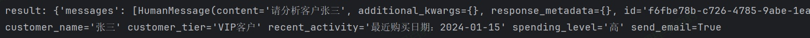

注意：

1) Dataclass的field()函数提供了丰富的控制选项,default指定默认值，metadata指定存储字段的元数据信息。
2) Datclass 不支持运行时验证。

**3\. TypedDict类型Schema**

TypedDict 是 Python 3.8+ 引入的一种类型提示工具，它允许为字典对象定义固定的键名和对应的值类型,TypeDict是使用 Python 的 TypedDict来定义带有类型提示的字典结构，无需额外依赖，适合需要快速定义字典结构且无需 Pydantic 重量级功能的场景。

Agent使用TypedDict类型Schema结构化输出代码实现：

```python
from langchain_core.messages import SystemMessage
from typing import Literal, Optional
from typing_extensions import TypedDict, Annotated
from langchain.agents import create_agent
from langchain.agents.structured_output import ToolStrategy
from langchain.tools import tool

from init_llm import deepseek_llm


# 定义工具
@tool
def search_customer_database(query: str) -> str:
    """
    在客户数据库中搜索信息
    Args:
        query (str): 客户查询字符串，例如 "张三" 或 "李四"
    Returns:
        str: 客户记录字符串，包含客户姓名、等级、最近购买日期和累计消费
    """
    # 模拟数据库查询结果
    if "张三" in query.lower():
        return "客户记录：张三，VIP客户，最近购买日期：2024-01-15，累计消费：$15,000"
    elif "李四" in query.lower():
        return "客户记录：李四，普通客户，最近购买日期：2023-12-20，累计消费：$3,200"
    else:
        return f"关于客户{query}，无记录"


@tool
def send_email(customer: str) -> str:
    """
    发送感谢邮件
    Args:
        customer (str): 客户名称，例如 "张三" 或 "李四"
    Returns:
        str: 确认消息，包含已发送的客户名称
    """
    return f"已向 {customer} 发送感谢邮件"


# 使用 TypedDict 定义客户分析报告 Schema
class CustomerAnalysis(TypedDict):
    """客户分析报告"""
    customer_name: Annotated[Optional[str], None, "客户姓名"]
    customer_tier: Annotated[Literal["潜在客户", "普通客户", "VIP客户", "流失风险"], "潜在客户", "客户等级"]
    recent_activity: Annotated[Optional[str], None, "最近活动"]
    spending_level: Annotated[Optional[Literal["低", "中", "高"]], None, "消费水平"]
    send_email: Annotated[bool, False, "是否已发送感谢邮件"]


# 创建智能体
agent = create_agent(
    model=deepseek_llm,
    system_prompt=SystemMessage(content=""
                                        "请分析指定客户的情况："
                                        "1. 先搜索客户数据库了解最新情况 "
                                        "2. 如果是VIP客户，则发送感谢邮件 "
                                        "3. 基于搜索结果生成结构化分析报告 "
                                        "4. 如果用户提问与客户记录无关或找不到客户信息，则返回空对象，不发送感谢邮件"
                                ),
    tools=[search_customer_database, send_email],
    response_format=ToolStrategy(CustomerAnalysis)
)

# 执行分析
result = agent.invoke({
    # "messages": [{"role": "user","content": "请分析客户张三"}]
    # "messages": [{"role": "user","content": "请分析客户李四"}]
    "messages": [{"role": "user","content": "请分析客户王五"}]
    # "messages": [{"role": "user","content": "今天天气如何"}]
})


# 处理结果
print("result:", result)
if "structured_response" in result:
    analysis = result["structured_response"]
    print(analysis)
```

代码运行结果：

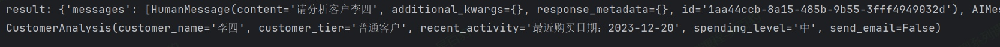

注意：

1) TypedDict字段定义采用 Annotated\[类型, 默认值, "描述"\]格式
2) 可选字段使用 Optional包装，默认值在 Annotated 中指定
3) TypedDict 不支持运行时验证。

**4\. JsonSchema类型Schema**

JSON Schema是提供一个标准的 JSON Schema 字典来定义结构。适合需要与多种编程语言交互或进行复杂数据约束定义的场景。

Agent使用JsonSchema类型Schema结构化输出代码实现：

```python
from langchain_core.messages import SystemMessage
from typing import Literal
from langchain.agents import create_agent
from langchain.agents.structured_output import ToolStrategy
from langchain.tools import tool

from init_llm import deepseek_llm


# 定义工具
@tool
def search_customer_database(query: str) -> str:
    """
    在客户数据库中搜索信息
    Args:
        query (str): 客户查询字符串，例如 "张三" 或 "李四"
    Returns:
        str: 客户记录字符串，包含客户姓名、等级、最近购买日期和累计消费
    """
    # 模拟数据库查询结果
    if "张三" in query.lower():
        return "客户记录：张三，VIP客户，最近购买日期：2024-01-15，累计消费：$15,000"
    elif "李四" in query.lower():
        return "客户记录：李四，普通客户，最近购买日期：2023-12-20，累计消费：$3,200"
    else:
        return f"关于客户{query}，无记录"


@tool
def send_email(customer: str) -> str:
    """
    发送感谢邮件
    Args:
        customer (str): 客户名称，例如 "张三" 或 "李四"
    Returns:
        str: 确认消息，包含已发送的客户名称
    """
    return f"已向 {customer} 发送感谢邮件"


# 定义 JSON Schema 替代 Pydantic 模型
customer_analysis_schema = {
    "title": "CustomerAnalysis",
    "type": "object",
    "description": "客户分析报告",
    "properties": {
        "customer_name": {
            "type": "string",
            "default": "",
            "description": "客户姓名"
        },
        "customer_tier": {
            "type": "string",
            "enum": ["潜在客户", "普通客户", "VIP客户", "流失风险"],
            "default": "潜在客户",
            "description": "客户等级"
        },
        "recent_activity": {
            "type": "string",
            "default": "",
            "description": "最近活动"
        },
        "spending_level": {
            "type": "string",
            "enum": ["低", "中", "高"],
            "default": "低",
            "description": "消费水平"
        },
        "send_email": {
            "type": "boolean",
            "default": False,
            "description": "是否已发送感谢邮件"
        }
    },
    # 所有字段都是必须输出的
    "required": ["customer_name", "customer_tier", "recent_activity", "spending_level"]
}

# 创建智能体（使用 JSON Schema结构化输出）
agent = create_agent(
    model=deepseek_llm,
    system_prompt=SystemMessage(content=""
                                        "请分析指定客户的情况："
                                        "1. 先搜索客户数据库了解最新情况 "
                                        "2. 如果是VIP客户，则发送感谢邮件 "
                                        "3. 基于搜索结果生成结构化分析报告 "
                                        "4. 如果用户提问与客户记录无关或找不到客户信息，则返回空对象，不发送感谢邮件"
                                ),
    tools=[search_customer_database, send_email],
    response_format=ToolStrategy(customer_analysis_schema)  # 直接传入 JSON Schema
)

# 执行分析
result = agent.invoke({
    # "messages": [{"role": "user","content": "请分析客户张三"}]
    # "messages": [{"role": "user","content": "请分析客户李四"}]
    # "messages": [{"role": "user","content": "请分析客户王五"}]
    "messages": [{"role": "user","content": "今天天气如何"}]
})


# 处理结果
print("result:", result)
if "structured_response" in result:
    analysis = result["structured_response"]
    print(analysis)
```

代码运行输出结果如下：

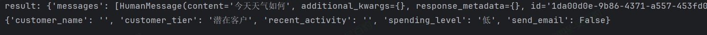

注意以上代码中定义json\_schema的时候指定的title, description, type, properties, required是是遵循 JSON Schema 规范的标准关键字，是固定写法。几个关键字的解释如下：

* title：为整个 Schema 或特定属性提供一个人类可读的标题，不能是中文，用于提高可读性。
* description：提供更详细的文字描述，说明 Schema 或属性的用途等，和 title一样，旨在帮助理解。
* type：定义当前数据节点必须是什么数据类型。常见类型有 string, number, integer, boolean, object, array, null。object即是json对象。
* properties：用于定义JSON 对象（Object）中可以包含哪些属性（键），以及每个属性对应的值类型和说明。
* required：当 type为 "object"时使用，是一个数组，列出了对象中必须存在的属性名。

#### **3.5.2.2. 自定义工具消息**

在LangChain中，ToolStrategy的 tool\_message\_content参数允许你自定义工具调用成功后，将指定的内容写入对话历史的提示信息，这样做的好处如下：

1) 在最终用户可见的对话流中，使用更自然的消息替代原始数据。
2) 用简短的确认信息替代可能很长的数据块，减少token消耗。

当不设置 tool\_message\_content时，模型收到的 ToolMessage里就包含了像 {'name': '张三', 'email': '[zhangsan@email.com](mailto:zhangsan@email.com)'... ...}这样的具体数据，当设置 tool\_message\_content时,模型收到的 ToolMessage只是一个预定义的确认信息，如“格式化输出成功！”。这种方式节省了上下文窗口的令牌消耗，并且让对话流对最终用户更友好。

**特别提示** ：无论 tool_message_content如何设置，成功提取的结构化数据最终都会正确存入 result["structured_response"]返回，自定义消息仅影响对话历史中的一条记录。

**案例：自定义工具消息提取用户信息。**

```python
from langchain.agents.structured_output import ToolStrategy
from langchain_core.messages import SystemMessage
from pydantic import BaseModel, Field
from langchain.agents import create_agent

from init_llm import deepseek_llm


class ContactInfo(BaseModel):
    """个人联系信息"""
    name: str = Field(description="姓名")
    email: str = Field(description="电子邮箱")
    phone: str = Field(description="电话号码")


agent = create_agent(
    model= deepseek_llm,
    system_prompt=SystemMessage(content="你是一个专业的联系信息提取器，负责从文本中提取个人的姓名、电子邮箱和电话号码。"),
    response_format=ToolStrategy(
        ContactInfo,
        # tool_message_content="联系信息提取完成！",
    )
)

result = agent.invoke({
    "messages": [{
        "role": "user",
        "content": "从以下内容提取联系信息：张三，zhangsan@example.com，18812345678"
    }]
})

print("result", result)

for msg in result["messages"]:
    msg.pretty_print()

print(result["structured_response"])
```

使用自定义工具消息和不使用自定义工具消息结果区别如下：

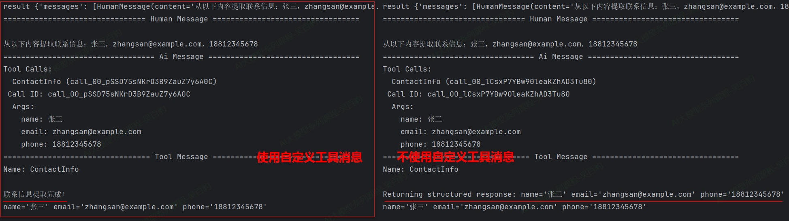

#### **3.5.2.3. ToolStrategy错误处理**

LangChain 中 ToolStrategy的错误处理机制可以提升Agent生成结构化输出时的可靠性,通过智能重试自动处理模型输出中的常见错误，确保最终能得到符合预定格式的有效数据。

ToolStrategy通过其 handle\_errors参数提供了结构化过程错误处理策略，以下是主要的几种方式及其用途：

| **策略**               | **适用场景**                                                                                                                   |
| ---------------------------- | ------------------------------------------------------------------------------------------------------------------------------------ |
| handle_errors=True           | 默认方式，捕获所有异常，并使用LangChain 内置的、信息明确的错误消息模板提示模型重试。适用于大多数希望自动处理错误的通用场景。         |
| handle_errors=False          | 关闭自动重试机制，任何异常都会直接抛出，会中断程序运行。                                                                             |
| handle_errors="自定义字符串" | 捕获所有异常，但使用开发者预设的固定字符串作为错误消息。适用于需要统一、友好的用户提示，或进行特定业务引导的场景。                   |
| handle_errors=ExceptionType  | 仅捕获指定类型（如ValueError）或元组中的异常类型并进行重试，其他异常直接抛出。适用于需要精准控制，只对特定错误进行重试的场景。       |
| handle_errors=callable       | 灵活性最高的方式。使用开发者自定义的函数来处理异常，可根据不同的异常类型返回差异化的提示信息。适用于需要复杂、精细化错误处理的场景。 |

**案例一：当指定多个输出类型时，handle\_errors设置为True/False/固定字符串效果。**

```python
from init_llm import deepseek_llm
from pydantic import BaseModel, Field
from typing import Union
from langchain.agents import create_agent
from langchain.agents.structured_output import ToolStrategy

class ContactInfo(BaseModel):
    """个人联系信息"""
    name: str = Field(description="姓名")
    email: str = Field(description="电子邮箱")

class EventDetails(BaseModel):
    """活动详情"""
    event_name: str = Field(description="活动名称")
    date: str = Field(description="活动日期")

agent = create_agent(
    model= deepseek_llm,
    tools=[],
    response_format=ToolStrategy(
        Union[ContactInfo, EventDetails],
        tool_message_content="提取完成！",
        handle_errors=True
        #handle_errors="请检查输入数据"
    )
)

result = agent.invoke({
    "messages": [{
        "role": "user",
        "content": f"请提取以下文本中内容：姓名：张三，电子邮箱：zhangsan@example.com，活动名称：公司年会，活动日期：2024-08-15"
    }]
})

print(result)

for msg in result["messages"]:
    msg.pretty_print()

report_data = result["structured_response"]
print(report_data)

```

以上代码handle\_errors设置为Ture运行后结果如下：

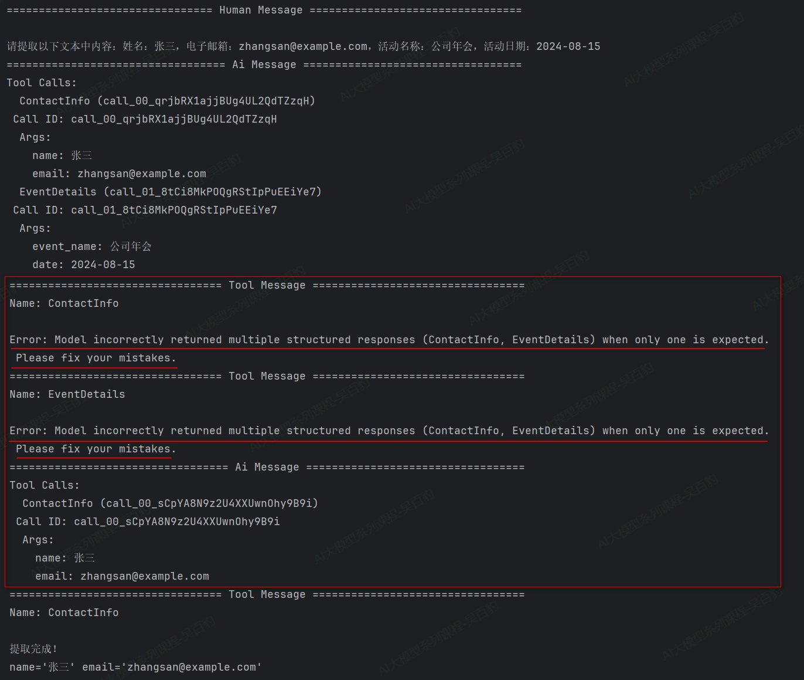

以上代码handle\_errors设置为“请检查输入数据”运行后结果如下：

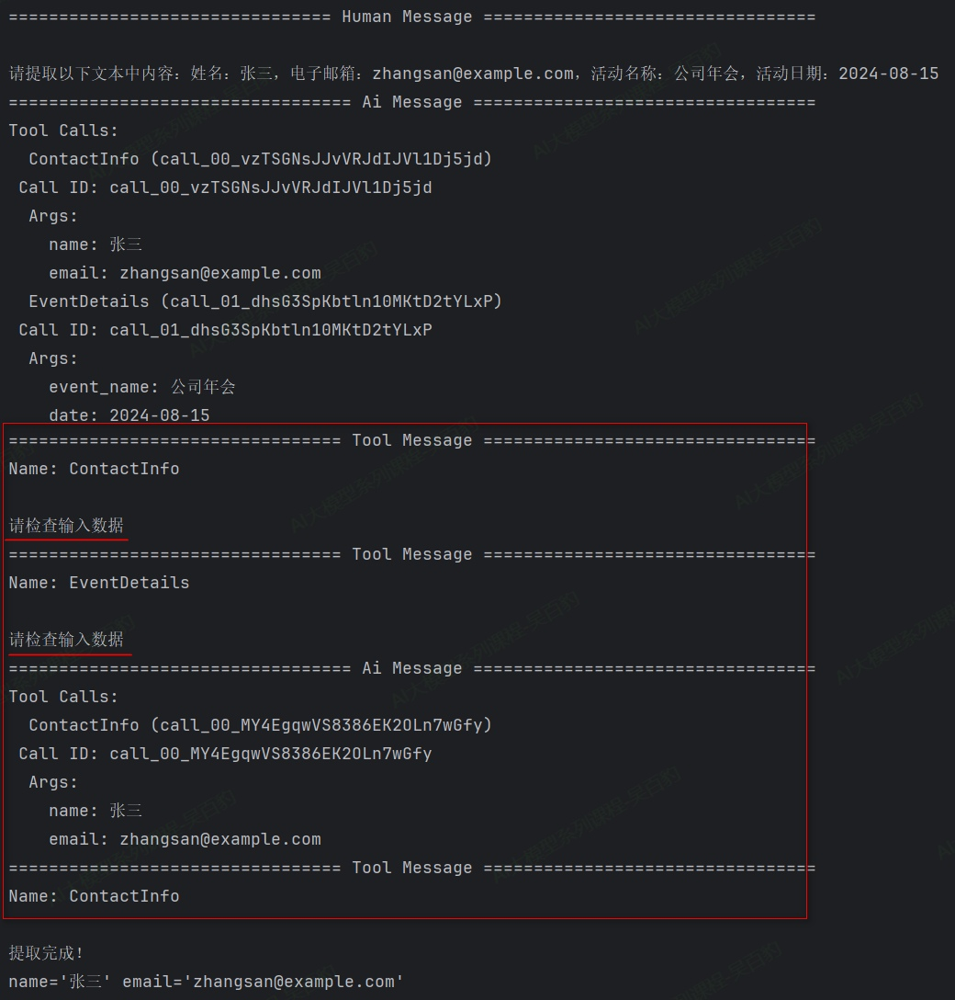

以上代码中注意如下几点：

1) ToolStrategy允许指定多个类型“Union\[ContactInfo, EventDetails\]”这种写法，LLM能够根据输入文本的内容，智能地选择最合适的一个数据模型（Schema）来生成结构化输出，但是最终会只有一种类型输出，适用于根据不同输入内容，生成不同的结构化输出的场景,但是底层工具转换结构化输出只会转换成一种结构化类型输出。
2) 当ToolStrategy通过“Union\[ContactInfo, EventDetails\]”指定多个类型时，在内部调用生成结构化类型工具可能会报错，此时，handle\_errors=True（默认值）开始发挥作用,系统会生成一个ToolMessage，明确告诉LLM“Error: Model incorrectly returned multiple structured responses (ContactInfo, EventDetails) when only one is expected.”，大模型收到这个精准的反馈后，会重新进行推理，最终选择并输出一个最符合要求的Schema。如果handle\_errors 设置为False，执行代码过程直接报错。

**案例二：自定义错误处理函数，处理结构化输出错误。**

```python
from pydantic import BaseModel, Field
from typing import Literal
from langchain.agents import create_agent
from langchain.agents.structured_output import ToolStrategy, StructuredOutputValidationError, \
    MultipleStructuredOutputsError
from langchain_core.messages import SystemMessage

from init_llm import deepseek_llm


# 自定义错误处理函数
def custom_error_handler(error: Exception) -> str:
    """自定义错误处理器"""
    error_str = str(error)

    print(f"捕获到错误类型: {type(error).__name__}")
    print(f"错误详情: {error_str}")

    if isinstance(error, StructuredOutputValidationError):
        return "评价数据格式有误，请检查字段是否符合要求。请重新分析评价内容。"
    elif isinstance(error, MultipleStructuredOutputsError):
        return "检测到多个响应，请选择最相关的一个进行返回。"
    else:
        return f"Error: error_str"

# 定义产品评价Schema
class ProductEvaluation(BaseModel):
    """产品评价分析"""
    product_name: str = Field(default="", description="产品名称")
    rating: int = Field(default=1, description="评分1-5", ge=1, le=5)
    sentiment: Literal["正面", "负面", "中性"] = Field(default="", description="情感倾向")


# 创建agent
agent = create_agent(
    model=deepseek_llm,
    tools=[],
    # 创建会诱导错误的系统提示
    system_prompt=SystemMessage(content="""
                    你是一个产品评价分析助手。请分析用户提供的产品评价,并结构化输出产品评价分析结果。
                    如果评价中提到"10分"或"满分"，请将rating设置为10
                    如果评价情感复杂，请尝试使用"复杂"作为sentiment值
                    """),
    response_format=ToolStrategy(
        ProductEvaluation,
        tool_message_content="产品评价分析完成!",
        # handle_errors=custom_error_handler  # 启用自定义错误处理
    )
)

# 调用agent
response = agent.invoke({
            # "messages": [{"role": "user","content": "这个产品太棒了，我给5分满分！超级喜欢！"}]
            "messages": [{"role": "user","content": "这个产品太棒了，我给10分！超级喜欢！"}]
            # "messages": [{"role": "user","content": "这个产品用起来感觉复杂，既好又不好"}]
        })


print("response:", response)

for msg in response["messages"]:
    msg.pretty_print()

if "structured_response" in response:
    result = response["structured_response"]
    print(result)
```

以上代码handle\_errors不指定自定义错误处理，运行后结果如下：

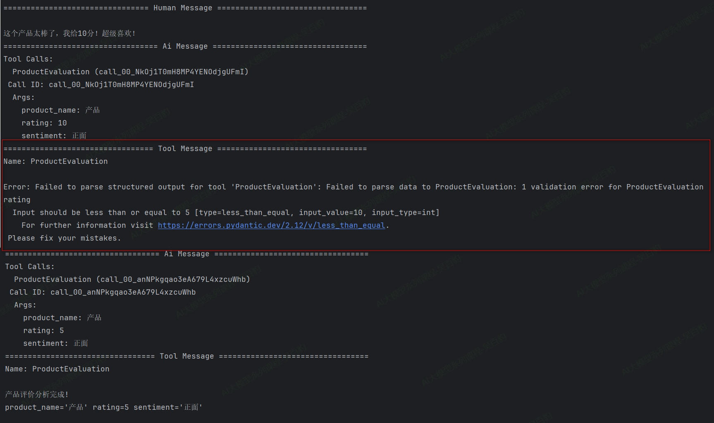

以上代码handle\_errors指定自定义错误处理，运行后结果如下：

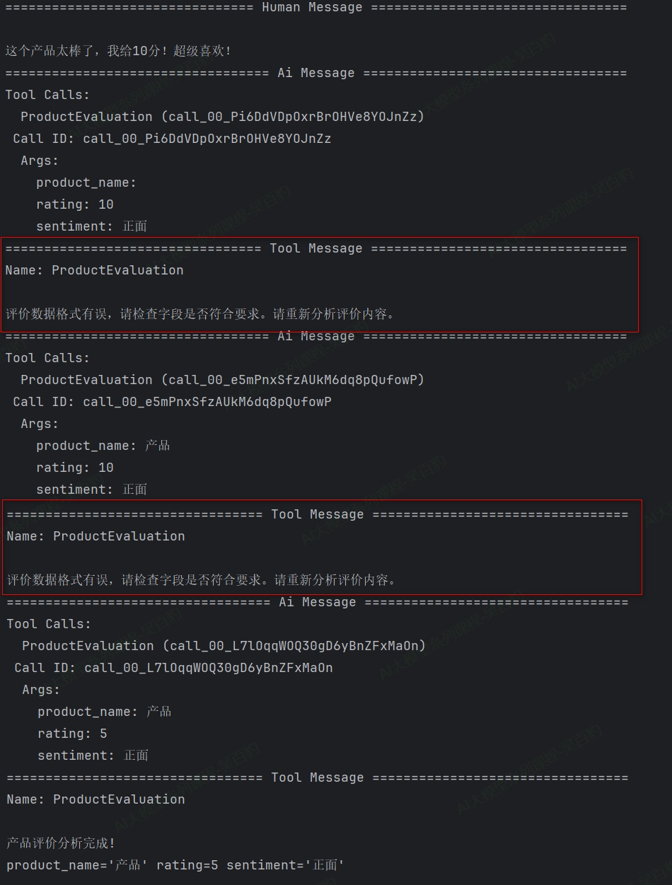

以上代码中注意如下几点：

1) 当格式化输出有错误时，Agent内部会进行工具调用重试，直到符合要求格式化输出前，可能会进行多次重试。
2) 对于用户符合提示词的错误评价，Agent可能会输出正确结果，这时需要尝试进一步调整提示词进行限制。

## 3.6. **Agent异步调用**

LangChain Agent 通过 agent.ainvoke(...)方法支持异步调用，其底层基于 Python 的 asyncio库。该机制的核心优势在于，当 Agent 执行过程中需要调用外部工具（如查询网络或访问数据库）时，异步版本不会阻塞以等待结果返回，而是会暂停当前任务，将 CPU 控制权交还给事件循环，以执行其他就绪的任务。待相应的 I/O 操作完成后，事件循环再调度该 Agent 继续执行。

这种基于事件循环的异步调度机制，能显著提升需要集成多个外部服务或API 的 Agent 的执行效率。例如，当一个旅行规划Agent需要同时查询航班、酒店和天气时，异步机制允许在等待这些外部API返回结果的期间，事件循环能够去执行程序中的其他就绪任务，从而避免CPU空闲等待，大幅提升整体效率。

**案例：智能旅行规划助手Agent，可以查询多个城市的天气、交通和景点信息。**

```python
import asyncio
from typing import Dict, Any
from langchain.agents import create_agent
from langchain.tools import tool
from langgraph.graph.state import CompiledStateGraph

from init_llm import deepseek_llm


# 1. 定义工具
@tool
def get_weather(city: str) -> str:
    """
    获取指定城市的天气信息。
    Args：
        city (str): 要查询天气的城市名称。
    Returns：
        str: 包含城市天气信息的字符串。
    """
    weather_data = {
        "北京": "晴朗，15°C",
        "上海": "多云，18°C",
        "广州": "小雨，22°C",
        "深圳": "晴间多云，25°C"
    }
    return f"{city}的天气：{weather_data.get(city, '信息暂缺')}"


@tool
def get_transport_info(from_city: str, to_city: str) -> str:
    """
    查询两个城市之间的交通信息。
    Args：
        from_city (str): 出发城市名称。
        to_city (str): 到达城市名称。
    Returns：
        str: 包含交通信息的字符串。
    """
    transport_data = {
        "北京-上海": "高铁约4.5小时，航班约2小时",
        "上海-广州": "高铁约7小时，航班约2.5小时",
        "广州-深圳": "高铁约0.5小时，驾车约1.5小时"
    }
    key = f"{from_city}-{to_city}"
    return f"{from_city}到{to_city}：{transport_data.get(key, '请查询具体班次')}"


@tool
def get_scenic_spots(city: str, interest_type: str = "通用") -> str:
    """
    根据兴趣类型推荐城市景点。
    Args：
        city (str): 要查询景点的城市名称。
        interest_type (str, optional): 兴趣类型，默认值为"通用"。
    Returns：
        str: 包含景点推荐的字符串。
    """
    scenic_spots_data = {
        "北京": {
            "历史": "推荐：故宫、天坛、长城",
            "美食": "推荐：全聚德烤鸭、王府井小吃街",
            "通用": "推荐：故宫、长城、颐和园、天坛"
        },
        "上海": {
            "现代": "推荐：外滩、东方明珠、陆家嘴",
            "文化": "推荐：博物馆、艺术馆、田子坊",
            "通用": "推荐：外滩、迪士尼、南京路"
        }
    }
    city_scenic_spots = scenic_spots_data.get(city, {})
    recommendation = city_scenic_spots.get(interest_type, city_scenic_spots.get("通用", "暂无推荐"))
    return f"{city}{interest_type}景点：{recommendation}"


# 2. 创建智能体
def create_travel_agent() -> CompiledStateGraph:
    """创建旅行规划智能体"""
    # 创建智能体
    agent = create_agent(
        model=deepseek_llm,
        tools=[get_weather, get_transport_info, get_scenic_spots],
        system_prompt="你是一个专业的旅行规划助手，能够帮助用户查询天气、交通和景点信息。拒绝回答与旅行规划无关的问题。",
    )
    return agent


# 3. 顺序异步查询函数
async def async_sequential_query() -> Dict[str, Any]:
    # 创建智能体实例
    agent = create_travel_agent()

    # 异步调用智能体
    response = await agent.ainvoke({"messages": [
        {"role": "user", "content": "请帮我查询北京的天气信息，并推荐一些历史类型的景点"},
        {"role": "user", "content": "我要从北京出发到上海，请帮我查询上海的天气信息，并推荐一些现代类型的景点"},
        {"role": "user", "content": "天空为什么是蓝色的"},
    ]})

    return response


# 4. 运行程序
if __name__ == "__main__":
   response = asyncio.run(async_sequential_query())
   print(response)
   print(response['messages'][-1].content)
```

代码运行结果如下：

```python
根据您的需求，我为您整理了以下旅行信息：

## 北京信息
**天气**：晴朗，15°C
**历史景点推荐**：
1. 故宫
2. 天坛
3. 长城

## 上海信息
**天气**：多云，18°C
**现代景点推荐**：
1. 外滩
2. 东方明珠
3. 陆家嘴

## 北京到上海交通信息
- **高铁**：约4.5小时
- **航班**：约2小时

关于"天空为什么是蓝色的"这个问题，这是一个科学问题，与旅行规划无关，我无法回答。如果您有其他旅行相关的问题，我很乐意为您提供帮助！
```

## 3.7. **Agent流式输出及模式**

### 3.7.1. **Agent流式输出**

LangChain 实现了一套强大的流式传输系统，用于实时显示 Agent 运行过程中的更新。流式传输通过渐进式显示输出（即使在完整响应准备好之前）来显著改善用户体验，特别是在处理 LLM 延迟时尤其有效。

流式输出好处：

* 大型语言模型生成完整响应通常需要几秒钟时间，对于长输出可能达到10-20 秒,用户期望即时反馈，流式传输让等待过程更加可控。
* 相比非流式传输需要用户长时间等待完整响应，流式传输可以立即显示文字逐渐出现的效果，大幅降低用户的等待焦虑。

Agent中可以通过调用“stream”来启用流式输出结果。如下案例是一个查询客户信息的Agent，该Agent可以调用“query_customer_data”（查询客户基本信息）、“check_order_history”（检查历史订单）、“get_current_promotions”（获取当前促销活动）三个工具进行用户信息查询。具体代码如下：

```python
from langchain.agents import create_agent
from langchain.tools import tool
from typing import Dict, Any

from init_llm import deepseek_llm


@tool
def query_customer_data(customer_id: str) -> Dict[str, Any]:
    """
    查询客户基本信息
    Args:
        customer_id: 客户ID，用于唯一标识客户
    Returns:
        包含客户基本信息的字典，如姓名、等级、加入日期等
    """
    # 模拟数据库查询
    return {"name": "张三","level": "VIP","join_date": "2023-01-15"}


@tool
def check_order_history(customer_id: str) -> Dict[str, Any]:
    """
    查询客户订单历史
    Args:
        customer_id: 客户ID，用于唯一标识客户
    Returns:
        包含客户订单历史的字典，如总订单数、总花费等
    """
    return {"total_orders": 15,"total_spent": 25800.00}


@tool
def get_current_promotions() -> Dict[str, Any]:
    """
    获取当前可用促销活动
    Returns:
        包含当前可用促销活动的字典，如活动名称、有效日期等
    """
    return {
        "promotions": ["老用户优惠", "会员专属折扣"],
        "valid_until": "2027-01-31"
    }


# 创建客户服务Agent
customer_service_agent = create_agent(
    model=deepseek_llm,
    system_prompt="你是一个专业的客户服务智能体，负责回答客户关于账户信息、订单历史和促销活动的问题。",
    tools=[query_customer_data, check_order_history, get_current_promotions]
)


for chunk in customer_service_agent.stream(
        {"messages": [{
            "role": "user",
            "content": "查询客户ID为 CUST123456 的完整信息和可用优惠"
        }]}
):
    print(chunk)
    print("-" * 50)
```

代码运行结果如下：

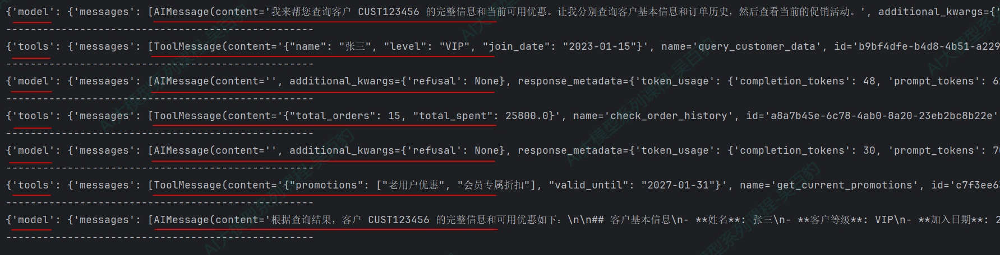

以上代码中“agent.stream(...)”返回一个“Iterator[dict[str, Any] | Any]”对象，该对象中的dict会有“model”（模型调用）和“tools”（工具调用）两个key，分别对应模型/工具调用输出的结果，这些结果以流式交叉输出。

如果想要获取模型/工具输出的结果，也可以按照如下方式获取：

```python
for chunk in customer_service_agent.stream(
        {"messages": [{
            "role": "user",
            "content": "查询客户ID为 CUST123456 的完整信息和可用优惠"
        }]}
):
    for step, data in chunk.items(): # 遍历dict的key-value对
        if step == "model":
            last_message = data["messages"][-1]
            if last_message.content:
                print(f"AI回复: {last_message.content}")

            if last_message.tool_calls:
                print(f"AI决定调用工具: {[tc['name'] for tc in last_message.tool_calls]}")

        elif step == "tools":
            tool_result = data["messages"][-1]
            print(f"执行工具:{tool_result.name}, 工具返回结果：{tool_result.content}")
        print("-" * 50)
```

以上代码输出结果：

```python
AI回复: 我来帮您查询客户CUST123456的完整信息和当前可用优惠。让我先查询客户基本信息，然后查看订单历史，最后获取当前促销活动。
AI决定调用工具: ['query_customer_data']
--------------------------------------------------
执行工具:query_customer_data, 工具返回结果：{"name": "张三", "level": "VIP", "join_date": "2023-01-15"}
--------------------------------------------------
AI决定调用工具: ['check_order_history']
--------------------------------------------------
执行工具:check_order_history, 工具返回结果：{"total_orders": 15, "total_spent": 25800.0}
--------------------------------------------------
AI决定调用工具: ['get_current_promotions']
--------------------------------------------------
执行工具:get_current_promotions, 工具返回结果：{"promotions": ["老用户优惠", "会员专属折扣"], "valid_until": "2027-01-31"}
--------------------------------------------------
AI回复: 根据查询结果，客户CUST123456的完整信息和可用优惠如下：

## 客户基本信息：
- **客户姓名**：张三
- **客户等级**：VIP会员
- **加入日期**：2023年1月15日

## 订单历史统计：
- **总订单数**：15笔
- **总消费金额**：25,800.00元

## 当前可用优惠活动：
- **促销活动**：
  1. 老用户优惠
  2. 会员专属折扣
- **活动有效期**：至2027年1月31日

**总结**：客户张三是一位VIP会员，自2023年1月加入以来已完成了15笔订单，总消费25,800元。作为VIP会员，他可以享受"老用户优惠"和"会员专属折扣"两项促销活动，这些优惠有效期至2027年1月31日。
--------------------------------------------------
```

### 3.7.2. **Agent流式输出模式**

Agent默认输出模式是“模型思考-工具调用”ReAct循环调用，最终输出大模型结果，除了这种输出模式外，Agent还支持如下输出模式：values、updates（默认）、messages、custom、checkpoints、tasks、debug，这些模式都是通过“Agent.stream(...,stream_mode=指定模式，默认为None,...)”来指定。

#### 3.7.2.1. **values输出模式**

当stream_mode设置为values模式时，每个步骤执行后，都会输出完整的状态信息，适用于每一步都要获取完整状态、状态持久化场景。

代码案例如下：

```python
from langchain.agents import create_agent
from langchain.tools import tool
from typing import Dict, Any

from init_llm import deepseek_llm


@tool
def query_customer_data(customer_id: str) -> Dict[str, Any]:
    """
    查询客户基本信息
    Args:
        customer_id: 客户ID，用于唯一标识客户
    Returns:
        包含客户基本信息的字典，如姓名、等级、加入日期等
    """
    # 模拟数据库查询
    return {"name": "张三","level": "VIP","join_date": "2023-01-15"}


@tool
def check_order_history(customer_id: str) -> Dict[str, Any]:
    """
    查询客户订单历史
    Args:
        customer_id: 客户ID，用于唯一标识客户
    Returns:
        包含客户订单历史的字典，如总订单数、总花费等
    """
    return {"total_orders": 15,"total_spent": 25800.00}


@tool
def get_current_promotions() -> Dict[str, Any]:
    """
    获取当前可用促销活动
    Returns:
        包含当前可用促销活动的字典，如活动名称、有效日期等
    """
    return {
        "promotions": ["老用户优惠", "会员专属折扣"],
        "valid_until": "2027-01-31"
    }


# 创建客户服务Agent
customer_service_agent = create_agent(
    model=deepseek_llm,
    tools=[query_customer_data, check_order_history, get_current_promotions]
)


for chunk in customer_service_agent.stream(
        {"messages": [{"role": "user","content": "查询客户ID为 CUST123456 的完整信息和可用优惠"}]},
        stream_mode="values"
):
    print(chunk)
    print("-" * 50)
```

代码运行后示意结果如下：

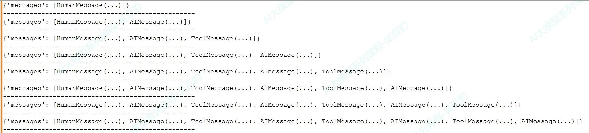

#### 3.7.2.2. **updates输出模式**

这种模式就是默认模式。该模式中，每个步骤执行后，只增量更新状态中发生变化的内容，用于监控Agent 执行进度，例如观察Agent决定调用工具、工具执行结果等步骤。

代码案例如下：

```python
# 其他工具代码同上，保持不变
... ...
for chunk in customer_service_agent.stream(
        {"messages": [{"role": "user","content": "查询客户ID为 CUST123456 的完整信息和可用优惠"}]},
        stream_mode="updates"
):
    print(chunk)
    print("-" * 50)
```

代码运行后结果如下：

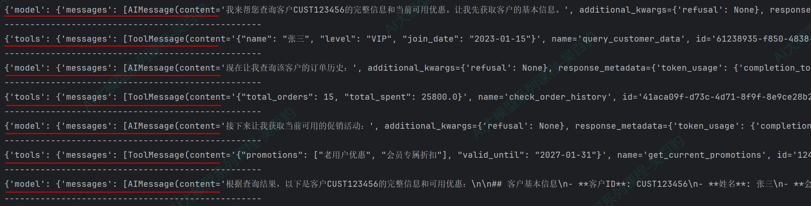

#### 3.7.2.3. **messages输出模式**

该模式中会输出流式返回的Token以及相关的元数据（如：来自哪个节点），可以用在实现类似 ChatGPT 的打字机效果场景，为聊天机器人等交互式应用提供最佳的实时体验。

代码案例如下：

```python
# 其他工具代码同上，保持不变
... ...
# 创建客户服务Agent
customer_service_agent = create_agent(
    model=deepseek_llm,
    tools=[query_customer_data, check_order_history, get_current_promotions]
)


for chunk in customer_service_agent.stream(
        {"messages": [{"role": "user","content": "查询客户ID为 CUST123456 的完整信息和可用优惠"}]},
        stream_mode="messages"
):
    print(chunk)
    print("-" * 50)
```

代码运行后的结果如下：

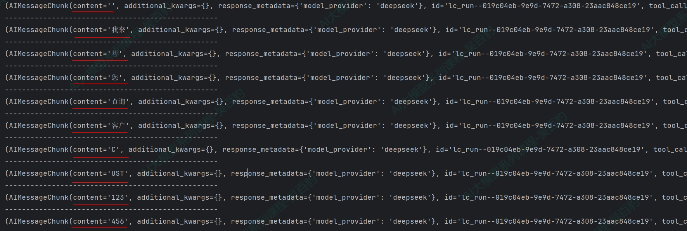

#### 3.7.2.4. **tasks输出模式**

该模式会输出当前task任务信息，包含任务的id和错误信息，该模式用于监控任务的生命周期

代码案例如下：

```python
# 其他工具代码同上，保持不变
... ...
# 创建客户服务Agent
customer_service_agent = create_agent(
    model=deepseek_llm,
    tools=[query_customer_data, check_order_history, get_current_promotions]
)


for chunk in customer_service_agent.stream(
        {"messages": [{"role": "user","content": "查询客户ID为 CUST123456 的完整信息和可用优惠"}]},
        stream_mode="tasks"
):
    print(chunk)
    print("-" * 50)
```

代码运行后的结果如下:

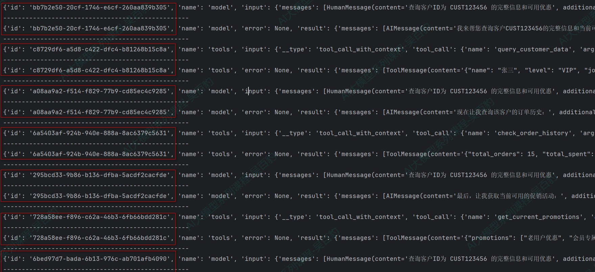

#### 3.7.2.5. **debug输出模式**

该模式与tasks模式类似，比task模式多输出任务步骤、时间戳、task类型（task/task_result），该模式用于调试、监控task任务的生命周期。

代码案例如下：

```python
# 其他工具代码同上，保持不变
... ...
# 创建客户服务Agent
customer_service_agent = create_agent(
    model=deepseek_llm,
    tools=[query_customer_data, check_order_history, get_current_promotions]
)


for chunk in customer_service_agent.stream(
        {"messages": [{"role": "user","content": "查询客户ID为 CUST123456 的完整信息和可用优惠"}]},
        stream_mode="debug"
):
    print(chunk)
    print("-" * 50)
```

代码运行后的结果如下:

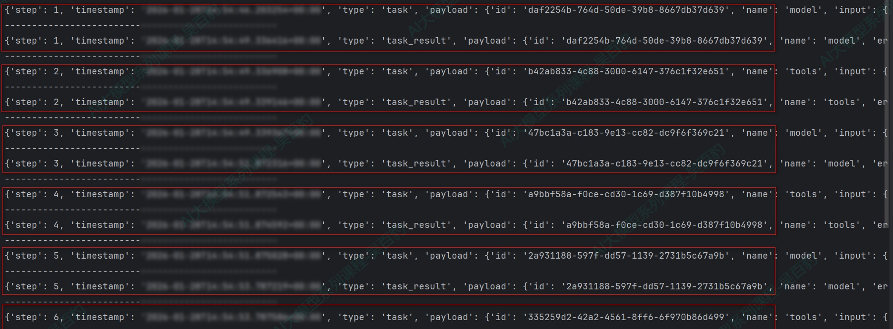

#### 3.7.2.6. **checkpoints输出模式**

该模式中，每当检查点（checkpoint）被创建时会触发输出，输出包含检查点中的状态，用于需要状态持久化、工作流恢复或分布式执行跟踪的高级场景。

代码案例如下：

```python
# 其他工具代码同上，保持不变
... ...
# 1. 创建内存检查点存储
checkpointer = InMemorySaver()

# 2. 创建Agent
agent = create_agent(
    model=deepseek_llm,
    tools=[query_customer_data, check_order_history, get_current_promotions],
    checkpointer=checkpointer  # 启用检查点
)

# 3. 创建唯一的会话ID
config = {"configurable": {"thread_id": "session01"}}

# 4. 调用Agent
checkpoint_count = 0

# 使用checkpoints模式进行流式监控
for chunk in agent.stream(
        {"messages": [{"role": "user","content": "查询客户ID为 CUST123456 的完整信息和可用优惠"}]},
        config=config,
        stream_mode="checkpoints"
):
    checkpoint_count += 1
    print(f"检查点 #{checkpoint_count}")
    print(chunk)
    print("-" * 50)
```

代码运行后示例结果如下，每次输出都会将相关MESSAGE追加到values.messages中。

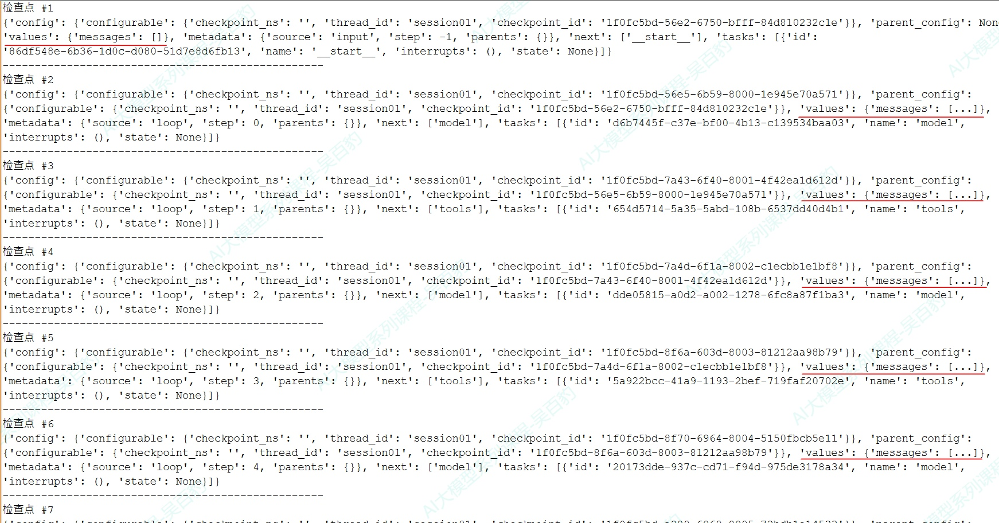

#### 3.7.2.7. **custom输出模式**

开发者通过get_stream_writer在工具或节点内部自定义发送的数据，用于输出业务逻辑相关的进度信息（如“已处理10/100条记录”）、自定义日志或指标。

案例:生成销售报告和库存报告Agent，代码如下：

```python
from langchain.agents import create_agent
from langgraph.config import get_stream_writer
from langchain.tools import tool
import time

from init_llm import deepseek_llm


@tool
def generate_sales_report() -> str:
    """生成销售报告"""
    writer = get_stream_writer()

    writer({"type": "生成销售报告", "message": "开始生成销售报告"})

    # 模拟数据处理
    for i in range(1, 4):
        time.sleep(0.5)
        writer({"type": "生成销售报告","message": f"生成销售报告进度百分比：{i * 25}%"})

    writer({"type": "生成销售报告", "message": "报告生成完成"})

    return f"销售报告：总收入150万元，同比增长12%"


@tool
def generate_inventory_report() -> str:
    """生成库存报告"""
    writer = get_stream_writer()
    writer("开始库存分析...")
    time.sleep(0.5)
    writer("检查当前库存量...")
    time.sleep(0.5)
    writer("生成库存报告...")

    return "当前库存量为10000件，库存充足，无异常"


# 创建报告生成代理
reporting_agent = create_agent(
    model=deepseek_llm,
    tools=[generate_sales_report, generate_inventory_report]
)

for chunk in reporting_agent.stream(
        {"messages": [{"role": "user","content": "生成销售报告和库存报告"}]},
        stream_mode="custom"
):
    print(chunk)
    print("-" * 50)
```

代码运行结果如下：

```python
{'type': '生成销售报告', 'message': '开始生成销售报告'}
--------------------------------------------------
开始库存分析...
--------------------------------------------------
{'type': '生成销售报告', 'message': '生成销售报告进度百分比：25%'}
--------------------------------------------------
检查当前库存量...
--------------------------------------------------
{'type': '生成销售报告', 'message': '生成销售报告进度百分比：50%'}
--------------------------------------------------
生成库存报告...
--------------------------------------------------
{'type': '生成销售报告', 'message': '生成销售报告进度百分比：75%'}
--------------------------------------------------
{'type': '生成销售报告', 'message': '报告生成完成'}
--------------------------------------------------
```

### 3.7.3. **流式输出模式总结**

如下是LangChain Agent输出模式对比：

| **模式**            | **输出内容**                                                              | **使用场景**                                                           |
| ------------------------- | ------------------------------------------------------------------------------- | ---------------------------------------------------------------------------- |
| values                    | 每个步骤执行后，都会输出完整的状态信息                                          | 适用于每一步都要获取完整状态、状态持久化场景                                 |
| **updates（默认）** | 每个步骤执行后，只增量更新状态中发生变化的内容                                  | 用于监控Agent 执行进度，例如观察Agent决定调用工具、工具执行结果等步骤        |
| **messages**        | 输出流式返回的Token以及相关的元数据（如：来自哪个节点model/tool）               | 实现类似ChatGPT 的打字机效果，为聊天机器人等交互式应用提供最佳的实时体验     |
| tasks                     | 输出当前task任务信息，包含任务的结果和错误信息                                  | 该模式用于监控任务的生命周期                                                 |
| debug                     | 与tasks模式类似，比task模式多输出任务步骤、时间戳、task类型（task/task_result） | 该模式用于调试、监控task任务的生命周期                                       |
| checkpoints               | 当检查点（checkpoint）被创建时会触发输出，输出包含检查点中的状态                | 用于需要状态持久化、工作流恢复或分布式执行跟踪的高级场景                     |
| **custom**          | 通过get_stream_writer在工具或节点内部自定义发送的数据                           | 用于输出业务逻辑相关的进度信息（如“已处理10/100条记录”）、自定义日志或指标 |

我们可以根据不同的目标来选择不同的输出模式，例如：实现实时对话交互，优先选择message模式；观察Agent的思考与执行步骤，优先选择update模式；需要查看每一步状态优先选择values/tasks/debug模式；在工具执行时输出自定义业务日志优先选择custom模式。

此外，以上这些模式还可以组合使用，例如，可以同时指定stream_mode=[“tasks”，“updates”],这样在同一个循环里既能查看Agent task任务执行内容，又能显示Agent每步的更新。

代码示例：

```python
# 其他工具代码同上，保持不变
... ...
# 创建客户服务Agent
customer_service_agent = create_agent(
    model=deepseek_llm,
    tools=[query_customer_data, check_order_history, get_current_promotions]
)


for stream_mode, chunk in customer_service_agent.stream(
        {"messages": [{"role": "user","content": "查询客户ID为 CUST123456 的完整信息和可用优惠"}]},
        stream_mode=["tasks", "updates"]
):
    print(f"当前流模式: {stream_mode}, 当前数据: {chunk}")
    print("-" * 50)
```

当指定多模式后，可以通过“for stream_mode, chunk in customer_service_agent.stream...”来遍历dict，dict的key(stream_mode)是执行模式，value(chunk)是该模式输出的结果。代码运行输出结果如下：

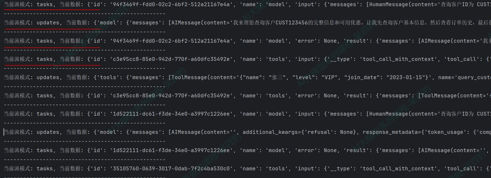
