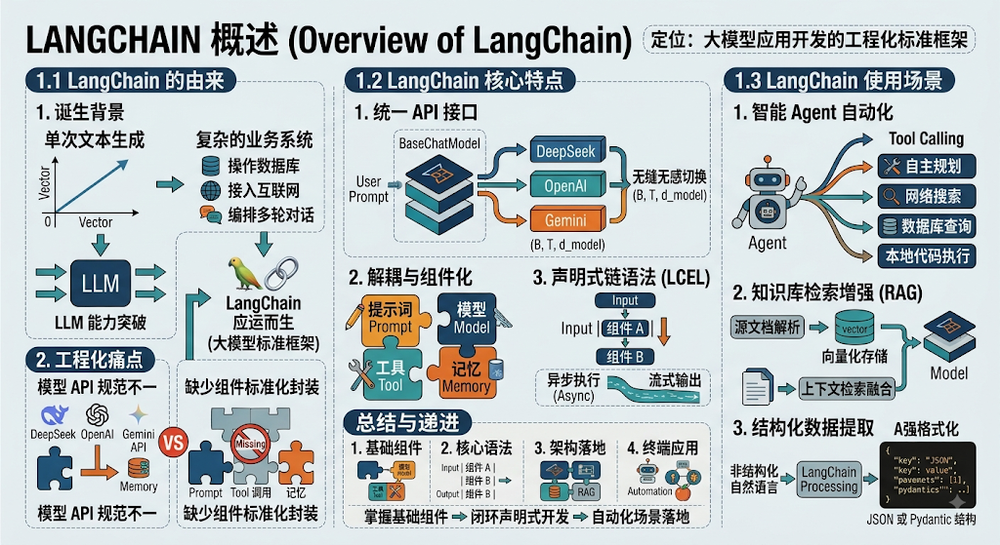
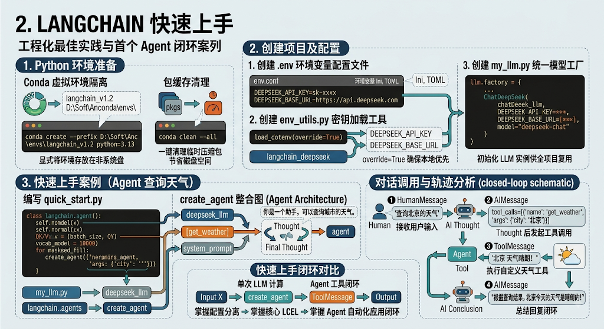
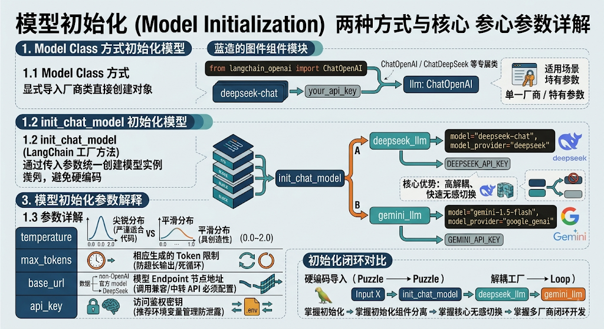
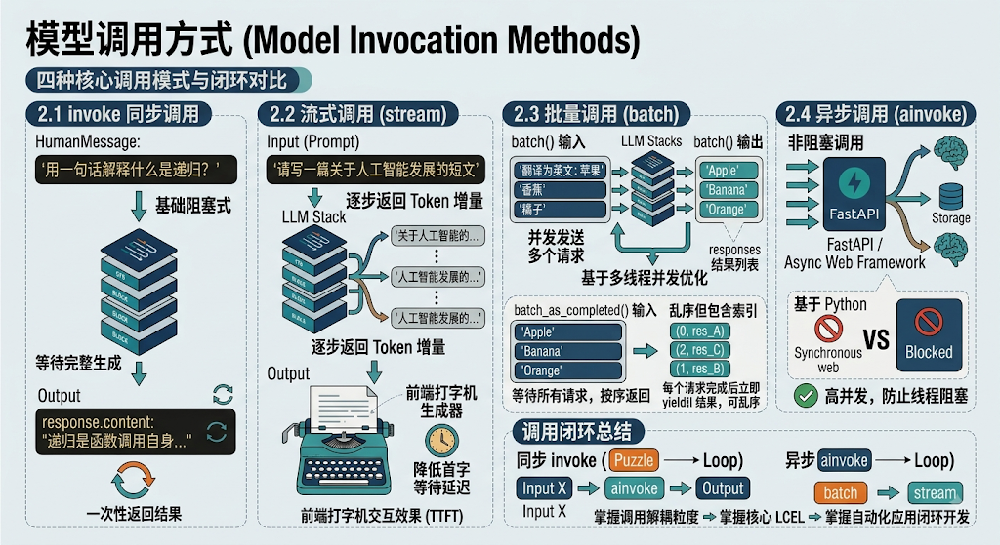
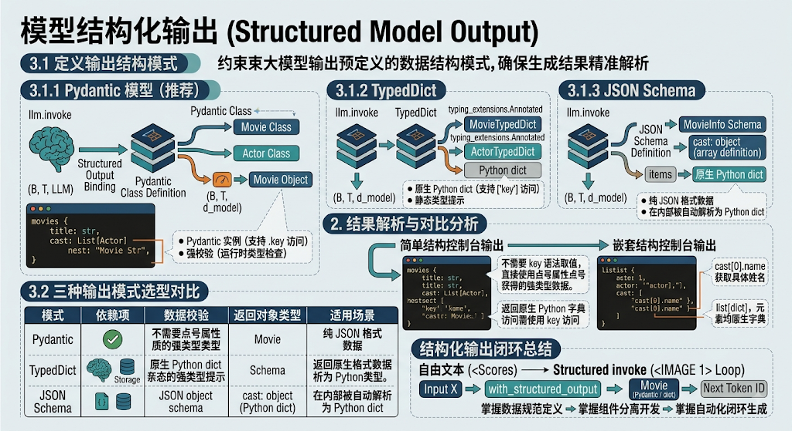
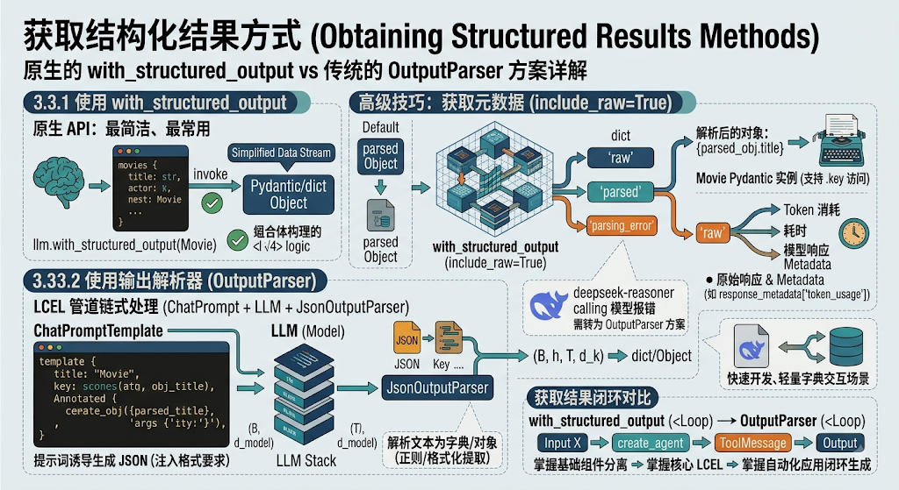
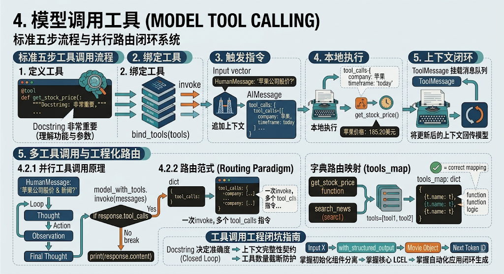
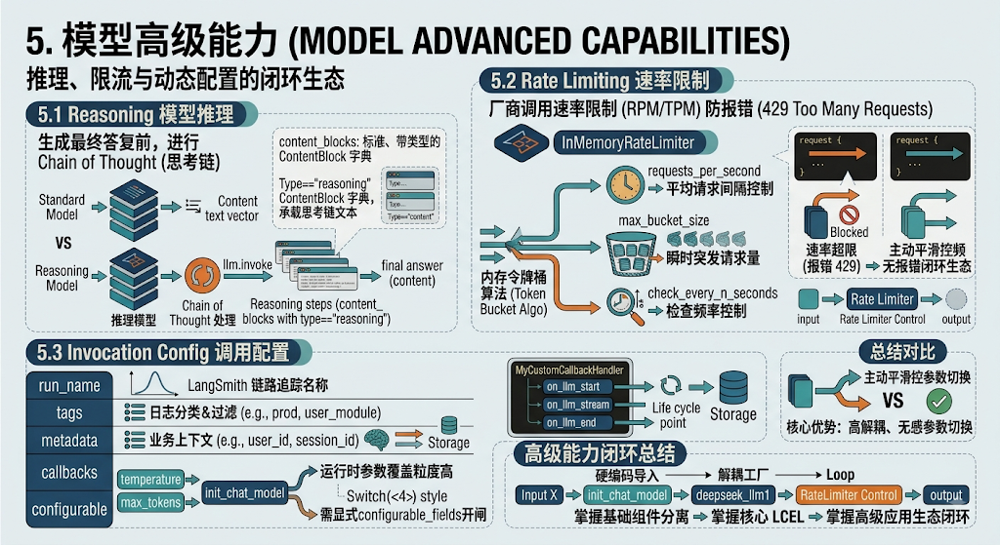
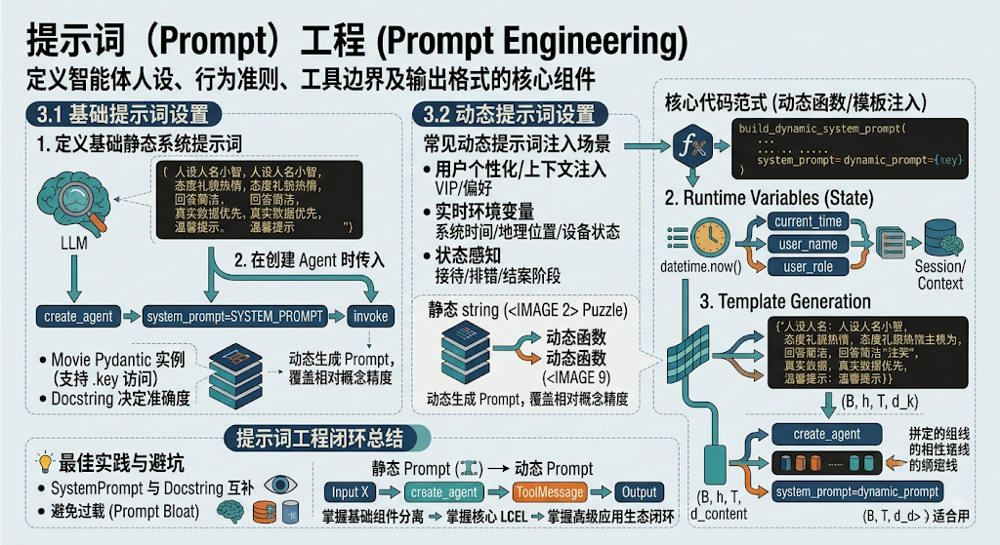

> 📌 **[AI 大模型与云原生全栈知识库](./README.md)** / **模块四：LangChain 框架与应用开发**
> 🏠 [返回主页 README](./README.md) \| ⚡ [面试 30 分钟速记](./interview/00_面试冲刺30分钟速记卡片.md) \| 🎓 [本模块面试题](./interview/03_LangChain与Agent架构面试题.md)

---

# LangChian实战经验

## 一、 LangChain 介绍与环境快速上手

### 1、 LangChain 概述



#### 1.1 LangChain 的由来

- **诞生背景**：随着大语言模型（LLM）能力的突破，开发者需要将单次文本生成扩展为复杂的业务系统（如操作数据库、接入互联网、编排多轮对话）。
- **工程化痛点**：不同大模型厂商 API 规范不一，且缺少对提示词编排、工具调用、上下文记忆等组件的标准化封装。LangChain 应运而生，定位为大模型应用开发的标准框架。

#### 1.2 LangChain 核心特点

- **统一 API 接口**：抽象了 `BaseChatModel` 等统一基类，实现不同模型（DeepSeek、OpenAI、Gemini 等）的无缝无感切换。
- **解耦与组件化**：将提示词（Prompt）、模型（Model）、工具（Tool）、记忆（Memory）完全解耦，可按需自由组合。
- **声明式链式语法（LCEL）**：支持使用 `|` 运算符进行灵活管道连接，天然支持流式（Streaming）与异步（Async）管道化执行。

#### 1.3 LangChain 使用场景

- **智能 Agent 自动化**：结合 Tool Calling 实现自主规划、网络搜索、数据库查询与本地代码执行。
- **知识库检索增强（RAG）**：文档解析、向量化存储（Vector Store）与上下文检索融合。
- **结构化数据提取**：将非结构化自然语言强格式化输出为 JSON 或 Pydantic 结构。

### 2、 LangChain 快速上手



#### 2.1 Python 环境准备

- **Conda 虚拟环境隔离**：为避免 Python 版本及包依赖污染，建议统一使用 Conda 隔离，并显式将环境存放在非系统盘：

  DOS

  ```
  conda create --prefix D:\Soft\Anconda\envs\langchain_v1.2 python=3.13
  ```

- **包缓存清理**：在下载大量依赖后，可通过以下命令一键清理 `pkgs` 临时压缩包，节省 2~5 GB 磁盘空间：

  DOS

  ```
  conda clean --all
  ```

#### 2.2 创建项目及配置

在项目根目录下通过拆分环境配置与模型初始化文件，实现配置与逻辑解耦。

**1. 创建 `.env` 环境变量配置文件**

Ini, TOML

```python
DEEPSEEK_API_KEY=sk-xxxx
DEEPSEEK_BASE_URL=https://api.deepseek.com
```

**2. 创建 `env_utils.py` 密钥加载工具**

```python
import os
from dotenv import load_dotenv

# override=True 确保本地 .env 文件中的配置优先加载
load_dotenv(override=True)

# 从环境变量中提取配置
DEEPSEEK_API_KEY = os.getenv("DEEPSEEK_API_KEY")
DEEPSEEK_BASE_URL = os.getenv("DEEPSEEK_BASE_URL")
```

**3. 创建 `my_llm.py` 统一模型工厂**

```python
from langchain_deepseek import ChatDeepSeek
from env_utils import DEEPSEEK_API_KEY, DEEPSEEK_BASE_URL

# 初始化 DeepSeek LLM 实例供全项目复用
deepseek_llm = ChatDeepSeek(
    api_key=DEEPSEEK_API_KEY,
    api_base=DEEPSEEK_BASE_URL,
    model="deepseek-chat",
)
```

#### 2.3 快速上手案例（Agent 查询天气）

通过 `create_agent` 整合 LLM、自定义天气工具（Tool）与系统提示词（`system_prompt`），实现自动工具调用的端到端案例。

**编写 `quick_start.py`**：

```python
from langchain.agents import create_agent
from my_llm import deepseek_llm

def get_weather(city: str) -> str:
    """获取给定城市的天气。"""
    # 模拟天气查询
    return f"{city} 天气晴朗！"

# 1. 创建挂载工具与系统提示词的 Agent
agent = create_agent(
    model=deepseek_llm,
    tools=[get_weather],
    system_prompt="你是一个助手，你可以查询城市的天气。",
)

# 2. 发起对话调用
resp = agent.invoke(
    {"messages": [{"role": "user", "content": "查询北京的天气"}]}
)

print(resp)
```

**运行结果消息轨迹分析（`resp["messages"]`）**：

1. **`HumanMessage`**：接收用户输入 `"查询北京的天气"`。
2. **`AIMessage`**：LLM 思考后发起工具调用请求，生成 `tool_calls=[{'name': 'get_weather', 'args': {'city': '北京'}}]`。
3. **`ToolMessage`**：本地执行 `get_weather` 函数，捕获输出 `"北京 天气晴朗！"` 并挂载回上下文闭环。
4. **`AIMessage`**：LLM 总结工具回传结果，输出最终答复 `"根据查询结果，北京今天的天气是晴朗的！"`。

## 二、 Models 核心模型层

### 1、 模型初始化



#### 1.1 Model Class 方式初始化模型

**定义与用法**：显式导入具体厂商的封装类（如 `ChatOpenAI`、`ChatGoogleGenerativeAI`）直接创建对象。

**代码范式**：

```python
from langchain_openai import ChatOpenAI

llm = ChatOpenAI(
    model="deepseek-chat",
    api_key="your_api_key",
    base_url="https://api.deepseek.com"
)
```

**适用场景**：确定只使用单一厂商模型，或需要调用某些厂商专属的特有参数时。

#### 1.2 init_chat_model 初始化模型

**定义与用法**：LangChain 提供的工厂方法，通过传入 `model` 与 `model_provider` 统一创建模型实例，避免硬编码导入不同类库。

**代码范式**：

```python
from langchain.chat_models import init_chat_model

# 初始化 DeepSeek
deepseek_llm = init_chat_model(
    model="deepseek-chat",
    model_provider="deepseek",
    api_key=DEEPSEEK_API_KEY,
    base_url=DEEPSEEK_BASE_URL
)

# 初始化 Google Gemini（官方 Google Provider）
gemini_llm = init_chat_model(
    model="gemini-1.5-flash",
    model_provider="google_genai",
    api_key=GEMINI_API_KEY
)
```

**核心优势**：代码解耦粒度高，只需修改参数即可快速无感切换底层模型。

#### 1.3 模型初始化参数解释

**`temperature`**：采样随机性（0.0 ~ 2.0）。数值越低输出越确定/严谨（适合代码、数学分析）；数值越高越具创造性。

**`max_tokens`**：单次响应生成的最大 Token 限制，防止因模型死循环生成或超长输出造成额度浪费。

**`base_url`**：模型请求的 Endpoint 节点地址。调用非 OpenAI 官方（如 DeepSeek、通义千问等兼容 OpenAI 协议的模型）或中转 API 时必须显式配置。

**`api_key`**：访问 API 的鉴权密钥。推荐优先置于 `.env` 环境变量中管理，避免硬编码泄露。

### 2、 模型调用方式



#### 2.1 invoke 同步调用

**定义**：最基础的阻塞式调用，等待大模型完整生成内容后一次性返回结果。

**代码范式**：

```python
from langchain_core.messages import HumanMessage

response = llm.invoke([HumanMessage(content="用一句话解释什么是递归？")])
print(response.content)
```

#### 2.2 流式调用（stream）

**定义**：以 Iterator 生成器形式逐步返回 Token 增量，前端可据此实现类似“打字机”的交互效果，显著降低用户首字等待延迟（TTFT）。

**代码范式**：

```python
for chunk in llm.stream("请写一篇关于人工智能发展的短文"):
    print(chunk.content, end="", flush=True)
```

#### 2.3 批量调用（batch）

**定义**：并发向模型发送多个独立请求（内部基于多线程并发优化），显著提升多任务批处理吞吐效率。

**代码范式**：

```python
prompts = ["翻译为英文：苹果", "翻译为英文：香蕉", "翻译为英文：橘子"]
responses = llm.batch(prompts)
for res in responses:
    print(res.content)
```

batch()特点是等待所有请求处理完毕，按原始输入顺序返回结果列表。当输入列表很大或单个模型调用耗时差异显著时，batch_as_completed()允许应用在收到第一个结果后立即开始后续处理，而不必等待最慢的那个请求，也就是说

batch_as_completed() 每个请求完成后立即 yield 结果，结果可能乱序，但包含索引信息。

batch_as_completed使用示例如下：

```python
from typing import Iterator

from langchain_core.runnables.utils import Output

from init_llm import deepseek_llm

responses:Iterator[tuple[int, Output | Exception]] = deepseek_llm.batch_as_completed([
    "为什么鹦鹉的羽毛是彩色的？",
    "飞机是如何飞行的？",
    "什么是量子计算？"
])

for response in responses:
    print(response) # response 是一个元组，包含索引和输出
    # response 包含结果及其在原始列表中的索引
    print(f"第 {response[0]} 个问题回答完毕: {response[1].content}")
```

#### 2.4 异步调用（ainvoke）

**定义**：基于 Python `asyncio` 的非阻塞调用，适合集成在 FastAPI、Tornado 等异步 Web 框架中，防止高并发场景下线程阻塞。

**代码范式**：

```python
import asyncio

async def main():
    response = await llm.ainvoke("什么是异步编程？")
    print(response.content)

asyncio.run(main())
```

### 3、 模型结构化输出

调用模型时通过 `with_structured_output` 约束大模型输出预定义的数据结构（而非自由文本），确保生成结果能够被程序精准解析，无缝集成至数据库、API 或前端系统中。

#### 3.1 定义输出结构模式



##### 3.1.1 Pydantic 模型（推荐）

基于 Python 类型注解的强类型数据模型，支持运行时类型校验与复杂嵌套结构。返回结果为 **Pydantic 对象**，可通过属性点号（`.`）直接访问。

**1. 简单结构：**

```python
from pydantic import BaseModel, Field
from init_llm import deepseek_llm

class Movie(BaseModel):
    title: str = Field(description="电影标题")
    year: int = Field(description="上映年份")
    director: str = Field(description="导演")
    rating: float = Field(description="评分（10分制）")

# 绑定结构化输出
model_with_structure = deepseek_llm.with_structured_output(Movie)

# 调用模型并获取 Movie 实例
resp: Movie = model_with_structure.invoke("给我介绍下电影《星际穿越》")
print(type(resp))  # <class '__main__.Movie'>
print(resp.title, resp.director, resp.rating)
```

**简单结构控制台输出：**

```python
--- print(type(resp)) ---
<class '__main__.Movie'>

--- print(resp) ---
title='星际穿越' year=2014 director='克里斯托弗·诺兰' rating=9.3

--- print(resp.title, resp.director, resp.rating) ---
星际穿越 克里斯托弗·诺兰 9.3
```

- **结果解析**：`resp` 直接被实例化为 Pydantic 的 `Movie` 对象，不需要通过字典 `['key']` 语法取值，直接使用属性点号（如 `resp.title`）即可获得强类型的数据。

**2. 嵌套结构：**

```python
from typing import List
from pydantic import BaseModel, Field
from init_llm import deepseek_llm

class Actor(BaseModel):
    name: str = Field(description="演员姓名")
    role: str = Field(description="饰演的角色")

class Movie(BaseModel):
    title: str = Field(description="电影标题")
    year: int = Field(description="上映年份")
    director: str = Field(description="导演")
    cast: List[Actor] = Field(description="演员列表")  # 嵌套 List[BaseModel]
    rating: float = Field(description="评分")

structured_model = deepseek_llm.with_structured_output(Movie)
response = structured_model.invoke("请介绍电影《盗梦空间》")

print(f"电影名: {response.title}")
print(f"演员列表: {response.cast}")  # 包含 [Actor(name=..., role=...)]
```

**嵌套结构控制台输出：**

```python
--- print(f"电影名: {response.title}") ---
电影名: 盗梦空间

--- print(f"演员列表: {response.cast}") ---
演员列表: [Actor(name='莱昂纳多·迪卡普里奥', role='多姆·柯布'), Actor(name='约瑟夫·高登-莱维特', role='亚瑟'), Actor(name='艾伦·佩姬', role='阿里阿德涅'), Actor(name='汤姆·哈迪', role='伊姆斯')]
```

- **结果解析**：`response.cast` 是一个包含多个 `Actor` 对象的列表（`list[Actor]`）。列表中每个元素均为 `Actor` 的实例，可以通过 `response.cast[0].name` 获取具体的演员姓名。

##### 3.1.2 TypedDict

Python 3.8+ 原生带类型提示的字典结构，无需额外依赖，适合轻量级场景。需要配合 `typing_extensions.Annotated` 写入字段描述。返回结果为 **原生的 Python `dict`**。

**1. 简单结构：**

```python
from typing_extensions import TypedDict, Annotated
from init_llm import deepseek_llm

class MovieTypedDict(TypedDict):
    title: Annotated[str, "电影的正式名称，例如《盗梦空间》"]
    year: Annotated[int, "电影的公映年份，使用四位数字表示"]
    director: Annotated[str, "电影导演的全名"]
    rating: Annotated[float, "电影在10分制下的评分，可包含一位小数"]

model_with_structure = deepseek_llm.with_structured_output(MovieTypedDict)
resp: MovieTypedDict = model_with_structure.invoke("给我介绍下电影《星际穿越》")

print(type(resp))  # <class 'dict'>
print(resp['title'], resp['director'])
```

**简单结构控制台输出：**

```python
--- print(type(resp)) ---
<class 'dict'>

--- print(resp) ---
{'title': '星际穿越', 'year': 2014, 'director': '克里斯托弗·诺兰', 'rating': 9.4}

--- print(resp['title'], resp['director']) ---
星际穿越 克里斯托弗·诺兰
```

- **结果解析**：返回结果为标准 Python 原生字典（`dict`）。访问时需使用 key 访问（如 `resp['title']`），无需依赖 Pydantic 库。

**2. 嵌套结构：**

```python
from typing import List, Annotated
from typing_extensions import TypedDict
from init_llm import deepseek_llm

class Actor(TypedDict):
    name: Annotated[str, "演员姓名"]
    role: Annotated[str, "饰演的角色"]

class Movie(TypedDict):
    title: Annotated[str, "电影标题"]
    year: Annotated[int, "上映年份"]
    director: Annotated[str, "导演"]
    cast: Annotated[List[Actor], "演员列表"]  # 嵌套 TypedDict 列表
    rating: Annotated[float, "评分"]

model_with_structure = deepseek_llm.with_structured_output(Movie)
resp = model_with_structure.invoke("给我介绍下电影《盗梦空间》")

print(f"电影名: {resp['title']}")
print(f"演员列表: {resp['cast']}")  # [{'name': '...', 'role': '...'}, ...]
```

**嵌套结构控制台输出：**

```python
--- print(f"电影名: {resp['title']}") ---
电影名: 盗梦空间

--- print(f"演员列表:{resp['cast']}") ---
演员列表:[{'name': '莱昂纳多·迪卡普里奥', 'role': '多姆·柯布'}, {'name': '约瑟夫·高登-莱维特', 'role': '亚瑟'}, {'name': '艾伦·佩姬', 'role': '阿里阿德涅'}, {'name': '汤姆·哈迪', 'role': '伊姆斯'}]
```

- **结果解析**：`resp['cast']` 的数据类型为 `list[dict]`，列表内每个元素都是包含 `name` 和 `role` 键的原生字典。

##### 3.1.3 JSON Schema

使用标准 JSON Schema 字典来定义数据规范，支持跨语言交互。标准规范关键字包含：`title`, `description`, `type`, `properties`, `required`。返回结果为 **原生的 Python `dict`**。

**1. 简单结构：**

```python
from init_llm import deepseek_llm

json_schema = {
    "title": "MovieInfo",
    "description": "包含电影标题、上映年份、导演和评分的电影对象",
    "type": "object",
    "properties": {
        "title": {"type": "string", "description": "电影标题"},
        "year": {"type": "integer", "description": "上映年份"},
        "director": {"type": "string", "description": "导演"},
        "rating": {"type": "number", "description": "评分（10分制）"}
    },
    "required": ["title", "year", "director", "rating"]
}

model_with_structure = deepseek_llm.with_structured_output(json_schema)
resp = model_with_structure.invoke("给我介绍下电影《星际穿越》")

print(type(resp))  # <class 'dict'>
print(resp['title'], resp['rating'])
```

**简单结构控制台输出：**

```python
--- print(type(resp)) ---
<class 'dict'>

--- print(resp) ---
{'title': '星际穿越', 'year': 2014, 'director': '克里斯托弗·诺兰', 'rating': 8.6}

--- print(resp['title'], resp['rating']) ---
星际穿越 8.6
```

- **结果解析**：模型会依据定义的 `properties` 和 `required` 约束返回纯 JSON 格式数据，并在 LangChain 内部被自动解析为 Python `dict`。

**2. 嵌套结构：**

```python
from init_llm import deepseek_llm

project_schema = {
    "title": "MovieInfo",
    "description": "包含电影标题、上映年份、导演、演员和评分的电影对象",
    "type": "object",
    "properties": {
        "title": {"type": "string", "description": "电影标题"},
        "year": {"type": "integer", "description": "上映年份"},
        "director": {"type": "string", "description": "导演"},
        "cast": {  # 嵌套数组定义
            "type": "array",
            "description": "演员列表",
            "items": {
                "type": "object",
                "properties": {
                    "name": {"type": "string", "description": "演员姓名"},
                    "role": {"type": "string", "description": "演员角色"}
                },
                "required": ["name", "role"]
            }
        },
        "rating": {"type": "number", "description": "评分（10分制）"}
    },
    "required": ["title", "year", "director", "cast", "rating"]
}

structured_model = deepseek_llm.with_structured_output(project_schema)
response = structured_model.invoke("生成一个关于《星际穿越》的电影信息，包含导演、演员、评分")

print(response['cast'])
```

**嵌套结构控制台输出：**

```python
--- print(response['cast']) ---
[
    {'name': '马修·麦康纳', 'role': '库珀'}, 
    {'name': '安妮·海瑟薇', 'role': '布兰德'}, 
    {'name': '杰西卡·查斯坦', 'role': '墨菲'}, 
    {'name': '迈克尔·凯恩', 'role': '布兰德教授'}
]
```

- **结果解析**：按照 `project_schema` 中定义的 `type: "array"` 格式，模型成功生成并解析出了嵌套包含多个对象的字典列表。

#### 3.2 三种输出模式选型对比

| **模式**        | **依赖项**          | **数据校验**             | **返回对象类型**                   | **适用场景**                           |
| --------------- | ------------------- | ------------------------ | ---------------------------------- | -------------------------------------- |
| **Pydantic**    | `pydantic`          | 强校验（运行时类型检查） | Pydantic 实例（支持 `.key` 访问）  | **推荐**，适用于复杂工程、Web 响应生成 |
| **TypedDict**   | 无（内置 `typing`） | 静态类型提示             | 原生 `dict`（支持 `['key']` 访问） | 快速开发、轻量字典交互场景             |
| **JSON Schema** | 无                  | 无（依赖大模型符合规范） | 原生 `dict`                        | 跨语言服务、动态生成 Schema 场景       |

#### 3.3 获取结构化结果方式



获取结构化输出主要有两种方式：原生的 `with_structured_output` 方法，以及传统的输出解析器（OutputParser）方案。

##### 3.3.1 使用 `with_structured_output`

最简洁、最常用的原生 API，由 LangChain 自动将结构规范传入模型并解析返回结果。

**高级技巧：获取元数据（`include_raw=True`）**

当我们需要获取 Token 消耗、耗时、模型响应 Metadata 等原始信息时，可以设置 `include_raw=True`。此时返回结果将从单纯的对象/字典转变为一个包含 `'raw'`, `'parsed'`, `'parsing_error'` 三个键的字典。

```python
from pydantic import BaseModel, Field
from init_llm import deepseek_llm

class Movie(BaseModel):
    title: str = Field(description="电影标题")
    year: int = Field(description="上映年份")
    director: str = Field(description="导演")
    rating: float = Field(description="评分（10分制）")

# 开启 include_raw 参数
model_with_structure = deepseek_llm.with_structured_output(Movie, include_raw=True)

resp = model_with_structure.invoke("给我介绍下电影《星际穿越》")
print(type(resp))  # <class 'dict'>

# 1. 获取解析后的对象
parsed_obj: Movie = resp['parsed']
print(f"电影: {parsed_obj.title}, 评分: {parsed_obj.rating}")

# 2. 获取原始元数据（如 Token 消耗量）
token_usage = resp['raw'].response_metadata['token_usage']
print(f"Token 消耗: {token_usage}")
```

> **注意**：部分推理大模型（如 `deepseek-reasoner`）或不支持原生 Function/Tool Calling 的模型**无法使用** `with_structured_output`。遇到此类模型时，需采用输出解析器方案。

##### 3.3.2 使用输出解析器（OutputParser）

适用于不支持原生结构化输出的模型。通过“提示词诱导生成 JSON + 解析器正则/格式化提取”的管道链式处理（LCEL）来实现。

**执行流程**：`ChatPromptTemplate` (注入格式要求) $\rightarrow$ `LLM` (生成文本) $\rightarrow$ `JsonOutputParser` (解析文本为字典/对象)。

```python
from pydantic import BaseModel, Field
from langchain.chat_models import init_chat_model
from langchain_core.prompts import ChatPromptTemplate
from langchain_core.output_parsers import JsonOutputParser
from env_utils import DEEPSEEK_API_KEY, DEEPSEEK_BASE_URL

# 初始化不支持原生 Tool Calling 的推理模型
deepseek_reasoner_llm = init_chat_model(
    model="deepseek-reasoner",
    model_provider="deepseek",
    api_key=DEEPSEEK_API_KEY,
    base_url=DEEPSEEK_BASE_URL,
)

# 1. 定义数据结构
class Movie(BaseModel):
    title: str = Field(description="电影标题")
    year: int = Field(description="上映年份")

# 2. 创建解析器与提示词模板
parser = JsonOutputParser(pydantic_object=Movie)

prompt = ChatPromptTemplate.from_template("""
回答用户问题。
问题：{question}
你必须始终输出一个包含 title(电影标题) 和 year(上映年份) 的 JSON 对象。
""")

# 3. 编排 LCEL 链式管道
chain = prompt | deepseek_reasoner_llm | parser

# 4. 调用并获取结果（返回 dict）
response = chain.invoke({"question": "介绍电影《盗梦空间》"})
print(type(response))  # <class 'dict'>
print(response)        # {'title': '盗梦空间', 'year': 2010}
```

### 4、 模型工具调用（Tool Calling）

大模型本身并不具备直接连接网络或执行代码的能力。通过 Tool Calling 机制，模型可以识别用户的意图并输出结构化的工具调用指令，交由本地程序执行后再将结果回传给模型生成最终回答。



#### 4.1 模型调用工具步骤

标准 Tool Calling 包含 **定义工具 $\rightarrow$ 绑定工具 $\rightarrow$ 触发指令 $\rightarrow$ 本地执行 $\rightarrow$ 上下文闭环** 5 个步骤。

##### 核心代码范式：

```python
from langchain_core.tools import tool
from langchain_core.messages import HumanMessage, ToolMessage
from init_llm import deepseek_llm

# 1. 使用 @tool 定义工具（Docstring 非常重要，大模型靠它理解函数功能与参数规则）
@tool
def get_stock_price(company: str, timeframe: str = "today") -> str:
    """获取指定公司的股票价格信息

    Args:
        company: 公司名称（如：苹果公司, 微软公司, 谷歌公司）
        timeframe: 时间范围（today-今日, week-本周, month-本月）
    """
    mock_data = {
        "苹果公司": {"today": 185.20, "week": 183.50},
        "微软公司": {"today": 415.86, "week": 412.30}
    }
    price = mock_data.get(company, {}).get(timeframe, "未知数据")
    return f"{company} {timeframe}价格: {price}美元"

# 2. 绑定工具到模型
tools = [get_stock_price]
model_with_tools = deepseek_llm.bind_tools(tools)

# 3. 初始请求（传入 HumanMessage）
messages = [HumanMessage(content="苹果公司今天的股价是多少？")]
response = model_with_tools.invoke(messages)
messages.append(response)  # 必须将返回的 AIMessage 追加进上下文

# 4. 判断并处理工具调用请求
if response.tool_calls:
    for tool_call in response.tool_calls:
        if tool_call["name"] == "get_stock_price":
            # 本地执行工具函数
            stock_result = get_stock_price.invoke(tool_call)
            
            # 将生成的 ToolMessage 追加到消息队列，完成闭环
            messages.append(stock_result)

# 5. 将更新后的上下文再次回传给模型生成最终答复
final_response = model_with_tools.invoke(messages)
print(final_response.content)
```

#### 4.2 模型多工具调用

##### 4.2.1 并行工具调用（Parallel Tool Calling）原理

当用户提问涵盖多个实体时（例如：“美国公司最近有什么重大新闻？” 或 “比较微软和苹果的股价”），模型可以在**一次 `invoke` 响应**中返回包含多个指令的 `tool_calls` 列表。

##### 4.2.2 工程化匹配与路由范式

为了避免手动编写复杂的 `if/else` 判断工具名称，工程实践中通常使用字典路由映射（`tools_map`）来实现动态匹配。

```python
from langchain_core.tools import tool
from langchain_core.messages import HumanMessage, ToolMessage
from init_llm import deepseek_llm

@tool
def get_stock_price(company: str) -> str:
    """查询公司的股票价格"""
    return f"{company} 实时股价为: 180 美元"

@tool
def search_news(company: str) -> str:
    """搜索指定公司的财经新闻"""
    return f"{company} 发布了最新一季财报，利润超预期。"

# 1. 组合工具列表并构建路由映射字典
tools = [get_stock_price, search_news]
tools_map = {t.name: t for t in tools}  # {'get_stock_price': tool1, 'search_news': tool2}

model_with_tools = deepseek_llm.bind_tools(tools)

messages = [HumanMessage(content="苹果公司的股价是多少？最近有什么新闻？")]

# 2. 循环处理 Agent 工具链交互
while True:
    response = model_with_tools.invoke(messages)
    messages.append(response)

    # 如果模型返回了工具调用请求
    if response.tool_calls:
        for tool_call in response.tool_calls:
            # 动态路由匹配工具并执行
            tool_obj = tools_map.get(tool_call["name"])
            if tool_obj:
                tool_result = tool_obj.invoke(tool_call)
                messages.append(tool_result)  # 挂载 ToolMessage
    else:
        # 模型没有返回 tool_calls，说明已得到最终答案，跳出循环
        break

print(response.content)
```

#### 💡 工具调用工程避坑指南

1. **Docstring 决定准确度：** 大模型无法直接读取 Python 内部代码逻辑，它完全依赖 `@tool` 下方的注释（Docstring）来理解何时调用以及如何抽取参数。注释越清晰，参数解析越精准。
2. **上下文完整性（闭环契约）：** 模型生成带有 `tool_calls` 的 `AIMessage` 后，后续消息队列中**必须紧跟**对应 `tool_call_id` 的 `ToolMessage`。如果遗漏任何一个对应的 `ToolMessage`，下一轮模型请求将直接报错（如 HTTP 400 Bad Request）。
3. **工具数量截断防护：** 如果在本地循环中为了防止超限而强行截断 `response.tool_calls[:N]`，必须为被弃用的工具指令补充状态为“被跳过”的伪 `ToolMessage`，以维护 API 消息链条的合法性。

### 5、 模型高级特性



#### 5.1 Reasoning 模型推理

深度思考模型/推理模型（如 `deepseek-reasoner`、`openai o1/o3`、`qwen3-max` 等）在生成最终答复前会进行逻辑链式思考（Chain of Thought）。LangChain 提供了从 `content_blocks` 中提取标准 `reasoning` 过程的统一方式。

##### 1. 基础对比案例（`deepseek-chat` vs `deepseek-reasoner`）

```python
from langchain.chat_models import init_chat_model
from env_utils import DEEPSEEK_API_KEY, DEEPSEEK_BASE_URL

deepseek_llm1 = init_chat_model(
    model="deepseek-chat",
    model_provider="deepseek",
    api_key=DEEPSEEK_API_KEY,
    base_url=DEEPSEEK_BASE_URL,
)

deepseek_llm2 = init_chat_model(
    model="deepseek-reasoner",
    model_provider="deepseek",
    api_key=DEEPSEEK_API_KEY,
    base_url=DEEPSEEK_BASE_URL,
)

print("------- 无推理 (deepseek-chat) -------")
print(deepseek_llm1.invoke("我有5个苹果，吃了3个，还剩几个？").content)

print("\n------- 有推理 (deepseek-reasoner) -------")
print(deepseek_llm2.invoke("我有5个苹果，吃了3个，还剩几个？").content)
```

**控制台实际输出：**

```python
------- 无推理 (deepseek-chat) -------
还剩 2 个苹果。

------- 有推理 (deepseek-reasoner) -------
还剩 2 个苹果。
```

##### 2. 非流式与流式获取推理思考过程

```python
from langchain.chat_models import init_chat_model
from env_utils import DEEPSEEK_API_KEY, DEEPSEEK_BASE_URL

deepseek_llm2 = init_chat_model(
    model="deepseek-reasoner",
    model_provider="deepseek",
    api_key=DEEPSEEK_API_KEY,
    base_url=DEEPSEEK_BASE_URL,
)

# 方式 A：非流式输出获取推理过程
response = deepseek_llm2.invoke("10个字解释为什么天空是蓝色的？")
reasoning_steps = [b for b in response.content_blocks if b["type"] == "reasoning"]

print("--- 推理过程 ---")
print(" ".join(step["reasoning"] for step in reasoning_steps))
print("\n--- 最终回答 ---")
print(response.text)

# 方式 B：流式输出获取推理过程
print("\n--- 流式推理与输出 ---")
for chunk in deepseek_llm2.stream("10个字解释为什么天空是蓝色的？"):
    reasoning_steps = [r for r in chunk.content_blocks if r["type"] == "reasoning"]
    if reasoning_steps:
        print(f"[思考中]: {reasoning_steps[0]['reasoning']}", end="", flush=True)
    else:
        print(chunk.text, end="", flush=True)
```

**控制台实际输出：**

```python
--- 推理过程 ---
用户要求用10个字解释天空为什么是蓝色。 核心原理是散色，主要是瑞利散射。 蓝光波长短，容易被大气散射。 尝试草稿：大气散射蓝色光，红光穿透。10个字：大气散射阳光中的蓝光。 计数：大(1)气(2)散(3)射(4)阳(5)光(6)中(7)的(8)蓝(9)光(10)。刚好10字。

--- 最终回答 ---
大气散射阳光中的蓝光。

--- 流式推理与输出 ---
[思考中]: 用户要求10字解释...[思考中]: 核心原理瑞利散射...大气散射阳光中的蓝光。
```

> **机制说明**：`content_blocks` 是 LangChain 消息结构中返回的标准、带类型的 ContentBlock 字典，其中 `type == "reasoning"` 专门用于承载模型的思考链文本。

#### 5.2 Rate Limiting 速率限制

大模型厂商通常限制调用速率（如 RPM/TPM），超限会触发 `429 Too Many Requests` 报错。LangChain 内置线程安全的 `InMemoryRateLimiter` 对象，可在客户端主动平滑控频。

##### 1. `InMemoryRateLimiter` 关键参数解析

| **参数名**                  | **类型** | **描述**                                                     |
| --------------------------- | -------- | ------------------------------------------------------------ |
| **`requests_per_second`**   | `float`  | **核心限制**：每秒允许的最大请求数。例如 `0.1` 表示平均每 10 秒才允许发送 1 个请求。 |
| **`check_every_n_seconds`** | `float`  | 控制检查频率的时间粒度。例如 `0.1` 表示每 100 毫秒检查一次是否可发送新请求。 |
| **`max_bucket_size`**       | `float`  | 令牌桶容量：允许的瞬时突发请求量。例如 `5` 表示应对流量高峰最多允许连续突发 5 个请求。 |

##### 2. 代码范式与频率测试

```python
import time
from langchain.chat_models import init_chat_model
from langchain_core.language_models import BaseChatModel
from langchain_core.rate_limiters import InMemoryRateLimiter
from env_utils import DEEPSEEK_API_KEY, DEEPSEEK_BASE_URL

# 1. 初始化速率限制器（限制为每 10 秒 1 次请求）
rate_limiter = InMemoryRateLimiter(
    requests_per_second=0.1,    # 平均 10s 发送 1 次
    check_every_n_seconds=0.1,  # 每 100ms 检查一次
    max_bucket_size=1,          # 不开启突发缓冲
)

# 2. 绑定限流器到模型
deepseek_llm: BaseChatModel = init_chat_model(
    model="deepseek-chat",
    model_provider="deepseek",
    api_key=DEEPSEEK_API_KEY,
    base_url=DEEPSEEK_BASE_URL,
    rate_limiter=rate_limiter,  # 挂载限制器
)

# 3. 循环调用观察时间戳
for i in range(3):
    response = deepseek_llm.invoke("你好")
    print(f"[{time.strftime('%H:%M:%S')}] 响应内容: {response.content[:10]}...")
```

**控制台实际输出：**

```python
[14:20:00] 响应内容: 你好！很高兴...
[14:20:10] 响应内容: 你好！我是 De...
[14:20:20] 响应内容: 你好！请问有...
```

- **解析**：通过时间戳可观察到，即便循环连续发起调用，客户端限制器也会自动阻塞等待，严格确保每次调用间隔不少于 10 秒。

#### 5.3 Invocation Config 调用配置

在调用模型（`invoke`、`stream`、`batch` 等）时传入 `config` 字典（`RunnableConfig` 类型），可以在**单次调用时动态覆盖配置或注入监控元数据**，优先级高于模型初始化参数。

##### 1. Config 核心配置项清单

| **配置项**            | **类型**                    | **描述**                                                     |
| --------------------- | --------------------------- | ------------------------------------------------------------ |
| **`run_name`**        | `str`                       | 为当前运行设置可读名称，方便在 LangSmith 监控面板中定位。    |
| **`tags`**            | `List[str]`                 | 运行标签，用于追踪日志分类和过滤（如 `["prod", "user_module"]`）。 |
| **`metadata`**        | `Dict[str, Any]`            | 业务上下文元数据（如 `{"user_id": "123", "session_id": "abc"}`）。 |
| **`callbacks`**       | `List[BaseCallbackHandler]` | 自定义回调处理器列表，在 LLM 开始、流输出、结束等生命周期自动触发。 |
| **`max_concurrency`** | `int`                       | 限制并发运行数，防止多线程/批处理对 API 造成冲垮。           |
| **`recursion_limit`** | `int`                       | 限制 Agent 工作流最大递归调用深度（防止无限循环）。          |
| **`configurable`**    | `Dict[str, Any]`            | **动态覆盖字典**：可在此处覆盖 `model`、`temperature`、`max_tokens` 等初始化参数。 |

##### 2. 包含自定义回调与参数覆盖的完整案例

```python
from langchain.chat_models import init_chat_model
from langchain_core.callbacks import BaseCallbackHandler
from env_utils import DEEPSEEK_API_KEY, DEEPSEEK_BASE_URL

# 1. 自定义回调处理器
class MyCustomCallbackHandler(BaseCallbackHandler):
    def on_llm_start(self, serialized, prompts, **kwargs):
        run_name = kwargs.get("name")
        tags = kwargs.get("tags", [])
        metadata = kwargs.get("metadata", {})
        run_id = kwargs.get("run_id")

        print("=== [LLM 生命周期：开始] ===")
        print(f"运行名称 (run_name) : {run_name}")
        print(f"分类标签 (tags)     : {tags}")
        print(f"业务元数据 (metadata): {metadata}")
        print(f"唯一运行 ID (run_id) : {run_id}")

    def on_llm_end(self, response, **kwargs):
        print("\n=== [LLM 生命周期：结束] ===")
        token_usage = response.llm_output.get("token_usage", {})
        print(f"Total Tokens 消耗   : {token_usage.get('total_tokens', 'N/A')}")

# 2. 初始化模型（需显式声明哪些字段允许运行时动态覆盖）
deepseek_llm = init_chat_model(
    model="deepseek-chat",
    model_provider="deepseek",
    api_key=DEEPSEEK_API_KEY,
    base_url=DEEPSEEK_BASE_URL,
    configurable_fields=("model", "model_provider", "temperature", "max_tokens"),
)

# 3. 构建单次调用的 Config 字典
config = {
    "run_name": "joke_generation_task",
    "tags": ["test_environment", "humor_module"],
    "metadata": {"user_id": "usr_9527", "session_id": "sess_8888"},
    "callbacks": [MyCustomCallbackHandler()],
    "configurable": {
        "model": "deepseek-reasoner",  # 运行时覆盖：将普通模型切为推理模型
        "temperature": 0.7,
        "max_tokens": 1000
    }
}

# 4. 传入 config 执行调用
response = deepseek_llm.invoke("给我讲个 AI 相关的笑话", config=config)

print("\n=== [最终模型输出] ===")
print(response.content)
```

**控制台实际输出：**

```python
=== [LLM 生命周期：开始] ===
运行名称 (run_name) : joke_generation_task
分类标签 (tags)     : ['test_environment', 'humor_module']
业务元数据 (metadata): {'user_id': 'usr_9527', 'session_id': 'sess_8888'}
唯一运行 ID (run_id) : 8d9e2a4f-5c1b-43d2-89a1-0f7e1b9a2c3d

=== [LLM 生命周期：结束] ===
Total Tokens 消耗   : 185

=== [最终模型输出] ===
为什么程序员总是分不清万圣节和圣诞节？
因为 Oct 31 == Dec 25！
```

##### 💡 Config 配置使用两大注意事项

1. **`configurable_fields` 显式开闸**：
   - 如果想在 `config["configurable"]` 中覆盖 `temperature` 或 `max_tokens` 等自定义参数，必须在 `init_chat_model()` 初始化时通过 `configurable_fields=(...)` 参数显式声明可替换字段。
   - **特例**：若初始化时未配置 `configurable_fields` 且未配置 `model`，系统默认仅允许覆盖 `"model"` 与 `"model_provider"` 两个参数。
2. **链路透传特性**：
   - `run_name`、`tags`、`callbacks` 主要用于连接 **LangSmith** 进行可视化链路追踪。
   - 当使用 LCEL 管道链（如 `chain = prompt | llm | parser`）时，只需将 `config` 传入外层的 `.invoke(input, config=config)`，LangChain 会自动将上下文元数据无缝透传至内部的每一个节点。

## 三、 Agent 智能体架构

### 1、 Agent 基础

#### 1.1 什么是 Agent

- **核心定义**：Agent（智能体）是以大语言模型（LLM）作为“大脑”，具备自主感知（Perception）、规划推理（Reasoning）、行动工具调用（Action）与记忆管理（Memory）闭环能力的自动化系统。
- **从 LLM 到 Agent 的演进**：
  - **单模型**：仅能根据训练数据回答静态知识（只说不做）。
  - **Tool Calling**：能够单次触发外部工具并依赖开发者的硬编码循环处理（手动闭环）。
  - **Agent**：能够自主根据目标**拆解任务、选择工具、观察工具运行结果、根据反馈动态修正并多次迭代**，直到最终完成复杂目标（自主闭环）。

#### 1.2 Agent 原理与执行流程

Agent 的底层原理通常基于 **ReAct 范式（Reasoning + Acting）**，其执行机制是一个**循环迭代的“思考-行动-观察”闭环**：

```python
                   ┌──────────────────────────────────┐
                   ▼                                  │
[用户输入] ──► [LLM 推理/决策]                        │ (结果追加至上下文)
                   │                                  │
                   ├──────────► (无工具请求) ──► [输出最终答案并退出]
                   │
                   ▼ (返回 tool_calls)
             [执行本地工具] ──► [生成 ToolMessage] ───┘
```

##### 标准执行流程拆解：

1. **感知与输入（Perception）**：接收用户的 `HumanMessage` 与系统提示词（`SystemMessage`）。
2. **思考与决策（Reasoning）**：模型评估当前上下文，判断是否能直接回答。若信息不足，生成包含 `tool_calls` 的 `AIMessage` 指令。
3. **行动与执行（Action）**：Agent 框架捕获 `tool_calls`，在本地运行对应的工具函数。
4. **观察与反馈（Observation）**：将工具函数的执行结果封装为 `ToolMessage`，回传并追加至消息历史队列（`state["messages"]`）。
5. **循环与收敛**：Agent 将更新后的完整上下文再次送入 LLM 进行下一轮评估。重复该过程，直到 LLM 不再生成 `tool_calls` 而是输出纯文本答复，结束循环。

#### 1.3 LLM 与工具调用及 Agent 区别

| **维度**         | **单纯大模型 (LLM)**         | **模型工具调用 (Tool Calling)**                            | **智能体 (Agent)**                                           |
| ---------------- | ---------------------------- | ---------------------------------------------------------- | ------------------------------------------------------------ |
| **本质定位**     | 文本预测/推理引擎            | 模型生成结构化函数指令的**能力**                           | 能够自主规划并达成目标的**完整系统**                         |
| **控制流主导者** | 无（单次输入输出）           | **开发者代码**（手动控制 `for` 循环与 `ToolMessage` 挂载） | **Agent 内部引擎**（自动管理 ReAct 循环与消息状态）          |
| **任务规划能力** | 仅能在文本层面上分析步骤     | 依赖单次特定的 Prompt 触发工具                             | 能够**动态拆解多步骤**，并根据步骤结果调整后续策略           |
| **适用场景**     | 文本创作、代码生成、逻辑推理 | 简单的单步骤外部查询（如查某个股票）                       | 复杂的异步长流程任务（如数据分析报告生成、多来源信息交叉比对） |

### 2、 Agent 创建与调用

在 LangChain（及 LangGraph Agent 规范）中，创建 Agent 可以选择单模型运行模式，也可以结合中间件（Middleware）实现动态模型选择与调用管控。

#### 2.1 Agent 创建方式

##### 2.1.1 静态模型创建（基础模式）

直接传入固定模型实例与工具列表，创建基础 ReAct Agent。适合模型能力要求统一的标准化任务。

```python
import os
from langchain.agents import create_agent
from langchain.tools import tool
from init_llm import deepseek_llm

@tool
def get_weather(city: str) -> str:
    """获取指定城市的天气信息。"""
    return f"{city}的天气为晴朗，25°C。"

# 传入固定的主模型与工具列表创建静态 Agent
agent = create_agent(
    model=deepseek_llm,
    tools=[get_weather],
    system_prompt="你是一个贴心的助理，请根据工具回答用户问题。"
)
```

##### 2.1.2 动态模型创建（中间件模式）

通过 `@wrap_model_call` 装饰器定义动态模型选择中间件，利用 `request.state["messages"]` 监测当前对话轮次或复杂度，**实时无感切换底层 LLM**（例如：前期轻量对话使用便宜快捷的廉价模型，当上下文变长或复杂工具交互增加时，自动无缝切换为推理能力更强的高级模型）。

```python
from langchain.tools import tool
from langchain.agents import create_agent
from langchain.agents.middleware import wrap_model_call, ModelRequest, ModelResponse
from langchain.chat_models import init_chat_model
from env_utils import DEEPSEEK_API_KEY, DEEPSEEK_BASE_URL, DASHSCOPE_API_KEY, DASHSCOPE_BASE_URL

# 1. 定义多层级模型
basic_model = init_chat_model(
    model="deepseek-chat",
    model_provider="deepseek",
    api_key=DEEPSEEK_API_KEY,
    base_url=DEEPSEEK_BASE_URL,
)

advanced_model = init_chat_model(
    model="qwen-plus",
    model_provider="openai",
    api_key=DASHSCOPE_API_KEY,
    base_url=DASHSCOPE_BASE_URL,
)

# 2. 定义动态选择中间件
@wrap_model_call
def dynamic_model_selection(request: ModelRequest, handler) -> ModelResponse:
    """根据 Tool 交互产生的消息膨胀条数，动态升级/降级底层模型"""
    current_messages = request.state["messages"]
    message_count = len(current_messages)

    # 随着 ReAct 循环追加 AIMessage/ToolMessage，消息条数会动态增加
    if message_count >= 3:
        # 对话轮次或工具交互增加，切换至高级模型处理复杂推理
        selected_model = advanced_model
    else:
        selected_model = basic_model

    # 通过 request.override 重写本次调用的模型并交付 handler 执行
    return handler(request.override(model=selected_model))

# 3. 挂载中间件创建动态 Agent
agent = create_agent(
    model=basic_model,  # 默认初始模型
    tools=[get_weather],
    middleware=[dynamic_model_selection]  # 挂载动态切模型中间件
)
```

`@wrap_model_call` 是 LangChain（以及 LangGraph）在处理 Agent 中间件（Middleware）机制时提供的一个**装饰器函数**。

通过给函数加上这个装饰器，你可以创建一个**截获（Intercept）模型调用的中间件**。

#### 问题： 为什么加了这个装饰器就能动态切换模型？

其核心原理是 **“控制反转与请求拦截”**（拦截器模式 / AOP 面向切面编程）。

机制拆解：

1. **拦截调用**： 当 Agent 在 ReAct 循环中准备调用大模型时，框架**不会直接**去发请求，而是先把你用 `@wrap_model_call` 装饰的函数插入到调用链最前面。
2. **暴露请求状态（`ModelRequest`）**： 装饰器会将当前的调用请求打包为 `ModelRequest` 对象传给你的函数。你可以在函数中通过 `request.state["messages"]` 查看当前对话进行到了第几轮、前面调用了什么工具、上下文有多长。
3. **重写模型并交付（`request.override`）**： 这是能切换模型的**关键一步**。 `request.override(model=selected_model)` 方法会返回一个新的请求对象，把里面原本要调用的模型**替换为你指定的模型**。
4. **交还执行权（`handler`）**： 最后你调用 `handler(...)`，框架才会拿着被你替换后的新模型真正去发起网络请求。

整个过程对 Agent 外部是完全透明且无感知的。

#### 拆解：代码执行流程对比

❌ 没有使用中间件时：

```python
Agent 引擎` ──► `固定模型 (basic_model)` ──► `网络请求
```

✅ 使用 `@wrap_model_call` 中间件时：

```python
Agent 引擎
   │
   ▼
进入 @wrap_model_call 装饰的函数
   │
   ├── 检查上下文：len(request.state["messages"])
   ├── 条件判断：若轮次 >= 3，选 advanced_model，否则选 basic_model
   ├── 关键动作：request.override(model=selected_model)  <-- 动态替换
   │
   ▼
 handler(新 request)
   │
   ▼
真正发起网络请求
```

#### 核心优势

- **成本与性能平衡**：在前几轮简单的问答或简单工具抽取时，使用小模型（如 `deepseek-chat` / `gpt-4o-mini`）快速响应并节省 Token 费用；当上下文膨胀、逻辑变复杂后，自动无缝升级为大模型（如 `qwen-plus` / `deepseek-reasoner` / `gpt-4o`）。
- **业务逻辑解耦**：你不需要在应用主逻辑里写满复杂的 `if/else` 来手动控制实例化哪个模型，所有的切模型策略全部封装在中间件中，极易维护。

#### 2.2 Agent 调用与响应处理

Agent 的调用输入符合状态规格字典（通常包含 `"messages"` 列表）。输入传参后，Agent 内部引擎会自动驱动循环，直到得到最终结果。

##### 2.2.1 基础 invoke 调用

```python
# 传入用户消息，触发 Agent 自动完成 [推理 -> 工具调用 -> 结果回传 -> 总结] 全过程
response = agent.invoke({
    "messages": [{"role": "user", "content": "帮我查一下北京现在的天气"}]
})

# 1. 查看最终返回的文本回答
final_message = response["messages"][-1]
print("--- 最终回答 ---")
print(final_message.content)

# 2. 审查完整的思考与工具调用链历史
print("\n--- 完整执行轨迹 ---")
for idx, msg in enumerate(response["messages"]):
    print(f"[{idx+1}] {type(msg).__name__}: {msg.content}")
```

##### 2.2.2 响应消息链解析要点

- **`messages` 列表是持续累加的**：初始只包含 1 条 `HumanMessage`，随着 Agent 的工具执行循环，列表中会自动追加 `AIMessage(tool_calls=...)` 与 `ToolMessage(content=...)`。
- **最终结果提取**：完整对话历史中的最后一条 `AIMessage` 即为 Agent 归纳整理后呈现给用户的最终答案。

### 3、 提示词（Prompt）工程

在 Agent 架构中，提示词（Prompt）用于定义智能体的人设角色、行为准则、工具使用的边界以及输出格式。



#### 3.1 基础提示词设置

基础提示词通常在创建 Agent 时通过 `system_prompt` 参数直接设置静态字符串，用于初始化 Agent 的角色定位与全局规则。

##### 核心代码范式：

```python
from langchain.agents import create_agent
from langchain.tools import tool
from init_llm import deepseek_llm

@tool
def get_weather(city: str) -> str:
    """获取指定城市的天气信息。"""
    return f"{city}的天气为晴朗，25°C。"

# 1. 定义基础静态系统提示词（人设与规则）
SYSTEM_PROMPT = """你是一位专业的智能生活助手，名叫小智。
在回答用户问题时，请遵循以下规则：
1. 态度热情礼貌，回答简洁明了。
2. 当涉及天气、数值或事实查询时，必须优先使用工具获取真实数据，严禁凭空捏造。
3. 最终输出时，请适当加入温馨提示（如根据天气提醒穿衣或出行建议）。
"""

# 2. 在创建 Agent 时传入 system_prompt
agent = create_agent(
    model=deepseek_llm,
    tools=[get_weather],
    system_prompt=SYSTEM_PROMPT
)

response = agent.invoke({
    "messages": [{"role": "user", "content": "北京现在的天气怎么样？"}]
})

print(response["messages"][-1].content)
```

#### 3.2 动态提示词设置

在复杂业务场景中（如多租户系统、带有用户画像的个性化助手、或根据实时环境变量变化的场景），静态提示词无法满足需求。此时需要**结合运行时变量、状态（State）或动态函数注入 Prompt**。

##### 3.2.1 常见动态提示词注入场景

- **用户个性化/上下文注入**：将当前登录用户的姓名、偏好、VIP 等级动态拼入 Prompt。
- **实时环境变量**：将当前系统时间、地理位置、设备状态等动态传入，帮助 Agent 准确理解“今天”、“本地”等相对概念。
- **状态感知**：根据当前对话的阶段（如：接待阶段、排错阶段、结案阶段）动态切换人设准则。

##### 3.2.2 核心代码范式（动态函数/模板注入）：

```python
from datetime import datetime
from langchain.agents import create_agent
from langchain.tools import tool
from init_llm import deepseek_llm

@tool
def search_events(date_str: str) -> str:
    """查询指定日期的安排日程。"""
    return f"{date_str} 的日程安排为：下午 3 点参加 LangChain 技术研讨会。"

# 1. 定义动态系统提示词生成函数
def build_dynamic_system_prompt(user_name: str, user_role: str) -> str:
    # 动态获取当前系统时间与环境变量
    current_time = datetime.now().strftime("%Y-%m-%d %H:%M:%S")
    
    return f"""你是一位高管私人秘书。
【当前系统时间】：{current_time}
【当前服务对象】：{user_name}（职位：{user_role}）

行为准则：
1. 始终以“尊敬的 {user_name} {user_role}”作为回答的开头。
2. 结合【当前系统时间】精确理解用户口中的“今天”、“明天”或“下周”等相对时间概念。
3. 语气保持专业、高效、严谨。
"""

# 2. 假设运行时从 Session/Context 中获取到当前用户信息
current_user = {"name": "张总", "role": "技术 CTO"}

# 动态生成本次调用的 Prompt
dynamic_prompt = build_dynamic_system_prompt(
    user_name=current_user["name"], 
    user_role=current_user["role"]
)

# 3. 创建挂载了动态 Prompt 的 Agent
agent = create_agent(
    model=deepseek_llm,
    tools=[search_events],
    system_prompt=dynamic_prompt
)

response = agent.invoke({
    "messages": [{"role": "user", "content": "帮我看看今天的日程安排"}]
})

print(response["messages"][-1].content)
```

#### 💡 提示词工程最佳实践与避坑

1. **System Prompt 与 Docstring 互补**：
   - `SystemPrompt` 用于规范模型的**全局行为风格与总原则**。
   - `@tool` 的 `Docstring` 用于指导模型**对具体工具的精细化参数抽取**，两者不可相互替代。
2. **避免过载（Prompt Bloat）**：不要在动态 Prompt 中放入过长或无关的数据。过长的 Prompt 会占用上下文 Token 窗口，增加费用并降低模型对核心指令的遵从度。

## 四、Tools工具

在 LangChain 中，**工具（Tools）** 是赋予大语言模型（LLM）与外部世界交互能力的关键组件。它们实际上是具有明确输入输出规范的可调用函数，模型能够根据上下文自动判断何时调用工具并提取正确参数。工具帮助 Agent 突破模型自身的静态知识局限，实现获取实时数据、执行数据库 CRUD、调用第三方 API 等高级功能。

### 1. 工具创建方式

LangChain 提供了三种核心创建工具的方式：`@tool` 装饰器、Pydantic 模型绑定、JSON Schema 字典绑定。

#### 1.1 使用@tool装饰器定义工具（推荐）

最直接、最通用的创建方式，能够将普通 Python 函数快速转化为智能体可调用的工具。

##### 代码范式：

```python
from langchain.agents import create_agent
from langchain_core.tools import tool
from init_llm import deepseek_llm

@tool("get_employee_info")
def get_employee_info(employee_id: str) -> str:
    """根据员工ID查询员工的详细信息，包括姓名、部门和职位。

    Args:
        employee_id (str): 员工的唯一标识ID，例如 'E001'

    Returns:
        str: 包含员工详细信息的JSON字符串
    """
    mock_employee_database = {
        "E001": {"name": "张三", "department": "技术部", "position": "高级软件工程师", "email": "zhangsan@company.com"},
        "E002": {"name": "李四", "department": "市场部", "position": "市场经理", "email": "lisi@company.com"}
    }
    
    employee_record = mock_employee_database.get(employee_id)
    if employee_record:
        return str(employee_record)
    return f"未找到ID为 {employee_id} 的员工信息"

# 创建 Agent 并发起测试
agent = create_agent(
    model=deepseek_llm,
    tools=[get_employee_info],
    system_prompt="你是一个助手，你可以查询员工的详细信息。"
)

resp = agent.invoke({"messages": [{"role": "user", "content": "请帮我查一下员工E001的详细信息"}]})
print(resp["messages"][-1].content)
```

##### 控制台实际输出：

```python
根据查询结果，员工E001的详细信息如下：

- **姓名**：张三
- **部门**：技术部
- **职位**：高级软件工程师
- **邮箱**：zhangsan@company.com

这位员工是技术部的高级软件工程师。
```

##### `@tool` 使用核心细节与踩坑点：

1. **别名设置**：默认以函数名作为工具名称，可通过 `@tool("custom_name")` 指定覆盖。
2. **文档注释（Docstring）即提示词**：支持 Python 标准注释或 Google 风格注释（使用 `Args:`、`Returns:`）。LLM 完全依赖这些注释来理解工具的用途与触发时机，**文档注释越准确，调用越精准**。
3. **`description` 完全替代**：如果在装饰器中显式指定 `description="描述..."`，它会完全覆盖函数的 Docstring 成为工具的唯一描述。
4. **保留关键字限制**：**切勿使用 `config` 或 `runtime` 作为工具函数的参数名**，它们是 LangChain 内部保留的特殊参数字段。

#### 1.2 使用Pydantic模型定义工具（推荐）

通过继承 `BaseModel` 定义参数结构，并传入 `@tool(args_schema=PydanticModel)` 进行关联。优势在于能进行严格的数据格式校验、枚举值限定、默认值设置与自定义预处理规则。

##### 代码范式：

```python
import json
from typing import Literal, Optional
from pydantic import BaseModel, Field, field_validator
from langchain_core.tools import tool
from langchain.agents import create_agent
from init_llm import deepseek_llm

# 1. 定义工单查询参数模型
class TicketQueryInput(BaseModel):
    """工单查询输入参数 - 支持多种筛选条件"""
    ticket_id: Optional[str] = Field(default=None, description="工单ID")
    assigner: Optional[str] = Field(default=None, description="负责人姓名")
    status: Optional[Literal["open", "in_progress", "resolved", "closed"]] = Field(
        default=None, description="工单状态: open(待处理), in_progress(处理中), resolved(已解决), closed(已关闭)"
    )
    priority: Optional[Literal["low", "medium", "high", "urgent"]] = Field(
        default=None, description="优先级: low(低), medium(中), high(高), urgent(紧急)"
    )

    @field_validator("ticket_id")
    def convert_ticket_id_to_upper(cls, v: Optional[str]) -> Optional[str]:
        """校验并自动将输入的工单ID转化为大写格式"""
        return v.upper() if v else None

# 2. 绑定参数模型并定义工具函数
@tool(args_schema=TicketQueryInput)
def query_tickets(
    ticket_id: Optional[str] = None,
    assigner: Optional[str] = None,
    status: Optional[str] = None,
    priority: Optional[str] = None
) -> str:
    """查询工单系统，支持多条件筛选。至少需要提供一个筛选条件。"""
    mock_tickets_db = [
        {"ticket_id": "TK2025012001", "assigner": "张三", "title": "登录页面加载缓慢", "status": "open", "priority": "low"},
        {"ticket_id": "TK2025011901", "assigner": "李四", "title": "支付失败", "status": "resolved", "priority": "high"}
    ]
    
    filtered = mock_tickets_db
    if ticket_id:
        filtered = [t for t in filtered if t["ticket_id"] == ticket_id]
    
    return json.dumps({"total_count": len(filtered), "tickets": filtered}, ensure_ascii=False, indent=2)

agent = create_agent(model=deepseek_llm, tools=[query_tickets])

# 测试传入小写 ID：'tk2025012001'，校验器会自动自动转为大写 'TK2025012001'
response = agent.invoke({"messages": [{"role": "user", "content": "请帮我查一下tk2025012001工单"}]})
print(response["messages"][-1].content)
```

##### 控制台实际输出：

```python
为您找到工单 TK2025012001 的详细信息：
- 标题：登录页面加载缓慢
- 负责人：张三
- 状态：待处理 (open)
- 优先级：低 (low)
```

##### Pydantic 校验核心规则要点：

- **`Field(description=...)`**：描述参数业务含义，直接影响 LLM 是否传参。
- **`Literal[...]`**：限定枚举值范围，超出固定枚举的参数会被 Pydantic 在前置阶段直接拦截。
- **`@field_validator` 中的 `cls`**：代表该 Pydantic 模型类本身，装饰器标记后自动作为类方法，用以实现自动转大写、去空格等数据清洗操作。
- **`json.dumps(..., ensure_ascii=False, indent=2)`**：防止中文被序列化为 `\uXXXX` 乱码，并使用 2 空格缩进确保层次可读。

#### 1.3 使用Json Schema定义工具

直接提供符合 JSON Schema 标准的 Python 字典作为参数规范（`@tool(args_schema=json_schema_dict)`），非常适合参数结构需要在运行时**动态生成**或与第三方外部系统联调的场景。

##### 代码范式：

```python
import json
from langchain_core.tools import tool
from langchain.agents import create_agent
from init_llm import deepseek_llm

# 1. 定义标准的 JSON Schema 字典
book_query_schema = {
    "type": "object",
    "properties": {
        "title_keyword": {"type": "string", "description": "图书标题关键词，支持模糊匹配"},
        "author": {"type": "string", "description": "图书作者姓名"},
        "category": {
            "type": "string", 
            "enum": ["技术", "文学", "历史", "科学", "经济学", "传记"],
            "description": "图书分类"
        }
    },
    "required": []  # 传参属性皆非必填
}

# 2. 关联 JSON Schema 构建工具
@tool(args_schema=book_query_schema)
def query_books(title_keyword: str = None, author: str = None, category: str = None) -> str:
    """根据多种条件查询企业图书库中的图书信息。"""
    mock_books_db = [
        {"book_id": "BK1001", "title": "人工智能导论", "author": "张明", "category": "技术"},
        {"book_id": "BK1003", "title": "中国近代史", "author": "王伟", "category": "历史"}
    ]
    
    filtered = mock_books_db
    if category:
        filtered = [b for b in filtered if b["category"] == category]
        
    return json.dumps({"total_count": len(filtered), "books": filtered}, ensure_ascii=False, indent=2)

agent = create_agent(model=deepseek_llm, tools=[query_books])
response = agent.invoke({"messages": [{"role": "user", "content": "请帮我查一下历史类图书"}]})
print(response["messages"][-1].content)
```

##### 控制台实际输出：

```python
根据查询结果，企业图书库中目前有1本历史类图书：
- **书名**：《中国近代史》
- **作者**：王伟
- **图书编号**：BK1003
```

#### 1.4 工具创建总结

| **创建方式**       | **校验机制**           | **语法复杂度**        | **核心优势**                                                 | **适用场景**                                                 |
| ------------------ | ---------------------- | --------------------- | ------------------------------------------------------------ | ------------------------------------------------------------ |
| **`@tool` 装饰器** | 基础类型注解校验       | ⭐ (极低)              | 开发极其快速，自动提取 Docstring 生成规则。                  | 绝大多数参数简单、单函数的日常开发场景。                     |
| **Pydantic 模型**  | 运行时强类型与逻辑校验 | ⭐⭐⭐ (中等)            | 支持 `Literal` 枚举、`Field` 默认值与自定义 `field_validator` 预处理。 | 参数结构稳定、涉及复杂规则验证的企业级业务工具（如工单、CRM 查询）。 |
| **JSON Schema**    | JSON 描述符校验        | ⭐⭐⭐ (需要手写 Schema) | 参数规范可在运行时基于配置文件或前端动态拼接生成。           | 动态生成工具、对接已有 OpenAPI / Swagger 规范的第三方外部系统。 |

### 2. 调用工具错误处理

智能体调用外部工具（API、数据库、Shell 脚本等）时，极易因网络超时、参数错误或权限不足抛出异常。如果异常未经拦截，会直接阻断 Agent 的整个 ReAct 循环。

#### 2.1 错误处理中间件：`@wrap_tool_call`

通过使用 `@wrap_tool_call` 中间件，系统能够在工具触发异常时优先拦截，并将其转化为结构化的 **`ToolMessage`** 挂载回上下文，**让大模型接收到具体的错误提醒并触发自我修正**，而不是程序直接崩溃。

##### 1. 中间件拦截生命周期

```python
用户提问 ──► LLM 生成 tool_calls ──► 进入 @wrap_tool_call 中间件 ──► handler(request) 触发工具
                                                                               │
[捕获到异常] ◄─────────────────────── (抛出 ConnectionError / PermissionError) ┘
      │
      ▼
封装为 ToolMessage(content="错误原因", tool_call_id=...) 并回传给 LLM 重新决策 (ReAct)
```

> **契约规范**：捕获异常后返回的 `ToolMessage` **必须传递 `content`（错误描述）和 `tool_call_id`（与对应 `AIMessage` 中的 `tool_call` ID 强绑定）**，否则 API 上下文会校验失效。

##### 2. 分层错误捕获实战案例（工单与数据库场景）

```python
import json
import random
from langchain.agents import create_agent
from langchain.agents.middleware import wrap_tool_call
from langchain_core.messages import ToolMessage
from langchain_core.tools import tool, ToolException
from init_llm import deepseek_llm

TICKET_DATABASE = {
    "T001": {"title": "登录问题", "status": "处理中", "assignee": "张三"},
    "T002": {"title": "支付失败", "status": "已解决", "assignee": "李四"}
}

@tool
def query_ticket(ticket_id: str) -> str:
    """根据工单ID查询工单详情"""
    # 模拟网络不稳（50%概率抛出网络异常）
    if random.random() < 0.5:
        raise ConnectionError("数据库连接超时，请稍后重试")

    if ticket_id not in TICKET_DATABASE:
        raise ToolException(f"工单ID {ticket_id} 不存在")

    return json.dumps(TICKET_DATABASE[ticket_id], ensure_ascii=False)

@tool
def update_ticket_status(ticket_id: str, new_status: str) -> str:
    """更新工单状态"""
    valid_statuses = ["待处理", "处理中", "已解决", "已关闭"]
    
    if ticket_id not in TICKET_DATABASE:
        raise ToolException(f"工单ID {ticket_id} 不存在")
    if new_status not in valid_statuses:
        raise ToolException(f"状态必须是: {', '.join(valid_statuses)}")
    if random.random() < 0.2:
        raise PermissionError("权限不足：只有管理员可以关闭工单")

    TICKET_DATABASE[ticket_id]["status"] = new_status
    return f"工单 {ticket_id} 状态已更新为: {new_status}"

# 智能分层错误处理中间件
@wrap_tool_call
def intelligent_error_handler(request, handler):
    try:
        return handler(request)
    except ConnectionError as e:
        return ToolMessage(
            content=f"系统暂时繁忙：{str(e)}。建议您稍后重试此操作。",
            tool_call_id=request.tool_call["id"]
        )
    except PermissionError as e:
        return ToolMessage(
            content=f"权限限制：{str(e)}。如需执行此操作，请联系管理员。",
            tool_call_id=request.tool_call["id"]
        )
    except ToolException as e:
        return ToolMessage(
            content=f"输入验证失败：{str(e)}。请检查输入参数是否正确。",
            tool_call_id=request.tool_call["id"]
        )
    except Exception as e:
        return ToolMessage(
            content=f"意外错误：{str(e)}。请稍后重试。",
            tool_call_id=request.tool_call["id"]
        )

# 创建注册了错误中间件的 Agent
agent = create_agent(
    model=deepseek_llm,
    tools=[query_ticket, update_ticket_status],
    middleware=[intelligent_error_handler],
    system_prompt="你是客服工单系统助手。当工具调用失败收到错误提示时，请引导用户处理。"
)
```

##### 控制台真实运行与模型自我纠错输出：

**测试用例 1（非法状态提示，LLM 接收错误信息并引导用户）：**

- **用户输入**：`"把工单T001状态更新为完结状态"`

- **控制台输出**：

  ```
  目前工单 T001 的状态是“处理中”。根据系统反馈，可用的有效状态包含：待处理、处理中、已解决、已关闭。
  您提到的“完结状态”对应的是“已解决”还是“已关闭”？请告诉我您的选择，我将重新为您更新。
  ```

**测试用例 2（权限不足提示）：**

- **用户输入**：`"关闭工单T002"`

- **控制台输出**：

  ```
  尝试关闭工单 T002 失败。系统提示权限限制：只有管理员才可以执行关闭工单操作。
  如果您需要关闭该工单，请联系系统管理员处理。
  ```

## 五、Agent结构化输出

在 Agent 架构中，除了底层模型的 `with_structured_output` 之外，智能体系统也需要将其最终思考、规划和执行的结果转化为符合特定 Schema 的结构化数据（例如用于前端 UI 组件渲染、上报数据库或作为下游工作流节点的输入）。

### 1. 结构化输出支持的策略

Agent 实现结构化输出主要支持以下三类策略：

- **ToolStrategy（工具策略）**：将期望的输出 Schema 伪装或注册为一个专属的“终点工具”（Final Tool）。Agent 在推理决策完成时，通过触发该工具提交结构化参数并结束 ReAct 循环。
- **Provider-Native Strategy（厂商原生策略）**：依赖底层大模型厂商原生的 Structured Output / Function Calling 强约束能力（如 OpenAI 的 JSON Mode 或 Direct Schema 语法）。
- **Prompt & Parser Strategy（提示词与解析器策略）**：通过 Prompt 注入结构规范要求，配合 `JsonOutputParser` 解析文本（适用于不支持 Native / Tool Calling 的轻量模型或开源小模型）。

### 2. ToolStrategy

ToolStrategy 是 Agent 架构中最通用、最稳定的结构化输出方案。其核心原理是向 Agent 的工具列表中隐式注入一个专门负责输出结果的强制工具，指导 Agent 将最终答案填入该工具的参数中，从而完成结构化提取。

#### 2.1 四种结构化输出Schema

以构建 **客户关系管理（CRM）智能体** 为例，演示 Agent 如何配合 `ToolStrategy` 使用 Pydantic、Dataclass、TypedDict 和 JSON Schema 四种数据定义范式生成结构化分析报告。

##### 1. Pydantic 类型 Schema（强推荐）

基于 Python 类型注解与 Pydantic 库，提供强大的**运行时数据校验**与自定义校验器（`@field_validator`），是生产环境中**最优先推荐**的方式。

###### 代码范式：

```python
from typing import Literal
from pydantic import BaseModel, Field, field_validator
from langchain_core.messages import SystemMessage
from langchain.agents import create_agent
from langchain.agents.structured_output import ToolStrategy
from langchain.tools import tool
from init_llm import deepseek_llm

@tool
def search_customer_database(query: str) -> str:
    """在客户数据库中搜索信息。"""
    if "张三" in query:
        return "客户记录：张三，VIP客户，最近购买日期：2024-01-15，累计消费：$15,000"
    elif "李四" in query:
        return "客户记录：李四，普通客户，最近购买日期：2023-12-20，累计消费：$3,200"
    return f"关于客户{query}，无记录"

@tool
def send_email(customer: str) -> str:
    """发送感谢邮件。"""
    return f"已向 {customer} 发送感谢邮件"

# 定义 Pydantic Schema
class CustomerAnalysis(BaseModel):
    """客户分析报告"""
    customer_name: str = Field(None, description="客户姓名")
    customer_tier: Literal["潜在客户", "普通客户", "VIP客户", "流失风险"] = Field("潜在客户", description="客户等级")
    recent_activity: str = Field(None, description="最近活动")
    spending_level: Literal["低", "中", "高"] = Field(None, description="消费水平")
    send_email: bool = Field(False, description="是否已发送感谢邮件")

    @field_validator('spending_level')
    def validate_spending(cls, v):
        if v and v not in ["低", "中", "高"]:
            raise ValueError('消费水平必须是"低"、"中"或"高"')
        return v

agent = create_agent(
    model=deepseek_llm,
    system_prompt=SystemMessage(content="""请分析指定客户的情况：
1. 先搜索客户数据库了解最新情况
2. 如果是VIP客户，则发送感谢邮件
3. 基于搜索结果生成结构化分析报告
4. 如果用户提问与客户记录无关或找不到客户信息，则返回空对象/默认对象，不发送感谢邮件。"""),
    tools=[search_customer_database, send_email],
    response_format=ToolStrategy(CustomerAnalysis)
)

result = agent.invoke({"messages": [{"role": "user", "content": "请分析客户张三"}]})
print("结构化输出结果:", result.get("structured_response"))
```

###### 控制台实际输出：

```python
结构化输出结果: customer_name='张三' customer_tier='VIP客户' recent_activity='2024-01-15 购买产品' spending_level='高' send_email=True
```

###### 💡 System Prompt 设计避坑注意：

1. **引导顺序约束**：必须在 System Prompt 中强调**最后一步再生成结构化报告**。如果提示词将结构化输出规则写在前头，大模型可能会过早生成 `response_format` 工具调用，导致 `search_customer_database` 或 `send_email` 等业务工具未被触发。
2. **“未找到”兜底防死循环**：提示词中务必包含针对无记录客户或无关问题的兜底提示（如“找不到信息则返回空/默认对象”），防止 Agent 陷入反复调用搜索工具的无效无限循环。

##### 2. Dataclass 类型 Schema

使用 Python 3.7+ 原生的 `@dataclass` 装饰器定义结构，适合不想引入 Pydantic 强依赖的轻量数据类场景。

###### 代码范式：

```python
from dataclasses import dataclass, field
from typing import Literal, Optional
from langchain.agents import create_agent
from langchain.agents.structured_output import ToolStrategy

@dataclass
class CustomerAnalysis:
    """客户分析报告"""
    customer_name: Optional[str] = field(default=None, metadata={"description": "客户姓名"})
    customer_tier: Literal["潜在客户", "普通客户", "VIP客户", "流失风险"] = field(
        default="潜在客户", metadata={"description": "客户等级"}
    )
    recent_activity: Optional[str] = field(default=None, metadata={"description": "最近活动"})
    spending_level: Optional[Literal["低", "中", "高"]] = field(default=None, metadata={"description": "消费水平"})
    send_email: bool = field(default=False, metadata={"description": "是否已发送感谢邮件"})

agent = create_agent(
    model=deepseek_llm,
    system_prompt=SystemMessage(content="请分析指定客户的情况，并输出报告..."),
    tools=[search_customer_database, send_email],
    response_format=ToolStrategy(CustomerAnalysis)
)

result = agent.invoke({"messages": [{"role": "user", "content": "请分析客户李四"}]})
print("结构化输出结果:", result.get("structured_response"))
```

###### 控制台实际输出：

```python
结构化输出结果: CustomerAnalysis(customer_name='李四', customer_tier='普通客户', recent_activity='2023-12-20 购买数据', spending_level='中', send_email=False)
```

###### 💡 Dataclass 核心特性：

- 通过 `field(default=..., metadata={"description": "..."})` 设置字段默认值与大模型读取的元数据描述。
- **不支持运行时类型自动校验**，如果大模型生成的字段类型不匹配，无法在 Python 内存层面抛出格式校验异常。

##### 3. TypedDict 类型 Schema

使用 Python 3.8+ 原生的 `TypedDict` 定义带类型提示的字典结构。无额外依赖，适合快速声明字典格式。

###### 代码范式：

```python
from typing import Literal, Optional
from typing_extensions import TypedDict, Annotated
from langchain.agents import create_agent
from langchain.agents.structured_output import ToolStrategy

class CustomerAnalysis(TypedDict):
    """客户分析报告"""
    customer_name: Annotated[Optional[str], None, "客户姓名"]
    customer_tier: Annotated[Literal["潜在客户", "普通客户", "VIP客户", "流失风险"], "潜在客户", "客户等级"]
    recent_activity: Annotated[Optional[str], None, "最近活动"]
    spending_level: Annotated[Optional[Literal["低", "中", "高"]], None, "消费水平"]
    send_email: Annotated[bool, False, "是否已发送感谢邮件"]

agent = create_agent(
    model=deepseek_llm,
    system_prompt=SystemMessage(content="请分析指定客户的情况，并输出报告..."),
    tools=[search_customer_database, send_email],
    response_format=ToolStrategy(CustomerAnalysis)
)

result = agent.invoke({"messages": [{"role": "user", "content": "请分析客户王五"}]})
print("结构化输出结果:", result.get("structured_response"))
```

###### 控制台实际输出：

```python
结构化输出结果: {'customer_name': None, 'customer_tier': '潜在客户', 'recent_activity': '查无记录', 'spending_level': None, 'send_email': False}
```

###### 💡 TypedDict 核心语法注意：

- 采用 **`Annotated[类型, 默认值, "字段描述"]`** 三元组元组格式定义字段元数据。
- 返回结果直接为原生的 Python `dict` 对象，**同样不支持运行时验证**。

##### 4. JSON Schema 类型 Schema

直接使用标准的 JSON Schema 字典来描述约束。语法遵循包含 `title`, `type`, `description`, `properties`, `required` 的国际标准。

###### 代码范式：

```python
customer_analysis_schema = {
    "title": "CustomerAnalysis",
    "type": "object",
    "description": "客户分析报告",
    "properties": {
        "customer_name": {"type": "string", "default": "", "description": "客户姓名"},
        "customer_tier": {
            "type": "string",
            "enum": ["潜在客户", "普通客户", "VIP客户", "流失风险"],
            "default": "潜在客户",
            "description": "客户等级"
        },
        "recent_activity": {"type": "string", "default": "", "description": "最近活动"},
        "spending_level": {"type": "string", "enum": ["低", "中", "高"], "default": "低", "description": "消费水平"},
        "send_email": {"type": "boolean", "default": False, "description": "是否已发送感谢邮件"}
    },
    "required": ["customer_name", "customer_tier", "recent_activity", "spending_level"]
}

agent = create_agent(
    model=deepseek_llm,
    system_prompt=SystemMessage(content="请分析指定客户的情况..."),
    tools=[search_customer_database, send_email],
    response_format=ToolStrategy(customer_analysis_schema)
)

result = agent.invoke({"messages": [{"role": "user", "content": "今天天气如何"}]})
print("结构化输出结果:", result.get("structured_response"))
```

###### 控制台实际输出：

```python
结构化输出结果: {'customer_name': '', 'customer_tier': '潜在客户', 'recent_activity': '提问与客户业务无关', 'spending_level': '低', 'send_email': False}
```

###### 💡 JSON Schema 关键字规则：

- **`title`**：人类可读的名称，在格式约束中用于命名 Tool，**尽量不要使用中文**，防止部分大模型在解析函数名称时报错。
- **`type`**：数据节点类型，支持 `object`, `string`, `array`, `number`, `boolean` 等。
- **`required`**：声明对象中必须被填写的属性数组。

#### 2.2 自定义工具消息 (`tool_message_content`)

在 ToolStrategy 中，设置 `tool_message_content` 参数允许开发者自定义 Agent 触发终点工具成功后追加到上下文中的 `ToolMessage` 文本内容。

##### 1. 设置与不设置的区别

| **对比维度**               | **不设置 tool_message_content (默认)**                       | **设置 tool_message_content="提取完成！"**                   |
| -------------------------- | ------------------------------------------------------------ | ------------------------------------------------------------ |
| **`ToolMessage` 节点内容** | 包含完整抽取的原始 JSON 字符串（例如 `{"name": "张三", "email": "..."}`） | 仅显示开发者预设的确认字符串（例如 `格式化输出成功！`）      |
| **Token 耗费**             | 再次回传给 LLM 造成上下文重复和额外 Token 开销               | **极省 Token**，用极短提示代替庞大数据体                     |
| **最终结构化数据**         | 保存在 `result["structured_response"]`                       | **完全不受影响**，依然保存在 `result["structured_response"]` |

##### 2. 代码范式：

```python
from pydantic import BaseModel, Field
from langchain.agents import create_agent
from langchain.agents.structured_output import ToolStrategy
from init_llm import deepseek_llm

class ContactInfo(BaseModel):
    """个人联系信息"""
    name: str = Field(description="姓名")
    email: str = Field(description="电子邮箱")
    phone: str = Field(description="电话号码")

agent = create_agent(
    model=deepseek_llm,
    response_format=ToolStrategy(
        ContactInfo,
        tool_message_content="联系信息提取完成！"  # 自定义回传消掩码
    )
)

result = agent.invoke({
    "messages": [{"role": "user", "content": "提取联系信息：张三，zhangsan@example.com，18812345678"}]
})

# 查看消息历史链
for msg in result["messages"]:
    msg.pretty_print()

print("\n最终结构对象:", result["structured_response"])
```

##### 3. 对比 Print 输出解析：

**设置 `tool_message_content="联系信息提取完成！"` 后的 Message History 轨迹：**

```python
================================ Human Message ================================
提取联系信息：张三，zhangsan@example.com，18812345678

================================== Ai Message =================================
Tool Calls:
  ContactInfo (call_00_abc123)
 Call ID: call_00_abc123
  Args:
    name: 张三
    email: zhangsan@example.com
    phone: 18812345678

================================= Tool Message ================================
Name: ContactInfo
联系信息提取完成！   <-- 替代了原本庞大的 JSON 数据

最终结构对象: name='张三' email='zhangsan@example.com' phone='18812345678'
```

#### 2.3 ToolStrategy 错误处理 (`handle_errors`)

ToolStrategy 的 `handle_errors` 参数用于处理大模型提取参数不符合 Schema 约束或多模型选择时的校验错误，实现自动智能重试（Self-Correction）。

##### 1. `handle_errors` 策略选项表

| **策略赋值**                      | **行为机制**                                                 | **适用场景**                                 |
| --------------------------------- | ------------------------------------------------------------ | -------------------------------------------- |
| **`handle_errors=True`** (默认)   | 捕获所有校验异常，自动生成规范错误描述的 `ToolMessage` 促使大模型纠错重试。 | 通用开发场景，防止异常直接导致程序崩溃崩溃。 |
| **`handle_errors=False`**         | 关闭容错机制，出现任何类型转换或 Schema 校验错误直接抛出崩溃中断。 | 需要严格调试、排查模型原生能力的场景。       |
| **`handle_errors="固定提示词"`**  | 捕获所有异常，但统一向模型回传开发者预设的自定义提示字符串。 | 需要给模型提供统一的业务修正指引或友好提示。 |
| **`handle_errors=ExceptionType`** | 仅捕获指定的异常类型（如 `ValueError`），其余未指定异常依然抛出。 | 精细化控制特定报错重试的场景。               |
| **`handle_errors=callable`**      | **灵活性最高**：传入自定义处理函数 `func(error: Exception) -> str`，根据错误类型动态返回提示。 | 生产环境中复杂且精细化的错误分类修复场景。   |

##### 2. 案例一：多 Schema 选择场景（`Union` 类型 + `handle_errors`）

当 `response_format` 设为 `Union[ContactInfo, EventDetails]` 时，模型需要自适应选择一种模型。如果模型在单次调用中错误地触发了多个格式，`handle_errors=True` 会自动纠错。

###### 代码范式：

```python
from typing import Union
from pydantic import BaseModel, Field
from langchain.agents import create_agent
from langchain.agents.structured_output import ToolStrategy

class ContactInfo(BaseModel):
    name: str = Field(description="姓名")
    email: str = Field(description="电子邮箱")

class EventDetails(BaseModel):
    event_name: str = Field(description="活动名称")
    date: str = Field(description="活动日期")

agent = create_agent(
    model=deepseek_llm,
    tools=[],
    response_format=ToolStrategy(
        Union[ContactInfo, EventDetails],
        tool_message_content="提取完成！",
        handle_errors=True  # 开启多模型冲突自动拦截与纠错
    )
)

result = agent.invoke({
    "messages": [{"role": "user", "content": "请提取文本：姓名：张三，电子邮箱：zhangsan@example.com，活动名称：公司年会，活动日期：2024-08-15"}]
})

print("最终匹配并选择的单类型结果:", result["structured_response"])
```

###### 控制台运行机制解析：

若大模型企图同时返回两个对象，LangChain 内部会拦截并向模型发送错误提示：`Error: Model incorrectly returned multiple structured responses...`。大模型接收错误反馈后重新思考，最终择优选择一种模型输出（例如 `ContactInfo(name='张三', email='zhangsan@example.com')`）。

##### 3. 案例二：自定义错误处理函数（Callable）

通过定义接收 `Exception` 对象的函数，拦截 `StructuredOutputValidationError`（字段格式校验失败）与 `MultipleStructuredOutputsError`（多重输出错误），返回定制化的引导指令。

###### 代码范式：

```python
from pydantic import BaseModel, Field
from typing import Literal
from langchain_core.messages import SystemMessage
from langchain.agents import create_agent
from langchain.agents.structured_output import (
    ToolStrategy, 
    StructuredOutputValidationError, 
    MultipleStructuredOutputsError
)

# 自定义错误处理器
def custom_error_handler(error: Exception) -> str:
    print(f"\n[中间件捕获] 异常类型: {type(error).__name__} | 错误详情: {error}")
    
    if isinstance(error, StructuredOutputValidationError):
        return "【格式校验失败提示】评价数据格式有误，评分必须在 1~5 之间，情感只能是正面/负面/中性。请重新修正后输出。"
    elif isinstance(error, MultipleStructuredOutputsError):
        return "【多重输出提示】检测到多个响应，请仅选择最相关的一个结构体进行返回。"
    return f"【系统错误】: {str(error)}"

class ProductEvaluation(BaseModel):
    """产品评价分析"""
    product_name: str = Field(default="", description="产品名称")
    rating: int = Field(default=1, description="评分1-5分", ge=1, le=5)
    sentiment: Literal["正面", "负面", "中性"] = Field(default="", description="情感倾向")

# 创建故意诱导超限错误的 Agent
agent = create_agent(
    model=deepseek_llm,
    system_prompt=SystemMessage(content="""你是一个产品评价分析助手。
即便评价中提到"10分"或"满分"，也必须严格受限映射在 1-5 之间；情感倾向只能选：正面、负面、中性。"""),
    response_format=ToolStrategy(
        ProductEvaluation,
        tool_message_content="产品评价分析完成!",
        handle_errors=custom_error_handler  # 挂载自定义处理函数
    )
)

# 传入极易诱导超限的测试文本
response = agent.invoke({
    "messages": [{"role": "user", "content": "这个产品太棒了，我给10分！超级喜欢！"}]
})

print("\n最终纠错后生成的正确结果:", response["structured_response"])
```

###### 控制台实际输出与自我修复轨迹：

```python
[中间件捕获] 异常类型: StructuredOutputValidationError | 错误详情: 1 validation error for ProductEvaluation
rating
  Input should be less than or equal to 5 [type=less_than_equal, input_value=10, input_type=int]

最终纠错后生成的正确结果: product_name='未命名产品' rating=5 sentiment='正面'
```

###### 💡 重试逻辑与轨迹总结：

1. **触发拦截**：当大模型首次尝试提取 `rating=10` 时，被 Pydantic 的 `ge=1, le=5` 拦截，抛出 `StructuredOutputValidationError`。
2. **自定义引导**：`custom_error_handler` 捕获该异常，生成 `【格式校验失败提示】评分必须在 1~5 之间...` 并自动包装为 `ToolMessage` 回传给大模型。
3. **自我修复**：大模型读取到 `ToolMessage` 里的修改要求后，自动在第二轮 ReAct 中修正参数为 `rating=5`，最终成功产出合规数据。

## 六、Agent异步调用

在高并发 Web 场景（如基于 FastAPI、Tornado 或 Django 异步视图搭建的大模型应用）中，阻塞式的同步调用（`invoke`）会导致线程被大模型 API 网络请求长时间占用，严重限制系统的吞吐量。

LangChain 提供了完整的 **`async/await` 异步 API** 支持，涵盖异步单次调用（`ainvoke`）、异步流式响应（`astream`）以及异步事件流监听（`astream_events`），能够实现高并发下的非阻塞处理。

### 1. 异步基础调用：`ainvoke`

`ainvoke` 是 `invoke` 的异步版本，用于等待 Agent 自动完成所有 ReAct 循环（包含思考、异步工具调用与结果汇总）后，一次性返回最终响应结果。

#### 代码范式：

```python
import asyncio
from langchain.agents import create_agent
from langchain_core.tools import tool
from init_llm import deepseek_llm

@tool
async def async_get_weather(city: str) -> str:
    """异步获取指定城市的天气信息（模拟异步网络 IO 请求）。"""
    # 模拟异步 IO 耗时（如 aiohttp 请求外部 API）
    await asyncio.sleep(1)
    return f"{city} 天气晴朗，25°C"

# 创建 Agent
agent = create_agent(
    model=deepseek_llm,
    tools=[async_get_weather],
    system_prompt="你是一个智能助手，可以帮助用户查询天气。"
)

async def main():
    print("--- 开始异步调用 Agent ---")
    # 使用 ainvoke 进行异步非阻塞调用
    response = await agent.ainvoke({
        "messages": [{"role": "user", "content": "查询上海的天气"}]
    })
    
    # 提取最终回答
    final_msg = response["messages"][-1]
    print("--- 异步调用结束 ---")
    print(final_msg.content)

# 启动 Python 异步事件循环
if __name__ == "__main__":
    asyncio.run(main())
```

#### 控制台实际输出：

```python
--- 开始异步调用 Agent ---
--- 异步调用结束 ---
根据查询结果，上海今天的天气是晴朗的，温度为 25°C。
```

### 2. 异步流式输出：`astream`

`astream` 允许以 `AsyncIterator` 异步生成器的形式，实时逐步获取 Agent 在 ReAct 过程中的 **状态更新字典（State Update Chunks）** 或 **Token 增量**。极其适合在 Web 端构建打字机输出体验。

#### 代码范式：

```python
import asyncio
from langchain.agents import create_agent
from langchain_core.tools import tool
from init_llm import deepseek_llm

@tool
async def async_search_news(topic: str) -> str:
    """异步搜索最新财经新闻。"""
    await asyncio.sleep(1)
    return f"【{topic}】领域最新新闻：大模型技术持续赋能自动化应用。"

agent = create_agent(model=deepseek_llm, tools=[async_search_news])

async def stream_agent():
    print("=== 开始异步流式输出 ===")
    
    # 异步迭代接收 Agent 的状态更新块 (Chunks)
    async for chunk in agent.astream({
        "messages": [{"role": "user", "content": "搜一下 AI 领域的最新新闻"}]
    }):
        # chunk 中包含了当前步骤追加的新消息
        for node_name, state_update in chunk.items():
            print(f"\n[当前节点/更新步骤: {node_name}]")
            latest_msg = state_update["messages"][-1]
            print(f"节点输出类型: {type(latest_msg).__name__}")
            if latest_msg.content:
                print(f"内容增量: {latest_msg.content}")

if __name__ == "__main__":
    asyncio.run(stream_agent())
```

#### 控制台实际输出：

```python
=== 开始异步流式输出 ===

[当前节点/更新步骤: agent]
节点输出类型: AIMessage
内容增量: 我来为您搜索 AI 领域的最新新闻。

[当前节点/更新步骤: tools]
节点输出类型: ToolMessage
内容增量: 【AI】领域最新新闻：大模型技术持续赋能自动化应用。

[当前节点/更新步骤: agent]
节点输出类型: AIMessage
内容增量: 根据最新的搜索结果，AI 领域的新新闻显示：大模型技术正在持续赋能各类自动化应用。
```

### 3. 高级异步事件流：`astream_events`

在企业级前端交互（如可视化智能体看板、工作流状态追踪）中，仅获取文本 Chunk 无法精确得知 Agent 当前究竟处于“正在思考”、“正在执行某个工具”还是“工具执行完成”的状态。

`astream_events` 能够提供粒度极细的 **事件驱动流（Event Stream）**，实时推送整个智能体生命周期中的内部节点事件。

#### 常见事件类型（`event["event"]`）：

- `on_chain_start` / `on_chain_end`：Agent / 链开始或结束。
- `on_chat_model_stream`：大模型生成的 Token 实时流式增量。
- `on_tool_start` / `on_tool_end`：工具开始执行与执行完毕，可精确提取工具名及入参。

#### 代码范式：

```python
import asyncio
from langchain.agents import create_agent
from langchain_core.tools import tool
from init_llm import deepseek_llm

@tool
async def async_calculator(expression: str) -> str:
    """计算数学表达式。"""
    await asyncio.sleep(0.5)
    return str(eval(expression))

agent = create_agent(model=deepseek_llm, tools=[async_calculator])

async def monitor_agent_events():
    # 使用 v2 版本的事件流 API
    async for event in agent.astream_events(
        {"messages": [{"role": "user", "content": "计算 123 * 456 的值"}]},
        version="v2"
    ):
        kind = event["event"]
        
        # 1. 监听大模型生成的实时 Token 打字机流
        if kind == "on_chat_model_stream":
            content = event["data"]["chunk"].content
            if content:
                print(content, end="", flush=True)
                
        # 2. 监听工具开始执行事件（获取工具名与参数）
        elif kind == "on_tool_start":
            print(f"\n\n[📢 触发工具]: {event['name']} | 参数: {event['data'].get('input')}")
            
        # 3. 监听工具执行结束事件
        elif kind == "on_tool_end":
            print(f"[✅ 工具完成]: 返回结果 -> {event['data'].get('output').content}\n")

if __name__ == "__main__":
    asyncio.run(monitor_agent_events())
```

#### 控制台实际输出：

```python
我来为您计算 123 * 456 的结果。

[📢 触发工具]: async_calculator | 参数: {'expression': '123 * 456'}
[✅ 工具完成]: 返回结果 -> 56088

计算结果显示，123 乘以 456 等于 56088。
```

### 💡 异步开发工程避坑指南

1. **异步工具必须使用 `async def`**： 若 Agent 运行在异步事件循环中，调用的工具函数**强烈建议使用 `async def` 定义**。若在异步 Agent 中混入传统的阻塞同步函数（如原生的 `requests.get` 或 `time.sleep`），会直接阻塞整个 Python 事件循环，失去异步的高并发优势。
2. **FastAPI 集成最佳实践**： 在 FastAPI 的路由 Handler 中，配合 `StreamingResponse` 与 `astream_events`，能够极其轻松地实现包含工具调用状态指示的 **SSE (Server-Sent Events) 打字机响应**。

## 七、Agent流式输出及模式

在搭建大模型与 Agent 应用时，流式输出（Streaming）是优化用户体验的核心手段。通过流式返回，前端不仅能实现类似“打字机”的即时回复效果，还能实时向用户展现 Agent 当前的思考节点、工具调用状态以及中间执行轨迹。

LangChain / LangGraph 提供了统一的 `.stream()` (同步) 和 `.astream()` (异步) 接口，并支持通过 **`stream_mode` 参数** 灵活切换不同的流式颗粒度。

### 1. Agent 流式输出

Agent 的流式输出不同于单纯大模型的 Token 级流式。由于 Agent 内部包含了完整的 **ReAct 循环（思考 $\rightarrow$ 工具调用 $\rightarrow$ 状态更新 $\rightarrow$ 总结）**，其流式输出既可以按 **状态更新（State Chunks）** 推进，也可以细化至 **底层 LLM Token 实时打字机**。

使用流式输出的核心优势：

- **首字延迟（TTFT）大幅降低**：无需等待整个 Agent 流程结束（可能包含耗时数秒的工具调用）即可立即响应前端。
- **过程透明可监控**：能够在前端看板上直观展示“正在查询数据库...”、“正在调用 API...”等状态。

### 2. Agent 流式输出模式

在调用 `.stream(input, stream_mode=...)` 或 `.astream(input, stream_mode=...)` 时，可以通过传入 **`stream_mode`** 来指定流式产出数据的结构与粒度。

#### 2.1 `values` 输出模式

- **定义**：在 Agent 执行的每个步骤（节点）完成后，产出当前图状态（State）中**全量字段的完整值（Full State Values）**。
- **适用场景**：需要随时获取最新全量上下文、渲染完整历史消息列表的前端应用。
- **代码范式与控制台输出**：

```python
from langchain.agents import create_agent
from langchain_core.tools import tool
from init_llm import deepseek_llm

@tool
def get_weather(city: str) -> str:
    """查询天气"""
    return f"{city}晴朗，25°C"

agent = create_agent(model=deepseek_llm, tools=[get_weather])

# 使用 stream_mode="values"
for chunk in agent.stream(
    {"messages": [{"role": "user", "content": "查询北京天气"}]},
    stream_mode="values"
):
    print(f"\n--- 步骤完成，当前全量消息数: {len(chunk['messages'])} ---")
    latest_msg = chunk["messages"][-1]
    print(f"最新消息类型: {type(latest_msg).__name__} | 内容: {latest_msg.content[:30]}")
```

```python
--- 步骤完成，当前全量消息数: 1 ---
最新消息类型: HumanMessage | 内容: 查询北京天气

--- 步骤完成，当前全量消息数: 2 ---
最新消息类型: AIMessage | 内容: 我来帮您查询北京的天气。

--- 步骤完成，当前全量消息数: 3 ---
最新消息类型: ToolMessage | 内容: 北京晴朗，25°C

--- 步骤完成，当前全量消息数: 4 ---
最新消息类型: AIMessage | 内容: 根据查询结果，北京今天的天气是晴朗的，温度为 25°C。
```

#### 2.2 `updates` 输出模式（默认模式）

- **定义**：仅产出每个执行节点完成后的**增量状态更新（State Delta / Node Updates）**，格式为 `{node_name: {updated_state_keys}}`。
- **适用场景**：精确跟踪特定节点（如 `agent` 或 `tools`）做出了哪些修改、消耗了多少 Token 或产生了什么新消息。
- **代码范式与控制台输出**：

```python
for chunk in agent.stream(
    {"messages": [{"role": "user", "content": "查询北京天气"}]},
    stream_mode="updates"
):
    # chunk 的键为当前执行的节点名称（如 'agent' 或 'tools'）
    for node_name, updated_state in chunk.items():
        print(f"\n[执行节点: {node_name}]")
        new_msg = updated_state["messages"][-1]
        print(f"节点追加新消息: {type(new_msg).__name__} -> {new_msg.content}")
```

```python
[执行节点: agent]
节点追加新消息: AIMessage -> 我来帮您查询北京的天气。

[执行节点: tools]
节点追加新消息: ToolMessage -> 北京晴朗，25°C

[执行节点: agent]
节点追加新消息: AIMessage -> 根据查询结果，北京今天的天气是晴朗的，温度为 25°C。
```

#### 2.3 `messages` 输出模式

- **定义**：专门针对消息（Messages）进行流式推送，不仅包含节点层面的消息更新，还能将 LLM 生成的文本**细化为 Token 级别的实时打字机增量（LLM Tokens Streaming）**。
- **适用场景**：打造真正的 Web 端打字机对话框，同时又能捕获工具调用的消息节点。
- **代码范式与控制台输出**：

```python
for message_chunk, metadata in agent.stream(
    {"messages": [{"role": "user", "content": "讲个一句话笑话"}]},
    stream_mode="messages"
):
    # metadata 中包含 node 名称与 run_id
    if metadata.get("langgraph_node") == "agent":
        # 实时打印流式 Token
        if message_chunk.content:
            print(message_chunk.content, end="", flush=True)
```

```python
为什么程序员总是分不清万圣节和圣诞节？因为 Oct 31 == Dec 25！
```

#### 2.4 `tasks` 输出模式

- **定义**：在 LangGraph 架构下，产出内部任务调度与执行图（Task Graph）的**任务执行事件与元数据**。
- **适用场景**：高度复杂的并发多智能体（Multi-Agent）或长流程工作流监控，查看底层任务节点的创建、调度与完毕状态。

#### 2.5 `debug` 输出模式

- **定义**：输出极度详细的**调试级日志信息**，包含整个图在每一步执行时的输入输出、通道状态（Channel Values）、中间件拦截记录等。
- **适用场景**：本地开发调试、排查逻辑无限循环、审查数据在各节点间的透传细节。
- **代码范式**：

```python
for debug_event in agent.stream(
    {"messages": [{"role": "user", "content": "你好"}]},
    stream_mode="debug"
):
    print(f"[DEBUG 类型: {debug_event['type']}] 步数: {debug_event.get('step')}")
    # 打印通道数据流转细节
```

#### 2.6 `checkpoints` 输出模式

- **定义**：配合持久化 Checkpointer（如 SqliteSaver 或 PostgresSaver）使用，流式产出每次状态保存时的图状态快照（State Checkpoints）与 `checkpoint_id`。
- **适用场景**：需要实现中断恢复、多轮对话状态持久化存储、人机交互（Human-in-the-loop）审查与历史版本回滚。

#### 2.7 `custom` 输出模式

- **定义**：允许开发者在自定义节点或工具内部，通过 LangChain 提供的 `get_stream_writer()` 手动推送自定义数据包（如自定义日志、实时进度条百分比 `{"progress": 50}`）。
- **适用场景**：工具执行耗时较长时（如大文件处理、数据爬取），向前端实时汇报工具内部的进度明细。
- **代码范式**：

```python
from langchain_core.runnables import get_stream_writer
from langchain_core.tools import tool

@tool
def long_running_task(task_name: str) -> str:
    """执行长耗时任务"""
    # 获取自定义流式写入器
    writer = get_stream_writer()
    
    # 模拟工具内部的自定义流式进度上报
    writer({"progress": 25, "status": "数据解析中..."})
    writer({"progress": 75, "status": "数据写入中..."})
    
    return f"任务 {task_name} 执行完毕！"
```

### 3. 流式输出模式总结

`stream_mode` 支持传入单项或**列表组合**（如 `stream_mode=["updates", "custom"]`），各模式的核心对比如下：

| **流式模式 (stream_mode)** | **产出数据内容**     | **粒度 / 频次**      | **核心推荐适用场景**                                 |
| -------------------------- | -------------------- | -------------------- | ---------------------------------------------------- |
| **`values`**               | 全量 State 对象      | 节点级（每步完成时） | 前端需要始终持有并渲染**全量最新历史消息**           |
| **`updates`**              | 节点增量更新 (Delta) | 节点级（默认模式）   | 跟踪不同节点的改动、监控 Token 消费与状态变更        |
| **`messages`**             | 消息块 + LLM Token   | **Token 级打字机**   | **Web 对话框首选**：实现流畅打字机效果并捕获工具消息 |
| **`tasks`**                | 任务调度元数据       | 任务执行节点级       | 复杂并行 Multi-Agent / 复杂工作流可视化              |
| **`debug`**                | 全量调试日志与通道值 | 最细粒度（极高）     | 本地开发调试、排查死循环与复杂状态传递异常           |
| **`checkpoints`**          | 状态快照与 ID        | 状态持久化节点级     | 状态恢复、人机审核 (Human-in-the-loop) 场景          |
| **`custom`**               | 开发者自定义字典     | 运行时手动触发       | 工具内部汇报**自定义进度条（如 `%`）与过程日志**     |

---
> 🏠 **[返回主页 README](./README.md)** \| ◀️ **上一篇：[14.3 Agent 智能体](./14.3Agent%E6%99%BA%E8%83%BD%E4%BD%93.md)** \| ▶️ **下一篇：[15. Agent 长短期记忆](./15%E9%95%BF%E7%9F%AD%E6%9C%9F%E8%AE%B0%E5%BF%86.md)** \| 🎓 **[进入本模块面试高频题](./interview/03_LangChain与Agent架构面试题.md)**
