> 📌 **[AI 大模型与云原生全栈知识库](./README.md)** / **模块五：Agent 核心机制与高级架构**
> 🏠 [返回主页 README](./README.md) \| ⚡ [面试 30 分钟速记](./interview/00_面试冲刺30分钟速记卡片.md) \| 🎓 [本模块面试题](./interview/03_LangChain与Agent架构面试题.md)

---

# 6\. **人机协同-Human-in-the-loop**

## 6.1. **什么是Human-in-the-loop**

Human-in-the-loop（HITL，人工参与循环/人机协同/人工审批/人工介入/人工审查）是一种在 AI Agent 执行关键操作时引入人工监督的机制。其核心理念很简单：有些操作不应该由 AI 独立完成。当模型提议执行涉及敏感数据的操作时——比如删除数据库记录、发送对外通知、执行资金交易——HITL 中间件可以暂停 Agent 的执行，等待真人做出决策后再继续。

HITL在LangChain中是通过Middleware（中间件）和LangGraph的 Persistence（持久化） 两层机制配合实现的。中间件负责在工具调用前拦截并发出中断信号（interrupt），持久化层则负责保存 Agent 在中断点的完整状态，使得执行可以在等待数小时甚至数天后无缝恢复。这两者缺一不可：没有中间件就无法主动中断，没有持久化就无法安全恢复。

HITL 的典型适用场景包括：

| **场景**         | **说明**                 | **示例**                 |
| ---------------------- | ------------------------------ | ------------------------------ |
| **数据操作**     | 涉及数据删除、修改的操作       | 批量删除用户记录、更新核心配置 |
| **资金交易**     | 涉及金钱的操作                 | 执行退款、发放优惠券、调整定价 |
| **对外通知**     | 向外部发送消息                 | 发送邮件、发布公告、发送短信   |
| **权限变更**     | 涉及系统权限的操作             | 添加管理员、修改访问控制       |
| **需要人工输入** | 工具本身是占位符，需要真人回答 | 询问用户确认信息、征求用户意见 |

## 6.2. **HITL使用示例和原理**

使用 HITL 需要在创建 Agent 时引入 HumanInTheLoopMiddleware中间件，并通过 interrupt\_on 参数为每个工具配置中断策略。

如下案例代码演示如何使用HumanInTheLoopMiddleWare，该案例中创建三个工具get\_weather、read\_file、delete\_file，在进行文件删除时需要人工介入，其他工具执行无需人工介入。

```python
"""
该案例展示如何使用 HumanInTheLoopMiddleware 来对工具调用进行人工审批，调用工具时需要人工介入确认。
"""

from langchain.agents import create_agent
from langchain.agents.middleware import HumanInTheLoopMiddleware
from langchain.tools import tool
from langgraph.checkpoint.memory import InMemorySaver
from langgraph.types import Command

from init_llm import deepseek_llm


# ===== 1. 定义工具 =====
@tool
def get_weather(city: str) -> str:
    """获取指定城市的天气信息。"""
    return f"{city}的天气为晴朗，25°C。"

@tool
def read_file(file_path: str) -> str:
    """读取指定文件"""
    return f"文件 {file_path} 已成功读取！"

@tool
def delete_file(file_path: str) -> str:
    """删除指定文件"""
    return f"文件 {file_path} 已成功删除！"

# ===== 2. 创建带人机协同的智能体 =====
agent = create_agent(
    model=deepseek_llm,
    tools=[get_weather, read_file, delete_file],
    middleware=[
        HumanInTheLoopMiddleware(
            interrupt_on={
                "read_file": False, # 读取文件不需要人工确认
                "delete_file": True,  # 删除文件需要人工确认
            },
            description_prefix="需要人工确认：是否确认删除文件",
        ),
    ],
    checkpointer=InMemorySaver(),
    system_prompt="你是一个智能助手，可以回答用户问题。",
)


# ===== 3. 运行流程（展示中断→人工确认→恢复的过程）=====
config = {"configurable": {"thread_id": "session_01"}}
result1 = agent.invoke(
{"messages": [{"role": "user", "content": "首先给我查询北京天气，然后读取a.txt文件，最后再给我删除这个文件"}]},
    config=config,
    version="v2",
)

# 打印运行结果
print("result1:", result1)

# 查看是否触发了中断
if result1.interrupts:
    req = result1.interrupts[0].value["action_requests"][0]
    print("\n" + "=" * 60)
    print(f"Agent 已暂停！等待人工确认中...")
    print("=" * 60)
    print(f"   待确认操作：{req['name']}")
    print(f"   参数：{req['args']}")
    print(f"   描述：{req['description']}")
else:
    print(f"\n[Agent回复]: {result1.value['messages'][-1].content}")

print("\n"+"*"*60+"\n")
print("\n" + "=" * 60)
print("模拟人工确认删除文件：approve 批准")
print("=" * 60)
result2 = agent.invoke(
    Command(resume={"decisions": [{"type": "approve"}]}),
    config=config,
    version="v2",
)

print("result2:", result2)

print(f"最终大模型回复:\n {result2.value['messages'][-1].content}")
```

以上代码Agent中设置了HumanInTheLoopMiddleware：

```python
... ...
middleware=[
    HumanInTheLoopMiddleware(
        interrupt_on={
            "read_file": False, # 读取文件不需要人工介入
            "delete_file": True,  # 删除文件需要人工介入
        },
        description_prefix="需要人工介入：是否确认删除文件",
    ),
]
... ...
```

表示执行“read_file”工具时无需人工介入，执行“delete_file”时需要人工介入，对于没有设置的其他工具调用时默认无需人工介入。

代码执行后，对话涉及到调用“delete\_file”工具调用时会进行中断操作，result1结果如下：

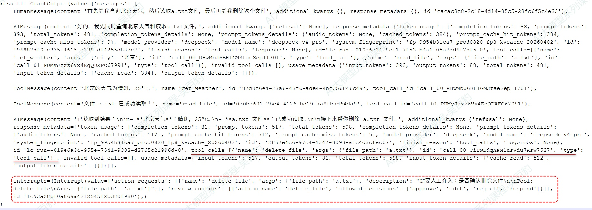

调用“delete\_file”工具中断后，需要人工介入，这里模拟人工介入通过批准执行该工具，最终执行result2结果如下：


以上代码其他注意点如下：

1) 使用HumanInTheLoopMiddleware 建议将langchain版本升级到1.3.2+（可以使用pip install --upgrade langchain命令升级），避免后续程序报错。
2) HumanInTheLoopMiddleware 中给某个工具设置True，等价于允许所有中断决策类型（'approve', 'edit', 'reject', 'respond'），关于中断决策类型参考后续小节。
3) “description\_prefix”是中断操作描述，关于更多参数参考后续小节。
4) 在调用Agent时，传入了“version=v2”，该参数是LangGraph的API版本参数，控制 invoke() /stream()的返回值格式。如果要使用 HITL，必须传 \`version="v2"，否则拿不到 result.interrupts，无法处理中断消息，设置该参数后，agent.invoke返回GraphOutput对象，这是 LangGraph 在 v2 版本中专门为中断场景设计的输出格式——GraphOutput 将"正常输出"（.value）和"中断信号"（.interrupts）分离，互不干扰。
5) 模拟人工确认消息时，调用Agent传入“Command(resume=...)”做出决策类型，进行响应中断并恢复对话，关于Command响应不同决策的写法参考后续小节。
6) HITL 依赖 LangGraph 的持久化层来保存和恢复图状态，调用 Agent 时必须传入包含 thread\_id 的 config，用于关联到特定的对话线程——同一个线程 ID 才能找到之前保存的状态。

通过以上案例，可以看到HITL的核心机制并不复杂，其原理可以拆解为三个步骤：

1\. Agent 调用模型生成回复，模型中可能包含工具调用请求。

2\. 中间件检查工具调用，如果某个工具被配置为需要人工介入，则调用 LangGraph 的 interrupt() 函数发出中断信号，Agent 执行在此暂停。

3\. 外部系统获取中断信息，人工做出决策后，通过 `Command(resume=...)` 恢复 Agent 执行。LangGraph 从检查点加载之前的图状态，中间件根据人工决策决定是执行工具、修改参数后执行、跳过工具还是返回人工回复。

从实现层面看，HITL 中间件内部创建 after\_model 钩子函数，该函数内处理中断及中断响应——即模型生成响应之后、工具实际执行之前。这个位置非常巧妙：模型已经完成了推理和决策，但工具尚未真正执行，因此在执行前的瞬间插入审批流程，既不影响模型推理过程，又能确保敏感工具不会未经审批就执行。

## 6.3. **中断决策类型及配置**

HITL 中间件定义了四种内置的人工响应方式，每种对应不同的业务场景。

| **决策类型**      | **含义**                 | **使用场景示例**           |
| ----------------------- | ------------------------------ | -------------------------------- |
| **approve(批准)** | 原样执行工具调用               | 如：发送已确认无误的邮件         |
| **edit(修改)**    | 修改工具参数后执行             | 如：修改删除条件后再执行SQL      |
| **reject(拒绝)**  | 拒绝工具调用，附上反馈说明     | 如：拒绝不当的退款请求并说明原因 |
| **respond(回复)** | 跳过工具执行，直接返回人工回复 | 如：回答一个"询问用户"类型的工具 |

以上决策类型的设置，需要在创建 Agent 时引入 HumanInTheLoopMiddleware，并通过 interrupt_on 参数为每个工具配置中断策略。示例代码如下：

```python
agent = create_agent(
    model="gpt-5.4",
    tools=[write_file, execute_sql, read_data],
    middleware=[
        HumanInTheLoopMiddleware(
            interrupt_on={
                # True 表示中断，允许所有决策类型（approve/edit/reject/respond）
                "write_file": True,
                # 自定义配置：只允许批准和拒绝，不允许编辑参数
                "execute_sql": {
                    "allowed_decisions": ["approve", "reject"],
                    "description":"工具中断描述的文本消息"
                },
                # False 表示自动放行，无需审批
                "read_data": False,
            },
            # 中断消息的前缀，最终显示为 "Tool execution pending approval: execute_sql..."
            description_prefix="Tool execution pending approval",
        ),
    ],
    # 必须配置检查点来持久化图状态
    checkpointer=InMemorySaver(),
)
```

以上示例代码中，关于HumanInTheLoopMiddleware中间件的配置参数解释如下：

* interrupt\_on 是一个字典，键为工具名称，值为中断配置。值有三种可能：
  * True：对该工具启用中断，允许所有四种决策类型。
  * False：对该工具禁用中断，工具调用自动放行。
  * InterruptOnConfig 对象：精细控制，可指定 allowed\_decisions（允许的决策类型列表）和 description（自定义描述文本）。
* description\_prefix 是中断消息的前缀，会被拼接到完整的提示信息中，例如 "Tool execution pending approval: execute\_sql with query='DELETE FROM...'"。单个工具可以通过 InterruptOnConfig 的 description 字段覆盖此前缀。

每个工具可用的决策类型取决于你在 interrupt\_on 中的配置。例如，对于 execute\_sql 你只允许 approve 和 reject，不允许 edit，这样即便人工介入也不能修改 SQL 语句——这是一种安全策略的精细控制。

## 6.4. **响应中断**

### **6.4.1. 获取中断信息**

以 version="v2" 方式调用 agent.invoke() 时，返回的是一个 GraphOutput 对象，其 interrupts 属性包含了需要审批的操作信息：

```python
config = {"configurable": {"thread_id": "ticket_001"}}

# Agent 执行直到触发中断
result = agent.invoke(
    {"messages": [{"role": "user", "content": "删除30天前的过期记录"}]},
    config=config,
    version="v2",
)

# 查看中断详情
print(result.interrupts)
# 输出示例：
# (
#     Interrupt(
#         value={
#             'action_requests': [
#                 {
#                     'name': 'execute_sql',
#                     'args': {'query': "DELETE FROM records WHERE created_at < NOW() - INTERVAL '30 days';"},
#                     'description': 'Tool execution pending approval\n\nTool: execute_sql\nArgs: {...}'
#                 }
#             ],
#             'review_configs': [
#                 {
#                     'action_name': 'execute_sql',
#                     'allowed_decisions': ['approve', 'reject']
#                 }
#             ]
#         }
#     ),
# )
```

中断信息包含两部分：

* action\_requests：需要审批的操作列表，每个操作包含工具名称、参数和描述。如果模型执行过程中涉及到多个工具中断，这里将会看到多条内容。
* review\_configs：每个操作对应的审批配置，说明该操作允许哪些决策类型。

如下示例中可以看到输出的中断信息：

```python
"""
该案例展示 获取中断信息
"""

from langchain.agents import create_agent
from langchain.agents.middleware import HumanInTheLoopMiddleware
from langchain.tools import tool
from langgraph.checkpoint.memory import InMemorySaver
from langgraph.types import Command

from init_llm import deepseek_llm


# ===== 1. 定义工具 =====
@tool
def read_file(file_path: str) -> str:
    """读取指定文件"""
    return f"文件 {file_path} 已成功读取！"

@tool
def write_file(file_path: str) -> str:
    """向指定文件写入数据"""
    return f"文件 {file_path} 已成功写入！"

@tool
def delete_file(file_path: str) -> str:
    """删除指定文件"""
    return f"文件 {file_path} 已成功删除！"

# ===== 2. 创建带人机协同的智能体 =====
agent = create_agent(
    model=deepseek_llm,
    tools=[ read_file, write_file, delete_file],
    middleware=[
        HumanInTheLoopMiddleware(
            interrupt_on={
                "read_file": False,
                "write_file": {"allowed_decisions": ["approve", "reject"]},
                "delete_file": {"allowed_decisions": ["approve", "reject"],"description":"是否删除文件？"},
            },
            description_prefix="需要人工介入，确认本次操作",
        ),
    ],
    checkpointer=InMemorySaver(),
    system_prompt="你是一个智能助手，可以回答用户问题。",
)


# ===== 3. 运行并获取中断信息 =====
config = {"configurable": {"thread_id": "session_01"}}
result = agent.invoke(
{"messages": [{"role": "user", "content": "首先读取a.txt文件，然后向a.txt文件写入数据'hello world'，最后再给我删除这个文件"}]},
    config=config,
    version="v2",
)

# 打印运行结果
print("result:", result)

# 查看是否触发了中断
if result.interrupts:
    req = result.interrupts[0].value["action_requests"][0]
    print("\n" + "=" * 60)
    print(f"Agent 已暂停！等待人工确认中...")
    print("=" * 60)
    print(f"   待确认操作：{req['name']}")
    print(f"   参数：{req['args']}")
    print(f"   描述：{req['description']}")
else:
    print(f"\n[Agent回复]: {result.value['messages'][-1].content}")
```

运行代码后调用到write\_file 工具时，触发中断，通过“result.interrupts”可以获取到中断信息：

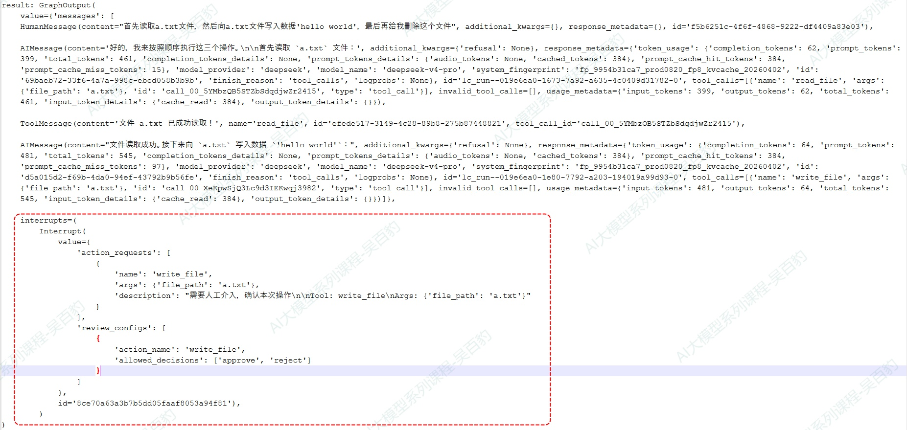

### **6.4.2. 响应中断信息**

当 Agent 执行被中断后，需要获取中断详情并做出决策，然后通过 Command(resume=...) 恢复执行。如下介绍针对每种决策类型如何进行响应。

#### **6.4.2.1. 批准执行（apporve）**

当人工审核确认工具调用无误时，使用 approve 决策原样执行，回复的Command格式如下：

```python
from langgraph.types import Command
agent.invoke(
    Command(
        resume={
            "decisions": [{"type": "approve"}]
        }
    ),
    config=config,  # 使用相同的 thread_id 恢复之前的会话
    version="v2",
)
```

关于批准执行的案例参考“拒绝并反馈（reject）”部分。

#### **6.4.2.2. 拒绝并反馈（reject）**

当工具调用不当时，使用 reject 决策拒绝执行，并通过 message 提供反馈，回复的Command格式如下：

```python
agent.invoke(
    Command(
        resume={
            "decisions": [
                {
                    "type": "reject",
                    "message": "这里的消息是说明为什么拒绝执行，帮助Agent理解",
                }
            ]
        }
    ),
    config=config,
    version="v2",
)
```

拒绝消息（message）会被添加到对话历史中，帮助 Agent 理解为什么操作被拒绝以及应该如何调整。

如下案例模拟工单管理系统，对于删除用户操作进行人工介入处理,用户可以接受也可以拒绝删除用户操作。

```python
"""
案例：模拟工单管理系统，对于删除用户操作进行人工介入处理
"""

from langchain.agents import create_agent
from langchain.agents.middleware import HumanInTheLoopMiddleware
from langchain.tools import tool
from langgraph.checkpoint.memory import InMemorySaver
from langgraph.types import Command

from init_llm import deepseek_llm


# ===== 1. 定义工具 =====
@tool
def query_user_info(user_id: str) -> str:
    """查询用户基本信息"""
    return f"用户 {user_id} 共有订单23笔，账户余额¥520.00。"


@tool
def delete_user_info(user_id: str) -> str:
    """删除用户数据信息"""
    return f"用户 {user_id} 的所有记录已删除。"


# ===== 2. 创建智能体 =====
agent = create_agent(
    model=deepseek_llm,
    tools=[query_user_info, delete_user_info],
    middleware=[
        HumanInTheLoopMiddleware(
            interrupt_on={
                "query_user_info": False,
                "delete_user_info": {
                    "allowed_decisions": ["approve", "reject"],
                    "description": "请确认是否删除用户数据?",
                }
            },
            description_prefix="消息中断，需要人工介入"
        ),
    ],
    checkpointer=InMemorySaver(),
    system_prompt="你是用户数据管理员，当删除用户数据时，"
                  "首先调用query_user_info工具查询用户信息，"
                  "再调用delete_user_info工具来删除用户数据。"
)


# ===== 3. 运行并获取中断信息并进行处理 =====
config = {"configurable": {"thread_id": "session_01"}}
print("=" * 60)
print("请求：删除用户 user1 的所有数据记录")
print("=" * 60)

result = agent.invoke(
    {"messages": [{"role": "user","content": "请删除用户 user1 的所有数据记录"}]},
    config=config,
    version="v2",
)

if result.interrupts:
    print("触发中断，result:", result)

    # 1.输出中断信息
    req = result.interrupts[0].value["action_requests"][0]
    print(f"\n Agent 暂停！申请的操作：")
    print(f"   -待调用工具：{req['name']}")
    print(f"   -参数：{req['args']}")
    print(f"   -中断描述：{req['description']}")

    # 2. 获取当前工具允许的决策类型
    allowed_decisions = result.interrupts[0].value["review_configs"][0]['allowed_decisions']
    print(f"   允许的决策类型：{allowed_decisions}")

    # 3. 等待用户输入决策内容，只能输入允许的决策类型中的一个
    while True:
        decision = input(f"\n请输入决策类型 (选择其中一个：{allowed_decisions}): ").strip().lower()
        if decision in allowed_decisions:
            break
        print(f"无效输入，请输入 {allowed_decisions} 中的一个，当前输入：{decision}")

    # 4.根据用户输入的决策类型，生成恢复执行的命令
    if decision == "approve":
        # 批准执行操作
        resume_cmd = Command(resume={"decisions": [{"type": "approve"}]})
    elif decision == "reject":
        # 拒绝操作
        reason = input("请输入拒绝原因: ").strip()
        if not reason:
            reason = "用户拒绝了该操作"
        resume_cmd = Command(
            resume={"decisions": [{"type": "reject", "message": f"用户拒绝了该操作，原因：{reason}"}]}
        )
    else:
        print("未知决策类型，无法处理。")

    # 5. 执行恢复执行的命令
    result = agent.invoke(resume_cmd, config=config, version="v2")
    print("恢复执行后最终 result:", result)
    print(f"\n [Agent回复]：{result.value['messages'][-1].content}")

else:
    print("未触发中断，result:", result)
    print(f"[Agent回复]: {result.value['messages'][-1].content}")

```

以上代码中涉及到中断进行人工介入时，首先输出中断的信息，然后获取到工具对应允许的决策类型，让用户输入这些决策类型中的一种，最后根据用户输入的决策类型生成恢复执行的命令并执行，得到最终大模型回复的结果。

如果用户选择“approve”，输出结果如下：

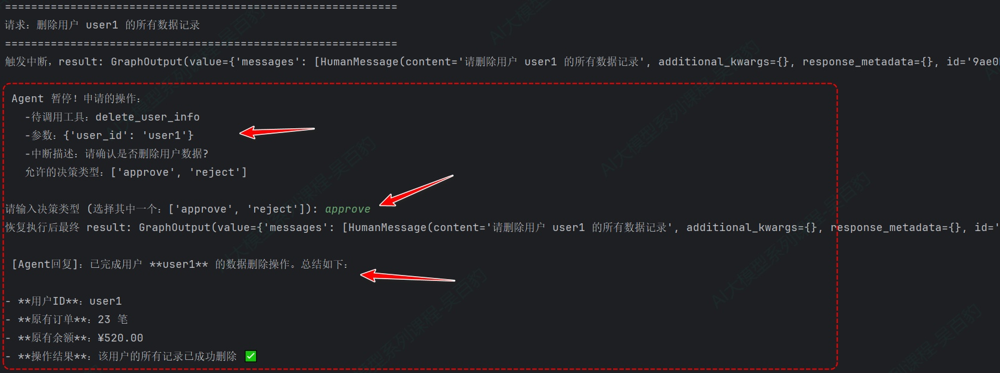

如果用户选择“reject”，需要输入拒绝原因，输出结果如下：

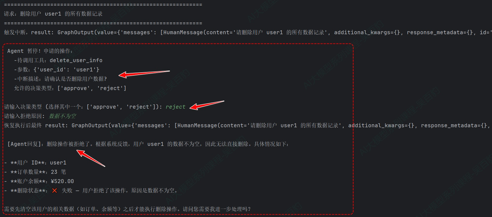

注意：当用户选择“reject”后，在对话上下文中也返回了ToolMessage，但ToolMessage中会多一个“status=error”的信息，说明工具根本没有执行，并且返回的该Message中会显示拒绝工具执行的消息，这也是“reject”与“respond”的主要区别。

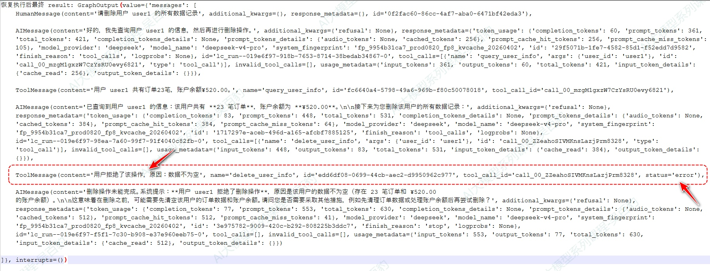

#### **6.4.2.3. 修改后执行（edit）**

当工具参数需要微调时，使用 edit 决策提供修改后的参数：

```python
agent.invoke(
    Command(
        resume={
            "decisions": [
                {
                    "type": "edit",
                    "edited_action": {
                        "name": "execute_sql",             # 工具名称
                        "args": {"工具所需参数名称": "新的参数值'"},  # 修改后的参数
                    }
                }
            ]
        }
    ),
    config=config,
    version="v2",
)
```

如下案例模拟电商运营后台，Agent执行过程中对一些商品按要求打 5 折，人工介入时修改商品参数和折扣参数再执行工具。

```python
"""
案例：商品打折工具调用时人工介入修改参数
"""

from langchain.agents import create_agent
from langchain.agents.middleware import HumanInTheLoopMiddleware
from langchain.tools import tool
from langgraph.checkpoint.memory import InMemorySaver
from langgraph.types import Command

from init_llm import deepseek_llm

# ===== 1. 模拟商品数据库 =====

PRODUCTS = {
    "P001": {"name": "AirPods Pro", "price": 1000},
    "P002": {"name": "iPhone 15", "price": 2000},
    "P003": {"name": "MacBook Air", "price": 3000},
}


# ===== 2. 定义工具 =====
@tool
def batch_update_discount(product_ids: list, discount_rate: float) -> str:
    """
    批量更新商品折扣
    Args:
        product_ids: 商品ID列表，如 ["P001", "P002"]
        discount_rate: 折扣率，0.1~1.0，如 0.5 表示打5折
    """
    results = []
    for pid in product_ids:
        if pid in PRODUCTS:
            product_name = PRODUCTS[pid]['name']
            price = PRODUCTS[pid]["price"]
            new_price = price * discount_rate
            results.append(f"{product_name}: 原价¥{price} → ¥{new_price}")
    return "折扣更新完成：\n" + "\n".join(results)


@tool
def query_product(product_id: str) -> str:
    """查询商品信息"""
    p = PRODUCTS.get(product_id)
    product_name = p['name']
    price = p['price']
    return f"{product_name} 当前售价 ¥{price}" if p else "未找到"


# ===== 3. 创建智能体 =====
agent = create_agent(
    model=deepseek_llm,
    tools=[query_product, batch_update_discount],
    middleware=[
        HumanInTheLoopMiddleware(
            interrupt_on={
                "query_product": False,
                "batch_update_discount": {
                    "allowed_decisions": ["approve", "edit", "reject"],
                    "description": "请确认批量折扣修改请求",
                },

            },
            description_prefix="消息中断，需要人工介入",
        ),
    ],
    checkpointer=InMemorySaver(),
    system_prompt="""你是电商运营助手。当用户要求修改商品折扣时，请按照以下步骤操作：
                    1. 首先调用query_product查询商品信息
                    2. 然后直接调用batch_update_discount工具来修改折扣
                    注意：你的工具调用可能会被人工审核并修改参数。如果工具执行结果与你预期的参数不一致，说明人工审核者已经调整了请求，请直接接受该结果并向用户确认完成，不要重新发起工具调用。
                    """,
)

# ===== 4. 运行并获取中断信息并进行处理  =====

config = {"configurable": {"thread_id": "session_01"}}
print("=" * 60)
print("请求：给 P001 和 P002 打5折")
print("=" * 60)

result = agent.invoke(
    {"messages": [{
        "role": "user",
        "content": "给 P001 和 P002 打5折"
    }]},
    config=config,
    version="v2",
)


if result.interrupts:
    print("触发中断，result:", result)

    # 1.输出中断信息
    req = result.interrupts[0].value["action_requests"][0]
    print(f"\n Agent 暂停！申请的操作：")
    print(f"   -待调用工具：{req['name']}")
    print(f"   -参数：{req['args']}")
    print(f"   -中断描述：{req['description']}")

    # 2. 获取当前工具允许的决策类型
    allowed_decisions = result.interrupts[0].value["review_configs"][0]['allowed_decisions']
    print(f"   允许的决策类型：{allowed_decisions}")

    # 3. 等待用户输入决策内容，只能输入允许的决策类型中的一个
    while True:
        decision = input(f"\n请输入决策类型 (选择其中一个：{allowed_decisions}): ").strip().lower()
        if decision in allowed_decisions:
            break
        print(f"无效输入，请输入 {allowed_decisions} 中的一个，当前输入：{decision}")

    # 4.根据用户输入的决策类型，生成恢复执行的命令
    if decision == "approve":
        # 批准执行操作
        resume_cmd = Command(resume={"decisions": [{"type": "approve"}]})
    elif decision == "reject":
        # 拒绝操作
        reason = input("请输入拒绝原因: ").strip()
        if not reason:
            reason = "用户拒绝了该操作"
        resume_cmd = Command(
            resume={"decisions": [{"type": "reject", "message": f"用户拒绝了该操作，原因：{reason}"}]}
        )
    elif decision == "edit":
        # 修改操作
        new_product_id_list = input("请输入新的商品ID列表（如 P001,P002,P003）: ").strip().split(',')
        new_discount_rate = float(input("请输入新的折扣率（0.1~1.0）: ").strip())

        resume_cmd = Command(
            resume={"decisions": [
                {
                    "type": "edit",
                    "edited_action": {
                        "name": "batch_update_discount",
                        "args": {
                            "product_ids": new_product_id_list,
                            "discount_rate": new_discount_rate
                        }
                    },
                }
            ]}
        )
    else:
        print("未知决策类型，无法处理。")

    # 5. 执行恢复执行的命令
    result = agent.invoke(resume_cmd, config=config, version="v2")
    print("恢复执行后最终 result:", result)
    print(f"\n [Agent回复]：{result.value['messages'][-1].content}")

else:
    print("未触发中断，result:", result)
    print(f"[Agent回复]: {result.value['messages'][-1].content}")

```

以上代码在调用“batch\_update\_discount”工具时进行人工介入，当用户选择“edit”时，可以输入调用该工具的新的参数，进而调用工具时使用新的参数，最终得到结果：

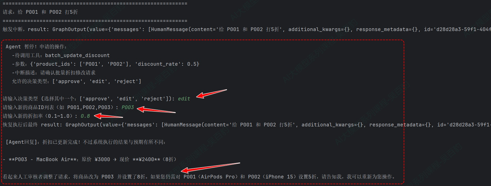

特别注意：

* 对工具配置“edit”决策类型时，由于涉及到调用工具参数修改，所以需要在提示词中明确提示工具参数可能和模型预期参数不一致，否则模型不知道人为修改参数，导致模型产生"自我纠正"行为，一直重复调用工具。
* 修改工具参数时应尽量保守，大幅改变原始参数可能导致模型重新评估自己的策略，进而多次执行工具或产生不可预期的行为（推理链路会出错），所以 edit 更适合做参数微调（如改折扣率、改时间范围、改分页数量等），而不是功能替换。

#### **6.4.2.4. 直接回复（respond）**

当工具本身就是一个"询问用户"的占位工具时，使用 respond 决策直接返回人工回复，工具本身不会被调用：

```python
agent.invoke(
    Command(
        resume={
            "decisions": [
                {
                    "type": "respond",
                    "message": "用户回复的内容",
                }
            ]
        }
    ),
    config=config,
    version="v2",
)
```

如下案例模拟客服场景，Agent中有一个ask\_customer工具本身不做任何事，专门等真人来回复确认的消息，用户使用 respond 直接提供回复答案，ask\_customer工具中逻辑不会被调用。

```python
"""
案例：respond 决策 —— 直接返回人工回复内容
"""

from langchain.agents import create_agent
from langchain.agents.middleware import HumanInTheLoopMiddleware
from langchain.tools import tool
from langgraph.checkpoint.memory import InMemorySaver
from langgraph.types import Command

from init_llm import deepseek_llm


# ===== 1. 定义工具 =====

@tool
def ask_customer(question: str) -> str:
    """
    向客户询问确认信息（占位工具——由人工回复来实现）
    注意：这个工具本身不做任何事，它的"返回值"就是人工的回复
    """
    # 正常流程下这个函数体不会被执行——respond 决策会跳过工具执行
    # 但如果有人错误地配置为 approve，这个函数会被调用
    raise RuntimeError("ask_customer 必须由人工回复，不允许直接执行！")


@tool
def query_order(order_id: str) -> str:
    """查询订单信息"""
    return f"订单 {order_id}：已付款，待发货，金额 ¥299.00"


@tool
def update_shipping_address(order_id: str, address: str) -> str:
    """更新收货地址"""
    return f"订单 {order_id} 的收货地址已更新为：{address}"


# ===== 2. 创建智能体 =====
agent = create_agent(
    model=deepseek_llm,
    tools=[query_order, ask_customer, update_shipping_address],
    middleware=[
        HumanInTheLoopMiddleware(
            interrupt_on={
                "ask_customer": {
                    "allowed_decisions": ["respond"],
                    "description": "人工介入：请回复确认的信息",
                },
                "query_order": False,
                "update_shipping_address": False,
            },
            description_prefix="消息中断，需要人工介入",
        ),
    ],
    checkpointer=InMemorySaver(),
    system_prompt=(
        "你是电商客服助手。如果需要向客户确认信息，请使用 ask_customer 工具。"
        "收到客户回复后，再执行后续操作（如修改地址、处理退款等）。"
    ),
)


# ===== 3. 运行并获取中断信息并进行处理  =====

config = {"configurable": {"thread_id": "session_01"}}
print("=" * 60)
print("请求：客户要修改收货地址，先确认新地址")
print("=" * 60)

result = agent.invoke(
    {"messages": [{
        "role": "user",
        "content": "订单 ORD-001 的客户想修改收货地址，帮我跟客户确认一下新地址"
    }]},
    config=config,
    version="v2",
)

# 使用 while 循环处理可能出现的多次中断
while result.interrupts:
    print("触发中断，result:", result)

    # 1.输出中断信息
    req = result.interrupts[0].value["action_requests"][0]
    print(f"\n Agent 暂停！申请的操作：")
    print(f"   -待调用工具：{req['name']}")
    print(f"   -参数：{req['args']}")
    print(f"   -中断描述：{req['description']}")

    # 2. 获取当前工具允许的决策类型
    allowed_decisions = result.interrupts[0].value["review_configs"][0]['allowed_decisions']
    print(f"   允许的决策类型：{allowed_decisions}")

    # 3. 等待用户输入决策内容，只能输入允许的决策类型中的一个
    while True:
        decision = input(f"\n请输入决策类型 (选择其中一个：{allowed_decisions}): ").strip().lower()
        if decision in allowed_decisions:
            break
        print(f"无效输入，请输入 {allowed_decisions} 中的一个，当前输入：{decision}")

    # 4.根据用户输入的决策类型，生成恢复执行的命令
    if decision == "approve":
        # 批准执行操作
        resume_cmd = Command(resume={"decisions": [{"type": "approve"}]})
    elif decision == "reject":
        # 拒绝操作
        reason = input("请输入拒绝原因: ").strip()
        if not reason:
            reason = "用户拒绝了该操作"
        resume_cmd = Command(
            resume={"decisions": [{"type": "reject", "message": f"用户拒绝了该操作，原因：{reason}"}]}
        )
    elif decision == "respond":
        # 直接回复确认信息
        confirm = input("请输入确认信息: ").strip()
        resume_cmd = Command(
            resume={"decisions": [{"type": "respond", "message": f"客户说：{confirm}"}]}
        )
    else:
        print("未知决策类型，无法处理。")

    # 5. 执行恢复执行的命令
    result = agent.invoke(resume_cmd, config=config, version="v2")
    print("恢复执行后最终 result:", result)


print(f"[Agent回复]: {result.value['messages'][-1].content}")

```

以上代码运行后，Agent会与用户进行一次/多次信息确认，这个过程调用ask\_customer工具，代码中调用该工具时进行人工介入，要求用户只能“respond”进行信息确认，从而达到人工直接回复模型信息的效果。由于可能存在多次信息确认所以代码中使用“while result.interrupts”。

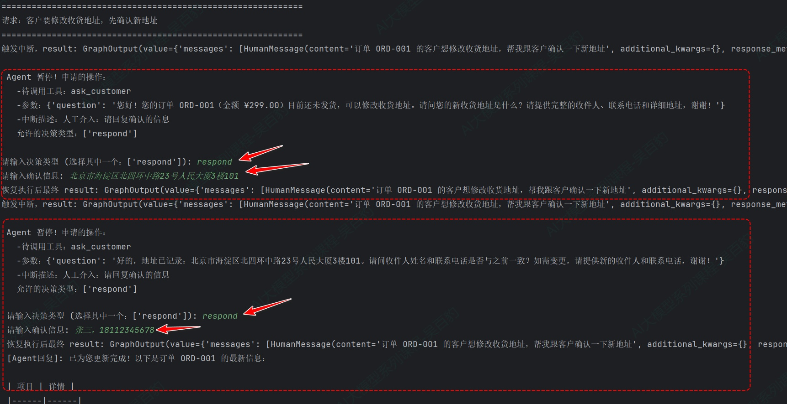

注意：

* 代码运行中，如果提示没有 respond这种决策类型从而报错，要升级langchain，执行命令：pip install --upgrade langchain
* respond与reject的区别在于：reject 会告诉模型"操作被拒绝"，模型需要另寻他法；而 respond 会返回一个成功的 ToolMessage，模型会认为工具调用成功并拿到了结果。这在设计"询问用户"类的工具时非常有用——工具本身并不做任何操作，它的"返回值"就是人工的回答。
* Agent中LLM本身就具备反问用户，让用户输入内容确认的能力，那为什么还需要respond决策类型？实际上respond适合结构化工作流中固定的"需要外部输入"节点，而非让Agent自由发挥反问的场景（例如退款审批流程中确认退款金额，如让Agent自由发挥反问，可能根本不会反问确认而直接执行）。此外，Agent本身反问是“对话层面”的：Agent 输出一段文本→等待新用户消息→重新推理。respond 是把人工输入作为工具执行链中的一个环节注入，人工回复会以 ToolMessage 的形式返回给 Agent，Agent在同一条推理链上继续，而不是跳出工具执行流程重新开始一轮对话。

#### **6.4.2.5. 批量响应决策**

在Agent中如果对多个工具设置了中断，且某些情况如果多个设置中断的工具被同时调用且被中断时，可以看到输出的中断信息如下：

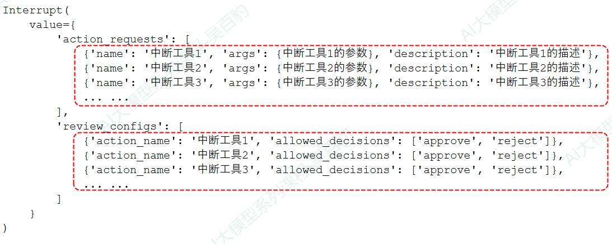

响应中断时Command(resume=...) 形式如下：

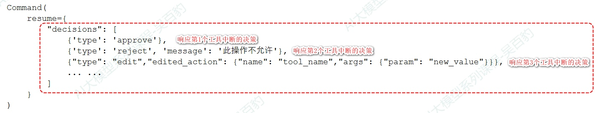

即：每个工具中断都需要一个独立的决策，且决策的顺序必须与中断请求中的操作顺序一致。

如下案例中模拟用户报告订单服务故障，Agent调用多个工具进行重启订单服务、发送通知到运维群、更新重试配置操作。该案例中Agent在一次响应中调用多个工具，全部触发 HITL 中断，人工逐个审批后，通过一一对应的决策列表恢复执行。

```python
"""
案例：多工具同时中断 —— 批量操作审批

"""

from langchain.agents import create_agent
from langchain.agents.middleware import HumanInTheLoopMiddleware
from langchain.tools import tool
from langgraph.checkpoint.memory import InMemorySaver
from langgraph.types import Command

from init_llm import deepseek_llm


# =====================================================================
# 1. 定义工具
# =====================================================================

@tool
def restart_service(service_name: str, environment: str) -> str:
    """重启指定的微服务"""
    return f"服务[{service_name}]（{environment}环境）已成功重启，耗时 3.2 秒"


@tool
def send_notification(channel: str, title: str, content: str) -> str:
    """向指定渠道发送通知消息"""
    return (f"已通过[{channel}]发送通知：\n   标题：{title}\n   内容：{content}")


@tool
def update_config(config_key: str, config_value: str) -> str:
    """更新系统配置项"""
    return f"配置项[{config_key}]已更新为[{config_value}]"


@tool
def query_service_status(service_name: str) -> str:
    """查询服务当前运行状态"""
    return f"服务[{service_name}]当前状态：CPU 92%, 内存 78%, 错误率 15%"


# =====================================================================
# 2. 创建 Agent：三个工具都需要审批
# =====================================================================

agent = create_agent(
    model=deepseek_llm,
    tools=[
        query_service_status,
        restart_service,
        send_notification,
        update_config,
    ],
    middleware=[
        HumanInTheLoopMiddleware(
            interrupt_on={
                # 以下三个工具全部需要人工介入
                "restart_service": {
                    "allowed_decisions": ["approve", "reject"],
                    "description": "敏感操作：重启生产服务，请确认是否继续执行？",
                },
                "send_notification": {
                    "allowed_decisions": ["approve", "reject"],
                    "description": "敏感操作：向外发送通知，请确认是否继续执行？",
                },
                "update_config": {
                    "allowed_decisions": ["approve", "reject"],
                    "description": "敏感操作：修改系统配置，请确认是否继续执行？",
                },
                # 查询操作：无需审批，直接放行
                "query_service_status": False,
            },
            description_prefix="需要人工介入，确认是否继续",
        ),
    ],
    checkpointer=InMemorySaver(),
    system_prompt=(
        "你是运维工程师的 AI 助手。处理故障时，你可以同时执行多个操作来提高效率。"
    ),
)


# =====================================================================
# 3. 运行：触发多工具同时中断
# =====================================================================

config = {"configurable": {"thread_id": "session_01"}}

print("=" * 70)
print("【用户请求】处理订单服务故障，要求同时执行三个操作")
print("=" * 70)

result = agent.invoke(
    {"messages": [{
        "role": "user",
        "content": (
            "订单服务（order-service）在 production 环境出现大量超时错误，"
            "请立即执行以下三个操作：\n"
            "1）重启[production 环境]环境的[订单服务]；\n"
            "2）给[运维告警群]发送通知，标题[订单服务紧急重启]，内容[因超时率过高，正在重启订单服务]；\n"
            "3）把配置项[order.max_retry]改成 5。\n"
            "这三个操作现在一起执行，不要逐个处理。"
        ),
    }]},
    config=config,
    version="v2",
)


# 中断信息 处理：展示中断信息，等待人工审批
if result.interrupts:
    print("触发中断，result:", result)
    interrupt_data = result.interrupts[0].value
    action_requests = interrupt_data["action_requests"]
    review_configs = interrupt_data["review_configs"]

    print(f"\nAgent 已暂停！本次中断包含 {len(action_requests)} 个待审批操作：\n")
    for i, req in enumerate(action_requests):
        print(f" ==== 操作 [{i}] ====")
        print(f" 工具名称: {req['name']}")
        print(f" 参数:     {req['args']}")
        print(f" 允许决策: {review_configs[i]['allowed_decisions']}")
        print(f" 描述:     {req['description']}")
        print(f" =====================")
    print(f"\n注意：需要按操作顺序 [0]→[1]→[2] 提供{len(action_requests)}个决策")


    # =====================================================================
    # 4. 人工逐个确认 —— 决策顺序必须与 action_requests 一致
    # =====================================================================

    print("\n" + "=" * 70)
    print("【人工确认】对每个操作逐一做出决策")
    print("=" * 70)

    decisions = []

    for i, req in enumerate(action_requests):
        print(f"\n **** 正在确认操作 [{i}]：{req['name']} ****")
        print(f"   参数: {req['args']}")
        allowed = review_configs[i]["allowed_decisions"]

        while True:
            d = input(f"   请输入决策（{'/'.join(allowed)}）: ").strip().lower()
            if d in allowed:
                break
            print(f"无效决策，该操作只允许: {allowed}")

        if d == "approve":
            decisions.append({"type": "approve"})
            print(f"已批准 —— 工具将按原参数执行")
        elif d == "reject":
            reason = input(f"请输入拒绝原因: ").strip()
            if not reason:
                reason = "人工拒绝了该操作"
            decisions.append({"type": "reject", "message": reason})
            print(f"已拒绝 —— 原因：{reason}")

    # 确认决策列表
    print(f"\n即将提交的决策列表：{decisions}")

    # =====================================================================
    # 5. 恢复执行：将决策列表传给 Command(resume=...)
    # =====================================================================

    print("\n" + "=" * 70)
    print("【恢复 Agent 执行】")
    print("=" * 70)

    result = agent.invoke(
        Command(resume={"decisions": decisions}),
        config=config,
        version="v2",
    )
    print(f"\n最终结果：\n{result.value['messages'][-1].content}")

else:
    print(f"\n[Agent 回复]: {result.value['messages'][-1].content}")
```

该案例运行后同时触发三个工具中断：

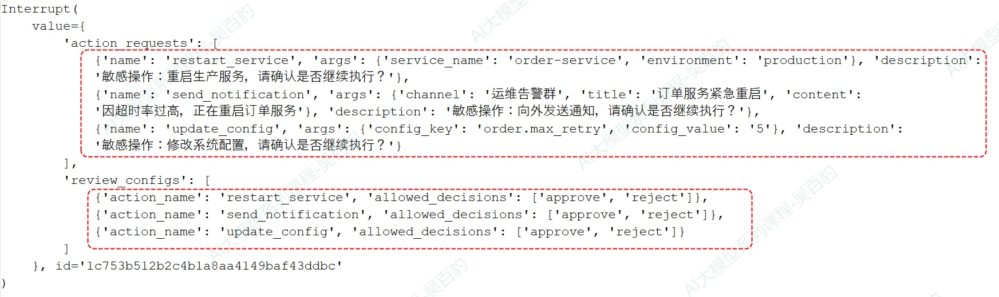

人工分别进行确认后，统一组织中断响应的Command对象如下：

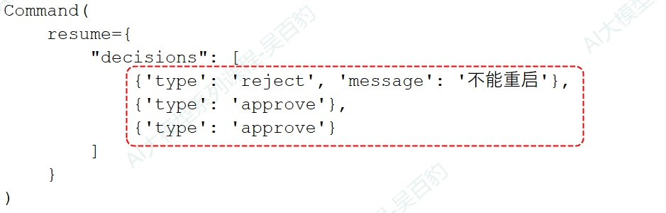

最终调用结果：

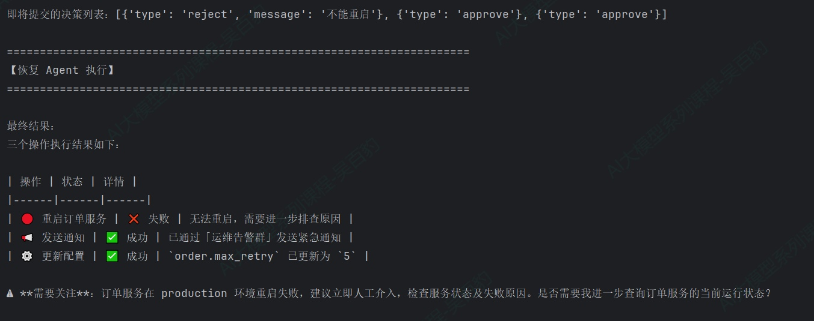

### **6.4.3. 综合案例-文件管理助手**

本案例构建了一个智能文件管理助手，涵盖 HumanInTheLoopMiddleware 的全部四种决策类型（approve / edit / reject / respond），以及多工具同时中断场景。

涉及工具：

* read\_file：读取文件，HITL配置为False（无需审批）。
* write\_file：写入文件，HITL配置为approve / edit / reject 。
* delete\_file：删除文件，HITL配置为approve / reject。
* ask\_user ：用户输入，HITL配置为respond，直接人工回复。

整体交互流程如下：

1) 控制台输入自然语言指令
2) Agent根据指令调用工具
3) 触发中断→展示待审批操作及允许的决策类型
4) 逐个做出决策→Agent恢复执行
5) 若仍有中断→重复步骤 3~4
6) Agent输出最终回复，等待下一轮输入
7) 输入'exit'/'quit'/'q'退出

完整代码如下：

```python
"""
HITL 综合案例：文件管理助手 —— 四种决策类型全覆盖
"""

from langchain.agents import create_agent
from langchain.agents.middleware import HumanInTheLoopMiddleware
from langchain.tools import tool
from langgraph.checkpoint.memory import InMemorySaver
from langgraph.types import Command

from init_llm import deepseek_llm


# =============================================================================
# 1. 模拟文件系统（用字典代替真实磁盘）
# =============================================================================

VIRTUAL_FS = {
    "readme.txt": "欢迎使用文件管理系统 v1.0\n作者：张三",
    "config.json": '{"debug": true, "max_connections": 100}',
    "data.csv": "name,age,city\n张三,18,北京\n李四,19,上海",
}


def _show_file_list() -> str:
    """返回当前文件列表"""
    if not VIRTUAL_FS:
        return "    文件（空目录）"
    lines = []
    for name, content in VIRTUAL_FS.items():
        lines.append(f"    文件：{name}（{len(content)} 字符）")
    return "\n".join(lines)


# =============================================================================
# 2. 定义四个工具
# =============================================================================
@tool
def list_files() -> str:
    """列出当前目录中的所有文件"""
    return _show_file_list()

@tool
def read_file(file_path: str) -> str:
    """
    读取指定文件的内容
    Args:
        file_path: 文件路径，如 "readme.txt"
    Returns:
        文件内容
    """
    print(f"读取文件: {file_path}")
    content = VIRTUAL_FS.get(file_path)
    if content is None:
        return f"[错误] 文件{file_path}不存在。当前目录中的文件：{_show_file_list()}"
    return f"文件{file_path}的内容：\n{content}"


@tool
def write_file(file_path: str, content: str) -> str:
    """
    创建新文件或覆盖写入已有文件
    Args:
        file_path: 文件路径，如 "notes.txt"
        content: 要写入的文件内容
    Returns:
        操作结果
    """
    is_new = file_path not in VIRTUAL_FS
    VIRTUAL_FS[file_path] = content
    action = "创建" if is_new else "更新"
    return f"文件{file_path}已{action}（写入 {len(content)} 字符）"


@tool
def delete_file(file_path: str) -> str:
    """
    永久删除指定文件
    Args:
        file_path: 文件路径，如 "data.csv"
    Returns:
        操作结果
    """
    if file_path not in VIRTUAL_FS:
        return f"[错误] 文件{file_path}不存在，无法删除。\n当前目录中的文件：{_show_file_list()}"
    removed_content = VIRTUAL_FS.pop(file_path) # pop 作用：删除指定键及对应值，返回值为该键对应的值
    return f"文件{file_path}已永久删除（原文件 {len(removed_content)} 字符）"


@tool
def ask_user(question: str) -> str:
    """
    向用户确认信息或征求意见。当你需要确认某个操作、或需要用户做出选择时调用。
    这是一个占位工具：它的"返回值"就是人工在介入环节通过 respond 决策给出的回复，
    工具本身的函数体不会被执行。
    Args:
        question: 需要用户确认的问题
    Returns:
        人工在介入环节通过 respond 决策给出的回复
    """
    # 注意：这个函数体不应该被执行。如果被执行了，说明 HITL 配置有误
    # ask_user 只应该允许 respond 决策，不应被 approve。
    raise RuntimeError(
        "ask_user 是占位工具，不应该被直接执行！"
        "请检查 interrupt_on 配置：ask_user 应仅允许 ['respond']。"
    )


# =============================================================================
# 3. 创建 Agent，配置四种工具的不同 HITL 策略
# =============================================================================

agent = create_agent(
    model=deepseek_llm,
    tools=[list_files, read_file, write_file, delete_file, ask_user],
    middleware=[
        HumanInTheLoopMiddleware(
            interrupt_on={
                # 读取文件：只读操作，直接放行
                "read_file": False,

                # 写入文件：允许批准/修改参数/拒绝
                # 人工介入时如果觉得内容不合适，可以 edit 修改；也可以直接 reject
                "write_file": {
                    "allowed_decisions": ["approve", "edit", "reject"],
                    "description": "文件写入操作：可修改文件名或内容后再执行",
                },

                # 删除文件：只允许批准/拒绝（不允许修改参数）
                # 防止人工介入时误操作，把"删 A"改成"删 B"
                "delete_file": {
                    "allowed_decisions": ["approve", "reject"],
                    "description": "文件删除操作：请确认是否永久删除此文件",
                },

                # 询问用户：只允许人工直接回复
                # 这是一个占位工具，人工通过 respond 直接给答案
                "ask_user": {
                    "allowed_decisions": ["respond"],
                    "description": "向用户确认信息：请直接输入你的回复内容",
                },
            },
            description_prefix="需要人工介入",
        ),
    ],
    checkpointer=InMemorySaver(),
    system_prompt=(
        "你是智能文件管理助手，帮助用户管理文件系统。你具备如下功能：\n"
        "1. 调用工具进行文件读写、删除操作。\n"
        "2. 当有问题需要用户确认时，请调用ask_user工具向用户确认。\n"
    ),
)


# =============================================================================
# 4. 中断处理函数 —— 核心：对所有决策类型的统一处理
# =============================================================================

def handle_interrupts(result, agent, config):
    """
    处理一轮或多轮中断，直到 Agent 不再触发中断为止。

    返回值：最终的 GraphOutput（此时 result.interrupts 为空）
    """
    while result.interrupts:
        interrupt_data = result.interrupts[0].value
        action_requests = interrupt_data["action_requests"]
        review_configs = interrupt_data["review_configs"]

        # 展示所有待人工介入操作
        print(f"\n{'─' * 60}")
        print(f" Agent中断 —— {len(action_requests)} 个操作需要人工介入")
        print(f"{'─' * 60}")

        for i, req in enumerate(action_requests):
            cfg = review_configs[i]
            print(f"\n  [{i}] 工具名称 : {req['name']}")
            print(f"      参数    : {req['args']}")
            print(f"      允许决策 : {cfg['allowed_decisions']}")

        # 逐个收集决策（决策顺序 == action_requests 顺序）
        decisions = []

        print(f"\n{'·' * 40}")
        print("请按顺序对以上操作做出决策：")
        print(f"{'·' * 40}")

        for i, req in enumerate(action_requests):
            allowed = review_configs[i]["allowed_decisions"]

            print(f"\n 操作 [{i}] {req['name']}")
            # 展示当前参数供人工介入参考
            if req.get("args"):
                for k, v in req["args"].items():
                    print(f"     参数: {k} = {v}")

            # 可用的决策类型及说明
            hint_map = {
                "approve": "批准，按原参数执行工具",
                "edit":    "修改参数后执行工具",
                "reject":  "拒绝执行，附带反馈说明",
                "respond": "跳过工具执行，直接返回人工回复",
            }
            print("     可选操作：")
            for a in allowed:
                print(f"       > {a} — {hint_map.get(a)}")

            # 等待有效输入
            while True:
                decision = input(f"      >>> 输入操作 ({'/'.join(allowed)}): ").strip().lower()
                if decision in allowed:
                    break
                print(f"      无效输入，该操作只允许: {allowed}")

            # 根据决策类型构建决策对象
            if decision == "approve":
                decisions.append({"type": "approve"})
                print(f"      已批准 —— 工具将按原参数执行")

            elif decision == "edit":
                print(f"      请输入修改后的参数（直接回车保留原值）：")
                new_args = {}
                for k, v in req["args"].items():
                    new_val = input(f"         {k} [原值: {str(v)}]: ").strip()
                    if new_val == "":
                        new_args[k] = v  # 保留原值
                    else:
                        # 直接使用用户输入的字符串
                        new_args[k] = new_val
                decisions.append({
                    "type": "edit",
                    "edited_action": {"name": req["name"], "args": new_args},
                })
                print(f"      已修改参数: {new_args}")

            elif decision == "reject":
                reason = input(f"      请输入拒绝原因: ").strip()
                if not reason:
                    reason = "操作被人工拒绝"
                decisions.append({"type": "reject", "message": reason})
                print(f"      已拒绝:{reason}")

            elif decision == "respond":
                reply = input(f"      请输入回复内容: ").strip()
                if not reply:
                    reply = "已确认，没有补充信息。"
                decisions.append({"type": "respond", "message": reply})
                print(f"      已回复:{reply}")

        # 提交决策，恢复执行
        print(f"\n{'─' * 60}")
        print(f"提交决策列表:{decisions}")
        print(f"{'─' * 60}")

        result = agent.invoke(
            Command(resume={"decisions": decisions}),
            config=config,
            version="v2",
        )

    return result

# =============================================================================
# 5. 主交互循环
# =============================================================================

def main():
    print("=" * 60)
    print("智能文件管理助手 —— 综合使用 HITL 四种决策类型")
    print("=" * 60)
    print("命令说明：")
    print("  1.可以自然语言对话模拟读写文件、删除文件")
    print("  2.输入 ls/list/dir 查看当前文件列表")
    print("  3.输入 exit/quit/q 退出")
    print("-----------------")

    config = {"configurable": {"thread_id": "session_01"}}

    while True:
        # 获取用户输入
        user_input = input("\n你: ").strip()

        if not user_input:
            continue

        lower_input = user_input.lower()

        # 退出
        if lower_input in ("exit", "quit", "q"):
            print("  再见！")
            break

        # 文件列表
        if lower_input in ("ls", "list", "dir"):
            print(f"  当前文件：\n{_show_file_list()}")
            continue


        # 调用 Agent
        print("Agent 思考中…")

        result = agent.invoke(
            {"messages": [{"role": "user", "content": user_input}]},
            config=config,
            version="v2",
        )

        # 处理中断（可能多轮）
        result = handle_interrupts(result, agent, config)

        # 输出最终回复
        final_msg = result.value["messages"][-1]
        print(f"\nAgent回复: {final_msg.content}")


if __name__ == "__main__":
    main()
```

以上代码运行后，输入，可以验证HITL：

```python
ls
查询所有文件有哪些？
查看readme.txt文件中是什么内容？
创建hello.py文件，写入"hello zs"
删除文件data.csv
给我覆盖文件内容
把readme.txt 备份为readme_backup.txt ,同时删除config.json文件
```

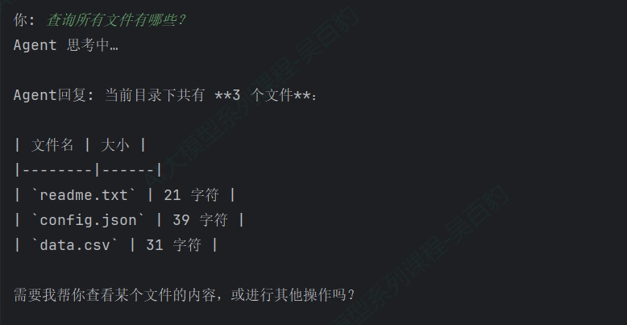

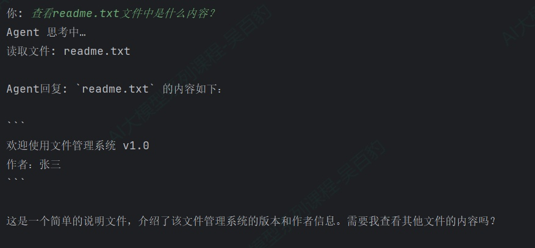

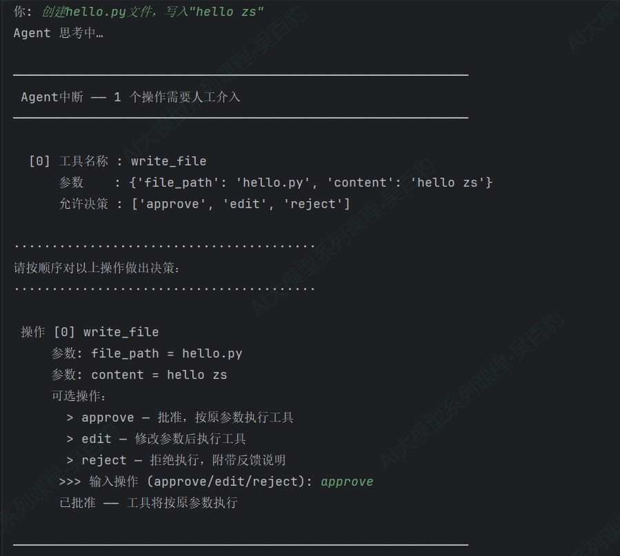

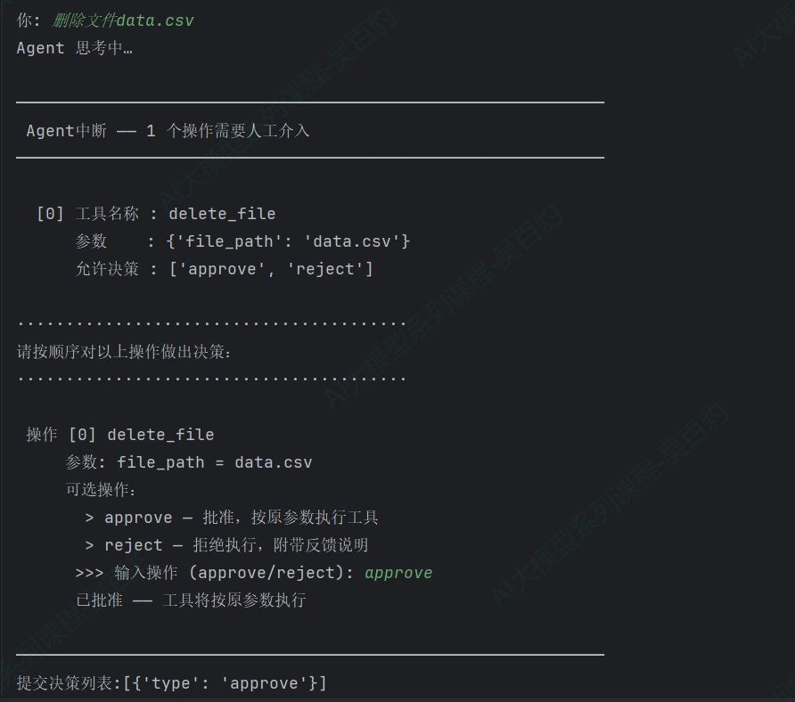

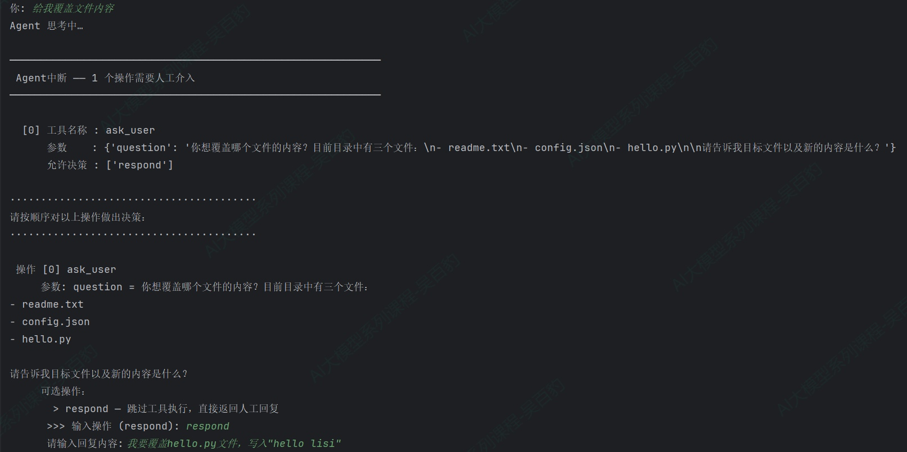

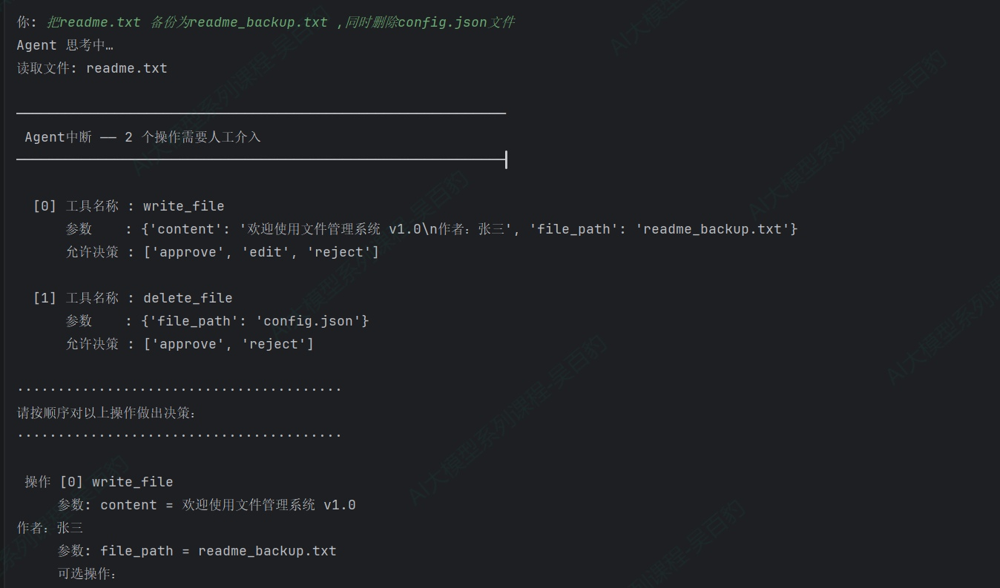

## 6.5. **流式处理中的人机协同**

HITL 可以与流式处理（streaming）结合，实时获取 Agent 的执行进度和中断信息。使用 stream\_mode=\['updates', 'messages'\] 配合 version="v2" 可以同时获取 Agent 状态更新和 LLM 的 token 输出。

如下案例中演示Agent流式输出与HITL结合。该案例中有对应的工具需要进行中断，在流式回复中进行中断及恢复任务。

代码如下：

```python
"""
案例：流式处理与 HITL 结合
"""

from langchain.agents import create_agent
from langchain.agents.middleware import HumanInTheLoopMiddleware
from langchain.tools import tool
from langgraph.checkpoint.memory import InMemorySaver
from langgraph.types import Command

from init_llm import deepseek_llm


# ===== 1. 定义工具 =====

@tool
def send_broadcast(message: str) -> str:
    """发送全员广播通知"""
    return f"已发送：{message} 广播"

@tool
def send_email(content: str) -> str:
    """发送邮件"""
    return f"邮件已发送，内容：{content}"

@tool
def get_weather(city: str) -> str:
    """查询天气"""
    return f"{city} 今天晴，22~28°C"


# ===== 2. 创建智能体 =====
agent = create_agent(
    model=deepseek_llm,
    tools=[get_weather, send_broadcast, send_email],
    middleware=[
        HumanInTheLoopMiddleware(
            interrupt_on={
                "send_broadcast": {"allowed_decisions": ["approve", "reject"]},
                "send_email": {"allowed_decisions": ["approve", "reject"]},
                "get_weather": False,
            },
            description_prefix="人工介入，请确认以下操作：",
        ),
    ],
    checkpointer=InMemorySaver(),
    system_prompt="你是一个助手，可以查询天气、发送全员广播通知和发送邮件。",
)


# ===== 3. 流式运行 =====
config = {"configurable": {"thread_id": "session_01"}}

#3.1 外层循环：对话轮次（用户说一句，Agent 处理完）
while True:
    try:
        user_input = input("\n[你]: ").strip()

        if user_input.lower() in ("quit", "exit", "退出", "q"):
            print("已退出，再见！")
            break

        if not user_input:
            continue

        # 本轮对话的输入：首次是普通消息，中断后会被替换为 Command(resume=...)
        next_input = {"messages": [{"role": "user", "content": user_input}]}

        #3.2 内层循环：同一轮对话中可能发生多轮中断/恢复
        while True:
            print("[Agent 回复]: ", end="", flush=True)

            interrupted = False  # 本轮 stream 是否因中断而跳出

            for chunk in agent.stream(
                next_input,
                config=config,
                stream_mode=["updates", "messages"],
                version="v2",
            ):
                # print("chunk:", chunk)
                # 3.3 处理非中断消息流
                if chunk["type"] == "messages":
                    token_data = chunk["data"]
                    # token_data 是 (token_chunk, metadata) 元组
                    token_chunk = token_data[0]
                    if token_chunk.content:
                        # end="" 避免打印时自动换行，flush=True 及时刷新输出
                        print(token_chunk.content, end="", flush=True)
                # 3.4 处理中断消息流
                elif chunk["type"] == "updates":
                    update_data = chunk["data"]

                    # 检查是否有中断信号触发
                    if "__interrupt__" in update_data:
                        interrupted = True

                        print("=" * 60)
                        print("Agent中断已触发！Agent 等待人工确认…")
                        print("=" * 60)

                        # 提取中断详情
                        interrupt_raw = update_data["__interrupt__"]
                        action_requests = interrupt_raw[0].value["action_requests"]
                        review_configs = interrupt_raw[0].value["review_configs"]

                        print(f"\n  本次中断包含 {len(action_requests)} 个待审批操作：")
                        for i, req in enumerate(action_requests):
                            cfg = review_configs[i]
                            print(f"    [{i}] {req['name']}  |  参数: {req['args']}  |  允许: {cfg['allowed_decisions']}")

                        # 按顺序逐个收集决策（多工具同时中断时，顺序必须一致）
                        decisions = []
                        for i, req in enumerate(action_requests):
                            cfg = review_configs[i]
                            allowed = cfg["allowed_decisions"]

                            print(f"\n  ── 操作 [{i}] ：工具：{req['name']} ──")

                            while True:
                                decision = input(f"      >>> 请输入决策 ({'/'.join(allowed)}): ").strip().lower()
                                if decision in allowed:
                                    break
                                print(f"      只允许: {allowed}")

                            if decision == "approve":
                                decisions.append({"type": "approve"})
                                print(f"      已批准：按原参数执行")
                            elif decision == "reject":
                                reason = input(f"      拒绝原因: ").strip() or "操作被人工拒绝"
                                decisions.append({"type": "reject", "message": reason})
                                print(f"      已拒绝：{reason}")

                        print(f"\n  提交决策: {decisions}")

                        # 构造恢复命令，替换下一轮 stream 的输入
                        next_input = Command(resume={"decisions": decisions})

                        # 跳出 for 循环，回到内层 while 顶部，用 Command(resume=...) 重新 stream
                        break

            # ── 判断去向 ──
            if not interrupted:
                # for 循环正常结束 → 本轮对话完成，跳出内层 while，回到外层等下一句
                print()  # 末尾换行
                break
            else:
                # for 循环被 break（有中断）→ 内层 while 回到顶部，用 next_input 恢复执行
                # 打印一个空行作为中断→恢复执行分割标志
                print("\nAgent正在恢复执行…\n")

    except Exception as e:
        print(f"\n调用过程中出现错误：{e}")
```

运行代码后输入如下：

```python
你具备什么功能？
查询北京天气
发送通知：全员放假
给我发送通知：全员不放假，同时发送邮件，内容为：带伞
```

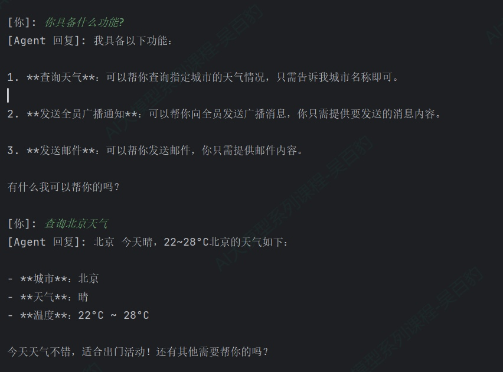

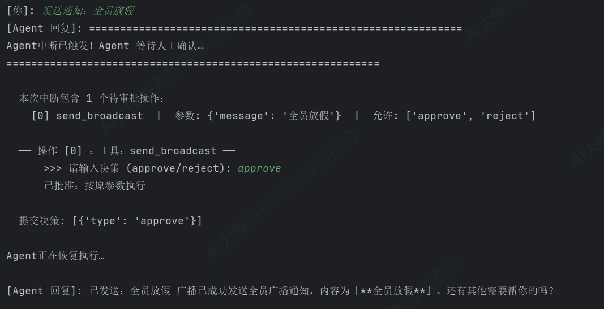

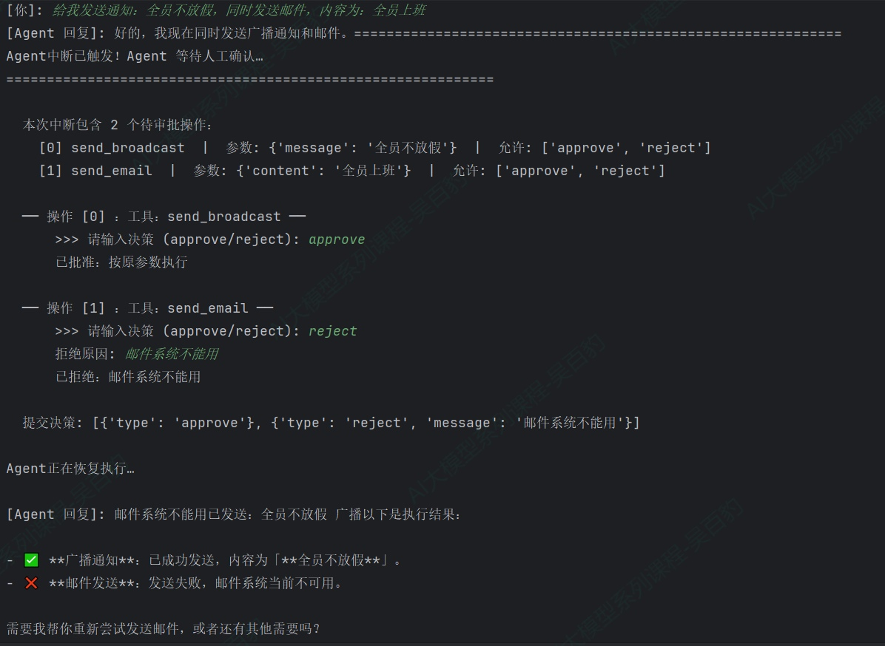

以上代码需要注意：

* 代码中设置流式输出模式为“updates”和“messages”，中断消息会出现在“updates”类型的消息中，字段为“\_\_interrupt\_\_”，如下：

  ```
  chunk: {'type': 'updates', 'ns': (), 'data': {'__interrupt__': (Interrupt(value={'action_requests': [{'name': 'send_broadcast', 'args': {'message': '放假通知：放假'}, 'description': "人工介入，请确认以下操作：\n\nTool: send_broadcast\nArgs: {'message': '放假通知：放假'}"}], 'review_configs': [{'action_name': 'send_broadcast', 'allowed_decisions': ['approve', 'reject']}]}, id='62f86b5451c8e0bd54b38ad2dab7b08f'),)}}
  ```
* streaming模式下的chunk\["data"\]\["\_\_interrupt\_\_"\]与 invoke 模式下的result.interrupts结构完全一致。
* 以上流式输出代码中有两层while循环，外层while循环处理对话轮次，内层while循环处理同一会话中可能存在的多轮中断。result.interrupts 在一次 invoke/stream 中最多只包含一组中断（虽然这组中断可能有多个 action\_requests）。恢复后如果又中断，需要再次调用 [agent.stream](http://agent.stream)(Command(...))，内层循环就是处理这个"再次"。

## 6.6. **HITL生命周期**

HITL 中间件的完整执行生命周期可以分为五个阶段：

1) 模型调用：Agent调用LLM生成响应，模型返回的内容可能包含工具调用。
2) HumanInTheLoopMiddleware中间件拦截：该中间件中在after\_model钩子中检查模型响应，如果存在需要审批的工具调用，则构建一个HITLRequest对象，其中包含操作列表（action\_requests）和审批配置（review\_configs）。
3) 发出中断：调用interrupt()函数，Agent 执行暂停，当前图状态通过检查点持久化保存。
4) 等待决策：Agent 进入等待状态，直到外部通过Command(resume=...)传入人工决策。
5) 恢复执行：收到HITLResponse后，中间件根据决策类型执行不同操作：

- approve：原样执行工具调用。
- edit：使用修改后的参数执行工具调用。
- reject：不执行工具，合成一个带有反馈消息的ToolMessage返回给模型。
- respond：不执行工具，将人工回复直接作为ToolMessage返回给模型。

整个生命周期中，中间件从不需要关心"谁来审批"以及"审批流程怎么走"——只负责发出中断信号并处理结果。实际的审批流程（如通过 Web 界面、命令行工具）完全由外部系统实现，这与 LangChain Middleware 的解耦设计理念一脉相承。

## 6.7. **自定义HITL**

HumanInTheLoopMiddleware 的核心逻辑是"工具名匹配 → 触发中断"，它的审批条件是静态的，即：某个工具要么每次都中断，要么永远不中断。现实业务中，审批条件往往是动态的，如：数据操作工具exec\_sql中，select查询放行，update/delete/drop操作中断，这种场景中静态的审批不再适合，这时候需要根据工具参数的值来动态决定是否审批时，就需要自定义 HITL。

自定义HITL中需要使用after\_model中间件，因为该中间件运行在 LLM 输出工具调用之后、工具执行之前，这正是 HITL 拦截的正确位置，在该中间件中实现自定义HITL的逻辑，步骤如下：

1) 从state中提取工具调用信息。after\_model中间件中自带state参数，该参数中可以获取调用工具相关信息，以便判断是否需要进行中断。
2) 编写动态审批条件。当获取到AIMessage中要调用需要人工介入的工具时，根据业务规则来判断是否需要中断。
3) 调用interrupt()发出中断并处理返回值。interrupt() 是LangGraph 的原语，调用后图执行暂停，外部通过 Command(resume=...) 恢复。传入的参数格式决定恢复后拿到什么。例如：

```python
review_result = interrupt({
    "action_requests": [{
        "name": 工具名称,
        "args": 工具参数,
        "description": 工具中断描述,
    }],
    "review_configs": [{
        "action_name": 工具名称,
        "allowed_decisions": ["approve", "reject"],
    }],
})
# interrupt() 停在这里，等外部调用 Command(resume={...})
# 恢复后 review_result = {"decisions": [{"type": "approve"}]}

decision = review_result["decisions"][0]
```

4) 根据决策类型返回不同结果

在after\_model中间件中根据不同的的决策类型返回不同的值来控制工具是否执行。

| **决策类型** | **返回值**                        | **效果**                     |
| ------------------ | --------------------------------------- | ---------------------------------- |
| **approve**  | return None                             | 工具按原参数正常执行               |
| **reject**   | return {"messages": [ToolMessage(...)]} | 工具不执行，合成一条反馈消息给模型 |
| **edit**     | return None + 修改tool_call["args"]     | 工具以修改后的参数执行             |
| **respond**  | return {"messages": [ToolMessage(...)]} | 工具不执行，人工回复作为工具结果   |

案例：当退款金额大于500时触发人工介入确认，否则自动进行退款。

如下代码中对“process\_refund”工具在after\_model中自定义HITL，当退款金额大于500时触发人工介入确认，否则直接执行工具。

```python
"""
案例：自定义 HITL 逻辑 —— 按金额阈值动态人工介入
功能：退款金额 > 500 才触发人工介入确认；≤ 500 自动放行。
"""

from langchain.agents import create_agent
from langchain.agents.middleware import after_model, AgentState
from langchain.tools import tool
from langchain_core.messages import ToolMessage
from langgraph.checkpoint.memory import InMemorySaver
from langgraph.types import interrupt, Command
from langgraph.runtime import Runtime

from init_llm import deepseek_llm

# ===== 1. 模拟订单数据库 =====

ORDERS = {
    "ORD001": {"user": "张三", "amount": 200,   "status": "已付款"},
    "ORD002": {"user": "李四", "amount": 3000,  "status": "已付款"},
    "ORD003": {"user": "王五", "amount": 15000, "status": "已发货"},
}


# ===== 2. 定义工具 =====

@tool
def query_order(order_id: str) -> str:
    """
    查询订单信息
    Args：
      order_id: 订单编号，如 ORD002
    Returns：
      订单信息
    """
    order = ORDERS.get(order_id)
    if not order:
        return f"订单 {order_id} 不存在"
    return (f"订单 {order_id}：用户 {order['user']}，"
            f"金额 ¥{order['amount']}，状态 {order['status']}")


@tool
def process_refund(order_id: str) -> str:
    """
    执行退款操作
    Args：
      order_id: 订单编号，如 ORD002
    Returns：
      退款成功消息
    """
    order = ORDERS.get(order_id)
    if not order:
        return f"订单 {order_id} 不存在，无法退款"
    return (f"订单 {order_id}（{order['user']}）已退款，退款金额{order['amount']}")


# ===== 3. 自定义 HITL 中间件：按金额阈值动态人工介入审批 =====
# 使用 @after_model 中间件，在 LLM 生成工具调用之后、工具实际执行之前运行，
# 检查模型是否调用了 process_refund 工具，若退款金额 > 500 则触发人工审批。

@after_model
def human_in_the_loop(state: AgentState, runtime: Runtime) -> dict | None:
    """
    人工介入审批中间件。

    逻辑：
      - 检查模型是否调用了 process_refund
      - 若退款金额 ≤ 500，则返回 None，自动放行
      - 若退款金额 > 500，则调用 interrupt() 暂停，等待人工介入确认
        · approve：返回 None，工具正常执行
        · reject：返回含拒绝消息的 ToolMessage，工具不执行
    """
    # print("state:", state)
    last_message = state["messages"][-1] if state.get("messages") else None
    if not last_message or not hasattr(last_message, "tool_calls"):
        return None  # 没有工具调用，放行

    for tool_call in last_message.tool_calls:
        if tool_call["name"] != "process_refund":
            continue  # 只关心退款操作

        order_id = tool_call.get("args", {}).get("order_id", "")
        order = ORDERS.get(order_id)

        # 如果订单金额 ≤ 500，则自动放行
        if order["amount"] <= 500:
            print(f"\n[自定义HITL] 订单 {order_id} 金额 {order['amount']} ≤ 500，自动放行")
            return None

        # 如果订单金额 > 500，则触发中断，等待人工介入确认
        print(f"\n[自定义HITL] 订单 {order_id} 金额 {order['amount']} > 500，触发人工审批！")

        # interrupt() 是 LangGraph 原语，在这里调用会暂停整个图的执行
        review_result = interrupt({
            "action_requests": [{
                "name": tool_call["name"],
                "args": tool_call["args"],
                "description": (f"退款审批：订单 {order_id}，用户 {order['user']}，订单金额 {order['amount']}"),
            }],
            "review_configs": [{
                "action_name": tool_call["name"],
                "allowed_decisions": ["approve", "reject"],
            }],
        })

        # 处理审批结果，根据用户输入的决策来继续执行退款或拒绝退款
        # 当用户输入 approve/reject时，review_result中会包含一个决策对象
        print("review_result:", review_result)
        decision = review_result["decisions"][0]

        if decision["type"] == "approve":
            print(f"   >>> 审批通过，继续执行退款")
            return None  # 放行，工具正常执行

        elif decision["type"] == "reject":
            reason = decision.get("message", "退款申请被拒绝")
            print(f"   >>> 已拒绝：{reason}")
            # 不放行，返回一条合成 ToolMessage，
            # 模型会看到"工具被拒绝了"，不会继续执行退款
            return {
                "messages": [ToolMessage(
                    content=reason,
                    tool_call_id=tool_call["id"],
                )]
            }

    return None  # 没有需要审批的操作，放行


# ===== 4. 创建智能体（传入自定义 人工介入处理 中间件）=====

agent = create_agent(
    model=deepseek_llm,
    tools=[query_order, process_refund],
    middleware=[human_in_the_loop],  # 自定义中间件替代 HumanInTheLoopMiddleware
    checkpointer=InMemorySaver(),
    system_prompt=(
        "你是电商助手，可以回答用户关于订单的问题。"
    ),
)

config = {"configurable": {"thread_id": "session_01"}}


# ===== 5. 对话测试 =====

while True:
    user_input = input("\n你: ").strip()

    if user_input.lower() in ("exit", "quit", "q"):
        print("再见！")
        break

    if not user_input:
        continue

    # 本次对话的输入，首次是普通消息，中断后会被替换为 Command(resume=(decisions))
    next_input = {"messages": [{"role": "user", "content": user_input}]}

    # 内层循环：处理同一轮对话中的多次中断
    while True:
        print("[Agent 回复]: ", end="", flush=True)

        interrupted = False # 本轮 stream 是否因中断而跳出

        for chunk in agent.stream(
            next_input,
            config=config,
            stream_mode=["updates", "messages"],
            version="v2",
        ):
            if chunk["type"] == "messages":
                token_data = chunk["data"]
                # token_data 是 (token_chunk, metadata) 元组
                token_chunk = token_data[0]
                if token_chunk.content:
                    print(token_chunk.content, end="", flush=True)

            elif chunk["type"] == "updates":
                update_data = chunk["data"]
                if "__interrupt__" in update_data:
                    interrupted = True

                    print("=" * 60)
                    print("Agent中断已触发！Agent 等待人工确认…")
                    print("=" * 60)

                    # 提取中断详情
                    interrupt_raw = update_data["__interrupt__"]
                    action_requests = interrupt_raw[0].value["action_requests"]
                    review_configs = interrupt_raw[0].value["review_configs"]

                    print(f"\n  本次中断包含 {len(action_requests)} 个待审批操作：")
                    for i, req in enumerate(action_requests):
                        cfg = review_configs[i]
                        print(f"    [{i}] {req['name']}  |  参数: {req['args']}  |  允许: {cfg['allowed_decisions']}")

                    # 按顺序逐个收集决策（多工具同时中断时，顺序必须一致）
                    decisions = []
                    for i, req in enumerate(action_requests):
                        cfg = review_configs[i]
                        allowed = cfg["allowed_decisions"]

                        print(f"\n  ———— 操作 [{i}]：工具：{req['name']} ————")
                        for k, v in req.get("arguments", {}).items():
                            print(f"     参数：{k}: {v}")
                        print(f"   允许: {allowed}")

                        while True:
                            decision = input(f"   >>> 请输入 ({'/'.join(allowed)}): ").strip().lower()
                            if decision in allowed:
                                break
                            print(f"   只允许: {allowed}")

                        if decision == "approve":
                            decisions.append({"type": "approve"})
                            print(f"   已批准: 按原参数执行")
                        elif decision == "reject":
                            reason = input(f"   拒绝原因: ").strip() or "操作被拒绝"
                            decisions.append({"type": "reject", "message": reason})
                            print(f"   已拒绝：{reason}")

                    # 构造恢复命令，替换下一轮 stream 的输入
                    next_input = Command(resume={"decisions": decisions})
                    break  # 跳出 for，回到内层 while 顶部

        # ── 判断去向 ──
        if not interrupted:
            # for 循环正常结束 → 本轮对话完成，跳出内层 while，回到外层等下一句
            print()  # 末尾换行
            break       # 跳出内层 while，回到外层等下一个用户输入
        else:
            # for 循环被 break（有中断）→ 内层 while 回到顶部，用 next_input 恢复执行
            # 打印一个空行作为中断→恢复执行分割标志
            print("\nAgent正在恢复执行…\n")
            # 继续内层循环，用 Command(resume=...) 调用 agent.stream
```

以上代码运行后，进行如下对话，可以看到工具动态进行人工介入：

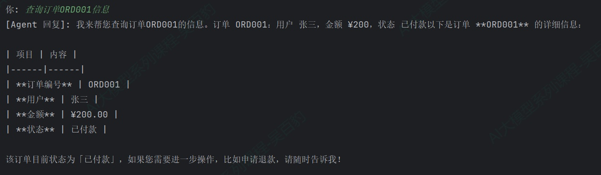

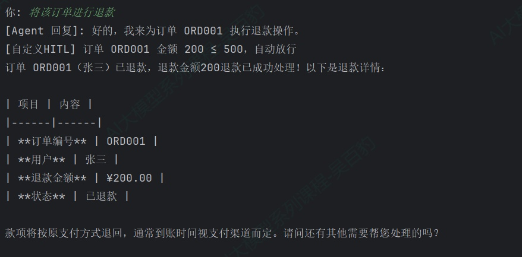

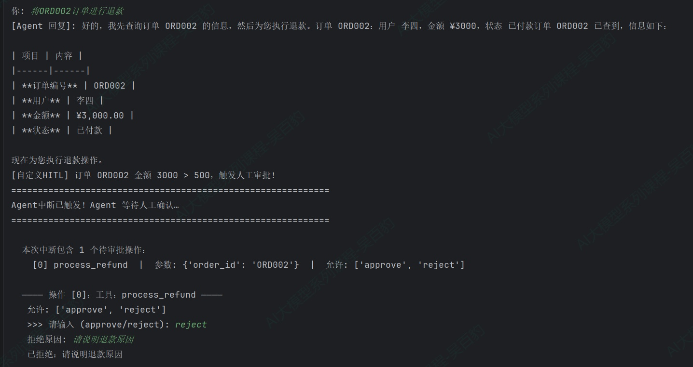

以上代码注意如下几点：

1) @after\_model 在 LLM 生成工具调用之后、工具实际执行之前运行。
2) interrupt() 是 LangGraph 原语，在这里调用会暂停整个图的执行，返回值的格式与 HumanInTheLoopMiddleware 完全一致，这样 Command(resume={...}) 可以无缝兼容。
3) 组织的interrupt中的形式要符合HumanInTheLoopMiddleware中间件中断信息，形式如下：

```python
interrupt({
	"action_requests": [{
		"name": 工具名字,
		"args": 工具参数,
		"description": 中断描述,
	}],
	"review_configs": [{
		"action_name": 工具名字,
		"allowed_decisions": ["approve", "reject"],
	}],
})
```

4) 涉及到返回ToolMessage时，返回的 ToolMessage 中 tool\_call\_id 必须与模型输出的 tool\_call\["id"\] 一致，否则 LangChain 无法将返回消息挂接到正确的对话上下文中。

---
> 🏠 **[返回主页 README](./README.md)** \| ◀️ **上一篇：[15. Agent 长短期记忆](./15%E9%95%BF%E7%9F%AD%E6%9C%9F%E8%AE%B0%E5%BF%86.md)** \| ▶️ **下一篇：[17. Guardrails 安全护栏](./17Guardrails%E5%AE%89%E5%85%A8%E6%8A%A4%E6%A0%8F.md)** \| 🎓 **[进入本模块面试高频题](./interview/03_LangChain与Agent架构面试题.md)**
