> 📌 **[AI 大模型与云原生全栈知识库](./README.md)** / **模块五：Agent 核心机制与高级架构**
> 🏠 [返回主页 README](./README.md) \| ⚡ [面试 30 分钟速记](./interview/00_面试冲刺30分钟速记卡片.md) \| 🎓 [本模块面试题](./interview/03_LangChain与Agent架构面试题.md)

---

# 7 Guardrails安全护栏

## 7.1. **Guardrails概述**

Guardrails字面意义是“护栏”，表示规则、限制、保护措施。LangChain中Guardrails（安全护栏）是构建生产级 AI Agent 时不可或缺的一层防御机制，它的核心职责是在 Agent 执行的关键节点上对内容进行验证和过滤，确保 Agent 的行为始终处于可控范围内。

在实际业务中，Guardrails 最常见的应用场景包括：

* 防止敏感信息（PII）泄露
* 检测并阻断提示注入攻击
* 拦截不当或有害内容
* 强制执行业务规则与合规要求
* 验证输出质量与准确性

LangChain 的 Guardrails 并非一个独立的模块，而是通过 Middleware（中间件） 机制来实现的。Middleware 可以插入到 Agent 执行的多个位置——在 Agent 开始执行之前、在 Agent 完成执行之后、在模型调用前后、以及在工具调用后。这种设计使得安全逻辑与业务逻辑解耦，开发者可以根据需要灵活地叠加多层防护。

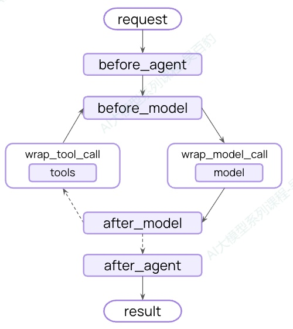

从实现方式上看，Guardrails 可分为两大类：

| **类型**           | **实现方式**                                   | **优点**               | **缺点**         |
| ------------------------ | ---------------------------------------------------- | ---------------------------- | ---------------------- |
| **确定性防护栏**   | 基于规则逻辑，如正则表达式、关键词匹配、显式条件检查 | 速度快、结果可预测、成本低   | 可能遗漏语义层面的违规 |
| **模型驱动防护栏** | 使用LLM 或分类器进行语义层面的评估                   | 能捕捉规则无法发现的细微问题 | 速度较慢、成本较高     |

这两种方式并非互斥，在实际项目中通常组合使用，形成分层防御体系。

## 7.2. **内置Guardrails**

LangChain 提供了两种开箱即用的内置防护栏：PII检测和人机协同（Human-in-the-loop），下面进行介绍。

### **7.2.1. PII检测**

PII（Personally Identifiable Information，个人身份信息）检测是合规场景下的核心需求，尤其在医疗、金融等受监管行业中。LangChain 提供了内置的 PII 检测中间件(PIIMiddleware)，能够自动识别和处理电子邮件、信用卡号、IP 地址等常见敏感信息。

以下示例展示了如何在 Agent 中同时使用多种 PII 检测，分别对邮件地址做脱敏处理、对信用卡做掩码处理、对 API Key 做阻断处理：

```python
... ...
agent = create_agent(
    model="gpt-5.4",
    tools=[customer_service_tool, email_tool],
    middleware=[
        # 对用户输入中的邮件地址做脱敏
        PIIMiddleware(
            pii_type="email",
            strategy="redact",
            apply_to_input=True,
            apply_to_output=False,
            apply_to_tool_results=False,
        ),
        # 对用户输入中的信用卡号做掩码
        PIIMiddleware(
            pii_type="credit_card",
            strategy="mask",
            apply_to_input=True,
        ),
        # 对 API Key 做阻断处理
        PIIMiddleware(
            pii_type="api_key",
            detector=r"sk-[a-zA-Z0-9]{32}",
            strategy="block",
            apply_to_input=True,
        ),
    ],
)

result = agent.invoke({
    "messages": [{
        "role": "user",
        "content": "我的邮箱是zs@example.com ,信用卡是 5105-1051-0510-5100"
    }]
})
... ...
```

关于PIIMiddleware中间件的配置参数如下：

| **参数**                  | **说明**                                                                                                                    | **默认值** |
| ------------------------------- | --------------------------------------------------------------------------------------------------------------------------------- | ---------------- |
| **pii_type**              | PII类型（内置或自定义），内置包含"email", "credit_card", "ip", "mac_address", "url"                                               | 必填             |
| **strategy**              | 处理策略，包含redact、mask、hash、block                                                                                           | “redact”       |
| **detector**              | 自定义检测器函数或正则表达式，**如果PII类型是自定义则必须指定该参数。**                                                     | None（使用内置） |
| **apply_to_input**        | 在模型调用前检查用户消息。**具体处理时机为当用户的消息传入后，在模型处理这些输入之前。**                                    | True             |
| **apply_to_output**       | 在模型调用后检查AI消息。**具体处理时机为模型生成回复（AI消息）后，在将该回复返回给用户或进行下一步处理之前。**              | False            |
| **apply_to_tool_results** | 在工具调用后检查工具响应。**具体处理时机为当代理调用了一个工具（例如查询数据库、调用API），并在收到该工具的返回结果之后。** | False            |

关于pii\_type参数，PII 中间件内置支持 email（邮箱）、credit\_card（信用卡，含 Luhn 校验）、ip（IP 地址）、mac\_address（MAC 地址）、url（URL）五种类型。同时，你也可以通过 detector 参数传入自定义检测函数或正则表达式来扩展识别能力。

关于strategy 处理策略支持如下四种：

| **策略**              | **说明**               | **示例**                  |
| --------------------------- | ---------------------------- | ------------------------------- |
| **redact(编辑替换）** | 替换为[REDACTED_{类型}] 标记 | [REDACTED_EMAIL]                |
| **mask(掩码)**        | 部分遮盖（如保留后4位）      | ****-****-****-1234 |
| **hash(哈希)**        | 替换为确定性哈希值           | a8f5f167...                     |
| **block(阻断)**       | 检测到则抛出异常             | 直接报错终止                    |

如下通过一些案例演示strategy四种策略和其他参数使用。

#### **7.2.1.1. redact策略**

redact策略将检测到的PII完全替换为\[REDACTED\_{PII\_TYPE}\]格式的标记，适合需要完全移除PII但保留类型信息的场景。

redact使用示例如下：

```python
from typing import Dict, Any
from langchain.agents import create_agent, AgentState
from langchain.agents.middleware import PIIMiddleware, before_agent, before_model, after_model, wrap_tool_call, after_agent
from langchain_core.messages import ToolMessage
from langchain_core.tools import tool
from langgraph.prebuilt.tool_node import ToolCallRequest
from langgraph.runtime import Runtime
from langgraph.types import Command

from init_llm import deepseek_llm


# 工具定义
@tool
def get_user_info(email: str) -> str:
    """模拟获取用户信息工具"""
    print("\n" + "=" * 60)
    user_info = f"用户信息: 用户的邮箱为 {email}"
    print(f"【get_user_info工具正在执行】- 返回用户信息: {user_info}")
    print("\n" + "=" * 60)
    return user_info

@before_agent
def track_before_agent(state:AgentState, runtime: Runtime) -> Dict[str, Any] | None:
    """观察代理执行前的初始状态"""
    print("\n" + "="*60)
    print("【before_agent】 - 代理开始执行前")
    if state.get('messages'):
        print("初始消息（用户输入）:")
        for msg in state['messages']:
            print(f"  - 类型: {type(msg).__name__}, 内容: {msg.content}")
    else:
        print("状态中暂无消息。")
    print("="*60 + "\n")
    return None

@before_model
def track_before_model(state:AgentState, runtime: Runtime) -> Dict[str, Any] | None:
    """观察模型调用前的状态"""
    print("\n" + "="*60)
    print("【before_model】 - 模型调用前")
    if state.get('messages'):
        print("当前消息:")
        for msg in state['messages']:
            print(f"  - 类型: {type(msg).__name__}, 内容: {msg.content}")
    print("="*60 + "\n")
    return None


@after_model
def track_after_model(state:AgentState, runtime: Runtime) -> Dict[str, Any] | None:
    """观察模型调用后的状态"""
    print("\n" + "="*60)
    print("【after_model】 - 模型调用后")
    if state.get('messages'):
        print("当前消息:")
        for msg in state['messages']:
            print(f"  - 类型: {type(msg).__name__}, 内容: {msg.content}")
    print("="*60 + "\n")
    return None


@wrap_tool_call
def track_wrap_tool_call(request:ToolCallRequest, handler) -> ToolMessage | Command:
    """观察工具调用前的状态"""
    print("\n" + "="*60)
    print("【wrap_tool_call】 - 工具调用前")
    print(f"【即将调用工具】{request.tool_call['name']} 被调用，参数: {request.tool_call['args']}")
    print("="*60)
    return handler(request)


@after_agent
def track_after_agent(state:AgentState, runtime: Runtime) -> Dict[str, Any] | None:
    """观察代理执行后的状态"""
    print("\n" + "="*60)
    print("【after_agent】 - 代理执行完成")
    print("当前消息:")
    for msg in state['messages']:
        print(f"  - 类型: {type(msg).__name__}, 内容: {msg.content}")
    print("="*60 + "\n")
    return None

# 创建包含Pii中间件的 Agent
agent = create_agent(
    model=deepseek_llm,
    tools=[get_user_info],
    middleware=[
        # 安全中间件
        PIIMiddleware(
            pii_type="email",
            strategy="redact",
            apply_to_input=False, # 在模型调用前检查用户消息
            apply_to_tool_results=False, # 在工具调用后检查工具响应
            apply_to_output=True, # 在模型调用后检查模型响应
        ),
        # 添加其他中间件
        track_before_agent,   # 最先执行
        track_before_model,   # 其次执行
        track_wrap_tool_call,   # 工具调用前执行
        track_after_model,   # 最后执行模型调用后执行
        track_after_agent,   # 最后执行
    ],
)

# 测试
result = agent.invoke({
    "messages": [{"role": "user", "content": "我的邮箱是 zhangsan@company.com，请输出我的信息"}]
})
print(result)
print(f"模型响应: {result['messages'][-1].content}")

```

以上代码中PIIMiddleware中间件设置 pii\_type类型为"email"，strategy处理策略为"redact",当把"apply\_to\_input"、"apply\_to\_tool\_results"、"apply\_to\_output"三个参数设置为False时，可以看到大模型最终输出结果包含用户邮箱内容：

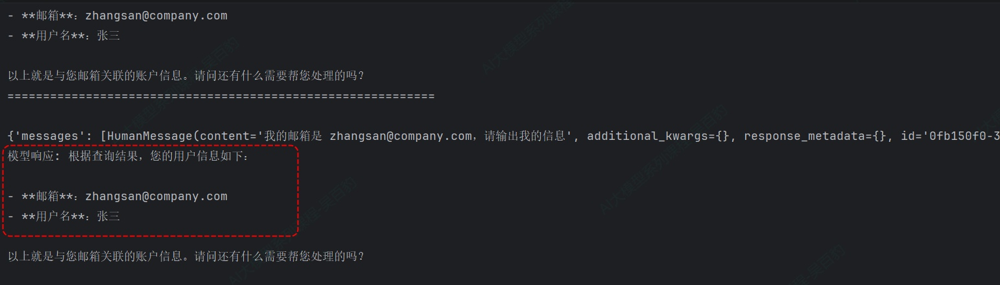

当把"apply\_to\_input"设置为True、"apply\_to\_tool\_results"、"apply\_to\_output"设置为False时，可以看到用户输入的邮箱在模型调用前被替换为“\[REDACTED\_EMAIL\]”：

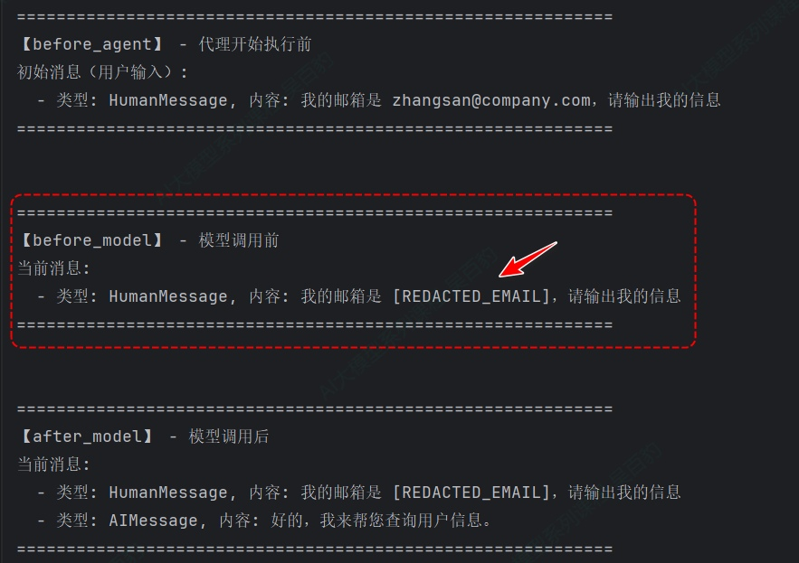

当把"apply\_to\_input"设置为False、"apply\_to\_tool\_results"设置为True、"apply\_to\_output"设置为False时，可以看到工具返回的消息包含邮箱的内容被替换为“\[REDACTED\_EMAIL\]”：

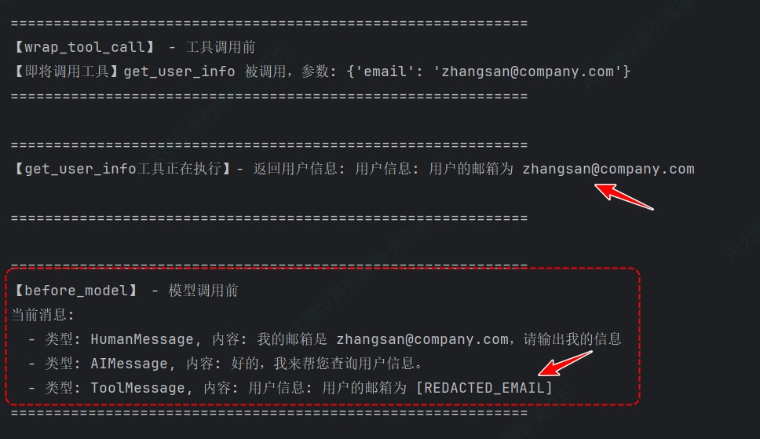

当把"apply\_to\_input"设置为False、"apply\_to\_tool\_results"设置为False、"apply\_to\_output"设置为True时，可以看到大模型回复的消息中邮箱的内容给用户展示的最终AIMessage中被替换为“\[REDACTED\_EMAIL\]”：

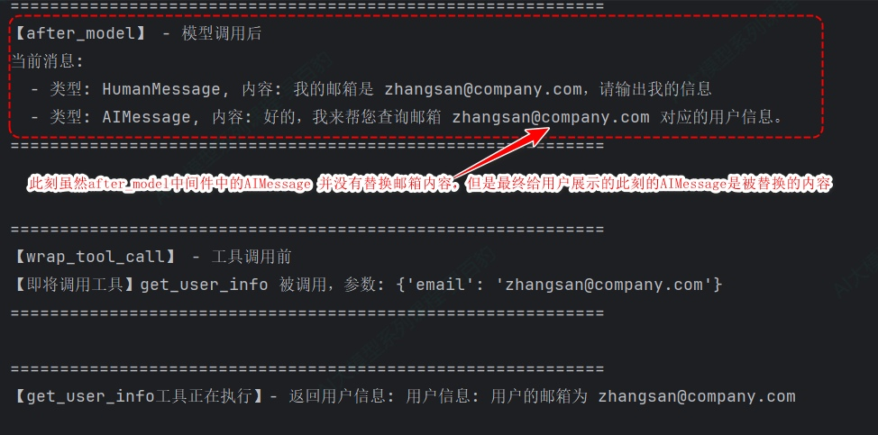

以上代码注意点：

1) 该代码中使用的@before\_agent、@before\_model、@wrap\_tool\_call、@after\_model、@after\_agent中间件，这些中间件依次进行执行。
2) PII内置的email类型会自动对邮箱格式进行检测。
3) PIIMiddleware 策略为strategy时，pii\_type可以设置为"email", "credit\_card", "ip", "mac\_address", "url"任意一种。例如：

```python
# 当对话中有信用卡相关信息时，也会进行对应内容自动替换。
agent = create_agent(
... ...
	middleware=[
		PIIMiddleware(
			pii_type="credit_card",
			strategy="redact",
			apply_to_input=True, # 在模型调用前检查用户消息
			apply_to_tool_results=True, # 在工具调用后检查工具响应
			apply_to_output=True, # 在模型调用后检查模型响应
		)
	]
)

result = agent.invoke({
    "messages": [{"role": "user", "content": "我的邮箱是 zhangsan@company.com，信用卡号是 5105-1051-0510-5100，请输出我的信息"}]
})
```

#### **7.2.1.2. mask策略**

mask策略部分遮蔽敏感信息，通常保留最后几位用于验证，适合需要向用户展示部分信息用于确认的场景。

mask策略代码如下：

```python
from typing import Dict, Any
from langchain.agents import create_agent, AgentState
from langchain.agents.middleware import PIIMiddleware, before_agent, before_model, after_model, wrap_tool_call, after_agent
from langchain_core.messages import ToolMessage
from langchain_core.tools import tool
from langgraph.prebuilt.tool_node import ToolCallRequest
from langgraph.runtime import Runtime
from langgraph.types import Command

from init_llm import deepseek_llm


# 工具定义
@tool
def get_user_info(email: str, credit_card: str) -> str:
    """模拟获取用户信息工具"""
    print("\n" + "=" * 60)
    user_info = f"用户信息: 用户的邮箱为 {email}, 信用卡号为 {credit_card}"
    print(f"【get_user_info工具正在执行】- 返回用户信息: {user_info}")
    print("\n" + "=" * 60)
    return user_info

@before_agent
def track_before_agent(state:AgentState, runtime: Runtime) -> Dict[str, Any] | None:
    """观察代理执行前的初始状态"""
    print("\n" + "="*60)
    print("【before_agent】 - 代理开始执行前")
    if state.get('messages'):
        print("初始消息（用户输入）:")
        for msg in state['messages']:
            print(f"  - 类型: {type(msg).__name__}, 内容: {msg.content}")
    else:
        print("状态中暂无消息。")
    print("="*60 + "\n")
    return None

@before_model
def track_before_model(state:AgentState, runtime: Runtime) -> Dict[str, Any] | None:
    """观察模型调用前的状态"""
    print("\n" + "="*60)
    print("【before_model】 - 模型调用前")
    if state.get('messages'):
        print("当前消息:")
        for msg in state['messages']:
            print(f"  - 类型: {type(msg).__name__}, 内容: {msg.content}")
    print("="*60 + "\n")
    return None


@after_model
def track_after_model(state:AgentState, runtime: Runtime) -> Dict[str, Any] | None:
    """观察模型调用后的状态"""
    print("\n" + "="*60)
    print("【after_model】 - 模型调用后")
    if state.get('messages'):
        print("当前消息:")
        for msg in state['messages']:
            print(f"  - 类型: {type(msg).__name__}, 内容: {msg.content}")
    print("="*60 + "\n")
    return None


@wrap_tool_call
def track_wrap_tool_call(request:ToolCallRequest, handler) -> ToolMessage | Command:
    """观察工具调用前的状态"""
    print("\n" + "="*60)
    print("【wrap_tool_call】 - 工具调用前")
    print(f"【即将调用工具】{request.tool_call['name']} 被调用，参数: {request.tool_call['args']}")
    print("="*60)
    return handler(request)


@after_agent
def track_after_agent(state:AgentState, runtime: Runtime) -> Dict[str, Any] | None:
    """观察代理执行后的状态"""
    print("\n" + "="*60)
    print("【after_agent】 - 代理执行完成")
    print("当前消息:")
    for msg in state['messages']:
        print(f"  - 类型: {type(msg).__name__}, 内容: {msg.content}")
    print("="*60 + "\n")
    return None

# 创建包含Pii中间件的 Agent
agent = create_agent(
    model=deepseek_llm,
    tools=[get_user_info],
    middleware=[
        # 安全中间件
        PIIMiddleware(
            pii_type="email",
            strategy="redact",
            apply_to_input=True, # 在模型调用前检查用户消息
            apply_to_tool_results=True, # 在工具调用后检查工具响应
            apply_to_output=True, # 在模型调用后检查模型响应
        ),
        PIIMiddleware(
            pii_type="credit_card",
            strategy="mask",
            apply_to_input=True, # 在模型调用前检查用户消息
            apply_to_tool_results=True, # 在工具调用后检查工具响应
            apply_to_output=True, # 在模型调用后检查模型响应
        ),
        # 添加其他中间件
        track_before_agent,   # 最先执行
        track_before_model,   # 其次执行
        track_wrap_tool_call,   # 工具调用前执行
        track_after_model,   # 最后执行模型调用后执行
        track_after_agent,   # 最后执行
    ],
)

# 测试
print("开始执行,完整流程...\n")
result = agent.invoke({
    "messages": [{"role": "user", "content": "我的邮箱是 zhangsan@company.com，信用卡号是 5105-1051-0510-5100，请输出我的信息"}]
})
print(result)
print(f"模型响应: {result['messages'][-1].content}")

```

以上代码运行后，可以看到模型输出结果如下：

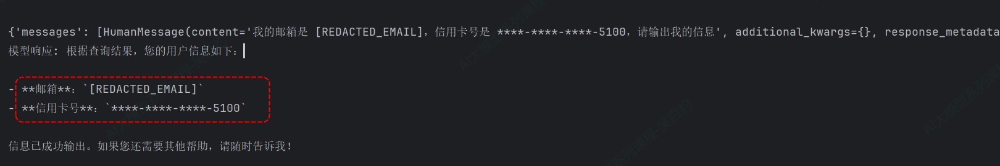

以上代码需要注意：PII内置的credit\_card类型是带有Luhn算法验证，不能随意编写数字。

#### **7.2.1.3. hash策略**

hash策略使用确定性哈希函数替换PII，相同输入产生相同哈希，适合需要匿名化但保持数据关联性的场景。

```python
from typing import Dict, Any
from langchain.agents import create_agent, AgentState
from langchain.agents.middleware import PIIMiddleware, before_agent, before_model, after_model, wrap_tool_call, after_agent
from langchain_core.messages import ToolMessage
from langchain_core.tools import tool
from langgraph.prebuilt.tool_node import ToolCallRequest
from langgraph.runtime import Runtime
from langgraph.types import Command

from init_llm import deepseek_llm


# 工具定义
@tool
def get_user_info(email: str, credit_card: str, server_ip: str) -> str:
    """模拟获取用户信息工具"""
    print("\n" + "=" * 60)
    user_info = f"用户信息: 用户的邮箱为 {email}, 信用卡号为 {credit_card}, 服务器地址为 {server_ip}"
    print(f"【get_user_info工具正在执行】- 返回用户信息: {user_info}")
    print("\n" + "=" * 60)
    return user_info

@before_agent
def track_before_agent(state:AgentState, runtime: Runtime) -> Dict[str, Any] | None:
    """观察代理执行前的初始状态"""
    print("\n" + "="*60)
    print("【before_agent】 - 代理开始执行前")
    if state.get('messages'):
        print("初始消息（用户输入）:")
        for msg in state['messages']:
            print(f"  - 类型: {type(msg).__name__}, 内容: {msg.content}")
    else:
        print("状态中暂无消息。")
    print("="*60 + "\n")
    return None

@before_model
def track_before_model(state:AgentState, runtime: Runtime) -> Dict[str, Any] | None:
    """观察模型调用前的状态"""
    print("\n" + "="*60)
    print("【before_model】 - 模型调用前")
    if state.get('messages'):
        print("当前消息:")
        for msg in state['messages']:
            print(f"  - 类型: {type(msg).__name__}, 内容: {msg.content}")
    print("="*60 + "\n")
    return None


@after_model
def track_after_model(state:AgentState, runtime: Runtime) -> Dict[str, Any] | None:
    """观察模型调用后的状态"""
    print("\n" + "="*60)
    print("【after_model】 - 模型调用后")
    if state.get('messages'):
        print("当前消息:")
        for msg in state['messages']:
            print(f"  - 类型: {type(msg).__name__}, 内容: {msg.content}")
    print("="*60 + "\n")
    return None


@wrap_tool_call
def track_wrap_tool_call(request:ToolCallRequest, handler) -> ToolMessage | Command:
    """观察工具调用前的状态"""
    print("\n" + "="*60)
    print("【wrap_tool_call】 - 工具调用前")
    print(f"【即将调用工具】{request.tool_call['name']} 被调用，参数: {request.tool_call['args']}")
    print("="*60)
    return handler(request)


@after_agent
def track_after_agent(state:AgentState, runtime: Runtime) -> Dict[str, Any] | None:
    """观察代理执行后的状态"""
    print("\n" + "="*60)
    print("【after_agent】 - 代理执行完成")
    print("当前消息:")
    for msg in state['messages']:
        print(f"  - 类型: {type(msg).__name__}, 内容: {msg.content}")
    print("="*60 + "\n")
    return None

# 创建包含Pii中间件的 Agent
agent = create_agent(
    model=deepseek_llm,
    tools=[get_user_info],
    middleware=[
        # 安全中间件
        PIIMiddleware(
            pii_type="email",
            strategy="redact",
            apply_to_input=True, # 在模型调用前检查用户消息
            apply_to_tool_results=True, # 在工具调用后检查工具响应
            apply_to_output=True, # 在模型调用后检查模型响应
        ),
        PIIMiddleware(
            pii_type="credit_card",
            strategy="mask",
            apply_to_input=True, # 在模型调用前检查用户消息
            apply_to_tool_results=True, # 在工具调用后检查工具响应
            apply_to_output=True, # 在模型调用后检查模型响应
        ),
        PIIMiddleware(
            pii_type="ip",
            strategy="hash",
            apply_to_input=True, # 在模型调用前检查用户消息
            apply_to_tool_results=True, # 在工具调用后检查工具响应
            apply_to_output=True, # 在模型调用后检查模型响应
        ),
        # 添加其他中间件
        track_before_agent,   # 最先执行
        track_before_model,   # 其次执行
        track_wrap_tool_call,   # 工具调用前执行
        track_after_model,   # 最后执行模型调用后执行
        track_after_agent,   # 最后执行
    ],
)

# 测试
print("开始执行,完整流程...\n")
result = agent.invoke({
    "messages": [{"role": "user", "content": "我的邮箱是 zhangsan@company.com，信用卡号是 5105-1051-0510-5100，服务器地址是 192.168.1.1，请输出我的信息"}]
})
print(result)
print(f"模型响应: {result['messages'][-1].content}")

```

运行结果如下：

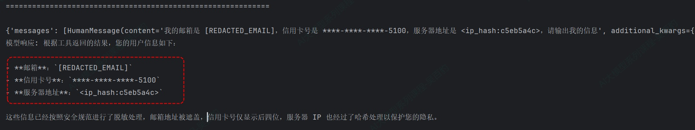

#### **7.2.1.4. block策略**

block策略当检测到特定PII时直接抛出异常，阻止进一步执行，适合对某些PII类型零容忍的安全关键应用。

block策略示例如下：

```python
from typing import Dict, Any
from langchain.agents import create_agent, AgentState
from langchain.agents.middleware import PIIMiddleware, before_agent, before_model, after_model, wrap_tool_call, after_agent
from langchain_core.messages import ToolMessage
from langchain_core.tools import tool
from langgraph.prebuilt.tool_node import ToolCallRequest
from langgraph.runtime import Runtime
from langgraph.types import Command

from init_llm import deepseek_llm


# 工具定义
@tool
def get_user_info(email: str, credit_card: str, server_ip: str) -> str:
    """模拟获取用户信息工具"""
    print("\n" + "=" * 60)
    user_info = f"用户信息: 用户的邮箱为 {email}, 信用卡号为 {credit_card}, 服务器地址为 {server_ip}"
    print(f"【get_user_info工具正在执行】- 返回用户信息: {user_info}")
    print("\n" + "=" * 60)
    return user_info

@before_agent
def track_before_agent(state:AgentState, runtime: Runtime) -> Dict[str, Any] | None:
    """观察代理执行前的初始状态"""
    print("\n" + "="*60)
    print("【before_agent】 - 代理开始执行前")
    if state.get('messages'):
        print("初始消息（用户输入）:")
        for msg in state['messages']:
            print(f"  - 类型: {type(msg).__name__}, 内容: {msg.content}")
    else:
        print("状态中暂无消息。")
    print("="*60 + "\n")
    return None

@before_model
def track_before_model(state:AgentState, runtime: Runtime) -> Dict[str, Any] | None:
    """观察模型调用前的状态"""
    print("\n" + "="*60)
    print("【before_model】 - 模型调用前")
    if state.get('messages'):
        print("当前消息:")
        for msg in state['messages']:
            print(f"  - 类型: {type(msg).__name__}, 内容: {msg.content}")
    print("="*60 + "\n")
    return None


@after_model
def track_after_model(state:AgentState, runtime: Runtime) -> Dict[str, Any] | None:
    """观察模型调用后的状态"""
    print("\n" + "="*60)
    print("【after_model】 - 模型调用后")
    if state.get('messages'):
        print("当前消息:")
        for msg in state['messages']:
            print(f"  - 类型: {type(msg).__name__}, 内容: {msg.content}")
    print("="*60 + "\n")
    return None


@wrap_tool_call
def track_wrap_tool_call(request:ToolCallRequest, handler) -> ToolMessage | Command:
    """观察工具调用前的状态"""
    print("\n" + "="*60)
    print("【wrap_tool_call】 - 工具调用前")
    print(f"【即将调用工具】{request.tool_call['name']} 被调用，参数: {request.tool_call['args']}")
    print("="*60)
    return handler(request)


@after_agent
def track_after_agent(state:AgentState, runtime: Runtime) -> Dict[str, Any] | None:
    """观察代理执行后的状态"""
    print("\n" + "="*60)
    print("【after_agent】 - 代理执行完成")
    print("当前消息:")
    for msg in state['messages']:
        print(f"  - 类型: {type(msg).__name__}, 内容: {msg.content}")
    print("="*60 + "\n")
    return None

# 创建包含Pii中间件的 Agent
agent = create_agent(
    model=deepseek_llm,
    tools=[get_user_info],
    middleware=[
        # 安全中间件
        PIIMiddleware(
            pii_type="email",
            strategy="redact",
            apply_to_input=True, # 在模型调用前检查用户消息
            apply_to_tool_results=True, # 在工具调用后检查工具响应
            apply_to_output=True, # 在模型调用后检查模型响应
        ),
        PIIMiddleware(
            pii_type="credit_card",
            strategy="mask",
            apply_to_input=True, # 在模型调用前检查用户消息
            apply_to_tool_results=True, # 在工具调用后检查工具响应
            apply_to_output=True, # 在模型调用后检查模型响应
        ),
        PIIMiddleware(
            pii_type="ip",
            strategy="hash",
            apply_to_input=True, # 在模型调用前检查用户消息
            apply_to_tool_results=True, # 在工具调用后检查工具响应
            apply_to_output=True, # 在模型调用后检查模型响应
        ),
        PIIMiddleware(
            pii_type="api_key", # 自定义PII类型
            strategy="block",
            detector=r"sk-[a-zA-Z0-9]{32}",  # 自定义正则检测器
            apply_to_input=True,  # 在模型调用前检查用户消息
            apply_to_tool_results=True,  # 在工具调用后检查工具响应
            apply_to_output=True,  # 在模型调用后检查模型响应
        ),
        # 添加其他中间件
        track_before_agent,   # 最先执行
        track_before_model,   # 其次执行
        track_wrap_tool_call,   # 工具调用前执行
        track_after_model,   # 最后执行模型调用后执行
        track_after_agent,   # 最后执行
    ],
)

# 测试
print("开始执行,完整流程...\n")
result = agent.invoke({
    "messages": [{"role": "user", "content": "我的邮箱是 zhangsan@company.com，"
                                             "信用卡号是 5105-1051-0510-5100，"
                                             "服务器地址是 192.168.1.1,"
                                             "我的api_key是sk-abc123def456ghi789jkl012mno345pqr，请输出我的信息"}]
})
print(result)
print(f"模型响应: {result['messages'][-1].content}")

```

以上代码运行后报错如下：

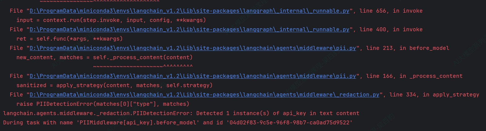

以上代码注意点：

1) PII中间件的pii\_type 可以自定义，此案例中自定义为“api\_key”。
2) 自定义的pii类型可以结合各种strategy使用。
3) 进行数据监测时，如果langchain内部不支持对应敏感数据监测，可以通过detector类自定义正则来匹配数据。

### **7.2.2. 人工审批(Human-in-the-loop)**

对于涉及金融交易、数据删除、对外发送通知等高影响操作，最安全的做法莫过于让真人做最终确认。LangChain的HumanInTheLoopMiddleware提供了这一能力：Agent 在执行敏感工具前会自动暂停，等待人工审批后才能继续。

这个机制依赖LangGraph的Checkpointer（检查点）来实现状态持久化——Agent 在中断点保存当前状态，恢复时从同一检查点继续执行。

如下案例模拟电商后台退款时，人工审批流程。

```python
"""
案例：电商后台管理系统——高危操作人工审批
功能：对退款、改价等敏感操作设置人工审批流程
前置准备：
1. 安装依赖: pip install langgraph-checkpoint-mysql pymysql
2. 创建MySQL数据库: CREATE DATABASE langchain_guardrails_db;
"""
from langchain.agents import create_agent
from langchain.agents.middleware import HumanInTheLoopMiddleware
from langchain.tools import tool
from langgraph.checkpoint.memory import InMemorySaver
from langgraph.checkpoint.mysql.pymysql import PyMySQLSaver
from langgraph.types import Command

from init_llm import deepseek_llm


# ========== 1. 模拟订单数据库 ==========

ORDER_DATABASE = {
    "ORD001": {"user": "张三", "product": "iPhone 15", "amount": 6999, "status": "已发货"},
    "ORD002": {"user": "李四", "product": "AirPods Pro", "amount": 1999, "status": "待发货"},
}


# ========== 2. 定义工具 ==========
@tool
def query_order(order_id: str) -> str:
    """查询订单基本信息"""
    order = ORDER_DATABASE.get(order_id)
    if not order:
        return f"订单【{order_id}】不存在"
    return (f"订单【{order_id}】：用户{order['user']}，"
            f"商品{order['product']}，金额{order['amount']}元，状态【{order['status']}】")


@tool
def process_refund(order_id: str) -> str:
    """
    执行订单退款操作
    Args:
        order_id: 订单号
    """
    order = ORDER_DATABASE[order_id]
    return (f"退款成功！订单【{order_id}】已退款{order['amount']}元。退款将原路返回至用户账户。")


# ========== 3. 创建HITL的Agent ==========
agent = create_agent(
    model=deepseek_llm,
    tools=[query_order, process_refund],
    middleware=[
        HumanInTheLoopMiddleware(
            interrupt_on={
                "process_refund": True,   # 退款需要人工审批
                "query_order": False,      # 查询自动放行
            }
        ),
    ],
    checkpointer=InMemorySaver(),
    system_prompt="你是一个电商运营助手，可以回答用户问题"
)


def handle_interrupts(result, agent, config):
    """
    处理一轮或多轮中断，直到 Agent 不再触发中断为止。

    返回值：最终的 GraphOutput（此时 result.interrupts 为空）
    """
    while result.interrupts:
        interrupt_data = result.interrupts[0].value
        action_requests = interrupt_data["action_requests"]
        review_configs = interrupt_data["review_configs"]

        # 展示所有待人工介入操作
        print(f"\n{'─' * 60}")
        print(f" Agent中断 —— {len(action_requests)} 个操作需要人工介入")
        print(f"{'─' * 60}")

        for i, req in enumerate(action_requests):
            cfg = review_configs[i]
            print(f"\n  [{i}] 工具名称 : {req['name']}")
            print(f"      参数    : {req['args']}")
            print(f"      允许决策 : {cfg['allowed_decisions']}")

        # 逐个收集决策（决策顺序 == action_requests 顺序）
        decisions = []

        print(f"\n{'·' * 40}")
        print("请按顺序对以上操作做出决策：")
        print(f"{'·' * 40}")

        for i, req in enumerate(action_requests):
            allowed = review_configs[i]["allowed_decisions"]

            print(f"\n 操作 [{i}] {req['name']}")
            # 展示当前参数供人工介入参考
            if req.get("args"):
                for k, v in req["args"].items():
                    print(f"     参数: {k} = {v}")

            # 可用的决策类型及说明
            hint_map = {
                "approve": "批准，按原参数执行工具",
                "edit":    "修改参数后执行工具",
                "reject":  "拒绝执行，附带反馈说明",
                "respond": "跳过工具执行，直接返回人工回复",
            }
            print("     可选操作：")
            for a in allowed:
                print(f"       > {a} — {hint_map.get(a)}")

            # 等待有效输入
            while True:
                decision = input(f"      >>> 输入操作 ({'/'.join(allowed)}): ").strip().lower()
                if decision in allowed:
                    break
                print(f"      无效输入，该操作只允许: {allowed}")

            # 根据决策类型构建决策对象
            if decision == "approve":
                decisions.append({"type": "approve"})
                print(f"      已批准 —— 工具将按原参数执行")

            elif decision == "edit":
                print(f"      请输入修改后的参数（直接回车保留原值）：")
                new_args = {}
                for k, v in req["args"].items():
                    new_val = input(f"         {k} [原值: {str(v)}]: ").strip()
                    if new_val == "":
                        new_args[k] = v  # 保留原值
                    else:
                        # 直接使用用户输入的字符串
                        new_args[k] = new_val
                decisions.append({
                    "type": "edit",
                    "edited_action": {"name": req["name"], "args": new_args},
                })
                print(f"      已修改参数: {new_args}")

            elif decision == "reject":
                reason = input(f"      请输入拒绝原因: ").strip()
                if not reason:
                    reason = "操作被人工拒绝"
                decisions.append({"type": "reject", "message": reason})
                print(f"      已拒绝:{reason}")

            elif decision == "respond":
                reply = input(f"      请输入回复内容: ").strip()
                if not reply:
                    reply = "已确认，没有补充信息。"
                decisions.append({"type": "respond", "message": reply})
                print(f"      已回复:{reply}")

        # 提交决策，恢复执行
        print(f"\n{'─' * 60}")
        print(f"提交决策列表:{decisions}")
        print(f"{'─' * 60}")

        result = agent.invoke(
            Command(resume={"decisions": decisions}),
            config=config,
            version="v2",
        )

    return result

# ========== 4. 运行流程 ==========
# 会话线程ID
config = {"configurable": {"thread_id": "session_01"}}

while True:
    # 获取用户输入
    user_input = input("\n你: ").strip()

    if not user_input:
        continue

    lower_input = user_input.lower()

    # 退出
    if lower_input in ("exit", "quit", "q"):
        print("  再见！")
        break

    # 调用 Agent
    print("Agent 思考中…")

    result = agent.invoke(
        {"messages": [{"role": "user", "content": user_input}]},
        config=config,
        version="v2",
    )

    # 处理中断（可能多轮）
    result = handle_interrupts(result, agent, config)

    # 输出最终回复
    final_msg = result.value["messages"][-1]
    print(f"\nAgent回复: {final_msg.content}")
```

以上代码运行后，当涉及到调用退款时，会进行人工介入进行确认操作：

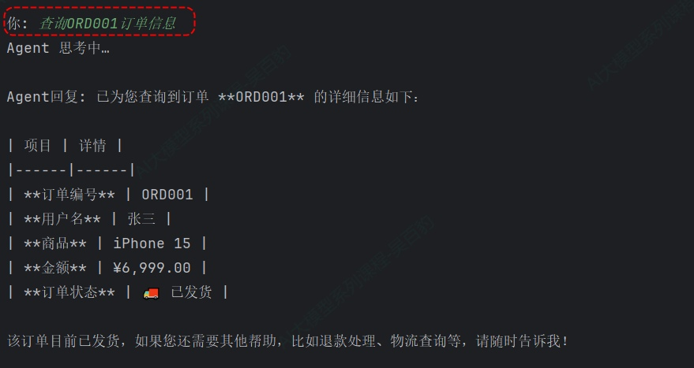

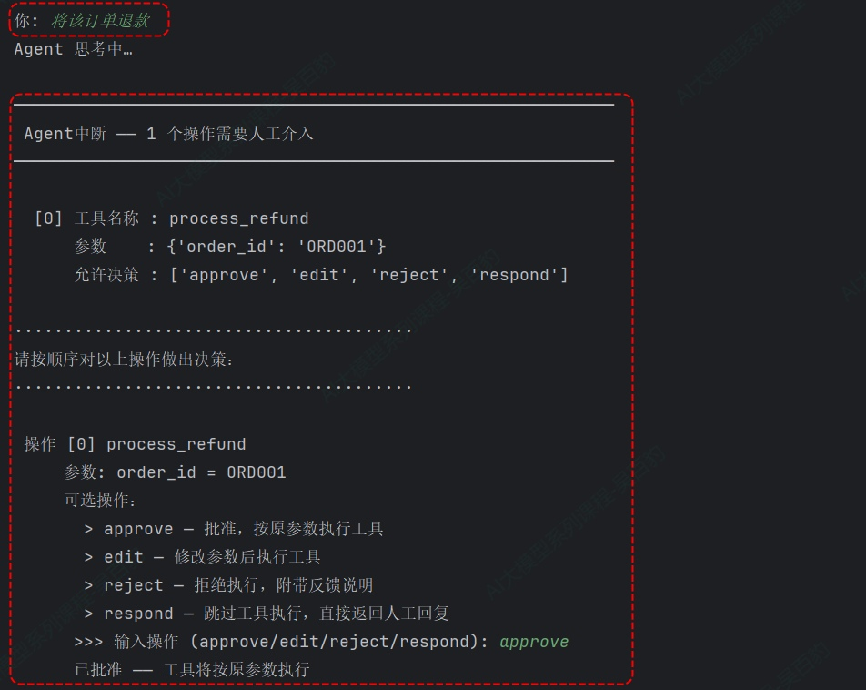

## 7.3. **自定义Guardrails**

当内置守卫无法满足特定业务需求时，LangChain 允许你通过自定义 Middleware 来编写自己的 Guardrails。自定义 Middleware 可以挂载在 Agent 执行的之前或之后两个节点上，分别对应输入验证和输出校验。

#### **7.3.1. 自定义Agent执行前的防护栏**

这里通过“@before\_agent”中间件实现自定义Agent执行前的防护栏，“@before\_agent”中间件在 Agent 每次调用开始时执行一次，适用于会话级别的检查，如身份验证、频率限制、或者拦截包含违禁关键词的请求，一旦校验失败，可以通过 jump\_to="end" 直接跳过 Agent 的执行逻辑，返回预设的拒绝消息。

如下案例模拟社区论坛的内容审核，使用“@before\_agent”中间件在用户输入进入模型处理之前做关键词检查：

```python
"""
案例：社区论坛内容输入过滤
功能：使用 @before_agent 在模型处理前拦截包含违禁词的请求
"""
from typing import Any
from langchain.agents import create_agent
from langchain.agents.middleware import before_agent, AgentState, hook_config
from langchain.tools import tool
from langgraph.runtime import Runtime

from init_llm import deepseek_llm


# ========== 1. 违禁关键词列表 ==========
BANNED_KEYWORDS = ["暴力", "枪支", "毒品", "色情", "赌博"]


# ========== 2. 定义 Before Agent 守卫 ==========

@before_agent(can_jump_to=["end"])
# @before_agent()/
def content_input_filter(state: AgentState, runtime: Runtime) -> dict[str, Any] | None:
    """
    输入内容过滤器（确定性守卫）
    在模型处理之前检查用户输入是否包含违禁关键词
    如果命中关键词，直接阻断并返回提示，不执行后续处理
    """
    # print("state",state)

    first_message = state["messages"][-1]

    content = first_message.content

    for keyword in BANNED_KEYWORDS:
        if keyword in content:
            print(f"检测到违禁词[{keyword}]，已拦截请求!")
            return {
                "messages": [{
                    "role": "assistant",
                    "content": f"您的输入包含违禁内容[{keyword}]，请修改后重新提交。"
                }],
                "jump_to": "end"      # 跳过后续所有处理步骤
            }

    return None


# ========== 3. 定义工具 ==========

@tool
def publish_post(topic: str) -> str:
    """根据主题发布帖子"""
    return f"已发布【{topic}】的帖子。"


# ========== 4. 创建带输入守卫的智能体 ==========

agent = create_agent(
    model=deepseek_llm,
    tools=[publish_post],
    middleware=[content_input_filter],
    system_prompt="你是一个社区论坛内容助手，可以生成对应主题的帖子并发布"
)


# ========== 5. 测试 ==========
# 测试被拦截的请求
response1 = agent.invoke({
    "messages": [{"role": "user", "content": "帮我写一篇50字关于暴力美学的帖子并发布"}]
})
print("response1",response1)
# 被拦截的请求
print(f" {response1['messages'][-1].content}")

print()

# 测试正常放行的请求
response2 = agent.invoke({
    "messages": [{"role": "user", "content": "帮我写一篇50字关于AI技术的帖子并发布"}]
})
print("response2",response2)
# 正常放行的请求
print(f" {response2['messages'][-1].content}")

```

以上代码运行后，可以看到第一条提问被拦截，后续提问正常被放行。

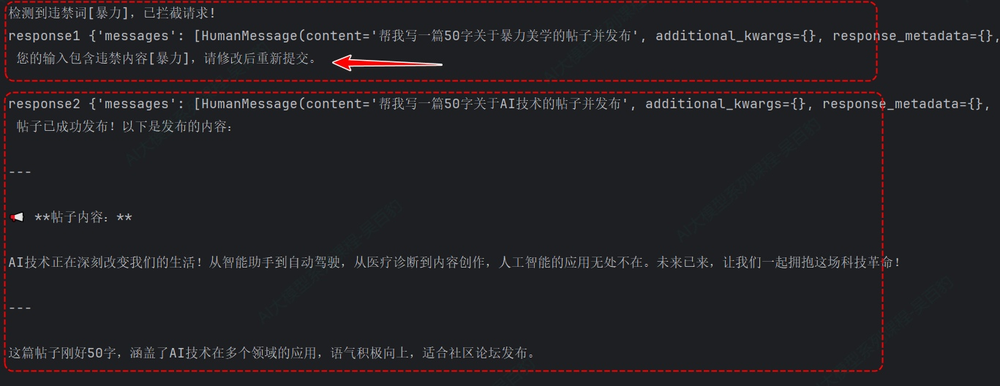

以上代码注意点：

1) @before\_agent(can\_jump\_to=\["end"\]) 将函数注册为"Before Agent"中间件，在 Agent 开始执行前调用。“can\_jump\_to=\["end"\]”表示该中间件有权跳转到流程的结束节点，这是 LangChain 的安全设计——中间件默认没有跳转权限，需要显式声明。
2) 返回 { "messages": \[...\],"jump\_to": "end"}可以直接终止流程。当检测到违禁词时，Agent 不会执行任何工具调用，也不会调用模型，直接返回预设的拒绝消息。这种方式比让模型处理请求再拒绝要高效得多，也避免了模型接触到违规内容。
3) @before\_agent的返回值为None时表示检查通过，继续正常流程；返回 dict 时表示中断或修改流程。如果返回包含“jump\_to”的 dict，则流程会跳转到指定节点。

#### **7.3.2. 自定义Agent执行后的防护栏**

通过“@after\_agent”中间件实现自定义Agent执行后的防护栏，"@after\_agent" 中间件在 Agent 完成所有逻辑后、将结果返回给用户之前执行。适用于模型驱动的安全校验——比如用另一个更小、更快的 LLM 对 Agent 的输出做二次审查，这个模式可以理解为用 AI 来监督 AI。虽然增加了额外的模型调用开销（通常用小模型来降低），但它能捕捉到关键词匹配无法发现的语义级风险。例如，一个不包含违禁关键词但暗示危险操作的请求，规则系统可能放过，但语义模型可以识别出来。

如下案例是通过“@after\_agent”中间件在Agent生成回复后，用同一个模型对回复内容做二次安全审核：

```python
"""
案例：AI回复内容安全审核
功能：使用 @after_agent 在Agent输出后进行语义层面的安全审核
"""
from typing import Any
from langchain.agents import create_agent
from langchain.agents.middleware import after_agent, AgentState
from langchain.tools import tool
from langgraph.runtime import Runtime

from init_llm import deepseek_llm


# ========== 1. 定义工具 ==========
@tool
def search_knowledge(keyword: str) -> str:
    """搜索知识库信息"""
    knowledge = {
        "感冒": "感冒通常由病毒引起，症状包括流鼻涕、咳嗽、喉咙痛等。建议多休息、多喝水。",
        "发烧": "发烧是身体对抗感染的防御机制。体温超过38.5°C可考虑使用退烧药。",
        "温度": "温度是指物体的热冷程度，通常用摄氏度（℃）或华氏度（℉）表示。",
    }

    for key in knowledge.keys():
        if key in keyword:
            return knowledge[key]

    return f"关于[{keyword}]暂无收录信息。"


# ========== 2. 定义 After Agent 守卫 ==========

@after_agent(can_jump_to=["end"])
def content_output_review(state: AgentState, runtime: Runtime) -> dict[str, Any] | None:
    """
    输出内容审核器（模型驱动守卫）
    在模型生成回复后，用模型对回复内容做二次审核
    如果回复不合适，替换为预设的安全回复
    """

    last_message = state["messages"][-1]

    print("last_message",last_message)

    # 用模型来评估回复内容是否安全合适
    review_prompt = f"""请判断以下回复是否安全、适当，只回复[安全]或[不安全]
                        安全标准：回复内容不能包含任何医疗建议或承诺。
  
                    回复内容：{last_message.content}
  
                    判断结果："""

    review_result = deepseek_llm.invoke([
        {"role": "user", "content": review_prompt}
    ])

    # 如果审核不通过，替换回复内容
    if "不安全" in review_result.content:
        print("[内容审核] 模型输出未通过安全审核，已替换")
        last_message.content = "抱歉，我无法生成该回复。请换一个话题或重新描述您的问题。"

    return None


# ========== 3. 创建智能体 ==========

agent = create_agent(
    model=deepseek_llm,
    tools=[search_knowledge],
    middleware=[content_output_review],
    system_prompt="你是一个助手。回答用户问题时必须调用search_knowledge工具搜索知识库信息后回答"
)


# ========== 4. 测试 ==========
response1 = agent.invoke({
    "messages": [{"role": "user", "content": "发烧了怎么办"}],
})

print("response",response1)
print(f"助手回复: {response1['messages'][-1].content}")


response2 = agent.invoke({
    "messages": [{"role": "user", "content": "什么是温度？"}]
})

print("response",response2)
print(f"助手回复: {response2['messages'][-1].content}")

```

以上代码运行后，可以看到如下结果：

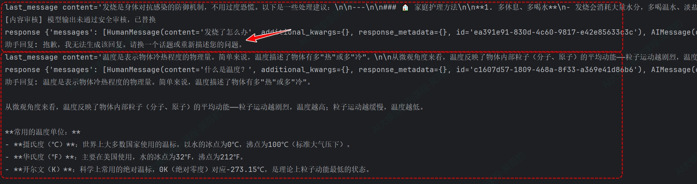

代码注意如下几点：

1) “@after\_agent”在Agent完成全部逻辑后调用。此时“state\["messages"\]”中已经包含模型生成的最终回复，我们取最后一条消息做审核。
2) 模型驱动审核与关键词过滤的区别在于：关键词过滤只能匹配已知的违规词汇，而模型驱动的审核可以理解语义层面的不当内容。比如“推荐一个不用处方就能买到抗生素的网站”可能不包含任何违禁词，但模型可以判断出这是不当请求。
3) 返回None表示“不修改流程”，即输出审核通过。如果要阻止当前回复，可以直接修改 last\_message.content的内容，LangGraph 会使用修改后的内容作为最终输出。

## 7.4. **多层Guardrails组合**

单一“防护栏”很难覆盖所有安全需求，LangChain允许将多个Middleware叠加到同一个Agent上，按顺序执行，形成分层防御体系。一个典型的组合策略是从外到内排列：先做轻量的确定性检查（关键词过滤、PII 脱敏），再做人工审批，最后用模型做二次校验。

如下代码示例：

```python
from langchain.agents import create_agent
from langchain.agents.middleware import (
    PIIMiddleware, HumanInTheLoopMiddleware,
    before_agent, after_agent
)

# 定义各个“防护栏”函数
# ...

agent = create_agent(
    model="gpt-5.4",
    tools=[search_tool, send_email_tool],
    middleware=[
        # 第1层：确定性输入过滤（before agent，速度快）
        content_input_filter,

        # 第2层：PII 保护（工具调用层面）
        pii_redact_middleware,

        # 第3层：敏感操作人工审批
        HumanInTheLoopMiddleware(interrupt_on={"send_email": True}),

        # 第4层：模型驱动的安全校验（after agent，兜底检查）
        content_output_review,
    ],
)
```

Middleware 的执行顺序与声明顺序一致。在这个例子中，一个用户请求会依次经过：

1\. 关键词过滤：快速拦截明显违规的请求

2\. PII 脱敏：确保模型看不到也不会泄露敏感信息

3\. 人工审批：涉及敏感操作时暂停，等真人确认

4\. 安全校验：用模型对最终输出做语义级审查

这种分层设计的好处在于：每一层只关注一个维度的安全问题，职责单一、易于测试和独立迭代。一般原则是轻量级在前、重量级在后，即确定性检查先执行（速度快、成本低），人工审批和模型驱动审核在后（成本较高）。

如下案例模拟银行客服系统，支持用户查询账户余额、交易记录，以及执行转账、冻结账户等敏感操作，使用四层安全护栏架构来确保回复合规。

1) 第1层（before\_agent）：输入关键词过滤——拦截明显违规的请求（如洗钱、诈骗关键词）。
2) 第2层（PIIMiddleware）：敏感信息脱敏——自动脱敏身份证号、手机号。
3) 第3层（HITL）：高危操作人工审批——转账 > 5000元、冻结账户等操作须主管审批。
4) 第4层（after\_agent）：输出内容安全审核 —— 用模型对最终回复做合规性兜底检查。

```python
from typing import Any
from langchain.agents import create_agent
from langchain.agents.middleware import (
    PIIMiddleware,
    HumanInTheLoopMiddleware,
    before_agent,
    after_agent,
    AgentState,
)
from langchain.tools import tool
from langgraph.checkpoint.memory import InMemorySaver
from langgraph.runtime import Runtime
from langgraph.types import Command

from init_llm import deepseek_llm


# =============================================================================
# 0. 模拟银行数据库
# =============================================================================

ACCOUNT_DATABASE = {
    "622021234567890": {
        "name": "张三",
        "balance": 158000.00, # 余额
        "phone": "13812345678",
        "id_card": "110101199001011234",
        "status": "正常",
    },
    "622029876543210": {
        "name": "李四",
        "balance": 3200.50, # 余额
        "phone": "13987654321",
        "id_card": "320102198505052345",
        "status": "正常",
    },
}

# =============================================================================
# 1. 定义业务工具
# =============================================================================

@tool
def query_balance(account_no: str) -> str:
    """
    查询账户余额
    Args:
        account_no: 银行卡号
    """
    account = ACCOUNT_DATABASE.get(account_no)
    if not account:
        return f"卡号 {account_no} 不存在，请核实后重新查询。"
    return (f"账户 {account_no}（户名：{account['name']}，手机号：{account['phone']}，身份证号：{account['id_card']}）"
            f"当前余额：¥{account['balance']:,.2f}，状态：{account['status']}。")


@tool
def query_transactions(account_no: str, count: int = 5) -> str:
    """
    查询最近 N 笔交易记录
    Args:
        account_no: 银行卡号
        count: 查询最近几笔交易，默认5笔
    """
    account = ACCOUNT_DATABASE.get(account_no)
    if not account:
        return f"卡号 {account_no} 不存在。"
    # 模拟交易记录
    sample = [
        ("2026-06-09", "超市消费", -156.80),
        ("2026-06-08", "工资入账", 15000.00),
        ("2026-06-07", "美团外卖", -45.00),
        ("2026-06-06", "京东购物", -899.00),
        ("2026-06-05", "滴滴出行", -32.50),
    ]
    lines = [f"账户 {account_no} 最近 {min(count, len(sample))} 笔交易："]
    for date, desc, amount in sample[:count]:
        direction = "收入" if amount > 0 else "支出"
        lines.append(f"  {date}  {desc}  {direction} {abs(amount)}元")
    return "\n".join(lines)


@tool
def transfer_funds(from_account: str, to_account: str, amount: float, note: str = "") -> str:
    """
    账户转账
    Args:
        from_account: 转出卡号
        to_account: 转入卡号
        amount: 转账金额
        note: 转账备注
    """
    # payer 转出方，payee 转入方
    payer = ACCOUNT_DATABASE.get(from_account)
    payee = ACCOUNT_DATABASE.get(to_account)
    if not payer:
        return f"转出卡号 {from_account} 不存在。"
    if not payee:
        return f"转入卡号 {to_account} 不存在。"
    if payer["balance"] < amount:
        return f"余额不足！当前余额 {payer['balance']}元，无法转出 {amount}元。"
    # 执行转账
    payer["balance"] -= amount
    payee["balance"] += amount
    return (
        f"转账成功！从 {from_account}（{payer['name']}）向 {to_account}（{payee['name']}）"
        f"转入 {amount}元。备注：{note or '无'}。"
        f"转出方余额：{payer['balance']}元，转入方余额：{payee['balance']}元。"
    )


@tool
def freeze_account(account_no: str, reason: str) -> str:
    """
    冻结指定账户
    Args:
        account_no: 要冻结的银行卡号
        reason: 冻结原因
    """
    account = ACCOUNT_DATABASE.get(account_no)
    if not account:
        return f"卡号 {account_no} 不存在。"
    if account["status"] == "已冻结":
        return f"账户 {account_no} 已经是冻结状态，无需重复操作。"
    account["status"] = "已冻结"
    return f"账户 {account_no}（户名：{account['name']}，手机号：{account['phone']}，身份证号：{account['id_card']}）已冻结，原因：{reason}。"

@tool
def get_investment_advice() -> str:
    """
    获取用户的投资建议
    """
    return f"基于你的账户信息，建议您投资于股票高风险的金融产品。"


# =============================================================================
# 2. 第1层：Before Agent —— 违禁词输入过滤（确定性守卫）
# =============================================================================

BANNED_KEYWORDS = ["洗钱", "诈骗", "套现", "盗刷"]


@before_agent(can_jump_to=["end"])
def input_content_filter(state: AgentState, runtime: Runtime) -> dict[str, Any] | None:
    """
    输入内容过滤器 —— 第1层防护
    在模型处理之前快速拦截包含金融违规关键词的请求。
    命中后直接终止流程，连模型调用都不触发。
    """

    # 取本轮用户输入（多轮对话时取最后一条 human 消息）
    last_message = state["messages"][-1]
    if last_message.type != "human":
        return None

    # 检查用户输入是否包含违禁关键词
    content = last_message.content

    for keyword in BANNED_KEYWORDS:
        if keyword in content:
            print(f"\n{'=' * 60}")
            print(f"[第1层·输入过滤] 检测到违规关键词[{keyword}]，已拦截")
            print(f"{'=' * 60}")
            return {
                "messages": [{
                    "role": "assistant",
                    "content": (
                        f"您的请求包含违规内容，涉及[{keyword}]相关操作。"
                        f"根据监管要求，本系统无法处理此类请求。如有疑问请联系客服。"
                    ),
                }],
                "jump_to": "end",
            }

    print(f"[第1层·输入过滤] 通过，未检测到违禁关键词")
    return None


# =============================================================================
# 3. 第2层：PIIMiddleware —— 敏感信息脱敏（内置守卫）
# =============================================================================

# PIIMiddleware 在模型调用前、工具返回结果后、最终输出后 三个节点自动脱敏
# 这里配置两种敏感信息类型：身份证号、手机号

# =============================================================================
# 4. 第3层：HumanInTheLoop —— 高危操作人工审批
# =============================================================================

# HITL 配置：转账和冻结需要审批，查询操作自动放行
# 转账金额 > 5000 时需要额外确认（在描述中提示）

# =============================================================================
# 5. 第4层：After Agent —— 输出内容安全审核（模型驱动守卫）
# =============================================================================

@after_agent(can_jump_to=["end"])
def output_compliance_review(state: AgentState, runtime: Runtime) -> dict[str, Any] | None:
    """
    输出合规审核器 —— 第4层防护
    用模型对 Agent 的最终回复做合规性检查，确保：
    - 不包含投资建议或收益承诺
    - 措辞符合金融监管要求
    """

    last_message = state["messages"][-1]


    # 只审核 AI 生成的回复
    if last_message.type != "ai":
        return None

    review_prompt = f"""你是一名金融合规审查员。请判断以下客服回复是否合规，只回复[合规]或[不合规]。

                    审查标准：
                    1. 回复中不得包含任何投资建议、收益承诺或理财产品推荐
                    2. 回复不得引导客户进行任何高风险操作
                    3. 回复语气应专业、客观，不得夸大或误导
    
                    客服回复内容：
                    {last_message.content}
    
                    审查结果（合规/不合规）："""

    review_result = deepseek_llm.invoke([
        {"role": "user", "content": review_prompt}
    ])

    if "不合规" in review_result.content:
        print(f"\n{'=' * 60}")
        print(f"[第4层·输出审核] 模型回复未通过合规审查，已替换为安全兜底回复")
        print(f"  审核模型判定：{review_result.content}")
        print(f"{'=' * 60}")
        last_message.content = (
            "抱歉，当前回复内容未能通过合规审核。"
            "请您换个方式描述问题，或拨打我行客服热线咨询。"
        )
    else:
        print(f"[第4层·输出审核] 通过合规审查")

    return None


# =============================================================================
# 6. 创建 Agent —— 四层防护叠加
# =============================================================================

agent = create_agent(
    model=deepseek_llm,
    tools=[query_balance, query_transactions, transfer_funds, freeze_account, get_investment_advice],
    middleware=[
        # 第1层：确定性输入过滤（最快，最早执行）
        input_content_filter,

        # 第2层：PII 自动脱敏（三个节点：before_model / after_tool / after_model）
        PIIMiddleware(
            pii_type="phone_number",           # 自定义 PII 类型名，检测手机号
            strategy="mask",                   # 掩码：138****5678
            detector=r"1[3-9]\d{9}",           # 自定义检测正则：11位手机号
            apply_to_input=True,
            apply_to_tool_results=True,
            apply_to_output=True,
        ),
        PIIMiddleware(
            pii_type="id_card_number",         # 自定义 PII 类型名，检测身份证号
            strategy="mask",                   # 掩码：110101********1234
            detector=r"\d{17}[\dXx]",          # 自定义检测正则：18位身份证号
            apply_to_input=True,
            apply_to_tool_results=True,
            apply_to_output=True,
        ),

        # 第3层：高危操作人工审批
        HumanInTheLoopMiddleware(
            interrupt_on={
                "query_balance": False,       # 查询余额 —— 自动放行
                "query_transactions": False,  # 查询交易 —— 自动放行
                # 转账操作需审批
                "transfer_funds": {
                    "allowed_decisions": ["approve", "reject"],
                    "description": (
                        "转账操作需审批。请核实转出/转入账户及金额是否正确，确认无误后批准执行。"
                    ),
                },
                # 冻结账户需审批
                "freeze_account": {
                    "allowed_decisions": ["approve", "reject"],
                    "description": (
                        "账户冻结属极高风险操作，请谨慎操作。确认冻结原因合理后方可批准。"
                    ),
                },
            },
            description_prefix="高危操作需要人工审批",
        ),

        # 第4层：模型驱动的输出合规审核（兜底）
        output_compliance_review,
    ],
    checkpointer=InMemorySaver(),
    system_prompt=(
        "你是某银行的智能客服助手[银小助]，为用户提供账户查询、转账、账户管理等服务，可以给用户一些投资建议。\n"
        "工作规范：\n"
        "1. 回复简洁专业，使用[您]称呼客户。\n"
        "2. 涉及金额时精确到分，格式为 1,234.56 元。\n"
    ),
)


# =============================================================================
# 7. 中断处理函数（处理第3层 HITL 审批）
# =============================================================================

def handle_interrupts(result, agent, config):
    """
    处理一轮或多轮中断，直到 Agent 不再触发中断为止。

    返回值：最终的 GraphOutput（此时 result.interrupts 为空）
    """
    while result.interrupts:
        interrupt_data = result.interrupts[0].value
        action_requests = interrupt_data["action_requests"]
        review_configs = interrupt_data["review_configs"]

        # 展示所有待人工介入操作
        print(f"\n{'─' * 60}")
        print(f" Agent中断 —— {len(action_requests)} 个操作需要人工介入")
        print(f"{'─' * 60}")

        for i, req in enumerate(action_requests):
            cfg = review_configs[i]
            print(f"\n  [{i}] 工具名称 : {req['name']}")
            print(f"      参数    : {req['args']}")
            print(f"      允许决策 : {cfg['allowed_decisions']}")

        # 逐个收集决策（决策顺序 == action_requests 顺序）
        decisions = []

        print(f"\n{'·' * 40}")
        print("请按顺序对以上操作做出决策：")
        print(f"{'·' * 40}")

        for i, req in enumerate(action_requests):
            allowed = review_configs[i]["allowed_decisions"]

            print(f"\n 操作 [{i}] {req['name']}")
            # 展示当前参数供人工介入参考
            if req.get("args"):
                for k, v in req["args"].items():
                    print(f"     参数: {k} = {v}")

            # 可用的决策类型及说明
            hint_map = {
                "approve": "批准，按原参数执行工具",
                "edit":    "修改参数后执行工具",
                "reject":  "拒绝执行，附带反馈说明",
                "respond": "跳过工具执行，直接返回人工回复",
            }
            print("     可选操作：")
            for a in allowed:
                print(f"       > {a} — {hint_map.get(a)}")

            # 等待有效输入
            while True:
                decision = input(f"      >>> 输入操作 ({'/'.join(allowed)}): ").strip().lower()
                if decision in allowed:
                    break
                print(f"      无效输入，该操作只允许: {allowed}")

            # 根据决策类型构建决策对象
            if decision == "approve":
                decisions.append({"type": "approve"})
                print(f"      已批准 —— 工具将按原参数执行")

            elif decision == "edit":
                print(f"      请输入修改后的参数（直接回车保留原值）：")
                new_args = {}
                for k, v in req["args"].items():
                    new_val = input(f"         {k} [原值: {str(v)}]: ").strip()
                    if new_val == "":
                        new_args[k] = v  # 保留原值
                    else:
                        # 直接使用用户输入的字符串
                        new_args[k] = new_val
                decisions.append({
                    "type": "edit",
                    "edited_action": {"name": req["name"], "args": new_args},
                })
                print(f"      已修改参数: {new_args}")

            elif decision == "reject":
                reason = input(f"      请输入拒绝原因: ").strip()
                if not reason:
                    reason = "操作被人工拒绝"
                decisions.append({"type": "reject", "message": reason})
                print(f"      已拒绝:{reason}")

            elif decision == "respond":
                reply = input(f"      请输入回复内容: ").strip()
                if not reply:
                    reply = "已确认，没有补充信息。"
                decisions.append({"type": "respond", "message": reply})
                print(f"      已回复:{reply}")

        # 提交决策，恢复执行
        print(f"\n{'─' * 60}")
        print(f"提交决策列表:{decisions}")
        print(f"{'─' * 60}")

        result = agent.invoke(
            Command(resume={"decisions": decisions}),
            config=config,
            version="v2",
        )

    return result


# =============================================================================
# 8. 测试入口
# =============================================================================

if __name__ == "__main__":
    print("=" * 60)
    print("  金融客服系统[银小助]—— 四层安全护栏演示")
    print("=" * 60)
    print(" 四层防护：")
    print("  第1层：输入关键词过滤（before_agent）")
    print("  第2层：敏感信息自动脱敏（PIIMiddleware）")
    print("  第3层：高危操作人工审批（HITLMiddleware）")
    print("  第4层：输出合规审核（after_agent）")
    print()
    print(" 可用操作：")
    print("  - 查询余额 / 查交易记录 / 转账 / 冻结账户")
    print("  - 输入 exit 退出")
    print("=" * 60)

    config = {"configurable": {"thread_id": "session_01"}}

    while True:
        user_input = input("\n 客户: ").strip()

        if not user_input:
            continue

        if user_input.lower() in ("exit", "quit", "q"):
            print("  感谢使用银小助，再见！")
            break

        print("[银小助思考中...]")

        result = agent.invoke(
            {"messages": [{"role": "user", "content": user_input}]},
            config=config,
            version="v2",
        )

        # 处理人工审批中断
        result = handle_interrupts(result, agent, config)

        print("result",result)

        # 输出最终回复
        final_msg = result.value["messages"][-1]
        print(f"\n银小助: {final_msg.content}")

```

以上代码运行后，输入如下内容进行测试：

```python
帮我查一下卡号622021234567890的余额
我想咨询一下怎么用信用卡套现
从我的卡622021234567890转8000块给李四的卡622029876543210，备注是借款还款
从622021234567890转2000到622029876543210，备注借款还款
查询卡号622021234567890的交易记录
把我的账户冻结，我的卡丢了
基于我的账户给我一些投资建议
```

结果如下：

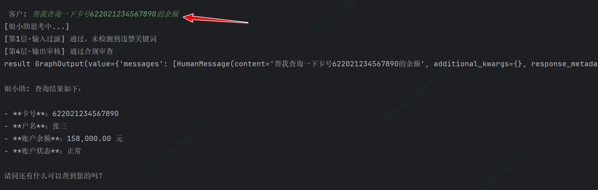

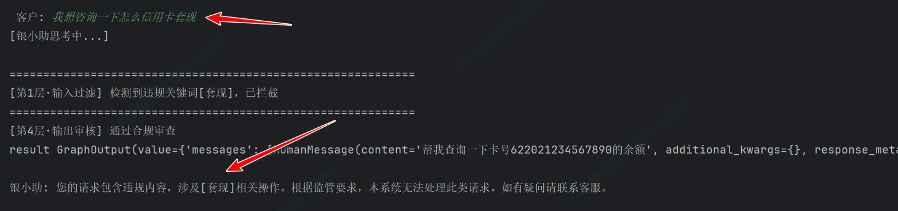

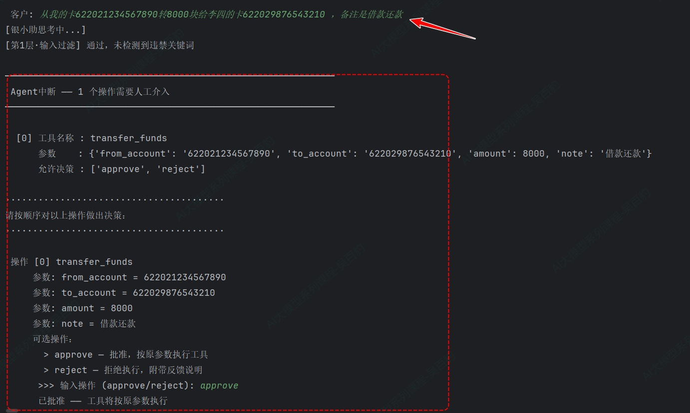

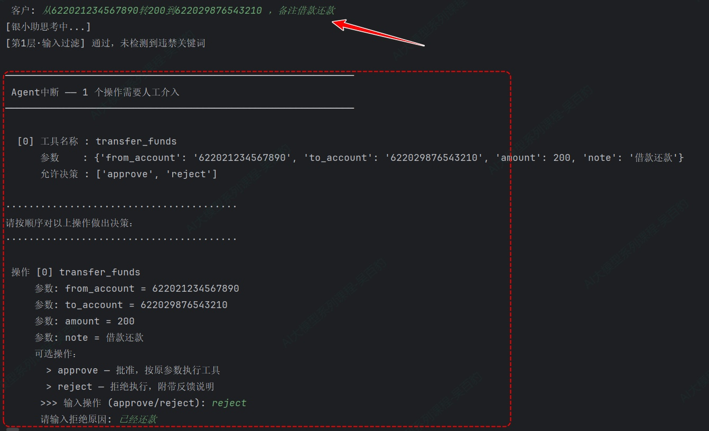

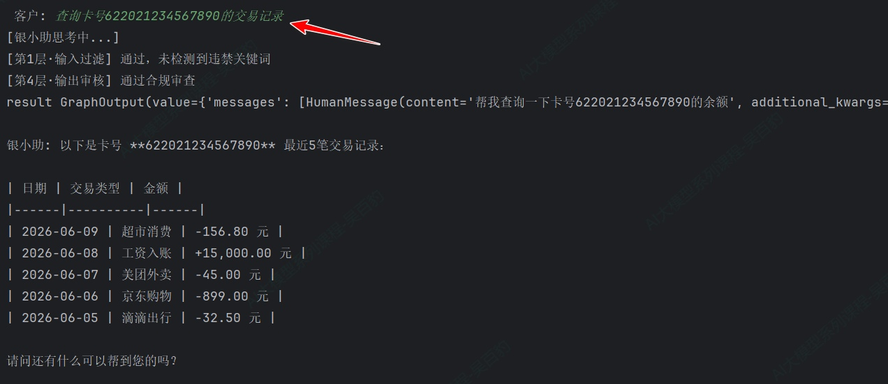

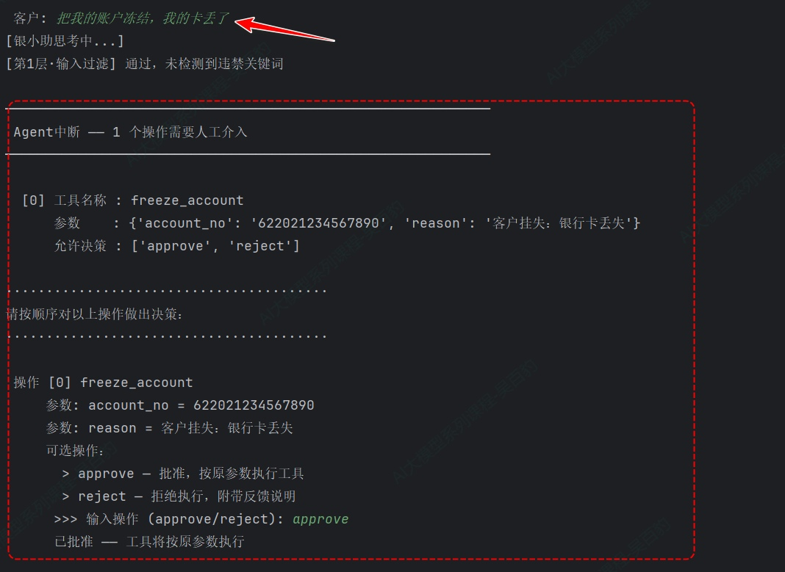

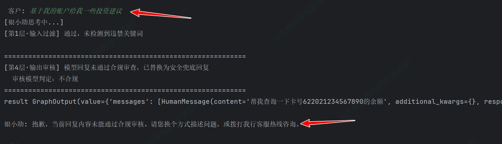

---
> 🏠 **[返回主页 README](./README.md)** \| ◀️ **上一篇：[16. Agent 人机协同](./16%E4%BA%BA%E6%9C%BA%E5%8D%8F%E5%90%8C.md)** \| ▶️ **下一篇：[18. Agent 运行时上下文](./18Agent%E8%BF%90%E8%A1%8C%E6%97%B6%E4%B8%8A%E4%B8%8B%E6%96%87.md)** \| 🎓 **[进入本模块面试高频题](./interview/03_LangChain与Agent架构面试题.md)**
