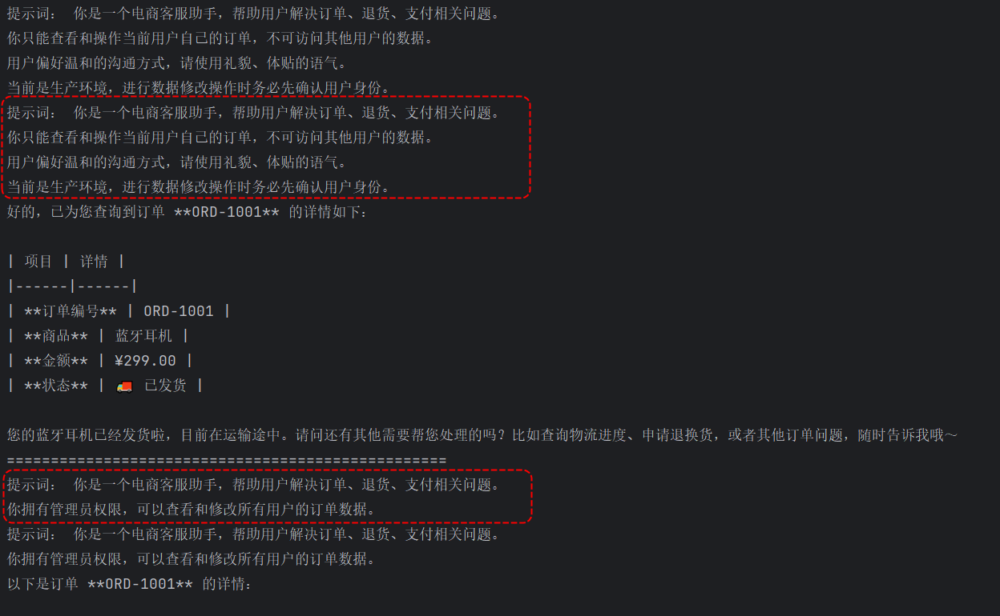
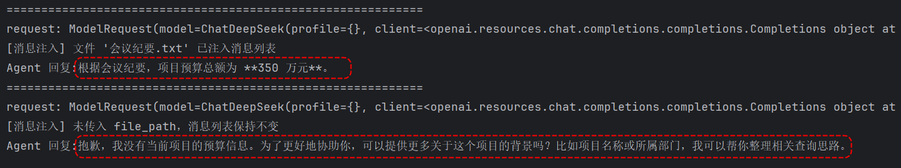
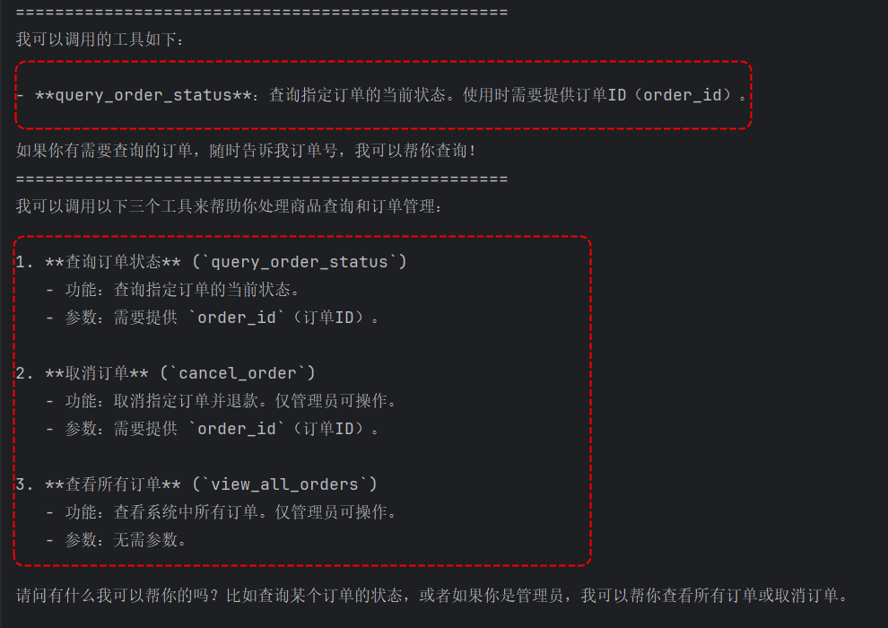

> 📌 **[AI 大模型与云原生全栈知识库](./README.md)** / **模块五：Agent 核心机制与高级架构**
> 🏠 [返回主页 README](./README.md) \| ⚡ [面试 30 分钟速记](./interview/00_面试冲刺30分钟速记卡片.md) \| 🎓 [本模块面试题](./interview/03_LangChain与Agent架构面试题.md)

---

# 8\. **Runtime运行时与Agent 上下文**

本章首先介绍LangChain的Runtime运行时系统——它是在Agent内部传递上下文的"管道"和"载体"。理解了Runtime之后，再展开Context Engineering上下文工程的具体实践，涵盖模型上下文、工具上下文、生命周期上下文三大类型，以及它们如何在 Runtime、State、Store 三种数据源上运作。

## 8.1. **Runtime 运行时**

LangChain的create\_agent底层运行在LangGraph的Runtime之上。当你创建一个Agent并调用它时，LangGraph会为这次调用创建一个Runtime对象，它将贯穿整个 Agent 生命周期的各个环节。

Runtime 对象承载了以下几类信息：

| **组件**           | **类型** | **说明**                                          |
| ------------------------ | -------------- | ------------------------------------------------------- |
| **Context**        | 静态配置       | 用户ID、数据库连接、API密钥等每次调用传入的依赖项       |
| **Store**          | 长期记忆       | BaseStore 实例，用于跨会话持久化用户偏好、历史数据      |
| **Stream Writer**  | 流式输出       | 用于通过"custom" 流模式向客户端推送自定义信息           |
| **Execution Info** | 执行身份       | 当前执行的线程ID、运行 ID、重试次数等信息               |
| **Server Info**    | 服务端元数据   | 在LangGraph Server上运行时携带 Assistant ID、认证用户等 |

在 LangGraph Server 上运行时携带 Assistant ID、认证用户等

Runtime本质上是一种依赖注入（Dependency Injection）机制,会在调用时将这些依赖注入到工具和中间件中，使代码更可测试、更可复用。

### **8.1.1. 定义和传递Context**

在创建Agent时，通过context\_schema参数定义上下文的类型结构。调用Agent时，通过context参数传入具体的上下文实例。

如下案例演示调用Agent时通过context参数传入上下文内容：

```python
from dataclasses import dataclass

from langchain.agents import create_agent
from langchain.tools import tool, ToolRuntime

from init_llm import deepseek_llm


# 第一步：定义上下文的类型结构
@dataclass
class Context:
    """每次 Agent 调用时传入的静态配置信息"""
    user_name: str
    user_role: str          # 用户角色，如 "admin" / "viewer"


# 第二步：定义工具（模拟订单查询和用户信息获取）
@tool
def query_my_orders(runtime: ToolRuntime[Context]) -> str:
    """查询当前用户的订单列表。当用户想了解自己的订单状态时使用此工具。"""
    user_name = runtime.context.user_name
    print(f"[工具内部] 查询用户 {user_name} 的订单...")
    # 模拟数据库查询
    return f"用户 {user_name} 的订单：ORD-1001（已发货）、ORD-1002（待付款）"


@tool
def get_user_profile(runtime: ToolRuntime[Context]) -> str:
    """获取当前用户的个人档案信息，包括会员等级和积分。"""
    user_name = runtime.context.user_name
    user_role = runtime.context.user_role
    return f"用户名：{user_name}，角色：{user_role}，会员等级：VIP，积分：1280"


# 第三步：创建 Agent 时声明 context_schema
agent = create_agent(
    model=deepseek_llm,
    tools=[query_my_orders, get_user_profile],
    context_schema=Context,  # 声明该 Agent 期望接收的上下文类型
    system_prompt="你是一个电商客服助手，帮助用户查询订单和个人信息。",
)


# 第四步：调用 Agent 时传入实际的上下文数据
result = agent.invoke(
    {"messages": [{"role": "user", "content": "帮我查一下我的订单状态"}]},
    context=Context(
        user_name="张三",
        user_role="customer",
    ),
)
print(result["messages"][-1].content)

print("=" * 50)
result2 = agent.invoke(
    {"messages": [{"role": "user", "content": "查看我的个人档案"}]},
    context=Context(
        user_name="李四",
        user_role="admin",
    ),
)
print(result2["messages"][-1].content)
```

以上代码注意：

1) 代码中是通过Python的dataclass进行定义上下文对象，Dataclass是Python 3.7引入的一个装饰器，用于简化数据存储类的定义。也可以使用Pydantic 模型来定义，Pydantic使用 Python 的 Pydantic 库定义强类型数据模型,支持复杂嵌套结构。还可以直接传入dict这种K,V格式的数据作为context。
2) 在create\_agent中使用context\_schema参数来指定Context定义的类型，如果context是dict类型可以省略该参数。
3) 同一个Agent实例可以在不同调用中传入不同的 Context，这在多租户场景中（每个用户有不同的参数、权限等）十分关键。
4) Context 的内容在一次调用内是稳定的，不应被 Agent 在执行过程中修改——它是只读的静态配置。

### **8.1.2. 在工具内部访问Runtime**

在工具中访问Runtime，通过在函数签名中声明ToolRuntime类型参数实现。

如下案例模拟电商客服系统中根据客服偏好编写邮件并发送。

```python
from dataclasses import dataclass

from langchain.agents import create_agent
from langchain.tools import tool, ToolRuntime
from langgraph.store.memory import InMemoryStore

from init_llm import deepseek_llm


# 定义上下文类型
@dataclass
class Context:
    """每次 Agent 调用时传入的用户相关信息"""
    user_id: str
    user_name: str


# 定义工具：在签名中使用 ToolRuntime[Context] 来注入 Runtime
@tool
def fetch_user_preferences(runtime: ToolRuntime[Context]) -> str:
    """获取当前用户的邮件偏好设置（来自长期记忆 Store）。

    当需要了解用户希望在邮件中使用什么语气、什么格式时调用此工具。
    """
    user_id = runtime.context.user_id

    # 尝试从 Store（长期记忆）中读取已有偏好
    if runtime.store is not None:
        memory = runtime.store.get(("email_preferences",), user_id)
        if memory is not None:
            prefs = memory.value
            return (
                f"用户 {runtime.context.user_name} 的邮件偏好："
                f"语气={prefs.get('tone', '专业')}，"
                f"签名格式={prefs.get('signature', '标准')}"
            )

    # 如果 Store 中没有记录，返回默认偏好
    return f"用户 {runtime.context.user_name} 暂无特殊偏好，使用默认设置（专业语气，标准签名）"


@tool
def send_email(
    email_content: str,
    runtime: ToolRuntime[Context],
) -> str:
    """向全部用户发送邮件

    Args:
        email_content: 邮件的正文内容
    """
    user = runtime.context.user_name
    print(f"邮件内容：{email_content}")
    # 在真实场景中，这里会调用邮件服务的 API
    return f"客服 {user} 已向全部用户发送邮件，内容：{email_content}"


# 初始化 Store，预置一些用户偏好数据
store = InMemoryStore()
store.put(("email_preferences",), "user_001", {
    "tone": "亲切",
    "signature": "此致敬礼，客服小张",
})

# 创建 Agent
agent = create_agent(
    model=deepseek_llm,
    tools=[fetch_user_preferences, send_email],
    context_schema=Context,
    store=store,
    system_prompt="你是一个电商客服助手，可以调用fetch_user_preferences工具获取用户邮件偏好设置，"
                  "并使用send_email工具向全部用户发送邮件。",
)

# 调用 Agent：传入具体的上下文
result = agent.invoke(
    {"messages": [{
        "role": "user",
        "content": "查看我的邮件偏好设置，然后给所有用户发送感谢邮件。",
    }]},
    context=Context(user_id="user_001", user_name="客服张三"),
)

print(result)
print(result["messages"][-1].content)
```

以上代码注意：

1) 代码中在工具中“runtime.context”获取Context配置，通过“[runtime.store](http://runtime.store)”获取长期记忆。
2) ToolRuntime\[Context\]的泛型参数Context对应了create\_agent中 context\_schema声明的类型，这使得类型检查器（如 mypy/pyright）能够在开发阶段就捕获潜在的类型错误。

### **8.1.3. 在中间件内部访问Runtime**

除了在工具中，Runtime同样可以在中间件（Middleware）中访问。如下示例中通过“dynamic\_prompt”中间件根据传入的不同Context来使用不同提示词，同时在“before\_model”/“after\_model”中间件中获取runtime。

```python
from dataclasses import dataclass

from langchain.agents import create_agent, AgentState
from langchain.agents.middleware import (
    dynamic_prompt,
    before_model,
    after_model,
    ModelRequest,
)
from langgraph.runtime import Runtime
from langchain.tools import tool

from init_llm import deepseek_llm


@dataclass
class Context:
    """每次调用的上下文信息"""
    user_name: str
    user_role: str  # "admin" | "customer"


# 简单工具：根据关键词查询常见问题解答
@tool
def query_faq(keyword: str) -> str:
    """根据关键词查询常见问题解答。"""
    faq = {
        "退货": "支持7天无理由退货，商品需完好且包装齐全。",
        "发货": "下单后48小时内发货。",
    }

    # 遍历 faq 每个key，判断每个key 是否 contain 包含 keyword
    for key in faq.keys():
        if keyword in key:
            return faq.get(key)

    return f"未找到关于'{keyword}'的FAQ条目"


# 动态系统提示词：根据用户角色和姓名定制提示
@dynamic_prompt
def dynamic_system_prompt(request: ModelRequest) -> str:
    """每次模型调用前，根据 Runtime Context 动态生成系统提示词"""
    ctx = request.runtime.context
    base_prompt = f"你是一个乐于助人的客服助手。当前在为用户 {ctx.user_name} 服务。"

    if ctx.user_role == "admin":
        base_prompt += " 你拥有管理员权限，可以查看和修改所有数据。"
    elif ctx.user_role == "customer":
        base_prompt += " 你可以帮用户查询订单、申请退款、修改收货地址。"
    else:
        base_prompt += " 你仅有只读权限，不能执行修改操作。"

    return base_prompt


# 模型调用前钩子：记录请求日志
@before_model
def log_before_model(state: AgentState, runtime: Runtime[Context]) -> dict | None:
    """每次调用模型前记录日志，包含用户信息和线程标识"""
    user_name = runtime.context.user_name
    print(f"[Agent日志] 用户={user_name}，开始调用模型...")
    return None  # 返回 None 表示不修改 State


# 模型调用后钩子：记录完成日志
@after_model
def log_after_model(state: AgentState, runtime: Runtime[Context]) -> dict | None:
    """每次模型调用完成后记录日志"""
    user_name = runtime.context.user_name
    print(f"[Agent日志] 用户={user_name}的模型调用已完成")
    return None


agent = create_agent(
    model=deepseek_llm,
    tools=[query_faq],
    middleware=[dynamic_system_prompt, log_before_model, log_after_model],
    context_schema=Context,
    system_prompt="",
)


result = agent.invoke(
    {"messages": [{"role": "user", "content": "你好！我想了解一下退货政策"}]},
    context=Context(user_name="张三", user_role="customer"),
)
print("result",result)
print(result["messages"][-1].content)

print("=" * 50)

result2 = agent.invoke(
    {"messages": [{"role": "user", "content": "你好！我想了解一下退货政策"}]},
    context=Context(user_name="李四", user_role="admin"),
)
print("result2",result2)
print(result2["messages"][-1].content)

```

以上代码注意：

1) @dynamic\_prompt是最常用的中间件之一，允许根据每次调用的Runtime上下文动态构造系统提示词，实现"千人千面"的Agent行为。
2) @before\_model和@after\_model中间件可以直接接收Runtime作为参数，它们常用于日志、审计、权限校验等横切关注点。两个中间件的参数第一个是State，第二个是Runtime。
3) @before\_model和@after\_model中间件返回None表示不修改 State，返回dict则会合并到当前 State 中。

### **8.1.4. 执行信息与服务端信息**

Runtime中还包含两个高级组件：

* Execution Info（执行信息）：包含当前执行的task\_id（任务ID）、thread\_id（session会话ID）、run\_id（运行 ID）等信息，这些信息在日志追踪、错误排查和多轮对话管理中非常实用。
* Server Info（服务端信息）：仅在Agent部署到LangGraph Server后可用，包含assistant\_id（Assistant ID）、graph\_id（图 ID）、以及user（认证用户信息，如 user.identity），在本地开发环境中，runtime.server\_info的值为None。

```python
from dataclasses import dataclass

from langchain.agents import create_agent, AgentState
from langchain.agents.middleware import before_model
from langgraph.runtime import Runtime
from langchain.tools import tool

from init_llm import deepseek_llm


@dataclass
class Context:
    user_name: str


# 获取当前系统时间工具
@tool
def get_current_time() -> str:
    """获取当前系统时间。当用户询问时间时使用。"""
    from datetime import datetime
    return f"当前时间：{datetime.now().strftime('%Y-%m-%d %H:%M:%S')}"


@before_model
def auth_gate(state: AgentState, runtime: Runtime ) -> dict | None:
    server_info = runtime.server_info
    exec_info = runtime.execution_info

    print("server_info",server_info)
    print("exec_info",exec_info)

    return None


agent = create_agent(
    model=deepseek_llm,
    tools=[get_current_time],
    middleware=[auth_gate],
    context_schema=Context,
    system_prompt="你是一个助手，可以帮助用户查询时间。",
)

print("=" * 50)
config = {"configurable": {"thread_id": "123"}}
result = agent.invoke(
    {"messages": [{"role": "user", "content": "现在几点了？"}]},
    context=Context(user_name="张三"),
    config=config,
)
print(result["messages"][-1].content)
```

以上代码运行的exec_info结果如下：

```python
server_info None

exec_info ExecutionInfo(
	checkpoint_id='1f1738c2-d5d7-61a5-8000-0ff58c76514f', 
	checkpoint_ns='auth_gate.before_model:9ef78a83-1a41-de4e-294b-5a5e0c9e9821', 
	task_id='9ef78a83-1a41-de4e-294b-5a5e0c9e9821', 
	thread_id='123', 
	run_id=None, 
	node_attempt=1, 
	node_first_attempt_time=1782718131.8912737
)
```

注意：版本要求：runtime.execution\_info和runtime.server\_info需要deepagents>=0.5.0或langgraph>=1.1.5。

## 8.2. **上下文工程（Context Engineering）**

LangChain将Agent的上下文分为三个层面，每个层面控制Agent循环中的不同环节：

| **上下文类型**                 | **控制的内容**                                                                           |
| ------------------------------------ | ---------------------------------------------------------------------------------------------- |
| 模型上下文（Model Context）          | 每次模型调用中，LLM看到什么样的提示词、消息历史、工具列表和输出格式                            |
| 工具上下文（Tool Context）           | 工具能访问哪些数据（读取），工具又会产出什么结果（写入）                                       |
| 生命周期上下文（Life-cycle Context） | 在模型调用和工具执行之间，做什么额外的处理（摘要、安全护栏、日志记录等），主要涉及中间件调用。 |

三种上下文注意点：模型上下文的所有变更（如临时裁剪消息列表、动态替换提示词、动态替换工具集）只影响当次模型调用，不会写入 State。而工具上下文和生命周期上下文所做的修改（如工具写入状态、摘要中间件替换历史消息）是会涉及到state保存的，后续所有的Agent步骤都能看到这些变更。

这些上下文的数据来源有三种：

| **数据源** | **别名** | **作用域** | **典型用途**                           |
| ---------------- | -------------- | ---------------- | -------------------------------------------- |
| Runtime Context  | 静态配置       | 会话级           | 用户ID、API 密钥、数据库连接、权限、环境变量 |
| State            | 短期记忆       | 会话级           | 当前消息列表、工具执行结果等                 |
| Store            | 长期记忆       | 跨会话           | 用户偏好、历史洞察、长期学习的信息           |

总结：上下文工程核心任务就是**在Agent循环的每个环节，决定从哪个数据源读取什么信息，以什么格式提供给模型或工具，并在何时将结果回写到哪个数据源。**

### **8.2.1. 模型上下文（Model Context）**

模型上下文是上下文工程中最直接、也最常用的一类。它控制 LLM"看到"什么。共有五个维度可以调控：系统提示词、消息列表、工具选择、模型选择、输出格式。

#### **8.2.1.1. 系统提示词（System Prompt）**

系统提示词决定了Agent的行为基调。不同用户、不同权限、不同业务场景需要不同的指令。

以下代码示例展示了如何根据State中的对话长度、Store中的用户偏好、以及Runtime Context中的角色信息，动态生成系统提示词。

```python
from dataclasses import dataclass

from langchain.agents import create_agent
from langchain.agents.middleware import dynamic_prompt, ModelRequest
from langgraph.store.memory import InMemoryStore
from langchain.tools import tool

from init_llm import deepseek_llm


@dataclass
class Context:
    """用户上下文"""
    user_id: str
    user_role: str          # admin(管理员） / customer（客户）
    deployment_env: str     # production（生产环境） / staging（测试环境） / development（开发环境）


# 订单查询工具
@tool
def query_order(order_id: str) -> str:
    """根据订单ID查询订单详情。"""
    orders = {
        "ORD-1001": "蓝牙耳机（¥299），状态：已发货",
        "ORD-1002": "手机壳（¥39），状态：已签收",
    }
    return orders.get(order_id, f"未找到订单 {order_id}")


@dynamic_prompt
def context_dynamic_prompt(request: ModelRequest) -> str:
    """结合 State、Store、Runtime Context 三个数据源动态生成提示词"""

    # 从 State 中读取：当前消息数量
    message_count = len(request.messages)

    # 从 Store 中读取：用户偏好
    store = request.runtime.store
    user_prefs = None
    if store is not None:
        user_prefs = store.get(("preferences",), request.runtime.context.user_id)

    # 从 Runtime Context 中读取：用户角色和环境
    user_role = request.runtime.context.user_role
    env = request.runtime.context.deployment_env

    # 构造基础提示词
    base = "你是一个电商客服助手，帮助用户解决订单、退货、支付相关问题。"

    # 根据用户角色添加权限提示
    if user_role == "admin":
        base += "\n你拥有管理员权限，可以查看和修改所有用户的订单数据。"
    elif user_role == "customer":
        base += "\n你只能查看和操作当前用户自己的订单，不可访问其他用户的数据。"
    else:
        base += "\n你只有只读权限，不能修改任何数据。如果用户要求修改，请告知需要管理员权限。"

    # 根据对话长度调整回复风格
    if message_count > 20:
        base += "\n当前对话较长，请保持回复简洁，直接给出结论。"

    # 根据用户偏好调整语气
    if user_prefs and user_prefs.value.get("communication_style") == "温和":
        base += "\n用户偏好温和的沟通方式，请使用礼貌、体贴的语气。"

    # 根据部署环境添加注意事项
    if env == "production":
        base += "\n当前是生产环境，进行数据修改操作时务必先确认用户身份。"

    print("提示词：", base)
    return base


# 初始化 Store 并预置偏好
store = InMemoryStore()
store.put(("preferences",), "user_001", {"communication_style": "温和"})

agent = create_agent(
    model=deepseek_llm,
    tools=[query_order],
    middleware=[context_dynamic_prompt],
    context_schema=Context,
    store=store,
)

# 场景：温和偏好用户（user_001）在生产环境下查订单
result = agent.invoke(
    {"messages": [{"role": "user", "content": "你好，我想查一下订单 ORD-1001"}]},
    context=Context(user_id="user_001", user_role="customer", deployment_env="production"),
)
print(result["messages"][-1].content)


print("=" * 50)
# 场景：管理员在开发环境下查订单（无特殊语气偏好）
result2 = agent.invoke(
    {"messages": [{"role": "user", "content": "你好，我想查一下订单 ORD-1001"}]},
    context=Context(user_id="admin_001", user_role="admin", deployment_env="development"),
)
print(result2["messages"][-1].content)
```

以上代码不同的用户提示词不同：



#### **8.2.1.2. 消息列表（Messages）**

消息列表是LLM每次调用时接收的完整对话历史。如何管理消息内容——尤其在长对话中——直接影响模型的理解质量和响应能力。

如下代码中演示在正常对话过程中如何在消息列表中插入额外一些信息作为对话上下文，同样，我们也可以通过中间件进行消息裁剪、压缩摘要操作。

```python
import os
from dataclasses import dataclass
from typing import Callable

from langchain.agents import create_agent
from langchain.agents.middleware import wrap_model_call, ModelRequest, ModelResponse

from init_llm import deepseek_llm

@dataclass
class Context:
    """每次调用时传入的静态配置"""
    user_name: str
    file_path: str = ""  # 要加载的文件路径，为空表示不加载任何文件


@wrap_model_call
def inject_file_to_messages(
    request: ModelRequest,
    handler: Callable[[ModelRequest], ModelResponse],
) -> ModelResponse:
    """在模型调用前，根据 Context 中的 file_path 读取文件，注入到消息列表。
    注意点：
    - 文件路径来自 Runtime Context（静态配置，每次调用可不同）。
    - 文件内容在模型调用前被动态读取，拼装为自然语言后注入消息列表。
    - 下次模型调用时，如果 Context 中仍有 file_path，中间件会重新读取并注入。
    """
    print("request:", request)
    file_path = request.runtime.context.file_path

    if not file_path:
        # 没有传入文件路径，原样放行
        print("[消息注入] 未传入 file_path，消息列表保持不变")
        return handler(request)

    # 读取文件内容
    if not os.path.exists(file_path):
        error_msg = f"警告：文件不存在 —— {file_path}"
        messages = list(request.messages) + [{"role": "system", "content": error_msg}]
        request = request.override(messages=messages)
        return handler(request)

    try:
        with open(file_path, "r", encoding="utf-8") as f:
            content = f.read()
    except UnicodeDecodeError:
        try:
            with open(file_path, "r", encoding="gbk") as f:
                content = f.read()
        except Exception:
            error_msg = f"警告：无法解码文件 {file_path}"
            messages = list(request.messages) + [{"role": "system", "content": error_msg}]
            request = request.override(messages=messages)
            return handler(request)

    file_name = os.path.basename(file_path)

    # 构造注入文本
    injected = (
        f"以下是从文件 '{file_name}' 中读取的内容：\n"
        f"========== 文件开始 ==========\n"
        f"{content}\n"
        f"========== 文件结束 ==========\n\n"
        f"请严格基于以上文件内容回答用户的问题。"
        f"如果文件中有明确信息，请直接引用；如果没有，请如实告知。"
    )

    # 注入消息：将文件内容通过“用户消息”追加到消息列表末尾
    messages = list(request.messages) + [{"role": "user", "content": injected}]
    request = request.override(messages=messages)

    print(f"[消息注入] 文件 '{file_name}' 已注入消息列表")

    return handler(request)

agent = create_agent(
    model=deepseek_llm,
    tools=[],
    middleware=[inject_file_to_messages],
    context_schema=Context,
    system_prompt="你是一个助手，可以回答用户问题。",
)

doc_path = os.path.join(
    # 获取当前脚本所在目录
    os.path.dirname(os.path.abspath(__file__)),
    "会议纪要.txt",
)

print("=" * 60)


result1 = agent.invoke(
    {"messages": [{
        "role": "user",
        "content": "项目总预算是多少？"
    }]},
    context=Context(
        user_name="张三",
        file_path=doc_path,
    ),
)
print(f"Agent 回复:{result1['messages'][-1].content}")


print("=" * 60)


result2 = agent.invoke(
    {"messages": [{
        "role": "user",
        "content": "项目总预算是多少？"
    }]},
    context=Context(
        user_name="李四",
    ),
)
print(f"Agent 回复:{result2['messages'][-1].content}")

```

以上代码所需要的“会议纪要.txt”内容如下，将该文件放在代码所在的目录即可：

关于"星云计划"项目的内部会议纪要

```python
关于"星云计划"项目的内部会议纪要

会议时间：周一下午 14:00-15:30
会议地点：创新大厦 12 楼会议室 A
参会人员：张总（项目发起人）、李工（技术负责人）、王经理（市场部）、赵会计（财务部）
记录人：小明

一、项目背景
星云计划是一个面向中小企业的 SaaS 化库存管理系统，目标是帮助中小型零售企业在 3 个月内实现库存周转率提升 30%。项目预算总额为 350 万元，其中研发投入 200 万，市场推广 100 万，运营维护 50 万。

二、当前进展
1. 技术层面：李工汇报核心模块开发已完成 80%，但"智能补货算法"模块仍有 bug，预计还需 2 周修复。该模块的准确率目前只有 72%，目标是达到 90% 以上。
2. 市场层面：王经理反馈已有 23 家意向客户签署了试用协议，分布在食品零售（12家）、服装零售（7家）、数码配件（4家）三个细分赛道。
3. 财务层面：赵会计提醒当前已支出 185 万元，其中研发支出 120 万（超出预算 20 万，李工解释是因为临时加购了两台 GPU 服务器用于算法训练），市场支出 45 万，行政支出 20 万。

三、争议焦点
赵会计与李工就研发超支问题产生了较大分歧。赵会计认为 GPU 服务器的采购没有提前报批，属于违规支出。李工则认为补货算法的训练确实需要额外算力，没有 GPU 服务器项目无法按期交付。张总暂未做最终裁决，要求双方会后各自提交书面说明。

四、下一步计划
1. 李工需提交 GPU 服务器采购的详细说明和算法进展报告。
2. 王经理需完成第二批客户邀约（目标 50 家）。
3. 全员定于下月召开第二次项目评审会，届时决定是否继续追加预算。
4. 赵会计负责整理目前已签约客户的回款计划表。

```

代码运行结果如下：



#### **8.2.1.3. 工具选择（Tools）**

工具太多会压垮模型（上下文过载导致错误增加），工具太少则功能不足。动态工具选择让Agent根据当前用户状态、权限、对话阶段等条件，灵活调整可选工具集。

如下案例是一个电商场景中根据用户角色和认证状态过滤工具。

```python
from dataclasses import dataclass
from typing import Callable

from langchain.agents import create_agent
from langchain.agents.middleware import wrap_model_call, ModelRequest, ModelResponse
from langchain.tools import tool, ToolRuntime

from init_llm import deepseek_llm


@dataclass
class Context:
    user_role: str  # admin / customer


# ========== 全量工具定义 ==========

@tool
def query_order_status(order_id: str, runtime: ToolRuntime[Context]) -> str:
    """查询指定订单的当前状态。"""
    return f"订单 {order_id} 的状态：已发货，查询人角色：{runtime.context.user_role}"


@tool
def cancel_order(order_id: str, runtime: ToolRuntime[Context]) -> str:
    """取消指定订单并退款。仅管理员可操作。"""
    return f"订单 {order_id} 已取消，退款已处理。操作人角色：{runtime.context.user_role}"


@tool
def view_all_orders(runtime: ToolRuntime[Context]) -> str:
    """查看系统中所有订单。仅管理员可操作。"""
    return f"系统订单总数：1250 笔，查询人角色：{runtime.context.user_role}"


# ========== 动态工具过滤中间件 ==========

@wrap_model_call
def role_based_tool_filter(
    request: ModelRequest,
    handler: Callable[[ModelRequest], ModelResponse],
) -> ModelResponse:
    """根据用户角色动态过滤工具列表。

    注意：
    - 所有工具在 create_agent 中全量注册（Agent 知道每个工具怎么执行）。
    - 中间件根据角色裁剪 request.tools，控制模型实际"看到"哪些工具。
    - 管理员看到 3 个工具，普通用户只看到 1 个 → 减少上下文 Token 占用。
    """
    user_role = request.runtime.context.user_role

    if user_role == "admin":
        # 管理员：保留全部工具，不做过滤
        pass
    else:
        # 普通用户：只保留 query_order_status，过滤掉管理员专用工具
        allowed = {"query_order_status"}
        filtered = [t for t in request.tools if t.name in allowed]
        request = request.override(tools=filtered)

    return handler(request)


if __name__ == "__main__":
    # 全量注册所有工具，中间件负责运行时裁剪
    agent = create_agent(
        model=deepseek_llm,
        tools=[query_order_status, cancel_order, view_all_orders],  # 全量注册
        middleware=[role_based_tool_filter],                        # 运行时过滤
        context_schema=Context,
        system_prompt="你是一个电商客服助手，帮助用户处理商品查询和订单管理。",
    )

    print("=" * 50)
    result = agent.invoke(
        {"messages": [{"role": "user", "content": "你可以调用的工具有哪些？"}]},
        context=Context(user_role="customer"),
    )
    print(result["messages"][-1].content)


    print("=" * 50)
    result2 = agent.invoke(
        {"messages": [{"role": "user", "content": "你可以调用的工具有哪些？"}]},
        context=Context(user_role="admin"),
    )
    print(result2["messages"][-1].content)

```

以上代码运行结果如下：



以上代码中需要特别注意：create\_agent中需要传入全部工具，这里传入工具只是注册工具，即使用到对应工具的时候知道调用什么函数，并不会将工具加载到模型上下文中，当真正执行到“handler(request)”会将工具加入到模型上下文中。但是不能不注册工具直接在“@wrap\_model\_call”中间件中设置对应工具，这样不注册的工具会导致Agent不知道如何调用这些工具从而报错。

#### **8.2.1.4. 模型选择（Model）**

不同的模型有不同的能力、成本和上下文窗口。在长对话中切换到更大上下文的模型、为高级用户使用更高能力的模型——这些都可以通过中间件动态决策。具体可以通过“@wrap\_model\_call”中间件根据会话长度或者传入的不同特征进行模型替换。

具体案例可以参考3.1.2.2小节。

### **8.2.2. 工具上下文（Tool Context）**

工具可以从 State、Store 和 Runtime Context 中读取信息，还能通过 Command 对象将执行结果写入 State（短期记忆）或 Store（长期记忆）。

工具中读取context、读写state&store示例伪代码如下：

```python
... ...
# 一个工具，展示三种数据源的读写
@tool
def my_tool(
    runtime: ToolRuntime[Context],
) -> Command:
    """演示：在单个工具中同时访问 Runtime Context、State 和 Store。"""

    # ① 读取 Runtime Context —— 静态配置，调用时注入
    user_id = runtime.context.user_id            # 读
    db = runtime.context.db_connection           # 读
    # context 是只读的，不能写

    # ② 读取/写入 State —— 短期记忆，会话内有效
    previous_action = runtime.state.get("last_action", "无")  # 读
    # 通过 Command 写入 State
    return Command(update={
        "last_action": f"用户 {user_id} 在 {db} 上执行了操作",  # 写
        "notification_flag": True,                              # 写
    })

    # ③ 读取/写入 Store —— 长期记忆，跨会话持久化
    if runtime.store:
        old = runtime.store.get(("user_prefs",), user_id)       # 读
        runtime.store.put(("user_prefs",), user_id, {"lang": "zh"})  # 写
... ...
```

以上伪代码注意如下几点：

1) Command(update={...})是LangGraph中更新State的标准方式。工具返回Command而非纯文本时，LangGraph会将update字典合并到当前State中。
2) Store的put操作是跨会话持久化的——即使对话结束、下次用户再发起新的对话，之前保存的偏好数据仍然可以通过store.get取出。

具体案例参考“短期记忆和长期记忆”章节。

### **8.2.3. 生命周期上下文（Life-cycle Context）**

生命周期上下文控制的是Agent循环中"步骤之间的行为"——在模型调用前做什么、工具执行后做什么、以及何时触发额外的处理逻辑。中间件是实现生命周期上下文的核心机制。

对话摘要（Summarization）是最经典的生命周期上下文场景。当对话历史过长时，自动将早期消息压缩为摘要，既能节省Token成本，又能让模型保持对全局对话的理解。

使用示例伪代码如下：

```python
... ...
# 内置的 SummarizationMiddleware 自动处理对话摘要
agent = create_agent(
    model="gpt-4o",
    tools=[],
    middleware=[
        SummarizationMiddleware(
            model="gpt-4o-mini",           # 使用更便宜的模型做摘要
            trigger={"tokens": 4000},       # 对话总 token 超过 4000 时触发
            keep={"messages": 20},          # 保留最近 20 条消息不变
        ),
    ],
    system_prompt="你是一个客服助手。",
)
... ...
```

---
> 🏠 **[返回主页 README](./README.md)** \| ◀️ **上一篇：[17. Guardrails 安全护栏](./17Guardrails%E5%AE%89%E5%85%A8%E6%8A%A4%E6%A0%8F.md)** \| ▶️ **下一篇：[19. MCP 模型上下文协议](./19MCP%E6%A8%A1%E5%9E%8B%E4%B8%8A%E4%B8%8B%E6%96%87%E5%8D%8F%E8%AE%AE.md)** \| 🎓 **[进入本模块面试高频题](./interview/03_LangChain与Agent架构面试题.md)**
