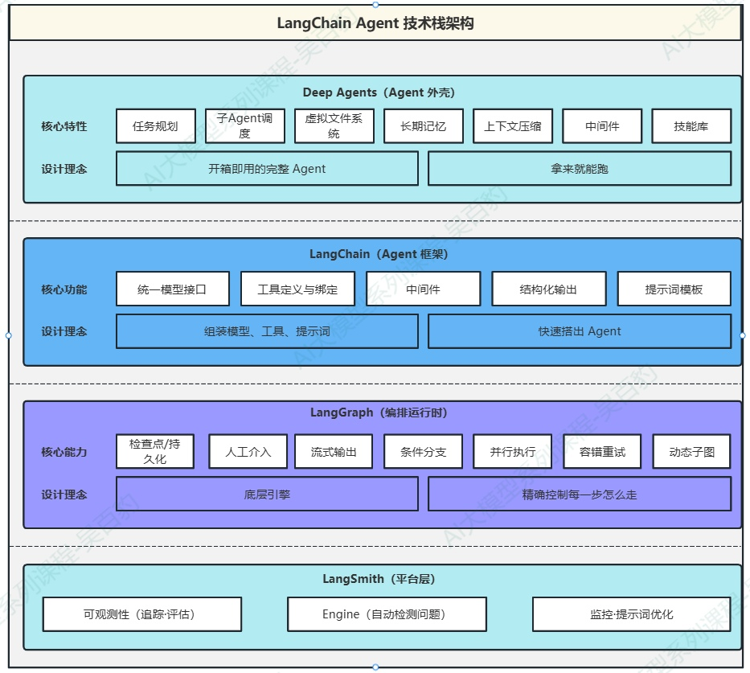
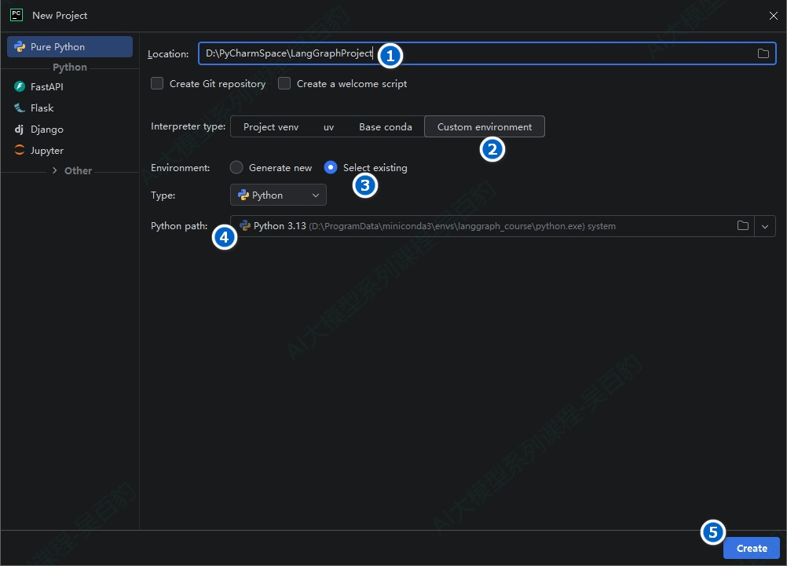
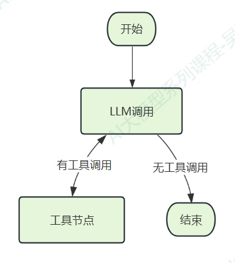

> 📌 **[AI 大模型与云原生全栈知识库](./README.md)** / **模块六：LangGraph 复杂 Workflow 与图状态网络**
> 🏠 [返回主页 README](./README.md) \| ⚡ [面试 30 分钟速记](./interview/00_面试冲刺30分钟速记卡片.md) \| 🎓 [本模块面试题](./interview/04_LangGraph高级工作流面试题.md)

---

# 1\. **LangGraph快速入门**

## 1.1. **LangGraph介绍**

LangGraph 是一个低层级的编排框架（orchestration framework）和运行时（runtime），由 LangChain 团队开发，专注于构建、管理和部署长时间运行的有状态 Agent系统。

要理解 LangGraph 为什么诞生，需要先理解 LangChain。LangChain 是一个用于开发大语言模型（LLM）应用的开源框架，它提供了统一的模型接口、工具集成、Agent 抽象等高层能力。但开发者在使用 LangChain 的 Agent 时遇到了一个问题：现有的 Agent 抽象对执行流程的控制力不够。当 Agent 需要复杂的条件分支、并行执行、人工审批、持久化恢复等能力时，简单的"输入→推理→输出"循环就捉襟见肘了。

LangGraph 正是为了解决这个问题而诞生的。它不关心你用什么模型、什么工具——它只做一件事：编排。你可以把 LangGraph 理解为一个"图执行引擎"，开发者通过定义节点（执行步骤）和边（流转规则）来精确控制 Agent 的执行流程。

LangChain 和 LangGraph 并不是二选一的关系，而是不同层级的互补，实际开发中，最常见的方式是用 LangChain 提供模型和工具，用 LangGraph 编排流程。不过 LangGraph 也可以脱离 LangChain 独立使用——你可以用自己的方式获取模型和工具，LangGraph 只负责编排。

下图展示了 LangChain 产品栈中各产品的层次关系：



从下往上，由LangGraph（封装少，灵活性高）到DeepAgent（封装多，灵活性低）越往上越“省事”，越往下越“自由”。Deep Agents适合快速交付，标准场景；LangChain适合定制Agent，组合模型/工具场景；LangGraph适合复杂流程，需要精确控制场景。此外，LangSmith提供追踪、评估、部署Agent能力。

LangGraph文档地址如下：[https://docs.langchain.com/oss/python/langgraph/overview](https://docs.langchain.com/oss/python/langgraph/overview)

## 1.2. **LangGraph核心特点**

LangGraph 为 Agent 开发提供了五项关键的基础能力，每一项都直接解决一个生产环境中的痛点：

**1) 持久化（Persistence）**

Agent 在长期运行或多轮对话中会遇到中断——网络故障、超时、用户暂时离开。LangGraph 内置了检查点（Checkpoint）机制，Agent 的状态会在每个节点执行后被自动保存。发生故障后，Agent 可以从上一个检查点恢复，不会丢失已有进度。

**2) 人工介入（Human-in-the-loop）**

很多业务场景中，Agent 的某些决策需要人工审批。LangGraph 提供了 interrupt() 函数，可以在任意节点暂停执行，等待人类操作员的输入（批准/拒绝/修改），收到确认后再继续执行。这一机制基于持久化能力实现——暂停时状态被保存，恢复时从断点继续。

**3) 流式输出（Streaming）**

用户不希望盯着空白屏幕等待 Agent 完成全部推理。LangGraph 支持多种流式模式——可以按节点、按 Token、按状态变更来推送进度，让用户实时看到 Agent 的思考和操作过程。

**4) 全面的记忆系统（Memory）**

区分短期记忆（当前会话中的工作上下文）和长期记忆（跨会话的用户偏好和历史），两种记忆有各自不同的存储策略和访问方式。

**5) 调试与可观测性**

与 LangSmith 深度集成，可以追踪每一步执行路径、观察状态变化、获取详细的运行时指标。LangSmith Engine 还能自动检测 Agent trace 中的问题并提议修复方案。LangGraph 应用可以通过 LangSmith Deployment 部署到专为长时间运行、有状态工作流设计的可扩展基础设施上，从原型到生产不需要重写架构。

## 1.3. **环境安装与配置**

LangGraph 要求 Python 3.10+，本课程使用 Python 3.13.11，环境基于 conda 管理。

### **1.3.1. 创建python环境**

```python
# 创建名为 langgraph_course 的 conda 环境
conda create --name langgraph_course python=3.13.11

# 激活环境
conda activate langgraph_course
```

注意：如果已经有了LangChain课程配套的 conda 环境（如 langchain_study），可以复用。

### **1.3.2. 创建项目及配置**

创建好Python环境后，创建python项目并指定python环境，同时把基本的配置文件配置好。按照如下步骤进行设置。

**1) 创建python项目**

在IDEA中创建LangGraphProject项目并指定python环境为“langgraph\_course”。



**2) 安装必要依赖**

想要正常使用LangGraph还需要在该环境中安装如下依赖。

```python
# 切换conda环境
conda activate langgraph_course

#安装依赖
# LangChain（提供模型接口和工具定义）
pip install langchain==1.3.14 -i https://pypi.tuna.tsinghua.edu.cn/simple

# DeepSeek 模型集成（本课程使用的模型）
pip install langchain-deepseek==1.1.0 -i https://pypi.tuna.tsinghua.edu.cn/simple

# 环境变量管理
pip install python-dotenv==1.2.2 -i https://pypi.tuna.tsinghua.edu.cn/simple

# LangGraph 核心包
pip install langgraph==1.2.9 -i https://pypi.tuna.tsinghua.edu.cn/simple
```

注意：langchain-deepseek 是使用deepseek大模型必要依赖，dotenv是从项目根目录.env文件中加载自定义环境变量必要依赖。

**3) 创建.env文件**

在项目根目录下创建“.env”文件并写入如下内容，该文件中后续配置一些大模型的API\_KEY和BASE\_URL。

```python
DEEPSEEK_API_KEY=sk-xxxx
DEEPSEEK_BASE_URL=https://api.deepseek.com
```

**4) 创建“env\_**[**utils.py**](http://utils.py)**”文件**

该文件中通过dotenv加载并获取.env文件中配置的环境变量，后续方便在项目中使用这些环境变量配置的值。

```python
import os

from dotenv import load_dotenv

# override=True 确保.env文件优先
load_dotenv(override=True)

# 从环境变量读取配置
DEEPSEEK_API_KEY = os.getenv("DEEPSEEK_API_KEY")
DEEPSEEK_BASE_URL = os.getenv("DEEPSEEK_BASE_URL")
```

**5) 创建“init\_**[**llm.py**](http://llm.py)**”文件**

LangGraph 本身不绑定任何模型提供商。本课程使用 LangChain 的 init\_chat\_model 函数来统一初始化模型，底层对接 DeepSeek。如下，创建deepseek LLM。

```python
"""
init_chat_model 初始化聊天模型
"""
from langchain.chat_models import init_chat_model
from langchain_core.language_models import BaseChatModel


from env_utils import DEEPSEEK_API_KEY

deepseek_llm: BaseChatModel = init_chat_model(
    model="deepseek-v4-pro",
    model_provider="deepseek",
    api_key=DEEPSEEK_API_KEY,
    extra_body={
        "thinking": {"type": "disabled"}  # 关闭思考模式
    }
)

deepseek_llm_flash: BaseChatModel = init_chat_model(
    model="deepseek-v4-flash",
    model_provider="deepseek",
    api_key=DEEPSEEK_API_KEY,
    extra_body={
        "thinking": {"type": "disabled"}  # 关闭思考模式
    }
)
```

## 1.4. **Graph API 快速入门**

Graph API 是 LangGraph 提供的一种 Agent 构建方式，其设计理念是"把 Agent 的执行流程显式地定义为一张图"——需要明确地声明有哪些节点（处理步骤）、节点之间如何连接（边），以及每一步走哪个分支（条件边）。

### **1.4.1. LangGraph案例**

下面通过一个最简单的例子来理解这几个概念。先从最基础的结构开始——一个节点、两条边、一次调用。如下这个例子会让 LLM 回答一句话，虽然简单，但包含了所有 LangGraph 图的基本元素。

```python
"""
LangGraph Hello World
最简单的 LangGraph 图——一个节点、两条边、一次调用
"""
from langchain.messages import HumanMessage
from langgraph.graph import StateGraph, MessagesState, START, END

from init_llm import deepseek_llm

# 定义节点函数：调用 LLM 并返回响应
def call_model(state: MessagesState):
    """调用大模型，将返回消息追加到状态中"""
    print("state:",state)
    response = deepseek_llm.invoke(state["messages"])
    return {"messages": [response]}


# 构建图
graph_builder = StateGraph(MessagesState)
# 添加节点：call_model 节点，用于调用大模型
graph_builder.add_node("call_model", call_model)
# 添加边：从 START 节点到 call_model 节点
graph_builder.add_edge(START, "call_model")
# 添加边：从 call_model 节点到 END 节点
graph_builder.add_edge("call_model", END)
# 编译图
graph = graph_builder.compile()

# 运行
if __name__ == "__main__":
    # result = graph.invoke(
    #     {"messages": [HumanMessage(content="请用一句话介绍你自己。")]}
    # )

    result = graph.invoke(
        {"messages": [{"role": "user", "content": "请用一句话介绍你自己。"}]}
    )

    print("result:",result)

    for msg in result["messages"]:
        msg.pretty_print()
```

以上代码运行结果如下：

```python
================================ Human Message =================================

请用一句话介绍你自己。
================================== Ai Message ==================================

我是 DeepSeek，由深度求索公司创造的 AI 助手，免费为你提供智能、准确的对话服务。
```

代码中注意如下几点：

1) StateGraph是 LangGraph 的核心类，它接收一个状态模式（Schema）作为类型参数，本例中 MessagesState 是 LangGraph 内置的简化状态类型，只包含一个 messages 字段，即该LangGraph图中只有messages这一个字段。
2) add\_node 向图中注册一个节点。第一个参数是节点的字符串名称（用于后续连接边），第二个参数是对应的 Python 函数。
3) add\_edge(从哪个节点出发，走到哪个节点)是添加边。START 和 END 是两个特殊的虚拟节点。 START 表示图的入口（从哪里开始执行）， END 表示图的出口（执行完毕）。每个图都必须有从 START 出发的边；到达 END 的方式则有两种——显式添加指向 END 的边，或者在节点内部通过 Command(goto=END) 跳转（参考后续章节）。
4) compile() 将图编译为可执行对象，编译后的图才能调用invoke()。
5) “节点函数”接收当前状态，返回一个字典来表示“对状态的更新”。LangGraph 会自动将返回的字典合并到全局状态中。

### **1.4.2. MessageState和invoke理解**

#### **1.4.2.1. 关于MessageState**

上面的例子中使用了 MessagesState，该对象是 LangGraph 预置的状态类型，其作用就是存储LangGraph中的状态信息。其默认定义如下（源码langgraph/graph/[message.py](http://message.py)）：

```python
class MessagesState(TypedDict):
    messages: Annotated[list[AnyMessage], add_messages]
```

这个定义中的“messages:Annotated\[list\[AnyMessage\], add\_messages\]”告诉 LangGraph：当多个节点都向 messages 写入数据时，使用 add\_messages 函数（归并器）来合并新旧数据，而不是直接覆盖。

在 LangGraph 中，状态中的每个字段都可以指定一个归并器（Reducer），它决定了"收到新数据时如何与旧数据合并"。常用的归并器包括：

* add\_messages：LangGraph 专为消息列表设计的归并器。它不仅做追加，还支持按消息 ID 去重和更新（同 ID 的新消息会替换旧消息），并能把 dict 形式的消息自动转换为 Message 对象（{"role":"user","content":"hi"} → HumanMessage）。内置MessagesState使用的就是它。
* operator.add：Python 标准库的加法操作，对列表就是纯拼接。适合累积日志、结果列表等不需要去重语义的场景。
* 不指定归并器：新值直接覆盖旧值。适合布尔标记、当前步骤名等标量值。
* 自定义函数：根据业务需求自定义合并逻辑。

add_messages 和 operator.add 在"追加消息"这个基本行为上表现一致，但前者多了 ID 去重和格式转换能力。

```python

class MessagesState(TypedDict):
    messages: Annotated[list[AnyMessage], operator.add]
    llm_calls: int   # 额外字段：记录 LLM 调用次数，未指定归并器 → 覆盖语义
```

注意这里的 llm\_calls 字段：它没有指定归并器，因此每次节点返回新值时直接覆盖旧值。一个状态中可以同时混用不同归并策略的字段——消息用追加，计数器用覆盖。

#### **1.4.2.2. 关于graph.invoke**

构建好graph后，最后调用graph时执行“graph.invoke(...)”,invoke() 传的永远是图的初始状态，状态长什么样取决于StateGraph(XXX) 里的 XXX对象。

例如前面Hello World的状态定义：

```python
... ...
#MessagesState 只有一个字段：messages
class MessagesState(TypedDict):
    messages: Annotated[list[AnyMessage], add_messages]

# 构建图
graph_builder = StateGraph(MessagesState)
... ...
```

MessagesState 只有一个字段：messages，所以 invoke 必须传入 {"messages": \[...\]}这种内容，如果在构建Graph的时候使用其他状态类，graph.invoke()时需要传入该状态类包含的属性（可以是一个或者多个），例如：

```python
# Person相关状态定义
class PersonState(TypedDict):
    name: str          # ← 不是 messages，是业务字段
    gender: str                 # ← 性别
    question : str 
```

状态里根本没有 messages 字段，有的是 name、gender、question字段，所以 invoke 传入的就是这些：

```python
graph.invoke({
    "name": "张三",
    "question": "请给我写一篇自我介绍",
    ... ...
})
```

一句话总结就是：StateGraph(XXX) 定义了状态结构，graph.invoke() 传入该结构的初始值,即：初始状态，这个传入内容就是XXX 类定义的字段。

### **1.4.3. LangGraph构建Agent案例**

理解了基础元素之后，我们来构建一个真正的 Agent——它能接收用户的数学计算请求，自主决定调用哪个工具，分步完成计算并返回结果。

这个 Agent 的执行流程如下：



LLM 节点和工具节点之间形成一个循环：LLM 分析问题决定调用工具 → 工具节点执行调用并返回结果 → LLM 根据工具结果决定是继续调用工具还是给出最终答案。当 LLM 不再发出工具调用时，条件边将执行导向 END 结束。

```python
"""
Graph API 计算器 Agent
演示使用 StateGraph 构建一个带工具调用的 Agent ，LLM 决定是否调用工具，工具执行后 LLM 再次推理，循环直到给出最终答案。
"""

from typing import Annotated, Literal
import operator
from langchain.tools import tool
from langchain.messages import HumanMessage, SystemMessage, ToolMessage, AnyMessage
from langgraph.graph import StateGraph, START, END, add_messages
from typing_extensions import TypedDict

from init_llm import deepseek_llm


# 1. 定义工具
@tool
def add(a: int, b: int) -> int:
    """两个整数相加。参数 a: 第一个整数，b: 第二个整数"""
    return a + b


@tool
def multiply(a: int, b: int) -> int:
    """两个整数相乘。参数 a: 第一个整数，b: 第二个整数"""
    return a * b


@tool
def divide(a: int, b: int) -> float:
    """两个整数相除。参数 a: 被除数，b: 除数"""
    return a / b


# 工具列表和工具名索引
tools = [add, multiply, divide]
# 工具名索引，用于根据工具名快速查找工具
tools_by_name = {t.name: t for t in tools}
model_with_tools = deepseek_llm.bind_tools(tools)

# 2. 定义状态
class CalculatorState(TypedDict):
    """计算器 Agent 的状态，消息列表使用 operator.add 做追加合并"""
    messages: Annotated[list[AnyMessage], operator.add]


# 3. 定义节点
def llm_call(state: CalculatorState) -> dict:
    """LLM 节点：调用模型，决定是调用工具还是直接回答"""
    response = model_with_tools.invoke(
        [SystemMessage(content="你是一个数学计算助手。请使用工具完成计算并给出最终答案。")]
        + state["messages"]
    )
    return {"messages": [response]}


def tool_node(state: CalculatorState) -> dict:
    """工具节点：执行 LLM 请求的工具调用"""
    last_message = state["messages"][-1]
    results = []
    for tool_call in last_message.tool_calls:
        tool = tools_by_name[tool_call["name"]]
        result = tool.invoke(tool_call["args"])
        results.append(ToolMessage(content=str(result), tool_call_id=tool_call["id"]))
    return {"messages": results}

# 4. 路由逻辑（条件边）
def should_continue(state: CalculatorState) -> Literal["tool_node", END]:
    """检查最后一条消息，如果有 tool_calls 则进入工具节点，否则结束"""
    last_message = state["messages"][-1]
    # 检查是否有 tool_calls 且 tool_calls 不为空
    if hasattr(last_message, "tool_calls") and last_message.tool_calls:
        return "tool_node"
    return END

# 5. 构建和编译图
builder = StateGraph(CalculatorState)
builder.add_node("llm_call", llm_call)
builder.add_node("tool_node", tool_node)

builder.add_edge(START, "llm_call")
builder.add_conditional_edges("llm_call", should_continue, ["tool_node", END])
builder.add_edge("tool_node", "llm_call")

agent = builder.compile()

# 6. 运行
if __name__ == "__main__":
    # 如下方式报错，因为状态中指定的是operator.add，不能直接使用字典
    # result = agent.invoke({"messages": [{"role": "user", "content": "请帮我算一下：(3 + 5) * 2 的结果是多少"}]})
    result = agent.invoke({"messages": [HumanMessage(content="请帮我算一下：(3 + 5) * 2 的结果是多少")]})

    for msg in result["messages"]:
        msg.pretty_print()

```

以上代码运行后输出结果如下：

```python
================================ Human Message =================================

请帮我算一下：(3 + 5) * 2 的结果是多少
================================== Ai Message ==================================

好的，我们先算括号里的加法，再乘以 2。
Tool Calls:
  add (call_00_J4W7q1mQSHnSZUvlbDM71502)
 Call ID: call_00_J4W7q1mQSHnSZUvlbDM71502
  Args:
    a: 3
    b: 5
================================= Tool Message =================================

8
================================== Ai Message ==================================

3 + 5 = 8，接下来乘以 2：
Tool Calls:
  multiply (call_00_6vuEWl7QPrU13hx9ySDT8711)
 Call ID: call_00_6vuEWl7QPrU13hx9ySDT8711
  Args:
    a: 8
    b: 2
================================= Tool Message =================================

16
================================== Ai Message ==================================

最终结果是 **16**。

计算过程：(3 + 5) × 2 = 8 × 2 = **16**。
```

从对话记录中可以清晰地看到 Agent 的推理过程：LLM 先分析表达式，决定先算加法 → 调用 add 工具得到 8 → 再决定算乘法 → 调用 multiply 工具得到 16 → 给出最终答案。

以上代码注意如下几点:

1) @tool装饰器将一个普通 Python 函数变为 LangChain 工具。工具的docstring非常重要——它会被发送给 LLM 作为工具的功能描述，LLM 据此决定是否调用以及用哪些参数。
2) bind\_tools将工具列表绑定到模型上，使模型"知道"有哪些工具可用。绑定后的模型在需要时会自动生成tool\_calls。
3) “builder.add\_conditional\_edges("llm\_call", should\_continue, \["tool\_node", END\])”是添加条件边，llm\_call 后根据 should\_continue 函数的返回值决定去哪，如果最后一条消息包含tool\_calls，就进入tool\_node；否则进入END结束循环。add\_conditional\_edges的三个参数分别表示“从哪个节点出发”、“路由函数：看状态决定下一个节点名”、“路由函数所有可能的返回值”。
4) SystemMessage设定了 Agent 的角色和行为，它不在对话中展示给用户，但对 LLM 的行为有重要影响。
5) LangChain 的 create\_agent 底层本身就是用 LangGraph 构建的，当调用 create\_agent 时，LangChain 在内部做的事和你手写的代码完全一样（定义 State、定义 llm\_call 节点、定义 tool\_node、连接条件边、compile），create\_agent 是一个封装好的预制件。对于标准工具调用 Agent 这个场景，预制件够用。但一旦你需要超出预制件的能力范围，就必须自己用 LangGraph 构建。

### **1.4.4. Functional API（了解）**

Functional API 是 LangGraph 1.0 引入的另一种 Agent 构建方式。与 Graph API "显式定义图结构"不同，Functional API 用 标准的 Python 控制流（while 循环、if 判断）来替代显式的节点和边定义。

两种 API 在功能上是等价的，都能实现完全相同的 Agent。区别在于表达方式：Graph API 适合流程结构明确、需要精确控制每个执行步骤的场景；Functional API 适合逻辑简单、更习惯用代码控制流来表达推理循环的场景。

Functional API 只有两个核心装饰器：entrypoint 和 task：

* @entrypoint()：标记 Agent 的入口函数。一个 Agent 只有一个入口函数，它定义了整个 Agent 的执行逻辑。
* @task：标记一个可以被 Agent 调度的任务函数。调用@task函数不会立即执行——它将任务提交给 LangGraph 调度并返回一个Future对象，调用“.result()”等待并获取结果。这种设计让多个任务可以并发执行。

在 Functional API 中，不需要手动定义状态类型、节点、边——LangGraph 会自动追踪任务之间的依赖关系和数据流。下面是同一个计算器 Agent 的 Functional API 版本。对比 Graph API 版本，能更直观地感受两种风格的差异：

```python
"""
Functional API 计算器 Agent
使用 @entrypoint + @task 构建带工具调用的 Agent。
"""

from langchain.tools import tool
from langchain.messages import HumanMessage, SystemMessage, ToolMessage
from langchain_core.messages import BaseMessage
from langgraph.func import entrypoint, task
from langgraph.graph import add_messages

from init_llm import deepseek_llm


# 1. 定义工具
@tool
def add(a: int, b: int) -> int:
    """两个整数相加"""
    return a + b


@tool
def multiply(a: int, b: int) -> int:
    """两个整数相乘"""
    return a * b


@tool
def divide(a: int, b: int) -> float:
    """两个整数相除"""
    return a / b


tools = [add, multiply, divide]
tools_by_name = {t.name: t for t in tools}
model_with_tools = deepseek_llm.bind_tools(tools)

# 2. 定义 @task 装饰的任务函数
@task
def call_model(messages: list[BaseMessage]) -> BaseMessage:
    """调用 LLM，返回响应消息"""
    return model_with_tools.invoke(
        [SystemMessage(content="你是一个数学计算助手。请使用工具完成计算并给出最终答案。")]
        + messages
    )


@task
def execute_tool(tool_call: dict) -> ToolMessage:
    """执行单个工具调用"""
    tool = tools_by_name[tool_call["name"]]
    result = tool.invoke(tool_call["args"])
    return ToolMessage(content=str(result), tool_call_id=tool_call["id"])


# 3. 定义 @entrypoint 入口函数（Agent 主循环）
@entrypoint()
def calculator_agent(messages: list[BaseMessage]) -> list[BaseMessage]:
    """计算器 Agent：在 while 循环中反复执行 LLM→工具→LLM"""
    response = call_model(messages).result()

    while True:
        if not response.tool_calls:
            # 没有工具调用:最终答案，退出循环
            break

        # 并行执行所有工具调用
        tool_futures = [execute_tool(tc) for tc in response.tool_calls]
        tool_results = [f.result() for f in tool_futures]

        # 用 add_messages 合并消息列表，自动处理追加语义
        messages = add_messages(messages, [response] + tool_results)
        response = call_model(messages).result()

    # add_messages: 合并最终答案
    return add_messages(messages, response)


# 4. 运行
if __name__ == "__main__":
    final_messages = calculator_agent.invoke([HumanMessage(content="请帮我算一下：100 除以 4 再乘以 3 的结果是多少？")])
    print("--- 完整对话记录 ---")
    for msg in final_messages:
        msg.pretty_print()
```

以上代码运行结果如下：

```python
================================ Human Message =================================

请帮我算一下：100 除以 4 再乘以 3 的结果是多少？
================================== Ai Message ==================================

我来分步计算：先算 100 除以 4，再将结果乘以 3。
Tool Calls:
  divide (call_00_qbiQWy615hk7FoXCqJnj0942)
 Call ID: call_00_qbiQWy615hk7FoXCqJnj0942
  Args:
    a: 100
    b: 4
================================= Tool Message =================================

25.0
================================== Ai Message ==================================

100 ÷ 4 = 25，接下来乘以 3：
Tool Calls:
  multiply (call_00_bHm2KTVYUbkWIpvxnW829209)
 Call ID: call_00_bHm2KTVYUbkWIpvxnW829209
  Args:
    a: 25
    b: 3
================================= Tool Message =================================

75
================================== Ai Message ==================================

计算结果如下：

**100 ÷ 4 × 3 = 25 × 3 = 75**
```

代码注意如下几点：

1) @task函数的调用不立即执行——call\_model(messages)返回的是一个 Future 对象，你需要调用.result()来等待并获取结果。这种设计允许 LangGraph 在底层做并行调度。
2) add\_messages是 LangGraph 提供的消息合并工具函数——就是前面介绍的内置MessagesState所用的归并器。在 Functional API 中没有声明式的状态归并器机制，因此需要在代码中手动调用它来合并消息列表。
3) while 循环替代了条件边：在 Graph API 中，循环是通过 conditional\_edges实现的；在 Functional API 中，直接用while True和 break表达。
4) 工具调用是并行的：“\[execute\_tool(tc) for tc in response.tool\_calls\]” 创建了多个 @task 调用，LangGraph 会并行执行它们。当 LLM 一次发出了多个工具调用时，这些调用会同时执行而不是串行。
5) Functional API 支持两种调用方式，invoke()同步返回最终结果；stream\_events() 流式返回每次状态更新的快照，适合需要实时展示进度的场景。

---
> 🏠 **[返回主页 README](./README.md)** \| ◀️ **上一篇：[19. MCP 模型上下文协议](./19MCP%E6%A8%A1%E5%9E%8B%E4%B8%8A%E4%B8%8B%E6%96%87%E5%8D%8F%E8%AE%AE.md)** \| ▶️ **下一篇：[21. LangGraph 工作模式](./21LangGraph%E5%B7%A5%E4%BD%9C%E6%A8%A1%E5%BC%8F%E4%B8%8E%E8%BF%90%E8%A1%8C.md)** \| 🎓 **[进入本模块面试高频题](./interview/04_LangGraph高级工作流面试题.md)**
