> 📌 **[AI 大模型与云原生全栈知识库](./README.md)** / **模块六：LangGraph 复杂 Workflow 与图状态网络**
> 🏠 [返回主页 README](./README.md) \| ⚡ [面试 30 分钟速记](./interview/00_面试冲刺30分钟速记卡片.md) \| 🎓 [本模块面试题](./interview/04_LangGraph高级工作流面试题.md)

---

# 2\. **LangGraph工作模式与运行**

## 2.1. **构建LangGraph步骤**

前面我们学会了 LangGraph 的基本用法——如何定义节点、连接边、构建并运行一个简单的 Agent，本小节我们将学习面对一个真实的业务需求，如何从零开始设计一个 LangGraph Agent。

### **2.1.1. 五步设计法**

用 LangGraph 构建 Agent，不是凭直觉堆代码。LangGraph 官方文档总结了一套系统化的设计方法论——五步法，将"从需求到可运行的 Agent"拆解为五个清晰的阶段：

| **步骤**   | **做什么**             | **产出物**                              |
| ---------------- | ---------------------------- | --------------------------------------------- |
| **第一步** | 将业务流程分解为离散步骤     | 流程图+ 节点列表                              |
| **第二步** | 识别每个步骤的操作类型       | LLM 步骤 / 数据步骤 / 操作步骤 / 用户输入步骤 |
| **第三步** | 设计状态结构（State Schema） | TypedDict 定义                                |
| **第四步** | 实现每个步骤对应的节点函数   | Python 函数                                   |
| **第五步** | 将节点连接成完整图           | 编译后的StateGraph                            |

以上前三步骤都不需写代码，只需要结合业务思考想清楚如何规划节点、状态，第四步骤开始写代码。下面以一个需求结合以上五个步骤实现对应功能。

需求：读取用户邮件，按照邮件紧急程度来进行分类，紧急邮件直接生成回复内容，非紧急邮件先查找知识库搜索相关内容然后再生成回复内容，对于紧急邮件的回复内容，需要人工进行确认邮件内容，最终生成邮件回复内容。

**1) 第一步：将业务流程分解为多个步骤**

拿到一个需求后，第一件事不是写代码，而是画出业务流程图，每个离散的步骤对应一个节点（一个单一职责的函数）。根据以上需求，可以画出如下流程图：

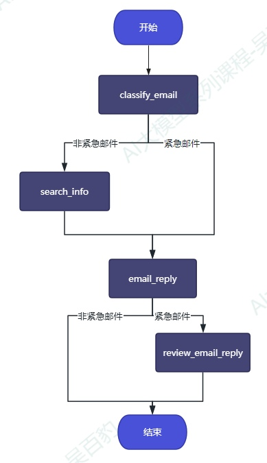

以上流程图构建注意：划分节点的时候，尽量划分细一些，这样方便后续编写业务逻辑，最好每个节点都是单一功能的函数。

**2) 第二步：识别操作类型**

确定了节点列表之后，不要急着写代码，先弄清楚每个节点"在干什么"，为它匹配合适的操作类型。

LangGraph 中一共有四种节点类型，每一种解决一类特定问题：

* LLM 节点

调用大模型来理解、分析、推理或生成文本。当判断意图、总结内容、写一段回复，凡是要调用 LLM 来处理的事，就属于 LLM 节点。这类节点的关键是控制输出格式（比如用 `with_structured_output` 让 LLM 输出结构化的分类结果而非自由文本），避免后续节点拿到格式不确定的数据。

* 数据节点

从外部系统获取信息——查数据库、调 API、搜文档。它自己不做推理也不做决策，只负责把数据拿回来交给后续节点使用。数据节点面对的是网络超时、服务不可用等瞬态错误，因此通常需要加重试策略（`RetryPolicy`）来提升可靠性。

* 操作节点

对外部世界产生真实影响——发邮件、创建工单、扣款。和数据节点不同，数据节点是"读"（失败了可以重读），操作节点是"写"（每次执行都是不可逆的真实动作）。因此操作节点的关键在于幂等设计——你不能因为一次重试给客户发两封同样的邮件，也不能重复扣款。

* 用户输入节点

暂停 Agent 的自动执行，等待人类做决策。不是所有事情都能自动处理——高风险的退款确认、敏感操作的审批、复杂纠纷的裁断，这些事情需要人拍板。用户输入节点通过 `interrupt()` 函数实现暂停，暂停期间 Agent 的完整状态被持久化保存，即使服务器重启也不会丢失，等人类操作员给出决定后，Agent 从断点精确恢复继续执行。

以上四种类型总结如下：

| **类型** | **干什么**       | **典型场景**          |
| -------------- | ---------------------- | --------------------------- |
| LLM 节点       | 调用大模型做理解和生成 | 分类、摘要、撰写、翻译      |
| 数据节点       | 从外部系统读取信息     | 搜索知识库、查数据库、调API |
| 操作节点       | 对外部系统产生真实影响 | 发送邮件、创建工单、扣款    |
| 用户输入节点   | 暂停等待人工决策       | 审批、确认、仲裁            |

回到我们的邮件处理案例，将四个步骤分别对号入座：

* classify\_email:LLM节点。调用LLM分析邮件紧急程度和类别。
* search\_info:数据节点。去知识库中检索匹配的帮助文档。
* email\_reply:LLM节点。调用LLM生成邮件回复内容。
* review\_email\_reply:用户输入节点。暂停，生成的邮件内容等待人工批准。

**3) 第三步：设计状态结构**

状态是 Agent 的共享记忆，所有节点都能读取和更新它。状态设计的核心原则是：存储原始数据，不要存储格式化后的文本。比如，不要在状态中存放"组织好的提示词文本"，而是存储原始的结构化数据——每个节点在需要时自行格式化。

在邮件业务中，需要考虑各个节点使用到的状态数据：对话输入的邮件内容、邮件发送人、邮件分类结果、知识库搜索结果、邮件回复内容。所以状态设计如下：

```python
class EmailClassification(BaseModel):
    """邮件分类结果"""
    category: Literal["question", "bug", "billing", "other"] = Field(description="邮件类别")
    urgency: Literal["low", "medium", "high"] = Field(description="紧急程度")
    summary: str = Field(description="一句话摘要")


class EmailState(TypedDict):
    """邮件处理 Agent 的全局状态"""
    sender: str  # 发件人
    email_content: str # 邮件内容
    classification: dict | None # 邮件分类结果
    search_results: list[str] | None # 知识库搜索结果
    email_response: str | None # 邮件回复内容
```

**4) 第四步：构建节点**

在LangGraph中节点就是一个接收状态、返回更新的函数。下面分别实现各个节点。

* classify\_email:LLM节点。调用LLM分析邮件紧急程度和类别。

```python
def classify_email(state: EmailState) -> Command[Literal["search_info", "email_reply"]]:
    """分类邮件意图并路由"""
    result = classifier.invoke(f"""
        分析以下客户邮件，给出分类和紧急程度：
        发件人：{state['sender']}
        内容：{state['email_content']}
    """)
    # model_dump() 方法将 Pydantic 模型对象转成普通 Python 字典
    classification = result.model_dump()
    # 紧急问题跳过知识库搜索，直接进入回复生成
    if classification["urgency"] in ["high"]:
        return Command(update={"classification": classification}, goto="email_reply")
    return Command(update={"classification": classification}, goto="search_info")
```

该节点最后返回Command对象，Command对象同时指定状态更新和下一节点。Command 的 goto 参数决定了"做完这事下一步去哪个节点"，不需要在图层面再用 conditional\_edges 重复声明。返回类型注解 Command\[Literal\["search\_info", "email\_reply"\]\] 声明了这个节点所有可能的去向，LangGraph 用它来构建图的拓扑。

* search\_info:数据节点。去知识库中检索匹配的帮助文档。

```python
def search_info(state: EmailState) -> Command[Literal["email_reply"]]:
    """搜索知识库（这里模拟实现，实际应接入向量数据库或全文检索）"""
    category = state.get("classification", {}).get("category", "")

    data = {
        "question": ["FAQ文档1：密码重置方法，进入设置→安全→修改密码"],
        "bug": ["已知Bug列表：XX功能异常，临时方案为重启应用"],
        "billing": ["退款政策：7天内可申请全额退款，需提供订单号"],
        "other": ["通用帮助：联系客服获取更多帮助"],
    }

    results = data.get(category, ["未找到相关文档"])

    return Command(update={"search_results": results}, goto="email_reply")
```

* email\_reply:LLM节点。调用LLM生成邮件回复内容。

```python
def email_reply(state: EmailState) -> Command[Literal["review", END]]:
    """草拟回复邮件"""
    classification = state.get("classification", {})
    search_results = state.get("search_results", [])
    knowledge_context = "\n".join(f"  - {r}" for r in search_results) if search_results else "无"

    prompt = f"""
        你是专业客服代表。根据以下信息草拟回复邮件：
        原始邮件：{state['email_content']}
        分类：{classification.get('category')}, 紧急度：{classification.get('urgency')}
        知识库参考：{knowledge_context}
        要求：语气专业友好，直接解决问题。
        """

    response = deepseek_llm.invoke(prompt)

    needs_review = classification.get("urgency") in ["high"]

    return Command(
        update={"email_response": response.content},
        goto="review" if needs_review else END
    )
```

* review\_email\_reply:用户输入节点。暂停，生成的邮件内容等待人工批准。

```python
def review_email_reply(state: EmailState) -> dict:
    """人工审核节点（模拟：自动标记已审核）"""
    # 实际系统中这里调用 interrupt() 等待人工操作
    return {"email_response": state.get("email_response", "") + "\n\n[此回复已经通过管理员审核，如有疑问请联系客服]"}
```

**5) 第五步：连接成图**

各节点实现好之后，图的连接非常简洁。对于内部已用 Command 指定 goto 的节点，不需要在图层面再用 conditional\_edges 重复声明：

```python
# 连接图
builder = StateGraph(EmailState)
builder.add_node("classify_email", classify_email) # 分类邮件意图并路由
builder.add_node("search_info", search_info) # 搜索知识库
builder.add_node("email_reply", email_reply) # 草拟回复邮件
builder.add_node("review", review_email_reply) # 人工审核节点

builder.add_edge(START, "classify_email") # 开始节点到分类邮件意图并路由
builder.add_edge("review", END) # 人工审核节点到结束节点
email_agent = builder.compile()
```

注意：classify\_email/search\_info/email\_reply 节点内部用 Command 声明了 goto，外部无需重复声明节点流向。

### **2.1.2. 完整案例代码**

以上业务需求完整代码如下：

```python
"""
客户支持邮件 Agent
五步设计法的完整应用：分类 → 搜索 → 生成回复 → 审核路由
"""

from init_llm import deepseek_llm
from typing_extensions import Literal
from langgraph.graph import StateGraph, START, END
from langgraph.types import Command, RetryPolicy
from typing_extensions import TypedDict
from pydantic import BaseModel, Field


class EmailClassification(BaseModel):
    """邮件分类结果"""
    category: Literal["question", "bug", "billing", "other"] = Field(description="邮件类别")
    urgency: Literal["low", "medium", "high"] = Field(description="紧急程度")
    summary: str = Field(description="一句话摘要")


class EmailState(TypedDict):
    """邮件处理 Agent 的全局状态"""
    sender: str  # 发件人
    email_content: str # 邮件内容
    classification: dict | None # 邮件分类结果
    search_results: list[str] | None # 知识库搜索结果
    email_response: str | None # 邮件回复内容


# 用 with_structured_output 包装模型，强制 LLM 按 EmailClassification 结构输出
classifier = deepseek_llm.with_structured_output(EmailClassification)


def classify_email(state: EmailState) -> Command[Literal["search_info", "email_reply"]]:
    """分类邮件意图并路由"""
    result = classifier.invoke(f"""
        分析以下客户邮件，给出分类和紧急程度：
        发件人：{state['sender']}
        内容：{state['email_content']}
    """)
    # model_dump() 方法将 Pydantic 模型对象转成普通 Python 字典
    classification = result.model_dump()
    # 紧急问题跳过知识库搜索，直接进入回复生成
    if classification["urgency"] in ["high"]:
        return Command(update={"classification": classification}, goto="email_reply")
    return Command(update={"classification": classification}, goto="search_info")


def search_info(state: EmailState) -> Command[Literal["email_reply"]]:
    """搜索知识库（这里模拟实现，实际应接入向量数据库或全文检索）"""
    category = state.get("classification", {}).get("category", "")

    data = {
        "question": ["FAQ文档1：密码重置方法，进入设置→安全→修改密码"],
        "bug": ["已知Bug列表：XX功能异常，临时方案为重启应用"],
        "billing": ["退款政策：7天内可申请全额退款，需提供订单号"],
        "other": ["通用帮助：联系客服获取更多帮助"],
    }

    results = data.get(category, ["未找到相关文档"])

    return Command(update={"search_results": results}, goto="email_reply")


def email_reply(state: EmailState) -> Command[Literal["review", END]]:
    """草拟回复邮件"""
    classification = state.get("classification", {})
    search_results = state.get("search_results", [])
    knowledge_context = "\n".join(f"  - {r}" for r in search_results) if search_results else "无"

    prompt = f"""
        你是专业客服代表。根据以下信息草拟回复邮件：
        原始邮件：{state['email_content']}
        分类：{classification.get('category')}, 紧急度：{classification.get('urgency')}
        知识库参考：{knowledge_context}
        要求：语气专业友好，直接解决问题。
        """

    response = deepseek_llm.invoke(prompt)

    needs_review = classification.get("urgency") in ["high"]

    return Command(
        update={"email_response": response.content},
        goto="review" if needs_review else END
    )


def review_email_reply(state: EmailState) -> dict:
    """人工审核节点（模拟：自动标记已审核）"""
    # 实际系统中这里调用 interrupt() 等待人工操作
    return {"email_response": state.get("email_response", "") + "\n\n[此回复已经通过管理员审核，如有疑问请联系客服]"}


# 连接图
builder = StateGraph(EmailState)
builder.add_node("classify_email", classify_email) # 分类邮件意图并路由
builder.add_node("search_info", search_info) # 搜索知识库
builder.add_node("email_reply", email_reply) # 草拟回复邮件
builder.add_node("review", review_email_reply) # 人工审核节点

builder.add_edge(START, "classify_email") # 开始节点到分类邮件意图并路由
builder.add_edge("review", END) # 人工审核节点到结束节点
email_agent = builder.compile()


# 绘制 Mermaid 图
print(email_agent.get_graph().draw_ascii()) # 打印 ASCII 图

# 保存 Mermaid 图为 PNG
png_data = email_agent.get_graph().draw_mermaid_png()

# wb表示二进制写入模式
with open("email_agent_graph.png", "wb") as f:
    f.write(png_data)
print("图片已保存到 email_agent_graph.png")


# 测试
if __name__ == "__main__":
    test_emails = [
        {"sender": "zs@example.com",
         "email_content": "你好，我的账号被扣了两次费用，请立即退款！"},
        {"sender": "ls@example.com",
         "email_content": "请问怎么修改登录密码？我在设置页面找不到入口。"},
    ]

    for i, email in enumerate(test_emails, 1):
        print("=" * 60)
        result = email_agent.invoke(email)
        print("result:",result)
        print(f"最终回复:{result.get('email_response')}")
```

代码运行结果如下：

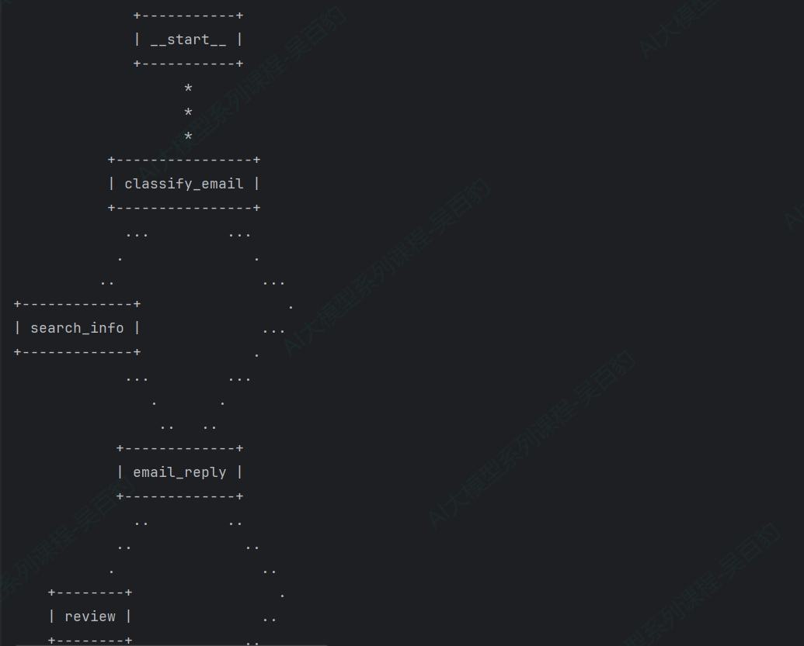

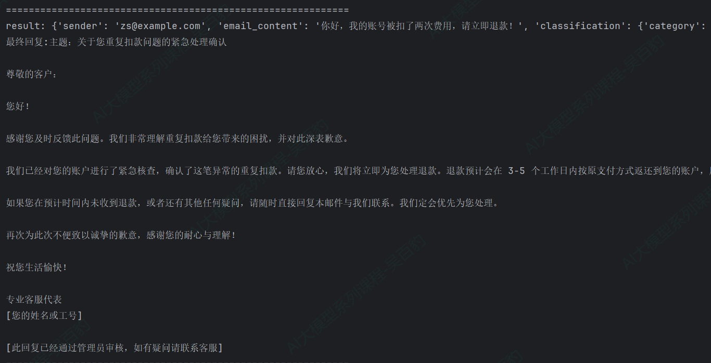

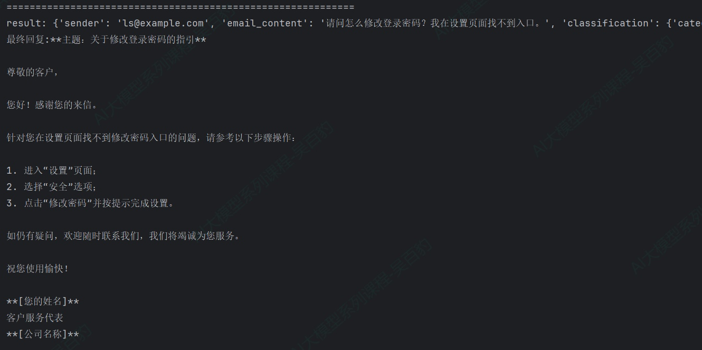

以上代码注意如下几点：

* 以上代码定义的状态类是“EmailState”，所以invoke传入的是该对象中属性对应的dict。
  with\_structured\_output 让 LLM 按 Pydantic 模型输出结构化数据。这是 LangChain 提供的功能，将 LLM 的自由文本输出约束为固定 Schema——分类结果不再是自然语言，而是可以直接用于程序路由的枚举值。
* Command 的 goto 实现了"节点内路由"。不需要在外层单独写条件边函数，路由逻辑和节点逻辑放在一起，代码更内聚。
* 可以通过“email\_agent.get\_graph().draw\_ascii()”来输出ASCII格式的Graph流程图。需要提前安装对应依赖：“pip install grandalf ”。
* 可以通过“email\_agent.get\_graph().draw\_mermaid\_png()”来输出Graph流程图。

## 2.2. **工作流模式（Workflow Patterns）**

LangGraph 官方文档归纳了五种最常用的"图结构模板"，称为工作流模式（Workflow Patterns）。每种模式对应一类特定的控制流形状，解决了某一种典型的编排需求，知道有这些模式存在，遇到类似的业务时可以直接对号入座，方便构思图的拓扑结构。

正式介绍模式之前，先理解一个重要的区分：

* 工作流（Workflow）：执行路径是预定的。步骤按设计好的顺序走，可能在条件分支中有变化，但整体骨架固定。特点是确定性——你知道它每一步会做什么。适合"我知道怎么做，只需要自动化"的场景。
* Agent：执行路径是动态的。LLM 自主决定调用哪些工具、调用多少次、什么时候结束。特点是自主性——它自己选择达成目标的路径。适合"我不确定具体怎么做，让 AI 自己探索"的场景。

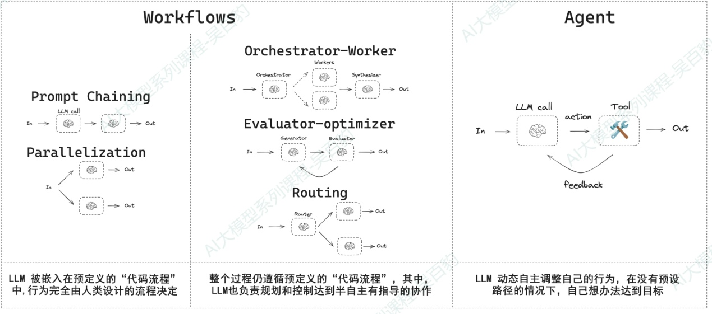

如上图中，最左边是完全确定性的工作流（比如流水线式的文档处理），最右边是高度自主的 Agent（比如开放式对话助手），大多数实际系统介于两者之间——关键步骤走预定流程，细节处理交给 LLM 自主决策。

### **2.2.1. 工作流模式一：提示链（Prompt Chaining）**

提示链（Prompt Chaining）：每个 LLM 调用处理上一个 LLM 调用的输出，像工厂流水线，每一步对半成品做一道工序。

适用场景：任务可以分解为多个有序的子步骤，且每步的输出是下一步的输入。例如：文档翻译（翻译→校对→润色）、内容生成（大纲→正文→标题）、代码生成（需求分析→方案设计→代码编写→代码审查）。

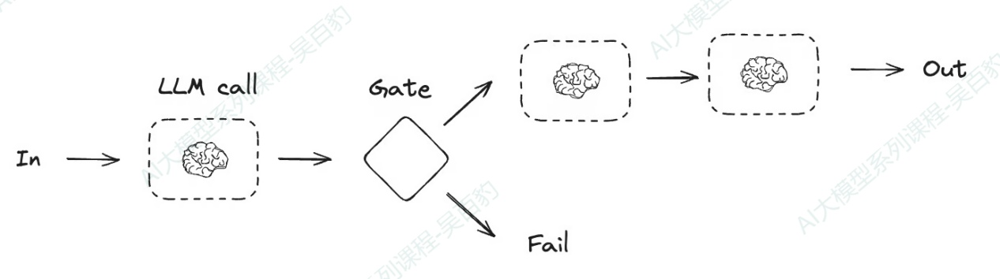

**案例：产品文案流水线（生成→字数判断→扩写→润色）**

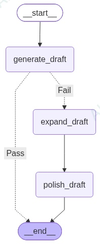

该案例中首先通过大模型节点来生成指定产品文案，然后判断该文案字数是否满足40字符，如果不满足则进行扩写文案，然后进行润色。

```python
"""
提示链（Prompt Chaining）
业务：产品文案流水线——生成→字数判断→扩写→润色
"""

from init_llm import deepseek_llm
from langgraph.graph import StateGraph, START, END
from typing_extensions import TypedDict


class CopywritingState(TypedDict):
    product: str      # 产品名称
    draft: str        # 初稿
    expanded: str     # 扩写后
    final: str        # 最终版


def generate_draft(state: CopywritingState) -> dict:
    """第一步：生成一句话文案初稿"""
    msg = deepseek_llm.invoke(f"为产品[{state['product']}]写一句营销文案，只输出文案本身。")
    return {"draft": msg.content}


def check_length(state: CopywritingState) -> str:
    """判断函数：检查文案字数是否达到发布标准（>= 40字为合格）"""
    draft = state.get("draft", "")
    if len(draft) >= 40:
        return "Pass"   # 字数达标，直接结束
    return "Fail"       # 字数不足，进入扩写流程


def expand_draft(state: CopywritingState) -> dict:
    """第二步：扩写文案，补充产品卖点"""
    msg = deepseek_llm.invoke(
        f"将这句文案扩写为60字左右，补充产品卖点和使用场景：\n {state['draft']}"
    )
    return {"expanded": msg.content}


def polish_draft(state: CopywritingState) -> dict:
    """第三步：润色定稿"""
    msg = deepseek_llm.invoke(f"润色这段文案，使其更有感染力，保持60字左右：\n {state['expanded']}")
    return {"final": msg.content}


builder = StateGraph(CopywritingState)
builder.add_node("generate_draft", generate_draft)
builder.add_node("expand_draft", expand_draft)
builder.add_node("polish_draft", polish_draft)

builder.add_edge(START, "generate_draft")
builder.add_conditional_edges("generate_draft", check_length, {"Pass": END, "Fail": "expand_draft"})
builder.add_edge("expand_draft", "polish_draft")
builder.add_edge("polish_draft", END)
chain = builder.compile()


png_data = chain.get_graph().draw_mermaid_png()

with open("chain_graph.png", "wb") as f:
    f.write(png_data)
print("图片已保存到 chain_graph.png")


if __name__ == "__main__":
    print("Prompt Chaining模式：产品文案流水线")
    print("=" * 60)
    result = chain.invoke({"product": "降噪蓝牙耳机"})

    print(f"\n初稿({len(result.get('draft', ''))}字): {result.get('draft', '')}")

    if "expanded" in result and result.get("expanded"):
        print(f"\n扩写后: {result['expanded']}")
        print(f"\n最终版: {result['final']}")
    else:
        print("\n(初稿字数达标，直接采用)")

```

以上代码运行后结果：

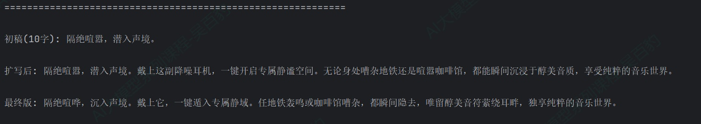

以上代码中add\_conditional\_edges 的第三个参数有两种写法：列表格式和字典格式。列表格式中路由函数直接返回节点名，如下：

```python
def should_continue(state) -> str:
    last_msg = state["messages"][-1]
    if last_msg.tool_calls:
        return "tool_node"   # 返回的就是图里真实节点名
    return END               # END 是值（"__end__"）

builder.add_conditional_edges(
    "llm_call",
    should_continue,
    ["tool_node", END]        # 列表：声明路由函数所有可能的返回值
)
```

字典格式中路由函数返回一个"中间标签"，字典把它映射成真实节点名：

```python
def check_length(state) -> str:
    draft = state.get("draft", "")
    if len(draft) >= 40:
        return "Pass"         # 这不是节点名，只是一个判定标签
    return "Fail"             # 同样不是节点名

builder.add_conditional_edges(
    "generate_draft",
    check_length,
    {"Pass": END, "Fail": "expand_draft"}  # 字典：Pass对应END, Fail对应expand_draft
)
```

这里 check\_length 返回的 "Pass" 和 "Fail" 不是图中真实节点名，只是两个有业务含义的标签，字典 {"Pass": END, "Fail": "expand\_draft"} 负责把标签映射成真实目标。同一个 add\_conditional\_edges 只能用一种格式——要么列表要么字典，两者不能混用。

### **2.2.2. 工作流模式二：并行化（Parallelization）**

并行化（Parallelization）：多个 LLM 调用同时执行，互不依赖，多个独立子任务并行（提高速度）。

适用场景：内容需要从多个维度同时处理，或需要多个独立视角交叉验证。例如：文档审核（一个检查语法、一个检查事实准确性）、多语言翻译（同时翻译为英文、日文、法文）。

在 Graph API 中，并行化的实现方式是：从同一个源节点出发，向多个不同节点添加边——这些节点会在同一步并行执行。所有并行节点完成后，在汇聚节点（aggregator）合并结果。

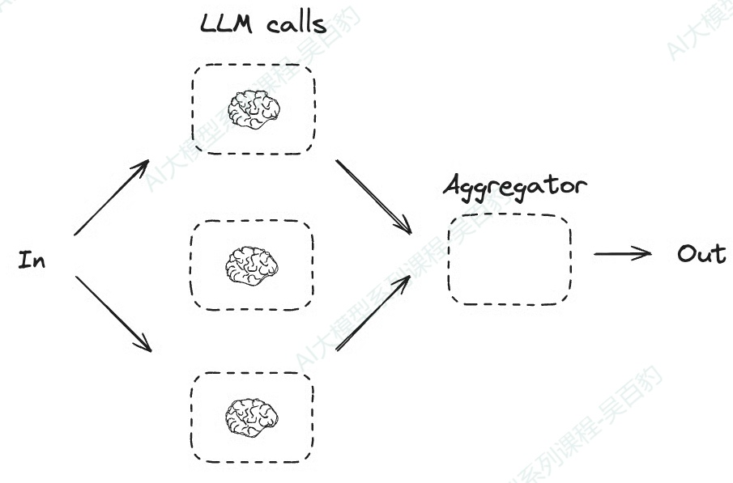

**案例：商品评论多维分析（情感分析、关键词提取、垃圾检测）三路并行，最后汇总**

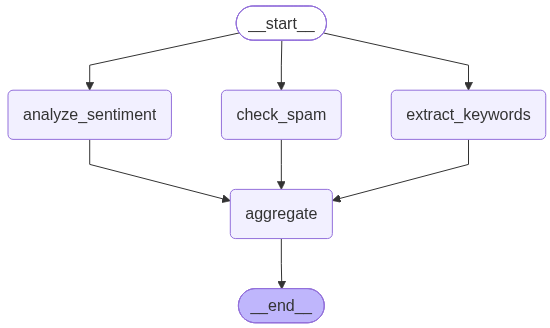

```python
"""
并行化（Parallelization）
业务：商品评论多维分析——同时进行情感分析、关键词提取、垃圾检测，最后汇总
"""
from langgraph.graph import StateGraph, START, END
from typing_extensions import TypedDict

from init_llm import deepseek_llm


class ReviewAnalysisState(TypedDict):
    review: str        # 用户评论原文
    sentiment: str     # 情感分析结果
    keywords: str      # 关键词提取结果
    spam_check: str    # 垃圾内容检测结果
    report: str        # 汇总报告


def analyze_sentiment(state: ReviewAnalysisState) -> dict:
    """并行任务1：情感分析"""
    msg = deepseek_llm.invoke(f"分析这条商品评论的情感倾向（正面/负面/中性），一句话说明理由：{state['review']}")
    return {"sentiment": msg.content}


def extract_keywords(state: ReviewAnalysisState) -> dict:
    """并行任务2：关键词提取"""
    msg = deepseek_llm.invoke(f"从这条商品评论中提取3-5个关键词，用逗号分隔：{state['review']}")
    return {"keywords": msg.content}


def check_spam(state: ReviewAnalysisState) -> dict:
    """并行任务3：垃圾内容检测"""
    msg = deepseek_llm.invoke(f"判断这条评论是否为垃圾内容（广告/灌水/恶意攻击），输出判定和理由：{state['review']}")
    return {"spam_check": msg.content}


def aggregate(state: ReviewAnalysisState) -> dict:
    """汇聚节点：合并三路分析结果，生成综合报告"""
    report = (
        f"【评论分析报告】\n"
        f"原文: {state['review']}\n"
        f"情感: {state['sentiment']}\n"
        f"关键词: {state['keywords']}\n"
        f"垃圾检测: {state['spam_check']}"
    )
    return {"report": report}


builder = StateGraph(ReviewAnalysisState)
builder.add_node("analyze_sentiment", analyze_sentiment)
builder.add_node("extract_keywords", extract_keywords)
builder.add_node("check_spam", check_spam)
builder.add_node("aggregate", aggregate)

# 从 START 出发到三个不同节点的边，三个节点并行执行
builder.add_edge(START, "analyze_sentiment")
builder.add_edge(START, "extract_keywords")
builder.add_edge(START, "check_spam")

# 三条路径都到达 aggregate 后才继续
builder.add_edge("analyze_sentiment", "aggregate")
builder.add_edge("extract_keywords", "aggregate")
builder.add_edge("check_spam", "aggregate")

builder.add_edge("aggregate", END)

analyzer = builder.compile()


png_data = analyzer.get_graph().draw_mermaid_png()

with open("parallel_graph.png", "wb") as f:
    f.write(png_data)
print("图片已保存到 parallel_graph.png")

if __name__ == "__main__":
    print("并行化模式：商品评论多维分析")
    print("=" * 60)

    review_text = "耳机音质出乎意料的好，降噪效果一流，就是耳套戴久了有点夹耳朵，总体很满意！"
    result = analyzer.invoke({"review": review_text})

    print(result["report"])

```

以上代码运行结果如下：

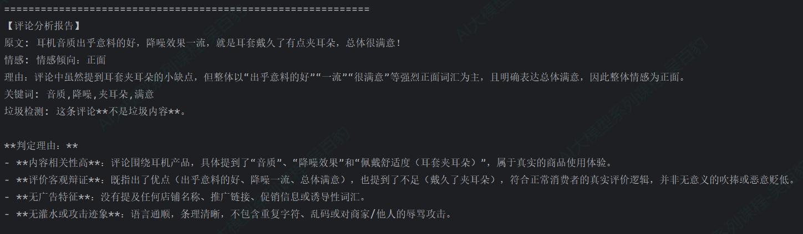

以上代码注意如下几点：

1) 三个分析节点写入的是不同的状态字段（sentiment/keywords/spam\_check），互不冲突，因此不需要归并器。如果多个并行节点要写入同一个字段（比如都往一个结果列表里追加），该字段必须声明为 Annotated\[list, operator.add\]。否则 LangGraph 会直接抛出InvalidUpdateError（报错信息为 "Can receive only one value per step. Use an Annotated key to handle multiple values"）。
2) aggregate会等待所有上游节点完成才执行，如果某个上游节点特别慢，会拖慢整体。

### **2.2.3. 工作流模式三：路由（Routing）**

路由（Routing）：一个分类步骤将输入分配到不同的专用处理流程，每个流程只处理自己擅长的子任务。

适用场景：输入的类型多样化，每种类型需要不同的处理逻辑。例如：客服工单分发（退款/技术/咨询走不同流程）、代码审查（按语言类型分配给不同的审查子流程）。

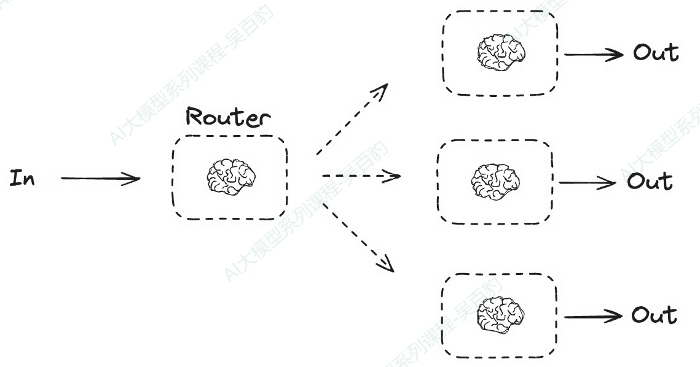

**案例：客服工单自动分发系统，根据用户不同问题进行分类（退款、技术、一般咨询），然后通过不同的节点进行处理不同类别的问题。**

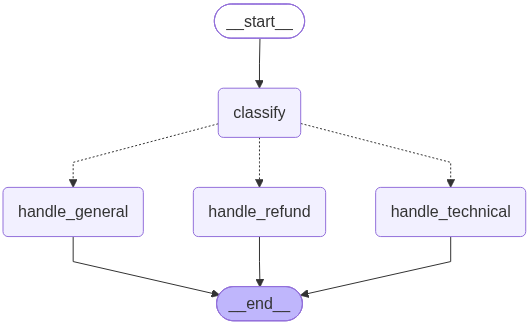

```python
"""
路由（Routing）
业务：客服工单自动分发——根据用户输入类型路由到不同的处理流程
"""

from typing_extensions import Literal
from langchain.messages import HumanMessage, SystemMessage
from langgraph.graph import StateGraph, START, END
from typing_extensions import TypedDict
from pydantic import BaseModel, Field

from init_llm import deepseek_llm


class RouteResult(BaseModel):
    # 用户请求的分类：refund（退款）、technical（技术）或 general（一般咨询）
    category: Literal["refund", "technical", "general"] = Field(description="用户请求的分类")


class TicketState(TypedDict):
    input: str      # 用户输入
    category: str   # 分类结果
    response: str   # 回复内容


router = deepseek_llm.with_structured_output(RouteResult)


def classify(state: TicketState) -> dict:
    """分类节点：分析用户输入，确定类别"""
    result = router.invoke([
        SystemMessage(content="将用户请求分类为 refund（退款）、technical（技术）或 general（一般咨询）。"),
        HumanMessage(content=state["input"]),
    ])
    return {"category": result.category}


def handle_refund(state: TicketState) -> dict:
    """退款处理"""
    msg = deepseek_llm.invoke(f"用户说：{state['input']}。请以客服身份回复退款问题，态度诚恳。")
    return {"response": msg.content}


def handle_technical(state: TicketState) -> dict:
    """技术问题处理"""
    msg = deepseek_llm.invoke(f"用户说：{state['input']}。请以技术支持身份回复，提供排查步骤。")
    return {"response": msg.content}


def handle_general(state: TicketState) -> dict:
    """一般咨询处理"""
    msg = deepseek_llm.invoke(f"用户说：{state['input']}。请以客服身份做一般性回复。")
    return {"response": msg.content}


def route_by_category(state: TicketState) -> Literal["handle_refund", "handle_technical", "handle_general"]:
    """条件边函数：根据分类结果返回目标节点名"""
    route_map = {"refund": "handle_refund", "technical": "handle_technical", "general": "handle_general"}
    return route_map.get(state.get("category", "general"), "handle_general")


builder = StateGraph(TicketState)
builder.add_node("classify", classify)
builder.add_node("handle_refund", handle_refund)
builder.add_node("handle_technical", handle_technical)
builder.add_node("handle_general", handle_general)

builder.add_edge(START, "classify")

builder.add_conditional_edges("classify", route_by_category, {
    "handle_refund": "handle_refund",
    "handle_technical": "handle_technical",
    "handle_general": "handle_general",
})

builder.add_edge("handle_refund", END)
builder.add_edge("handle_technical", END)
builder.add_edge("handle_general", END)

router_agent = builder.compile()


png_data = router_agent.get_graph().draw_mermaid_png()

with open("routing_graph.png", "wb") as f:
    f.write(png_data)
print("图片已保存到 routing_graph.png")


if __name__ == "__main__":
    print("路由模式：客服工单分发系统")
    print("=" * 60)

    user_inputs=[
        "我买的商品被扣了两次款，请帮我退款！",
        "你们的App在安卓14上闪退，怎么解决？",
        "请问你们周末营业吗？"
    ]

    for inp in user_inputs:
        result = router_agent.invoke({"input": inp})
        print(f"\n用户: {inp}")
        print(f"分类: [{result['category']}]")
        print(f"回复: {result['response']}")
        print("-" * 60)

```

以上代码运行结果如下：

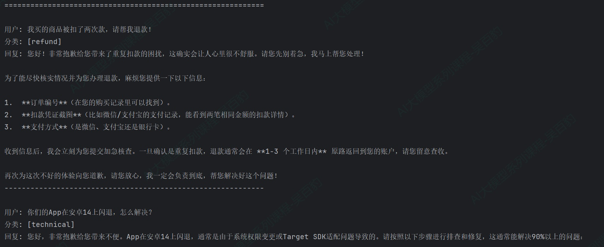

### **2.2.4. 工作流模式四：编排者-工作者（Orchestrator-Worker）**

编排者-工作者（Orchestrator-Worker）:编排器（Orchestrator）将大任务拆分为子任务，动态分配给工作者（Worker）并行执行，最后合并结果。

适用场景：子任务数量在运行前不可预知。例如：多文件代码更新（每个文件一个 Worker）、多章节报告生成（每个章节一个 Worker）。

该模式与并行化的区别：并行化的子任务是预定义的（图中固定有 N 个节点），而编排器-工作者的子任务是动态生成的（根据输入内容运行时决定创建多少个 Worker）。

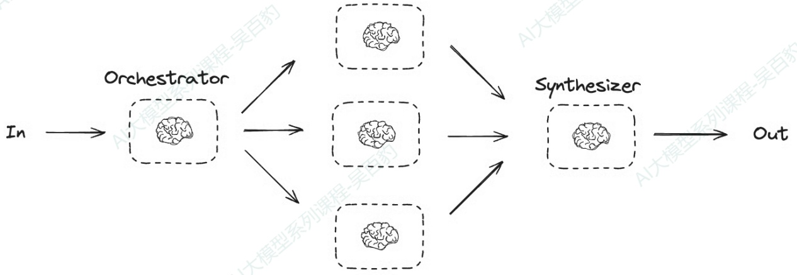

LangGraph 的 Send API 专为这个模式设计——编排器的条件边函数返回一个 Send 对象列表，框架自动为每个 Send 创建一个 Worker 实例并行执行，每个 Worker 拿到自己专属的输入。

**案例：产品发布公告生成。该案例中首先由大模型生成指定产品的发布公告组成模块，然后针对每个模块动态派发Worker撰写，最后将多个Worker输出结果进行合并输出。**

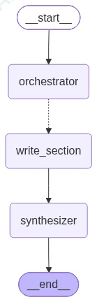

```python
"""
编排器-工作者（Orchestrator-Worker）
业务：产品发布公告生成——编排器规划公告章节，动态派发 Worker 并行撰写，最后合成全文
核心 API：Send——动态创建 Worker 实例
"""

import operator
from typing import Annotated
from langchain.messages import HumanMessage, SystemMessage
from langgraph.graph import StateGraph, START, END
from langgraph.types import Send
from typing_extensions import TypedDict
from pydantic import BaseModel, Field

from init_llm import deepseek_llm


# ============================================================
# 1. 结构化输出：编排器的规划结果
# ============================================================
class Section(BaseModel):
    """公告的一个章节"""
    name: str = Field(description="章节名称")
    description: str = Field(description="该章节要覆盖的内容要点")


class Sections(BaseModel):
    """公告的完整章节规划"""
    sections: list[Section] = Field(description="公告的章节列表")


planner = deepseek_llm.with_structured_output(Sections)


# ============================================================
# 2. 状态定义
# ============================================================
class State(TypedDict):
    """主图状态"""
    topic: str                                        # 公告主题
    sections: list[Section]                           # 编排器的规划结果
    completed_sections: Annotated[list, operator.add] # 所有 Worker 并行写入，operator.add 合并
    final_report: str                                 # 合成后的完整公告


class WorkerState(TypedDict):
    """Worker 子状态：每个 Worker 只拿到自己负责的章节"""
    section: Section

# ============================================================
# 3. 节点实现
# ============================================================
def orchestrator(state: State) -> dict:
    """编排器：分析主题，规划公告的章节结构"""
    result = planner.invoke([
        SystemMessage(content="为产品发布公告规划章节结构，3个章节以内。"),
        HumanMessage(content=f"公告主题：{state['topic']}"),
    ])
    return {"sections": result.sections}


def write_section(state: WorkerState) -> dict:
    """Worker：撰写一个章节的内容"""
    section = state["section"]
    result = deepseek_llm.invoke([
        SystemMessage(content="按给定的章节名称和要点撰写公告章节，用Markdown格式，100字以内，不要前言。"),
        HumanMessage(content=f"章节名称：{section.name}\n内容要点：{section.description}"),
    ])
    # 写入共享的 completed_sections，operator.add 保证并行安全合并
    return {"completed_sections": [result.content]}


def synthesizer(state: State) -> dict:
    """合成器：将所有 Worker 的产出合并为完整公告"""
    combined = "\n\n---\n\n".join(state["completed_sections"])
    return {"final_report": combined}


def assign_workers(state: State):
    """条件边函数：为每个章节动态创建一个 Worker（Send API）"""
    return [Send("write_section", {"section": s}) for s in state["sections"]]


# ============================================================
# 4. 构建图
# ============================================================
builder = StateGraph(State)
builder.add_node("orchestrator", orchestrator)
builder.add_node("write_section", write_section)
builder.add_node("synthesizer", synthesizer)

builder.add_edge(START, "orchestrator")
# 编排器完成后，用 Send 动态派发 Worker
builder.add_conditional_edges("orchestrator", assign_workers, ["write_section"])
builder.add_edge("write_section", "synthesizer")
builder.add_edge("synthesizer", END)

workflow = builder.compile()


png_data = workflow.get_graph().draw_mermaid_png()

with open("orchestrator_worker_graph.png", "wb") as f:
    f.write(png_data)
print("图片已保存到 orchestrator_worker_graph.png")


if __name__ == "__main__":
    print("编排器-工作者模式：产品发布公告生成")
    print("=" * 60)

    result = workflow.invoke({"topic": "智能降噪耳机 AirSound Pro 2 正式发布"})

    print(f"\n规划章节数: {len(result['sections'])}")
    for s in result["sections"]:
        print(f"  - {s.name}: {s.description}")

    print(f"\n最终公告:\n{result['final_report']}")
    print("=" * 60)
```

以上代码运行结果如下：

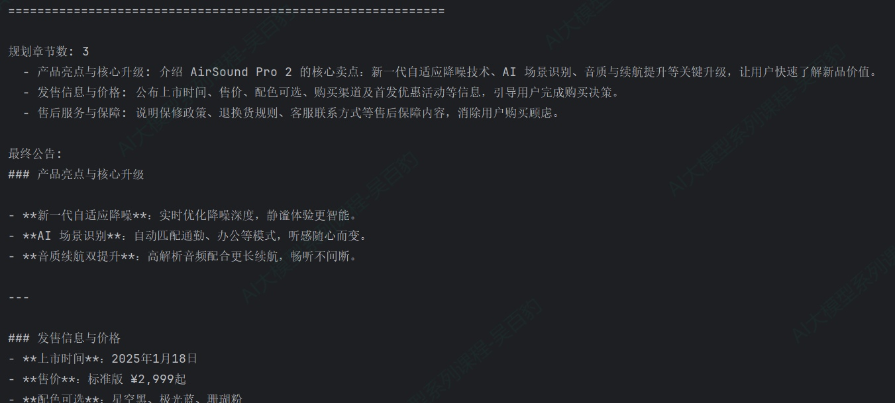

以上代码注意如下几点：

1) Send("write\_section", {"section": s}) 是动态派发的核心。第一个参数是目标节点名，第二个参数是该 Worker 实例的专属输入状态——每个 Worker 拿到的section各不相同。
2) Worker 数量在运行时决定，编排器规划出几个章节，就派发几个 Worker。
3) completed\_sections必须用operator.add归并器，因为所有 Worker 并行写入同一个字段，没有归并器会抛出 InvalidUpdateError 错误。
4) WorkerState 与主图 State 是不同的类型。Worker 只关心自己的 section，不需要看到全局的 topic、sections 等字段，因此单独定义 WorkerState。但整个 Graph 中，同名字段共享同一份底层 channel 存储，Worker 写入 completed\_sections 就是往这份 channel 里写，不存在"Worker 自己的状态"和"主图状态"两份独立数据，最终 invoke() 按主 State 的字段集合决定返回哪些字段。

### **2.2.5. 工作流模式五：评估器-优化器（Evaluator-Optimizer）**

评估器-优化器（Evaluator-Optimizer）:一个 LLM 生成内容，另一个 LLM 评估质量，如果评估不合格，带上反馈重新生成，循环直到达标。

适用场景：输出质量有明确标准但需要迭代才能满足。例如：文案撰写（生成→打分→修改重来）、代码优化（生成→审查→重构）、翻译质量（翻译→校对→修正）。

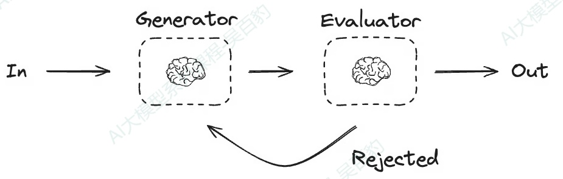

**案例：AI 文案审核系统。首先生成文案，再进行评估，如果超过3次则接受文案**

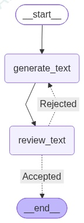

```python
"""
评估器-优化器（Evaluator-Optimizer）
业务：AI 文案审核——生成营销文案→评估打分→不达标带反馈重新生成
路由逻辑：根据评估结果（grade）决定接受或重试，迭代上限3次兜底
"""

from typing_extensions import Literal
from langgraph.graph import StateGraph, START, END
from typing_extensions import TypedDict
from pydantic import BaseModel, Field

from init_llm import deepseek_llm


# 评估结果结构：grade 判定达标与否，feedback 给出修改建议
class ReviewResult(BaseModel):
    grade: Literal["pass", "fail"] = Field(description="文案是否达标，pass=达标，fail=不达标")
    feedback: str = Field(description="不达标时的具体修改建议，达标时为空字符串")


class TextState(TypedDict):
    product: str    # 产品名称
    draft: str      # 当前文案
    grade: str      # 评估结论（pass/fail）
    feedback: str   # 修改建议
    iteration: int  # 迭代次数


evaluator = deepseek_llm.with_structured_output(ReviewResult)


def generate_text(state: TextState) -> dict:
    """生成文案：如果有上一轮的反馈，则根据反馈改进"""
    iteration = state.get("iteration", 0) + 1
    if state.get("feedback"):
        prompt = (
            f"为产品[{state['product']}]写一段30字以内的营销文案。"
            f"上一版文案：{state['draft']}。"
            f"评审反馈：{state['feedback']}。请针对反馈改进。"
        )
    else:
        prompt = f"为产品[{state['product']}]写一段30字以内的营销文案，要求简洁有力、突出卖点。"

    msg = deepseek_llm.invoke(prompt)
    return {"draft": msg.content, "iteration": iteration}


def review_text(state: TextState) -> dict:
    """评估文案：输出结构化的达标判定和修改建议"""
    result = evaluator.invoke(
        f"评估这段营销文案是否达标。标准：30字以内、简洁有力、突出卖点、有感染力。\n文案：{state['draft']}"
    )
    return {"grade": result.grade, "feedback": result.feedback}


def route_review(state: TextState) -> str:
    """路由：评估达标则接受；不达标且未超迭代上限则重试"""
    if state.get("grade") == "pass":
        return "Accepted"
    if state.get("iteration", 0) >= 3:
        return "Accepted"  # 达到迭代上限，兜底接受，避免死循环
    return "Rejected"


builder = StateGraph(TextState)
builder.add_node("generate_text", generate_text)
builder.add_node("review_text", review_text)
builder.add_edge(START, "generate_text")
builder.add_edge("generate_text", "review_text")
builder.add_conditional_edges("review_text", route_review, {
    "Accepted": END,
    "Rejected": "generate_text",
})
optimizer = builder.compile()


png_data = optimizer.get_graph().draw_mermaid_png()

with open("optimizer_graph.png", "wb") as f:
    f.write(png_data)
print("图片已保存到 optimizer_graph.png")


if __name__ == "__main__":
    print("评估器-优化器模式：AI 文案审核")
    print("=" * 60)

    result = optimizer.invoke({"product": "智能保温杯"})

    print(f"\n产品: {result['product']}")
    print(f"迭代次数: {result.get('iteration', 1)}")
    print(f"评估结论: {result.get('grade', '')}")
    print(f"\n最终文案: {result['draft']}")

```

以上代码运行结果如下：

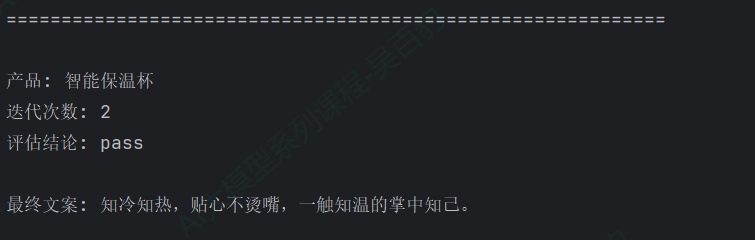

## 2.3. **ToolRuntime&ToolNode**

* **ToolRuntime:在工具内访问图状态**

有时候，工具函数不仅需要 LLM 传入的参数，还需要访问 Agent 的图状态（如当前用户 ID、会话上下文等）。ToolRuntime 提供了这个能力——在工具函数的参数中声明一个 ToolRuntime 类型的参数，LangGraph 会在执行时自动注入，且这个参数对 LLM 不可见（LLM 不会尝试为它生成值）。

* **ToolNode:LangGraph中预置节点**

在“1.4.3 LangGraph 构建Agent案例”小节中，我们手写了一个tool\_node函数来遍历tool\_calls并逐一执行工具。LangGraph 提供了 ToolNode 预置节点来做同样的事，而且功能更强：

```python
1.自动并行执行多个工具调用
2.内置错误处理和状态注入
3.支持运行时上下文（ToolRuntime）
```

使用方式如下：

```python
from langgraph.prebuilt import ToolNode

# 一句代码替代手写的 tool_node 函数
builder.add_node("tools", ToolNode([tool1, tool2, tool3]))
```

**案例一：改写“1.4.3 LangGraph 构建Agent案例”**

计算器案例可以改写为如下：

```python
"""
Graph API 计算器 Agent
演示使用 StateGraph 构建一个带工具调用的 Agent ，LLM 决定是否调用工具，工具执行后 LLM 再次推理，循环直到给出最终答案。
"""

from typing import Annotated, Literal
import operator
from langchain.tools import tool
from langchain.messages import HumanMessage, SystemMessage, AnyMessage
from langgraph.graph import StateGraph, START, END
from langgraph.prebuilt import ToolNode
from typing_extensions import TypedDict

from init_llm import deepseek_llm


# 1. 定义工具
@tool
def add(a: int, b: int) -> int:
    """两个整数相加。参数 a: 第一个整数，b: 第二个整数"""
    return a + b


@tool
def multiply(a: int, b: int) -> int:
    """两个整数相乘。参数 a: 第一个整数，b: 第二个整数"""
    return a * b


@tool
def divide(a: int, b: int) -> float:
    """两个整数相除。参数 a: 被除数，b: 除数"""
    return a / b


# 工具列表和工具名索引
tools = [add, multiply, divide]
# 工具名索引，用于根据工具名快速查找工具
tools_by_name = {t.name: t for t in tools}
model_with_tools = deepseek_llm.bind_tools(tools)

# 2. 定义状态
class CalculatorState(TypedDict):
    """计算器 Agent 的状态，消息列表使用 operator.add 做追加合并"""
    messages: Annotated[list[AnyMessage], operator.add]


# 3. 定义节点
def llm_call(state: CalculatorState) -> dict:
    """LLM 节点：调用模型，决定是调用工具还是直接回答"""
    response = model_with_tools.invoke(
        [SystemMessage(content="你是一个数学计算助手。请使用工具完成计算并给出最终答案。")]
        + state["messages"]
    )
    return {"messages": [response]}


# 4. 路由逻辑（条件边）
def should_continue(state: CalculatorState) -> Literal["tool_node", END]:
    """检查最后一条消息，如果有 tool_calls 则进入工具节点，否则结束"""
    last_message = state["messages"][-1]
    # 检查是否有 tool_calls 且 tool_calls 不为空
    if hasattr(last_message, "tool_calls") and last_message.tool_calls:
        return "tool_node"
    return END

# 5. 构建和编译图
builder = StateGraph(CalculatorState)
builder.add_node("llm_call", llm_call)
builder.add_node("tool_node", ToolNode(tools))

builder.add_edge(START, "llm_call")
builder.add_conditional_edges("llm_call", should_continue, ["tool_node", END])
builder.add_edge("tool_node", "llm_call")

agent = builder.compile()

# 6. 运行
if __name__ == "__main__":
    result = agent.invoke({"messages": [HumanMessage(content="请帮我算一下：(3 + 5) * 2 的结果是多少")]})

    for msg in result["messages"]:
        msg.pretty_print()
```

以上代码注意如下几点：

1) 以上代码只需要设置“builder.add\_node("tool\_node", ToolNode(tools))”并去掉原有的“tool\_node”函数即可。
2) ToolNode 替代了手写的 tool\_node 函数。它自动处理遍历 tool\_calls、执行工具、返回 ToolMessage 列表的完整流程。

**案例二：LangGraph工具中使用ToolRuntime来获取状态数据。**

该案例中会进行订单、库存的查询，使用ToolRuntime访问图状态。

```python
"""
ToolRuntime&ToolNode
业务：电商客服——查订单、查库存。使用 ToolRuntime 访问图状态
"""
from typing import Literal
from langchain.tools import ToolRuntime, tool
from langchain.messages import HumanMessage, SystemMessage
from langgraph.graph import StateGraph, MessagesState, START, END
from langgraph.prebuilt import ToolNode

from init_llm import deepseek_llm


class CustomerState(MessagesState):
    """在标准消息状态基础上增加 user_id"""
    user_id: str


@tool
def check_order(runtime: ToolRuntime, order_id: str) -> str:
    """查询订单状态
    Args:
        order_id: 订单号，如 ORD-001
    Returns:
        订单状态描述
    """
    print("runtime:",runtime)
    # 通过 ToolRuntime 从图状态中读取 user_id
    user_id = runtime.state.get("user_id", "unknown")

    mock_orders = {
        "ORD-001": "已发货，预计明天到达",
        "ORD-002": "正在处理中",
        "ORD-003": "已签收",
    }

    status = mock_orders.get(order_id, "未找到该订单")
    return f"用户{user_id}的订单{order_id}：{status}"


@tool
def check_inventory(product_name: str) -> str:
    """查询商品库存
    Args:
        product_name: 商品名称
    Returns:
        商品库存描述
    """
    inventory = {
        "蓝牙耳机": "库存充足（>100件）",
        "机械键盘": "库存紧张（仅剩5件）"
    }
    return inventory.get(product_name, f"未找到商品[{product_name}]")


tools = [check_order, check_inventory]
model_with_tools = deepseek_llm.bind_tools(tools)


def llm_node(state: CustomerState) -> dict:
    """LLM 节点：决定调用工具还是直接回答"""
    response = model_with_tools.invoke(
        [SystemMessage(content="你是电商客服助手，用工具查询信息后回答。")]
        + state["messages"]
    )
    return {"messages": [response]}


def should_continue(state: CustomerState) -> Literal["tools", END]:
    """条件边：有工具调用则进入工具节点，否则结束"""
    last_msg = state["messages"][-1]
    if hasattr(last_msg, "tool_calls") and last_msg.tool_calls:
        return "tools"
    return END


builder = StateGraph(CustomerState)
builder.add_node("llm", llm_node)
builder.add_node("tools", ToolNode(tools))  # 使用 ToolNode 预置节点

builder.add_edge(START, "llm")
builder.add_conditional_edges("llm", should_continue, ["tools", END])
builder.add_edge("tools", "llm")

agent = builder.compile()


if __name__ == "__main__":
    print("ToolRuntime + ToolNode：电商客服助手")
    print("=" * 60)

    result = agent.invoke({
        "messages": [HumanMessage(content="帮我查一下订单 ORD-001 的状态")],
        "user_id": "user_123",
    })
    print(f"客服: {result['messages'][-1].content}")

    print("-" * 40)

    result = agent.invoke({
        "messages": [HumanMessage(content="蓝牙耳机还有货吗？")],
        "user_id": "user_123",
    })
    print(f"客服: {result['messages'][-1].content}")

```

以上代码注意如下几点：

1) ToolRuntime 让工具可以访问模型不知道的信息。check\_order 中的 user\_id 来自图状态，不是 LLM 推理出来的。
2) LangGraph 的状态系统是开放和可扩展的，CustomerState 继承 MessagesState 并增加了 user\_id 字段。

## 2.4. **本地服务与 Studio 调试**

前面所有的案例都是在 Python 脚本里 graph.invoke() 直接调用——这适合开发调试，但离真正的应用还差一步。一个完整的 Agent 系统需要能被外部调用（前端页面、其他微服务、定时任务），需要能看到每次调用的执行轨迹，需要在出错时能回溯每一步的状态。

LangGraph 提供了 本地开发服务器（langgraph dev）和配套的 Studio 调试界面来覆盖这些需求。简单来说：

* 本地服务器：把写好的 graph 编译后暴露为 HTTP REST API，外部可以通过 SDK 或 curl 调用。
* Studio：一个 Web 可视化界面，能实时看到图的拓扑结构、每次调用的执行过程、每个节点的输入/输出状态

两者配合的完整工作流是：实现业务代码 → langgraph dev 启动服务 → 打开 Studio 看到图的结构 → 在 Studio 里发送消息测试 → 观察每一步的状态变化 → 发现问题回到代码修改。

### **2.4.1. 从零构建一个LangGraph项目**

我们可以使用LangGraph中提供的模版快速创建LangGraph项目，可以按照如下步骤快速从零构建一个LangGraph项目。

**1) 准备LangSmith API Key**

本地LangGraph服务器需要一个 LangSmith API Key（免费注册）,可以访问 [https://smith.langchain.com/settings](https://smith.langchain.com/settings) 创建 API Key，稍后写入项目的 .env 文件。

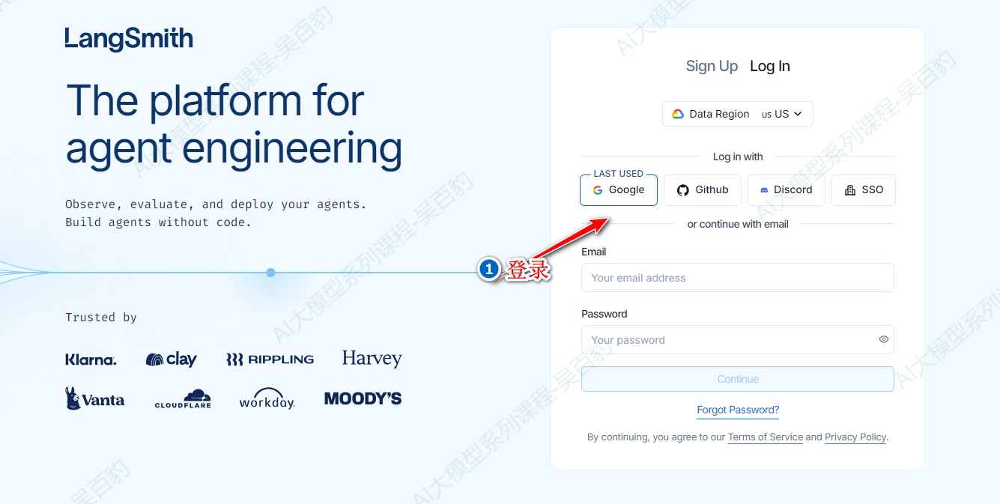

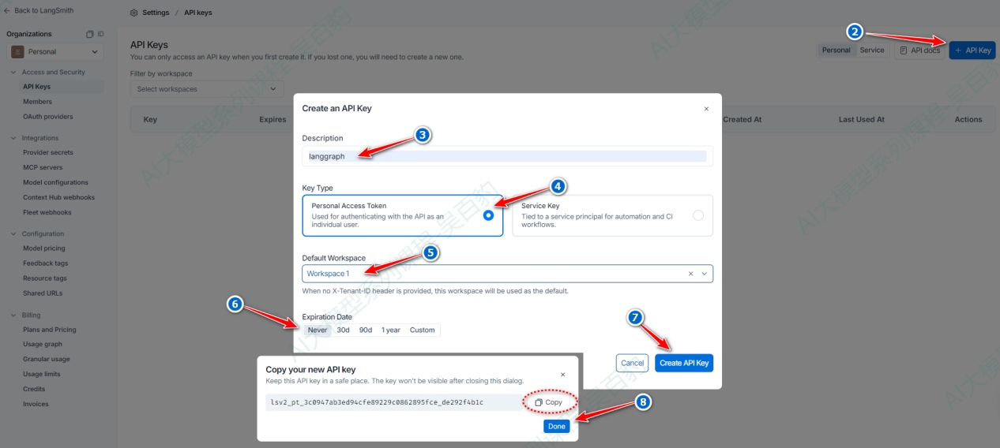

创建好API Key后记得复制，稍后创建LangGraph项目需要使用。

**2) 配置系统环境变量**

在Window中配置系统环境变量“PYTHONUTF8”,设置值为1。运行LangGraph时“langgraph-api”包某些文件需要使用UTF-8编码，否则运行中出现错误。

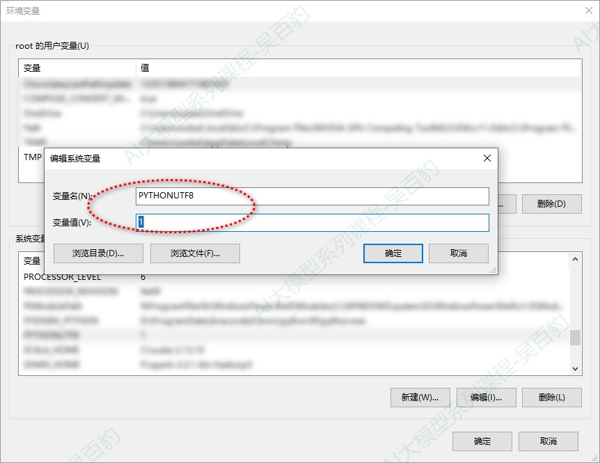

**3) 安装LangGraph CLI依赖**

```python
#切换到对应的python环境中再安装依赖
conda activate langgraph_course

#安装依赖
pip install -U "langgraph-cli[inmem]"
```

注意：LangGraph需要python>=3.11,\[inmem\] 表示附带内存存储模式的依赖，适合开发和测试。这里我们使用的python环境是Conda管理的“langgraph\_course”

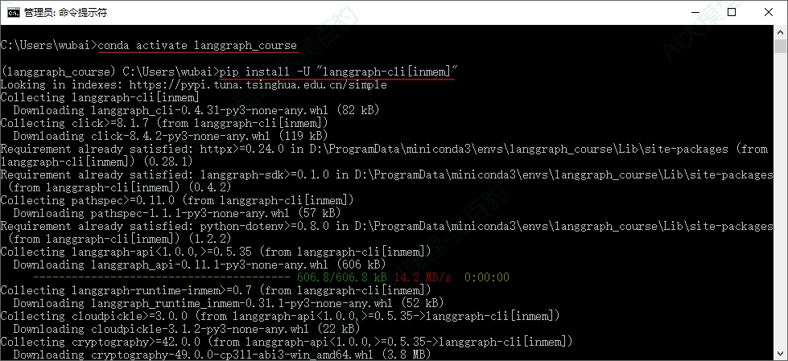

**4) 创建LangGraph应用**

使用LangGraph模版快速创建LangGraph项目：

```python

#首先切换到对应的python环境中，再使用模版创建项目
conda activate langgraph_course

langgraph new path/to/your/app --template new-langgraph-project-python
```

以上命令会生成一个包含 langgraph.json、依赖配置和示例图的项目结构。“path/to/your/app”是创建项目的路径；“--template”是指定使用LangGraph的模板。

这里我们将项目创建到“D:\\PyCharmSpace\\LangGraphApp”(路径根据自己项目存放情况决定)：

```python
langgraph new D:\PyCharmSpace\LangGraphApp --template new-langgraph-project-python
```

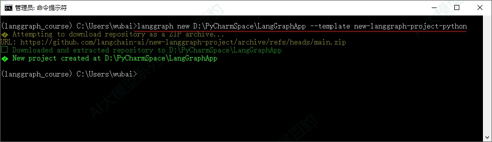

注意：如果速度很慢，可以尝试开启VPN切换不同节点基于模版进行创建。

**5) 配置并启动本地服务器**

使用PyCharm打开创建好的项目，然后配置Python解析器:

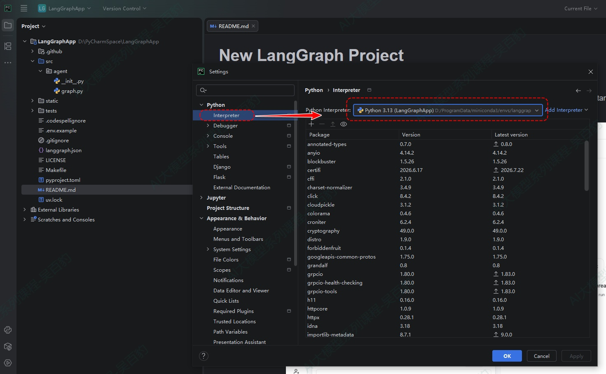

然后切换到对应python环境中并进入到该项目目录中，执行如下命令安装LangGraph依赖：

```python
pip install -e .
```

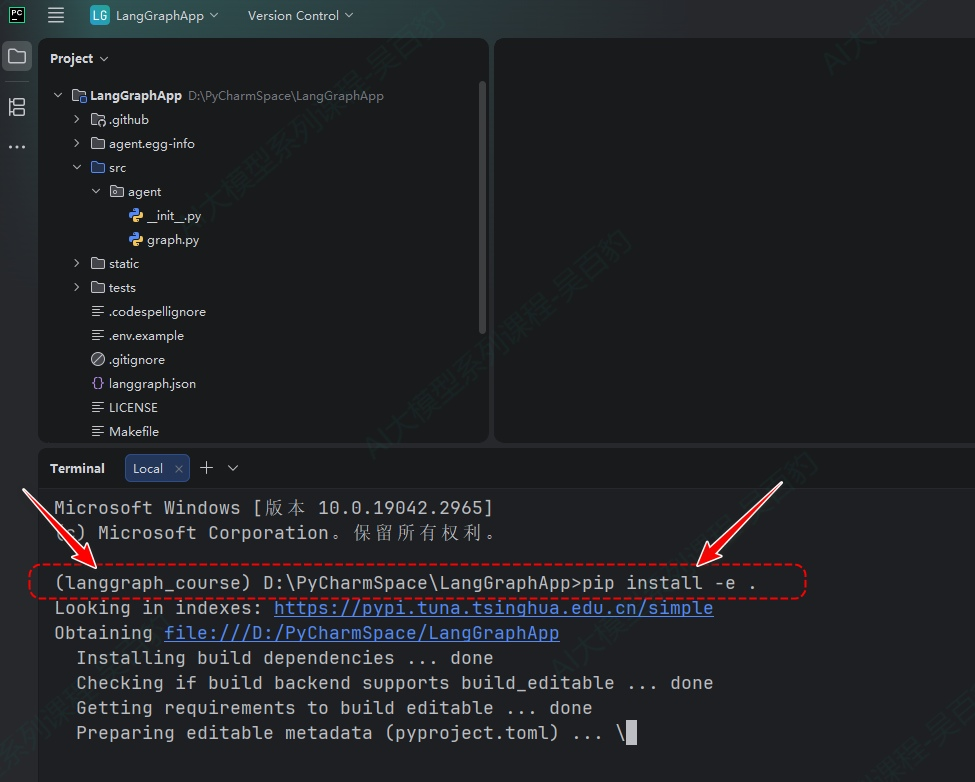

注意：这里也可以通过CMD窗口进入到项目目录且切换到对应python环境中执行“pip install -e .”命令进行依赖安装。

“pip install -e .”命令中“.” 表示"当前目录"，“-e” 表示"可编辑模式"，这条命令的意思是：把当前目录当作一个 Python 包安装到当前环境中，并且对源码的修改即时生效，需要一个 pyproject.toml（或 [setup.py](http://setup.py)）文件才能工作，没有这个文件，pip 根本不知道这个"包"叫什么、要装什么依赖、入口在哪。

关于pyproject.toml文件内容的解释如下：

```python
# =============================================================================
# [project] —— 项目元信息（定义"这个包叫什么、依赖什么"）
# =============================================================================
[project]
name = "agent"                                          # 包名，pip install 后别的模块用这个名字 import
version = "0.0.1"                                       # 版本号，语义化版本（主版本.次版本.修订号）
description = "Starter template for making a new agent LangGraph."  # 一句话描述
authors = [                                             # 作者列表
    { name = "William Fu-Hinthorn", email = "13333726+hinthornw@users.noreply.github.com" },
]
readme = "README.md"                                    # README 文件路径，PyPI 页面上会渲染它
license = { text = "MIT" }                              # 开源协议，MIT 是最宽松的协议之一
requires-python = ">=3.10"                              # 要求 Python 版本 >= 3.10（因为用了 typing 新特性）
dependencies = [                                        # 运行时依赖——pip install 这个包时自动安装
"langgraph>=1.0.0",  
    "python-dotenv>=1.0.1",                             ]

# =============================================================================
# [project.optional-dependencies] —— 可选依赖组，"pip install -e .[dev]" 时安装
# =============================================================================
[project.optional-dependencies]
dev = [                                                 # 开发工具组：只给开发者用，生产环境不需要
    "mypy>=1.11.1",  
    "ruff>=0.6.1",   
]

# =============================================================================
# [build-system] —— 构建工具声明（"谁负责把这个包装进环境"）
# =============================================================================
[build-system]
requires = ["setuptools>=73.0.0", "wheel"]              # 构建这个包需要的工具：setuptools 是打包引擎，wheel 是二进制格式
build-backend = "setuptools.build_meta"                 # 指定用 setuptools 的最新 API 来构建

# =============================================================================
# [tool.setuptools] —— setuptools 的配置（包和目录的映射关系）
# =============================================================================
[tool.setuptools]
packages = ["langgraph.templates.agent", "agent"]       # 声明两个包名：一个给模版系统用，一个给用户直接引用用
[tool.setuptools.package-dir]                           # 把包名映射到实际的磁盘目录
"langgraph.templates.agent" = "src/agent"               #   "langgraph.templates.agent" 这个包名 → 指向 src/agent/ 目录
"agent" = "src/agent"                                   #   "agent" 这个包名 → 也指向 src/agent/ 目录
                                                        #   同一个物理目录有两个包名，调用者用哪个都行

# =============================================================================
# [tool.setuptools.package-data] —— 打包时要带上的非 .py 文件
# =============================================================================
[tool.setuptools.package-data]
"*" = ["py.typed"]                                      # 通配符：所有包都包含 py.typed 文件

# =============================================================================
# [tool.ruff] —— ruff 代码检查工具的规则配置
# =============================================================================
[tool.ruff]
lint.select = [                                         # 启用哪些检查规则集
    "E",    #  pycodestyle：代码风格错误（如缩进不对、空格问题）
    "F",    #  pyflakes：逻辑错误（如未使用的变量、未定义的名称）
    "I",    #  isort：import 语句排序（按字母顺序、按来源分组）
    "D",    #  pydocstyle：docstring 规范（函数、类必须有文档字符串）
    "D401", #  docstring 第一行必须用命令式语气（"Return..." 而非 "Returns..."）
    "T201", #  禁止使用 print()，防止提交调试代码
    "UP",   #  pyupgrade：提醒你用新版 Python 语法（如用 | 代替 Optional）
]
lint.ignore = [                                         # 启用的规则集中，哪些具体规则要豁免
    "UP006",    #  豁免：不强制把 Optional[X] 改成 X | None
    "UP007",    #  豁免：不强制把 Union[X, Y] 改成 X | Y
    "UP035",    #  豁免：允许从 typing_extensions 导入（因为要兼容 Python 3.10 的旧 typing）
    "D417",     #  豁免：不强制每个参数都有 docstring 描述（太啰嗦了）
    "E501",     #  豁免：不强制每行不超过 88 字符（有些行确实很长）
]

[tool.ruff.lint.per-file-ignores]
"tests/*" = ["D", "UP"]                                 # 对 tests/ 目录：豁免 D（docstring）和 UP（新版语法）规则
                                                        # 测试不需要严格文档；测试可能故意用旧语法验证兼容性

[tool.ruff.lint.pydocstyle]
convention = "google"                                   # docstring 风格约定：Google 风格（参数用 Args: 标注）

# =============================================================================
# [dependency-groups] —— PEP 735 的新式依赖分组（取代 pip 的 requirements-dev.txt）
# =============================================================================
[dependency-groups]
dev = [                                                 # 开发依赖组——不仅 pip install 用，各工具也读这个字段
    "anyio>=4.7.0",   
    "langgraph-cli[inmem]>=0.4.14",   
    "mypy>=1.13.0",  
    "pytest>=9.0.3",  
    "ruff>=0.8.2",  
]
```

**6) 配置.env环境变量**

在项目根目录中有一个“.env.example”文件，复制该文件为“.env”文件并填入LANGSMITH\_API\_KEY。

```python
LANGSMITH_API_KEY=lsv2_pt_......
```

为了后续方便使用大模型，把大模型相关的APIKEY 也配置到该文件中（以DeepSeek为例）：

```python
DEEPSEEK_API_KEY=sk-... ...
DEEPSEEK_BASE_URL=https://api.deepseek.com
```

**7) 启动服务器**

打开终端，输入如下命令启动LangGraph服务器：

```python
langgraph dev
```

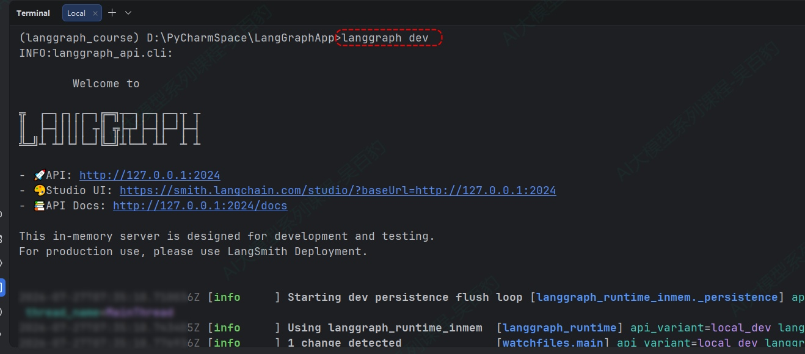

启动LangGraph服务器之后，可以看到自动打开“Studio UI”,在浏览器中可以看到对应的页面（如果报错多等待一会进行刷新即可）：

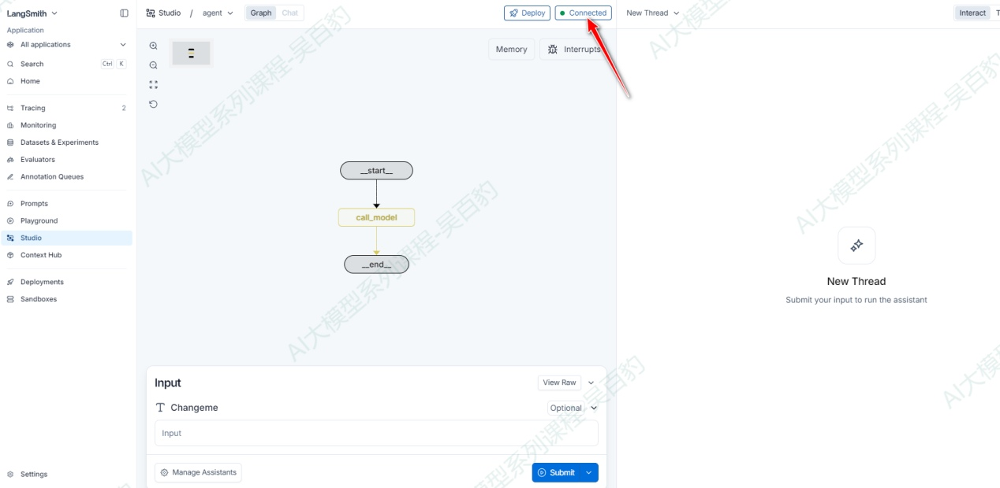

**最后特别注意：langgraph dev 启动的是内存模式服务器，仅适合开发和测试；生产环境需要持久化存储后端，部署到服务器的图编译时不要自带 checkpointer，平台会自动注入持久化后端。**

### **2.4.2. LangGraph配置解释及案例**

在LangGraph项目中，重点是“langgraph.json”配置文件，该配置文件默认如下：

```python
{
  "$schema": "https://langgra.ph/schema.json",
  "dependencies": ["."],
  "graphs": {
    "agent": "./src/agent/graph.py:graph"
  },
  "env": ".env",
  "image_distro": "wolfi"
}
```

相关配置项的解释如下：

| **配置项**       | **作用**                                                                                                                                                                                                             |
| ---------------------- | -------------------------------------------------------------------------------------------------------------------------------------------------------------------------------------------------------------------------- |
| **$schema**      | JSON Schema 的元数据声明。告诉 IDE（如 VS Code）"这个文件的结构是有规范的，请按这个 schema 做自动补全和校验"。                                                                                                             |
| **dependencies** | 声明项目需要安装的Python 包路径。["."] 表示当前目录本身就是一个 Python 包（通过 pyproject.toml 或 setup.py），执行“pip install -e .”时会安装这些python包。                                                               |
| **graphs**       | 声明项目中有哪些可被调用的图。"agent"是图的别名（调用时用这个名称），"./src/agent/graph.py:graph" 表示"从该文件的 graph 变量加载图"。                                                                                      |
| **env**          | 指定环境变量文件路径。".env"表示项目根目录下的 .env 文件。                                                                                                                                                                 |
| **image_distro** | 指定部署到LangSmith Deployment 时的容器基础镜像发行版。Wolfi表示Chainguard 的极简 Linux 发行版，本地 langgraph dev运行时这个字段不生效，只有在生产部署（推送到LangSmith Cloud 或自托管）时用来决定用哪个 Docker 基础镜像。 |

如下案例是将“1.4.3 LangGraph 构建计算器Agent案例”运行在LangGraph服务器中。

**1) 首先将“env\_**[**utils.py**](http://utils.py)**”和“init\_**[**llm.py**](http://llm.py)**”两个文件复制到新建的LangGraph项目中**

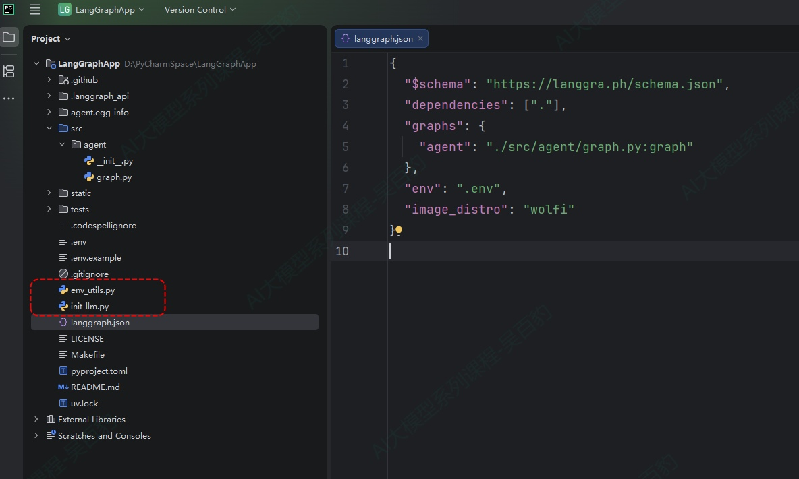

**2) 然后将如下计算器Agent代码复制到项目的“**[**graph.py**](http://graph.py)**”文件中**

```python
from typing import Annotated, Literal
import operator
from langchain.tools import tool
from langchain.messages import HumanMessage, SystemMessage, AnyMessage
from langgraph.graph import StateGraph, START, END
from langgraph.prebuilt import ToolNode
from typing_extensions import TypedDict

from init_llm import deepseek_llm


# 1. 定义工具
@tool
def add(a: int, b: int) -> int:
    """两个整数相加。参数 a: 第一个整数，b: 第二个整数"""
    return a + b


@tool
def multiply(a: int, b: int) -> int:
    """两个整数相乘。参数 a: 第一个整数，b: 第二个整数"""
    return a * b


@tool
def divide(a: int, b: int) -> float:
    """两个整数相除。参数 a: 被除数，b: 除数"""
    return a / b


# 工具列表和工具名索引
tools = [add, multiply, divide]
# 工具名索引，用于根据工具名快速查找工具
tools_by_name = {t.name: t for t in tools}
model_with_tools = deepseek_llm.bind_tools(tools)

# 2. 定义状态
class CalculatorState(TypedDict):
    """计算器 Agent 的状态，消息列表使用 operator.add 做追加合并"""
    messages: Annotated[list[AnyMessage], operator.add]


# 3. 定义节点
def llm_call(state: CalculatorState) -> dict:
    """LLM 节点：调用模型，决定是调用工具还是直接回答"""
    response = model_with_tools.invoke(
        [SystemMessage(content="你是一个数学计算助手。请使用工具完成计算并给出最终答案。")]
        + state["messages"]
    )
    return {"messages": [response]}


# 4. 路由逻辑（条件边）
def should_continue(state: CalculatorState) -> Literal["tool_node", END]:
    """检查最后一条消息，如果有 tool_calls 则进入工具节点，否则结束"""
    last_message = state["messages"][-1]
    # 检查是否有 tool_calls 且 tool_calls 不为空
    if hasattr(last_message, "tool_calls") and last_message.tool_calls:
        return "tool_node"
    return END

# 5. 构建和编译图
builder = StateGraph(CalculatorState)
builder.add_node("llm_call", llm_call)
builder.add_node("tool_node", ToolNode(tools))

builder.add_edge(START, "llm_call")
builder.add_conditional_edges("llm_call", should_continue, ["tool_node", END])
builder.add_edge("tool_node", "llm_call")

graph = builder.compile()
```

关于“[graph.py](http://graph.py)”代码需要注意文件末尾必须导出一个名为 graph 的编译后的图对象，因为“langgraph.json”中写的就是“"agent":"./src/agent/[graph.py](http://graph.py):graph"”，关于这个内容解释如下：

```python
"./src/agent/graph.py:graph"
  │                │
  │                └── 该文件中导出的变量名
  └── Python 文件路径（相对于项目根目录）
```

langgraph dev 启动后，你可以用 "agent" 这个别名调用它，例如将LangGraph部署到服务器之后 ，[客户端通过client.runs.stream](http://客户端通过client.runs.stream)(None, "agent", ...)使用LangGraph，这里的“agent”用的都是这个 key。一个项目可以暴露出多个 Agent，每个有独立的别名。

```python
"graphs": {
  "agent": "./src/agent/graph.py:graph",
  "reviewer": "./src/reviewer/graph.py:review_graph"
}
```

**3) 启动LangGraph dev**

打开终端，输入“langgraph dev”启动LangGraph服务器，启动后会自动打开浏览器，如果没有跳转到浏览器可以手动访问（Stduio UI）:

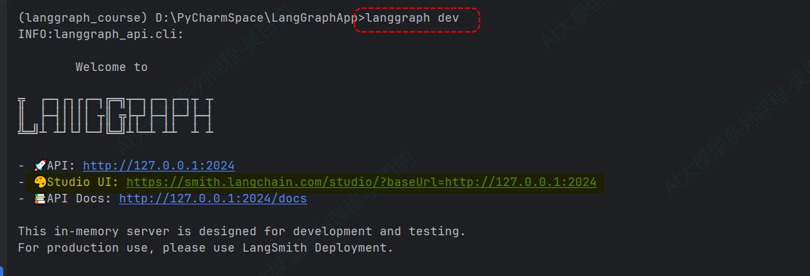

在Stdio UI中进行对话：

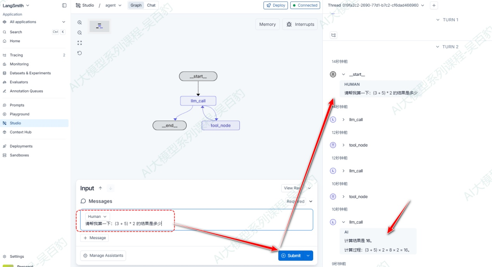

### **2.4.3. 基于现有项目构建LangGraph项目**

对于一个普通的大模型Python项目，我们想要改造成LangGraph项目，首先我们需要了解下项目必要的目录结构，要让 langgraph dev 识别你的项目，需要满足一个核心约定：项目根目录下有一个 langgraph.json 配置文件，指向你编译好的 graph，必要项目目录结构如下：

```python
my_agent_app/
├── langgraph.json          # CLI 配置文件（必须）
├── pyproject.toml          # Python 包声明（必须）
├── .env                  # 环境变量（API Key 等）
└── src/                  # 自己定义的python包
└── agent/
    └── __init__.py        # __init__.py标识为Python包
    └── graph.py       # 图定义文件（导出编译后的 graph）
```

可以按照如下步骤进行操作将现有一个普通的Python 大模型项目改造为可以通过“langgraph dev”运行的LangGraph项目。

**1) 准备环境**

参考2.4.1“从零构建一个LangGraph项目”部分中环境准备，预先准备好“LangSmith API KEY”、“配置系统环境变量”、“安装LangGraph Cli依赖”，这里不再演示。

**2)** [**准备graph.py**](http://准备graph.py)**文件**

在项目中准备好“[graph.py](http://graph.py)”文件，这里我们在“LangGraphProject”项目中创建“05\_langgraph\_dev\_[demo.py](http://demo.py)”文件作为图运行的入口。

05\_langgraph\_dev\_[demo.py](http://demo.py)如下：

```python
from typing import Annotated, Literal
import operator
from langchain.tools import tool
from langchain.messages import HumanMessage, SystemMessage, AnyMessage
from langgraph.graph import StateGraph, START, END
from langgraph.prebuilt import ToolNode
from typing_extensions import TypedDict

from init_llm import deepseek_llm


# 1. 定义工具
@tool
def add(a: int, b: int) -> int:
    """两个整数相加。参数 a: 第一个整数，b: 第二个整数"""
    return a + b


@tool
def multiply(a: int, b: int) -> int:
    """两个整数相乘。参数 a: 第一个整数，b: 第二个整数"""
    return a * b


@tool
def divide(a: int, b: int) -> float:
    """两个整数相除。参数 a: 被除数，b: 除数"""
    return a / b


# 工具列表和工具名索引
tools = [add, multiply, divide]
# 工具名索引，用于根据工具名快速查找工具
tools_by_name = {t.name: t for t in tools}
model_with_tools = deepseek_llm.bind_tools(tools)

# 2. 定义状态
class CalculatorState(TypedDict):
    """计算器 Agent 的状态，消息列表使用 operator.add 做追加合并"""
    messages: Annotated[list[AnyMessage], operator.add]


# 3. 定义节点
def llm_call(state: CalculatorState) -> dict:
    """LLM 节点：调用模型，决定是调用工具还是直接回答"""
    response = model_with_tools.invoke(
        [SystemMessage(content="你是一个数学计算助手。请使用工具完成计算并给出最终答案。")]
        + state["messages"]
    )
    return {"messages": [response]}


# 4. 路由逻辑（条件边）
def should_continue(state: CalculatorState) -> Literal["tool_node", END]:
    """检查最后一条消息，如果有 tool_calls 则进入工具节点，否则结束"""
    last_message = state["messages"][-1]
    # 检查是否有 tool_calls 且 tool_calls 不为空
    if hasattr(last_message, "tool_calls") and last_message.tool_calls:
        return "tool_node"
    return END

# 5. 构建和编译图
builder = StateGraph(CalculatorState)
builder.add_node("llm_call", llm_call)
builder.add_node("tool_node", ToolNode(tools))

builder.add_edge(START, "llm_call")
builder.add_conditional_edges("llm_call", should_continue, ["tool_node", END])
builder.add_edge("tool_node", "llm_call")

graph = builder.compile()

```

**3) 准备langgraph.json**

然后再在项目跟目录中创建langgraph.json文件，配置如下：

```python
{
  "dependencies": ["."],
  "graphs": {
    "agent": "./02_langgraph_use/05_langgraph_dev_demo.py:graph"
  },
  "env": ".env",
  "image_distro": "wolfi"
}
```

以上“graphs.agent”配置要根据自己实际代码位置来配置。“05\_langgraph\_dev\_[demo.py](http://demo.py)”代码中导出变量必须叫 graph，如果你写成 my\_agent = builder.compile() 然后 "agent": "./02\_langgraph\_use/05\_langgraph\_dev\_[demo.py](http://demo.py):my\_agent" 也可以，langgraph.json 里冒号后面的名字和变量名对应就行。

**4) 准备.env文件**

在“.env”中加入“LANGSMITH\_API\_KEY”，.env内容：

```python
... ...
#追加如下内容
LANGSMITH_API_KEY=lsv2_pt_... ...
.... ...
```

**5) 创建pyproject.toml文件**

```python
[project] # 项目元信息
name = "my-agent-app"   # 包名，pip install 后注册的名字
version = "0.1.0"       # 版本
requires-python = ">=3.10"  # Python 版本下限
dependencies = [            # 运行时依赖——pip install -e . 时自动安装
    "langgraph>=1.2",
    "langchain>=1.2",
]

[build-system]  # 声明构建工具
requires = ["setuptools>=73.0.0"]   # 打包依赖：需要哪个版本的 setuptools 来构建这个包
build-backend = "setuptools.build_meta" # 指定 setuptools 的现代 API 作为构建入口

[tool.setuptools]   # setuptools 配置
packages = ["all_package"]    # 声明这个项目包含的包名列表，这里只有一个叫 "all_package" 的包

[tool.setuptools.package-dir]
"all_package" = "." # 将包名 "all_package" 映射到当前目录（项目根目录）
```

以上“\[tool.setuptools\]”中的packages这里指定了“all\_package”,该名称为自定义，但是一定要在“\[tool.setuptools.package-dir\]”中指定映射到磁盘对应的包路径，“.”表示当前项目根目录下的包都会被识别。

关于pyproject.toml文件必需指定如下配置项：

| **配置项**              | **是否必需** | **作用**                           |
| ----------------------------- | ------------------ | ---------------------------------------- |
| [project] name                | 必需               | 包名，pip install 注册用                 |
| [project] version             | 必需               | 版本号                                   |
| [project] requires-python     | 必需               | 声明Python 版本下限                      |
| [project] dependencies        | 必需               | 运行时依赖，pip install -e . 自动安装    |
| [build-system]                | 必需               | 声明构建工具，告诉pip 用谁打包           |
| [tool.setuptools.packages]    | 必需               | 声明有哪些包，包名可以自定义，但要映射对 |
| [tool.setuptools.package-dir] | 必需               | 包名到磁盘目录的映射                     |

**6) 安装LangGraph依赖**

然后切换到对应python环境中并进入到该项目目录中，执行如下命令安装LangGraph依赖：

```python
pip install -e .
```

**7) 启动Langgraph dev**

在终端执行“langgraph dev”启动Langgraph本地服务。

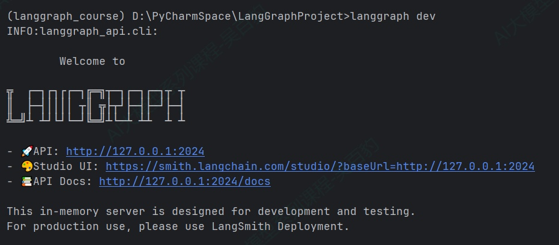

对话测试：

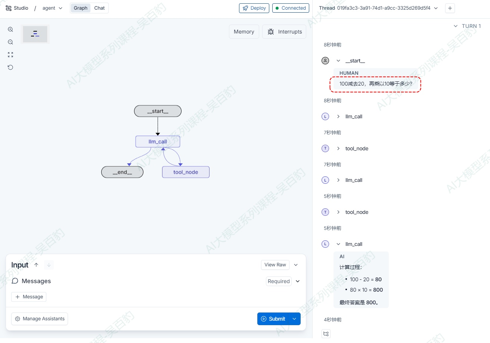

**8) 配置第二个Agent（LangChain Agent）**

我们也可以在LangGraph本地服务器中部署之前编写的Agent项目，在“02\_langgraph\_use”包中增加“06\_agent\_[demo.py](http://demo.py)”文件，内容如下：

```python
from langchain.agents import create_agent
from langchain.tools import tool

from init_llm import deepseek_llm


@tool
def get_weather(city: str) -> str:
    """获取指定城市的天气信息。"""
    return f"{city}的天气为晴朗，25°C。"


agent = create_agent(
    model=deepseek_llm,
    tools=[get_weather],
    system_prompt="你是能查询任何问题的助手"
)
```

然后修改langgraph.json文件，增加“weather\_agent”部分：

```python
{
  "dependencies": ["."],
  "graphs": {
    "agent": "./02_langgraph_use/05_langgraph_dev_demo.py:graph",
    "weather_agent": "./02_langgraph_use/06_agent_demo.py:agent"
  },
  "env": ".env",
  "image_distro": "wolfi"
}
```

然后重启LangGraph服务器，可以在WebUI中看到对应的Agent:

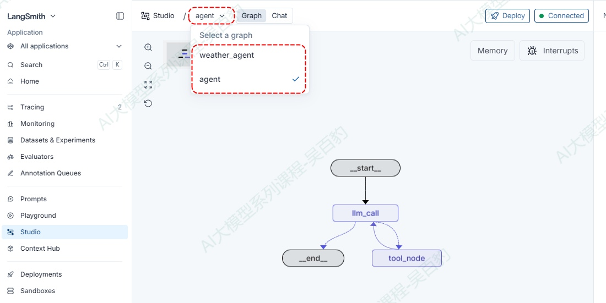

勾选“weather\_agent”可以进行如下对话：

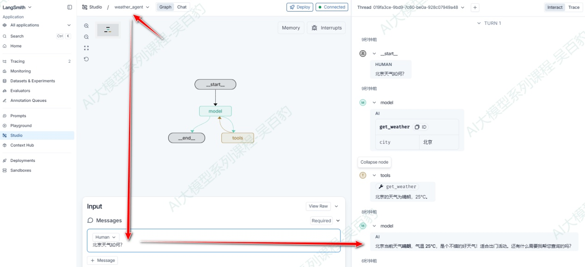

特别注意：LangChain Agent中不必指定checkpoint，因为 langgraph dev 会自动注入持久化后端。

### **2.4.4. 使用LangGraph Python SDK调用服务**

Agent 服务启动后，可以通过 LangGraph Python SDK 远程调用。SDK 是独立的包，需要单独安装：

```python
pip install langgraph-sdk==0.4.2
```

* **同步调用示例：**

```python
from langgraph_sdk import get_sync_client

client = get_sync_client(url="http://127.0.0.1:2024")

for chunk in client.runs.stream(
    None,       # thread_id=None → 无状态运行，每次调用独立
    "agent",    # 对应 langgraph.json 中的 graph 名称
    input={
        "messages": [{"role": "user", "content": "请帮我算一下：(3+5)*2 是多少？"}]
    },
):
    # chunk 是每个步骤的事件，包含 event 类型和 data 数据
    print(f"事件: {chunk.event}")
    print(f"数据: {chunk.data}")
```

* **异步调用示例：**

```python
from langgraph_sdk import get_client
import asyncio

async def main():
    client = get_client(url="http://127.0.0.1:2024")

    async for chunk in client.runs.stream(
        None, "agent",
        input={
            "messages": [{"role": "user", "content": "100除以4再乘以3等于多少?"}]
        },
    ):
        print(f"事件: {chunk.event}")
        print(chunk.data)

asyncio.run(main())
```

无论同步还是异步调用，thread\_id 的作用是如果传入 thread\_id（如 [client.runs.stream](http://client.runs.stream)("thread-001", "agent", ...)），服务端会持久化该线程的对话历史，后续调用可以延续之前的上下文；None 表示单次无状态调用。

---
> 🏠 **[返回主页 README](./README.md)** \| ◀️ **上一篇：[20. LangGraph 快速入门](./20LangGraph%E5%BF%AB%E9%80%9F%E5%85%A5%E9%97%A8.md)** \| ▶️ **下一篇：[22. Checkpointer 短期记忆](./22Checkpointer%E7%9F%AD%E6%9C%9F%E8%AE%B0%E5%BF%86.md)** \| 🎓 **[进入本模块面试高频题](./interview/04_LangGraph高级工作流面试题.md)**
