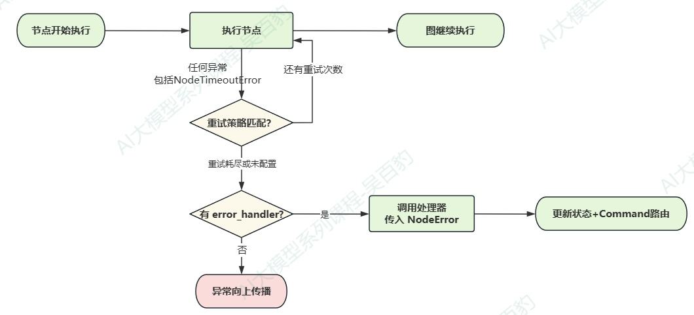
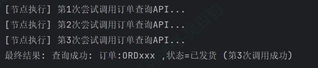
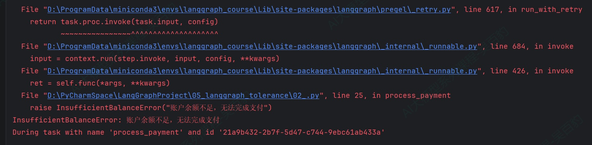
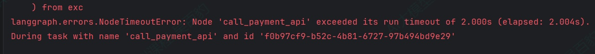
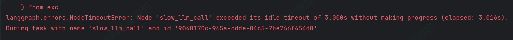
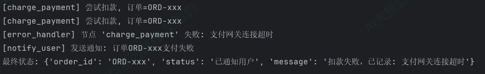
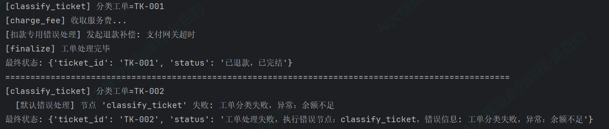

> 📌 **[AI 大模型与云原生全栈知识库](./README.md)** / **模块六：LangGraph 复杂 Workflow 与图状态网络**
> 🏠 [返回主页 README](./README.md) \| ⚡ [面试 30 分钟速记](./interview/00_面试冲刺30分钟速记卡片.md) \| 🎓 [本模块面试题](./interview/04_LangGraph高级工作流面试题.md)

---

# 5\. **LangGraph 容错（Fault Tolerance）**

## 5.1. **LangGraph容错机制介绍**

生产环境中的 Agent 系统不可避免地会遇到各种异常：第三方 API 响应超时、网络瞬时抖动、支付网关暂时不可用。如果每次故障都让整个图执行崩溃，系统的可靠性将无从谈起。

LangGraph 为节点级容错提供了三种可组合的机制：重试（Retry）、超时（Timeout）和错误处理（Error Handling）。

| **机制**                      | **解决的问题**     | **配置方式**          |
| ----------------------------------- | ------------------------ | --------------------------- |
| **重试（RetryPolicy）**       | 临时性故障，重试后可恢复 | add_node(retry_policy=...)  |
| **超时（TimeoutPolicy）**     | 节点执行时间过长/卡死    | add_node(timeout=...)       |
| **错误处理（error_handler）** | 重试耗尽后的兜底补偿     | add_node(error_handler=...) |

它们按固定顺序协作：节点执行时可能被超时中断(抛 NodeTimeoutError)；节点抛异常后,重试策略决定是否重试；重试耗尽后,错误处理器接管,执行对应路由。



## 5.2. **重试策略（RetryPolicy）**

### **5.2.1. 重试策略配置参数**

重试策略（RetryPolicy）告诉 LangGraph：当一个节点因异常而失败时，是否应该自动重新执行该节点，以及如何重新执行。它是抵御临时性故障的第一道防线。

在 add\_node 时通过 retry\_policy 参数配置。一个典型的场景：调用外部订单查询 API，偶尔因网络抖动返回 ConnectionError，配置重试后 LangGraph 会自动重试，业务代码无需自己写 try/except 循环。

下面通过一个电商订单查询的案例演示 RetryPolicy 的基本用法。节点模拟调用不稳定的外部 API——前两次因网络问题失败，第三次成功。

```python
"""
RetryPolicy :模拟不稳定的第三方订单查询 API
业务场景：电商客服系统中，查询外部订单服务时偶尔因网络抖动失败，需要自动重试。
"""
from typing_extensions import TypedDict
from langgraph.graph import StateGraph, START, END
from langgraph.types import RetryPolicy


class State(TypedDict):
    """图状态：存储订单查询结果"""
    result: str


# 定义计数器模拟不稳定的外部服务（前2次失败，第3次成功）
attempt_counter = 0


def fetch_order_status(state: State) -> dict:
    """模拟查询订单状态 —— 前2次调用失败，第3次成功"""
    global attempt_counter
    attempt_counter += 1
    print(f"[节点执行] 第{attempt_counter}次尝试调用订单查询API...")

    if attempt_counter < 3:
        raise ConnectionError(f"订单服务连接失败 (第{attempt_counter}次)")

    return {"result": f"查询成功: 订单:ORDxxx ,状态=已发货 (第{attempt_counter}次调用成功)"}


# ============================================================
# 构建图
# ============================================================
builder = StateGraph(State)
builder.add_node(
    "fetch_order_status",
    fetch_order_status,
    # 配置重试策略：最多3次，初始间隔0.5秒，退避因子2.0
    retry_policy=RetryPolicy(
        max_attempts=3,
        initial_interval=0.5,
        backoff_factor=2.0,
    ),
)
builder.add_edge(START, "fetch_order_status")
builder.add_edge("fetch_order_status", END)

graph = builder.compile()

if __name__ == "__main__":
    result = graph.invoke({"result": ""})
    print(f"最终结果: {result['result']}")
```

以上代码运行结果如下：



以上代码注意点如下：

1) max\_attempts=3 表示最多执行 3 次（首次 + 2 次重试）。前两次抛出的 ConnectionError 被重试策略捕获并自动重试，第三次成功返回。
2) initial\_interval=0.5 设置首次重试前的等待时间为 0.5 秒，backoff\_factor=2.0 表示每次重试间隔翻倍（0.5s→1.0s→2.0s→4.0s->8.0s→16.0s...直到max\_interval 128s封顶）。
3) 重试过程中，失败尝试对状态的写入会被自动清除，只有最终成功那次的状态更新会持久化。这意味着你不会看到失败尝试产生的中间数据。

以上RetryPolicy参数有如下：

| **参数**             | **类型**  | **默认值**          | **说明**                                                      |
| -------------------------- | --------------- | ------------------------- | ------------------------------------------------------------------- |
| **max_attempts**     | int             | 3                         | 最大尝试次数（含首次）                                              |
| **initial_interval** | float           | 0.5                       | 首次重试前的等待时间（秒）                                          |
| **backoff_factor**   | float           | 2.0                       | 每次重试后间隔的倍数                                                |
| **max_interval**     | float           | 128.0                     | 重试间隔的上限（秒）                                                |
| **jitter**           | bool            | True                      | 是否在间隔中加入随机抖动,可以避免多个节点同时重试导致服务器压力过大 |
| **retry_on**         | type[Exception] | Sequence[type[Exception]] | Callable[[Exception], bool]                                         |

RetryPolicy 的 retry\_on 参数决定了哪些异常触发重试。如果不指定，LangGraph 使用内置的 default\_retry\_on，规则如下：

* 会重试的异常（default\_retry\_on 返回 True）：
  * 大多数通用异常及其子类。
  * NodeTimeoutError（超时产生的异常）
  * 对于requests和httpx等HTTP库的异常，仅 5xx 状态码触发重试
* 不会重试的异常（default\_retry\_on 返回 False）：
  * ValueError（传入的参数类型正确但值不合法(如 int("abc"))）
  * TypeError（对对象执行了类型不匹配的操作(如给 int 传字符串拼接)）
  * ArithmeticError（算术运算错误的基类(除零、溢出等)）
  * ImportError（import 失败——模块不存在或无法导入）
  * LookupError（通过键/索引访问不存在的元素(基类,含 KeyError、IndexError)）
  * NameError（引用了未定义的变量/函数名）
  * SyntaxError（代码语法错误,解释器无法编译）
  * RuntimeError（不属于其他具体类别的运行时通用错误）
  * ReferenceError（通过弱引用访问已被垃圾回收的对象）
  * StopIteration（迭代器已到末尾,无元素可继续取）
  * StopAsyncIteration（异步迭代器已到末尾）
  * OSError（操作系统层错误(文件不存在、权限不足、磁盘满等)）

这些异常被排除是因为它们通常表示代码逻辑错误或不可恢复的系统错误，重试无法解决。

### **5.2.2. 自定义重试逻辑**

当默认的重试判断无法满足需求时(比如要把某个自定义业务异常排除出重试范围),可以通过自定义 retry\_on 逻辑实现,不必完全依赖默认规则。

retry\_on 接受一个 Callable\[\[BaseException\], bool\]，返回 True 表示重试。可以导入 default\_retry\_on 来扩展而非完全替换默认行为。

业务场景：支付服务中，对于"余额不足"这类业务异常不应重试（重试也不会成功），只有网络超时等临时性故障才重试。

```python
from typing_extensions import TypedDict
from langgraph.graph import StateGraph, START, END
from langgraph.types import RetryPolicy, default_retry_on


# 自定义业务异常
class InsufficientBalanceError(Exception):
    """余额不足 —— 不应重试的业务异常"""
    pass


class State(TypedDict):
    result: str


def process_payment(state: State) -> dict:
    """模拟支付处理 —— 对不同类型的异常采取不同的重试策略"""
    print(f"[节点执行] 尝试处理支付...")
    # 模拟：始终抛出余额不足（不应重试）
    raise InsufficientBalanceError("账户余额不足，无法完成支付")


def custom_retry_on(exc: BaseException) -> bool:
    """自定义重试判断：余额不足不重试，其他异常沿用默认策略"""
    if isinstance(exc, InsufficientBalanceError):
        return False  # 不重试
    return default_retry_on(exc)


# ============================================================
# 构建图
# ============================================================
builder = StateGraph(State)
builder.add_node(
    "process_payment",
    process_payment,
    retry_policy=RetryPolicy(
        max_attempts=3,
        retry_on=custom_retry_on,
    ),
)
builder.add_edge(START, "process_payment")
builder.add_edge("process_payment", END)

graph = builder.compile()

if __name__ == "__main__":
    result = graph.invoke({"result": ""})
    print(f"结果: {result['result']}")

```

以上代码运行结果如下：



以上代码注意如下几点：

1) default\_retry\_on 是内置的默认重试判断函数:传入异常,返回 True 表示该异常应重试。它是 RetryPolicy 中 retry\_on 参数的默认值。
2) 对于以上自定义异常，由于custom\_retry\_on中设置了该异常所以会按照配置进行重试/不重试。若没有配置 custom\_retry\_on,InsufficientBalanceError 作为普通 Exception 子类会被默认策略判定为"可重试"(返回 True),会重试 max\_attempts 次后才抛出。

## 5.3. **节点超时（Timeouts）**

### **5.3.1. 运行超时（run\_timeout）**

重试策略解决了"失败了怎么办"的问题，但它不解决"卡住了怎么办"的问题。如果一个节点因为死循环、LLM 长时间无响应、外部服务 hang 住而永不返回，重试策略根本不会被触发——因为节点还没"失败"，它只是"没结束"。

TimeoutPolicy 正是为此设计的。它可以设定单次节点执行的最大时长，超时后 LangGraph 强制中断该次执行，**抛出 NodeTimeoutError，清除失败尝试的写入，然后交给重试策略判断是否重试。**

**特别注意：超时仅支持异步（async）节点，目前不支持同步节点。**

业务：调用第三方支付接口，设置2秒硬超时,当一个节点执行超过2秒时就抛出NodeTimeoutError异常。

```python
import asyncio
from typing_extensions import TypedDict
from langgraph.graph import StateGraph, START, END
from langgraph.types import TimeoutPolicy


class State(TypedDict):
    result: str


async def call_payment_api(state: State) -> dict:
    """模拟调用支付API —— 耗时过长触发 run_timeout"""
    print("[节点执行] 开始调用支付网关API...")
    # 模拟耗时操作，远超设定的2秒超时时间
    await asyncio.sleep(10)
    return {"result": "支付成功"}


# ============================================================
# 构建图
# ============================================================
builder = StateGraph(State)
builder.add_node(
    "call_payment_api",
    call_payment_api,
    timeout=TimeoutPolicy(run_timeout=2),  # 2秒硬超时
)
builder.add_edge(START, "call_payment_api")
builder.add_edge("call_payment_api", END)

graph = builder.compile()


async def main():
    result = await graph.ainvoke({"result": ""})
    print(f"结果: {result['result']}")

asyncio.run(main())

```

以上代码运行后结果如下：



以上代码注意如下几点：

1) 注意图的调用必须使用 graph.ainvoke()（异步调用），因为超时仅支持异步节点。
2) run\_timeout从节点开始执行起倒计时，到点就中断，无论节点是否在活跃工作。
3) add\_node的timeout参数接受三种形式：

* 数字（秒）：timeout=60，等价于TimeoutPolicy(run\_timeout=60)
* timedelta：timeout=timedelta(minutes=2)
* TimeoutPolicy对象：timeout=TimeoutPolicy(run\_timeout=120,idle\_timeout=30)，支持分别配置运行超时和空闲超时

### **5.3.2. 空闲超时（idle\_timeout）**

idle\_timeout 与 run\_timeout 不同：它不是从开始算起，而是从"节点最后一次发出进度信号"算起，只要节点在持续产生进度（如 LLM 持续输出 token），时钟就会不断重置。

```python
import asyncio
from typing_extensions import TypedDict
from langgraph.graph import StateGraph, START, END
from langgraph.types import TimeoutPolicy


class State(TypedDict):
    result: str


async def slow_llm_call(state: State) -> dict:
    """
    模拟LLM调用:先输出一部分，然后长时间无响应。
    idle_timeout会在第一次输出后重置时钟，但第二次长时间无输出时触发。
    """
    print("[节点执行] 开始调用LLM...")

    # 模拟LLM卡住了，长时间无输出（超过idle_timeout的3秒）
    print("LLM卡住了，等待中...")
    await asyncio.sleep(10)
    return {"result": "生成完成"}


# ============================================================
# 构建图
# ============================================================
builder = StateGraph(State)
builder.add_node(
    "slow_llm_call",
    slow_llm_call,
    timeout=TimeoutPolicy(run_timeout=20, idle_timeout=3),  # 3秒无进度则超时
)
builder.add_edge(START, "slow_llm_call")
builder.add_edge("slow_llm_call", END)

graph = builder.compile()


async def main():
    result = await graph.ainvoke({"result": ""})
    print(f"结果: {result['result']}")

asyncio.run(main())
```

以上代码运行结果如下：



以上代码运行注意如下几点：

1) 该示例里 print 和 asyncio.sleep 都不产生进度信号,所以 idle 时钟从节点开始就持续计时:前 1 秒(两次 sleep(0.5)) + 后续 sleep(10) 的前 2 秒,累计满 3 秒触发超时。空闲时钟从最后一次进度信号开始累积计算，前面的子任务调度等行为会重置时钟。在默认的refresh\_on="auto"模式下，以下行为会重置空闲时钟：

```python
a.状态写入
b.流式输出
c.子任务调度
d.运行时 stream-writer 调用
e.节点或其子节点发出的任何 LangChain 回调事件（LLM tokens、工具调用、链开始/结束等）
```

2) 最后的asyncio.sleep(10)中，3秒内没有任何进度信号（如子任务调度、流式输出等），到达空闲超时上限。
3) idle\_timeout 和 run\_timeout 可以同时配置，哪个先到就触发哪个。

### **5.3.3. 超时与重试组合**

超时和重试可以组合在一起配置，即：超时后自动重试，每次重试都重置超时时钟。

```python
import asyncio

from typing_extensions import TypedDict
from langgraph.graph import StateGraph, START, END
from langgraph.types import RetryPolicy, TimeoutPolicy


class State(TypedDict):
    """图状态：存储订单查询结果"""
    result: str


# 定义计数器统计次数
attempt_counter = 0


async def fetch_order_status(state: State) -> dict:
    """模拟查询订单状态"""
    global attempt_counter
    attempt_counter += 1
    print(f"[节点执行] 第{attempt_counter}次尝试调用订单查询API...")

    if attempt_counter < 4:
        await asyncio.sleep(5)


    return {"result": f"查询成功: 订单:ORDxxx ,状态=已发货 (第{attempt_counter}次调用成功)"}


# ============================================================
# 构建图
# ============================================================
builder = StateGraph(State)
builder.add_node(
    "fetch_order_status",
    fetch_order_status,

    # 配置超时策略：2秒内未完成则超时
    timeout=TimeoutPolicy(run_timeout=2),  # 2秒内未完成则超时

    # 配置重试策略：最多3次，初始间隔0.5秒，退避因子2.0
    retry_policy=RetryPolicy(max_attempts=3),
)
builder.add_edge(START, "fetch_order_status")
builder.add_edge("fetch_order_status", END)

graph = builder.compile()

async def main():
    result = await graph.ainvoke({"result": ""})
    print(f"最终结果: {result['result']}")

asyncio.run(main())

```

以上代码中配置超时策略为2s，重试策略为3次。attempt\_counter &#x3c; 4 意味着前 3 次尝试(attempt=1,2,3)都会 sleep(5) 触发 2 秒超时,而 max\_attempts=3 只有 3 次尝试机会,所以 3 次全超时后最终抛出 NodeTimeoutError。若把条件改成 attempt\_counter &#x3c; 3,则前 2 次超时、第 3 次(最后一次)直接成功返回。

## 5.4. **错误处理（Error Handling）**

有了重试和超时，节点的大部分临时性故障都能被自动处理。但总有一些故障是重试无法解决的——所有重试都用完了，或者异常类型根本不匹配重试策略。此时，错误处理器（error\_handler）提供最后的兜底机会。

错误处理器是一个在节点失败且重试耗尽后执行的函数。它接收当前状态和 NodeError（包含失败节点名和异常对象），可以更新状态或通过 Command 路由到其他节点。

下面通过支付扣款的案例演示错误处理用法：支付节点抛异常 → 重试策略不匹配该异常类型 → 错误处理器接管 → 记录失败信息 + 路由到通知节点。

```python
from typing_extensions import TypedDict
from langgraph.graph import StateGraph, START, END
from langgraph.errors import NodeError
from langgraph.types import Command, RetryPolicy


class State(TypedDict):
    order_id: str # 订单ID
    status: str # 订单状态
    message: str # 订单状态描述


def charge_payment(state: State) -> dict:
    """支付扣款节点，模拟支付网关超时，始终失败"""
    print(f"[charge_payment] 尝试扣款, 订单={state['order_id']}")
    raise RuntimeError("支付网关连接超时")


def success(state: State) -> dict:
    """成功节点，模拟支付成功"""
    print(f"[success] 订单{state['order_id']}支付成功")
    return {"status": "支付成功"}


def payment_error_handler(state: State, error: NodeError) -> Command:
    """
    支付错误处理器，在重试耗尽后执行。
    记录失败原因等状态，然后路由到通知节点。
    error: NodeError 包含 node（失败节点名）和 error（异常对象）
    """
    print(f"[error_handler] 节点 '{error.node}' 失败: {error.error}")
    return Command(
        update={
            "status": "支付失败",
            "message": f"扣款失败，已记录: {error.error}",
        },
        goto="notify_user",
    )


def notify_user(state: State) -> dict:
    """通知用户节点 —— 发送支付失败通知"""
    print(f"[notify_user] 发送通知: 订单{state['order_id']}支付失败")
    return {"status": "已通知用户"}


# ============================================================
# 构建图
# ============================================================
builder = StateGraph(State)
builder.add_node(
    "charge_payment",
    charge_payment,
    retry_policy=RetryPolicy(
        max_attempts=2,
        retry_on=RuntimeError # 本身RuntimeError不会重试，这里设置重试，重试2次后失败，执行error_handler
    ),
    error_handler=payment_error_handler,
)
builder.add_node("notify_user", notify_user)
builder.add_node("success", success)


builder.add_edge(START, "charge_payment")
builder.add_edge("charge_payment", "success")
builder.add_edge("success", END)

# charge_payment 通过 Command goto 路由，不需要显式边
builder.add_edge("notify_user", END)

graph = builder.compile()

if __name__ == "__main__":
    result = graph.invoke({"order_id": "ORD-xxx", "status": "", "message": ""})
    print(f"最终状态: {result}")
```

以上代码运行结果如下：



以上代码注意如下几点：

1) charge\_payment抛出的是RuntimeError，本身RuntimeError不会重试，这里设置重试，目的是执行该节点时，遇到 RuntimeError 会重试 1 次(共 2 次尝试),仍失败后执行 error\_handler，不设置默认这个错误不重试，也会直接执行error\_handler
2) 错误处理器的第二个参数 error: NodeError 通过类型注解注入，和 runtime: Runtime 是同一套注入模式。
3) Command 的 goto 参数让错误处理器可以决定失败后的路由目标，不需要在图层面上单独定义条件边。

## 5.5. **容错默认值（set\_node\_defaults）**

在实际项目中，大多数节点往往需要相同的容错配置，比如所有节点都重试3次，所有调用LLM的节点超时30秒。如果在每个add\_node上重复配置，不仅代码冗长，还容易遗漏。

set\_node\_defaults 可以一次性设置图级别的默认 retry\_policy、timeout、error\_handler，之后注册的所有节点自动继承。

业务场景：客服工单系统中，所有节点共享相同的重试策略和超时策略，外加一个全局默认的错误处理器，个别节点可以按需覆盖。

```python
import asyncio
from typing_extensions import TypedDict
from langgraph.graph import StateGraph, START, END
from langgraph.errors import NodeError
from langgraph.types import RetryPolicy, TimeoutPolicy, Command


class State(TypedDict):
    ticket_id: str # 工单ID
    status: str # 工单状态


# ---- 全局默认错误处理器 ----
async def default_error_handler(state: State, error: NodeError) -> dict:
    """图级默认：任何未单独配置 error_handler 的节点失败时执行"""
    print(f"  [默认错误处理] 节点 '{error.node}' 失败: {error.error}")
    return {"status": f"工单处理失败，执行错误节点：{error.node}，错误信息: {error.error}"}


# ---- 特定节点的自定义错误处理器（会覆盖默认） ----
async def charge_error_handler(state: State, error: NodeError) -> Command:
    """扣款节点专用：失败时发起退款补偿，而非简单标记失败"""
    print(f"[扣款专用错误处理] 发起退款补偿: {error.error}")
    return Command(
        update={"status": "已退款"},
        goto="finalize",
    )


# ---- 节点函数 ----
async def classify_ticket(state: State) -> dict:
    """分类工单"""
    print(f"[classify_ticket] 分类工单={state['ticket_id']}")
    # 模拟TK-002 抛出异常，走全局默认错误处理器
    if state["ticket_id"] == "TK-002":
        raise RuntimeError("工单分类失败，异常：余额不足")
    return {"status": "已分类"}


async def charge_fee(state: State) -> dict:
    """收费：模拟失败"""
    print(f"[charge_fee] 收取服务费...")
    raise RuntimeError("支付网关超时")


async def finalize(state: State) -> dict:
    """完成处理"""
    print(f"[finalize] 工单处理完毕")
    return {"status": state.get("status", "") + "，已完结"}


# ============================================================
# 构建图 —— 使用 set_node_defaults 统一配置
# ============================================================
builder = StateGraph(State)

# 先设置全局默认值（超时仅适用于异步节点）
builder.set_node_defaults(
    # 全局默认值：所有节点共享的重试策略和超时策略
    retry_policy=RetryPolicy(max_attempts=2),
    # 全局默认值：所有节点共享的超时策略
    timeout=TimeoutPolicy(run_timeout=30),
    # 全局默认值：所有节点共享的错误处理器
    error_handler=default_error_handler,  # 全局默认错误处理器
)

# 注册节点，classify 使用默认 error_handler
builder.add_node("classify_ticket", classify_ticket)

# charge_fee 使用自己专用的 error_handler（覆盖默认）
builder.add_node(
    "charge_fee",
    charge_fee,
    error_handler=charge_error_handler,
)

builder.add_node("finalize", finalize)

builder.add_edge(START, "classify_ticket")
builder.add_edge("classify_ticket", "charge_fee")
builder.add_edge("charge_fee", "finalize")
builder.add_edge("finalize", END)

graph = builder.compile()

png_data = graph.get_graph().draw_mermaid_png()
with open("ticket_graph.png", "wb") as f:
    f.write(png_data)
print("图片已保存到 ticket_graph.png")


async def main():
    result = await graph.ainvoke({"ticket_id": "TK-001", "status": ""})
    print(f"最终状态: {result}")

    print("="*100)

    result = await graph.ainvoke({"ticket_id": "TK-002", "status": ""})
    print(f"最终状态: {result}")

asyncio.run(main())
```

以上代码运行结果如下：



以上代码需要注意如下几点：

1) set\_node\_defaults设置了全局的retry\_policy、timeout和error\_handler。classify\_ticket 节点没有单独配置，所以使用全局默认。该错误处理可以直接返回dict表示出现错误直接更新错误就中断，也可以返回Command指定跳转到哪些节点。
2) charge\_fee在add\_node时传入了自己的error\_handler=charge\_error\_handler，覆盖了全局默认的 default\_error\_handler，该错误处理返回Command会路由到finalize节点。
3) 默认值在compile()时解析，因此set\_node\_defaults和add\_node的调用顺序不影响结果。
4) 节点级配置始终优先于图级默认值。以下示例中，step\_a 使用默认处理器，step\_b 使用自定义处理器：
   ```
   graph = (
       StateGraph(State)
       .set_node_defaults(error_handler=default_error_handler)
       .add_node("step_a", step_a)  # 使用 default_error_handler
       .add_node("step_b", step_b, error_handler=custom_error_handler) # 使用 custom_error_handler
       .add_edge(START, "step_a")
       .compile()
   )
   ```

---
> 🏠 **[返回主页 README](./README.md)** \| ◀️ **上一篇：[23. Store 长期记忆](./23Store%E9%95%BF%E6%9C%9F%E8%AE%B0%E5%BF%86.md)** \| ▶️ **下一篇：[25. LangGraph 流式输出](./25LangGraph%E6%B5%81%E7%9B%B8%E5%85%B3.md)** \| 🎓 **[进入本模块面试高频题](./interview/04_LangGraph高级工作流面试题.md)**
