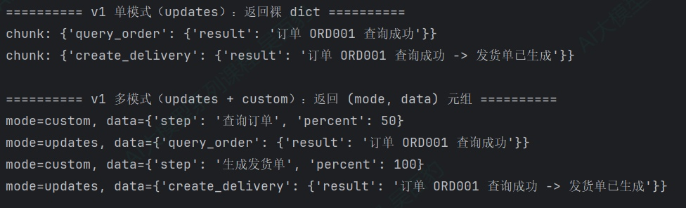
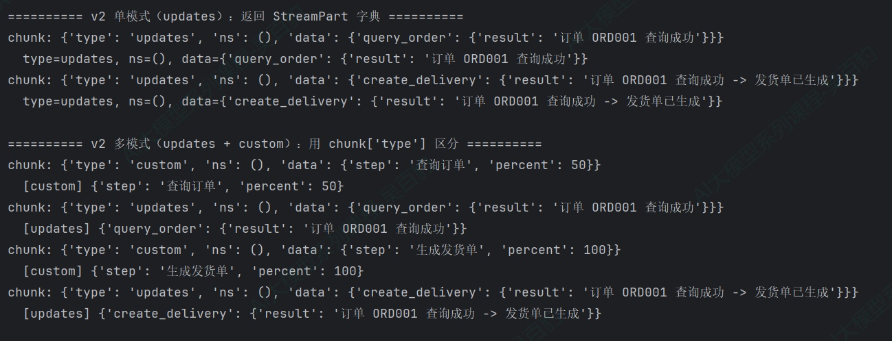
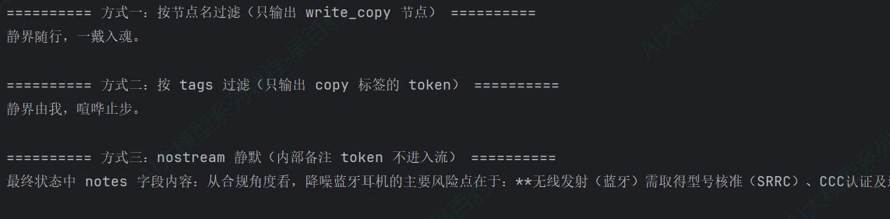
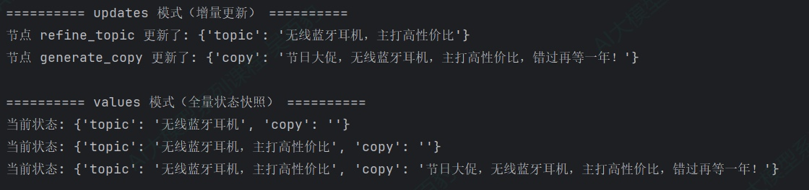
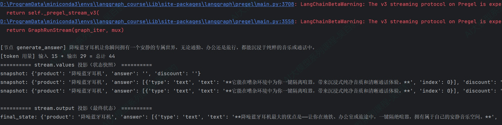
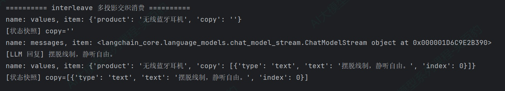

> 📌 **[AI 大模型与云原生全栈知识库](./README.md)** / **模块六：LangGraph 复杂 Workflow 与图状态网络**
> 🏠 [返回主页 README](./README.md) \| ⚡ [面试 30 分钟速记](./interview/00_面试冲刺30分钟速记卡片.md) \| 🎓 [本模块面试题](./interview/04_LangGraph高级工作流面试题.md)

---

# 6\. **LangGraph 流相关**

## 6.1. **LangGraph流式输出模式**

LangChain课程中“Agent流式输出及模式”已经系统讲解过流式输出的核心概念：agent.stream(...) 会渐进式地推送 Agent 运行过程中的更新，支持 values、updates、messages、custom、checkpoints、tasks、debug 七种输出模式，以及多模式组合用法。create\_agent 底层就是 LangGraph，所以 LangChain 的 agent.stream(...) 本质上就是 LangGraph 的 graph.stream(...)，两者是同一套流式机制，只是调用对象不同——前者是封装好的 Agent 对象，后者是底层编译后的图对象。

所以在LangGraph中Graph的流式输出同样支持以下输出模式：

| **模式**            | **输出内容**                                                              | **使用场景**                                                           |
| ------------------------- | ------------------------------------------------------------------------------- | ---------------------------------------------------------------------------- |
| values                    | 每个步骤执行后，都会输出完整的状态信息                                          | 适用于每一步都要获取完整状态、状态持久化场景                                 |
| **updates（默认）** | 每个步骤执行后，只增量更新状态中发生变化的内容                                  | 用于监控Agent 执行进度，例如观察Agent决定调用工具、工具执行结果等步骤        |
| **messages**        | 输出流式返回的Token以及相关的元数据（如：来自哪个节点model/tool）               | 实现类似ChatGPT 的打字机效果，为聊天机器人等交互式应用提供最佳的实时体验     |
| tasks                     | 输出当前task任务信息，包含任务的结果和错误信息                                  | 该模式用于监控任务的生命周期                                                 |
| debug                     | 与tasks模式类似，比task模式多输出任务步骤、时间戳、task类型（task/task_result） | 该模式用于调试、监控task任务的生命周期                                       |
| checkpoints               | 当检查点（checkpoint）被创建时会触发输出，输出包含检查点中的状态                | 用于需要状态持久化、工作流恢复或分布式执行跟踪的高级场景                     |
| **custom**          | 通过get_stream_writer在工具或节点内部自定义发送的数据                           | 用于输出业务逻辑相关的进度信息（如“已处理10/100条记录”）、自定义日志或指标 |

如下案例以默认的updates、custom模式演示在LangGraph中流式输出如何使用。

案例：电商订单处理流水线（查询订单 -> 生成发货单），节点内推送 custom 进度。

```python
"""
langgraph中使用 stream 输出示例：
业务场景：电商订单处理流水线（查询订单 -> 生成发货单），节点内推送 custom 进度。

"""
from typing import TypedDict

from langgraph.config import get_stream_writer
from langgraph.graph import StateGraph, START, END


class State(TypedDict):
    """图状态：订单号与处理结果"""
    order_id: str  # 订单ID
    result: str  # 处理结果


def query_order(state: State) -> dict:
    """节点一：查询订单，推送一条 custom 进度"""
    writer = get_stream_writer()
    writer({"step": "查询订单", "percent": 50})
    return {"result": f"订单 {state['order_id']} 查询成功"}


def create_delivery(state: State) -> dict:
    """节点二：生成发货单，推送一条 custom 进度"""
    writer = get_stream_writer()
    writer({"step": "生成发货单", "percent": 100})
    return {"result": state["result"] + " -> 发货单已生成"}


# ============================================================
# 构建图
# ============================================================
builder = StateGraph(State)
builder.add_node("query_order", query_order)
builder.add_node("create_delivery", create_delivery)

builder.add_edge(START, "query_order")
builder.add_edge("query_order", "create_delivery")
builder.add_edge("create_delivery", END)

graph = builder.compile()


if __name__ == "__main__":
    inputs = {"order_id": "ORD001", "result": ""}

    # ============================================================
    # 场景一：v1 单模式（默认）—— 返回裸数据
    # ============================================================
    print("========== v1 单模式（updates）：返回裸 dict ==========")
    for chunk in graph.stream(inputs, stream_mode="updates"):
        print("chunk:",chunk)

    # ============================================================
    # 场景二：v1 多模式 —— 返回 (mode, data) 元组
    # ============================================================
    print("\n========== v1 多模式（updates + custom）：返回 (mode, data) 元组 ==========")
    for chunk in graph.stream(inputs, stream_mode=["updates", "custom"]):
        # print("chunk:",chunk)
        mode, data = chunk
        print(f"mode={mode}, data={data}")
```

以上代码运行结果如下：



以上代码中注意如下几点：

1) langgraph中流式输出直接调用graph.stream(init\_state，stream\_mode=\[...\])即可，其中通过stream\_mode指定一种或者多种流式输出模式。
2) 在 v1（默认）格式下，如果stream\_mode指定是一种流式输出模式，那么输出的chunk就是dict类型；如果指定的是多种流式输出模式，那么输出的chunk就是（mode,data）元组类型。
3) 在custom流式输出模式中，与langchain agent一样，支持get\_stream\_writer来自定义输出内容。

## 6.2. **v2统一输出格式**

前面案例输出数据是v1(默认)格式，v1 有一个明显的缺点：输出格式会随配置变化，消费代码处理数据非常不方便：

* 单模式：返回裸数据（{"节点名": {"字段": "值"}}）；
* 多模式：返回 (mode, data) 元组；
* 含子图：返回 (namespace, data) 元组。

三种情况三种格式，写消费代码时稍不注意就会出错。version="v2"统一了这一切。v2 下，每个 chunk 都是一个 StreamPart 字典，结构固定，与模式数量、子图配置无关：

```python
{
    "type": "values",  # 或 updates / messages / custom / checkpoints / tasks / debug
    "ns": (),          # 命名空间元组，子图事件才有内容
    "data": ...,       # 实际内容，类型随 stream_mode 不同而变化
}
```

三个字段含义清晰：type 标识这条数据属于哪种模式，ns 标识它来自哪一层图（子图相关），data 是真正的数据。消费端统一用 chunk\["type"\] 做一次分支即可，代码可读性大幅提升。

下面对以上案例增加v2格式输出，可以看到代码中流式输出无论单模式多模式，都返回统一的字典模式。

```python
class State(TypedDict):
    """图状态：订单号与处理结果"""
    order_id: str  # 订单ID
    result: str  # 处理结果


def query_order(state: State) -> dict:
    """节点一：查询订单，推送一条 custom 进度"""
    writer = get_stream_writer()
    writer({"step": "查询订单", "percent": 50})
    return {"result": f"订单 {state['order_id']} 查询成功"}


def create_delivery(state: State) -> dict:
    """节点二：生成发货单，推送一条 custom 进度"""
    writer = get_stream_writer()
    writer({"step": "生成发货单", "percent": 100})
    return {"result": state["result"] + " -> 发货单已生成"}


# ============================================================
# 构建图
# ============================================================
builder = StateGraph(State)
builder.add_node("query_order", query_order)
builder.add_node("create_delivery", create_delivery)

builder.add_edge(START, "query_order")
builder.add_edge("query_order", "create_delivery")
builder.add_edge("create_delivery", END)

graph = builder.compile()


if __name__ == "__main__":
    inputs = {"order_id": "ORD001", "result": ""}

    # ============================================================
    # 场景一：v1 单模式（默认）—— 返回裸数据
    # ============================================================
    print("========== v1 单模式（updates）：返回裸 dict ==========")
    for chunk in graph.stream(inputs, stream_mode="updates"):
        print("chunk:",chunk)

    # ============================================================
    # 场景二：v1 多模式 —— 返回 (mode, data) 元组
    # ============================================================
    print("\n========== v1 多模式（updates + custom）：返回 (mode, data) 元组 ==========")
    for chunk in graph.stream(inputs, stream_mode=["updates", "custom"]):
        print("chunk:",chunk)
        mode, data = chunk
        print(f"  mode={mode}, data={data}")

    # ============================================================
    # 场景三：v2 单模式 —— 返回统一的 StreamPart 字典
    # ============================================================
    print("\n========== v2 单模式（updates）：返回 StreamPart 字典 ==========")
    for chunk in graph.stream(inputs, stream_mode="updates", version="v2"):
        print("chunk:",chunk)
        print(f"  type={chunk['type']}, ns={chunk['ns']}, data={chunk['data']}")

    # ============================================================
    # 场景四：v2 多模式 —— 仍是 StreamPart 字典，用 chunk["type"] 区分
    # ============================================================
    print("\n========== v2 多模式（updates + custom）：用 chunk['type'] 区分 ==========")
    for chunk in graph.stream(inputs, stream_mode=["updates", "custom"], version="v2"):
        print("chunk:",chunk)
        if chunk["type"] == "updates":
            print(f"  [updates] {chunk['data']}")
        elif chunk["type"] == "custom":
            print(f"  [custom] {chunk['data']}")
```

以上代码运行后结果如下：



以上代码需要注意如下几点：

1) 流式输出无论是单模式还是多模式，输出结果格式完全一致，都是字典类型，可以通过 chunk\["type"\] 区分是哪种模式。
2) 为了方便，后续建议使用version=”v2”。

## 6.3. **LLM Token 过滤**

stream\_mode="messages" 会把图中所有 LLM 调用的 token 全部推出来，这在单节点图中很省心，直接遍历打印就行。但一个真实的图往往有多个 LLM 节点：比如一个"生成商品文案"的节点和一个"内部质检"的节点，它们各自调用 LLM，如果直接把 messages 流里的 token 全丢给前端，就会看到文案和质检备注混在一起，用户体验极差。

更精细化的场景中，同一个节点里可能有两个 LLM 调用（比如先用"草稿模型"写初稿、再用"润色模型"精修），你只想把润色模型的 token 推给用户，草稿模型的 token 自己调试用。

### **6.3.1. LLM Token过滤三种方案**

这些场景的共性是：图中不止一个 LLM 调用，但只想把其中一部分 token 流给用户。LangGraph 提供了三种过滤手段，从粗到细：

**1) 按节点过滤：判断来源是哪个节点，适合"某个节点的 token 全部不要"。**

metadata 里有一个 langgraph\_node 字段，记录着"这条 token 是哪个节点产出的"。消费端只需检查这个字段，只保留目标节点名的 token 即可：

```python
for chunk in graph.stream(..., stream_mode="messages", version="v2"):
    if chunk["type"] == "messages":
        msg, metadata = chunk["data"]
        if msg.content and metadata.get("langgraph_node") == "write_copy":
            print(msg.content, end="", flush=True)
```

这种方式最简单，不需要在模型初始化时做任何额外配置，但粒度是"节点级"，同一个节点里所有LLM调用共用一个节点名，没法进一步区分，而且节点名是图结构的硬编码，改了节点名就得改消费代码。

**2) 按 tags 过滤：给模型实例打标签，按标签区分，适合"同一个节点里多个 LLM 调用有不同去向"。**

给模型实例打标签（tags=\["标签名"\]），消费端按 metadata\["tags"\] 过滤。不同模型实例可以有不同标签，同一个节点里两个 LLM 调用用不同标签模型，就能精确区分到"具体哪次调用"：

```python
# 初始化时打标签
copy_model = model.with_config({"tags": ["copy"]})
internal_model = model.with_config({"tags": ["internal"]})

# 消费端按标签过滤
for chunk in graph.stream(..., stream_mode="messages", version="v2"):
    if chunk["type"] == "messages":
        msg, metadata = chunk["data"]
        if msg.content and metadata.get("tags") == ["copy"]:
            print(msg.content, end="", flush=True)
```

tags 比节点名更灵活，同一模型的不同实例可以打不同标签、标签可以按业务含义命名（"copy" / "internal" / "draft" / "polish"），消费端按标签判断语义更清晰，这也是官方推荐的方案。

**3) nostream 静默：给不需要流出的 LLM 打上 nostream 标签，它的 token 压根不进入 messages 流，消费端什么都不用做。**

如果某个 LLM 的输出完全不需要出现在 messages 流里，比如内部审计用的结构化提取、合规评估，最省事的做法是直接给它打上 nostream 标签。被标记的 LLM 调用仍然正常执行、正常产出结果存入状态，但它的 token 不会进入 messages 流，消费端连过滤都不用做：

```python
# 内部用途的模型，打上 nostream 标签
internal_model = model.with_config({"tags": ["nostream"]})

# 这个模型生成的 token 不会出现在 messages 流里
# 但 invoke 结果如果有些如到state，则会正常写入 state
```

### **6.3.2. LLM Token过滤案例**

业务场景：商品详情页需要同时生成"商品卖点文案"和"内部质检备注"两段文本。对外只希望把"卖点文案"逐字推给前端，而"内部质检备注"仅供内部处理、不出现在流里。

本案例演示三种过滤方式：

1) 按 metadata\["langgraph\_node"\] 过滤，只输出指定节点的 token；
2) 给模型打 tags，按 metadata\["tags"\] 过滤；
3) 给内部模型打 nostream 标签，让其 token 完全不进入 messages 流。

```python
from typing import TypedDict

from langgraph.graph import StateGraph, START, END

from init_llm import deepseek_llm_flash


class State(TypedDict):
    """图状态：商品、卖点文案、内部质检备注"""
    product: str  # 商品名称
    copy: str  # 商品卖点文案
    notes: str  # 内部质检备注


# 对外展示的模型，通过 with_config 打上 "copy" 标签
copy_model = deepseek_llm_flash.with_config({"tags": ["copy"]})

# 内部使用的模型，打上 "nostream" 标签 —— 其 token 不进入 messages 流
internal_model = deepseek_llm_flash.with_config({"tags": ["nostream"]})
# internal_model = deepseek_llm_flash

def write_copy(state: State) -> dict:
    """节点一：生成对外展示的商品卖点文案"""
    response = copy_model.invoke(
        [{"role": "user", "content": f"为商品[{state['product']}]写一句卖点文案。要求：直接输出文案正文，20 字以内，不要输出任何解释。"}]
    )
    return {"copy": response.content}


def write_internal_notes(state: State) -> dict:
    """节点二：生成内部质检备注（不会出现在 messages 流中）"""
    response = internal_model.invoke(
        [{"role": "user", "content": f"从合规角度评估商品[{state['product']}]的风险点，一句话总结。"}]
    )
    return {"notes": response.content}


# ============================================================
# 构建图
# ============================================================
builder = StateGraph(State)
builder.add_node("write_copy", write_copy)
builder.add_node("write_internal_notes", write_internal_notes)

builder.add_edge(START, "write_copy")
builder.add_edge("write_copy", "write_internal_notes")
builder.add_edge("write_internal_notes", END)

graph = builder.compile()


if __name__ == "__main__":
    print("========== 方式一：按节点名过滤（只输出 write_copy 节点） ==========")
    for chunk in graph.stream(
        {"product": "降噪蓝牙耳机", "copy": "", "notes": ""},
        stream_mode="messages",
        version="v2",
    ):
        # print("chunk:",chunk)
        if chunk["type"] == "messages":
            msg, metadata = chunk["data"]
            if msg.content and metadata.get("langgraph_node") == "write_copy":
                print(msg.content, end="", flush=True)
    print("\n")

    print("========== 方式二：按 tags 过滤（只输出 copy 标签的 token） ==========")
    for chunk in graph.stream(
        {"product": "降噪蓝牙耳机", "copy": "", "notes": ""},
        stream_mode="messages",
        version="v2",
    ):
        print("chunk:", chunk)
        if chunk["type"] == "messages":
            msg, metadata = chunk["data"]
            if msg.content and metadata.get("tags") == ["copy"]:
                print(msg.content, end="", flush=True)
    print("\n")

    print("========== 方式三：nostream 静默（内部备注 token 不进入流） ==========")
    print("最终状态中 notes 字段内容：", end="")
    result = graph.invoke({"product": "降噪蓝牙耳机", "copy": "", "notes": ""})
    print(result["notes"])
```

以上代码运行后结果如下：



以上代码注意如下几点：

1) 方式一和方式二在本案例中效果相同，但 tags 更灵活：如果将来 write\_copy 节点里加了第二个 LLM 调用（比如 A/B 测试两版文案），按节点名就分不开了，按 tags 可以给两个模型分别打 "copy-a" 和 "copy-b" 来精确控制。
2) nostream 是"不推送"而非"不执行"，internal\_model 的 token 从头到尾没出现在 messages 流里，但 notes 字段正常写入了合规评估结果，所以nostream只屏蔽流式输出，不影响执行与状态写入。
3) messages 模式即使节点内部用 model.invoke()（非流式调用）也能逐 token 推送，LangGraph 在底层拦截了 LLM 调用，把它拆成 token 流，不需要手动把节点改成 model.stream()。

## 6.4. **values与updates使用**

values 和 updates 在 LangChain中已讲清概念：updates 只输出每个节点返回的增量更新，values 输出每一步后的完整状态快照，这里从 graph.stream() 底层视角快速回顾，重点体会"同一个概念，在底层图和封装 Agent 上用法一致"。

业务场景：电商商品文案生成流水线，包含两个节点，"精炼卖点"和"生成文案"。

```python
from typing import TypedDict

from langgraph.graph import StateGraph, START, END


class State(TypedDict):
    """图状态：卖点精炼前后的话题，以及最终生成的文案"""
    topic: str  # 原始话题
    copy: str  # 最终生成的文案


def refine_topic(state: State) -> dict:
    """节点一：精炼卖点，在原始话题后追加限定词"""
    return {"topic": state["topic"] + "，主打高性价比"}


def generate_copy(state: State) -> dict:
    """节点二：基于精炼后的卖点生成文案"""
    return {"copy": f"节日大促，{state['topic']}，错过再等一年！"}


# ============================================================
# 构建图
# ============================================================
builder = StateGraph(State)
builder.add_node("refine_topic", refine_topic)
builder.add_node("generate_copy", generate_copy)

builder.add_edge(START, "refine_topic")
builder.add_edge("refine_topic", "generate_copy")
builder.add_edge("generate_copy", END)

graph = builder.compile()


if __name__ == "__main__":
    # updates：只输出增量更新
    print("========== updates 模式（增量更新） ==========")
    for chunk in graph.stream(
        {"topic": "无线蓝牙耳机", "copy": ""},
        stream_mode="updates",
        version="v2",
    ):
        # print("chunk:",chunk)
        if chunk["type"] == "updates":
            for node_name, update in chunk["data"].items():
                print(f"节点 {node_name} 更新了: {update}")

    print()

    # values：输出完整状态快照
    print("========== values 模式（全量状态快照） ==========")
    for chunk in graph.stream(
        {"topic": "无线蓝牙耳机", "copy": ""},
        stream_mode="values",
        version="v2",
    ):
        # print("chunk:",chunk)
        if chunk["type"] == "values":
            data = chunk["data"]
            print(f"当前状态: {data}")
```

以上代码运行结果如下：



以上代码注意：updates 推送 2 个 chunk（每个节点一个），data 只含该节点改动的字段；values 推送 3 个 chunk（含初始状态），每个都是完整状态。

## 6.5. **事件流-Event Streaming**

### **6.5.1. 事件流投影**

前面小节讲的是graph.stream()与stream\_mode接口，它是LangGraph的底层流式机制，通过 stream\_mode 参数指定"推送哪一类数据"，消费端用 chunk\["type"\] 分支处理。这种方式灵活但偏底层，尤其当想同时拿LLM 的token和最终状态时，需要自己维护两个分支。

事件流（Event Streaming）是stream\_mode之上的类型化封装，它通过 graph.stream\_events(..., version="v3") 返回一个运行流对象，不直接暴露 chunk 字典，而是把数据组织成一组类型化投影，可以直接遍历 stream.messages 拿 LLM token，读 stream.output 拿最终状态，检查 stream.interrupted 看是否中断，每种投影是一个独立的迭代器，互不消耗。

```python
stream = graph.stream_events(
    inputs,
    version="v3",
)
```

以上stream 运行流对象（GraphRunStream）暴露以下投影：

| **投影**         | **用途**                   |
| ---------------------- | -------------------------------- |
| stream.messages        | 流式聊天模型消息和token增量      |
| stream.values          | 迭代每一步的状态快照             |
| stream.output          | 等待最终输出                     |
| stream.subgraphs       | 观察子图的执行                   |
| stream.interrupts      | 检查人工介入的中断               |
| stream.interrupted     | 检查运行是否因等待人工输入而暂停 |
| stream.interleave(...) | 多个投影按到达顺序交织消费       |

**1\. stream.messages**

stream.messages 遍历图中每一次 LLM 调用，每个message对象封装了节点名、逐 token 文本、token 用量等信息。

```python
stream = graph.stream_events(input, version="v3")

for message in stream.messages:
    print(f"[节点 {message.node}]")
    # message.text 可逐 token 迭代
    for token in message.text:
        print(token, end="", flush=True)
    # 或用 str(message.text) 一次性拿完整文本
    print(f"\n[token 用量] {message.output.usage_metadata}")
```

stream.messages是“langgraph.stream.stream\_channel.StreamChannel”类型，是一个可迭代对象，用于按顺序产出图中各节点执行过程中产生的消息事件；遍历中的每个message是“langchain\_core.language\_models.chat\_model\_stream.ChatModelStream”类型，一个 message 对应一次 LLM 调用，若Graph图中有多个 LLM 节点，stream.messages 会依次产出多个 message，用 message.node 即可区分来源。

message包含属性如下：

| **投影**                | **用途**                   |
| ----------------------------- | -------------------------------- |
| message.node                  | 产生这次LLM调用的图节点名称      |
| message.text                  | 可迭代的文本流，可以逐token 读取 |
| message.output                | 本次LLM 调用最终生成的消息对象   |
| message.output.usage_metadata | 输入、输出及总token 用量         |

与之前的 stream\_mode="messages" 的区别：事件流不用手动解包 (message\_chunk, metadata)，直接遍历 stream.messages 拿到封装好的消息对象，语义更清晰。

**2\. stream.values**

stream.values 遍历每一步执行后的完整状态快照：

```python
stream = graph.stream_events(input, version="v3")

for snapshot in stream.values:
print(snapshot)  # 每一步的完整状态字典
```

stream.values是“langgraph.stream.stream\_channel.StreamChannel”类型，是一个可迭代对象，迭代的是每一步完整的快照。

假设图的状态定义如下：

```python
class State(TypedDict):
    question: str
    answer: str
    status: str
```

那么每个 snapshot 都是完整的状态字典：

```python
{
    "question": "无线耳机支持主动降噪吗？",
    "answer": "",
    "status": "等待处理"
}
```

**3\. stream.output**

stream.output 一次性拿最终状态（返回类型是dict），等价于 invoke() 的返回值，但可以配合 stream.messages 一起使用，先逐字看回复，最后拿结果：

```python
stream = graph.stream_events(input, version="v3")

# 消费 messages 驱动流执行
for message in stream.messages:
    for token in message.text:
        print(token, end="", flush=True)

# 流执行完毕后取最终状态
final_state = stream.output
```

**4\. stream.interrupted/stream.interrupts中断**

当图因为 interrupt() 暂停时，stream.interrupted 为 True，stream.interrupts 包含中断内容。

```python
stream = graph.stream_events(input, config=config, version="v3")
_ = stream.output  # 驱动流直到暂停

if stream.interrupted:
    print(stream.interrupts)  # 查看中断内容
    # 然后通过 Command(resume=...) 恢复
```

后续章节会讲解该部分内容。

**5\. stream.interleave**

一个运行流有多个投影，同步代码里若想"按到达顺序"同时消费它们，用 stream.interleave(...)，它接收若干个投影名，返回 (投影名, 数据) 二元组，消费端按名字分支即可。

```python
stream = graph.stream_events(input, version="v3")

for name, item in stream.interleave("values", "messages"):
    if name == "values":
        print(f"[状态快照] {item}")
    elif name == "messages":
        print(f"[LLM 回复] {str(item.text)}")
```

### **6.5.2. 事件流示例**

本案例演示事件流的核心投影：stream.messages 逐字输出 LLM 回复，stream.values 看状态快照，stream.output 拿最终结果。

需求：商品咨询流程，包含"生成回答"和"补充优惠信息"两个节点。

```python
from typing import TypedDict

from langgraph.graph import StateGraph, START, END

from init_llm import deepseek_llm_flash


class State(TypedDict):
    """图状态：商品、回答、优惠信息"""
    product: str # 商品名称
    answer: str # 商品咨询回答
    discount: str # 优惠信息


def generate_answer(state: State) -> dict:
    """节点一：生成商品咨询回答"""
    response = deepseek_llm_flash.invoke(
        [{"role": "user", "content": f"用一句话介绍商品【{state['product']}】的优点"}]
    )
    return {"answer": response.content}


def add_discount(state: State) -> dict:
    """节点二：补充优惠信息（纯字符串，不经过 LLM）"""
    return {"discount": f"{state['product']} 限时 8 折，领券再减 30 元"}


# ============================================================
# 构建图
# ============================================================
builder = StateGraph(State)
builder.add_node("generate_answer", generate_answer)
builder.add_node("add_discount", add_discount)

builder.add_edge(START, "generate_answer")
builder.add_edge("generate_answer", "add_discount")
builder.add_edge("add_discount", END)

graph = builder.compile()


if __name__ == "__main__":
    inputs = {"product": "降噪蓝牙耳机", "answer": "", "discount": ""}

    # ============================================================
    # stream.messages：迭代每一步LLM的 message
    # ============================================================
    # 通过 stream_events(version="v3") 拿到运行流对象
    stream = graph.stream_events(inputs, version="v3")
    print("type(stream.messages):", type(stream.messages))

    # 遍历 stream.messages：每个 message 对应一次 LLM 调用
    for message in stream.messages:
        print(f"\n[节点 {message.node}] ", end="")
        # message.text 可逐 token 迭代，str(message.text) 得到完整文本
        for token in message.text:
            print(token, end="", flush=True)
        # message.output.usage_metadata 携带本次调用的 token 用量
        usage = message.output.usage_metadata
        print(
            f"\n[token 用量] 输入 {usage['input_tokens']} + 输出 {usage['output_tokens']} = 总计 {usage['total_tokens']}")

    # ============================================================
    # stream.values：迭代每一步的状态快照
    # ============================================================
    print("========== stream.values 投影（状态快照） ==========")
    stream = graph.stream_events(inputs, version="v3")
    for snapshot in stream.values:
        print("snapshot:", snapshot)

    # ============================================================
    # stream.output：最终状态（一次性拿到）
    # ============================================================
    print("\n========== stream.output 投影（最终状态） ==========")
    stream = graph.stream_events(inputs, version="v3")
    final_state = stream.output
    print("final_state:", final_state)
```

以上代码运行结果如下：



以上代码注意：

1) v3 事件流目前处于实验阶段，运行时会打印 LangChainBetaWarning。但它已是官方文档对新应用的推荐方式
2) message.output.usage\_metadata 直接给出本次 LLM 调用的输入 / 输出 / 总计 token 数，这在做成本核算、限流、计费时非常实用。
3) answer 状态是在“generate\_answer”节点中设置的model.invoke().content，在v3事件流中，model.invoke返回的是 content blocks 列表格式：“\[{'type': 'text', 'text': '回复内容', 'index': 0}\]”
4) stream.messages和stream.values返回的都是“langgraph.stream.stream\_channel.StreamChannel”对象，类似迭代器，数据迭代完后不存储就丢弃，所以每个操作设置新的“stream = graph.stream\_events(inputs, version="v3")”

### **6.5.3. interleave示例**

如下示例在同一个图里既想逐字看 LLM 回复，又想实时观察状态变化，用 interleave 把两个投影按到达顺序交织：

```python
from typing import TypedDict

from langgraph.graph import StateGraph, START, END

from init_llm import deepseek_llm_flash


class State(TypedDict):
    """图状态：商品与生成的文案"""
    product: str
    copy: str


def write_copy(state: State) -> dict:
    """节点：生成商品文案"""
    response = deepseek_llm_flash.invoke(
        [{"role": "user", "content": f"为商品[{state['product']}]写一句 20 字以内的卖点文案，直接输出正文"}]
    )
    return {"copy": response.content}


# ============================================================
# 构建图
# ============================================================
builder = StateGraph(State)
builder.add_node("write_copy", write_copy)

builder.add_edge(START, "write_copy")
builder.add_edge("write_copy", END)

graph = builder.compile()


if __name__ == "__main__":
    print("========== interleave 多投影交织消费 ==========")

    stream = graph.stream_events({"product": "无线蓝牙耳机", "copy": ""}, version="v3")

    # interleave 把 values 和 messages 两个投影按到达顺序交织
    for name, item in stream.interleave("values", "messages"):
        print(f"name: {name}, item: {item}")
        if name == "values":
            print(f"[状态快照] copy={item['copy']!r}")
        elif name == "messages":
            print("[LLM 回复] ", str(item.text))
```

代码运行结果如下：



代码注意：interleave 返回 (投影名, 数据) 二元组，name 是投影名（"values" / "messages"），item 是对应投影的数据。

---
> 🏠 **[返回主页 README](./README.md)** \| ◀️ **上一篇：[24. LangGraph 容错机制](./24LangGraph%E5%AE%B9%E9%94%99.md)** \| ▶️ **下一篇：[26. LangGraph 人工介入](./26LangGraph%E4%BA%BA%E5%B7%A5%E4%BB%8B%E5%85%A5.md)** \| 🎓 **[进入本模块面试高频题](./interview/04_LangGraph高级工作流面试题.md)**
