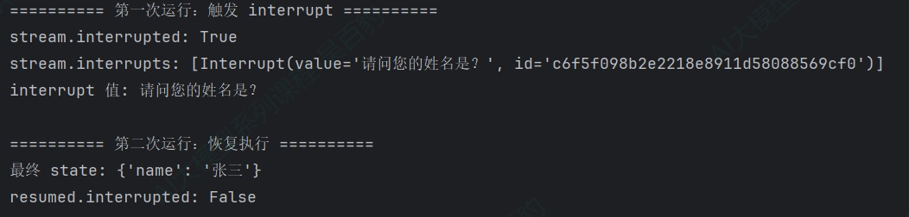
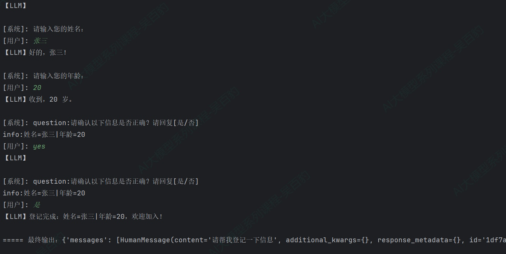
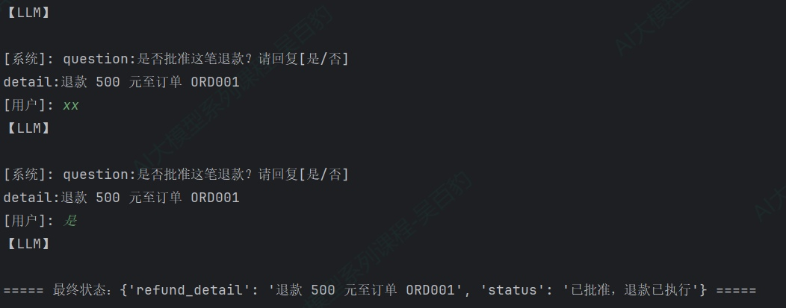
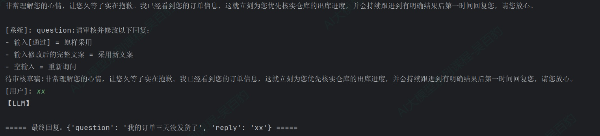
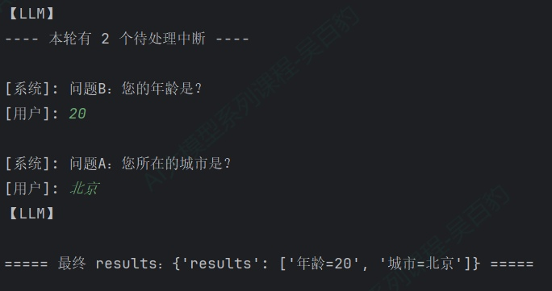
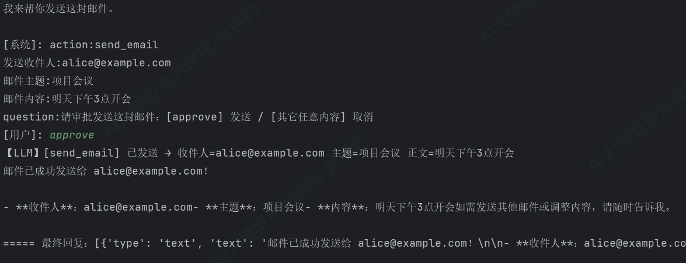

> 📌 **[AI 大模型与云原生全栈知识库](./README.md)** / **模块六：LangGraph 复杂 Workflow 与图状态网络**
> 🏠 [返回主页 README](./README.md) \| ⚡ [面试 30 分钟速记](./interview/00_面试冲刺30分钟速记卡片.md) \| 🎓 [本模块面试题](./interview/04_LangGraph高级工作流面试题.md)

---

# 7\. **LangGraph 人工介入**

## 7.1. **interrupt介绍及使用方式**

前面章节的图都是全自动的：从 START 一路执行到 END，中间不等人。但现实业务里，很多动作不能由 Agent 自行拍板——退一笔大额款项、发一封对外邮件、上线一个配置变更，都需要人点头确认。LangGraph 的 interrupt（中断） 机制就是为此设计的。

interrupt() 函数可以在任意节点、任意位置暂停图的执行，把一个值（通常是"请审批的详情"）抛给调用方，然后无限期等待，直到调用方用 Command(resume=...) 恢复。恢复时，resume 的值会作为 interrupt() 的返回值，节点从暂停点继续往下走。

```python

# interrupt使用
def ask_name(state: State) -> dict:
    """节点内使用interrupt暂停，恢复后 interrupt 返回用户输入的值"""
    name = interrupt("请问您的姓名是？")
return {"name": name}

... ...
#执行
stream = graph.stream_events({...}, config=config, version="v3")

#判断中断 stream.interrupted ,为True表示有中断，False 没有中断


#获取中断的值
print(f"interrupt 值: {stream.interrupts[0].value}")

... ...
#interrupt恢复执行
resumed = graph.stream_events(Command(resume="张三"), config=config, version="v3")
```

使用interrupt()注意如下几点：

**1\. interrupt(xx)传值**

interrupt(xx)中可以传入字符串、数字、字典等，传给 interrupt() 的值会原样出现在 stream.interrupts\[0\].value 中，然后被调用方看到。所以传什么取决于你希望调用方看到什么信息来做决策。

**2\. 要让 interrupt()正常工作，需要满足如下三个条件**

1) Checkpointer：图编译时必须带 Checkpointer，因为暂停时要把完整状态持久化下来，等恢复时从断点继续。
2) thread\_id：调用时通过 config={"configurable": {"thread\_id": ...}} 指定线程，这是 Checkpointer 找回状态的指针。同一个 thread\_id 恢复同一个状态，换一个 thread\_id 就是全新的线程。
3) JSON 可序列化的数据：传给interrupt()的值必须能被序列化（字符串、数字、字典等），不能传函数、类实例等复杂对象。

**3\. 调用 interrupt()后，LangGraph 内部做如下五件事**

1) 图执行在interrupt()这一行挂起；
2) 当前状态通过 Checkpointer 保存（生产环境用持久化后端，即使进程重启也不丢）；
3) interrupt()的值返回给调用方——用事件流时出现在stream.interrupts，用invoke() 时出现在结果的 **interrupt** 字段；
4) Graph图无限期等待，直到调用方恢复；
5) 恢复值传回节点，成为interrupt()的返回值。

**4\. 恢复中断的要点**

恢复不是从 interrupt() 那一行继续，而是整个节点从头重新执行。interrupt() 通过抛异常来暂停，异常向上传播被运行时捕获后，节点就"中断"了；恢复时运行时重新启动整个节点，interrupt() 这次拿到 resume 值后正常返回，于是节点里 interrupt() 之前的代码会再跑一遍。

## 7.2. **interrupt暂停使用**

在节点函数里调用 interrupt(值) 即可暂停。下面通过一个"收集用户姓名"的案例演示最基础的暂停与恢复。

案例：客服系统需要先收集用户姓名才能继续。节点调用 interrupt() 暂停图执行，把问题抛给调用方；收到 Command(resume=...) 后，interrupt() 返回该值，图从暂停点继续。

```python
from typing import TypedDict

from langgraph.checkpoint.memory import InMemorySaver
from langgraph.graph import StateGraph, START, END
from langgraph.types import interrupt, Command


class State(TypedDict):
    """图状态：用户姓名"""
    name: str


def ask_name(state: State) -> dict:
    """节点：暂停并询问用户姓名，恢复后 interrupt 返回用户输入的值"""
    name = interrupt("请问您的姓名是？")
    return {"name": name}


# ============================================================
# 构建图（带 Checkpointer）
# ============================================================
builder = StateGraph(State)
builder.add_node("ask_name", ask_name)

builder.add_edge(START, "ask_name")
builder.add_edge("ask_name", END)

graph = builder.compile(checkpointer=InMemorySaver())

config = {"configurable": {"thread_id": "thread001"}}


if __name__ == "__main__":
    # ============================================================
    # 第一次运行：触发 interrupt，图暂停
    # ============================================================
    print("========== 第一次运行：触发 interrupt ==========")
    stream = graph.stream_events({"name": ""}, config=config, version="v3")
    xx = stream.output  # 驱动流直到暂停

    print(f"stream.interrupted: {stream.interrupted}")
    print(f"stream.interrupts: {stream.interrupts}")
    print(f"interrupt 值: {stream.interrupts[0].value}")

    # ============================================================
    # 第二次运行：Command(resume=...) 恢复，值传给 interrupt 的返回值
    # ============================================================
    print("\n========== 第二次运行：恢复执行 ==========")
    resumed = graph.stream_events(Command(resume="张三"), config=config, version="v3")
    print(f"最终 state: {resumed.output}")
    print(f"resumed.interrupted: {resumed.interrupted}")

```

以上代码运行结果：



以上代码注意如下几点：

1) v3 是惰性流，stream\_events 只创建对象，不执行图。任何一次投影属性访问（interrupts/interrupted/output）或遍历 messages 才会驱动图。
2) 第一次调用时，stream.interrupted为True，stream.interrupts是一个Interrupt对象元组，Interrupt.value就是中断输出的信息，对应interrupt(xxx)中写出的内容。
3) 第二次调用改用 Command(resume="张三") 作为输入，interrupt() 返回 "张三"，节点把它写入 name 字段，图正常结束。
4) 必须使用相同的 thread\_id 恢复；Command(resume=...) 是唯一应该作为 invoke / stream 输入的 Command 形式（其他 Command 参数如 update、goto 用于节点返回值，不要混用）。

## 7.3. **交互式HITL**

上面案例中，stream\_events 触发中断 → 看 interrupts → Command(resume) 恢复 → 结束。但在真实的人机协同应用中，经常要反复和用户交互多轮，比如先问姓名、再问年龄、又确认信息，而且每轮都要实时流式显示 LLM 的回复，等用户输入后继续。

官方给出了一套通用的驱动模式：用一个 while True 循环反复调用 stream\_events，每次处理完中断后再恢复，直到图完整跑完（stream.interrupted 为 False）。核心代码如下：

```python
from langgraph.types import Command

stream_input: dict | Command = initial_input   # 第一轮传入初始输入

while True:
    stream = graph.stream_events(stream_input, config=config, version="v3")

    # ① 流式显示 AI 回复（token 逐字输出）
    for message in stream.messages:
        for token in message.text:
            display_streaming_content(token)

    # ② 图跑完（或暂停）后，检查是否中断
    if not stream.interrupted:
        final_state = stream.output   # 完整跑完，拿最终状态，结束循环
        break

    # ③ 有中断：读取载荷，询问用户输入
    interrupt_info = stream.interrupts[0].value
    user_response = get_user_input(interrupt_info)

    # ④ 把用户响应作为下一次 stream_events 的输入（resume）
    stream_input = Command(resume=user_response)
```

while True 循环会一直转，直到某次运行 stream.interrupted 为 False（图真的跑完了）才 break 退出。以上循环中涉及到Stream的四个投影：

* stream.messages：LLM 输出的内容块，逐字输出。
* stream.interrupted / stream.interrupts：每次运行结束后，判断图是否暂停；若暂停，从 stream.interrupts 读中断数据。
* Command(resume=...)：作为下一次 stream\_events 的输入传给图，恢复执行。
* stream.output：当 interrupted 为 False 时，图已完整跑完，用它拿最终状态。

案例：一个"新用户登记"助手，需要多轮询问用户信息（姓名、年龄），每轮都实时流式显示 LLM 回复，等用户输入后再进入下一轮，直到收集完成。

```python
from typing import Annotated
import operator

from langchain_core.messages import AIMessage
from langgraph.checkpoint.memory import InMemorySaver
from langgraph.graph import StateGraph, START, END, MessagesState
from langgraph.types import interrupt, Command


class State(MessagesState):
    """状态：继承消息列表，额外增加已收集的用户信息条目与确认答案"""
    info: Annotated[list[str], operator.add]
    confirm_answer: str   # 最近一次确认输入（是/否/其它）


def ask_name(state: State) -> dict:
    """节点一：问姓名，暂停，把收集结果写回状态"""
    name = interrupt("请输入您的姓名：")
    return {"info": [f"姓名={name}"], "messages": [AIMessage(content=f"好的，{name}！")]}


def ask_age(state: State) -> dict:
    """节点二：问年龄，暂停，把收集结果写回状态"""
    age = interrupt("请输入您的年龄：")
    return {"info": [f"年龄={age}"], "messages": [AIMessage(content=f"收到，{age} 岁。")]}


def confirm(state: State) -> dict:
    """节点：interrupt 一次收集确认输入，不判断合法性（判断交给条件边路由）"""
    summary = "|".join(state["info"])
    answer = interrupt({"question": "请确认以下信息是否正确？请回复[是/否]", "info": summary})
    return {"confirm_answer": str(answer).strip()}


def complete(state: State) -> dict:
    """节点：确认通过，登记完成"""
    summary = "|".join(state["info"])
    return {"messages": [AIMessage(content=f"登记完成：{summary}，欢迎加入！")]}


def cancel(state: State) -> dict:
    """节点：确认取消"""
    return {"messages": [AIMessage(content="好的，已取消登记。")]}


def route_confirm(state: State) -> str:
    """路由函数：根据确认输入分流 —— 是→完成 / 否→取消 / 其它→回跳重新确认"""
    answer = state.get("confirm_answer", "")
    if answer == "是":
        return "complete"
    if answer == "否":
        return "cancel"
    return "confirm"   # 非是/否：回跳 confirm 重新询问


builder = StateGraph(State)
builder.add_node("ask_name", ask_name)
builder.add_node("ask_age", ask_age)
builder.add_node("confirm", confirm)
builder.add_node("complete", complete)
builder.add_node("cancel", cancel)

builder.add_edge(START, "ask_name")
builder.add_edge("ask_name", "ask_age")
builder.add_edge("ask_age", "confirm")
builder.add_conditional_edges("confirm", route_confirm, {
    "confirm": "confirm",
    "complete": "complete",
    "cancel": "cancel",
})
builder.add_edge("complete", END)
builder.add_edge("cancel", END)

graph = builder.compile(checkpointer=InMemorySaver())


def get_user_input(interrupt_info) -> str:
    """根据中断信息向用户提问并读取输入（通用：字符串/字典都行）"""
    if isinstance(interrupt_info, str):
        return input(f"\n[系统]: {interrupt_info}\n[用户]: ").strip()
    # 字典场景：遍历所有键值对展示
    show_info = "\n".join(f"{k}:{v}" for k, v in interrupt_info.items())
    return input(f"\n[系统]: {show_info}\n[用户]: ").strip()


if __name__ == "__main__":
    config = {"configurable": {"thread_id": "thread001"}}

    stream_input: dict | Command = {
        "messages": [{"role": "user", "content": "请帮我登记一下信息"}],
        "info": [],
        "confirm_answer": "",
    }

    while True:
        # 1. 调用图，事件流驱动
        stream = graph.stream_events(stream_input, config=config, version="v3")

        # 2. 流式显示 LLM 回复
        print("【LLM】", end="", flush=True)
        for message in stream.messages:
            for token in message.text:
                if token.strip():
                    print(token, end="", flush=True)
        print()

        # 3. 图没有中断，完整跑完
        if not stream.interrupted:
            final_state = stream.output
            print(f"\n===== 最终输出：{final_state} =====")
            break

        # 4. 图中断，读取中断信息向用户提问
        try:
            user_response = get_user_input(stream.interrupts[0].value)
        except (EOFError, KeyboardInterrupt):
            print("\n[系统] 用户中断退出，会话结束")
            break

        # 5. 用用户输入作为 resume 继续
        stream_input = Command(resume=user_response)

```

以上代码运行后结果如下：



以上代码注意如下几点：

1) 以上代码中通过条件边“route\_confirm”来确认用户输入的消息，根据用户不同输入路由到不同的节点，当输入不符合要求的内容时，再次路由到“confirm”节点进行中断。
2) get\_user\_input 处理两类载荷：interrupt 可以传字符串（"请输入您的姓名："）也可以传字典（{"question": ..., "info": ...}）。
3) 每次循环都用同一个 thread\_id：config 不变，Checkpointer 确保每次 Command(resume=...) 从上次中断的检查点继续。
4) stream.messages 逐字驱动，每轮先流式打印 AI 回复（打字机），再处理中断，交互体验自然。

## 7.4. **常见模式**

interrupt 解锁的核心能力是"暂停并等待外部输入"，据此可以组合出几类典型的人机协同模式。

### **7.4.1. 审批（approve/reject）**

执行关键动作（退款、扣款、发邮件）前暂停，让人批准或拒绝。

案例：电商退款操作属于高风险动作，执行前必须暂停让人工审批。

```python
from typing import TypedDict

from langgraph.checkpoint.memory import InMemorySaver
from langgraph.graph import StateGraph, START, END
from langgraph.types import interrupt, Command


class State(TypedDict):
    """图状态：退款详情、处理结果、最近一次审批输入"""
    refund_detail: str
    status: str
    approval_answer: str


def approval_node(state: State) -> dict:
    """节点：interrupt 一次收集审批输入，不判断合法性（判断交给条件边路由）"""
    decision = interrupt({
        "question": "是否批准这笔退款？请回复[是/否]",
        "detail": state["refund_detail"],
    })
    return {"approval_answer": str(decision).strip()}


def proceed_node(state: State) -> dict:
    """节点：审批通过，执行退款"""
    return {"status": "已批准，退款已执行"}


def cancel_node(state: State) -> dict:
    """节点：审批拒绝，取消退款"""
    return {"status": "已拒绝，退款已取消"}


def route_approval(state: State) -> str:
    """路由函数：根据审批输入分流 —— 是→执行 / 否→取消 / 其它→回跳重新审批"""
    answer = state.get("approval_answer", "")
    if answer == "是":
        return "proceed"
    if answer == "否":
        return "cancel"
    return "approval"   # 非是/否：回跳 approval 重新询问


# ============================================================
# 构建图（带 Checkpointer）
# ============================================================
builder = StateGraph(State)
builder.add_node("approval", approval_node)
builder.add_node("proceed", proceed_node)
builder.add_node("cancel", cancel_node)

builder.add_edge(START, "approval")
builder.add_conditional_edges("approval", route_approval, {
    "approval": "approval",
    "proceed": "proceed",
    "cancel": "cancel",
})
builder.add_edge("proceed", END)
builder.add_edge("cancel", END)

graph = builder.compile(checkpointer=InMemorySaver())


def get_user_input(interrupt_info) -> str:
    """根据中断信息向用户提问并读取输入（通用：字符串/字典都行）"""
    if isinstance(interrupt_info, str):
        return input(f"\n[系统]: {interrupt_info}\n[用户]: ").strip()

    # 字典场景：遍历所有键值对展示，原样返回输入
    show_info = "\n".join(f"{k}:{v}" for k, v in interrupt_info.items())
    return input(f"\n[系统]: {show_info}\n[用户]: ").strip()


if __name__ == "__main__":
    config = {"configurable": {"thread_id": "thread001"}}

    # 输入退款详情
    stream_input: dict | Command = {
        "refund_detail": "退款 500 元至订单 ORD001",
        "status": "",
        "approval_answer": "",
    }

    while True:
        # 1. 调用图，事件流驱动
        stream = graph.stream_events(stream_input, config=config, version="v3")

        # 2. 流式显示回复（本图无 LLM 节点，仅保证事件流模式可用）
        print("【LLM】", end="", flush=True)
        for message in stream.messages:
            for token in message.text:
                if token.strip():
                    print(token, end="", flush=True)
        print()

        # 3. 图没有中断，完整跑完
        if not stream.interrupted:
            final_state = stream.output
            print(f"\n===== 最终状态：{final_state} =====")
            break

        # 4. 图中断，读取中断信息向用户提问
        try:
            user_response = get_user_input(stream.interrupts[0].value)
        except (EOFError, KeyboardInterrupt):
            print("\n[系统] 用户中断退出，会话结束")
            break

        # 5. 用户输入作为 resume 继续，进入下一轮
        stream_input = Command(resume=user_response)
```

以上代码运行后直接输入“是/否”，可以进行对话操作。



### **7.4.2. 审核并编辑内容**

这种模式适合"纠正 LLM、补充信息、调整措辞"等场景，LLM 先出草稿，人把关后再进入后续流程。

案例：客服回复由 LLM 生成草稿后，需人工审核修改才能发出。

```python
from typing import TypedDict

from langgraph.checkpoint.memory import InMemorySaver
from langgraph.graph import StateGraph, START, END
from langgraph.types import interrupt, Command

from init_llm import deepseek_llm_flash


class State(TypedDict):
    """图状态：用户问题、最终回复文案、最近一次审核输入"""
    question: str
    reply: str
    review_input: str


def generate_reply(state: State) -> dict:
    """节点一：LLM 生成回复草稿"""
    response = deepseek_llm_flash.invoke(
        [{"role": "user", "content": f"你是客服，用户问：{state['question']}，写一句礼貌的回复，不要让用户选择。"}]
    )
    return {"reply": response.content[0]["text"]}


def review_reply(state: State) -> dict:
    """节点二：interrupt 一次收集审核输入，不判断合法性（判断交给条件边路由）"""
    edited = interrupt({
        "question": "请审核并修改以下回复：\n- 输入[通过] = 原样采用\n- 输入修改后的完整文案 = 采用新文案\n- 空输入 = 重新询问",
        "待审核草稿": state["reply"],
    })
    return {"review_input": edited.strip()}


def apply_original(state: State) -> dict:
    """节点：审核员输入[通过]，原样采用草稿"""
    return {"review_input": ""}


def apply_edited(state: State) -> dict:
    """节点：审核员给了新文案，采用新文案（从 review_input 读取）"""
    return {"reply": state["review_input"], "review_input": ""}


def route_review(state: State) -> str:
    """路由函数：审核输入分流 —— 通过→原稿 / 非空→新文案 / 空→回跳重新审核"""
    edited = state.get("review_input", "")
    if edited == "通过":
        return "apply_original"
    if edited:
        return "apply_edited"
    return "review_reply"   # 空输入：回跳 review_reply 重新询问


# ============================================================
# 构建图（带 Checkpointer）
# ============================================================
builder = StateGraph(State)
builder.add_node("generate_reply", generate_reply)
builder.add_node("review_reply", review_reply)
builder.add_node("apply_original", apply_original)
builder.add_node("apply_edited", apply_edited)

builder.add_edge(START, "generate_reply")
builder.add_edge("generate_reply", "review_reply")
builder.add_conditional_edges("review_reply", route_review, {
    "review_reply": "review_reply",
    "apply_original": "apply_original",
    "apply_edited": "apply_edited",
})
builder.add_edge("apply_original", END)
builder.add_edge("apply_edited", END)

graph = builder.compile(checkpointer=InMemorySaver())


def get_user_input(interrupt_info) -> str:
    """根据中断信息向用户提问并读取输入（通用：字符串/字典都行）"""
    if isinstance(interrupt_info, str):
        return input(f"\n[系统]: {interrupt_info}\n[用户]: ").strip()

    # 字典场景：遍历所有键值对展示，原样返回输入
    show_info = "\n".join(f"{k}:{v}" for k, v in interrupt_info.items())
    return input(f"\n[系统]: {show_info}\n[用户]: ").strip()


if __name__ == "__main__":
    config = {"configurable": {"thread_id": "review-hitl-1"}}

    stream_input: dict | Command = {"question": "我的订单三天没发货了", "reply": "", "review_input": ""}

    while True:
        # 1. 调用图，事件流驱动
        stream = graph.stream_events(stream_input, config=config, version="v3")

        # 2. 流式显示 LLM 回复
        print("【LLM】", end="", flush=True)
        for message in stream.messages:
            for token in message.text:
                if token.strip():
                    print(token, end="", flush=True)
        print()

        # 3. 图没有中断，完整跑完
        if not stream.interrupted:
            final_state = stream.output
            print(f"\n===== 最终回复：{final_state} =====")
            break

        # 4. 图中断，读取中断信息向用户提问
        try:
            user_response = get_user_input(stream.interrupts[0].value)
        except (EOFError, KeyboardInterrupt):
            print("\n[系统] 用户中断退出，会话结束")
            break

        # 5. 用户输入作为 resume 继续，进入下一轮
        stream_input = Command(resume=user_response)

```

以上代码运行后，输入随意的内容作为新的回复内容。



### **7.4.3. 校验人工输入**

校验人工输入就是让用户输入内容，对内容进行校验，不合法就进入中断，让用户重新输入内容并校验，校验通过流继续执行，校验不通过再次进入中断。

实现这种效果的关键是interrupt 在节点里只调用一次，用条件边循环实现"重问"，强烈不建议在节点里写 while True 循环，因为resume后会重新执行当前节点，虽然while True+interrupt使用也没有问题（LangGraph内部给每次中断都进行编号，resume后再次执行while True时，编号相同会获取对应resume值继续执行），但当业务逻辑复杂了很容易出现逻辑混乱，甚至死循环。

校验人工输入在前面的每个案例几乎都有涉及，这里不再单独准备案例。

### **7.4.4. 多个并行中断**

当多个并行分支同时中断时，需要一次性恢复多个中断。必须用 interrupt 的 id 做映射（{interrupt\_id: resume值}），而不是按列表顺序硬编码——因为并行中断的到达顺序是不确定的。

案例：问卷系统并行收集多个字段（城市、年龄），每个字段一个节点、各 interrupt 一次。两个并行节点会同时暂停，产生两个待处理中断；恢复时用 resume map（{interrupt\_id: 值}）一次性把每个响应配对到正确的中断。

```python
from typing import Annotated, TypedDict
import operator

from langgraph.checkpoint.memory import InMemorySaver
from langgraph.graph import StateGraph, START, END
from langgraph.types import interrupt, Command


class State(TypedDict):
    """图状态：收集结果列表（用 operator.add 累加）"""
    results: Annotated[list[str], operator.add]


def ask_city(state: State) -> dict:
    """节点 A：询问城市"""
    city = interrupt("问题A：您所在的城市是？")
    return {"results": [f"城市={city}"]}


def ask_age(state: State) -> dict:
    """节点 B：询问年龄"""
    age = interrupt("问题B：您的年龄是？")
    return {"results": [f"年龄={age}"]}


# ============================================================
# 构建图（两个节点从 START 并行出发，带 Checkpointer）
# ============================================================
builder = StateGraph(State)
builder.add_node("ask_city", ask_city)
builder.add_node("ask_age", ask_age)

builder.add_edge(START, "ask_city")
builder.add_edge(START, "ask_age")
builder.add_edge("ask_city", END)
builder.add_edge("ask_age", END)

graph = builder.compile(checkpointer=InMemorySaver())


def get_user_input(interrupt_info) -> str:
    """根据中断信息向用户提问并读取输入（通用：字符串/字典都行）"""
    if isinstance(interrupt_info, str):
        return input(f"\n[系统]: {interrupt_info}\n[用户]: ").strip()

    # 字典场景：遍历所有键值对展示，原样返回输入
    show_info = "\n".join(f"{k}:{v}" for k, v in interrupt_info.items())
    return input(f"\n[系统]: {show_info}\n[用户]: ").strip()


if __name__ == "__main__":
    config = {"configurable": {"thread_id": "thread001"}}

    stream_input: dict | Command = {"results": []}

    while True:
        # 1. 调用图，事件流驱动
        stream = graph.stream_events(stream_input, config=config, version="v3")

        # 2. 流式显示 LLM 回复
        print("【LLM】", end="", flush=True)
        for message in stream.messages:
            for token in message.text:
                if token.strip():
                    print(token, end="", flush=True)
        print()

        # 3. 图没有中断，完整跑完
        if not stream.interrupted:
            final_state = stream.output
            print(f"\n===== 最终 results：{final_state} =====")
            break

        # 4. 多个并行中断：逐个读取中断信息向用户提问，配对成 resume map
        print(f"---- 本轮有 {len(stream.interrupts)} 个待处理中断 ----")
        resume_map = {}
        for i in stream.interrupts:
            user_response = get_user_input(i.value)
            # 用 i.id 作为键构建 resume map
            resume_map[i.id] = user_response

        # 5. 用 resume map 一次性恢复所有中断
        stream_input = Command(resume=resume_map)

```

以上代码运行后，对每部分进行中断输入对应信息得到如下：



以上代码注意如下几点：

1) 两个并行节点同时中断，stream.interrupts里有两个Interrupt。注意stream.interrupts 列表顺序不能保证稳定，所以交互式里逐个展示、逐一回答，用 [interrupt.id](http://interrupt.id) 作为 resume map 的键配对，绝不能用列表索引硬编码。
2) resume map一次性恢复：Command(resume={id: 值, ...}) 让两个暂停的节点各拿到自己的答案，不必分两次 resume。
3) 两个节点写入同一个results字段，所以该字段必须用operator.add归并器，否则会抛 InvalidUpdateError。

### **7.4.5. 工具内中断**

interrupt() 不仅能放在图节点里，还能直接放进 @tool 装饰的工具函数内部。这样每当 LLM 决定调用该工具时，图就会在工具执行前暂停，等待人工审批——审批逻辑和工具绑定在一起，任何用到该工具的图都自动获得审批能力，无需改动图结构。

这种模式适用于需要"每次执行工具前都人工确认"的场景：发邮件、扣款、下单、删除数据等高风险操作。

案例：发送邮件前需人工审批。

```python
from langchain_core.tools import tool
from langgraph.checkpoint.memory import InMemorySaver
from langgraph.graph import StateGraph, START, END, MessagesState
from langgraph.prebuilt import ToolNode
from langgraph.types import interrupt, Command

from init_llm import deepseek_llm_flash  # noqa: E402


# ============================================================
# 工具：发送邮件（内含 interrupt）
# ============================================================
@tool
def send_email(to: str, subject: str, body: str) -> str:
    """发送邮件给收件人。当用户要发送邮件时使用。"""
    # 暂停，把邮件详情抛给审批人；恢复后 response 是审批人的决策
    response = interrupt({
        "action": "send_email",
        "发送收件人": to,
        "邮件主题": subject,
        "邮件内容": body,
        "question": "请审批发送这封邮件：[approve] 发送 / [其它任意内容] 取消",
    })


    if response == "approve":
        # 审批通过，模拟发送邮件
        print(f"[send_email] 已发送 → 收件人={to} 主题={subject} 正文={body}")
        return f"邮件已发送给 {to}（主题：{subject}）"

    # 审批拒绝
    return "邮件已取消发送"


# ============================================================
# 绑定工具的大模型
# ============================================================
tools = [send_email]
model = deepseek_llm_flash.bind_tools(tools)


# ============================================================
# 定义节点
# ============================================================
def agent(state: MessagesState) -> dict:
    """Agent 节点：LLM 决定调用工具还是直接回答"""
    return {"messages": [model.invoke(state["messages"])]}

def should_continue(state: MessagesState):
    """路由函数：最后一条消息含 tool_calls 则进 tools，否则结束"""
    last_message = state["messages"][-1]
    if last_message.tool_calls:
        return "tools"
    return END


# ============================================================
# 构建图（带 Checkpointer）
# ============================================================
builder = StateGraph(MessagesState)
builder.add_node("agent", agent)
builder.add_node("tools", ToolNode(tools))

builder.add_edge(START, "agent")
builder.add_conditional_edges("agent", should_continue, ["tools", END])
builder.add_edge("tools", "agent")

graph = builder.compile(checkpointer=InMemorySaver())


def get_user_input(interrupt_info):
    """根据中断信息向用户提问并读取输入（通用：字符串/字典都行）"""
    if isinstance(interrupt_info, str):
        return input(f"\n[系统]: {interrupt_info}\n[用户]: ").strip()

    # 字典场景：遍历所有键值对展示，原样返回输入
    show_info = "\n".join(f"{k}:{v}" for k, v in interrupt_info.items())
    return input(f"\n[系统]: {show_info}\n[用户]: ").strip()


if __name__ == "__main__":
    config = {"configurable": {"thread_id": "thread001"}}

    stream_input: dict | Command = {
        "messages": [{"role": "user", "content": "请给 alice@example.com 发送一封邮件，主题是'项目会议'，内容是'明天下午3点开会'"}]
    }

    while True:
        # 1. 调用图，事件流驱动
        stream = graph.stream_events(stream_input, config=config, version="v3")

        # 2. 流式显示 LLM 回复
        print("【LLM】", end="", flush=True)
        for message in stream.messages:
            for token in message.text:
                if token.strip():
                    print(token, end="", flush=True)
        print()

        # 3. 图没有中断，完整跑完
        if not stream.interrupted:
            final_state = stream.output
            print(f"\n===== 最终回复：{final_state['messages'][-1].content} =====")
            break

        # 4. 图中断，读取中断信息向用户提问
        try:
            user_response = get_user_input(stream.interrupts[0].value)
        except (EOFError, KeyboardInterrupt):
            print("\n[系统] 用户中断退出，会话结束")
            break

        # 5. 用户输入作为 resume 继续，进入下一轮
        stream_input = Command(resume=user_response)
```

以上代码后，输入“approve”，运行结果如下：



## 7.5. **interrupt使用规则**

interrupt() 靠抛异常实现暂停、靠"节点从头重跑"实现恢复，这两条底层机制衍生出几条必须遵守的规则。违反它们会导致中断失效、数据错乱或指数级重放。

**1) 不要把 interrupt 包在裸 try/except 里。**

interrupt() 通过抛出一个特殊异常来暂停，如果被 except Exception 捕获，中断就不会传回运行时，图会"假装没中断"继续执行。需要捕获异常时，要么把 interrupt() 放在 try 块外，要么只捕获特定异常类型（如 NetworkException），不要用裸 except Exception。

**2) 不要重排节点内的 interrupt 调用。**

一个节点里多个 interrupt() 的 resume 值按调用顺序严格匹配。如果某次执行有条件地跳过了某个 interrupt()，顺序就会错位，导致后续中断拿到错误的 resume 值。所以节点内的 interrupt() 调用次数和顺序必须每次执行都一致。

**3) 不要传不可序列化的值。**

interrupt() 的载荷和 resume 值要能 JSON 序列化（不同 Checkpointer 对序列化要求不同）。传函数、类实例等复杂对象可能在某些后端上失败。

**4) interrupt 之前的副作用要幂等。**

因为恢复时节点从头重跑，interrupt() 之前的代码会再执行一次。如果那里面有"创建记录""追加列表"这类非幂等操作，重跑就会产生重复数据。正确做法是：把副作用放在 interrupt() 之后，或拆到独立节点，或保证操作本身幂等（如 upsert）。

**5) 避免 while True + interrupt() 循环。**

虽然while True+interrupt使用也没有问题（LangGraph内部给每次中断都进行编号，resume后再次执行while True时，编号相同会获取对应resume值继续执行），但当业务逻辑复杂了很容易出现逻辑混乱，甚至死循环。

---
> 🏠 **[返回主页 README](./README.md)** \| ◀️ **上一篇：[25. LangGraph 流式输出](./25LangGraph%E6%B5%81%E7%9B%B8%E5%85%B3.md)** \| 🎓 **[进入本模块面试高频题](./interview/04_LangGraph高级工作流面试题.md)**
