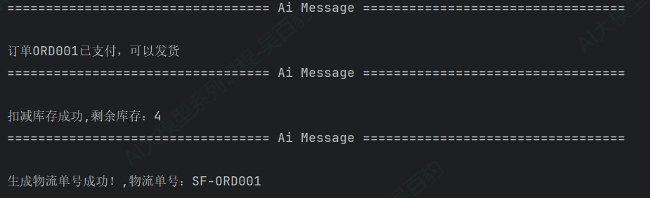
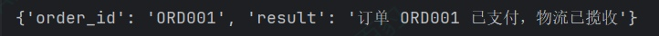
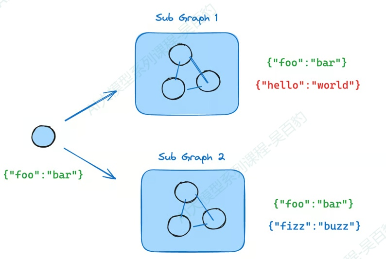
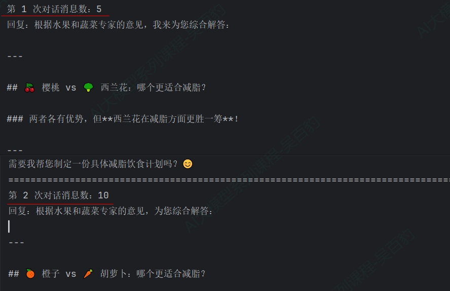
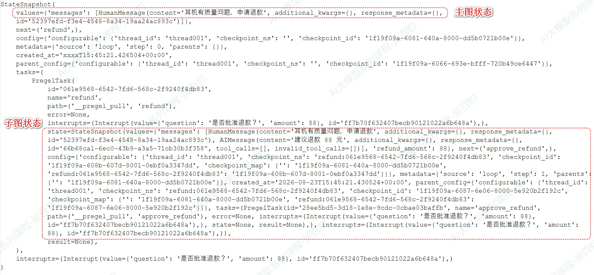
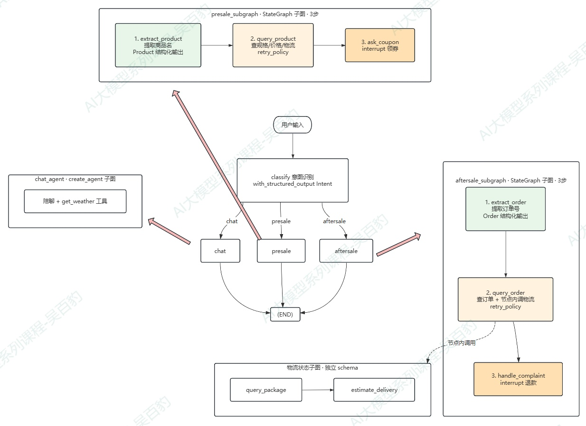

> 📌 **[AI 大模型与云原生全栈知识库](./README.md)** / **27. LangGraph 子图**
> 🏠 [返回主页 README](./README.md) | ⚡ [面试 30 分钟速记](./interview/00_面试冲刺30分钟速记卡片.md) | 💻 [白板手写代码](./interview/08_大厂手写代码与白板编程题.md)

---

# 8\. **LangGraph 子图**

## 8.1. **子图介绍**

子图（Subgraph）就是一个被当作节点用在另一个图里的图。前面章节我们一直用 Python 函数作为节点，而 LangGraph 允许把一个编译好的图（StateGraph 的编译产物）直接作为父图的节点，这就是"图中套图"的嵌套结构，外层图叫父图（Parent Graph），被嵌套进去的图叫子图。

子图常用在构建多Agent系统中，每个专家Agent 封装成一个子图，主调度图把它们当节点调用。此外如果某个固定的流程（查询->校验->生成）要在多个图里重复使用，也可以把它封装成子图 ，一处定义，多处使用。

案例：订单支付后触发发货，主图处理订单，发货动作（扣减库存、生成物流单号）,将发货动作作为子图构建。

```python
from langchain_core.messages import AIMessage
from langgraph.graph import StateGraph, START, END, MessagesState

class OrderState(MessagesState):
    order_id: str # 订单ID
    stock: int # 库存数量


# ========== 子图：发货流程（扣减库存 -> 生成物流单号） ==========
def deduct_stock(state: OrderState) -> dict:
    """发货步骤一：扣减库存"""
    return {"stock": state["stock"] - 1, "messages": [AIMessage(content=f"扣减库存成功,剩余库存：{state['stock'] - 1}")]}


def create_logistics(state: OrderState) -> dict:
    """发货步骤二：生成物流单号"""
    return {"messages": [AIMessage(content=f"生成物流单号成功！,物流单号：SF-{state['order_id']}")]}


sub_builder = StateGraph(OrderState)
sub_builder.add_node("deduct_stock", deduct_stock)
sub_builder.add_node("create_logistics", create_logistics)

sub_builder.add_edge(START, "deduct_stock")
sub_builder.add_edge("deduct_stock", "create_logistics")
sub_builder.add_edge("create_logistics", END)

ship_subgraph = sub_builder.compile()


# ========== 主图：订单处理（支付确认 -> 发货子图） ==========
def confirm_payment(state: OrderState) -> dict:
    """主图节点：确认订单已支付"""
    return {"messages": [AIMessage(content=f"订单{state['order_id']}已支付，可以发货")]}


builder = StateGraph(OrderState)
builder.add_node("confirm_payment", confirm_payment)
builder.add_node("ship", ship_subgraph)   # 子图作为节点加入主图

builder.add_edge(START, "confirm_payment")
builder.add_edge("confirm_payment", "ship")
builder.add_edge("ship", END)

graph = builder.compile()


if __name__ == "__main__":
    result = graph.invoke({"order_id": "ORD001", "stock": 5})

    for msg in result["messages"]:
        msg.pretty_print()

```

以上代码运行后，结果如下：



以上代码注意如下几点：

1) builder.add\_node("ship", ship\_subgraph)直接把编译好的子图当节点，父子图共享 messages 通道，子图内部节点写入的 messages 直接合并进主图状态。
2) 父图节点与子图节点读到的 messages 是同一份数据，因此父图可以读到子图写入的消息，子图也能读到父图写入的消息。

## 8.2. **子图通信模式**

主图使用子图有两种方式：

**1) 子图作为主图中的一个节点使用**

这种情况父子图共享状态字段，使用方式就是在主图中添加节点将子图加入“add\_node("名字", 编译后的子图)”

**2) 主图中某个节点业务逻辑中，通过invoke调用子图**

这种情况父子图Schema都是独立的，不共享状态，直接在主图节点函数中写subgraph.invoke(...) ，如果需要给子图传入状态或者给主图返回状态，需要自己手动转换状态。

**总结：两种方式使用方式很清晰，共享字段就走“作为节点”，不共享就走“节点内调用+转换”。**

### **8.2.1. 节点内调用子图**

当父图与子图没有共享的状态字段时，就把子图当成一个"黑盒"，在主图的某个节点函数里调用它。节点函数负责两件事：

1\. 进入子图前，把主图状态转换成子图输入；

2\. 子图返回后，把子图输出转换回主图状态。

这种模式在多 Agent 系统中很常见，当你想给每个 Agent 保留私有的消息历史（不共享主图的 messages）时，就适合在节点内调用子图。

两层子图、甚至更多层都适用同样规则：每一层只通过 invoke() 的输入输出与相邻层交换数据，任何一层都访问不到其他层的状态字段（因为 schema 相互独立）

案例：订单处理主流程中，需要调用"订单查询子图"，子图有独立的订单状态 schema（order\_id / status），与主图（order\_id / result）没有共享字段：

```python
from typing import TypedDict

from langgraph.graph import StateGraph, START, END


# ============================================================
# 子图：订单查询（独立 schema）
# ============================================================
class OrderQueryState(TypedDict):
    """子图状态：订单号与查询出的状态"""
    order_id: str # 订单号
    status: str # 订单状态


def lookup_order(state: OrderQueryState) -> dict:
    """子图节点一：查订单基本信息"""
    return {"status": f"订单 {state['order_id']} 已支付"}


def lookup_logistics(state: OrderQueryState) -> dict:
    """子图节点二：补充物流状态"""
    return {"status": state["status"] + "，物流已揽收"}


order_subgraph_builder = StateGraph(OrderQueryState)
order_subgraph_builder.add_node("lookup_order", lookup_order)
order_subgraph_builder.add_node("lookup_logistics", lookup_logistics)

order_subgraph_builder.add_edge(START, "lookup_order")
order_subgraph_builder.add_edge("lookup_order", "lookup_logistics")
order_subgraph_builder.add_edge("lookup_logistics", END)

order_subgraph = order_subgraph_builder.compile()


# ============================================================
# 主图：订单处理（独立 schema，无共享字段）
# ============================================================
class OrderProcessState(TypedDict):
    """主图状态：订单号与最终处理结果"""
    order_id: str # 订单号
    result: str # 订单处理结果


def call_order_subgraph(state: OrderProcessState) -> dict:
    """主图节点：在节点函数内调用子图，手动做状态转换"""
    # 准备子图输入
    subgraph_input = {"order_id": state["order_id"], "status": ""}

    # 调用子图
    subgraph_output = order_subgraph.invoke(subgraph_input)

    # 根据子图输出，更新主图状态
    return {"result": subgraph_output["status"]}


builder = StateGraph(OrderProcessState)
builder.add_node("call_order_subgraph", call_order_subgraph)

builder.add_edge(START, "call_order_subgraph")
builder.add_edge("call_order_subgraph", END)

graph = builder.compile()


if __name__ == "__main__":
    result = graph.invoke({"order_id": "ORD001", "result": ""})
    print(f"{result}")

```

以上代码运行后结果如下：



以上代码注意点：

1) 子图 schema 是 order\_id / status，主图 schema 是 order\_id / result，两者没有共享字段，所以用"节点内调用 + 手动转换"。
2) 状态转换逻辑全部封装在 call\_order\_subgraph 节点函数里，进子图前拼子图输入，出子图后取 status 写回主图 result。父图其余部分完全感知不到子图的内部结构。
3) 这种方式让子图成为"黑盒"，父图只依赖子图的输入输出契约（schema）。

### **8.2.2. 子图作为节点**

当父图和子图共享状态字段时（典型如都基于 MessagesState，共享 messages），把编译好的子图直接传给 add\_node 即可，不需要任何包装函数——子图自动读写父图的状态通道。多 Agent 系统里，各 Agent 通过共享的 messages 交流，就是这种模式。

需要注意的是：即使共享字段，子图也可以拥有父图没有的私有字段。这些字段只在子图内部可见（子图的节点可以读写），不会进入父图状态，也不会出现在父图的最终输出里。



关于这部分案例，可以参考 8.1 子图介绍部分。下面通过一个案例演示子图私有字段的使用。

案例：商品推荐流程。主图维护商品描述 description，交给"营销文案"子图润色。子图内部额外维护一个私有字段 note（促销提示），子图用它拼出最终文案，但这个字段不会进入主图状态。

```python
from typing import TypedDict

from langgraph.graph import StateGraph, START, END

from init_llm import deepseek_llm_flash


# ============================================================
# 子图：营销文案（description 共享，note 私有）
# ============================================================
class SubgraphState(TypedDict):
    """子图状态：description 与父图共享，note 是子图私有字段"""
    description: str # 描述
    note: str # 促销文案


def generate_note(state: SubgraphState) -> dict:
    """子图节点一：写入私有字段 note"""
    resp = deepseek_llm_flash.invoke("给商品生成20字以内的营销文案，商品描述：" + state["description"])
    return {"note": resp.content}


def update_description(state: SubgraphState) -> dict:
    """子图节点二：读取私有字段 note，更新共享字段 description"""
    # note 是子图私有字段，只在子图内部可读
    return {"description": "产品描述：" + state["description"] + "，促销文案：" + state["note"]}


subgraph_builder = StateGraph(SubgraphState)
subgraph_builder.add_node("generate_note", generate_note)
subgraph_builder.add_node("update_description", update_description)

subgraph_builder.add_edge(START, "generate_note")
subgraph_builder.add_edge("generate_note", "update_description")
subgraph_builder.add_edge("update_description", END)

subgraph = subgraph_builder.compile()


# ============================================================
# 主图：商品描述 -> 营销子图（主图 schema 只有 description）
# ============================================================
class ParentState(TypedDict):
    """主图状态：只有 description，没有 note"""
    description: str


def generate_desc(state: ParentState) -> dict:
    """主图节点：生成商品基础描述"""
    return {"description": state["description"] + "，超长续航!"}


builder = StateGraph(ParentState)
builder.add_node("generate_desc", generate_desc)
builder.add_node("marketing", subgraph)  # 子图作为节点，description 共享，note 私有

builder.add_edge(START, "generate_desc")
builder.add_edge("generate_desc", "marketing")
builder.add_edge("marketing", END)

graph = builder.compile()


if __name__ == "__main__":
    result = graph.invoke({"description": "降噪蓝牙耳机"})
    print(result)

```

以上代码注意:

1) 主图和子图中那些字段是共享的？主图Schema和子图schema中都声明的字段，这些重合字段就是共享的。只在一方声明的字段是私有的，即主图和子图可以有各自的私有字段。
2) 子图私有字段note只存在于子图自己的schema里，主图schema只有description，所以主图最终的状态中没有note，主图拿到的是更新后的共享字段。

## 8.3. **子图持久化**

### **8.3.1. 子图持久化三种模式**

子图被调用时，它的内部状态在两次调用之间如何保留？这由子图 compile() 时的 checkpointer 参数决定，有三种模式：

| **模式**                 | **如何设置子图checkpointer** | **行为**                                                                                                                                                                  |
| ------------------------------ | ---------------------------------- | ------------------------------------------------------------------------------------------------------------------------------------------------------------------------------- |
| **Per-invocation(默认)** | checkpointer=None                  | 每次调用从空白开始；但单次调用内继承父图的Checkpointer，子图自身状态会在中断时被保存，支持 interrupt 和持久化                                                                   |
| **Per-thread**           | checkpointer=True                  | 状态跨调用累积，同一线程内每次调用接续上次                                                                                                                                      |
| **Stateless**            | checkpointer=False                 | 子图自身无checkpoint，子图自身的状态也不会被保存，中断之后仍会触发并传播到父图（由父图的Checkpointer捕获），但中断恢复之后，子图从空白开始，内部状态由于无checkpointer 全部丢失 |

Per-invocation 适合大多数场景（含多 Agent 中子 Agent 处理独立请求）；per-thread 用于子 Agent 需要在多轮对话里积累上下文的情况（如逐步建立上下文的研究助手）；stateless 用于纯计算、无状态的子流程。

特别注意：要让子图的持久化特性（中断、状态查看、per-thread 记忆）真正生效，父图必须也用 Checkpointer 编译，如果父图不带 Checkpointer，子图持久化无从谈起。

案例：子图维护一个私有字段 visit\_count，对比三种模式下的累积情况。

```python
from typing import TypedDict

from langgraph.checkpoint.memory import MemorySaver
from langgraph.graph import StateGraph, START, END


class SubgraphState(TypedDict):
    """子图状态：result 与父图共享，visit_count 是子图私有字段"""
    result: str # 子图结果
    visit_count: int # 子图被访问的次数


def sub_node(state: SubgraphState) -> dict:
    """子图节点：累加私有字段 visit_count，把结果写回共享字段 result"""
    count = state.get("visit_count", 0) + 1
    return {"visit_count": count, "result": f"第 {count} 次访问"}


# 构建子图
subgraph_builder = StateGraph(SubgraphState)
subgraph_builder.add_node("sub_node", sub_node)
subgraph_builder.add_edge(START, "sub_node")
subgraph_builder.add_edge("sub_node", END)
subgraph = subgraph_builder.compile(checkpointer=None)
# subgraph = subgraph_builder.compile(checkpointer=True)
# subgraph = subgraph_builder.compile(checkpointer=False)


class ParentState(TypedDict):
    """主图状态：仅共享 result 字段"""
    result: str


# 构建主图
builder = StateGraph(ParentState)
builder.add_node("consultant", subgraph)
builder.add_edge(START, "consultant")
builder.add_edge("consultant", END)
graph = builder.compile(checkpointer=MemorySaver())


# 连续调用三次主图，观察子图私有字段是否跨调用累积
config = {"configurable": {"thread_id": f"thread001"}}

for i in range(3):
    result = graph.invoke({"result": ""}, config=config)
    print(f"{result}")

```

依次设置“subgraph_builder.compile(checkpointer=None)”中checkpoint为None、True、False，查看结果如下：

```python
#Per-invocation：checkpoint =None
{'result': '第 1 次访问'}
{'result': '第 1 次访问'}
{'result': '第 1 次访问'}

#Per-thread：checkpoint=True
{'result': '第 1 次访问'}
{'result': '第 2 次访问'}
{'result': '第 3 次访问'}

#Stateless:checkpoint=False
{'result': '第 1 次访问'}
{'result': '第 1 次访问'}
{'result': '第 1 次访问'}
```

以上代码注意：

1) per-invocation 下每次都是"第 1 次咨询"，子图每次调用从空白开始；per-thread 下 visit\_count 跨调用累积，第二次变成"第 2 次咨询"，这就是子 Agent 多轮记忆的实现基础。
2) stateless 与 per-invocation 在这个例子里的表现一致（visit\_count 每轮都从 0 重算），区别在于 stateless 不支持 interrupt 和持久化，而 per-invocation 在单次调用内仍支持（子图里可以用 interrupt() 暂停）。

### **8.3.2. per-invocation：子Agent作为工具**

LangChain中create\_agent本质上也是一个Graph图，所以“子Agent作为工具”本质上就是“子图作为工具”，所有子图持久化概念都直接适用。

业务场景：客服主管 Agent 下有水果、蔬菜两个专家子 Agent（各是 create\_agent 子图），用 @tool 包装后供主Agent动态调度。两个子 Agent 都走 per-invocation（默认），每次调用从空白开始。水果专家工具的查询函数里加了 interrupt()，要求人工确认后才返回。

```python
from langchain.agents import create_agent
from langchain.tools import tool
from langgraph.checkpoint.memory import InMemorySaver
from langgraph.types import interrupt, Command

from init_llm import deepseek_llm_flash


# ============================================================
# 子 Agent 自己的工作工具
# ============================================================
@tool
def fruit_info(fruit_name: str) -> str:
    """查询水果信息。"""
    # 子图内的 interrupt 会传播到顶层：主 Agent 会暂停，等待人工确认
    user_response = interrupt("是否确认继续查询该水果？输入'是'继续，输入其他内容取消")
    if user_response.lower() != "是":
        return "用户取消查询"
    return f"{fruit_name}：富含维生素，建议每天食用。"


@tool
def veggie_info(veggie_name: str) -> str:
    """查询蔬菜信息。"""
    return f"{veggie_name}：低热量高纤维，适合减脂期。"


# ============================================================
# 子 Agent（create_agent 底层就是 LangGraph 图）
# ============================================================
fruit_agent = create_agent(
    model=deepseek_llm_flash,
    tools=[fruit_info],
    system_prompt="你是水果专家。回答一定要基于 fruit_info 工具的真实结果。",
)

veggie_agent = create_agent(
    model=deepseek_llm_flash,
    tools=[veggie_info],
    system_prompt="你是蔬菜专家。回答一定要基于 veggie_info 工具的真实结果。",
)


# ============================================================
# 把子 Agent 打包成工具，供主管 Agent 动态调度
# ============================================================
@tool
def ask_fruit_expert(question: str) -> str:
    """询问水果方面的专家。所有水果问题都必须交给这个工具。"""
    response = fruit_agent.invoke(
        {"messages": [{"role": "user", "content": question}]},
    )
    return response["messages"][-1].content


@tool
def ask_veggie_expert(question: str) -> str:
    """询问蔬菜方面的专家。所有蔬菜问题都必须交给这个工具。"""
    response = veggie_agent.invoke(
        {"messages": [{"role": "user", "content": question}]},
    )
    return response["messages"][-1].content


# ============================================================
# 主 Agent：绑定子 Agent 工具
# ============================================================
outer_agent = create_agent(
    model=deepseek_llm_flash,
    tools=[ask_fruit_expert, ask_veggie_expert],
    system_prompt=(
        "你是客服主管。你有两个助手：ask_fruit_expert（水果）和 ask_veggie_expert（蔬菜）。"
        "遇到水果问题就调用 ask_fruit_expert 工具，"
        "蔬菜问题就调用 ask_veggie_expert 工具。"
    ),
    checkpointer=InMemorySaver(),
)


def get_user_input(interrupt_info):
    """根据中断信息向用户提问并读取输入（通用：字符串/字典都行）"""
    if isinstance(interrupt_info, str):
        return input(f"\n[助手]: {interrupt_info}\n[用户]: ").strip()

    # 字典场景：遍历所有键值对展示，原样返回输入
    show_info = "\n".join(f"{k}:{v}" for k, v in interrupt_info.items())
    return input(f"\n[助手]: {show_info}\n[用户]: ").strip()


if __name__ == "__main__":

    config = {"configurable": {"thread_id": "thread001"}}

    while True:
        user_input = input("[用户]: ").strip()

        if user_input.lower() in ['quit', 'exit', '退出', 'q']:
            print("助手: 感谢你的咨询，再见！")
            break

        # 过滤空输入
        if not user_input:
            continue

        # 准备输入消息
        stream_input: dict | Command = {
            "messages": [{"role": "user", "content": user_input}]
        }

        while True:
            # 1. 调用图，事件流驱动
            stream = outer_agent.stream_events(stream_input, config=config, version="v3")

            # 2. 流式显示 LLM 回复
            print("【助手】", end="", flush=True)
            for message in stream.messages:
                for token in message.text:
                    if token.strip():
                        print(token, end="", flush=True)
            print()

            # 3. 图没有中断，完整跑完
            if not stream.interrupted:
                final_state = stream.output
                print(f"\n===== 最终回复：{final_state['messages'][-1].content} =====")
                break

            # 4. 图中断，读取中断信息向用户提问
            try:
                user_response = get_user_input(stream.interrupts[0].value)
            except (EOFError, KeyboardInterrupt):
                print("\n[系统] 用户中断退出，会话结束")
                break

            # 5. 用户输入作为 resume 继续，进入下一轮
            stream_input = Command(resume=user_response)

```

以上代码运行后输入如下内容：

```python
#有中断
介绍一下苹果的营养

#无中断
介绍一下西兰花的营养
```

以上代码注意如下几点：

1) 子 Agent 的 interrupt 会传播到顶层：fruit\_info 工具里的 interrupt() 触发后，主管 Agent 暂停，stream.interrupts 拿到中断载荷，Command(resume=True) 恢复后子 Agent 继续。
2) per-invocation 语义：两个子 Agent 没设 checkpointer（默认 None），每次调用从空白开始——符合"每个请求独立"的多 Agent 场景。主管 Agent 设了 checkpointer=MemorySaver()，保存对话线程。
3) 动态调度：主管 Agent 收到用户问题后，由 LLM 自行决定调用哪个专家工具，而非写死的条件边，这就是"动态调度"，而非 "静态路由"

### **8.3.3. per-thread：子Agent跨调用记忆**

per-thread 模式下，子 Agent 的状态跨调用累积，它会记住同一线程内之前的对话，这在"研究助手逐步积累上下文""编码助手跟踪改过哪些文件"等场景下很有价值。

如下案例改写之前案例的代码，该案例中子Agent编译时设置checkpointer=True。在per-thread中，同一子Agent不能并行调用（并行写同一 checkpoint namespace 会冲突），官方推荐用 ToolCallLimitMiddleware 限制同一个工具单次只能调用一次。

```python
from langchain.agents import create_agent
from langchain.agents.middleware import ToolCallLimitMiddleware
from langchain.tools import tool
from langgraph.checkpoint.memory import MemorySaver, InMemorySaver

from init_llm import deepseek_llm_flash


# ============================================================
# 子 Agent 自己的工作工具
# ============================================================
@tool
def fruit_info(fruit_name: str) -> str:
    """查询水果信息。"""
    return f"{fruit_name}：富含维生素，建议每天食用。"


@tool
def veggie_info(veggie_name: str) -> str:
    """查询蔬菜信息。"""
    return f"{veggie_name}：低热量高纤维，适合减脂期。"


# ============================================================
# 子 Agent（create_agent 底层就是 LangGraph 图）
# ============================================================
fruit_agent = create_agent(
    model=deepseek_llm_flash,
    tools=[fruit_info],
    system_prompt="你是水果专家。回答一定要基于 fruit_info 工具的真实结果。",
    checkpointer=True,
)

veggie_agent = create_agent(
    model=deepseek_llm_flash,
    tools=[veggie_info],
    system_prompt="你是蔬菜专家。回答一定要基于 veggie_info 工具的真实结果。",
    checkpointer=True,
)


# ============================================================
# 把子 Agent 打包成工具
# ============================================================
@tool
def ask_fruit_expert(question: str) -> str:
    """询问水果专家。所有水果问题都必须交给这个工具。"""
    response = fruit_agent.invoke({"messages": [{"role": "user", "content": question}]})
    return response["messages"][-1].content


@tool
def ask_veggie_expert(question: str) -> str:
    """询问蔬菜专家。所有蔬菜问题都必须交给这个工具。"""
    response = veggie_agent.invoke({"messages": [{"role": "user", "content": question}]})
    return response["messages"][-1].content


# ============================================================
# 主 Agent：per-thread 子 Agent 必须用 ToolCallLimitMiddleware
# 限制同一工具单次只能调用一次，避免并行调用写同一 namespace 产生冲突
# ============================================================
outer_agent = create_agent(
    model=deepseek_llm_flash,
    tools=[ask_fruit_expert, ask_veggie_expert],
    system_prompt=(
        "你是客服主管。你有两个助手：ask_fruit_expert（水果）和 ask_veggie_expert（蔬菜）。"
        "遇到水果问题就调用 ask_fruit_expert，蔬菜问题就调用 ask_veggie_expert。"
    ),
    middleware=[
        ToolCallLimitMiddleware(tool_name="ask_fruit_expert", run_limit=1),
        ToolCallLimitMiddleware(tool_name="ask_veggie_expert", run_limit=1),
    ],
    checkpointer=InMemorySaver(),
)


if __name__ == "__main__":
    config = {"configurable": {"thread_id": "thread001"}}

    # 第一次调用：同时问水果和蔬菜
    response1 = outer_agent.invoke(
        {"messages": [{"role": "user", "content": "樱桃和西兰花哪个更适合减脂？"}]},
        config=config,
    )
    print(f"第 1 次对话消息数：{len(response1['messages'])}")
    print(f"回复：{response1['messages'][-1].content}")

    print("="*100)

    # 第二次调用：子 Agent 记住上次对话，消息数累积
    response2 = outer_agent.invoke(
        {"messages": [{"role": "user", "content": "那橙子和胡萝卜呢？"}]},
        config=config,
    )
    print(f"第 2 次对话消息数：{len(response2['messages'])}")
    print(f"回复：{response2['messages'][-1].content}")


```

以上代码运行后结果如下：



以上代码注意如下：per-thread 子 Agent 被 LLM 并行调用时，两个并发调用写同一 namespace 会冲突。ToolCallLimitMiddleware(tool\_name=..., run\_limit=1) 限制同一工具单次只能执行一次，从根源上避免并行。

LangGraph 用 checkpoint\_ns 来标识每个子图在层级结构中的"位置"，确保不同子图的 checkpoint 互不覆盖。它的格式是：

```python
{节点名}:{任务ID}|{子节点名}:{子任务ID}
# 对应到以上案例就是
tools:tools任务id|fruit_agent:子任务id
```

并行调用产生冲突的原因是每次调度子图任务时，框架会组装namespace：

```python
#_constants.py源码
NS_SEP = "|"    # 分隔层级（graph|subgraph|subsubgraph）
NS_END = ":"    # 分隔节点名和任务ID

# pregel/main.py 源码如下
... ...
parent_ns = saved.config[CONF].get(CONFIG_KEY_CHECKPOINT_NS, "")
task_ns = f"{task.name}{NS_END}{task.id}"  # 如 "fruit_agent:uuid-xxx"
if parent_ns:
task_ns = f"{parent_ns}{NS_SEP}{task_ns}"
... ...
```

以上代码中 [task.name](http://task.name) 是父图中节点的名字，[task.id](http://task.id) 是每次调度的唯一 UUID。

per-invocation 模式不会冲突：每次 invoke() 产生新的 task\_id，namespace 不同，checkpoint 相互隔离。

per-thread 模式会冲突：checkpointer=True 意味着子图要"在同一线程内接续上一次的状态"。当 LLM 并行调用同一个工具两次时（比如同时问ask\_fruit\_expert("苹果")和ask\_fruit\_expert("香蕉")），两个调用同时做两件事：

1) 读取同一个 namespace 下的最新 checkpoint（接续上次状态）
2) 写入新的 checkpoint

两条并行路径同时读写同一个 namespace，后写的会覆盖先写的，状态就乱了。

## 8.4. **查看子图状态**

主图启用持久化后，graph.get\_state(config, subgraphs=True) 可以在一次调用里同时拿到主图状态和子图内部状态。返回的快照对象里，tasks 字段保存着当前处于中断状态的子图任务，每个任务的 .state 就是该子图的状态快照（包含子图的私有字段）。

查看子图状态需要注意如下两点：

1) subgraphs=True 的 tasks 只在子图处于中断（interrupt）状态时有内容。如果子图已经正常运行完，tasks 为空，因为子图完成后没有"挂起的子图任务"可供查看。
2) 查看子图状态要求 LangGraph 能静态发现子图，即子图是"作为节点加入"或"节点内调用"的。如果子图是在工具函数里被调用的，get\_state(subgraphs=True) 看不到它；但 interrupt 无论嵌套多深都会传播到顶层。

案例：退款审批流程。退款子图内有一个 interrupt() 人工审批节点，主图执行到子图时暂停，此时查看主图和子图双方的状态。

```python
from langgraph.checkpoint.memory import MemorySaver, InMemorySaver
from langgraph.graph import StateGraph, START, END, MessagesState
from langgraph.types import interrupt, Command


# ============================================================
# 子图：退款审批（MessagesState 上扩展私有字段 refund_amount）
# ============================================================
class RefundState(MessagesState):
    """退款子图状态：共享 messages，额外增加退款金额私有字段"""
    refund_amount: int


def plan_refund(state: RefundState) -> dict:
    """子图节点一：生成退款方案"""
    return {
        "refund_amount": 88,
        "messages": [{"role": "assistant", "content": "建议退款 88 元"}],
    }


def approve_refund(state: RefundState) -> dict:
    """子图节点二：interrupt 暂停，等待人工审批"""
    decision = interrupt({"question": "是否批准退款？", "amount": state["refund_amount"]})
    return {"messages": [{"role": "assistant", "content": "已退款" if decision == "approve" else "已拒绝"}]}


refund_builder = StateGraph(RefundState)
refund_builder.add_node("plan_refund", plan_refund)
refund_builder.add_node("approve_refund", approve_refund)

refund_builder.add_edge(START, "plan_refund")
refund_builder.add_edge("plan_refund", "approve_refund")
refund_builder.add_edge("approve_refund", END)

refund_subgraph = refund_builder.compile()


# ============================================================
# 主图：退款子图作为节点
# ============================================================
builder = StateGraph(MessagesState)
builder.add_node("refund", refund_subgraph)

builder.add_edge(START, "refund")
builder.add_edge("refund", END)

graph = builder.compile(checkpointer=InMemorySaver())


if __name__ == "__main__":
    config = {"configurable": {"thread_id": "thread001"}}

    # 调用：执行到子图内的 interrupt，暂停
    graph.invoke({"messages": [{"role": "user", "content": "耳机有质量问题，申请退款"}]}, config)

    print("\n========== 子图状态（get_state(subgraphs=True)） ==========")
    snap1 = graph.get_state(config, subgraphs=True)
    print("snap1:",snap1)

    # 审批通过，恢复执行
    graph.invoke(Command(resume="approve"), config)
    snap2 = graph.get_state(config, subgraphs=True)
    print("snap2:", snap2)

```

以上代码运行后可以看到“snap1”内容如下，graph.get\_state(config, subgraphs=True) 返回的 snap.tasks 里，每个 task 对应一个当前挂起的子图任务，[task.name](http://task.name) 是子图在主图中的节点名，task.state 是子图状态快照。



## 8.5. **综合案例**

该综合案例把本章的核心知识点结合电商网站业务场景组装起来，模拟一个电商网站智能客服助手。用户与系统在控制台实时对话，主图识别用户意图（聊天 / 售前 / 售后），条件边路由到三个分支，每个分支固定只解决一类问题，流程简单清晰：

| **分支** | **解决问题**                 | **实现方式**                                   |
| -------------- | ---------------------------------- | ---------------------------------------------------- |
| **聊天** | 陪用户聊与购物无关的话题           | **create_agent** 子agent（作为节点），绑定工具 |
| **售前** | 咨询固定商品信息（规格/价格/物流） | **StateGraph** 子图（作为节点）                |
| **售后** | 售后退款（查订单/物流/确认退款）   | **StateGraph** 子图（作为节点）                |



本案覆盖的知识点：

* 意图识别 + 条件边路由：主图 classify 节点用 LLM 结构化输出识别 chat / presale / aftersale，条件边分发
* create\_agent 子图作为节点：聊天分支，绑定 get\_weather 工具，per-thread 记忆
* StateGraph 子图作为节点：售前、售后，共享 messages，固定流程
* 节点内调用子图：售后 query\_order 节点内再调"物流状态"子图（不同 schema，做状态转换）
* 子图持久化 per-thread 记忆：三个子图 compile(checkpointer=True)
* 中断 interrupt：售前领券、售后退款，且售前提取不到商品 / 售后提取不到订单号时也会中断补录
* LLM 结构化输出：识别意图、提取商品名、提取订单号
* 节点级容错 RetryPolicy：查询节点防御性配置
* Checkpointer 短期记忆：主图 compile(checkpointer=MemorySaver())
* 实时对话：while 循环 + stream\_events(version="v3") 流式打印，中断后 Command(resume=...) 继续。

```python
from typing import Literal, TypedDict

from langchain_core.messages import AIMessage, HumanMessage, SystemMessage
from pydantic import BaseModel, Field
from langchain.agents import create_agent
from langchain.tools import tool
from langgraph.checkpoint.memory import InMemorySaver
from langgraph.graph import StateGraph, START, END, MessagesState
from langgraph.types import interrupt, Command, RetryPolicy

from init_llm import deepseek_llm_flash


# ================================================================
# 一、物流状态子图（独立 schema，供售后"节点内调用"）
# ================================================================
class LogisticsState(TypedDict):
    """物流子图状态：订单号与物流轨迹（与父 schema 无共享字段）"""
    order_id: str  # 订单号
    status: str    # 物流轨迹


def query_package(state: LogisticsState) -> dict:
    """物流子图节点一：查询包裹当前所在节点"""
    return {"status": f"包裹 {state['order_id']} 已到达转运中心"}


def estimate_delivery(state: LogisticsState) -> dict:
    """物流子图节点二：补充预计送达时间"""
    return {"status": state["status"] + "，预计明天送达，快递员派送中"}


logistics_builder = StateGraph(LogisticsState)
logistics_builder.add_node("query_package", query_package)
logistics_builder.add_node("estimate_delivery", estimate_delivery)

logistics_builder.add_edge(START, "query_package")
logistics_builder.add_edge("query_package", "estimate_delivery")
logistics_builder.add_edge("estimate_delivery", END)
logistics_subgraph = logistics_builder.compile()


# ================================================================
# 二、聊天分支（create_agent 子图，作为主图节点）
# ================================================================
@tool
def get_weather(location: str) -> str:
    """查询指定地点的天气。用户询问天气时使用。"""
    return f"：{location}天气晴朗"


chat_agent = create_agent(
    model=deepseek_llm_flash,
    name="chat_agent",
    tools=[get_weather],
    system_prompt=(
        "你是电商网站的小助手，性格轻松友好。用户找你聊天时陪聊即可，"
        "可以用 get_weather 查询天气。回答保持简短自然。"
    ),
    checkpointer=True,
)


# ================================================================
# 三、售前分支（StateGraph 子图，作为主图节点，固定三步）
# ================================================================
class Product(BaseModel):
    """售前：从用户消息中提取商品名称（LLM 结构化输出）"""
    product: str = Field(description="用户咨询的商品名称")


class PresaleState(MessagesState):
    """售前子图状态：共享 messages，额外增加商品与查询结果字段"""
    product: str
    reply: str = ""


def extract_product(state: PresaleState) -> dict:
    """售前节点一：LLM 提取用户咨询的商品名"""
    model_struct = deepseek_llm_flash.with_structured_output(Product)
    resp = model_struct.invoke(
        [SystemMessage(content="从用户咨询中提取商品名称。"),
         HumanMessage(content=state["messages"][-1].content)]
    )
    if resp.product == "":
        product = interrupt("输入你要咨询的商品名称，例如（钻戒、手机、耳机）")
        return {"product": product}
    return {"product": resp.product}


def query_product(state: PresaleState) -> dict:
    """售前节点二：一次查全规格 / 价格 / 物流方式"""
    product = state["product"]
    price = {"钻戒": "¥2999 起", "手机": "¥1999 起", "耳机": "¥399 起"}.get(product, "¥199 起")
    if product == "钻戒":
        reply = f"钻戒规格：主石-30 分天然钻石，价格：{price}；物流：珠宝专送 + 全额保价，顺丰发货，预计 2–3 天送达"
    elif product == "手机":
        reply = f"手机规格：5.1 英寸屏 / 8GB 内存 / 256GB 存储，黑色银色可选；价格：{price}；物流：满 99 包邮，顺丰发货，预计 2 天送达。"
    else:
        reply = f"耳机规格：主动降噪 / 30h 续航；黑白两色可选；价格：{price}；物流：满 99 包邮，顺丰发货，预计 2 天送达。"
    return {"reply": reply}


def ask_coupon(state: PresaleState) -> dict:
    """售前节点三：中断，询问用户是否领取优惠券"""
    decision = interrupt(f"你咨询了【{state['product']}】，是否领取 10 元优惠券？确认 ok，取消 no")
    coupon_text = "已为你领取 10 元优惠券。" if decision.strip().lower() == "ok" else "未领取优惠券。"
    return {"messages": [AIMessage(content=state.get("reply", "") + "," + coupon_text)]}


presale_builder = StateGraph(PresaleState)
presale_builder.add_node("extract_product", extract_product)
presale_builder.add_node("query_product", query_product, retry_policy=RetryPolicy(max_attempts=3))
presale_builder.add_node("ask_coupon", ask_coupon)

presale_builder.add_edge(START, "extract_product")
presale_builder.add_edge("extract_product", "query_product")
presale_builder.add_edge("query_product", "ask_coupon")
presale_builder.add_edge("ask_coupon", END)

presale_subgraph = presale_builder.compile(checkpointer=True)


# ================================================================
# 四、售后退款分支（StateGraph 子图，作为主图节点，固定三步）
# ================================================================
class Order(BaseModel):
    """售后：从用户消息中提取订单号（LLM 结构化输出）"""
    order_id: str = Field(description="用户提到的订单号")


class AftersaleState(MessagesState):
    """售后子图状态：共享 messages，额外增加订单相关字段"""
    order_id: str
    reply: str = ""


def extract_order(state: AftersaleState) -> dict:
    """售后节点一：LLM 提取订单号"""
    model_struct = deepseek_llm_flash.with_structured_output(Order)
    result = model_struct.invoke(
        [SystemMessage(content="从用户消息中提取订单号，格式如 ORD123456。"),
         HumanMessage(content=state["messages"][-1].content)]
    )
    if result.order_id == "":
        order_id = interrupt("请输入退款订单号")
        return {"order_id": order_id}
    return {"order_id": result.order_id}


def query_order(state: AftersaleState) -> dict:
    """售后节点二：查订单状态 + 节点内调用物流子图（不同 schema，做状态转换）"""
    order_status = f"订单 {state['order_id']} 已支付，正在出库"
    result = logistics_subgraph.invoke({"order_id": state["order_id"], "status": ""})
    reply = f"{order_status}；{result['status']}"
    return {"reply": reply}


def handle_complaint(state: AftersaleState) -> dict:
    """售后节点三：中断，处理退款"""
    decision = interrupt(
        f"订单 {state['order_id']} 当前状态：{state.get('reply', '暂无')}。\n"
        "是否确认退款？确认 yes，取消 no"
    )
    refund_text = "已为你提交退款，3日内到账。" if decision.strip().lower() == "yes" else "退款未提交，客服将稍后回访。"
    return {"messages": [AIMessage(content=state.get("reply", "") + refund_text)]}


aftersale_builder = StateGraph(AftersaleState)
aftersale_builder.add_node("extract_order", extract_order)
aftersale_builder.add_node("query_order", query_order, retry_policy=RetryPolicy(max_attempts=3))
aftersale_builder.add_node("handle_complaint", handle_complaint)

aftersale_builder.add_edge(START, "extract_order")
aftersale_builder.add_edge("extract_order", "query_order")
aftersale_builder.add_edge("query_order", "handle_complaint")
aftersale_builder.add_edge("handle_complaint", END)

aftersale_subgraph = aftersale_builder.compile(checkpointer=True)


# ================================================================
# 五、主图：意图识别 -> 条件边路由到三个分支
# ================================================================
class Intent(BaseModel):
    """用户意图：LLM 结构化输出"""
    intent: Literal["chat", "presale", "aftersale"] = Field(
        description="用户意图：chat=聊天（与购物无关）， presale=售前咨询（固定商品信息），aftersale=售后退款"
    )


class MainState(MessagesState):
    """主图状态：共享 messages，额外增加意图字段"""
    intent: str


def classify(state: MainState) -> dict:
    """主图节点：LLM 识别用户意图（结构化输出）"""
    model_struct = deepseek_llm_flash.with_structured_output(Intent)
    result = model_struct.invoke(
        [SystemMessage(content="判断用户意图：与购物无关的聊天为 chat，咨询商品规格/价格/物流方式为 presale，售后退款为 aftersale。"),
         HumanMessage(content=state["messages"][-1].content)]
    )
    return {"intent": result.intent}


def route(state: MainState) -> str:
    """条件边路由：按意图分发到对应分支"""
    return state["intent"]


builder = StateGraph(MainState)
builder.add_node("classify", classify)
builder.add_node("chat_agent", chat_agent)
builder.add_node("presale_subgraph", presale_subgraph)
builder.add_node("aftersale_subgraph", aftersale_subgraph)

builder.add_edge(START, "classify")
builder.add_conditional_edges("classify", route, {
    "chat": "chat_agent",
    "presale": "presale_subgraph",
    "aftersale": "aftersale_subgraph"
})
builder.add_edge("chat_agent", END)
builder.add_edge("presale_subgraph", END)
builder.add_edge("aftersale_subgraph", END)

graph = builder.compile(checkpointer=InMemorySaver())


# ================================================================
# 六、实时对话主循环
# ================================================================
def extract_text(content) -> str:
    """把 v3 stream 的 content（字符串或 content blocks 列表）统一提取为纯文本"""
    if isinstance(content, str):
        return content
    if isinstance(content, list):
        return "".join(block.get("text", "") for block in content if isinstance(block, dict))
    return str(content)


def get_user_input(info):
    """根据中断信息向用户提问并读取输入（字符串 / 字典都支持）"""
    if isinstance(info, str):
        return input(f"\n[助手]: {info}\n[用户]: ").strip()
    show = "\n".join(f"  {k}: {v}" for k, v in info.items())
    return input(f"\n[助手]: 需要人工确认 - {show}\n[用户]: ").strip()


def run_dialog():
    """Console 实时对话主循环"""
    config = {"configurable": {"thread_id": "shop-001"}}
    print("电商网站智能客服助手已就绪。输入 q / exit / 退出 结束。")
    print("例：推荐点好物 / 这款手机什么配置多钱 / 我的订单 ORD123456 需要退款\n")

    while True:
        user_input = input("[用户]: ").strip()
        if user_input.lower() in ("q", "quit", "exit", "退出"):
            print("助手: 再见，欢迎再次光临！")
            break
        if not user_input:
            continue

        stream_input: dict | Command = {"messages": [HumanMessage(content=user_input)]}

        while True:
            stream = graph.stream_events(stream_input, config=config, version="v3")

            print("【助手】", end="", flush=True)
            for message in stream.messages:
                for token in message.text:
                    if token.strip():
                        print(token, end="", flush=True)
            print()

            if not stream.interrupted:
                final_state = stream.output
                print(f"\n===== 最终回复：{extract_text(final_state['messages'][-1].content)} =====")
                break

            try:
                user_response = get_user_input(stream.interrupts[0].value)
            except (EOFError, KeyboardInterrupt):
                print("\n[系统] 对话中断，会话结束")
                return

            stream_input = Command(resume=user_response)


if __name__ == "__main__":
    run_dialog()
```

以上代码运行后可以输入以下内容进行测试：

```python
我叫王五
今天北京天气怎么样
我叫什么名字
推荐商品
我要退款
这款手机什么配置？
我的订单ORD100需要退款
```

---
> 🏠 **[返回主页 README](./README.md)** | ◀️ **上一篇：[26. LangGraph 人工介入](./26LangGraph人工介入.md)** | ▶️ **下一篇：[28. LangGraph 时间旅行](./28LangGraph时间旅行.md)** | ⚡ **[面试 30 分钟速记](./interview/00_面试冲刺30分钟速记卡片.md)**
