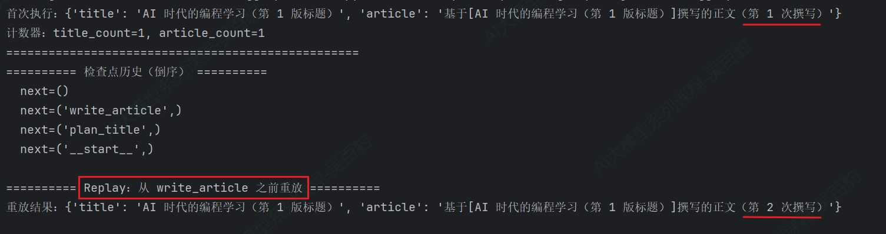
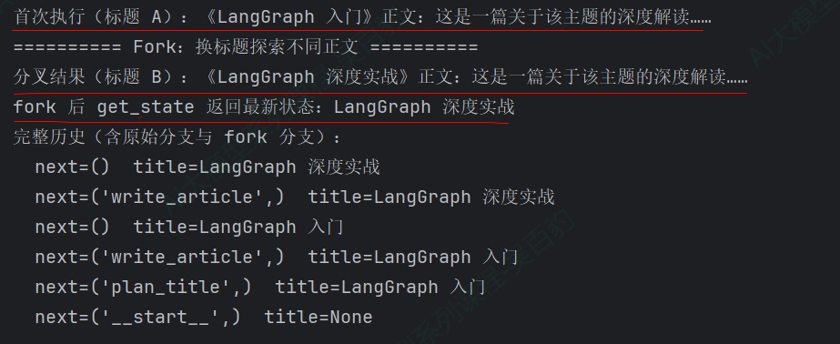
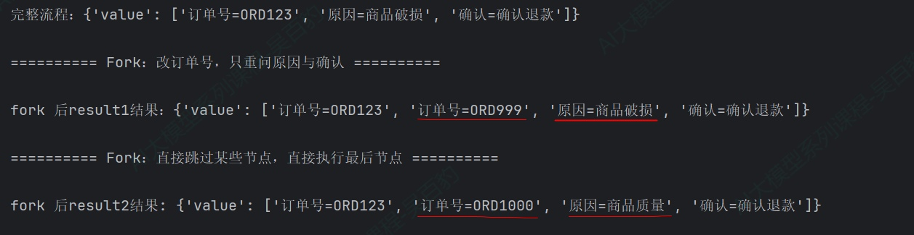
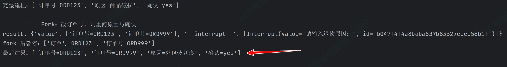
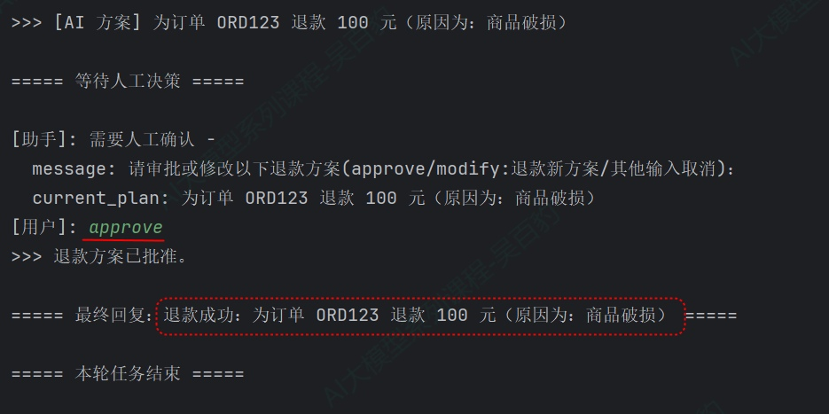
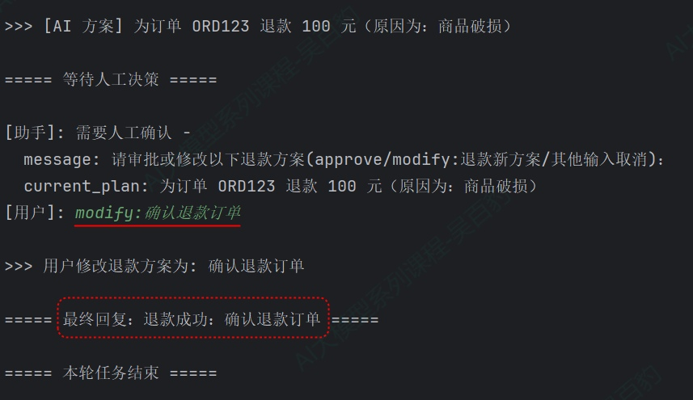
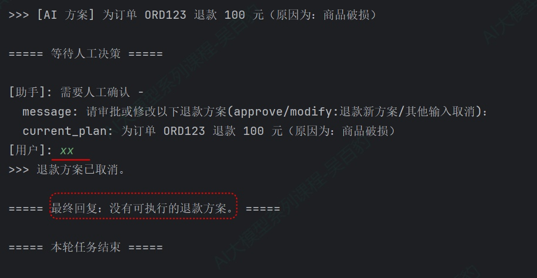

> 📌 **[AI 大模型与云原生全栈知识库](./README.md)** / **28. LangGraph 时间旅行**
> 🏠 [返回主页 README](./README.md) | ⚡ [面试 30 分钟速记](./interview/00_面试冲刺30分钟速记卡片.md) | 💻 [白板手写代码](./interview/08_大厂手写代码与白板编程题.md)

---

# 9\. **LangGraph时间旅行**

## 9.1. **时间旅行介绍及使用**

第 3 章讲过，Checkpointer 会记录线程内每一步的状态快照（checkpoint），同一个 thread\_id 的所有检查点构成一条历史链。时间旅行就是回到历史链上某个检查点，从那里重新执行，对已完成的流程进行"重放"或"改写"。

LangGraph 提供两种时间旅行能力：

* Replay（重放）：从过去的检查点重新执行。检查点之前的节点不重跑（结果已保存），之后的节点重新执行。
* Fork（分叉）：从过去的检查点修改状态后再继续，探索一条不同的路径。

核心规则：检查点之前的节点复用已保存结果，之后的节点重新执行——包括 LLM 调用、API 请求、以及 interrupt() （可能产生不同结果）。

我们可以通过 graph.get\_state\_history(config)获取Graph图中某些节点的config配置，然后基于该配置进行时间旅行。graph.get\_state\_history(config)返回该线程所有检查点的迭代器，按时间倒序。每个 StateSnapshot 有两个关键字段：

* next：下一步要执行的节点。如 ("write\_article",) 表示"即将执行 write\_article"。用它定位"某节点之前"的检查点。
* config：该检查点自己的配置（含 checkpoint\_id），传给 invoke() / update\_state() 即可从它继续。

定位"某节点之前"的检查点，是时间旅行最常用的查找模式：

```python
history = list(graph.get_state_history(config))
before_node = next(s for s in history if s.next == ("目标节点名",))
```

### **9.1.1. Replay重放**

Replay 通过 invoke(None, checkpoint.config) 从指定 checkpoint 恢复执行，关键语义：

1) checkpoint 之前的节点不重新执行（复用已保存的结果）
2) checkpoint 之后的节点重新执行（LLM 调用、API 请求会再次发生）
3) 从最终 checkpoint（next 为空）重放是无操作

案例：文章流水线重放。

```python
class State(TypedDict):
    """图状态：文章标题与正文"""
    title: str # 文章标题
    article: str # 文章正文


title_count = 0
article_count = 0


def plan_title(state: State) -> dict:
    """节点一：拟定标题"""
    global title_count
    title_count += 1
    return {"title": f"AI 时代的编程学习（第 {title_count} 版标题）"}


def write_article(state: State) -> dict:
    """节点二：撰写正文"""
    global article_count
    article_count += 1
    return {"article": f"基于[{state['title']}]撰写的正文（第 {article_count} 次撰写）"}


builder = StateGraph(State)
builder.add_node("plan_title", plan_title)
builder.add_node("write_article", write_article)

builder.add_edge(START, "plan_title")
builder.add_edge("plan_title", "write_article")
builder.add_edge("write_article", END)

graph = builder.compile(checkpointer=InMemorySaver())

config = {"configurable": {"thread_id": "thread001"}}


if __name__ == "__main__":
    # 首次执行
    result = graph.invoke({"title": "", "article": ""}, config)
    print(f"首次执行：{result}")
    print(f"计数器：title_count={title_count}, article_count={article_count}")

    print("=" * 50)

    # 检查点历史（倒序）
    history = list(graph.get_state_history(config))
    print("========== 检查点历史（倒序） ==========")
    for s in history:
        print(f"  next={s.next}")

    # Replay：从 write_article 之前重放
    print("\n========== Replay：从 write_article 之前重放 ==========")
    before_article = next(s for s in history if s.next == ("write_article",))
    replay_result = graph.invoke(None, before_article.config)
    print(f"重放结果：{replay_result}")
```

以上代码运行结果如下：



代码中注意如下几点：

1) get\_state\_history 返回倒序历史，next 字段清晰标出每一步"接下来要执行谁"：('\_\_start\_\_',) 是初始检查点，('plan\_title',) 是标题执行前，('write\_article',) 是正文执行前，() 是执行完毕。
2) 用 next(s for s in history if [s.next](http://s.next) == ("write\_article",)) 精确定位到"正文之前"的检查点，这是时间旅行里最常用的查找模式。
3) 重放后 title\_count 不变（标题节点结果复用、没重跑），article\_count 增加（正文节点真的重新执行了），计数器直观证明了 Replay 的"局部重跑"语义。

### **9.1.2. Fork分叉**

Replay 只是"原样重跑"(基于恢复到的checkpoint状态)，Fork 则更进一步：在重跑之前，先用 update\_state() 修改某个过去检查点的状态，从而探索一条不同的路径。典型场景：生成结果不满意，回到中间步骤，改一个参数重新生成。

Fork 的两个关键动作：

1) graph.update\_state(旧检查点.config, values={...})：基于旧检查点创建新检查点，状态被修改，返回新分支的 config。
2) graph.invoke(None, 新config)：从新检查点继续执行。

特别注意：update\_state 不会回滚线程，也不修改历史。检查点是不可变的，它只是在历史链的指定位置追加了一个新分支，原来的执行历史原封不动地保留着，于是整条历史从"一条线"变成了"一棵树"。

案例：换标题探索不同的正文

```python
from typing import TypedDict

from langgraph.checkpoint.memory import InMemorySaver
from langgraph.graph import StateGraph, START, END


class State(TypedDict):
    """图状态：文章标题与正文"""
    title: str # 文章标题
    article: str # 文章正文


def plan_title(state: State) -> dict:
    """节点一：拟定标题（保留传入值）"""
    return {"title": state["title"]}


def write_article(state: State) -> dict:
    """节点二：基于标题撰写正文"""
    return {"article": f"《{state['title']}》正文：这是一篇关于该主题的深度解读……"}


builder = StateGraph(State)
builder.add_node("plan_title", plan_title)
builder.add_node("write_article", write_article)

builder.add_edge(START, "plan_title")
builder.add_edge("plan_title", "write_article")
builder.add_edge("write_article", END)

graph = builder.compile(checkpointer=InMemorySaver())

config = {"configurable": {"thread_id": "article-2"}}


if __name__ == "__main__":
    # 首次执行，标题 A
    result = graph.invoke({"title": "LangGraph 入门", "article": ""}, config)
    print(f"首次执行（标题 A）：{result['article']}")

    # 定位 write_article 之前的检查点
    history = list(graph.get_state_history(config))
    before_article = next(s for s in history if s.next == ("write_article",))

    # Fork：修改标题，创建新分支
    print("========== Fork：换标题探索不同正文 ==========")
    fork_config = graph.update_state(
        before_article.config,
        values={"title": "LangGraph 深度实战"},
    )

    fork_result = graph.invoke(None, fork_config)
    print(f"分叉结果（标题 B）：{fork_result['article']}")

    # fork 后新分支成为线程最新状态；原分支仍在历史中
    print(f"fork 后 get_state 返回最新状态：{graph.get_state(config).values['title']}")

    print("完整历史（含原始分支与 fork 分支）：")
    for s in graph.get_state_history(config):
        print(f"  next={s.next}  title={s.values.get('title')}")

```

以上代码执行结果如下：



以上代码中，update\_state(before\_article.config, values={"title": "LangGraph 深度实战"}) 创建新检查点，指定了此刻的状态值（values）,然后 invoke(None, fork\_config) 用新的状态来继续执行后续节点。

### **9.1.3. Replay与Fork区别**

无论是 Replay 还是 Fork，它们在 Checkpointer 历史中都会产生新分支，原始历史永远保留（仅追加，不覆盖）。

两者的唯一区别在于 invoke 执行前，状态是否被外部修改：

* Replay：直接使用 invoke(None, checkpoint.config)。状态完全取自检查点，未做任何改动。后续节点拿到的输入与第一次执行时完全相同（只是因 LLM 随机性或时间变化，输出结果可能不同）。
* Fork：先执行 update\_state(checkpoint.config, values={...})，主动注入了新状态，再执行 invoke。后续节点拿到的是修改后的输入，从而走向完全不同的逻辑分支。

## 9.2. **从指定节点恢复执行**

update\_state还可以指定as\_node参数，声明"这份修改由哪个节点产生"，决定图从哪个节点的后继继续。以下情况需要显式指定该参数：

* 并行分支：同一 Super-step 多个节点更新了状态，LangGraph 无法判断哪个是最后写入（会抛 InvalidUpdateError）。
* 无执行历史：测试场景中，在全新thread\_id中设置初始状态。
* 跳过节点：把 as\_node 设为更靠后的节点，让图认为该节点已执行过。

```python
# graph: generate_topic -> write_joke
# 把这次修改视为 generate_topic 产生，执行从 write_joke继续
fork_config = graph.update_state(
    before_joke.config,
    values={"topic": "chickens"},
    as_node="generate_topic",
)
```

案例：Graph流程-订单号->退款原因->确认退款几个步骤，演示通过update\_state跳过节点执行。

```python
from typing import Annotated, TypedDict
import operator

from langgraph.checkpoint.memory import InMemorySaver
from langgraph.graph import StateGraph, START, END
from langgraph.types import interrupt, Command


class State(TypedDict):
    """图状态：收集结果列表（operator.add 累积，避免重跑覆盖）"""
    value: Annotated[list[str], operator.add]


def ask_order(state: State) -> dict:
    """节点一：收集订单号（中断）"""
    return {"value": [f"订单号={interrupt('请输入订单号：')}"]}


def ask_reason(state: State) -> dict:
    """节点二：收集退款原因"""
    return {"value": ["原因=商品破损"]}


def confirm(state: State) -> dict:
    """节点三：确认退款"""
    return {"value": ["确认=确认退款"]}


builder = StateGraph(State)
builder.add_node("ask_order", ask_order)
builder.add_node("ask_reason", ask_reason)
builder.add_node("confirm", confirm)

builder.add_edge(START, "ask_order")
builder.add_edge("ask_order", "ask_reason")
builder.add_edge("ask_reason", "confirm")
builder.add_edge("confirm", END)

graph = builder.compile(checkpointer=InMemorySaver())

config = {"configurable": {"thread_id": "thread001"}}


if __name__ == "__main__":
    # 正常完成三个中断
    graph.invoke({"value": []}, config)            # 订单号中断
    final = graph.invoke(Command(resume="ORD123"), config)      # 原因中断
    print(f"完整流程：{final}")

    # fork 到"订单号之后、原因之前"的检查点，改订单号
    print("\n========== Fork：改订单号，只重问原因与确认 ==========\n")
    history = list(graph.get_state_history(config))
    ask_order = next(s for s in history if s.next == ("ask_reason",))

    fork_config1 = graph.update_state(
        ask_order.config,
        values={"value": ["订单号=ORD999"]},
        as_node="ask_order",
    )

    result1 = graph.invoke(None, fork_config1)
    print(f"fork 后result1结果：{result1}")

    print("\n========== Fork：直接跳过某些节点，直接执行最后节点 ==========\n")

    fork_config2 = graph.update_state(
        ask_order.config,
        values={"value": ["订单号=ORD1000", "原因=商品质量"]},
        as_node="ask_reason", # 指定来自哪个节点的状态，直接跳过"ask_reason"节点逻辑执行 
    )
    result2 = graph.invoke(None, fork_config2)
    print(f"fork 后result2结果: {result2}")
```

以上代码运行结果如下：



以上代码中注意如下几点：

1) fork\_config1指定从“ask\_order”执行后的状态进行恢复，修改了订单号为“ORD999”，经过“raph.invoke(None, fork\_config1)”执行后，依次执行后续节点。
2) fork\_config2指定从“ask\_order”执行后的状态进行恢复，修改了订单号为“ORD1000”，并设置“"原因=商品质量"”，指定了“as\_node”为“ask\_reason”，模拟该状态是“ask\_reason”节点执行后状态，所以跳过了实际的“ask\_reason”节点执行。

## 9.3. **Fork后执行中断节点**

通过update\_state可以得到新的fork对应的config，基于这个config进行执行即可以依次顺序执行后续流节点，但如果后续节点有中断，中断恢复时我们需要通过“graph.invoke(Command(resume="xxx"), config)”进行恢复，注意这里的config要填写原始的config（不带checkpoint\_id），不能填写update\_state对应的config（带checkpoint\_id）,否则每次 resume 都回到同一中断点,无法推进"。

案例：改写以上案例，演示Fork后执行中断节点使用方式。

```python
from typing import Annotated, TypedDict
import operator

from langgraph.checkpoint.memory import InMemorySaver
from langgraph.graph import StateGraph, START, END
from langgraph.types import interrupt, Command


class State(TypedDict):
    """图状态：收集结果列表（operator.add 累积，避免重跑覆盖）"""
    value: Annotated[list[str], operator.add]


def ask_order(state: State) -> dict:
    """节点一：收集订单号（中断）"""
    return {"value": [f"订单号={interrupt('请输入订单号：')}"]}


def ask_reason(state: State) -> dict:
    """节点二：收集退款原因（中断）"""
    return {"value": [f"原因={interrupt('请输入退款原因：')}"]}


def confirm(state: State) -> dict:
    """节点三：确认退款（中断）"""
    return {"value": [f"确认={interrupt('确认退款？(yes/no)')}"]}


builder = StateGraph(State)
builder.add_node("ask_order", ask_order)
builder.add_node("ask_reason", ask_reason)
builder.add_node("confirm", confirm)
builder.add_edge(START, "ask_order")
builder.add_edge("ask_order", "ask_reason")
builder.add_edge("ask_reason", "confirm")
builder.add_edge("confirm", END)

graph = builder.compile(checkpointer=InMemorySaver())

config = {"configurable": {"thread_id": "form-1"}}


if __name__ == "__main__":
    # 正常完成三个中断
    graph.invoke({"value": []}, config)            # 订单号中断
    graph.invoke(Command(resume="ORD123"), config)      # 原因中断
    graph.invoke(Command(resume="商品破损"), config)     # 确认中断
    final = graph.invoke(Command(resume="yes"), config)
    print(f"完整流程：{final['value']}\n")

    # fork 到"订单号之后、原因之前"的检查点，改订单号
    print("========== Fork：改订单号，只重问原因与确认 ==========")
    history = list(graph.get_state_history(config))
    ask_order = next(s for s in history if s.next == ("ask_reason",))

    fork_config = graph.update_state(
        ask_order.config,
        values={"value": ["订单号=ORD999"]},
        as_node="ask_order",
    )

    result = graph.invoke(None, fork_config)
    print(f"result: {result}")
    print(f"fork 后暂停：{result['value']}")   # 停在"原因"中断

    # 继续 resume：原因 -> 确认
    graph.invoke(Command(resume="外包装划痕"), config)
    end = graph.invoke(Command(resume="yes"), config)
    print(f"最后结果：{end['value']}")

```

以上代码执行结果如下：



## 9.4. **中断中进行Fork**

我们也可以在interrupt()中断过程中,人工审批的时候修改状态或者跳转到对应节点。如下案例中，当出现interrupt时，审批环节输入 modify:新方案，触发 update\_state 在历史检查点上 fork 新分支改写方案，再从新分支恢复执行。

```python
from typing import NotRequired, TypedDict

from langgraph.checkpoint.memory import InMemorySaver
from langgraph.graph import END, START, StateGraph
from langgraph.types import Command, interrupt


# ================================================================
# 一、定义状态
# ================================================================
class State(TypedDict):
    action_to_execute: NotRequired[str]      # AI 生成的退款方案
    final_message: NotRequired[str]          # 最终结果


# ================================================================
# 二、定义节点
# ================================================================
def plan_action(state: State):
    """模拟 AI 生成退款方案"""
    planned_action = "为订单 ORD123 退款 100 元（原因为：商品破损）"
    print(f"\n>>> [AI 方案] {planned_action}")
    return {"action_to_execute": planned_action}


def human_approval_node(state: State):
    """HITL 核心节点：中断等待人工审批/修改/取消"""
    planned_action = state.get("action_to_execute", "无方案")
    # 中断，等待用户通过 Command(resume=...) 恢复
    user_feedback = interrupt({
        "message": "请审批或修改以下退款方案(approve/modify:退款新方案/其他输入取消)：",
        "current_plan": planned_action
    })

    if user_feedback.lower() == 'approve':
        print(">>> 退款方案已批准。")
        return {}
    else:
        print(">>> 退款方案已取消。")
        return {"action_to_execute": None, "final_message": "退款方案被取消。"}


def execute_action(state: State):
    """执行最终确定的退款方案（模拟执行退款）"""
    action = state.get("action_to_execute")
    if not action:
        return {"final_message": "没有可执行的退款方案。"}
    return {"final_message": f"退款成功：{action}"}


# ================================================================
# 三、构建主图
# ================================================================
builder = StateGraph(State)
builder.add_node("plan_action", plan_action)
builder.add_node("human_approval_node", human_approval_node)
builder.add_node("execute_action", execute_action)

builder.add_edge(START, "plan_action")
builder.add_edge("plan_action", "human_approval_node")
builder.add_edge("human_approval_node", "execute_action")
builder.add_edge("execute_action", END)

graph = builder.compile(checkpointer=InMemorySaver())

# ================================================================
# 四、辅助函数
# ================================================================
def get_user_input(interrupt_value):
    """根据中断信息向用户提问并读取输入"""
    if isinstance(interrupt_value, str):
        return input(f"\n[助手]: {interrupt_value}\n[用户]: ").strip()
    if isinstance(interrupt_value, dict):
        show = "\n".join(f"  {k}: {v}" for k, v in interrupt_value.items())
        return input(f"\n[助手]: 需要人工确认 -\n{show}\n[用户]: ").strip()
    return input(f"\n[用户]: ").strip()


# ================================================================
# 五、实时对话主循环（使用 stream_events）
# ================================================================
def run_dialog():
    config = {"configurable": {"thread_id": "thread001"}}

    # 首次启动：传入空状态
    stream_input: dict | Command = {}

    while True:
        # 使用 stream_events 事件流 API
        stream = graph.stream_events(stream_input, config=config, version="v3")

        # 检查是否发生中断
        if stream.interrupted:
            interrupt_value = stream.interrupts[0].value if stream.interrupts else None
            print("\n===== 等待人工决策 =====")

            # 获取用户输入
            user_decision = get_user_input(interrupt_value)

            # ===== 时间旅行分支 =====
            if user_decision.lower().startswith('modify:'):
                new_plan = user_decision[len('modify:'):].strip()
                print(f"\n>>> 用户修改退款方案为: {new_plan}")

                # 1. 获取当前中断点的配置（即历史检查点）
                history = list(graph.get_state_history(config))
                before_human_approval_node = next(s for s in history if s.next == ("human_approval_node",))

                # 2. 使用 update_state 在历史检查点上创建新分支
                #    创建一个新检查点，action_to_execute 更新为新计划
                new_config = graph.update_state(
                    before_human_approval_node.config,
                    {"action_to_execute": new_plan},
                    as_node="human_approval_node"  # 表示该修改由该节点产生
                )

                # 3. 更新 config 为新分支的配置
                config = new_config

                # 4. 用 Command(resume=...) 放行本次中断
                stream_input = Command(resume="approve")

            else:
                # 普通审批或取消，直接恢复
                stream_input = Command(resume=user_decision)

        else:
            # 如果没有中断，说明图执行完毕
            final_state = stream.output
            final_msg = final_state.get("final_message", "未返回最终信息")
            print(f"\n===== 最终回复：{final_msg} =====")
            print("\n===== 本轮任务结束 =====\n")
            break


if __name__ == "__main__":
    run_dialog()
```

代码运行后结果如下：







---
> 🏠 **[返回主页 README](./README.md)** | ◀️ **上一篇：[27. LangGraph 子图](./27LangGraph%20子图.md)** | ▶️ **下一篇：[29. 携程 AI 智能助手项目实战](./29携程AI智能助手项目_两种实现方式对比分析与面试指南.md)** | ⚡ **[面试 30 分钟速记](./interview/00_面试冲刺30分钟速记卡片.md)**
