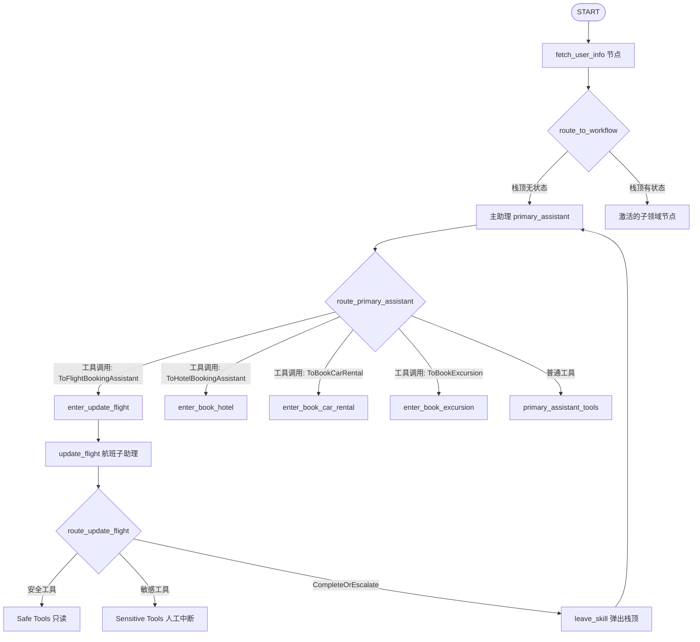
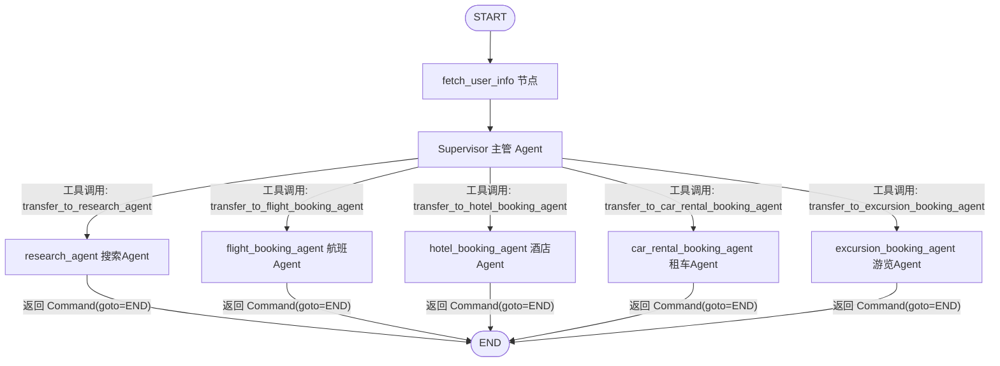

> 📌 **[AI 大模型与云原生全栈知识库](./README.md)** / **29. 携程 AI 智能助手项目实战与对比指南**
> 🏠 [返回主页 README](./README.md) | ⚡ [面试 30 分钟速记](./interview/00_面试冲刺30分钟速记卡片.md) | 💻 [白板手写代码](./interview/08_大厂手写代码与白板编程题.md)

---

# 携程 AI 智能助手项目：两种不同实现方式对比分析与面试指南

> 本文档针对 `ctrip_assistant`（传统 Stack+Subgraph 动态栈式切换）与 `new_ctrip`（现代化 Supervisor+Command Handoffs 多智能体架构）两个项目的实现原理、技术选型、开发步骤、核心难点及面试高频问题进行了系统化梳理与对比分析。

---

## 目录
1. [项目整体概述与背景](#1-项目整体概述与背景)
2. [两种实现方式的对比分析](#2-两种实现方式的对比分析)
3. [项目从零到一的实现步骤](#3-项目从零到一的实现步骤)
4. [核心技术难点与解决方案](#4-核心技术难点与解决方案)
5. [关键代码解析与实现细节](#5-关键代码解析与实现细节)
6. [面试高频问题与答题模板](#6-面试高频问题与答题模板)

---

## 1. 项目整体概述与背景

携程 AI 智能助手项目旨在为用户提供**一站式旅行服务代理**，覆盖航班查询/改签/退票、酒店查询/预订/取消、租车服务以及景点游览推荐等复杂业务逻辑。

由于旅行场景涉及多种专业子领域，且部分操作涉及写数据库、金钱扣减等**高敏感写操作**，项目采用了 **LangGraph 多智能体（Multi-Agent）图结构控制流**，并结合 **Human-in-the-Loop (HITL) 人类在环确认机制** 与 **RAG 政策检索**。

项目代码中提供了两种不同架构演进阶段的实现方式：
1. **方式一 (`ctrip_assistant`)**：基于 LangGraph 经典 `StateGraph` 的**分层子图与动态对话栈（Stack-Based Subgraph Router & Hand-off）**模式。
2. **方式二 (`new_ctrip`)**：基于 LangGraph 0.2+ 现代化 **主管模式（Supervisor Pattern）+ `create_react_agent` + `Command` 原语转接（Handoffs）**架构。

---

## 2. 两种实现方式的对比分析

### 2.1 架构图对比

#### 方式一架构 (`ctrip_assistant` - 栈式子图切换):


#### 方式二架构 (`new_ctrip` - Supervisor + Command 转接):


### 2.2 核心维度全方位对比

| 对比维度 | 方式一：`ctrip_assistant` (栈式子图路由) | 方式二：`new_ctrip` (Supervisor + Command 转接) |
| :--- | :--- | :--- |
| **设计模式** | 动态对话栈（Stack-based Dialog State）+ 主从嵌套子图 | 主管 Agent 分发（Supervisor Agent）+ 平铺扁平化转接 |
| **控制流机制** | 自定义 Pydantic Schema（如 `ToFlightBookingAssistant`）触发路由函数 | 自定义 `create_handoff_tool` 返回 LangGraph `Command(goto=...)` 原语 |
| **转接上下文保持** | 使用自定义 `update_dialog_stack` 追踪 `dialog_state` 栈顶，支持出栈回到主助理 | 使用 `Command.PARENT` 直接在全局 `MessagesState` 中修改节点指向 |
| **工具节点隔离** | **强隔离**：显式区分 Safe Tools（只读）与 Sensitive Tools（高危写），定义不同路由分支 | **弱隔离**：将 Tools 直接绑定给对应子 Agent 的 React Runner |
| **代码量与复杂度** | **较高**：需要为每个业务领域编写 `build_xxx_graph` 路由逻辑、入口节点及出栈节点 | **极简**：使用 `create_react_agent` 极简定义 Agent，依赖系统级 `Command` 跳转 |
| **人类在环 (HITL)** | 在图编译阶段使用 `interrupt_before=[...sensitive_tools]` 配置显式中断 | 在客户端调用层使用 `Command(resume=...)` 处理恢复中断 |
| **扩展性** | 新增业务线需要编写完整的 Graph Builder、路由逻辑及 Entry/Pop 节点 | 新增业务线只需 `create_react_agent` 并注册一个 `handoff_tool` 绑定到 Supervisor |

---

## 3. 项目从零到一的实现步骤

无论采用哪种架构方式，开发一个完整的 AI 智能助手项目均应遵循以下**四阶段标准敏捷开发流程**：

```python
[阶段一：基础与工具层] ──> [阶段二：Agent核心与控制图] ──> [阶段三：安全控制与HITL] ──> [阶段四：API/UI工程化]
```

### 阶段一：基础数据层与工具链搭建（Tools & RAG）
1. **数据库模型与测试数据初始化**：
   - 搭建 SQLite 数据库（如 `travel2.sqlite`），设计包含 `flights`, `hotels`, `car_rentals`, `user_flight_info` 等业务表。
   - 编写 `tools/init_db.py` 脚本，支持在测试前重置和更新日期（`update_dates()`）。
2. **底层 Tool 封装（Python `@tool` 装饰器）**：
   - 业务 Tool 分类：查询类（只读）与 修改/取消类（写数据库）。
   - 实现包含 `flights_tools.py`, `hotels_tools.py`, `car_tools.py`, `trip_tools.py` 等。
3. **退改签政策 RAG 向量检索实现**：
   - 解析 FAQ 政策文档 `order_faq.md`。
   - 编写 `tools/retriever_vector.py`，基于 `OpenAIEmbeddings` / `ZhipuAIEmbeddings` 结合 `NumPy` 实现高效轻量级向量余弦相似度检索工具 `lookup_policy`。

### 阶段二：智能体(Agent)核心逻辑与状态图(Graph)设计
1. **状态定义（State Definition）**：
   - 方式一：定义继承自 `TypedDict` 的 `State`，包含 `messages`, `user_info` 以及基于 `Annotated` 和 `update_dialog_stack` 约定的 `dialog_state` 栈。
   - 方式二：使用 LangGraph 内置的 `MessagesState`。
2. **Prompt 模板设计与 Agent 实例化**：
   - 为主助理（或 Supervisor）设计 System Prompt，赋予其角色定位、转接规则与用户信息上下文。
   - 为各个子领域 Agent（机票、酒店、租车、景点）设计专项 Prompt。
3. **转接机制（Handoff Mechanism）构建**：
   - 方式一：使用 Pydantic 定义 `ToFlightBookingAssistant` 等转接 Intent 模型，配合自定义入口节点 `create_entry_node` 与出栈节点 `pop_dialog_state`。
   - 方式二：编写 `create_handoff_tool` 工具工厂，使用 `Command(goto=agent_name, update=..., graph=Command.PARENT)` 实现灵活转接。
4. **编译流程图（Graph Compile）**：
   - 使用 `StateGraph` 将节点（Node）与条件边（Conditional Edge）组装，并绑定 `MemorySaver` / `InMemorySaver` 检查点。

### 阶段三：控制流安全防护与人类在环（HITL）
1. **敏感工具隔离与防护**：
   - 识别高风险写操作（取消机票 `cancel_ticket`、退订酒店 `cancel_hotel`）。
2. **配置中断机制（Interrupt Standard）**：
   - 方式一：在 `builder.compile(interrupt_before=["...sensitive_tools"])` 设防。
   - 方式二：在图执行流中识别 `current_state.next`，阻塞输出并等待用户确认。
3. **中断恢复交互逻辑（Resume Logic）**：
   - 当用户回复 `y` / 确认时，使用 `graph.stream(None, config)` 或 `graph.stream(Command(resume={'answer': user_input}), config)` 继续执行后续节点。

### 阶段四：工程化落地与 UI/API 部署
1. **FastAPI 服务后端集成** (`ctrip_assistant/main.py`, `api/graph_api/graph_views.py`)：
   - 设计全局 OAuth2 / JWT 认证中间件与统一异常处理。
   - 暴露 `/api/graph/` POST 接口，将 HTTP 客户端请求转发至 `graph.stream()`。
2. **前端/终端交互界面实现**：
   - `ctrip_assistant/graph_chat/graph_gradio.py`（Gradio 可视化 WebUI）。
   - `new_ctrip/graph_chat/graph.py`（CLI 命令行交互循环）。

---

## 4. 核心技术难点与解决方案

### 难点一：多 Agent 对话上下文隔离与转接栈恢复
- **问题描述**：在复杂多轮对话中，如果用户从“订机票”突然切换到“问酒店”，随后又想“退回机票流程”，传统 Single-Agent 容易造成 Prompt 混淆或上下文超长，导致回复失控。
- **解决方案**：
  - **方式一（栈式管理）**：设计 `dialog_state` 数组作为压栈/出栈容器。进入子节点压入 `update_flight`，完成后调用 `CompleteOrEscalate` 执行 `pop_dialog_state` 出栈恢复主助理，完美实现上下文隔离与嵌套回溯。
  - **方式二（Command 原语）**：利用 LangGraph 的 `Command(goto=target_agent, graph=Command.PARENT)` 直接在顶级图触发节点状态迁移，避免复杂的条件分支嵌套逻辑。

### 难点二：高风险写操作的安全防范 (Human-in-the-Loop)
- **问题描述**：大模型生成 Tool Call 时具有随机性，直接执行数据库 `DELETE`/`UPDATE` 可能造成经济损失或非法操作。
- **解决方案**：
  - 采用 **Tool 分层 + LangGraph 中断机制**：
    1. 工具分类：`Safe Tools`（只读，自动执行）与 `Sensitive Tools`（敏感，需人工确认）。
    2. 使用 `interrupt_before` 挂起：当节点走向敏感工具节点前，系统保存 Checkpoint 并停止运行，向前端返回确认提示。
    3. 用户在 UI 确认输入 `'y'` 后，系统带上原 `thread_id` 从 Checkpoint 恢复执行，确保非授权指令绝对不入库。

### 难点三：跨 Agent 递归调用与死循环防御
- **问题描述**：Agent A 将任务转给 Agent B，Agent B 又误判定转回 Agent A，导致死循环消耗 API Token。
- **解决方案**：
  - 在 `CtripAssistant.__call__` 中增加死循环保护校验，监测 LLM 是否反复生成无意义的空响应。
  - 在 Supervisor Prompt 中加入硬性约束规则：“一次只分配一个任务”、“禁止自己执行需工具操作的任务”、“遇到无法处理的操作直接回复用户而不要盲目转接”。

### 难点四：轻量级无依赖向量检索 (RAG 优化)
- **问题描述**：引入 Chroma/Milvus 等重型向量数据库会增加部署维护成本，且在小型 FAQ 场景（数十条退改签规则）下过度设计。
- **解决方案**：
  - 自研 `VectorStoreRetriever` 模块（[retriever_vector.py](./《携程AI智能助手项目》课程代码/ctrip_assistant/tools/retriever_vector.py)）。
  - 利用 `re.split(r"(?=\n##)", faq_text)` 将 Markdown 按标题切块，在内存中使用 `NumPy` 的矩阵点积（`embed @ vectors.T`）实现毫秒级余弦相似度检索，大幅削减基础设施开销。

---

## 5. 关键代码解析与实现细节

### 5.1 方式一 (`ctrip_assistant`) 关键代码

#### 1. 状态定义与动态栈更新函数 ([state.py](./《携程AI智能助手项目》课程代码/ctrip_assistant/graph_chat/state.py))
```python
def update_dialog_stack(left: list[str], right: Optional[str]) -> list[str]:
    if right is None:
        return left
    if right == "pop":
        return left[:-1]  # 弹出栈顶，交还控制权
    return left + [right]  # 新业务压栈

class State(TypedDict):
    messages: Annotated[list[AnyMessage], add_messages]
    user_info: str
    dialog_state: Annotated[
        list[Literal["assistant", "update_flight", "book_car_rental", "book_hotel", "book_excursion"]],
        update_dialog_stack,
    ]
```

#### 2. 入口节点生成器与退栈响应 ([entry_node.py](./《携程AI智能助手项目》课程代码/ctrip_assistant/graph_chat/entry_node.py))
```python
def create_entry_node(assistant_name: str, new_dialog_state: str) -> Callable:
    def entry_node(state: dict) -> dict:
        tool_call_id = state["messages"][-1].tool_calls[0]["id"]
        return {
            "messages": [
                ToolMessage(
                    content=f"现在助手是{assistant_name}。请回顾上述主助理与用户之间的对话...",
                    tool_call_id=tool_call_id,
                )
            ],
            "dialog_state": new_dialog_state,
        }
    return entry_node
```

#### 3. 敏感工具节点与编译中断配置 ([finally_graph.py](./《携程AI智能助手项目》课程代码/ctrip_assistant/graph_chat/finally_graph.py))
```python
memory = MemorySaver()
graph = builder.compile(
    checkpointer=memory,
    interrupt_before=[
        "update_flight_sensitive_tools",
        "book_car_rental_sensitive_tools",
        "book_hotel_sensitive_tools",
        "book_excursion_sensitive_tools",
    ]
)
```

---

### 5.2 方式二 (`new_ctrip`) 关键代码

#### 1. 基于 `Command` 的 Handoff 工具工厂 ([all_agent.py](./《携程AI智能助手项目》课程代码/new_ctrip/graph_chat/all_agent.py))
```python
def create_handoff_tool(*, agent_name: str, description: str | None = None):
    name = f"transfer_to_{agent_name}"
    description = description or f"Ask {agent_name} for help."

    @tool(name, description=description)
    def handoff_tool(
        state: Annotated[MessagesState, InjectedState],
        tool_call_id: Annotated[str, InjectedToolCallId],
    ) -> Command:
        tool_message = {
            "role": "tool",
            "content": f"Successfully transferred to {agent_name}",
            "name": name,
            "tool_call_id": tool_call_id,
        }
        return Command(
            goto=agent_name,  # 跳转至目标 Agent 节点
            update={**state, "messages": state["messages"] + [tool_message]},
            graph=Command.PARENT,  # 在父图作用域内生效
        )
    return handoff_tool
```

#### 2. Supervisor 节点与简洁图组装 ([graph.py](./《携程AI智能助手项目》课程代码/new_ctrip/graph_chat/graph.py))
```python
graph = (
    StateGraph(MessagesState)
    .add_node('fetch_user_info', get_user_info)
    .add_node(supervisor_agent, destinations=("research_agent", 'flight_booking_agent', 'hotel_booking_agent', 'car_rental_booking_agent', 'excursion_booking_agent' , END))
    .add_node(research_agent, destinations=(END,))
    .add_node(flight_booking_agent, destinations=(END,))
    .add_node(hotel_booking_agent, destinations=(END,))
    .add_node(car_rental_booking_agent, destinations=(END,))
    .add_node(excursion_booking_agent, destinations=(END,))
    .add_edge(START, 'fetch_user_info')
    .add_edge('fetch_user_info', 'supervisor')
    .compile(checkpointer=memory)
)
```

---

## 6. 面试高频问题与答题模板

### 提问 1：为什么在携程智能助手项目中选择 LangGraph 而不是原生 LangChain / AutoGen？
> **回答要点**：
> 1. **循环与状态控制能力**：携程业务包含多轮确认、条件判断（如查政策->符合条件->人工确认->退票），LangGraph 原生支持带循环（Loop）的有向图，而普通 LangChain Chain 主要是单向 DAG。
> 2. **精准的 Checkpoint 与断点恢复**：结合 `MemorySaver` / SQLite Checkpointer，LangGraph 能在敏感写操作前精准挂起（`interrupt_before`），并将全量状态持久化，这是传统 Agent 框架难以优雅实现的。
> 3. **细粒度的状态与工具隔离**：LangGraph 允许为不同的子 Node 独立配置状态机与 Tool 集合，避免单大模型挂载数十个 Tool 导致的工具误调用（Tool Hallucination）。

---

### 提问 2：请详细讲讲你们项目中是如何处理“退票/取消订单”这类敏感高危操作的？
> **回答要点**：
> 1. **工具拆分**：我们将工具严格划分为 `Safe Tools`（如 `search_flights`）和 `Sensitive Tools`（如 `cancel_ticket`）。
> 2. **图节点路由隔离**：在状态图分支路由时，若检测到 Tool Call 属于 `Sensitive Tools`，则走向专门的敏感节点。
> 3. **Human-in-the-Loop 挂起**：编译图时开启 `interrupt_before=["...sensitive_tools"]`。当图运行到该节点前会自动暂停，挂起并返回给前端用户确认消息（“确定要退订此机票吗？输入 y 继续”）。
> 4. **恢复执行与数据安全**：后端收到用户确认后，透传原 `session_id/thread_id`，调用 `graph.stream(None, config)` 恢复运行，此时才真正触发 Python SQLite 扣款/改签逻辑，实现了100%安全闭环。

---

### 提问 3：对比你代码中的两种实现方式（`ctrip_assistant` 栈模式 vs `new_ctrip` Supervisor 模式），生产环境推荐用哪种？为什么？
> **回答要点**：
> - **微观总结**：
>   - `ctrip_assistant` 采用**子图动态栈（Stack）**模式，优势在于**上下文层级清晰、支持深度嵌套**。如果业务需要复杂的“子任务处理完后完全返回上级任务主线”的流程，栈结构控制力更强；缺点是代码复杂度高，维护较繁琐。
>   - `new_ctrip` 采用 **Supervisor + LangGraph `Command` 原语**，利用了 LangGraph 0.2+ 的现代转接语法（Handoffs），代码极简，扩展性极强。添加一个新子 Agent 只需一行 `create_react_agent` 和声明一个转接工具。
> - **生产建议**：
>   - 推荐采用 **`new_ctrip` 的架构思想**（基于 `Command` 的 Supervisor 转接模式），因为其解耦性更好，符合大模型多智能体发展的最新标准规范，大幅降低维护成本。

---

### 提问 4：多 Agent 协作时，如何解决 Token 消耗过大、Prompt 过长的问题？
> **回答要点**：
> 1. **Prompt 瘦身与专业化**：主助理/Supervisor 只保留全局调度 Prompt 和 Hand-off 工具描述；各个子 Agent 只赋予本领域业务指令（如机票 Agent 只看机票规范），降低每个模型调用时的 Prompt 长度。
> 2. **子图/状态隔离 (State Pruning)**：进入子 Agent 后，可以通过过滤机制只传入与当前任务相关的对话历史，或在转接时生成摘要 ToolMessage，避免全量无意义历史重复传输。
> 3. **只读与写工具按需绑定**：不给 Supervisor 挂载具体业务查询 Tool，只挂载 `handoff_tool`；避免将数十个 API 全部打包进单个 Agent 的上下文。

---

### 提问 5：如果用户在对话中提问“我想先查下上海到北京机票，顺便帮我搜一下当地酒店”，系统是如何调度的？
> **回答要点**：
> - **在 `new_ctrip` (Supervisor 模式) 下的执行轨迹**：
>   1. 用户消息到达 `supervisor_agent`。
>   2. Supervisor 识别出核心需求，先调用 `transfer_to_flight_booking_agent`。
>   3. 触发 `Command(goto="flight_booking_agent")`，控制流跳转至机票 Agent，执行航班查询并返回结果。
>   4. 任务处理完成后，控制流回到 Supervisor（或直接转接），Supervisor 识别剩余需求，调用 `transfer_to_hotel_booking_agent`。
>   5. 跳转至酒店 Agent 执行搜索，汇总结果输出给用户，实现跨域组合服务的流水线调度。

---

## 7. 总结

携程 AI 智能助手项目展示了从**传统子图栈控制**向**现代化 Supervisor + Command 原语多智能体架构**演进的过程：

- **核心价值**：通过 LangGraph 实现复杂业务的解耦、状态精确追踪与人类在环安全保障。
- **面试必杀技**：熟练掌握 **Tool 分层隔离**、**HITL 中断与恢复**、**动态对话栈原理** 以及 **LangGraph 0.2+ `Command` 原语** 的本质区别与适用场景。

---
> 🏠 **[返回主页 README](./README.md)** | ◀️ **上一篇：[28. LangGraph 时间旅行](./28LangGraph时间旅行.md)** | ▶️ **下一篇：[30. 携程新架构方案二](./30携程新方式二_new_ctrip_核心知识点与技术难点手册.md)** | ⚡ **[面试 30 分钟速记](./interview/00_面试冲刺30分钟速记卡片.md)**
