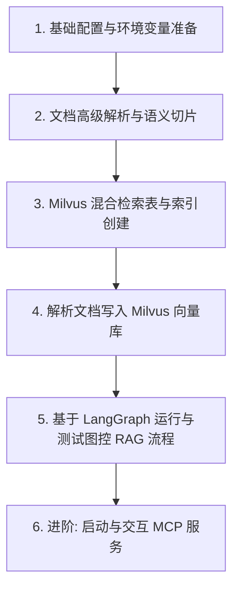
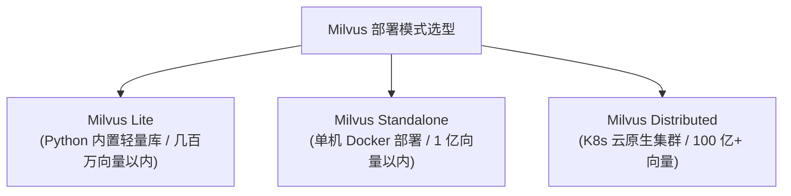

> 📌 **[AI 大模型与云原生全栈知识库](./README.md)** / **32. RAG 企业知识库项目架构与源码解析**
> 🏠 [返回主页 README](./README.md) | ⚡ [面试 30 分钟速记](./interview/00_面试冲刺30分钟速记卡片.md) | 💻 [白板手写代码](./interview/08_大厂手写代码与白板编程题.md)

---

# 《RAG企业知识库项目》目录结构与功能解析文档

## 一、 项目整体概述 (Project Overview)

本项目是一套针对**企业级高级 RAG（Retrieval-Augmented Generation，检索增强生成）系统与 Agent 智能体架构**的教学与实战代码库。

项目围绕企业知识库的核心痛点（如：精准搜索、多源文档解析、上下文丢失、大模型幻觉、检索无关内容等），提供了从**非结构化文档高级解析切片**、**Milvus 双路混合检索（Dense 语义向量 + BM25 稀疏全文向量）**，到基于 **LangChain & LangGraph** 实现的 **Agentic RAG、Corrective RAG (CRAG / 纠正型 RAG)** 和 **Adaptive RAG (自适应与 Self-RAG)** 的全流程工程落地实现，并扩展引入了 **MCP (Model Context Protocol)** 协议集成测试。

课程代码分为两个递进版本：
- **`RAG_PROJECT`**：RAG 核心教学代码。涵盖文档解析、Milvus 向量/稀疏数据库构建、LangChain Agent 结合对话历史记忆、以及 LangGraph 状态图控制（文档评分、查询重写、幻觉自检测等节点）。
- **`RAG_PROJECT2`**：第二阶段/进阶扩展代码。在 `RAG_PROJECT` 的基础上引入了 **MCP (Model Context Protocol)** 协议的架构实现与客户端/服务端测试（`test_mcp` 模块）。

---

## 二、 根目录及全局文件说明 (Root Level Structure)

当前工作区根目录下包含以下文件与子目录：

| 文件 / 目录名 | 类型 | 说明与用途 |
| :--- | :--- | :--- |
| **`RAG_PROJECT/`** | 目录 | **第一阶段核心项目**：RAG 全流程实战代码（文档解析、混合检索、LangGraph 流程图等） |
| **`RAG_PROJECT2/`** | 目录 | **第二阶段进阶项目**：在 RAG 核心功能上扩展了 MCP (Model Context Protocol) 协议实战 |
| **`md.zip`** | 压缩包 | 包含业务知识库的原始 Markdown 示例文件集 |
| **`requirements.txt`** | 配置文件 | 项目依赖声明文件（包含 `langchain`, `langgraph`, `pymilvus`, `unstructured`, `zhipuai`, `mcp` 等） |

---

## 三、 项目详细目录结构与模块功能解析

`RAG_PROJECT` 与 `RAG_PROJECT2` 的核心代码结构保持一致，下面对各功能模块及其代表性文件进行详细解析：

```python
《RAG企业知识库项目》课程代码/
├── RAG_PROJECT/                   # RAG 核心主项目
│   ├── agent/                     # LangChain Agent 智能体实现
│   │   └── rag_agent.py           # 基于 Tool Calling 的 Agent，集成对话记忆 (RunnableWithMessageHistory)
│   ├── datas/                     # 测试数据集与解析中间产物
│   │   ├── layout-parser-paper.pdf # 示例 PDF 测试文件
│   │   ├── md/                    # 示例 Markdown 知识库 (涵盖产品 FAQ、故障排查、技术报告等)
│   │   └── output/                # 复杂文档解析导出的 JSON / HTML 中间文件
│   ├── documents/                 # 文档解析、切片与向量数据库存储模块
│   │   ├── markdown_parser.py     # 基于 Unstructured & SemanticChunker (语义切片) 的 Markdown 解析器
│   │   ├── milvus_db.py           # Milvus 数据库 Schema 与索引构建 (HNSW 密集向量 + BM25 稀疏全文索引)
│   │   └── write_milvus.py        # 批量解析文档并持久化写入 Milvus 向量库
│   ├── graph/                     # LangGraph 状态图 1：CRAG (Corrective RAG / 纠正型 RAG)
│   │   ├── agent_node.py          # 智能体决策节点
│   │   ├── generate_node.py       # LLM 答案生成节点
│   │   ├── get_human_message.py   # 对话消息提取工具函数
│   │   ├── graph1.py              # CRAG 主工作流：Agent -> Retrieve -> Grade Docs -> (Rewrite / Generate)
│   │   ├── graph_state1.py        # CRAG 状态定义与 Pydantic 评分模型 (Grade)
│   │   └── rewrite_node.py        # 问题重写/改写节点 (Query Rewrite)
│   ├── graph2/                    # LangGraph 状态图 2：Adaptive & Self-RAG (自适应与自评估 RAG)
│   │   ├── generate_node2.py      # 答案生成节点
│   │   ├── grade_answer_chain.py  # 评估生成答案是否解答了原始问题 Chain
│   │   ├── grade_documents_node.py# 评估检索文档与问题的相关性节点
│   │   ├── grade_hallucinations_chain.py # 幻觉检测 Chain (评估答案是否符合检索文档)
│   │   ├── grader_chain.py        # 检索文档评分 Chain
│   │   ├── graph_2.py             # Adaptive RAG 完整流程控制图
│   │   ├── graph_state2.py        # Graph2 状态定义
│   │   ├── query_route_chain.py   # 问题动态路由 Chain (向量库 RAG vs 外部 Web 搜索)
│   │   ├── retriever_node.py      # 向量库检索节点
│   │   ├── transform_query_node.py# 查询改写/优化节点
│   │   └── web_search_node.py     # 联网搜索引擎节点 (Tavily/智谱)
│   ├── llm_models/                # 大模型与 Embedding 模型统一配置
│   │   ├── all_llm.py             # ChatOpenAI (GPT-4o-mini / DeepSeek) 与 Tavily Search 工具配置
│   │   └── embeddings_model.py    # Embedding 模型 (OpenAI Embedding & HuggingFace BGE)
│   ├── search_tool/               # 搜索引擎工具库
│   │   └── test_search.py         # Tavily 联网搜索接口测试
│   ├── test_load/                 # 高级文档加载测试 (Unstructured Hi-Res)
│   │   └── demo1.py ~ demo4.py    # PDF 布局解析、表格提取与 HTML 渲染等测试
│   ├── test_milvus/               # Milvus 原生 Python SDK 测试
│   │   └── demo1.py               # Milvus Collection 建立、数据插入与向量查询测试
│   ├── test_vector/               # 密集与稀疏向量检索原理测试
│   │   ├── demo1.py               # 密集向量 (Dense Vector) 匹配测试
│   │   └── demo2.py               # Milvus 内置 BM25 稀疏向量 (Sparse Vector) 全文检索测试
│   ├── tools/                     # 工具封装模块
│   │   └── retriever_tools.py     # 将 Milvus 检索器封装为 LangChain Tool
│   ├── utils/                     # 项目通用辅助工具
│   │   ├── env_utils.py           # 环境变量与 API Key 配置 (OpenAI, DeepSeek, Milvus, Tavily, 智谱等)
│   │   ├── log_utils.py           # 统一日志记录工具 (Loguru)
│   │   └── print_utils.py         # LangGraph 执行过程事件彩印工具
│   └── draw_png.py                # 使用 Mermaid 将 LangGraph 工作流图导出渲染为 PNG 图片
│
└── RAG_PROJECT2/                  # 第二阶段进阶项目（新增 MCP 协议测试）
    ├── (包含 RAG_PROJECT 的全部核心模块)
    └── test_mcp/                  # MCP (Model Context Protocol) 协议解耦框架测试
        ├── agent_client.py        # MCP 客户端 Agent 调度实现
        ├── mcp_app.py             # 基于 FastMCP 的集成应用
        ├── mcp_server.py          # FastMCP 服务端 (提供智谱 Web 搜索、数学运算及资源资源接口)
        └── zhipu_agent.py         # 智谱 AI + MCP 工具链实战测试
```

---

## 四、 项目四大核心技术亮点与设计思想

### 1. 混合检索架构 (Dense Vector + BM25 Sparse Vector)
针对传统向量检索在处理**专有名词、缩写、产品型号、精确编号**时容易失真缺失的痛点，项目基于 **Milvus 2.5+** 搭建了混合检索库（[milvus_db.py](./《RAG企业知识库项目》课程代码/RAG_PROJECT/documents/milvus_db.py)）：
- **Dense Vector (密集向量)**: 基于 `BAAI/bge-small-zh-v1.5` 或 `OpenAI Embeddings` 抓取深层上下文语义。
- **Sparse Vector (BM25 稀疏向量)**: 利用 Milvus 内置的 BM25 分析器配合 `jieba` 中文分词，保留关键词的精确全文检索能力。
- **多路召回与融合**: 在向量数据库侧直接实现多路索引的标量过滤与混合融合打分。

### 2. 结构化文档解析与语义切片 (Semantic Chunking)
- **上下文标题路径保留 (`merge_title_content`)**: 解析 Markdown 时，自动抓取章节父标题层次结构（如：`产品手册 -> 规格参数 -> 尺寸`），防止将文本切块后丢失所属章节的上下文信息（[markdown_parser.py](./《RAG企业知识库项目》课程代码/RAG_PROJECT/documents/markdown_parser.py)）。
- **语义切片 (`SemanticChunker`)**: 替代简单粗暴的字符长度硬切分，通过分析相邻句子的向量语义断层，在语义转折点进行智能切分。

### 3. 基于 LangGraph 的高阶图控 RAG 工作流 (Adaptive & Self-RAG)
项目通过 **LangGraph** 实现了复杂的条件状态分支与自我反思（Self-Reflection）机制（[graph_2.py](./《RAG企业知识库项目》课程代码/RAG_PROJECT/graph2/graph_2.py)）：
1. **动态智能路由 (`route_question`)**: 评估用户提问，自动判断走私有向量库还是联网搜索。
2. **文档相关性校验 (`grade_documents`)**: 使用带有结构化输出（`with_structured_output`）的 LLM 筛选相关文档，淘汰噪声。
3. **自适应查询优化 (`transform_query`)**: 若检出的文档均不相关，自动改写提问再次检索（设有限次重试逻辑，防止死循环）。
4. **Self-RAG 幻觉与回答质量检测 (`grade_generation_v_documents_and_question`)**:
   - **幻觉检测**: 检查 LLM 生成的答案是否完全有依据于检索到的参考文档。
   - **回答完备性检测**: 检查生成的答案是否真正回答了用户提出的问题。

### 4. MCP (Model Context Protocol) 协议引入
在 `RAG_PROJECT2/test_mcp` 中，项目演示了目前最新的标准通信协议 **MCP**（[mcp_server.py](./《RAG企业知识库项目》课程代码/RAG_PROJECT/test_mcp/mcp_server.py)）：
- 实现了服务提供方（MCP Server）与模型消费方（MCP Client/Agent）的标准分离，使大模型可以通过统一的标准接口跨进程/跨网络安全地调用工具与读取资源（Resource）。

---

## 五、 核心操作步骤 (Key Operation Steps)

整个项目从零搭建并运行一个高级 RAG 知识库系统，包含了以下 **6 个关键操作步骤**：



### 步骤 1：基础环境与 API Key 配置
在使用项目前，需在环境或 `utils/env_utils.py` 中配置大模型与向量库参数：
- 配置 `OPENAI_API_KEY` / `DEEPSEEK_API_KEY` / `ZHIPU_API_KEY` API 密钥；
- 配置 Milvus 服务连接地址（如 `MILVUS_URI = "http://localhost:19530"` 或云端 URI）；
- 配置 Tavily 搜索 Key（用于 Web 路由搜索）。

### 步骤 2：文档高级解析与语义切片 (`documents/markdown_parser.py`)
1. 使用 `UnstructuredMarkdownLoader` 按元素模式拆解 Markdown 文件（识别 `Title` / `NarrativeText` / `Table`）；
2. 执行 `merge_title_content()` 函数：通过层级字典树，将父章节标题自动拼接至子段落中，解决上下文缺失问题；
3. 调用 `SemanticChunker`：根据向量语义变化阈值（`percentile`）对长文本进行动态断点切割。

### 步骤 3：Milvus 混合检索 Collection 与索引创建 (`documents/milvus_db.py`)
1. 初始化 `MilvusClient(uri=...)` 建立连接；
2. 定义 Schema：添加 `dense` 字段（`FLOAT_VECTOR`, dim=512）与 `sparse` 字段（`SPARSE_FLOAT_VECTOR`）；
3. 绑定 BM25 内置函数 (`FunctionType.BM25`)：将文本 `text` 字段绑定分词器（`jieba`）并自动转化为稀疏向量存入 `sparse` 字段；
4. 准备双索引：对 `dense` 创建 **HNSW** 向量索引，对 `sparse` 创建 **SPARSE_INVERTED_INDEX** 倒排索引；
5. 调用 `client.create_collection(...)` 正式创建表。

### 步骤 4：持久化文档写入与检索测试 (`documents/write_milvus.py`)
1. 实例化 `MilvusVectorSave` 并调用 `create_connection()` 连接组件；
2. 调用 `add_documents(docs)` 将语义切片后的 Documents 批量存入数据库；
3. 通过测试逻辑执行混合标量过滤与向量/文本匹配查询。

### 步骤 5：运行 LangGraph 智能体与 Self-RAG 工作流
- **运行纠正型 RAG (CRAG)**：启动 `RAG_PROJECT/graph/graph1.py`，经历 `Agent -> ToolNode(Retrieve) -> Grade Documents -> Rewrite / Generate` 交互循环；
- **运行自适应 RAG (Adaptive RAG)**：启动 `RAG_PROJECT/graph2/graph_2.py`，经历 `Route Question -> Retrieve/WebSearch -> Document Grade -> (Transform Query / Generate) -> Hallucination Check & Answer Grade` 评估循环。

### 步骤 6：(进阶) MCP 协议服务启动与 Client 交互 (`RAG_PROJECT2/test_mcp`)
1. 在服务端运行 `python test_mcp/mcp_server.py`（启动基于 SSE 传输的 FastMCP 服务，暴露智谱搜索与计算工具）；
2. 运行 `agent_client.py` 或 `zhipu_agent.py`，客户端建立 JSON-RPC 通信，完成工具列表提取与动态调用。

---

## 六、 关键语法知识与核心代码模式 (Key Syntax & API Patterns)

本项目融合了 LangChain、LangGraph、Milvus 2.5 以及 FastMCP 的许多经典高阶语法，总结如下：

### 1. LangChain / Pydantic 核心语法

#### ① 结构化输出 (`with_structured_output`)
利用大模型直接返回符合 Pydantic 约束的类型化对象，用于判定、分类和打分：
```python
from pydantic import BaseModel, Field
from typing import Literal

# 定义打分结果 Pydantic 模型
class Grade(BaseModel):
    binary_score: Literal["yes", "no"] = Field(description="文档是否与问题相关，'yes' 或 'no'")

# 将普通 LLM 转换为结构化输出 LLM
llm_with_structured = llm.with_structured_output(Grade)
scored_result = llm_with_structured.invoke("...")
# scored_result.binary_score 直接获得 "yes" 或 "no"
```

#### ② 语义文本切片器 (`SemanticChunker`)
根据向量嵌入的变化幅度智能切割长文本：
```python
from langchain_experimental.text_splitter import SemanticChunker

text_splitter = SemanticChunker(
    openai_embedding, 
    breakpoint_threshold_type="percentile"  # 按百分位数确定语义切割断点
)
chunk_docs = text_splitter.split_documents(merged_documents)
```

#### ③ 对话历史记忆链 (`RunnableWithMessageHistory`)
```python
from langchain_core.runnables import RunnableWithMessageHistory
from langchain_community.chat_message_histories import ChatMessageHistory

store = {}
def get_session_history(session_id: str):
    if session_id not in store:
        store[session_id] = ChatMessageHistory()
    return store[session_id]

agent_with_history = RunnableWithMessageHistory(
    executor,
    get_session_history,
    input_messages_key='input',
    history_messages_key='chat_history'
)
```

---

### 2. Milvus 2.5 混合检索 (Dense + BM25 Sparse) 语法

#### ① 在 Schema 中配置双向量字段与 BM25 函数
```python
from pymilvus import MilvusClient, DataType, Function, FunctionType

schema = client.create_schema()
# 1. 原始文本字段（开启 jieba 中文分词）
schema.add_field(field_name='text', datatype=DataType.VARCHAR, max_length=6000, enable_analyzer=True,
                 analyzer_params={"tokenizer": "jieba", "filter": ["cnalphanumonly"]})
# 2. 稀疏向量与密集向量字段
schema.add_field(field_name='sparse', datatype=DataType.SPARSE_FLOAT_VECTOR)
schema.add_field(field_name='dense', datatype=DataType.FLOAT_VECTOR, dim=512)

# 3. 添加 BM25 内置转换函数
bm25_function = Function(
    name="text_bm25_emb",
    input_field_names=["text"],
    output_field_names=["sparse"],
    function_type=FunctionType.BM25
)
schema.add_function(bm25_function)
```

#### ② 在 LangChain 中绑定双向量库操作
```python
from langchain_milvus import Milvus, BM25BuiltInFunction

vector_store = Milvus(
    embedding_function=bge_embedding,     # Dense Embedding
    collection_name=COLLECTION_NAME,
    builtin_function=BM25BuiltInFunction(), # Sparse BM25 Function
    vector_field=['dense', 'sparse'],       # 指定双向量字段
    connection_args={"uri": MILVUS_URI}
)
```

---

### 3. LangGraph 状态图与分支控制语法

#### ① 状态图定义与节点添加
```python
from typing import TypedDict, List
from langgraph.graph import StateGraph, START, END

# 1. 定义全局状态
class GraphState(TypedDict):
    question: str
    generation: str
    documents: List[Document]

# 2. 创建状态图
workflow = StateGraph(GraphState)

# 3. 添加常规节点
workflow.add_node("retrieve", retrieve)
workflow.add_node("generate", generate)
```

#### ② 条件边路由与中断检查点
```python
# 条件边：根据函数返回值决定下一节点
workflow.add_conditional_edges(
    "grade_documents",
    decide_to_generate,  # 返回 "transform_query" 或 "generate"
    {
        "transform_query": "transform_query",
        "generate": "generate"
    }
)

# 使用 Checkpointer 持久化内存状态
from langgraph.checkpoint.memory import MemorySaver
memory = MemorySaver()
graph = workflow.compile(checkpointer=memory)
```

---

### 4. FastMCP 协议语法

#### 定义 MCP 工具与服务端运行
```python
from mcp.server.fastmcp import FastMCP

mcp = FastMCP("Math")

# 声明供大模型调用的 MCP Tool
@mcp.tool(name='my_search_tool', description='搜索互联网上的内容')
def my_search(query: str) -> str:
    # 具体的工具调用逻辑...
    return search_results

# 声明资源 Resource
@mcp.resource("datas://users/{user_id}/email", name='get_user_email')
async def get_user_email(user_id: str) -> str:
    return "user@example.com"

if __name__ == "__main__":
    mcp.run(transport='sse')  # 以 SSE 通信协议启动服务
```

---

## 七、 深度技术知识拓展与底层原理 (Deep Technical Knowledge)

基于课程核心讲义与 `RAG+LangGraph+Milvus.md` 深度蒸馏，以下对**文档解析算法、Milvus 架构与检索底层、RRF 排序数学推导、Self-RAG 流控与 MCP 规范**进行全方位解构：

### 1. 文档解析与语义切片原理

#### ① `merge_title_content` 层次拼接算法
在传统 RAG 中，如果直接按固定字数切块，段落会失去其所属的“章节标题”（例如在“产品手册 -> 规格参数 -> 尺寸”下的段落，切块后可能只有“长 10cm”，缺失了“尺寸”和“产品手册”的信息）。
本项目在 [markdown_parser.py](./《RAG企业知识库项目》课程代码/RAG_PROJECT/documents/markdown_parser.py) 中通过层级字典树实现了标题拼接：
- **`element_id` 与 `parent_id` 构图**：解析器记录每个元素的全局唯一 ID 及其父节点 ID；
- **父子节点文本级联**：遇到标题时将其推入父字典；遇到子段落或下一级标题时，通过 `parent_dict[parent_id].page_content + ' -> ' + current.page_content` 完成上下文链路绑定。

#### ② `SemanticChunker` 4 种动态断点类型对比
`SemanticChunker` 通过计算句嵌入间的余弦距离断层来动态切分长文本。其 `breakpoint_threshold_type` 参数提供以下 4 种切分策略：

| 策略模式 | 核心计算原理 | 最佳适用场景 | 优缺点对比 |
| :--- | :--- | :--- | :--- |
| **`percentile`** *(默认)* | 计算所有句子间向量差异的百分位数（如第 90 百分位），高于该分位的断点进行拆分 | 适用于通用文本（新闻、博客、泛知识库） | **优点**：自适应文本语义分布，无需调参<br>**缺点**：可能忽略局部微观语义转折 |
| **`standard_deviation`** | 基于句子间向量差异的标准差设定阈值，差异超过 `均值 + X × 标准差` 时拆分 | 适用于数据分布较均匀的格式化报告 | **优点**：对均匀文本极其敏感<br>**缺点**：易受极端长句/噪点影响 |
| **`interquartile`** | 使用四分位距 (IQR) 设定阈值，超过 `上四分位数 + X × IQR` 时拆分 | 适用于噪声较多的文本（社交评论、论坛贴） | **优点**：抗噪能力强，对长尾分布鲁棒<br>**缺点**：可能对紧凑文本产生过度拆分 |
| **`gradient`** | 结合百分位数与梯度变化检测语义边界 | 适用于高专业度/技术类文档（论文、专利、代码） | **优点**：能捕捉细微语义变化<br>**缺点**：计算复杂度相对较高 |

---

### 2. Milvus 2.5 数据库架构与混合检索机制

#### ① Milvus 3 大部署模式与选型指南



1. **Milvus Lite**：无需安装 Server，作为 Python 库通过 `MilvusClient("./demo.db")` 本地读写文件，适合快速原型开发与边缘设备私有部署；
2. **Milvus Standalone**：单机 Docker 部署，组件全包含在单个镜像中，内存充足下可扩展至 1 亿向量，DevOps 成本低；
3. **Milvus Distributed**：Kubernetes 集群部署，采用云原生存算分离架构（由 Etcd 负责元数据，MinIO 负责持久化存储，Pulsar 负责消息日志），适用于数十亿至数百亿级超大规模场景。

#### ② Milvus 为什么如此快速？
1. **硬件感知优化**：底层利用 AVX512、SIMD 汇编指令集及 GPU / NVMe SSD 硬件调度；
2. **面向列存储 (Column-oriented)**：按字段列存，ANN 查询时只读取关联的向量列与过滤标量，极大降低磁盘与内存 IO 开销；
3. **C++ 核心搜索引擎**：80% 以上性能取决于底层 C++ 实现的高性能内存图索引（如 HNSW、DiskANN）。

#### ③ Milvus 4 大数据一致性级别 (`consistency_level`)

| 一致性级别 | 读写特性与延迟 | 典型应用场景 |
| :--- | :--- | :--- |
| **`Strong` (强一致性)** | 写入后立即可读，所有节点同步读取最新数据 | 金融交易、实时计费、高严谨核算场景 |
| **`Session` (会话一致性)** | *默认为此级别*。保证当前客户端会话内部立即可读，其他会话稍有延迟 | 大多数企业知识库问答、读写平衡系统 |
| **`Bounded` (有限时段一致性)** | 允许在特定时间窗口（如 5 秒）内存在数据读取延迟 | 可容忍微弱延迟的高吞吐并发场景 |
| **`Eventually` (最终一致性)** | 不保证立即一致，异步最终同步，延迟最低、吞吐性能最高 | 离线日志分析、离线挖掘计算 |

#### ④ 混合检索重排序 (Reranking) 与 RRF 数学公式案例推导

Milvus 混合检索同时执行 Dense 向量 ANN 搜索与 Sparse 向量 BM25 全文搜索，并提供两种重排序策略：

##### A. 加权评分 (`WeightedRanker`)
将密集向量与稀疏向量的相似度得分进行加权线性求和：
$$\text{Score} = w_{\text{dense}} \times S_{\text{dense}} + w_{\text{sparse}} \times S_{\text{sparse}}$$

##### B. 互易等级融合 (`RRFRanker`)
RRF 算法不依赖向量得分的绝对数值（解决 Dense 与 Sparse 得分量纲不一致的问题），而是根据文档在各路检索中的**排名（Rank）**进行融合计算：
$$\text{RRF}_{\text{Score}}(d) = \sum_{i=1}^{N} \frac{1}{k + \text{rank}_i(d)}$$
其中 $N$ 为检索路径数量（通常为 2），$\text{rank}_i(d)$ 为文档 $d$ 在第 $i$ 路检索中的排名（1-indexed），$k$ 为平滑因子（通常取 60 或 100）。

##### 🧮 RRF 案例计算推导 (平滑因子 $k=60$ vs $k=100$)：
假设有文档 A 和文档 B，在两路检索中的排名如下：
- **密集向量检索**：文档 A 排名 **第 1**，文档 B 排名 **第 5**；
- **稀疏向量检索**：文档 A 排名 **第 3**，文档 B 排名 **第 1**。

* **当平滑因子 $k = 60$ 时**：
  - 文档 A 得分：$\frac{1}{60 + 1} + \frac{1}{60 + 3} = \frac{1}{61} + \frac{1}{63} \approx 0.01639 + 0.01587 = \mathbf{0.03226}$
  - 文档 B 得分：$\frac{1}{60 + 5} + \frac{1}{60 + 1} = \frac{1}{65} + \frac{1}{61} \approx 0.01538 + 0.01639 = \mathbf{0.03177}$
  - **结论**：文档 A 得分高，**文档 A 排名第一**。（若某些特例下某路第一名权重极高，则能拉动排名）。

* **当平滑因子 $k = 100$ 时**：
  - $k$ 值增大使得排名对得分的边际衰减变平缓，更加均衡多路检索的综合表现。

##### C. IVF 索引核心参数 `nprobe`
在使用 IVF 倒排索引时，若划分为 1024 个聚类中心（`nlist=1024`），`nprobe=10` 表示在 ANN 检索时只访问距离查询向量最近的 10 个聚类桶内的向量。`nprobe` 越大，检索召回率越高但耗时增加；`nprobe` 越小，速度越快但可能遗漏结果。

---

### 3. RAG 范式对比与 Self-RAG 控制全景

#### ① 传统 RAG vs Corrective RAG (CRAG) vs Adaptive RAG 对比矩阵

| 特性维度 | 传统 RAG (Standard RAG) | Corrective RAG (CRAG / 纠正型 RAG) | Adaptive RAG (自适应 / Self-RAG) |
| :--- | :--- | :--- | :--- |
| **错误处理机制** | 无主动纠错，完全依赖检索库质量 | 检索后增加文档评分，不相关则优化 Query | 动态路由分发、文档评分、幻觉检测与答非所问双重校验 |
| **生成流程** | 线性单向（检索 $\rightarrow$ 拼接 $\rightarrow$ 生成） | 循环闭环（检索 $\rightarrow$ 评估 $\rightarrow$ 改写 $\rightarrow$ 再检索/生成） | 自适应网格（路由判断 $\rightarrow$ 多源检索 $\rightarrow$ 反思校验 $\rightarrow$ 降级） |
| **计算资源开销** | 极低（1 次 LLM 调用） | 中等（需调用 LLM 打分与 Query 改写） | 灵活（简单问题不检索，复杂问题启动反思循环） |
| **幻觉与可靠性** | 易受检索噪声和大模型幻觉影响 | 大幅降低由于检索噪声引发的错答 | **最高**，从源头杜绝幻觉并确保切题完备 |

#### ② 本项目的 Self-RAG 双重校验机制 ([graph_2.py](./《RAG企业知识库项目》课程代码/RAG_PROJECT/graph2/graph_2.py))
- **第一关：文档相关性评分 (`grade_documents_node`)**
  使用结构化 LLM 评估检索出的每个 Document 是否与用户 Question 相关，筛掉无用噪声。
- **第二阶段：Query 转换与降级重试 (`transform_query`)**
  若筛选后有效文档为 0，自动记录 `transform_count += 1` 并重写用户问题再次检索；若重复改写超过 2 次，自动**降级到网络搜索 (`web_search`)**。
- **第三关：幻觉与完备性双重检测 (`grade_generation_v_documents_and_question`)**
  1. **Grounding Check (幻觉检测)**: 检查 LLM 生成的答案 `generation` 是否完全来源于检索文档 `documents`。若有违背，触发重新生成；
  2. **Relevance Check (答完备性检测)**: 检查 `generation` 是否真正回答了用户提问 `question`。若未解答，触发 Query Transform 重搜。

---

### 4. Embedding 模型选型与 L2 归一化

#### ① BGE-Large vs GTE-Large 选型对比
- **BGE-Large**（北京智源人工智能研究院）：在中文语义检索、长文本匹配与 Cross-Encoder 重排序场景中表现最为突出，适合高精度的企业级 RAG。
- **GTE-Large**（阿里巴巴）：在短文本匹配与通用语义相似度计算上性能极佳。

#### ② `normalize_embeddings=True` (L2 范数归一化) 的数学重要性
设置 `normalize_embeddings=True` 会将输出向量压缩为单位向量（模长为 1）：
$$\|\vec{v}\| = \sqrt{\sum v_i^2} = 1$$
- **优势**：归一化后，向量之间的**内积 (Inner Product, IP)** 结果等于**余弦相似度 (Cosine Similarity)**：
  $$\text{Cosine}(A, B) = \frac{A \cdot B}{\|A\| \|B\|} = A \cdot B$$
  这大幅降低了向量数据库在做相似度计算时的开销，并消除了因为文本长短不同造成的模长失真。

---

### 5. MCP (Model Context Protocol) 协议标准

#### ① 为什么需要 MCP 协议？
在传统 Agent 开发中，每个平台（OpenAI、Anthropic、LangChain、AutoGPT）都有自己的 Tool / Function Calling 定义格式。MCP 是 Anthropic 主导的一项开放协议：
- **解耦**：将“工具提供方（Server）”与“LLM Agent 消费方（Client）”解耦；
- **标准接口**：统一定义了 **Tools**（工具）、**Resources**（只读数据资源）与 **Prompts**（预设模板）。

#### ② 关键交互流程
1. Server 启动，基于 **SSE (Server-Sent Events)** 或 **Stdio** 暴露服务；
2. Client 发送 `initialize` 请求获取可用工具列表 (`tools/list`) 与资源列表 (`resources/list`)；
3. Agent 在思考过程中发起 JSON-RPC 格式的 `tools/call` 请求，Server 执行完后将结果返回 Client。


---

## 八、 项目踩坑与常见问题 FAQ (Troubleshooting)

在搭建和调试本项目时，常见问题及排查解决方案如下：

### Q1: `UnstructuredLoader` 报错提示缺少 Poppler 或 Tesseract 依赖？
- **原因**：Unstructured 解析 PDF 文件（特别是带有图片、扫描件的 PDF）默认会使用 `strategy='hi_res'` 依赖本地 OCR 引擎。
- **解决方案**：
  1. 如仅解析 Markdown，使用 `UnstructuredMarkdownLoader` 配合 `strategy='fast'`；
  2. 如需解析 PDF 且不想安装本地庞大的 C++ 库，可设置 `partition_via_api=True` 并配置 `api_key` 使用官方 API 解析。

### Q2: 运行 `milvus_db.py` 报错 `Collection already exists` 或索引重名错误？
- **原因**：Milvus 在删除 Collection 前，如果未先释放（release）或删除索引，直接 `drop_collection` 会触发资源冲突。
- **解决方案**：严格遵循以下清理顺序：
  ```python
  client.release_collection(collection_name=COLLECTION_NAME)
  client.drop_index(collection_name=COLLECTION_NAME, index_name='sparse_inverted_index')
  client.drop_index(collection_name=COLLECTION_NAME, index_name='dense_inverted_index')
  client.drop_collection(collection_name=COLLECTION_NAME)
  ```

### Q3: LangGraph 运行过程中出现死循环（在 retrieve 和 transform_query 间无线反复）？
- **原因**：如果检索到的文档一直不相关，如果没有最大重试次数上限，Graph 会无限次进入 `transform_query -> retrieve -> grade_documents` 分支。
- **解决方案**：在 `GraphState` 中维护 `transform_count` 状态变量，在决策节点 `decide_to_generate` 中增加逻辑：
  ```python
  if transform_count >= 2:
      return "web_search"  # 达到阈值后强制降级到网络搜索，破开死循环
  ```

### Q4: 智谱 API 或 OpenAI API 提示 Base URL / API Key 无效？
- **原因**：项目中 [all_llm.py](./《RAG企业知识库项目》课程代码/RAG_PROJECT/llm_models/all_llm.py) 与 [env_utils.py](./《RAG企业知识库项目》课程代码/RAG_PROJECT/utils/env_utils.py) 配置了中转 URL（如 `https://xiaoai.plus/v1`）。
- **解决方案**：替换为自己的官方或中转 API Key 与正确的 Base URL。

---

## 九、 课程 42 课时与源码模块全景映射大纲 (42-Lesson Curriculum Mapping)

为了将课程大纲中的 42 个课时与实际项目源码完美结合，以下提供**课时标题、核心技术知识点与项目源码文件的精确映射矩阵**：

### 章节 1：RAG 解决方案与 Milvus 数据库部署 (课时 01 - 04)

| 课时编号 | 课程主题 | 核心技术知识点 | 对应源码文件 / 位置 |
| :--- | :--- | :--- | :--- |
| **课时 01** | RAG 项目的核心解决方案 | RAG 产生背景、企业知识库痛点（幻觉、数据时效性、私有安全）与整体架构 | [llm_models/all_llm.py](./《RAG企业知识库项目》课程代码/RAG_PROJECT/llm_models/all_llm.py) |
| **课时 02** | 本地 Milvus 数据库 | Embedded Milvus 与 Docker Compose 容器化部署本地向量数据库环境 | `docker-compose.yml` / [utils/env_utils.py](./《RAG企业知识库项目》课程代码/RAG_PROJECT/utils/env_utils.py) |
| **课时 03** | 操作 Milvus 数据库 | 使用原生 Python SDK `pymilvus` 建立 Client 连接与基础 CRUD 操作 | [test_milvus/demo1.py](./《RAG企业知识库项目》课程代码/RAG_PROJECT/test_milvus/demo1.py) |
| **课时 04** | 企业服务器部署 Milvus | Milvus Distributed 分布式集群部署（Etcd + MinIO + Pulsar 协调架构） | [documents/milvus_db.py](./《RAG企业知识库项目》课程代码/RAG_PROJECT/documents/milvus_db.py) |

---

### 章节 2：数据的加载与切片 (课时 05 - 13)

| 课时编号 | 课程主题 | 核心技术知识点 | 对应源码文件 / 位置 |
| :--- | :--- | :--- | :--- |
| **课时 05-06** | PDF 文件简单与高级解析 | `PyPDFLoader` vs `UnstructuredLoader` (Hi-Res 布局模式、表格提取 `Table` 与 HTML 导出) | [test_load/demo2.py](./《RAG企业知识库项目》课程代码/RAG_PROJECT/test_load/demo2.py) |
| **课时 07-09** | 服务器部署 Unstructured & HuggingFace 镜像 | 部署 Unstructured Docker 服务，配置国内 HuggingFace 镜像源 (`HF_ENDPOINT`) 提速 | [test_load/demo4.py](./《RAG企业知识库项目》课程代码/RAG_PROJECT/test_load/demo4.py) |
| **课时 10** | 结构化解析 Markdown | `UnstructuredMarkdownLoader` 提取 `Title` / `NarrativeText` / `Table` 元素类型 | [documents/markdown_parser.py](./《RAG企业知识库项目》课程代码/RAG_PROJECT/documents/markdown_parser.py#L41-L51) |
| **课时 11-12** | 合并标题 Document (一)(二) | 树状级联算法：利用 `element_id` 与 `parent_id` 匹配链，将父标题绑定至子段落防止上下文丢失 | [documents/markdown_parser.py](./《RAG企业知识库项目》课程代码/RAG_PROJECT/documents/markdown_parser.py#L53-L80) |
| **课时 13** | 根据语义切割长文本 | `SemanticChunker` 语义切片器原理：基于句嵌入余弦距离断点 (percentile) 做不破坏语义的动态切割 | [documents/markdown_parser.py](./《RAG企业知识库项目》课程代码/RAG_PROJECT/documents/markdown_parser.py#L15-L26) |

---

### 章节 3：Embeddings 和向量存储 (课时 14 - 20)

| 课时编号 | 课程主题 | 核心技术知识点 | 对应源码文件 / 位置 |
| :--- | :--- | :--- | :--- |
| **课时 14** | 密集嵌入 BGE-Large 与稀疏嵌入 | Dense Embedding (`bge-small-zh-v1.5` / `bge-large`) 与 Sparse Embedding 的区别及作用 | [llm_models/embeddings_model.py](./《RAG企业知识库项目》课程代码/RAG_PROJECT/llm_models/embeddings_model.py) |
| **课时 15-16** | BM25 稀疏 Embedding 与相关性搜索 | Milvus 2.5 内置 BM25 函数、Jieba 中文分词过滤与 `SPARSE_FLOAT_VECTOR` 倒排全文搜索 | [test_vector/demo2.py](./《RAG企业知识库项目》课程代码/RAG_PROJECT/test_vector/demo2.py) |
| **课时 17** | 密集向量创建索引 | `HNSW` 密集向量索引原理及参数配置 (`M=16`, `efConstruction=64`, `MetricType.IP`) | [documents/milvus_db.py](./《RAG企业知识库项目》课程代码/RAG_PROJECT/documents/milvus_db.py#L58-L63) |
| **课时 18** | 创建 Collection | 定义双向量 Schema (`dense` + `sparse`)、自定义属性字段与 `create_collection()` | [documents/milvus_db.py](./《RAG企业知识库项目》课程代码/RAG_PROJECT/documents/milvus_db.py#L20-L76) |
| **课时 19** | 保存 Document 到 Milvus 服务器 | 将切片后的 LangChain Document 列表持久化批量写入向量数据库 | [documents/milvus_db.py](./《RAG企业知识库项目》课程代码/RAG_PROJECT/documents/milvus_db.py#L80-L93) |
| **课时 20** | 输出表结构和索引数据 | 使用 `describe_collection()`, `list_indexes()`, `describe_index()` 验证表模式与索引状态 | [documents/milvus_db.py](./《RAG企业知识库项目》课程代码/RAG_PROJECT/documents/milvus_db.py#L108-L136) |

---

### 章节 4：RAG 的高级检索与分布式写入 (课时 21 - 29)

| 课时编号 | 课程主题 | 核心技术知识点 | 对应源码文件 / 位置 |
| :--- | :--- | :--- | :--- |
| **课时 21-22** | 多进程加入数据与分布式写入 | Python `multiprocessing` 多并发清洗与分布式批处理写入 Milvus，大幅提升海量入库吞吐量 | [documents/write_milvus.py](./《RAG企业知识库项目》课程代码/RAG_PROJECT/documents/write_milvus.py) |
| **课时 23-29** | RAG 高级检索模式 (一) ~ (七) | **高级检索 7 大模式**：<br>1. 双路混合召回 (Dense+BM25);<br>2. 标量过滤检索 (`filter="category == 'Title'"`);<br>3. 父子文档检索 (Small-to-Big);<br>4. Multi-Query 生成扩展;<br>5. HyDE 假设性文档检索;<br>6. 重排序 (Re-ranking);<br>7. 上下文压缩剪枝 | [search_tool/test_search.py](./《RAG企业知识库项目》课程代码/RAG_PROJECT/search_tool/test_search.py)<br>[tools/retriever_tools.py](./《RAG企业知识库项目》课程代码/RAG_PROJECT/tools/retriever_tools.py) |

---

### 章节 5：Agent 工作流 + 自自我评估 (课时 30 - 42)

| 课时编号 | 课程主题 | 核心技术知识点 | 对应源码文件 / 位置 |
| :--- | :--- | :--- | :--- |
| **课时 30-31** | Agent 决策的 RAG (一)(二) | 基于 Tool Calling 构建 Agent，使用 `create_tool_calling_agent` + `RunnableWithMessageHistory` 带记忆对话 | [agent/rag_agent.py](./《RAG企业知识库项目》课程代码/RAG_PROJECT/agent/rag_agent.py) |
| **课时 32-36** | Corrective RAG (CRAG) 自自我纠正 (一) ~ (五) | **CRAG 工作流**：<br>构建 LangGraph 状态图；Agent 节点 $\rightarrow$ 检索工具节点 $\rightarrow$ 相关性打分 (`grade_documents`) $\rightarrow$ 不相关转改写节点 (`rewrite`) $\rightarrow$ 重新检索/生成答案 | [graph/graph1.py](./《RAG企业知识库项目》课程代码/RAG_PROJECT/graph/graph1.py)<br>[graph/agent_node.py](./《RAG企业知识库项目》课程代码/RAG_PROJECT/graph/agent_node.py)<br>[graph/rewrite_node.py](./《RAG企业知识库项目》课程代码/RAG_PROJECT/graph/rewrite_node.py) |
| **课时 37-42** | Adaptive 自适应 RAG (一) ~ (六) | **Adaptive & Self-RAG 全流程**：<br>1. `query_route_chain`: 问题意图识别与动态路由 (向量库 vs Web Search);<br>2. `grade_documents_node`: 相关文档精剪过滤;<br>3. `transform_query_node`: 问题重写与 `transform_count` 重试计数防护;<br>4. `web_search_node`: Tavily 联网搜索降级补偿;<br>5. `grade_hallucinations_chain`: Self-RAG 幻觉检测;<br>6. `grade_answer_chain`: 答案完备性评估校验 | [graph2/graph_2.py](./《RAG企业知识库项目》课程代码/RAG_PROJECT/graph2/graph_2.py)<br>[graph2/query_route_chain.py](./《RAG企业知识库项目》课程代码/RAG_PROJECT/graph2/query_route_chain.py)<br>[graph2/grade_hallucinations_chain.py](./《RAG企业知识库项目》课程代码/RAG_PROJECT/graph2/grade_hallucinations_chain.py) |

---

## 十、 项目环境准备与部署实战指南 (Deployment Setup Guide)

为了方便快速跑通项目，以下提供了从 **Python 虚拟环境配置、HuggingFace 国内镜像、Unstructured 原生依赖、Milvus 部署（Lite/Standalone）到 Attu 可视化 UI** 的全流程指南：

### 1. Python 虚拟环境与依赖安装
建议使用 Python 3.10+ 环境：
```bash
# 创建并激活 Python 虚拟环境
python -m venv venv
# Windows 激活
.\venv\Scripts\activate
# Linux/Mac 激活
source venv/bin/activate

# 安装项目依赖
pip install -r requirements.txt
pip install -U huggingface_hub
```

### 2. 国内 HuggingFace 镜像源配置 (防止模型下载超时)
在 Linux / Mac 环境下配置官方镜像站：
```bash
export HF_ENDPOINT=https://hf-mirror.com
```

### 3. Unstructured 原生系统依赖安装 (OCR 与 PDF 布局)
如果需要在本地执行高精度 PDF 解析 (`strategy="hi_res"`)，需安装本地 C++ 原生工具包：
- **Linux (Ubuntu/Debian)**:
  ```bash
  sudo apt-get update
  sudo apt-get install -y poppler-utils tesseract-ocr
  ```
- **MacOS**:
  ```bash
  brew install poppler tesseract
  ```

### 4. Milvus 数据库的三种启动模式

#### 模式 A：本地嵌入式极简开发模式 (Milvus Lite)
通过 Python SDK 直接读写本地 `.db` 文件，无需安装任何 Server 容器（仅需 `pip install pymilvus >= 2.4.2`）：
```python
from pymilvus import MilvusClient

# 初始化本地嵌入式向量数据库（数据自动持久化到本地文件）
client = MilvusClient("./milvus_demo.db")
```

#### 模式 B：官方 Docker 一键极简脚本 (Milvus Standalone)
```bash
# 下载官方一键部署脚本
curl -sfL https://raw.githubusercontent.com/milvus-io/milvus/master/scripts/standalone_embed.sh -o standalone_embed.sh

# 启动 Milvus 容器服务
bash standalone_embed.sh start
```

#### 模式 C：生产级 Docker Compose 容器编排 (Standalone)
在根目录下新建 `docker-compose.yml` 文件：
```yaml
version: '3.5'

services:
  etcd:
    container_name: milvus-etcd
    image: quay.io/coreos/etcd:v3.5.5
    environment:
      - ETCD_AUTO_COMPACTION_MODE=revision
      - ETCD_AUTO_COMPACTION_RETENTION=1000
      - ETCD_QUOTA_BACKEND_BYTES=4294967296
    volumes:
      - ${DOCKER_VOLUME_DIRECTORY:-.}/volumes/etcd:/etcd-data
    command: etcd -advertise-client-urls=http://127.0.0.1:2379 -listen-client-urls=http://0.0.0.0:2379 --data-dir /etcd-data

  minio:
    container_name: milvus-minio
    image: minio/minio:RELEASE.2023-03-20T20-16-18Z
    environment:
      MINIO_ACCESS_KEY: minioadmin
      MINIO_SECRET_KEY: minioadmin
    volumes:
      - ${DOCKER_VOLUME_DIRECTORY:-.}/volumes/minio:/minio_data
    command: minio server /minio_data
    healthcheck:
      test: ["CMD", "curl", "-f", "http://localhost:9000/minio/health/live"]
      interval: 30s
      timeout: 20s
      retries: 3

  standalone:
    container_name: milvus-standalone
    image: milvusdb/milvus:v2.5.0
    command: ["milvus", "run", "standalone"]
    environment:
      ETCD_ENDPOINTS: etcd:2379
      MINIO_ADDRESS: minio:9000
    volumes:
      - ${DOCKER_VOLUME_DIRECTORY:-.}/volumes/milvus:/var/lib/milvus
    ports:
      - "19530:19530"
      - "9091:9091"
    depends_on:
      - "etcd"
      - "minio"
```
启动命令：
```bash
docker-compose up -d
```

### 5. 部署 Attu 官方可视化 GUI 管理控制台
Attu 是 Zilliz 官方推出的图形化网页管理工具，支持图形化管理 Collections、向量索引与数据查询：
```bash
# 启动 Attu 容器 (端口映射到宿主机 8000 端口)
docker run -d -p 8000:3000 -e MILVUS_URL=<宿主机IP>:19530 zilliz/attu:v2.5
```
启动后访问 `http://<宿主机IP>:8000` 即可登录可视控制台（注：`MILVUS_URL` 不能填写 `127.0.0.1` 或 `localhost`，必须填局域网/公网 IP）。

### 6. 环境变量模版 (`utils/env_utils.py`)
```python
import os

# 大模型 API 密钥
OPENAI_API_KEY = os.getenv("OPENAI_API_KEY", "your-openai-api-key")
DEEPSEEK_API_KEY = os.getenv("DEEPSEEK_API_KEY", "your-deepseek-api-key")
ZHIPU_API_KEY = os.getenv("ZHIPU_API_KEY", "your-zhipu-api-key")

# 联网搜索 API Key (Tavily)
TAVILY_API_KEY = os.getenv("TAVILY_API_KEY", "your-tavily-api-key")

# Milvus 数据库连接配置
MILVUS_URI = os.getenv("MILVUS_URI", "http://localhost:19530")
COLLECTION_NAME = os.getenv("COLLECTION_NAME", "rag_enterprise_kb")
```

---

## 十一、 企业级生产演进与 RAGAS 评估优化 (Enterprise Production & Evaluation)

在企业实际落地 RAG 时，除了运行调通代码外，还需考虑**系统评估、算法演进与性能优化**：

### 1. RAGAS 四维量化评估指标 (RAG Evaluation)
评估一个企业知识库 RAG 系统的好坏，推荐使用 **RAGAS (RAG Assessment)** 框架进行自动化量化测试：

```python
                ┌────────────────────────────────────────┐
                │         RAG 评估四大黄金指标            │
                └───────────────────┬────────────────────┘
                                    │
       ┌────────────────────────────┼────────────────────────────┐
       ▼                            ▼                            ▼
【Faithfulness 忠实度】    【Answer Relevance 相关度】  【Context Precision & Recall】
评估生成的答案是否完全有     评估答案是否准确回答了      评估检索到的文档片段是否
依据于检索到的上下文         用户的原始提问              精确定位且无遗漏
(验证无幻觉)                 (验证答对题)                (验证检索质量)
```

1. **Faithfulness (忠实度)**：由 `grade_hallucinations_chain` 验证答案是否包含文档未提及的幻觉；
2. **Answer Relevance (答案相关度)**：由 `grade_answer_chain` 验证答案与原始问题的意图重合度；
3. **Context Precision (上下文精准度)**：衡量检索出的前 K 个 Chunk 中相关片段所占的比例（由 `grade_documents` 节点过滤）；
4. **Context Recall (上下文召回率)**：衡量问题所需的支撑知识是否被完整召回。

### 2. 海量知识库的高级性能演进方向

| 优化维度 | 基础版本 (MVP) | 企业级高级演进方案 |
| :--- | :--- | :--- |
| **Embedding 模型** | 单一 OpenAI / BGE-Small | **BGE-M3**（单模型同时输出 Dense、Sparse 与 Multi-Vector 三种向量） |
| **检索重排序 (Reranking)** | 仅依赖向量库原始 Cosine 匹配 | 加入 **BGE-Reranker-Large** 或 **Cohere Reranker** 进行二次交叉注意力精排序 |
| **文档切块 (Chunking)** | 固定字数/常规标题切块 | **Parent-Child Retriever**（小切块检索提升精度，读取父大块增强上下文完整度） |
| **缓存层 (Cache)** | 每次实时请求大模型/数据库 | **GPTCache 语义缓存**（对高频重复或高相似提问命中缓存直接输出） |
| **安全风控 (Guardrails)** | 无敏感词/输入防爆 | 加入 **LlamaGuard / 敏感词过滤器** 防注入与数据泄露 |

---

## 十二、 核心代码工具速查卡片 (Quick Code Snippets Cheat Sheet)

编写代码或复习时，可直接参考以下常用功能代码片段：

### 1. Markdown 解析与语义切片全流程速查
```python
from documents.markdown_parser import MarkdownParser

parser = MarkdownParser()
# 输入本地 md 文件路径
docs = parser.parse_markdown_to_documents("datas/md/product_faq.md")

for doc in docs[:3]:
    print("上下文标题路径:", doc.metadata.get("title"))
    print("切片内容:", doc.page_content[:100])
    print("-" * 40)
```

### 2. 交互式运行 Adaptive RAG 自适应工作流速查
```python
from graph2.graph_2 import graph

# 输入用户提问
inputs = {"question": "什么是EUV光刻机的核心原理？"}

# 流式查看节点跳转
for output in graph.stream(inputs):
    for node_name, state_value in output.items():
        print(f"--> 当前流转节点: [{node_name}]")

# 最终输出结果
print("最终回答:\n", state_value.get("generation"))
```

### 3. FastMCP 客户端远程工具调用速查
```python
from mcp.client.session import ClientSession
from mcp.client.sse import sse_client

async def run_mcp_client():
    async with sse_client("http://localhost:8000/sse") as (read, write):
        async with ClientSession(read, write) as session:
            await session.initialize()
            # 列出服务端暴露的所有工具
            tools = await session.list_tools()
            print("可用 MCP 工具列表:", [t.name for t in tools.tools])

            # 执行工具
            result = await session.call_tool("my_search_tool", arguments={"query": "Milvus 2.5 混合检索"})
            print("工具返回结果:", result)
```

---

## 十三、 阶段性学习路线与实战演练指南 (Study Roadmap & Practice)

建议按照以下 **4 个阶段** 循序渐进地学习与练习本代码库：


### 阶段一：数据解析与向量库搭建 (对应课时 01 - 22)
- [ ] 尝试在本地成功启动 Milvus Docker 实例，并使用 `pymilvus` 完成 Collection 创建；
- [ ] 运行 [documents/markdown_parser.py](./《RAG企业知识库项目》课程代码/RAG_PROJECT/documents/markdown_parser.py)，理解 `merge_title_content` 算法如何将父标题绑定到文本中；
- [ ] 运行 [documents/write_milvus.py](./《RAG企业知识库项目》课程代码/RAG_PROJECT/documents/write_milvus.py)，将 `datas/md` 下的测试文档全量写入数据库。

### 阶段二：基础 Agent 与记忆链对话 (对应课时 23 - 31)
- [ ] 运行 [agent/rag_agent.py](./《RAG企业知识库项目》课程代码/RAG_PROJECT/agent/rag_agent.py)，测试基于 Tool Calling 的问答；
- [ ] 修改 `session_id`，观察 `RunnableWithMessageHistory` 如何隔离不同用户的多轮对话记忆。

### 阶段三：CRAG 与 Adaptive Self-RAG 图控实战 (对应课时 32 - 42)
- [ ] 运行 [graph/graph1.py](./《RAG企业知识库项目》课程代码/RAG_PROJECT/graph/graph1.py)，测试相关性打分与 `rewrite` 节点改写问题逻辑；
- [ ] 运行 [graph2/graph_2.py](./《RAG企业知识库项目》课程代码/RAG_PROJECT/graph2/graph_2.py)，测试输入“今日天气”（路由到 WebSearch）与输入“芯片制造”（路由到 Vectorstore）的不同分支；
- [ ] 模拟故意输入无法回答的问题，观察 `transform_count` 达到 2 次后如何自动降级到 Web Search。

### 阶段四：MCP 协议开发 (进阶拓展)
- [ ] 启动 [RAG_PROJECT2/test_mcp/mcp_server.py](./《RAG企业知识库项目》课程代码/RAG_PROJECT/test_mcp/mcp_server.py) 服务；
- [ ] 编写自定义 `@mcp.tool()` 函数（如查询数据库或天气 API），并使用客户端调用测试。

---

## 十四、 总结 (Conclusion)

该项目并不是简单的 Demo，而是一套**工业级/企业级高级 RAG 知识库系统的完整教学与实战框架**。

通过本项目的学习与实践，可以系统掌握：
1. 企业多格式文档的高质量清洗、标题上下文绑定与语义切片技术；
2. Milvus 混合检索（语义向量 + BM25 稀疏索引）的数据库设计与调用；
3. LangGraph 状态图在处理复杂多轮对话、问题改写、自我纠错（Self-RAG）与路由分发中的工程实践；
4. 结合 Agent Tool Calling 与 MCP 协议构建下一代智能体系统的技术路线。

---

> 📌 **[AI 大模型与云原生全栈知识库](./README.md)** / **32. RAG 企业知识库项目架构与源码解析**
> 🏠 [返回主页 README](./README.md) | ⚡ [面试 30 分钟速记](./interview/00_面试冲刺30分钟速记卡片.md) | 💻 [白板手写代码](./interview/08_大厂手写代码与白板编程题.md)
