> 📌 **[AI 大模型与云原生全栈知识库](./README.md)** / **33. 多模态 RAG 与 RAGAS 实战项目架构解析**
> 🏠 [返回主页 README](./README.md) | ⚡ [面试 30 分钟速记](./interview/00_面试冲刺30分钟速记卡片.md) | 💻 [白板手写代码](./interview/08_大厂手写代码与白板编程题.md)

---

# 《多模态 RAG + RAGAS 实战项目》架构与源码详解文档

## 一、 项目整体概述 (Project Overview)

本项目是一套全新的**工业级多模态 RAG（Multimodal Retrieval-Augmented Generation）与 RAGAS 自动化评估实战项目**。

相比于上一版纯文本/代码的传统 RAG，本项目在**数据源解析、多模态图像语义化、混合向量存储、LangGraph 状态流控、自动化质量评估以及人工介入（Human-in-the-Loop）** 6 大维度做出了重大的技术升级：

### 新旧 RAG 系统核心对比表

| 维度 | 上一版 RAG (纯文本/代码 RAG) | 新版多模态 RAG (Multimodal RAG + RAGAS) |
| :--- | :--- | :--- |
| **数据源形态** | 纯文本、Markdown 标题与段落 | **复杂 PDF 页面**（包含文本、流程图、架构图、混合表格） |
| **解析引擎** | 简单的 Unstructured 文本提取 | **Dots OCR 深度解析算法**（提取 PDF 页面结构并自动切分导出图片） |
| **图片语义化** | 无法处理图片，图片信息丢失 | **Vision LLM 结合前后文生成图片描述 (`generate_image_description`)** |
| **向量库存储** | 纯文本 Dense + BM25 向量存储 | **文本 + 图片描述双模态混存**（存储 Dense/BM25 索引并持久化 `image_path`） |
| **交互能力** | 仅支持纯文本 Prompt 问答 | **文本 + 图片混合输入输出**（回答中自动渲染 Markdown 图片与来源出处） |
| **评估机制** | 简单的 LLM 打分节点 | **集成 RAGAS 评估框架 (`evaluate_self.py`)**（计算上下文相关度与答案精准度） |
| **人工介入 (HITL)** | 无或简易条件跳转 | **LangGraph 静态中断 (`interrupt_before`)**（评估不达标时挂起等待人工审核） |

---

## 二、 项目目录结构与模块功能解析

```
Multimodal_RAG/
├── dots_ocr/                      # 1. 复杂 PDF / 图像 OCR 解析模块
│   ├── parser.py & my_parser.py   # Dots OCR 核心解析算法，拆解 PDF 为 MD 与导出关联图片
│   └── output/                    # OCR 解析生成的临时中间文件与图像库
├── splitters/                     # 2. 文本切片与图像提取模块
│   └── splitter_md.py             # MarkdownDirSplitter，清洗文本并提取图像标记
├── milvus_db/                     # 3. 多模态向量存储与检索模块
│   ├── collections_operator.py    # 定义支持 text, image_path, dense, sparse(BM25) 的 Milvus Schema
│   ├── db_operator.py             # 多模态数据写入（前后文图片描述生成 + 429 指数退避重试）
│   └── db_retriever.py            # Milvus 混合检索器 (Dense + BM25)
├── graph/                         # 4. LangGraph 多模态图控智能体模块
│   ├── my_state.py                # 定义全局 MultiModalRAGState 状态
│   ├── workflow.py                # 核心高级多模态状态图（路由 -> 检索 -> 渲染 -> RAGAS自评 -> 静态中断 -> 联网搜索）
│   ├── workflow_gradio.py         # Gradio 可视化多模态 RAG 对话前台界面
│   ├── search_node.py & tools.py  # 检索节点与上下文/联网搜索工具封装
│   └── all_router.py              # 条件路由分支控制器
├── evaluate/                      # 5. RAGAS 系统自评估模块
│   └── evaluate_self.py           # 集成 RAGAS 框架（ContextRelevance, ResponseRelevancy 评估）
├── my_llm.py                      # 6. 大模型配置 (ChatOpenAI 普通 LLM + Vision 多模态大模型 + Embedding)
├── utils/                         # 7. 通用工具模块 (通用工具、日志、限速锁、Image-Base64 转换)
├── main.py                        # 8. 应用启动入口 (PDF 解析与知识库存储 GUI 界面)
└── 上一版RAG项目解析.md           # 9. 历史版本 RAG 项目对照文档
```

---

## 三、 项目四大核心技术演进与设计思想

### 1. 跨模态“图片上下文描述化”算法 (`generate_image_description`)
- **技术痛点**：单纯依靠 CLIP 向量处理文档图片，容易丢失文档上下文逻辑（例如同一张架构图，在不同章节代表不同的系统流转）。
- **解决方案**：在 [db_operator.py](./多模态Multimodal_RAG/milvus_db/db_operator.py) 中，系统会自动提取图片在 Markdown 中的**前文段落 (`prev_text`)** 和 **后文段落 (`next_text`)**，连同图片的 Base64 编码一并发送给 Vision LLM：
  ```python
  # 构建多模态上下文 Prompt
  context_prompt = f"前文: {prev_text}\n后文: {next_text}\n请结合上下文生成该图片的简洁描述(300字内)..."
  message = HumanMessage(content=[
      {"type": "text", "text": context_prompt},
      {"type": "image_url", "image_url": {"url": f"{image_data}"}}
  ])
  # 调用 Vision LLM 得到生成的图片语义描述
  response = multiModal_llm.invoke([message])
  item['text'] = response.content
  ```
- **技术优势**：生成带有特定语境的详细图片文本描述后，为该描述建立向量（Dense + BM25）索引，实现了极高准确率的图文跨模态检索！

### 2. API 限速锁与 429 异常指数退避重试 (Exponential Backoff)
- **技术痛点**：并发将大量图片传给 Vision LLM 并生成向量时，极易触发大模型 API 的 429 (Rate Limit Exceeded) 限制。
- **解决方案**：在 `db_operator.py` 中引入了令牌锁（`limiter.acquire()`）与动态随机抖动指数退避机制：
  $$\text{Backoff}_{\text{Time}} = \text{BASE}_{\text{BACKOFF}} \times 2^{\text{attempts}-1} \times (0.8 + \text{random} \times 0.4)$$

### 3. LangGraph 静态中断与人工审批 (Human-in-the-Loop)
- **技术痛点**：如何在回答暴露给终端用户前进行质量兜底？
- **解决方案**：在 [workflow.py](./多模态Multimodal_RAG/graph/workflow.py) 中配置 `interrupt_before=['human_approval']`。当 RAGAS 自评估分数未达到预期时，系统自动挂起，等待管理员在界面操作 `approve`（批准）或 `rejected`（拒绝并触发联网搜索降级）。

### 4. RAGAS 自动化质量评估框架集成 (`evaluate_self.py`)
- 集成了行业标准的 **RAGAS (RAG Assessment)** 评估组件，通过 `ContextRelevance`（上下文相关度）、`ResponseRelevancy`（响应相关度）与 `LLMContextPrecisionWithoutReference` 实时量化测试 RAG 系统质量。

---

## 四、 系统两大核心数据流转流程 (Data Flow Pipelines)

```mermaid
graph TD
    subgraph 入库流程
        A1["PDF 文件上传"] --> A2["Dots OCR 解析结构化 MD"]
        A2 --> A3["MarkdownDirSplitter 提取文本与图片"]
        A3 --> A4["Vision LLM 结合前后文生成图片描述"]
        A4 --> A5["生成 Dense + BM25 向量 (带 429 重试)"]
        A5 --> A6["写入 Milvus 多模态向量库"]
    end

    subgraph 问答与图控流程
        B1["用户输入 (文本 + 图片)"] --> B2["process_input 节点解析"]
        B2 --> B3["first_chatbot 决策调用工具"]
        B3 --> B4["search_context 工具混合检索"]
        B4 --> B5["third_chatbot 渲染图文与参考源"]
        B5 --> B6["evaluate_node 执行 RAGAS 评估"]
        B6 --> B7{"评估合格?"}
        B7 -- 是 --> B8["结束并写回 Milvus 记忆"]
        B7 -- 否 --> B9["human_approval 静态中断挂起"]
        B9 -- 拒绝 --> B10["fourth_chatbot / 联网搜索降级"]
    end
```



---

## 五、 关键语法知识与核心代码模式 (Key Syntax & Code Patterns)

### 1. 多模态消息构建语法 (`HumanMessage`)
```python
from langchain_core.messages import HumanMessage

message = HumanMessage(
    content=[
        {"type": "text", "text": "分析这张架构图"},
        {
            "type": "image_url",
            "image_url": {"url": "data:image/jpeg;base64,/9j/4AAQSkZJRg..."}
        }
    ]
)
response = multiModal_llm.invoke([message])
```

### 2. Gradio 搭建多模态 RAG 界面 (`main.py`)
```python
import gradio as gr

with gr.Blocks() as app:
    pdf_upload = gr.File(label="上传PDF文件")
    parse_btn = gr.Button("解析PDF")
    file_dropdown = gr.Dropdown(choices=[], label="MD文件列表")
    content = gr.Textbox(label="文件内容", lines=20)
    save_btn = gr.Button("存入知识库")

    # 事件绑定
    parse_btn.click(fn=self.parse_pdf, outputs=[file_dropdown, save_btn])
    save_btn.click(fn=self.save_to_knowledge, outputs=status)
```

### 3. LangGraph 静态中断与恢复语法 (`workflow.py`)
```python
# 1. 编译时配置中断节点
graph = builder.compile(
    checkpointer=checkpointer,
    store=store,
    interrupt_before=['human_approval']  # 静态中断点
)

# 2. 外部注入人工反馈恢复工作流
graph.update_state(config=config, values={'human_answer': 'rejected'})
async for chunk in graph.astream(None, config, stream_mode='values'):
    print(chunk)
```

---

## 六、 常见踩坑指南与 FAQ (Troubleshooting)

### Q1: 大批量图片生成描述提示 API 429 (Rate Limit Exceeded)？
- **解决方案**：在 `db_operator.py` 中开辟限速锁 `limiter = RateLimiter(max_calls=10, period=60)`，并开启 `RETRY_ON_429 = True` 自动执行指数退避重试。

### Q2: 检索出的图片在 Web UI 界面无法显示？
- **解决方案**：确保返回给 `third_chatbot` 的图片路径格式为标准的 Markdown 语法：``，且本地 HTTP / Gradio 引擎允许访问 `output/images` 静态资源目录。

### Q3: LangGraph 执行到 `human_approval` 节点后程序卡住不动？
- **原因**：由于设置了 `interrupt_before=['human_approval']`，图在进入该节点前会主动挂起。
- **解决方案**：需要通过 `graph.get_state(config).next` 检测到中断状态，并在 UI 前台捕获用户选择后调用 `graph.update_state()` 显式恢复。

---

## 七、 总结 (Conclusion)

本项目代表了当前工业级 RAG 开发的最前沿范式。通过本项目的学习，可以完整掌握从 **多模态 PDF 图文解析、跨模态向量嵌入、LangGraph 高级中断图控、到 RAGAS 量化评估** 的完整工程落地能力。

---

> 📌 **[AI 大模型与云原生全栈知识库](./README.md)** / **33. 多模态 RAG 与 RAGAS 实战项目架构解析**
> 🏠 [返回主页 README](./README.md) | ⚡ [面试 30 分钟速记](./interview/00_面试冲刺30分钟速记卡片.md) | 💻 [白板手写代码](./interview/08_大厂手写代码与白板编程题.md)
