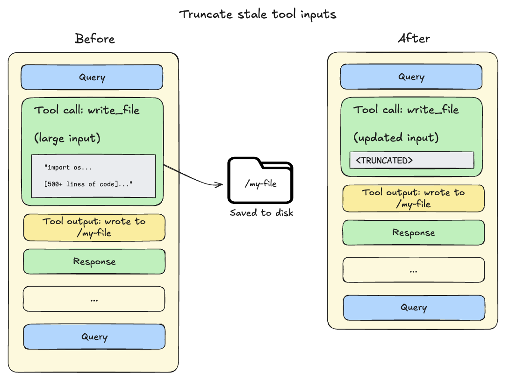
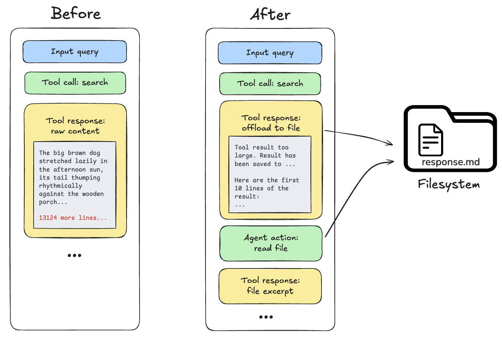
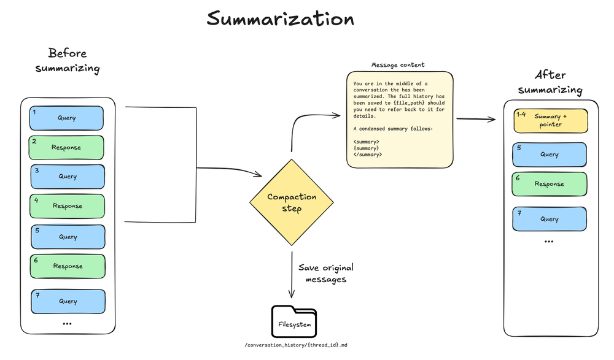
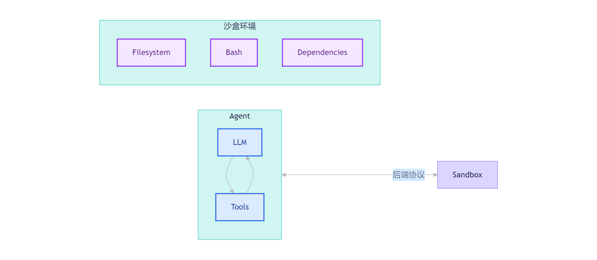
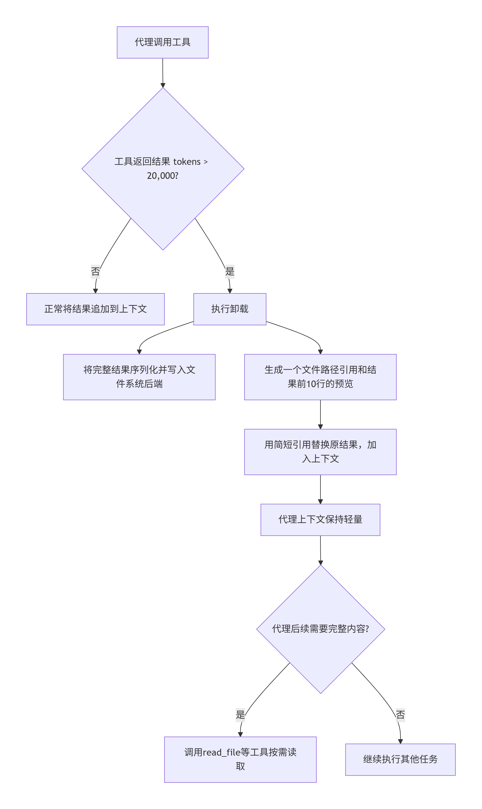
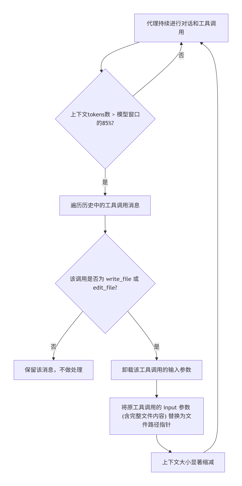
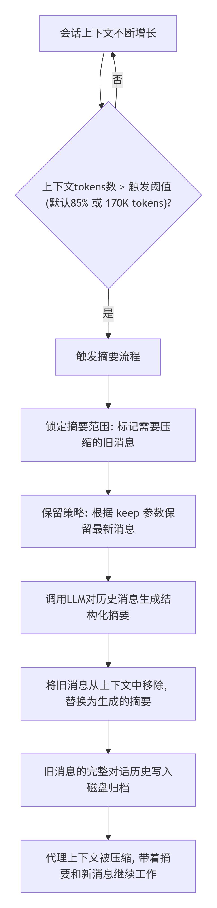

> 📌 **[AI 大模型与云原生全栈知识库](./README.md)** / **36. 从 Agent 到手撕 OpenClaw 的企业实战**
> 🏠 [返回主页 README](./README.md) | ⚡ [面试 30 分钟速记](./interview/00_面试冲刺30分钟速记卡片.md) | 💻 [白板手写代码](./interview/08_大厂手写代码与白板编程题.md)

---

# 从Agent到手撕OpenClaw的企业实战

# 第一章、Agent和OpenClaw的相关概念

## 1、什么是Agent？ 

**Agent的核心定义是：将大语言模型与工具结合，创建一个能够推理任务、决定使用哪个工具，并迭代式地寻找解决方案，一直到最后完成用户指定任务的系统软件。**

可以这样理解：

- **大语言模型** 是系统的“大脑”，负责理解和推理，规划下一步行动。

- **工具** 是系统的“手”和“感官”，能让Agent执行具体的操作（如计算、搜索网络、查询数据库等）。

- **Agent** 是一个协调“大脑”和“手”的自动化工作流。它根据模型对任务的理解，智能地选择并调用一个或多个工具，根据工具的返回结果（观察）再次进行推理，循环往复，直到任务完成或达到停止条件。


### 一、Agent和传统调用大模型的区别

**2025年是“Agent元年”！从“思考”到“行动”的范式跃迁，2026年是Agent爆发年！**

### 二、Agent的运行原理

Agent的工作遵循经典的 **ReAct（Reasoning \+ Acting， 推理\+行动）** 模式，

**工作流程说明：**

1. **用户输入**：任务开始时，用户向Agent提出问题。

2. **模型推理**：大语言模型分析当前任务和状态，决定下一步做什么。它可能决定“我无法直接回答，需要调用一个工具来获取信息”，并生成一个“工具调用动作”。

3. **工具调用**：Agent执行模型指定的工具，例如进行一次网络搜索或数据库查询，并将执行结果（观察）返回。

4. **迭代**：这个观察结果会和之前的对话历史一起，再次输入给模型。模型基于新的信息进行下一轮推理，可能继续调用其他工具，或认为已经掌握了足够信息，可以生成最终答案。

5. **最终输出**：当模型认为任务已达成或达到迭代限制时，它会生成一个最终的、面向用户的答案。


### 三、WorkFlow和Agent区别

“React的Agent”是一种典型的智能体，而“Workflows”是一个更广泛的概念，代表多种预设的、结构化的LLM编排模式，之前的“React Agent”只是WorkFlow的其中一种简单模式。但Workflows还包括其他**非“React Agent”**的模式，包含多样化的图形结构，例如串联、并行处理、路由等。这些模式也用LLM来做意图决策，但其流程是预设的、结构化的。它是一种更广泛的“编排模式”或“架构模式”的统称。


简单来说：

- 当您需要一个能自己“思考”并决定如何使用工具来完成复杂、开放式任务的助手时，您应该构建一个 **Agent**。

- 当您需要将一系列明确的、结构化的LLM调用步骤自动化时（例如先翻译、再总结、最后润色），您应该设计一个 **Workflow**。Agent可以作为这个Workflow中的一个组件，但并非必须。

## 2、AI工具/框架分类

**搞清楚这些概念！**


其核心定位和类别可归纳如下表所示：

**平台 vs\. 框架 vs\. 软件**

- **平台 \(Platform\)**：如 **Dify, Coze**。提供**开箱即用**的环境，通常有Web界面，通过可视化拖拽和配置来搭建应用Agent。它们负责底层的基础设施（如模型调度、部署），用户更关注业务逻辑组装。**核心是“搭建”**。

- **框架 \(Framework\)**：如 **LangChain, LangGraph, Spring AI, DeepAgents**。是一套**代码库和规范**，为开发者提供构建模块和最佳实践。开发者需要编写代码来使用它们，拥有更高的灵活性和控制力。**核心是“开发”**。

- **软件/应用 \(Software\)**：如** OpenCode, OpenClaw**。是一个**可独立运行的程序**，拥有自己的运行时和用户界面，用于完成特定类型的任务（自动化、GUI操作）。用户通过配置和使用它来直接产生价值。**核心是：用**

## 3、OpenClaw是什么？


**OpenClaw**（曾用名 Clawdbot，中文昵称“小龙虾”）是一款 **运行在本地设备上的开源通用型的AI智能体（Agent）**。它由奥地利独立开发者 Peter Steinberger（PSPDFKit创始人）于2025年底创建，在2026年初迅速爆红，GitHub星标数在短时间内突破27万，成为全球最受关注的开源项目之一。

**模块化与Skills系统架构：**

- OpenClaw的能力通过 **Skills（技能）** 进行扩展。每个Skill都是一个包含自然语言指令的文件夹，相当于一份“标准作业程序（SOP）”，教会AI处理特定任务。

- 采用 **“渐进式信息披露”** 策略：启动时只加载Skill的元数据描述，当任务匹配时，才动态加载详细指令，极大优化了Token使用效率。

- 拥有庞大的社区技能市场 **ClawHub**，提供超过500个现成技能，覆盖办公、开发、数据分析等场景。


**争议与风险：**

- **极高的安全风险**：这是最受关注的问题。它需要**极高的系统权限**，一旦被恶意利用或遭受“提示注入攻击”，可能导致敏感数据泄露、系统被完全控制。国家网络与信息安全信息通报中心已发布专项风险预警。

- **供应链投毒**：社区技能市场（ClawHub）中，**约10\.8%的Skill技能包被检测出包含恶意代码**，用户安装技能时极易“中招”。

- **行为不可控**：AI在执行复杂指令时可能发生“权限失控”，无视用户后续指令，进行危险操作（如删除文件）。

- **使用成本与门槛**：复杂任务消耗的Token量巨大，账单可能失控；同时其部署和维护仍有技术门槛，对普通用户并不友好。

## 4、OpenClaw的影响：


OpenClaw的崛起标志着AI从 “对话与内容生成” 时代，正式迈入 “自主执行与行动” 的Agent时代。它不再是一个玩具，而是一个切实的 生产力工具原型。它的模块化与Skills系统架构证明**：*****这是一套新的Agent软件开发中可行的方案！***

**“Agent \+ Skills” 架构是一种高度模块化、可扩展的设计范式**，用于构建复杂且专业的AI智能体系统。其核心思想是将智能体的基础推理与执行能力（Agent）与其专业技能和工作流（Skills）解耦。

这种架构的具体构成及其为开发AI Agent系统软件带来的显著优势。该架构通常包含两个核心层级：

1. **智能体核心层**

    - 这是系统的“通用大脑”，由框架（如LangChain，DeepAgents）提供。它负责基础的任务理解、规划、决策、工具调用和上下文管理。

    - 一个强大的智能体核心应具备**规划能力**、**环境交互能力**（虚拟文件系统工具`ls`， `read_file`， `write_file`等）、**任务分解能力**（子Agent）以及关键的**长上下文管理能力**（通过内容卸载与摘要化来维持长期记忆）。这是支撑复杂任务的基础。

2. **技能模块层**

    - 这是系统的“专业化技能包”。每个Skill是一个独立的模块，包含完成特定领域任务所需的所有知识、指令和资源。

    - 一个技能是一个目录，其核心是一个 `SKILL.md`文件。该文件包含元数据（名称、描述）和详细的、循序渐进的指令，并可引用其他脚本、模板等资源。


采用“Agent \+ Skills”的模块化架构，能为系统设计和开发带来多方面的重要优势：

1. 极致的可扩展性与灵活性：

    新能力的添加不再需要修改智能体核心代码。开发者或领域专家可以像“开发插件”一样，独立地创建和封装新的Skill（只需遵循`SKILL.md`规范）。系统能力可以通过累积Skills的方式无限扩展。

2. 卓越的Token与上下文管理效率：

    这是“渐进式披露”机制带来的最直接好处。智能体启动时无需将大量、可能无关的专业指令全部载入系统提示词，极大节省了初始上下文窗口。只有在确需时，才支付读取特定技能详细内容的Token成本。这直接支撑了更复杂、集成更多专业知识的智能体成为可能。

3. 清晰的关注点分离与专业分工：

    **智能体核心开发者**专注于提升基础能力：优化规划算法、增强工具使用稳定性、改进上下文管理策略等（如优化内容卸载策略 ）。**技能开发者**则专注于领域知识：将最佳实践编写成精准、可重复执行的指令，无需关心底层智能体如何调度与记忆。

4. 提升系统的可维护性与可靠性：

    技能模块化使得调试和更新变得更容易。如果某个领域任务执行出错，可以独立检查和修复对应的Skill指令，而不会影响智能体核心或其他技能。技能的版本管理也变得可行。

5. 实现动态的能力组合：

    对于复杂任务，智能体核心可以规划并串联调用多个Skills来协同完成。这种动态组合能力使得智能体能够应对远超单个技能范围的复杂、跨领域工作流。


**但是：“Agent \+ Skills”架构，并不是说：Agent中没有Tool（工具）！**

# 第二章、DeepAgents框架初探

## 1、DeepAgents框架的核心

**DeepAgents** 是 **LangChain 团队** 在 LangChain 和 LangGraph 之上推出的 **第三个独立开源项目**，是一个 **“开箱即用”的深度智能体框架。**

### 一、DeepAgent框架的由来和定义


Deep Agents 并非颠覆性技术创新，而是将业界验证过的最佳实践打包成开箱即用的框架。它的灵感来源于 Claude Code、Deep Research、Manus 等成功应用，这些应用证明了四个关键点：

•**Agent 需要规划能力 **—— 不能上来就开干，得先拆解任务

•**Agent 需要文件系统 **—— 长对话中，得有地方放中间结果，需要加载本地环境

•**Agent 需要子 Agent **—— 单体 Agent 会被上下文撑爆

•**Agent 需要子 Skills **——  Agent 功能可以弹性扩展，并且支持模块化开发。

LangChain 团队的想法很简单：既然这些经验都验证过了，为什么不打包成一个库？于是就有了 Deep Agents。


DeepAgents是一个Langchain团队在2025年11月推出的新框架，专门用于构建能够处理**复杂、长周期任务**的智能体（Agent）的**框架**。它的核心目标是让开发者能够更容易地创建出功能强大、可靠且可长期运行的AI智能体。

### 二、DeepAgents 的核心能力 \+ Harness Engineering

#### 1、什么是 Harness Engineering（驾驭工程）？ 

• **`Prompt Engineering`**（2022\-2024 主流）主要优化单次交互的质量，重点是 “一句提示词该怎么写，模型才更容易给出想要的结果”

• **`Context Engineering`**（2025 年2月后兴起）则动态构建知识、记忆、RAG，解决 “模型看什么” 的问题，减少幻觉、提高检索命中率

• **`Harness Engineering`**（当前阶段）重点构建整个运行环境，解决 “模型怎么把长链路任务稳定做完” 的系统级问题。


**Harness Engineering** 是当前 AI Agent 开发领域的一个核心范式转变。它不再仅仅关注如何通过提示词（Prompt Engineering）或上下文管理（Context Engineering）来“优化模型输出”，而是聚焦于**构建包裹在模型之外的一整套系统化基础设施**，旨在将大语言模型（LLM）那种“不稳定、非确定性”的智能，转化为能够**稳定、可靠、长时间执行复杂任务**的工作引擎。

- **核心定义**：Harness（马具/缰绳）指的是除了模型本身之外的所有东西——工具、记忆、规划、安全护栏、执行循环、状态管理等。LangChain 团队将其精炼为公式：**Agent = Model \+ Harness**。

    - **模型（Model）**：负责思考和决策

    - **驾驭层（Harness）**：负责把思考变成稳定执行，决定Agent能访问什么、能调用什么、能走到哪一步、什么时候停下、出了错怎么回退、结果如何校验

- **解决的问题**：传统 Agent 在应对长周期、多步骤的复杂任务时，常面临上下文窗口爆炸、状态丢失、工具调用混乱、缺乏规划、无法从失败中恢复等工程难题。Harness Engineering 正是为了解决这些“工程上的‘稳’的问题”而生的。

#### **2、DeepAgents 中全面采用 Harness Engineering：**

DeepAgents 框架本身就是 Harness Engineering 思想的**具体实现**。DeepAgents 可以看作是 Harness Engineering 理念的一个具体技术实现，它通过内置能力，为 Agent 提供了稳定运行的“内核”，让开发者无需从零搭建复杂系统，只需通过配置即可获得一个功能完备的深度智能体。

##### DeepAgents提供了哪些Harness Engineering 的实现？

**模块一：规划能力（Planning）**

- **功能**：提供一个 `write_todos`工具，允许智能体维护一个结构化的任务清单。

- **作用**：帮助智能体跟踪多个任务及其状态（`‘pending’`， `‘in_progress’`， `‘completed’`），以组织复杂的多步骤工作，尤其适用于长周期任务。

- **Harness 价值**：将非结构化的模型思考，转化为可追踪、可恢复的确定性工作流。这避免了 Agent 在复杂任务中迷失方向，是长周期任务的基础。


**模块二：虚拟文件系统（Virtual Filesystem）**

- **功能**：提供一个可配置的虚拟文件系统，支持 `ls`（列出文件）、`read_file`（读取文件，支持图片和大型文件）、`write_file`（创建文件）、`edit_file`（编辑文件）、`glob`（模式匹配）、`grep`（内容搜索）和 `execute`（执行命令，仅在沙盒后端可用）等工具。

- **作用**：为其他能力（如技能、记忆、代码执行）提供基础存储和操作层，也可用于构建自定义工具。

- **Harness 价值**：这是对抗 **Context Rot（上下文腐烂）** 的核心手段。它通过外部存储扩展了有效的上下文窗口，显著降低了 Token 消耗，并让 Agent 能处理远超单次模型限制的长任务。

**模块三：任务委托/子智能体（Task Delegation / Subagents）**

- **功能**：主 Agent 通过内置的 `task`工具和 `SubAgentMiddleware`，可以将专项任务（如“代码审查”、“网络研究”）委托给一个独立的子Agent。开发者可以预定义具有不同系统提示和工具集的子Agent（通过 `subagents`参数），实现专业化分工。

- **作用**：

    - **上下文隔离**：子智能体的工作不会干扰主智能体的上下文。

    - **并行执行**：多个子智能体可以并发运行。

    - **专业化**：可以为子智能体配置不同的工具集。

    - **Token高效**：将大型子任务的上下文压缩为单一结果报告返回给主智能体。

- **Harness 价值**：实现了**上下文隔离**和**算力分配**。子Agent在独立的上下文中运行，其繁杂的中间过程不会污染主Agent的思维空间，最终仅返回一个精简的结果。这本质上是为 Agent 系统引入了“多线程”和“微服务”架构。

**模块四：上下文管理（Context Management）**

这是智能体处理长对话和复杂任务的关键，通过多种技术管理其工作记忆（上下文），确保不超出模型的处理窗口限制。主要包括：

- **输入上下文**：包括系统提示词、待办列表、记忆、技能、文件系统工具说明等，在智能体启动时注入。

- **运行时上下文压缩**：

    - **卸载大型工具输入和结果**：当工具调用的输入或结果超过一定大小时（默认20，000 tokens），智能体会自动将其内容保存到文件系统，并在对话历史中用文件路径和摘要替换，以节省上下文空间。当会话上下文超过模型窗口的85%时，会触发此操作。





    - **摘要化 \(Summarization\)**：当上下文大小达到极限且无可卸载内容时，智能体会将过去的对话历史总结为一段结构化摘要，替换原有的详细历史，同时将完整历史保存到文件系统。



- **长期记忆 \(Long\-term memory\)**：通过混合存储后端，允许智能体将特定路径（如 `/memories/`）下的信息持久化存储，使其能够跨不同的会话和线程访问，用于存储用户偏好、累积知识等。

- **Harness 价值**：注入领域知识与持久状态。


**模块五：代码执行（Code Execution）与安全沙箱 \(Sandbox\) **

- **功能**：当使用沙盒后端时，会向智能体暴露一个 `execute`工具，允许其在隔离环境中运行 shell 命令。

- **作用**：使智能体能够安装依赖、运行脚本、执行代码，从而完成更复杂的任务，同时保证了主机系统的安全。

- **Harness 价值**：遵循 **“Trust the LLM”但隔离执行环境** 的安全哲学。它赋予 Agent 与真实操作系统交互的能力，同时通过沙箱机制防止破坏性操作，是编码、运维等场景的基石。


**模块六：人工介入（Human\-in\-the\-loop, HITL）**

- **功能**：通过 `interrupt_on`参数配置，可以在指定的工具调用前暂停智能体执行，等待人工批准或修改输入。

- **作用**：为具有破坏性或昂贵的操作（如编辑文件、调用API）增加安全闸门，便于交互式调试和指导。

- **Harness 价值**：在高风险或关键操作前插入确定性的人工控制点。这是将 Agent 集成到生产工作流中的必备安全机制。


**模块七：技能包加载和管理（Skills）**

- **功能**：采用“渐进式披露”，仅在需要时加载，以减少系统提示的 token 占用。适用于任务特定、内容可能很多的场景。

    - \- **渐进式披露**：这是技能加载的核心机制。智能体启动时，**仅读取**所有 \`SKILL\.md\`文件的**元数据部分**。当接收到用户提示后，智能体根据元数据中的描述判断是否有相关技能可用。只有匹配到相关技能时，才会去**读取该技能文件夹的完整内容**（包括 \`SKILL\.md\`的详细指令和其他资源文件）。这大大减少了初始上下文的 token 消耗。

    - \- **智能体使用流程**：匹配（根据描述）→ 读取（完整技能内容）→ 执行（遵循技能指令）。

- **作用**：Skills 是用于扩展 Deep Agent 能力的可重用模块。

- **Harness 价值**：实现了知识的模块化、按需加载。让 Agent 的行为具备领域专长。


#### 3、DeepAgents框架中Harness Engineering 的核心原理 

1. **配置优于编码**：DeepAgents 将上述所有复杂能力封装为可配置的**中间件（Middleware）** 栈。开发者通过 `create_deep_agent`函数，以声明式的方式组合这些中间件，而非编写底层控制流。这实现了 **“Batteries Included, Customize in Minutes”**（开箱即用，分钟级定制）。

2. **中间件架构**：每个核心能力（规划、文件、子Agent等）都是一个独立的 `AgentMiddleware`。这些中间件在 Agent 运行的生命周期各阶段插入钩子（hooks），动态注入工具、修改提示、管理上下文。这种架构使得 Harness 高度模块化和可扩展。

3. **后端协议抽象**：统一的 `BackendProtocol`抽象了文件存储和执行环境。无论是内存、本地磁盘、云存储还是沙箱，对 Agent 而言都是统一的 `ls`、`read`、`write`接口。这种设计实现了存储与计算环境的解耦和灵活替换。

4. **上下文工程自动化**：Harness 承担了“上下文工程师”的角色。它自动执行摘要压缩、内容卸载、按需加载等策略，确保模型在任何时刻看到的都是最相关、最精炼的信息，从而将有限的模型注意力集中在核心决策上。

5. **从智能到系统**：Harness Engineering 的本质是将模型的“认知能力”系统化、工程化。它通过**规划**来管理目标，通过**文件系统**来管理状态，通过**子Agent**来管理复杂度，通过**安全沙箱**来管理风险，通过**人在回路**来管理不确定性。最终，它将一个“聪明的对话者”转变为一个“可靠的操作者”。


在 DeepAgents 框架中全面采用 **Harness Engineering**，意味着您的开发范式发生了根本转变：

- **从前**：您需要手动编写任务分解逻辑、管理上下文窗口、实现子Agent通信、构建安全机制。

- **现在**：您只需通过 `create_deep_agent`配置所需的“能力模块”（规划、文件、子Agent、技能、内存、沙箱、人工审批），即可立即获得一个具备生产级可靠性的深度智能体。

### 三、框架对比


DeepAgents的核心定位是：DeepAgents 是 **LangChain 生态中面向“复杂任务”的“上层应用框架”。**

**专门为构建能够处理复杂、多步骤、长时间运行任务的“深度” Harness架构智能体而设计**。它并非要取代 LangChain 或 LangGraph，而是在它们提供的底层运行时和基础抽象之上，**封装了业界已验证的Harness架构的最佳实践**（如 Claude Code、Manus 等应用的模式）。

**我的开发建议和Agent生态分层**

- **底层框架**（如LangChain）解决通用性问题。提供 `create_agent`，tool, LLM调用等高层抽象和标准组件。

    - **简单、直接的任务** → 使用 `LangChain`的 `create_agent`。

- **专项框架**（如LangGraph for 多Agent， DeepAgents for 长任务）在通用框架上针对特定场景做深度优化。

    - LangGraph：提供最底层的状态管理、工作流编排。**需要完全自定义、复杂控制流的工作流** → 使用 `LangGraph`从底层构建。

    - DeepAgents：专为 **“重任务”** 设计，不适合简单聊天机器人，**需要处理复杂、多步骤、长时间运行的“深度”任务** → 选择 `DeepAgents`。

        其典型场景包括：

        - **深度研究与报告撰写**：自动进行多轮搜索、阅读、分析并生成长篇报告。

        - **全栈代码生成与重构**：在沙箱中编写、测试、调试和重构整个代码库。

        - **复杂数据分析流水线**：连接数据库、执行查询、处理中间文件并生成可视化图表。

        - **自动化运维与业务流程**：操作文件、执行命令、编排需要多角色协作的复杂工作流。


## 2、开发第一个DeepAgents的Agent

**步骤**

1. 创建虚拟环境，并安装依赖库

    ```Markdown
    pip install deepagents dotenv langchain-openai zai-sdk
    
     pip install -U "langgraph-cli[inmem]"
    ```

2. 复制langgraph本地服务所支持的项目模板


    ```Markdown
    下载链接：https://codeload.github.com/langchain-ai/new-langgraph-project/zip/refs/heads/main
    
    修改： .env.example  ====>    .env  这个文件里面放所有的API_KEY
    ```

3. 调用LLM和定义工具

    ```Python
    *# llm = ChatOpenAI(*
    *#     model="deepseek-v3.2",*
    *#     temperature=1.1,*
    *#     openai_api_key=ALIBABA_API_KEY,*
    *#     openai_api_base=ALIBABA_BASE_URL,*
    *# )*
    
    llm = ChatOpenAI(
        model="glm-5",
        temperature=1.0,
        openai_api_key=ALIBABA_API_KEY,
        openai_api_base=ALIBABA_BASE_URL,
    )
    ```

4. 创建一个DeepAgent对象

    ```Python
    client = ZhipuAiClient(api_key=ZHIPU_API_KEY)
    
    
    @tool('web_search', parse_docstring=True)
    def web_search(query: str) -> str:
        *"""*
    *    使用搜狗的API进行Web搜索*
    
    *    Args:*
    *        query: 需要搜索的内容或者关键字。*
    
    *    Returns:*
    *        返回搜索之后的结果*
    *    """*
    *    *try:
            response = client.web_search.web_search(
                search_engine="search_pro",
                search_query=query,
                count=3,  *# 返回结果的条数，范围1-50，默认10*
    *            *search_recency_filter="noLimit",  *# 搜索指定日期范围内的内容*
    *        *)
            if response.search_result:
                return "\n\n".join([d.content for d in response.search_result])
            return '没有搜索到任何内容！'
        except Exception as e:
            print(e)
            return f"搜索失败: {e}"
    ```

5. 修改配置文件： langgraph\.json

```Markdown
{
  "$schema": "https://langgra.ph/schema.json",
  "dependencies": ["."],
  "graphs": {
    "agent": "./src/agent/test1.py:agent"
  },
  "env": ".env",
}

**1."$schema"**
•作用：指定用于验证此 JSON 配置文件结构的 JSON Schema 文件的地址。
•解释：它指向一个在线模式定义文件 (https://langgra.ph/schema.json)。支持 JSON Schema 的代码编辑器（如 VS Code）可以利用它来为这个配置文件提供自动完成、语法高亮和错误检查，帮助你更准确、高效地编写配置。


**2."dependencies"**
•作用：声明此项目运行所依赖的代码路径或包。
•解释：当前配置为 ["."]，表示依赖当前目录（即项目根目录）下的所有代码。这意味着当你运行 LangGraph 应用时，框架会将当前目录添加到 Python 的模块搜索路径中，从而能够找到并导入你编写的本地模块（例如 src目录下的文件）。


**3."graphs"**
•作用：定义本项目中的一个或多个“图”（即智能体工作流），并为每个图指定一个可调用的入口点。
•解释：这是一个键值对对象。在本配置中：
    •键 "agent"：这是你为这个图定义的名称。你之后可以通过这个名字（例如在命令行中）来引用并运行这个特定的工作流。
    •值 "./src/agent/test1.py:agent"：这是指向图中入口点的路径，采用 文件路径:可调用对象名的格式。

        •./src/agent/test1.py：是包含图定义代码的 Python 文件路径。
        •agent：是 test1.py文件中导出的、代表整个图的主要可调用对象（通常是一个已经编译好的 Graph或 StateGraph对象）。
       
        
**4."env"**
•作用：指定项目使用的环境变量文件。
•解释：其值为 ".env"，表示在项目根目录下存在一个名为 .env的文件。LangGraph 在运行时会加载这个文件，将其中的键值对设置为环境变量。这通常用于安全地管理 API 密钥、数据库连接字符串等敏感或可配置的信息（例如 OPENAI_API_KEY）。
```

6. 启动langgraph的本地服务

```Markdown
第一次启动需要先安装依赖：pip install -e .

本地启动命令：langgraph dev

INFO:langgraph_api.cli:

        Welcome to

╦  ┌─┐┌┐┌┌─┐╔═╗┬─┐┌─┐┌─┐┬ ┬
║  ├─┤││││ ┬║ ╦├┬┘├─┤├─┘├─┤
╩═╝┴ ┴┘└┘└─┘╚═╝┴└─┴ ┴┴  ┴ ┴

- 🚀 API: http://127.0.0.1:2024
- 🎨 Studio UI: https://smith.langchain.com/studio/?baseUrl=http://127.0.0.1:2024
- 📚 API Docs: http://127.0.0.1:2024/docs

This in-memory server is designed for development and testing.
For production use, please use LangSmith Deployment.
```

7. 打开Studio UI并测试


## 3、Agent本地测试并流式输出

定义一个函数：负责流式输出

```Python
import asyncio
from typing import AsyncIterator

from agent.test1 import agent


async def stream_agent_interaction_corrected(agent, thread_id: str) -> AsyncIterator[str]:
    *"""*
*    使用官方推荐的 `agent.stream()` 方法进行流式交互。*
*    根据调试信息，chunk的结构是 (AIMessageChunk, metadata_dict)*
*    """*
*    *config = {"configurable": {"thread_id": thread_id}}

    while True:
        try:
            user_input = input("\n\n[用户] >>> ").strip()
        except (EOFError, KeyboardInterrupt):
            print("\n\n对话结束。")
            break

        if user_input.lower() in ('quit', 'exit', '退出', 'q'):
            print("再见！")
            break
        if not user_input:
            continue

        print("\n[Agent] ", end="", flush=True)

        *# 准备输入*
*        *inputs = {"messages": [{"role": "user", "content": user_input}]}

        *# 关键修正：使用 agent.stream() 并设置 stream_mode*
*        *stream = agent.stream(inputs, config=config, stream_mode="messages", subgraphs=False)

        full_response = ""
        try:
            *# 使用同步 for 循环，因为 agent.stream() 返回的是同步生成器*
*            *for chunk in stream:  *# 移除 async*
*                # 根据调试信息，chunk 的结构是 (AIMessageChunk, metadata_dict)*
*                *if isinstance(chunk, tuple) and len(chunk) == 2:
                    token, metadata = chunk

                    *# 1. 流式输出 AI 生成的文本内容*
*                    *if hasattr(token, 'content') and token.content is not None:
                        content_str = str(token.content)
                        if content_str:
                            yield content_str  *# 生成器*
*                            *full_response += content_str

                    *# 2. 捕获并显示工具调用开始*
*                    *if hasattr(token, 'tool_call_chunks') and token.tool_call_chunks:
                        for tool_chunk in token.tool_call_chunks:
                            if tool_chunk and hasattr(tool_chunk, 'get'):
                                if tool_chunk.get('name'):
                                    tool_name = tool_chunk['name']
                                    yield f"\n[调用工具: {tool_name}]\n"

                    *# 3. 捕获并显示工具调用结果*
*                    # 注意：工具调用结果通常不会出现在同一个 token 中*
*                    # 它们通常以独立的 token 形式出现*

*                *else:
                    *# 如果 chunk 不是预期的元组结构，打印调试信息*
*                    *print(f"\n[调试] 意外的 chunk 结构: {type(chunk)}")
                    continue

        except Exception as e:
            yield f"\n❌ Agent 执行出错: {e}\n"
            import traceback
            traceback.print_exc()
            continue


async def main_test():
    *# 测试运行Agent，并且进行交互*
*    *thread_id = "demo_thread_01"
    async for response in stream_agent_interaction_corrected(agent, thread_id):
        print(response, end="", flush=True)

if __name__ == '__main__':
    asyncio.run(main_test())
```

# 第三章、文件后端（Backend）系统

## 1、Backend系统概述

后端是智能体（Agent）文件系统工具的底层实现，它决定了Agent可以访问哪些存储介质（如内存、本地磁盘、数据库等）以及如何访问。

DeepAgents 通过一套文件系统工具（如 `ls`, `read_file`, `write_file`等）为Agent提供与外界存储交互的能力。这些工具并不直接操作存储，而是通过一个可插拔的**后端**（Backend）来执行实际的操作。后端是一个遵循特定协议（`BackendProtocol`）的组件。


Agent的文件系统工具调用后端，后端再根据配置将操作路由到不同的具体存储实现，DeepAgents 提供了多种开箱即用的后端，适用于不同场景。例如：

- **状态存储** \(`StateBackend`\): 存储在 LangGraph 状态中，单次会话有效。

- **本地磁盘** \(`FilesystemBackend`\): 访问宿主机的真实文件系统。

- **持久化存储** \(`StoreBackend`\): 使用 LangGraph 的 `BaseStore`实现跨会话持久化。

- **沙盒/本地Shell** \(`Sandbox`, `LocalShellBackend`\): 提供隔离或非隔离的执行环境。

- **复合后端** \(`CompositeBackend`\): 作为路由器，将不同路径的请求分发到不同的后端。

**默认后端是 ****`StateBackend`****，它将文件存储在Agent的运行时状态中，仅在一次执行线程内有效。**


```Python
# Agent在一个临时的、内存式的“文件系统”中工作
    result = await agent.ainvoke({
        "messages": [{
            "role": "user",
            "content": "请创建一个文件 /plan.txt， 内容为‘项目启动计划’，然后列出根目录 / 下的所有内容。"
        }]
    })
```


## 2、StateBackend \(临时状态后端\)

- **工作原理**：将文件数据存储在 LangGraph 的Agent状态（`runtime.state`）中。这些数据在同一个执行会话（thread）的多次调用间是持久的，但线程（会话）结束后即消失。当然：如果有Checkpointer快照机制，那么也能恢复。

- **最佳用途**：作为Agent的草稿纸，用于暂存中间结果。也用于上下文的自动剪裁（offload）大文件输出。

**注意：必须提供具体的Checkpointer。部署到LangSmith时可省略，平台会自动提供。**


**注意：在没有Checkpointer的情况下，是看不到刚刚创建的文件的。 子Agent与主Agent共享此状态后端，子Agent创建的文件对主Agent可见。**


## 3、FilesystemBackend \(本地磁盘后端\)

- **工作原理**：允许Agent读写本地机器上指定根目录（`root_dir`）下的真实文件。

- **⚠️ 重要安全警告**：此后端赋予Agent直接的文件系统访问权限。**切勿**在Web服务器、API等多租户生产环境使用。仅在可信的本地开发中使用。

**安全建议**：

- 始终设置 `virtual_mode=True`以启用路径沙盒，阻止Agent使用 `..`或 `~`访问根目录之外的路径。

- 从可访问路径中排除包含密钥、密码的敏感文件（如 `.env`）。

- 对于需要高安全的生产环境，考虑使用沙盒后端。

```Markdown
*# 创建一个临时目录作为Agent的“沙盒”*
temp_workspace = "./agent_workspace"
os.makedirs(temp_workspace, exist_ok=True)

agent = create_deep_agent(
    model=llm,
    tools=[web_search],
    checkpointer=checkpointer,
    backend=FilesystemBackend(
        root_dir=temp_workspace,
        virtual_mode=True *# 关键！防止Agent使用 `../../` 跳出跟目录*
*    *),
    system_prompt='你是一个助手，请根据用户输入的指令，进行相应的操作。'
)
```

## 4、LocalShellBackend \(本地Shell后端\)

- **工作原理**：在 `FilesystemBackend`的基础上，额外提供了一个 `execute`工具，允许Agent在主机上执行任意的 Shell 命令。

- **⚠️ 极度危险警告**：此后端赋予Agent在您的主机上执行任意命令的最高权限。**仅限**在您完全信任Agent代码的本地开发环境中使用。**禁止**用于生产环境或处理不可信输入。

```Python

*# 创建一个临时目录作为Agent的“沙盒”*
temp_workspace = "./agent_workspace"
os.makedirs(temp_workspace, exist_ok=True)

*# 本地沙箱*
backend = LocalShellBackend(
    root_dir=temp_workspace,
    virtual_mode=True,
    timeout=30,  *# 命令执行超时时间（秒）*
*    *max_output_bytes=50000,  *# 命令输出最大字节数*
*    # 设置环境变量，包含编码相关的配置*
*    *env={
        *# 获取当前Python解释器的完整路径*
*        *"PATH": f"{os.path.dirname(sys.executable)};{os.environ.get('PATH', '')}",
*    *},
)

agent = create_deep_agent(
    model=llm,
    tools=[web_search],
    checkpointer=checkpointer,
    backend=backend,
    system_prompt='你是一个助手，请根据用户输入的指令，进行相应的操作。'
)
```

## 5、StoreBackend \(LangGraph 存储后端\)

- **工作原理**：使用 LangGraph 的 `BaseStore`抽象（支持 Redis、Postgres、内存等实现）来存储文件，从而实现跨不同执行线程的持久化存储。

- **最佳用途**：存储需要长期记忆的数据，例如用户偏好、跨对话知识库。

**注意：必须提供具体的存储实现。部署到LangSmith时可省略，平台会自动提供。**

```Python
# 案例2-4：配置一个具有持久化记忆的Agent
from deepagents.backends import StoreBackend
from deepagents import create_deep_agent
from langgraph.store.memory import InMemoryStore

agent = create_deep_agent(
    model="gpt-4o",
    backend=lambda rt: StoreBackend(rt),
    store=InMemoryStore() # 使用内存存储，进程重启后丢失。生产环境可用RedisStore等。
)
# Agent写入 /memories/ 下的文件，在后续的新对话中仍可读取。
```

## 6、CompositeBackend \(复合/路由后端\)

- **工作原理**：作为后端路由器，根据文件路径的前缀，将操作定向到不同的底层后端。

- **最佳用途**：实现混合存储策略。例如，临时工作文件用 `StateBackend`，长期记忆用 `StoreBackend`，特定目录映射到本地磁盘。

```Python

# 定义复合后端：默认用StateBackend，但`/memories/`路径下的操作路由到StoreBackend
composite_backend = lambda rt: CompositeBackend(
    default=StateBackend(rt),  # 默认后端，用于临时文件
    routes={
        "/memories/": StoreBackend(rt),  # 持久化路径
    }
)

agent = create_deep_agent(
    model="gpt-4o",
    backend=composite_backend,
    store=InMemoryStore()
)
# 现在，Agent对`/scratch/plan.md`的读写是临时的，而对`/memories/user_pref.json`的读写是持久的。


composite_backend = lambda rt: CompositeBackend(
    default=StateBackend(rt),  # 默认临时存储
    routes={
        "/memories/": FilesystemBackend(root_dir="/data/agent_memories", virtual_mode=True),
        "/shared_docs/": FilesystemBackend(root_dir="/company/docs", virtual_mode=True),
    },
)

agent = create_deep_agent(backend=composite_backend)
# 路径解析：
# `/scratch/temp.txt` -> StateBackend
# `/memories/2025/note.md` -> 本地文件 `/data/agent_memories/2025/note.md`
# `/shared_docs/api.md` -> 本地文件 `/company/docs/api.md`
# `ls /` 命令会聚合来自所有后端的结果。
```

## 7、自定义后端

你可以实现 `BackendProtocol`接口，将任何存储系统（如云存储S3、数据库）暴露给Agent。

**需要重写的核心方法的简要说明：**

1. ls\_info\(path: str\) \-\> list\[FileInfo\]

    •功能：列出指定路径下的文件和目录。

    •要求：返回的 FileInfo列表必须至少包含 path字段。应对结果按 path排序以保证输出确定性。


2. read\(file\_path: str, offset: int = 0, limit: int = 2000\) \-\> str

    •功能：读取文件内容，支持从某行开始（offset）并限制行数（limit）。

    •要求：返回的字符串必须包含行号（如 "1: first line\\n2: second line"）。文件不存在时返回错误字符串。


3. write\(file\_path: str, content: str\) \-\> WriteResult

    •功能：创建新文件。默认应是“仅创建”（Create\-only），即文件已存在时应返回错误。

    •要求：操作成功返回 WriteResult\(path=\.\.\., files\_update=\.\.\.\)。对于外部后端（如S3），files\_update应为 None。

    

4. edit\(file\_path: str, old\_string: str, new\_string: str, replace\_all: bool = False\) \-\> EditResult

    •功能：替换文件中的文本。当 replace\_all=False时，old\_string必须在文件中精确出现一次，否则返回错误。这是为了防止意外替换。

    

5. grep\_raw\(pattern: str, path: str \| None = None, glob: str \| None = None\) \-\> list\[GrepMatch\] \| str

    •功能：在文件中搜索正则表达式 pattern。可以限制在特定 path（目录）下，或使用 glob模式过滤文件。

    •要求：正则表达式无效时，返回错误字符串而非抛出异常。

    

6. glob\_info\(pattern: str, path: str = "/"\) \-\> list\[FileInfo\]

    •功能：使用 glob 模式（如 \*\.txt）在指定路径下搜索文件。

**设计一个极简的“内存字典”后端示例**：

```Python
from deepagents.backends.protocol import BackendProtocol, WriteResult, EditResult
from deepagents.backends.utils import FileInfo, GrepMatch
from datetime import datetime
import re

class DictBackend(BackendProtocol):
    *"""一个将文件存储在内存字典中的简单后端。"""*
*    *def __init__(self):
        self.files = {}  *# 路径 -> 内容*
*        *self.metadata = {} *# 路径 -> 元数据（大小，修改时间）*

*    *def ls_info(self, path: str) -> list[FileInfo]:
        *# 列出以`path`为前缀的“文件”和“目录”*
*        *result = []
        seen_dirs = set()
        for file_path in self.files.keys():
            if file_path.startswith(path):
                *# 处理目录项*
*                *remaining = file_path[len(path):]
                if '/' in remaining:
                    dir_name = path + remaining.split('/')[0] + '/'
                    if dir_name not in seen_dirs:
                        seen_dirs.add(dir_name)
                        result.append(FileInfo(path=dir_name, is_dir=True))
                else:
                    *# 文件项*
*                    *meta = self.metadata.get(file_path, {})
                    result.append(FileInfo(
                        path=file_path,
                        is_dir=False,
                        size=meta.get('size', 0),
                        modified_at=meta.get('modified_at')
                    ))
        *# result.sort(key=lambda x: x.path)*
*        *return result

    def read(self, file_path: str, offset: int = 0, limit: int = 2000) -> str:
        if file_path not in self.files:
            return f"Error: File '{file_path}' not found"
        content = self.files[file_path]
        *# 简单模拟分页：按行处理*
*        *lines = content.splitlines(keepends=True)
        start_line = offset
        end_line = start_line + limit if limit > 0 else len(lines)
        selected_lines = lines[start_line:end_line]
        result = ''.join(f"{start_line + i + 1}: {line}" for i, line in enumerate(selected_lines))
        return result if result else "(end of file)"

    def write(self, file_path: str, content: str) -> WriteResult:
        if file_path in self.files:
            return WriteResult(error=f"File '{file_path}' already exists (create-only).")
        self.files[file_path] = content
        self.metadata[file_path] = {
            'size': len(content),
            'modified_at': datetime.now().isoformat()
        }
        *# 对于自定义后端，files_update 通常为 None*
*        *return WriteResult(path=file_path, files_update=None)

    *# 注意：为简洁起见，省略了 grep_raw, glob_info, edit 的完整实现。*
*    # 一个完整的实现需要填充这些方法。*
*    *def grep_raw(self, pattern: str, path: str | None = None, glob: str | None = None) -> list[GrepMatch] | str:
        *# 简化实现：仅在全文件搜索*
*        *try:
            re.compile(pattern)
        except re.error as e:
            return f"Invalid regex pattern: {e}"
        matches = []
        for file_path, content in self.files.items():
            for i, line in enumerate(content.splitlines()):
                if re.search(pattern, line):
                    matches.append(GrepMatch(path=file_path, line=i+1, text=line))
        return matches

    def glob_info(self, pattern: str, path: str = "/") -> list[FileInfo]:
        *# 简化实现：使用 fnmatch*
*        *import fnmatch
        all_files = [FileInfo(path=p, is_dir=False, size=self.metadata[p]['size'], modified_at=self.metadata[p]['modified_at']) for p in self.files.keys() if p.startswith(path)]
        matched = [fi for fi in all_files if fnmatch.fnmatch(fi.path, path.rstrip('/') + '/' + pattern)]
        return matched

    def edit(self, file_path: str, old_string: str, new_string: str, replace_all: bool = False) -> EditResult:
        if file_path not in self.files:
            return EditResult(error=f"File '{file_path}' not found")
        content = self.files[file_path]
        if replace_all:
            new_content = content.replace(old_string, new_string)
            occurrences = content.count(old_string)
        else:
            if content.count(old_string) != 1:
                return EditResult(error=f"Found {content.count(old_string)} occurrences of '{old_string}'. For safety, edit requires exactly one match unless replace_all=True.")
            new_content = content.replace(old_string, new_string, 1)
            occurrences = 1
        if new_content == content:
            return EditResult(error=f"String '{old_string}' not found.")
        self.files[file_path] = new_content
        self.metadata[file_path]['size'] = len(new_content)
        self.metadata[file_path]['modified_at'] = datetime.now().isoformat()
        return EditResult(path=file_path, files_update=None, occurrences=occurrences)
```

## 8、文件后端和checkpointer、store的关系

1. **DeepAgents 的 Backend**

    - **设计目标**：为 **Agent** 提供**文件系统语义**的抽象。它的核心接口是 `ls_info`, `read`, `write`, `edit`等，让Agent感觉自己在一个真实的目录树下操作文件。

    - **数据模型**：**文件/目录树**。操作对象是文件路径和文件内容。

    - **持久化范围**：由具体实现决定。`StateBackend`是线程内，`FilesystemBackend`是进程/机器内，`StoreBackend`可以跨进程/会话。

    - **典型用例**：Agent的工作空间、长期记忆存储 \(`/memories/`\)、技能和文档的加载来源。

2. **LangGraph 的 Checkpointer**

    - **设计目标**：为 Agent 或者 State**Graph** 提供**状态快照与恢复**机制。用于实现对话的持久化、暂停/继续、回溯以及人类介入审核（Human\-in\-the\-loop）。

    - **数据模型**：**序列化的工作流状态**。它保存的是整个 `State`对象的检查点（checkpoint），包括所有通道的消息、变量值等。

    - **持久化范围**：**跨会话持久化工作流状态**。允许用户离开后，稍后从完全相同的地方继续对话。

    - **典型用例**：聊天机器人记住之前的对话上下文；一个长时间运行的任务支持暂停和继续；需要人工审批节点的多步骤工作流。

3. **LangChain 的 Store \(BaseStore\)**

    - **设计目标**：一个通用的、需要自定义操作的 长期**存储**。它是 LangGraph 存储层的底层抽象，非常简单。

    - **数据模型**：**命名空间下的键值对**。基本操作是 `get`, `set`, `delete`, `list`。

    - **持久化范围**：由具体实现决定（如 `InMemoryStore`, `RedisStore`, `PostgresStore`）。

    - **典型用例**：为 `Checkpointer`或 `StoreBackend`提供底层存储驱动。也可直接用于缓存、会话存储等任何需要简单KV存储的场景。


# 第四章、SubAgent子智能体


## 1、多Agent的必要性

**问题**：复杂任务通常需要多个步骤和不同领域的专业知识。让一个Agent“全能”地处理所有事情会导致：

1. **上下文臃肿**：Agent在一次对话中可能调用很多工具，产生大量中间结果，这些都会挤占有限的上下文窗口，影响后续决策。

2. **缺乏专业性**：一个Agent的指令（System Prompt）难以兼顾所有 specialized 任务的最佳实践。

**解决方案**：多Agent系统。引入一个“主Agent”（Supervisor）负责协调，将特定子任务分配给具有专业能力的“子Agent”（Subagent）执行。子Agent在独立的环境中完成任务后，将**精简的结果**返回给主Agent。

**核心价值 \- 上下文隔离**：这是DeepAgents多Agent设计的核心。子Agent内部复杂的工具调用和中间过程被隔离在其自己的会话中，不会污染主Agent的上下文窗口。主Agent只看到清晰、最终的结果。


**何时使用子Agent？**

- ✅ **适合**：多步骤复杂任务、需要专业知识的领域、需要使用不同模型能力的任务、需要保持主Agent专注于高层协调时。

- ❌ **不适合**：简单的单步任务、需要维护中间上下文的任务、Agent调用开销大于收益时。


## 2、DeepAgents 多Agent核心机制详解


### **一、 子Agent（Subagent）是什么？**

- **定义**：子Agent是一个由主Agent创建和调用的、独立的Agent实例。它拥有自己独立的系统指令、工具集和会话上下文。

- **生命周期**：由主Agent动态创建，执行特定任务，返回结果后其生命周期通常结束（资源被回收）。

- **类比**：就像项目经理（主Agent）将“市场调研”这个任务分配给专业的市场分析师（子Agent）。分析师用自己的方法（工具）完成一份报告（结果）交给经理，经理不需要关心分析师具体查询了多少网站、整理了多少数据。

### **二、 核心工具：****`task()`**

- **角色**：`task()`是DeepAgents框架自动提供给**主Agent**的一个特殊工具。当主Agent决定将工作委托出去时，就调用此工具。

- **参数**：

    - `name`\(str\): 要调用哪个子Agent。例如 `"research-agent"`。

    - `task`\(str\): 给子Agent的具体任务描述。例如 `“详细研究一下LangChain框架在2024年的更新情况。”`

- **调用效果**：主Agent的思考过程暂停，系统启动（或复用）指定的子Agent，子Agent独立运行直至完成任务，并将结果以 `ToolMessage`的形式返回给主Agent。主Agent接着处理这个结果。

### **三、 底层引擎：****`SubAgentMiddleware`**

- **定位**：`SubAgentMiddleware`是LangChain/DeepAgents的一个**中间件**，它是实现 `task()`工具功能的底层支撑。

- **工作原理**：

    1. **注册**：在创建主Agent时，将`SubAgentMiddleware`添加到中间件列表，并配置好可用的子Agent列表。

    2. **拦截与路由**：当主Agent调用名为 `task`的工具时，该中间件会拦截这个调用。

    3. **子Agent实例化**：根据`name`参数，从预配置的子Agent列表中找出对应的配置（系统提示、工具、模型等）。

    4. **执行隔离**：在一个全新的、隔离的上下文中，使用找到的配置启动一个子Agent，并将`task`参数作为用户输入传递给它。

    5. **结果回传**：子Agent运行结束，生成最终回复。中间件将子Agent的最终回复（一个或多个`AIMessage`）包装成一个`ToolMessage`，作为`task()`工具的“结果”返回给主Agent的会话流。


**四、 同步 vs\. 异步子Agent**

- **本版本重点（同步）**：主Agent调用`task()`后，会**等待**子Agent完全执行完毕并返回结果，然后再继续。这是最常见的模式，适用于大多数需要顺序执行的任务。

- **下一个版本（异步）**：DeepAgents也支持异步子Agent，允许主Agent同时发起多个`task()`调用，子Agent并行执行。适用于相互独立的长任务。这需要更复杂的协调（如`AsyncSubAgentMiddleware`），是进阶内容。


## 3、创建SubAgent

DeepAgents 支持两种配置子Agent的方式：简单的字典配置（`SubAgent`）和复杂的预编译图（`CompiledSubAgent`）。

### 一、字典配置子Agent \(SubAgent\) 

这是最常见的方式。通过一个包含特定字段的字典来定义子Agent。

**核心字段说明**：

- `name`\(str\): 唯一标识符。主Agent通过此名称调用子Agent。

- `description`\(str\): 清晰描述子Agent的职责。主Agent据此决定是否委托。

- `system_prompt`\(str\): 子Agent的系统指令。**不会**继承自主Agent，必须自定义。

- `tools`\(list\): 子Agent可用的工具列表。**不会**继承自主Agent，应保持精简。

- `model`\(str\): 可选。指定子Agent使用的模型，覆盖主Agent的模型。

```Python
# 1. 定义研究子Agent
research_subagent = {
    "name": "research-agent",  # 主Agent通过此名调用
    "description": "用于深入研究问题，执行网络搜索并合成信息。",  # 清晰的描述
    "system_prompt": """你是一名专业研究员。请遵循以下步骤：
    1. 理解用户的研究问题。
    2. 使用`mock_internet_search`工具进行检索。
    3. 从结果中提炼关键信息，合成一份结构化的摘要。
    4. 务必保持回答简洁（不超过300字）。""",  # 专属指令
    "tools": [mock_internet_search],  # 只授予它需要的工具
    # `model` 字段被省略，因此将使用主Agent的模型
}

# 2. 创建主Agent，并注册子Agent
agent = create_deep_agent(
    model="gpt-4o",  # 主Agent的模型
    system_prompt="你是协调员。对于复杂的研究任务，请使用`task`工具委托给研究子Agent。",
    subagents=[research_subagent]  # 传入子Agent列表
)
```

### 二、 使用预编译图子Agent \(CompiledSubAgent\) 

对于极其复杂、需要自定义工作流逻辑的任务，**可以将一个完整的 LangGraph 的StateGraph作为子Agent**，**或者将一个完整的LangChain中的create\_agent\(\)作为一个子Agent。**

```Python
# 案例2-2：使用一个自定义的LangGraph图作为子Agent
from deepagents import create_deep_agent, CompiledSubAgent
from langgraph.graph import StateGraph, MessagesState, START
from langchain_core.messages import HumanMessage
from langchain_openai import ChatOpenAI

# 1. 构建一个自定义的LangGraph（例如，一个先搜索后分析的两步图）
def search_node(state: MessagesState):
    # 模拟搜索步骤
    return {"messages": [HumanMessage(content=f"已搜索: {state['messages'][-1].content}")]}

def analysis_node(state: MessagesState):
    # 模拟分析步骤
    return {"messages": [HumanMessage(content=f"已分析结果。结论是: 潜力巨大。")]}

builder = StateGraph(MessagesState)
builder.add_node("search", search_node)
builder.add_node("analysis", analysis_node)
builder.add_edge(START, "search")
builder.add_edge("search", "analysis")
custom_graph = builder.compile()

# 2. 将编译好的图包装成 CompiledSubAgent
custom_subagent = CompiledSubAgent(
    name="advanced-analyzer",
    description="执行先搜索后深度分析的复杂工作流。",
    runnable=custom_graph  # 必须是已编译的Runnable
)

# 3. 创建主Agent
agent = create_deep_agent(
    model="gpt-4o",
    subagents=[custom_subagent]
)
# 主Agent可以通过 task(name=“advanced-analyzer”, ...) 来调用这个复杂工作流。
```

### 三、SubAgent的进阶

#### 1\)  子Agent的精细化配置

- **专用模型**：为特定任务的子Agent选择更合适的模型，默认是和主Agent保持一致（如代码任务用qwen3\-coder，创意任务用glm\-5）。

- **专用中间件**：可以为子Agent单独配置中间件。例如，为`coder`子Agent增加`ToolCallLimitMiddleware`来限制代码执行次数，确保安全。

- **技能继承**：DeepAgents的`skills`机制。主Agent配置的技能默认**不会**被其他自定义子Agent继承。可以为子Agent单独配置`skills`参数。

```Python
from langchain.agents.middleware import ToolCallLimitMiddleware
coder_subagent = {
    "name": "safe-coder",
    # ... 其他配置 ...
    "middleware": [
        ToolCallLimitMiddleware(tool_name="execute_python", run_limit=3) # 限制代码执行最多3次
    ],
    "skills": ["skills目录"]
}
```


#### **2）上下文与配置的传递**

- **自动传递**：主Agent调用时的`config`（包含`context`、`metadata`等）会**自动传递给子Agent**。这意味着子Agent及其工具可以访问主Agent会话的上下文信息（如用户ID）。

- **访问方式**：在工具函数中，可以通过`config`参数获取。

```Python
@tool
def personalized_search(query: str, config) -> str:
    """根据当前用户上下文进行搜索。"""
    user_id = config.get("context", {}).get("user_id", "anonymous")
    return f"为用户{user_id}搜索: {query}。结果是..."
```

- **Agent身份标识**：在流式输出或日志中，可以通过消息元数据中的`lc_agent_name`区分输出来自哪个Agent。


#### **3）开发要点**

1. **描述清晰具体**：子Agent的`description`是主Agent选择的关键。避免模糊，要说明“在什么情况下使用”。

    - ✅ 好：“分析财务报表并计算关键比率。当问题涉及收入、利润、负债等数据时使用。”

    - ❌ 差：“处理财务问题。”

2. **系统提示详细**：在子Agent的`system_prompt`中明确指导其如何使用工具、如何格式化输出。强调返回“摘要”而非“原始数据”。

3. **工具集最小化**：遵循最小权限原则。只给子Agent完成任务所必需的工具，这能提高安全性、减少干扰。

4. **返回结果简洁**：这是实现“上下文隔离”收益的关键。务必在子Agent的指令中要求其提炼、总结，控制输出长度。


# 第五章、基于OpenSandbox的沙箱后端

## 1、什么是沙箱（Sandbox）

智能体（Agent）需要生成代码、操作文件系统并运行 Shell 命令。由于我们**无法预测**智能体会执行什么操作，因此必须将其环境与主机系统隔离，防止其访问凭证、文件或网络。`沙盒（Sandbox）`通过创建智能体执行环境与主机系统之间的边界，提供了这种隔离能力。


在 Deep Agents 中，**沙盒是一种特殊的后端（Backend）**。与其他仅暴露文件操作的后端**（State, Filesystem, Store）**不同，沙盒后端还为智能体提供了一个 **`execute`****工具**，用于在隔离环境中运行任意 Shell 命令。

**沙盒**就是给智能体准备的一个“封闭房间”：

- 智能体在里面随便折腾；

- 你的电脑、账号、文件、网络都被挡在外面。



**沙箱的工具集**

├── 文件系统操作工具

│   ├── ls \- 列出目录内容

│   ├── read\_file \- 读取文件

│   ├── write\_file \- 写入文件

│   ├── edit\_file \- 编辑文件

│   ├── glob \- 文件模式匹配

│   └── grep \- 文本搜索

│

├── 执行工具

│   └── execute \- 运行Shell命令

│       ├── 可以运行任意命令

│       ├── 返回stdout/stderr

│       └── 返回退出码

│

└── 安全边界

├── 无法访问主机文件

├── 无法读取主机环境变量

└── 无法干扰主机进程

## 2、为什么要用沙箱（Sandbox）

沙盒主要用于**安全隔离**。它们允许智能体执行任意代码、访问文件和联网，而不会泄露您的凭证、破坏本地文件或损害主机系统。当智能体自主运行时，这种隔离至关重要。

**沙盒特别适用于以下场景：**

**编程智能体（Coding Agents）**：需要运行 Shell、Git 操作、克隆仓库（许多供应商提供原生 Git API，如 Daytona 的 Git 操作），甚至运行 Docker\-in\-Docker 来构建和测试流水线。

**数据分析智能体**：在安全隔离的环境中加载文件、安装数据分析库（如 pandas, numpy）、运行统计计算，并生成如 PPT 等输出文件。


**优势一：文件系统隔离**

- ✅ 智能体只能访问沙盒内的文件

- ❌ 无法读取你的\~/Documents、\~/Desktop等个人文件

- ❌ 无法修改你的项目源代码

**优势二：大量输出造成上下文“爆炸”**

- ✅ 智能体只需要知道临时文件的路径，以及临时文件内容的摘要信息

- ❌ 某个步骤处理完成后，输出：file1\.py, file2\.py, \.\.\. 总大小：2MB   

- ❌ 输出太大，直接返回会撑爆上下文窗口

**优势三：环境隔离**

- ✅ 智能体可以自由安装Python库，或者Java的lib，或者NodeJs的库，或者Go语音的第三方依赖。

- ❌ 不会污染你的全局项目代码的环境

- ❌ 不会与其他项目产生依赖冲突

**优势四：进程隔离**

- ✅ 智能体可以启动新进程

- ❌ 无法杀死你的其他进程

- ❌ 无法监控你的系统活动

**优势五：网络控制**

- ✅ 可以配置网络访问权限

- ❌ 防止数据外泄到未知服务器


## 3、主流沙盒提供商

提供商功能对比表 

```Python
pip install langchain-daytona

# 2. 创建并启动沙箱（Daytona）
# 注意：此操作会向Daytona服务发起请求，创建一个远程隔离环境
print("步骤1: 创建远程沙箱环境...")
try:
    # （假设在.env文件中配置了OPENAI_API_KEY和DAYTONA_API_KEY）
    config = DaytonaConfig(
        api_key=DAYTONA_API_KEY,
        api_url=DAYTONA_BASE_URL,  # "https://app.daytona.io/api"
        target="us"
    )
    sandbox = Daytona(config).get('9058717f-98ce-442a-991a-69fece04c2e7')  # 使用之前的docker容器作为远程沙箱
    # sandbox = Daytona().create()  # 第一次创建沙箱
    print(f"沙箱创建成功！沙箱ID: {sandbox.id}")
except Exception as e:
    print(f"创建沙箱失败，请检查网络和API密钥: {e}")
    return

# 3. 将沙箱包装为Deep Agents可用的后端（Backend）
backend = DaytonaSandbox(sandbox=sandbox)

# 4. 创建Deep Agent，并授予其访问沙箱后端的能力
# 系统提示词定义了智能体的角色和能力
print("\n步骤2: 创建具有沙箱访问权限的智能体...")
agent = create_deep_agent(
    model=llm,  # 指定模型
    backend=backend,  # 关键：传入沙箱后端
    system_prompt="""你是一个专业的Python编码助手，拥有在一个完全隔离的沙箱环境中执行命令和操作文件的能力。
    你可以使用`execute`工具运行任何shell命令，使用`write_file`创建和编辑文件，使用`read_file`查看文件内容。
    请用清晰、安全的代码回应用户的请求。""",
)

# 5. 定义任务：创建一个简单的Python程序并运行
    user_request = """请完成以下任务：
    1. 在沙箱的 /home/daytona/ 目录下，创建一个名为 ‘test_sandbox.py’ 的Python文件。
    2. 文件内容应打印“Hello from the secure sandbox!”以及当前工作目录。
    3. 运行这个Python脚本，并告诉我输出结果。"""
```

## 4、自定义企业服务器的SandBox


### **一、OpenSandbox相关介绍**

**OpenSandbox：**是阿里巴巴开源的通用AI应用沙箱平台，提供多语言 SDK、统一的沙箱 API，以及 Docker/Kubernetes 运行时环境，专为解决AI时代代码执行的安全与效率问题而设计。它提供了一个安全、隔离、高效的执行环境，使AI模型能够安全地执行用户提交的代码，同时避免了对生产环境的潜在威胁。


它并非简单的Docker包装，而是一套完整的全栈平台，底层复用了阿里巴巴支撑大规模AI工作负载的内部基础设施，专门针对AIAgent的并行运行需求设计。其核心优势在于"全环境隔离"，这是它区别于Git Worktrees、普通容器化工具的核心亮点。


**核心功能与技术特性**

- 多语言 SDK：提供 Python、Java/Kotlin、JavaScript/TypeScript、C\#/\.NET、Go 的沙箱 SDK。

- 沙箱协议：定义了沙箱生命周期管理 API 和沙箱执行 API。你可以通过这些沙箱协议扩展自己的沙箱运行时。

- 沙箱运行时：沙箱全生命周期管理，支持 Docker 和自研高性能 Kubernetes 运行时，实现本地运行、企业级大规模分布式沙箱调度。

- 沙箱环境：内置 Command、Filesystem、Code Interpreter 实现。并提供 Coding Agent（Claude Code 等）、浏览器自动化（Chrome、Playwright）和桌面环境（VNC、VS Code）等示例。

- 网络策略：提供统一的 **Ingress Gateway** 实现，并支持多种路由策略；提供单实例级别的沙箱**出口网络限制**。

- 强隔离安全：支持 gVisor、Kata Containers 和 Firecracker 微虚拟机等安全容器运行时，为沙箱工作负载与宿主机之间提供增强的安全隔离。


### 二、安装并配置 Sandbox Server

环境要求：

- Docker（本地运行必需）

- Python 3\.10\+（示例和本地运行所需）

#### 1）Linux中安装docker

基于docker部署Docker ≥ 24\.0\.0，下面在Linux中安装docker。这里默认用户已经安装好了Linux系统，

- 获取docker repo文件。

```Python
wget -O /etc/yum.repos.d/docker-ce.repo https://mirrors.aliyun.com/docker-ce/linux/centos/docker-ce.repo
 
#如果下载docker对应版本有问题，可以选择使用镜像源2
wget -O /etc/yum.repos.d/docker-ce.repo https://download.docker.com/linux/centos/docker-ce.repo
```

- 查看docker可以安装的版本：

```Python
yum list docker-ce.x86_64 --showduplicates | sort -r
```

- 安装docker:这里指定docker版本为26\.1\.4版本

```Python
yum -y install docker-ce-26.1.4-1.el7
```

- 设置docker 开机启动，并启动docker：

```Python
systemctl enable docker
systemctl start docker
```

- 修改cgroup的配置，尤其是镜像加速源，并重启docker。

```Bash
vim /etc/docker/daemon.json 如果文件不存在，需要创建。
 
{
        "features": {
          "containerd-snapshotter": true
        },
        "exec-opts": ["native.cgroupdriver=systemd"],
        "registry-mirrors":[
          "https://docker.m.daocloud.io",
          "https://docker.rainbond.cc",
          "https://docker.lmirror.top",
          "https://docker-0.unsee.tech",
          "https://docker.hlmirror.com"
       ]
}
 
**#重启docker**
systemctl restart docker
```


#### 2）Linux 安装OpenSandbox


- 安装python环境，可以先安装Anaconda3：https://msb\-netdisk\.mashibing\.com/share/bca01a5027df4150913844ae005d9dd7?filePath=%2F

```Python
#创建 python环境
conda create --name sandbox python=3.11
 
#切换python环境
conda activate sandbox
```

- 安装依赖\-Code Interpreter SDK

```Python
pip install opensandbox-code-interpreter
```

- 安装 Opensandbox\-Server

```Python
pip install opensandbox-server

```

- 配置 Opensandbox\-Server

```Python
opensandbox-server init-config ~/.sandbox.toml --example docker-zh


编辑： vi.sandbox.xml

把ip改成linux节点ip:
```


- 启动 Opensandbox\-Server

```Python

opensandbox-server
 
# 新开窗口Show help，查看帮助命令
opensandbox-server -h
```

- window本地测试sandbox是否正常可以连接

```Python
浏览器输入：http://192.168.1.100:8080/health ,可以看到{"status":"healthy"}就为正常。
```

- 手动拉取镜像

```Python
docker pull sandbox-registry.cn-zhangjiakou.cr.aliyuncs.com/opensandbox/code-interpreter:v1.0.2
```

- window本地创建代码测试创建沙箱


新建一个测试：test\_opensanbox\.py

```Python
import asyncio
from datetime import timedelta

from code_interpreter import CodeInterpreter, SupportedLanguage
from opensandbox import Sandbox
from opensandbox.config import ConnectionConfig
from opensandbox.models import WriteEntry
import os

async def main() -> None:
    config = ConnectionConfig(
        domain="http://192.168.1.100:8080",
        use_server_proxy=True,
        request_timeout=timedelta(seconds=60), *# 请求超时时间，默认30秒*
*    *)

    *# 1. Create a sandbox*
*    *sandbox = await Sandbox.create(
        "sandbox-registry.cn-zhangjiakou.cr.aliyuncs.com/opensandbox/code-interpreter:v1.0.2",
        entrypoint= ["/opt/opensandbox/code-interpreter.sh"],
        env={"PYTHON_VERSION": "3.11"},
        timeout=timedelta(minutes=10), *# 自动终止时间箱运行超时时间，默认10分钟，超过时间会自动终止沙箱*
*        *connection_config=config,
    )

    async with sandbox:

        *# 2. Execute a shell command*
*        *execution = await sandbox.commands.run("echo 'Hello OpenSandbox!'")
        print(execution.logs.stdout[0].text)

        *# 3. Write a file*
*        *await sandbox.files.write_files([
            WriteEntry(path="/tmp/hello.txt", data="Hello World", mode=644)
        ])

        *# 4. Read a file*
*        *content = await sandbox.files.read_file("/tmp/hello.txt")
        print(f"Content: {content}") *# Content: Hello World*

*        # 5. Create a code interpreter*
*        *interpreter = await CodeInterpreter.create(sandbox)

        *# 6. 执行 Python 代码（单次执行：直接传 language）*
*        *result = await interpreter.codes.run(
              """
                  import sys
                  print(sys.version)
                  result = 2 + 2
                  result
              """,
              language=SupportedLanguage.PYTHON,
        )

        print(result.result[0].text) *# 4*
*        *print(result.logs.stdout[0].text) *# 3.11.14*

*    # 7. Cleanup the sandbox*
*    *await sandbox.kill()

if __name__ == "__main__":
    asyncio.run(main())
```

- 配置沙箱的访问权限：

```Python
from opensandbox.models.sandboxes import NetworkPolicy, NetworkRule

sandbox = await Sandbox.create(
    "python:3.11",
    .....
    network_policy=NetworkPolicy(
        defaultAction="deny",
        egress=[
            NetworkRule(action="allow", target="pypi.org"),
            NetworkRule(action="allow", target="*.github.com"),
        ]
    )
)
```

### 三、DeepAgents框架中自定义OpenSandboxBackend

在DeepAgents框架中有一个基类：BaseSandbox  所有沙盒功能都基于一个核心方法——`execute()`。这是一个巧妙的设计：

┌─────────────────────────────────────────────────────────────┐

│                    BaseSandbox 基类                          │

│                                                              │

│  ┌─────────────────────────────────────────────────────┐    │

│  │           read\_file\(\)                               │    │

│  │           实现原理：                                 │    │

│  │           execute\("cat /path/to/file"\)              │    │

│  └─────────────────────────────────────────────────────┘    │

│                                                              │

│  ┌─────────────────────────────────────────────────────┐    │

│  │           write\_file\(\)                              │    │

│  │           实现原理：                                 │    │

│  │           execute\("echo 'content' \> file"\)          │    │

│  └─────────────────────────────────────────────────────┘    │

│                                                              │

│  ┌─────────────────────────────────────────────────────┐    │

│  │           ls\(\)                                      │    │

│  │           实现原理：                                 │    │

│  │           execute\("ls \-la"\)                         │    │

│  └─────────────────────────────────────────────────────┘    │

│                                                              │

│  ┌─────────────────────────────────────────────────────┐    │

│  │           grep\(\)                                    │    │

│  │           实现原理：                                 │    │

│  │           execute\("grep pattern file"\)              │    │

│  └─────────────────────────────────────────────────────┘    │

└─────────────────────────────────────────────────────────────┘

│

▼ 所有操作都转换为Shell命令

┌─────────────────────────────────────────────────────────────┐

│                沙盒提供商的execute\(\)实现                     │

│                                                              │

│  ┌─────────────────────────────────────────────────────┐    │

│  │           Daytona\.execute\("command"\)                │    │

│  │           • 调用Daytona API                         │    │

│  │           • 在远程容器中执行命令                     │    │

│  └─────────────────────────────────────────────────────┘    │

│                                                              │

│  ┌─────────────────────────────────────────────────────┐    │

│  │           Modal\.execute\("command"\)                  │    │

│  │           • 调用Modal云服务                         │    │

│  │           • 在隔离环境中执行                        │    │

│  └─────────────────────────────────────────────────────┘    │

│                                                              │

│  ┌─────────────────────────────────────────────────────┐    │

│  │           Runloop\.execute\("command"\)                │    │

│  │           • 调用Runloop API                         │    │

│  │           • 在开发箱中执行                          │    │

│  └─────────────────────────────────────────────────────┘    │

└─────────────────────────────────────────────────────────────┘

#### 1）两层文件访问平面 

文件进出沙盒有两种截然不同的方式，理解何时使用哪种方式非常重要：

1. **智能体文件系统工具 \(Agent Filesystem Tools\)**

`read_file`、`write_file`、`edit_file`、`ls`、`glob`、`grep`和 `execute`是 LLM 在执行过程中调用的工具。这些操作通过沙盒内部的 `execute()`进行。智能体使用它们来读取代码、写入文件并作为任务的一部分运行命令。

2. **文件传输 API \(File Transfer APIs\)**

`uploadFiles()`和 `downloadFiles()`是您的**应用程序代码**调用的方法。它们使用提供商的本机文件传输 API（而非 Shell 命令），旨在在您的主机环境和沙盒之间移动文件。使用这些 API 来：

- **初始化沙盒**：在智能体运行前，向其填充源代码、配置或数据。

- **检索产物**：在智能体完成后，获取生成的代码、构建输出、报告等。

- **预置依赖**：预先准备好智能体需要的依赖项。

使用 `upload_files()`在智能体运行前填充沙盒。路径必须是绝对路径，内容必须是字节流（bytes）：

使用 `download_files()`在智能体完成后从沙盒中检索文件或者下载文件到其他地方：


#### 2）自定义OpenSandboxBackend类

```Python
from __future__ import annotations

import logging
from collections.abc import Callable
from typing import cast

from opensandbox import SandboxSync
from deepagents.backends.protocol import (
    ExecuteResponse,
    FileDownloadResponse,
    FileUploadResponse,
)
from deepagents.backends.sandbox import BaseSandbox

SyncPollingInterval = float | Callable[[float], float]
PollingStrategy = Callable[[float], float]

# 配置日志
logger = logging.getLogger(__name__)
# logger.setLevel(logging.DEBUG)
logger.setLevel(logging.ERROR)

# 如果没有配置日志处理器，则添加一个
if not logger.handlers:
    handler = logging.StreamHandler()
    handler.setLevel(logging.DEBUG)
    formatter = logging.Formatter('%(asctime)s - %(name)s - %(levelname)s - %(message)s')
    handler.setFormatter(formatter)
    logger.addHandler(handler)


class OpenSandbox(BaseSandbox):
    """符合 SandboxBackendProtocol 协议的 OpenSandbox 实现。

    该实现继承了 BaseSandbox 的所有文件操作方法，
    并仅使用 OpenSandbox 的 API 实现了 execute()、download_files() 和 upload_files() 方法。
    """

    def __init__(
        self,
        *,
        sandbox: SandboxSync,
        timeout: int = 30 * 60,
        sync_polling_interval: SyncPollingInterval = 0.1,
    ) -> None:
        """创建一个包装已有 OpenSandbox 沙盒的后端实例。

        Args：
            sandbox：要包装的现有 OpenSandbox 沙盒实例。
            timeout：调用 `execute()` 且未显式指定 `timeout` 时使用的默认命令超时时间（秒）。
            sync_polling_interval：在同步执行路径上，轮询 OpenSandbox 命令完成状态的间隔时间（秒）；
                也可以是一个可调用对象，接收已执行的秒数并返回下一次轮询的延迟时间。
        """
        logger.info(f"正在初始化 OpenSandbox，沙盒 ID: {sandbox.id}")
        self._sandbox = sandbox
        # sandbox.kill()  # 手动关闭沙箱
        self._default_timeout = timeout

        # 处理轮询策略
        if callable(sync_polling_interval):
            polling_strategy = cast("PollingStrategy", sync_polling_interval)
        else:
            def polling_strategy(_elapsed: float) -> float:
                return sync_polling_interval

        self._sync_polling_interval = polling_strategy
        logger.debug(f"OpenSandbox 初始化完成，默认超时时间={timeout}秒")

    @property
    def id(self) -> str:
        """返回 OpenSandbox 沙盒的 ID。"""
        sandbox_id = self._sandbox.id
        logger.debug(f"获取沙盒 ID: {sandbox_id}")
        return sandbox_id

    def execute(
        self,
        command: str,
        *,
        timeout: int | None = None,
    ) -> ExecuteResponse:
        """在沙盒内部执行一条 Shell 命令。

        Args：
            command：要执行的 Shell 命令字符串。
            timeout：等待命令完成的最大时间（秒）。
                如果为 None，则使用后端默认的超时时间。
        """
        effective_timeout = timeout if timeout is not None else self._default_timeout
        logger.debug(f"准备执行命令：{command[:100]}...（超时时间={effective_timeout}秒）")
        return self._execute_command(command, timeout=effective_timeout)

    def _execute_command(
        self,
        command: str,
        *,
        timeout: int,
    ) -> ExecuteResponse:
        """使用 OpenSandbox 的 API 执行命令。"""
        try:
            logger.debug(f"通过 OpenSandbox API 执行命令：{command}")
            result = self._sandbox.commands.run(command)
            logger.debug(f"命令执行完成，退出码：{result.exit_code}")

            # 提取标准输出与标准错误
            stdout = ""
            stderr = ""

            if result.logs.stdout:
                stdout = "\n".join([log.text for log in result.logs.stdout])
                logger.debug(f"命令标准输出长度：{len(stdout)} 字符")

            if result.logs.stderr:
                stderr = "\n".join([log.text for log in result.logs.stderr])
                logger.debug(f"命令标准错误长度：{len(stderr)} 字符")

            # 合并输出
            output = stdout
            if stderr and stderr.strip():
                output += f"\n<stderr>{stderr.strip()}</stderr>"

            logger.info(f"命令执行成功，退出码：{result.exit_code or 0}")
            return ExecuteResponse(
                output=output,
                exit_code=result.exit_code or 0,
                truncated=False,
            )

        except Exception as e:
            error_msg = str(e)
            logger.error(f"执行命令时发生错误：{error_msg}", exc_info=True)

            if "timeout" in error_msg.lower():
                logger.warning(f"命令在 {timeout} 秒后超时")
                return ExecuteResponse(
                    output=f"命令在 {timeout} 秒后超时",
                    exit_code=124,
                    truncated=False,
                )

            return ExecuteResponse(
                output=f"执行命令时出错：{error_msg}",
                exit_code=1,
                truncated=False,
            )

    def download_files(self, paths: list[str]) -> list[FileDownloadResponse]:
        """从沙盒中下载文件。"""
        logger.info(f"开始下载 {len(paths)} 个文件：{paths}")
        responses: list[FileDownloadResponse] = []

        for i, path in enumerate(paths):
            logger.debug(f"正在处理第 {i+1}/{len(paths)} 个文件：{path}")

            if not path.startswith("/"):
                logger.error(f"非法路径（必须是绝对路径）：{path}")
                responses.append(
                    FileDownloadResponse(path=path, content=None, error="invalid_path")
                )
                continue

            try:
                logger.debug(f"正在从沙盒读取文件：{path}")
                content = self._sandbox.files.read_file(path)
                content_bytes = content.encode("utf-8") if isinstance(content, str) else content

                logger.debug(f"文件读取成功，大小：{len(content_bytes)} 字节")
                responses.append(
                    FileDownloadResponse(
                        path=path,
                        content=content_bytes,
                        error=None,
                    )
                )

            except Exception as e:
                logger.error(f"读取文件 {path} 时出错：{str(e)}", exc_info=True)

                # 尝试检查文件是否存在
                try:
                    logger.debug(f"检查文件是否存在：{path}")
                    result = self._sandbox.commands.run(f"test -f '{path}' && echo 'exists'")

                    if not result.logs.stdout or "exists" not in result.logs.stdout[0].text:
                        logger.error(f"文件不存在：{path}")
                        responses.append(
                            FileDownloadResponse(
                                path=path,
                                content=None,
                                error="file_not_found",
                            )
                        )
                    else:
                        logger.error(f"文件存在但读取失败：{path}，错误：{str(e)}")
                        responses.append(
                            FileDownloadResponse(
                                path=path,
                                content=None,
                                error=f"read_error: {str(e)}",
                            )
                        )
                except Exception as check_error:
                    logger.error(f"检查文件是否存在时出错：{check_error}", exc_info=True)
                    responses.append(
                        FileDownloadResponse(
                            path=path,
                            content=None,
                            error=f"check_error: {str(check_error)}",
                        )
                    )

        success_count = sum(1 for r in responses if r.error is None)
        logger.info(f"文件下载完成，成功 {success_count}/{len(paths)} 个")
        return responses

    def upload_files(self, files: list[tuple[str, bytes]]) -> list[FileUploadResponse]:
        """将文件上传到沙盒中。"""
        from opensandbox.models import WriteEntry

        logger.info(f"准备上传 {len(files)} 个文件")
        responses: list[FileUploadResponse] = []
        upload_entries = []

        for i, (path, content) in enumerate(files):
            logger.debug(f"正在处理第 {i+1}/{len(files)} 个待上传文件：{path}，大小：{len(content)} 字节")

            if not path.startswith("/"):
                logger.error(f"非法路径（必须是绝对路径）：{path}")
                responses.append(FileUploadResponse(path=path, error="invalid_path"))
                continue

            try:
                # 将字节内容转换为字符串
                if isinstance(content, bytes):
                    try:
                        content_str = content.decode("utf-8")
                        logger.debug(f"已按 UTF-8 解码字节内容，长度：{len(content_str)} 字符")
                    except UnicodeDecodeError as decode_error:
                        logger.warning(f"UTF-8 解码失败，将以字符串形式存储：{decode_error}")
                        content_str = str(content)
                else:
                    content_str = str(content)

                upload_entries.append(WriteEntry(path=path, data=content_str, mode=0o644))
                responses.append(FileUploadResponse(path=path, error=None))
                logger.debug(f"文件已加入上传队列：{path}")

            except Exception as e:
                logger.error(f"准备上传文件 {path} 时出错：{str(e)}", exc_info=True)
                responses.append(FileUploadResponse(path=path, error=str(e)))

        # 如果有文件要上传
        if upload_entries:
            logger.info(f"正在向沙盒写入 {len(upload_entries)} 个文件")
            try:
                self._sandbox.files.write_files(upload_entries)
                logger.info(f"成功上传 {len(upload_entries)} 个文件")

            except Exception as e:
                logger.error(f"上传文件时出错：{str(e)}", exc_info=True)
                # 如果有任何错误，更新所有响应
                for i, resp in enumerate(responses):
                    if resp.error is None:
                        responses[i] = FileUploadResponse(
                            path=resp.path,
                            error=f"upload_failed: {str(e)}"
                        )
        else:
            logger.warning("没有有效的文件需要上传")

        # 统计上传结果
        success_count = sum(1 for r in responses if r.error is None)
        error_count = len(responses) - success_count
        logger.info(f"文件上传完成，成功 {success_count} 个，失败 {error_count} 个")

        return responses
```


# 第六章、上下文工程\(Context Engineering\)

上下文工程（Context Engineering）是设计和控制智能体在运行过程中可获取的信息的过程。在 Deep Agents 中，智能体能够访问多种类型的上下文，有些在启动时提供，有些在运行时动态补充。框架内置了自动管理上下文的机制，使得智能体即使在长时间运行的任务中，也不会超出模型上下文窗口的限制。

下表总结了主要的上下文类型及其作用范围：

## 1、 输入上下文

输入上下文是在智能体启动时注入其系统提示中的信息，它决定了智能体的基本行为、知识和能力。一个最终的系统提示由多个部分拼接而成，顺序如下：

1. 自定义 `system_prompt`

2. 基础智能体提示

3. 待办事项（planning）提示

4. 记忆提示（如果配置了 `memory`）

5. 技能提示（如果配置了 `skills`）

6. 虚拟文件系统提示

7. 子智能体提示

8. 用户自定义中间件提示

9. 人机交互提示（如果设置了 `interrupt_on`）

### 一、系统提示（system\_prompt）

使用 `system_prompt` 参数定义智能体的角色和行为。它是一个静态字符串，在每次创建智能体时确定。如果需要动态生成（例如根据用户偏好注入不同提示），可以使用 `@dynamic_prompt` 中间件。

```Python
from deepagents import create_deep_agent

agent = create_deep_agent(
    model="google_genai:gemini-3.1-pro-preview",
    system_prompt=(
        "你是一个专注于科学文献的研究助手。"
        "始终引用来源。对不同主题的研究使用子智能体并行处理。"
    ),
)

# 调用智能体
agent.invoke({
    "messages": [{"role": "user", "content": "解释一下变换器（transformer）模型的工作原理。"}]
})
```

### 二、记忆文件（Memory）

记忆文件（通常命名为 `AGENTS.md`）提供始终加载的持久化上下文。适合存放项目规范、用户偏好和必须在每次对话中生效的准则。与技能不同，记忆文件不会被渐进式加载，而是全部注入，因此应保持精简。

```Python
from deepagents import create_deep_agent

agent = create_deep_agent(
    model="google_genai:gemini-3.1-pro-preview",
    memory=["/project/AGENTS.md", "~/.deepagents/preferences.md"],
)
```

`/project/AGENTS.md` 的内容可以包含项目开发规范，例如：

```Markdown
## 项目规范
- 使用 Python 3.10+ 语法
- 优先使用 `pathlib` 处理文件路径
- 所有函数必须包含文档字符串
```

该文件会在每次对话开始时自动注入系统提示，智能体无需主动读取。

### 三、技能（Skills）

技能提供按需加载的能力。启动时智能体仅读取每个 `SKILL.md` 的前置元数据（frontmatter），只有当判断某项技能与当前任务相关时，才完整加载技能文件。这能显著节省 token 消耗，同时保有丰富的专项工作流。

```Python
from deepagents import create_deep_agent

agent = create_deep_agent(
    model="google_genai:gemini-3.1-pro-preview",
    skills=["/skills/research/", "/skills/web-search/"],
)
```

一个典型的技能文件 `/skills/web-search/SKILL.md` 可能如下：

```Markdown
---
name: web-search
description: 在互联网上搜索最新信息，获取实时数据。
---

# web-search

使用 `search_web` 工具进行搜索。每次返回结果后，应提炼出与用户问题最相关的三条摘要。
```

当用户提问涉及查询外部信息时，智能体会自动加载该技能的完整内容并执行其中的指令。（调用Skill）

### 四、“渐进式披露”如何工作？

简单来说，这个过程可以分三步走：

1. 启动时：只看“名片”
当 Agent 启动时，它只会读取所有技能目录下 `SKILL.md` 文件的 YAML 前置元数据部分。这部分内容就像一个精简版的名片，包含了技能的名称和简短描述（限制在1024个字符内），而最耗上下文的 Markdown 正文部分在此时是不会被加载的。

2. 运作时：按需“调取详细档案”
只有当Agent在执行任务时，判断某个技能的描述匹配了当前需求，它才会去读取该技能的 `SKILL.md` 的完整内容。这种“用谁读谁”的模式，正是“渐进式披露”（Progressive Disclosure）的核心思想。

3. 与“Memory”的区别
这区别于始终驻留在上下文中的 `Memory`（AGENTS\.md）。Skill 是按需的、有渐进式披露的，而 Memory 则是全时的。

### 五、工具提示（Tool Prompts）

工具提示是智能体关于如何使用工具的知识。内置工具（规划、文件系统、子智能体等）的提示由相应的中间件自动添加到系统提示中。你自行传入的工具，其名称、描述和参数描述将成为工具提示，直接影响模型何时以及如何使用工具。清晰的文档字符串至关重要。

```Python
from deepagents import create_deep_agent
from langchain.tools import tool

@tool(parse_docstring=True)
def search_orders(user_id: str, status: str, limit: int = 10) -> str:
    """根据状态搜索用户订单。
    
    当用户询问订单历史或想检查订单状态时使用此工具。
    始终根据提供的状态进行筛选。

    Args:
        user_id: 用户的唯一标识符
        status: 订单状态：'pending'、'shipped' 或 'delivered'
        limit: 返回的最大结果数量
    """
    # 实际查询逻辑
    return f"{user_id} 的 {status} 订单共 {limit} 条。"

agent = create_deep_agent(
    model="google_genai:gemini-3.1-pro-preview",
    tools=[search_orders],
)
```

## 2、运行时上下文\(Runtime context\)

运行时上下文是每次**调用智能体时传入的配置数据**，例如用户 ID、API 密钥、数据库连接等。它不会自动进入模型提示，只有你的工具或中间件显式读取并加入提示时，模型才能感知。这非常适用于多用户环境或不同运行环境需要切换。

定义上下文的结构：使用 `dataclass` 或 `TypedDict`。
传入上下文：在 `invoke` / `ainvoke` 时通过 `context` 参数提供。
在工具中访问：通过 `ToolRuntime` 的 `context` 属性。

```Python
from dataclasses import dataclass
from deepagents import create_deep_agent
from langchain.tools import tool, ToolRuntime

@dataclass
class Context:
    user_id: str
    api_key: str

@tool
def fetch_user_data(query: str, runtime: ToolRuntime[Context]) -> str:
    """获取当前用户的数据。"""
    user_id = runtime.context.user_id
    # 这里可以使用 runtime.context.api_key 进行认证
    return f"用户 {user_id} 的数据：{query}"

agent = create_deep_agent(
    model="google_genai:gemini-3.1-pro-preview",
    tools=[fetch_user_data],
    context_schema=Context,
)

# 调用时传入上下文
result = agent.invoke(
    {"messages": [{"role": "user", "content": "获取我最近的活动"}]},
    context=Context(user_id="user-123", api_key="sk-..."),
)
print(result)
```

**运行时上下文还会自动传播给所有子智能体，父智能体的上下文在子智能体内部同样可用。**

## 3、上下文压缩\(Context compression\)

长时间任务会产生大量工具输出和历史消息，逐渐占满模型的上下文窗口。Deep Agents **内置**了卸载（offloading）和摘要（summarization）两种机制，自动维持上下文大小。

Deep Agents 中的上下文压缩机制，其底层逻辑源于一个已知的工程问题：LLM 的上下文窗口并非越大越好，当无关信息充斥时，模型反而会出现“上下文腐烂”（Context Rot）现象，导致性能下降。为此，Deep Agents 设计了大型工具结果卸载\(Offloading \)、大型工具输入卸载\(Offloading \)和对话摘要\(Summarization\)这三层压缩策略，分别在上下文窗口被耗尽的不同阶段触发。

### 一、大型工具结果剪裁\(Offloading Large Tool Results\)

此策略在每次工具调用返回结果时检查，旨在即时处理单次产生的大量数据，防止上下文窗口被一次性撑爆。底层是采用langchain的FilesystemMiddleware

- 默认阈值：工具返回结果超过 20,000 tokens。

- 触发条件：当Agent调用一个工具（如`read_file`读取大文件、`execute`执行Shell命令、调用返回大量数据的API），其返回结果的大小超过阈值时，剪裁立即触发。



**注意：此策略对Agent行为的影响是即时的，可以防止单个工具调用导致的上下文溢出。该阈值（****`BIG_TOOL_RESULT_LIMIT`****）目前是一个内部硬编码常量，无法通过外部API直接修改。**

### 二、大型工具输入剪裁 \(Offloading Large Tool Inputs\)

此策略旨在清理上下文历史中的“冗余”信息。

- 默认阈值：上下文占用量达到模型最大输入窗口的 85%。

- 触发条件：当代理的整个会话历史（包括用户输入、模型输出、工具调用记录等）占用的token数越来越多，最终跨过模型上下文窗口85%的临界点时，该机制便会对历史消息中符合条件的条目进行清理。

这里清理的目标是历史中`write_file`或`edit_file`这类“写入型”工具调用的参数。因为这些参数包含了完整的文件内容，而且这些内容已经被持久化到了文件系统，所以在上下文中保留它们是冗余的。



**注意：触发该机制的80%或85%这个比例，同样是一个内部硬编码常量，无法直接在外部修改。但它依赖的模型最大输入 token 数，可以通过 LangChain 的模型配置文件（Model Profiles） 进行管理。**

### 三、对话摘要 \(Summarization\)

当前两层卸载策略已无法腾出足够空间，或上下文已接近极限时，会触发最后的保障——对话摘要。

- 默认触发阈值：通常是模型最大输入窗口的 85% 或总 token 数达到 170,000 时。

- 默认保留策略：保留最近 6条消息 或 总 token 数的 10% 作为“新鲜”上下文。

#### 工作原理详解

1. 双组件协同：摘要过程由两个紧密配合的组件完成。

    - 上下文内摘要 \(In\-Context Summary\)：一个专门的 LLM 调用会阅读即将被移出的对话历史，并生成一个结构化的摘要，内容包括：用户的核心意图、会话中已完成的工件、以及后续计划。

    - 文件系统归档 \(Filesystem Preservation\)：被移出上下文的完整、原始的对话消息，会被序列化并安全地写入文件系统（例如 `/conversation_history/{thread_id}.md`），作为永久记录保存，以备将来审计或恢复。

2. 上下文重组：生成的摘要替换了大量旧消息，模型的上下文窗口中被释放出巨大空间。同时，根据 `keep` 策略保留的最新消息与摘要一同存在，确保了对话的近期连贯性。

3. 可选的主动触发：除了被动触发，从 `v0.4` 版本开始，Deep Agents 还提供了 `SummarizationToolMiddleware`。它向代理暴露一个 `compact_conversation` 工具，让代理可以主动地在合适的时机（例如完成一个子任务后）触发摘要，变被动为主动。



**Deep Agents 使用 checkpointer 机制自动持久化每一次对话，因此天然支持情景记忆。你可以通过工具包装线程搜索，让智能体查询历史对话。**

## 4、长期记忆（Cross\-Session Memory）

Long\-term memory 让智能体能够将信息持久化到跨对话/跨线程/跨用户的存储中。Deep Agents 把记忆实现为基于文件系统的读写，你可以通过配置不同的存储后端（backend）来控制文件实际保存的位置。

用户作用域长期记忆（User\-scoped long\-term memory）可以让 Agent 记住每名用户的偏好、历史上下文和特定指令，但核心指令保持不变。命名空间中的 `rt.server_info.user.identity` 会在部署后被解析为经过身份验证的呼叫用户（如 Alice 或 Bob），从而实现记忆的自动隔离。

命名空间决定了文件的“归属地”。不同命名空间的同名文件会被视为完全不同的文件，从而实现隔离。

- 用户作用域：`namespace=lambda rt: (rt.server_info.user.identity,)` → 用户 A 读写 `/memories/preferences.md` 实际对应的是 `(user-a, "/memories/preferences.md")`

- Agent 作用域：`namespace=lambda rt: (rt.server_info.assistant_id,)` → 所有用户共享同一个记忆文件

- 组合作用域：`(rt.server_info.assistant_id, rt.server_info.user.identity,)` → 为每个 Agent 的每个用户独立创建记忆文件

> **版本要求：访问 ****`rt.server_info`**** 需要 ****`deepagents>=0.5.0`****。在旧版本中，需要从 ****`get_config()["metadata"]["assistant_id"]`**** 读取 Assistant ID。**
> 
> 

### 一、记忆工作原理

1. 指向记忆文件：创建智能体时通过 `memory=` 参数指定文件路径列表。`CompositeBackend` \+ `StoreBackend`：将 `/memories/` 路径映射到持久化存储。

2. 智能体读取记忆：可以在启动时加载全部，也可以按需读取（技能即采用按需模式）。

3. 智能体更新记忆（可选）：使用内置的 `edit_file` 或 `write_file` 工具修改记忆文件。更新可以发生在对话中（默认），也可以通过背景整合在对话之间进行。


### 二、安全与权限

用户作用域记忆本身已经提供了良好的隔离：用户 A 只能读取和写入自己的命名空间。但在以下场景中，需要额外关注安全性：

- 只读的共享策略：如果存在所有用户共享的组织级策略文件（如 `/policies/compliance.md`），应将其设置为只读，防止单个用户通过 prompt injection 恶意修改公司政策。

- 敏感路径写入审批：对于敏感的操作（如写入共享策略），可以使用中断（interrupt）机制要求人工审批。


# 第七章、手撕OpenClaw并且基于Harness架构的ERP智能采购助手项目

1、nginx安装步骤

## 项目准备：

- Java的ERP系统

- 模拟的供应商网站

- 魔塔社区免费的可视化分析工具

- DeepAgents==0\.4\.12版本/ 先不要更新到最新的DeepAgents

    - 后台长周期复杂任务的执行（0\.5后可以）AsyncSubAgent（子Agent）\-\-\-\-ASGI协议\-\-\-\-\-\-\> 主Agent（langgraph dev或者langsmith的服务器中托管）

    - 5月12日\-0\.6 （上下文优化策略：内置代码解释器：支持TypeScript，下一版本会支持Python语言）

## 1、项目目录架构

```Plain Text
src/
├── agent/                              # Agent 核心
│   ├── main_agent.py                   # 主 Agent 入口（11阶段初始化流水线）
│   ├── config.py                       # 全局配置（模型/沙箱/MongoDB/路径/Store）
│   ├── schema.py                       # 数据结构（ProcurementContext / SSE事件模型 / API模型）
│   ├── env_utils.py                    # 环境变量读取
│   ├── middleware_config.py            # 子 Agent 中间件工厂
│   │
│   ├── memory/
│   │   ├── AGENTS.md                   # 主 Agent 通用行为准则（沙箱 /AGENTS.md）
│   │   └── prompts.py                  # 主 Agent system_prompt（精简版协调者角色）
│   │
│   ├── backends/
│   │   ├── sandbox_setup.py            # 沙箱创建 + 基础文件播种（seed）
│   │   └── custom_opensandbox.py       # OpenSandboxBackend 自定义封装
│   │
│   ├── middlewares/                    # 中间件栈（7个，按主 Agent 注入顺序）
│   │   ├── context_injection.py        # 1. 注入用户上下文到 system prompt
│   │   ├── skills_sync.py              # 2. 本地技能 → 沙箱同步（增量）
│   │   ├── user_skills_restore.py      # 3. StoreBackend → 沙箱恢复持久化技能
│   │   ├── tools_summarization.py      # 4. SummarizationToolMiddleware 封装
│   │   └── memory_update.py            # 5. 自动更新 recent_suppliers / recent_queries
│   │
│   ├── subagents/
│   │   ├── loader.py                   # YAML 配置加载 + 工具名称匹配解析
│   │   └── configs/
│   │       ├── procurement_analyst.yaml # 分析子 Agent 配置
│   │       └── procurement_order.yaml  # 订单子 Agent 配置
│   │
│   └── tools/
│       ├── mcp_client.py               # MCP 多服务器连接 + 工具按前缀分组
│       ├── chart_generator.py          # 26种图→1个 generate_visualization 入口
│       ├── web_search.py               # 智谱搜狗 Web 搜索
│       ├── hitl_tools.py               # request_order_info（数据补充中断）
│       ├── assign_skill.py             # 技能分配（复制+StoreBackend持久化+清理）
│       └── download_sandbox_file.py    # 沙箱文件下载到本地
│
├── skills/                             # 技能资源（本地 → 沙箱同步）
│   ├── main/skill-management/          # 技能生命周期管理
│   └── procurement/
│       ├── chart_params.md             # 26种图表完整参数参考
│       ├── procurement-analysis/SKILL.md  # 分析流程操作手册（5步）
│       ├── supplier-price-urls/        # 供应商报价URL映射表
│       └── web-scraper/                # 网页抓取（直接HTTP+HTML→MD）
│
├── api_view/                           # FastAPI Web层
│   ├── web_main.py                     # FastAPI app 入口（lifespan/路由/CORS）
│   ├── agent_loader.py                 # Agent 懒加载 + MongoDB 管理
│   ├── web_config.py                   # API 元信息
│   └── api/
│       ├── chat.py                     # SSE 流式对话 + 中断检测 + resume 端点
│       └── history.py                  # 历史会话管理（MongoDB CRUD）
│
├── mcp_server/                         # MCP Server（ERP 业务接口代理）
│   ├── server_main.py                  # MCP 服务入口（端口8000）
│   └── tools/
│       ├── suppliers_tools.py          # supplier_query / supplier_*
│       ├── parts_tools.py              # part_query / part_search / part_by_supplier
│       ├── order_tools.py              # order_create / order_update / order_search_details
│       └── inventory_tools.py          # inventory_warning
│
└── test/
    └── agent_test.py                   # 终端测试脚本
```

## 2、Multi\-Agent的描述

### 一、主 Agent（Orchestrator）

**委派规则：**

- 触发"分析/对比/报告/建议/评估/行情/比价/筛选" → `procurement-analyst`

- 触发"下单/创建订单/修改/更新/取消/订单状态" → `procurement-order`

- 问候/知识问答/技能管理 → 主Agent自行处理

### 二、procurement\-analyst（采购分析子Agent）

**分析工作流（5阶段）：**

```Plain Text
1. ls /skills/procurement/ → 扫描可用技能
2. MCP工具获取ERP数据 + supplier-price-urls找外部URL + web-content-fetcher爬取报价
3. Python脚本分析 → /data/analysis_result.json
4. generate_visualization → 2-4张关键图表
5. write_file /analysis/report_*.md → 返回结构化摘要+结论+建议
```

---

### 三、procurement\-order（采购订单子Agent）

## 3、核心数据流程

```Plain Text
1. 用户输入 "帮我对摩托车火花塞做供应商比价分析"

2. ContextInjectionMiddleware
   → runtime.context 提取 user_id="laoxiao", username="laoxiao"
   → 注入 SystemMessage: "当前用户 user_id: laoxiao, 偏好文件: /memories/laoxiao/preferences.md"

3. MemoryMiddleware
   → 从沙箱 /AGENTS.md 加载全局准则 → 注入 system prompt

4. Agent 推理
   → 读取 /memories/laoxiao/preferences.md (StoreBackend)
   → 判断: "比价分析" → 委派 procurement-analyst

5. task(procurement-analyst) 委派格式:
   【任务目标】【用户偏好】【分析需求正文】【输出要求】

6. 子 Agent (procurement-analyst) 执行:
   a. ls /skills/procurement/ → 扫描可用技能
   b. supplier_query("火花塞") → MCP → Java后端 → ERP数据
   c. part_by_supplier(supplier_id) → 按供应商查零部件
   d. 技能: 读取 supplier-price-urls/data/url_mapping.yaml
      → 匹配 URL → web-content-fetcher 爬取外部报价
   e. Python 分析脚本 → /data/analysis_result.json
   f. generate_visualization("bar", chart_config={...}) → 图表URL
   g. write_file("/analysis/report_20260509.md") → 最终报告

7. 子 Agent → compact_conversation → 返回结构化结果给主 Agent

8. 主 Agent → 组织用户友好回复 → 更新 /memories/laoxiao/preferences.md (如有新偏好)
```

## 4、存储架构（CompositeBackend 分流）

## 5、项目中的自定义中间件

### 一、设计原则总结

1. **读写分离**：ContextInjection（读记忆）↔ MemoryUpdate（写记忆），注入时明确告知 Agent "系统自动维护，你无需手动更新"

2. **三层 skills 同步**：SkillsSync（本地→沙箱）\+ UserSkillsRestore（Store→沙箱）\+ SkillsMiddleware（沙箱→Agent 发现），各管一段

3. **主/子差异化管理**：主 Agent 有全量中间件，analyst 保留摘要，order 只要限制——按需减配

4. **静默失败 \> 崩溃**：ContextInjection 三级降级、SkillsSync 异常捕获、MemoryUpdate 全 try/except——任何中间件挂了都不能拖垮 Agent

```Plain Text
before_agent ──────────────────────────────────────►  after_agent
    │                                                      │
    ▼                                                      ▼
[1] ContextInjection    →  注入用户身份 SystemMessage
[2] SkillsSync          →  同步本地 skills → 沙箱
[3] UserSkillsRestore   →  恢复持久化 skills → 沙箱
[4] SummarizationTool   →  上下文压缩 + compact_conversation 工具
[5] MemoryUpdate        →                                   自动更新用户记忆
[6] ModelCallLimit      →  限制 LLM 调用 ≤ 50 次
[7] ToolCallLimit       →  限制工具调用 ≤ 200 次
```

LangChain `AgentMiddleware` 提供 6 个钩子，项目使用了其中 4 个：

```Plain Text
chat.py:282  agent_loader.agent.astream(...)
                │                                          ← astream() 被调用
                │  ┌─────────────────────────────────┐
                │  │ LangGraph 内部启动：              │
                │  │ 1. 根据 config 恢复 checkpoint    │
                │  │ 2. 初始化 state（含历史消息）      │
                │  │ 3. 构建 runtime.context          │
                │  │                                  │
                │  │ 4. before_agent 钩子触发 ← 这里！  │  ← 在 astream 内部
                │  │    ├─ ContextInjection           │
                │  │    ├─ SkillsSync                 │
                │  │    └─ UserSkillsRestore          │
                │  │                                  │
                │  │ 5. before_model 钩子触发          │
                │  │ 6. LLM 推理                       │
                │  │ 7. 生成第一个 token               │
                │  └─────────────────────────────────┘
                │                                          ← 第一条 chunk yield
chat.py:282  async for chunk in ...:    ← chat.py 收到第一条数据

                      after_agent 钩子                           ← "结束后"
                │      └─ MemoryUpdate 在这里写 Store
                │  astream() 生成器退出                       
chat.py:xxx  # async for 循环结束，代码继续往下走              ← chat.py 继续执行
```


### 二、每个中间件的说明

#### \[1\] ContextInjectionMiddleware `before_agent`

#### \[2\] SkillsSyncMiddleware `before_agent`

#### \[3\] UserSkillsRestoreMiddleware `before_agent`

#### \[4\] SummarizationToolMiddleware `before_model`

#### \[5\] MemoryUpdateMiddleware `after_agent`

**MemoryUpdate 内部流程**：

```Plain Text
after_agent 触发
  │
  ├─ ① 从 runtime.context 获取 user_id
  │
  ├─ ② _is_meaningful_erp_exchange(messages)
  │      ├─ 找最后一条 HumanMessage
  │      ├─ 跳过闲聊（_SKIP_PATTERNS：你好/在吗/你是谁...）
  │      ├─ 检查是否包含 ERP 关键词（供应商/采购/订单/报价...）
  │      └─ 兜底：检查是否有 task（子 Agent）工具调用
  │
  ├─ ③ _extract_ai_summary(messages)
  │      取最后一条 AIMessage 前 300 字符
  │
  ├─ ④ _extract_entities(model, user_msg, ai_summary)
  │      LLM 提取 JSON: {"suppliers": [...], "query": "..."}
  │
  ├─ ⑤ store.aget(namespace, key)
  │      读取 /memories/{user_id}/preferences.md 当前内容
  │
  ├─ ⑥ _merge_preferences(current_lines, new_suppliers, new_query)
  │      解析旧的 recent_suppliers / recent_queries 区块
  │      → 移除旧区块 → 合并新旧 → 去重 → 截断（suppliers ≤ 10, queries ≤ 5）
  │      → 追加到文件末尾
  │
  └─ ⑦ store.aput(namespace, key, file_value)
         写回 StoreBackend
```

#### \[6\] ModelCallLimitMiddleware

#### \[7\] ToolCallLimitMiddleware


## 6、Agent懒加载的设计

### 一、为什么需要懒加载

`create_main_agent()` 内部是 **11 个阶段的初始化流水线**：

```Plain Text
沙箱创建 → MCP 工具加载 → 26→1 工具合并 → 子Agent YAML加载 → 
中间件构建 → create_deep_agent() 编译 StateGraph
```

这个流程涉及网络 I/O（MCP 连接、沙箱 API）和计算（LangGraph 编译），可能耗时 5\-15 秒。如果放在模块 `import` 阶段执行，会导致：

- `import agent.main_agent` 卡死 10 秒

- 模块级别错误无法被 try/except 捕获

- 测试/CLI 每次启动都要等，即使不调用 Agent

懒加载的核心思想：**模块导入时只创建一个空壳，真正使用时才初始化。**


**实际流程时序**

```Plain Text
FastAPI 启动
  │
  ├─ lifespan 事件触发
  │    agent_loader.initialize()
  │      from agent.main_agent import get_agent_async  ← 导入模块
  │      │                                               ← _AgentProxy() 创建（空壳）
  │      │                                               ← 无事件循环，什么都不发生
  │      │
  │      agent = await get_agent_async()                ← 显式异步初始化
  │        ├─ _is_initialized? → False
  │        ├─ await _create_agent()                      ← 11 个阶段，5-15 秒
  │        │    ├─ Phase 1: setup_sandbox()
  │        │    ├─ Phase 2: load_mcp_tools()             ← 连接 MCP 服务器
  │        │    ├─ Phase 3: create_generate_chart_tool()
  │        │    ├─ ...
  │        │    └─ Phase 9: create_deep_agent()          ← 编译 StateGraph
  │        └─ agent._agent = graph
  │
  ├─ HTTP 请求到达
  │    agent.astream(...)                                ← _AgentProxy._agent 已有值
  │                                                      ← __getattr__ → 直接返回 graph
  │                                                      ← 不经过 _ensure_initialized 检测
```

### 二、`_AgentProxy` 的三层设计

```Plain Text
┌─────────────────────────────┐
               │         _AgentProxy()        │
               │         self._agent = None   │  ← 导入时：空壳，0 开销
               └──────────┬──────────────────┘
                          │
            ┌─────────────┼─────────────┐
            ▼                           ▼
    __getattr__("astream")      get_agent_async()
    (透明属性访问)              (显式异步初始化)
            │                           │
            ▼                           ▼
    _ensure_initialized()      await _create_agent()
            │                           │
            ▼                           ▼
    asyncio.run(_create_agent())      self._agent = graph
    self._agent = graph
```

#### 第一层：`getattr` 透明代理（`agent.astream()` 直接用）

```Python
# main_agent.py:297
def __getattr__(self, name):
    return getattr(self._ensure_initialized(), name)
```

任何对 `agent.xxx` 的访问（`.astream()`, `.ainvoke()`, `.aget_state()` 等）都先触发 `_ensure_initialized()`，然后委托给真实的编译后 graph 对象。调用方不需要感知代理的存在：

```Python
# agent_test.py:7
from agent.main_agent import agent   # ← 空壳，不阻塞

# agent_test.py:74  ——  首次访问触发初始化
async for chunk in agent.astream(...):   # ← __getattr__ → 初始化 → 委托
```

#### 第二层：`_ensure_initialized()` 事件循环检测

```Python
# main_agent.py:272-295
def _ensure_initialized(self):
    if self._agent is not None:
        return self._agent           # 已初始化，直接返回

    try:
        loop = asyncio.get_event_loop()
        if loop.is_running():        # ← 检测：当前在事件循环中？
            raise RuntimeError(       #    是 → 无法用 asyncio.run()，报错
                "Agent 尚未初始化且当前在事件循环中，"
                "请使用 await get_agent_async() 获取 agent"
            )
    except RuntimeError as e:
        if "Agent 尚未初始化" in str(e):
            raise                     # ← 我们自己的错，往上抛
        # asyncio.get_event_loop() 抛的错（无事件循环）→ 可以安全用 asyncio.run()

    self._agent = asyncio.run(_create_agent())  # ← 同步包装异步创建
    return self._agent
```

这里用了一个**双重 RuntimeError 技巧**：

用代码路径表示：

```Plain Text
场景 A: agent_test.py 控制台
─────────────────────────────
import agent.main_agent    → _AgentProxy() 创建（agent._agent = None）
...其他代码...
asyncio.run(main())        → 事件循环启动
  main() 内:
    agent.astream()        → __getattr__ → _ensure_initialized()
      ├─ _agent 不是 None？→ 不是，继续
      ├─ get_event_loop()  → RuntimeError("no current event loop")  ← 已在事件循环中！
      │   等，这不对...
```

**等一下——这里有一个实际使用中的矛盾。** `agent_test.py` 在 `asyncio.run(main())` 内调用 `agent.astream()`，此时事件循环正在运行。`_ensure_initialized()` 会检测到运行中的循环并抛出 RuntimeError。所以 `agent_test.py` **不能直接用 ****`getattr`**** 路径**——它必须在进入事件循环前调用 `get_agent()` 完成初始化。

#### 第三层：`get_agent()` / `get_agent_async()` 显式初始化

```Python
# main_agent.py:310-325  ——  同步路径
def get_agent():
    global agent
    if isinstance(agent, _AgentProxy):
        if agent._is_initialized:
            return agent._agent
        return agent._ensure_initialized()  # 必须在事件循环外调用
    return agent

# main_agent.py:328-344  ——  异步路径
async def get_agent_async():
    global agent
    if isinstance(agent, _AgentProxy):
        if agent._is_initialized:
            return agent._agent
        agent._agent = await _create_agent()  # 在事件循环内 await
        return agent._agent
    return agent
```

### 三、设计优势

1. **模块导入零开销**：`import agent.main_agent` 瞬间完成，不阻塞

2. **透明代理**：使用者写 `agent.astream()` 和直接持有 graph 对象写 `graph.astream()` 完全一样

3. **双路径兼容**：同步测试脚本用 `get_agent()`，异步服务用 `get_agent_async()`，同一个 `agent` 全局变量

4. **只初始化一次**：`self._agent` 一旦赋值，后续调用全部跳过


## 7、MCP服务器中26\+个工具如何合并

### 一、它解决什么问题

魔塔社区 MCP Server 暴露了 26 个独立的可视化工具：

```Plain Text
generate_bar_chart, generate_line_chart, generate_pie_chart,
generate_scatter_chart, generate_radar_chart, generate_sankey_chart,
generate_area_chart, generate_column_chart, generate_boxplot_chart,
generate_violin_chart, generate_histogram_chart, generate_funnel_chart,
generate_treemap_chart, generate_word_cloud_chart, generate_waterfall_chart,
generate_dual_axes_chart, generate_venn_chart, generate_liquid_chart,
generate_organization_chart, generate_mind_map, generate_fishbone_diagram,
generate_flow_diagram, generate_network_graph,
generate_district_map, generate_pin_map, generate_path_map
```

如果全部直接注入 Agent，工具列表描述会占用大量上下文，每次 LLM 调用都要遍历 26 个工具的 schema。`chart_generator.py` 把这些合并成 **1 个入口**：`generate_visualization(chart_type, chart_config)`，通过 `chart_type` 字符串路由到实际的 MCP 工具。

### 二、工具描述的 token 预算策略

合并后 `generate_visualization` 的工具描述分两部分：

#### 第一部分：工具本体（\~50 tokens）

```Python
# 第 267-277 行
"Generate a data visualization and return the image URL.\n"
"Use this tool to create charts, maps, diagrams, or mind maps for analysis reports.\n"
f"Available chart_type values: {chart_list}\n"
+ _COMPACT_TABLE  # ~800 tokens
+ "\nWhen unsure about the exact fields for chart_config, read "
+ "`/skills/procurement/chart_params.md` first, then call this tool."
```

#### 第二部分：`_COMPACT_TABLE` 速查表（\~800 tokens）

按 6 种数据模式分组，每组列出 chart\_type → data 格式 → 特有参数：

```Plain Text
category-value 模式 ─→ bar, column, pie, funnel, treemap, word_cloud
time-value 模式     ─→ line, area
分布/统计模式       ─→ boxplot, violin, histogram, scatter
多维度/流向/集合    ─→ radar, sankey, venn, waterfall, dual_axes
特殊图表            ─→ liquid, organization, mind_map, fishbone_diagram, flow_diagram, network_graph
地图                ─→ district_map, pin_map, path_map
```

速查表只写 data 格式和**特有**参数（如 `liquid` 的 `percent` 必填、`pie` 的 `innerRadius`）。通用参数（`width`, `height`, `title`, `theme`, `style`）只在表头一句话概括，不逐图重复。

#### 第三部分：完整参数文档（沙箱文件）

速查表装不下的细节（如 `district_map` 的 `subdistricts`/`showAllSubdistricts`/`dataType` 等字段含义、`dual_axes` 的嵌套 `series` 结构示例代码）放入沙箱 `/skills/procurement/chart_params.md`，Agent 不确定时主动 `read_file` 查看。

**设计意图**：工具描述是每次 LLM 调用都加载的，必须短（控制在 \~850 tokens）。完整参数参考只在需要时才加载进上下文。这就是"渐进式披露"在工具参数层面的应用。

### 三、工厂函数 `create_generate_chart_tool()` 的输入输出

```Python
def create_generate_chart_tool(chart_mcp_tools: list):
    """
    Returns:
        (generate_visualization, other_tools) 二元组
        - generate_visualization: 合并后的可视化入口工具
        - other_tools: 未被合并且应保留的独立工具列表
    """
```

调用方从 `load_mcp_tools()` 拿到 `chart_mcp_tools` 后传入，拿到两个产物：

```Python
# main_agent.py:158-160
generate_visualization, extra_mcp_tools = create_generate_chart_tool(chart_mcp_tools)
```

- `generate_visualization` 进入工具池，供主 Agent 和子 Agent 使用

- `extra_mcp_tools`（如 `generate_spreadsheet`）也加入工具池，作为独立工具

### 四、运行时路由：`generate_visualization` 内部

```Python
# 第 325-335 行
@tool
async def generate_visualization(chart_type: str, chart_config: dict) -> str:
    chart_tool = tool_map.get(chart_type)
    if not chart_tool:
        available = ", ".join(sorted(tool_map.keys()))
        return f"Error: Unknown chart type '{chart_type}'. Available types: {available}"
    result = await chart_tool.ainvoke(chart_config)
    return result
```

逻辑极其简单——就是一个字符串查字典 \+ 委托调用：

```Plain Text
Agent 调用: generate_visualization(chart_type="pie", chart_config={"data": [...], "title": "..."})
                │
                ▼
         tool_map["pie"]  →  generate_pie_chart (原始 MCP StructuredTool)
                │
                ▼
         chart_tool.ainvoke({"data": [...], "title": "..."})
                │
                ▼
         魔塔社区 MCP Server → 返回图片 URL
```

### 一个容易被忽略的细节

函数签名写的是 `chart_config: dict`，不是一个 Pydantic 模型。这意味着：

- Agent 传入的参数直接透传给 MCP 工具，不做任何校验

- 如果传错了字段名或格式，错误由魔塔社区 MCP 返回，信息不可控

- 这也是为什么 `chart_params.md` 存在——在没有结构化校验的情况下，只能靠文档引导 Agent 传对参数

### 当前设计的核心机制

```Plain Text
┌─ 魔塔社区 MCP Server ─────────────────────────────┐
│  generate_bar_chart     generate_line_chart         │
│  generate_pie_chart     generate_scatter_chart      │
│  generate_radar_chart   generate_sankey_chart       │
│  ...共 26 个工具                                     │
└──────────────────┬─────────────────────────────────┘
                   │ create_generate_chart_tool() 合并
                   ▼
┌─ 合并入口 ─────────────────────────────────────────┐
│  generate_visualization(chart_type, chart_config)  │
│                                                    │
│  chart_type: "bar" | "line" | "pie" | ... (26种)   │
│  chart_config: {data: [...], title: "...", ...}    │
│                                                    │
│  路由: tool_map[chart_type].ainvoke(chart_config)   │
└──────────────────────┬─────────────────────────────┘
                       │
          ┌────────────┼────────────┐
          ▼            ▼            ▼
    工具描述(~800t)  chart_params.md  运行时动态路由
    (每次 LLM 调用)  (沙箱参考文件)   (ainvoke)
```

三个关键设计决策：

### 五、Agent 使用时的实际调用流程

```Plain Text
Agent 收到任务: "对比博世、电装、德尔福的价格，用柱状图展示"

  Step 1: 分析需求 → 柱状图适合类别对比 → chart_type = "bar"
  
  Step 2: 看工具描述中的速查表 → bar 属于 category-value 模式
          → data 格式: [{category, value}]
          → 没有特殊必填参数 → 直接调用，不需要 read_file
  
  Step 3: generate_visualization(
            chart_type="bar",
            chart_config={
              "data": [
                {"category": "博世", "value": 45.5},
                {"category": "电装", "value": 38.2},
                {"category": "德尔福", "value": 52.0}
              ],
              "title": "火花塞供应商价格对比",
              "axisYTitle": "单价 (元)"
            }
          )
  
  Step 4: 返回图片 URL → Agent 展示给用户


Agent 收到任务: "用思维导图梳理采购策略"

  Step 1: 分析 → chart_type = "mind_map"
  
  Step 2: 看速查表 → mind_map 属于"特殊图表"分组
          → data: {name, children: [{name, children: [...]}]}，最大深度3
          → 格式不直观 → 不确定具体字段 → 先 read_file
  
  Step 3: read_file("/skills/procurement/chart_params.md")
          → 看到完整的 data 结构示例，确认格式
  
  Step 4: generate_visualization("mind_map", {...})
```

两种路径：简单图表 Agent 可以凭速查表直接调，复杂图表 Agent 自己判断需要参考文件。这个"自己判断"的能力取决于模型对数据结构的推理——速查表的 `{name, children: [...]}` 语法是否足够清晰。


# 第八、项目中具体Harness架构的实现


一个完整的**Agent Harness由几个相互配合的核心能力层构成**，它们共同决定了Agent的行为和性能：

- 任务规划：通过内置的任务清单功能，将复杂目标分解为一系列可执行的子任务，并追踪每一步的执行状态。

- 虚拟文件系统：为Agent提供一个内置的虚拟文件管理系统，支持读写、编辑、搜索等操作，使其能像人类开发者一样进行工作。

- 子Agent委派：主Agent可以创建专门的“子Agent”来执行特定任务，实现任务隔离和上下文压缩。

- 上下文管理：通过文件系统等策略，管理长对话中的Token消耗，防止因上下文溢出而导致性能下降。

- 可插拔中间件：通过一组Hook函数，在模型和工具调用的关键节点注入自定义逻辑，实现缓存、重试、日志、PII检测等增强功能。

- Skills技能系统：将提示词、文档、脚本等打包为可复用的标准模块，为Agent注入特定领域的知识和能力。并做到自我进化。

- 持久化记忆：为Agent提供短期（对话历史）和长期记忆能力，使其能从历史交互中学习。


## 2、项目中Harness架构的核心能力\(一\)：长周期复杂任务的Planning能力

提供 `write_todos` 工具，Agent 可维护结构化任务列表（pending/in\_progress/completed），持久化在 Agent state 中。

**项目实现**：


## 3、项目中harness架构的核心能力\(二\)：安全的和动态路由的文件系统

**项目实现**：通过 `CompositeBackend` 实现**三层路由文件系统**。

**路由分流效果**：

```Python
backend = lambda rt: CompositeBackend(
    default=sandbox_backend,           # OpenSandbox（临时文件、代码执行）
    routes={
        "/memories/": StoreBackend(    # 用户偏好 → MongoDB 持久化
            runtime=rt,
            namespace=lambda rt: (getattr(rt.runtime.context, 'user_id', 'default_user'),),
        ),
        "/persisted-skills/": StoreBackend(  # 持久化技能 → MongoDB
            runtime=rt,
            namespace=lambda rt: SKILLS_STORE_NAMESPACE,
        ),
    },
)
```

## 4、项目中harness架构的核心能力\(三\)： Subagent的任务委派

主 Agent 拥有 `task` 工具，每次调用创建全新 Agent 实例，独立上下文，执行完返回单个报告。支持并行执行和特殊化配置。

**项目实现**：

**子 Agent 配置加载**：loader\.py

```Plain Text
YAML 配置文件 (configs/*.yaml)
  │ load_subagent_configs()      ← YAML → dict 列表
  │ resolve_subagent_tools()     ← 工具名子串匹配 → 可调用对象
  │ _validate_subagent_config()  ← 必填字段校验
  ▼
```

**两个子 Agent 对比**：

**委派模板**（AGENTS\.md:74\-121）：

主 Agent 的 `AGENTS.md` 为每个子 Agent 定义了结构化的 `task` 调用模板，确保 user\_id/username/偏好 正确传递到子 Agent。


## 5、项目中harness架构的核心能力\(四\)：Context Management — 上下文管理

四种策略——Input context（启动时加载）、Compression（自动 offload \+ summarization）、Isolation（子 Agent 隔离）、Long\-term memory（跨线程持久化）。

**项目实现**：

#### a\. Input Context

#### b\. Compression

#### c\. Isolation（子 Agent 上下文隔离）

analyst 执行 5 步分析流程时会产生大量中间结果（MCP 返回的供应商/零部件 JSON、Python 脚本输出、图表生成参数等），全部隔离在子 Agent 自己的上下文窗口中。主 Agent 只收到最终的结构化报告。

#### d\. Long\-term Memory


## 6、项目中harness架构的核心能力\(五\)：Skills — 渐进式技能系统（自我进化）

遵循 Agent Skills 标准，每个技能是含 `SKILL.md` 的目录，支持渐进式披露——启动时只读 frontmatter，需要时再加载完整内容。

**项目实现**：

#### Skills自我进化（4 阶段）

```Plain Text
┌─ 阶段1: 同步到沙箱 ────────────────────────────────┐
│ SkillsSyncMiddleware (增量) + _seed_files() (首次)  │
│ src/skills/ → /skills/{scope}/                     │
└────────────────────────────────────────────────────┘
  │
  ▼
┌─ 阶段2: 渐进式发现 ───────────────────────────────┐
│ Agent 启动时 ls /skills/procurement/              │
│ 看到所有 SKILL.md 的 frontmatter                   │
│ 需要时才 read_file 加载完整内容                     │
└────────────────────────────────────────────────────┘
  │
  ▼
┌─ 阶段3: **运行时根据需要自动创建/下载 新Skill**─────────────────────────┐
│ skill-management 技能                              │
│ execute("python download_skill.py '{url}'")        │
│ → 解压到 /skills/main/{skill_name}/               │
│ → 测试验证                                        │
└────────────────────────────────────────────────────┘
  │
  ▼
┌─ 阶段4: 分配与持久化 ─────────────────────────────┐
│ assign_skill(skill_name, agent_name)               │
│ → 复制到 /skills/{scope}/ (子Agent时)             │
│ → store.aput() 持久化到 StoreBackend              │
│ → UserSkillsRestoreMiddleware 恢复（下次沙箱创建时）│
│ → 清理压缩包                                       │
└────────────────────────────────────────────────────┘
```

#### 基于SkillsSyncMiddleware发现链

```Plain Text
yaml system_prompt: "ls /skills/procurement/ 扫描可用技能"
  → 返回: chart_params.md, procurement-analysis/, supplier-price-urls/, web-scraper/
  → read_file("procurement-analysis/SKILL.md") 加载操作手册
  → 按流程激活各技能
```


## 7、项目中harness架构的核心能力\(六\)： Human\-in\-the\-Loop — 人工介入

通过 `interrupt_on` 参数选择性地在工具调用前暂停，等待人工审批或修改。

**项目实现**：**双层中断体系**。

```Plain Text
第1层: 数据补充 (tool-internal interrupt)
  request_order_info 工具内部调用 interrupt()
  ├─ 触发时机: Schema校验发现必填字段缺失
  ├─ 恢复格式: {"supplement": "自由文本补充信息"}
  └─ 循环: 校验→补充→解析→校验...直到完整

第2层: 最终审批 (interrupt_on 配置)
  order_create / order_update 的 interrupt_on 配置
  ├─ 触发时机: 数据完整，准备执行
  ├─ 恢复格式: {"decisions": [{"type": "approve"|"reject"}]}
  └─ 特性: approve → 执行 / reject → 取消
```

**代码位置**：

**两层中断互不干扰的原因**：`request_order_info` 不在 `interrupt_on` 列表中，不会被 HITL 中间件拦截。两者是**顺序关系**——先补齐数据，再审批执行。


## 8、项目中harness架构的核心能力\(七\)：Memory — 用户偏好记忆管理

**项目实现**：以用户作用域来管理Memory

#### 记忆层次

```Plain Text

┌─ 用户层（读写，跨会话持久化）──────────────────────┐
│ /memories/{user_id}/preferences.md                 │
│ 来源: StoreBackend → MongoDB                      │
│ 内容: preferred_output, preferred_chart_type,      │
│       preferred_currency, preferred_language,      │
│       recent_suppliers, recent_queries             │
│ 加载: 每轮对话前 Agent 主动 read_file             │
│ 更新: Agent 手动 edit_file（偏好变更）             │
│       + MemoryUpdateMiddleware 自动维护            │
│         (recent_suppliers + recent_queries)        │
└───────────────────────────────────────────────────┘
```

#### 记忆更新流程

```Plain Text
【手动路径】用户说"以后都用饼图"
  → Agent edit_file /memories/{user_id}/preferences.md
  → 更新 preferred_chart_type: pie

【自动路径】对话结束后
  → MemoryUpdateMiddleware.aafter_agent()
  → LLM 提取 {suppliers: [...], query: "..."}
  → store.aput() 写入 StoreBackend
  → 跨会话保留
```


## 9、项目的最大安全问题： 基于OpenSandbox来解决

OpenSandbox 就是这个项目的**唯一安全边界**。所有 Agent 行为——运行 Python 脚本、执行 Shell 命令、读写文件、下载技能、爬取网页——全部发生在这个容器内部。**OpenSandbox 的配置决定了这道墙有多厚。**


### 综合风险评估


**OpenSandbox 在这里扮演的角色**：它是最后的兜底线。即使Skills全部失守——恶意技能被下载、解压、恶意代码、文件操作——第 5 阶段执行时，恶意代码仍然被关在容器里。**容器的网络策略决定了恶意代码能造成多大的外部影响。**

### Sandbox 做边界定义：墙内 vs 墙外

```Plain Text
┌──────────────────────────────────────────────────────┐
│                    宿主机 (Windows)                    │
│                                                      │
│     FastAPI（Agent服务器）   MongoDB   MCP Server               │
│                                                      │
│  ┌────────────────────────────────────────────────┐  │
│  │          OpenSandbox 容器 (Linux)               │  │
│  │                                                │  │
│  │   /skills/        /data/       /analysis/      │  │
│  │   /memories/      /AGENTS.md   /workspace/     │  │
│  │                                                │  │
│  │   Python，Go，Java，Nodejs 环境                              │  │
│  │   execute("任意命令") → 在这里运行               │  │
│  │   web-scraper → 从这里发出 HTTP 请求            │  │
│  │   技能脚本 → 在这里被调用                        │  │
│  │                                                │  │
│  │   网络出口 ──────────────────────────────→ ???  │  │
│  └────────────────────────────────────────────────┘  │
│                                                      │
└──────────────────────────────────────────────────────┘
```

### OpenSandbox 防护了三件事：


# 第九章、基于SSE事件流的完整的前后端

## 1、架构概览：三文件分工

```Plain Text
api_view/api/
├── chat.py      ★ 核心：SSE 流式对话 + 中断检测 + 中断恢复 + 展示消息持久化
├── history.py   ← 历史会话列表 / 消息查询 / 会话删除
└── agent_loader.py (上层) ← Agent 单例 / MongoDB 连接 / 展示消息存取
```

**整体数据流**

```Plain Text
前端 (浏览器)                       后端 (FastAPI)                     LangGraph Agent
━━━━━━━━━━━━━━━━━━━━━━━━━━━━━━━━━━━━━━━━━━━━━━━━━━━━━━━━━━━━━━━━━━━━━━━━━━━━━━━━━━━━

① POST /api/chat/stream
   {message, thread_id?, user_id?}
        ──────────────────────────→
                                     ② stream_chat_response()
                                        ├─ agent_loader.get_agent_for_user(user_id)
                                        ├─ agent_loader.create_config(thread_id, user_id)
                                        ├─ 构建 input:
                                        │    初始: {"messages": [{"role":"user",...}]}
                                        │    恢复: Command(resume=resume_data)
                                        │
                                     ③ agent_graph.astream(
                                          input, config,
                                          stream_mode=["messages","values"],
                                          subgraphs=True, version="v2"
                                        )
                                        ↓↓↓ 开始流式推送 ↓↓↓
  ←── SSE: token ──────────────────  ←  ④ messages 流: (token, metadata)
  ←── SSE: tool_start ─────────────  ←     token 有 tool_call_chunks → 工具开始
  ←── SSE: tool_args ──────────────  ←     工具参数增量
  ←── SSE: tool_result ────────────  ←     type=="tool" → 工具结果
  ←── SSE: tool_end ───────────────  ←     工具调用结束
  ←── SSE: interrupt ──────────────  ←  ⑤ values 流: chunk["interrupts"]
  ←── SSE: done ───────────────────  ←  ⑥ 流正常结束
```


## 2、SSE的事件流

chat\.py 从头到尾只做一件事：**把 Agent 流式输出转换成前端能消费的 SSE 事件序列**。但它的实现方式体现了项目特色。

#### 一、 双流模式 — 一条连接同时走两路

```Python
# chat.py:281-287
async for chunk in agent_loader.agent.astream(
    input=current_input,
    config=config,
    stream_mode=["messages", "values"],  # ← 双模式
    subgraphs=True,
    version="v2",
):
```

这是整个中断检测机制的基础。常规 SSE 只用 `"messages"` 模式拿 token/tool 事件，但本项目需要检测中断，所以同时开了 `"values"`：

```Plain Text
stream_mode=["messages", "values"]
     │              │
     │              └─→ values 流: 检测 interrupts() 是否触发
     │                   chunk_type == "values" && chunk.get("interrupts")
     │                   先于 messages 处理（代码中 if 在 messages 前面）
     │
     └─→ messages 流: token / tool_call / tool_result
          chunk_type == "messages"
          正常 SSE 事件 (token / tool_start / tool_args / tool_result / tool_end)
```

##### 流 A：`messages` — 内容输出（AIMessage，ToolMessage）

```Plain Text
messages 流产出的 token 类型:

┌─────────────────────────────────────────────────────────┐
│ token.tool_call_chunks 有值                             │  - AIMessage（调用工具的指令，一般没有content）
│   → token.tool_call_chunks[i]["name"] = "web_search"   │  → tool_start 事件
│   → token.tool_call_chunks[i]["args"] = '{"query":...}' │  → tool_args 事件
│                                                         │
│ token.type == "tool"                                    │  # ToolMessage （工具调用后返回的内容）
│   → token.name = "web_search"                          │  → tool_result 事件
│   → token.content = "搜索结果是..."                     │  → tool_end 事件
│                                                         │
│ token.content 是纯文本 (不是 tool, 不是 tool_call_chunks)│
│   → "根据搜索结果，博世刹车片..."                       │  → token 事件
└─────────────────────────────────────────────────────────┘
```

##### 流 B：`values` — 中断检测

```Python
# 中断检测必须在 messages 处理之前执行 (line 296-366)
if chunk_type == "values" and chunk.get("interrupts"):
    for interrupt in chunk["interrupts"]:
        if "action_requests" in interrupt.value:
            → interrupt_type = "hitl_approval"   # 第2层: 审批中断
        elif interrupt.value.get("type") == "order_info_request":
            → interrupt_type = "order_info_supplement"  # 第1层: 数据补充
    → 保存 display_messages 到 MongoDB
    → 发送 done(interrupted=True)
    → return  # 停止本次流
```

**为什么必须先检测中断？** 因为中断时最后一条 messages 事件可能还来不及到达，先处理中断才能确保两端状态一致。

#### 二、完整请求链路（从用户输入到 SSE 返回）

##### 7 种 SSE 事件


```Plain Text
用户发送 "帮我新增采购订单"
  │
  ▼
POST /api/chat/stream {message: "帮我新增采购订单"}
  │
  ▼
chat_stream() → StreamingResponse
  │
  ▼
stream_chat_response(message="帮我新增采购订单")
  │ config = agent_loader.create_config(thread_id)
  │ current_input = {"messages": [{"role":"user", "content":"..."}]}
  │ display_messages = [user消息]
  │
  ▼
agent.astream(input, config, stream_mode=["messages","values"], subgraphs=True, version="v2")
  │
  ├─→ 主 Agent 收到消息 → 判断: 订单操作 → task(procurement-order)
  │
  ├─→ [SSE] token: "好的，我来帮您..."           (source: main)
  ├─→ [SSE] tool_start: task                    (source: main)
  ├─→ [SSE] tool_args: {...}                    (source: main)
  │
  ├─→ order 子 Agent 启动 (独立上下文)
  │     ├─→ 第1步: 提取数据
  │     ├─→ 第2步: Schema 校验 → partId 缺失!
  │     ├─→ 第3步: request_order_info(...)
  │     │     └─→ interrupt({"type": "order_info_request", ...})
  │     │
  ├─→ [stream_mode="values"] 检测到 interrupts
  │     │
  │     ├─→ [SSE] interrupt {interrupt_type: "order_info_supplement", ...}
  │     ├─→ save_display_messages(thread_id, cleaned)  ← 保存现场
  │     └─→ [SSE] done {interrupted: true}
  │         return  ← 流结束
  │
  ▼
前端 InterruptBanner 弹出: "请输入补充信息"
用户输入: "物料ID=100, 数量=50, 单价=25.5"
  │
  ▼
POST /api/chat/{thread_id}/resume {resume: {supplement: "物料ID=100..."}}
  │
  ▼
stream_chat_response(thread_id, resume_data={supplement: "..."})
  │ existing = get_display_messages()  ← 加载中断前的消息
  │ current_input = Command(resume={supplement: "..."})  ← 恢复
  │
  ▼
agent.astream(Command(resume=...), config, ...)
  │
  ├─→ order 子 Agent 恢复 → 解析补充数据 → 合并 → 校验通过
  ├─→ 构造 order_create 参数 → interrupt_on 触发
  │
  ├─→ [stream_mode="values"] 再次检测到 interrupts
  │     ├─→ [SSE] interrupt {interrupt_type: "hitl_approval", action_requests: [...]}
  │     └─→ [SSE] done {interrupted: true}
  │
  ▼
前端 InterruptBanner 切换: 审批卡片 (approve/reject)
用户点击 "approve"
  │
  ▼
POST /api/chat/{thread_id}/resume {resume: {decisions: [{type: "approve"}]}}
  │
  ▼
agent.astream(Command(resume={decisions:...}), config, ...)
  │
  ├─→ order_create 执行 → 成功
  ├─→ [SSE] tool_result {text: "订单创建成功..."}
  ├─→ [SSE] token "订单已创建，编号 PO20260513..."  (source: order)
  │
  ├─→ 主 Agent 收到子Agent 完成 → compact_conversation
  ├─→ [SSE] token "已为您完成订单创建..."           (source: main)
  │
  └─→ save_display_messages(thread_id, all_messages)
      [SSE] done {thread_id: "...", content: "..."}
```

### 亮点总结

# 第十章、Nginx安装补充

## 1\. 安装前置工具

```Bash
sudo yum install yum-utils -y
```

## 2\. 配置 Nginx 官方仓库


创建并写入仓库配置文件 `/etc/yum.repos.d/nginx.repo`：下面的内容都复制到`/etc/yum.repos.d/nginx.repo`文件里面

```Plain Text

[nginx-stable]
name=nginx stable repo
baseurl=https://nginx.org/packages/centos/\$releasever/\$basearch/
gpgcheck=1
enabled=1
gpgkey=https://nginx.org/keys/nginx_signing.key
module_hotfixes=true

[nginx-mainline]
name=nginx mainline repo
baseurl=https://nginx.org/packages/mainline/centos/\$releasever/\$basearch/
gpgcheck=1
enabled=0
gpgkey=https://nginx.org/keys/nginx_signing.key
module_hotfixes=true
EOF
```

## 3\. 安装 Nginx

```Plain Text
sudo yum install nginx -y
```


安装完成后，关键目录如下：

- 配置文件目录：`/etc/nginx/`

- 默认站点根目录：`/usr/share/nginx/html`

- 日志文件目录：`/var/log/nginx/`

    

## 4\. 配置文件结构与修改


### 4\.1 主配置文件 `/etc/nginx/nginx.conf`


Nginx 主配置分为多个块，核心层级为：


- **全局块** – 运行用户、工作进程等

- **events 块** – 网络连接处理

- **http 块** – 包含 Web 服务全部配置

    - **server 块** – 一个虚拟主机

    - **location 块** – URL 匹配与处理

        

### 4\.2 推荐方式：独立站点配置

修改

**`/etc/nginx/nginx.conf`**


```Bash
server {
    listen 80;  # 监听80端口
    server_name example.com www.example.com;  # 你的域名

    root /usr/share/nginx/html;;  # 网站文件存放的根目录
    index index.html index.htm;  # 默认首页文件

    # 日志文件路径（可选）
    access_log /var/log/nginx/example_access.log;
    error_log /var/log/nginx/example_error.log;

   
}
```

**把我们项目中的所有HTML文件都上传了/usr/share/nginx/html目录下**


> 每次修改配置文件后，务必测试语法：
> 
> `sudo nginx -t`
> 
> 看到 `syntax is ok` 和 `test is successful` 表示通过。
> 
> 

## 5\. 启动与基本管理

使用 `systemctl` 命令管理 Nginx 服务。

|操作|命令|
|---|---|
|启动服务|`sudo systemctl start nginx`|
|开机自启|`sudo systemctl enable nginx`|
|停止服务|`sudo systemctl stop nginx`|
|重启服务|`sudo systemctl restart nginx`|
|重载配置（不中断连接）|`sudo systemctl reload nginx`|
|查看状态|`sudo systemctl status nginx`|

**管理流程建议：**

1. 修改配置文件

2. 执行 `sudo nginx -t` 检查语法

3. 执行 `sudo systemctl reload nginx` 应用新配置

## 6\. 防火墙设置

如果系统开启了 `firewalld`，需放行 HTTP/HTTPS 流量：

```Plain Text
sudo firewall-cmd --permanent --zone=public --add-service=http
sudo firewall-cmd --permanent --zone=public --add-service=https
sudo firewall-cmd --reload
```

## 7\. 验证安装

在浏览器中访问 `http://你的服务器IP`，若看到 “It works\!” 或 Nginx 默认欢迎页，则表示安装成功。

---

> 📌 **[AI 大模型与云原生全栈知识库](./README.md)** / **36. 从 Agent 到手撕 OpenClaw 的企业实战**
> 🏠 [返回主页 README](./README.md) | ⚡ [面试 30 分钟速记](./interview/00_面试冲刺30分钟速记卡片.md) | 💻 [白板手写代码](./interview/08_大厂手写代码与白板编程题.md)
