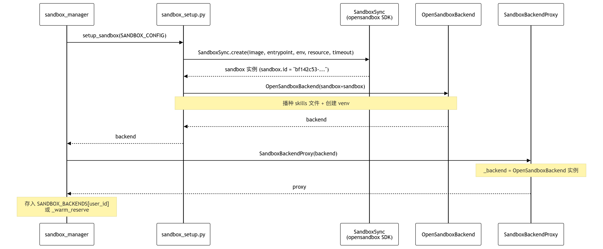
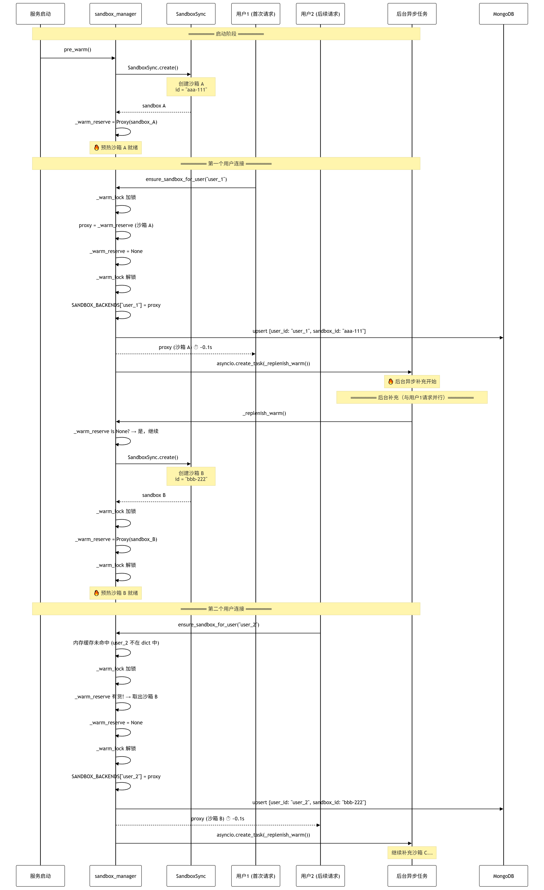
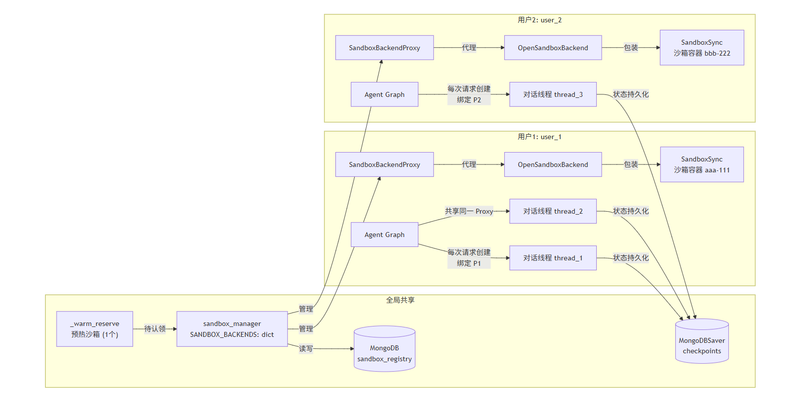
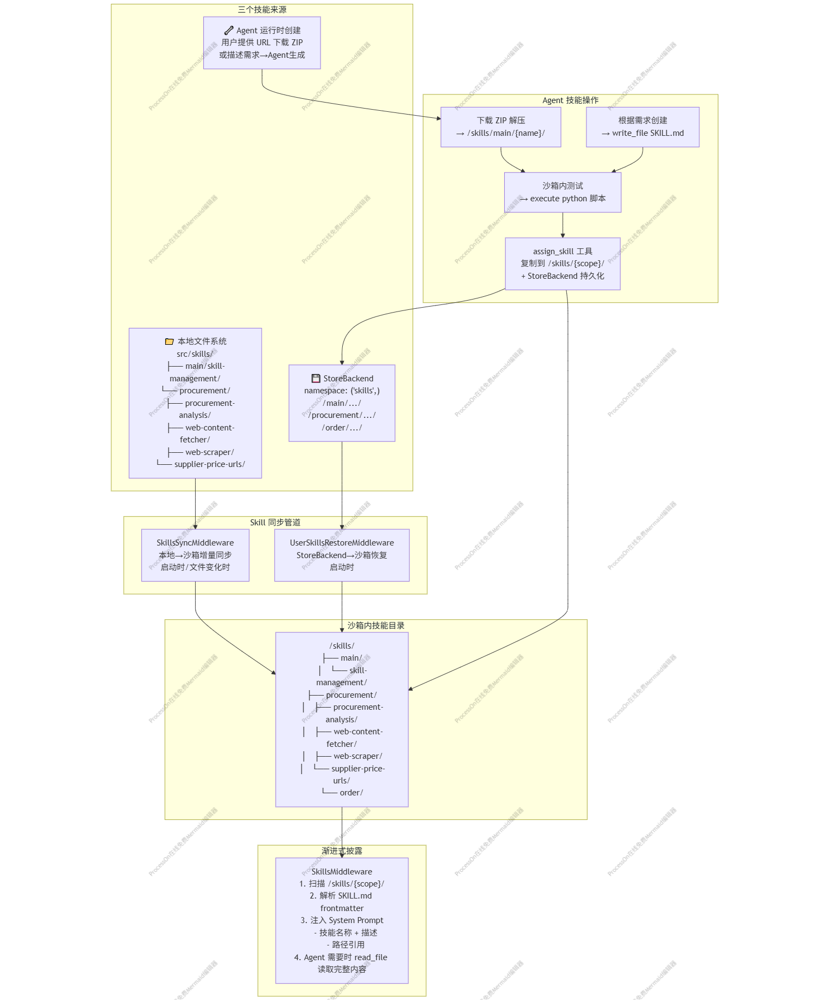

> 📌 **[AI 大模型与云原生全栈知识库](./README.md)** / **37. 基于 Harness Engineering 架构的企业实战项目 (Java-ERP 智能采购助手)**
> 🏠 [返回主页 README](./README.md) | ⚡ [面试 30 分钟速记](./interview/00_面试冲刺30分钟速记卡片.md) | 💻 [白板手写代码](./interview/08_大厂手写代码与白板编程题.md)

---

# 基于Harness Engineering架构的企业实战项目

# 第一、项目总体介绍

基于Java\-ERP系统的智能采购助手——Agent项目

## 1、项目外部依赖全景图


## 2、Agent核心代码架构

```Plain Text
src/
├── api_view/                          # 🌐 Web 层 — FastAPI 对外服务
│   ├── web_main.py                    #   FastAPI 应用入口（CORS、路由注册）
│   ├── web_config.py                  #   MongoDB 连接配置
│   ├── agent_loader.py                #   AgentLoader 单例（生命周期管理）
│   └── api/
│       ├── chat.py                    #   /api/chat/stream (SSE)、resume、state、history
│       └── history.py                 #   /api/history CRUD + 展示消息存取
│
├── agent/                             # 🧠 Agent 层 — DeepAgent 核心
│   ├── main_agent.py                  #   ★ 主入口：create_main_agent() + precompute_agent_context()
│   ├── config.py                      #   全局配置（LLM、Store、Checkpointer、沙箱连接参数）
│   ├── schema.py                      #   数据模型（ProcurementContext、UserPreferences、ChatRequest）
│   ├── env_utils.py                   #   环境变量加载（.env → os.environ）
│   ├── log_utils.py                   #   日志工具
│   ├── middleware_config.py           #   子 Agent 中间件工厂（analyst / order）
│   ├── mcp_tools_bean.py              #   MCP 工具分类 Bean
│   │
│   ├── memory/                        # 📝 记忆模块
│   │   ├── AGENTS.md                  #   Agent 全局操作手册（226 行）
│   │   └── prompts.py                 #   主 Agent 系统提示词
│   │
│   ├── subagents/                     # 📦 子 Agent 配置（声明式）
│   │   ├── loader.py                  #   YAML 加载 + 工具名解析
│   │   └── configs/
│   │       ├── procurement_analyst.yaml  # 采购分析专家配置
│   │       └── procurement_order.yaml    # 采购订单专家配置
│   │
│   ├── middlewares/                   # 🔗 中间件栈（8 个）
│   │   ├── sandbox_health.py          #   1. 沙箱健康检查 + 自动恢复
│   │   ├── context_injection.py       #   2. 用户上下文注入
│   │   ├── skills_sync.py             #   3. 本地技能同步到沙箱
│   │   ├── user_skills_restore.py     #   4. 持久化技能恢复
│   │   ├── tools_summarization.py     #   5. compact_conversation 工具
│   │   ├── memory_update.py           #   6. 用户偏好自动提取 + 持久化
│   │   ├── sandbox_breaker.py         #   7. 沙箱熔断器
│   │   └── tool_error.py              #   (废弃 — ToolNode 已内置错误处理)
│   │
│   ├── tools/                         # 🔧 工具层
│   │   ├── mcp_client.py              #   MCP 工具加载（本地 ERP + ModelScope 图表）
│   │   ├── chart_generator.py         #   26→1 图表工具合并
│   │   ├── web_search.py              #   智谱搜狗 Web 搜索
│   │   ├── hitl_tools.py              #   HITL 人工介入（request_order_info）
│   │   ├── assign_skill.py            #   技能分配（下载→创建→测试→分配→持久化）
│   │   └── download_sandbox_file.py   #   沙箱文件下载到本地
│   │
│   └── backends/                      # 🏗️ 沙箱后端
│       ├── sandbox_manager.py         #   沙箱生命周期管理（5 态：预热→缓存→Mongo→新建）
│       ├── sandbox_setup.py           #   沙箱创建 + Python 环境初始化
│       ├── custom_opensandbox.py      #   OpenSandbox 封装（注入 SANDBOX_PATH）
│       └── sandbox_proxy.py           #   代理层（热替换，18 个方法显式委托）
│
├── mcp_server/                        # 🔌 MCP 网关 — Agent ↔ Java ERP
│   ├── server_main.py                 #   MCP Server 入口（FastMCP）
│   ├── server_config.py               #   ERP 后端地址 + MCP 监听配置
│   ├── http_base.py                   #   httpx AsyncClient（连接池、超时）
│   └── tools/
│       ├── suppliers_tools.py         #   supplier_query MCP 工具
│       ├── parts_tools.py             #   part_query / part_search / part_by_supplier
│       ├── order_tools.py             #   order_create / order_update / order_search_details
│       └── inventory_tools.py         #   inventory_warning MCP 工具
│
├── skills/                            # 📚 技能库（Markdown + Python，渐进式加载）
│   ├── main/
│   │   └── skill-management/          #   技能管理 SKILL.md + download_skill.py
│   └── procurement/
│       ├── procurement-analysis/      #   采购分析操作手册
│       ├── chart_params.md            #   26 种图表参数速查
│       ├── supplier-price-urls/       #   供应商报价 URL 映射
│       ├── web-scraper/               #   沙箱内网页抓取工具
│       └── web-content-fetcher/       #   HTML→Markdown 转换工具
│
├── test/                              # 🧪 测试
│   ├── agent_test.py                  #   Agent 集成测试
│   ├── test_all_tools.py              #   全工具测试
│   └── test_mcp.py                    #   MCP 连接测试
│
└── download/                          # 📥 报告下载目录
    └── report_*.md                    #   Agent 生成的采购分析报告
```

# 第二、项目中具体Harness架构的实现

## 1、什么是 Harness Engineering？ 

• **`Prompt Engineering`**（2022\-2024 主流）主要优化单次交互的质量，重点是 “一句提示词该怎么写，模型才更容易给出想要的结果”

• **`Context Engineering`**（2025 年2月后兴起）则动态构建知识、记忆、RAG，解决 “模型看什么” 的问题，减少幻觉、提高检索命中率

• **`Harness Engineering`**（当前阶段）重点构建整个运行环境，解决 “模型怎么把长链路任务稳定做完” 的系统级问题。


**Harness Engineering** 是当前 AI Agent 开发领域的一个核心范式转变。它不再仅仅关注如何通过提示词（Prompt Engineering）或上下文管理（Context Engineering）来“优化模型输出”，而是聚焦于**构建包裹在模型之外的一整套系统化基础设施**，旨在将大语言模型（LLM）那种“不稳定、非确定性”的智能，转化为能够**稳定、可靠、长时间执行复杂任务**的工作引擎。

- **核心定义**：Harness（马具/缰绳）指的是除了模型本身之外的所有东西——工具、记忆、规划、安全护栏、执行循环、状态管理等。LangChain 团队将其精炼为公式：**Agent = Model \+ Harness**。模型提供“思考”能力，而 Harness 负责“让它真的能干活，而且别出大事”。

- **解决的问题**：传统 Agent 在应对长周期、多步骤的复杂任务时，常面临上下文窗口爆炸、状态丢失、工具调用混乱、缺乏规划、无法从失败中恢复等工程难题。Harness Engineering 正是为了解决这些“工程上的‘稳’的问题”而生的。


一个完整的**Agent Harness由几个相互配合的核心能力层构成**，它们共同决定了Agent的行为和性能：

- 任务规划：通过内置的任务清单功能，将复杂目标分解为一系列可执行的子任务，并追踪每一步的执行状态。

- 虚拟文件系统：为Agent提供一个内置的虚拟文件管理系统，支持读写、编辑、搜索等操作，使其能像人类开发者一样进行工作。

- 子Agent委派：主Agent可以创建专门的“子Agent”来执行特定任务，实现任务隔离和上下文压缩。

- 上下文管理：通过文件系统等策略，管理长对话中的Token消耗，防止因上下文溢出而导致性能下降。

- 可插拔中间件：通过一组Hook函数，在模型和工具调用的关键节点注入自定义逻辑，实现缓存、重试、日志、PII检测等增强功能。

- Skills技能系统：将提示词、文档、脚本等打包为可复用的标准模块，为Agent注入特定领域的知识和能力。并做到自我进化。

- 持久化记忆：为Agent提供短期（对话历史）和长期记忆能力，使其能从历史交互中学习。

## 2、项目中Harness架构的核心能力\(一\)：长周期复杂任务的Planning能力

提供 `write_todos` 工具，Agent 可维护结构化任务列表（pending/in\_progress/completed），持久化在 Agent state 中。

**项目实现**：


## 3、项目中Harness架构的核心能力\(二\)：安全的和动态路由的文件系统

**项目实现**：通过 `CompositeBackend` 实现**三层路由文件系统**。

**路由分流效果**：

```Python
backend = lambda rt: CompositeBackend(
    default=sandbox_backend,           # OpenSandbox（临时文件、代码执行）
    routes={
        "/memories/": StoreBackend(    # 用户偏好 → MongoDB 持久化
            runtime=rt,
            namespace=lambda rt: (getattr(rt.runtime.context, 'user_id', 'default_user'),),
        ),
        "/persisted-skills/": StoreBackend(  # 持久化技能 → MongoDB
            runtime=rt,
            namespace=lambda rt: SKILLS_STORE_NAMESPACE,
        ),
    },
)
```

## 4、项目中Harness架构的核心能力\(三\)： Subagent的任务委派

主 Agent 拥有 `task` 工具，每次调用创建全新 Agent 实例，独立上下文，执行完返回单个报告。支持并行执行和特殊化配置。

**项目实现**：**  Multi\-Agent**

**子 Agent 配置加载**：loader\.py

```Plain Text
YAML 配置文件 (configs/*.yaml)
  │ load_subagent_configs()      ← YAML → dict 列表
  │ resolve_subagent_tools()     ← 工具名子串匹配 → 可调用对象
  │ _validate_subagent_config()  ← 必填字段校验
  ▼
```

**两个子 Agent 对比**：

**委派模板**（AGENTS\.md:74\-121）：

主 Agent 的 `AGENTS.md` 为每个子 Agent 定义了结构化的 `task` 调用模板，确保 user\_id/username/偏好 正确传递到子 Agent。


## 5、项目中Harness架构的核心能力\(四\)：Context Management — 上下文管理


四种策略——Input context（启动时加载）、Compression（自动 offload \+ summarization）、Isolation（子 Agent 隔离）、Long\-term memory（跨线程持久化）。

**项目实现**：

#### a\. Input Context

#### b\. Compression

#### c\. Isolation（子 Agent 上下文隔离）

analyst 执行 5 步分析流程时会产生大量中间结果（MCP 返回的供应商/零部件 JSON、Python 脚本输出、图表生成参数等），全部隔离在子 Agent 自己的上下文窗口中。主 Agent 只收到最终的结构化报告。

#### d\. Long\-term Memory


## 6、项目中Harness架构的核心能力\(五\)：Skills — 渐进式技能系统（自我进化）

遵循 Agent Skills 标准，每个技能是含 `SKILL.md` 的目录，支持渐进式披露——启动时只读 frontmatter，需要时再加载完整内容。

**项目实现**：

#### Skills自我进化（4 阶段）

```Plain Text
┌─ 阶段1: 同步到沙箱 ────────────────────────────────┐
│ SkillsSyncMiddleware (增量) + _seed_files() (首次)  │
│ src/skills/ → /skills/{scope}/                     │
└────────────────────────────────────────────────────┘
  │
  ▼
┌─ 阶段2: 渐进式发现 ───────────────────────────────┐
│ Agent 启动时 ls /skills/procurement/              │
│ 看到所有 SKILL.md 的 frontmatter                   │
│ 需要时才 read_file 加载完整内容                     │
└────────────────────────────────────────────────────┘
  │
  ▼
┌─ 阶段3: **运行时根据需要自动创建/下载 新Skill**─────────────────────────┐
│ skill-management 技能                              │
│ execute("python download_skill.py '{url}'")        │
│ → 解压到 /skills/main/{skill_name}/               │
│ → 测试验证                                        │
└────────────────────────────────────────────────────┘
  │
  ▼
┌─ 阶段4: 分配与持久化 ─────────────────────────────┐
│ assign_skill(skill_name, agent_name)               │
│ → 复制到 /skills/{scope}/ (子Agent时)             │
│ → store.aput() 持久化到 StoreBackend              │
│ → UserSkillsRestoreMiddleware 恢复（下次沙箱创建时）│
│ → 清理压缩包                                       │
└────────────────────────────────────────────────────┘
```

#### 基于SkillsSyncMiddleware发现链

```Plain Text
yaml system_prompt: "ls /skills/procurement/ 扫描可用技能"
  → 返回: chart_params.md, procurement-analysis/, supplier-price-urls/, web-scraper/
  → read_file("procurement-analysis/SKILL.md") 加载操作手册
  → 按流程激活各技能
```


## 7、项目中Harness架构的核心能力\(六\)： Human\-in\-the\-Loop — 人工介入

通过 `interrupt_on` 参数选择性地在工具调用前暂停，等待人工审批或修改。

**项目实现**：**双层中断体系**。

```Markdown
用户消息 → 主Agent → procurement-order 子Agent
                         │
                    ┌─────▼──────┐
                    │ 1.提取数据  │
                    └─────┬──────┘
                          │
                    ┌─────▼──────┐
                    │ 2.校验必填  │
                    └─────┬──────┘
                          │
                    ┌─────▼──────────────────┐
                    │ 【介入点1】数据不完整？  │ ← request_order_info()
                    │  → 暂停，等待人工补充     │
                    └─────┬──────────────────┘
                          │ 数据齐全
                    ┌─────▼──────────────────┐
                    │ 【介入点2】最终审批      │ ← interrupt_on
                    │  → 暂停，等待 approve/   │    order_create
                    │    reject              │    order_update
                    └─────┬──────────────────┘
                          │ approve
                    ┌─────▼──────┐
                    │ 4.执行MCP  │
                    └────────────┘
```

**代码位置**：

**两层中断互不干扰的原因**：`request_order_info` 不在 `interrupt_on` 列表中，不会被 HITL 中间件拦截。两者是**顺序关系**——先补齐数据，再审批执行。


## 8、项目中Harness架构的核心能力\(七\)：Memory — 用户偏好记忆管理

**项目实现**：以用户作用域来管理Memory

#### 记忆层次

```Plain Text

┌─ 用户层（读写，跨会话持久化）──────────────────────┐
│ /memories/{user_id}/preferences.md                 │
│ 来源: StoreBackend → MongoDB                      │
│ 内容: preferred_output, preferred_chart_type,      │
│       preferred_currency, preferred_language,      │
│       recent_suppliers, recent_queries             │
│ 加载: 每轮对话前 Agent 主动 read_file             │
│ 更新: Agent 手动 edit_file（偏好变更）             │
│       + MemoryUpdateMiddleware 自动维护            │
│         (recent_suppliers + recent_queries)        │
└───────────────────────────────────────────────────┘
```

#### 记忆更新流程

```Plain Text
【手动路径】用户说"以后都用饼图"
  → Agent edit_file /memories/{user_id}/preferences.md
  → 更新 preferred_chart_type: pie

【自动路径】对话结束后
  → MemoryUpdateMiddleware.aafter_agent()
  → LLM 提取 {suppliers: [...], query: "..."}
  → store.aput() 写入 StoreBackend
  → 跨会话保留
```


## 9、项目的最大安全问题： 基于OpenSandbox来解决

OpenSandbox 就是这个项目的**唯一安全边界**。所有 Agent 行为——运行 Python 脚本、执行 Shell 命令、读写文件、下载，新建技能（skill）、爬取网页——全部发生在这个容器内部。**OpenSandbox 的配置决定了这道墙有多厚。**

### 综合风险评估


**OpenSandbox 在这里扮演的角色**：它是最后的兜底线。即使Skills全部失守——恶意技能被下载、解压、恶意代码、文件操作——第 5 阶段执行时，恶意代码仍然被关在容器里。**容器的网络策略决定了恶意代码能造成多大的外部影响。**

### Sandbox 做边界定义：墙内 vs 墙外

```Plain Text
┌──────────────────────────────────────────────────────┐
│                    宿主机 (Windows)                    │
│                                                      │
│     FastAPI（Agent服务器）   MongoDB   MCP Server               │
│                                                      │
│  ┌────────────────────────────────────────────────┐  │
│  │          OpenSandbox 容器 (Linux)               │  │
│  │                                                │  │
│  │   /skills/        /data/       /analysis/      │  │
│  │   /memories/      /AGENTS.md   /workspace/     │  │
│  │                                                │  │
│  │   Python，Go，Java，Nodejs 环境                              │  │
│  │   execute("任意命令") → 在这里运行               │  │
│  │   web-scraper → 从这里发出 HTTP 请求            │  │
│  │   技能脚本 → 在这里被调用                        │  │
│  │                                                │  │
│  │   网络出口 ──────────────────────────────→ ???  │  │
│  └────────────────────────────────────────────────┘  │
│                                                      │
└──────────────────────────────────────────────────────┘
```

### OpenSandbox 防护了三件事：


# 第三、项目亮点

## 1、用户作用域的沙箱隔离和沙箱预热机制

### 一、沙箱容器组件的层次关系

```Plain Text
┌──────────────────────────────────────────┐
                    │        SandboxHealthMiddleware           │  ← 健康哨兵（Middleware）
                    │    ping 沙箱 → 不可达 → 触发重建          │
                    └──────────────┬───────────────────────────┘
                                   │ 调用
                    ┌──────────────▼───────────────────────────┐
                    │         sandbox_manager.py               │  ← 生命周期总管
                    │  预热/认领/缓存/重连/重建/销毁            │
                    └──────────────┬───────────────────────────┘
                                   │ 管理
                    ┌──────────────▼───────────────────────────┐
                    │       SandboxBackendProxy                │  ← 稳定句柄层（沙箱代理器）
                    │  18个方法显式代理 + replace_backend()     │
                    └──────────────┬───────────────────────────┘
                                   │ 代理
                    ┌──────────────▼───────────────────────────┐
                    │       OpenSandboxBackend                 │  ← 协议适配层（切换其他沙箱的提供商）
                    │  将 SandboxSync 包装为 Protocol 接口      │
                    └──────────────┬───────────────────────────┘
                                   │ 包装
                    ┌──────────────▼───────────────────────────┐
                    │          SandboxSync                     │  ← Docker SDK （企业自定义的容器沙箱）
                    │  创建/连接/删除容器，执行命令，文件传输    │
                    └──────────────────────────────────────────┘
```

**其他沙箱的提供商：**

### 二、本项目中沙箱核心流程

#### 2\.1 沙箱创建链路



#### 2\.2 命令执行链路（正常路径）


#### 2\.3 沙箱故障 → 热替换恢复链路


#### 2\.4 预热\-认领\-补充 时序图



#### 2\.5 用户作用域沙箱隔离模型



#### 2\.6 总结：五组件分工

## 2、中间件矩阵：故障全场景覆盖

### 一、 中间件总览表

**用户自定义 \+  框架内置 \+  Agent自动添加**

```Plain Text
┌────────────────────────────────────────────────────────────────────┐
│                    create_deep_agent() Agent自动自动添加                       │
│                                                                     │
│  TodoListMiddleware  → write_todos 任务管理工具                       │
│  MemoryMiddleware    → AGENTS.md 注入到 system prompt                │
│  SkillsMiddleware    → 技能渐进式披露                                 │
│  FilesystemMiddleware → ls/read/write/edit/glob/grep/execute 工具     │
│  SubAgentMiddleware  → task 子 Agent 调度工具                         │
│  SummarizationMiddleware → 85% 自动摘要保底                           │
│  AnthropicPromptCachingMiddleware → 提示缓存                          │
│  PatchToolCallsMiddleware → 孤儿 tool_call 修复                       │
│                                                                     │
├────────────────────────────────────────────────────────────────────┤
│              用户 main_middleware 列表（每次请求注入）                   │
│                                                                     │
│  1. SandboxHealthMiddleware       ← 🆕 自定义                        │
│  2. ContextInjectionMiddleware    ← 🆕 自定义                        │
│  3. SkillsSyncMiddleware          ← 🆕 自定义                        │
│  4. UserSkillsRestoreMiddleware    ← 🆕 自定义                        │
│  5. SummarizationToolMiddleware   ← DeepAgents 内置, 手动启用          │
│  6. MemoryUpdateMiddleware        ← 🆕 自定义                        │
│  7. SandboxCircuitBreakerMiddleware ← 🆕 自定义                       │
│  8. ModelCallLimitMiddleware      ← LangChain 内置                    │
│  9. ToolCallLimitMiddleware       ← LangChain 内置                    │
└────────────────────────────────────────────────────────────────────┘
```

### 二、故障场景覆盖矩阵

---

总结：9 个中间件形成 **"健康守护 → 上下文注入 → 技能同步 → 摘要压缩 → 记忆更新 → 熔断保护 → 调用限制"** 的完整生命周期管线。其中 \#1 和 \#7 协作形成沙箱两级防护，\#3 和 \#4 互补形成技能双通道，\#5 和框架内置摘要形成被动/主动两层压缩。


## 3、用户偏好内容的长期记忆机制

### 一、用户偏好记忆文件：preferences\.md 的生命周期


### 二、用户偏好记忆文件的整体流程


### 三、用户偏好内容的更新机制


## 4、Skills的进化管理机制

### 一、相关组件

### 二、Skills的总体流程




### 三、Skills的渐进式披露机制


### 四、Skills的自我进化机制（自动下载，自动创建，自动分配）


## 5、复杂任务的Planning能力


```Python
from deepagents import tool, ToolParameter

@tool(
    name="write_todos",
    description=(
        "创建并管理一个结构化的任务清单，用于规划复杂目标。"
        "可以一次性创建完整列表，或者增量更新现有列表。"
        "每一步执行完成后必须更新对应任务的状态。"
    ),
    parameters={
        "todos": ToolParameter(
            type="array",
            description="要应用的任务列表。如果提供空数组则清空所有任务。",
            items={
                "type": "object",
                "properties": {
                    "id": {"type": "string", "description": "唯一标识符"},
                    "content": {"type": "string", "description": "任务描述"},
                    "status": {
                        "type": "string",
                        "enum": ["pending", "in_progress", "completed", "cancelled"],
                    },
                    "depends_on": {
                        "type": "array",
                        "items": {"type": "string"},
                        "description": "前置依赖的任务ID列表",
                    },
                },
                "required": ["id", "content", "status"],
            },
        ),
        "merge": ToolParameter(
            type="boolean",
            description="是否与现有列表合并（默认True），否则全量替换",
            default=True,
        ),
    },
)
def write_todos(todos: list[dict], merge: bool = True) -> str:
    # 实际逻辑将由框架自动接入，这里只是占位函数体
    ...
```

在Harness架构中，绝大多数工具都是“外部”的：查天气、发邮件、读文件。而`write_todos`是一个工具。它允许Agent在“思考”过程中，将大脑中的宏大目标，分解成一个具体的、带有状态的任务清单，并写入自己的上下文记忆。你可以把它看作Agent的“前额叶皮层”——负责规划、执行控制和自我监控。

它的典型定义（JSON Schema）会包含以下能力：

- 创建任务列表：接收一个目标，返回结构化的步骤清单。

- 更新任务状态：将某个步骤标记为`pending`、`in_progress`、`completed`或`cancelled`。

- 插入新任务：在执行过程中，如果发现原来计划有遗漏，可以动态添加子任务。

- 调整依赖：为任务设置前置依赖（例如“步骤B必须等步骤A完成”）。

**`write_todos`****工具的作用：**

- 作为Harness工具：它享受Harness层的全部保护与增强。Harness负责校验任务结构的合法性（id不能重复，状态必须是枚举值），将模型的调用请求路由到这个内部工具，并把更新后的清单安全地注入到Context。

- 重塑Context：`write_todos`的输出不是给用户看的，而是直接写入Agent的上下文记忆。Context Engineering模块会确保这个任务清单始终以最醒目的方式呈现在模型面前，甚至在工具选择时作为最高优先级参考。

- 受Prompt引导：Agent何时应该创建计划、更新状态、标记完成，正是由Prompt Engineering定义的。优秀的系统Prompt会教导模型：“在执行复杂任务前，必须先使用 `write_todos` 制定计划。每完成一个步骤，立即更新其状态为`completed`。”

### 二、Planning能力的五层核心体现

这不是简单的“列出1、2、3”，而是一个完整的、可运作的规划引擎：

#### 目标分解与结构化

当用户提出“帮我写一篇关于AI Agent的深度报告”时，模型不会直接去搜资料，而是先调用`write_todos`，把目标拆解为一个JSON结构：

json

\{  "todos": \[    \{ "id": "1", "content": "收集近三年的关键论文和行业报告", "status": "pending" \},    \{ "id": "2", "content": "提炼核心技术架构（Harness, Context, Prompt）", "status": "pending", "depends\_on": \["1"\] \},    \{ "id": "3", "content": "撰写初稿，不少于1500字", "status": "pending", "depends\_on": \["2"\] \},    \{ "id": "4", "content": "根据反馈修改并润色", "status": "pending", "depends\_on": \["3"\] \}  \]\}

这一步将自然语言的模糊目标，转化为了机器可处理、可追踪的结构化状态。

#### 状态驱动的执行循环

任务清单一旦写入Context，就会成为Agent“记忆”的一部分。在后续的每一轮思考中，模型都能看到这个清单。Harness层可以设计一个“状态检查钩子”，当模型想调用其他工具时，强制要求它指明“当前正在执行哪个todo任务”。
这样，Agent的行为就变成了：查询当前`in_progress`的任务 → 调用具体工具 → 工具返回后，调用`write_todos`将任务标记为`completed` → 激活下一个`pending`任务。整个过程由状态驱动，而非盲目推理。

#### 动态重规划与自我修正

这是`write_todos`最体现“智能”的地方。执行过程中，Agent会遇到意外，例如搜索论文时发现“近三年”资料太少。传统Agent可能就糊弄过去，或者直接生成一份低质量报告。但有了`write_todos`，Agent可以调用它来修改计划：

- 将“收集近三年论文”的状态改为`cancelled`，并附上原因。

- 插入一个新任务：“扩大搜索范围至近五年，并备注时间限制”。

- 重新评估后续依赖，可能将“撰写初稿”的预期内容调整。
这个过程完全由Agent自己决策，无须人类干预。它让Agent具备了元认知调整能力。

#### 执行诊断与可解释性

对于用户或开发者，`write_todos`生成的清单就是一个天然的“审计日志”。你可以清楚地看到Agent原本计划做什么，中途遇到了什么问题，以及它是如何调整策略的。这大大提升了Agent的可解释性，不再是一个黑盒。

#### 长时任务的抗遗忘机制

LLM的上下文窗口有限，且在长对话中容易“忘记初衷”。**`write_todos`****将高层目标固化在上下文中**，形成持续的指引。即使对话经过了多轮压缩或摘要，这些结构化的任务状态（尤其是未完成的）也能被优先保留，确保Agent不会跑偏。


## 6、SubAgent的弹性加载机制

**项目中已有的，两个子 Agent 概览**


**第 1 步：****`load_subagent_configs()`** — 读取 `src/agent/subagents/configs/*.yaml`，校验 4 个必填字段（name、description、system\_prompt、tools），返回原始 dict 列表，此时 tools 仍是字符串名称。

**第 2 步：****`resolve_subagent_tools()`** — 将 tools 字符串通过**子串匹配**（`pattern in tool_name`）映射为实际工具对象，同时合并 extra\_middleware。

**第 3 步：传入 ****`create_deep_agent(subagents=...)`** — DeepAgents 框架接管，每个 SubAgent 成为一个独立的 agent node。


### 扩展新子 Agent 的模式：

只需增加一个YAML文件，无需改任何 Python 代码：

在 `src/agent/subagents/configs/` 下新建 `new_agent.yaml`：

```YAML
name: my-agent
description: >
  我的子 Agent 描述，包含触发关键词。
tools:
  - some_mcp_tool
  - web_search
skills:
  - /skills/my-domain/
system_prompt: |
  你是 XXX 助手...
```

# 第四、基于SSE事件流的完整的前后端

## 1、架构概览：三文件分工

```Plain Text
api_view/api/
├── chat.py      ★ 核心：SSE 流式对话 + 中断检测 + 中断恢复 + 展示消息持久化
├── history.py   ← 历史会话列表 / 消息查询 / 会话删除
└── agent_loader.py (上层) ← Agent 单例 / MongoDB 连接 / 展示消息存取
```


## 2、 双流模式 — 一条连接同时走两路

chat\.py 从头到尾只做一件事：**把 Agent 流式输出转换成前端能消费的 SSE 事件序列**。但它的实现方式体现了项目特色。

```Python
# chat.py:281-287
async for chunk in agent_loader.agent.astream(
    input=current_input,
    config=config,
    stream_mode=["messages", "values"],  # ← 双模式
    subgraphs=True,
    version="v2",
):
```

这是整个中断检测机制的基础。常规 SSE 只用 `"messages"` 模式拿 token/tool 事件，但本项目需要检测中断，所以同时开了 `"values"`：

```Plain Text
stream_mode=["messages", "values"]
     │              │
     │              └─→ values 流: 检测 interrupts() 是否触发
     │                   chunk_type == "values" && chunk.get("interrupts")
     │                   先于 messages 处理（代码中 if 在 messages 前面）
     │
     └─→ messages 流: token / tool_call / tool_result
          chunk_type == "messages"
          正常 SSE 事件 (token / tool_start / tool_args / tool_result / tool_end)
```

##### 流 A：`messages` — 内容输出（AIMessage，ToolMessage）

```Plain Text
messages 流产出的 token 类型:

┌─────────────────────────────────────────────────────────┐
│ token.tool_call_chunks 有值                             │  - AIMessage（调用工具的指令，一般没有content）
│   → token.tool_call_chunks[i]["name"] = "web_search"   │  → tool_start 事件
│   → token.tool_call_chunks[i]["args"] = '{"query":...}' │  → tool_args 事件
│                                                         │
│ token.type == "tool"                                    │  # ToolMessage （工具调用后返回的内容）
│   → token.name = "web_search"                          │  → tool_result 事件
│   → token.content = "搜索结果是..."                     │  → tool_end 事件
│                                                         │
│ token.content 是纯文本 (不是 tool, 不是 tool_call_chunks)│
│   → "根据搜索结果，博世刹车片..."                       │  → token 事件
└─────────────────────────────────────────────────────────┘
```

##### 流 B：`values` — 中断检测

```Python
# 中断检测必须在 messages 处理之前执行 (line 296-366)
if chunk_type == "values" and chunk.get("interrupts"):
    for interrupt in chunk["interrupts"]:
        if "action_requests" in interrupt.value:
            → interrupt_type = "hitl_approval"   # 第2层: 审批中断
        elif interrupt.value.get("type") == "order_info_request":
            → interrupt_type = "order_info_supplement"  # 第1层: 数据补充
    → 保存 display_messages 到 MongoDB
    → 发送 done(interrupted=True)
    → return  # 停止本次流
```

**为什么必须先检测中断？** 因为中断时最后一条 messages 事件可能还来不及到达，先处理中断才能确保两端状态一致。


## 3、完整请求链路（从用户输入到 SSE 返回）

```Plain Text
用户发送 "帮我新增采购订单"
  │
  ▼
POST /api/chat/stream {message: "帮我新增采购订单"}
  │
  ▼
chat_stream() → StreamingResponse
  │
  ▼
stream_chat_response(message="帮我新增采购订单")
  │ config = agent_loader.create_config(thread_id)
  │ current_input = {"messages": [{"role":"user", "content":"..."}]}
  │ display_messages = [user消息]
  │
  ▼
agent.astream(input, config, stream_mode=["messages","values"], subgraphs=True, version="v2")
  │
  ├─→ 主 Agent 收到消息 → 判断: 订单操作 → task(procurement-order)
  │
  ├─→ [SSE] token: "好的，我来帮您..."           (source: main)
  ├─→ [SSE] tool_start: task                    (source: main)
  ├─→ [SSE] tool_args: {...}                    (source: main)
  │
  ├─→ order 子 Agent 启动 (独立上下文)
  │     ├─→ 第1步: 提取数据
  │     ├─→ 第2步: Schema 校验 → partId 缺失!
  │     ├─→ 第3步: request_order_info(...)
  │     │     └─→ interrupt({"type": "order_info_request", ...})
  │     │
  ├─→ [stream_mode="values"] 检测到 interrupts
  │     │
  │     ├─→ [SSE] interrupt {interrupt_type: "order_info_supplement", ...}
  │     ├─→ save_display_messages(thread_id, cleaned)  ← 保存现场
  │     └─→ [SSE] done {interrupted: true}
  │         return  ← 流结束
  │
  ▼
前端 InterruptBanner 弹出: "请输入补充信息"
用户输入: "物料ID=100, 数量=50, 单价=25.5"
  │
  ▼
POST /api/chat/{thread_id}/resume {resume: {supplement: "物料ID=100..."}}
  │
  ▼
stream_chat_response(thread_id, resume_data={supplement: "..."})
  │ existing = get_display_messages()  ← 加载中断前的消息
  │ current_input = Command(resume={supplement: "..."})  ← 恢复
  │
  ▼
agent.astream(Command(resume=...), config, ...)
  │
  ├─→ order 子 Agent 恢复 → 解析补充数据 → 合并 → 校验通过
  ├─→ 构造 order_create 参数 → interrupt_on 触发
  │
  ├─→ [stream_mode="values"] 再次检测到 interrupts
  │     ├─→ [SSE] interrupt {interrupt_type: "hitl_approval", action_requests: [...]}
  │     └─→ [SSE] done {interrupted: true}
  │
  ▼
前端 InterruptBanner 切换: 审批卡片 (approve/reject)
用户点击 "approve"
  │
  ▼
POST /api/chat/{thread_id}/resume {resume: {decisions: [{type: "approve"}]}}
  │
  ▼
agent.astream(Command(resume={decisions:...}), config, ...)
  │
  ├─→ order_create 执行 → 成功
  ├─→ [SSE] tool_result {text: "订单创建成功..."}
  ├─→ [SSE] token "订单已创建，编号 PO20260513..."  (source: order)
  │
  ├─→ 主 Agent 收到子Agent 完成 → compact_conversation
  ├─→ [SSE] token "已为您完成订单创建..."           (source: main)
  │
  └─→ save_display_messages(thread_id, all_messages)
      [SSE] done {thread_id: "...", content: "..."}
```


# 第五、补充：异步后台执行的子Agent（AsyncSubAgent）

核心思想是：

- 主 Agent 仍然运行在 FastAPI 后端中。

- 耗时的采购分析子 Agent 不再由主 Agent 同步等待。

- 采购分析任务通过 start\_async\_task 投递到本地 LangGraph / Agent Protocol Server。

- 子 Agent 在后台运行。

- 前端拿到 task\_id 后自动轮询任务状态。

- 任务完成后，前端自动显示结果。

## 1、为什么需要AsyncSubAgent

同步 subagent 会阻塞 supervisor，异步 subagent 会立即返回任务 ID，supervisor 可以继续和用户交互。很多人听到 AsyncSubAgent，会误以为它只是 Python 里的：async def xxx\(\) 异步函数。但不是。AsyncSubAgent 的“异步”不是指 Python 协程，而是指：**子 Agent 的生命周期从主 Agent 当前请求中拆出来了。**

它有自己的：

- thread

- run

- state

- message history

- task status

- task id

**同步 subagent 像函数调用。AsyncSubAgent 像提交后台任务。**


## 2、Agent Protocol Server是什么？

Agent Protocol Server 可以理解为一个“标准化的 Agent 后台任务服务器”。

它不是普通的 FastAPI 聊天接口，也不是简单的 Python 后台线程。它的核心职责是：

- 创建 Agent 任务线程，也就是 thread

- 启动一次 Agent 执行，也就是 run

- 查询任务运行状态

- 保存任务状态和上下文

- 支持取消任务

- 支持向运行中的任务追加新指令

- 让远程 Agent 可以通过统一协议被调用


所以在我的项目里，本地启动的 LangGraph / Agent Protocol Server 就承担了这个角色。

如果没有 Agent Protocol Server，主 Agent 调用子 Agent 通常像一次普通函数调用；

比如采购分析子 Agent 需要抓网页、查供应商、生成报告，可能跑几分钟。同步调用时，主 Agent 和前端都要一直等。

**Agent Protocol Server 的作用，就是把这种耗时 Agent 任务变成后台任务：**


## 3、异步子Agent代码解析

1. **启动入口**

start\_web\.py

这个文件负责统一启动整个项目，不需要你手动执行 langgraph dev。

当前启动链路大致是：

`MCP Server→ 全局 OpenSandbox 预热→ LangGraph / Agent Protocol Server→ FastAPI 后端→ Vue 前端`

其中和 AsyncSubAgent 最相关的是这一步：

`启动 LangGraph / Agent Protocol Server`

它会监听：

`http://127.0.0.1:2024`

主 Agent 后续通过这个地址提交后台采购分析任务。

2. **LangGraph 图注册**

langgraph\.json

这里注册异步采购分析 Agent：

`{  "graphs": {    "procurement_analyst_async": "./src/agent/async_procurement_analyst.py:agent"  }}`

这里的 procurement\_analyst\_async 很关键。

它必须和主 Agent 里 AsyncSubAgent 的 graph\_id 保持一致：`ASYNC_ANALYST_GRAPH_ID = "procurement_analyst_async"`

否则 start\_async\_task 找不到要启动的后台 Agent。

3. **主 Agent 注册 AsyncSubAgent**

src/agent/main\_agent\.py

这是主 Agent 的核心文件。

当前它做了几件事：

1. 引入 AsyncSubAgent

`from deepagents import AsyncSubAgent, create_deep_agent`

2. 配置 Agent Protocol Server 地址

`ASYNC_ANALYST_URL = os.environ.get(    "ASYNC_AGENT_PROTOCOL_URL",    "http://127.0.0.1:2024",)`

3. 配置异步采购分析 Agent

```JSON
async_subagents: list[AsyncSubAgent] = [
    {
        "name": "procurement-analyst",
        "description": "...",
        "graph_id": ASYNC_ANALYST_GRAPH_ID,
        "url": ASYNC_ANALYST_URL,
    }
]
```

4. 把同步子 Agent 和异步子 Agent 合并：

`subagents = sync_subagents + async_subagents`

5. 创建 DeepAgent：

`agent_graph = create_deep_agent(    ...    subagents=subagents,    ...)`

DeepAgents 会根据是否存在 graph\_id 来判断这是 AsyncSubAgent。有 graph\_id 的会走异步机制，并自动注册\.

6. **同步子 Agent 和异步子 Agent 的拆分**

`procurement-analyst 不再注册到同步 task 工具里`，在main\_agent\.py里面

```Markdown
sync_subagent_configs = [
    c for c in precomputed.raw_subagent_configs
    if c.get("name") != "procurement-analyst"
]
```

否则模型可能仍然通过同步 task 调用采购分析子 Agent。

现在的设计是：

`procurement-analyst → AsyncSubAgent → start_async_task`

`procurement-order → 同步 SubAgent → task`

7. **异步采购分析 Agent 本体**

src/agent/async\_procurement\_analyst\.py

这是后台真正执行采购分析任务的 Agent。

它会被 Agent Protocol Server 加载。

它主要负责：

- 加载采购分析 YAML 配置

- 创建采购分析 DeepAgent

- 加载 MCP 工具

- 使用全局 OpenSandbox

- 运行采购分析技能

- 输出最终分析结果

它不是由 FastAPI 直接调用，而是由 Agent Protocol Server 根据 graph\_id 启动。

关系是：

`start_async_task`

`→ Agent Protocol Server`

`→ graph_id = procurement_analyst_async`

`→ async_procurement_analyst.py:agent`

8. **主 Agent 提示词控制**

src/agent/memory/prompts\.py

这里现在已经明确规定：

`采购分析 → 使用 start_async_task 启动 procurement-analyst 后台任务订单操作 → 使用 task 委派 procurement-order`

并且强调：

`task 工具只用于 procurement-order严禁用 task 启动 procurement-analyst`

这个文件决定主 Agent 在普通对话中怎么选择工具。

9. **长期记忆文件**

src/agent/memory/AGENTS\.md

这个文件会作为 Agent 记忆/行为规范被加载。

当前它对 procurement\-analyst 的规则是：

`必须调用 start_async_task严禁用 task 工具启动 procurement-analyst启动后不要立刻 check_async_task启动后不要等待分析结果立即返回 task_id`

---

> 📌 **[AI 大模型与云原生全栈知识库](./README.md)** / **37. 基于 Harness Engineering 架构的企业实战项目 (Java-ERP 智能采购助手)**
> 🏠 [返回主页 README](./README.md) | ⚡ [面试 30 分钟速记](./interview/00_面试冲刺30分钟速记卡片.md) | 💻 [白板手写代码](./interview/08_大厂手写代码与白板编程题.md)
