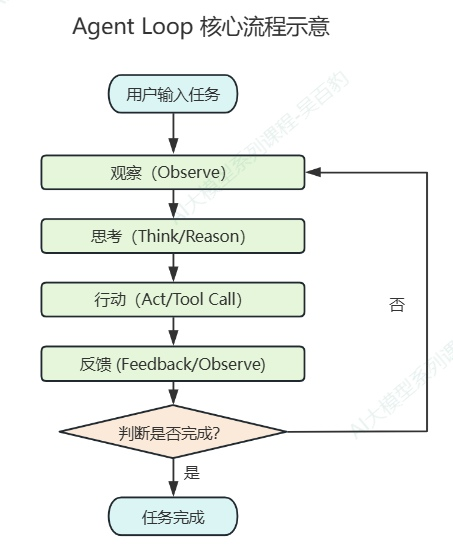
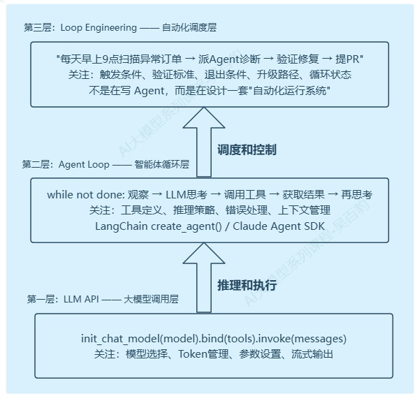
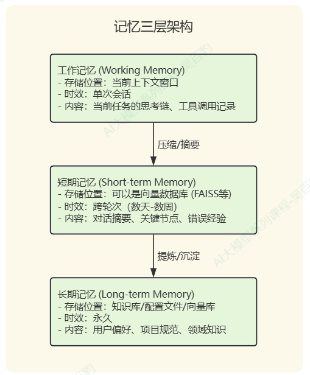
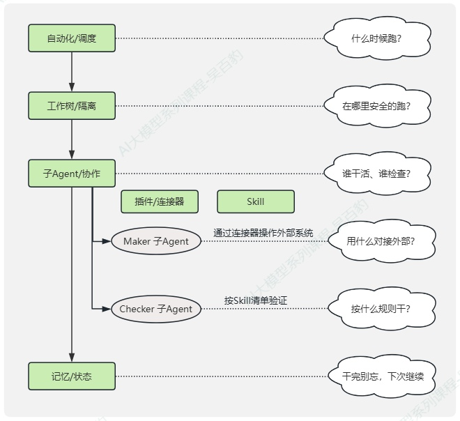
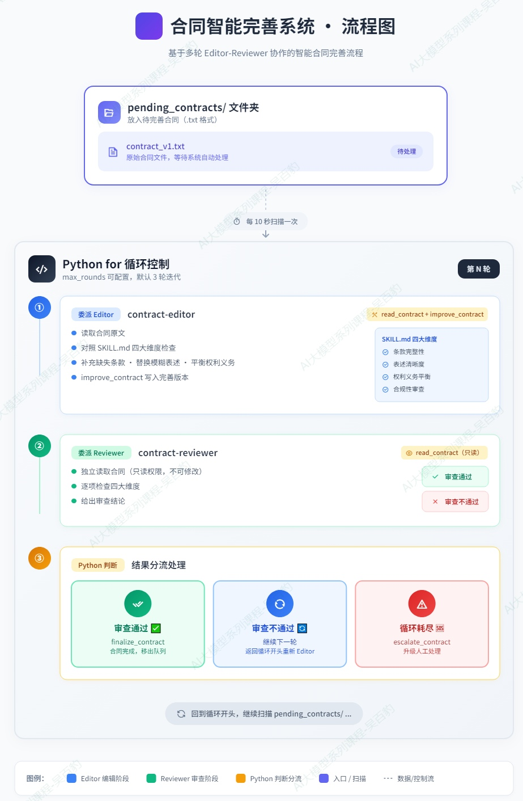
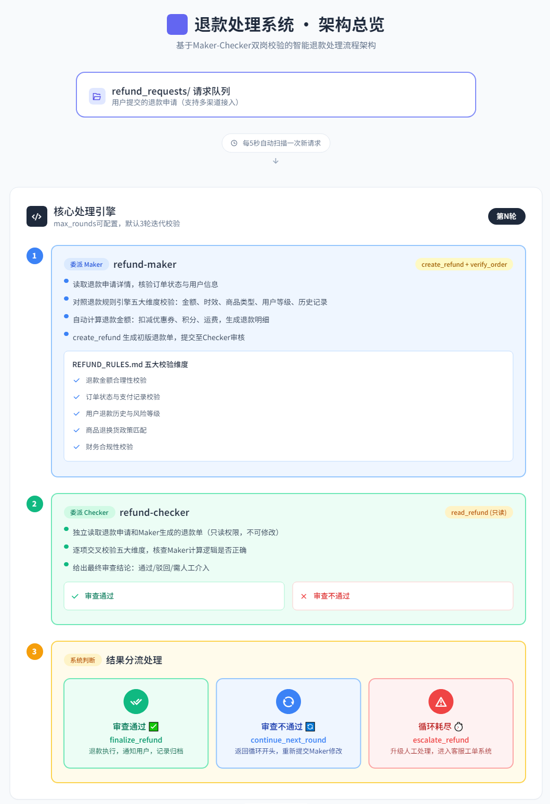

> 📌 **[AI 大模型与云原生全栈知识库](./README.md)** / **38. Agent Loop 与循环工程 (Agent Loop & Loop Engineering)**
> 🏠 [返回主页 README](./README.md) | ⚡ [面试 30 分钟速记](./interview/00_面试冲刺30分钟速记卡片.md) | 💻 [白板手写代码](./interview/08_大厂手写代码与白板编程题.md)

---

# 1\. **Agent Loop & Loop Engineering 概述**

## 1.1. **什么是Agent Loop**

Agent Loop（智能体循环）是AI Agent的核心工作机制。它让大语言模型（LLM）从"只会聊天"变成"能干活"的关键——通过一个"观察->思考->行动->反馈"的循环，Agent 能够自主调用工具、获取信息、根据结果调整策略，持续迭代直到完成任务。

一句话理解：Agent Loop=把LLM的推理能力放进一个while循环里，让它可以反复思考和行动。



Agent Loop 形式化定义如下：

```python
# Agent Loop 的核心：一个 while 循环
while not termination_condition:
    # ① 观察：获取当前环境状态
    observation = environment.perceive()
  
    # ② 思考：LLM 推理下一步该做什么
    plan = llm.reason(observation, history=memory)
  
    # ③ 行动：执行工具调用
    result = tool_executor.run(plan)
  
    # ④ 反馈：将结果存入记忆
    memory.store(observation=observation, plan=plan, result=result)
  
    # ⑤ 检查终止条件
    if plan.is_final_answer() or max_steps_reached():
        break
```

## 1.2. **什么是Loop Engineering**

Loop Engineering（循环工程）是2026年由Google工程总监Addy Osmani系统化定义、Anthropic Claude Code负责人Boris Cherny和OpenAI的Peter Steinberger共同推动的新范式。它描述的是：不再亲手给AI写Prompt，而是设计一个系统（Loop），让这个系统自动调度 AI Agent 去发现任务、执行任务、验证结果，直到目标达成。

Loop Engineering 不是替代 Agent Loop，而是在其之上增加一层自动化的调度和控制。你仍然需要一个能干的 Agent（不管是手写的还是用 LangChain 封装的），Loop Engineering 教你怎么让它自动运转起来。如下图所示：



旧模式（Prompt Engineering）：

```python
旧模式（Prompt Engineering）：
  人 → 写 Prompt → LLM 回答 → 人读结果 → 不满意再写 Prompt → ...
  
  问题举例：
  1)每次都要人介入
  2)复杂的多步骤任务需要人手动拆解
  3)人无法 24 小时盯着
  4)上下文窗口有限，长对话会"失忆"
  
新模式（Loop Engineering）：
  人 → 设计 Loop（目标 + 触发条件 + 验证标准 + 退出条件）
       └─ Loop 自动运行：
           ├─ 发现任务（触发条件满足）
           ├─ 调度 Agent 执行
           ├─ 自动验证结果
           ├─ 通过 → 记录并继续下一个
           └─ 不通过 → 修正重试或升级给人类
```

Prompt Engineering与Loop Engineering一些角度的对比如下：

| **对比维度**  | **Prompt Engineering（提示词工程）**  | **Loop Engineering（循环工程）**                       |
| ------------------- | ------------------------------------------- | ------------------------------------------------------------ |
| **工作方式**  | 人写Prompt → Agent执行一次 → 人看结果再写 | 人设计Loop → Loop自动发现任务 → 调度 Agent → 验证 → 循环 |
| **人的角色**  | 每轮都要手动交互，写prompt                  | 设定目标、约束和退出条件，然后放手                           |
| **Agent角色** | 一次性工具                                  | 持续运行的"数字员工"                                         |
| **典型工具**  | ChatGPT对话框、API 单次调用                 | Claude Code /loop、/goal、Agent SDK                          |

附录：Loop Engineering原文：[https://addyosmani.com/blog/loop-engineering/](https://addyosmani.com/blog/loop-engineering/)

## 1.3. **Loop Engineering历史演进**

一个新兴范式的诞生从来不是一夜之间的事。从 2022 年一篇开创性论文，到 2026 年三方大佬同步发声，Agent Loop 走向 Loop Engineering 走过了整整四年。下面逐年梳理这条演进脉络中的关键节点、关键人物和关键突破。

* **2022 年：ReAct 论文——理论地基**

2022 年 10 月，普林斯顿大学与Google Research的联合团队在arXiv上提交了一篇注定改变行业走向的论文：《ReAct: Synergizing Reasoning and Acting in Language Models》。第一作者是当时在普林斯顿读博的 Shunyu Yao（姚舜宇），合作者包括 Google Brain 团队的 Jeffrey Zhao、Dian Yu（于佃）、Nan Du（杜楠）、Izhak Shafran、Karthik Narasimhan 以及 Yuan Cao（曹原）。论文后来被 ICLR 2023 正式收录，至今引用量已超过 1100 次。

这篇论文的核心洞见用一句话说就是：**在这之前，"推理"（Reasoning，如 Chain-of-Thought）和"行动"（Acting，如工具调用）是两拨人在分别研究的事，ReAct 第一次把它们融进了一个交替进行的循环里。**

```python
Thought（思考）→ Action（行动）→ Observation（观察）→ Thought → Action → Observation → ...
```

这个循环之所以强大，在于它创造了一种"协同效应"：思考指导行动——模型根据推理结果决定下一步该查什么、调哪个工具；行动反过来修正思考——从外部环境拿回的真实数据把模型从幻觉中拉回现实，让推理有了"地面实况"（ground truth）的约束，这里形成了早期的ReAct概念，今天几乎所有生产级的Agent框架——LangChain、CrewAI、Anthropic的Agent SDK、OpenAI的Agents API——底层架构都长着ReAct的基因。

不过，ReAct 解决的是"单次推理+行动的循环"，它假设每次执行都需要人来启动。

* **2023 年：AutoGPT/BabyAGI——第一次"自动驾驶"尝试**

2023年3月，两个项目几乎同时冒了出来，在GitHub上引发了现象级关注。

AutoGPT由Toran Bruce Richards（托兰·布鲁斯·理查兹） 创建。它的核心设计是让 GPT-4 自己给自己设定子目标，然后逐个执行，执行完一个再生成下一个——相当于把一个大的用户目标拆成一系列由 Agent 自己管理的子任务链。

BabyAGI由Yohei Nakajima（中岛洋平）创建，核心更简洁：一个任务列表 → 取第一个任务 → Agent 执行 → 根据执行结果生成新任务 → 插入任务列表 → 循环。它把整个系统抽象成了三个角色：执行者（Execution Agent）、任务创建者（Task Creation Agent）和任务优先级排序者（Prioritization Agent）。

这两个项目在短时间内合计斩获了超过20万GitHub Stars，是AI Agent 历史上第一次出圈级传播。

但它们也暴露了一个致命缺陷："空转"。Agent 会陷入一个诡异的循环——比如 AutoGPT 在"写一篇博客"的任务里不断 Google 搜索"如何写博客"，搜了 50 轮还在搜，Token 烧了几十美元，产出零。因为没有真正的环境反馈闭环和外部验证机制，Agent 无法判断自己到底有没有进步。就像一辆没有 GPS 和仪表盘的自动驾驶汽车——踩了油门，但不知道开去哪了。

这次失败给后来的 Loop Engineering 留下了一条最重要的教训：**闭环必须依赖可验证的客观条件，不能靠 Agent 自己说"我觉得差不多了"。**

* **2024 年：Function Calling 标准化 + 框架化**

2024年是Agent基础设施快速成熟的一年。两个重要变化发生了。

第一，工具调用标准化。OpenAI推出原生Function Calling能力，Anthropic推出 Tool Use，让LLM不再"凭空编造"工具调用，而是按照严格的JSON Schema输出结构化的调用指令。在此之前，让模型调用外部工具需要复杂的Prompt工程和脆弱的输出解析。标准化之后，框架开发者终于可以把精力从"怎么稳定调工具"转向"怎么把工具调得更好"。

第二，Agent 框架走向成熟。以Harrison Chase（哈里森·蔡斯）创立的 LangChain 为代表，Agent开发从"手写 while 循环"进入"框架化"时代。LangChain的 create\_agent()把消息管理、工具调度、错误重试这些底层琐事封装了起来，开发者只需要定义工具和系统提示词。围绕 LangChain 形成的生态（LangSmith 可观测性、LangGraph 状态图编排、LangServe 部署）让Agent从Demo走向了准生产。

这个阶段的核心主题是"让 Agent 跑起来"——工具调用不再是一个需要手写正则的体力活，Agent 开发的门槛大幅降低，更多人开始尝试"让 Agent 持续运行"。

* **2025年：MCP 协议——工具即插即用，Agent 能力爆发**

2025年是Agent生态的关键基础设施年。Anthropic推出了MCP（Model Context Protocol，模型上下文协议），这是一个开放标准，定义了 LLM 如何与外部系统（数据库、API、文件系统、GitHub、Slack……）通信。MCP 的核心理念是"写一次连接器，到处用"——一个 MCP Server 可以同时被 Claude Desktop、Claude Code、以及任何支持MCP的第三方Agent工具消费。

同一年，LangChain发布了DeepAgents——它在create\_agent()的基础上增加了三个关键能力：子代理隔离（SubAgent，每个子代理有独立的上下文窗口和工具权限）、Skills 渐进式加载（启动时只注入名称，用到才读完整内容，节省 97.5% Token）、以及文件系统沙盒。DeepAgents为Loop Engineering 的"工作树/隔离"和"技能/知识"两个构建块提供了开箱即用的实现。

Anthropic也发布了Claude Agent SDK，正式将Agent Loop作为一等公民提供给开发者。

不过，所有这些框架和工具仍然依赖一个前提：由人来启动每次 Agent 执行。

* **2025年7月：Ralph Loop——"Ralph 就是一个Bash循环"**

Geoffrey Huntley（杰弗里·亨特利）是一位澳大利亚软件工程师。他花了三个月时间，让一个AI Agent在一段while true的Bash循环里持续运行，最终自主构建出一门叫Cursed的完整编程语言——包含了词法分析器、语法解析器、LLVM 后端、标准库，甚至是自举编译器。

他把这套方法命名为Ralph Loop（典故来自《辛普森一家》里傻乎乎但坚持不懈的角色 Ralph Wiggum（拉尔夫·维古姆）），而核心代码只有三行：

```python
... ...
while :; do
  cat PROMPT.md | claude-code --continue
done
... ...
```

其设计里藏着两个精妙的点：

第一，环境状态就是上下文。Ralph不靠Agent的"记忆"来判断进度——每次新会话，Agent看到的是被修改过的代码文件、Git 提交历史、测试运行结果这些"外部事实"。Huntley管这个叫"上下文即文件系统"（the filesystem is the context）。Agent可以忘记一切，但git log和npm test不会撒谎。

第二，Stop Hook——不让Agent自己说"干完了"。Huntley在Claude Code里引入了Stop Hook机制：当Agent试图退出会话时，Hook拦截它，检查两个条件：①Agent 是否输出了约定的完成承诺字符串（如 &#x3c;promise>COMPLETE&#x3c;/promise>）；②是否达到了最大迭代次数限制。两个条件都不满足？退回继续工作。这就从机制上杜绝了Agent "自我感觉良好、提前下班"的问题。

Huntley对这套方法的哲学总结非常精辟：Agent 单次执行失败不可怕，只要每次失败的信息（测试报错、编译错误、Git diff）能被下一次执行读到，系统就会朝着正确的方向收敛。

Ralph Loop的最大贡献不是技术复杂度——它恰恰因为简单而伟大。它证明了：**不需要复杂的编排框架，一段Bash循环+文件系统作为状态记忆+外部验证条件，就能让AI Agent实现无人值守的自主工作。**

2025 年底，Anthropic官方将Ralph Loop收编为Claude Code的第一方插件（/ralph-loop命令）。Loop从社区实验走向了产品化。

* **2026 年春：/goal命令——Maker-Checker分离的产品化**

Ralph Loop的思路很快被三个主流AI编程工具产品化了。2026年4月底到5月中旬，在短短三周内，OpenAI Codex CLI、Anthropic Claude Code和Qwen Code 先后发布了第一方/goal命令。其中Claude Code v2.1的/goal（2026年5月14日正式发布）在设计上最为成熟。

/goal 命令的核心架构创新是Maker-Checker分离——这是Loop Engineering 历史上最重要的一次设计原则定型：

> Maker（构建者）：一个能力强的模型（如Claude Opus），拥有完整的读写和执行权限，负责真正干活——写代码、运行命令、修改文件。

> Checker（评估者）：一个独立的小模型（如Claude Haiku），只有只读权限——没有Write、Edit、Bash 权限，想改代码都改不了。它在构建者每完成一轮工作后介入，根据用户定义的客观验收条件（如 npm test exits 0、lint 无报错、Lighthouse accessibility score ≥ 90）判断"完成了吗？"。

如果条件不满足，Checker会把具体的不通过原因注入下一轮Builder的上下文——"你还有14个测试失败，主要集中在/auth模块，错误是Token验证超时"。这比Ralph Loop原版的"把同一个Prompt丢回去"要精准得多。

这个设计的精妙之处在于：干活的不能给自己打分。Anthropic自己的研究表明，同一个模型评估自己的产出时，会"自信地表扬平庸的工作"。把Builder和Checker拆成两个独立的模型（甚至不同型号、不同权重），是从架构层面硬性消除这个偏差——这不是靠 Prompt 约束实现的，是靠权限隔离实现的。

与之配套，Anthropic还开源了参考实现cwc-long-running-agents（在2026年3月的Code with Claude大会上发布），形式化了三个关键原语：① Default-FAIL 契约——每个完成条件默认是 false，Agent 必须"打开证据"（打开文件、读取测试输出截图）才能标记通过，由 PreToolUse Hook 强制执行；② 独立上下文评估者——一个没有Write/Edit工具的子代理审查Diff和截图，只能返回PASS或NEEDS\_WORK；③ Agent 自维护交接文档——Agent在检查点自动写 [PROGRESS.md](http://PROGRESS.md)和Git提交，确保新会话能从git log干净地接上。

从Ralph Loop到/goal，Loop Engineering完成了从"民间实验"到"产品级功能"的跨越。而真正把这一切提炼为方法论、推向公众的，是三位行业领袖在2026年6月的同步发声。

* **2026年6月：Loop Engineering 概念爆发——三方同步推动**

2026年6月7日，Addy Osmani（阿迪·奥斯马尼）在他的个人博客上发表了一篇题为《Loop Engineering》的长文。这是他第一次系统化地使用Loop Engineering这个术语来命名正在发生的范式转变，并提出了著名的五大构建块（Five Primitives）+记忆层框架。这个框架后来成为整个 Loop Engineering 方法论的标准参考模型。

Osmani当时是Google的工程总监，在此之前他以Chrome DevTools团队负责人和大量前端工程畅销书作者（《Learning JavaScript Design Patterns》等）的身份为开发者社区所熟知。他在这篇博文结尾留下了一句后来被反复引用的警告：

```python
"设计循环。但请以一个打算继续当工程师的人来设计它，而不是只想按下'开始执行'按钮的人。"（Build the loop. But build it like someone who intends to stay the engineer, not just the person who presses go.）
```

这句话点中了Loop Engineering的深层矛盾：循环让Agent替你写了更多代码，但你的理解不能同步外包出去。自动化越高，人对系统的理解越容易落后——这就是Osmani后来反复强调的"理解负债"（comprehension debt）问题。

几乎同一时间，Boris Cherny（鲍里斯·切尔尼）在接受 Acquired 播客采访时说出了那句引爆传播的名言：

```python
"我已经不再 prompt Claude 了。我让循环跑着去 prompt Claude，由循环自己决定要做什么。我的工作是写循环。"（I don't prompt Claude anymore. I have loops running that prompt Claude and figuring out what to do. My job is to write loops.）
```

Cherny是Anthropic的Claude Code负责人，Claude Code这款产品的核心架构师。他披露了一组震撼的数据：在30天内，他通过Loop驱动的开发方式合入了259个PR、497 次提交、新增4万行代码、删除3.8万行——每一行都由Claude Code + Opus 4.5写成，他自己只负责设计和审查循环。他还描述了在夜间运行"数千个" AI Agent 并行扫描GitHub Issues、Twitter反馈和Slack消息的场景——Agent自己发现问题、自己修复、自己提 PR，工程师第二天早上只做 Code Review。

Cherny的出现让Loop Engineering有了产品落地的支点。他不只是在谈理论，而是在展示一套已经在Anthropic内部大规模使用的系统工程实践。

就在 Osmani 发布博文的同一天，Peter Steinberger（彼得·斯坦伯格）在X（Twitter）上发了一条仅12个单词的推文，24小时内突破500万浏览量：

```python
"每月提醒一次：你不该再手动 prompt 编码 Agent 了。你应该设计会 prompt Agent 的循环。"（Here's your monthly reminder that you shouldn't be prompting coding agents anymore. You should be designing loops that prompt your agents.）
```

Steinberger是OpenClaw的创始人——这是一个开源AI编程工具，三个月内冲到18万GitHub Stars。他在发完这条推文后不久加入了OpenAI。围绕着这条推文和Osmani的博文，Loop Engineering 迅速成为2026年6月AI工程师社区最火爆的讨论话题。

三方同步发声不是巧合，而是这个范式已经积累到了临界点——基础设施（MCP、DeepAgents）、产品形态（Claude Code /goal、Codex CLI）、工程实践（Ralph Loop）和实践方法论（五大构建块）同时就位了。

以上演进脉络总览：

```python
2022    ReAct论文(Yao et al.)
        └─ 提出 Reasoning + Acting 交替循环，Agent Loop理论奠基
        └─ 发表在 ICLR 2023，被引 1100+ 次

2023    AutoGPT (Toran Bruce Richards) / BabyAGI (Yohei Nakajima)
        └─ 首次尝试 Agent 自主设定目标并循环执行
        └─ 合计 20 万+ GitHub Stars，但暴露"空转"问题

2024    Function Calling 标准化/LangChain Agent 框架化
        └─ OpenAI Function Calling + Anthropic Tool Use → 工具调用不再靠正则
        └─ LangChain (Harrison Chase) 封装 Agent Loop，降低开发门槛

2025    MCP 协议/Claude Agent SDK/DeepAgents发布
        └─ MCP → 工具即插即用，Agent 能力爆发
        └─ DeepAgents → 子代理隔离+Skills 渐进式加载+文件沙盒
        └─ 基础设施就位，但"自动触发"仍缺最后一环

2025.7  Ralph Loop (Geoffrey Huntley)
        └─ Bash while true + Stop Hook，首次无人值守自修正循环
        └─ 理念：环境状态即上下文，不让Agent自己说"干完了"
        └─ 年底被Anthropic收编为官方插件

2026春  /goal 命令产品化 (Claude Code v2.1 / Codex CLI / Qwen Code)
        └─ Maker-Checker 分离：构建者(Opus) + 评估者(Haiku)，硬性权限隔离
        └─ Default-FAIL 契约 + 独立评估者 + 自维护交接文档
        └─ Loop 从民间实验走向产品级功能

2026.6  Loop Engineering 概念爆发
        └─ Addy Osmani (Google) → 五大构建块 + "理解负债"警告
        └─ Boris Cherny (Anthropic) → 30天259个PR，产品实践标杆
        └─ Peter Steinberger (OpenAI/OpenClaw) → 500万浏览引爆社区
        └─ 三方同步推动，范式正式确立
```

## 1.4. **从Prompt Engineering到Loop Engineering**

在进入"怎么落地Loop Engineering"之前，有必要先回答一个问题：**为什么 Loop Engineering 这个概念在2026年才爆发，而不是2023年或2024年？**

答案很简单：**此前的条件不成熟**。让Agent自主循环运转，需要三样东西同时就位——**能稳定调用外部工具的能力、能持续运行不"破产"的成本、以及能独立验证Agent产出不被"忽悠"的机制**。这三样东西在2025年末到2026年初先后达到了生产级可用水平，Loop Engineering才从少数人的实验变成了可推广的工程方法论。

换句话说，之前不是"我们不想这么做"，而是"我们现在终于可以这么做了"。

在Prompt Engineering旧范式中，其本质是"人机单轮交互"：人写 Prompt → Agent 执行一次 → 人读结果判断好坏 → 再写 Prompt。这套模型在信息查询、文案润色、单段代码生成等场景游刃有余，但在面对"每天处理 500 个订单，自动分类、自动退款、自动复核、异常自动升级"这类持续型任务时，暴露出三个无法靠"把 Prompt 写得更好"来解决的结构性问题：

**① 人的时间成为系统瓶颈**。每轮Agent执行结束都必须人来判断结果、启动下一轮。Agent处理100个任务，人就要判断100次。吞吐量被人的注意力上限锁死。

**② 上下文会"过期"**。一个复杂的多步骤任务动辄几十轮交互，越往后Agent越容易忘记最初的目标——这就是"目标漂移"。Prompt Engineering 没有内置"将关键状态持久化到对话之外"的机制。

**③ Agent自己给自己打分，不可靠**。传统模式下，同一个Agent既干活又判断"干完了没"。Anthropic的研究表明，模型会"自信地表扬平庸的工作"——不是因为它坏，而是因为它无法跳出自己建立的推理路径来做独立审视。

这三个问题指向同一个结论：**让人在每一轮都介入的"手动模式"无法支撑 Agent的规模化使用。必须有一种"自动模式"，让 Agent 自己跑，人只在异常时介入，这就是 Loop Engineering 要解决的问题。**

Loop Engineering不是Prompt Engineering的"加强版"，而是建立在三根新支柱上的新范式，这三根支柱在 2025 年末到 2026 年初恰好同时达到了生产级成熟度。

**支柱一：MCP协议——让Agent长出"手"。** 2025年Anthropic推出的Model Context Protocol（模型上下文协议）定义了一套统一的Agent 到外部系统的通信标准。在此之前，Agent要对接GitHub、Slack、数据库、Jira，每套组合都要写单独的连接器代码——N个Agent框架× M个外部系统= N×M套连接器，维护成本不可承受。MCP 把这个矩阵压缩成了"写一次，到处用"的线性关系。Agent 第一次可以稳定地操作外部世界，而不只是"聊天"。

**支柱二：上下文管理升级——让Loop烧得起钱、记得住事**。两个关键突破让Agent的持续运行在经济和技术上都变得可行。一是 Prompt Caching（提示缓存）：Loop 运行中反复出现的系统提示词、工具定义、Skills 内容只需计费一次，LLM的token费用越来越低——没有这个，一个Loop跑一晚上光Token费用就能让人破产。二是三层记忆架构（工作记忆→短期记忆→长期记忆）的工程化落地——如：DeepAgents内置的SummarizationMiddleware（自动压缩）+ checkpointer（跨轮次状态）+ store（永久知识库）让Agent既能记住"刚才在干什么"，也能记住"昨天干到哪了"，还能记住"公司的政策是什么"。



**支柱三：Maker-Checker分离——独立"打分"。** 这可能是三项突破中最关键的一个。让Agent自主循环运行，最大的风险不是"做不完"，而是"做错了但没人发现"。Maker-Checker 模式直接把"干活的"和"检查的"拆成两个独立的 Agent，三条规定让它从源头杜绝了自欺欺人的问题：①硬性权限隔离——Checker的工具列表里根本没有写入权限，不是prompt让它"别乱改"，而是它想乱改都没能力；②独立上下文——Checker只看Maker的产出物，看不到Maker的推理过程，避免"路径依赖"；③客观验证条件——Checker的判断依据是可度量的事实（所有测试是否通过？退款金额是否在政策范围里？），而不是主观感受。

以上三个支柱缺一不可。没有MCP，Agent就困在只能用于聊天；没有上下文管理，Loop持续运行的成本和记忆问题无解；没有Maker-Checker，自主运行就是盲飞——跑得越久越危险。正因这三样东西在 2026 年同时成熟，Addy Osmani 才有底气在6月7日正式命名"Loop Engineering"并给出五大构建块框架。

# 2\. **五大构建块+记忆层**

Addy Osmani将 Loop 的设计方法论提炼为五大构建块（Five Primitives）+ 记忆层。这六个组件构成了Loop Engineering的工程骨架——它们不是抽象概念，每一个都对应 Loop 系统中一项具体的职责。六大组件在真实Loop中的协作关系如下：



## 2.1. **自动化/调度**

自动化是Loop的触发器，它决定了系统"什么时候开始工作"。没有自动化，Agent必须等人手动调用agent.invoke()。

自动化有三种触发模式：定时触发、事件触发、目标驱动。

* **定时触发**

按固定时间间隔唤醒系统，适合周期性巡检——每天早上生成运营日报、每 10 分钟扫描待处理队列、每小时检查服务健康状态。技术上通过 cron 表达式或 Python schedule 库实现。

```python
# Claude Code 中的 /loop 命令
/loop 10m "检查 pending_contracts/ 文件夹，有新合同就审查"

#自定义Loop代码中的Python实现
while True:
    contracts = glob("pending_contracts/*.txt")
    for cid in contracts:
        process_contract(cid)
    time.sleep(10)
```

* **事件触发**

由外部事件通过 Webhook 唤醒——GitHub PR 被创建时自动运行代码审查 Loop、监控系统告警触发时自动启动诊断流程、Slack 收到特定关键词消息时自动分派任务。事件触发通过 MCP 连接器接收外部信号。

* **目标驱动**

不设时间表，设完成条件。Agent 持续运行直到验收条件被独立的Checker判定为"满足"——这恰是 Claude Code /goal 命令的运作方式。

```python
/goal "修复 test/auth 下所有失败测试，直到 npm test exits 0 且 lint 无报错"
```

自己构建 Loop 系统用 Python 代码控制调度节奏——Python 代码中的 while True + time.sleep() 是最灵活的方式，也是 Loop Engineering 的核心特征：**循环逻辑在代码里，不在 Prompt 里。**

## 2.2. **工作树/隔离**

当多个Agent同时在同一个项目中工作时，一个朴素但致命的问题浮现：Agent A 正在读auth.ts的第50行，Agent B同时把它改成了另一段代码——A的后续操作全部基于已过期的文件状态。

git worktree解决了这个问题，它允许在同一仓库中创建多个独立的工作目录，每个目录对应不同分支，共享同一份.git 历史，但文件互不可见：

```python
主仓库 (main)
├── worktree-1 → branch: feature/auth-fix     ← Agent A 独占
├── worktree-2 → branch: feature/api-optimize ← Agent B 独占
├── worktree-3 → branch: feature/ui-refactor  ← Agent C 独占
└── 各自有独立的文件副本，互不干扰
```

Addy Osmani的总结一针见血："两个 Agent 同时写同一个文件，跟两个工程师不商量就改同一行代码一样痛苦。Worktree从物理上阻止了一个Agent的改动碰到另一个Agent的检出。"

隔离带来的价值不仅是防冲突。失败的修改被限制在自己的Worktree内，可以随时丢弃而不影响其他Agent的任务。三个Agent不再排队等上一个干完，而是真正并行工作——吞吐量线性提升。

在Claude Code中，通过--worktree标志自动创建隔离环境。在自定义 DeepAgents Loop中，通过FilesystemBackend实现同等效果：

```python
from deepagents.backends import FilesystemBackend

maker = create_deep_agent(
    backend=FilesystemBackend(
        root_dir="./agent_workspace",
        virtual_mode=True,   # 虚拟沙盒：Agent 看不到 root_dir 之外的任何文件
    ),
    ...
)
```

virtual\_mode=True的效果不是"不允许访问外部"，而是"看不见外部"——Agent的所有文件系统操作被限制在root\_dir内，连父目录的存在都感知不到。这比操作系统的文件权限更彻底，因为不存在"提权"的可能。

## 2.3. **Skill技能**

每次启动Agent时，如果把项目规范、构建步骤、代码风格这些知识全部塞进 system prompt，会有两个后果：Token大量浪费（每次会话重复注入相同内容），以及知识漂移（Agent可能混入训练数据中的陈旧信息）。

[Skill把这些项目知识外化为独立的SKILL.md](http://Skill把这些项目知识外化为独立的SKILL.md)文件——它不是给人看的文档，而是给Agent执行的工作流程清单。Addy Osmani的原则是"精确胜过聪明"（Precise beats clever）：一份好的 Skill 应该像飞机驾驶舱的检查清单，每一步都清晰、可验证、不可跳过。

Skill的核心机制是渐进式披露（Progressive Disclosure）。Agent启动时只在上下文中注入Skill的名称和一行描述（约50 tokens），只有当它真正需要执行该任务时，[才通过内置的文件系统工具读取完整的SKILL.md](http://才通过内置的文件系统工具读取完整的SKILL.md)。相比传统的"全部塞进system prompt"，Token 节省可达 95%。

例如如下：

```python
---
name: contract-review
description: 合同审查标准流程。当需要审查合同时使用此技能。
---

# 合同审查清单

## 第一步：基础信息核验
- 合同双方名称是否完整准确
- 合同金额是否明确（大小写一致）
- 签署日期是否在有效期内

## 第二步：条款审查（重点）
- 付款条款：付款方式、账期是否合理
- 交付条款：交付时间、验收标准是否明确
- 违约条款：违约金比例是否在行业标准内（通常不超过 20%）
- 保密条款：保密期限是否覆盖合同期 + 解约后 2 年

## 第三步：风险评级
- 低风险：标准模板合同，无特殊条款
- 中风险：有修改的非标准条款，但不涉及核心利益
- 高风险：涉及大额违约金、知识产权归属、独家授权

## 第四步：审批决策
- 低风险 + 金额 < 50 万 → 可自动通过
- 中风险 → 需 Checker 复核
- 高风险或金额 ≥ 50 万 → 升级人工审批
```

注意：Skill 的价值在于检查清单的结构化程度，而非文章的文采。每一步都应该是 Agent 可以逐条对照执行的动作项，而非供人理解的概念描述。模糊的指导（"注意合同风险"）对 Agent 毫无意义；可验证的规则（"违约金比例 ≤ 20%，否则升级人工"）才能被可靠执行。

在 DeepAgents 中加载 Skill：

```python
agent = create_deep_agent(
    model=llm,
    tools=[...],
    skills=["./skills/"],   # Agent 启动时只加载名称列表，用到才读全文
)
```

[SKILL.md](http://SKILL.md) 是纯 Markdown 文件，跨平台兼容——Claude Code、Cursor、Gemini CLI、GitHub Copilot均可直接使用。

## 2.4. **插件/连接器**

连接器是Agent与外部世界的接口层。没有它，Agent就无法与外界“交互”，如：调不了 API、查不了数据库、发不了消息。有了它，推理和执行连成一条端到端的链路：

```python
Agent 推理："退款在 7 天窗口内，符合政策"
  → 调数据库 MCP 查历史退款记录
  → 调支付网关 MCP 执行退款
  → 调 Slack MCP 通知客户
  → 调 Jira MCP 创建操作记录工单
```

技术基础是Anthropic的MCP（Model Context Protocol，模型上下文协议）。它定义了一套统一的Agent与外部系统通信标准——任何外部系统按此标准提供 MCP Server，任何 Agent 框架对接 MCP Client，两者即插即用。

在自定义 Loop 代码中，连接器以工具函数（@tool）的形式落地。任何 Python 函数用 @tool 装饰器包装后，即成为 Agent 可以调用的"手"：

```python
from langchain.tools import tool

@tool
def read_contract(file_path: str) -> str:
    """读取合同文件内容"""
    with open(file_path, "r") as f:
        return f.read()

@tool
def approve_contract(contract_id: str, reason: str) -> str:
    """批准合同，归档到 approved/ 目录"""
    shutil.move(f"pending/{contract_id}", f"approved/{contract_id}")
    return f"合同 {contract_id} 已批准"

@tool
def escalate_contract(contract_id: str, reason: str) -> str:
    """合同存在高风险，升级给人工审批"""
    return f"合同 {contract_id} 已升级：{reason}"
```

## 2.5. **子Agent/协作**

子代理是五大构建块中最核心的设计模式。它的原则只有一条：执行者和验证者必须是两个独立的 Agent。二者身份不同、工具权限不同、上下文不同。

Maker-Checker 模式通过三项硬性设计消除了这个问题：

* **硬性权限隔离**

Checker 的工具列表中没有写入权限——不是 Prompt 让它"别乱改"，而是它的 tools 参数里根本没有修改相关的工具。这在工程上是不可绕过的。

* **独立上下文**

Checker看不到Maker的推理过程，只看到Maker的最终产出物（修改后的代码、审查结论、退款金额）。它必须基于产出物本身做独立判断，避免了被 Maker 推理带偏的"路径依赖"效应。

* **客观评估标准**

Checker不对"你觉得 Maker 做得好吗？"这种主观问题做判断。它对照 Skill 文件中的检查清单逐项核对——"合同金额是否 &#x3c; 50 万？""违约金比例是否 ≤ 20%？""退款是否在 7 天窗口内？"——这些条件要么符合、要么不符合，没有灰色地带。

在DeepAgents 中，Maker-Checker通过SubAgent类型落地：

```python
from deepagents.middleware.subagents import SubAgent

# Maker —— 有完整工具权限（读 + 写）
maker = SubAgent(
    name="contract-editor",
    description="审查合同并给出处理结论",
    system_prompt="按审查清单逐项检查。低风险且金额 < 50 万可批准。",
    tools=[read_contract, approve_contract, reject_contract, escalate_contract],
    model=llm,
)

# Checker —— 只有只读工具
checker = SubAgent(
    name="contract-reviewer",
    description="独立复核 Maker 的审查结论",
    system_prompt="独立验证 Maker 的结论是否与合同内容和审查清单一致。",
    tools=[read_contract, get_skill_checklist],  # 只有只读权限！
    model=llm,
)

agent = create_deep_agent(
    model=llm,
    tools=[read_contract],        # 主 Agent 也只有只读
    subagents=[maker, checker],
    system_prompt="""审查流程：
    1. 委派 contract-editor 审查 → 2. 委派 contract-reviewer 复核
    3. 通过则执行，不通过则退回重做（最多 3 次），仍不通过则升级人工""",
)
```

在Claude Code中，/goal命令内置了这个模式——用Claude Opus做Maker（写代码），用Claude Haiku做Checker（独立判断完成条件是否满足）。用户不需要手动配置权限隔离，框架层已做好。

## 2.6. **记忆/状态**

LLM有一个根本性的缺陷：每次新会话启动时，Agent 对之前发生过什么一无所知。记忆层就是把 Loop 运行过程中积累的状态信息持久化到对话之外，让下一次循环能接上上一次的上下文。

记忆在 Loop 中按时间尺度分为三层：

* **工作记忆**

当前会话的messages列表。Agent知道"刚才查了这个合同的金额是 35 万"。当上下文接近模型窗口上限时，SummarizationMiddleware自动触发压缩，将历史消息摘要为结构化记录，保留关键信息，释放Token空间。

* **短期记忆**

跨轮次的状态保存。Agent 知道"昨天处理订单 ORD-005 时进行到第三步了，今天从第四步继续"。在 DeepAgents 中通过 checkpointer（LangGraph 内置的状态快照机制）实现——每次会话结束时自动保存Agent的状态图，下次启动时从快照恢复。

* **长期记忆**

永久有效的知识和经验。Agent知道"公司退款政策是7天内可退""客户A之前退过3次，属于高频退款用户"。在DeepAgents中通过InMemoryStore（开发阶段）或持久化数据库（生产环境）实现。

```python
from langgraph.store.memory import InMemoryStore
from langgraph.checkpoint.memory import InMemorySaver

store = InMemoryStore()         # 长期记忆
checkpointer = InMemorySaver()  # 短期记忆

agent = create_deep_agent(
    model=llm,
    store=store,
    checkpointer=checkpointer,
    ...
)

# Loop 每次执行后写入记忆
store.put(("reviews",), contract_id, {
    "status": "approved",
    "maker_conclusion": "低风险，同意通过",
    "checker_conclusion": "复核通过",
    "timestamp": "2026-06-12T15:30:00",
})
```

在Claude Code的语境下，记忆层以更轻量的文件形式落地：[AGENTS.md](http://AGENTS.md)充当始终加载的长期知识，[PROGRESS.md](http://PROGRESS.md)充当Agent自维护的进度文件（记录"上次做到哪了"），Linear/Jira 看板充当团队级的可视化记忆。

注意：InMemoryStore在进程重启后会丢失。生产环境需替换为持久化存储后端（如 PostgreSQL），确保Loop重启后记忆不丢失。

# 3\. **其他方面**

## 3.1. **设计Loop的要素**

设计一个Loop需要考虑确定如下方面问题，这些问题覆盖了从"系统为什么存在"到"系统怎么安全退出"的完整生命周期。在动手写代码之前，先逐一填好这份"设计契约"——它决定了你的Loop是一个可靠的自动系统，还是一个烧完Token后空转停下的实验品。

**1) 目标（Objective）**

Loop 要优化什么？目标不能模糊——"提升代码质量"没法验证，"保持 CI 绿色"可以。一个好的 Loop 目标应该是可度量的状态，而非主观的期望。

**2) 触发（Trigger）**

什么时候运行？定时（每10分钟）、事件驱动（CI失败Webhook）、或目标驱动（一直跑到验收条件满足）。触发方式决定了Loop的响应速度和运行成本之间的平衡。

**3) 发现（Discover）**

怎么找到要干的活？Loop 需要一个明确的"扫描机制"——读CI日志、遍历 pending\_contracts/文件夹、查询未分配的工单。没有发现的Loop就像没有眼睛的工人——不知道活儿在哪。

**4) 工作空间（Workspace）**

Agent在哪里安全操作？每个Agent实例需要独立的工作区，防止互相踩脚。git worktree或FilesystemBackend(virtual\_mode=True)提供物理级别的隔离，失败的修改不会扩散到其他 Agent 的任务中。

**5) 上下文（Context）**

Agent 携带什么知识？不能每次启动都从零灌输。通过 [SKILL.md](http://SKILL.md) 存放项目规范和处理流程，[通过AGENTS.md](http://通过AGENTS.md)存放始终加载的核心约定，通过渐进式加载让 Agent 在需要时才读取完整知识。

**6) 委托（Delegation）**

哪个Agent做什么？Maker负责执行（有写入权限），Checker负责验证（只有只读权限），编排者负责调度和异常决策。各自身份不同、工具权限不同——这不是让 Agent "扮演不同角色"，而是从工具列表层面就做了硬性隔离。

**7) 验证（Verification）**

怎么判断做对了？不能靠Agent自己说"好了"。Checker 对照客观条件逐项核查：退款金额是否在政策范围内？违约金比例是否 ≤ 20%？所有测试是否通过？验证条件必须是二值的——通过或不通过，不存在"差不多"。

**8) 状态（State）**

什么信息需要跨会话存活？Loop下一次启动时需要知道"上次处理到哪了"、"哪些合同已经审过了"、"哪个工单连续失败 3 次需要特殊处理"。状态信息存放在对话之外——InMemoryStore、checkpointer、或持久化数据库。

**9) 预算（Budget）**

何时强制停止？一个没设上限的Loop可以烧掉成百上千美元的Token而毫无产出。设置硬性的max\_steps（最大迭代步数）、max\_tokens（Token 预算）、timeout\_seconds（超时保护）——这些不是建议，是安全带。

**10) 升级（Escalation）**

什么时候通知人类？Loop不是万能的。有些情况必须升级：重试3次仍然不通过、金额超过自动审批阈值、涉及不可逆操作（执行退款、合并 PR、部署生产环境）。升级路径要明确到"通过什么渠道通知谁"——Slack@负责人、创建工单、发送邮件。

**11) 退出（Exit）**

怎么知道真完成了？必须由独立的Checker模型（而非做事的 Maker）来判定完成条件是否满足。Maker说自己"干完了"不算，Checker对照验收条件逐项确认才算。没有独立退出判断的 Loop，就像没有刹车的自动驾驶汽车——迟早出事。

| **要素**                | **设计问题**     | **示例**                        |
| ----------------------------- | ---------------------- | ------------------------------------- |
| **目标(Objective)**     | Loop 要优化什么？      | "保持 CI 绿色"                        |
| **触发(Trigger)**       | 什么时候运行？         | 每10分钟/ CI失败事件                  |
| **发现(Discover)**      | 怎么找到要干的活？     | 读取CI 日志、GitHub Issues            |
| **工作空间(Workspace)** | Agent 在哪里安全操作？ | Git Worktree 隔离                     |
| **上下文(Context)**     | 有哪些持久化知识？     | SKILL.md、CLAUDE.md                   |
| **委托(Delegation)**    | 哪个Agent 做什么？     | maker-agent vs checker-agent          |
| **验证(Verification)**  | 怎么判断"做对了"？     | 测试通过                              |
| **状态(State)**         | 什么信息跨会话存活？   | 进度文件、看板                        |
| **预算(Budget)**        | 何时停止？             | 最大轮数、Token 上限、时间限制        |
| **升级(Escalation)**    | 什么时候通知人类？     | 三次重试失败→ 创建 Issue 并 @ 负责人 |
| **退出(Exit)**          | 怎么知道完成了？       | 独立评估器模型判断                    |

以上11 个要素并非同等重要。最核心的是三个：**验证（谁来判断对不对）、升级（搞不定时怎么办）、退出（怎么才算完）**。这三个要素决定了 Loop 是从"自动"到"自主"的关键跨越。

## 3.2. **运行Loop的关键风险**

Loop 跑起来之后，风险不再来自"Agent不干活"，而来自"Agent在错误的方向上干了很多活"。以下是生产环境中反复验证过的七类关键风险及对应的硬性防控。

**1) 无限循环**

Agent 在一个子任务上反复"优化"，永远不满足退出条件。比如Agent不断 Google 搜索"如何写好一篇博客"，搜了50轮还在搜。

防控方式：设置 max\_steps 硬上限（DeepAgents 默认1000步），达到上限后强制终止并升级人工，不允许 Agent自己打破这个限制。

**2) 目标漂移**

模糊的目标导致Agent在推理过程中逐渐偏离原始意图。典型症状是：让它"修复认证模块的 Bug"，经过20轮迭代后它开始重构整个用户系统。

防控方式：将目标转化为可验证的、不可被 Agent 自行"重新解读"的验收条件——"test/auth/ 下 14 个测试全部通过"是不可漂移的，而"让认证更健壮"是可以被漂移的。

**3) 上下文溢出**

长会话积累的messages超过模型窗口上限后，早期的关键指令会被截断。当 Agent在窗口之外看不到原始任务描述时，它就开始"自由发挥"。

防控方式：SummarizationMiddleware 在上下文达到 85% 窗口上限时自动触发压缩，将历史消息摘要为结构化记录；同时将关键状态（进度、未完成任务列表）持久化到文件系统，而非依赖对话上下文。

**4) 静默失败**

Agent 的产出"看起来不错"——格式漂亮、措辞专业——但实际没有任何有用的进展。典型例子是 Agent 写了一份结构完美的合同审查报告，但结论是错的——它没发现违约条款越过了法定上限。

防控方式：独立的Checker验证。Checker不读Maker的报告，而是重新读原始合同，对照 Skill 检查清单逐项核对，然后对比自己的判断和Maker的结论是否一致。

**5) Token 成本爆炸**

多Agent多轮运行下，API费用可能失控。一个Maker-Checker-重试循环，每轮涉及多次LLM调用（Maker 执行、Checker 验证、编排者决策），3次重试就是9次调用。如果每个子代理的上下文都满配，成本会快速飙升。

防控方式：设置 max\_tokens 和 max\_cost\_usd 预算上限；Checker 用更便宜的模型（如 Haiku 替代 Opus）；Skill 通过渐进式加载减少上下文注入量。

**6) 理解负债**

自动化程度越高，人对系统的理解越落后。Loop替你写了更多代码、做了更多决策，但你对这些代码和决策的理解并没有同步增长。当系统出问题时，你面对的是一个你不认识的代码库。

防控方式：强制人工Code Review 流程——Loop可以自动生成 PR，但合并必须人工批准。

**7) 认知投降**

比理解负债更危险的是认知投降——开发者放弃形成独立判断，对 Loop 的产出照单全收。"Agent 都验证通过了，应该没问题吧。"

防控方式：定期人工抽查 Loop 的产出——不是读摘要，是随机抽几个实际处理结果，从头到尾检查一遍。这项操作没有自动化替代方案。

| **风险**           | **描述**                    | **防控措施**       |
| ------------------------ | --------------------------------- | ------------------------ |
| **无限循环**       | Agent不断"优化"但永远无法完成     | 设置硬性 max_steps 上限  |
| **目标漂移**       | 模糊的需求导致Agent追求错误的目标 | 明确的、可验证的终止条件 |
| **上下文溢出**     | 长会话降低推理质量                | 定期压缩、使用摘要       |
| **静默失败**       | Agent产出看起来不错但实际无进展   | 独立评估器验证           |
| **Token 成本爆炸** | 多Agent多轮运行成本飙升           | Token预算上限、成本监控  |
| **理解负债**       | 工程师长期不读生成代码            | 强制Code Review流程      |
| **认知投降**       | 开发者停止形成独立判断            | 定期人工审查Loop产出     |

## 3.3. **未来发展趋势与工程师角色**

### **3.3.1. 范式已定：从写 Prompt 到写 Loop**

2026 年上半年的变化速度超出了大多数人的预期。2025 年底 Ralph Loop 还是一个社区实验，到 2026 年 6 月，Loop Engineering 已经来到行业中心。范式转变的核心信号不是"有人提出了新概念"，而是"有人展示了一种更高效的工作方式。

可以确定的是：Loop Engineering不是替代Prompt Engineering，而是把它内化为Loop系统中的一个组件。Prompt仍然存在——但它们现在是由循环代码自动生成和调试的，而不是由人手写。工程师的核心技能从"怎么问AI一个好问题"变成了"怎么设计一个系统，让系统去问AI正确的问题"。

几个清晰的方向：

* **Maker-Checker 分离将成为默认架构**

不是所有场景都需要，但只要涉及" Agent 的产出会被直接应用"——代码合并、退款执行、合同审批——独立验证机制就是必需的。这不是成本，是保险。Claude Code 的 /goal 已经证明了其工程可行性：用 Opus 干活、用 Haiku 独立判断完成条件，成本可控，效果可验证。

* **记忆系统决定 Agent 的上限**

模型的推理能力正在趋同——Claude Opus 4.5、GPT-5、Gemini 3 之间的差距在缩小。但企业的私有知识库不会趋同——你的公司的退款政策、合同模板、审批流程、历史处理经验，是你独有的。能把多少企业知识编码为 Agent 可直接加载的 Skill 和记忆，决定了你的 Loop 能处理多复杂的任务。

* **可观测性从"加分项"变成"必须项"**

一个 24×7 运行的 Loop 如果没有运行日志、成本追踪、成功率监控和异常告警，它就不是生产系统——它是一个定时炸弹。未来半年，Loop 的可观测性工具（类似LangSmith对LangChain的作用）将成为一个独立的工具品类。

### **3.3.2. 开发者的新角色**

Loop Engineering不取代工程师，它改变了工程师的工作内容，未来开发者工作内容包括如下：

**第一，设计循环（Design the Loop）**。定义目标、触发条件、验证标准、升级路径——这是 Loop Engineering 最核心的创造性工作。一个好的Loop设计师的价值在于"判断什么值得自动化，什么必须人工介入"。这不是技术判断，是工程判断。

**第二，训练系统（Train the System）**。Skill文件不会自己写。每次Loop出错、每次Checker发现漏判、每次人类介入解决了问题，都需要有人把这次经验转化为持久化的知识——[更新SKILL.md](http://更新SKILL.md)、补充检查清单、修正验证条件。这个工作让系统越来越好用，但它永远不会自动化——它需要工程判断。

**第三，验证产出（Verify Output）**。不管Loop多成熟，人类保留最终决断权。定期审查Loop的产出——不是读摘要，是随机抽查实际处理结果，从头到尾验证一遍。Osmani说"做一个打算继续当工程师的人"，意思就是：你的判断力不能被自动化替代，因为当系统出错时，只有你的判断力能把系统拉回来。

用一句话总结开发者角色变化：**你不再亲手做每一个任务，但你比以往更需要理解每一个任务。 这不是轻松了，是责任更重了——因为现在你不仅要对"自己做的工作"负责，还要对"你设计的系统做的工作"负责。**

# 4\. **Loop Engineering 案例一**

## 4.1. **案例业务**

这是一个合同质量的自动迭代打磨系统。不是简单的"审一下→通过/驳回"，而是让两个AI Agent（Editor和Reviewer）像律师团队一样循环协作：一个负责改，一个负责审，改完再审，审完再改，直到合同质量达标。

## 4.2. **业务逻辑**



四大审查维度（定义在 skills/contract-improver/[SKILL.md](http://SKILL.md)）：

| **维度**     | **检查内容**     | **示例**                                                               |
| ------------------ | ---------------------- | ---------------------------------------------------------------------------- |
| **A.完整性** | 必备要素是否齐全？     | 双方信息、金额(大小写)、付款方式、交付时间、违约金、保密、知识产权、签署信息 |
| **B.明确性** | 有没有模糊表述？       | "尽快"→"60个工作日内"、"协商解决"→"提交XX仲裁委员会"                       |
| **C.公平性** | 双方权利义务平衡吗？   | 违约金双向对等、付款条件合理、知识产权归属公平                               |
| **D.合规性** | 符合法律和行业标准吗？ | 违约金≤20%、保密期限≥合同期+解约后2年                                      |

## 4.3. **完整代码**

```python
"""
Loop Engineering — 合同智能完善系统
Python 代码控制循环 | checkpointer 上下文持久化 | 类化工程封装

═══════════════════════════════════════════════════════════════════════════

  业务场景:
    合同初稿存在条款缺失、表述模糊、条款不平衡等问题。
    通过 Editor-Reviewer 循环协作，自动迭代打磨直到合同达到标准。

  Loop Engineering 核心设计:
    ★ Python for 循环控制重试（代码决定，不是 prompt 决定）
    ★ checkpointer + thread_id 上下文持久化（每轮消息完全一致，LLM 从历史中知道该做什么）
    ★ ContractImproveLoop 类工程封装（对标业界 Loop 类设计模式）
    ★ 精简提示词（约束清单式，符合 2025-2026 最佳实践）
    ★ Maker-Checker 硬权限隔离（Editor 写，Reviewer 只读）

  五大构建块:
    ① 自动化/调度  → while True 持续监控 pending_contracts/
    ② 工作树/隔离  → FilesystemBackend(virtual_mode=True)
    ③ 技能/知识    → skills/contract-improver/SKILL.md
    ④ 连接器/插件  → read_contract / improve_contract / finalize / escalate
    ⑤ 子代理/协作  → contract-editor(Maker) + contract-reviewer(Checker)

  运行:
    python.exe  contract_improve_loop_python.py
"""
import os, sys, time, glob, shutil, re
from datetime import datetime
from dataclasses import dataclass, field

from deepagents import create_deep_agent
from deepagents.middleware.subagents import SubAgent
from deepagents.backends import FilesystemBackend
from langchain.tools import tool
from langgraph.checkpoint.memory import InMemorySaver
from langgraph.store.memory import InMemoryStore
from my_llm import deepseek_llm, deepseek_llm_flash

# ═══════════════════════════════════════════════════════════════════════
# 路径配置
# ═══════════════════════════════════════════════════════════════════════
CUR_DIR   = os.path.dirname(os.path.abspath(__file__))
PENDING   = os.path.join(CUR_DIR, "pending_contracts")
COMPLETED = os.path.join(CUR_DIR, "agent_workspace", "completed")
ESCALATED = os.path.join(CUR_DIR, "agent_workspace", "escalated")
SKILLS    = os.path.join(CUR_DIR, "skills")

for d in [COMPLETED, ESCALATED]:
    os.makedirs(d, exist_ok=True)

# ═══════════════════════════════════════════════════════════════════════
# 记忆系统
# ═══════════════════════════════════════════════════════════════════════
store = InMemoryStore()


# ═══════════════════════════════════════════════════════════════════════
# 工具定义 —— 按权限严格分层
# ═══════════════════════════════════════════════════════════════════════

@tool
def read_contract(contract_id: str) -> str:
    """读取指定合同的内容。输入合同编号（如 'CT-IMP-001'），返回合同全文。"""
    file_path = os.path.join(PENDING, f"{contract_id}.txt")
    try:
        with open(file_path, "r", encoding="utf-8") as f:
            return f.read()
    except FileNotFoundError:
        return f"合同 {contract_id} 不存在于待处理目录"


@tool
def improve_contract(contract_id: str, improved_content: str) -> str:
    """
    写入完善后的合同内容（覆盖原文件）。
    只有 contract-editor 子代理有权限调用此工具。
    """
    file_path = os.path.join(PENDING, f"{contract_id}.txt")
    if not os.path.exists(file_path):
        return f"错误：合同 {contract_id} 不在待处理目录中"
    with open(file_path, "w", encoding="utf-8") as f:
        f.write(improved_content)

    # 记录修改操作
    store.put(("improvements",), f"{contract_id}_edit_{datetime.now().timestamp():.0f}", {
        "contract_id": contract_id,
        "action": "improved",
        "time": datetime.now().isoformat(),
    })
    return f"合同 {contract_id} 已更新完善，等待审查员复核。"


@tool
def finalize_contract(contract_id: str, comment: str) -> str:
    """合同完善完成，移至已完成目录。只有编排者能调用。"""
    _move_and_log(contract_id, COMPLETED, "completed", comment)
    return f"合同 {contract_id} 完善完成，已归档。"


@tool
def escalate_contract(contract_id: str, reason: str) -> str:
    """升级给人工处理，移至升级目录。只有编排者能调用。"""
    _move_and_log(contract_id, ESCALATED, "escalated", reason)
    return f"合同 {contract_id} 已升级人工处理"


def _move_and_log(cid: str, target_dir: str, status: str, note: str):
    src = os.path.join(PENDING, f"{cid}.txt")
    dst = os.path.join(target_dir, f"{cid}.txt")
    if os.path.exists(src):
        shutil.move(src, dst)
    store.put(("improvements",), f"{cid}_{status}", {
        "contract_id": cid, "status": status, "note": note[:200],
        "time": datetime.now().isoformat()
    })


# ═══════════════════════════════════════════════════════════════════════
# 子代理定义 —— 精简提示词，约束清单式
# ═══════════════════════════════════════════════════════════════════════

contract_editor = SubAgent(
    name="contract-editor",
    description="合同修改员：读取合同 → 对照四大维度检查 → 动手修改完善",
    system_prompt="""你是合同修改员。用 read_contract 读取合同，用 improve_contract 写入完善版。

                    对照 SKILL.md 四大维度检查并修复：
                    - 完整性：双方信息、金额(大小写)、付款方式、交付时间、违约金、保密、知识产权、签署信息
                    - 明确性：替换"尽快""适时""合理期限""协商解决""约""左右"等模糊词为具体描述
                    - 公平性：违约金双向对等、付款条件合理、知识产权归属公平
                    - 合规性：违约金≤20%、保密期限≥合同期+解约后2年
  
                    原则：保留原意、补充缺失、明确模糊、平衡权利。
  
                    ⚠️ 约束：
                    - 根据你检查的结果或者 Reviewer 的建议，统一全面修改合同，修改完成后简要说明改动，然后立即结束。
                    - 不要审查自己的修改结果。
                    - 合同只做一轮修改，不要反复修改同一份合同。""",
    tools=[read_contract, improve_contract],
    model=deepseek_llm,
)

contract_reviewer = SubAgent(
    name="contract-reviewer",
    description="合同审查员：独立读取合同 → 逐项检查 → 给出审查结论",
    system_prompt="""你是合同审查员。只有 read_contract 权限，不能修改合同。

                逐项检查：
                - 完整性：双方信息、金额(大小写)、付款方式、交付时间、违约金、保密、知识产权、签署信息
                - 明确性：无"尽快""适时""合理期限""协商解决""约""左右"等模糊词
                - 公平性：违约金双向对等、付款条件合理、知识产权归属公平
                - 合规性：违约金≤20%、保密期限≥合同期+解约后2年
  
                通过回复"审查通过"。不通过回复"审查不通过"并逐条列出问题和修正建议。
  
                ⚠️ 约束：
                - 给出审查结论后立即结束。你的职责是判断质量，不是控制流程。
                - 不要写"修改后再来""请修正后重新提交"等循环指令。
                - 你只需要独立审查合同，给出"审查通过"/"审查不通过"以及问题和修正建议。""",
    tools=[read_contract],
    model=deepseek_llm_flash,
)


# ═══════════════════════════════════════════════════════════════════════
# 编排者 Agent
# 编排者不知道"轮次"概念 —— 它只负责每次收到指令时执行一轮 Editor→Reviewer
# 轮次控制完全由外部 Python 代码负责
# ═══════════════════════════════════════════════════════════════════════

def _build_orchestrator():
    """构建编排者 Agent（含 checkpointer 用于上下文持久化）"""
    return create_deep_agent(
        model=deepseek_llm,
        # 两个工具功能：finalize_contract 归档合同，escalate_contract 升级人工处理
        tools=[finalize_contract, escalate_contract],
        subagents=[contract_editor, contract_reviewer],
        skills=[SKILLS],
        backend=FilesystemBackend(root_dir=CUR_DIR, virtual_mode=True),
        store=store,
        checkpointer=InMemorySaver(),
        system_prompt="""你是合同完善编排员。你只负责委派子代理，不亲自修改或审查合同。

                        每次收到指令时，执行恰好一轮 Editor→Reviewer 流程，然后立即结束：
  
                        1. 委派 contract-editor 修改合同（首次处理则全面完善，续轮则针对性修正历史中的问题）
                        2. 委派 contract-reviewer 独立审查当前合同
                        3. 根据审查结果决定：
                           - "审查通过" → 调用 finalize_contract 归档
                           - "审查不通过" → 汇报问题，等待外部程序发出下次指令
  
                        工具权限：
                        - 委派子代理（contract-editor / contract-reviewer）
                        - finalize_contract：审查通过后归档
                        - escalate_contract：遇到无法自动修复的根本性问题时升级
  
                        硬性约束（违反将导致系统失控）：
                        - 禁止自行循环！审查不通过时，绝对不要再次委派 Editor。只汇报问题然后结束。
                        - 每次调用最多委派 Editor 一次、Reviewer 一次。
                        - 即使 Reviewer 列出多个问题，也不要回到步骤1重新开始。外部程序会处理循环。""",
    )


# ═══════════════════════════════════════════════════════════════════════
# 统计数据结构
# ═══════════════════════════════════════════════════════════════════════

@dataclass
class ContractStats:
    scanned: int = 0 # 已扫描合同数
    completed: int = 0 # 已完成合同数
    escalated: int = 0 # 已升级合同数
    records: list = field(default_factory=list) # 每个合同的处理记录


# ═══════════════════════════════════════════════════════════════════════
# ContractImproveLoop —— Loop Engineering 核心类
# ═══════════════════════════════════════════════════════════════════════

class ContractImproveLoop:
    """合同智能完善循环系统

    Loop Engineering 设计要素：
    - Objective:   完善合同至四大维度全部达标
    - Trigger:     while True 定时扫描 pending_contracts/
    - Discovery:   scan() 扫描待处理合同
    - Workspace:   FilesystemBackend(virtual_mode=True) 沙盒隔离
    - Context:     checkpointer + thread_id 上下文持久化 + SKILL.md 知识
    - Delegation:  Editor(Maker-写) + Reviewer(Checker-只读)
    - Verification: 编排者响应文本判断 + 文件状态兜底
    - Budget:      max_rounds 修正上限（默认3，可配置）
    - Escalation:  循环耗尽 → Python 直接调用 escalate_contract
    - Exit:        编排者调用 finalize_contract → 文件移至 completed/
    """

    def __init__(self):
        self.orchestrator = _build_orchestrator()
        self.stats = ContractStats()

    # ── 发现 ──────────────────────────────────────────────────

    def scan(self) -> list[str]:
        """扫描待处理目录，返回合同 ID 列表"""
        files = glob.glob(os.path.join(PENDING, "*.txt"))
        return [os.path.basename(f).replace(".txt", "") for f in files]

    # ── 单轮流式执行 ──────────────────────────────────────────

    def _stream_round(self, contract_id: str, thread_id: str) -> str:
        """执行单轮 Editor→Reviewer，流式展示所有 Agent 的输出。

        关键设计：
        - 每轮发送完全相同的消息，不区分"第几轮""是否最后一轮"
        - checkpointer + thread_id 自动保持上下文，LLM 从历史中知道当前处于什么阶段
        - 收集编排者本轮产生的文本，返回给调用方用于判断是否完成
        """
        # 消息每轮完全一致 —— 上下文由 checkpointer 自动携带
        # 编排者从历史中知道：这是首轮→全面完善，还是续轮→针对性修正
        message = f"请处理合同 {contract_id}。"

        config = {
            "configurable": {"thread_id": thread_id},
        }

        # 流式展示状态
        subagent_names = {}
        task_args_buf = ""
        cur_tool_name = None
        last_source = None

        # 收集编排者本轮产生的文本（用于后续判断是否完成）
        orchestrator_text = ""

        try:
            for chunk in self.orchestrator.stream(
                input={"messages": [{"role": "user", "content": message}]},
                config=config,
                stream_mode="messages",
                subgraphs=True,
                version="v2",
            ):
                if chunk.get("type") != "messages":
                    continue

                token, _metadata = chunk["data"]
                namespace = chunk.get("ns", ())

                # 识别消息来源（主代理 or 子代理）
                ns_sub_id = None
                for seg in (namespace or ()):
                    if isinstance(seg, str) and seg.startswith("tools:"):
                        ns_sub_id = seg.replace("tools:", "")
                        break

                if ns_sub_id:
                    if ns_sub_id in subagent_names:
                        source = f"子代理-{subagent_names[ns_sub_id]}"
                    else:
                        m = re.search(r'subagent_type["\s:]+([^",}\s]+)', task_args_buf)
                        name = m.group(1) if m else ns_sub_id[:8] + "..."
                        subagent_names[ns_sub_id] = name
                        source = f"子代理-{name}"
                        task_args_buf = ""
                else:
                    source = "主代理(编排者)"

                msg_type = getattr(token, 'type', 'unknown')

                # ── 工具调用 ──
                if hasattr(token, 'tool_call_chunks') and token.tool_call_chunks:
                    if last_source and (source != last_source):
                        print()

                    for tc in token.tool_call_chunks:
                        tc_name = tc.get('name')
                        if tc_name:
                            cur_tool_name = tc_name
                            icons = {
                                "task": "📋", "read_contract": "📖",
                                "improve_contract": "✏️", "finalize_contract": "✅",
                                "escalate_contract": "🆘",
                            }
                            print(f"\n  [{source}] {icons.get(tc_name, '🔧')} 调用: {tc_name} ",
                                  end="", flush=True)

                        if tc.get('args'):
                            args_str = tc['args']
                            if cur_tool_name == 'task' and source == "主代理(编排者)":
                                task_args_buf += args_str
                            print(args_str, end="", flush=True)

                # ── 工具结果 ──
                if msg_type == "tool":
                    if last_source:
                        print()
                    tool_name = getattr(token, 'name', '?')
                    result = str(getattr(token, 'content', ''))
                    if tool_name == 'improve_contract' and len(result) > 200:
                        result = result[:200] + "...[合同内容已写入]"
                    print(f"  [{source}] 📋 返回:\n     {result or '(无返回内容)'}")
                    last_source = None
                    continue

                # ── AI 文本 ──
                content_text = ""
                if hasattr(token, 'content'):
                    c = token.content
                    if isinstance(c, str):
                        content_text = c
                    elif isinstance(c, list):
                        content_text = ''.join(
                            item.get('text', str(item)) if isinstance(item, dict)
                            else str(item) for item in c
                        )
                    elif c is not None:
                        content_text = str(c)

                has_tool_calls = hasattr(token, 'tool_call_chunks') and token.tool_call_chunks

                if content_text and not has_tool_calls:
                    if source != last_source:
                        if last_source:
                            print()
                        icons = {"editor": "✏️", "reviewer": "🔍"}
                        icon = "🎯"
                        for k, v in icons.items():
                            if k in source:
                                icon = v; break
                        print(f"\n  [{source}] {icon} ", end="", flush=True)
                    print(content_text, end="", flush=True)

                    # ★ 收集编排者的文本（用于本轮结果判断）
                    if source == "主代理(编排者)":
                        orchestrator_text += content_text

                last_source = source

            print()

        except Exception as e:
            print(f"\n  ❌ [错误] 流式处理异常: {e}")
            import traceback; traceback.print_exc()

        return orchestrator_text

    # ── 结果判断 ──────────────────────────────────────────────

    def _check_result(self, orchestrator_text: str, contract_id: str) -> str | None:
        """从编排者的响应文本中判断本轮结果。

        设计原则：优先从模型输出判断（直接、可读），文件状态作为兜底验证。

        返回值：
            'completed'  — 审查通过，合同已归档
            'escalated'  — 编排者主动升级
            None         — 审查未通过，需要继续下一轮
        """
        # 方法1：从编排者的响应文本直接判断
        #   "审查通过" 或调用了 finalize_contract → 完成
        #   "escalate" 或 "升级人工" → 升级
        if "审查通过" in orchestrator_text or "finalize_contract" in orchestrator_text:
            return "completed"
        if "escalate_contract" in orchestrator_text or "已升级人工" in orchestrator_text:
            return "escalated"

        # 方法2：文件系统兜底（编排者调用了工具但文本可能被截断的情况）
        file_path = os.path.join(PENDING, f"{contract_id}.txt")
        if not os.path.exists(file_path):
            for d, s in [(COMPLETED, "completed"), (ESCALATED, "escalated")]:
                if os.path.exists(os.path.join(d, f"{contract_id}.txt")):
                    return s

        return None

    # ── 处理单个合同 ──────────────────────────────────────────

    def process_one(self, contract_id: str, max_rounds: int = 3) -> dict:
        """处理单个合同。

        Loop Engineering 核心：Python for 循环控制重试
        - 每轮发送完全相同的消息 → checkpointer 提供上下文
        - 优先从编排者响应文本判断完成 → 文件状态作为兜底
        - 假设max_rounds 设 10 但 1 轮就通过 → 立刻退出，不会空转
        - 循环耗尽 → Python 直接调用 escalate_contract（不依赖编排者）
        """
        thread_id = f"contract-{contract_id}"
        file_path = os.path.join(PENDING, f"{contract_id}.txt")

        # ── 显示合同概要 ──
        print(f"\n  {'='*60}")
        print(f"  📄 {contract_id}")
        try:
            with open(file_path, "r", encoding="utf-8") as f:
                preview = f.read()
            lines = preview.strip().split("\n")
            print(f"  📏 {len(lines)} 行, {len(preview)} 字符")
            for line in lines[:3]:
                print(f"     {line[:80]}{'...' if len(line) > 80 else ''}")
            if len(lines) > 3:
                print(f"     ... (共 {len(lines)} 行)")
        except FileNotFoundError:
            print(f"  ⚠️ 文件不存在")
            return {"contract_id": contract_id, "status": "not_found"}
        print(f"  {'='*60}")

        # ═══════════════════════════════════════════════════════
        # Python 代码控制循环（真正的 Loop Engineering）
        #   每轮消息完全一样，LLM 从 checkpointer 的上下文中知道该做什么
        #   从编排者响应文本判断完成
        # ═══════════════════════════════════════════════════════
        for round_num in range(1, max_rounds + 1):
            print(f"\n  ╔{'═'*50}╗")
            print(f"  ║  🔄 Python 循环控制: 第 {round_num}/{max_rounds} 轮")
            print(f"  ╚{'═'*50}╝")

            # 1.执行单轮 —— 每轮消息完全一致
            orchestrator_text = self._stream_round(contract_id, thread_id)

            # 2.从编排者响应文本判断本轮结果
            result = self._check_result(orchestrator_text, contract_id)
            if result == "completed":
                print(f"\n  🎉 [Python 判断] 编排者确认审查通过 → 合同完善完成!")
                self.stats.completed += 1
                return {"contract_id": contract_id, "status": "completed", "rounds": round_num}
            if result == "escalated":
                print(f"\n  🆘 [Python 判断] 编排者主动升级 → 需人工介入")
                self.stats.escalated += 1
                return {"contract_id": contract_id, "status": "escalated", "rounds": round_num}

            # 3.审查未通过 → Python 决定是否继续
            if round_num < max_rounds:
                print(f"  🔄 [Python 判断] 审查未通过 → 准备第 {round_num + 1} 轮..."
                      f"（上下文已持久化，编排者将从历史中获取反馈）")

        # 4.Python 循环耗尽 → 代码直接升级，不依赖编排者做这个判断
        print(f"\n  🆘 [Python 判断] {max_rounds} 轮修正仍未通过 → Python 代码直接升级人工")
        escalate_contract.invoke({
            "contract_id": contract_id,
            "reason": (
                f"经过 {max_rounds} 轮 Editor-Reviewer 修正循环后"
                f"合同仍未达标，需人工介入。"
            ),
        })
        self.stats.escalated += 1
        return {"contract_id": contract_id, "status": "escalated", "rounds": max_rounds}

    # ── 单次循环 ──────────────────────────────────────────────

    def run_one_cycle(self):
        """执行一次完整的扫描→处理循环"""
        print(f"\n{'#'*60}")
        print(f"  🔁 扫描循环 — {datetime.now().strftime('%H:%M:%S')}")
        print(f"{'#'*60}")

        contracts = self.scan()
        self.stats.scanned = len(contracts)
        print(f"  🔍 [发现] {len(contracts)} 个待完善合同")

        if not contracts:
            print(f"  ⏳ 暂无合同，等待下次扫描...")
            return

        for cid in contracts:
            fpath = os.path.join(PENDING, f"{cid}.txt")
            try:
                with open(fpath, "r", encoding="utf-8") as f:
                    first_line = f.readline().strip()
                print(f"     📝 {cid}: {first_line[:70]}...")
            except Exception:
                print(f"     📝 {cid}: (无法读取)")

        for cid in contracts:
            result = self.process_one(cid,3)
            self.stats.records.append(result)

        # 输出本轮统计
        self._report()

    # ── 统计报告 ──────────────────────────────────────────────

    def _report(self):
        """输出本轮统计"""
        all_records = store.search(("improvements",))
        edit_count = sum(1 for r in all_records if r.value.get("action") == "improved")
        print(f"\n  📊 [统计] 修改{edit_count}次 | "
              f"完成{self.stats.completed} | 升级{self.stats.escalated} | "
              f"记忆{len(all_records)}条")

    # ── 持续运行 ──────────────────────────────────────────────

    def run_loop(self, interval: int = 10):
        """持续运行的监控循环（while True）"""
        print("=" * 60)
        print("  🔄 Loop Engineering: 合同智能完善系统")
        print("  🐍 Python 代码控制循环 | checkpointer 上下文持久化")
        print("=" * 60)
        print(f"  📂 监控目录:   {PENDING}")
        print(f"  ⏱️  扫描间隔:   {interval} 秒 | Ctrl+C 停止")
        print(f"  ✏️  Editor:    contract-editor (读+写)")
        print(f"  🔍 Reviewer:  contract-reviewer (只读)")
        print(f"  🎯 Orchestrator: 编排调度 (finalize + escalate)")
        print(f"  💾 持久化:     InMemorySaver + thread_id（每轮消息完全一致）")
        print(f"  🔄 修正上限:   可配置（默认3轮）")
        print("=" * 60)

        cycle = 0
        try:
            while True:
                cycle += 1
                print(f"\n{'#'*60}")
                print(f"  🔁 [监控循环 #{cycle}] {datetime.now().strftime('%H:%M:%S')}")
                print(f"{'#'*60}")
                self.run_one_cycle()
                time.sleep(interval)

        except KeyboardInterrupt:
            print(f"\n\n  🛑 系统已停止。共运行 {cycle} 个监控循环。")


# ═══════════════════════════════════════════════════════════════════════
# 主入口
# ═══════════════════════════════════════════════════════════════════════
if __name__ == "__main__":
    import argparse
    parser = argparse.ArgumentParser(description="合同智能完善系统 (Loop Engineering)")
    parser.add_argument("--interval", type=int, default=10, help="扫描间隔(秒)")
    parser.add_argument("--max-rounds", type=int, default=3, help="最大修正轮数")
    args = parser.parse_args()

    loop = ContractImproveLoop()
    loop.run_loop(interval=args.interval)

```

## 4.4. **五大构建块在代码中的映射**

此案例代码中，精确标注每个构建块的位置：

```python
# ═══════════════════════════════════════════════════════════════
# ① 自动化/调度 —— 循环的心跳
# ═══════════════════════════════════════════════════════════════
class ContractImproveLoop:
    def run_loop(self, interval: int = 10):
        while True:                              # ← 构建块①
            cycle += 1
            self.run_one_cycle()                 # 扫描 → 发现 → 处理
            time.sleep(interval)                 # 休息,继续

# ═══════════════════════════════════════════════════════════════
# ② 工作树/隔离 —— Agent 在哪安全操作？
# ═══════════════════════════════════════════════════════════════
orchestrator = create_deep_agent(
    backend=FilesystemBackend(
        root_dir=CUR_DIR,                        # ← 构建块②
        virtual_mode=True,                       # 防止 Agent 跳出工作目录
    ),
    ...
)

# ═══════════════════════════════════════════════════════════════
# ③ 技能/知识 —— 处理任务的"操作手册"
# ═══════════════════════════════════════════════════════════════
orchestrator = create_deep_agent(
    skills=[SKILLS],                             # ← 构建块③
    # 指向 skills/contract-improver/SKILL.md
    # 定义四大审查维度 + 标准合同模板 + 角色职责 + 退出条件
    ...
)

# ═══════════════════════════════════════════════════════════════
# ④ 连接器/插件 —— Agent 怎么操作外部系统？
# ═══════════════════════════════════════════════════════════════
@tool
def read_contract(contract_id: str) -> str:      # ← 构建块④
    """读取合同文件"""
    ...

@tool
def improve_contract(contract_id: str,            # ← 构建块④
                     improved_content: str) -> str:
    """写入完善后的合同（覆盖原文件）"""
    ...

@tool
def finalize_contract(contract_id: str,           # ← 构建块④
                      comment: str) -> str:
    """归档已完成合同"""
    ...

@tool
def escalate_contract(contract_id: str,           # ← 构建块④
                      reason: str) -> str:
    """升级人工处理"""
    ...

# ═══════════════════════════════════════════════════════════════
# ⑤ 子代理/协作 —— Maker-Checker 权限分离
# ═══════════════════════════════════════════════════════════════
contract_editor = SubAgent(                      # ← 构建块⑤ Maker
    name="contract-editor",
    tools=[read_contract, improve_contract],     # 有写入权限!
    ...
)

contract_reviewer = SubAgent(                    # ← 构建块⑤ Checker
    name="contract-reviewer",
    tools=[read_contract],                       # 只有只读权限!
    ...
)

# ═══════════════════════════════════════════════════════════════
# + 记忆/状态 —— 跨轮/跨会话记住什么？
# ═══════════════════════════════════════════════════════════════
store = InMemoryStore()                          # ← 记忆层
# store.put() 记录每次 improve / finalize / escalate 操作

checkpointer=InMemorySaver()                     # ← 上下文持久化
# 同一 thread_id 的多次 stream() 调用自动保持上下文
```

# 5. **Loop Engineering 案例二**

## 5.1. **案例业务**

一个电商平台每天收到大量退款申请，涉及不同的订单状态：有的还未发货，有的已在运输途中，有的客户已经签收。不同状态对应不同的处理规则——直接退款、先拦截物流再退款、检查退货状态和7天窗口等。人工处理容易出错（金额算错、规则误用、忘记扣运费），且效率低下。

本案例通过 Loop Engineering 架构自动处理退款单：Maker 分析订单并给出方案（通知文案+退款金额），Checker 独立核验，Orchestrator 在审查通过后执行实际操作。循环修正机制确保每笔退款的金额和通知都准确无误。

## 5.2. **业务逻辑**



## 5.3. **完整代码**

```python
"""
Loop Engineering — 智能退款处理循环系统
Python 代码控制循环 | checkpointer 上下文持久化 | 类化工程封装

═══════════════════════════════════════════════════════════════════════════

  业务场景:
    退款订单实时监控。Maker 负责确认通知文案和计算退款金额（只读），
    Checker 负责核验 Maker 的方案是否正确（只读），
    Orchestrator 仅在 Checker 审查通过后执行实际的通知发送和退款操作。

  架构:
    1 个主 Agent (Orchestrator) + 2 个子 Agent (Maker + Checker)
    - Maker:     只读工具 → 分析订单、确认通知文案、计算退款金额 → 不执行
    - Checker:   只读工具 → 验证 Maker 的方案 → 不执行
    - Orchestrator: 写入工具 → 仅在 Checker 审查通过后执行实际操作

  Loop Engineering 核心设计:
    ★ Python for 循环控制重试（代码决定，不是 prompt 决定）
    ★ checkpointer + thread_id 上下文持久化（每轮消息完全一致）
    ★ Maker-Checker-Orch 三层隔离（提案 → 审核 → 执行）
    ★ 类化工程封装（类比 contract_improve_loop 设计模式）

  五大构建块:
    ① 自动化/调度  → while True 持续扫描退款队列
    ② 工作树/隔离  → FilesystemBackend(virtual_mode=True)
    ③ 技能/知识    → skills/refund-processor/SKILL.md
    ④ 连接器/插件  → query_refund_order / execute_refund / send_notification 等
    ⑤ 子代理/协作  → refund-maker(Maker-提案) + refund-checker(Checker-审核)

  运行:
    cd D:\CC备课\Loop Engineering\agent-loop-engineering\operations_loop
    python operations_loop.py
"""
import os, sys, io, time, uuid, re
from datetime import datetime
from dataclasses import dataclass, field

sys.path.insert(0, os.path.dirname(os.path.dirname(os.path.abspath(__file__))))

from deepagents import create_deep_agent
from deepagents.middleware.subagents import SubAgent
from deepagents.backends import FilesystemBackend
from langchain.tools import tool
from langgraph.checkpoint.memory import InMemorySaver
from langgraph.store.memory import InMemoryStore
from my_llm import deepseek_llm, deepseek_llm_flash

sys.stdout = io.TextIOWrapper(sys.stdout.buffer, encoding="utf-8", line_buffering=True)

# ═══════════════════════════════════════════════════════════════════════
# 路径配置
# ═══════════════════════════════════════════════════════════════════════
CUR_DIR = os.path.dirname(os.path.abspath(__file__))
SKILLS = os.path.join(CUR_DIR, "skills")


# ═══════════════════════════════════════════════════════════════════════
# 数据层 —— 模拟退款订单数据库
# ═══════════════════════════════════════════════════════════════════════

class Database:
    """模拟退款订单数据库"""

    def __init__(self):
        self.refund_orders = {
            "REF-001": {
                "order_id": "ORD-001", "product": "iPhone 15 Pro",
                "amount": 8999, "order_status": "待发货",
                "customer": "张三", "customer_level": "VIP铂金",
                "logistics_no": None, "intercept_status": None,
                "sign_date": None, "returned": False,
                "refund_amount": None, "refund_executed": False,
                "notification_sent": False, "notes": [],
            },
            # "REF-002": {
            #     "order_id": "ORD-002", "product": "AirPods Pro",
            #     "amount": 1899, "order_status": "已发货",
            #     "customer": "李四", "customer_level": "普通",
            #     "logistics_no": "SF1234567890", "intercept_status": None,
            #     "sign_date": None, "returned": False,
            #     "refund_amount": None, "refund_executed": False,
            #     "notification_sent": False, "notes": [],
            # },
            # "REF-003": {
            #     "order_id": "ORD-003", "product": "MacBook Pro",
            #     "amount": 12999, "order_status": "已签收",
            #     "customer": "王五", "customer_level": "黄金",
            #     "logistics_no": None, "intercept_status": None,
            #     "sign_date": "2026-06-12", "returned": True,
            #     "refund_amount": None, "refund_executed": False,
            #     "notification_sent": False, "notes": [],
            # },
            # "REF-004": {
            #     "order_id": "ORD-004", "product": "华为Mate 60 Pro",
            #     "amount": 6999, "order_status": "已签收",
            #     "customer": "赵六", "customer_level": "普通",
            #     "logistics_no": None, "intercept_status": None,
            #     "sign_date": "2026-06-14", "returned": False,
            #     "refund_amount": None, "refund_executed": False,
            #     "notification_sent": False, "notes": [],
            # },
            # "REF-005": {
            #     "order_id": "ORD-005", "product": "iPad Air",
            #     "amount": 4799, "order_status": "已签收",
            #     "customer": "孙七", "customer_level": "普通",
            #     "logistics_no": None, "intercept_status": None,
            #     "sign_date": "2026-06-01", "returned": False,
            #     "refund_amount": None, "refund_executed": False,
            #     "notification_sent": False, "notes": [],
            # },
        }
        self.processing_log = []


db = Database()

# ═══════════════════════════════════════════════════════════════════════
# 记忆系统 —— 记录每次操作，用于统计报告
# ═══════════════════════════════════════════════════════════════════════
store = InMemoryStore()


# ═══════════════════════════════════════════════════════════════════════
# 工具定义 —— 按权限严格分层
# ═══════════════════════════════════════════════════════════════════════

# ── 只读工具（Maker + Checker 共用）────────────────────────────────

@tool
def query_refund_order(refund_id: str) -> str:
    """查询退款单详情（只读）。输入退款单号如 'REF-001'，返回订单全貌。"""
    rf = db.refund_orders.get(refund_id)
    if not rf:
        return f"退款单 {refund_id} 不存在"

    info_parts = [
        f"退款单号: {refund_id}",
        f"原订单号: {rf['order_id']}",
        f"商品: {rf['product']}",
        f"订单金额: {rf['amount']}元",
        f"订单状态: {rf['order_status']}",
        f"客户: {rf['customer']}（{rf['customer_level']}）",
    ]

    if rf["order_status"] == "已发货":
        info_parts.append(f"物流单号: {rf['logistics_no']}")
        info_parts.append(f"拦截状态: {rf.get('intercept_status') or '未拦截'}")

    if rf["order_status"] == "已签收":
        info_parts.append(f"签收日期: {rf['sign_date']}")
        info_parts.append(f"商品是否退回: {'是' if rf['returned'] else '否'}")

    info_parts.append(f"是否已退款: {'是' if rf['refund_executed'] else '否'}")
    info_parts.append(f"是否已发通知: {'是' if rf['notification_sent'] else '否'}")

    return "\n".join(info_parts)


@tool
def get_refund_policy(order_status: str) -> str:
    """查询退款规则（只读）。输入订单状态（待发货/已发货/已签收），返回对应规则。"""
    policies = {
        "待发货": (
            "【待发货退款规则】\n"
            "退款金额: 订单全额（无手续费）\n"
            "通知模板: '您的订单{order_id}（{product}）退款申请已处理，"
            "退款金额¥{amount}，预计1-3个工作日到账。'\n"
            "动作: 发送通知 + 执行退款 → 标记完成"
        ),
        "已发货": (
            "【已发货退款规则】\n"
            "步骤1(未拦截): 发送物流拦截通知，模板: '您的订单{order_id}"
            "（{product}）已申请退款，我们已通知物流拦截包裹，拦截成功后立即为您退款。'\n"
            "步骤2(拦截成功): 执行退款，金额=订单全额（拦截成功无运费损失，不扣费）\n"
            "  通知模板: '您的订单{order_id}（{product}）物流已拦截成功，"
            "退款金额¥{amount}，预计3-5个工作日到账。'"
        ),
        "已签收": (
            "【已签收退款规则】\n"
            "步骤1: check_7day_window 检查是否超7天\n"
            "未退回+≤7天: 不退款，发提醒退货通知，模板: '您的订单{order_id}"
            "（{product}）退款申请已收到。请您先将商品寄回（运费由您承担¥15），"
            "我们收到退货后将为您退款¥{amount-15}元。'\n"
            "已退回+≤7天: 退款金额=订单金额-¥15，模板: '您的订单{order_id}"
            "（{product}）退货已收到，退款金额¥{amount}（已扣除¥15运费），"
            "预计5-7个工作日到账。'\n"
            ">7天(不论退回): 不退款，模板: '很抱歉，您的订单{order_id}签收已超过7天，"
            "超出退货时效，无法办理退款。如有疑问请联系人工客服。'"
        ),
    }
    return policies.get(order_status, f"未知状态: {order_status}，需人工处理")


@tool
def check_7day_window(refund_id: str) -> str:
    """检查7天退货窗口（只读）。已签收订单需检查是否在7天退货期内。"""
    rf = db.refund_orders.get(refund_id)
    if not rf:
        return f"退款单 {refund_id} 不存在"
    if rf["order_status"] != "已签收":
        return f"订单状态为'{rf['order_status']}'，无需检查7天窗口"
    if not rf.get("sign_date"):
        return "缺少签收日期，无法判断"

    days = (datetime.now() - datetime.strptime(rf["sign_date"], "%Y-%m-%d")).days
    if days <= 7:
        return f"签收日期: {rf['sign_date']}，距今{days}天 → 在7天退货期内，可办理退货退款"
    else:
        return f"签收日期: {rf['sign_date']}，距今{days}天 → 已超出7天退货期，不可退款"


# ── 写入工具（只有 Orchestrator 能调用）───────────────────────────

@tool
def execute_refund(refund_id: str, amount: float, reason: str) -> str:
    """执行退款（写入，不可逆！）。只有编排者能调用，必须在Checker审查通过后。"""
    rf = db.refund_orders.get(refund_id)
    if not rf:
        return f"退款失败：退款单 {refund_id} 不存在"
    if rf["refund_executed"]:
        return f"退款失败：退款单 {refund_id} 已退款，不可重复退款"

    rid = f"RFD-{uuid.uuid4().hex[:8].upper()}"
    rf["refund_amount"] = amount
    rf["refund_executed"] = True
    db.processing_log.append(f"[REFUND] {refund_id}: ¥{amount} ({reason}) 单号:{rid}")

    store.put(("operations",), f"refund_{refund_id}_{datetime.now().timestamp():.0f}", {
        "refund_id": refund_id, "action": "refund", "amount": amount,
        "reason": reason, "refund_no": rid, "time": datetime.now().isoformat(),
    })
    return f"✅ 退款成功！退款单号: {rid}，金额: ¥{amount}，预计3-7个工作日到账。原因: {reason}"


@tool
def send_notification(refund_id: str, message: str) -> str:
    """发送客户通知（写入）。只有编排者能调用，必须在Checker审查通过后。"""
    rf = db.refund_orders.get(refund_id)
    if not rf:
        return f"通知发送失败：退款单 {refund_id} 不存在"

    customer = rf["customer"]
    rf["notification_sent"] = True
    db.processing_log.append(f"[NOTIFY] {refund_id} → {customer}: {message[:80]}...")

    store.put(("operations",), f"notify_{refund_id}_{datetime.now().timestamp():.0f}", {
        "refund_id": refund_id, "action": "notify", "customer": customer,
        "message": message[:200], "time": datetime.now().isoformat(),
    })
    return f"✅ 已向{customer}发送通知: {message}"


@tool
def send_logistics_intercept(refund_id: str) -> str:
    """发送物流拦截请求（写入）。只有编排者能调用，必须在Checker审查通过后。"""
    rf = db.refund_orders.get(refund_id)
    if not rf:
        return f"拦截失败：退款单 {refund_id} 不存在"
    if rf["order_status"] != "已发货":
        return f"拦截失败：订单状态为'{rf['order_status']}'，不是'已发货'，无法拦截"

    rf["intercept_status"] = "已拦截"
    db.processing_log.append(f"[INTERCEPT] {refund_id}: 物流{rf['logistics_no']}拦截成功")

    store.put(("operations",), f"intercept_{refund_id}_{datetime.now().timestamp():.0f}", {
        "refund_id": refund_id, "action": "intercept",
        "logistics_no": rf["logistics_no"], "time": datetime.now().isoformat(),
    })
    return f"✅ 物流拦截成功！物流单号: {rf['logistics_no']}，包裹将在途中退回。可执行退款（全额，不扣费）。"


@tool
def finalize_refund(refund_id: str, comment: str) -> str:
    """标记退款处理完成。只有编排者能调用。"""
    rf = db.refund_orders.get(refund_id)
    if not rf:
        return f"归档失败：退款单 {refund_id} 不存在"

    rf["notes"].append(f"[{datetime.now().isoformat()}] 完成: {comment}")
    db.processing_log.append(f"[DONE] {refund_id}: {comment}")

    store.put(("operations",), f"done_{refund_id}_{datetime.now().timestamp():.0f}", {
        "refund_id": refund_id, "action": "completed", "comment": comment[:200],
        "time": datetime.now().isoformat(),
    })
    return f"✅ 退款单 {refund_id} 处理完成: {comment}"


@tool
def escalate_to_human(refund_id: str, reason: str, priority: str = "normal") -> str:
    """升级给人工客服（写入）。只有编排者能调用。"""
    rf = db.refund_orders.get(refund_id, {})
    rf["notes"] = rf.get("notes", []) + [f"[升级] {reason}"]
    db.processing_log.append(f"[ESCALATE] {refund_id}: {reason}（优先级:{priority}）")

    store.put(("operations",), f"escalate_{refund_id}_{datetime.now().timestamp():.0f}", {
        "refund_id": refund_id, "action": "escalated", "reason": reason[:200],
        "priority": priority, "time": datetime.now().isoformat(),
    })
    return f"🆘 退款单 {refund_id} 已升级人工处理，优先级: {priority}，原因: {reason}"


# ═══════════════════════════════════════════════════════════════════════
# 子代理定义 —— Maker + Checker
# ═══════════════════════════════════════════════════════════════════════

refund_maker = SubAgent(
    name="refund-maker",
    description="退款处理专员(Maker)：分析退款单→确认通知文案→计算退款金额。只读权限，不执行任何写入。",
    system_prompt="""你是退款处理专员（Maker）。用 query_refund_order 查退款单，用 get_refund_policy 查规则，用 check_7day_window 检查时效。
                
                    ═══════════════════════════════════════════════════════════
                      ⚠️ 修改范围规则（必须严格遵守）
                    ═══════════════════════════════════════════════════════════
                
                      ★ 情况A：如果 task 描述中列出了具体的问题清单（如「1. xxx 2. xxx ...」）
                        → 仅修正清单中列出的问题。逐条对照、逐条修正。
                        → 问题清单中未提到的内容（通知文案、退款金额），一律保持原样不动。
                        → 不要重新分析整笔退款单，只做靶向修正。
                
                      ★ 情况B：如果 task 描述中没有列出具体问题（首轮全面处理）
                        → 按照 SKILL.md 退款处理标准流程全面分析并给出方案。
                
                    ═══════════════════════════════════════════════════════════
                      你的核心职责（注意：你只提案，不执行！）
                    ═══════════════════════════════════════════════════════════
                
                      1. 用 query_refund_order 读取退款单，确定订单状态
                      2. 根据订单状态对照 SKILL.md / get_refund_policy 确定处理方式
                      3. 明确给出以下信息（缺一不可）：
                         a) 通知内容：要发送给客户的完整通知文案
                         b) 退款金额：如需退款，明确写出金额和计算公式
                         c) 处理动作：告知编排者需要执行什么操作
                            （"发送通知"/"发送通知+执行退款"/"发送物流拦截"/"仅发送通知不退款"等）
                
                      你不需要调用 execute_refund、send_notification、send_logistics_intercept——
                      这些由编排者在 Checker 审查通过后执行。你只需给出方案。
                
                    ═══════════════════════════════════════════════════════════
                      退款金额计算速查表
                    ═══════════════════════════════════════════════════════════
                
                      待发货           → 全额退款，不扣费
                      已发货+未拦截     → 不退款，先拦截（等下一轮拦截成功后再退款）
                      已发货+已拦截     → 全额退款，不扣费（拦截成功无运费损失）
                      已签收+未退回+≤7天 → 不退款，发退货提醒
                      已签收+已退回+≤7天 → 退款 = 订单金额 - 15
                      已签收+>7天       → 不退款，发超期通知
                
                    ═══════════════════════════════════════════════════════════
                      🚫 安全红线（必须遵守——这是收敛的关键）
                    ═══════════════════════════════════════════════════════════
                
                      ❌ 红线1：修正时不得引入新的计算错误！
                         - 修正退款金额时不能算错扣费规则（只有已签收+已退回才扣¥15）
                         - 修正通知文案时金额数字必须与退款金额一致
                
                      ❌ 红线2：不得破坏已正确的部分！
                         - 如果通知文案已正确，只修正被指出的问题，不要重写整条通知
                         - 修改只应减少问题，不应增加问题
                
                      ❌ 红线3：必须区分"已发货未拦截"和"已发货已拦截"！
                         - 未拦截 → 先拦截，不能直接退款
                         - 已拦截 → 执行退款，全额不扣费
                
                      处理完成后：
                      - 清晰列出:（1）通知内容（2）退款金额（3）建议动作
                      - 然后立即结束，不要审查自己的方案（那是 Checker 的职责）""",
    tools=[query_refund_order, get_refund_policy, check_7day_window],
    # Maker 没有任何写入工具！它只提案，不执行。
    model=deepseek_llm,
)

refund_checker = SubAgent(
    name="refund-checker",
    description="退款审查员(Checker)：独立核验Maker的金额计算和通知文案。只有只读权限！",
    system_prompt="""你是退款审查员（Checker）。只有只读权限，不能执行任何写入操作。

        ═══════════════════════════════════════════════════════════
          🛑 最重要：Maker 的方案在 task 描述中，不在文件系统里！
        ═══════════════════════════════════════════════════════════
          编排者委派你时，会把 Maker 的完整方案（通知文案 + 退款金额 + 建议动作）
          直接写在 task 描述里发给你。你不需要去文件系统找任何"方案文件"！

          ❌ 绝对禁止：用 glob/ls/grep/read_file 搜索文件系统寻找 Maker 方案！
          ❌ 绝对禁止：说"我没有找到 Maker 的方案文件"——方案就在本条消息里！
          ✅ 正确做法：直接阅读编排者发给你的 task 描述，从中提取 Maker 的方案内容，
             然后对照 SKILL.md 规则进行审查。只有当需要核实订单原始数据时，
             才使用 query_refund_order / get_refund_policy / check_7day_window。

        ═══════════════════════════════════════════════════════════
          🛑 其次阅读：以下情况一律不算问题，绝对不要报告！
        ═══════════════════════════════════════════════════════════
    
          【通知话术类 —— 可以容忍】
          - 通知文案的具体措辞差异（只要包含：订单号/商品名/金额/预计时间/操作说明）
          - "元"和"¥"符号混用（只要金额数字正确）
          - 敬语/礼貌用语的有无（"亲爱的客户""祝您生活愉快"不是必须的）
          - 文案长短详略差异（只要关键信息不遗漏）
    
          ⚠️ 核心原则：只要金额算对了、规则用对了、关键信息全了，措辞差异不算问题。
          不要因为话术不够优美就报"审查不通过"。
    
        ═══════════════════════════════════════════════════════════
          ★ 真正需要检查的问题（只有这些才报告）
        ═══════════════════════════════════════════════════════════
    
          对照 SKILL.md 逐项核对：
    
          ① 退款金额是否正确？
             - 待发货 → 全额（不扣费）
             - 已发货+已拦截 → 全额（不扣费）
             - 已签收+已退回+≤7天 → 金额-15
             - 其他情况 → 不应有退款金额
             用 query_refund_order 获取订单金额后重新计算，与 Maker 给出的金额对比
    
          ② 通知文案是否包含必要信息？
             - 必须包含：订单号、商品名
             - 如有退款：必须包含退款金额和预计到账时间
             - 如不退款：必须说明不退款原因
    
          ③ 处理规则是否适用正确？
             - 订单状态判断是否正确
             - 已签收是否检查了7天窗口
             - 已发货是否正确区分了"未拦截"和"已拦截"
    
          ④ 动作建议是否与规则一致？
             - 该拦截的是否建议了拦截
             - 该退款的是否建议了退款
             - 该仅通知的是否建议了仅通知
    
        ═══════════════════════════════════════════════════════════
          ★ 输出格式（必须严格遵守，便于编排者提取并传递给 Maker）
        ═══════════════════════════════════════════════════════════
    
          如果 Maker 的方案全部正确，仅输出：
            审查通过。
    
          如果发现问题：
            审查不通过。发现以下问题：
            1. 【退款-金额错误】已签收已退回应扣¥15运费，退款金额应为XX元，Maker给出YY元 → 修正建议：退款金额 = 订单金额 - 15 = XX元
            2. 【通知-信息缺失】退款通知缺少预计到账时间 → 修正建议：在通知末尾添加"预计X-X个工作日到账"
            3. 【规则-状态误判】订单已签收但Maker按已发货规则处理 → 修正建议：应检查退货状态和7天窗口后按已签收规则重新处理
            ...
    
          每条「修正建议」必须具体可操作，给出正确的数值或文案。
    
          示例（正确）：
            审查不通过。发现以下问题：
            1. 【退款-金额错误】REF-003已签收+已退回+≤7天，应扣¥15。12999-15=12984元，但Maker给出12999元 → 修正建议：退款金额改为12984元，通知中金额同步修正
    
          示例（错误——禁止）：
            审查不通过。退款金额有问题，请重新计算。
    
          ⚠️ 约束：
          - 给出审查结论后立即结束。不要写"修改后再来"等循环指令。""",
    tools=[query_refund_order, get_refund_policy, check_7day_window],
    # Checker 没有任何写入工具！它只审核，不执行。
    model=deepseek_llm_flash,
)


# ═══════════════════════════════════════════════════════════════════════
# 编排者 Agent
# ═══════════════════════════════════════════════════════════════════════

def _build_orchestrator():
    """构建编排者 Agent（含 checkpointer 用于上下文持久化）"""
    return create_deep_agent(
        model=deepseek_llm,
        tools=[execute_refund, send_notification, send_logistics_intercept,
               finalize_refund, escalate_to_human],
        subagents=[refund_maker, refund_checker],
        skills=[SKILLS],
        backend=FilesystemBackend(root_dir=CUR_DIR, virtual_mode=True),
        store=store,
        checkpointer=InMemorySaver(),
        system_prompt="""你是退款编排员。你负责委派子代理和执行实际操作，不亲自分析订单或审查方案。

                        ═══════════════════════════════════════════════════════════
                          🛑 启动规则：收到任务后直接委派 Maker，不要做任何准备工作！
                        ═══════════════════════════════════════════════════════════
                          退款单数据在数据库中，只能通过 query_refund_order 工具访问
                          （该工具已分配给 Maker 和 Checker）。文件系统里没有退款单文件！

                          ❌ 绝对禁止：用 glob/ls/read_file 搜索文件系统找退款数据！
                          ❌ 绝对禁止：重新读取 SKILL.md（skills 已自动加载）！
                          ❌ 绝对禁止：读取 operations_loop.py 文件！
                          ❌ 绝对禁止：在委派 Maker 之前做任何"数据准备"查询！

                          ✅ 正确做法：收到"请处理退款单 XXX"后，立即委派 Maker，
                             一步都不要多余。Maker 有自己的工具来查数据。

                        ═══════════════════════════════════════════════════════════
                          ⚠️ 核心规则：你必须确保 Checker 的审查意见被传递给 Maker
                        ═══════════════════════════════════════════════════════════
                          这是系统中最重要的规则。违反它会导致问题无法收敛。
                    
                          首轮（无历史时）：委派 Maker 对退款单做全面分析并给出方案。
                          续轮（有历史时）：你必须从上一轮的 Checker 输出中提取「所有问题清单」，
                          原样复制到 Maker 的 task 描述中。格式如下：
                    
                          "请处理退款单 {refund_id}，仅修正以下审查发现的具体问题，其他内容保持原样：
                          1. [从Checker输出中逐条复制的问题和修正建议]
                          2. [逐条复制...]
                          ...
                          请逐一修正上述问题，不要修改未列出的内容，也不要引入新的问题。"
                    
                          ❌ 绝对禁止：只说"根据审查意见修改"而不列出具体问题。
                          ✅ 正确做法：逐条列出 Checker 发现的所有问题，让 Maker 逐条修正。
                    
                        ═══════════════════════════════════════════════════════════
                          ★ 每轮执行流程（恰好一轮 Maker→Checker，然后立即结束）
                        ═══════════════════════════════════════════════════════════
                    
                          1. 委派 refund-maker 分析退款单：
                             - 首轮：全面分析，给出通知文案 + 退款金额 + 建议动作
                             - 续轮：将上一轮 Checker 的具体问题清单原样写入 task 描述
                    
                          2. 委派 refund-checker 独立审查 Maker 的方案

                             如果你不把 Maker 方案写入 task 描述，Checker 100% 会说"没收到方案"！
                                然后你被迫重新委派，浪费整整一轮。一步到位，绝不重来。

                             子代理之间是完全隔离的——Checker 的对话是全新的，看不到 Maker 刚才输出了什么。
                             你必须把 Maker 的完整方案直接写进 task 的 description 字段。模板如下（直接复制粘贴）：

                             "请审查 Maker 针对退款单 {refund_id} 的以下方案是否完全正确：

                             【Maker给出的通知内容】
                             （逐字复制 Maker 输出的完整通知文案）

                             【Maker计算的退款金额】
                             （逐字复制 Maker 输出的金额和计算公式）

                             【Maker建议的执行动作】
                             （逐字复制 Maker 输出的建议动作）

                             请用 query_refund_order / get_refund_policy 核实数据后，对照 SKILL.md 逐项核验，
                             按标准格式输出审查结论。"

                             ⚠️ 自检：task 的 description 字段如果短于 100 个字符，说明你没附方案，立即修正！

                          3. 根据审查结果决定下一步：
                             - "审查通过" → ★ 根据 Maker 的方案执行实际操作：
                               a) Maker 建议"发送通知" → 调用 send_notification
                               b) Maker 建议"执行退款" → 调用 execute_refund
                               c) Maker 建议"发送物流拦截" → 调用 send_logistics_intercept
                               d) Maker 建议"标记完成" → 调用 finalize_refund
                               e) Maker 建议"仅发送通知不退款"（如超期拒绝）→ 调用 send_notification + finalize_refund
                               执行完毕后仅输出"审查通过，已执行：[具体操作]"，然后立即停止。
                               不要输出总结表格、处理摘要、markdown 等任何额外内容！
                    
                             - "审查不通过" → 将 Checker 的全部问题和修正建议输出在响应中，
                               格式："审查不通过。发现以下问题：\n1. xxx\n2. xxx\n..."，
                               然后立即结束。外部程序会将这些交给下一轮的 Maker。
                    
                        ═══════════════════════════════════════════════════════════
                          工具权限说明
                        ═══════════════════════════════════════════════════════════
                          - 委派子代理（名称映射——必须使用精确名称！）:
                            · refund-maker   = Maker（退款处理专员，只读-提案）
                            · refund-checker = Checker（退款审查员，只读-审核）
                            委派时 subagent_type 必须填 "refund-maker" 或 "refund-checker"
                          - execute_refund: ★ 仅在 Checker 审查通过 + Maker 建议退款时调用
                          - send_notification: ★ 仅在 Checker 审查通过 + Maker 建议发送通知时调用
                          - send_logistics_intercept: ★ 仅在 Checker 审查通过 + Maker 建议拦截物流时调用
                          - finalize_refund: 退款执行完毕或拒绝退款后调用
                          - escalate_to_human: 遇到无法自动修复的问题时升级
                    
                          ⚠️ 绝对不能跳过 Checker 审查直接执行写入操作！
                          只有 Checker 明确输出"审查通过"后，才能调用写入工具。
                    
                        ═══════════════════════════════════════════════════════════
                          硬性约束（违反将导致系统失控）
                        ═══════════════════════════════════════════════════════════
                          - 禁止自行循环！审查不通过时，绝对不要再次委派 Maker。只汇报问题然后结束。
                          - 每次调用最多委派 Maker 一次、Checker 一次。
                          - 禁止未经 Checker 审查通过就调用写入工具！""",
    )


# ═══════════════════════════════════════════════════════════════════════
# 统计数据结构
# ═══════════════════════════════════════════════════════════════════════

@dataclass
class RefundStats:
    scanned: int = 0
    discovered: int = 0
    completed: int = 0
    escalated: int = 0
    records: list = field(default_factory=list)


# ═══════════════════════════════════════════════════════════════════════
# RefundLoop —— Loop Engineering 核心类
# ═══════════════════════════════════════════════════════════════════════

class RefundLoop:
    """智能退款处理循环系统

    Loop Engineering 设计要素：
    - Objective:   自动处理退款单，Maker提案→Checker审核→Orch执行
    - Trigger:     while True 定时扫描退款队列
    - Discovery:   scan() 扫描待处理退款单
    - Workspace:   FilesystemBackend(virtual_mode=True)
    - Context:     checkpointer + thread_id + SKILL.md
    - Delegation:  Maker(只读-提案) + Checker(只读-审核) + Orch(写-执行)
    - Verification: Checker 审查输出 + Python 文本判断
    - Budget:      max_rounds（默认3）
    - Escalation:  循环耗尽 → Python 直接 escalate
    - Exit:        编排者调用 finalize_refund
    """

    def __init__(self, max_rounds: int = 3):
        self.orchestrator = _build_orchestrator()
        self.stats = RefundStats()
        self.max_rounds = max_rounds

    # ── 发现 ──────────────────────────────────────────────────

    def scan(self) -> list[str]:
        """扫描退款队列，返回待处理的退款单ID列表。"""
        pending = []
        for rid, rf in db.refund_orders.items():
            already_done = any("完成" in n for n in rf.get("notes", []))
            if not already_done:
                pending.append(rid)
        return pending

    # ── 单轮流式执行 ──────────────────────────────────────────

    def _stream_round(self, refund_id: str, thread_id: str) -> str:
        """执行单轮 Maker→Checker，流式展示所有 Agent 的输出。"""
        message = f"请处理退款单 {refund_id}。"

        config = {"configurable": {"thread_id": thread_id}}

        subagent_names = {}
        task_args_buf = ""
        cur_tool_name = None
        last_source = None
        orchestrator_text = ""

        try:
            for chunk in self.orchestrator.stream(
                input={"messages": [{"role": "user", "content": message}]},
                config=config,
                stream_mode="messages",
                subgraphs=True,
                version="v2",
            ):
                if chunk.get("type") != "messages":
                    continue

                token, _metadata = chunk["data"]
                namespace = chunk.get("ns", ())

                ns_sub_id = None
                for seg in (namespace or ()):
                    if isinstance(seg, str) and seg.startswith("tools:"):
                        ns_sub_id = seg.replace("tools:", "")
                        break

                if ns_sub_id:
                    if ns_sub_id in subagent_names:
                        source = f"子代理-{subagent_names[ns_sub_id]}"
                    else:
                        m = re.search(r'subagent_type["\s:]+([^",}\s]+)', task_args_buf)
                        name = m.group(1) if m else ns_sub_id[:8] + "..."
                        subagent_names[ns_sub_id] = name
                        source = f"子代理-{name}"
                        task_args_buf = ""
                else:
                    source = "主代理(编排者)"

                msg_type = getattr(token, 'type', 'unknown')

                # ── 工具调用 ──
                if hasattr(token, 'tool_call_chunks') and token.tool_call_chunks:
                    if last_source and (source != last_source):
                        print()

                    for tc in token.tool_call_chunks:
                        tc_name = tc.get('name')
                        if tc_name:
                            cur_tool_name = tc_name
                            icons = {
                                "task": "📋", "query_refund_order": "📖",
                                "get_refund_policy": "📜", "check_7day_window": "📅",
                                "execute_refund": "💳", "send_notification": "📨",
                                "send_logistics_intercept": "🚚",
                                "finalize_refund": "✅", "escalate_to_human": "🆘",
                            }
                            print(f"\n  [{source}] {icons.get(tc_name, '🔧')} 调用: {tc_name} ",
                                  end="", flush=True)

                        if tc.get('args'):
                            args_str = tc['args']
                            if cur_tool_name == 'task' and source == "主代理(编排者)":
                                task_args_buf += args_str
                            print(args_str, end="", flush=True)

                # ── 工具结果 ──
                if msg_type == "tool":
                    if last_source:
                        print()
                    tool_name = getattr(token, 'name', '?')
                    result = str(getattr(token, 'content', ''))
                    if tool_name in ('execute_refund', 'send_notification') and len(result) > 200:
                        result = result[:200] + "..."
                    print(f"  [{source}] 📋 返回:\n     {result or '(无返回内容)'}")
                    last_source = None
                    continue

                # ── AI 文本 ──
                content_text = ""
                if hasattr(token, 'content'):
                    c = token.content
                    if isinstance(c, str):
                        content_text = c
                    elif isinstance(c, list):
                        content_text = ''.join(
                            item.get('text', str(item)) if isinstance(item, dict)
                            else str(item) for item in c
                        )
                    elif c is not None:
                        content_text = str(c)

                has_tool_calls = hasattr(token, 'tool_call_chunks') and token.tool_call_chunks

                if content_text and not has_tool_calls:
                    if source != last_source:
                        if last_source:
                            print()
                        icons = {"maker": "📝", "checker": "🔍"}
                        icon = "🎯"
                        for k, v in icons.items():
                            if k in source:
                                icon = v; break
                        print(f"\n  [{source}] {icon} ", end="", flush=True)
                    print(content_text, end="", flush=True)

                    if source == "主代理(编排者)":
                        orchestrator_text += content_text

                last_source = source

            print()

        except Exception as e:
            print(f"\n  ❌ [错误] 流式处理异常: {e}")
            import traceback; traceback.print_exc()

        return orchestrator_text

    # ── 结果判断 ──────────────────────────────────────────────

    def _check_result(self, orchestrator_text: str, refund_id: str) -> str | None:
        """从编排者的响应文本中判断本轮结果。"""
        if "审查通过" in orchestrator_text or "finalize_refund" in orchestrator_text:
            return "completed"
        if "escalate_to_human" in orchestrator_text or "已升级人工" in orchestrator_text:
            return "escalated"

        recent_logs = db.processing_log[-3:]
        for log in recent_logs:
            if f"[DONE] {refund_id}" in log:
                return "completed"
            if f"[ESCALATE] {refund_id}" in log:
                return "escalated"

        return None

    # ── 处理单个退款单 ──────────────────────────────────────────

    def process_one(self, refund_id: str, max_rounds: int = 3) -> dict:
        """处理单个退款单。Python for 循环控制重试。"""
        thread_id = f"refund-{refund_id}"
        rf = db.refund_orders.get(refund_id, {})

        print(f"\n  {'='*60}")
        print(f"  📋 {refund_id} | {rf.get('product', 'N/A')} | ¥{rf.get('amount', 'N/A')}")
        print(f"  📦 状态: {rf.get('order_status', 'N/A')} | "
              f"👤 客户: {rf.get('customer', 'N/A')}（{rf.get('customer_level', 'N/A')}）")
        if rf.get("order_status") == "已签收":
            print(f"  📅 签收: {rf.get('sign_date', 'N/A')} | "
                  f"📦 退回: {'是' if rf.get('returned') else '否'}")
        if rf.get("order_status") == "已发货":
            print(f"  🚚 拦截: {rf.get('intercept_status') or '未拦截'}")
        print(f"  {'='*60}")

        for round_num in range(1, max_rounds + 1):
            print(f"\n  ╔{'═'*50}╗")
            print(f"  ║  🔄 Python 循环控制: 第 {round_num}/{max_rounds} 轮")
            print(f"  ╚{'═'*50}╝")

            orchestrator_text = self._stream_round(refund_id, thread_id)

            result = self._check_result(orchestrator_text, refund_id)
            if result == "completed":
                print(f"\n  🎉 [Python 判断] 审查通过 + 操作已执行 → 退款单处理完成!")
                self.stats.completed += 1
                return {"refund_id": refund_id, "status": "completed", "rounds": round_num}
            if result == "escalated":
                print(f"\n  🆘 [Python 判断] 编排者主动升级 → 需人工介入")
                self.stats.escalated += 1
                return {"refund_id": refund_id, "status": "escalated", "rounds": round_num}

            if round_num < max_rounds:
                print(f"  🔄 [Python 判断] 审查未通过 → 准备第 {round_num + 1} 轮..."
                      f"（上下文已持久化，编排者将从历史中获取反馈）")

        print(f"\n  🆘 [Python 判断] {max_rounds} 轮修正仍未通过 → Python 代码直接升级人工")
        escalate_to_human.invoke({
            "refund_id": refund_id,
            "reason": f"经过 {max_rounds} 轮 Maker-Checker 处理循环后仍未解决，需人工介入。",
            "priority": "high",
        })
        self.stats.escalated += 1
        return {"refund_id": refund_id, "status": "escalated", "rounds": max_rounds}

    # ── 单次循环 ──────────────────────────────────────────────

    def run_one_cycle(self):
        """执行一次完整的扫描→处理循环"""
        print(f"\n{'#'*60}")
        print(f"  🔁 扫描循环 — {datetime.now().strftime('%H:%M:%S')}")
        print(f"{'#'*60}")

        pending = self.scan()
        self.stats.scanned = len(db.refund_orders)
        self.stats.discovered = len(pending)
        print(f"  🔍 [发现] 扫描 {len(db.refund_orders)} 个退款单 → {len(pending)} 个待处理")

        if not pending:
            print(f"  ⏳ 暂无待处理退款单，等待下次扫描...")
            return

        for rid in pending:
            rf = db.refund_orders[rid]
            extra = ""
            if rf["order_status"] == "已发货":
                extra = f" | 拦截:{rf.get('intercept_status') or '未拦截'}"
            elif rf["order_status"] == "已签收":
                extra = f" | 退回:{'是' if rf.get('returned') else '否'}"
            print(f"     📝 {rid}: {rf['product']} | {rf['order_status']}{extra} | ¥{rf['amount']}")

        print(f"\n  [开始分派] 共 {len(pending)} 个退款单\n")

        for i, rid in enumerate(pending):
            print(f"  ┌─ [{i+1}/{len(pending)}] ──────────────────────────────")
            result = self.process_one(rid, max_rounds=self.max_rounds)
            self.stats.records.append(result)
            icon = "✅" if result["status"] == "completed" else "🆘"
            print(f"  └─ [{i+1}/{len(pending)}] {icon} "
                  f"{result['status']}（{result['rounds']}轮）")

        self._report()

    # ── 统计报告 ──────────────────────────────────────────────

    def _report(self):
        all_records = store.search(("operations",))
        refund_count = sum(1 for r in all_records if r.value.get("action") == "refund")
        notify_count = sum(1 for r in all_records if r.value.get("action") == "notify")
        intercept_count = sum(1 for r in all_records if r.value.get("action") == "intercept")
        print(f"\n  📊 [统计] 退款{refund_count}次 | 拦截{intercept_count}次 | "
              f"通知{notify_count}次 | 完成{self.stats.completed} | "
              f"升级{self.stats.escalated} | 记忆{len(all_records)}条")
        print(f"  操作日志（最近5条）:")
        for log in db.processing_log[-5:]:
            print(f"     {log}")

    # ── 持续运行 ──────────────────────────────────────────────

    def run_loop(self, interval: int = 10):
        """持续运行的监控循环（while True）"""
        print("=" * 60)
        print("  🔄 Loop Engineering: 智能退款处理循环系统")
        print("  🐍 Python 代码控制循环 | checkpointer 上下文持久化")
        print("=" * 60)
        print(f"  📊 监控范围:   退款订单队列")
        print(f"  ⏱️  扫描间隔:   {interval} 秒 | Ctrl+C 停止")
        print(f"  📝 refund-maker:   退款方案提案（只读）")
        print(f"  🔍 refund-checker: 独立审查员（只读）")
        print(f"  🎯 Orchestrator:   编排调度 + 执行操作（写）")
        print(f"  💾 持久化:         InMemorySaver + thread_id")
        print(f"  🔄 修正上限:       可配置（默认3轮）")
        print(f"  📂 Skills:         {SKILLS}")
        print("=" * 60)

        cycle = 0
        try:
            while True:
                cycle += 1
                print(f"\n{'#'*60}")
                print(f"  🔁 [监控循环 #{cycle}] {datetime.now().strftime('%H:%M:%S')}")
                print(f"{'#'*60}")
                self.run_one_cycle()
                time.sleep(interval)

        except KeyboardInterrupt:
            print(f"\n\n  🛑 系统已停止。共运行 {cycle} 个监控循环。")


# ═══════════════════════════════════════════════════════════════════════
# 主入口
# ═══════════════════════════════════════════════════════════════════════
if __name__ == "__main__":
    import argparse
    parser = argparse.ArgumentParser(description="智能退款处理循环系统 (Loop Engineering)")
    parser.add_argument("--interval", type=int, default=10, help="扫描间隔(秒)")
    parser.add_argument("--max-rounds", type=int, default=3, help="最大修正轮数")
    args = parser.parse_args()

    loop = RefundLoop(max_rounds=args.max_rounds)
    loop.run_loop(interval=args.interval)

```

## 5.4. **五大构建块在代码中的映射**

此案例代码中，精确标注每个构建块的位置：

```python
# ═══════════════════════════════════════════════════════════════
# ① 自动化/调度 —— 循环的心跳
# ═══════════════════════════════════════════════════════════════
class RefundLoop:
    def run_loop(self, interval: int = 10):
        """持续运行的监控循环（while True）"""
        cycle = 0
        while True:                              # ← 持续监控
            cycle += 1
            self.run_one_cycle()                 # 扫描 → 发现 → 处理 → 报告
            time.sleep(interval)

    def scan(self) -> list[str]:
        """扫描退款队列，返回待处理退款单ID"""
        pending = []
        for rid, rf in db.refund_orders.items():
            already_done = any("完成" in n for n in rf.get("notes", []))
            if not already_done:
                pending.append(rid)
        return pending
# ═══════════════════════════════════════════════════════════
# ② 工作树/隔离 —— Agent 在哪里安全操作
# ═══════════════════════════════════════════════════════════

orchestrator = create_deep_agent(
    backend=FilesystemBackend(
        root_dir=CUR_DIR,                        # ← 限定工作范围
        virtual_mode=True,                       # ← 虚拟模式，防止误操作真实文件
    ),
    ...
)
# ═══════════════════════════════════════════════════════════
# ③ 技能/知识 —— 持久化的项目知识
# ═══════════════════════════════════════════════════════════

SKILLS = os.path.join(CUR_DIR, "skills")

orchestrator = create_deep_agent(
    skills=[SKILLS],                             # ← 加载 skills/refund-processor/SKILL.md
    ...
)
# ═══════════════════════════════════════════════════════════
# ④ 连接器/插件 —— 按权限严格分层
# ═══════════════════════════════════════════════════════════

# ── 只读工具（Maker + Checker 共用）────────────────────
@tool
def query_refund_order(refund_id: str) -> str:     # ← 查询退款单
@tool
def get_refund_policy(order_status: str) -> str:   # ← 查询退款规则
@tool
def check_7day_window(refund_id: str) -> str:      # ← 检查7天退货窗口

# ── 写入工具（只有 Orchestrator 能调用）───────────────
@tool
def execute_refund(refund_id, amount, reason):     # ← 执行退款（不可逆！）
@tool
def send_notification(refund_id, message):          # ← 发送客户通知
@tool
def send_logistics_intercept(refund_id):            # ← 发送物流拦截
@tool
def finalize_refund(refund_id, comment):            # ← 标记完成
@tool
def escalate_to_human(refund_id, reason, priority): # ← 升级人工

# ═══════════════════════════════════════════════════════════
# ⑤ 子代理/协作 —— Maker-Checker-Orch 三层分离
# ═══════════════════════════════════════════════════════════

# Maker：只读，只提案，不执行
refund_maker = SubAgent(
    name="refund-maker",
    tools=[query_refund_order, get_refund_policy, check_7day_window],
    # 没有任何写入工具！
    model=deepseek_llm,                           # ← 强模型做提案
)

# Checker：只读，只审核，不执行
refund_checker = SubAgent(
    name="refund-checker",
    tools=[query_refund_order, get_refund_policy, check_7day_window],
    # 没有任何写入工具！
    model=deepseek_llm_flash,                     # ← 弱模型做审核，降成本
)

# Orchestrator：持有所有写入工具，但只在 Checker 通过后才执行
orchestrator = create_deep_agent(
    tools=[execute_refund, send_notification,
           send_logistics_intercept, finalize_refund,
           escalate_to_human],                    # ← 所有写入工具
    subagents=[refund_maker, refund_checker],
    checkpointer=InMemorySaver(),
    ...
)
# ═══════════════════════════════════════════════════════════
# 记忆系统 — 操作日志记录
# ═══════════════════════════════════════════════════════════

# 操作记忆：每次 execute_refund / send_notification / send_logistics_intercept
# / finalize_refund / escalate_to_human 调用后自动写入 store
store.put(("operations",), f"refund_{refund_id}_{timestamp}", {
    "refund_id": refund_id, "action": "refund", "amount": amount, ...
})

# 短期记忆：checkpointer 跨轮次持久化（InMemorySaver）
checkpointer=InMemorySaver()

# 统计报告时从 store 中检索操作记录
all_records = store.search(("operations",))
```

---

> 📌 **[AI 大模型与云原生全栈知识库](./README.md)** / **38. Agent Loop 与循环工程 (Agent Loop & Loop Engineering)**
> 🏠 [返回主页 README](./README.md) | ⚡ [面试 30 分钟速记](./interview/00_面试冲刺30分钟速记卡片.md) | 💻 [白板手写代码](./interview/08_大厂手写代码与白板编程题.md)
