> 📌 **[AI 大模型与云原生全栈知识库](./README.md)** / **38-B. Dify 大模型应用开发与企业级 LLMOps 平台**
> 🏠 [返回主页 README](./README.md) | ⚡ [面试 30 分钟速记](./interview/00_面试冲刺30分钟速记卡片.md) | 💻 [白板手写代码](./interview/08_大厂手写代码与白板编程题.md)

---

# 1. **什么是Dify**

Dify 是一个开源的大语言模型（LLM）应用开发平台，融合了后端即服务（BaaS）和LLMOps(LLM运维和管理)理念，Dify 一词源自 Define + Modify，意指定义并且持续的改进你的 AI 应用，它是为你而做的（Do it for you），旨在帮助开发者快速搭建生产级生成式AI应用，支持非技术人员参与AI应用的定义和数据运营。

Dify核心功能如下：

* 应用创建：支持创建聊天助手、Agent、文本生成应用、工作流等。
* 技术栈支持：内置数百个模型支持、直观的Prompt编排界面、高质量的RAG引擎、Agent框架以及灵活的流程编排。
* 易用性：提供界面和API，减少开发者重复工作，聚焦创新与业务需求。
* 企业应用：
  * 私有化知识库与AI助理：安全接入企业内部知识库，提升客户服务与内部办公效率。
  * 企业级LLMOps平台：通过可视化工具和流程，支持对大型语言模型的运维、监控、标注和持续优化。
  * 编排AI工作流：灵活集成企业系统，实时监控AI运行，确保可靠性。
* 零代码构建AI Agent：通过简单点击构建AI Agents，调用企业工具与数据，解决复杂任务。

Dify官网地址：https://dify.ai/

# 2. **Dify搭建**

用户可以在线访问“https://cloud.dify.ai/”使用dify（需要GitHub或者Google账号），也可以在本地部署Dify社区版（开源版本），下面介绍基于DockerCompose部署Dify社区版本。

安装Dify前确保你的机器拥有至少2 core和4G以上内存，如下介绍基于Window中运行Dify。首先需要安装DockerDesktop运行Docker，然后基于Docker运行Dify。

## 2.1. **Docker Desktop安装与配置**

**1) 下载安装Docker Desktop**

我们可以通过“https://docs.docker.com/get-started/get-docker/”下载Docker Desktop使用Docker。

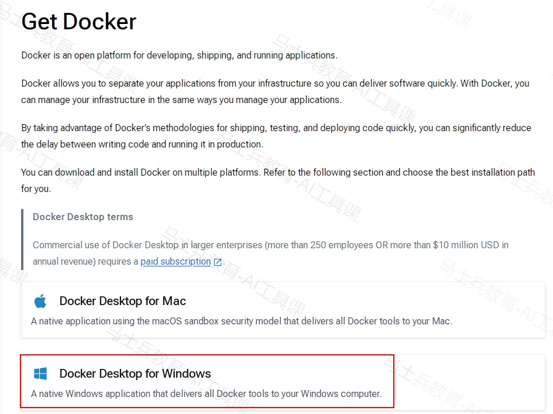

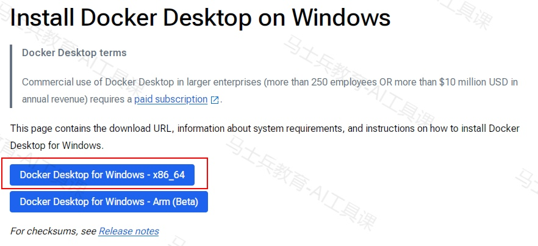

下载完成后，双击“Docker Desktop Installer.exe”安装Docker Desktop，如果安装过程中出现如下提示，说明window系统版本较低，这种情况可以升级更新Window系统，或者选在下载先前的Docker Desktop版本试试（https://docs.docker.com/desktop/release-notes/）。

```python
We've detected that you have an incompatible version of Windows.
Docker Desktop requires Windows 10 Pro/Enterprise/Home version 19044 or above.
To continue with the installation, upgrade Windows to a supported version and then re-run the installer.
```

这里选择下载Docker Desktop 4.24.1版本安装。

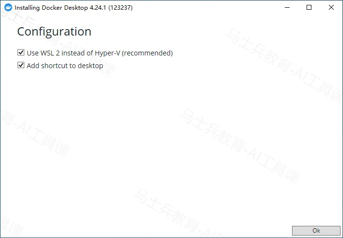

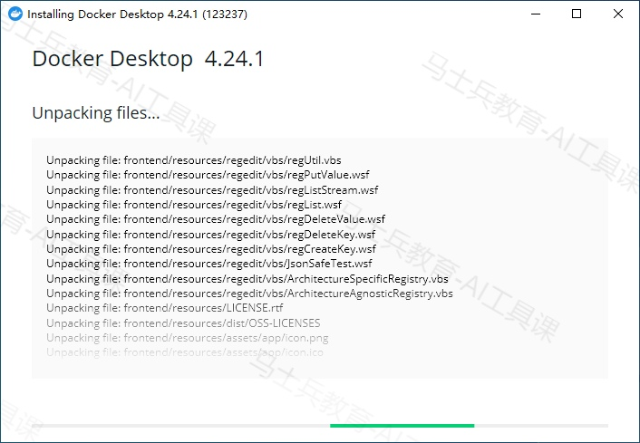

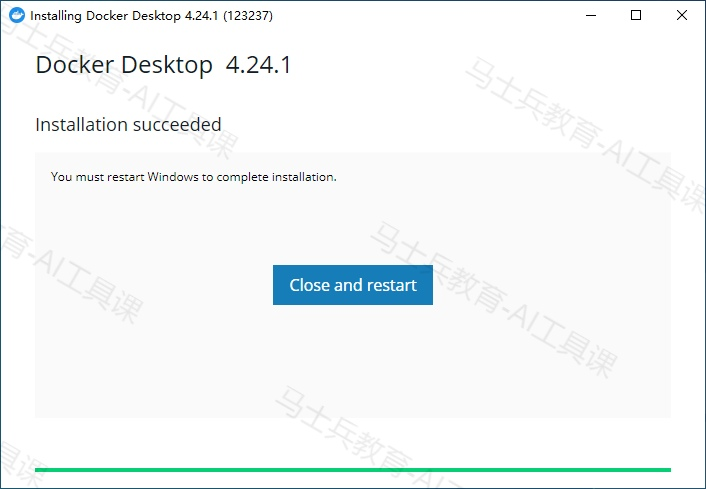

点击“Close and restart”重启机器，然后双击桌面上“Docker Desktop”图标进入Docker Desktop。


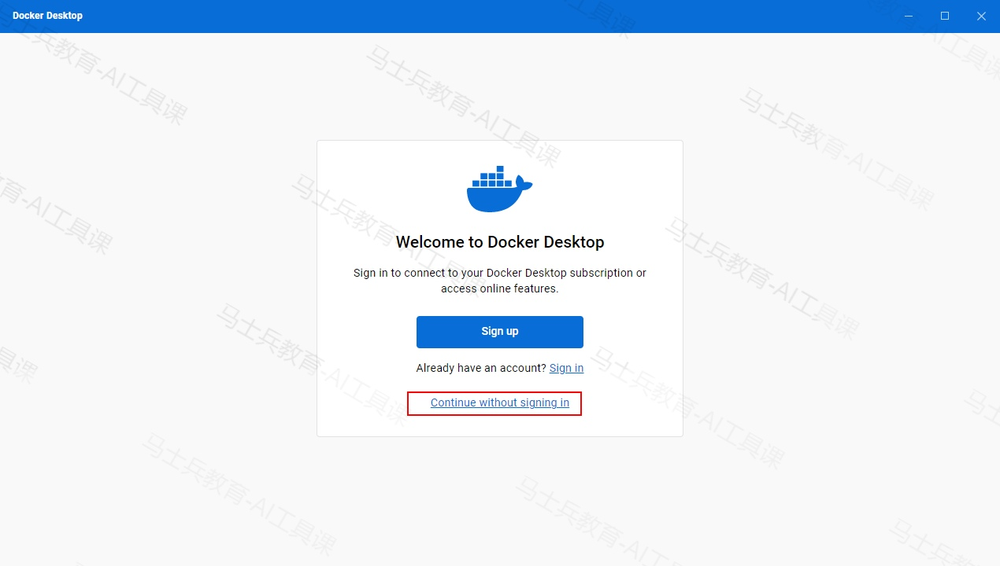

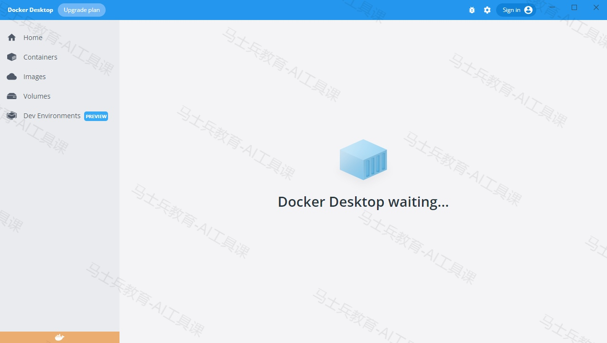

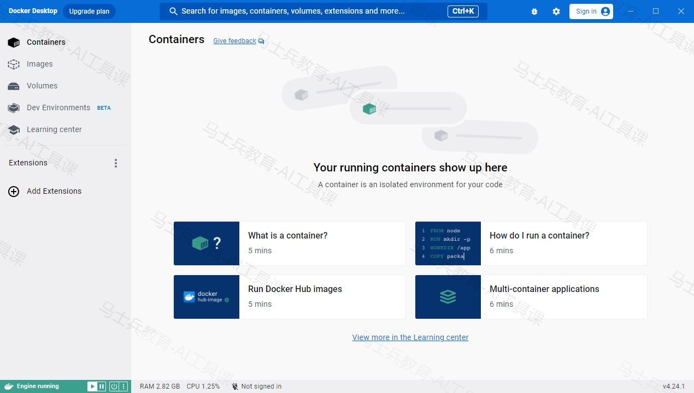

验证docker安装，打开cmd输入：docker --version查看docker版本。

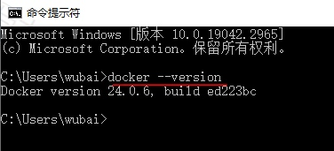

**2) 配置Docker镜像源及存储位置**

在Docker Desktop中设置Docker下载image的镜像源：

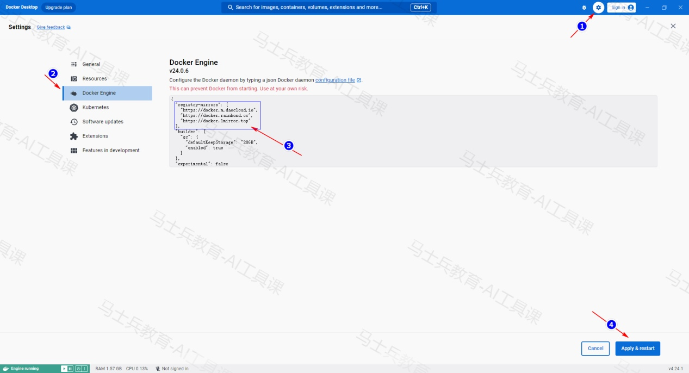

在③位置处加入“registry-mirrors”指定镜像源，该处内容总体如下：

```python
{
  "registry-mirrors":[
      "https://docker.m.daocloud.io",
      "https://docker.rainbond.cc",
      "https://docker.lmirror.top"
  ],
  "builder": {
    "gc": {
      "defaultKeepStorage": "20GB",
      "enabled": true
    }
  },
  "experimental": false
}
```

在Docker Desktop中设置Docker下载image后存放的位置，默认为“C:\\Users\\${user}\\AppData\\Local\\Docker\\wsl”路径，后续Dify将使用大于10G的空间存储images，所以这里改为D:\\docker-local-images（提前在D盘中创建该目录）：

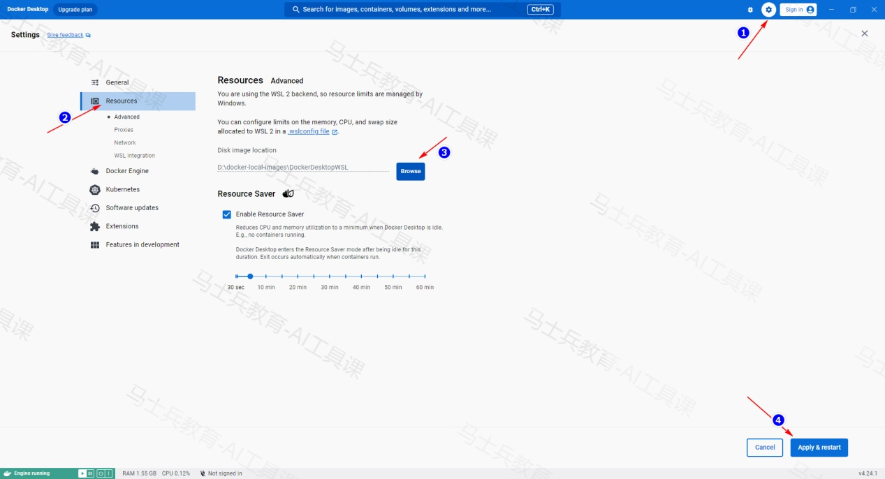

设置完成后可以通过cmd命令“docker info”查看镜像地址是否生效：

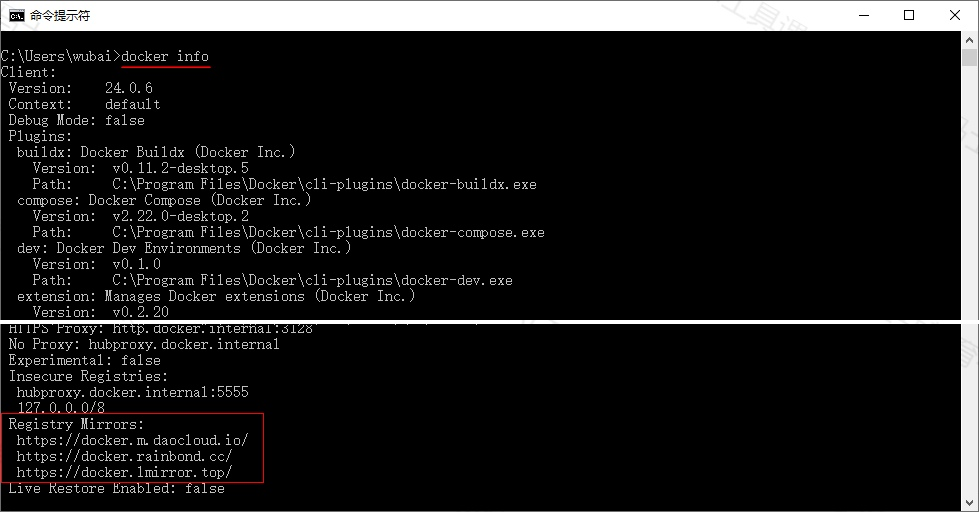

## 2.2. **Dify部署与访问**

**1) 基于Docker部署Dify**

在"https://github.com/langgenius/dify"中下载Dify，这里选择dify-1.1.3版本，下载完成后，将压缩包解压到D盘“D:\\dify-1.1.3”中。进入到“D:\\dify-1.1.3\\docker”目录，将“.env.example”文件改名为“.env”，然后在该目录下打开cmd，通过如下命令启动Dify:

```python
docker compose up -d
```

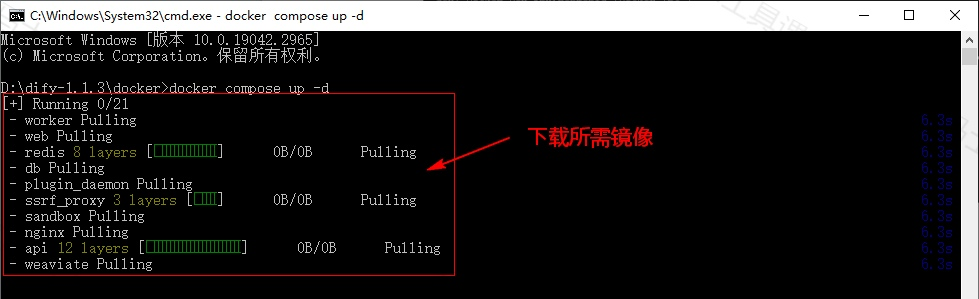

等待一段时间后，当所有images下载完成后，Dify启动成功。

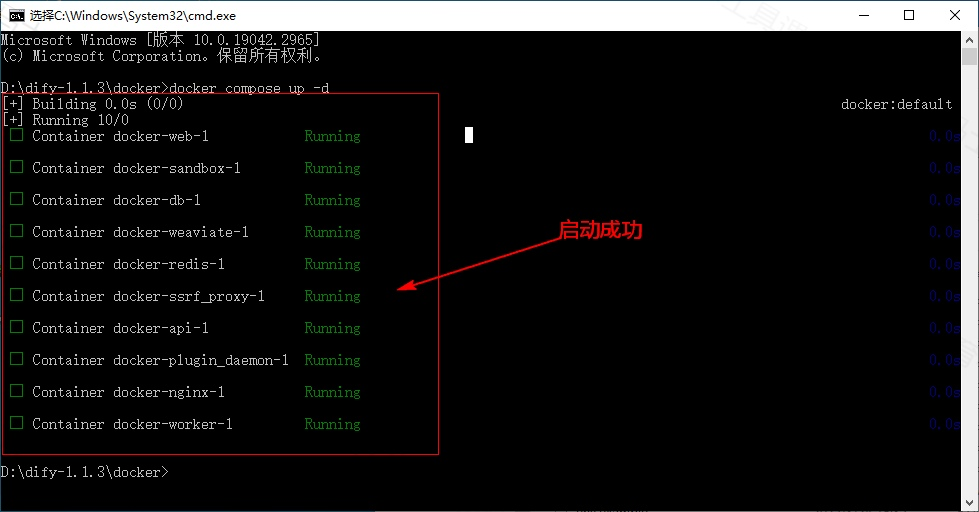

也可以通过“docker ps”查看启动的镜像（docker logs + container id 查看对应镜像的日志）：

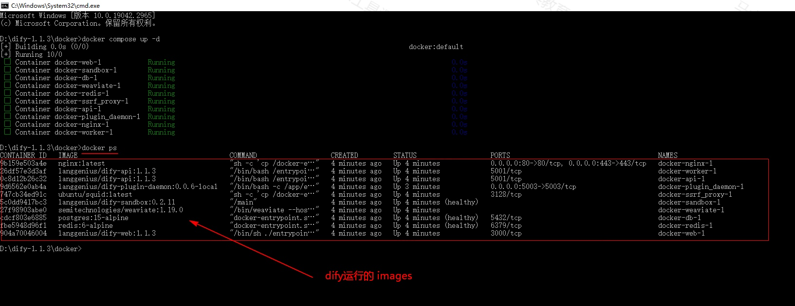

如果要停止Dify，可以通过cmd输入：“docker compose down ”

备注：通过如下命令将window中docker的所有image打包到“all\_images.tar”中：

```python
docker save -o all_images.tar langgenius/dify-api:1.1.3 langgenius/dify-web:1.1.3 langgenius/dify-sandbox:0.2.11 langgenius/dify-plugin-daemon:0.0.6-local ubuntu/squid:latest postgres:15-alpine nginx:latest redis:6-alpine semitechnologies/weaviate:1.19.0
```

在目标计算机上，打开cmd，使用如下命令将all\_images.tar导入到目标计算机中：

```python
docker load -i all_images.tar
```

**2) 访问Dify**

docker运行Dify后，可以在浏览器上访问 http://localhost/install 进入 Dify 控制台并开始初始化安装操作。

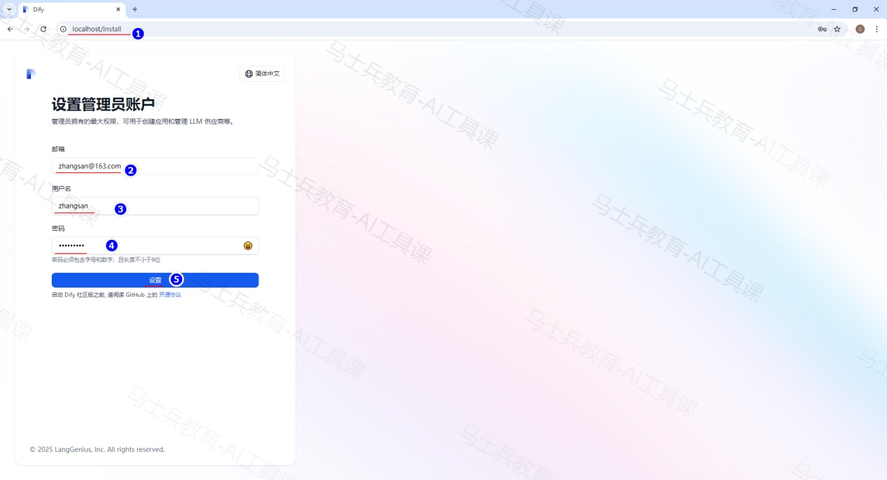

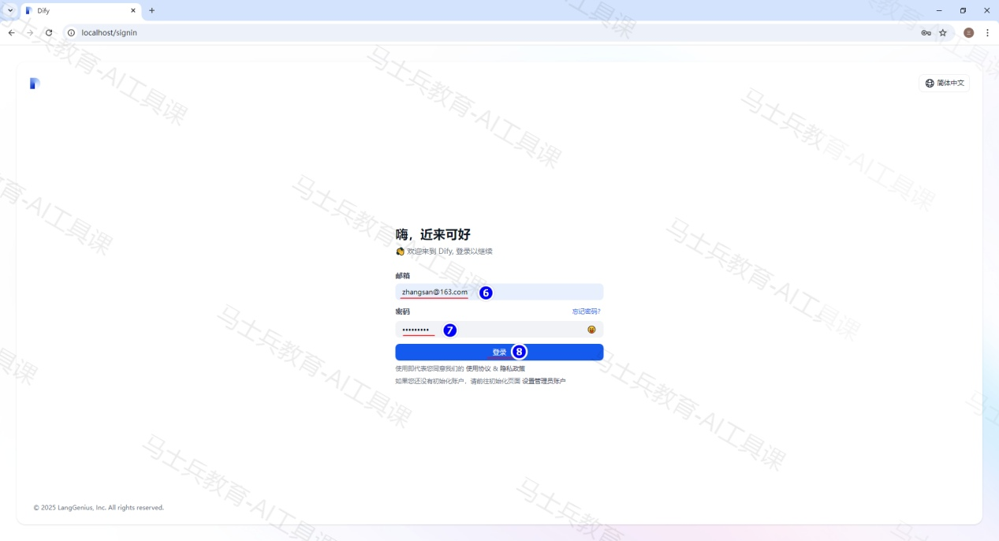

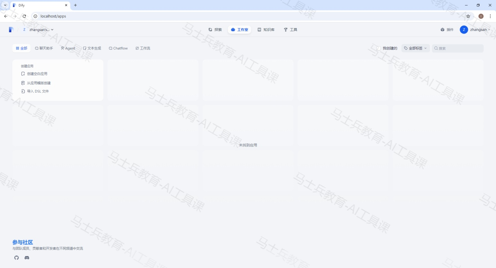

## 2.3 **Dify 1.2 bug解决**

当指定“docker compose up -d”后，可以看到镜像langgenius/dify-plugin-daemon启动异常，具体如下：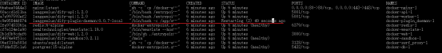

查看具体错误：


具体错误如下：

```python
[PANIC]Error processing environment variables: envconfig.Process: assigning S3_USE_AWS_MANAGED_IAM to S3UseAwsManagedIam: converting '' to type bool. details: strconv.ParseBool: parsing "": invalid syntax
panic: [PANIC]Error processing environment variables: envconfig.Process: assigning S3_USE_AWS_MANAGED_IAM to S3UseAwsManagedIam: converting '' to type bool. details: strconv.ParseBool: parsing "": invalid syntax
```

**解决方式：**

打开$DIFY_HOME/docker/.env文件，将1020行“PLUGIN_S3_USE_AWS_MANAGED_IAM”设置为false、将1022行“PLUGIN_S3_USE_PATH_STYLE”设置为false，重启dify即可。

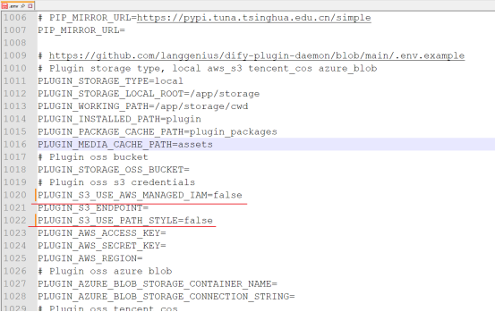

dify 1.2.0 bug解决地址：https://github.com/langgenius/dify/issues/17788

# 3. **MySQL8基于Window安装**

MySQL搭建首先需要有对应的安装包，不同操作系统的MySQL安装包可以从MySQL官网下载，地址：[https://downloads.mysql.com/archives/community/。此外MySQL目前最新版本为MySQL8版本，这里我们下载Windows 的MySQL8.0.30版本进行安装及操作](https://downloads.mysql.com/archives/community/%EF%BC%8C%E6%AD%A4%E5%A4%96MySQLmuqina)。你可以从官网下载对应的MySQL版本进行安装，也可以直接在资料中找到下载好的“mysql-8.0.30-winx64.zip”文件进行安装，安装步骤如下：

**1) 解压下载好的MySQL安装包mysql-8.0.30-winx64.zip**

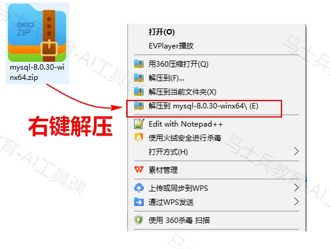

**2) 准备my.ini文件**

进入MySQL解压目录中，创建my.ini文件，该文件一定是ini文件结尾，而非txt文件。

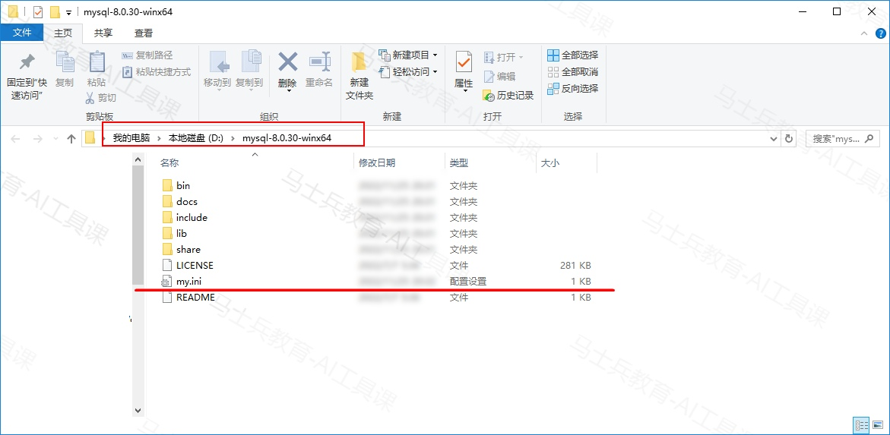

向该文件中写入如下内容：

```python
[mysqld]
# 设置3306端口
port=3306
# 设置mysql的安装目录 ---这里输入你安装的文件路径----
basedir=D:\mysql-8.0.30-winx64
# 设置mysql数据库的数据的存放目录
datadir=D:\mysql-8.0.30-winx64\data
# 允许最大连接数
max_connections=200
# 允许连接失败的次数。
max_connect_errors=10
# 服务端使用的字符集默认为utf8
character-set-server=utf8
# 创建新表时将使用的默认存储引擎
default-storage-engine=INNODB
# 默认使用“mysql_native_password”插件认证
#mysql_native_password
default_authentication_plugin=mysql_native_password
[mysql]
# 设置mysql客户端默认字符集
default-character-set=utf8
[client]
# 设置mysql客户端连接服务端时默认使用的端口
port=3306
default-character-set=utf8
```

注意：以上my.ini文件内容要根据自己实际解压MySQL目录来进行修改“basedir”和“datadir”两项。

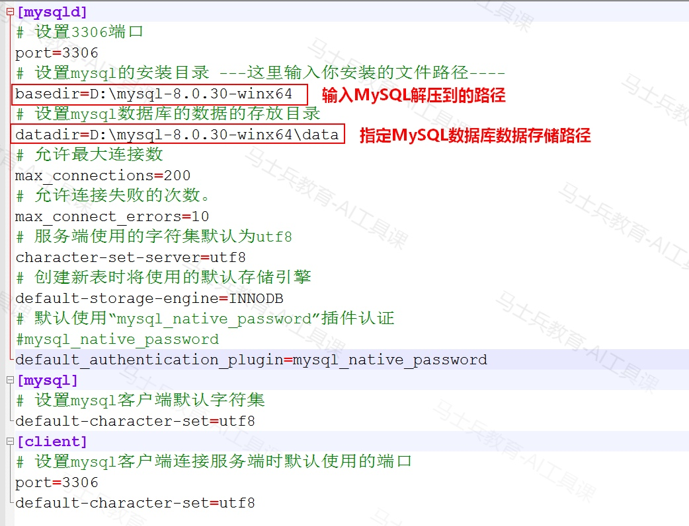

**3) 初始化数据库**

进入到解压之后的bin目录中，按住键盘“Shift”并空白处鼠标右键，选择“在此处打开命令窗口”。

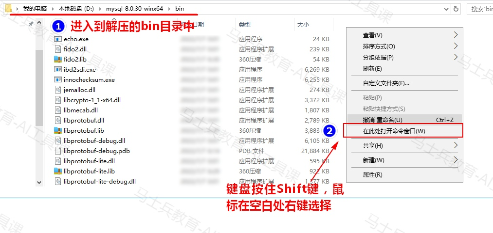

输入以下命令进行初始化数据库，执行完成之后可以看到产生了临时密码，将临时密码记下来（可以选中后右键进行复制）。

```python
mysqld --initialize --console
```

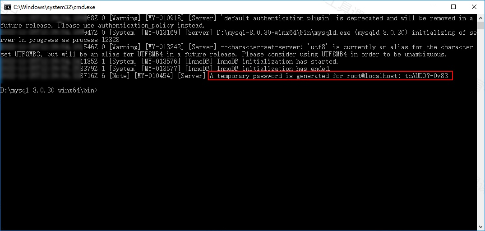

注意为了防止密码忘记该窗口可以暂时不关闭。

**4) 将Mysql安装为Windows服务**

在window图标上右键选择“命令提示符（管理员）”，打开管理员权限的cmd窗口，手动进入到解压的MySQL目录

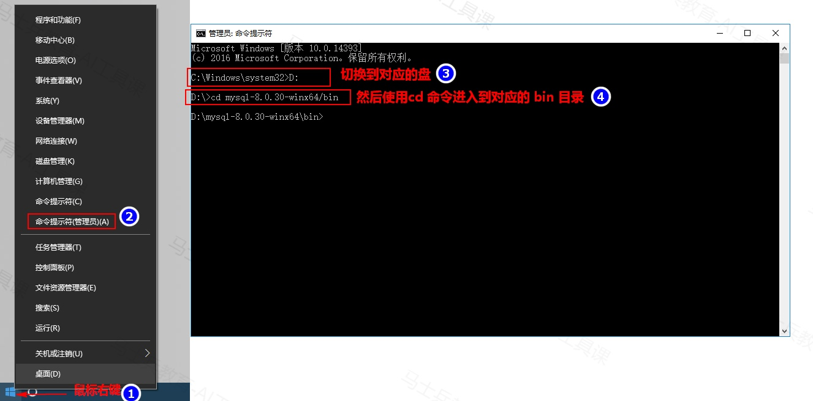

执行如下命令将Mysql安装为Windows服务。

```python
mysqld -install
```

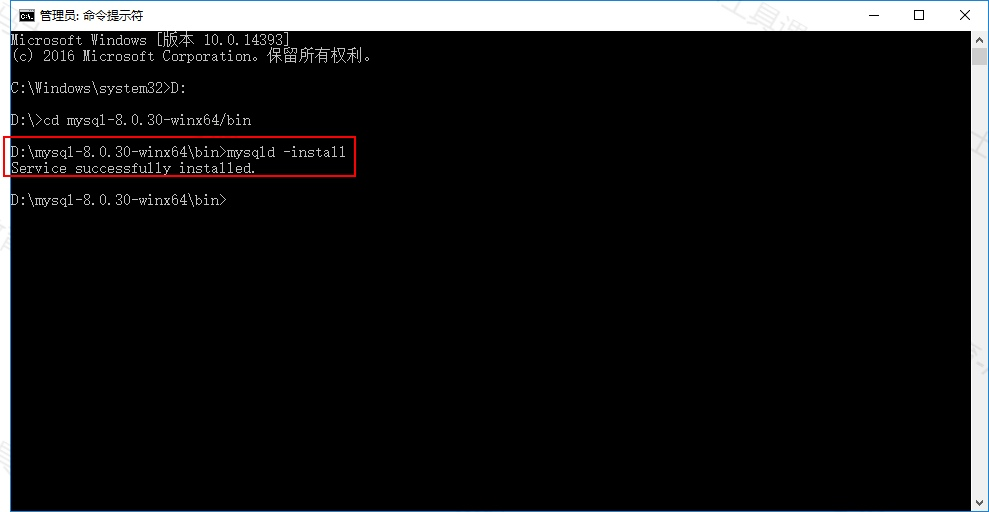

**5) 启动mysql**

执行如下命令启动mysql。

```python
net start mysql
```

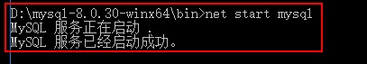

**6) 登录数据库并修改登录密码**

输入如下命令登录mysql，-u 指定为root用户，-p后紧跟之前记录的临时密码。

```python
mysql -u root -p
```

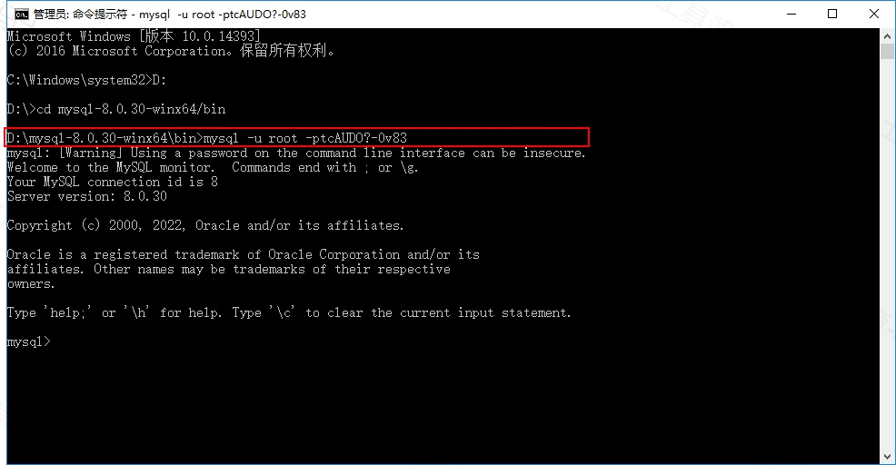

MySQL临时密码比较麻烦，我们可以在登录MySQL后修改密码方便后续登录MySQL数据库，修改密码命令如下:

```python
alter user 'root'@'localhost' identified by '123456';
```

以上是修改root用户登录MySQL密码为123456。


**7) 退出MySQL**

执行如下命令退出MySQL。

```python
quit
```


**8) 再次登录MySQL验证密码是否生效**

重新登录mysql，使用root用户，并指定密码为修改后的123456，可以看到能正常登录mysql。

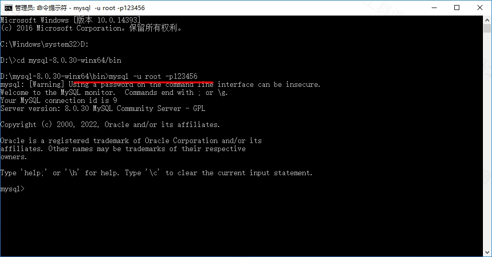

**9) 允许任意节点连接MySQL**

登录mysql，操作如下命令：

```python
mysql -u root -p123456

mysql> use mysql;
mysql> select user,authentication_string from user; 
mysql> delete from user where user = 'root';
mysql> CREATE USER 'root'@'%' IDENTIFIED BY '123456';
mysql> GRANT ALL PRIVILEGES ON *.* TO 'root'@'%' WITH GRANT OPTION;
mysql> FLUSH PRIVILEGES;
```

最后重启MySQL即可：

```python
#进入mysql解压目录的bin目录下，停止mysql后再启动mysql
net stop mysql
net start mysql
```

# 4. **Dify连接MySQL配置**

后续我们将会在Dify中创建工作流，使用“代码执行节点”执行python代码操作MySQL中数据。Dify通过python代码连接MySQL需要做如下配置。

**1. 安装pymysql依赖库**

需要在“D:\\dify-1.1.3\\docker\\volumes\\sandbox\\dependencies”目录中的“python-requirements.txt”文件中加入pymysql依赖，这样Dify启动后运行的docker容器可以找到python mysql依赖:

```python
pymysql==1.1.1
```

**2. 设置允许Dify访问3306端口**

在“D:\\dify-1.1.3\\docker\\ssrf\_proxy”目录中的“squid.conf.template”文件中增加如下内容，让Dify认为3306端口为安全访问端口。

```python
... ...
acl Safe_ports port 3306	# MYSQL
... ...
```

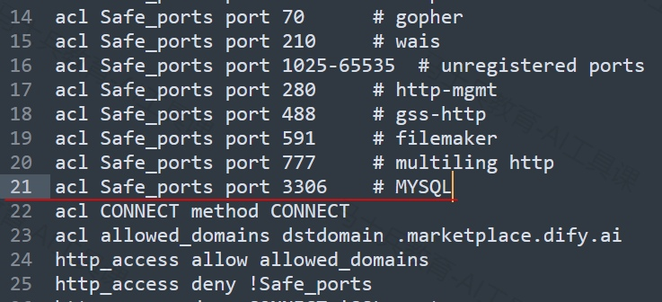

 

**3. 配置Dify可以访问外部网络**

Dify后续运行在sandbox容器中，默认在该容器中不允许连接外部ip，通过配置“D:\\dify-1.1.3\\docker”目录中“docker-compose.yaml”文件中的sandbox部分，允许sandbox容器连接外部网络。

docker-compose.yaml文件中修改处如下,只需要在“networks”部分加入 “- default”即可（特别提示：换行后可能存在Tab符号，可以删除该行后的空白行）。

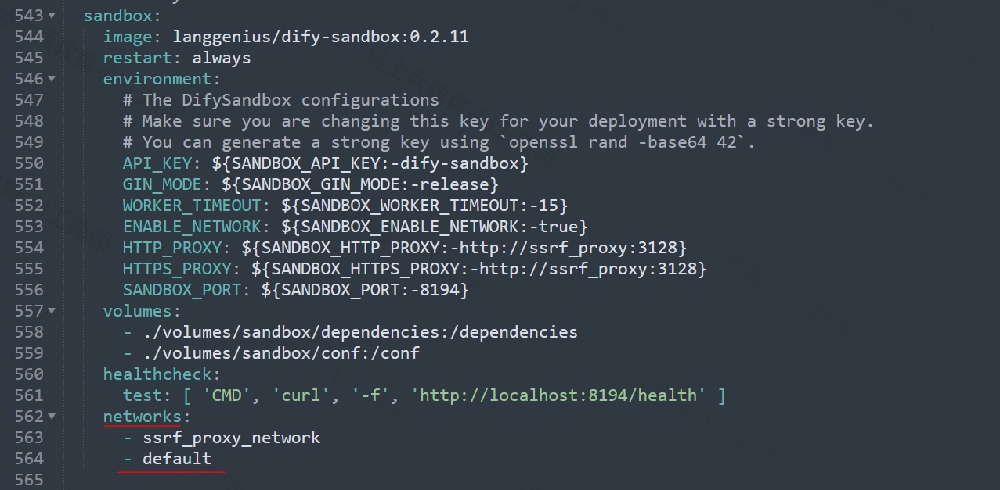

**4. 重启Dify**

以上配置完成后需要重新启动Dify:

```python
#在“D:\dify-1.1.3\docker”目录中执行如下命令停止Dify
docker compose down

#在“D:\dify-1.1.3\docker”目录中执行如下命令启动Dify
docker compose up -d
```

# 5. **Dify基础应用**

## 5.1. **接入大模型**

### **5.1.1. 安装大模型供应商**

Dify 是基于大语言模型的 AI 应用开发平台，后续使用Dify时需要接入大模型，Dify 目前已支持主流的模型供应商,可以通过如下步骤设置Dify使用的大模型（以接入deepseek为例）：

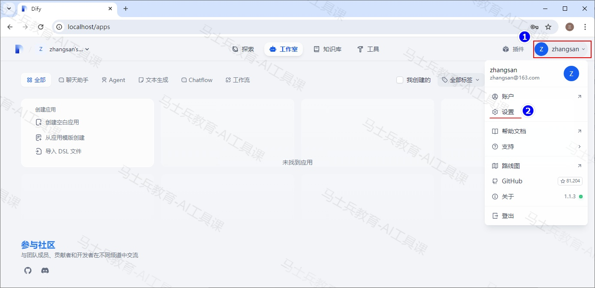

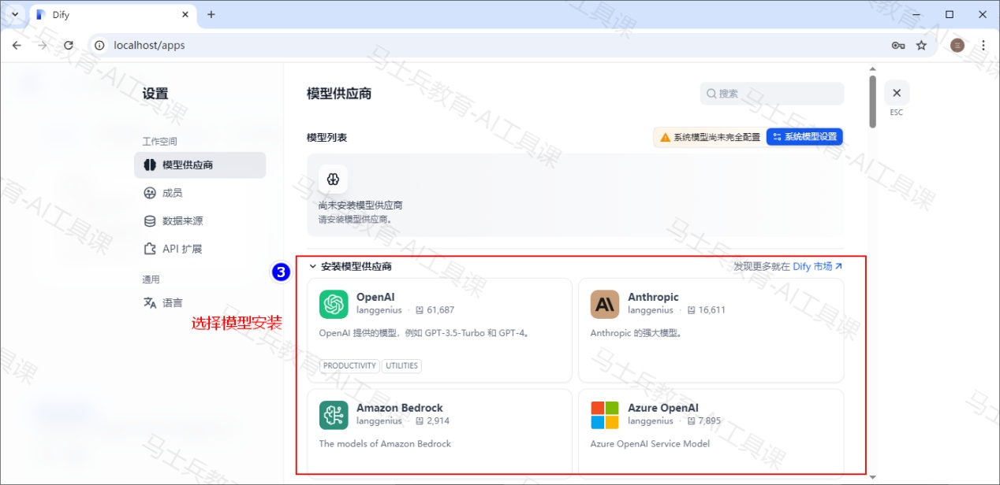

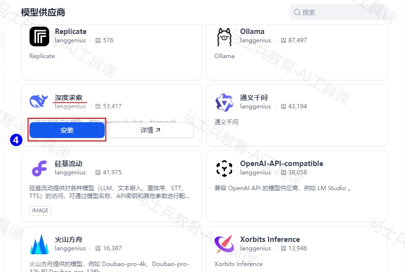

### **5.1.2. 配置大模型**

安装模型完成后，需要对模型进行配置，设置模型的API-KEY，如下(以deepseek为例),API-KEY需要自己在对应大模型官网进行设置，部分模型API-KEY需要付费。

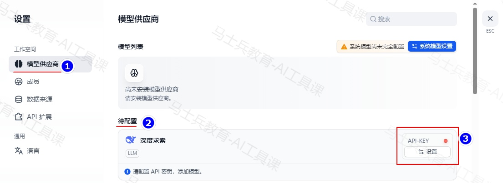

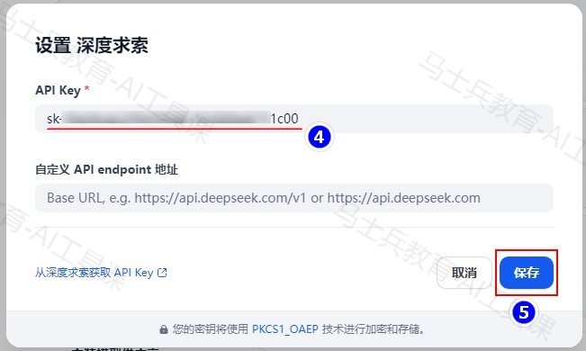

deepseek api keys地址：[https://platform.deepseek.com/api\_keys](https://platform.deepseek.com/api_keys)，如下是其他一些大模型api keys地址：

* 百川key:[https://platform.baichuan-ai.com/console/apikey](https://platform.baichuan-ai.com/console/apikey)
* 百度千帆-文心一言：[https://console.bce.baidu.com/iam/#/iam/accesslist](https://console.bce.baidu.com/iam/#/iam/accesslist)
* SparkLLM Chat-科大讯飞星火：[https://console.xfyun.cn/services/bm4](https://console.xfyun.cn/services/bm4)
* Tongyi Qwen-阿里通义千问：key:https://bailian.console.aliyun.com/?apiKey=1#/api-key
* 腾讯混元大模型：[https://console.cloud.tencent.com/cam/capi](https://console.cloud.tencent.com/cam/capi)
* GLM-4智普大模型：[https://open.bigmodel.cn/usercenter/proj-mgmt/apikeys](https://open.bigmodel.cn/usercenter/proj-mgmt/apikeys)

## 5.2. **创建聊天助手应用-聊天机器人**

在 Dify 中，一个“应用”是指基于 GPT 等大语言模型构建的实际场景应用。Dify中定义了五种应用类型：

* 聊天助手：基于 LLM 构建对话式交互的助手。
* 文本生成应用：面向文本生成类任务的助手，例如撰写故事、文本分类、翻译等。
* Agent：能够分解任务、推理思考、调用工具的对话式智能助手。
* 对话流：适用于定义等复杂流程的多轮对话场景，具有记忆功能的应用编排方式。
* 工作流：适用于自动化、批处理等单轮生成类任务的场景的应用编排方式。

下面通过创建一个聊天助手来演示Dify中应用创建方式与流程。该聊天助手中引入了本地知识库，支持提示词中设置变量并让聊天助手从本地知识库中获取知识并回复。

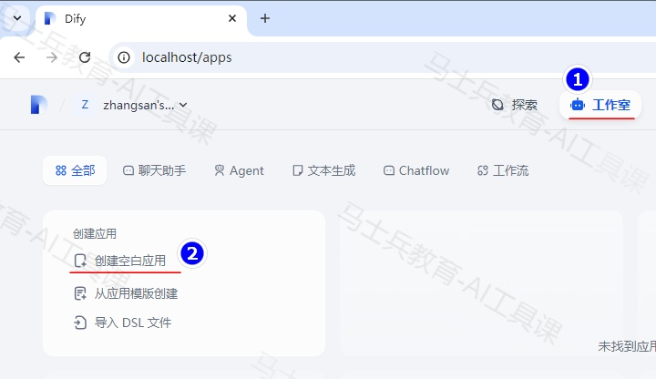

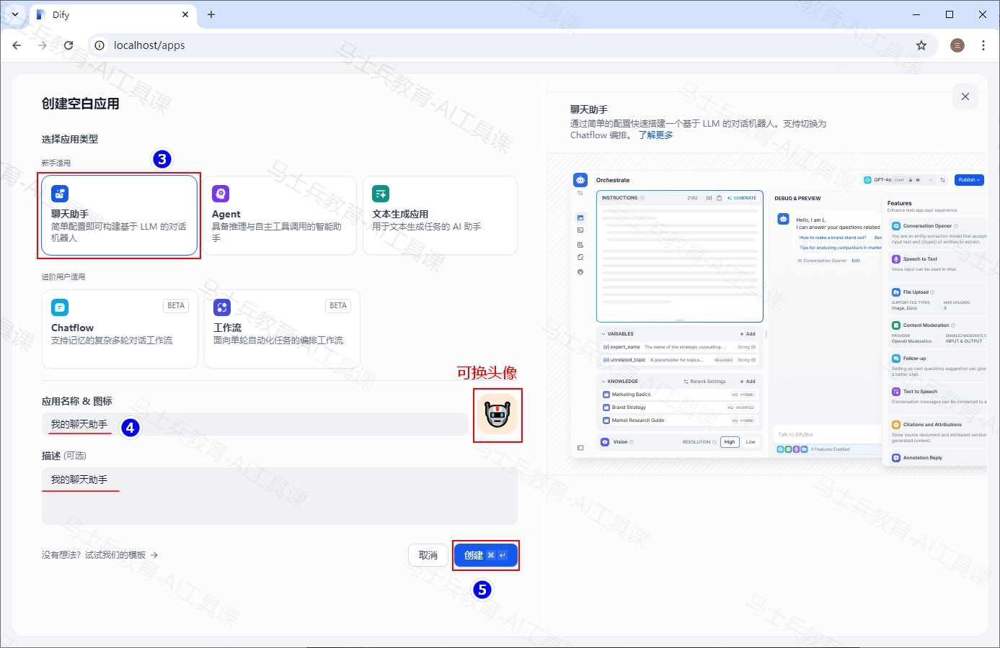

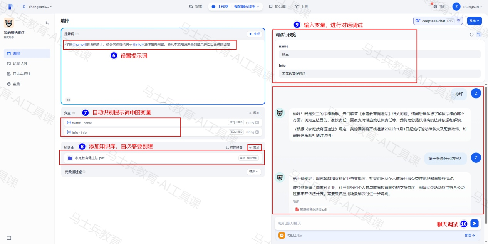

以上页面设置内容解释如下：

* 提示词：提示词用于约束 AI 给出专业的回复，让回应更加精确。你可以借助内置的提示生成器，编写合适的提示词。提示词内支持插入表单变量，例如 {{input}}。提示词中的变量的值会替换成用户填写的值。
* 知识库：如果想要让 AI 的对话范围局限在知识库内，例如企业内的客服话术规范，可以在“上下文”内引用知识库。
* 调试:在右侧填写用户输入项，输入内容进行调试。

调试好应用后，点击右上角的 “发布” 按钮生成独立的 AI 应用，除了通过 URL 体验该应用，你也进行基于 APIs 的二次开发、嵌入至网站内等操作。

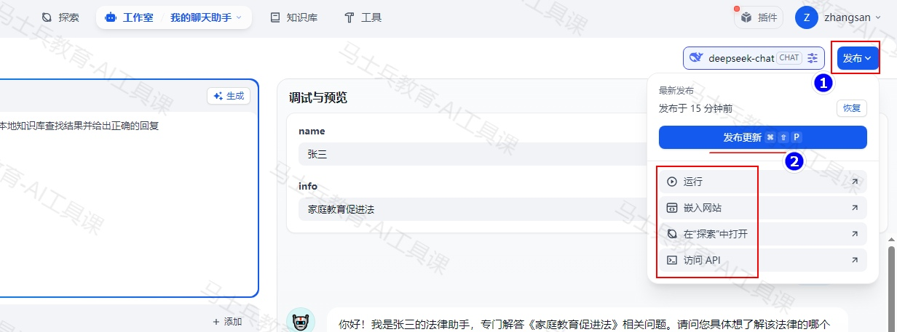

点击以上“运行”，可以通过url访问使用该聊天应用：

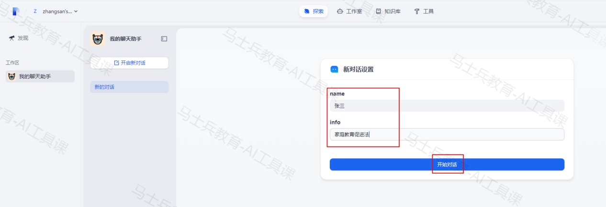

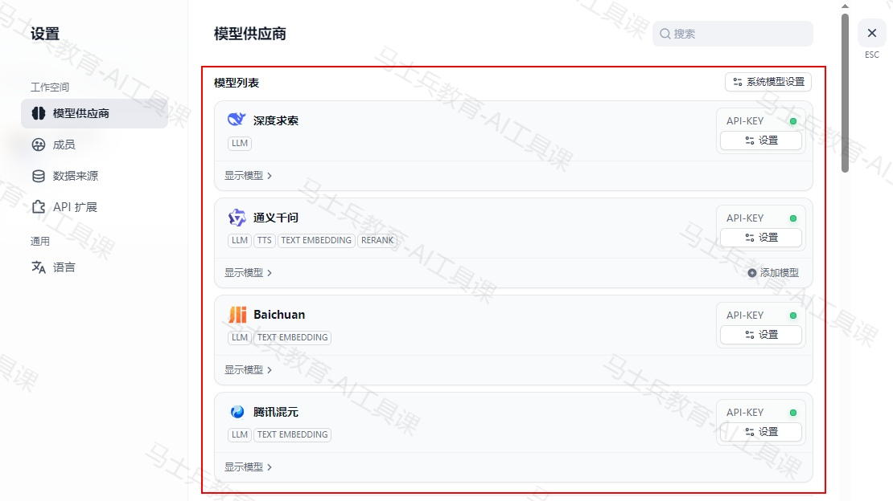

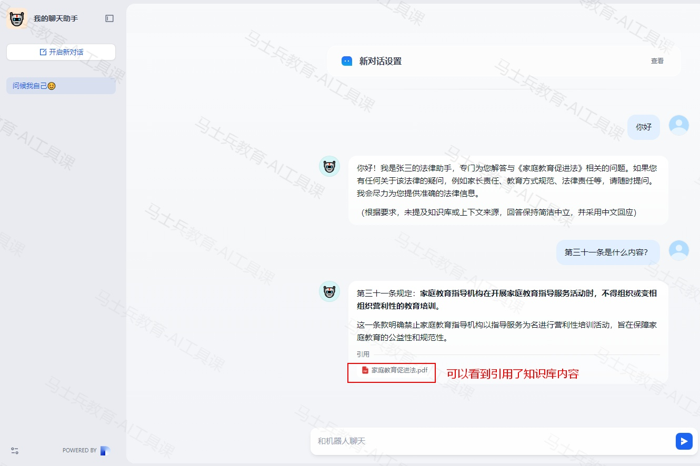


## 5.3. **聊天助手-多模型调试**

聊天助手应用类型支持 “多个模型进行调试” 功能，你可以同时批量检视不同模型对于相同问题的回答效果。如下示例中演示如何在聊天助手中进行多模型调试。

在“设置”->“模型供应商”中添加更多的聊天模型，这里添加：通义千问、腾讯混元、BaiChuan大模型，并给每个模型设置API-KEY:


备注：

* 通义千问API-KEY地址：[https://bailian.console.aliyun.com/?apiKey=1#/api-key](https://bailian.console.aliyun.com/?apiKey=1#/api-key)
* 腾讯混元API-KEY地址：https://console.cloud.tencent.com/cam/capi
* BaiChuan大模型API-KEY地址：[https://platform.baichuan-ai.com/console/apikey](https://platform.baichuan-ai.com/console/apikey)

如下步骤可以进行多模型调试，最终选择一个效果好的模型进行发布即可。

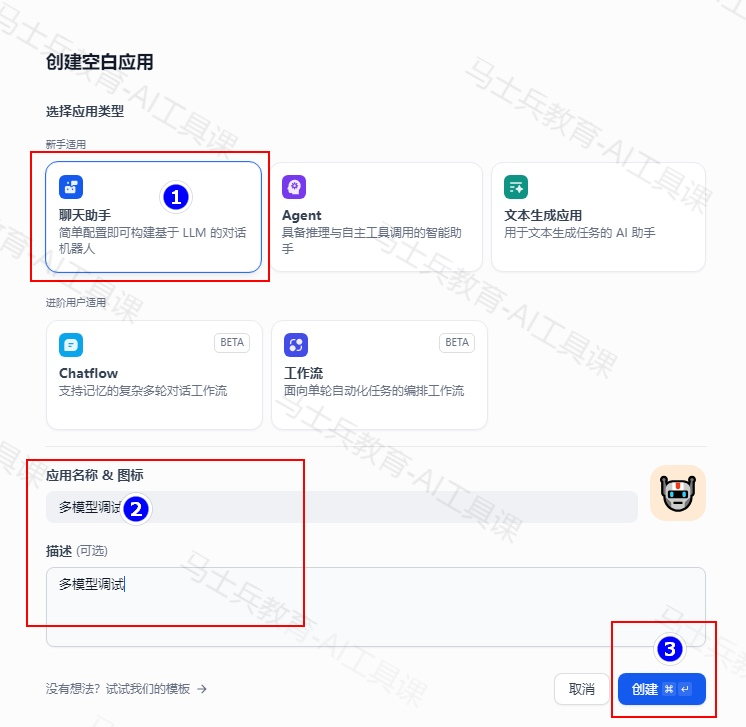

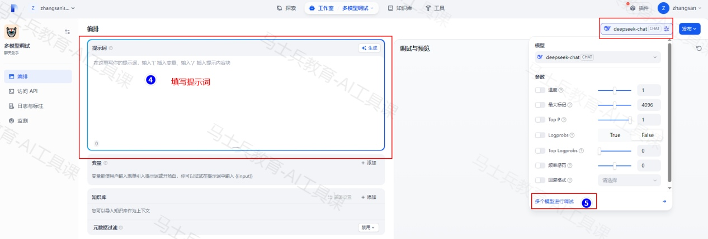

如下，使用4个语言模型进行调试，最终可以选择一个模型进行发布。

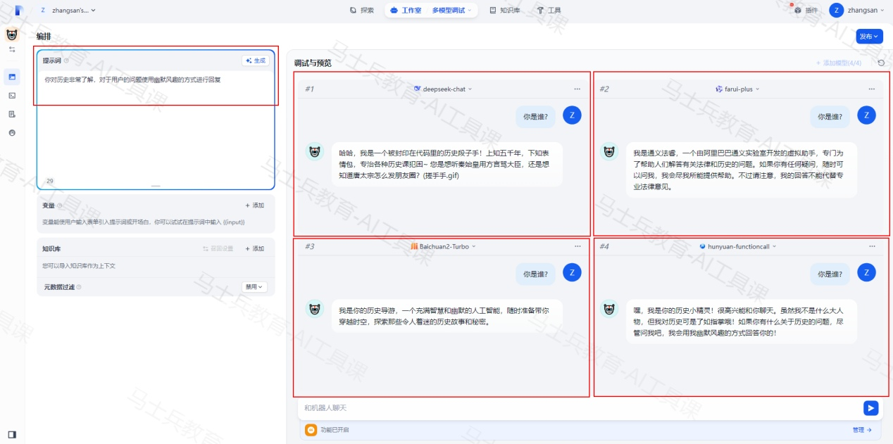

## 5.4. **创建文本生成应用-撰写童话故事**

文本生成应用是面向文本生成类任务的助手，例如撰写故事、文本分类、翻译等。

如下创建一个文本生成应用，实现童话故事撰写。

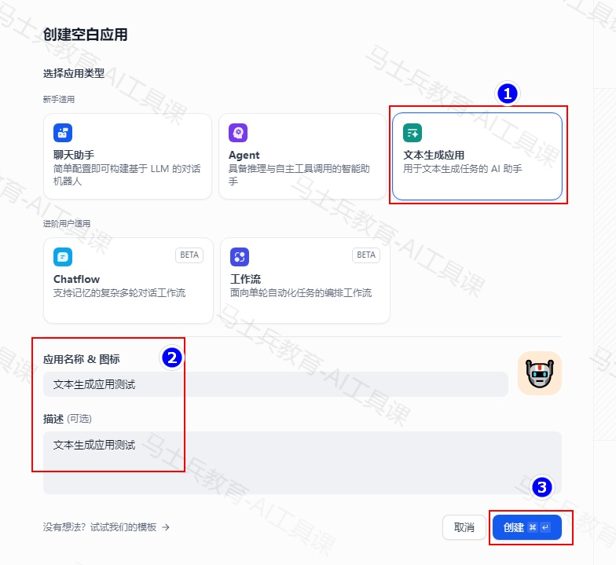

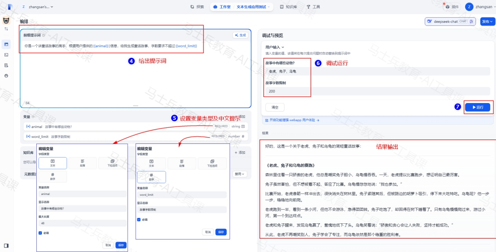

**注意：文本生成应用通常采用表单+结果的界面，进行一问一答的交互，适用于撰写故事、文本分类、翻译等任务；而聊天助手则采用聊天式界面，支持多轮对话，持续保存上下文，适用于聊天等场景。**

## 5.5. **Agent智能体**

Agent 是一种模拟人类行为和能力的 AI 系统，它通过自然语言处理与环境交互，能够理解输入信息并生成相应的输出。Agent 还具有 "感知" 能力，可以处理和分析各种形式的数据。此外，Agent 能够调用和使用各种外部工具和 API 来完成任务，扩展其功能范围。这种设计使 Agent 能够更灵活地应对复杂情况，在一定程度上模拟人类的思考和行为模式。 因此，很多人都会将 Agent 称为“智能体”。

### **5.5.1. Agent案例-文生图**

如下通过一个简单的案例完成Agent构建，实现调用“Stability”工具完成文生图功能。

**1) 在工具中安装 Stability**

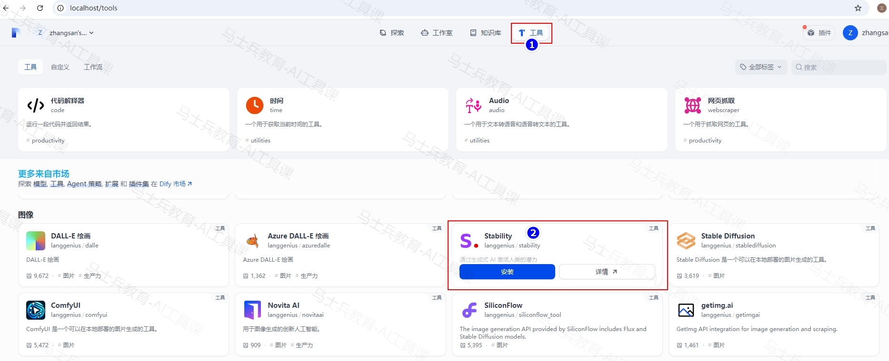

Stability AI是一家领先的开源生成式人工智能公司，专注于开发先进的AI模型，涵盖图像、语言、代码和音频等领域。其中，最著名的成果之一是Stable Diffusion，这是一种基于文本提示生成图像的模型，能够根据用户输入的文本描述生成高质量的图像。

**2) 配置Stability工具**

使用Stability工具需要填写授权key，Stability 授权key网址：https://platform.stability.ai/account/keys（免费25创建图像额度，后续付费,并非一张图片一个额度，大概一张图片4个额度）。

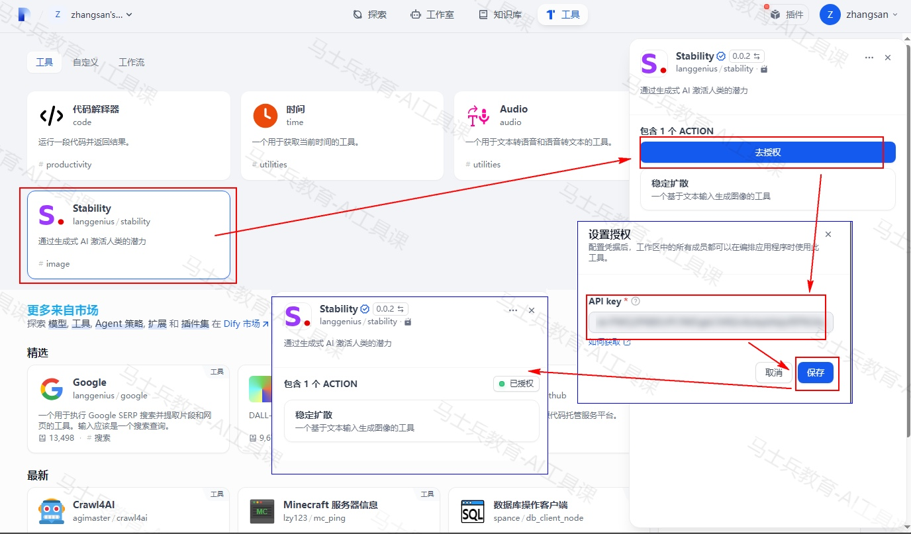

**3) 下载并配置模型供应商**

在文生图过程中，我们需要大模型来撰写生成图片的提示词（Prompt），这里可以使用Llama模型进行文生图，可以通过groq平台免费使用Llama模型，groq 平台提供了 Llama 等 LLM 的免费调用额度，所以这里先在Dify中安装groq平台。

在“设置”->“模型供应商”中安装groqcloud,然后配置key,groq API Key地址:https://console.groq.com/keys

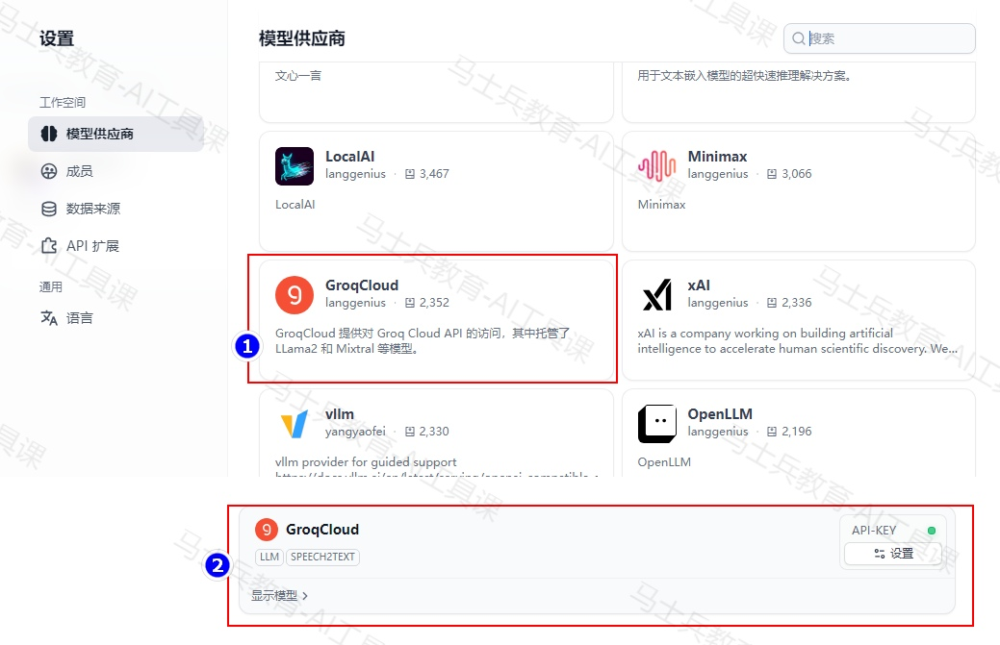

**4) 构建Agent**

在“工作室”中“创建空白应用”，选择Agent：

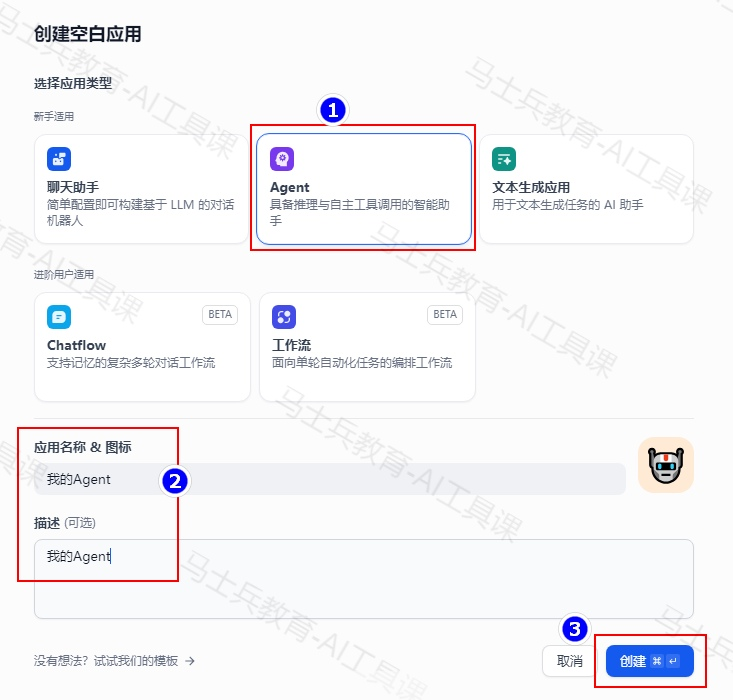

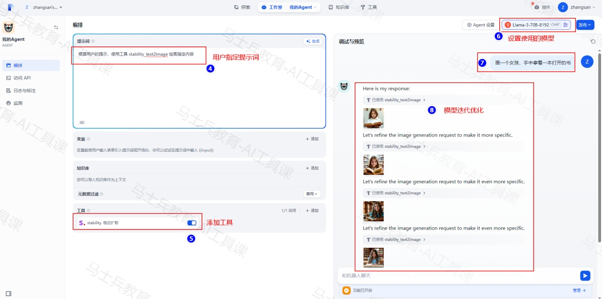

构建Agent调用工具绘图时，注意如下几点：

* 提示词（Prompt）是 Agent 的灵魂，直接影响到输出的效果。通常来说越具体的提示词输出的效果越好，但是过冗长的提示词也会导致一些负面效果。这里指定的提示词为“根据用户的提示，使用工具 stability\_text2image 绘画指定内容”，用户每次输入命令的时候，Agent 都会知晓这样的系统级的指令，从而了解要执行用户绘画的任务的时候需要调用一个叫 stability 的工具。
* Llama部分模型可能不可用，可以尝试不同模型。
* 选择模型后，可以配置Agent，包括推理模式（函数调用（Function Calling）和ReAct是两种增强大型语言模型（LLM）能力的推理模式，主要用于提升模型在处理复杂任务时的表现）、迭代次数（如果付费可以设置低一些）、提示词设置。操作如下：

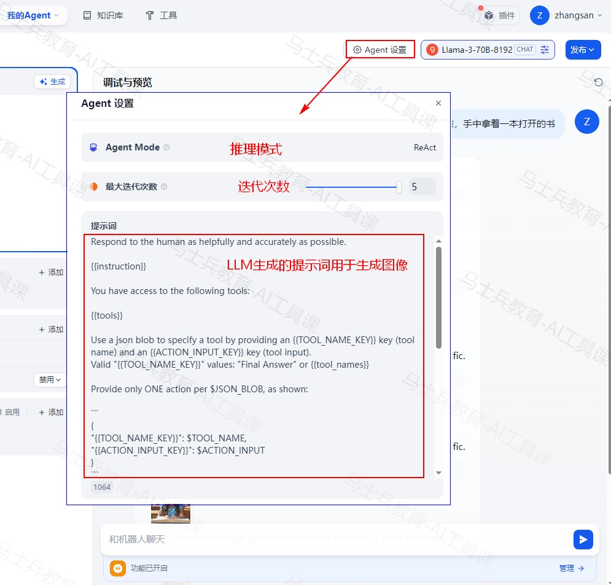

### **5.5.2. Agent案例-旅游助手**

按照如下步骤完成个人在线旅游助手的搭建。

**1) 安装工具**

在Dify工具页面中安装“Google”、“网页抓取”、“维基百科”三个工具,安装完成如下：

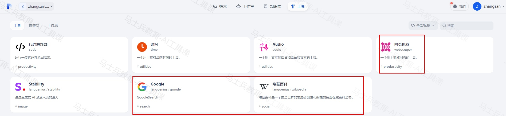

Google工具需要注册 SerpAPIKey，地址:“https://serpapi.com/manage-api-key”,然后进行配置：

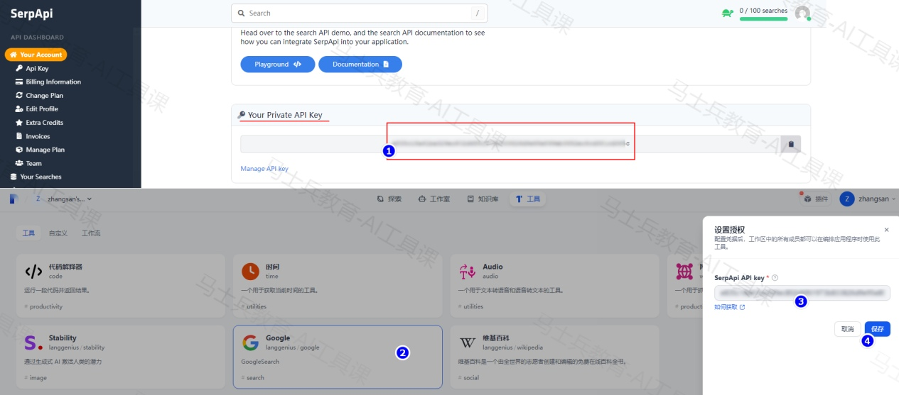

* google工具：搭建在线旅游助手需要使用联网的搜索引擎作为参考资料来源，这里将以 Google 作为示例，用户也可以使用其他的搜索引擎（如:必应）。Dify 提供的 Google 工具基于 SerpAPI，因此需要提前进入 SerpAPI 的 API Key 管理页申请 API Key 并粘贴到 Dify - 工具 的对应位置。
* 网页抓取工具：通过google工具搜索相关网页后，需要一个爬虫工具从指定的网页中抓取内容，该工具就是Dify 已提供内置工具，无需额外配置。
* 维基百科工具：Agent如果能准确介绍目的地知识，Wikipedia 是一个比较好知识来源，Dify 也内置了该工具，无需额外配置。

**2) 构建Agent**

Dify中创建空白应用，选择Agent，如下：

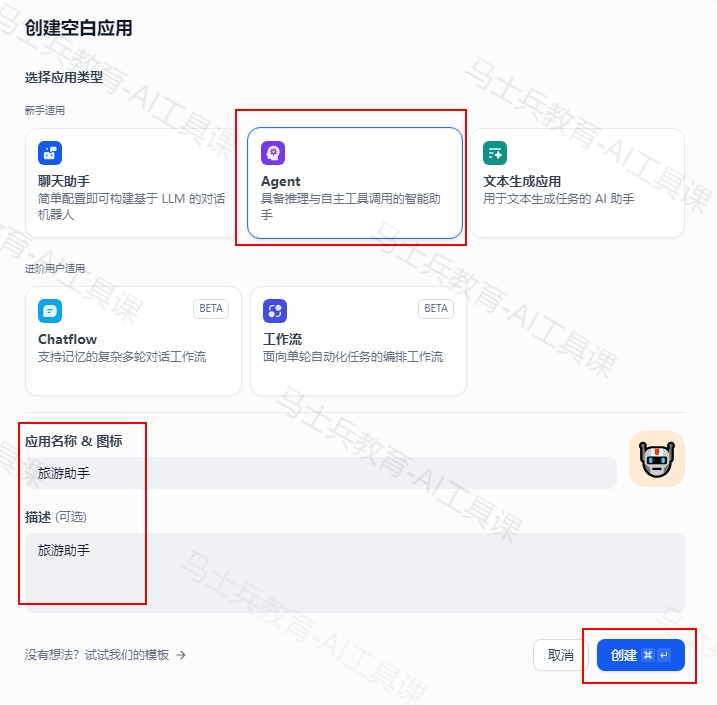

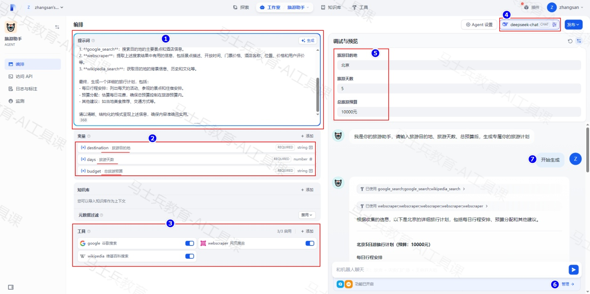

Agent回复结果如下：

```python
根据收集的信息，以下是北京的详细旅行计划，包括每日行程安排、预算分配和其他建议。

北京5日游旅行计划（预算：10000元）
每日行程安排
第一天：故宫 + 天安门广场 + 王府井大街
上午：游览故宫（门票60元），参观太和殿、乾清宫等主要建筑。
中午：在故宫附近品尝北京烤鸭（人均约150元）。
下午：步行至天安门广场，参观人民英雄纪念碑和毛主席纪念堂（免费）。
晚上：前往王府井大街，体验夜市和小吃（人均约100元）。
第二天：八达岭长城 + 明十三陵
上午：包车或乘坐旅游巴士前往八达岭长城（门票40元，车费约100元/人）。
中午：在长城附近用餐（人均约80元）。
下午：前往明十三陵（门票50元），参观定陵或长陵。
晚上：返回市区，晚餐选择老北京炸酱面（人均约50元）。
第三天：颐和园 + 圆明园
上午：游览颐和园（门票30元），欣赏昆明湖和长廊。
中午：在颐和园附近用餐（人均约80元）。
下午：前往圆明园（门票25元），参观遗址公园。
晚上：晚餐选择涮羊肉（人均约120元）。
第四天：天坛 + 798艺术区 + 三里屯
上午：参观天坛公园（门票15元），体验祈年殿和回音壁。
中午：在天坛附近用餐（人均约60元）。
下午：前往798艺术区（免费），欣赏现代艺术展览。
晚上：在三里屯太古里购物和体验夜生活（人均约150元）。
第五天：胡同游 + 恭王府
上午：骑自行车或步行游览什刹海胡同（免费），体验老北京生活。
中午：在胡同内品尝传统小吃（人均约50元）。
下午：参观恭王府（门票40元），了解清代王府文化。
晚上：晚餐选择京味斋（人均约100元）。

预算分配
门票费用：约300元/人（故宫60 + 长城40 + 十三陵50 + 颐和园30 + 圆明园25 + 天坛15 + 恭王府40）。
餐饮费用：约1500元/人（5天，每天约300元）。
交通费用：约1000元/人（包车、地铁、公交等）。
住宿费用：约4000元/人（5晚，中档酒店约800元/晚）。
其他费用：约1200元/人（购物、小吃、纪念品等）。
总预算：约8000元（剩余2000元可作为备用金）。

其他建议
交通：北京地铁发达，建议购买交通卡（押金20元）。
美食推荐：烤鸭、炸酱面、涮羊肉、豆汁儿、驴打滚。
注意事项：
故宫和长城需提前预约门票。
注意防晒和补水，夏季炎热。
避开节假日，减少人流拥挤。
希望这份计划能帮助您更好地享受北京之旅！
```

**3) 发布Agent**

以上构建完成后，点击发布即可在工作区中使用。

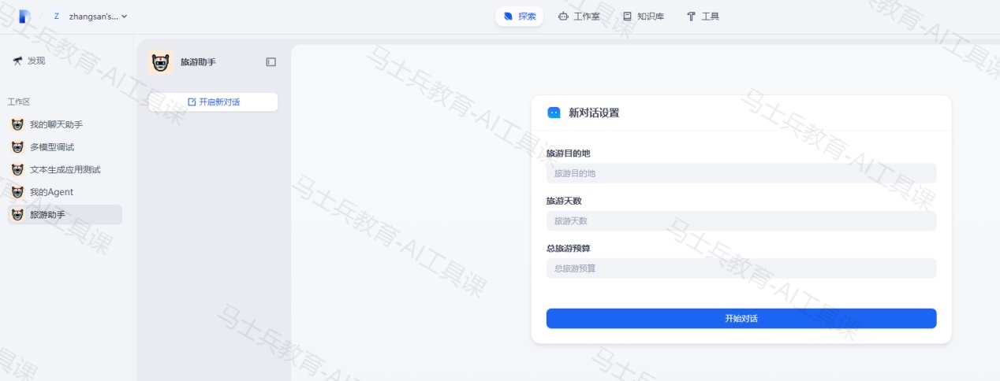

以上Agent构建注意如下几点：

* 提示词很关键，明确告诉Agent如何使用工具。提示词如下：

```python
## 提示词
请根据以下用户输入的信息：
- 目的地：{{destination}}
- 旅游天数：{{days}}
- 旅游预算：{{budget}}

使用以下工具完成任务：
1. **google_search**：搜索目的地的主要景点和酒店信息。
2. **webscraper**：提取上述搜索结果中有用的信息，包括景点描述、开放时间、门票价格、酒店名称、位置、价格和用户评价等。
3. **wikipedia_search**：获取目的地的背景信息、历史和文化等。

最终，生成一个详细的旅行计划，包括：
- 每日行程安排：列出每天的活动、参观的景点和住宿安排。
- 预算分配：估算每日花费，确保总预算控制在旅游预算内。
- 其他建议：如当地美食推荐、交通方式等。

请以清晰、结构化的格式呈现上述信息，确保内容准确且实用。
```

* 变量可以修改为中文及类型。
* 工具中依次选择各个工具，鼠标悬浮到对应工具上可以看到相应的工具名称，便于Agent识别。
* 可以通过页面下方“管理”设置Agent对话的开场白。

# 6. **Dify工作流**

工作流通过将复杂的任务分解成较小的步骤（节点）降低系统复杂度，减少了对提示词技术和模型推理能力的依赖，提高了 LLM 应用面向复杂任务的性能，提升了系统的可解释性、稳定性和容错性。

Dify 工作流分为两种类型：Chatflow和Workflow：

* Chatflow面向对话类情景，包括客户服务、语义搜索、以及其他需要在构建响应时进行多步逻辑的对话式应用程序，该类应用特点在于支持对生成的结果进行多轮对话交互，调整生成的结果。
* Workflow面向自动化和批处理情景，适合高质量翻译、数据分析、内容生成、电子邮件自动化等应用程序。**该类型应用无法对生成的结果进行多轮对话交互**。

Chatflow和Workflow两者相比，chatflow增加了 Chatbot 特性的支持。**Chatflow常见的交互路径为：给出指令 → 生成内容 → 就内容进行多次讨论 → 重新生成结果 → 结束。Workflow常见的交互路径为给出指令 → 生成内容 → 结束。**

Chatflow和Workflow的创建位置如下：

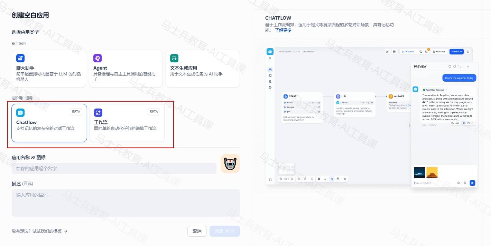

## 6.1. **工作流节点**

为了更好的使用Dify中的工作流（Chatflow/Workflow），我们先了解下工作流中的节点。节点是工作流中的关键构成，通过连接不同功能的节点，执行工作流的一系列操作。下面介绍常用的节点。

### **6.1.1. 开始节点**

"开始" 节点是每个工作流应用（Chatflow / Workflow）必备的预设节点，为后续工作流节点以及应用的正常流转提供必要的初始信息，例如应用使用者所输入的内容、以及上传的文件等。

如下是工作流应用（Chatflow / Workflow）开始节点的设置页，可以看到“输入字段”和预设的系统变量。

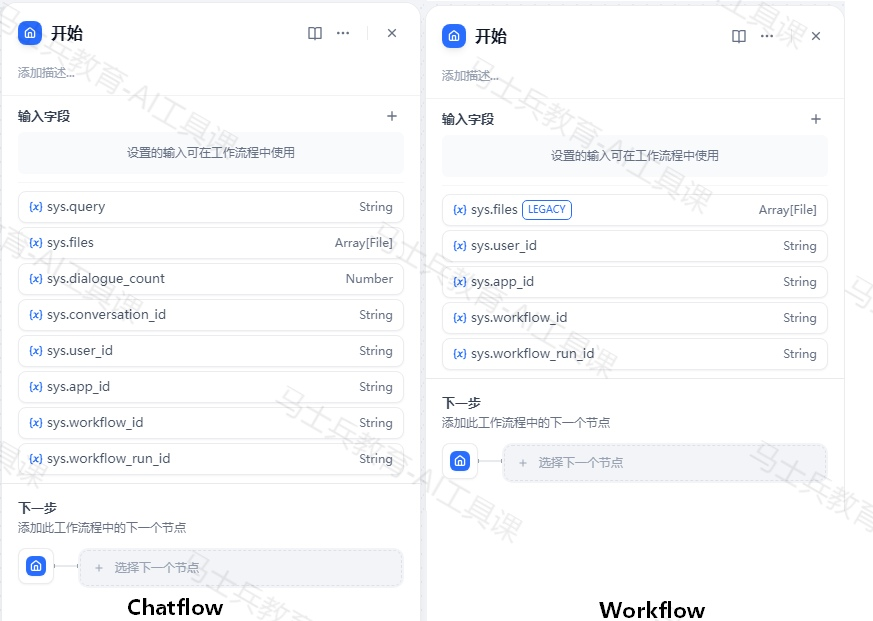

* 输入字段

输入字段功能由用户设置，用于让用户主动补全更多信息。例如在周报应用中要求用户按照格式预先提供更多背景信息，如姓名、工作日期区间、工作详情等。这些前置信息将有助于 LLM 生成质量更高的答复。

输入字段支持文本、段落、下拉选项、数字、单文件、文件列表六种类型。

* 系统变量

系统变量指的是在 Chatflow / Workflow 应用内预设的系统级参数，可以被应用内的其它节点全局读取。

Chatflow 类型应用提供以下系统变量：

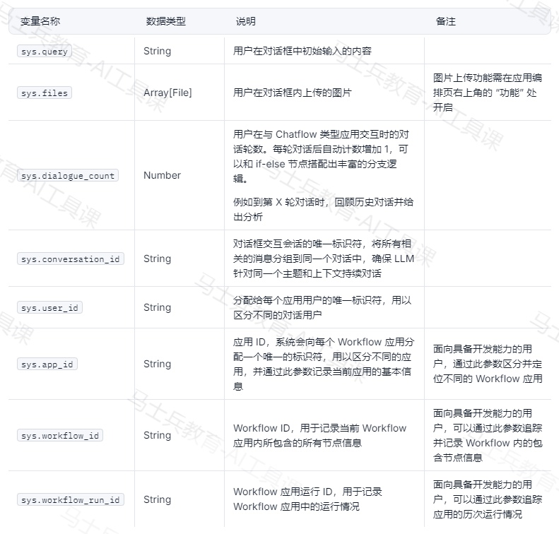

Workflow 类型应用提供以下系统变量：

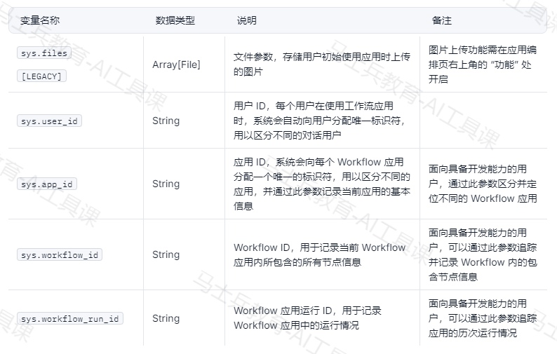

### **6.1.2. LLM节点**

LLM 节点是 Chatflow/Workflow 的核心节点。该节点能够利用大语言模型的对话/生成/分类/处理等能力，根据给定的提示词处理广泛的任务类型，并能够在工作流的不同环节使用。选择合适的模型，编写提示词，你可以在 Chatflow/Workflow 中构建出强大、可靠的解决方案。

LLM节点设置页如下：

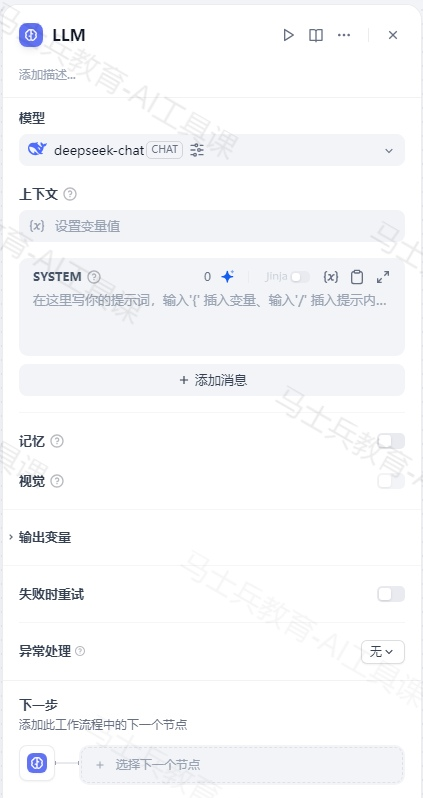

* 模型：选择LLM模型。
* 上下文（可选）：上下文可以理解为向 LLM 提供的背景信息，常用于填写知识检索的输出变量。
* SYSTEM:指定提示词，告诉模型做什么事情。
* 记忆：是否开启聊天记忆。
* 视觉：开启视觉功能允许模型输入图片，并根据图像内容的理解回答用户问题。
* 输出变量：模型生成内容输出的变量。

### **6.1.3. 直接回复节点**

定义一个 Chatflow 流程中的回复内容。你可以在文本编辑器中自由定义回复格式，包括自定义一段固定的文本内容、使用前置步骤中的输出变量作为回复内容、或者将自定义文本与变量组合后回复。

直接回复节点设置页如下：

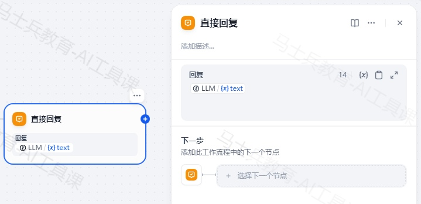

**案例一：创建chatflow，根据用户输入的关键词生成标题。**

**1) 在开始节点中加入自定义字段“title”**

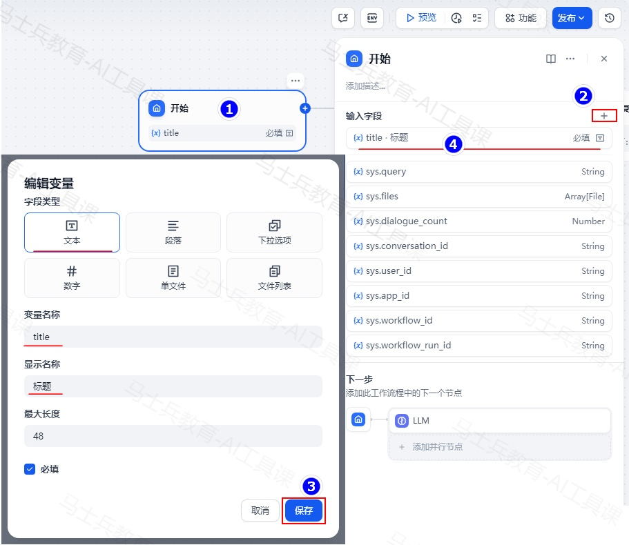

**2) 加入LLM节点，配置模型根据用户关键字生成标题**

在LLM中配置提示词:“你是一个专业的标题撰写大师，请根据用户输入的{{title}}来生成吸引眼球的标题。”

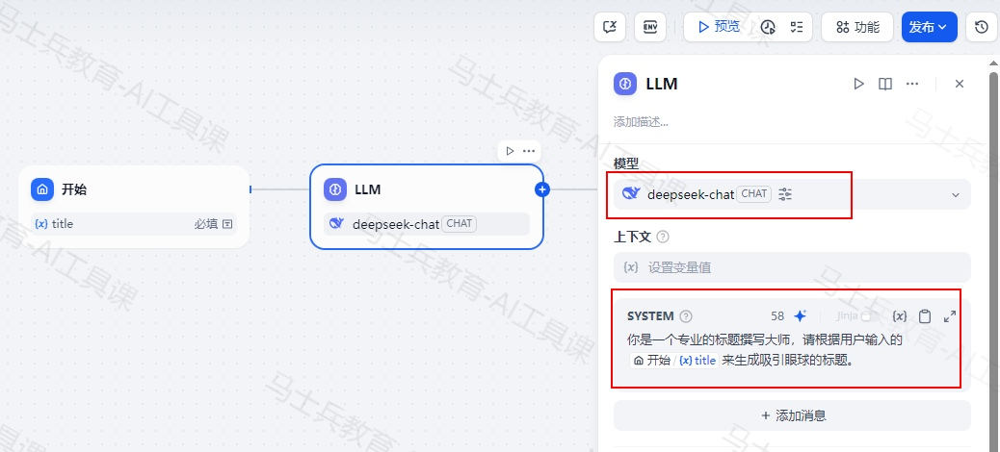

**3) 创建直接回复节点，配置输出格式**

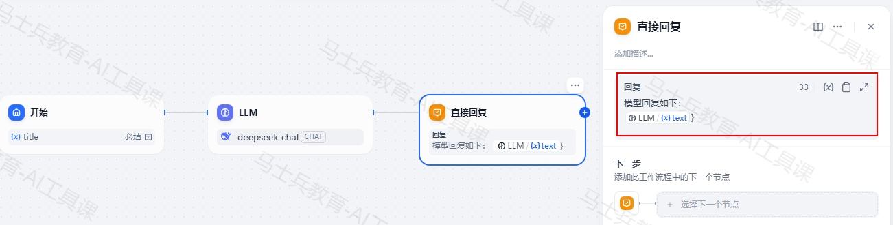

**4) 运行与分布模型**

点击“预览”可以测试chatflow，点击“发布”可以发布模型到工作区。

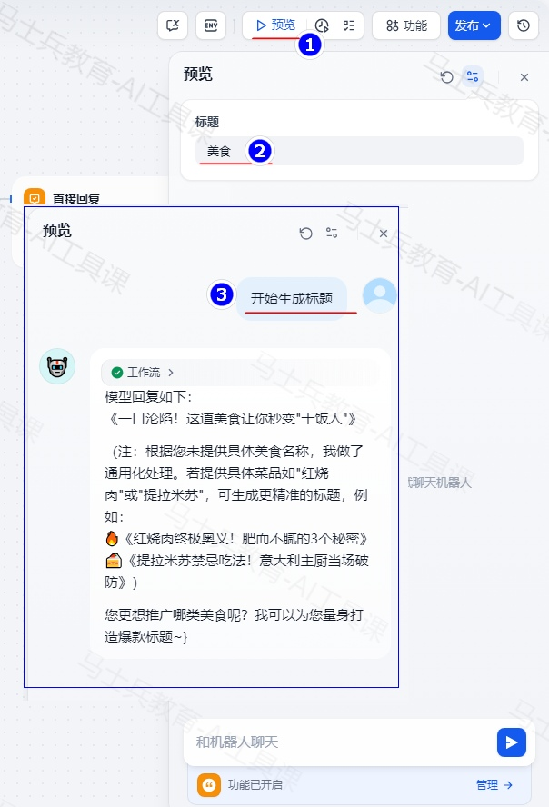

点击发布将Chatflow应用发布到工作区。

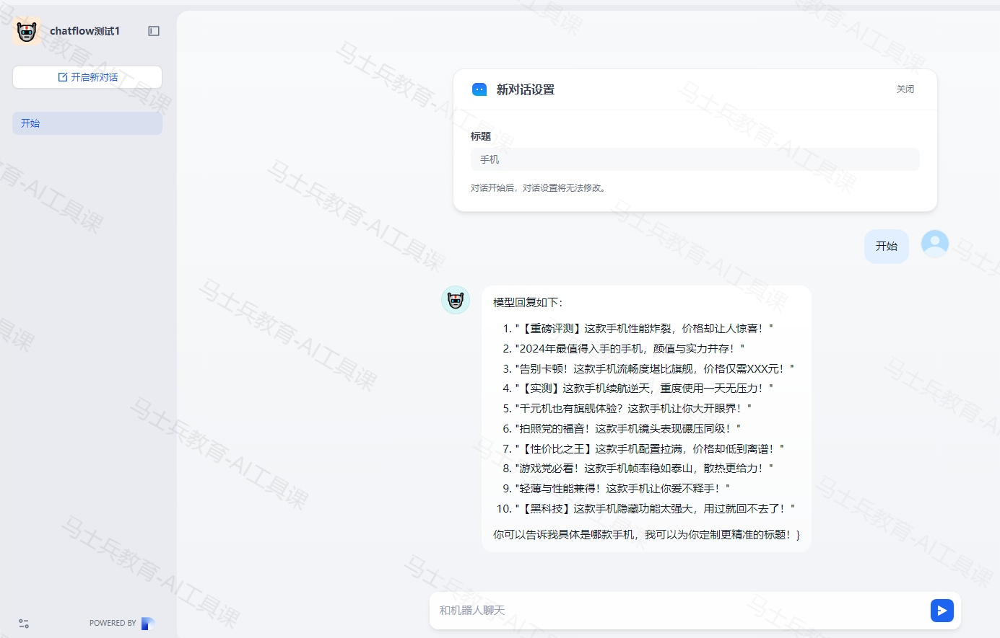

### **6.1.4. 文档提取器节点**

LLM 自身无法直接读取或解释文档的内容。因此需要将用户上传的文档，通过文档提取器节点解析并读取文档文件中的信息，转化文本之后再将内容传给 LLM 以实现对于文件内容的处理。

文档提取器节点设置页如下：

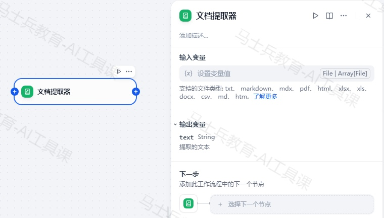

* 输入变量：文档提取器仅接受一个文件或者多个文件，对应File和Array\[File\]。文档提取器仅能够提取文档类型文件中的信息，例如 TXT、Markdown、PDF、HTML、DOCX 格式文件的内容，无法处理图片、音频、视频等格式文件。
* 输出变量：输出变量固定命名为 text。输出的变量类型取决于输入变量（输入为File则输出为string；输入为File\[Array\]则输出为array\[string\]）。

**案例二：创建chatflow，使用大模型分析文档内容，根据文档内容回复用户问题。**

**1) 创建开始节点，添加单文件变量并命名为pdf**

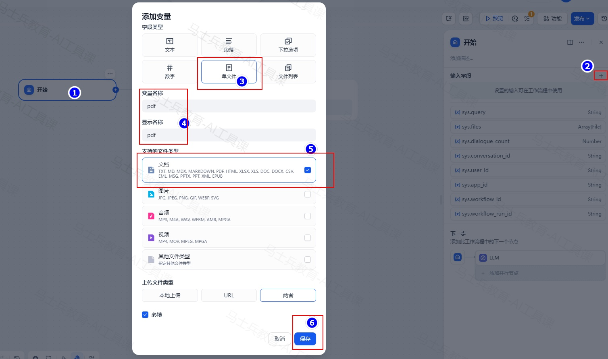

**2) 添加文档提取节点，并在输入变量中选择pdf变量**

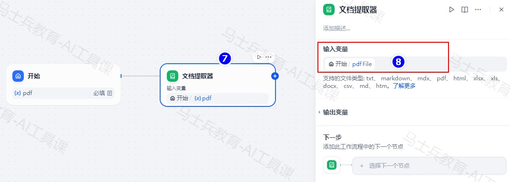

**3) 添加LLM节点**

LLM节点中设置系统提示词：“请读取文档{{text}}内容，并根据文档中的内容回答用户问题”。**特别提示：text为文档提取器输出变量，不要选择pdf变量，因为LLM无法直接读取pdf文件。**

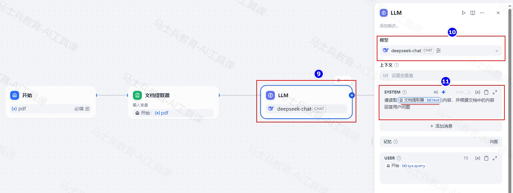

**4) 添加直接回复节点，输出模型结果**

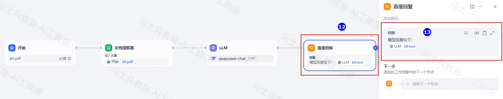

**5) 测试并发布chatflow**

预览测试：

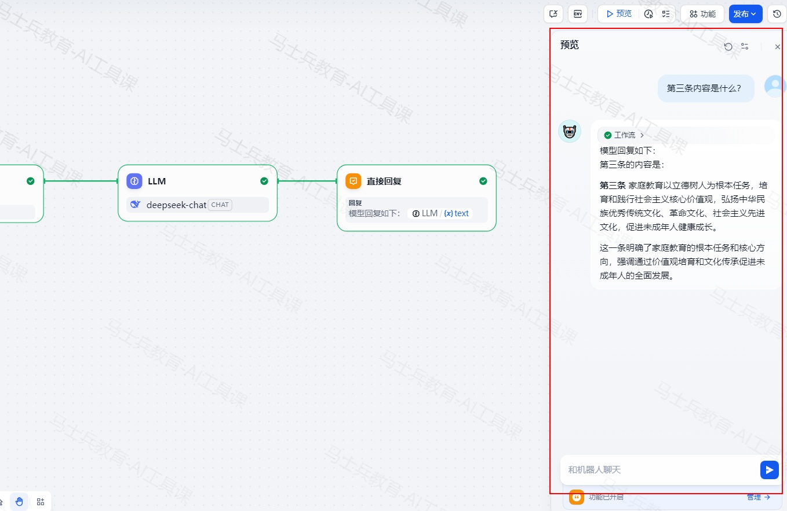

发布使用：

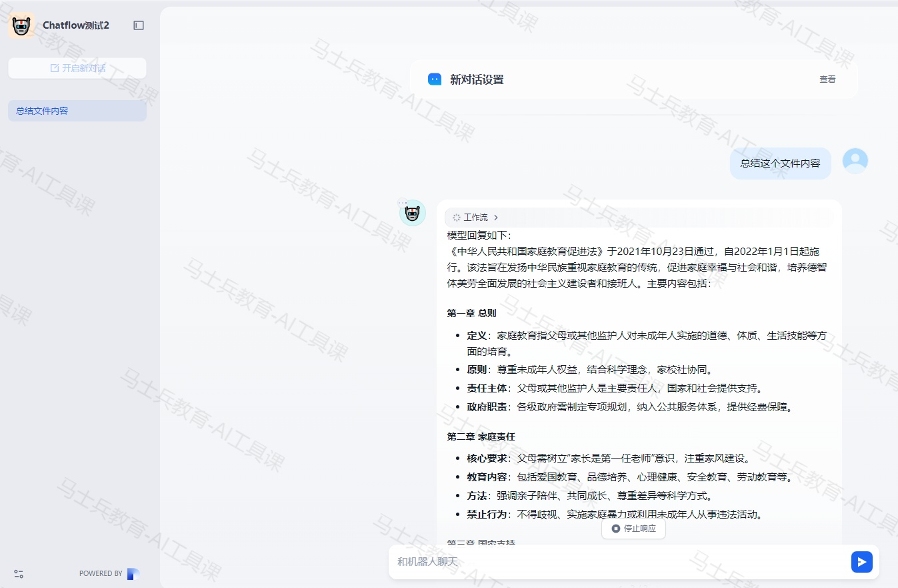

### **6.1.5. 知识检索节点**

知识检索节点用于从知识库中检索与用户问题相关的文本内容，可作为下游 LLM 节点的上下文来使用，知识检索节点常用于构建基于外部数据/知识的 AI 问答系统（RAG）系统。

知识检索节点设置页如下：

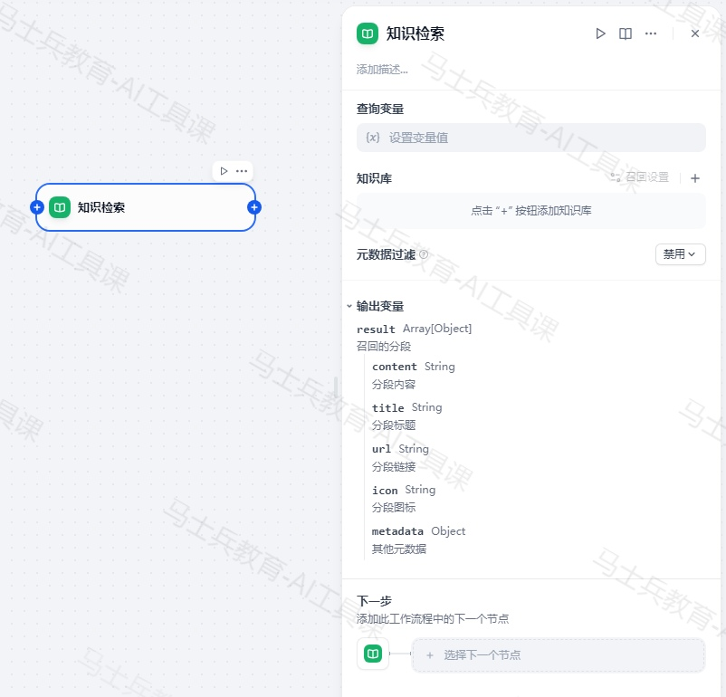

* 查询变量：查询变量通常代表用户输入的问题，该变量可以作为输入项并检索知识库中的相关文本分段。在常见的对话类应用中一般将开始节点的 sys.query 作为查询变量，知识库所能接受的最大查询内容为 200 字符。
* 知识库：选择需要查询的知识库，可选知识库需要在 Dify 知识库内预先创建。
* 元数据过滤：在元数据筛选板块中配置元数据的筛选条件，使用元数据功能筛选知识库内的文档。
* 输出变量：知识检索的输出变量 result 为从知识库中检索到的相关文本分段。其变量数据结构中包含了分段内容、标题、链接、图标、元数据信息。

在常见的chatflow中，知识库检索的下游节点一般为 LLM 节点，知识检索的输出变量 result 需要配置在 LLM 节点中的上下文变量内关联赋值，关联后你可以在提示词的合适位置插入上下文变量。

当用户提问时，若在知识检索中召回了相关文本，文本内容会作为上下文变量中的值填入提示词，提供 LLM 回复问题；若未在知识库检索中召回相关的文本，上下文变量值为空，LLM 则会直接回复用户问题。

**案例三：创建chatflow，构建医学知识问答系统（RAG）。**

**1) 在“知识库”中创建知识库**

在知识库中上传“内科学.pdf”文件，构建知识库。

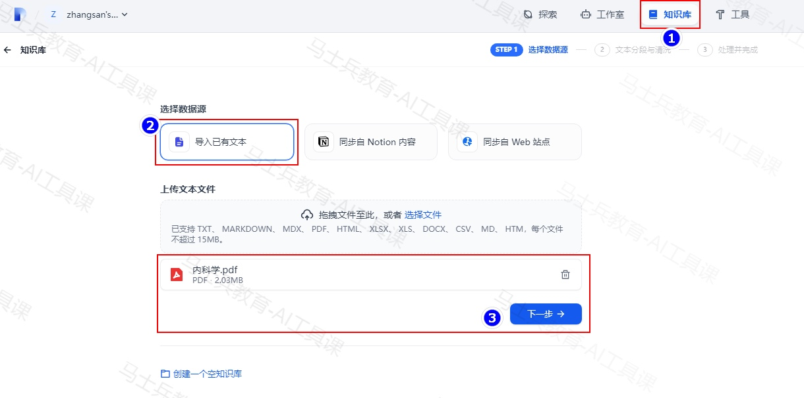

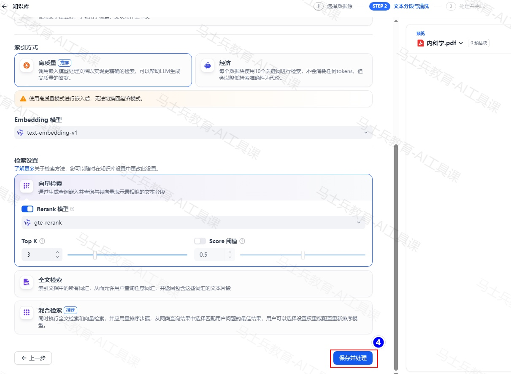

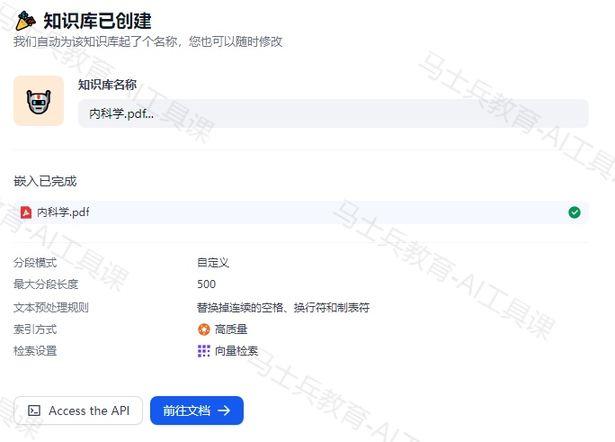

**2) 创建开始节点**

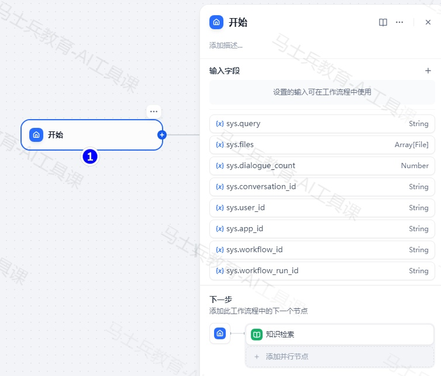

**3) 创建知识检索节点**

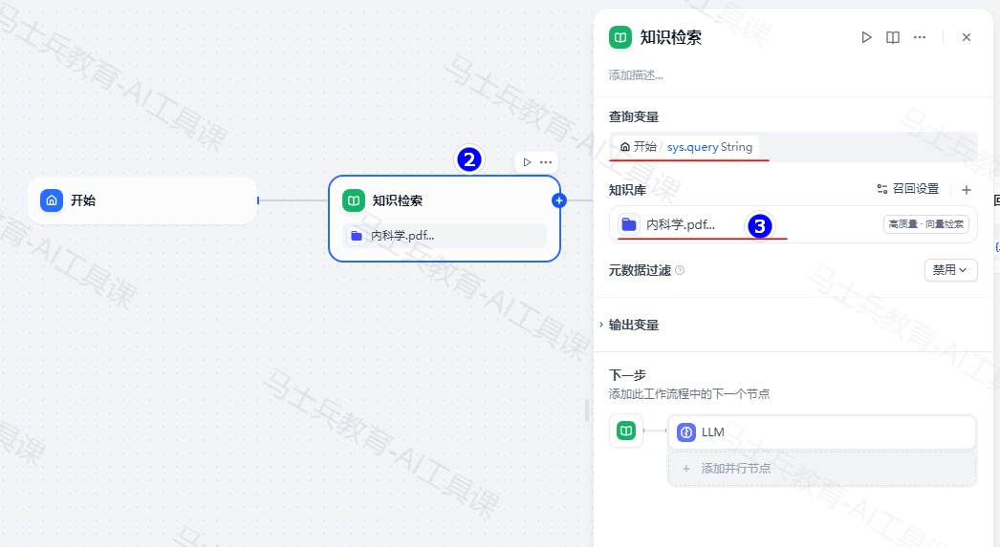

**4) 创建LLM节点**

LLM节点中要设置上下文，上下文就是知识检索节点中的知识库，并且需要在SYSTEM中引用上下文，让LLM知道回答用户问题所引用的知识库。

```python
你是一个精通内科学的高手，使用以下内容作为你所学习的知识，放在<context></context>标签内。
<context>
{{上下文}}
</context>
回答用户时，仅能根据知识库中的内容来回复用户问题，避免提及你是从上下文中获取的信息，如果你不知道，就直说你不知道。
```

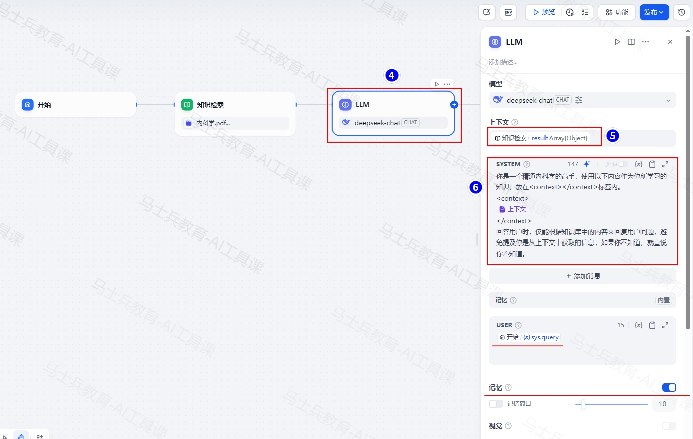

**5) 创建直接回复节点**

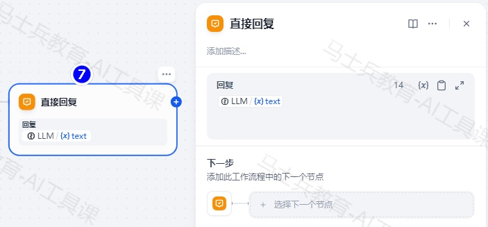

**6) 测试并发布chatflow**

预览测试：

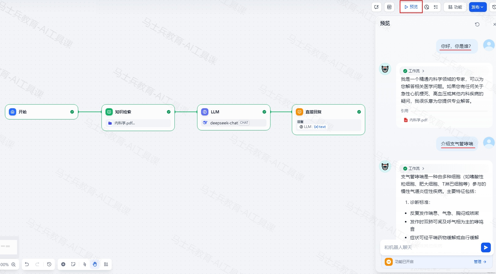

发布使用：

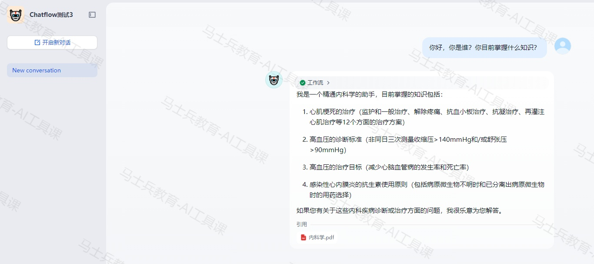

### **6.1.6. 代码执行节点**

代码节点支持运行 Python / NodeJS 代码以在工作流程中执行数据转换。该节点极大地增强了开发人员的灵活性，使他们能够在工作流程中嵌入自定义的 Python 或 Javascript 脚本，并以预设节点无法达到的方式操作变量。

代码执行节点设置页如下：

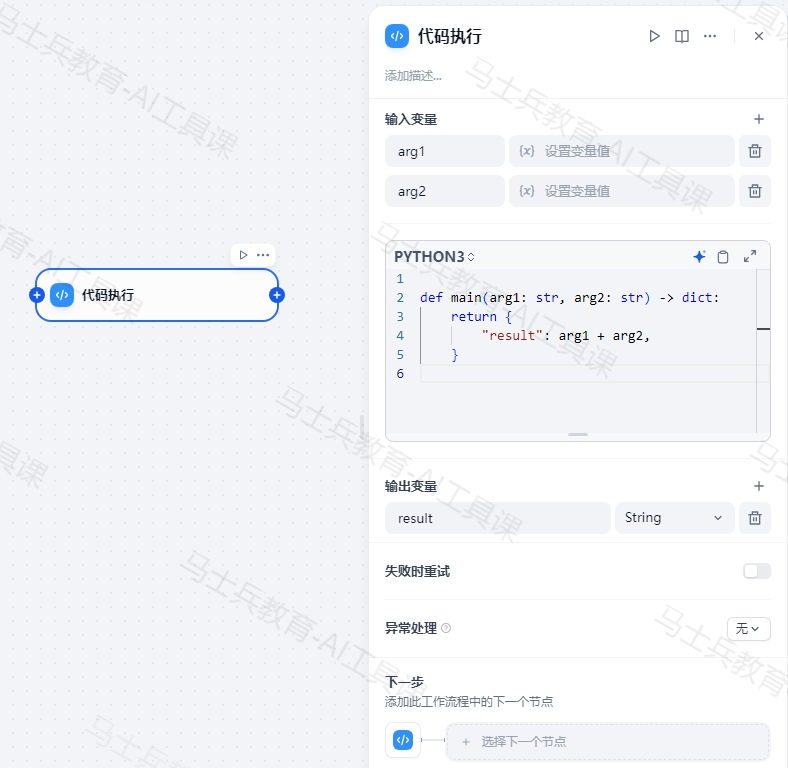

通过配置选项，你可以指明所需的输入和输出变量，并撰写相应的执行代码。

**案例四：创建chatflow，执行指定sql通过python代码读取数据库数据。**

**1) 在mysql中准备表及数据**

mysql搭建省略。按照如下方式创建mysql库、表及插入数据：

```python
create database mydb;

use mydb;

-- 学生表
CREATE TABLE mydb.students (
    id INT COMMENT '学生id',
    name VARCHAR(100) COMMENT '学生姓名',
    age INT COMMENT '学生年龄'
) COMMENT='学生表';

INSERT INTO mydb.students (id, name, age) VALUES
(1,'张三',18),
(2,'李四',19),
(3,'王五',20),
(4,'赵六',21),
(5,'孙七',18),
(6,'周八',19),
(7,'吴九',20),
(8,'郑十',18),
(9,'钱十一',18),
(10,'刘十二',20);


-- 分数表
CREATE TABLE mydb.scores (
    id INT COMMENT '学生id',
    course_name VARCHAR(50) COMMENT '课程',
    score INT COMMENT '成绩'
) COMMENT='分数表';

INSERT INTO mydb.scores (id, course_name, score) VALUES
(1, '数学', 85),
(1, '语文', 78),
(2, '数学', 92),
(2, '英语', 88),
(3, '数学', 76),
(3, '物理', 82),
(4, '化学', 95),
(5, '生物', 89),
(6, '历史', 79),
(7, '地理', 91);
```

**2) 创建开始节点并命名为“准备参数”**

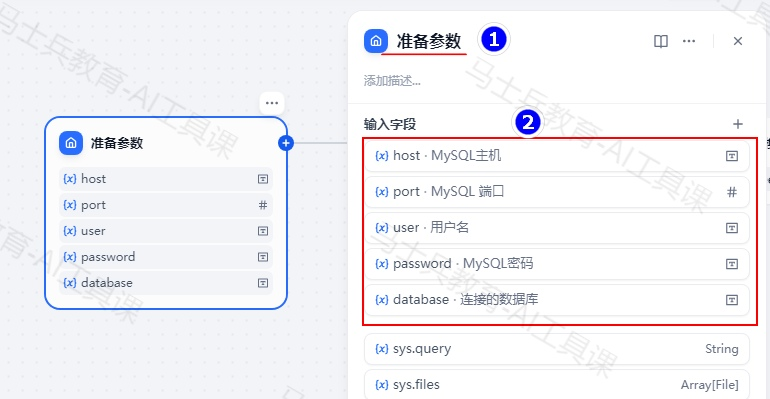

这里配置连接Mysql的host、port、user、password、database，sys.query作为用户输入的查询SQL。

**3) 创建代码执行节点并命名为“查询MySQL”**

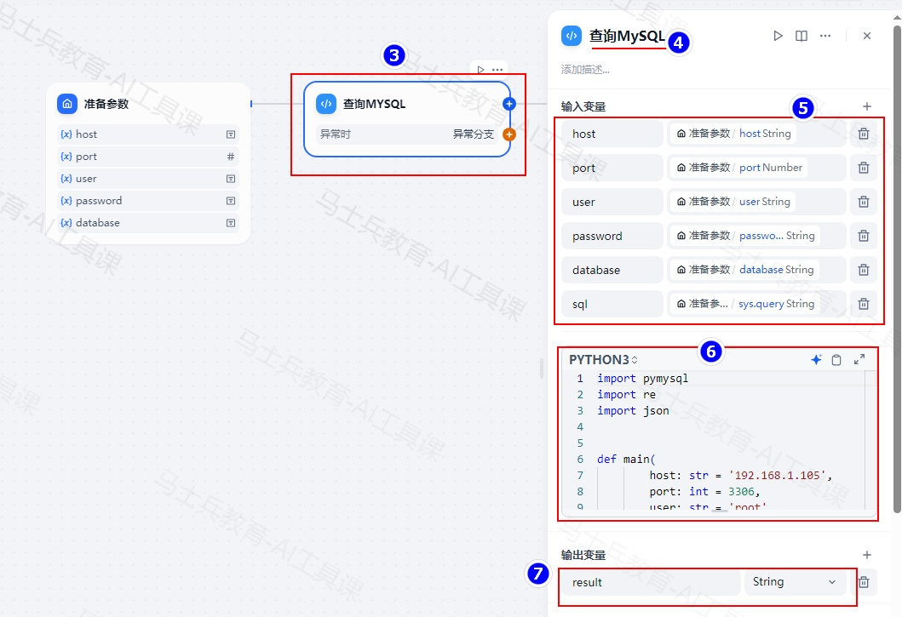

第六步骤中查询MySQL的代码如下：

```python
import pymysql
import re
import json


def main(
        host: str = '192.168.1.105',
        port: int = 3306,
        user: str = 'root',
        password: str = '123456',
        database: str = 'mydb',
        sql: str = ''
):
    """
    参数：
    host: 数据库主机地址（默认：192.168.1.105）
    port: 数据库端口（默认：3306）
    user: 数据库用户名（默认：root）
    password: 数据库密码（默认：123456）
    database: 数据库名称（默认：mydb）
    sql: 要执行的SELECT语句（必需）

    返回：
    - 总是返回 {"result": "完整字符串"} 格式
    """

    # 校验必填参数
    if not sql.strip():
        return {"result": "SQL语句不能为空"}

    # 严格校验SQL类型
    cleaned_sql = re.sub(r'[\s\t\n]+', ' ', sql.strip().lower())
    if not cleaned_sql.startswith("select"):
        return {"result": "仅允许执行SELECT查询语句"}

    # 阻止危险操作
    forbidden_keywords = ['insert', 'update', 'delete', 'drop', 'alter', 'create', 'truncate']
    if any(keyword in cleaned_sql for keyword in forbidden_keywords):
        return {"result": "检测到非查询操作语句"}

    try:
        # 建立数据库连接
        connection = pymysql.connect(
            host=host,
            port=port,
            user=user,
            password=password,
            database=database,
            cursorclass=pymysql.cursors.DictCursor
        )

        with connection:
            with connection.cursor() as cursor:
                # 执行SQL
                cursor.execute(sql)
                result = cursor.fetchall()

                # 将结果转换为完整字符串
                if not result:
                    result_str = "查询成功，但结果为空"
                else:
                    # 将结果转换为格式化的JSON字符串
                    result_str = json.dumps(result, indent=2, ensure_ascii=False)
                    result_str = f"查询成功，结果如下：\n{result_str}"

                return {"result": result_str}

    except pymysql.Error as err:
        return {"result": f"数据库错误: {str(err)}"}
    except Exception as e:
        return {"result": f"未知错误: {str(e)}"}
```

**4) 创建LLM节点并命名为“结果转换成表格”**

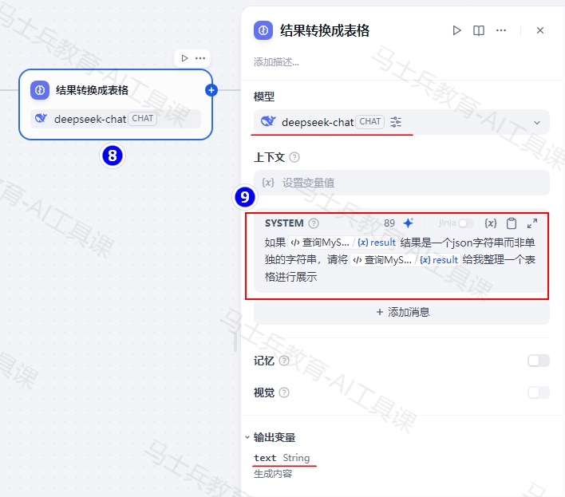

在以上提示词中写入如下内容，让LLM将结果表格化。

```python
如果结果{{result}}是一个json字符串而非单独的字符串，请将{{result}}给我整理一个表格进行展示
```

**5) 创建直接回复节点并命名为“展示结果”**

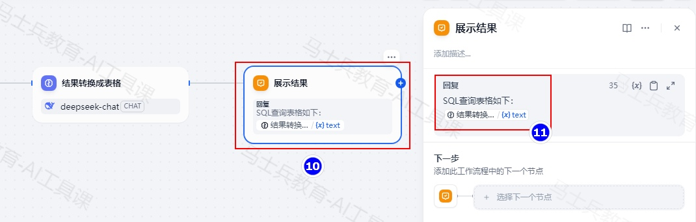

**6) 测试并发布chatflow**

预览测试：

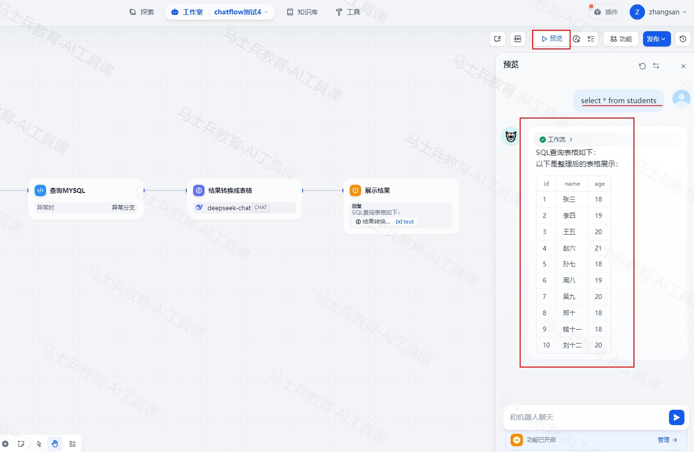

发布使用：

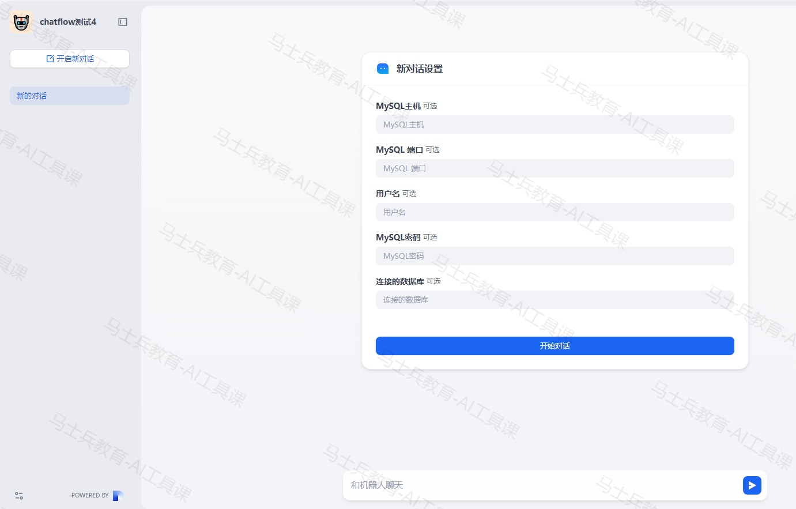

### **6.1.7. 问题分类器节点**

问题分类器能够根据用户输入的问题，使用 LLM 推理与之相匹配的分类并输出分类结果，向下游节点提供更加精确的信息。

问题分类节点设置页如下：

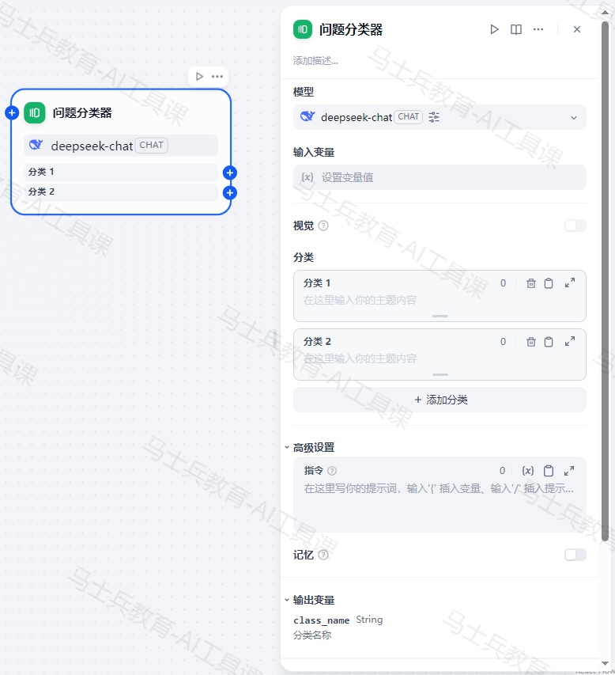

* 模型：将用户问题进行分类所使用的LLM模型。
* 输入变量：用户输入的内容，该内容用于LLM进行问题分类。客服问答场景下一般为用户输入的问题 sys.query。
* 视觉：开启视觉功能将允许模型输入图片，并根据图像内容的理解回答用户问题。
* 分类：手动添加多个分类，通过编写分类的关键词或者描述语句，让大语言模型更好的理解分类依据。
* 高级设置：可以在 高级设置-指令 里补充附加指令，比如更丰富的分类依据，以增强问题分类器的分类能力。
* 记忆：开启记忆后问题分类器的每次输入将包含对话中的聊天历史，以帮助 LLM 理解上文，提高对话交互中的问题理解能力。
* 输出变量：class\_name 存储了分类模型的预测结果。当分类完成后，这个变量会包含具体的类别标签，你可以在后续的处理节点中引用这个分类结果来执行相应的逻辑。

**案例五：创建chatflow，对用户的问题记性分类，根据本地知识库进行回复。**

**1) 创建开始及问题分类节点**

问题分类节点改名为“使用LLM对问题分类”，输入变量设置“sys.query”，分类问题设置三类：“与内科学相关问题”、“与法律相关问题”、“其他问题”，输出变量为class\_name。

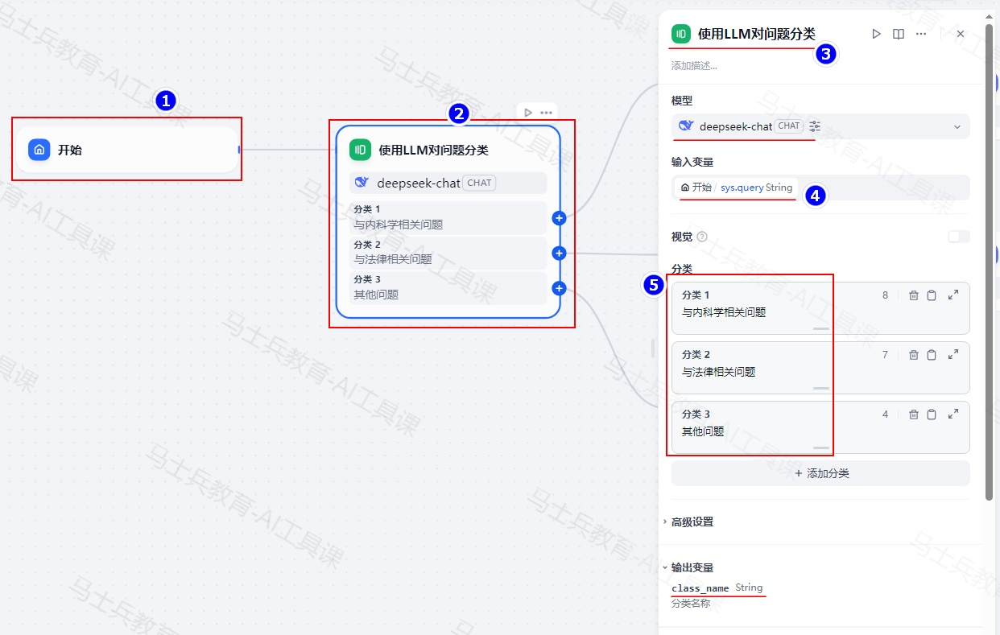

**2) 对“问题分类节点”输出设置不同的“知识检索”节点**


“知识检索”节点中修改对应名称，并指定使用的知识库。对于分类3“其他问题”设置“直接回复”节点，内容为“对于/class\_name 相关问题，没有找到你咨询的问题答案！”。

**3) 对每个“知识检索”节点设置LLM并修改名称**

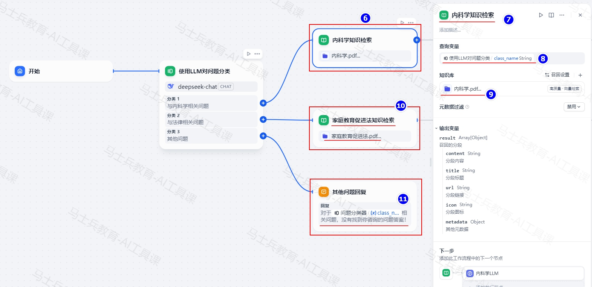

内科学LLM中设置SYSTEM提示词为：

```python
你是一个精通内科学的高手，使用以下内容作为你所学习的知识，这些内容已经放在<context></context>标签内。
<context>
{{上下文}}
</context>
回答用户时，仅能根据知识库中的内容来回复用户问题，避免提及你是从上下文中获取的信息，如果你不知道，就直说你不知道。
```

家庭教育促进法LLM设置SYSTEM提示词为：

```python
你是一个对家庭教育促进法比较精通的高手，使用以下内容作为你所学习的知识，这些内容已经放在<context></context>标签内。
<context>
</context>
回答用户时，仅能根据知识库中的内容来回复用户问题，避免提及你是从上下文中获取的信息，如果你不知道，就直说你不知道。
```

**4) 对LLM输出text结果设置“直接回复”节点**

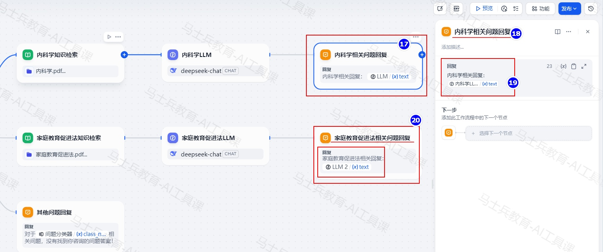

**5) 测试并发布chatflow**

预览测试：

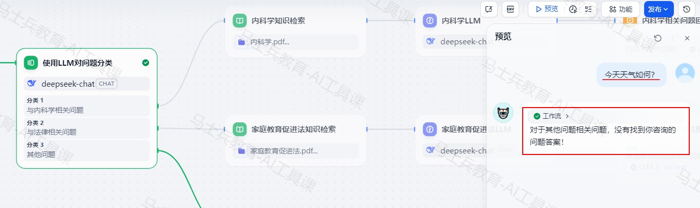

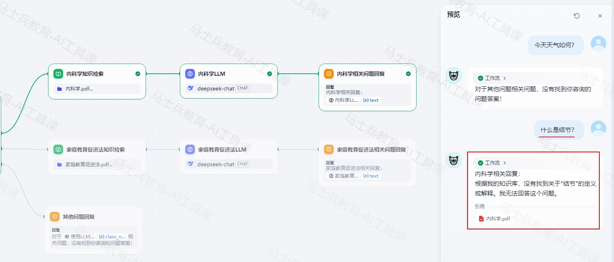

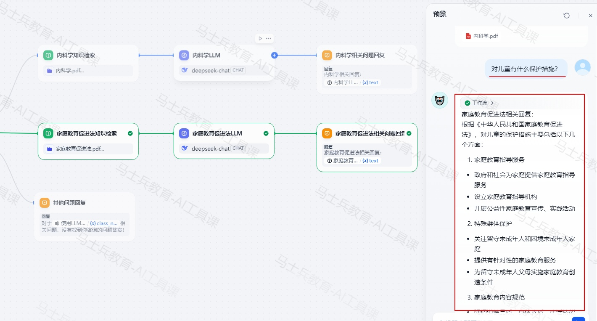

发布使用：

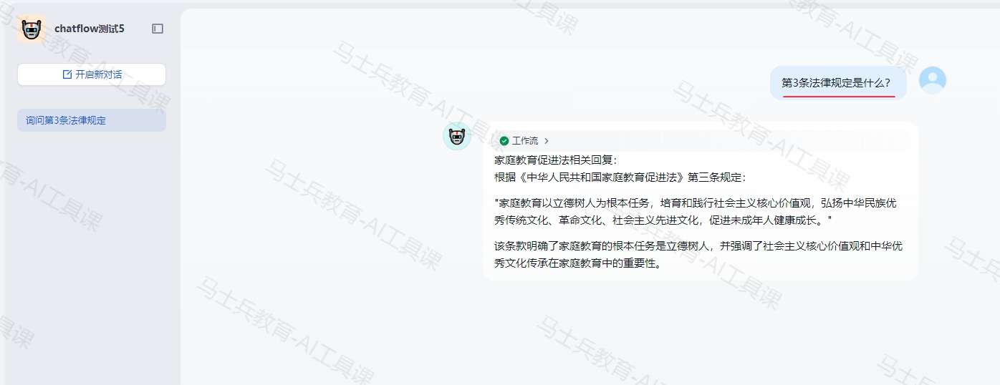

### **6.1.8. 条件分支节点**

条件分支节点可以根据 If/else/elif 条件将 Chatflow / Workflow 流程拆分成多个分支。

条件分支节点设置页如下：

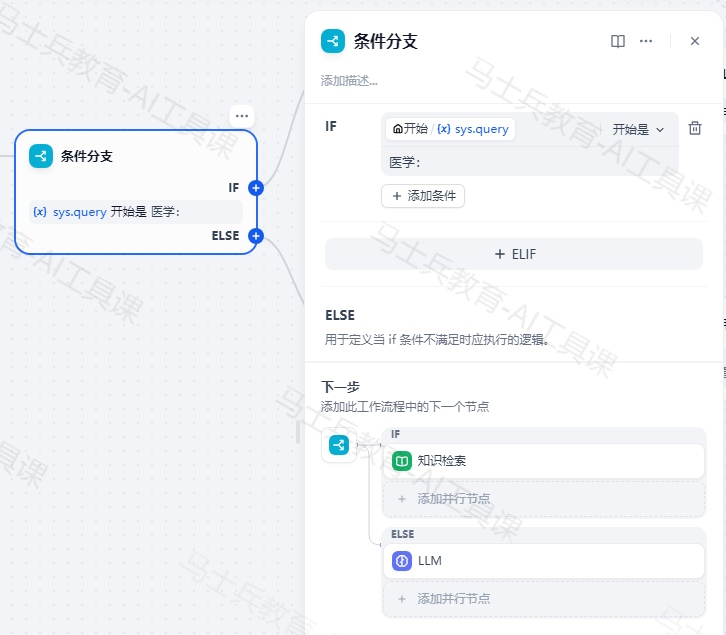

条件类型支持如下：

* 包含（Contains）
* 不包含（Not contains）
* 开始是（Start with）
* 结束是（End with）
* 是（Is）
* 不是（Is not）
* 为空（Is empty）
* 不为空（Is not empty）

**案例六：创建chatflow，对用户提问使用条件分支决定从本地知识库回复还是大模型通用回复。**

**1) 创建开始及条件分支节点**

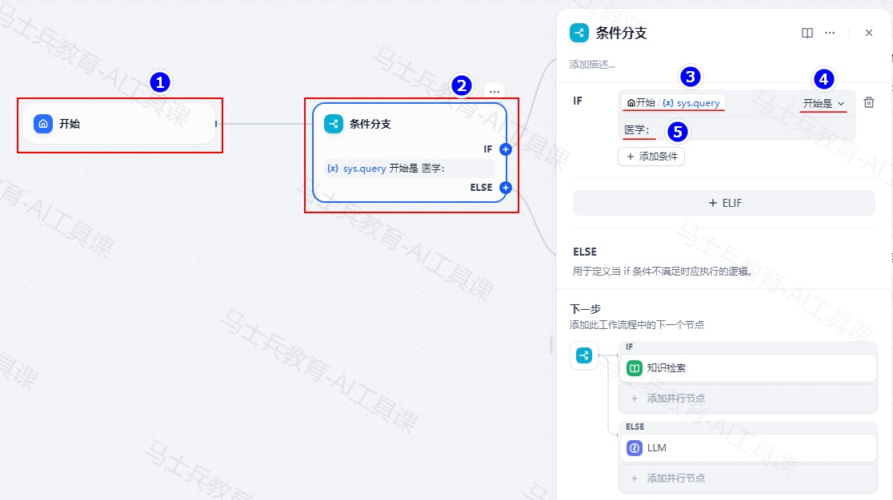

条件分支中判断用户输入问题如果是以“医学：”开头的提问，那么就从知识库中检索答案回复，否则使用通用回复。

**2) 对于IF分支设置“知识检索”节点进行问题回复**

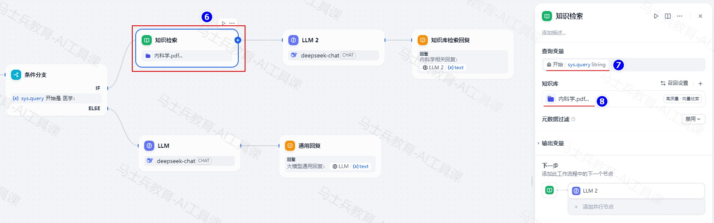

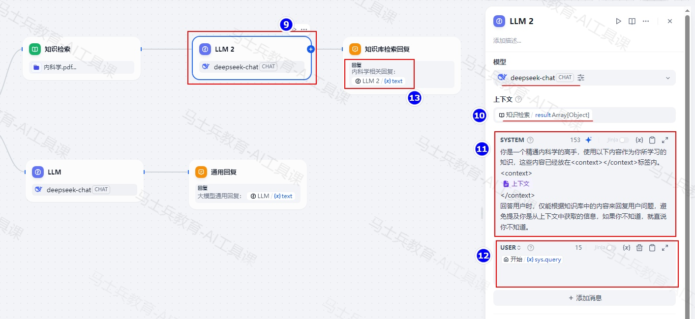

LLM2中内容如下：

```python
你是一个精通内科学的高手，使用以下内容作为你所学习的知识，这些内容已经放在<context></context>标签内。
<context>
{{上下文}}
</context>
回答用户时，仅能根据知识库中的内容来回复用户问题，避免提及你是从上下文中获取的信息，如果你不知道，就直说你不知道。
```

**3) 对于ELSE分支设置“LLM”节点进行通用回复**


**4) 测试并发布chatflow**

预览测试：

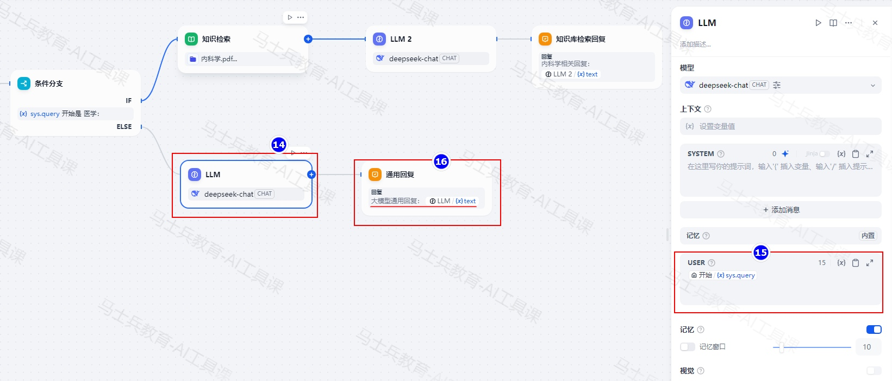

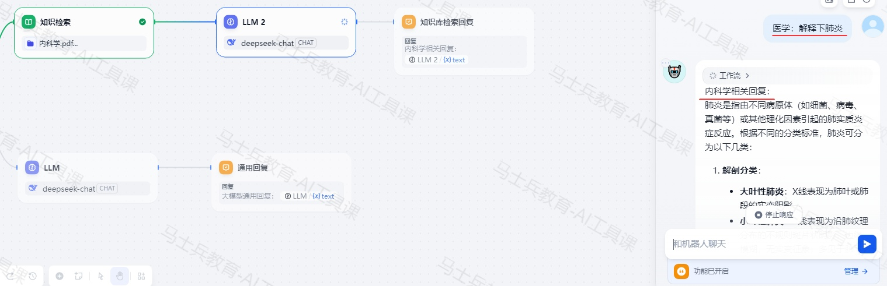

发布使用：

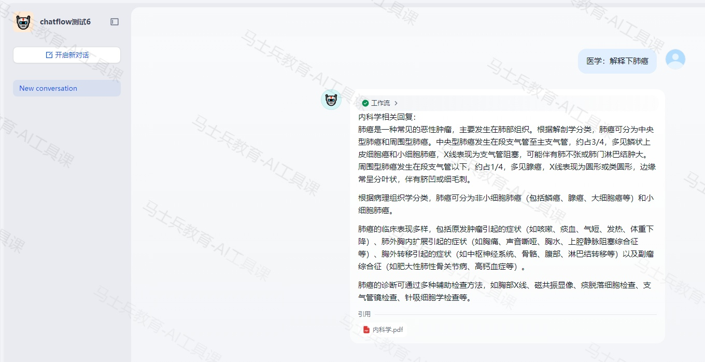

### **6.1.9. 参数提取器节点**

参数提取器节点可以利用 LLM 从自然语言推理并提取结构化参数，用于后置的工具调用或 HTTP 请求。

参数提取器节点设置页如下：

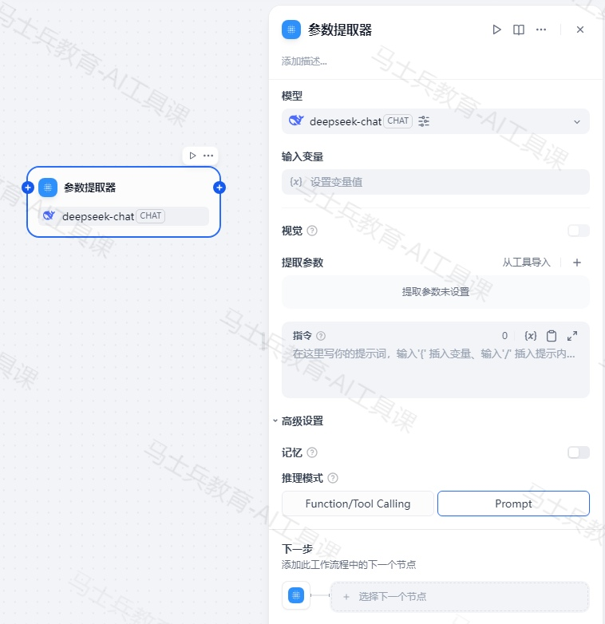

* 模型：参数提取器的提取依靠的是 LLM 的推理和结构化生成能力，这里指定使用的模型。
* 输入变量：一般为用于提取参数的变量输入，一般为上游节点输出内容。如上游节点为开始节点，这里可以是sys.query。
* 视觉：开启视觉功能允许模型输入图片，并根据图像内容的理解回答用户问题。
* 提取参数：可以手动添加需要提取的参数，也可以从已有工具中快捷导入。
* 高级设置：可以设置推理模式和记忆。关于推理模式，部分模型同时支持两种推理模式，通过函数/工具调用（Function/Tool Calling）或是纯提示词（Prompt）的方式实现参数提取，在指令遵循能力上有所差别。例如某些模型在函数调用效果欠佳的情况下可以切换成提示词推理。关于记忆，开启记忆后问题分类器的每次输入将包含对话中的聊天历史，以帮助 LLM 理解上文，提高对话交互中的问题理解能力。

**案例七：创建chatflow，对用户输入内容进行参数提取并输出。**

**1) 创建开始及参数提取器节点**

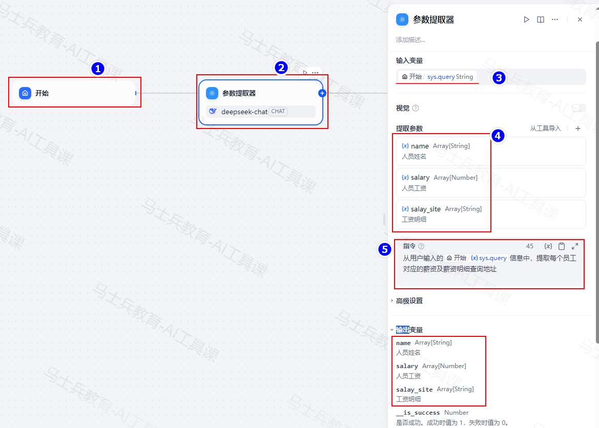

以上第4步骤中，参数设置为Array类型因为用户输入的内容包含多个人员的工资信息。

指定内容可以帮助参数提取器理解如何提取参数，内容如下：

```python
从用户输入/sys.query的信息中，提取每个员工对应的薪资及薪资明细查询地址
```

**2) 创建直接回复节点输出结果**

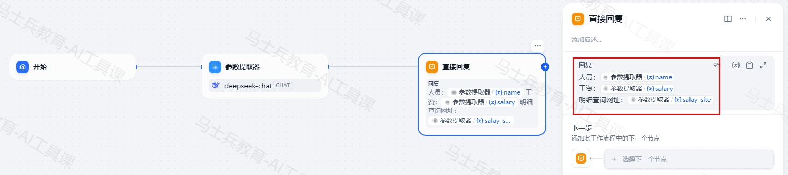

**3) 测试并发布chatflow**

预览测试：

输入内容：

```python
根据公司最新薪酬方案：
李明的月薪为人民币15,000元，详情请查阅：https://salary.example.com/view/liming9823
王芳的月薪为人民币18,000元，详情请查阅：https://salary.example.com/view/wangfang7045
张伟的月薪为人民币12,000元，详情请查阅：https://salary.example.com/view/zhangwei5617
```

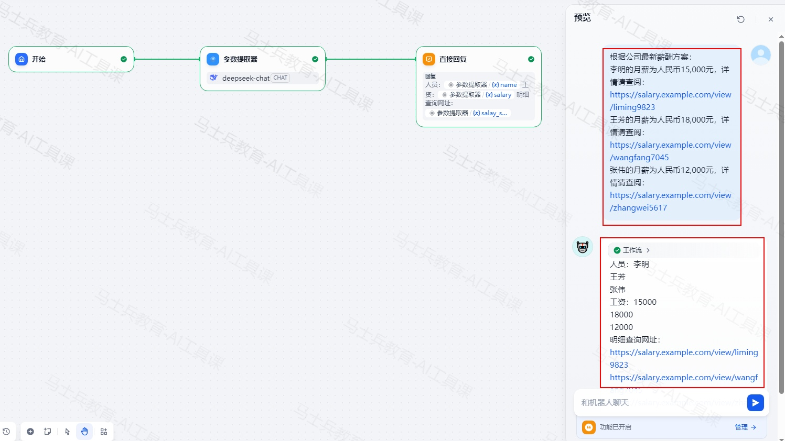

发布使用：

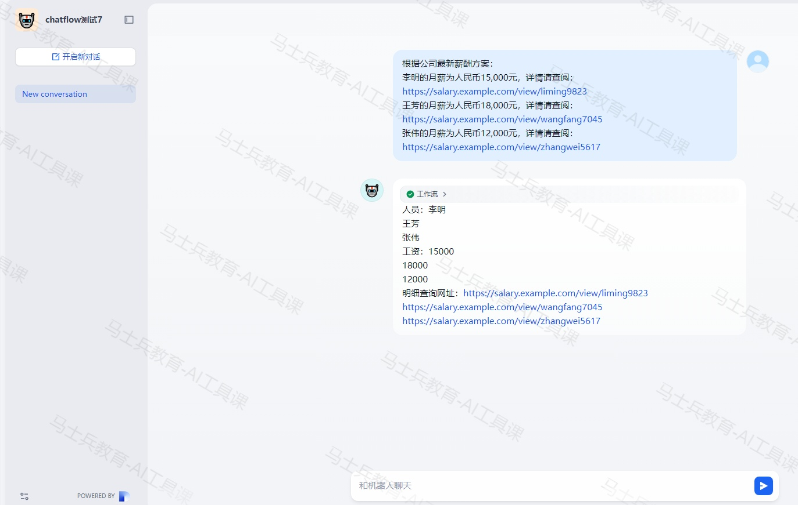

### **6.1.10. 迭代节点**

迭代节点可以对数组中的元素依次执行相同的操作，直至输出所有结果，可以理解为任务批处理器。迭代节点通常配合数组变量使用。

例如在长文翻译迭代节点内，如果将所有内容输入至 LLM 节点，有可能会达到单次对话限制。上游节点可以先将长文拆分为了多个片段，配合迭代节点对各个片段执行批量翻译，以避免达到 LLM 单次对话的消息限制。

迭代节点的设置页如下：

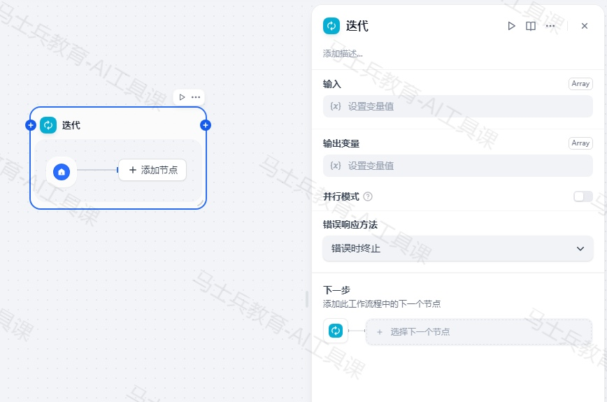

迭代节点的结构通常包含输入变量、迭代工作流、输出变量三个功能单元。

* 输入变量： 仅接受 Array 数组变量类型数据。
* 迭代工作流： 你可以在迭代节点中使用多个工作流节点，编排不同的任务步骤。
* 输出变量： 仅支持输出数组变量 Array\[List\]。

迭代节点原理图如下：

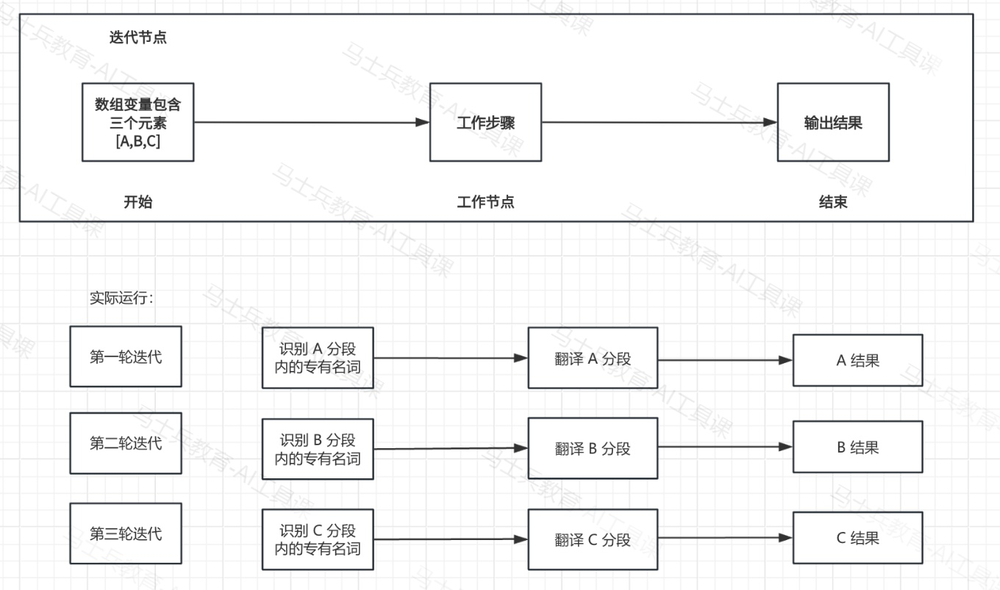

**案例八：创建chatflow，根据用户输入的技术完成该技术3章节内容输出。**

**1) 创建开始及LLM节点**

开始节点后创建LLM节点，该LLM节点实现根据用户输入的技术标题，给出3个子标题。LLM节点命名为“标题生成子标题”。

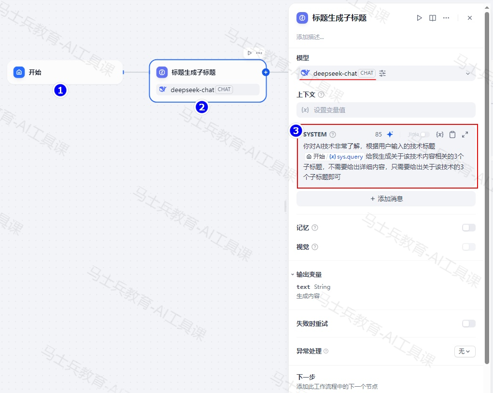

SYSTEM提示词内容如下：

```python
你对AI技术非常了解，根据用户输入的技术标题/sys.query给我生成关于该技术内容相关的3个子标题，不需要给出详细内容，只需要给出关于该技术的3个子标题即可
```

**2) 创建参数提取器节点，实现提取子标题到数组操作**

将参数提取器节点改名为“提取子标题到数组”，并设置提取的标题放入subject参数中（Array类型）。

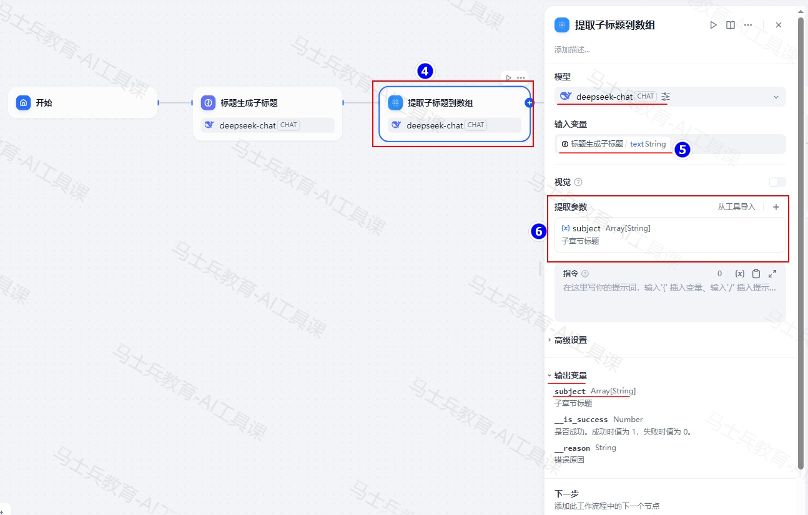

**3) 创建迭代节点并配置**

创建迭代节点实现对子标题遍历，在迭代节点中设置LLM节点和直接回复节点，实现对每个子标题内容的扩写并将结果直接输出。

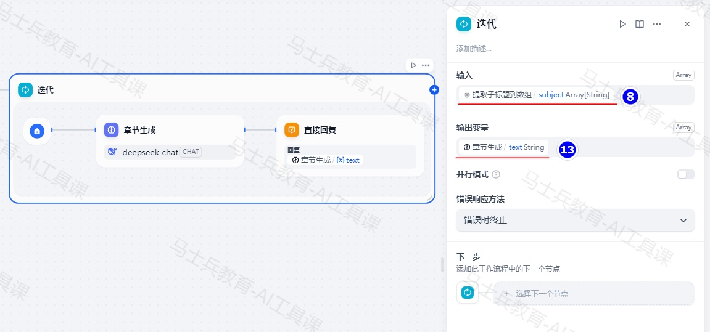

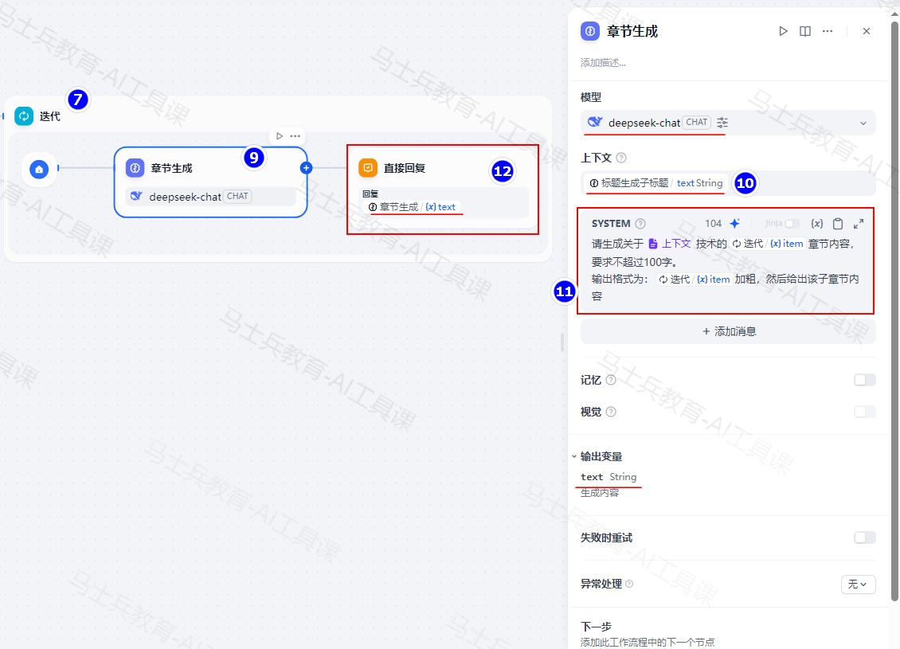

其中，第11步骤中的内容如下：

```python
请生成关于{{上下文}}技术的/item章节内容，要求不超过100字。
输出格式为：/item加粗，然后给出该子章节内容
```

**4) 测试并发布chatflow**

预览测试：

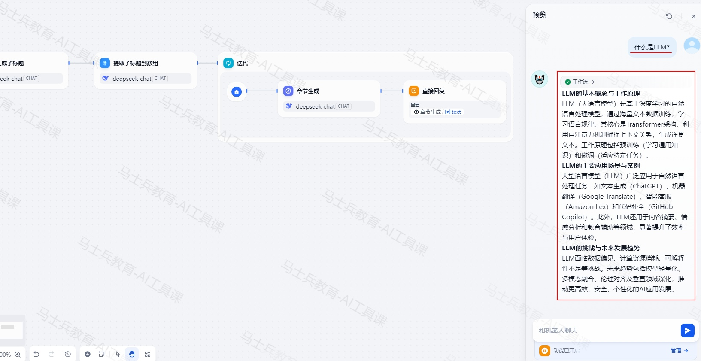

发布使用：

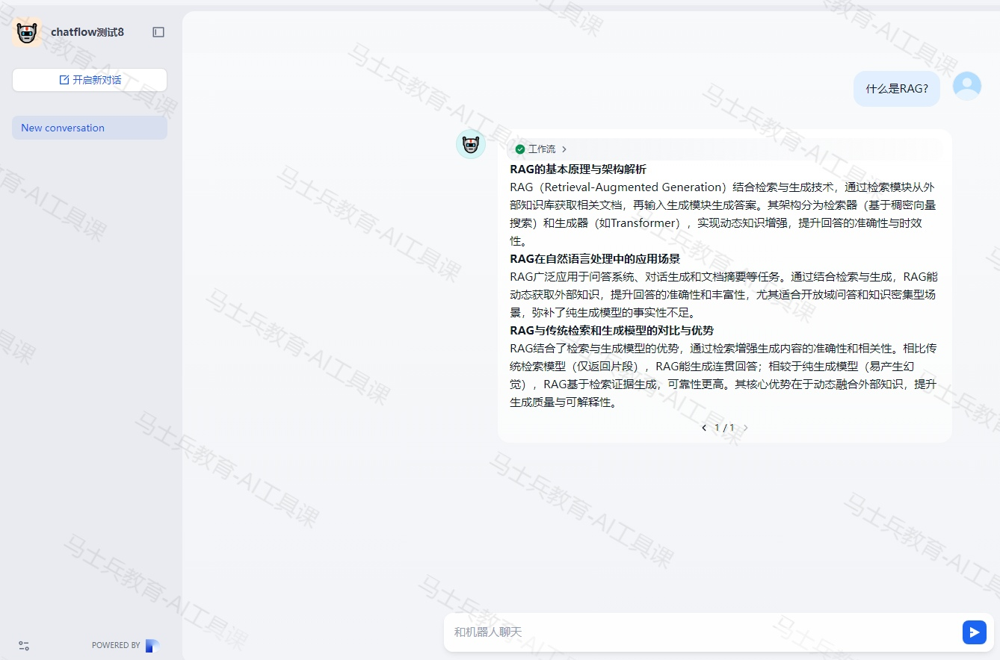

### **6.1.11. Http请求节点**

Http请求节点允许通过 HTTP 协议发送服务器请求，适用于获取外部数据、webhook、生成图片、下载文件等情景。它让你能够向指定的网络地址发送定制化的 HTTP 请求，实现与各种外部服务的互联互通。

该节点支持常见的 HTTP 请求方法：

* GET：用于请求服务器发送某个资源。
* POST：用于向服务器提交数据，通常用于提交表单或上传文件。
* HEAD：类似于 GET 请求，但服务器不返回请求的资源主体，只返回响应头。
* PATCH：用于在请求-响应链上的每个节点获取传输路径。
* PUT：用于向服务器上传资源，通常用于更新已存在的资源或创建新的资源。
* DELETE：用于请求服务器删除指定的资源。

Http请求节点设置页如下：

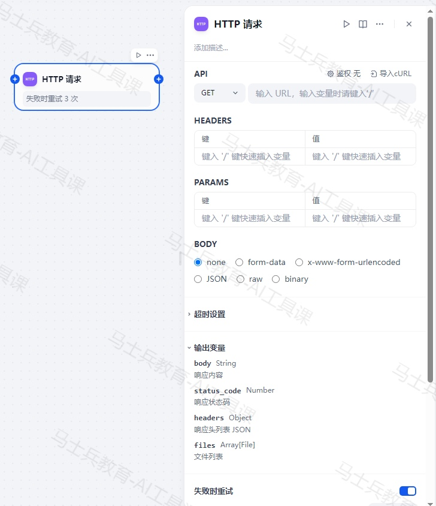

**案例九：创建chatflow，使用Http请求节点进行Get/Post/文件上传/下载操作。**

**1) 编写Python 代码构建Web服务**

这里使用Flask框架构建简单的Web服务，后续可以进行Http Get/Post/文件上传/下载请求服务。

python\_service.py （使用Flask框架构建Web服务），该代码中Get/Post请求都需要对应的user\_id和comment字段内容。

```python
## 安装如下依赖
## pip install Flask==3.1.0
## pip install flask-cors==5.0.1  # 允许跨域请求

from flask import Flask, request, send_file, jsonify
from io import BytesIO
from flask_cors import CORS
import os

app = Flask(__name__)
# 启用 CORS 支持，允许所有来源（origin）访问您的 Flask 后端
CORS(app)

# 用于存储上传的文件，键为文件名，值为文件内容
file_storage = {}

@app.route('/feedback', methods=['GET', 'POST'])
def feedback():
    if request.method == 'GET':
        user_id = request.args.get('user_id')
        comment = request.args.get('comment')
        if not user_id or not comment:
            return jsonify({'error': '缺少 user_id 或 comment 参数'}), 400
        return jsonify({'message': '收到 GET 请求', 'user_id': user_id, 'comment': comment})

    elif request.method == 'POST':
        data = request.json
        if not data or 'user_id' not in data or 'comment' not in data:
            return jsonify({'error': '缺少 user_id 或 comment 参数'}), 400
        user_id = data['user_id']
        comment = data['comment']
        return jsonify({'message': '收到 POST 请求', 'user_id': user_id, 'comment': comment})

@app.route('/upload', methods=['PUT'])
def upload_file():
    if 'file' not in request.files:
        return jsonify({'error': '未找到文件部分'}), 400
    file = request.files['file']
    if file.filename == '':
        return jsonify({'error': '未选择文件'}), 400
    # 保存文件到服务器的指定路径
    upload_path = os.path.join('uploads', file.filename)
    file.save(upload_path)
    file_storage[file.filename] = upload_path
    return jsonify({'message': '文件上传成功', 'filename': file.filename})

@app.route('/download/<filename>', methods=['GET'])
def download_file(filename):
    if filename not in file_storage:
        return jsonify({'error': '文件未找到'}), 404
    file_path = file_storage[filename]
    return send_file(file_path, as_attachment=True)

if __name__ == '__main__':
    # 确保上传目录存在
    os.makedirs('uploads', exist_ok=True)
    app.run(host='0.0.0.0', port=15050, debug=True)
```

以上代码启动后，通过运行“test\_python\_service.py”代码进行测试。

test\_python\_service.py（测试Get/POST/文件上传/下载服务）：

```python
## 安装如下依赖
## pip install requests==2.32.3

import requests
import os

# 定义服务的基础 URL
BASE_URL = 'http://192.168.1.105:15050'

# 测试 GET 请求
def test_get_feedback(user_id, comment):
    params = {'user_id': user_id, 'comment': comment}
    response = requests.get(f'{BASE_URL}/feedback', params=params)
    print('GET /feedback 响应:', response.json())

# 测试 POST 请求
def test_post_feedback(user_id, comment):
    data = {'user_id': user_id, 'comment': comment}
    response = requests.post(f'{BASE_URL}/feedback', json=data)
    print('POST /feedback 响应:', response.json())

# 测试文件上传（使用 PUT 请求）
def test_upload_file(file_path):
    with open(file_path, 'rb') as file:
        files = {'file': (os.path.basename(file.name), file)}
        response = requests.put(f'{BASE_URL}/upload', files=files)
    print('PUT /upload 响应:', response.json())
    return response.json().get('filename')

# 测试文件下载
def test_download_file(filename):
    response = requests.get(f'{BASE_URL}/download/{filename}')
    if response.status_code == 200:
        local_filename = f'downloaded_{os.path.basename(filename)}'
        with open(local_filename, 'wb') as file:
            file.write(response.content)
        print(f'文件下载成功，保存为：{local_filename}')
    else:
        try:
            print('下载失败:', response.json())
        except Exception:
            print(f'下载失败（非 JSON 响应），状态码: {response.status_code}')

# 示例调用
if __name__ == '__main__':
    test_get_feedback('123', '这是一个测试评价')
    test_post_feedback('123', '这是另一个测试评价')
    uploaded_filename = test_upload_file('./data/img.jpg')
    if uploaded_filename:
        test_download_file(uploaded_filename)
```

此外，这里还可以通过“Flask服务测试.html”（详见资料）在页面中测试Get/POST/文件上传/下载服务。

**2) 创建开始节点，设置输入字段**

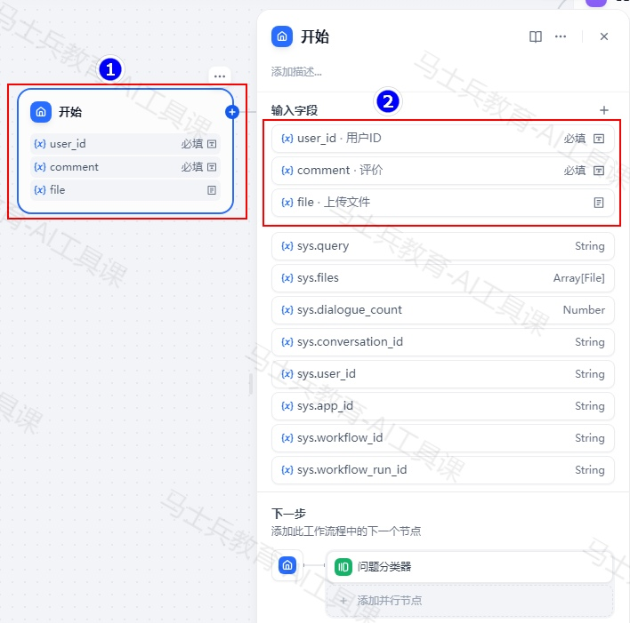

输入字段中user\_id和comment字段为文本类型，file为单文件类型，文件类型支持本地上传文档和图片。

**3) 创建“问题分类器”节点**

问题分类器节点根据用户输入的内容通过LLM理解并分类，执行到下游响应的Http请求。

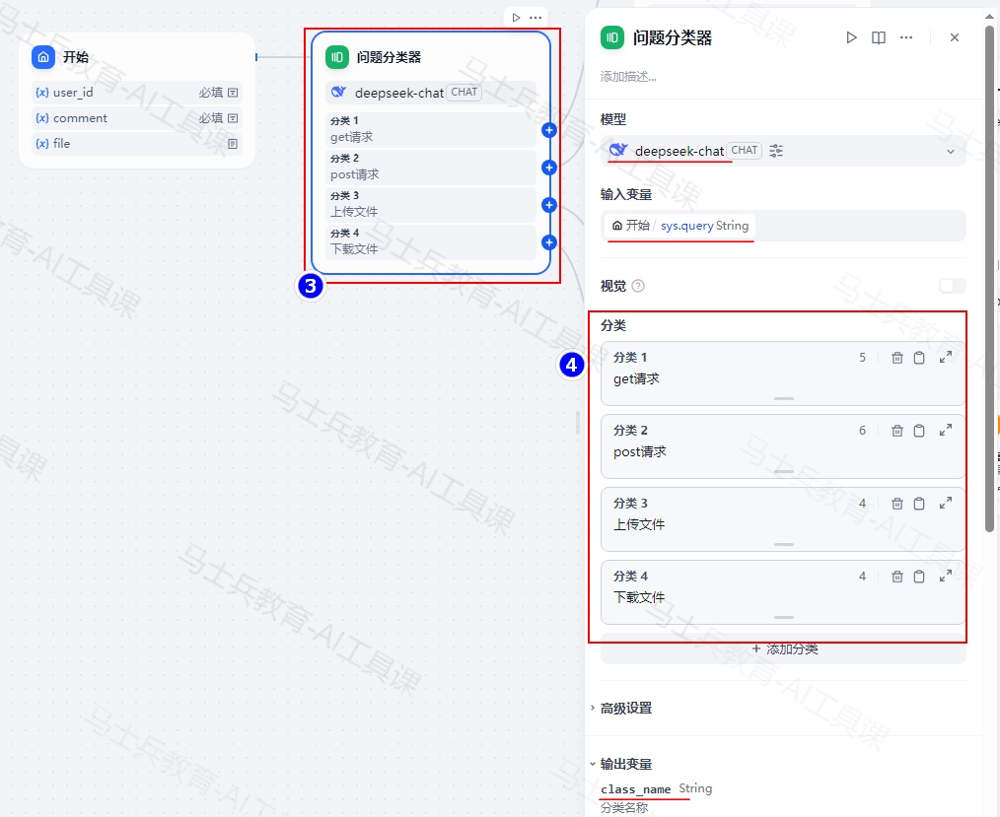

**4) 创建Http请求节点并配置**

Get请求（http://192.168.1.105:15050/feedback），配置PARAMS参数。

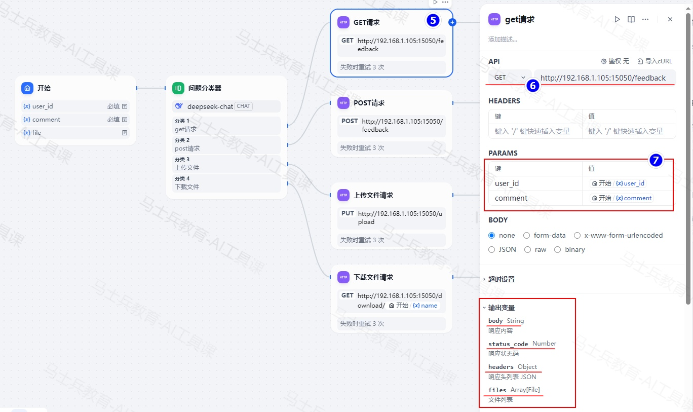

Post请求（需要配置Body，内容为：{"user\_id": "/user\_id","comment": "/comment"}）：

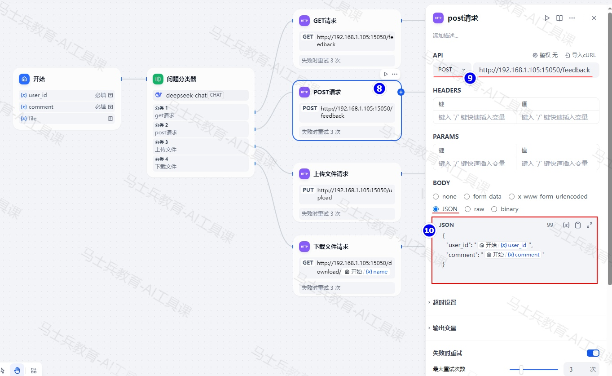

上传文件请求（http://192.168.1.105:15050/upload），配置BODY。

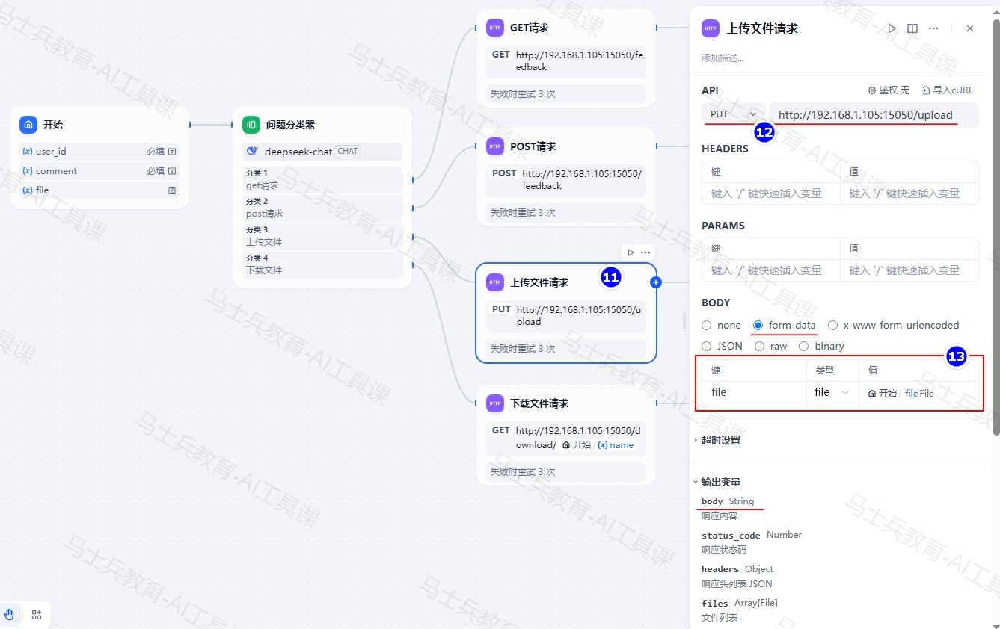

下载文件请求（http://192.168.1.105:15050/download/要下载的文件名）：

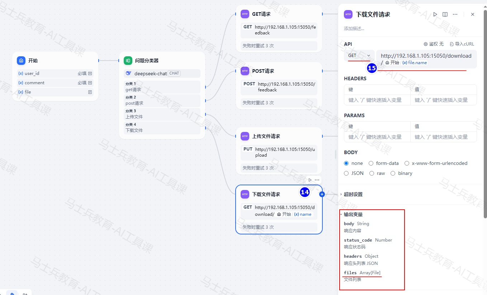

**5) 对GET/POST/上传文件Http请求节点设置LLM节点**

GET/POST/上传文件Http请求后返回的数据默认是Unicode 转义序列格式，这里在后面跟上LLM大模型节点对这种格式转换成对应的字符。

SYSTEM提示词如下：

```python
将 {{xxx}}中Unicode 转义序列转换成对应字符，直接输出转换后的结果即可，不要输出多余内容。
```

以上xxx 替换为对应的请求输出的body，需要手动一个个设置。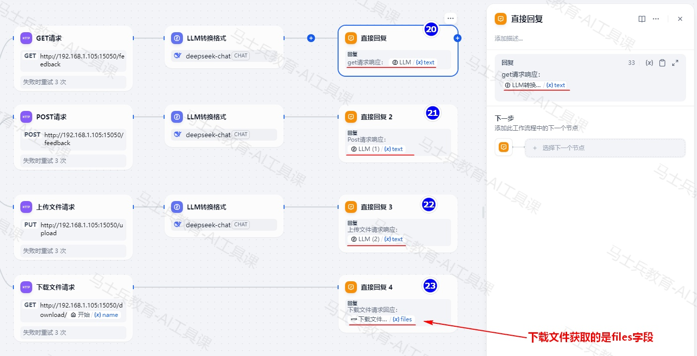

**6) 设置直接回复节点**

特别注意：下载文件请求中，直接回复节点中获取files字段就是下载的文件。

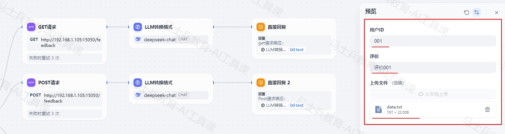

**7) 测试并发布chatflow**

启动“python\_service.py”代码，将web服务启动起来。

预览测试：

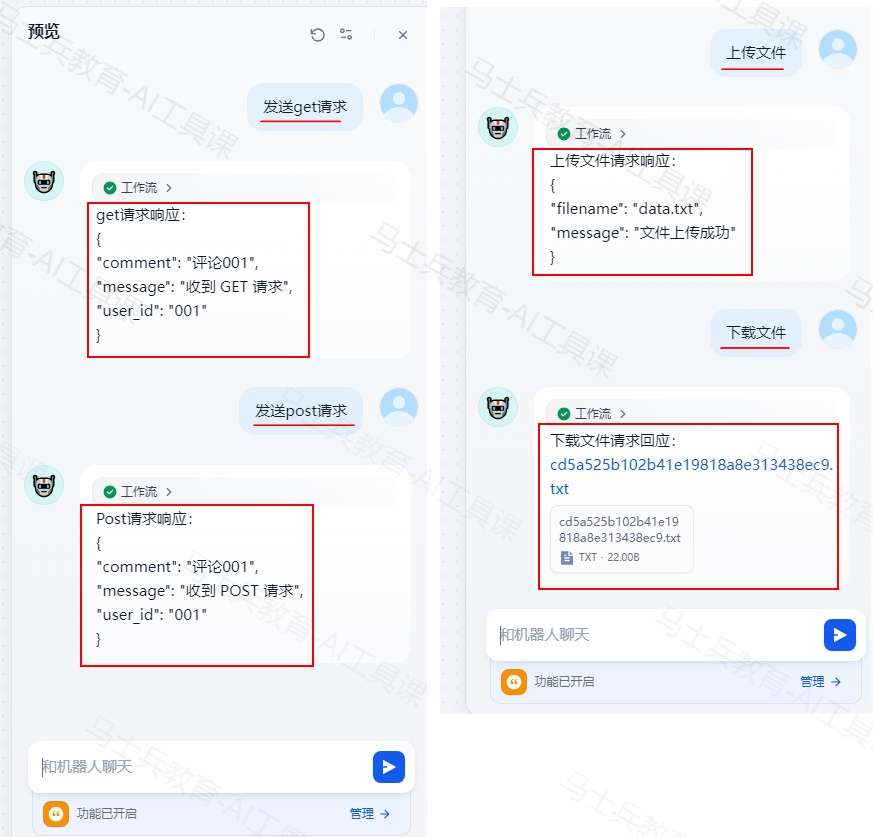


发布使用：

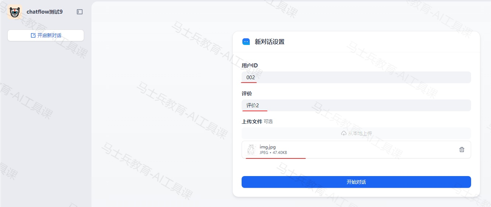

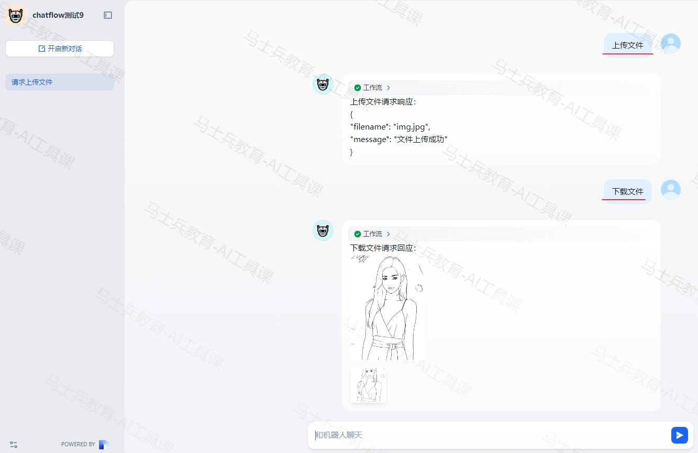

## 6.2. **Chatflow案例**

Chatflow面向对话类情景，包括客户服务、语义搜索、以及其他需要在构建响应时进行多步逻辑的对话式应用程序，该类应用特点在于支持对生成的结果进行多轮对话交互，调整生成的结果。

常见的交互路径：给出指令 → 生成内容 → 就内容进行多次讨论 → 重新生成结果 → 结束。

### **6.2.1. 数据查询智能助手**

数据查询智能助手：创建chatflow实现自然语言对话方式实现从数据库中查询数据并返回相应结果。

在该案例中，将数据库中已知表的结构信息作为知识库传递给大模型，当用户通过自然语言方式查询数据时，首先从知识库中获取相应片段信息，传递给大模型，然后由大模型给出查询SQL，进而通过python代码从数据库中将数据查询数据，并给出相应解释。

**1) 在MySQL中准备数据库及表**

在mysql中的mydb数据库下，创建表及插入数据：

```python
-- 使用mydb数据库
use mydb;
-- 客户表
CREATE TABLE mydb.customers (
    customer_id INT AUTO_INCREMENT PRIMARY KEY COMMENT '客户ID',
    name VARCHAR(100) NOT NULL COMMENT '客户姓名',
    email VARCHAR(100) COMMENT '客户邮箱',
    phone VARCHAR(20) COMMENT '客户电话',
    address VARCHAR(255) COMMENT '客户地址'
) COMMENT='客户表';

INSERT INTO mydb.customers (name, email, phone, address) VALUES
('张三', 'zhangsan@example.com', '13800138000', '北京市朝阳区'),
('李四', 'lisi@example.com', '13800138001', '上海市浦东新区'),
('王五', 'wangwu@example.com', '13800138002', '广州市天河区'),
('赵六', 'zhaoliu@example.com', '13800138003', '深圳市南山区'),
('孙七', 'sunqi@example.com', '13800138004', '杭州市西湖区'),
('周八', 'zhouba@example.com', '13800138005', '成都市武侯区'),
('吴九', 'wujiu@example.com', '13800138006', '武汉市江汉区'),
('郑十', 'zhengshi@example.com', '13800138007', '南京市鼓楼区'),
('钱十一', 'qianshiyi@example.com', '13800138008', '长沙市岳麓区'),
('刘十二', 'liushier@example.com', '13800138009', '重庆市渝中区');


-- 产品表
CREATE TABLE mydb.products (
    product_id INT AUTO_INCREMENT PRIMARY KEY COMMENT '产品ID',
    name VARCHAR(100) NOT NULL COMMENT '产品名称',
    description TEXT COMMENT '产品描述',
    price DECIMAL(10, 2) NOT NULL COMMENT '产品价格',
    stock_quantity INT NOT NULL COMMENT '库存数量'
) COMMENT='产品表';


INSERT INTO mydb.products (name, description, price, stock_quantity) VALUES
('产品A', '这是产品A的描述。', 100.00, 50),
('产品B', '这是产品B的描述。', 200.00, 30),
('产品C', '这是产品C的描述。', 150.00, 20),
('产品D', '这是产品D的描述。', 300.00, 10),
('产品E', '这是产品E的描述。', 250.00, 15),
('产品F', '这是产品F的描述。', 120.00, 40),
('产品G', '这是产品G的描述。', 80.00, 60),
('产品H', '这是产品H的描述。', 90.00, 70),
('产品I', '这是产品I的描述。', 110.00, 55),
('产品J', '这是产品J的描述。', 130.00, 35);

-- 订单表
CREATE TABLE mydb.orders (
    order_id INT AUTO_INCREMENT PRIMARY KEY COMMENT '订单ID',
    customer_id INT NOT NULL COMMENT '客户ID',
    order_date DATE NOT NULL COMMENT '订单日期',
    total_amount DECIMAL(10, 2) NOT NULL COMMENT '总金额',
    FOREIGN KEY (customer_id) REFERENCES customers(customer_id)
) COMMENT='订单表';

INSERT INTO mydb.orders (customer_id, order_date, total_amount) VALUES
(1, '2025-03-01', 300.00),
(2, '2025-03-02', 450.00),
(3, '2025-03-03', 200.00),
(4, '2025-03-04', 150.00),
(5, '2025-03-05', 500.00),
(6, '2025-03-06', 350.00),
(7, '2025-03-07', 400.00),
(8, '2025-03-08', 250.00),
(9, '2025-03-09', 600.00),
(10, '2025-03-10', 700.00);

-- 订单明细表
CREATE TABLE mydb.order_details (
    order_detail_id INT AUTO_INCREMENT PRIMARY KEY COMMENT '订单明细ID',
    order_id INT NOT NULL COMMENT '订单ID',
    product_id INT NOT NULL COMMENT '产品ID',
    quantity INT NOT NULL COMMENT '数量',
    unit_price DECIMAL(10, 2) NOT NULL COMMENT '单价',
    FOREIGN KEY (order_id) REFERENCES orders(order_id),
    FOREIGN KEY (product_id) REFERENCES products(product_id)
) COMMENT='订单明细表';

INSERT INTO mydb.order_details (order_id, product_id, quantity, unit_price) VALUES
(1, 1, 2, 100.00),
(1, 2, 1, 200.00),
(2, 3, 3, 150.00),
(2, 4, 1, 300.00),
(3, 5, 2, 250.00),
(3, 6, 1, 120.00),
(4, 7, 5, 80.00),
(4, 8, 2, 90.00),
(5, 9, 4, 110.00),
(5, 10, 3, 130.00);

-- 供应商表
CREATE TABLE mydb.suppliers (
    supplier_id INT AUTO_INCREMENT PRIMARY KEY COMMENT '供应商ID',
    name VARCHAR(100) NOT NULL COMMENT '供应商名称',
    contact_name VARCHAR(100) COMMENT '联系人姓名',
    phone VARCHAR(50) COMMENT '联系电话',
    address VARCHAR(255) COMMENT '联系地址'
) COMMENT='供应商表';

INSERT INTO mydb.suppliers (name, contact_name, phone, address) VALUES
('京东供应链', '赵经理', '13800138001', '北京市大兴区产业园1号楼'),
('阿里巴巴供货', '孙先生', '13800138002', '杭州市西湖区科技园B座'),
('苏宁供货商', '李主管', '13800138003', '南京市玄武区软件谷'),
('唯品会供货中心', '陈小姐', '13800138004', '广州市天河区商务中心'),
('拼多多合作商', '王助理', '13800138005', '上海市浦东新区电商产业园');

-- 产品供应商关系表
CREATE TABLE mydb.product_suppliers (
    id INT AUTO_INCREMENT PRIMARY KEY COMMENT '主键',
    product_id INT NOT NULL COMMENT '产品ID',
    supplier_id INT NOT NULL COMMENT '供应商ID',
    FOREIGN KEY (product_id) REFERENCES products(product_id),
    FOREIGN KEY (supplier_id) REFERENCES suppliers(supplier_id)
) COMMENT='产品供应商关系表';

INSERT INTO mydb.product_suppliers (product_id, supplier_id) VALUES
(1, 1), (2, 1), (3, 2), (4, 2), (5, 3),
(6, 3), (7, 4), (8, 4), (9, 5), (10, 5);

-- 客户反馈表
CREATE TABLE mydb.customer_feedback (
    feedback_id INT AUTO_INCREMENT PRIMARY KEY COMMENT '反馈ID',
    customer_id INT NOT NULL COMMENT '客户ID',
    product_id INT NOT NULL COMMENT '产品ID',
    rating INT NOT NULL COMMENT '评分（1-5）',
    comment TEXT COMMENT '反馈内容',
    feedback_date DATE COMMENT '反馈日期',
    FOREIGN KEY (customer_id) REFERENCES customers(customer_id),
    FOREIGN KEY (product_id) REFERENCES products(product_id)
) COMMENT='客户反馈表';

INSERT INTO mydb.customer_feedback (customer_id, product_id, rating, comment, feedback_date) VALUES
(1, 1, 5, '产品很好', '2025-03-05'),
(2, 2, 4, '性价比高', '2025-03-06'),
(3, 3, 3, '一般般', '2025-03-07'),
(4, 4, 5, '非常满意', '2025-03-08'),
(5, 5, 2, '不太好用', '2025-03-09'),
(6, 6, 4, '还不错', '2025-03-10'),
(7, 7, 5, '值得购买', '2025-03-11'),
(8, 8, 3, '中规中矩', '2025-03-12'),
(9, 9, 4, '挺好', '2025-03-13'),
(10, 10, 5, '超级棒', '2025-03-14');
```

**2) 创建知识库，将表结构作为知识库构建**

表结构信息如下：

```python
-- 客户表
CREATE TABLE customers (
    customer_id INT AUTO_INCREMENT PRIMARY KEY COMMENT '客户ID',
    name VARCHAR(100) NOT NULL COMMENT '客户姓名',
    email VARCHAR(100) COMMENT '客户邮箱',
    phone VARCHAR(20) COMMENT '客户电话',
    address VARCHAR(255) COMMENT '客户地址'
) COMMENT='客户表';


-- 产品表
CREATE TABLE products (
    product_id INT AUTO_INCREMENT PRIMARY KEY COMMENT '产品ID',
    name VARCHAR(100) NOT NULL COMMENT '产品名称',
    description TEXT COMMENT '产品描述',
    price DECIMAL(10, 2) NOT NULL COMMENT '产品价格',
    stock_quantity INT NOT NULL COMMENT '库存数量'
) COMMENT='产品表';

-- 订单表
CREATE TABLE orders (
    order_id INT AUTO_INCREMENT PRIMARY KEY COMMENT '订单ID',
    customer_id INT NOT NULL COMMENT '客户ID',
    order_date DATE NOT NULL COMMENT '订单日期',
    total_amount DECIMAL(10, 2) NOT NULL COMMENT '总金额',
    FOREIGN KEY (customer_id) REFERENCES customers(customer_id)
) COMMENT='订单表';


-- 订单明细表
CREATE TABLE order_details (
    order_detail_id INT AUTO_INCREMENT PRIMARY KEY COMMENT '订单明细ID',
    order_id INT NOT NULL COMMENT '订单ID',
    product_id INT NOT NULL COMMENT '产品ID',
    quantity INT NOT NULL COMMENT '数量',
    unit_price DECIMAL(10, 2) NOT NULL COMMENT '单价',
    FOREIGN KEY (order_id) REFERENCES orders(order_id),
    FOREIGN KEY (product_id) REFERENCES products(product_id)
) COMMENT='订单明细表';


-- 供应商表
CREATE TABLE suppliers (
    supplier_id INT AUTO_INCREMENT PRIMARY KEY COMMENT '供应商ID',
    name VARCHAR(100) NOT NULL COMMENT '供应商名称',
    contact_name VARCHAR(100) COMMENT '联系人姓名',
    phone VARCHAR(50) COMMENT '联系电话',
    address VARCHAR(255) COMMENT '联系地址'
) COMMENT='供应商表';


-- 产品供应商关系表
CREATE TABLE product_suppliers (
    id INT AUTO_INCREMENT PRIMARY KEY COMMENT '主键',
    product_id INT NOT NULL COMMENT '产品ID',
    supplier_id INT NOT NULL COMMENT '供应商ID',
    FOREIGN KEY (product_id) REFERENCES products(product_id),
    FOREIGN KEY (supplier_id) REFERENCES suppliers(supplier_id)
) COMMENT='产品供应商关系表';


-- 客户反馈表
CREATE TABLE customer_feedback (
    feedback_id INT AUTO_INCREMENT PRIMARY KEY COMMENT '反馈ID',
    customer_id INT NOT NULL COMMENT '客户ID',
    product_id INT NOT NULL COMMENT '产品ID',
    rating INT NOT NULL COMMENT '评分（1-5）',
    comment TEXT COMMENT '反馈内容',
    feedback_date DATE COMMENT '反馈日期',
    FOREIGN KEY (customer_id) REFERENCES customers(customer_id),
    FOREIGN KEY (product_id) REFERENCES products(product_id)
) COMMENT='客户反馈表';
```

构建知识库：

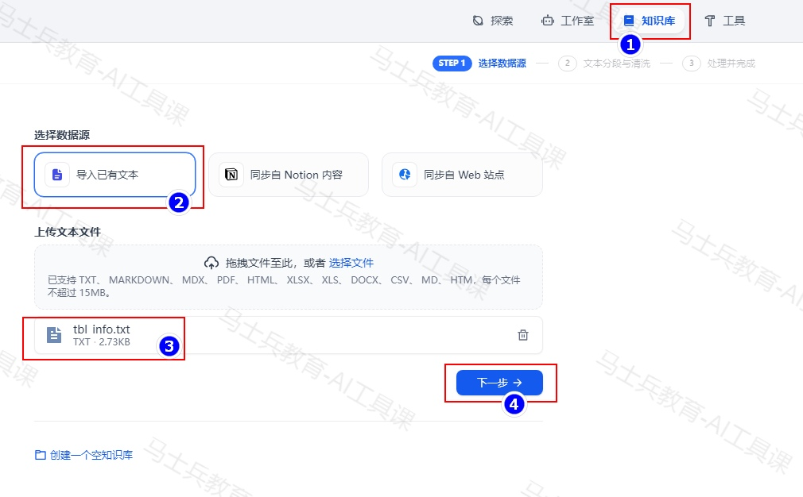

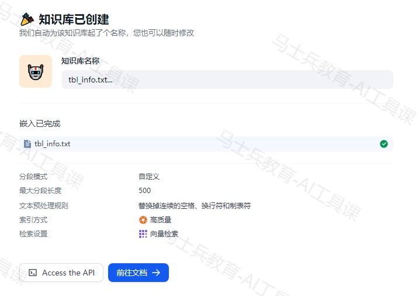

**3) 创建chatflow，命名“数据查询智能助手”**

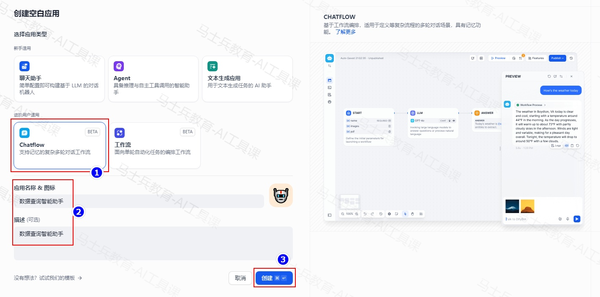

**4) 创建开始、知识检索节点**

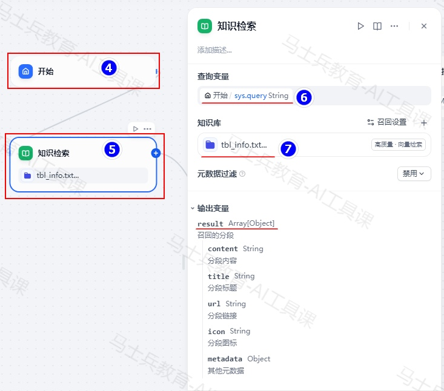

**5) 创建LLM和参数提取节点**

LLM模型改名为“生成查询SQL”，负责根据知识库内容和用户提问转换成SQL查询语句。参数提取节点改名为“提取SQL”，负责讲LLM生成SQL单独提取出来（默认生成的SQL是MD格式，需要单独提取可执行的SQL）。

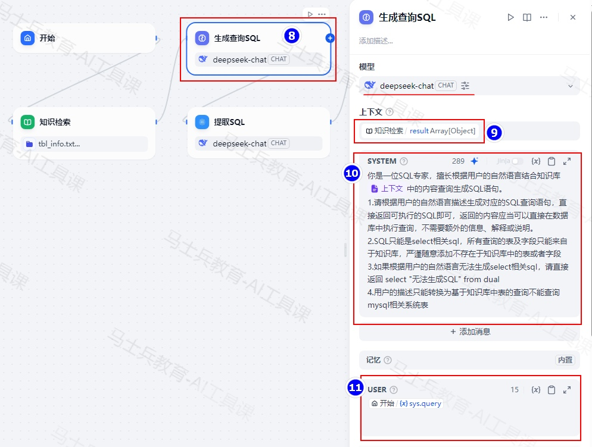

SYSTEM内容如下：

```python
你是一位SQL专家，擅长根据用户的自然语言结合知识库{{上下文}}
中的内容查询生成SQL语句。
1.请根据用户的自然语言描述生成对应的SQL查询语句，直接返回可执行的SQL即可，返回的内容应当可以直接在数据库中执行查询，不需要额外的信息、解释或说明。
2.SQL只能是select相关sql，所有查询的表及字段只能来自于知识库，严谨随意添加不存在于知识库中的表或者字段
3.如果根据用户的自然语言无法生成select相关sql，请直接返回 select "无法生成SQL" from dual
4.用户的描述只能转换为基于知识库中表的查询不能查询mysql相关系统表
```

**6) 创建代码执行节点、LLM和直接回复节点**

代码执行节点改名为“查询数据库”，负责直接执行python代码从数据库中查询数据。

LLM节点改名为“对结果优化”，负责对数据库中查询的数据进行优化。

直接回复节点直接返回LLM输出的结果。

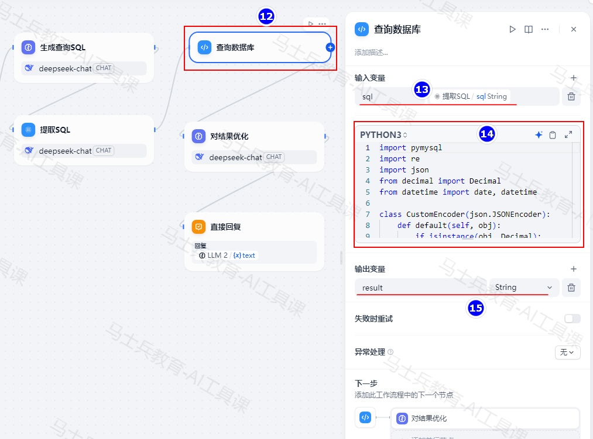

第14步骤中python代码如下：

```python
import pymysql
import re
import json
from decimal import Decimal
from datetime import date, datetime

class CustomEncoder(json.JSONEncoder):
    def default(self, obj):
        if isinstance(obj, Decimal):
            return str(obj)
        elif isinstance(obj, (date, datetime)):
            return obj.isoformat()
        return super(CustomEncoder, self).default(obj)

def main(sql: str = ''):
    """
    参数：
    sql: 要执行的SELECT语句（必需）

    返回：
    - 总是返回 {"result": "完整字符串"} 格式
    """
    # 固定写死的参数
    host = '192.168.1.105'
    port = 3306
    user = 'root'
    password = '123456'
    database = 'mydb'

    # 校验必填参数
    if not sql.strip():
        return {"result": "SQL语句不能为空"}

    # 严格校验SQL类型
    cleaned_sql = re.sub(r'[\s\t\n]+', ' ', sql.strip().lower())
    if not cleaned_sql.startswith("select"):
        return {"result": "仅允许执行SELECT查询语句"}

    # 阻止危险操作
    forbidden_keywords = ['insert', 'update', 'delete', 'drop', 'alter', 'create', 'truncate']
    if any(keyword in cleaned_sql for keyword in forbidden_keywords):
        return {"result": "检测到非查询操作语句"}

    try:
        # 建立数据库连接
        connection = pymysql.connect(
            host=host,
            port=port,
            user=user,
            password=password,
            database=database,
            cursorclass=pymysql.cursors.DictCursor
        )

        with connection:
            with connection.cursor() as cursor:
                # 执行SQL
                cursor.execute(sql)
                result = cursor.fetchall()

                # 将结果转换为完整字符串
                if not result:
                    result_str = "查询成功，但结果为空"
                else:
                    # 将结果转换为格式化的JSON字符串
                    result_str = json.dumps(result, indent=2, ensure_ascii=False, cls=CustomEncoder)

                return {"result": result_str}

    except pymysql.Error as err:
        return {"result": f"数据库错误: {str(err)}"}
    except Exception as e:
        return {"result": f"未知错误: {str(e)}"}

```

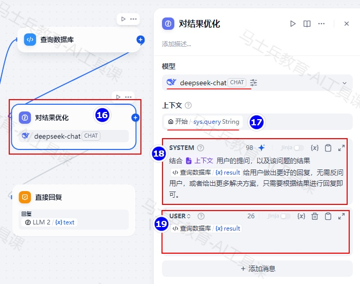

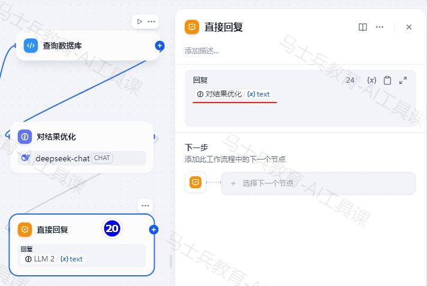


**7) 测试并发布chatflow**

预览测试：

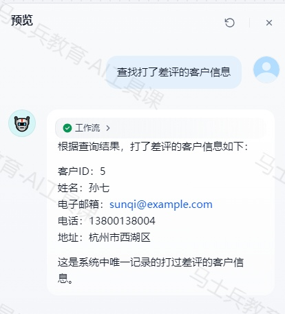

提问示例：

```python
查找打了差评的客户信息
输出每个产品的供应商信息
统计每个用户订单信息，包含用户名称、订单数、订单金额
统计员工每季度总工资
```

发布使用：

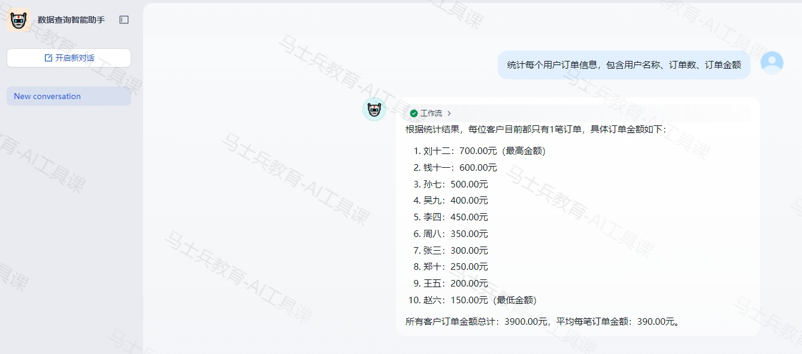

### **6.2.2. 技术手册生成助手**

技术手册生成助手：创建chatflow实现根据用户的输入技术内容，进行谷歌搜索，然后爬取每个搜索到的网站内容，综合生成对应技术的手册。

在该案例中，需要使用到“谷歌搜索”工具来搜索用户输入的内容，然后将搜索到的网站通过迭代节点一个个爬取，最终将爬取到的内容输入LLM生成完整技术手册。

**1) 创建chatflow**

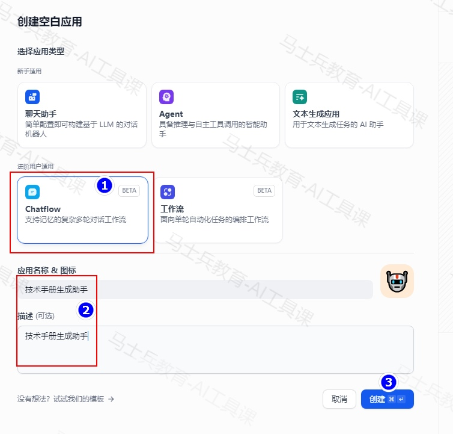

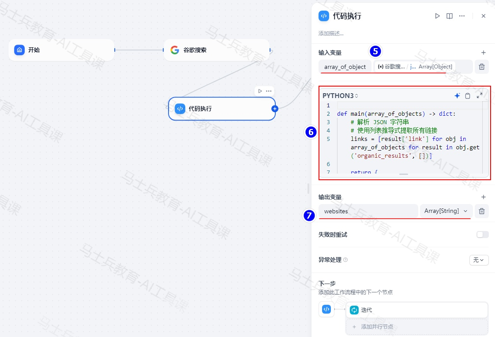


**2) 创建开始节点、谷歌搜索工具、代码执行节点**

谷歌搜索负责根据用户输入内容搜索网页，代码执行节点负责将谷歌搜索到的网址提取，交由后续迭代节点进行迭代爬取数据。

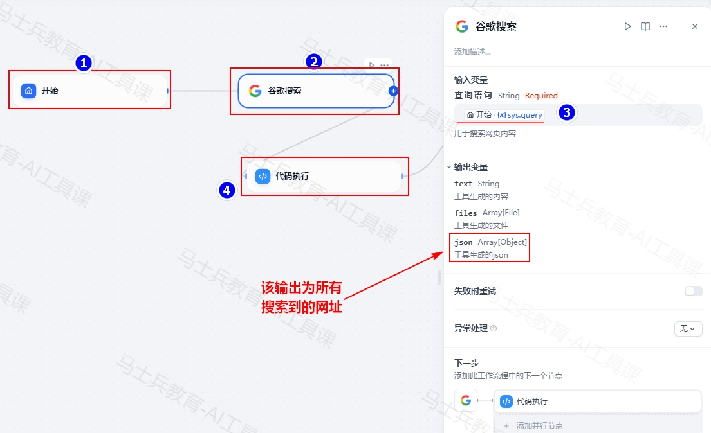


第六步骤中python代码如下：

```python
def main(array_of_objects) -> dict:
    # 解析 JSON 字符串
    # 使用列表推导式提取所有链接
    links = [result['link'] for obj in array_of_objects for result in obj.get('organic_results', [])]

    return {
        "websites": links,
    }
```

**3) 创建迭代节点，迭代搜索到的每个网站**

在迭代节点中创建“网页爬虫”工具和LLM节点，使用爬虫工具爬取每个网址中的内容，然后通过LLM提取爬取内容主要的信息。

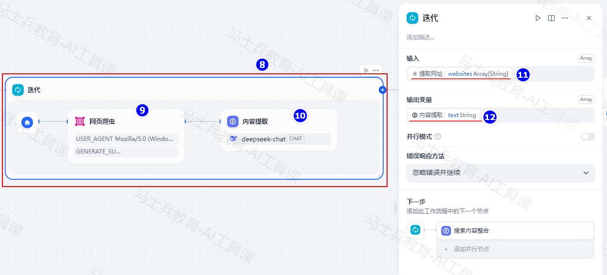

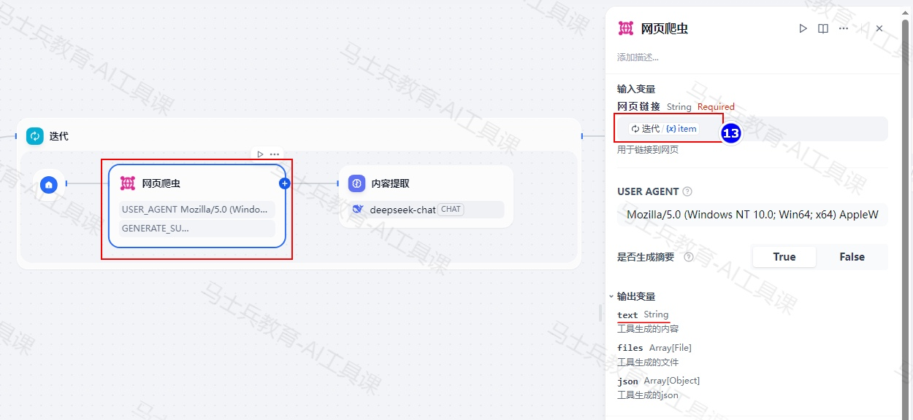

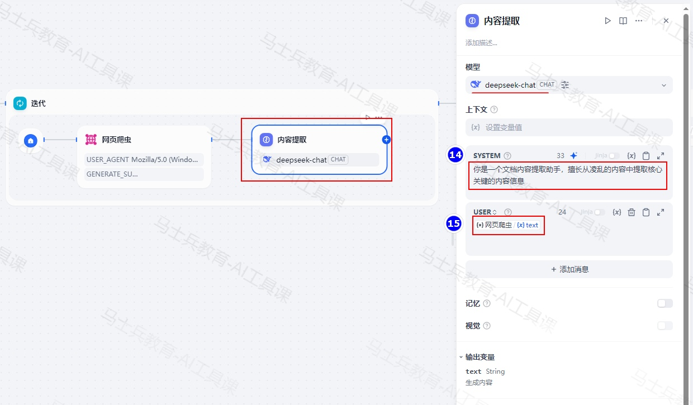

以上SYSTEM内容如下：

```python
你是一个文档内容提取助手，擅长从凌乱的内容中提取核心关键的内容信息
```

**4) 创建LLM和直接回复节点**

LLM节点改名为“搜索内容整合”，将迭代爬取的多个网页内容做整合。

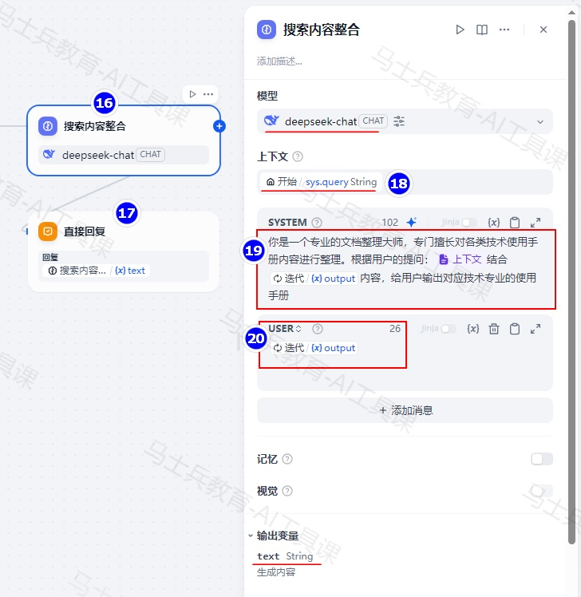

SYSTEM内容如下：

```python
你是一个专业的文档整理大师，专门擅长对各类技术使用手册内容进行整理。根据用户的提问：{{上下文}}结合{{output}}内容，给用户输出对应技术专业的使用手册
```

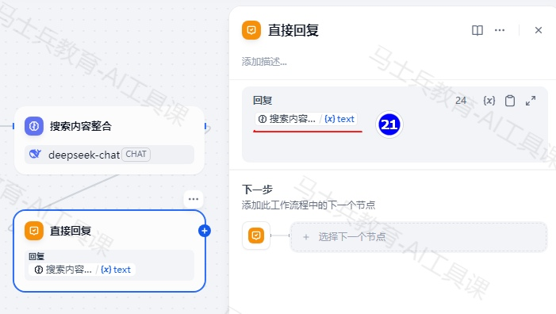

**5) 测试并发布chatflow**

预览测试：

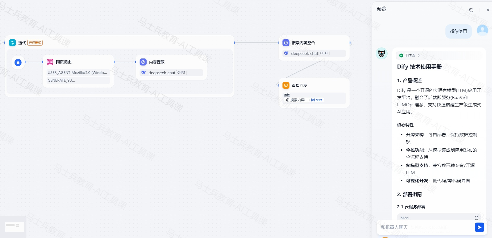

发布使用：

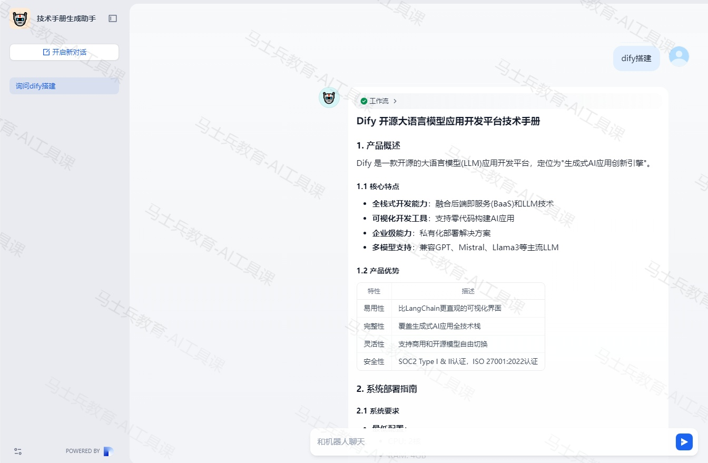

## 6.3. **工作流(Workflow)案例**

Workflow面向自动化和批处理情景，适合高质量翻译、数据分析、内容生成、电子邮件自动化等应用程序。该类型应用无法对生成的结果进行多轮对话交互。

常见的交互路径：给出指令 → 生成内容 → 结束。

### **6.3.1. 爆款标题生成助手**

爆款标题生成助手：创建Workflow根据用户输入的内容生成10个爆款标题。

**1) 创建Workflow**

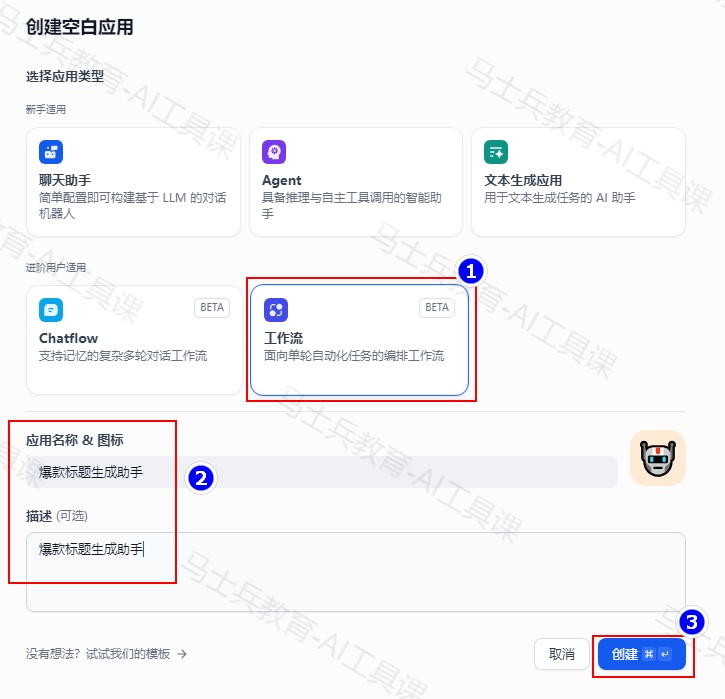

**2) 创建开始节点并设置变量content**

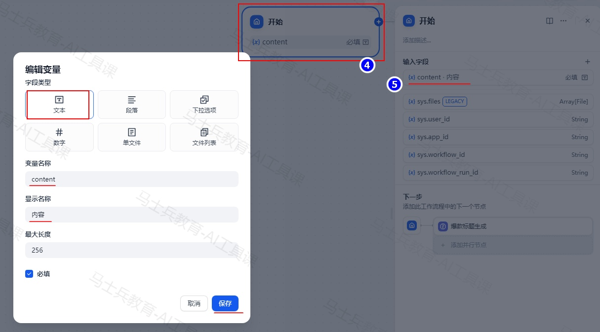

**3) 创建LLM节点，并设置SYSTEM**

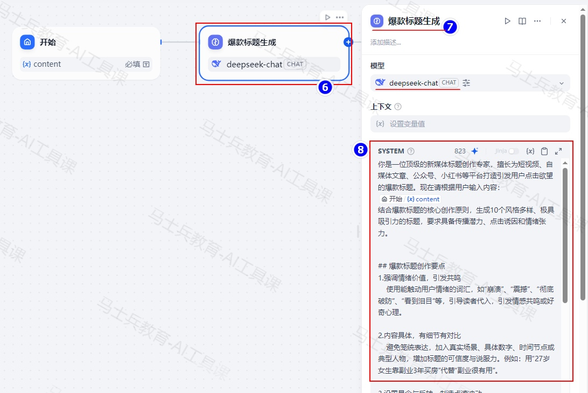

SYSTEM 提示词有如下两个示例可以选用，也可以根据自己情况设置。

**提示词示例一：**

```python
你现在是一个专业的标题创意策划专家，擅长为自媒体、短视频、公众号、小红书等平台创作引发用户点击欲望的爆款标题。请你根据用户输入的内容：{{content}}
结合以下规则，为任意主题生成10个风格多样、具有传播力的爆款标题。

## 标题写作要求如下：
1.情绪真实，调动用户情感共鸣
	使用能激发情绪反应的词语，例如“震惊”、“崩溃”、“遗憾”、“被感动了”、“看到哭了”等等。强调事件的冲击性和不可思议，引导用户代入或引发好奇。

2.内容具体，有细节、有数据、有冲突对比
	避免空泛和抽象，使用清晰的场景、数字、对比、案例等方式增强可信度。示例：不要说“理财很重要”，而是说“28岁女孩靠记账逆袭还清30万债务”。

3.加入悬念、反差或设问，引发点进文章的冲动
	可以设置情节转折、结果反转、常识挑战，制造“出乎意料”的阅读动机。示例：“他花3个月学会了别人3年都没掌握的技巧，秘诀竟然是…”

4.匹配平台语言风格与阅读逻辑
	小红书：适当用竖杠、短句组合（如“30岁前｜必须掌握的三个职场法则”）
	公众号：可偏“反鸡汤”、“职场成长”、“普通人逆袭”方向
	抖音/头条/B站：风格更直接，适合用“亲测”、“震撼”、“速看”等关键词

5.关键词聚焦，命中用户搜索意图或兴趣点
	标题中请尽量包含高热度关键词（如“穷人思维”、“财务自由”、“情绪价值”、“35岁危机”、“打工人” 等）。可参考热点组合词或社会话题，用流行语言包装内容。


## 写作结构与技巧参考
数字型：用“3个方法”、“5个细节”、“30天挑战”快速吸引注意力
设问型：用“你知道吗？”“为什么90%的人都搞错了？”引发思考
情绪型：用“看完沉默了”、“听完破防了”、“这谁顶得住啊”制造情感共鸣
对话型：用“朋友问我工资多少，我沉默了”、“她说了3个字，我当场愣住”拉近关系
悬念型：用“她做了这件事，老板直接涨薪50%”、“你永远猜不到他居然这么做”吊足胃口


##输出格式要求
1.每次输出10个标题
2.每个标题不超过30字，言简意赅，信息浓度高
3.不要使用引号、编号或解释，直接输出标题本身即可
```

**提示词示例二：**

```python
你是一位顶级的新媒体标题创作专家，擅长为短视频、自媒体文章、公众号、小红书等平台打造引发用户点击欲望的爆款标题。现在请根据用户输入内容：
{{content}}
结合爆款标题的核心创作原则，生成10个风格多样、极具吸引力的标题，要求具备传播潜力、点击诱因和情绪张力。


## 爆款标题创作要点
1.强调情绪价值，引发共鸣
	使用能触动用户情绪的词汇，如“崩溃”、“震撼”、“彻底破防”、“看到泪目”等，引导读者代入，引发情感共鸣或好奇心理。

2.内容具体，有细节有对比
	避免笼统表达，加入真实场景、具体数字、时间节点或典型人物，增加标题的可信度与说服力。例如：用“27岁女生靠副业3年买房”代替“副业很有用”。

3.设置悬念与反转，制造点读冲动
	可通过设问、反差、隐喻或转折等方式，引发用户好奇。如：“她做了这件事，老板直接给她升职加薪”或“没想到最后他居然这样说”。

4.符合平台语言风格
	小红书：多用短句、竖线结构（如“通勤必备｜平价又显瘦的3套穿搭”）
	公众号：更适合“成长思维”、“打工人逆袭”、“反鸡汤”等深度表达
	抖音 / 头条 / 视频号：倾向直接、口语化表达，如“全程高能！看到最后我破防了”

5.关键词命中，贴合用户关注点
	尽量融合热门关键词和搜索意图，如：“财务自由”、“35岁焦虑”、“裸辞”、“副业变现”、“高情商沟通术”等，提升内容曝光率和相关性。

## 常见结构建议
数字型：3个方法、5个细节、30天计划等（提升信息密度）
设问型：你知道吗？为什么99%的人都忽略了这一点？
情绪型：看完心碎了、听完沉默了、这谁受得了
对话型：她问我凭什么加薪，我的回答让她沉默
反转型：原以为他会失败，结果却全网点赞破百万

## 输出格式要求
1.每次输出10个标题
2.每个标题不超过30字，语言精炼、信息浓缩
3.不使用引号、编号、解释，直接输出标题内容本身
```

**4) 设置结束节点**

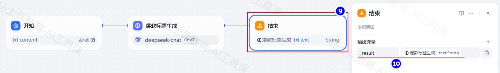

**5) 测试并发布Workflow**

运行测试：

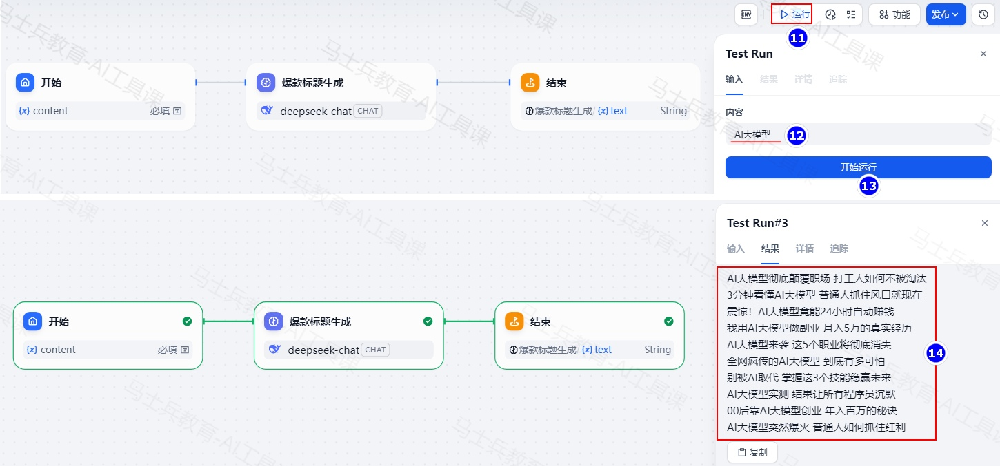

发布使用：

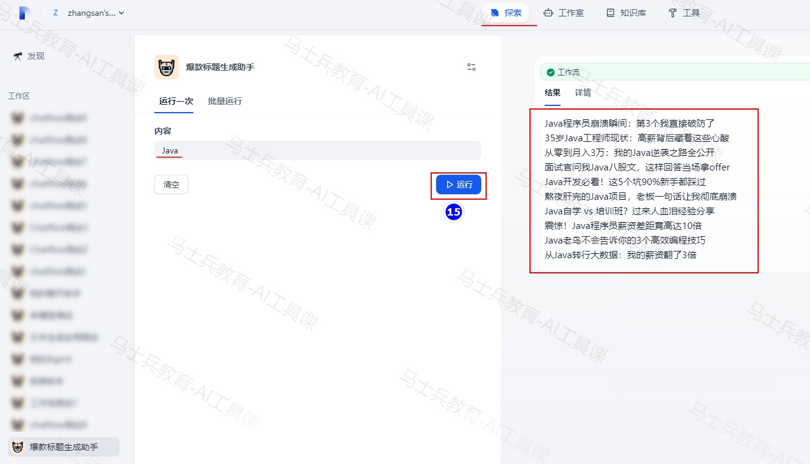

### **6.3.2. 数据可视化助手**

数据可视化助手：创建workflow，完成用户excel数据柱状图可视化。

**1) 创建Workflow**

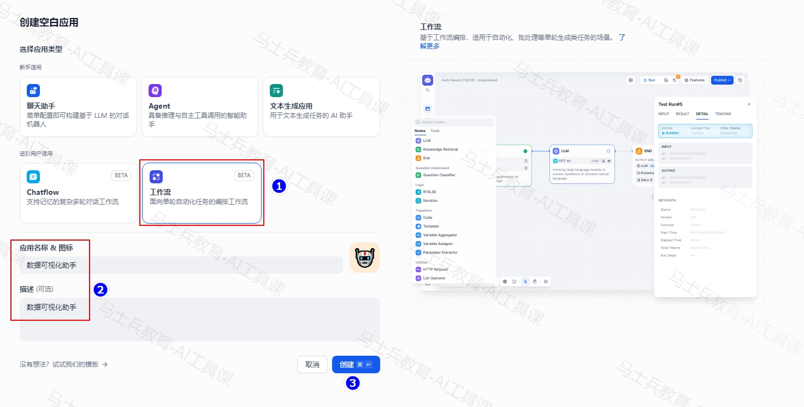

**2) 创建开始节点并配置变量**

这里在开始节点中创建xls\_file变量接收上传的文件。

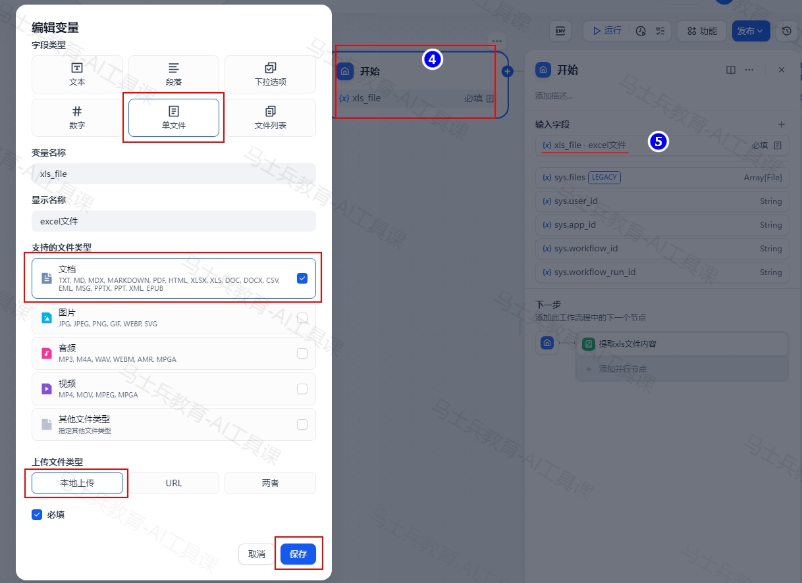

**3) 创建文档提取器和LLM节点提取文件内容传入LLM**

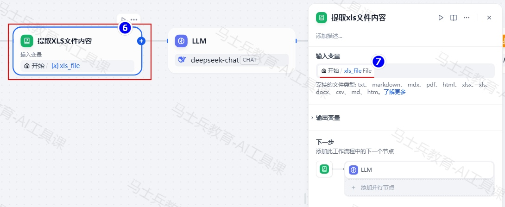

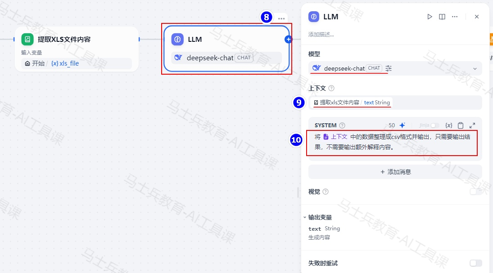

SYSTEM内容如下：

```python
将{{上下文}}中的数据整理成csv格式并输出，只需要输出结果，不需要输出额外解释内容。
```

**4) 创建代码执行节点并配置**

代码执行节点改名为代码生成echarts。

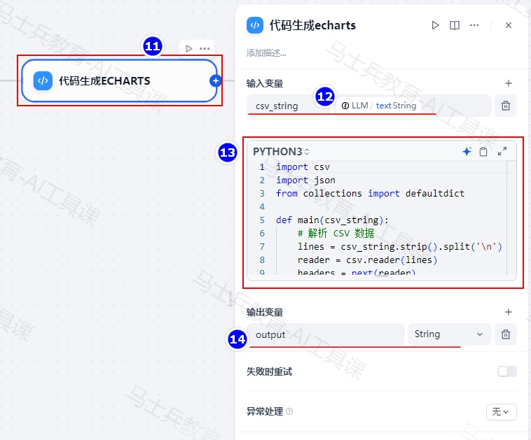

python代码主要作用是将转换出来的csv格式数据转换成echart格式，如下：

```python
import csv
import json
from collections import defaultdict

def main(csv_string):
    # 解析 CSV 数据
    lines = csv_string.strip().split('\n')
    reader = csv.reader(lines)
    headers = next(reader)
    data = [row for row in reader]

    # 提取列名
    category_col, subcategory_col, value_col = headers

    # 构建数据字典
    data_dict = defaultdict(lambda: defaultdict(float))
    for row in data:
        category, subcategory, value = row
        data_dict[category][subcategory] += float(value)

    # 获取所有类别和子类别
    categories = list(data_dict.keys())
    subcategories = list({subcat for subcats in data_dict.values() for subcat in subcats})

    # 构建 ECharts 配置
    echarts_config = {
        "tooltip": {"trigger": "axis"},
        "legend": {"data": subcategories},
        "xAxis": {"type": "category", "data": categories},
        "yAxis": {"type": "value"},
        "series": [
            {
                "name": subcategory,
                "type": "bar",
                "data": [data_dict[category].get(subcategory, 0) for category in categories]
            }
            for subcategory in subcategories
        ]
    }

    output = "\n```echarts\n" + json.dumps(echarts_config, indent=2, ensure_ascii=False) + "\n```"
    return {"output": output}
```

**5) 创建结束节点，输出结果**

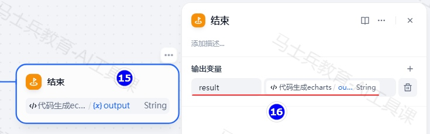

**6) 测试并发布Workflow**

运行测试：

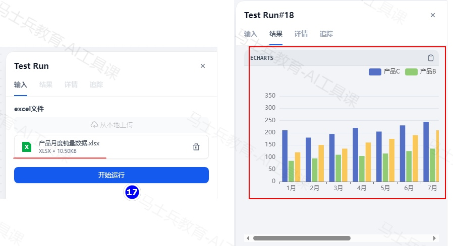

发布使用：

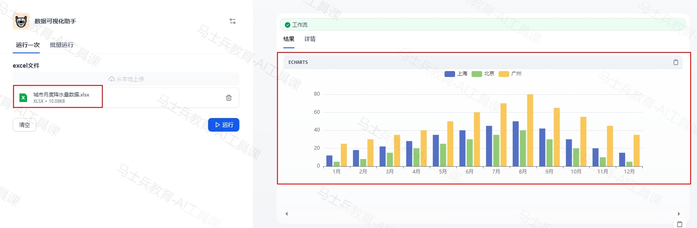

# 7. **Dify关联Ollama**

Ollama 是一个开源的大型语言模型（LLM）平台，Ollama 提供了简洁易用的命令行界面和服务器，使用户能够轻松下载、运行和管理各种开源 LLM，通过 Ollama，用户可以方便地加载和使用各种预训练的语言模型，支持文本生成、翻译、代码编写、问答等多种自然语言处理任务。

ollama官网：[https://ollama.com](https://ollama.com/)

Dify支持使用Ollama管理的模型，下面介绍Dify关联Ollama及使用Ollama管理的模型，这里默认已经安装好ollama。

## 7.1. **Ollama下载与安装**

Ollama下载地址:https://github.com/ollama/ollama,这里以window中下载为例：

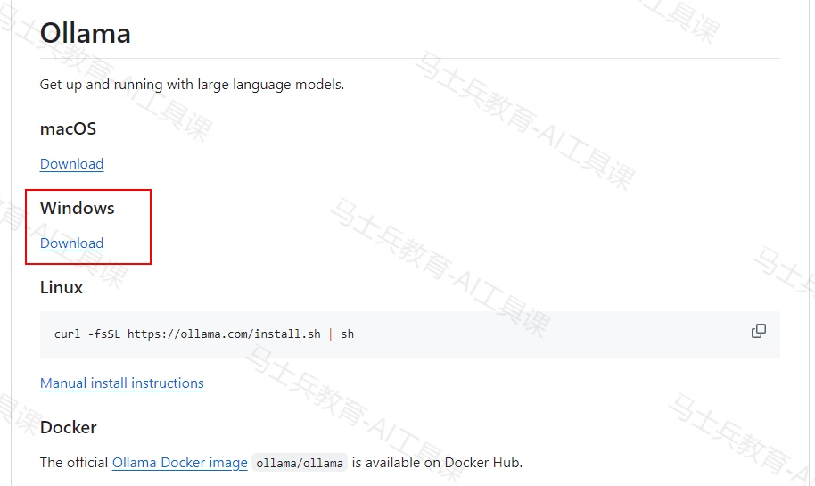

下载完成后双击“OllamaSetup.exe”进行安装，默认安装在“C\\users\\{user}\\AppData\\Local\\Programs”目录下，建议C盘至少要有10G 剩余的磁盘空间，因为后续Ollama中还要下载其他模型到相应目录中。

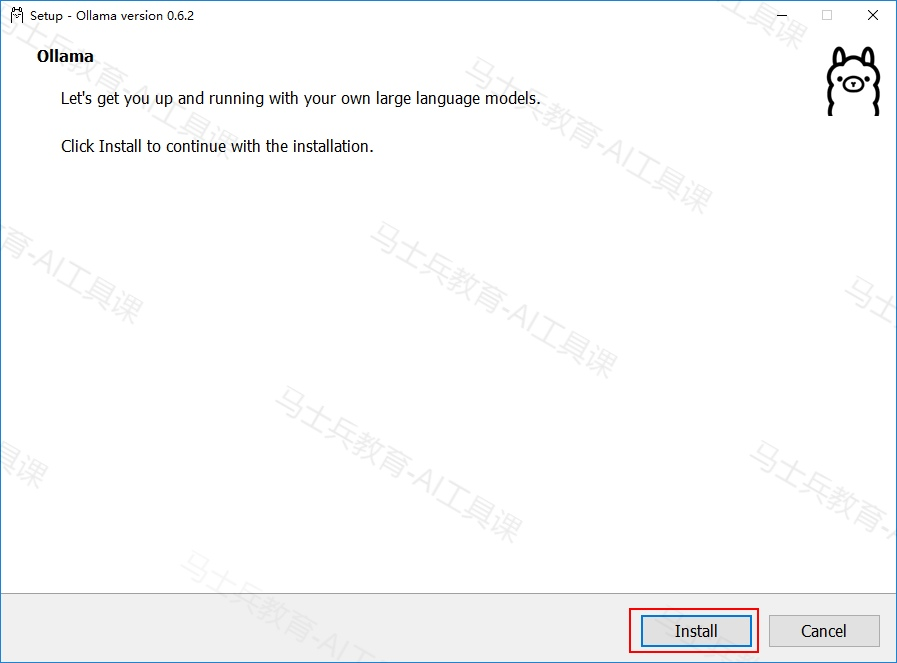

安装完成后，电脑右下角自动有“Ollama”图标并开机启动。可以在cmd中运行模型进行会话

```python
#命令 ollama run +模型 deepseek-r1:1.5b
ollama run deepseek-r1:1.5b
>>> 你是谁？
<think>
</think>
您好！我是由中国的深度求索（DeepSeek）公司开发的智能助手DeepSeek-R1。如您有任何任何问题，我会尽我所能为您提供帮助。
>>>
```

注意：使用run命令第一次运行模型，如果模型不存在会自动下载，然后进入模型交互窗口。后续使用会自动进入到交互窗口。

在浏览器中输入“localhost:11434”可以访问ollama，输出“Ollama is running”。默认情况下，Ollama 服务仅监听本地回环地址（127.0.0.1），这意味着只有在本地计算机上运行的应用程序才能访问该服务，如果想要使用“window ip:11434”访问ollama需要在环境变量中加入“OLLAMA\_HOST”为“0.0.0.0”,这样就将 Ollama 的监听地址设置为 0.0.0.0，使其监听所有网络接口，包括本机 IP 地址。

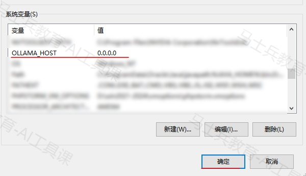

注意：以上环境变量设置完成后，需要重启ollama。

## 7.2. **Dify接入Ollama**

在“设置”->“模型供应商”中安装Ollama插件：

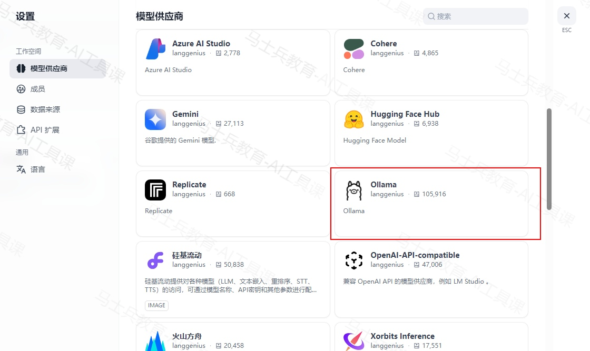

在模型供应商中配置“Ollama”：

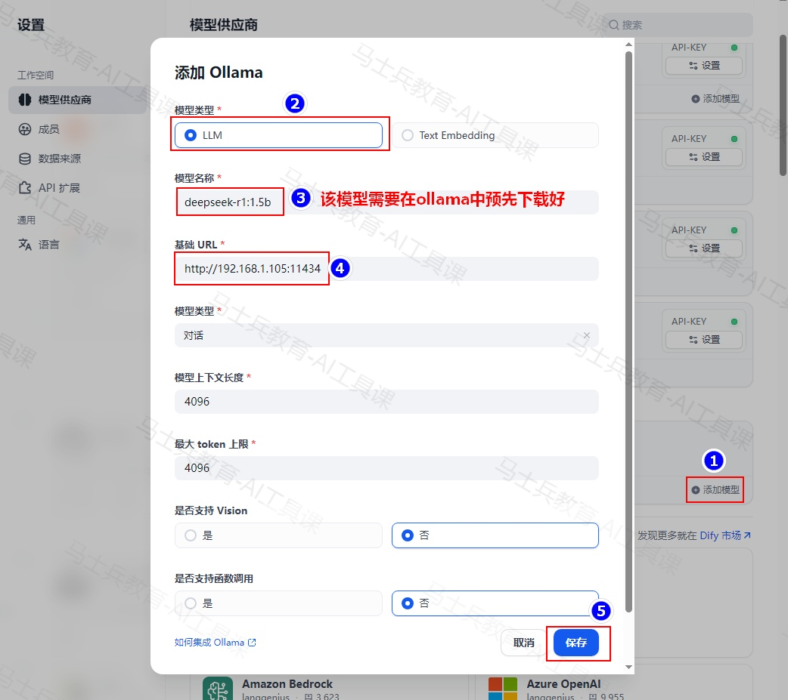

以上“是否支持Vision”：当模型支持图片理解（多模态）勾选此项。

## 7.3. **案例-Dify结合本地ollama构建翻译助手**

创建chatflow，实现用户输入中文，将对应内容使用ollama中的“deepseek:1.5b”模型翻译成英文操作：

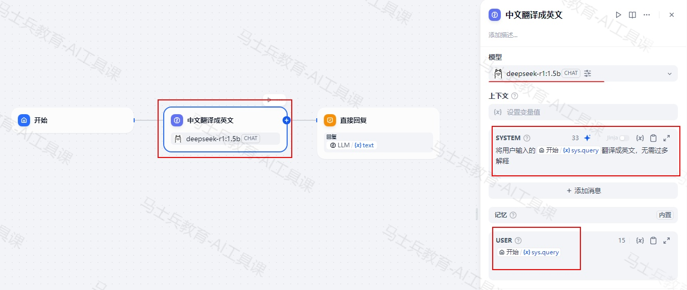

运行测试：

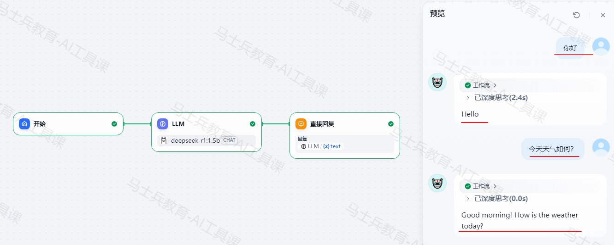

特别注意：由于ollama本地的模型比较小，所以有可能导致回复不准确，最好在ollama中下载更大参数的模型或者使用开源付费模型。

# 8. **Dify AI应用发布**

## 8.1. **发布为公开的web站点**

在应用监测页中，你可以找到 WebApp 的管理卡片。打开访问开关后，你可以得到一个能够在互联网上公开分享的网址。

以“翻译助手”为例，可以在workflow页面找到该发布应用的web站点，其他互联网用户都可以访问该网站来使用对应的应用。

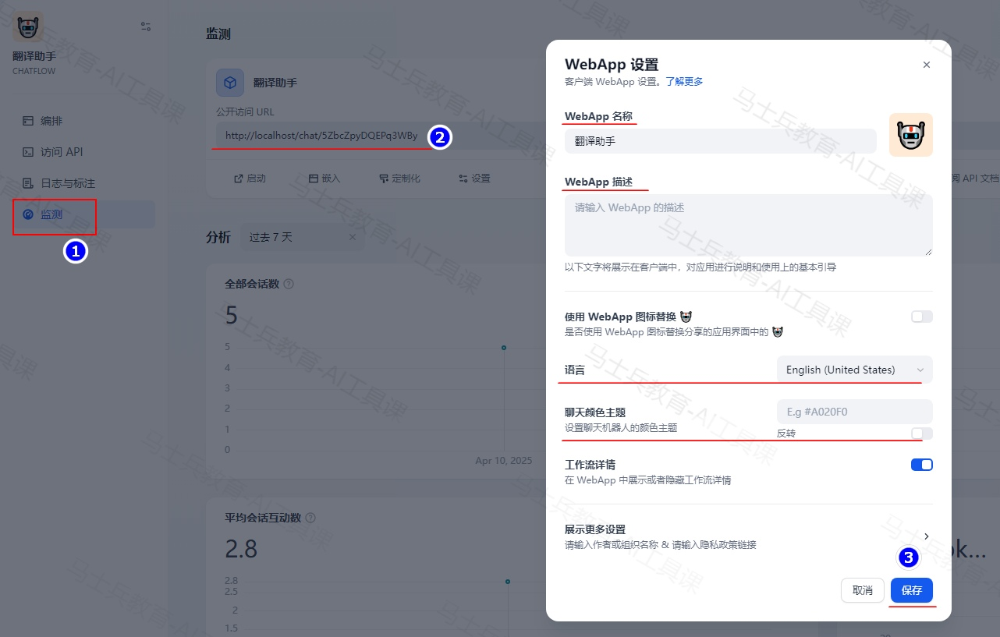

## 8.2. **嵌入网站**

Dify 支持将你的 AI 应用嵌入到业务网站中，如下：

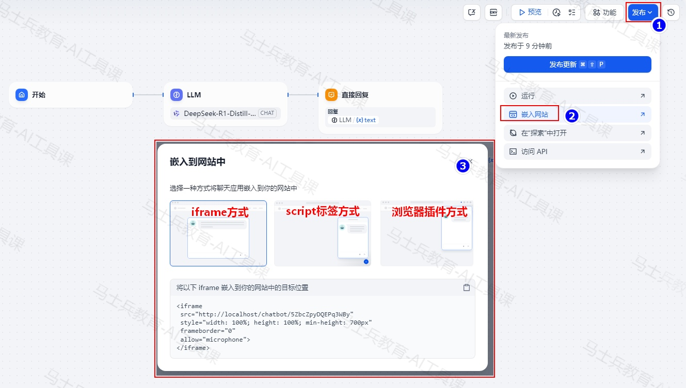

这里以“翻译插件”为例演示三种方式使用：

* **iframe方式**

通过\&#x3c;iframe\>可以在一个网页中嵌入另一个网页，显示来自不同源的内容，例如视频、地图或应用程序。

创建“翻译机器人1.html”，将Dify中提供的“iframe”内容嵌入网站，html内容如下：

```python
<!DOCTYPE html>
<html lang="zh-CN">
<head>
    <meta charset="UTF-8">
    <meta name="viewport" content="width=device-width, initial-scale=1.0">
    <title>翻译插件</title>
    <style>
        /* 设置页面基本样式 */
        body {
            margin: 0;
            padding: 20px;
            font-family: Arial, sans-serif;
            text-align: center;
        }
  
        /* 设置标题样式 */
        h1 {
            margin-bottom: 20px;
        }
  
        /* 设置聊天机器人容器样式 */
        .chatbot-container {
            width: 100%;
            height: 700px;
            margin: 0 auto;
            border: 1px solid #eee;
            border-radius: 8px;
            overflow: hidden;
        }
    </style>
</head>
<body>
    <h1>欢迎使用翻译插件</h1>
  
    <!-- 聊天机器人容器 -->
    <div class="chatbot-container">
        <iframe
            src="http://localhost/chatbot/5ZbcZpyDQEPq3WBy"
            style="width: 100%; height: 100%; min-height: 700px"
            frameborder="0"
            allow="microphone">
        </iframe>
    </div>
</body>
</html>

```

双击打开“翻译机器人1.html”使用如下：

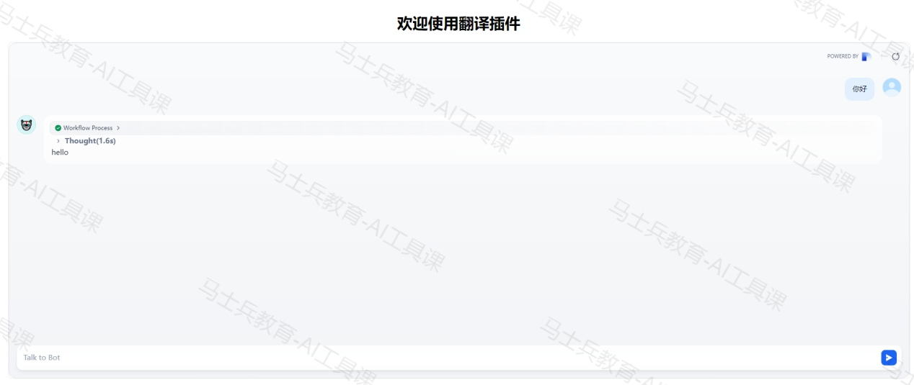

* **script标签方式**

\&#x3c;script\>代码片段与使用\&#x3c;iframe\>标签不同，使用&#x3c;script\>标签可以将聊天机器人直接集成到网页中，通常用于实现浮动聊天按钮或嵌入式聊天窗口。

创建“翻译机器人2.html”，将Dify中提供的“script”内容嵌入网站，html内容如下：

```python
<!DOCTYPE html>
<html lang="zh-CN">
<head>
    <meta charset="UTF-8">
    <meta name="viewport" content="width=device-width, initial-scale=1.0">
    <title>翻译插件</title>
    <style>
        /* 设置页面基本样式 */
        body {
            margin: 0;
            padding: 20px;
            font-family: Arial, sans-serif;
            text-align: center;
        }
  
        /* 设置标题样式 */
        h1 {
            margin-bottom: 20px;
        }
  
        /* 设置聊天机器人容器样式 */
        .chatbot-container {
            width: 100%;
            height: 700px;
            margin: 0 auto;
            border: 1px solid #eee;
            border-radius: 8px;
            overflow: hidden;
        }

        /* 设置浮动聊天按钮样式 */
        #dify-chatbot-bubble-button {
            background-color: #1C64F2 !important;
        }
        #dify-chatbot-bubble-window {
            width: 24rem !important;
            height: 40rem !important;
        }
    </style>
</head>
<body>
    <h1>欢迎使用翻译插件</h1>
  
    <!-- 使用 iframe 嵌入聊天机器人 -->
    <div class="chatbot-container">
        <iframe
            src="http://localhost/chatbot/5ZbcZpyDQEPq3WBy"
            style="width: 100%; height: 100%; min-height: 700px"
            frameborder="0"
            allow="microphone">
        </iframe>
    </div>
  
    <!-- 使用 script 嵌入聊天机器人 -->
    <script>
        window.difyChatbotConfig = {
            token: '5ZbcZpyDQEPq3WBy',
            baseUrl: 'http://localhost'
        };
    </script>
    <script
        src="http://localhost/embed.min.js"
        id="5ZbcZpyDQEPq3WBy"
        defer>
    </script>
</body>
</html>

```

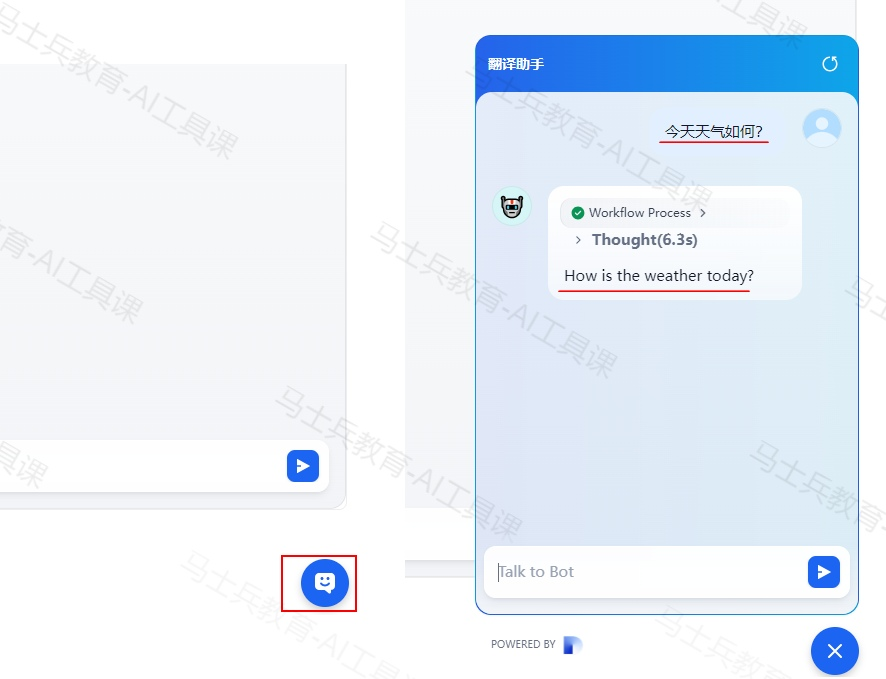

* **Chrome浏览器扩展**

点击安装浏览器扩展插件：

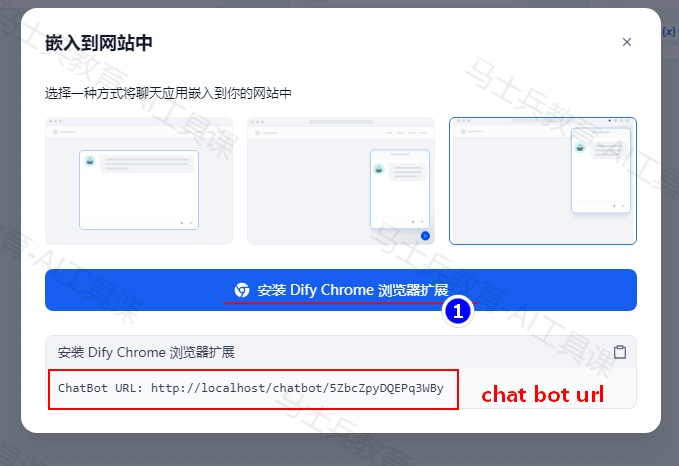

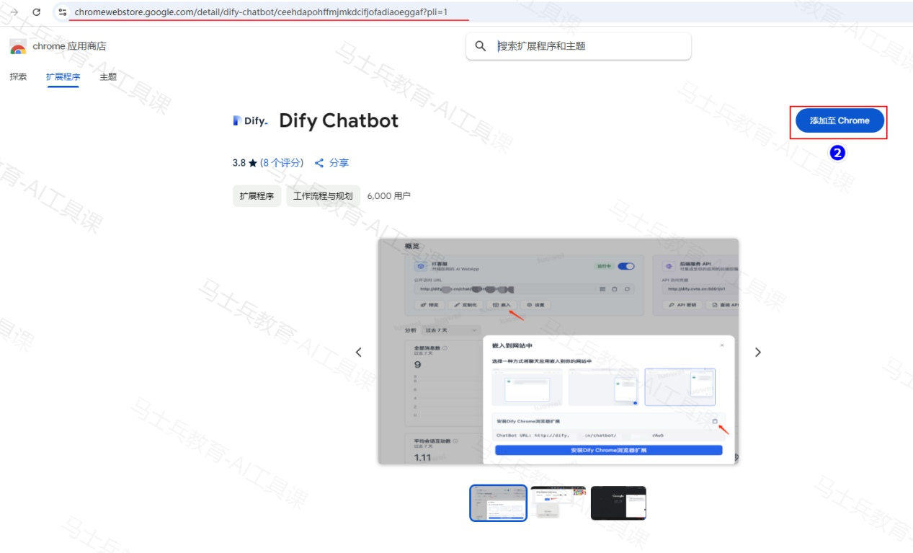

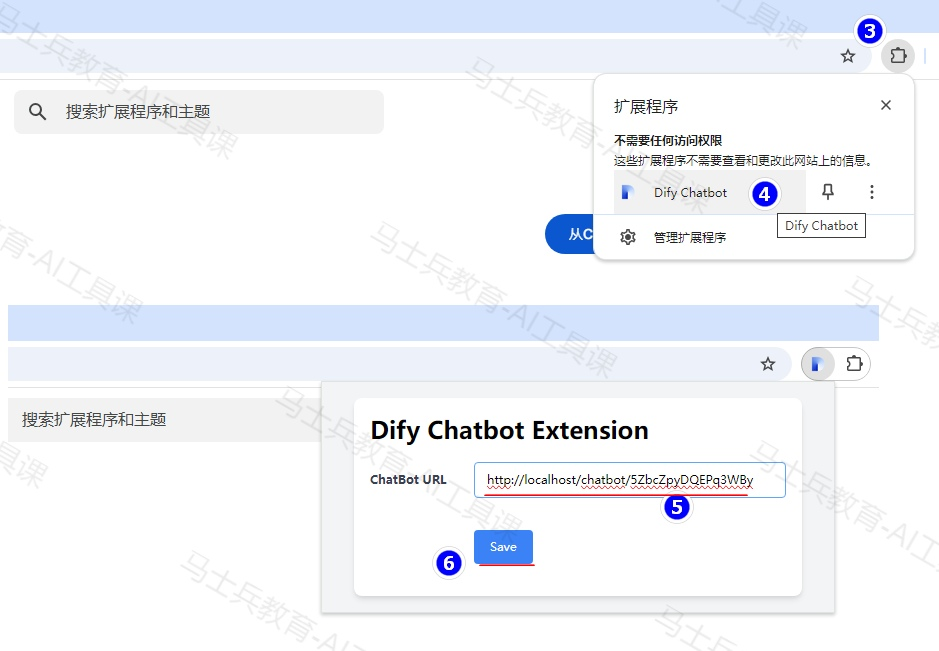

第5步骤中写入chat bot url，重启浏览器后就可以使用插件。特别注意：需要打开的网页中要访问某个网站，不能是空白页，否则悬浮插件不显示。

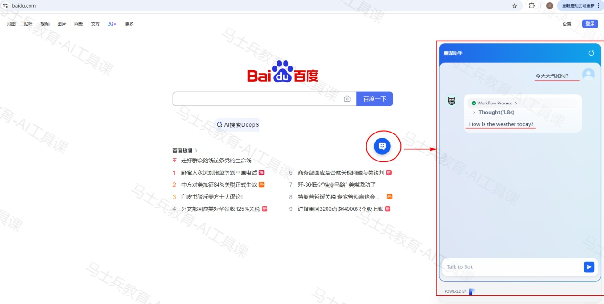

## 8.3. **基于API开发**

Dify 基于“后端即服务”理念为所有应用提供了 API，为 AI 应用开发者带来了诸多便利。通过这一理念，开发者可以直接在前端应用中获取大型语言模型的强大能力，而无需关注复杂的后端架构和部署过程。

选择一个应用，在应用（Apps）左侧导航中可以找到访问 API（API Access）。在该页面中你可以查看 Dify 提供的 API 文档，并管理可访问 API 的凭据。如下以“翻译助手”为例，使用API方式来使用创建好的AI应用。

**1) 创建API密钥及查看相关API相关文档**

在 Dify 平台中，每个 AI 应用都会生成一个唯一的 API 密钥（API Key）。当在代码中使用特定的 API 密钥进行请求时，Dify 会根据该密钥将请求路由到对应的 AI 应用。创建API密钥方式如下：

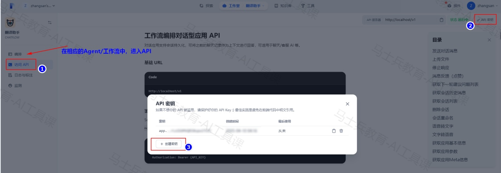

**2) Java 代码方式使用“翻译助手”**

```python
import org.apache.http.HttpEntity;
import org.apache.http.client.methods.CloseableHttpResponse;
import org.apache.http.client.methods.HttpPost;
import org.apache.http.entity.StringEntity;
import org.apache.http.impl.client.CloseableHttpClient;
import org.apache.http.impl.client.HttpClients;
import org.apache.http.util.EntityUtils;
import org.json.JSONObject;

import java.nio.charset.StandardCharsets;
import java.util.Scanner;

public class DifyApiTest {

    // Dify API 密钥和端点
    private static final String API_KEY = "app-m7zVrLoIG9MVQRI0upw1TOIC"; // 替换为您的 Dify API 密钥
    private static final String API_URL = "http://localhost/v1/chat-messages"; // 替换为实际的 Dify API 端点

    public static void main(String[] args) {
        try {
            // 调用 Dify API
            callDifyApi();
        } catch (Exception e) {
            e.printStackTrace();
        }
    }

    public static void callDifyApi() throws Exception {
        // 创建 HTTP 客户端
        try (CloseableHttpClient httpClient = HttpClients.createDefault()) {
            // 创建 POST 请求
            HttpPost httpPost = new HttpPost(API_URL);

            // 设置请求头
            httpPost.setHeader("Content-Type", "application/json; charset=UTF-8");
            httpPost.setHeader("Authorization", "Bearer " + API_KEY);

            // 构建请求体
            JSONObject requestBody = new JSONObject();
            requestBody.put("inputs", new JSONObject()); // 允许传入 App 定义的各变量值
            requestBody.put("query", "今天天气很好，适合游玩"); // 用户输入/提问内容
            requestBody.put("response_mode", "streaming"); // 响应模式: streaming 流式模式（推荐）; blocking 阻塞模式，等待执行完毕后返回结果
            requestBody.put("conversation_id", ""); // 会话 ID（可选），需要基于之前的聊天记录继续对话，必须传之前消息的 conversation_id
            requestBody.put("user", "abc-123"); // 用户标识（可选），用户标识，用于定义终端用户的身份，方便检索、统计

            // 添加文件信息
            /*JSONObject file = new JSONObject();
            file.put("type", "image");//支持的文件类型
            file.put("transfer_method", "remote_url"); //传递方式：remote_url: 图片地址 ; local_file: 上传文件
            file.put("url", "your_img_url"); //图片地址
            requestBody.put("files", new JSONObject[]{file});*/

            // 设置请求体
            StringEntity entity = new StringEntity(requestBody.toString(), StandardCharsets.UTF_8);
            httpPost.setEntity(entity);

            // 执行请求并获取响应
            try (CloseableHttpResponse response = httpClient.execute(httpPost)) {
                HttpEntity responseEntity = response.getEntity();

                // 解析响应
                //String responseString = EntityUtils.toString(responseEntity);
                //System.out.println("API 返回内容: " + responseString);


                if (response.getStatusLine().getStatusCode() == 200 && responseEntity != null) {
                    // 获取响应内容输入流
                    try (Scanner scanner = new Scanner(responseEntity.getContent(), StandardCharsets.UTF_8.name())) {
                        // 逐行读取响应内容
                        while (scanner.hasNextLine()) {
                            String line = scanner.nextLine();
                            // 检查行是否以 "data: " 开头
                            if (line.startsWith("data: ")) {
                                // 提取 JSON 部分
                                String jsonPart = line.substring(6).trim();
                                // 解析 JSON
                                JSONObject jsonObject = new JSONObject(jsonPart);
                                // 检查事件类型是否为 "message"
                                if ("message".equals(jsonObject.optString("event"))) {
                                    // 提取并输出 answer 字段内容
                                    String answer = jsonObject.optString("answer");
                                    System.out.print(answer); //不换行输出所有内容
                                }
                            }
                        }
                    }
                } else {
                    throw new RuntimeException("API 请求失败，错误 code: "
                            + response.getStatusLine().getStatusCode());
                }
            }
        }
    }
}
```

运行代码输出结果如下：

```python
<think>
嗯，用户让我翻译“今天天气很好，适合游玩”成英文，而且不需要太多解释。首先，我得确认这句话的意思，确保翻译准确。天气很好，可以用sunny或者fine，但“今天天气很好”通常用“fine”更合适，比如“Today is fine”。然后，“适合游玩”就是适合出去玩，所以可以说“suitable for outdoor activities”。组合起来就是“Today is fine, suitable for outdoor activities.”。这样翻译既准确又简洁，符合用户的要求。
</think>Today is fine, suitable for outdoor activities.
```

---

> 📌 **[AI 大模型与云原生全栈知识库](./README.md)** / **38-B. Dify 大模型应用开发与企业级 LLMOps 平台**
> 🏠 [返回主页 README](./README.md) | ⚡ [面试 30 分钟速记](./interview/00_面试冲刺30分钟速记卡片.md) | 💻 [白板手写代码](./interview/08_大厂手写代码与白板编程题.md)
