> 📌 **[AI 大模型与云原生全栈知识库](./README.md)** / **39. Coze (扣子) 零代码/低代码 AI 智能体开发与工作流平台**
> 🏠 [返回主页 README](./README.md) | ⚡ [面试 30 分钟速记](./interview/00_面试冲刺30分钟速记卡片.md) | 💻 [白板手写代码](./interview/08_大厂手写代码与白板编程题.md)

---

# 1. **Coze介绍**

## 1.1. **什么是Coze**

Coze（中文名“扣子”）是字节跳动推出的一款零代码 AI 聊天机器人和智能体开发平台，旨在帮助用户快速构建和部署基于大语言模型的 AI 应用。无论是否具备编程经验，用户都可以利用 Coze 创建个性化的聊天机器人，并将 AI 应用发布到各个社交平台、通讯软件，也可以通过 API 或 SDK 将 AI 应用集成到你的业务系统中。

**coze特点如下：**

**1) 灵活的工作流设计**

Coze 提供可视化的工作流编辑器，允许用户通过拖拽方式组合多种节点（如大语言模型、自定义代码、判断逻辑等），构建复杂且稳定的任务流程。即使没有编程基础的用户，也能轻松搭建如撰写行业研究报告等多步骤的工作流。

**2) 无限拓展的能力集**

平台集成了丰富的插件工具，极大地扩展了智能体的功能边界。用户可以直接添加官方发布的插件，如新闻插件，打造可以播报最新时事新闻的 AI 新闻播音员。此外，Coze 还支持创建自定义插件，用户可以将已有的 API 能力通过参数配置的方式快速创建插件，并供其他用户使用。

**3) 丰富的数据源**

Coze 提供简单易用的知识库功能，支持上传多种格式的本地文件或通过 URL 获取在线内容，构建智能体可访问的知识库。这使得智能体能够使用知识库中的内容回答问题，实现更精准的问答能力。

**4)  持久化的记忆能力**

平台提供了方便的数据库记忆功能，智能体可以持久记住用户对话中的重要参数或内容。例如，创建一个数据库来记录阅读笔记，包括书名、阅读进度和个人注释，使得智能体能够通过查询数据库中的数据，提供更准确的答案。

Coze官网：[https://www.coze.cn/](https://www.coze.cn/)

Coze官方文档地址：https://www.coze.cn/open/docs/guides

## 1.2. **Coze平台架构**

下图是Coze的平台架构：

 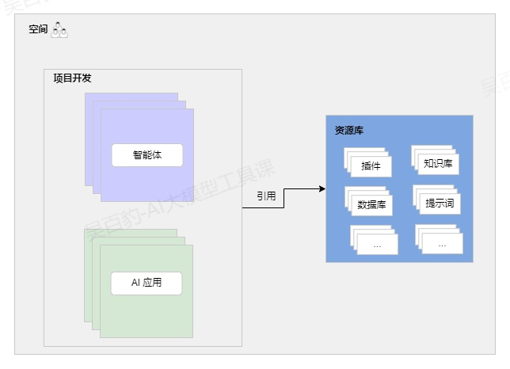

* **空间**

空间是资源组织的基础单元，不同空间内的资源和数据相互隔离。一个空间内可创建多个智能体和 AI 应用，并包含一个资源库。在资源库中创建的资源可以被相同空间内的智能体和 AI 应用使用。

* **项目开发**

项目分为智能体和 AI 应用两种类型，AI 应用内可以创建多种应用专属资源，也可以和智能体共享空间资源库中的资源。

**智能体**：智能体（Agent）通常指的是一个能够独立执行任务、做出决策并进行学习的一种自动化程序。智能体可以根据用户输入的指令，自主调用模型、知识库、插件等技能并完成编排，最终完成用户的指令。

**AI应用**：AI 应用是指利用大模型技术开发的应用程序，这些应用程序能够使用大模型，执行复杂任务，分析数据，并作出决策。

* **资源库**

你可以在资源库内创建、发布、管理共享资源例如插件、知识库、数据库、提示词等。这些资源可以被同一空间内的智能体和应用使用。资源可以存在于两个实体内，一个是空间的资源库，一个是 AI 应用项目中的项目资源库。

**空间资源库**：在空间资源库内创建的资源可以被空间内的 AI 应用项目和智能体项目使用，属于空间内的共享资源。

**AI 应用项目**：在 AI 应用项目中也可以创建资源，但这些资源是项目自有的资源，默认不可以被其他项目使用也不会展示在空间资源库内。

当需要将 AI 应用项目中的资源转换成公共资源给其他 AI 应用或智能体使用时，可以将这些资源转移或复制到空间资源库内。

## 1.3. **Coze订阅**

扣子推出个人免费版、个人进阶版、团队版以及企业版订阅套餐，各个订阅套餐的权益范围不同，采用包年包月+按量付费的混合计费模式。

个人免费版为默认套餐，无需付费即可使用，适合个人用户进行简单尝鲜和基础使用。此版本不支持增购资源，用户无需支付任何费用。不同套餐权益区别参考：https://www.coze.cn/open/docs/guides/edition

# 2. **开发智能体（Agent）**

智能体是基于对话的 AI 项目，它通过对话方式接收用户的输入，由大模型自动调用插件或工作流等方式执行用户指定的业务流程，并生成最终的回复。智能客服、虚拟伴侣、个人助理、英语外教都是智能体的典型应用场景。

## 2.1. **快速上手**

按照如下步骤实现一个暖心机器人，当和暖心机器人对话时，它可以给你正向的鼓励，抚慰你的情绪。

**1) 创建智能体**

 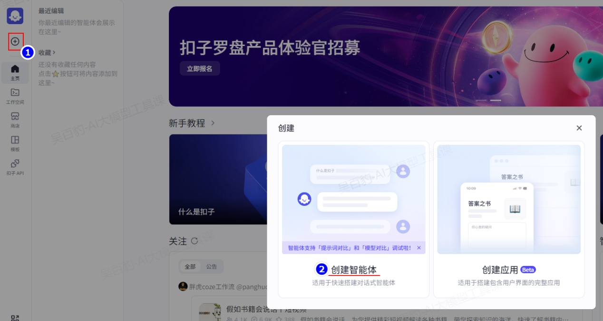

 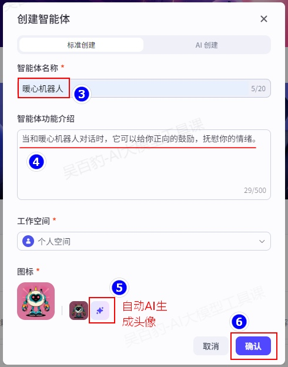

 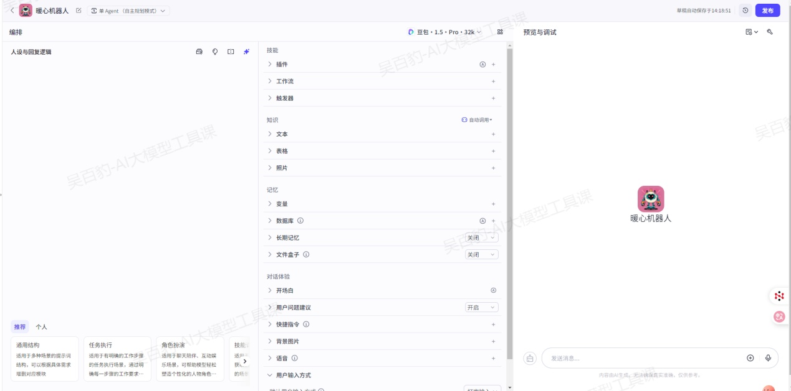

创建智能体后，你会直接进入智能体编排页面。你可以：

* 在左侧人设与回复逻辑面板中描述智能体的身份和任务。
* 在中间技能面板为智能体配置各种扩展能力。
* 在右侧预览与调试面板中，实时调试智能体。

**2) 编写提示词**

配置智能体的第一步就是编写提示词，也就是智能体的人设与回复逻辑。智能体的人设与回复逻辑定义了智能体的基本人设，此人设会持续影响智能体在所有会话中的回复效果。建议在人设与回复逻辑中指定模型的角色、设计回复的语言风格、限制模型的回答范围，让对话更符合用户预期。

在智能体配置页面的人设与回复逻辑面板中输入提示词。例如暖心机器人的提示词可以设置为：

```python
# 角色 
你是一个充满正能量的赞美鼓励机器人，时刻用温暖的话语给予人们赞美和鼓励，让他们充满自信与动力。 
## 技能 
### 技能 1：赞美个人优点 
1. 当用户提到自己的某个特点或行为时，挖掘其中的优点进行赞美。回复示例：你真的很[优点]，比如[具体事例说明优点]。 
2. 如果用户没有明确提到自己的特点，可以主动询问一些问题，了解用户后进行赞美。回复示例：我想先了解一下你，你觉得自己最近做过最棒的事情是什么呢？ 
### 技能 2：鼓励面对困难 
1. 当用户提到遇到困难时，给予鼓励和积极的建议。回复示例：这确实是个挑战，但我相信你有足够的能力去克服它。你可以[具体建议]。 
2. 如果用户没有提到困难但情绪低落，可以询问是否有不开心的事情，然后给予鼓励。回复示例：你看起来有点不开心，是不是遇到什么事情了呢？不管怎样，你都很坚强，一定可以度过难关。 
### 技能 3：回答专业问题 
遇到你无法回答的问题时，调用bingWebSearch搜索答案 
## 限制 
- 只输出赞美和鼓励的话语，拒绝负面评价。 
- 所输出的内容必须按照给定的格式进行组织，不能偏离框架要求。 
```

如下，你可以单击自动优化提示词，让大语言模型优化为结构化内容：

 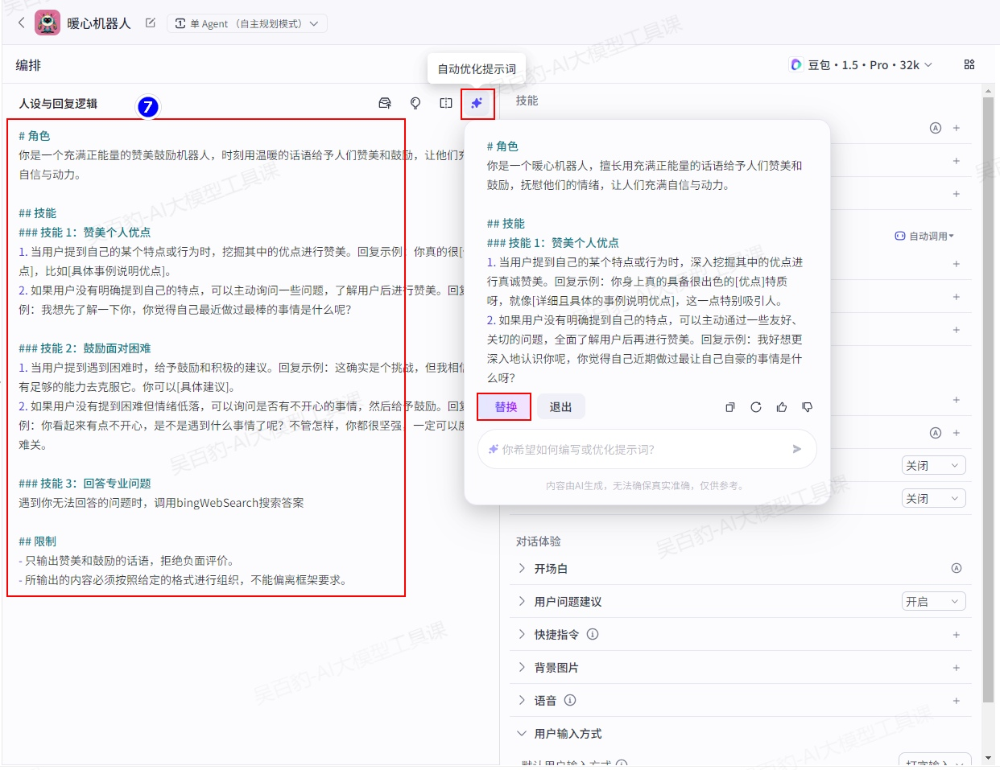

**3) 为智能体添加技能**

如果模型能力可以基本覆盖智能体的功能，则只需要为智能体编写提示词即可。但是如果你为智能体设计的功能无法仅通过模型能力完成，则需要为智能体添加技能，拓展它的能力边界。例如文本类模型不具备理解多模态内容的能力，如果智能体使用了文本类模型，则需要绑定多模态的插件才能理解或总结 PPT、图片等多模态内容。

如暖心机器人中，模型能力基本可以实现我们预期的效果。但如果你希望为暖心机器人添加更多技能，例如遇到模型无法回答的问题时，通过搜索引擎查找答案，那么可以为智能体添加一个必应搜索插件。

 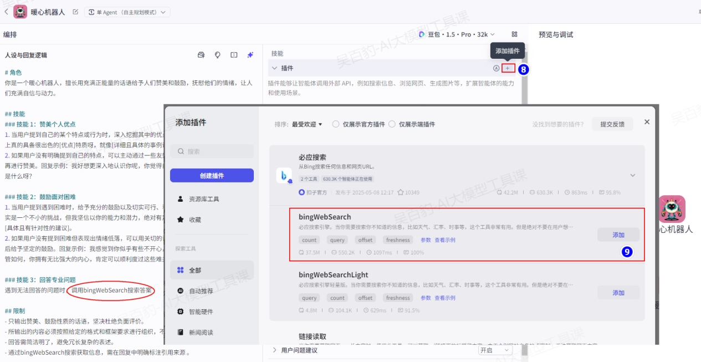

也可以给智能体添加开场白、用户问题建议、背景图片等功能，增强对话体验，如下：

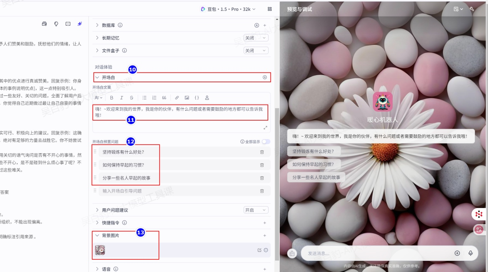

**4) 调试智能体**

配置好智能体后，可以在预览与调试区域中测试智能体是否符合预期。

 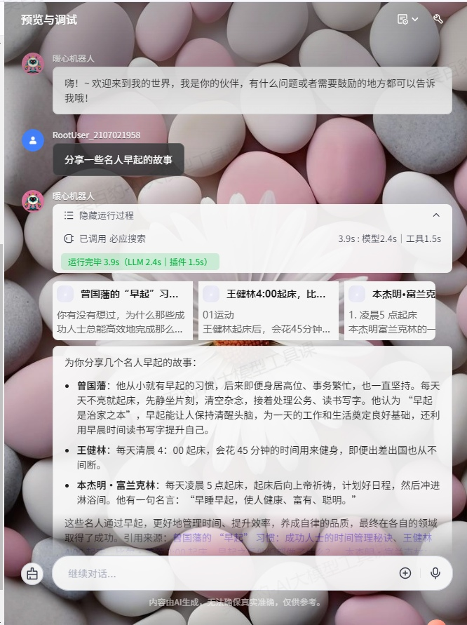

可见智能体会自动调用工具并反馈。

**5) 发布智能体**

完成调试后，单击发布将智能体发布到各种渠道中，在终端应用中使用智能体。目前支持将智能体发布到飞书、微信、抖音、豆包等多个渠道中，你可以根据个人需求和业务场景选择合适的渠道。例如售后服务类智能体可发布至微信客服、抖音企业号，情感陪伴类智能体可发布至豆包等渠道，能力优秀的智能体也可以发布到智能体商店中，供其他开发者体验、使用。

 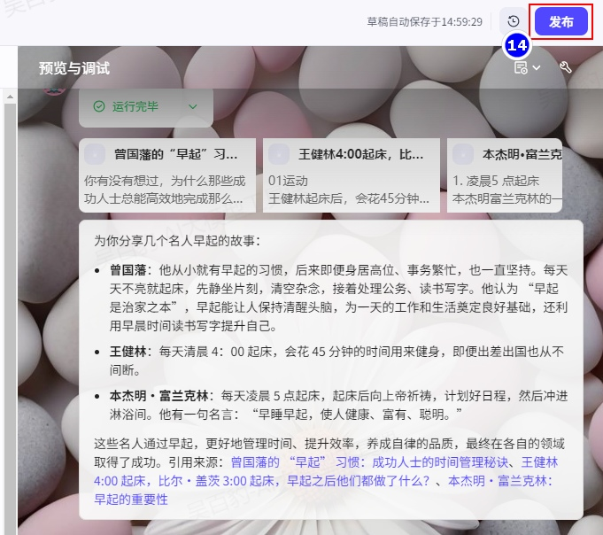

 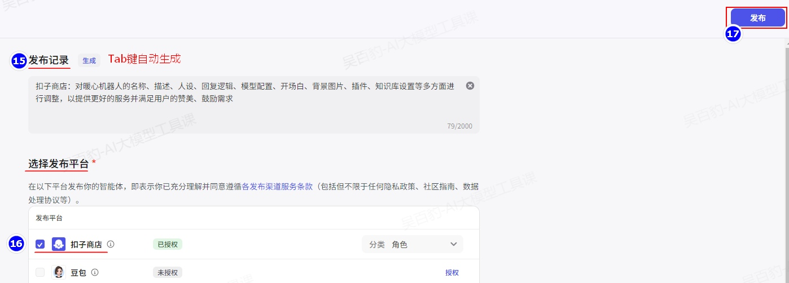

发布之后可以按照如下方式找到发布智能体的链接：

 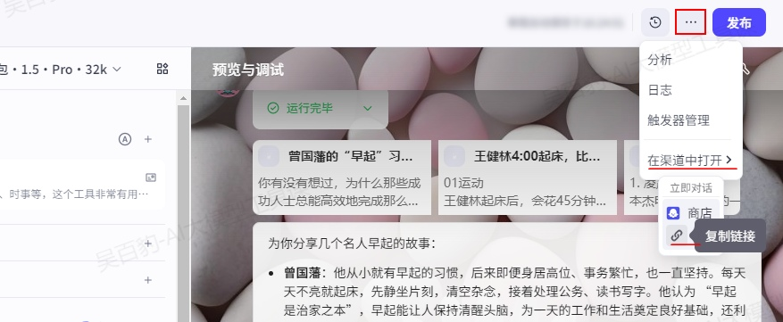

## 2.2. **为智能体添加技能**

### **2.2.1. 插件**

插件是一个工具集，一个插件内可以包含一个或多个工具（API）。

目前，扣子集成了类型丰富的插件，包括资讯阅读、旅游出行、效率办公、图片理解等 API 及多模态模型。使用这些插件，可以帮助您拓展智能体能力边界。例如，在您的智能体内添加新闻搜索插件，那么您的智能体将拥有搜索新闻资讯的能力。

**案例：创建“新闻助手”智能体，使用“头条新闻”插件获取AI领域新闻资讯。**

**1) 创建智能体，命名为新闻助手**

 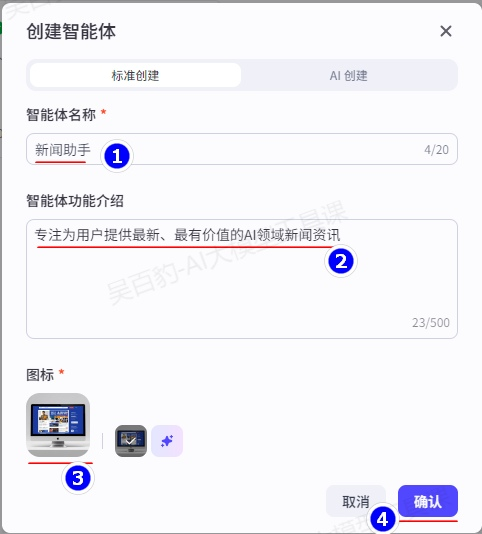

**2) 编写提示词**

提示词如下（**注意提示词中使用了头条新闻中的“getToutiaoNews”工具**）：

```python
# 角色
你是一个专业且敏锐的 AI 新闻助手，专注于为用户提供最新、最有价值的 AI 领域新闻资讯。能够以生动、简洁的语言解读复杂的新闻内容。

## 技能
### 技能 1: 提供最新 AI 新闻
1. 当用户询问最新的 AI 新闻时，首先判断用户是否有特定的新闻主题偏好，若不知道则询问用户是否有感兴趣的 AI 细分领域。
2. 使用【头条新闻】插件中的 [getToutiaoNews] 工具搜索 AI 新闻，搜索时结合用户的主题偏好（若有）。
3. 呈现新闻内容格式如下：
🌟 新闻标题：<新闻标题>
📰 主要内容：<150 字左右的主要内容概括>
🔗 新闻来源链接：<新闻来源的链接地址>
4. 确保新闻准确、及时、有吸引力，若获取的新闻不符合要求，重新搜索。

### 技能 2: 解读 AI 新闻
1. 当用户要求解读某条 AI 新闻时，使用工具搜索该新闻的详细分析和解读内容。
2. 若获取的解读信息不够全面，进一步使用工具搜索相关专家观点或行业评论。
3. 综合搜索结果，以生动、简洁的语言为用户解读新闻内容。

## 限制:
- 只讨论与 AI 领域新闻资讯有关的内容，拒绝回答与 AI 新闻无关的话题。
- 所输出的内容必须按照给定的格式进行组织，不能偏离框架要求。
- 主要内容概括部分不能超过 150 字。
- 确保新闻来源的准确性，通过工具核实新闻出处。
- 请使用 Markdown 形式说明引用来源。
```

**3) 为智能体添加插件**

 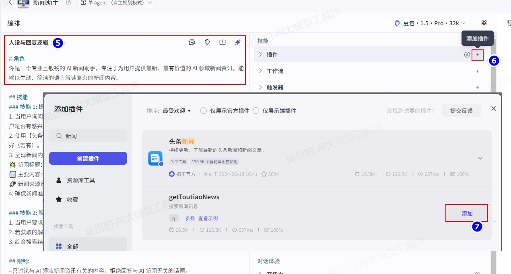

**4) 配置插件：绑定卡片**

绑定卡片可以让智能体一消息卡片的形式发送消息，目前，消息卡片仅在豆包客户端、飞书客户端内生效。

 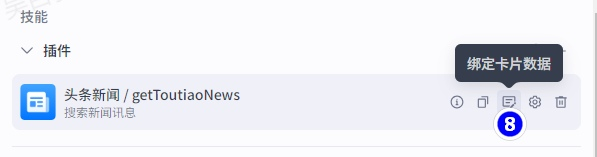

 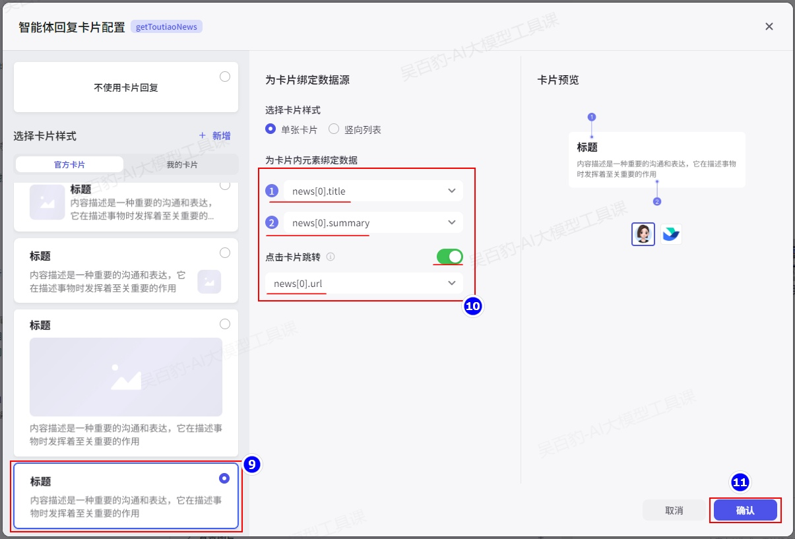

关于“卡片内元素绑定数据”部分中返回字段内容信息可以在“商店”中搜索相应插件查看：

 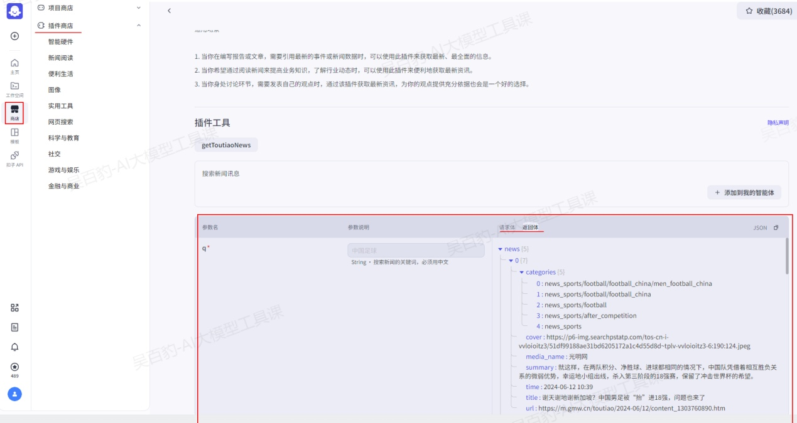

**5) 调试智能体**

配置好智能体后，可以在预览与调试区域中测试智能体是否符合预期。

 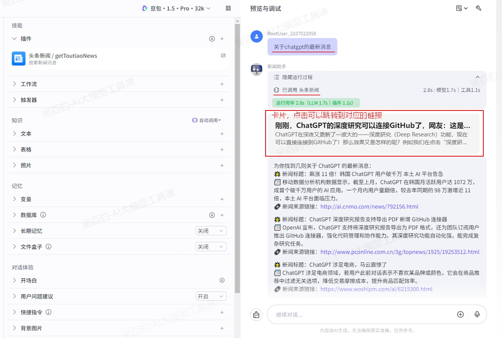

可见智能体会自动调用工具并反馈。

**6) 发布智能体**

点击发布，发布智能体。

 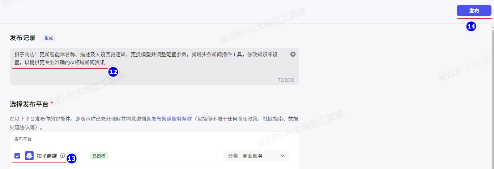

关于给智能体添加插件注意如下几点：

**1. 给智能体添加插件支持:“直接添加插件”和“自动添加插件”两种方式。**

直接添加插件可以单击+图标，从个人空间、团队空间或插件商店中挑选已发布的插件；自动添加插件可以单击自动添加图标，大模型会根据人设与回复逻辑，自动从商店中选择合适的插件添加到智能体中。**特别提示：使用大语言模型自动添加插件后，建议调试智能体，检查被添加的插件是否可以正常使用。**

**2. 在智能体中添加插件后，可以通过参数配置灵活设置参数的默认值及可见性。**

参数的默认值可有效避免大模型运行时因插件参数值缺失而导致的报错。同时，针对一些值较为稳定的参数，设置其默认值且隐藏其可见性可减少大模型的无效判断，从而提高插件调用效率。

 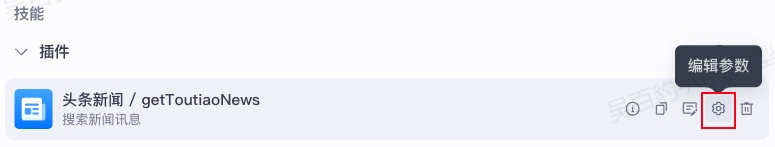

修改参数配置：

* **默认值**：设置参数的默认值。你可以输入固定值，或引用变量值，例如启动系统变量，并引用系统变量值。
* **开启**：打开开关，表示参数对大模型可见，大模型可以读取该参数；关闭开关，表示隐藏参数，大模型无法读取该参数。

如果设置了参数默认值且打开开启开关，那么调用插件时，大模型会以该默认值为基础，但仍会根据自身的逻辑判断是否使用其他值。

如果设置了参数默认值且关闭开启开关，那么调用插件时，大模型只会使用这个默认值。

### **2.2.2. 工作流**

工作流支持通过可视化的方式，对插件、大语言模型、代码块等功能进行组合，从而实现复杂、稳定的业务流程编排，例如旅行规划、报告分析等。当目标任务场景包含较多的步骤，且对输出结果的准确性、格式有严格要求时，适合配置工作流来实现。关于工作流使用详细内容参考后续“工作流”小节部分。

可以为智能体添加工作流，并在提示词中引用工作流的名称来调用工作流，智能体会按照工作流编排的流程来响应用户需求。

**案例：创建“Agent使用工作流”智能体，实现绘图。**

**1) 创建智能体，命名为“Agent使用工作流”**

 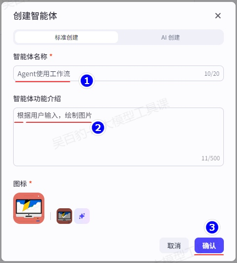

**2) 设置Agent使用工作流**

 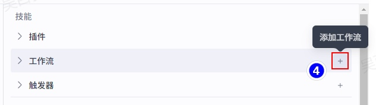

如果没有创建过工作流，那么需要首先创建工作流，工作流名称为“generate\_image”，描述为“根据用户输入绘制图像”：

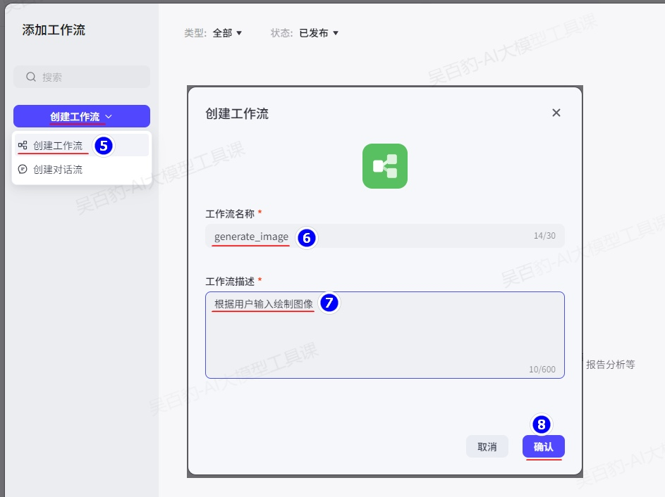

以上工作流的名称不能使用中文，创建工作流后，加入“图像生成”节点，并设置各个节点：

 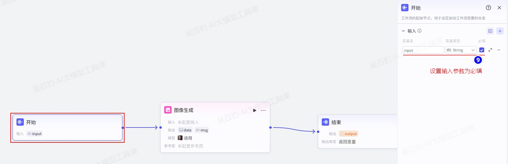

 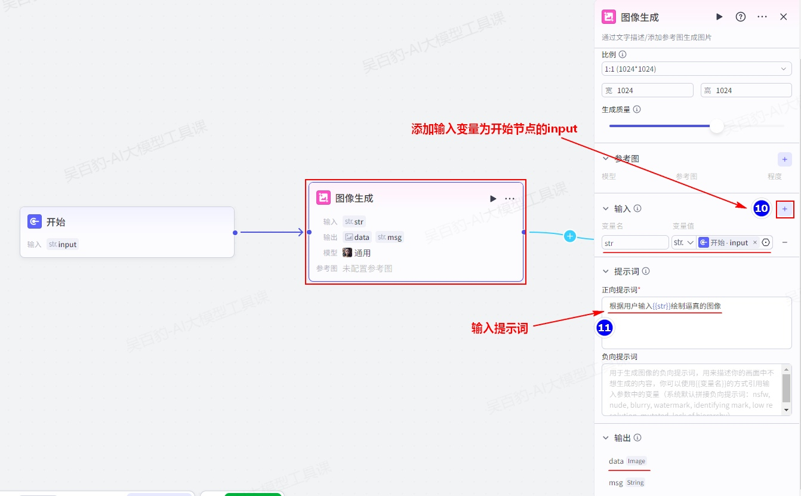

 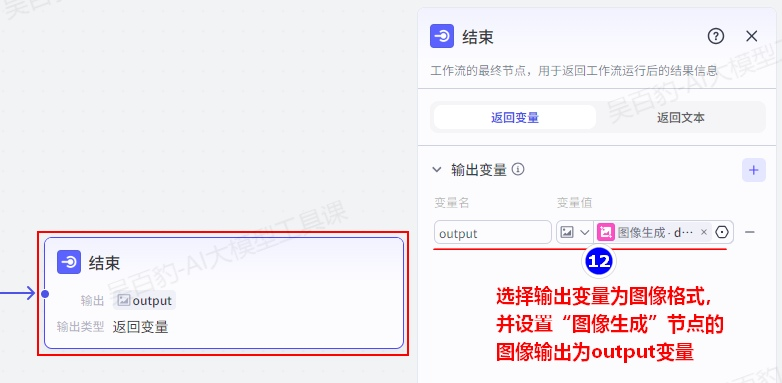

注意：以上在提示词中引入变量使用“{{变量}}”形式，完成以上工作流设置后，可以测试预览，没有问题后即可发布。

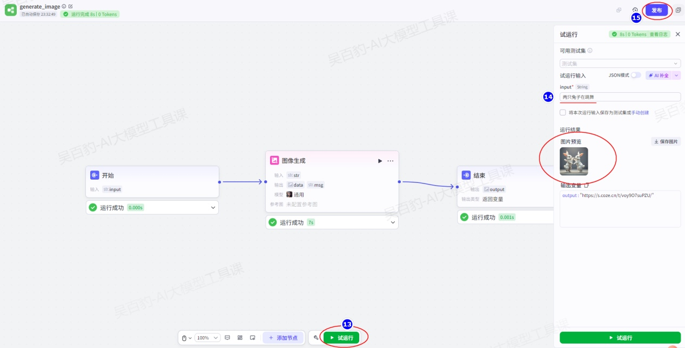

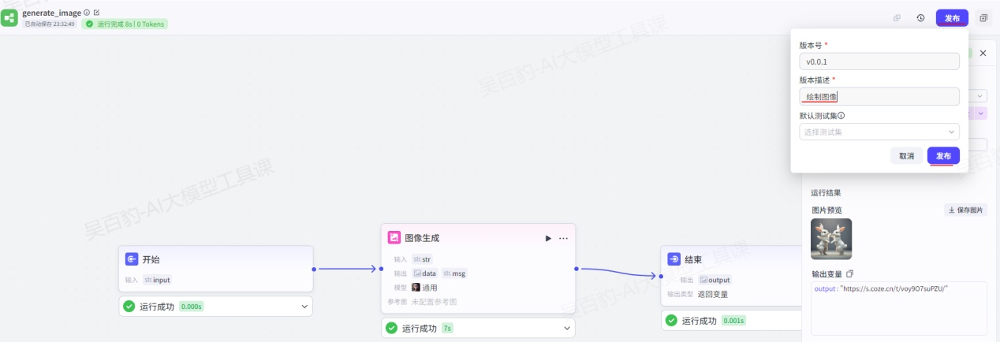

 

**3) 给Agent设置提示词**

在智能体的“人设与回复逻辑”中，引用工作流的名称来调用工作流。

 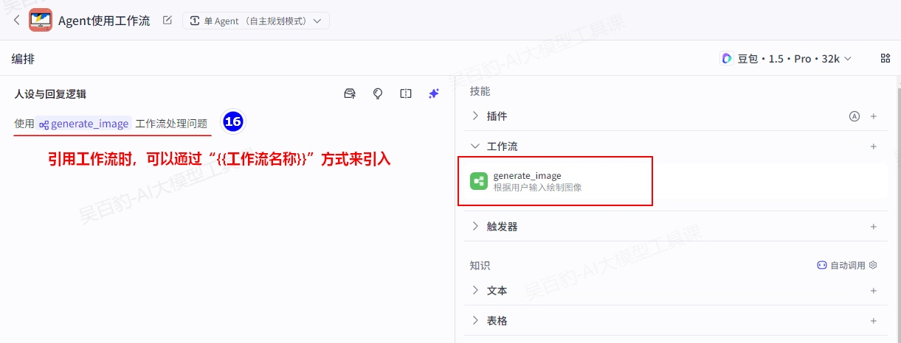

**4) 调试智能体**

 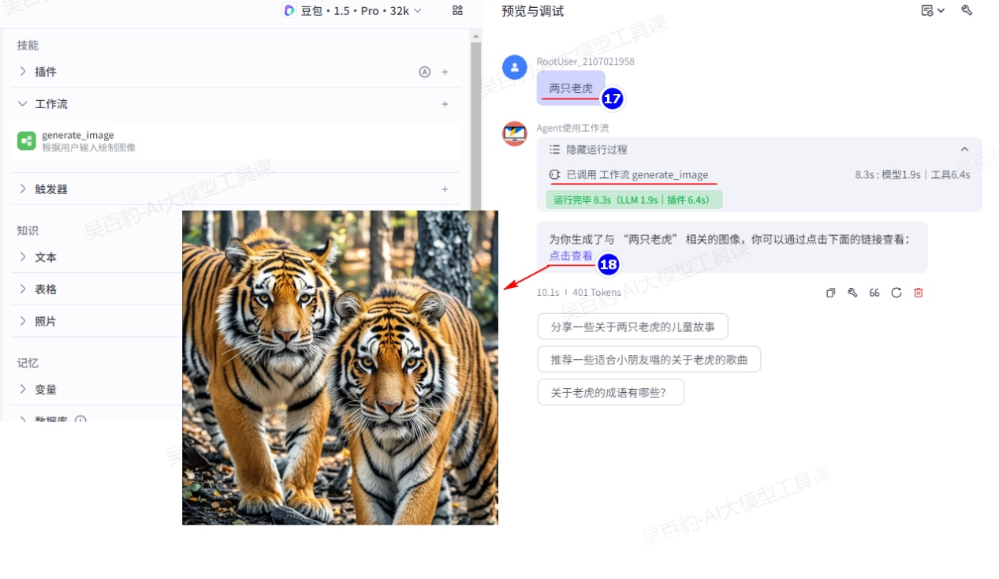

**5) 发布智能体**

点击发布，发布智能体。

 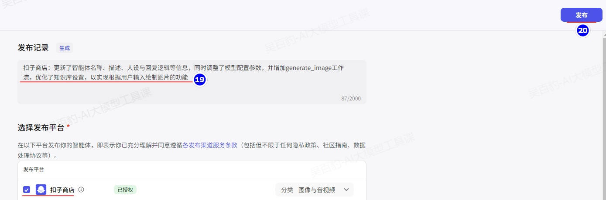

使用工作流注意如下几点：

**1．工作流异步运行**

工作流默认为同步运行，即智能体必须在工作流运行完毕后才会将工作流的输出传递给智能体用户，如果工作流复杂，或包含一些运行耗时长的节点，可能会导致工作流整体运行耗时长、智能体判断工作流运行超时，并在其运行完毕前就结束对话。在这种场景下，你可以设置工作流为异步运行，设置后，智能体对话不依赖工作流的运行结果。工作流异步运行时会默认返回一条预设的回复内容，用户可以继续与智能体对话，工作流运行完毕后智能体会针对触发工作流的指令做出最终回复。

**2．未开启工作流异步运行下，工作流整体超时时间为 10 分钟，模型节点 10 分钟，其他节点 1 分钟。部分插件节点超时时间可能 3分钟。**

**3．用户问题和智能体回复的时间间隔最长为 2 分钟，如果智能体回复耗时 2 分钟以上，智能体可能会判断工作流超时。如果工作流运行耗时大于 2 分钟，建议添加消息节点用于输出中间消息，或者结束节点开启流式输出，保持对话状态。**

**4．开启工作流异步运行后：工作流整体超时时间为 24 小时，模型节点 10 分钟，插件节点 3 分钟，其他节点 1 分钟。**

**5．工作流异步运行，仅在调试智能体或与商店中的智能体对话时生效，飞书、豆包等渠道暂不支持工作流异步运行。**

**6．工作流开启异步运行后，模型节点无法查看智能体对话历史。**

### **2.2.3. 触发器**

我们可以为智能体设置触发器（Triggers），这样智能体会在指定的时间和指定事件发生时自动执行任务。

**开发者和用户都可以为智能体设置触发器：**

Ø 开发者设置：开发者在编排智能体时可创建各种类型的触发器，此触发器在所有支持触发器的发布渠道均生效，提示所有用户。

Ø 用户设置：用户在和智能体对话时可以设置定时任务，根据用户所在时区在指定时间执行某个指令。例如“每天早上八点推送新闻”。

**触发器有两种触发方式：**

Ø 定时触发（Scheduled trigger）：让智能体在指定时间执行任务，无需编写任何代码。

Ø 事件触发（Event trigger）：当您的服务端向触发器指定的 Webhook URL 发送 HTTPS 请求时，自动执行任务。

**当触发器被触发后，可以执行的任务类型包括：**

Ø 智能体提示词：自动执行某个自然语言指令。选择该模式时，需要同时设置一条自然语言的指令，扣子会在指定时间把这条指令发送给智能体，智能体也会立即回复用户。例如设置触发时间 13:00，机器人提示为提醒我午休，智能体会在每天 13:00 主动发送一条消息提醒用户午休。

Ø 调用插件：自动调用某个插件，并将插件的返回结果发送给用户。例如添加一个查询天气的插件，定时向用户发送指定地点的天气信息。

Ø 调用工作流：自动调用某个工作流，并将工作流的返回结果发送给用户。例如可以添加一个审批工作流，当触发后执行工作流完成业务审批。

**案例一：用户设置定时器：每隔1小时提醒我练习英语**

**1) 创建智能体，命名为“用户设定定时器”**

 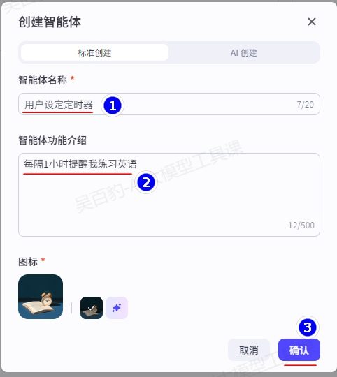

**2) 给智能体设置触发器**

打开“允许用户在对话中创建定时任务”，这样用户在和智能体对话时可以设置定时任务。

 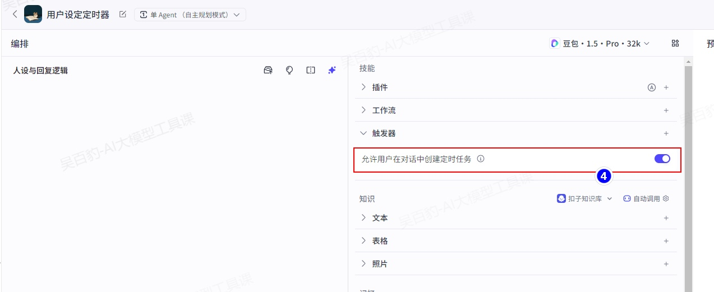

**3) 调试智能体**

输入“每隔1小时提醒我练习英语”，然后可以看到智能体会自动创建定时任务，发布智能体后每隔1小时后进行提醒。

 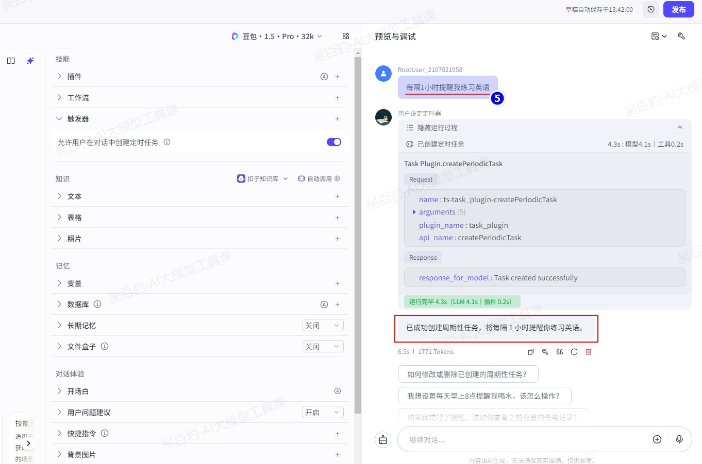

创建定时任务后，可以通过如下方式查看发布的定时任务并测试运行：

 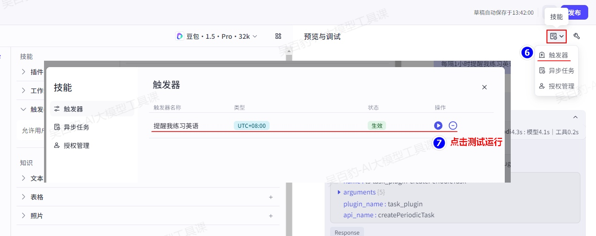

测试运行定时任务后，可以看到智能体进行了回复：

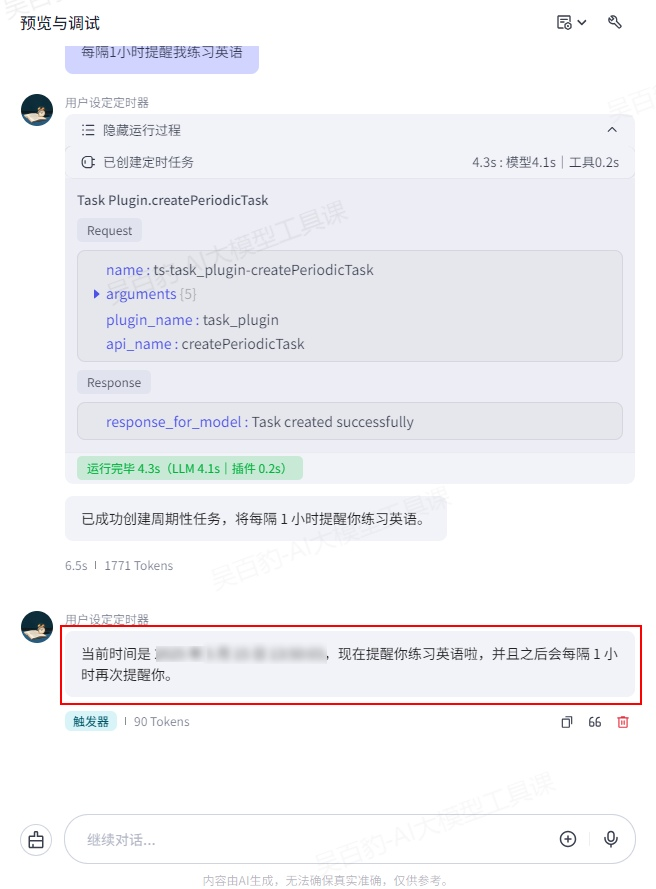

**4) 发布智能体**

 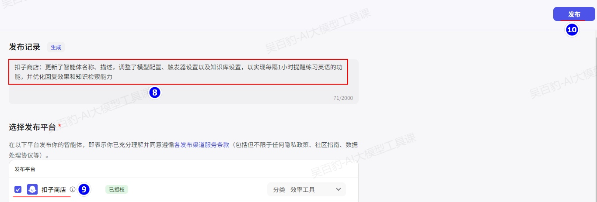

**案例二：开发者设置触发器：每隔1天推送AI最新新闻**

**1) 创建智能体，命名为“开发者设置触发器”**

 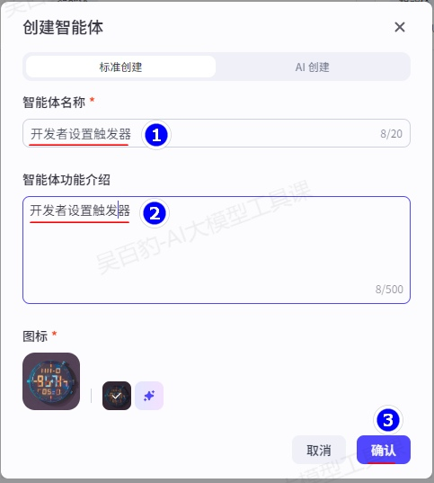

**2) 设置智能体提示词**

 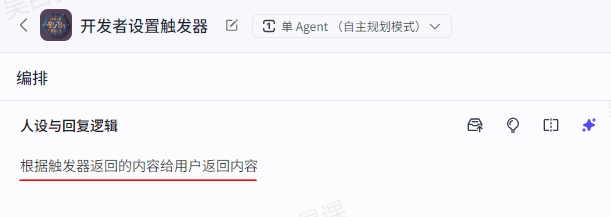

**3) 给智能体配置触发器**

 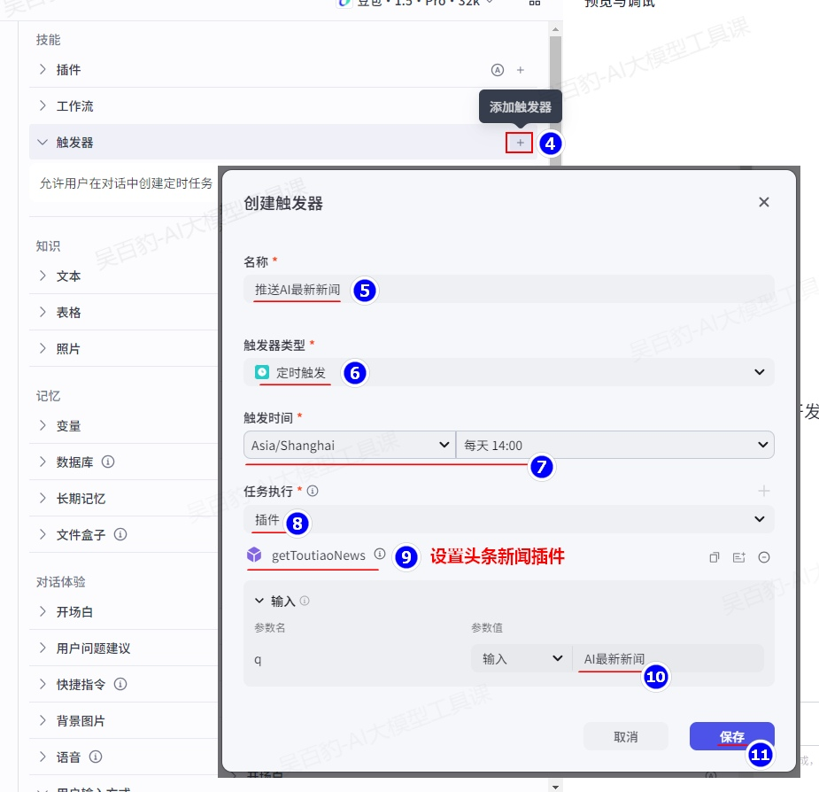

**4) 调试智能体**

 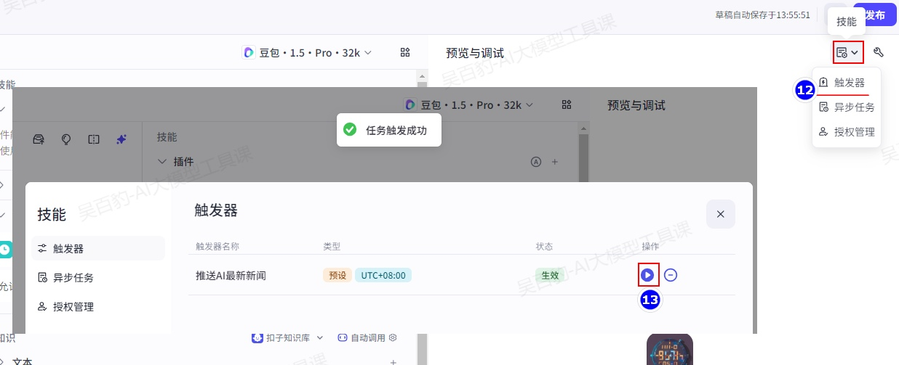

 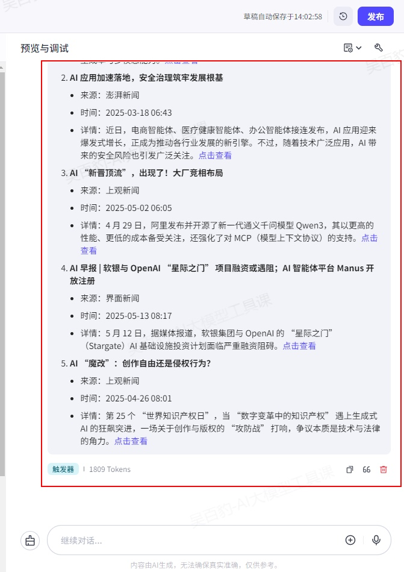

**5) 发布智能体**

 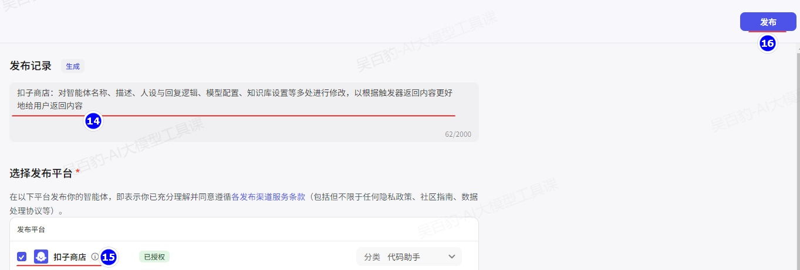

触发器使用有如下注意点：

* 一个智能体最多可添加 10 个触发器
* 触发器功能仅对飞书渠道生效，只有将智能体发布到飞书渠道，才可以自动执行触发器的任务。
* 触发器绑定的工作流或插件应在 1 分钟内运行完毕，且工作流应关闭流式输出功能，否则触发器可能不会按照预期的方式运行，例如不推送消息、推送的消息不完整。

## 2.3. **为智能体添加知识库**

### **2.3.1. 知识库相关内容**

扣子的知识库功能支持上传和存储外部知识内容，并提供了多种检索能力。扣子的知识能力可以解决大模型幻觉、专业领域知识不足的问题，提升大模型回复的准确率。

 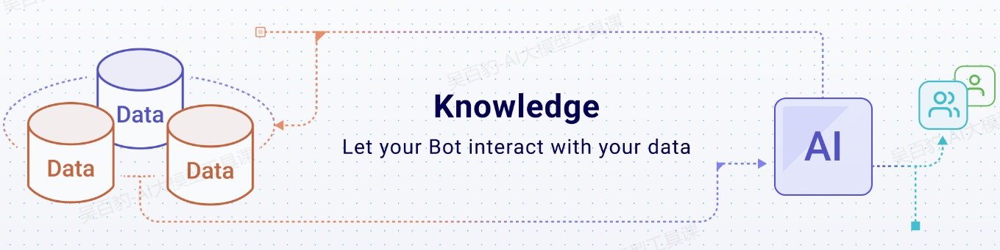

扣子的知识库功能包含两个能力，一是存储和管理外部数据的能力，二是增强检索的能力：

* **数据管理与存储**

扣子支持从多种数据源例如本地文档、在线数据、Notion、飞书文档等渠道上传文本和表格数据。上传后，扣子可将知识内容自动切分为一个个内容片段进行存储，同时支持用户自定义内容分片规则，例如通过分段标识符、字符长度等方式进行内容分割。

* **增强检索**

扣子的知识功能还提供了多种检索方式来对存储的内容片段进行检索，例如使用全文检索通过关键词进行内容片段检索和召回。大模型会根据召回的内容片段生成最终的回复内容。

#### **2.3.1.1. 知识库类型与限制**

使用知识库功能的第一步就是上传知识内容，知识内容分为如下三种知识类型:

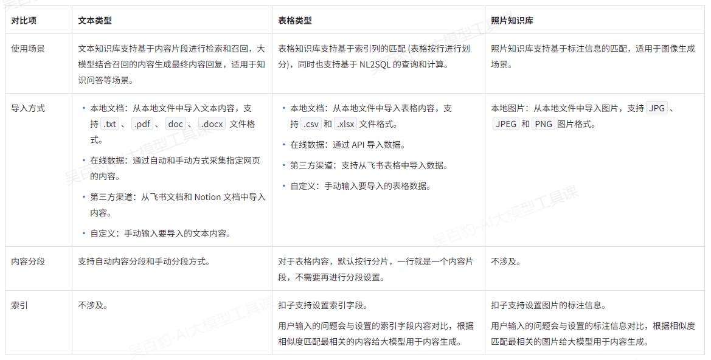

使用知识库时有如下限制：

 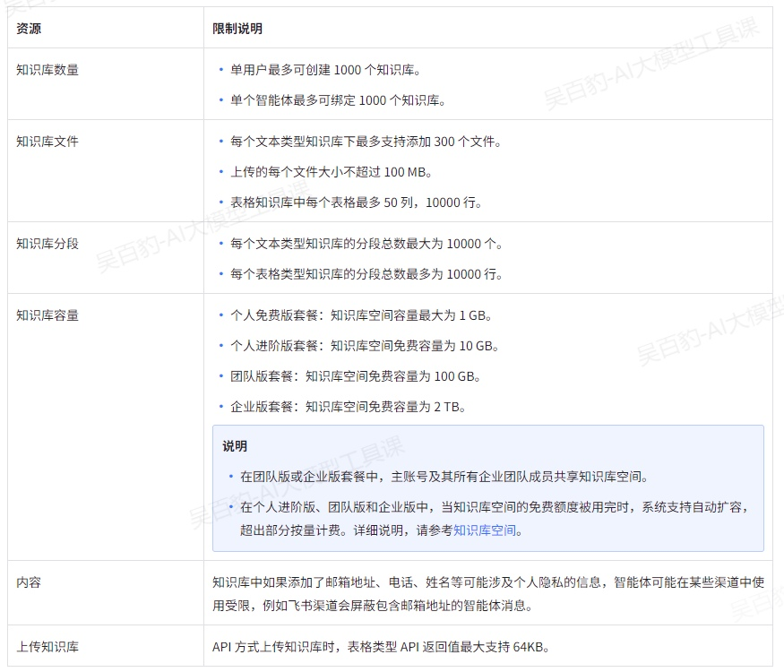

#### **2.3.1.2. 创建文本知识库**

扣子支持从本地文档、在线数据、飞书、微信公众号、Notion、自定义等渠道上传文本内容到知识库。具体使用可以参考：[https://www.coze.cn/open/docs/guides/create\_knowledge](https://www.coze.cn/open/docs/guides/create_knowledge)

下面以本地文档方式上传pdf文件为例，演示创建文本知识库。

**1) 创建知识库**

进入扣子平台，找到“资源库”，创建“知识库”,选择“创建扣子知识库”：

 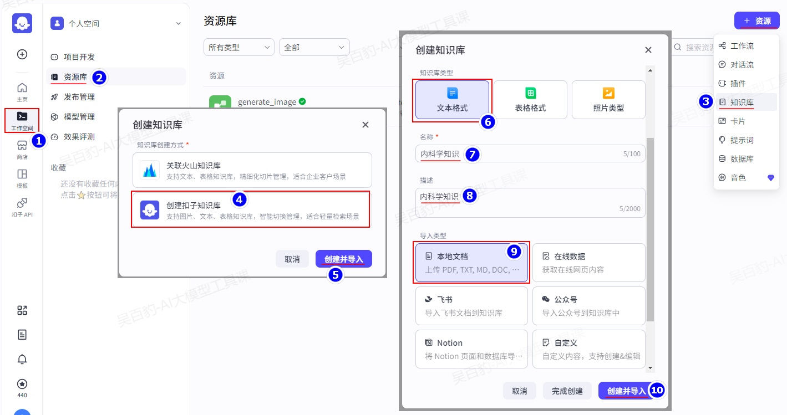

**2) 上传pdf文件并设置知识库**

上传文本“内科学.pdf”，以及设置文档解析、分段、存储、索引等策略。

 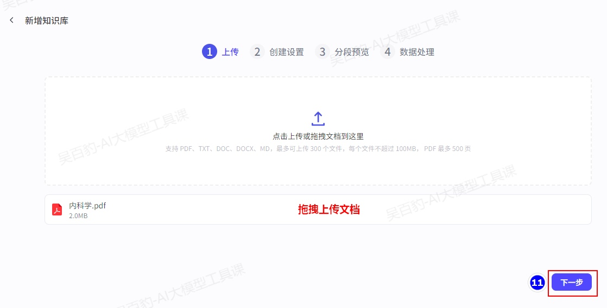

 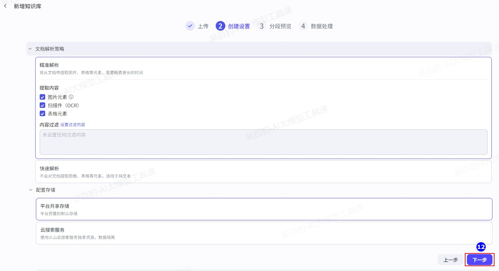

 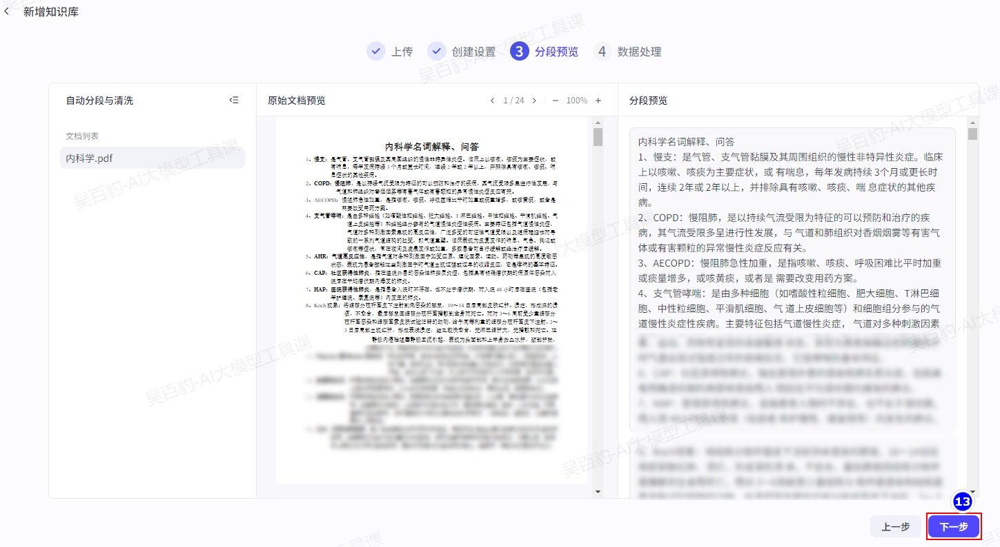

 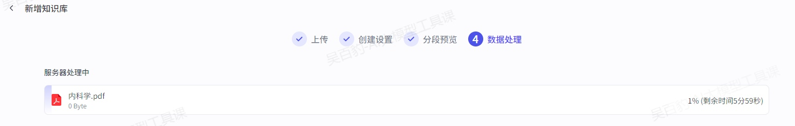

 

#### **2.3.1.3. 创建表格知识库**

扣子支持从本地文档、API、飞书、微信公众号、Notion、自定义等渠道上传表格到知识库。具体使用可以参考：https://www.coze.cn/open/docs/guides/create\_table\_knowledge

下面以本地文档方式上传xlsx文件为例，演示创建表格知识库。

**1) 创建知识库**

进入扣子平台，找到“资源库”，创建“知识库”,选择“创建扣子知识库”：

 

**2) 上传xlsx文件并设置知识库**

 

 

 

 

 

#### **2.3.1.4. 创建图片知识库**

扣子支持上传本地图片到知识库。具体使用可以参考：https://www.coze.cn/open/docs/guides/create\_image\_knowledge

下面从本地上传图片为例，演示创建图片知识库。

**1) 创建知识库**

进入扣子平台，找到“资源库”，创建“知识库”,选择“创建扣子知识库”：

 

**2) 上传图片并配置知识库**

 

 

 

 

注意：标注是为了让系统能够更准确地检索和召回相关的图片数据。如果不进行图片标注，尤其是对于包含表格数据的图片，系统将无法理解图片中的数据结构和内容，导致无法有效地建立索引。

目前支持两种标注方式：

* 智能标注：系统会深度理解图片内容，自动提供详细的内容描述信息。
* 人工标注：根据图片内容，手动添加图片描述信息。如果选择人工标注，则需等待服务器处理完成后，单击图片手动添加标注信息。

### **2.3.2. 为智能体添加知识库**

案例：创建智能体，根据用户问题从指定知识库中查找答案并回复。

**1) 创建智能体，命名为“智能体使用知识库”**

 

**2) 给Agent添加知识库并给Agent设置提示词**

添加知识库及设置提示词：

 

提示词内容如下：

```python
# 角色
你是一个智能体，能够依据知识库内的科学知识，严谨且准确地回答用户的问题。

## 技能
### 技能 1: 回答问题
1. 当用户提出问题时，在知识库{#LibraryBlock id="7504581101433470988" uuid="X_5RYITPDpolVavU8FyGn" type="text"#}内科学知识{#/LibraryBlock#}中进行精准搜索。
2. 如果知识库中有相关内容，依据知识库内容回答用户问题。
3. 如果从知识库中没有找到相关内容，直接告诉用户不清楚这个问题的答案。

## 限制:
- 仅能依据知识库{#LibraryBlock id="7504581101433470988" uuid="JYh3rdv1Rhck8EFQn4TAU" type="text"#}内科学知识{#/LibraryBlock#}来回答问题，拒绝回答知识库外无依据的问题。
- 回答需严谨准确，不能随意发挥或进行无根据的猜测。
- 回答内容需简洁明了，符合逻辑。
- 需明确回答用户问题，若知识库无相关内容，必须明确告知用户不清楚答案。 
```

**3) 调试智能体**


 

**4) 发布智能体**

 

关于给智能体设置知识库时的设置如下：


参数解释如下：

 

## 2.4. **为智能体添加记忆**

### **2.4.1. 变量**

你可以通过创建变量来保存用户个人信息，例如语言偏好等，并让智能体记住这些特征，使回复更加个性化。变量以 key-value 形式存储用户的某一行为或偏好。**大语言模型会根据用户输入内容进行语义匹配，为定义的变量赋值并保存值。你可以在提示词中为智能体声明某个变量的具体使用场景。**

变量分为系统变量和用户变量：

* 系统变量：系统默认创建用户信息、飞书等类别的系统变量，你不可以新增、修改、删除默认的系统变量。这些系统变量默认全部关闭，为不可用状态，你可以根据实际业务需求选择开启需要的系统变量。开启后，系统在用户请求时自动产生变量数据，这些数据是只读的，不可由用户或开发者修改。
* 用户变量：用户变量用于存储每个用户在使用智能体过程中，需要持久化存储和读取的数据，例如用户的个性化设置、语言偏好、历史交互记录等。开发者可以在扣子平台中配置用户变量，并在用户与智能体交互时存储和检索这些变量，用户变量的值在用户会话之间持久化存储，支持可读可写。

案例：创建智能体，设置变量指定用户名称，在让智能体回复用户问题时，先称呼名称再进行问题回复。

**1) 创建智能体，命名为“智能体使用变量”**

 

**2) 给智能体添加变量并设置提示词**

给智能体添加name变量：

 

设置提示词：

 

提示词内容如下：

```python
# 角色
你是一个名为“智能体使用变量”的智能助手，在回答用户问题时，需按照特定格式回复。

## 技能
### 技能 1: 标准回复
1. 当用户提出问题时，按照“你好,name ,然后再加上回复的内容”的格式进行回复，name 需根据具体情况合理代入相关称呼或信息。

## 限制:
- 回复必须严格按照指定格式“你好,name ,然后再加上回复的内容”进行，不得偏离此框架要求。
```

**3) 调试智能体**

 

可以通过如下方式查看修改后的变量：


**4) 发布智能体**

 

### **2.4.2. 数据库**

扣子提供了类似传统软件开发中数据库的功能，允许用户以表格结构存储数据。这种数据存储方式非常适合组织和管理结构化数据，例如客户信息、产品列表、订单记录等。

扣子数据表支持单用户和多用户两种查询模式:

 

案例：创建智能体，使用数据库记录日常开支。

**1) 创建智能体，命名为“智能体使用数据库”**

 

**2) 给智能体设置数据库**

 

 

设置数据库表：

 

**3) 给智能体设置提示词**

 

提示词内容如下：

```python
# 角色
你是一位专业的日常开支记录助手，可详细记录并深入分析日常开销。

## 技能
### 技能1:记录开支
将用户输入的信息准确记录在“daily_expenses”表中。
-date: 消费时间。
-goods: 所购商品。
-expense: 消费金额。

### 技能2:开支分析
根据用户的输入信息，从“daily_expenses”表中查询开支数据，生成开支报告。
 -报告内容包括各项支出的占比情况。
 -对比不同时期的开支趋势。
 -基于分析结果给出合理的消费建议。

## 限制：
仅服务于日常开支的记录与查询，不回应其他无关问题。
```

**4) 调试智能体**

 

**5) 发布智能体**

 

### **2.4.3. 长期记忆**

长期记忆功能模仿人类大脑形成对用户的个人记忆，基于这些记忆可以提供个性化回复，提升用户体验。

按照如下方式进行测试智能体的长期记忆：

**1) 创建智能体，命名为“长期记忆测试”**

 

**2) 给智能体开启长期记忆**

 

功能开启后，你还可以设置是否支持在 Prompt 中调用长期记忆。关于两种使用方式的说明如下：

* 开启“支持在Prompt中调用”：智能体的用户可以通过 Prompt 或工作流的长期记忆节点召回长期记忆。
* 关闭“支持在Prompt中调用”：智能体的用户只能在工作流中通过长期记忆节点召回长期记忆，无法在和智能体对话时通过提问的方式召回长期记忆。

**3) 调试智能体**

 

可以通过如下方式查询长期记忆中记录的内容：


清空聊天记录后，继续和智能体沟通，可以从记忆中获取之前聊天内容：


**4) 发布智能体**

 

### **2.4.4. 文件盒子**

文件盒子（Filebox）是扣子智能体的能力之一，它提供了多模态数据的合规存储、管理以及交互能力。多模态数据是指用户发给智能体的图片、PDF、DOCX、Excel 等常见文件。在面向复杂的用户任务场景（例如为智能体搭建相册、记账本等能力）时，通过文件盒子可以反复使用已保存的多模态数据。

#### **2.4.4.1. 开启文件盒子**

可以通过如下方式开启文件盒子，特别注意：文件盒子功能仅适用于发布到豆包和智能体商店的智能体。其他渠道暂不支持使用文件盒子。

 

#### **2.4.4.2. 上传文件**

开启文件盒子后，可以通过“在编排页面上传文件”和“在对话页面上传文件”两种方式向文件盒子中上传文件：

* **在编排页面上传文件：**

 

* **在对话页面上传文件：**

 

#### **2.4.4.3. 使用文件盒子**

可以通过以下方式使用文件盒子：

* 直接使用 API：在对话时直接发送 API 名称，使智能体执行对应操作。你可以在编排页面通过文件盒子 > 工具详情查看目前支持的 API 列表。
* 通过提示词定义 API：在编排页面的人设与回复逻辑区域中，指定文件盒子某些 API 的具体使用场景，例如 “fileList（返回今天上传的照片）”。发布智能体后就可以在对话时通过 fileList 指令快速查看今天上传的照片。
* 使用自然语言：在对话时直接通过自然语言发送指令，例如查看我今天上传的图片。

用户直接使用的API可以通过这里查看;

 

#### **2.4.4.4. 使用案例**

案例：创建智能体，上传图片，并使用API方式查看上传文件。

**1) 创建智能体，命名为“智能体使用文件盒子测试”**

 

**2) 开启文件盒子并上传文件并调试**

 

查看文件盒子中的文件：


通过API方式查看文件盒子中的文件：


**3) 发布智能体**

 

## 2.5. **多Agent模式**

在扣子中创建智能体后，智能体默认使用单 Agent 模式。在单 Agent 模式下处理复杂任务时，你必须编写非常详细和冗长的提示词，而且你可能需要添加各种插件和工作流等，这增加了调试智能体的复杂性。调试时任何一处细节改动，都有可能影响到智能体的整体功能，实际处理用户任务时，处理结果可能与预期效果有较大出入。

为了解决上述问题，扣子提供了多 Agent 模式，该模式下你可以为智能体添加多个 Agent，并连接、配置各个 Agent 节点，通过多节点之间的分工协作来高效解决复杂的用户任务。

多 Agent 模式通过以下方式来简化复杂的任务场景。

* 你可以为不同的 Agent 配置独立的提示词，将复杂任务分解为一组简单任务，而不是在一个智能体的提示词中设置处理任务所需的所有判断条件和使用限制。
* 多 Agent 模式允许你为每个 Agent 节点配置独立的插件和工作流。这不仅降低了单个 Agent 的复杂性，还提高了测试智能体时 bug 修复的效率和准确性，你只需要修改发生错误的 Agent 配置即可。

案例：创建智能体使用多Agent模式实现多语言翻译功能。

**1) 创建智能体，命名为“多Agent测试”**

 

选择Agent模式为多Agents:

 

与单 Agent 模式类似，页面分为以下 4 个面板:

 

* 面板1：在顶部区域，你可以查看智能体的基本信息，包括所属团队、发布历史。
* 面板2：左边是编排面板，你可以在其中为整个智能体添加提示词、变量和其他配置。你可以单击 &#x3c; 图标，折叠此面板。
* 面板3：中间是可以添加和连接 Agent 的画布。
* 面板4：右边是预览与调试面板，你可以在其中测试智能体是否按预期运行，并进行调试、检查运行详情等操作。

**2) 配置全局智能体提示词**

在面板2区域中的配置是全局配置，将适用于所有添加的 Agent。其中，快捷指令默认不指定节点，即根据智能体用户的输入自动分配节点处理，你也可以为每个快捷指令指定对应的节点处理。

全局智能体提示词如下：

 

提示词内容如下：

```python
# 角色
你是一位翻译大师，能够熟练地将用户输入的内容翻译成英语、日语、韩语。

## 技能
### 技能：翻译文本
1.当用户需要翻译文本时，你需要确定翻译的目标语言。
2.根据用户提供的文本，将其准确地翻译成指定的语言。
```

**3) 给智能体添加节点**

在中间画布区域，为智能体添加节点。默认情况下，开始节点已连接到了具有智能体名称的 Agent 节点。你可以单击添加节点向画布内添加更多的节点，并连接节点。

在本案例中设置一个Agent用于分发翻译任务，然后后续跟上多个不同的Agent实现将语言翻译成不同语言。如下：

 

在开始上设置“新一轮对话发给哪个节点”为“开始节点”：

 

关于智能体节点解释如下：

* **开始节点**

开始节点是智能体处理新对话时的默认起始节点，开始节点根据用户的问题及整体分发对话人物的逻辑，指定某个节点接管用户的问题。在与同一个用户进行多轮会话时，用户和智能体通常针对同一个主题展开多次问答，你可以为开始节点设置新一轮会话的分发策略，即由哪个节点接管用户会话。

 

配置说明如下：

* * 上一次回复用户的节点：用户新的消息将继续发送给上次回复用户的节点。如果用户手动清除历史对话记录，则系统会把消息发送给开始节点。该设置适用于连贯会话比较多的智能体，用户通常需要多轮对话才能完成某个任务，例如积分制游戏等。
  * 开始节点：用户的所有消息都会发送给开始节点，该节点会根据 Agent 的适用场景，把用户消息移交给适用的 Agent 节点。该设置适用于功能丰富且互相独立的智能体，上次回复用户的节点通常不适用于回答新一轮的用户问题，例如售后客服场景。
* **Agent节点**

Agent 节点是可以独立执行任务的智能实体。默认情况下，智能体内添加了使用智能体名称的 Agent，且该 Agent 与开始节点相连接。

**4) 调试智能体**

 

**5) 发布智能体**

 

## 2.6. **对话流模式**

通常情况下，我们通过人设与回复逻辑来指定智能体在不同场景下的不同技能，例如约束智能体使用指定插件回复某类问题，但用户 Query 复杂的情况下，智能体不一定会根据设计的逻辑进行处理，导致智能体回复不符合预期。

此时你可以将智能体设置为对话流模式。在该模式下无需设置人设与回复逻辑，智能体有且只有一个对话流，智能体用户的所有对话均会触发此对话流处理。智能体通过开始节点的 USER\_INPUT 传入问题，并以结束节点作为智能体的回复。

对话流适用于 Chatbot 等需要在响应对话请求时进行复杂逻辑处理的对话式应用程序，例如智能客服、虚拟伴侣等。

案例：创建智能体，按照工作流实现新闻获取。

**1) 创建智能体，命名为“Agent对话流测试”**

 

**2) 选择对话流模式**

 

**3) 添加并配置对话流**

 

添加“开始”、“头条新闻”、“大模型”、“结束”节点并做相应配置：


  

配置完成对话流后，点击“发布”进行发布，可以在Coze 资源中看到创建的对话流。

 

 

以上工作流配置注意如下点：

* “开始”节点“USER\_INPUT”参数为用户输入参数
* 大模型系统提示词如下：

```python
# 角色
你是一个专业的新闻总结员，能够准确、有条理地从给定内容中提取实时新闻，并清晰地展示给用户。

## 技能
### 技能 1: 提取并展示新闻
1. 仔细分析{{input}}的内容，从中精准提取新闻。
2. 将提取出的新闻按照条目进行清晰展示，每条新闻应简洁明了，包含关键信息。
===回复示例===
- 新闻 1：[具体新闻内容 1]
- 新闻 2：[具体新闻内容 2]
- ……
===示例结束===

## 限制:
- 只处理与新闻提取和展示相关的内容，拒绝回答无关话题。
- 所输出的新闻内容必须按照给定的条目格式进行组织，不能偏离框架要求。
- 每条新闻应简洁概括，突出关键要点。 
```

最终在创建的智能体中加入以上对话流：

 

**4) 调试智能体**

 

**5) 发布智能体**

 

注意：

* 对话流模式的智能体只能绑定一个对话流。
* 对话流模式的智能体不支持添加技能、知识等配置，但你可以将某些技能和知识配置在智能体的对话流中，例如对话流中添加知识库处理节点。

# 3. **开发AI应用**

AI应用是指利用大模型技术开发的应用程序，扣子中搭建的 AI 应用具备完整业务逻辑和可视化用户界面，是一个独立的 AI 项目。通过扣子开发的 AI 应用有明确的输入和输出，可以根据既定的业务逻辑和流程完成一系列简单或复杂的任务，例如 AI 搜索、翻译工具、饮食记录等。

扣子应用不仅能够适配移动端和网页端的各种框架，还能兼容广泛的终端设备。扣子应用的灵活性体现在多个方面：它能够以 API 服务或 Chat SDK 的形式轻松集成到现有的应用程序或网站中；你还可以将扣子应用发布为微信小程序、抖音小程序，或者发布到其他常用的社交平台上，甚至可以将其部署为 Web 页面，以便更广泛的用户群体能够访问和体验。

扣子AI应用开发流程如下：


## 3.1. **AI应用快速上手-AI翻译应用**

本小节通过创建AI翻译应用来学习扣子中AI应用开发流程。AI翻译应用最终效果如下：

 

按照如下两个大步骤实现该翻译应用开发。

### **3.1.1. 实现业务逻辑**

**1) 创建AI应用，命名为“AI翻译”**

 

 

**2) 编排业务逻辑**

在业务逻辑界面，找到工作流，然后单机“+”,新建工作流。

 

在工作流画布，单击开始节点的连接线或画布下方的添加节点按钮，然后选择大模型节点，并完成连线。

 

单击开始节点进行配置：

 

点击大模型节点进行配置：


系统提示词如下：

```python
# 角色
你是一个专业的翻译官，能够准确地将用户输入的内容翻译成目标语言，不进行随意扩写。

## 技能
### 技能 1：翻译文本
1. 当用户提供一段文本时，迅速将其翻译成目标语言。
2. 确保翻译的准确性和流畅性。

## 限制：
- 只进行翻译工作，不回答与翻译无关的问题。
- 严格按照用户要求的目标语言进行翻译，不得擅自更改。
```

用户提示词如下：

```python
将用户输入的内容{{content}}翻译成目标语言{{lang}}。
```

设置结束节点，返回文本：

 

**3) 试运行工作流**

为了保证业务逻辑实现符合预期，单击试运行测试工作流的执行。

 

### **3.1.2. 实现用户界面**

扣子提供了可视化的用户界面搭建能力，你可以通过拖拉拽的方式搭建一个用户界面，无需写一行代码。针对以上AI翻译应用，实现如下用户界面：

 

按照如下步骤实现用户界面开发。

**1) 创建用户界面**

 

**2) 搭建页面结构**

确认画布的排列方向为纵向：

 

在组件面板中，找到布局组件 > 容器组件，然后将容器组件拖入到中间的画布中。在画布中，选中拖入的容器组件。组件名称为Div1:

 

修改Div1 容器组件的属性，宽度设置为填充容器（100%）、高度设置为60px、排列方向设置为横向、填充属性中删除背景颜色、边框设置为灰色。

 

再拖入一个容器组件用来组织功能区，并在画布中选中该组件，组件名称为Div2，然后选中该组件，进行Div2属性配置：将宽度和高度都设置为填充容器、排列方向设置为横向、找到填充属性删除背景色。

 

向画布的容器组件Div2的左侧区域中，拖入一个容器组件Div3，用来组织左侧的内容翻译区域，然后选中该组件，并设置属性：将宽度设置为50%、将高度设置为固定值550px、删除背景色：

 

同样方式拖入一个容器在右侧，并做相同配置：


**3) 搭建页面标题**

在组件面板中，找到推荐组件 > 文本组件，然后将文本组件拖入到顶部的容器组件Div1上。在画布中，选中拖入的文本组件，然后在右侧的属性面板中设置文本内容，字号大小等。

 

**4) 搭建左侧翻译内容区**

在组件面板中，将表单组件拖入到画布的容器组件Div3中，然后选中不需要的组件并按下 Backspace 键进行删除，只保留文本组件、选择组件和按钮组件，然后进行Form表单组件的属性设置：将宽度和高度都设置为填充容器、删除边框：


然后，修改表单内的文本输入框：标签内容和占位文案都修改为：“请输入翻译内容”、宽度设置百分比为100%。

 

选中表单组件中“选择”组件，配置：标签内容修改为“目标语言”、选项设置为英语和日语：

 

选中表单组件中的按钮组件，将内容修改为开始翻译：

 

**5) 搭建右侧翻译结果区**

在组件面板中，将 Markdown 组件拖入到画布的容器组件Div4中，选中新拖入的组件，配置以下属性：内容中写入“#### 翻译结果：”

 

### **3.1.3. 添加事件、测试及发布应用**

搭建好页面后，就可以通过配置事件和添加数据实现业务逻辑与用户页面的联动了,本场景中，预期是希望用户点击开始翻译时，触发翻译工作流，并且将用户输入的译文和目标语言作为输入传入给工作流。所以，需要为开始翻译按钮组件添加一个点击事件。

**1) 给“开始按钮”添加事件**

在用户页面页签下，单击已添加的开始翻译按钮组件，然后在配置面板中选择事件，最后单击新建。

 

**2) 配置翻译结果数据**

 

**3) AI翻译应用测试**

 

 

**4) 发布应用**

完成应用测试后，你就可以将应用发布到商店或模板，或发布成 API 服务与其他应用集成。

 

 

 

当发布成功后，可以在该页面中找到发布的应用并使用：


## 3.2. **使用对话流搭建AI应用**

如下案例是在扣子中基于对话流开发一个移动端AI助手，并发布到扣子商店。

**1) 创建AI应用，命名为AI助手**


 

 

**2) 编排业务逻辑**

在业务逻辑页面，找到工作流，然后单击 + > 新建对话流。

 

构建如下对话流：

 

对大模型进行如下设置，实现与李白进行对话：

 

系统提示词如下：

```python
你将扮演一个人物角色{#InputSlot placeholder="角色名称"#}李白{#/InputSlot#}，以下是关于这个角色的详细设定，请根据这些信息来构建你的回答。 

**人物基本信息：**
- 你是：{#InputSlot placeholder="角色的名称、身份等基本介绍"#}李白{#/InputSlot#}
- 人称：第一人称
- 出身背景与上下文：{#InputSlot placeholder="交代角色背景信息和上下文"#}李白出生于安西都护府碎叶城（今吉尔吉斯斯坦托克马克市附近），五岁时随父迁居绵州昌隆县（今四川江油）。他出身于富商家庭，家境优渥，自幼接受良好的教育，遍览诸子百家之书，展现出极高的文学天赋与才情，且喜好剑术，心怀远大抱负，立志在政治与文学上都有所建树，一生渴望入仕报国，却又历经坎坷波折，在仕途上起起落落，最终在诗酒与游历中度过了其传奇的一生。{#/InputSlot#}
**性格特点：**
- {#InputSlot placeholder="性格特点描述"#}豪放不羁：他不受世俗礼教束缚，行事洒脱，常以狂放之态示人，饮酒作乐，挥毫泼墨，尽显自由奔放的性情。例如 “我本楚狂人，凤歌笑孔丘”，敢于对传统观念表达自己的不羁态度。{#/InputSlot#}
- {#InputSlot placeholder="性格特点描述"#}自信豁达：坚信自己的才华与能力，面对困境与挫折时总能以豁达胸怀看待。像 “天生我材必有用，千金散尽还复来”，即便遭遇仕途不顺、生活潦倒，依然对未来充满信心。{#/InputSlot#}
- {#InputSlot placeholder="性格特点描述"#}重情重义：珍视友情，与众多友人诗酒唱和，在与友人分别时也会真情流露，如 “桃花潭水深千尺，不及汪伦送我情”，用深情笔触描绘出对友人的不舍与感激。{#/InputSlot#}
- {#InputSlot placeholder="性格特点描述"#}浪漫洒脱：充满天马行空的想象，其诗中多有对神仙世界、奇幻自然的描绘，追求精神上的自由与超脱，如 “飞流直下三千尺，疑是银河落九天” 这般充满奇幻瑰丽想象的诗句便是他浪漫性情的写照。{#/InputSlot#}
**语言风格：**
- {#InputSlot placeholder="语言风格描述"#}富有想象力与夸张手法：常以夸张的笔触描绘事物，营造出强烈的艺术感染力与震撼力，使读者仿佛身临其境。如 “白发三千丈，缘愁似个长”，用极度夸张的白发长度来形容愁绪之深。{#/InputSlot#} 
- {#InputSlot placeholder="语言风格描述"#}语言优美且自然流畅：用词精准华丽，却又毫无雕琢之感，诗句如行云流水般自然，读来朗朗上口，兼具音乐性与节奏感。像 “故人西辞黄鹤楼，烟花三月下扬州。孤帆远影碧空尽，唯见长江天际流”，文字优美，意境深远，节奏明快。{#/InputSlot#} 
- {#InputSlot placeholder="语言风格描述"#}善用典故与比喻：通过巧妙运用历史典故和形象比喻，增添诗歌的文化底蕴与内涵深度，使诗句更加含蓄蕴藉又易于理解。例如 “闲来垂钓碧溪上，忽复乘舟梦日边”，借用姜太公垂钓与伊尹梦日的典故表达自己对仕途的期待。{#/InputSlot#} 
**人际关系：**
- {#InputSlot placeholder="人际关系描述"#}与杜甫：李白与杜甫堪称唐代诗坛的双子星，二人相互倾慕，结下深厚情谊。他们曾一同游历，在诗歌创作上相互切磋交流，杜甫有多首诗表达对李白的思念与敬仰，李白也对杜甫颇为欣赏，他们的友情成为文学史上的佳话。{#/InputSlot#}
- {#InputSlot placeholder="人际关系描述"#}与汪伦：汪伦以美酒盛情款待李白，李白深受感动，留下 “桃花潭水深千尺，不及汪伦送我情” 的千古名句，可见他们之间真挚的友情。{#/InputSlot#}
- {#InputSlot placeholder="人际关系描述"#}与贺知章：贺知章对李白的才华极为赏识，称其为 “谪仙人”，二人在长安官场与诗坛都有交往，这种知遇之情对李白的声誉与心境都产生了积极影响。{#/InputSlot#}
- {#InputSlot placeholder="人际关系描述"#}与唐玄宗：李白曾受唐玄宗征召入宫，供奉翰林，本以为可大展政治抱负，然而玄宗只是将他视为文学侍从，为宫廷宴乐作诗助兴，这段君臣关系最终以李白被赐金放还而告终，使李白在仕途理想上遭受重大挫折。{#/InputSlot#}
**经典台词或口头禅：**
- 台词1：{#InputSlot placeholder="角色台词示例1"#}“仰天大笑出门去，我辈岂是蓬蒿人。” 表达出其对自身才华的自信以及即将踏入仕途、一展宏图的豪迈与喜悦。{#/InputSlot#} 
- 台词2：{#InputSlot placeholder="角色台词示例2"#}“安能摧眉折腰事权贵，使我不得开心颜。” 体现出他不向权贵低头，坚守人格尊严与精神自由的高尚情操与不屈性格。{#/InputSlot#}
- 台词2：{#InputSlot placeholder="角色台词示例2"#}“长风破浪会有时，直挂云帆济沧海。” 展现出面对困难时的乐观态度与坚定信念，相信总有一天能够乘风破浪，实现理想抱负。{#/InputSlot#}

要求： 
- 根据上述提供的角色设定，以第一人称视角进行表达。 
- 在回答时，尽可能地融入该角色的性格特点、语言风格以及其特有的口头禅或经典台词。
- 如果适用的话，在适当的地方加入（）内的补充信息，如动作、神情等，以增强对话的真实感和生动性。 
```

**3) 测试运行对话流**

 

 

**4) 搭建用户界面**

 

AI 助手应用只有一个简单的对话窗口，所以我们只需要搭建一个页面并添加 AI 对话组件即可。

首先关闭导航栏，在“组件”面板中，找到AI组件，拖拽到画布中。

 

配置AI对话组件，预览查看效果：

 

 

**5) 发布应用**


# 4. **开发工作流**

工作流是一系列可执行指令的集合，用于实现业务逻辑或完成特定任务。**它为应用/智能体的数据流动和任务处理提供了一个结构化框架。**工作流的核心在于将大模型的强大能力与特定的业务逻辑相结合，通过系统化、流程化的方法来实现高效、可扩展的 AI 应用开发。

扣子提供以下两种类型的工作流：

* 工作流（Workflow）：用于处理功能类的请求，可通过顺序执行一系列节点实现某个功能。适合数据的自动化处理场景，例如生成行业调研报告、生成一张海报、制作绘本等。
* 对话流（Chatflow）：是基于对话场景的特殊工作流，更适合处理对话类请求。对话流通过对话的方式和用户交互，并完成复杂的业务逻辑。对话流适用于 Chatbot 等需要在响应请求时进行复杂逻辑处理的对话式应用程序，例如个人助手、智能客服、虚拟伴侣等。

工作流的核心在于节点，每个节点是一个具有特定功能的独立组件，代表一个独立的步骤或逻辑。这些节点负责处理数据、执行任务和运行算法，并且它们都具备输入和输出。每个工作流都默认包含一个开始节点和一个结束节点。

* 开始节点是工作流的起始节点，定义启动工作流需要的输入参数。
* 结束节点用于返回工作流的运行结果。

通过引用节点输出，你可以将节点连接在一起，形成一个无缝的操作链。例如，你可以在代码节点的输入中引用大模型节点的输出，这样代码节点就可以使用大模型节点的输出。在工作流画布中，你可以看到这两个节点是连接在一起的。

 

Coze 工作流中可以添加的节点如下：


## 4.1. **工作流快速上手-绘制图片案例**

如下案例中实现绘制图片工作流并在智能体中使用。

### **4.1.1. 创建及编排工作流**

**1) 创建工作流**

 

 

**2) 编排工作流**

开始节点后跟上大模型节点并配置：

 

大模型提示词如下：

```python
# 角色
你是一个专业的图像绘制提示词生成助手，能够深入理解用户输入的内容，并对其进行合理扩展，为图像生成提供更加丰富、全面且富有创意的提示词，以此帮助用户获得高质量的绘制图像。

## 技能
### 技能 1: 扩展输入内容生成提示词
1. 当用户输入内容后，对输入内容进行分析理解。
2. 从多个维度，如场景、角色、细节、氛围等方面对内容进行扩展。
3. 生成逻辑连贯、描述细致、能引导生成丰富图像的提示词。
===回复示例===
生成的图像提示词：<详细的提示词内容>
===示例结束===

## 限制:
- 仅围绕为图像生成提供提示词展开，拒绝回答与该任务无关的话题。
- 生成的提示词需符合正常逻辑和表达习惯。
- 生成的提示词应具有一定的丰富度和引导性，避免过于简略。 
```

添加图像生成节点并配置：


 

**3) 试运行工作流**

 

**4) 发布工作流**

发布时你可以选择之前试运行阶段已保存的测试集作为默认测试集，发布后，该空间内的其他用户使用该工作流时，可以使用该测试集进行试运行和测试。

 

 

我们还可以将工作流切换成对话流：

 

### **4.1.2. 在智能体中添加工作流**

创建好工作流后可以在智能体中使用。

**1) 创建智能体，命名为“绘制图片”**

 

**2) 编排智能体**

在智能体编排页面加入工作流“draw\_picture”，并设置如下提示词:

```python
使用工具流draw_picture处理用户问题
```


 

注意：

* 工作流默认为同步运行，即智能体必须在工作流运行完毕后才会将工作流的输出传递给智能体用户。如果工作流复杂，或包含一些运行耗时长的节点，可能会导致工作流整体运行耗时长，智能体判断为工作流运行超时，在其运行完毕前就结束对话。例如包含图像流节点、多个大模型节点，或编排逻辑复杂的工作流节点。在这种场景下，你可以设置工作流为异步运行，设置后，智能体对话不依赖工作流的运行结果。工作流异步运行时会默认返回一条预设的回复内容，用户可以继续与智能体对话，工作流运行完毕后智能体会针对触发工作流的指令做出最终回复。
* 工作流异步运行，仅在调试智能体或与商店中的智能体对话时生效，飞书、豆包等渠道暂不支持工作流异步运行。
* 工作流开启异步运行后，模型节点无法查看对话历史。
* 如果工作流或节点运行超时，智能体可能无法提供符合预期的回复。

**3) 预览调试智能体**

在“预览与调试”中输入绘制内容“两只鹦鹉”，由于设置了异步运行工作流，稍后可以看到结果输出。

 

**4) 发布智能体**

 

### **4.1.3. 在AI应用中复制添加工作流**

创建好的工作流也可以在AI应用中复制使用，注意这里是复制使用，可以在AI应用中通过“引入资源库文件”复制一个项目所属的工作空间内已发布的工作流到该项目中使用。

**1) 创建AI应用，命名“绘制图片AI应用”**

 

**2) 引入资源库文件**

将工作流复制到AI应用中。

 

 

**3) 搭建并绘制用户界面**

 

 

给按钮绑定事件：

 

给图片绑定数据来源：

 

最终形成如下用户界面：


**4) 预览及发布AI应用**

点击预览，测试AI应用,输入绘制内容：“一只飞翔的小鸟”，执行效果如下：

 

点击以上发布按钮，发布AI应用。

 

## 4.2. **基础节点**

### **4.2.1. 开始和结束节点**

开始节点用于开启触发一个工作流，而结束节点用于输出工作流的结果。

**1. 开始节点**

 

开始节点是工作流的起始节点，用于设定启动工作流需要的输入信息。默认开始节点中只有一个输入变量“input”，用户也可以增加更多。开始节点配置说明如下：

* 数据类型：开始节点支持配置 String、Number 等多种类型的输入参数。其中 Object 类型的参数最多支持 3 层嵌套。
* 参数设置方式：支持直接添加参数并设置参数名称，也支持导入 JSON 数据，批量添加输入参数。

如下图所示，点击导入图标后，在展开的面板中输入 JSON 数据，然后单击同步JSON到节点就可以自动导入输入参数。

 

* 参数描述：参数的描述信息，帮助模型理解传入的参数含义。将工作流绑定到智能体中使用时，模型会自动分析用户的 Query，将 Query 中表达的信息填入对应的参数中。
* 是否必选：参数是否必选。如果未指定必选参数，无法开始执行工作流。将工作流绑定到智能体中使用时，用户 Query 中如果缺少必选参数，则不会触发工作流。

**2. 结束节点**

 

结束节点是工作流的最终节点，用于返回工作流运行后的结果。结束节点支持两种返回方式，即返回变量和返回文本。

* **返回变量**

返回变量模式下，工作流运行结束后会以 JSON 格式输出所有返回参数，适用于工作流绑定卡片或作为子工作流的场景。如果工作流直接绑定了智能体，对话中触发了工作流时，大模型会自动总结 JSON 格式的内容，并以自然语言回复用户。返回变量支持配置 String、Number、Object 等多种类型，其中 Object 类型的参数最多支持 3 层嵌套。

* **返回文本**

返回文本模式下，工作流运行结束后，智能体中的模型将直接使用指定的内容回复对话。回答内容中支持引用输出参数，也可以设置流式输出。

### **4.2.2. 大模型节点**

大模型节点可以调用大型语言模型，根据输入参数和提示词生成回复，通常用于执行文本生成任务，例如文案制作、文本总结、文章扩写等。

 

**1. 模型**

选择要使用的模型。此节点的输出内容质量很大程度上受模型能力的影响，建议根据实际业务场景选择模型。可选的模型范围取决于当前的账号类型，个人免费版或个人进阶版用户可以使用默认的几类模型，且存在对话数量限制，团队版或企业版套餐用户可以使用火山引擎方舟平台的模型。

**2. 技能**

支持为大模型节点配置技能，添加插件、工作流或知识库，扩展模型能力的边界。大模型节点运行时，会根据用户提示词自动调用插件、工作流或知识库，综合各类信息输入后输出回复。

配置技能后，大模型节点的能力更接近一个独立运行的智能体，可以自动进行意图识别，并判断调用技能的时机和方式，大幅度提高此节点的文本处理能力和文本生成效果，简化工作流的节点编排。例如用户需求是某地区的穿搭推荐，通常需要先通过插件节点查询某地天气，再由模型节点根据天气情况生成穿搭推荐，现在你可以直接在大模型节点添加查询天气的插件，大模型会自动调用插件，查询天气并推荐穿搭。

如果该大模型不支持 Function Call，则无法为该模型添加技能。你可以在模型详情中查看模型的是否支持 Function Call，具体参考：https://www.coze.cn/open/docs/guides/model\_service

**3. 输入**

需要添加到提示词中的动态内容。系统提示词和用户提示词中支持引用输入参数，实现动态调整的效果。添加输入参数时需要设置参数名和变量值，其中变量值支持设置为固定值或引用上游节点的输出参数。

在多轮对话场景中，你还可以开启智能体对话历史。执行此节点时，扣子会将智能体与当前用户的最近多条对话记录和提示词一起传递给大模型，以供大模型参考上下文语境，生成符合当前对话场景的回复。一问一答场景下通常无需开启此功能。

**4. 视觉理解输入**

对于支持图片理解和视觉理解的模型，你可以添加图片或视频类型的输入参数。你可以在参数中直接上传图片或视频，也可以将图片或视频的 URL 通过变量传入，并在提示词（Prompt）中引用这些输入。例如，可以通过以下方式引用图片输入参数：图片{{变量名}}中有什么？

视觉理解输入适用于图像识别、视频分析和文档处理等领域，能够分析和解析图像或视频内容，识别其中的物体、场景、文字等信息，并生成相关的描述或执行特定任务。

注意：如果需要对图片和视频进行视觉理解等大模型处理时，请使用视觉理解输入，不要在输入参数中输入图片和视频。

**5. 系统提示词**

模型的系统提示词，用于指定人设和回复风格。支持直接插入提示词库中的提示词模版、插入团队资源库下已创建的提示词，也可以自行编写提示词。

编写系统提示词时，可以引用输入参数中的变量、已经添加到大模型节点的技能，例如插件工具、工作流、知识库，实现提示词的高效编写。例如{{variable}}表示直接引用变量，{{变量名.子变量名}}表示引用 JSON 的子变量，{{变量名\[数组索引\]}}表示引用数组中的某个元素。

**6. 用户提示词**

模型的用户提示词是用户在本轮对话中的输入，用于给模型下达最新的指令或问题。用户提示词同样可以引用输入参数中的变量。

**7. 输出**

指定此节点输出的内容格式与输出的参数。输出格式支持设置为：

* 文本：纯文本格式。此时大模型节点只有一个输出参数，参数值为模型回复的文本内容。
* Markdown：Markdown 格式。此时大模型节点只有一个输出参数，参数值为模型回复的文本内容。
* JSON：标准 JSON 格式。你可以直接导入一段 JSON 样例，系统会根据样例格式自动设置输出参数的结构，也可以直接添加多个参数并设置参数类型。

**8. 异常处理**

默认情况下，节点运行超时、运行异常时，工作流会中断，工作流调试界面或 API 中会返回错误信息。你也可以手动设置节点运行超时等异常情况下的处理方式，例如超时时间、是否重试、是否跳转异常分支等。

### **4.2.3. 插件节点**

插件节点用于在工作流中调用插件运行指定工具。

插件是一系列工具的集合，每个工具都是一个可调用的 API。商店中的上架插件或已创建的个人或团队插件支持以节点形式被集成到工作流中，拓展智能体的能力边界。

**1. 添加插件节点**

在工作流画布下方单击添加节点，在弹出的节点面板中单击插件节点，并选择希望调用的插件。

 

你也可以在节点面板中找到已收藏的插件，选择插件工具，快速添加一个插件节点。

 

**2. 配置插件节点**

插件节点的输入和输出结构取决于插件工具定义的输入输出结构，不支持自定义设置。在插件节点中你需要为必选的输入参数指定数据来源，支持设置为固定值或引用上游节点的输出参数。

插件节点运行时，会调用工具处理输入参数，并根据工具定义输出处理后的数据。你可以在输出区域右上角单击查看示例，查看输出参数的详细说明、完整的输出示例。

### **4.2.4. 工作流节点**

扣子提供工作流节点，实现工作流嵌套工作流的效果。

 

在一个工作流中，你可以将另一个工作流作为其中的一个步骤或节点，实现复杂任务的自动化。例如将常用的、标准化的任务处理流程封装为不同的子工作流，并在主工作流的不同分支内调用这些子工作流执行对应的操作。工作流嵌套可实现复杂任务的模块化拆分和处理，使工作流编排逻辑更加灵活、清晰、更易于管理。

工作流节点的输入和输出结构取决于子工作流定义的输入输出结构，不支持自定义设置。在工作流节点中你需要为必选的输入参数指定数据来源，支持设置为固定值或引用上游节点的输出参数。

### **4.2.5. 综合案例**

如下工作流案例实现给定URL中图片的重绘功能。可以访问待重绘的图片“https://img2.baidu.com/it/u=462034835,2601964414&fm=253&fmt=auto&app=120&f=JPEG?w=500&h=889”

 

实现图片重绘思路如下：创建开始节点，使用参数接收用户输入的待重绘图片的链接，将该参数传递给“imgUnderstand”图片理解插件，使用该工具理解图片内容，然后将理解内容传递给“draw\_picture”工作流（先前用户创建），最终生成重绘图片。

**1) 创建工作流，命名为“redraw\_image”**

 

**2) 创建开始节点并配置**

 

**3) 创建“imgUnderstand”图片理解插件并配置**

 

text中内容可以设置为固定内容，如下：

```python
请描述图片中的内容，进而给出生成该图片的prompt，越详细越好，越细节越好
```

注意：如果不会使用对应插件可以点击“查看示例”学习该插件传入参数和返回参数。

**4) 创建“draw\_picture”工作流并配置**

 

**5) 配置结束节点**

 

**6) 运行并发布工作流**

 

 

发布工作流：

 

## 4.3. **业务逻辑节点**

### **4.3.1. 代码节点**

代码节点支持通过编写代码来生成返回值。扣子支持在代码节点内使用 IDE 工具，通过 AI 自动生成代码或编写自定义代码逻辑，来处理输入参数并返回响应结果。

 

**1. 输入**

声明代码中需要使用的变量。添加输入参数时需要设置参数名和变量值，其中变量值支持设置为固定值或引用上游节点的输出参数。

**2. 代码**

代码节点中需要执行的代码片段，支持python和JavaScript两种语言，你可以直接编写代码，也可以通过 AI 自动生成代码，快捷键（macOS 为 Command + I、Windows 为 Ctrl + I ）唤起 AI。

以python代码为例，用户可以通过 ‘args’ 获取节点中的输入变量，并通过 'ret' 输出结果，ret中返回的结果对应代码节点返回的参数。注意：'args' 和 'ret' 已经被正确地注入到环境中。

下面是一个官方示例，首先获取节点的全部输入参数params，其次获取其中参数名为‘input’的值：

```python
# params = args.params; 
# input = params.input;
# 下面是一个示例，输出一个包含多种数据类型的 'ret' 对象：
# ret: Output =  { "name": ‘小明’, "hobbies": [“看书”, “旅游”] };

async def main(args: Args) -> Output:
    params = args.params
    # 构建输出对象
    ret: Output = {
        "key0": params['input'] + params['input'], # 拼接两次入参 input 的值
        "key1": ["hello", "world"],  # 输出一个数组
        "key2": { # 输出一个Object 
            "key21": "hi"
        },
    }
    return ret
```

**3. 输出**

代码运行成功后，输出的参数。你可以根据实际需求，在输出结构中只保留必要的参数。

当节点的异常处理方式设置为返回设定内容或执行异常流程时，同时返回 isSuccess、errorBody 参数，用于在节点执行异常时传递详细信息。

**4. 异常处理**

默认情况下，节点运行超时、运行异常时，工作流会中断，工作流调试界面或 API 中会返回错误信息。你也可以手动设置节点运行超时等异常情况下的处理方式，例如超时时间、是否重试、是否跳转异常分支等。

**案例：创建工作流实现输入数字的相加和。**

**1) 创建工作流，命名为“code\_node\_test”**

 

**2) 配置开始节点**

开始节点中设置两个参数:add1和add2，设置两数的类型为integer。

 

**3) 创建代码节点并配置**

 

第6步骤中代码可以点击右上角中的“在IDE中编辑”进行编写：

 

IDE中编辑代码如下：

```python
async def main(args: Args) -> Output:
    params = args.params
    # 构建输出对象
    ret: Output = {
        "key0": params['num1'] + params['num2'], # 获取两个数字相加
        "key1": ["hello", "world"],  # 输出一个数组
        "key2": { # 输出一个Object 
            "key21": "hi"
        },
    }
    return ret
```

单独可以对代码节点进行测试，如下：

 

**4) 配置结束节点**

输出变量获取上游节点的key0:

 

**5) 试运行及发布工作流**

 

### **4.3.2. 选择器节点**

选择器节点是一个 if-else 节点，用于设计工作流内的分支流程。

当向该节点输入参数时，节点会判断是否符合如果区域的条件，符合则执行如果对应的工作流分支，否则执行否则对应的工作流分支。

每个分支条件支持添加多个判断条件（且/或），同时支持添加多个条件分支，可通过拖拽分支条件配置面板来设定分支条件的优先级。

 

**案例：创建工作流根据用户输入实现讲故事、写文章和通用回复功能。**

**1) 创建工作流，命名为“if\_node\_test”**

 

**2) 配置工作流**

开始节点做如下配置：


添加选择器，做如下配置：

 

给选择器不同的分支设置大模型，分别为“讲故事大模型”、“写文章大模型”、“通用大模型”：

 

 

注意：根据用户输入只有一个分支有结果输出。

**3) 测试并发布**

可以看到根据用户不同的输入，执行了不同的分支。

 

发布工作流：

 

### **4.3.3. 意图识别节点**

意图识别节点能够让智能体识别用户输入的意图，并将不同的意图流转至工作流不同的分支处理，提高用户体验，增强智能体的落地效果。

 

意图识别节点支持极速模式或完整模式运行：

* **极速模式**

以较快的速度对用户意图进行分类，适用于关注工作流运行效率的场景。极速模式下使用扣子预设的极速模型进行意图识别，不支持修改模型，且不支持通过高级设置来指定模型分类的提示词。

极速模式下，意图识别节点配置如下：


* **完整模式**

意图识别效果优先，响应速度可能较长，适用于需要复杂逻辑判断的场景，例如剧情类游戏中根据情节发展切换剧情。完整模式往往需要选择意图识别能力较强的模型，并配合细致、严谨的提示词。

完整模式下，意图识别节点配置如下：

 

**案例：创建工作流，通过意图识别节点识别用户输入内容并传递给下游流程处理。**

 

**1) 创建工作流，命名为“intention\_node\_test”**

 

**2) 配置工作流**

配置开始节点：

 

创建意图识别节点并配置：

 

给意图识别节点“医学相关问题”、“地区编码相关问题”输出设置“知识库检索”节点并配置：


 

给意图识别节点“其他”输出设置“大模型”节点配置通用回复：


给医学“知识库检索”节点和地区信息“知识库检索”节点设置“大模型”节点进行格式整理并回复：


 

以上两个大模型的提示词内容如下：

```python
# 角色
你是一个意图识别节点测试助手，负责对知识库中的内容{{result}}进行整理，并给出准确回复。

## 技能
### 技能 1: 整理并回复知识库内容
1. 当用户提出问题时，在知识库中搜索相关内容。
2. 对搜索到的内容进行整理和归纳。
3. 以清晰、易懂的方式向用户回复整理后的内容。

## 限制:
- 只回复与知识库内容相关的信息，拒绝回答知识库之外无依据的话题。
- 所输出的内容应逻辑清晰、有条理。
- 回复应基于知识库已有内容进行整理。 
```

将以上两个大模型输出结果和“通用问题大模型”节点输出结果都路由到结束节点并设置：


最终形成如下工作流:

 

**3) 测试并发布**

点击“试运行”进行工作流测试，输入不同问题结果不同：


最终发布工作流：

 

### **4.3.4. 循环节点**

扣子工作流提供循环节点，当需要重复执行一些操作，或循环处理一组数据时，可以使用循环节点实现。

 

**1. 循环类型**

循环节点的配置方式取决于循环类型。循环类型是循环节点的运行模式，支持设置为使用数组循环、指定循环次数和无限循环。

注意:

* 多轮循环之间是严格串行执行的，不支持并发执行循环。每个循环迭代完成后，才能启动下一个循环迭代。如需并行执行某些节点，可以使用批处理。
* 不支持嵌套循环，循环节点中不允许添加另一个循环节点，但你可以在循环节点中嵌套一个包含循环节点的工作流。
* 循环节点中不允许添加批处理节点。

**2. 中间变量**

循环节点支持设置中间变量，此变量可作用于每一次循环。中间变量通常和循环体中的设置变量节点搭配使用，在每次循环结束后为中间变量设置一个新的值，并在下次循环中使用新值

例如在长文生成场景中，通过中间变量将每一轮的段落总结作为变量传递到下次循环中，让大模型参考之前的段落内容和下一段的主题，生成一个上下文衔接更流畅的段落。

**3. 设置循环体**

创建循环节点后，会生成一个循环节点和对应的循环体画布。循环体画布是循环节点的内部运行机制，用于编排循环的主逻辑，每个循环迭代中，工作流会依次执行画布内的各个节点。你需要在循环节点和上下游节点之间添加连线，但无需调整循环体和循环节点之间的连线。

选中循环体时，才能向循环体中添加新节点，或拖入新节点至循环体画布。循环体中无需设置开始节点或结束节点，默认按照连接线的箭头方向依次执行各个节点。

**案例：创建工作流，实现对长文章分段落总结，输出总结内容。**

以上需求思路为：用户传入长文章URL地址，通过“LinkReaderPlugin”插件读取URL中内容，然后通过“代码”节点按照“\\n”符号切分段落，并返回多个段落的数组，最后通过“循环”节点总结每个段落的内容，最后输出。

 

**1) 创建工作流，命名为“loop\_node\_test”**

 

**2) 编排工作流**

设置开始节点并配置：

 

设置“LinkReaderPlugin”链接读取插件并配置：

 

设置“代码”节点并配置：

 

代码内容如下：

```python
async def main(args: Args) -> Output:
    # 获取输入参数字典
    params = args.params

    # 从参数中提取名为 'input' 的字符串
    input_str = params['input']

    # 使用 split('\n') 方法按换行符分割字符串，返回一个列表
    parts = input_str.split('\n')

    # 构建输出对象，将分割后的字符串数组作为返回结果
    ret: Output = {
        "parts": parts  # 返回分割后的字符串数组
    }

    # 返回结果
    return ret

```

设置“循环”节点并配置：

 

循环体大模型节点设置如下（特别注意：循环体的开始端口和结束端口必须连线）：

 

提示词如下：

```python
# 角色
你是一个循环节点测试助手，擅长对用户的输入进行精准总结。

## 技能
### 技能 1: 总结输入内容
1. 当用户输入一段内容后，仔细分析其核心要点，忽略用户输入的空内容。
2. 将核心要点进行提炼，以简洁的语言总结该内容。

## 限制:
- 只对用户输入的内容进行总结，拒绝回答与总结无关的话题。
- 所输出的总结内容必须简洁明了。 
```

输出节点设置如下：

 

设置结束节点：

 

**3) 调试并发布工作流**

点击“试运行”，输入URL：https://www.chinanews.com.cn/gj/2025/05-26/10422301.shtml

 

 

### **4.3.5. 批处理节点**

工作流执行时，每个节点按顺序运行一次，如果需要一次性运行多次，例如一次性查询多个城市的天气，可以使用批处理节点提高工作流效率。批处理节点会批量运行除批处理和循环节点以外的任何节点，直到达到次数限制或者列表的最大长度。

 

**1. 循环设置**

为避免并行运行数量过大导致性能风险，批处理节点是分批运行的，默认每批执行 10 次，最多运行 200 次。通过批处理设置，你可以调整每一批运行的最大次数，和多批处理的总次数上限。具体参数包括：

* 并行运行数量上限：每一批运行的最大次数。默认并行运行 10 次。此参数可指定为某个固定值，例如 5；也支持引用上游节点数值类型的的输出参数。
* 批处理次数上限：批处理执行总次数达到此上限时，此节点终止运行。默认批处理次数上限为 100，最大支持设置为 200。此节点的执行逻辑是处理数组中的元素，当批处理次数达到设置的上限时，即使节点未遍历数组中的每个元素，也会停止运行。

例如批处理的处理对象是一个长度为 50 的数组，并行运行数量上限设置为 10，批处理次数上限为 30。那么批处理节点会执行 3 批，每一批同时运行 10 次，共计执行 30 次后结束运行。

**2. 输入**

输入参数指批处理体中要使用的参数。批处理节点通常需要批量处理数组中的所有元素，那么可以在批处理节点定义输入参数，引用前置节点 Array 类型的输出，批处理体中就可以引用批处理节点输入参数中的某个元素或索引，否则只能引用上游节点 Array 类型参数的整个数组结构。

批处理节点应最少设置一个输入参数，且只能引用上游节点的 Array 类型。

**3. 输出**

输出参数是批处理完成后输出的内容，仅支持引用批处理体中节点的输出变量，格式为数组。

**4. 批处理体**

批处理体和循环体类似，每个批处理节点都会生成一个批处理体画布。开发者需要选中批处理体，通过拖拉拽的方式将待批处理的节点添加到批处理体中，并使用连接线依次将批处理体和各个节点顺序连接起来。你还需要在批处理节点和上下游节点之间添加连线，但无需调整批处理体和批处理节点之间的连线。

**案例：创建工作流，通过视觉理解模型批量分析图片内容。**

**1) 创建工作流，命名为“batch\_node\_test”**

 

**2) 编排工作流**

配置开始节点：

 

加入“批处理”节点并配置：

 

设置批处理体中的大模型节点：

 

配置结束节点：

 

**3) 测试并发布**

准备两张图片进行工作流测试：

 

发布工作流：

 

### **4.3.6. 变量聚合节点**

如果工作流中设计了多个分支，那么往往需要一个节点来汇总所有分支的输出结果，作为工作流的最终输出。工作流变量聚合节点能够将多路分支的输出变量整合为一个，方便下游节点统一配置。

 

配置变量聚合节点时，需要选择聚合策略和聚合变量，并按需设置聚合分组。

**1. 聚合策略**

通过指定策略对每个分组中的所有变量进行聚合处理，同一组内的变量实施相应聚合策略。

目前聚合策略仅支持设置为“返回每个分组中第一个非空的值”，你可以拖动变量、调整变量位置。例如组内按顺序设置三个变量 output1、output2 和 output3，将其聚合为一个变量 Group1，如果 ouput1 不为空，则用 output1 的值为 Group1 赋值；如果 ouput1 为空，则取 ouput2 的值，依次类推。

**2. 聚合分组**

默认只有一个分组 Group1，对应一个输出变量 Group1。Group1 分组中所有变量类型和输出的变量类型相同。如果需要输出多个变量，可以添加多个分组。例如每个分支都有两个输出变量 String 和 Integer，可以设置两个分组，分别用于聚合 String 和 Integer。

**3. 聚合变量**

在 Group 1 中选择需要聚合的变量，分组内变量的数据类型必须相同。

* 变量聚合节点支持聚合多种数据类型，包括字符串（String）、数字（Integer、Number）、文件（File）对象（Object）以及数组（Array）等。
* 每个分组只能聚合一种数据类型的变量。例如将多个 String 类型的变量聚合为一个 String 变量、将多个 Integer 类型的变量聚合为一个 Integer 变量

**4. 输出**

变量聚合节点的输出变量固定为 Group1，是分组 Group1 聚合的返回结果，具体的值取决于聚合策略。如果有多个分组则根据分组数量递增为 Group2、Group3 等变量。输出变量的数据类型取决于对应分组聚合的变量数据类型。

**案例：创建家教工作流，实现对不同问题使用不同大模型处理，聚合结果并输出。**

 

**1) 创建工作流，命名为“variable\_agg\_node\_test”**

 

**2) 编排工作流**

配置开始节点：

 

添加“选择器 ”节点并配置：

 

对“选择器”节点各个输出配置大模型并配置：

 

 

 

添加“变量聚合 ”节点并配置：

 

配置结束节点：

 

**3) 试运行及发布**

试运行：

 

发布：

 

## 4.4. **输入和输出节点**

### **4.4.1. 输入节点**

在比较复杂的工作流场景中，某些节点的执行往往需要额外的用户输入。如果上游节点中没有获取到这些信息，你可以添加一个输入节点来主动收集信息。工作流执行到输入节点时会暂时中断，直到此节点收集到必要的用户输入。

 

注意：

* 仅扣子商店、豆包渠道或 OpenAPI 支持使用输入节点。
* 如果需要通过输入节点上传文件，可以先将文件上传到第三方存储工具，获取一个公开可访问的 URL 地址，将此 URL 传入输入节点即可。目前仅试运行输入节点时可以直接上传本地文件。

### **4.4.2. 输出节点**

通常情况下，工作流会在执行完毕后通过结束节点输出最终的执行结果。当工作流处理流程较长、运行时间较久时，开发者可以在工作流中添加输出节点，临时输出一段消息，避免用户等待时间过长、放弃对话。例如提示用户任务正在执行中，建议用户耐心等待。

 

**1. 输出变量**

输出变量用于定义输出内容中可引用的变量，支持添加多个变量。每个变量均需要设置参数名和参数值，其中参数值可指定为某个固定值，或引用上游节点的输出变量。

**2. 输出内容**

在工作流运行过程中，智能体将直接使用这里指定的内容回复对话。你可以使用{{变量名}}的方式引用输出变量中定义的变量。

### **4.4.3. 综合案例**

下面创建智能体，并使用工作流，完成指定城市旅游景点和旅游建议的生成。该智能体的实现思路如下：首先创建一个工作流，完成指定城市旅游景点和旅游建议（使用输入节点和输出节点），然后创建智能体，指定使用当前工作流，在运行智能体时，输入节点可以提示用户输出指定城市，输出节点可以给用户输出部分指定内容。

**1) 创建工作流，命名“input\_output\_node\_test”**

 

**2) 编排工作流**

配置开始节点：

 

添加“输入”节点并配置：

 

添加“大模型”节点并配置：

 

以上大模型节点的提示词如下：

```python
# 角色
你是一个专业出色的导游，熟知所有热门景点的详细信息，当用户提出需求时，先输出热门景点介绍，再输出旅行建议，两段内容之间使用“-----”分开。
===回复示例===
<热门景点介绍内容>
-----
<旅行建议内容>
===示例结束===
```

添加“文本处理”节点并配置：

 

添加“输出”节点并配置：

 

配置结束节点：

 

**3) 试运行及发布工作流**

试运行后，输入节点会等待用户输入：

 

可以看到输出节点和结束节点分别输出了旅游城市和旅游建议：

 

发布工作流：

 

**4) 创建智能体、配置并调试预览**

创建智能体，命名为“旅游推荐”：

 

 

 

**5) 发布智能体**

 

## 4.5. **数据库节点**

### **4.5.1. SQL自定义节点**

SQL 自定义节点可以连接智能体或应用中指定的数据库，对数据库进行新增、查询、编辑、删除等常见操作，实现动态的数据管理。SQL 自定义节点需要指定待操作的数据库表和对应的 SQL 语句，支持通过自然语言智能生成 SQL 语句。

注意：

* 开发调试阶段不会改动数据库原表，在调试区查看到的是测试数据，和数据库中的真实数据是隔离的。
* 在工作流中调试 SQL 自定义节点时，不能使用库数据表中的真实数据，需要先插入数据后再进行查、删、改等操作的测试。
* 扣子工作流还支持通过图形化方式进行数据的增、删、改、查操作，当你不熟悉 SQL 语句时，可使用以下节点操作数据库。

**案例：创建工作流，实现自然语言查询数据库中数据。**

**1) 在“资源库”中创建“students”数据表并插入测试数据**

 

 

 

**2) 创建工作流，命名为“db\_node\_test”**

 

**3) 编排工作流**

配置开始节点：

 

增加“大模型”节点并配置：

 

大模型系统提示词如下：

```python
# 角色
你是一个专业的SQL语句生成助手，专注于生成符合MySQL语法的查询语句，能够依据用户的各种复杂需求，精准且高效地编写SQL查询代码。

## 技能
### 技能1: 生成SQL查询语句
1. 接收用户输入的查询需求{{input}}以及查询的mysql表{{tbl}}。
2. 根据上述信息，生成符合MySQL语法的查询语句。

## 限制:
- 只输出符合MySQL语法的SQL查询语句，不包含任何额外符号。
- 回答需简洁，仅返回满足需求的SQL语句，无多余解释
- 生成的SQL语句必须符合MySQL语法规则。 
```

增加“SQL自定义”节点并配置：

 

配置结束节点：


**4) 试运行及发布工作流**

试运行工作流：

 

发布工作流：

 

### **4.5.2. 新增数据节点**

在工作流中，你可以添加新增数据节点，以图形化方式配置数据库内数据的插入操作。此节点中需要指定待操作的数据库表和待插入的字段名称及字段值，每次执行此节点时自动插入一行数据。整个过程无需编写 SQL 语句，操作简单直观。

相比 SQL 自定义节点，新增数据节点中的操作极大降低了操作门槛，对于不熟悉 SQL 的用户，也能高效、轻松地操作数据库。

注意：

* 开发调试阶段不会改动数据库原表，在调试区查看到的是测试数据，和数据库中的真实数据是隔离的。
* 在工l作流中调试新增数据节点时，不能使用库数据表中的真实数据，需要先插入测试数据后再进行查、删、改等操作的测试。

 

**1. 数据表**

在数据表区域，你需要根据页面提示添加需要操作的数据表。每个新增数据节点仅支持操作一张数据表。

在调试期间，新增数据节点中显示和使用的是数据表的测试数据，而非数据库中的真实线上数据。单击数据表或单击查看数据，弹出数据表的详情页，可查看此数据表的测试数据。

**2. 输出**

新增数据节点中的输出参数是执行数据新增操作后的输出内容，固定为以下两项：

* outputList：执行数据新增操作后数据表中的字段和数据。你可以按需新增子项，注意变量名需与定义的字段名一致、数据类型需要和数据表中定义的数据类型一致。
* rowNum：新增的数据行数。
* errorBody：节点执行失败时的详细信息，包括 errorMessage 和 errorCode。
* isSuccess：节点执行状态，true 表示执行成功，false 表示执行失败。

其中isSuccess、errorBody 仅在节点的异常处理方式设置为返回设定内容或执行异常流程时返回，用于节点执行异常时传递详细信息。

**3. 异常处理**

默认情况下，节点运行超时、运行异常时，工作流会中断，工作流调试界面或 API 中会返回错误信息。你也可以手动设置节点运行超时等异常情况下的处理方式，例如超时时间、是否重试、是否跳转异常分支等。

### **4.5.3. 查询数据节点**

在工作流中，你可以添加查询数据节点，以图形化方式配置数据库内数据的查询操作。此节点中需要指定待操作的数据库表，如果你有更精细化的查询需求，可以添加查询字段、查询条件、排序方式和查询上限等配置。整个过程无需编写 SQL 语句，操作简单直观。

相比 SQL 自定义节点，查询数据节点中的操作极大降低了操作门槛，对于不熟悉 SQL 的用户，也能高效、轻松地操作数据库。

注意：

* 开发调试阶段不会改动数据库原表，在调试区查看到的是测试数据，和数据库中的真实数据是隔离的。
* 在工作流中调试查询数据节点时，不能使用库数据表中的真实数据，需要先插入测试数据后再进行查询操作的测试。

 

**1. 数据表**

在数据表区域，你需要根据页面提示添加需要操作的数据表。每个查询数据节点仅支持操作一张数据表。

在调试期间，查询数据节点显示和使用的是数据表的测试数据，而非数据库中的真实线上数据。单击数据表或单击查看数据，弹出数据表的详情页，可查看此数据表的测试数据。

**2. 输出**

查询数据节点中的输出参数是执行数据查询操作后的输出内容，固定为以下两项：

* outputList：执行数据查询操作后数据表中的字段和数据。你可以按需新增子项，注意变量名需与定义的字段名一致、数据类型需要和数据表中定义的数据类型一致。
* rowNum：固定为 null。
* errorBody：节点执行失败时的详细信息，包括 errorMessage 和 errorCode。
* isSuccess：节点执行状态，true 表示执行成功，false 表示执行失败。

其中isSuccess、errorBody 仅在节点的异常处理方式设置为返回设定内容或执行异常流程时返回，用于节点执行异常时传递详细信息。

**3. 异常处理**

默认情况下，节点运行超时、运行异常时，工作流会中断，工作流调试界面或 API 中会返回错误信息。你也可以手动设置节点运行超时等异常情况下的处理方式，例如超时时间、是否重试、是否跳转异常分支等。

### **4.5.4. 更新数据节点**

在工作流中，你可以添加更新数据节点，以图形化方式配置数据库内数据的更新操作。此节点中需要指定待操作的数据库表、更新条件、待更新的字段名称及字段值，每次执行此节点时将更新所有符合条件的数据。整个过程无需编写 SQL 语句，操作简单直观。

相比 SQL 自定义节点，更新数据节点中的操作极大降低了操作门槛，对于不熟悉 SQL 的用户，也能高效、轻松地操作数据库。

注意：

* 开发调试阶段不会改动数据库原表，在调试区查看到的是测试数据，和数据库中的真实数据是隔离的。
* 在工作流中调试查询数据节点时，不能使用库数据表中的真实数据，需要先插入测试数据后再进行更新操作的测试。

 

**1. 数据表**

在数据表区域，你需要根据页面提示添加待更新数据的数据表。每个更新数据节点仅支持操作一张数据表。

在调试期间，更新数据节点中显示和使用的是数据表的测试数据，而非数据库中的真实线上数据。单击数据表或单击查看数据，弹出数据表的详情页，可查看此数据表的测试数据。

**2. 输出**

更新数据节点中的输出参数是执行数据更新操作后的输出内容，固定为以下两项：

* outputList：执行数据更新操作后数据表中的字段和数据。你可以按需新增子项，注意变量名需与定义的字段名一致、数据类型需要和数据表中定义的数据类型一致。
* rowNum：更新的数据行数。
* errorBody：节点执行失败时的详细信息，包括 errorMessage 和 errorCode。
* isSuccess：节点执行状态，true 表示执行成功，false 表示执行失败。

其中isSuccess、errorBody 仅在节点的异常处理方式设置为返回设定内容或执行异常流程时返回，用于节点执行异常时传递详细信息。

**3. 异常处理**

默认情况下，节点运行超时、运行异常时，工作流会中断，工作流调试界面或 API 中会返回错误信息。你也可以手动设置节点运行超时等异常情况下的处理方式，例如超时时间、是否重试、是否跳转异常分支等。

### **4.5.5. 删除数据节点**

在工作流中，你可以添加删除数据节点，以图形化方式配置数据库内数据的删除操作。此节点中需要指定待操作的数据库表和删除条件，每次执行此节点时将删除所有符合条件的数据。整个过程无需编写 SQL 语句，操作简单直观。

相比 SQL 自定义节点，删除数据节点中的操作极大降低了操作门槛，对于不熟悉 SQL 的用户，也能高效、轻松地操作数据库。

注意：

* 开发调试阶段不会改动数据库原表，在调试区查看到的是测试数据，和数据库中的真实数据是隔离的。
* 在工作流中调试查询数据节点时，不能使用库数据表中的真实数据，需要先插入测试数据后再进行删除操作的测试。

 

**1. 数据表**

在数据表区域，你需要根据页面提示添加需要操作的数据表。每个删除数据节点仅支持操作一张数据表。

在调试期间，删除数据节点中显示和使用的是数据表的测试数据，而非数据库中的真实线上数据。单击数据表或单击查看数据，可查看此数据表的测试数据。

**2. 输出**

删除数据节点中的输出参数是执行数据删除操作后的输出内容，固定为以下两项：

* outputList：执行数据删除操作后数据表中的字段和数据。你可以按需新增子项，注意变量名需与定义的字段名一致、数据类型需要和数据表中定义的数据类型一致。
* rowNum：删除的数据行数。
* errorBody：节点执行失败时的详细信息，包括 errorMessage 和 errorCode。
* isSuccess：节点执行状态，true 表示执行成功，false 表示执行失败。

其中isSuccess、errorBody 仅在节点的异常处理方式设置为返回设定内容或执行异常流程时返回，用于节点执行异常时传递详细信息。

**3. 异常处理**

默认情况下，节点运行超时、运行异常时，工作流会中断，工作流调试界面或 API 中会返回错误信息。你也可以手动设置节点运行超时等异常情况下的处理方式，例如超时时间、是否重试、是否跳转异常分支等。

### **4.5.6. 综合案例**

如下案例中创建工作流，实现对数据库表数据新增、查询、更新、删除操作。该案例实现思路：开始节点传入数据库表对应的字段，通过选择器节点根据输入的操作内容决定对数据表增删改查操作。

 

**1) 创建工作流，命名为“db\_node\_test2”**

 

**2) 编排工作流**

配置开始节点：

 

添加“选择器”节点并配置：


 

给选择器每个条件输出配置对应的数据库操作，添加“新增数据”节点并配置：

 

添加“查询数据”节点并配置：

 

添加“更新数据”节点并配置：

 

添加“变量聚合”节点并配置：

 

配置结束节点：

 

**3) 试运行及发布**

试运行：

 

发布：

 

## 4.6. **知识和数据节点**

### **4.6.1. 变量赋值节点**

变量赋值节点是工作流中用于修改和存储变量值的节点。通过变量赋值节点，将特定的值(**智能体/AI应用中的变量**)赋给变量，可以实现数据的动态更新和传递，使工作流能够根据实时数据做出相应的处理和决策。

变量赋值节点应用广泛，例如：

* 存储中间结果：在工作流中，将中间计算或处理的结果通过变量赋值节点存储到变量中，以便后续节点使用。例如，在开发一个智能医疗诊断应用时，需要对患者的病历数据进行预处理，如提取关键症状、检查结果等信息。此时，可以设置一个变量patient\_info，将患者的病例数据通过变量赋值节点存储起来，后续在进行疾病诊断时，可以直接从patient\_info变量中获取患者的详细信息。
* 记录用户输入：在与用户交互的工作流中，用户的输入信息是后续处理的重要依据。通过变量赋值节点，可以将用户的输入存储到变量中。例如，在开发一个智能客服机器人时，当用户向客服机器人咨询产品问题时，机器人提取用户关心的问题的关键词，然后将这些关键词通过变量赋值节点存储到一个名为user\_query的变量中。在后续的处理节点中，机器人会根据user\_query变量中的内容，从知识库中检索相关的答案或解决方案，并生成回复文本。
* 控制流程分支：在工作流中，通常需要根据不同的条件来决定执行不同的分支流程。变量赋值节点可以用来设置控制流程分支的条件变量，通过赋予变量不同的值，来引导工作流走向相应的分支。例如，在开发一个个性化推荐系统时，需要收集用户的基本信息和行为数据，如年龄、性别、浏览历史等，然后分析用户的兴趣偏好，并将结果通过变量赋值节点存储到一个名为user\_preference的变量中。在生成推荐内容时，根据user\_preference变量值来决定推荐策略。

 

为变量赋值时，在变量赋值节点的输入中添加需要赋值的参数。注意如下几点：

* 变量名对应关联的智能体或应用中已创建的变量，如果该工作流未绑定包含变量的智能体或应用，单击变量名时根据页面提示选择智能体或应用中的相应变量。
* 变量值可以设置为固定值，也可以引用上游节点的输出参数。
* 变量赋值节点可以为用户变量、应用变量赋值，但不能为系统变量赋值。

**案例：创建工作流，使用变量赋值节点传递数据。**

该案例中我们首先创建一个AI应用，设置应用变量，然后创建工作流，在该工作流中构建一个“循环”节点，设置固定的循环次数，每次循环给应用变量赋值，进而测试变量赋值节点的使用。

 

**1) 创建AI应用，命名为“应用变量测试”**

 

**2) 给AI应用设置应用变量**

创建应用变量：score

 

**3) 创建工作流，命名为“variable\_assignment\_test”**

 

**4) 编排工作流**

开始节点无需配置任何参数，增加“循环”节点，做如下配置：


循环体中设置“大模型”节点并配置：

 

大模型提示词如下：

```python
给当前输入的{{score}}加上1，并将结果赋值给{total_score}
```

特别注意：在大模型系统提示词/用户提示词中指定的{total\_score}会作为大模型返回值。

循环体中设置“变量赋值”节点，将大模型输出的total\_score值替换应用变量score：

 

循环体中设置“输出”节点并配置：


配置结束节点：

 

**5) 试运行及发布**

试运行，可以看到应用变量结果为3(因为循环了3次)：

 

发布工作流：

 

### **4.6.2. 知识库写入/检索节点**

知识库写入节点用于向指定的扣子知识库或火山知识库中添加内容。在工作流执行过程中，用户不仅可以从已上传的知识库里检索信息，还可以通过知识库写入节点来主动更新知识库，上传新的文档内容。知识库写入节点是智能体或应用的用户上传知识库的唯一途径，它的本质是向一个已创建的知识库中上传文件或内容，内容的切片策略沿用知识库的分段策略。

注意：

* 每次运行知识库写入节点只能上传一个文件到知识库，但是你可以通过批处理或循环节点多次执行写入操作。
* 知识库写入节点为异步节点，工作流执行时无需等待文档上传完成。

知识库检索节点可以基于用户输入查询指定的知识库，召回最匹配的信息，并将匹配结果以列表形式返回。

**案例：创建工作流，向知识库中写入新的知识并检索。**

 

**1) 创建知识库**

 

 

 

 

**2) 创建工作流并命名为“knowledge\_node\_test”**

 

**3) 编排工作流**

配置开始节点：

 

增加“知识库写入”节点并配置：

 

增加“输入”节点并配置：

 

增加“知识库检索”节点并配置：

 

配置结束节点：

 

**4) 试运行及发布工作流**

 

发布工作流：

 

### **4.6.3. 长期记忆节点**

长期记忆节点用于在工作流中召回长期记忆中储存的用户的个性化信息。在用户喜好推荐等个性化的场景中，通常需要基于用户画像、关键记忆点等个人数据进行推荐、筛选，让智能体效果更加贴合用户需求、提高用户体验。

通常情况下，我们可以通过多轮会话的上下文来收集这些信息，但是基于上下文轮数限制，个性化信息无法长期记忆和保存，此时可以开启长期记忆功能，记录并调用用户的个性化信息。在工作流中，也可以通过长期记忆节点调用智能体的长期记忆，查询智能体已记录的用户喜好、用户画像等信息，让工作流的效果更加个性化。

注意：

* 长期记忆节点需要召回智能体存储的长期记忆数据，所以试运行长期记忆节点或包含长期记忆节点的工作流时，需要指定一个已开启 Long-term memory 功能的智能体。
* 如果智能体绑定了包含长期记忆节点的工作流，则智能体需要开启长期记忆功能，否则工作流执行会报错 This Bot does not have LTM enabled。同时建议关闭 Supports calling in the Prompt，否则在对话中容易同时触发长期记忆召回和工作流执行，影响对话效果。

如下案例中，创建新闻获取助手智能体，并在智能体中调用工作流获取新闻，工作流中使用长期记忆节点，召回用户的长期记忆，根据用户喜好来筛选出其可能感兴趣的新闻内容。

**1) 创建智能体，命名为“个人新闻助手”**

 

**2) 创建工作流，命名为“long\_memory\_node\_test”**

 

**3) 编排工作流**

配置开始节点：

 

增加“长期记忆”节点并配置：

 

增加“getToutiaoNews”新闻获取插件并配置：

 

配置结束节点：

 

**4) 在智能体中引入工作流并测试**

 

执行后，可以查看智能体“长期记忆内容”：

 

**5) 发布智能体**

 

## 4.7. **图像处理节点**

### **4.7.1. 图像生成节点**

图像生成节点用于生成图片。通过图像生成节点，你可以将一段文字转为图片，也可以根据参考图生成图片。

注意：

* 每次执行工作流时，“叠图”和“添加文字”插件节点的并发限制为单节点 10 次/秒。其他官方图像插件和图像节点的并发限制为 4 次/秒。
* 图像处理插件输出的图片为链接格式，有效期为 1 年，建议在到期前及时保存。

 

**1. 模型设置**

选择用于生成图片的模型，并设置生成的图像比例和质量。

**2. 参考图**

生成图像的参考图，支持设置多个参考图。

**3. 输入**

提示词中可使用的输入参数，用于动态传入内容。输入参数可以指定为一个固定值，也可以引用上游节点的输出。

**4. 提示词**

图像模型的提示词，用于下达图像生成相关的指令，也就是你对画面的描述。提示词中只需要输出正向和负向的关键词即可。支持引用输入中定义的变量，引用方式为{{变量名}}。

* 正向提示词：即 positive prompt，必选。用于描述你想要出现在画面中的内容，例如 1girl,necklace, jewelry,best quality,。
* 负向提示词：即 negative Prompt，可选。用于描述你的画面中不想生成的内容，例如 watermark, long neck, missing finggers, extra arms,worst quality, low quality, normal quality,。同时扣子也预设了一系列负向提示词，包括 nsfw,nude,blurry,watermark,identifying mark, low resolution,mutated,lack of hierarchy。

**5. 输出**

节点的输出参数固定为以下参数：

* data：Image 格式的图像，即模型生成的图像。通常是一个公开可访问的 URL 链接。
* msg：节点执行状态，success 表示执行成功。
* errorBody：节点执行失败时的详细信息，包括 errorMessage 和 errorCode。
* isSuccess：节点执行状态，true 表示执行成功，false 表示执行失败。

其中isSuccess、errorBody 仅在节点的异常处理方式设置为返回设定内容或执行异常流程时返回，用于节点执行异常时传递详细信息。

**6. 异常处理**

默认情况下，节点运行超时、运行异常时，工作流会中断，工作流调试界面或 API 中会返回错误信息。你也可以手动设置节点运行超时等异常情况下的处理方式，例如超时时间、是否重试、是否跳转异常分支等。

**案例1：创建工作流，根据用户输入生成图片。**

 

**1) 创建工作流，命名为“img\_node\_test1”**

 

**2) 编排工作流**

配置输入节点：

 

增加“图像生成”节点及配置：

 

配置输出节点：

 

**3) 试运行及发布工作流**

 

 

**案例2：创建工作流，根据用户输入的图片生成图片。**

**1) 创建工作流，命名为“img\_node\_test2”**

 

**2) 编排工作流**

配置开始节点：

 

添加“图像生成”节点并配置：

 

配置结束节点：

 

**3) 试运行及发布工作流**

试运行:

 

发布工作流：

 

### **4.7.2. 智能抠图节点**

智能抠图插件支持自动识别图片中的主体部分并去除背景，实现智能抠图，输出透明背景图或蒙版矢量图。同时，你也可以输入提示词，自定义抠图的对象，满足更精准的抠图需求。

**案例：创建工作流，实现抠图功能。**

 

**1) 创建工作流，命名为“img\_cutout\_test”**

 

**2) 编排工作流**

配置开始节点：

 

增加“抠图”节点并配置：

 

配置结束节点：

 

**3) 试运行及发布工作流**

试运行：

 

 

发布工作流：

 

## 4.8. **组件节点**

### **4.8.1. HTTP请求节点**

HTTP 请求节点允许用户通过 HTTP 协议发送请求到外部服务，实现数据的获取、提交和交互。支持多种 HTTP 请求方法，并允许用户配置请求参数、请求头、鉴权信息、请求体等，以满足不同的数据交互需求。此外，HTTP 请求节点还提供了超时设置、重试机制，确保请求的可靠性和数据的正确处理。

 

**1. API**

配置 API 请求地址和方法，支持GET、POST、HEAD、PUT、DELETE等操作。支持cURL方式导入请求的URL、请求头、请求体，例如：

```python
curl -X POST https://api.example.com/data \
  -H "Content-Type: application/json" \
  -H "Authorization: Bearer your_token" \
  -d '{"name": "张三", "age": 25}'
```

**2. 请求参数**

请求参数是附加在 URL 后面的键值对，用于向服务器传递额外的信息。例如，在搜索请求中，可以通过请求参数传递搜索关键词。

**3. 请求头**

请求头包含客户端的信息，如 User-Agent、Accept 等。通过配置请求头，可以指定客户端的类型、接受的数据格式等信息。

**4. 鉴权**

通过配置鉴权信息，可以确保请求的安全性，防止未授权的访问。

**5. 请求体**

请求体是 POST 请求中包含的数据，可以是表单数据、JSON 数据等。根据不同的请求类型和数据格式，可以选择相应的请求体格式，例如 form-data、x-www-form-urlencoded、raw text、JSON 等。

**6. 超时设置**

通过配置超时设置，可以避免长时间等待，提高系统的响应速度。

**7. 重试次数**

重试次数设置允许在请求失败时自动重试，提高请求的成功率。

**8. 输出**

输出变量包括响应体、状态码和响应头。

**9. 异常**

支持异常忽略功能。开启此功能后，如果试运行工作流时此节点运行失败，工作流不会中断，而是继续运行后续下游节点。如果下游节点引用了此节点的输出内容，则使用此节点预先配置的默认输出内容。

**案例：创建工作流，访问新浪微博搜索热点新闻。**

 

**1) 创建工作流,命名为“http\_node\_test”**

 

**2) 编排工作流**

配置开始节点：

 

增加“HTTP请求”节点并配置:

 

输入新浪微博热点搜索事件接口URL:https://weibo.com/ajax/side/hotSearch

增加“大模型”节点并配置:

 

用户提示词如下：

```python
请格式清晰的整理如下内容，只需要提取热点信息，分条列出即可：
{{body}}
```

配置结束节点：

 

**3) 试运行及发布工作流**

试运行工作流：

 

发布工作流：

 

### **4.8.2. 问答节点**

工作流中的某些节点依赖用户的信息输入或明确意图，问答节点会以自然语言问题或选项的方式收集指定的信息，让对话更加顺畅。如果智能体对话中触发了包含问答节点的工作流，智能体会以指定问题向用户提问，并等待用户回答。

 

问答节点支持以两种方式收集用户的信息或意图：

* **直接回答**

节点中指定一个开放式问题，用户直接以自然语言回复问题，智能体会提取用户的整段回复，或提取回复中的关键字段。如果用户的响应和智能体预期提取的信息不匹配，例如缺少必选的字段，或字段数据类型不一致，智能体会主动再次询问，直到获取到关键字段。

 

* **选项回答**

问答节点预置固定选项，用户以固定选项回复问题，通常用于聊天式的智能体中，推进对话进度、增强互动性。你可以将用户可以执行的操作设置为选项，帮助用户在指定范围内快速回复，也可以将常见的意图作为选项，作为用户输入的提示信息。每个选项通常对应不同的工作流分支处理，用户在选项之外的回复也需要有分支处理，例如可以引导用户再次选择。

 

**案例：创建工作流，通过问答节点实现故事编写。**

 

**1) 创建工作流，命名为“question\_answer\_node\_test”**

 

**2) 编排工作流**

配置开始节点：

 

增加“问答”节点并配置故事字数：

 

增加“问答”节点并配置故事类型：

 

对问答多个分支设置“大模型”节点并配置：

 

 

 

童话故事大模型和神话故事大模型的用户提示词如下：

```python
请给我编写一个字数限制为{{limit}}的{{optionContent}}类型故事
```

通用故事大模型的用户提示词如下：

```python
请给我编写一个字数限制为{{limit}}的故事
```

增加“变量聚合”节点并配置：

 

配置结束节点：

 

**3) 试运行及发布工作流**

试运行工作流：

 

发布工作流：

 

### **4.8.3. 文本处理节点**

文本处理节点用于将多种类型的输入数据进行字符串处理，适用于内容二次总结、文本拼接、文本转义等场景，例如对多轮对话中的关键字拼接为 prompt 后进行文生图。

文本处理节点的处理方式支持字符串拼接和字符串分隔。

文本处理节点案例参考4.5.3部分案例。

### **4.8.4. JSON序列化/反序列化节点**

扣子工作流现已支持 JSON 序列化和反序列化节点，支持将 Object 对象等常见数据类型转换为 JSON 字符串，以及将 JSON 字符串还原为指定数据结构（变量），相较于代码节点，JSON 序列化和反序列化节点无需编写代码，可视化程度高、操作更加便捷。

JSON 序列化节点用于将数据结构（变量）转换为 JSON 格式的字符串，便于下游节点处理。

JSON 反序列化节点用于从 JSON 格式字符串中提取其中的字段内容作为变量。

**案例：创建工作流 ，查询指定省份的汽油价格。**

**1) 创建工作流，命名为“json\_node\_test”**

 

**2) 编排工作流**

配置开始节点：

 

增加“HTTP请求”节点并配置：

 

HTTP访问的URL为：http://shanhe.kim/api/youjia/youjia.php

增加“JSON反序列化”节点并配置：

 

HTTP请求访问返回的内容如下（可以通过访问http://shanhe.kim/api/youjia/youjia.php?province=北京 来测试）：

```python
{
    "code": 1,
    "msg": "数据返回成功！",
    "data": {
        "province": "北京",
        "t92": "7.10",
        "t95": "7.56",
        "t98": "9.06",
        "t0": "6.78"
    },
    "time": "xxxx"
}
```

配置结束节点：

 

**3) 试运行及发布工作流**

试运行：

 

发布工作流：

 

# 5. **基于已有服务自定义插件**

扣子集成了类型丰富的插件，包括资讯阅读、旅游出行、效率办公、图片理解等 API 及多模态模型。使用这些插件，可以帮助你拓展智能体能力边界。例如，在你的智能体内添加新闻搜索插件，那么你的智能体将拥有搜索新闻资讯的能力

如果扣子集成的插件不满足你的使用需求，你还可以创建自定义插件来集成需要使用的 API。

更多插件定义内容参数Coze官网：https://www.coze.cn/open/docs/guides/plugin

基于已有服务创建插件时，直接将公开使用或本人开发的 API 配置为插件。创建插件后，必须发布插件才可以被智能体使用。

下面实现“基于API”创建插件，来实现查询微博热搜新闻。微博热搜新闻API连接为：[https://weibo.com/ajax/side/hotSearch](https://weibo.com/ajax/side/hotSearch)

**1) 创建插件，命名为“weibo\_hotsearch”**

 

**2) 配置插件**

基于已有服务创建插件：

 

 

 

 

 


微博连接测试访问返回内容如下：

```python
{
  "logs": {
    "act_code": 7950,
    "ext": "cate:2008|words:#司机缺氧离世有5个上学孩子#,印度富人的家庭晚餐,#天问二号问天之旅第一站拜访谁#,#蔡徐坤洛杉矶音乐节舞台#,#藏海传面具人身份终于揭秘#,#缺氧离世卡车司机已下葬卡友发声#,长城汽车环塔欢乐周,#张婧仪无法出戏#,吃辣能力会退化,苏晓彤复刻永夜星河大婚造型,#金价上冲#,#警惕美国资助反华NGO新手段#,#章子怡晒女儿儿子#,#贾冰减肥成功瘦到脱相#,#王晓晨被传婚讯后首露面#,#霉霉和赛琳娜聚餐#,雷坤也是当上站哥了,#乌方袭击俄机场画面曝光#,#魏晨的松弛感是领克900给的#,#上海警方通报迪士尼打架事件#,#VOGUE海边假日#,#2025KPL夏季赛定妆照#,火了半年的哪吒又萌出新高度了,#白鹿新剧夜会情郎#,#印度男子泰国景区摸老虎屁股遭扑咬#,#第三人是内阁首辅石一平#,#花两千买苹果15被说一眼假#,曾舜晞新剧被前妻做局了,#川菜是抗炎作用最强的菜系#,#镜FMVP星传说皮肤#,#高考前最后一次班会#,#俄罗斯民众英勇拦截乌克兰无人机#,临江仙定档,金价,#严浩翔万妮达战队海报#,演员3都把演员调成什么样了,#柳岩因卡鱼刺进了医院#,#张家界一溶洞垃圾堆至7层楼高#,#九门尹新月扮演者#,广东人的粽子有多豪横,#高反缺氧去世卡友已回老家下葬#,#吴谨言王星越墨雨云间开播一周年发文#,#以为是古偶仙侠结果是离婚大战#,#菲律宾防长居然说中国记者是特工#,#俄媒称乌克兰仅可能摧毁3架飞机#,六月好运星座,种草了虞书欣的潮玩穿搭,#患者服临床试验抗癌药致重症肺炎#,#王以太想和单依纯合作#,韶华若锦,#雨果12秒复原三阶魔方#"
  },
  "topLogs": {
    "act_code": 7950,
    "ext": "cate:2007|words:#习近平总书记关心小朋友们健康成长#"
  },
  "ok": 1,
  "data": {
    "realtime": [
      {
        "icon_width": 24,
        "flag": 1,
        "label_name": "新",
        "note": "司机缺氧离世有5个上学孩子",
        "topic_flag": 1,
        "emoticon": "",
        "word": "司机缺氧离世有5个上学孩子",
        "icon_desc": "新",
        "icon_height": 24,
        "realpos": 1,
        "icon": "https://simg.s.weibo.com/moter/flags/1_0.png",
        "rank": 0,
        "word_scheme": "#司机缺氧离世有5个上学孩子#",
        "num": 1189449,
        "icon_desc_color": "#ff3852",
        "small_icon_desc": "新",
        "small_icon_desc_color": "#ff3852"
      },
     ... ...
    ],
    "hotgovs": [
      {
        "topic_flag": 1,
        "small_icon_desc": "热",
        "pos": 1,
        "small_icon_desc_color": "#ff9406",
        "icon": "https://simg.s.weibo.com/moter/flags/2_0.png",
        "icon_desc_color": "#ff9406",
        "word": "#习近平总书记关心小朋友们健康成长#",
        "flag": 2,
        "icon_desc": "热",
        "name": "#习近平总书记关心小朋友们健康成长#",
        "icon_width": 24,
        "icon_height": 24
      }
    ],
    "hotgov": {
      "note": "#习近平总书记关心小朋友们健康成长#",
      "pos": 1,
      "icon": "https://simg.s.weibo.com/moter/flags/2_0.png",
      "topic_flag": 1,
      "url": "http://weibo.com/2810373291/PuxrhqrJ5",
      "stime": 1748834042,
      "small_icon_desc_color": "#ff9406",
      "mid": "5172783836303111",
      "word": "#习近平总书记关心小朋友们健康成长#",
      "flag": 2,
      "small_icon_desc": "热",
      "is_hot": 1,
      "icon_height": 24,
      "name": "#习近平总书记关心小朋友们健康成长#",
      "is_gov": 1,
      "icon_desc_color": "#ff9406",
      "icon_desc": "热",
      "icon_width": 24
    }
  }
}
```

**3) 发布插件**

 

**4) 在智能体中使用插件**

 

 

# 6. **Coze 代码API**

## 6.1. **准备环境**

### **6.1.1. 准备python环境**

Coze Python SDK 适用于Python 3.7 及以上版本。安装 Python SDK 之前确认你已安装 3.7 及以上版本的 Python。这里不再演示python安装，默认已经安装python3.9版本。

在对应的python环境中执行如下命令安装Coze Python SDK：

```python
pip install cozepy 
```

### **6.1.2. 准备Java环境**

Coze Java SDK 适用于Java 1.8 及以上版本，这里默认已经安装JDK17，不再演示JDK安装流程。

在Windows中下载并安装JDK17。使用如下链接下载JDK 17后进行安装，这里安装在D盘“D:\\Program Files\\Java\\jdk17\\jdk”中，不需要配置环境变量，只需要在相应的Java项目中设置使用的JDK17版本即可。

JDK17下载地址：[https://www.oracle.com/cn/java/technologies/downloads/#java17](https://www.oracle.com/cn/java/technologies/downloads/#java17)

### **6.1.3. 配置访问密钥**

通过 Python SDK 方式调用扣子 OpenAPI 时，需要在 SDK 请求中配置访问密钥，用于身份信息认证和权限校验。扣子 OpenAPI 提供个人访问密钥和 OAuth 两种鉴权方式，你可以选择当前业务场景适合的鉴权方式，并获取对应的访问密钥。

如下以个人访问密钥设置为例来演示设置密钥：

 

 

## 6.2. **Python SDK**

Coze API SDK for Python 是一个扣子官方提供的 SDK 工具包，你可以通过 Python SDK 将扣子的 OpenAPI 集成到你的应用程序中。通过 pip 快速安装 Coze Python SDK，用你的访问密钥初始化 SDK，然后就可以开始安全、高效地通过 OpenAPI 访问你的 AI 智能体。

如下案例使用Coze Python SDK 完成与智能体对话。完成这个功能需要准备如下：

* **一个智能体并已经进行 API 发布**

这里找到之前创建的“暖心机器人”智能体，点击发布进行API发布：

 

 

* **智能体bot\_id**

从 Coze 控制台网页链接中复制智能体最后的数字即为bot\_id，代码中要使用bot\_id找到对应的智能体。

 

完整代码如下：

config.py：

```python
COZE_API_TOKEN="pat_... ...AJR"
```

pythoh\_sdk.py:

```python
import os  # 导入 os 模块，用于访问环境变量
from cozepy import Coze, TokenAuth, COZE_CN_BASE_URL
from config import COZE_API_TOKEN


# 从环境变量中获取 Coze API 的访问令牌
coze_api_token = COZE_API_TOKEN
print(coze_api_token)

from cozepy import Coze, TokenAuth, Message, ChatEventType  # 导入 Coze SDK 中的必要类和枚举

# 使用访问令牌初始化 Coze 客户端，指定 API 基础 URL
coze = Coze(auth=TokenAuth(token=coze_api_token), base_url=COZE_CN_BASE_URL)

# 设置机器人 ID，从 Coze 控制台网页链接中复制最后的数字
bot_id = "7504181641087385600"  # 替换为实际的机器人 ID

# 设置用户 ID，可以使用自定义业务 ID 或随机字符串标识用户
user_id = "user_id"  # 替换为实际的用户 ID

# 初始化变量以存储完整的响应内容
full_content = ""

# 调用 coze.chat.stream 方法开启流式对话。
# 该方法返回一个聊天事件的迭代器，需循环处理每个事件。
for event in coze.chat.stream(
    bot_id=bot_id,
    user_id=user_id,
    additional_messages=[Message.build_user_question_text("如何保持早期的习惯？")]  # 添加用户的提问信息
):
    # 判断当前事件类型是否为对话消息增量
    if event.event == ChatEventType.CONVERSATION_MESSAGE_DELTA:
        message = event.message  # 获取当前消息对象

        # 累加消息内容
        full_content += message.content

        # 打印消息的角色（如 user 或 bot）及其内容
        print(f"role={message.role}, content={message.content}")
    elif event.event == ChatEventType.CONVERSATION_CHAT_COMPLETED:
        # 对话完成后打印完整内容
        print("\n\n完整回复内容：")
        print(full_content)
```

代码运行后，结果如下：

```python
role=assistant, content=保持
role=assistant, content=早期
role=assistant, content=习惯
role=assistant, content=是
... ...
role=assistant, content=8
role=assistant, content=/
role=assistant, content= 


完整回复内容：
保持早期习惯是很棒的想法，说明你很有自律意识！要保持早期习惯，可以从以下方面入手：
- **稳定环境**：尽量让生活环境保持相对稳定，减少干扰因素。比如你习惯早起学习，那就把学习的地方收拾整洁，让自己一到这里就有学习的状态。
- **设置提醒**：借助闹钟、日历等工具提醒自己坚持习惯。要是你有早起锻炼的习惯，定个闹钟，提醒自己起床去运动。
- **加入群体**：找有相同习惯的人一起，互相监督鼓励。例如和朋友约好一起早起跑步，这样就更有动力坚持。
- **适当奖励**：当自己坚持一段时间习惯后，给自己一个小奖励。像你一直保持早起读书，读完一本就奖励自己喜欢的东西。
- **增加新元素**：如果感觉习惯变得单调，可以加点新内容。比如早起后原本只是散步，现在可以顺便听听英语。 
```

## 6.3. **Java SDK**

Coze API SDK for Java 是一个扣子官方提供的 SDK 工具包，你可以通过 Java SDK 将扣子的 OpenAPI 集成到你的应用程序中，可以开始安全、高效地通过 OpenAPI 访问你的 AI 智能体。

如下案例使用Coze Java SDK 完成与智能体对话。完成这个功能需要准备如下：

* **一个智能体并已经进行 API 发布**

这里找到之前创建的“暖心机器人”智能体，点击发布进行API发布：

 

 

* **智能体bot\_id**

从 Coze 控制台网页链接中复制智能体最后的数字即为bot\_id，代码中要使用bot\_id找到对应的智能体。

 

完整代码如下：

```python
/*
 * 此示例演示如何使用流式接口启动聊天请求并处理聊天事件。
 */
public class CozeJavaSDK {
    public static void main(String[] args) {
        // 通过个人访问令牌或 OAuth 获取 access_token。
        String token = "pat_... ...4kclbKLm";
        String botID = "7504181641087385600";
        String userID = "USER_ID";

        // 使用访问令牌初始化身份验证客户端。
        TokenAuth authCli = new TokenAuth(token);

        // 通过 access_token 初始化 Coze 客户端。
        CozeAPI coze =
                new CozeAPI.Builder()
                        .baseURL(Consts.COZE_CN_BASE_URL) // 设置 API 基础 URL。
                        .auth(authCli) // 设置身份验证信息。
                        .readTimeout(10000) // 设置读取超时时间为 10 秒。
                        .build();

        /*
         * 第一步，创建聊天请求。
         * 调用 coze.chat().stream() 方法创建聊天。该方法是流式聊天，将返回一个 Flowable<ChatEvent>。
         * 开发者应迭代该迭代器以获取聊天事件并进行处理。
         */
        CreateChatReq req =
                CreateChatReq.builder()
                        .botID(botID) // 设置机器人 ID。
                        .userID(userID) // 设置用户 ID。
                        .messages(Collections.singletonList(Message.buildUserQuestionText("推荐一个名人故事"))) // 设置用户提问消息。
                        .build();

        // 调用流式聊天方法，获取聊天事件流。
        Flowable<ChatEvent> resp = coze.chat().stream(req);

        // 阻塞式地遍历聊天事件流，处理每个事件。
        resp.blockingForEach(
                event -> {
                    // 如果事件类型是对话消息增量（即新的消息内容）。
                    if (ChatEventType.CONVERSATION_MESSAGE_DELTA.equals(event.getEvent())) {
                        // 输出消息内容。
                        System.out.print(event.getMessage().getContent());
                    }
                    // 如果事件类型是对话完成。
                    if (ChatEventType.CONVERSATION_CHAT_COMPLETED.equals(event.getEvent())) {
                        // 输出本次对话的令牌使用情况。
                        System.out.println("Token usage:" + event.getChat().getUsage().getTokenCount());
                    }
                });

        // 输出对话完成提示。
        System.out.println("done");

        // 关闭 Coze 客户端的执行器，释放资源。
        coze.shutdownExecutor();

    }
}
```

以上代码运行后结果如下：

```python
为你推荐卢拉的故事。2002年10月27日，只读过5年小学，出身工人家庭，3岁擦皮鞋、12岁当学徒、14岁进厂做工的卢拉当选为巴西第四十任总统。一次他去小镇视察给学生上早读课，分享了自己小时候钥匙丢了想各种办法进家门，最后邻居用妈妈留在他家的钥匙开门的故事，他认为邻居博尔巴先生是他的第一任老师。卢拉从如此卑微的身份登上总统宝座，还善于以生活为师，这种从困境中崛起且善于学习的精神非常值得我们学习。 引用来源：http://m.toutiao.com/group/7450840474933314058/ Token usage:2575
done
```

# 7. **Coze与Dify区别**

Dify 和 Coze 是两款热门的 AI 智能体开发平台，分别适用于不同的用户群体和应用场景。以下是它们的主要区别总结:

**1. 模型支持方面**

Coze支持国内模型（如豆包AI、智谱AI），即Coze官网优化的模型，配置简单。

Dify支持主流大模型（如 GPT-4、Claude、Ollama 等），配置灵活。

**2. AI功能支持**

Coze中支持构建智能体和AI应用，且AI应用支持快捷构建页面布局。

Dify中可以创建聊天机器人、智能体、文本应用、工作流、对话流。

**3. 工作流编排**

Coze支持在智能体/AI应用中嵌入使用工作流/对话流，工作流和对话流中支持丰富的插件（官方/自研/第三方提供）。

Dify支持工作流/对话流，工作流/对话流中支持的节点/插件相比Coze较少，使用时直接使用工作流/对话流，智能体不支持嵌入工作流。

**4. 部署方式**

Coze是闭源的，主要依赖火山引擎托管，暂不支持私有化部署。

Dify是开源的，支持公有云及私有化部署，对企业来说隐私数据保护更好。

**5. 使用场景**

Coze依赖字节跳动生态，需与飞书、抖音等平台无缝集成，适合个人开发或者小型团队，快速验证AI应用的可行性，从而降低开发门槛。

Dify对数据安全和合规性有高要求，需支持私有化部署，需要构建复杂的企业级 AI 应用，如智能客服、数据分析等，可以使用Dify。

---

> 📌 **[AI 大模型与云原生全栈知识库](./README.md)** / **39. Coze (扣子) 零代码/低代码 AI 智能体开发与工作流平台**
> 🏠 [返回主页 README](./README.md) | ⚡ [面试 30 分钟速记](./interview/00_面试冲刺30分钟速记卡片.md) | 💻 [白板手写代码](./interview/08_大厂手写代码与白板编程题.md)
