> 📌 **[AI 大模型与云原生全栈知识库](./README.md)** / **41. Claude Code 智能编程工具与 Agent 编码深度实践**
> 🏠 [返回主页 README](./README.md) | ⚡ [面试 30 分钟速记](./interview/00_面试冲刺30分钟速记卡片.md) | 💻 [白板手写代码](./interview/08_大厂手写代码与白板编程题.md)

---

# 1\. **Claude Code介绍**

## 1.1. **Claude Code介绍**

Claude Code 是一个Agent编码工具，可以读取你的代码库、编辑文件、运行命令，并与你的开发工具集成。可在终端、IDE、桌面应用和浏览器中使用。

Claude Code 是一个由 AI 驱动的编码助手，可帮助你构建功能、修复错误和自动化开发任务。它理解你的整个代码库，可以跨多个文件和工具工作以完成任务。

Claude Code官方文档：[https://code.claude.com/docs/zh-CN/overview](https://code.claude.com/docs/zh-CN/overview)

## 1.2. **Claude Code安装**

运行Claude Code 的系统、网络、配置要求如下：

* 操作系统要求：macOS 13.0+、Windows 10 1809+ 或 Windows Server 2019+、Ubuntu 20.04+、Debian 10+、Alpine Linux 3.19+
* 硬件要求：内存4GB+
* 网络要求：国内使用Claude需要使用vpn（安装Claude过程、使用Claude相关模型都需要使用VPN，如果安装好Claude后使用国内大模型，无需VPN），Claude支持地区可以参考[https://www.anthropic.com/supported-countries。](https://www.anthropic.com/supported-countries。)
* Shell：Bash、Zsh、PowerShell 或 CMD。

Claude在不同平台中安装命令如下：

```python
# macOS, Linux, WSL
curl -fsSL https://claude.ai/install.sh | bash

#Windows PowerShell:
irm https://claude.ai/install.ps1 | iex

#Windows CMD:
curl -fsSL https://claude.ai/install.cmd -o install.cmd && install.cmd && del install.cmd
```

vpn推荐：https://www.zionladdern.com/register/w45zwqrDlsKfwozChMOGwoXConPDk8OVwpTCjsKFwpnCu8KaeMOWw5jCmcKHwofDisKJwqbCpMKhwqXCn8KLwrXClcK5/

vpn使用参考：https://cloud.fynote.com/share/d/PRLPXg7

特别注意在 Windows 上使用ClaudeCode，需要 Git for Windows。原生安装的Claude Code会在后台更新，确保一直使用最新版本。

如下步骤是在Window中通过PowerShell来安装ClaudeCode：

**1) window安装git**

登录https://git-scm.com/，下载安装git

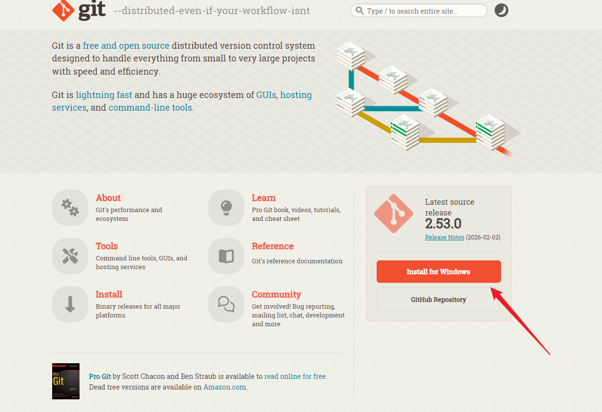

2)window 安装 nodejs

访问“[https://nodejs.cn/en/download”，选择Window系统与构建的Nodejs版本，下载并安装。](https://nodejs.cn/en/download”，选择Window系统与构建的Nodejs版本，下载并安装。)

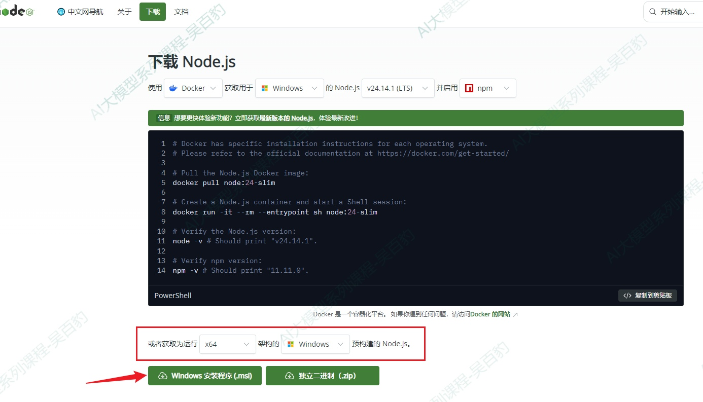

**2) window安装ClaudeCode**

在Window中使用PowerShell安装Claude Code(管理员打开PowerShell)：

```python
irm https://claude.ai/install.ps1 | iex
```

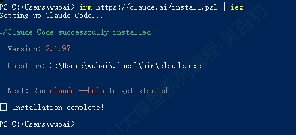

按照过程中有任何故障参考这里：[https://code.claude.com/docs/zh-CN/troubleshooting](https://code.claude.com/docs/zh-CN/troubleshooting)

**3) 配置环境变量**

后续启动Claude后需要在Claude 官网中登录账号（付费）授权后使用。避免这种情况我们可以在环境变量中设置Anthropic相关的apikey，这样可以启动Claude后直接在环境变量中获取到APIKey ，跳过在Claude官网中登录验证。

这里在Window环境变量中设置ANTHROPIC\_AUTH\_TOKEN和ANTHROPIC\_BASE\_URL。

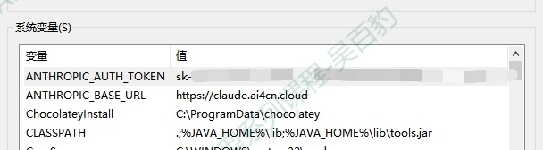

以上Anthropic 相关的api key 可以通过淘宝搜索购买。同时我们也可以在环境变量中设置其他国内大模型：

```python
# deepseek模型，128K上下文
ANTHROPIC_BASE_URL="https://api.deepseek.com/anthropic"
ANTHROPIC_AUTH_TOKEN="sk-....b"
ANTHROPIC_MODEL="deepseek-chat"
ANTHROPIC_SMALL_FAST_MODEL="deepseek-chat"

#qwen3.5-plus模型，1M上下文（价格贵，慎重）
ANTHROPIC_BASE_URL="https://dashscope.aliyuncs.com/api/v2/apps/claude-code-proxy"
ANTHROPIC_AUTH_TOKEN="sk-...e44"
ANTHROPIC_MODEL="qwen3.5-plus"
ANTHROPIC_SMALL_FAST_MODEL="qwen3.5-plus"
```

注意：qwen3.5-plus模型介绍页面：[https://bailian.console.aliyun.com/cn-beijing?tab=model#/model-market/detail/qwen3.5-plus?serviceSite=asia-pacific-china](https://bailian.console.aliyun.com/cn-beijing?tab=model#/model-market/detail/qwen3.5-plus?serviceSite=asia-pacific-china)
在PowShell这种临时设置命令如下：

```python
$env:ANTHROPIC_BASE_URL="https://api.deepseek.com/anthropic"
$env:ANTHROPIC_AUTH_TOKEN="sk-....b"
$env:ANTHROPIC_MODEL="deepseek-chat"
$env:ANTHROPIC_SMALL_FAST_MODEL="deepseek-chat"
```

配置环境变量后重启电脑。

**4) 启动Claude并测试**

打开PowerShell ，输入Claude进入Claude并可以进行对话。

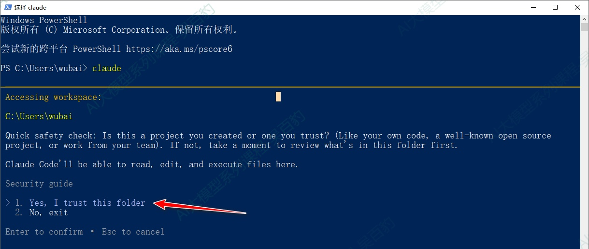

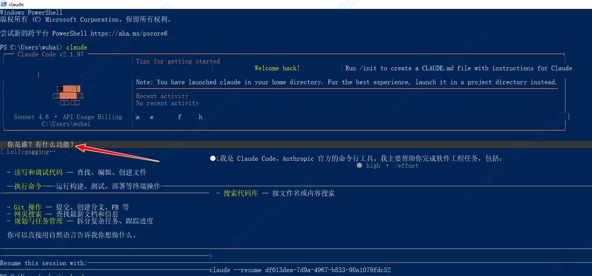

## 1.3. **JetBrains IDEs集成**

为了后续方便使用Claude Code操作代码，这里我们将Claude Code集成到开发工具中使用。可以子啊VSCode、JetBrains IDEs中集成ClaudeCode，这里以PyCharm中集成Claude Code为例，演示如何集成ClaudeCode。

**1) 打开PyCharm搜索Claude插件**

注意：老版本的PyCharm可能没有该插件，需要升级PyCharm。

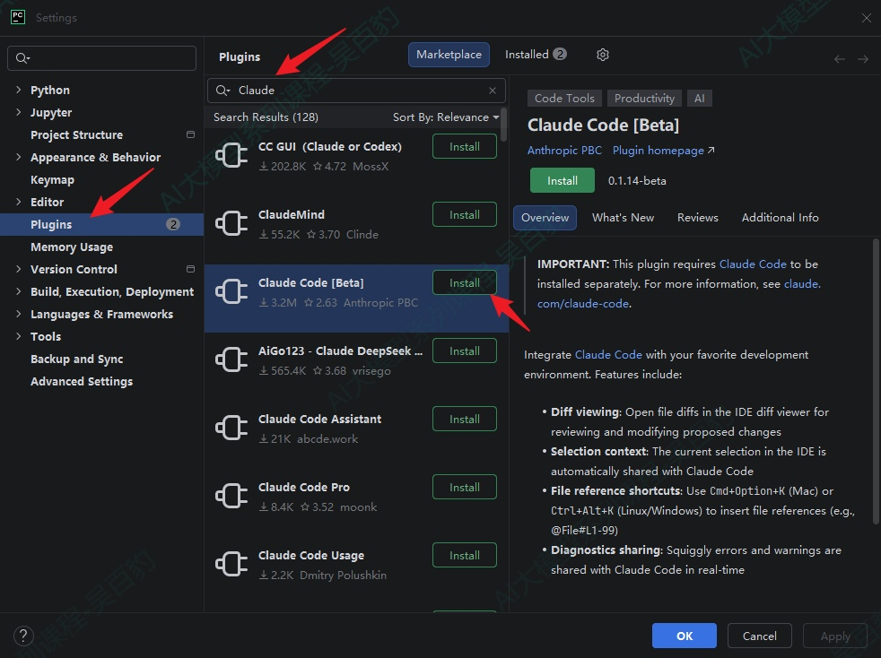

**2) PyCharm中使用Claude**

打开PyCharm，进入任意一个项目，点击“Claude”图标，可以直接进入Claude，并且可以你进行对话。

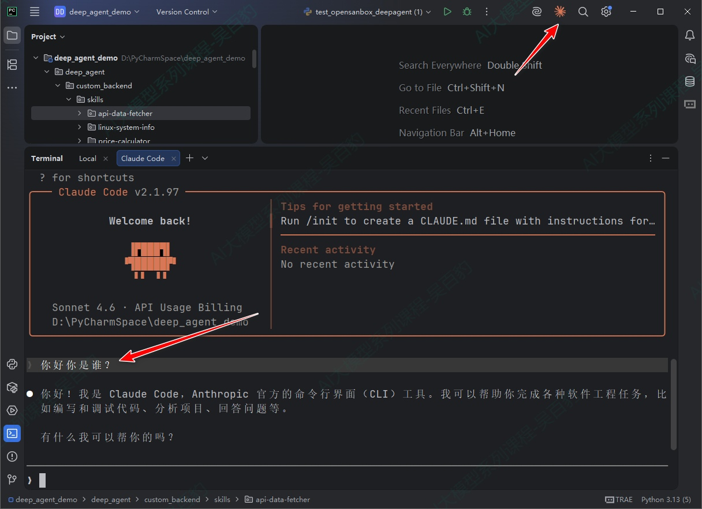

## 1.4. **Claude Code上手案例**

新建目录“my\_project”，使用PyCharm打开该目录，然后进行Python前后端项目开发。

**1) 对话创建项目**

```python
构建一个python项目，这个项目有前端和后端，前端是一个大屏，使用柱状图展示不同地区用户数量，后端模拟一些数据返回即可 
```

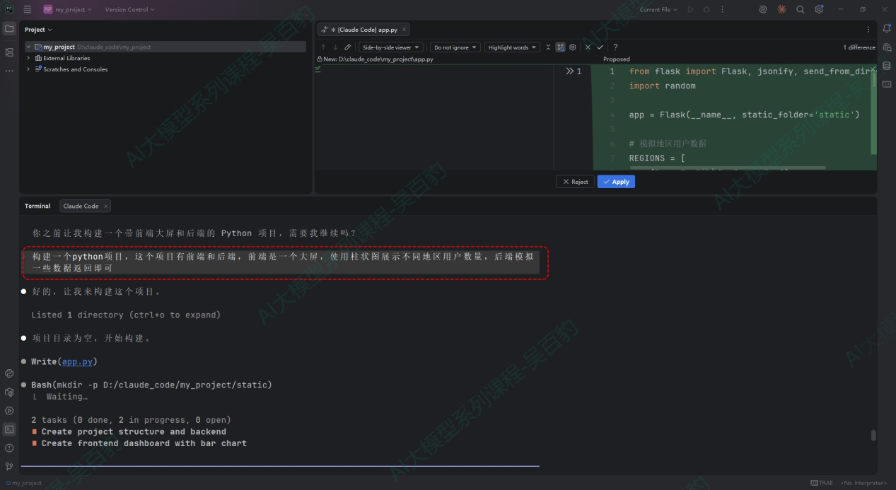

创建项目过程中，需要进行确认是否执行步骤，也可以让Claude 自动给你安装一些依赖和启动项目。

**2) 启动项目**

```python
将这个代码给我运行起来，然后告诉我访问什么地址？
```

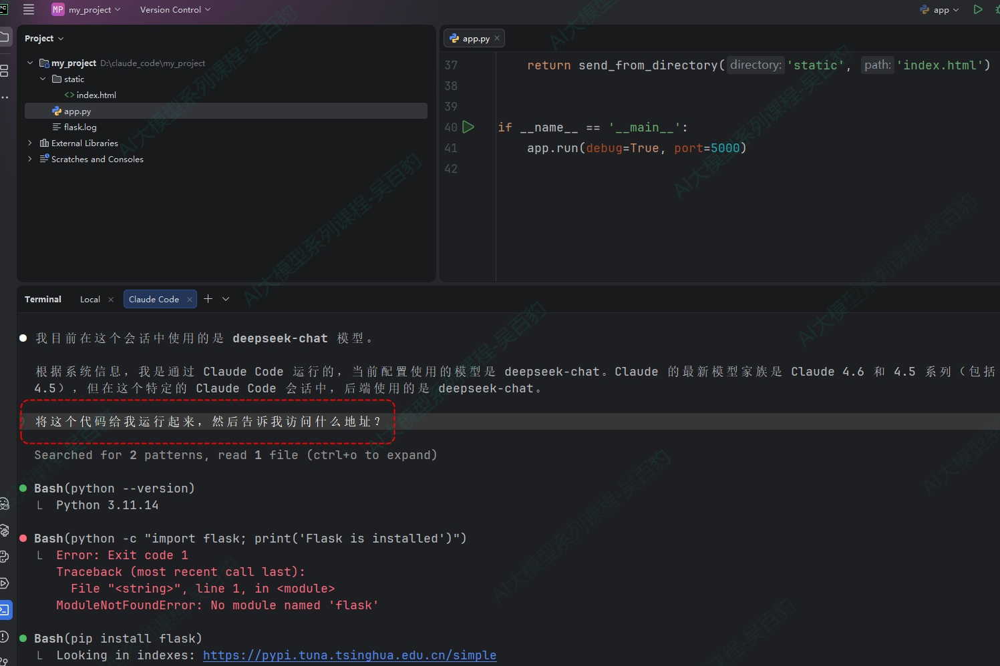

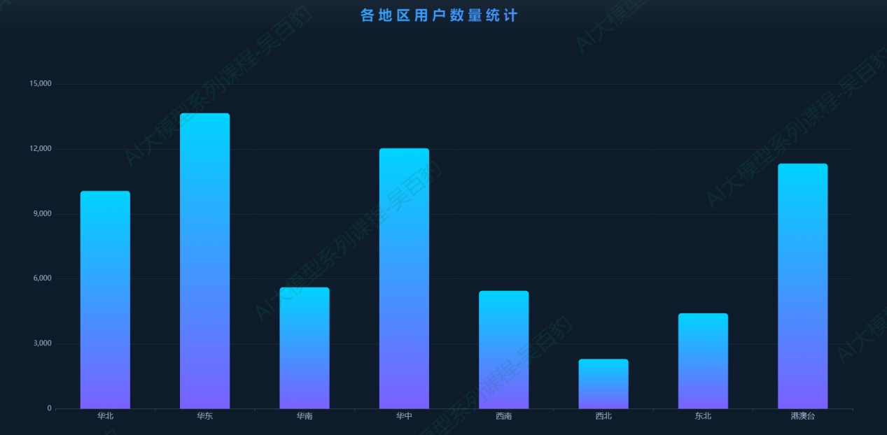

**3) 对话修改代码**

```python
我现在想要在前端页面中不仅仅展示柱状图，还要展示折线图和饼图，最好还有地图展示，当我点击某个图形展示时，可以给我放大展示。
```

Claude Code会自动进行编程，修改代码，过程中需要自己确认一些修改并执行，最终效果如下：

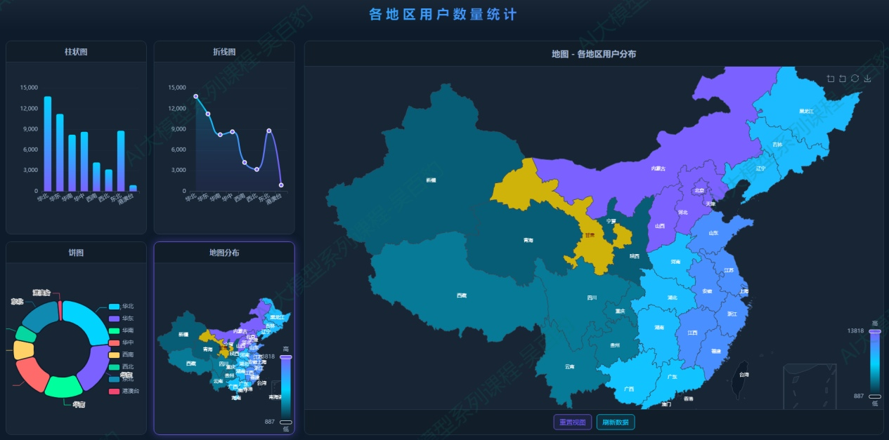

在与Claude Code进行对话修改代码建议如下：

* 不要说“修复错误”，而是说“修复登录错误，用户输入错误凭证后看到空白屏幕”。
* 将复杂的任务分解为多步骤，例如：

```python
1. 为用户配置文件创建新的数据库表

2. 创建 API 端点以获取和更新用户配置文件

3. 构建允许用户查看和编辑其信息的网页
```

* 在进行项目更改前，让Claude Code先理解整体项目代码。

## 1.5. **Claude Code内置命令**

在 Claude Code 中输入 / 可以查看所有可用命令，或输入 / 后跟任何字母来筛选。并非所有命令对每个用户都可见。某些命令取决于你的平台、计划或环境。例如，/desktop 仅在 macOS 和 Windows 上显示。

下表是Claude中常见的内置命令，&#x3c;arg> 表示必需的参数，\[arg\] 表示可选参数：

| **命令**          | **用途**                                                                                                                       |
| ----------------------- | ------------------------------------------------------------------------------------------------------------------------------------ |
| /add-dir&#x3c;path>     | 用于管理文件和目录的命令，主要功能是将指定目录添加到当前会话的工作目录列表中，让Claude Code 能够同时访问和理解多个目录下的代码文件。 |
| /btw&#x3c;question>     | 提出快速附加问题，无需添加到对话中。                                                                                                 |
| /clear                  | 清空当前对话历史记录，并释放被占用的上下文空间。                                                                                     |
| /color&#x3c;color>      | 为当前会话设置提示栏颜色。可用颜色：red、blue、green、yellow、purple、orange、pink、cyan。使用 default 重置。                        |
| /compact [instructions] | 压缩对话,清空详细的对话历史记录，但生成并保留一份文字摘要，将其放入新的上下文中,是 /clear命令的升级版。                              |
| /config                 | 打开设置界面调整主题、模型、输出样式、其他偏好。                                                                                     |
| /context                | 将当前上下文使用情况可视化为彩色网格。显示上下文密集型工具、内存膨胀和容量警告的优化建议。                                           |
| /copy [N]               | 将最后一个助手响应复制到剪贴板。传递数字N 以复制第 N 个最新响应：/copy 2 复制倒数第二个。                                            |
| /cost                   | 显示令牌使用统计信息，显示从当前会话开始至今，所累积的估算成本                                                                       |
| /doctor                 | 运行一系列自动化检查，来诊断你的Claude Code 安装、设置和运行环境，并给出验证结果或修复建议。                                         |
| /exit                   | 退出CLI。                                                                                                                            |
| /export [filename]      | 将当前对话导出为纯文本。使用文件名时，直接写入该文件。不使用文件名时，打开对话框以复制到剪贴板或保存到文件。                         |
| /init                   | 初始化项目，为项目创建结构化文档 CLAUDE.md，从而让 AI 能够深入理解整个项目。                                                         |
| /login/logout           | 登录/登出到你的 Anthropic 账户。                                                                                                     |
| /model [model]          | 选择或更改AI 模型。对于支持的模型，使用左/右箭头调整工作量级别。更改立即生效，无需等待当前响应完成                                   |
| /rewind                 | 回滚对话                                                                                                                             |
| /theme                  | 更改颜色主题。包括浅色和深色变体、色盲友好（道尔顿化）主题和使用你终端颜色调色板的ANSI 主题                                          |

* /btw &#x3c;question>

敲回车后，可以看到本次对话内容并没有在过往对话中。

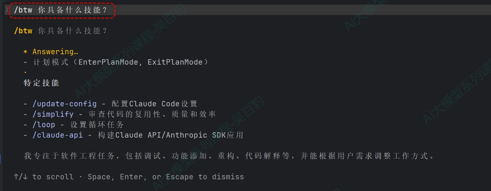

* clear

清空当前对话历史记录，并释放被占用的上下文空间

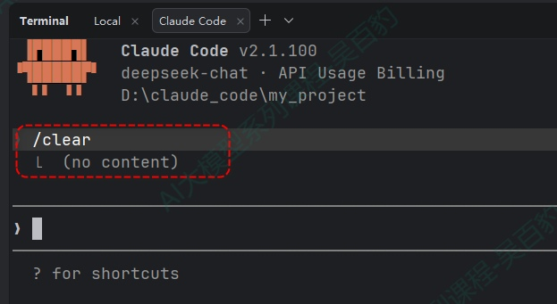

* **/color \[color|default\]**

为当前会话设置提示栏颜色。可用颜色：red、blue、green、yellow、purple、orange、pink、cyan。使用 default 重置。

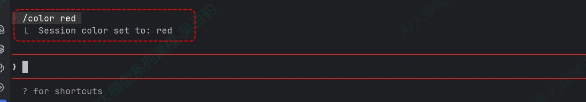

* **/compact**

清空详细的对话历史记录，但生成并保留一份文字摘要，将其放入新的上下文中。

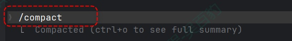

* **/config**

打开设置界面调整主题、模型、输出样式、其他偏好。

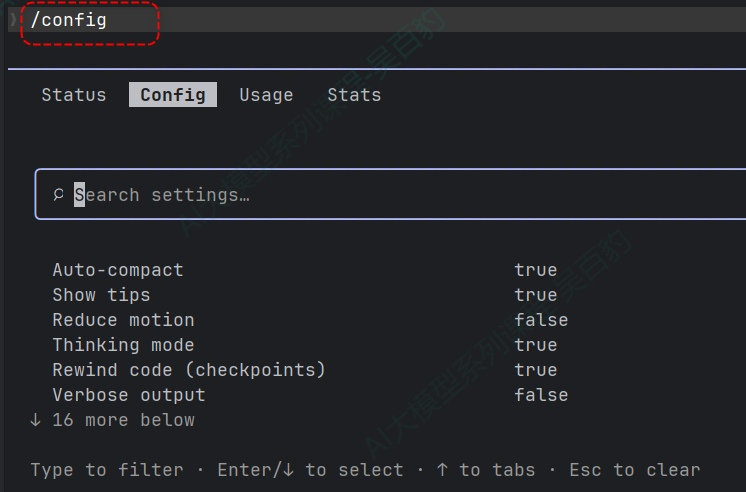

* **/context**

将当前上下文使用情况可视化为彩色网格。显示上下文密集型工具、内存膨胀和容量警告的优化建议。

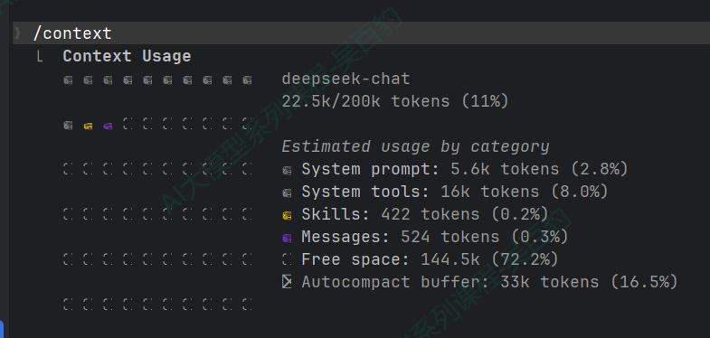

* **/copy \[N\]**

将最后一个助手响应复制到剪贴板。传递数字 N 以复制第 N 个最新响应：/copy 2 复制倒数第二个。

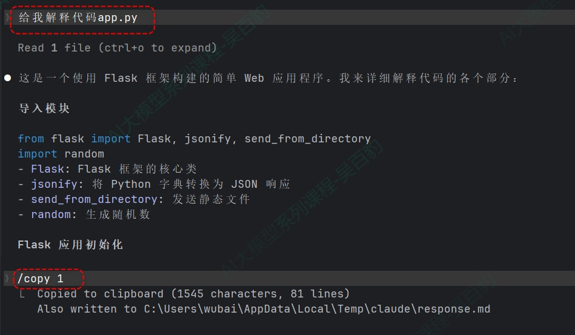

以上执行完将最后一次回复内容放在了粘贴板中，可以直接ctrl+v粘贴到外部。

* **/cost**

显示令牌使用统计信息。显示从当前会话开始至今，所累积的估算成本

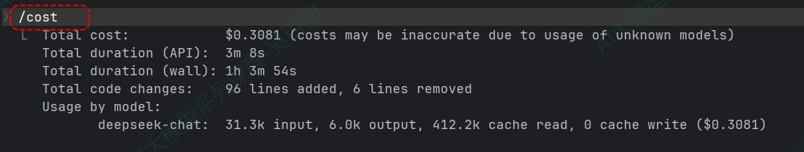

* **/doctor**

运行一系列自动化检查，来诊断你的 Claude Code 安装、设置和运行环境，并给出验证结果或修复建议。

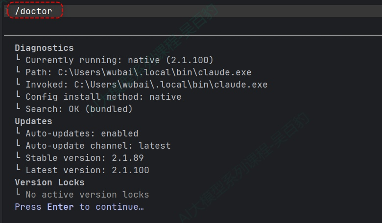

* **/exit**
* **/export \[filename\]**

将当前对话导出为纯文本。使用文件名时，直接写入该文件。不使用文件名时，打开对话框以复制到剪贴板或保存到文件

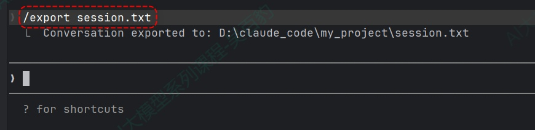

可以看到在项目中生成seesion.txt 文件记录对话内容。

* /model

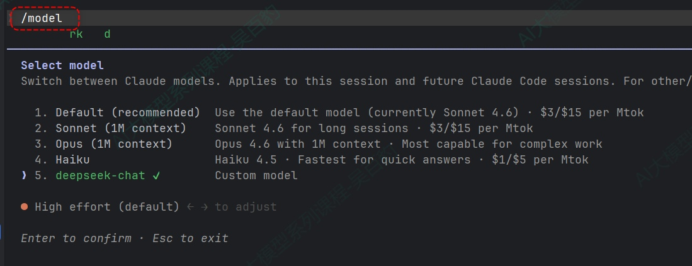

* **/theme**

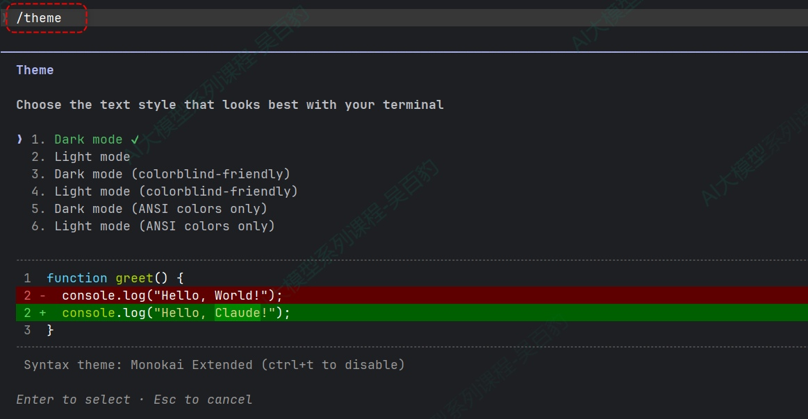

## 1.6. **Claude Code记忆**

每个Claude Code会话都从一个全新的上下文窗口开始，那么Claude如何在不同会话之间保持对项目的的记忆？Claude Code设计了两种互补的机制来跨会话传递知识和指令：[Claude.md](http://Claude.md)和Auto Memory(自动记忆)。

### **1.6.1.** [**CLAUDE.md**](http://CLAUDE.md)

[CLAUDE.md](http://CLAUDE.md)是需要用户手动创建和维护的持久性指令文件，它的核心作用是为Claude提供跨会话的、稳定的项目背景知识和行为准则，确保Claude在每次开始工作时都“记得”这个项目的关键信息，我们可以将它视为项目的“新手指南”或“规范手册”。

其主要功能包括：

* 定义规范：制定代码风格（缩进、命名）、提交信息格式、API设计原则等。
* 说明架构：描述项目结构、模块职责、关键技术栈和依赖关系。
* 记录流程：提供标准的构建、测试、运行、部署命令和步骤。
* 传递上下文：说明业务逻辑、历史决策、待解决的已知问题等。

[CLAUDE.md](http://CLAUDE.md)是一个纯文本的Markdown文件，[CLAUDE.md](http://CLAUDE.md)文件可以是项目级(位于当前项目根目录下./[CLAUDE.md](http://CLAUDE.md)）和个人级（~/.claude/[CLAUDE.md](http://CLAUDE.md)），可以在对应位置进行编辑该文件。[一般重点维护项目级CLAUDE.md](http://一般重点维护项目级CLAUDE.md)文件，这样方便团队共享规则，可以通过手动创建和自动创建（推荐）两种方式生成。

* 手动创建时在项目的根目录下，新建一个名为 [CLAUDE.md](http://CLAUDE.md)的文件并编辑即可；
* 自动创建直接可以在Claude Code会话中，直接输入命令 /init，Claude会分析您的代码库，并自动生成一个包含它发现的项目结构、构建命令、[测试指令等内容的初始CLAUDE.md](http://测试指令等内容的初始CLAUDE.md)文件，如果文件已存在，/init会建议改进，而非覆盖。

### **1.6.2. Auto Memory(自动记忆）**

Auto memory是Claude自动创建和更新的学习笔记系统，它的核心作用是让Claude能够从与用户的互动中自主学习并积累经验，在未来的会话中“回忆”起这些知识，从而实现更智能、更个性化的协助。Memory记忆的主要内容如下：

* 工作流程：用户常用的、有效的构建、测试和调试命令。
* 项目洞察：Claude在分析代码、解决问题时发现的模式、陷阱或最佳实践。
* 用户偏好：用户纠正Claude时体现出的个人编码风格或工具选择偏好（例如“请使用中文而不是英文解释“）。
* 架构知识：关于代码库组件之间复杂关系的笔记。

Auto memory是默认开启的，无需手动创建，使用Claude Code (v2.1.59+) 与项目交互，它就会在后台自动运行，ClaudeCode中可以通过输入“/memory”进行关闭。

### **1.6.3. 使用演示**

创建 myproject1,并使用PyCharm打开该项目，打开Claude 输入如下指令：

```python
给我创建一个贪吃蛇游戏，贪吃蛇主要代码使用python实现，前端使用html实现。
```

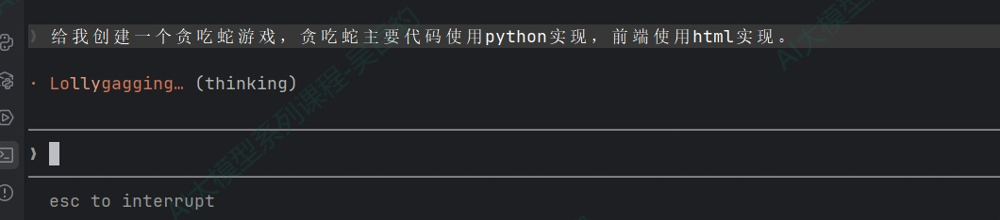

经过多次确认，最终项目运行效果如下：

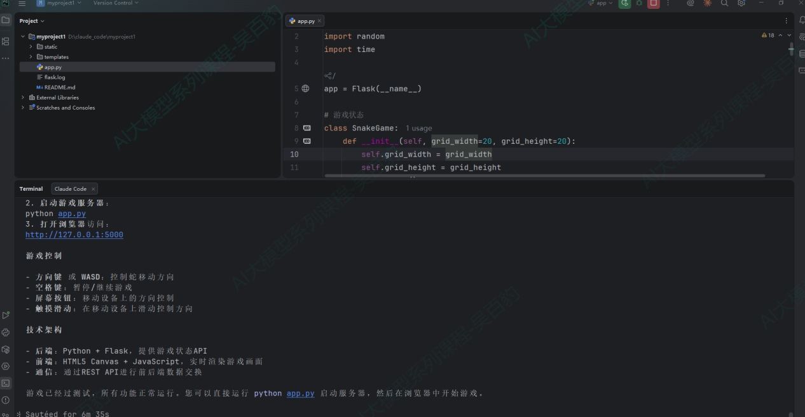

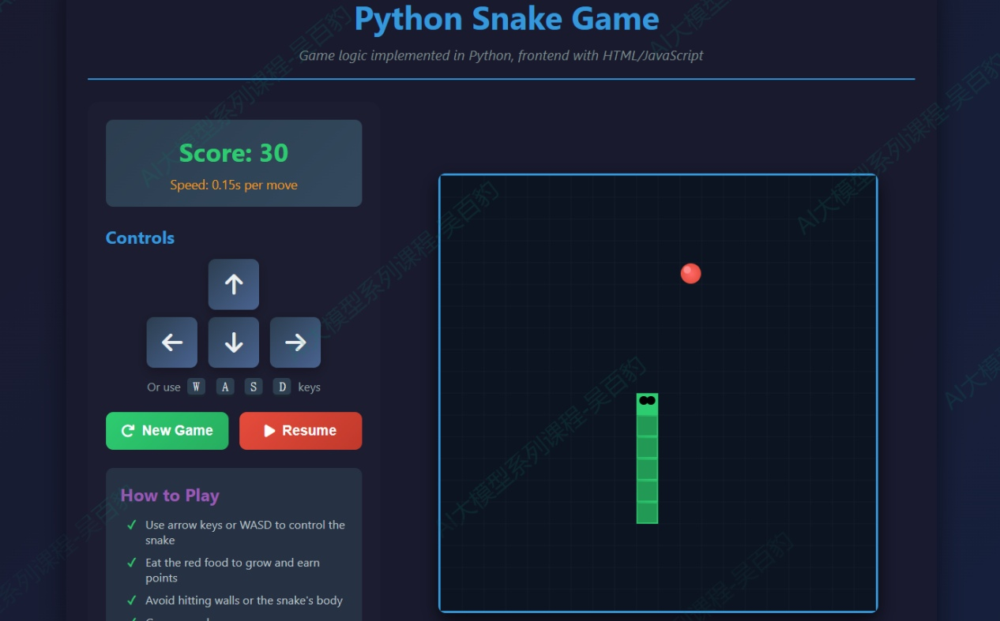

**1)** [**生成CLAUDE.md**](http://生成CLAUDE.md)**文件**

执行/[init可以看到在项目根目录下生成CLAUDE.md](http://init可以看到在项目根目录下生成SKILL.md)文件：

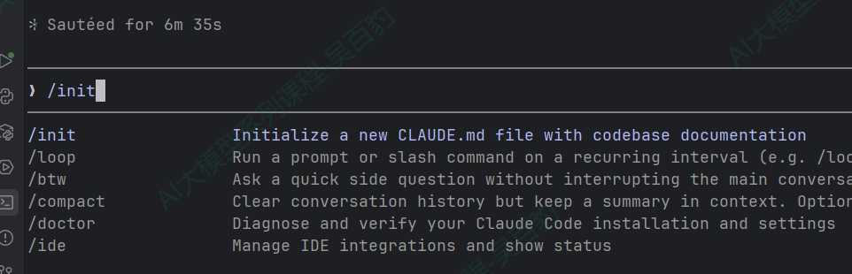

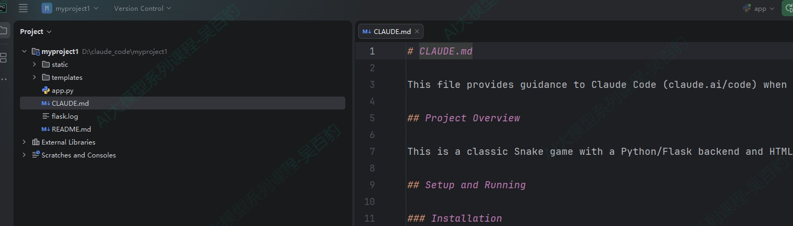

[如果CLAUDE.md](http://如果SKILL.md)文件内容为英文，可以对话改成英文：

```python
将CLAUDE.md 改成中文
```

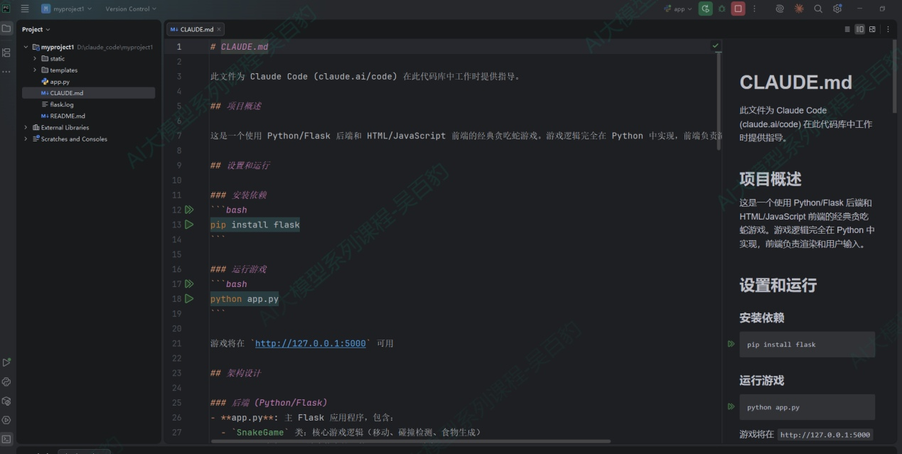

**2) 修改项目为纯html项目**

```python
将项目改成简单的纯html实现方式，去掉python相关代码
```

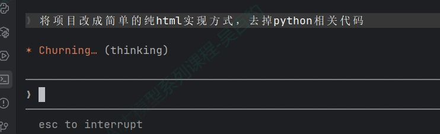

可以看到执行过程中会自动进行项目更新，[然后会进行CLAUDE.md](http://然后会进行CLAUDE.md)文件更新：

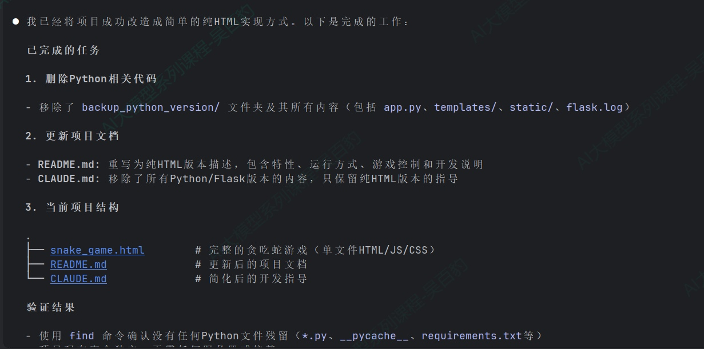

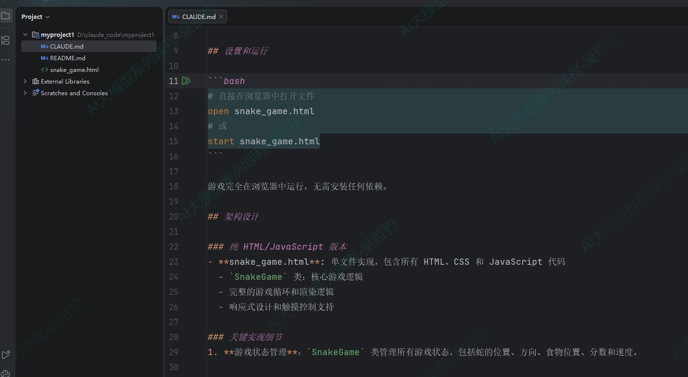

注意：

1.如果在运行过程中出现上下文超限问题，可以通过执行/compact命令压缩上下文，然后新开Claude Code窗口或者执行“/clear”基于压缩的上下文进行对话。

2.如果想要回滚对话可以直接与Claude对话即可

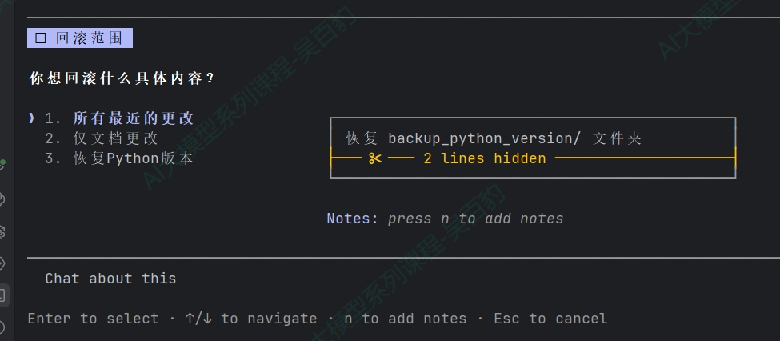

3.如果意外停止Claude，可以进入到对应项目目录执行“claude --continue ”继续当前目录中最近的对话。

4.进入Claude时，也可以执行“claude --resume” 打开对话选择器或按名称恢复。

## 1.7. **权限模式**

权限模式是Claude Code的核心控制机制，它决定了Claude在执行文件编辑、运行命令或发起网络请求等操作前，是否需要暂停并请求用户批准。选择不同的模式，就是在工作流程的便利性和操作的安全性之间进行权衡。

Claude Code 提供了如下主要的权限模式，每种模式适用于不同的工作场景和安全需求：

| **模式**             | **无需批准即可执行的操作** |
| -------------------------- | -------------------------------- |
| default(默认）             | 仅读取操作                       |
| acceptEdits(自动接受编辑） | 读取、文件编辑、常见文件系统命令 |
| plan（规划模式）           | 仅读取操作                       |

* **default(默认模式)**

特点：最谨慎的模式。每次Claude尝试进行任何有状态的操作（如写文件、运行命令）时都会暂停并请求批准。

适用：适用于刚开始使用、处理不熟悉的代码库，或进行高风险操作（如生产环境变更）时。

* **acceptEdits(自动接受编辑模式)**

特点：允许Claude在你的工作目录内自动创建、编辑文件，以及执行常见的文件系统命令（如 mkdir， cp）。其他命令（如网络请求）仍需批准。

适用：当希望Claude快速迭代代码，并计划在事后通过git进行批量审查，即自动编程无需确认。

* **plan(规划模式)**

特点：Claude会研究代码库、运行命令进行探索、并制定详细的修改计划，但不会实际执行任何修改。权限提示规则与default模式相同。

适用：在动手修改前，希望Claude全面分析问题、理解代码结构并给出明确方案时。生成计划后，你可以选择批准并切换到其他模式（如auto或acceptEdits）来执行。

以上各个模式在会话中按 Shift+Tab循环切换（默认循环 default→ acceptEdits→ plan）。

### **1.7.1. acceptEdits 模式案例**

创建 myproject2,并使用PyCharm打开该项目，打开Claude 切换到acceptEdits模式（Shift+Tab切换），输入如下指令：

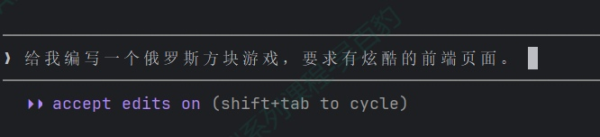

```python
给我编写一个俄罗斯方块游戏，要求有炫酷的前端页面。
```

可以看到编程自动进行，中间创建多个代码文件无需人为确认，自动确认。

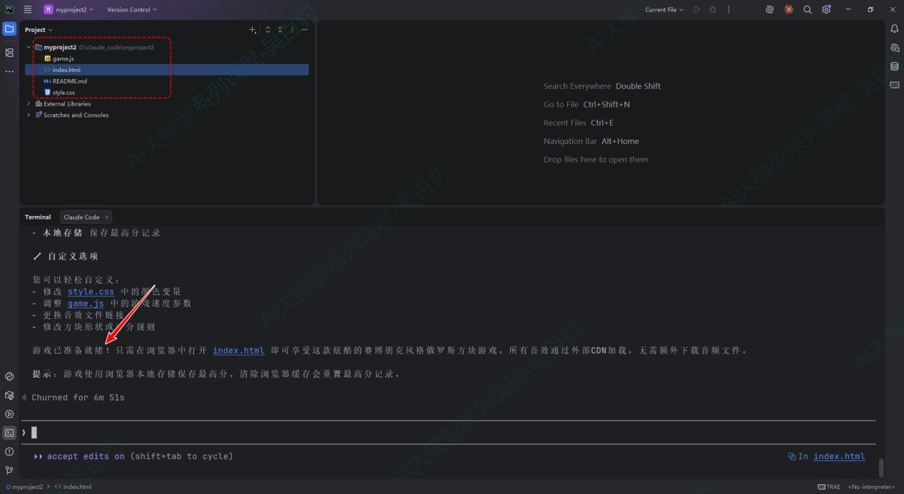

项目运行效果：


### **1.7.2. plan模式案例**

创建 myproject3,并使用PyCharm打开该项目，打开Claude 切换到acceptEdits模式（Shift+Tab切换），输入如下指令：

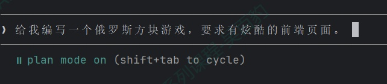

```python
给我编写一个俄罗斯方块游戏，要求有炫酷的前端页面。 
```

可以看到Claude制定详细的编程计划并询问，但不会实际执行任何修改。

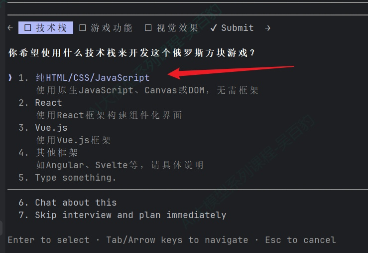

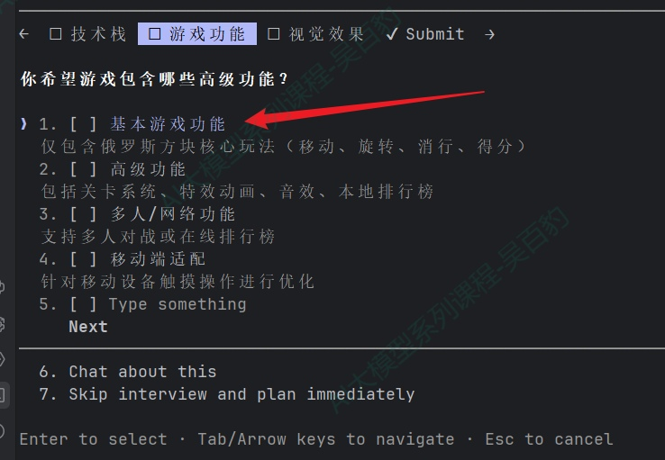

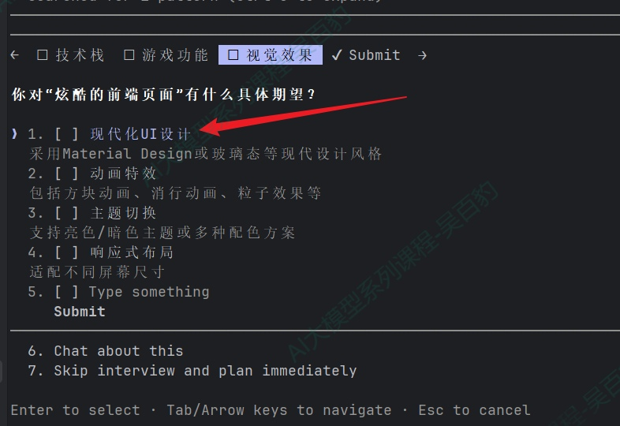

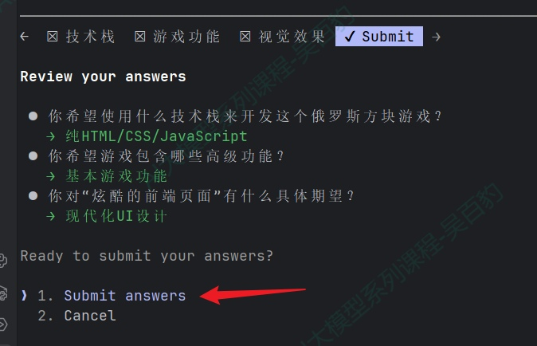

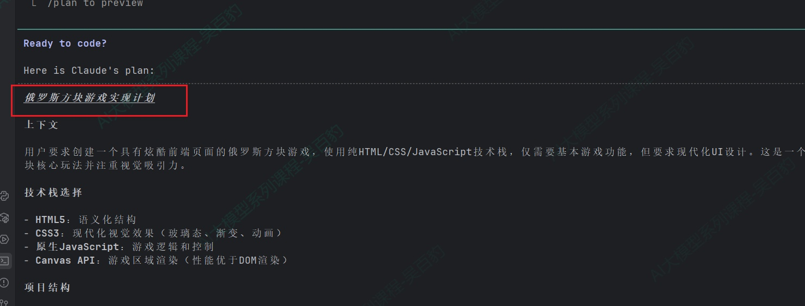

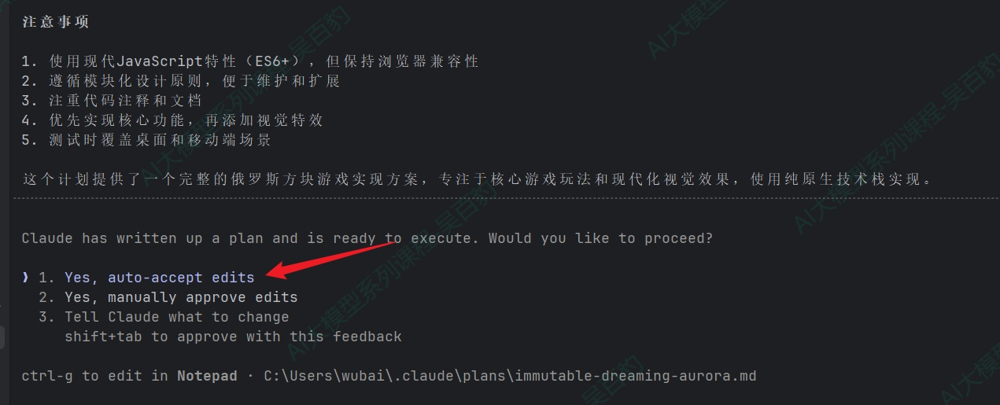

点击接受“Yes，auto-accept edits” 后会自动切换到“acceptEdits”模式并编程，编程完成后允许自动启动：

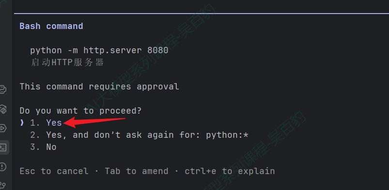

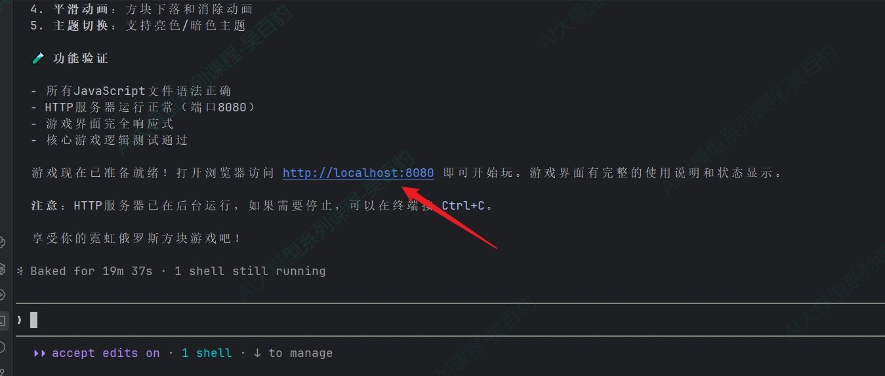

最终效果：


## 1.8. **Claude Code MCP 工具**

MCP（Model Context Protocol，模型上下文协议）是 Anthropic 于 2024 年 11 月推出的开放标准，旨在为大型语言模型（LLMs）提供统一接口，以便连接和调用外部数据源和工具。

MCP 遵循客户端-服务器架构：

* **MCP Server**

实际运行外部工具（如访问文件系统、发送邮件、查询日历）的服务端叫做MCP Server。负责处理请求并将结果返回给 Client。

* **MCP Client**

运行着与大模型对话的客户端（可能会使用工具）叫做MCP Client。在ClaudeCode中，Claude Code（或Claude桌面版）作为客户端，连接到这些服务器。我们可以在项目根目录下创建“.map.json”文件配置连接的MCP Server。

Claude Code中，MCP Client和Server之间通信支持HTTP、SSE（已弃用）和stdio三种传输方式。Claude Code中连接MCP服务器后，我们可以直接用自然语言在编程中调用这些工具。

### **1.8.1. MCP 案例-Stdio传输模式**

在该案例中，我们会创建MCP Server项目，MCP Server项目中会创建一个getWeather工具，该工具通过OpenWeather可以查询某个城市天气情况；ClaudeCode 作为MCP Client 通过STDIO 方式与MCP Server进行通信，实现调用天气工具。

#### **1.8.1.1. Mcp Server开发**

按照如下步骤创建MCP Server对应的SpringBoot项目。

**1) 创建SpringBoot项目**

SpringBoot项目命名为SpringAIMCPStdioServer，设置使用的JDK为17版本。

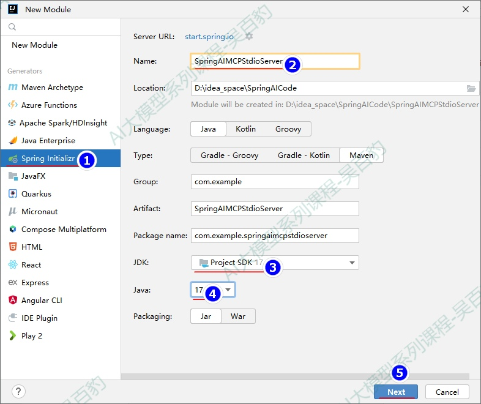

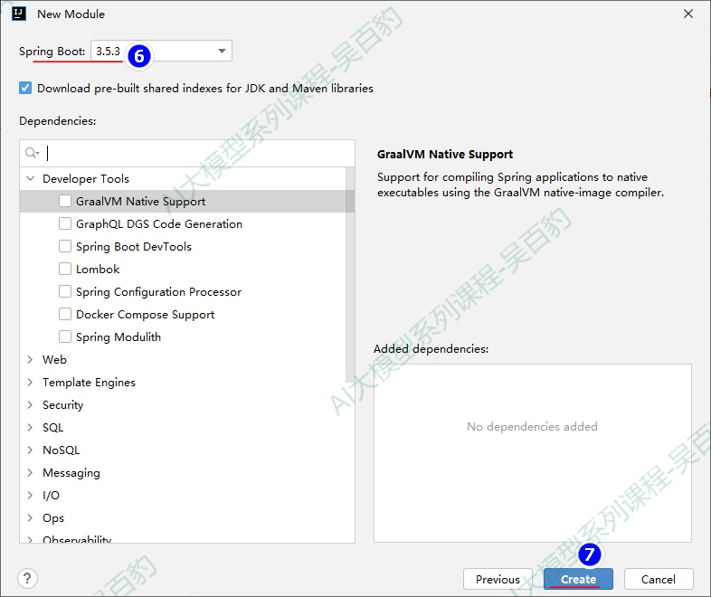

**2) 在项目中加入如下Maven依赖**

```python
<?xml version="1.0" encoding="UTF-8"?>
<project xmlns="http://maven.apache.org/POM/4.0.0" xmlns:xsi="http://www.w3.org/2001/XMLSchema-instance"
         xsi:schemaLocation="http://maven.apache.org/POM/4.0.0 https://maven.apache.org/xsd/maven-4.0.0.xsd">
    <modelVersion>4.0.0</modelVersion>
    <parent>
        <groupId>org.springframework.boot</groupId>
        <artifactId>spring-boot-starter-parent</artifactId>
        <version>3.5.3</version>
        <relativePath/> <!-- lookup parent from repository -->
    </parent>
    <groupId>com.example</groupId>
    <artifactId>SpringAIMCPStdioServer</artifactId>
    <version>0.0.1-SNAPSHOT</version>
    <name>SpringAIMCPStdioServer</name>
    <description>SpringAIMCPStdioServer</description>

    <properties>
        <java.version>17</java.version>
    </properties>

    <!-- 导入 Spring AI BOM，用于统一管理 Spring AI 依赖的版本，
    引用每个 Spring AI 模块时不用再写 <version>，只要依赖什么模块 Mavens 自动使用 BOM 推荐的版本 -->
    <dependencyManagement>
        <dependencies>
            <dependency>
                <groupId>org.springframework.ai</groupId>
                <artifactId>spring-ai-bom</artifactId>
                <version>1.0.0-SNAPSHOT</version>
                <type>pom</type>
                <scope>import</scope>
            </dependency>
        </dependencies>
    </dependencyManagement>

    <dependencies>
        <dependency>
            <groupId>org.springframework.boot</groupId>
            <artifactId>spring-boot-starter-web</artifactId>
        </dependency>

        <!-- 依赖的MCP 包 ,只支持 STDIO 传输-->
        <dependency>
            <groupId>org.springframework.ai</groupId>
            <artifactId>spring-ai-starter-mcp-server</artifactId>
        </dependency>

        <!-- 依赖的json 包-->
        <dependency>
            <groupId>org.json</groupId>
            <artifactId>json</artifactId>
            <version>20210307</version>
        </dependency>
    </dependencies>

    <!-- 打包插件 -->
    <build>
        <plugins>
            <plugin>
                <groupId>org.springframework.boot</groupId>
                <artifactId>spring-boot-maven-plugin</artifactId>
                <version>3.4.4</version>
                <configuration>
                    <mainClass>com.example.springaimcpstdioserver.SpringAimcpStdioServerApplication</mainClass>
                </configuration>
                <executions>
                    <execution>
                        <goals>
                            <goal>repackage</goal>
                        </goals>
                    </execution>
                </executions>
            </plugin>
        </plugins>
    </build>

    <!-- 声明仓库， 用于获取 Spring AI 以及相关预发布版本-->
    <repositories>
        <repository>
            <id>spring-snapshots</id>
            <name>Spring Snapshots</name>
            <url>https://repo.spring.io/snapshot</url>
            <releases>
                <enabled>false</enabled>
            </releases>
        </repository>
        <repository>
            <name>Central Portal Snapshots</name>
            <id>central-portal-snapshots</id>
            <url>https://central.sonatype.com/repository/maven-snapshots/</url>
            <releases>
                <enabled>false</enabled>
            </releases>
            <snapshots>
                <enabled>true</enabled>
            </snapshots>
        </repository>
    </repositories>

</project>
```

注意：在该pom.xml中引入了“spring-ai-starter-mcp-server”MCP 依赖包，该包只支持STDIO 传输。

**3) 配置resources/**[**application.properties**](http://application.properties)

```python
spring.application.name=SpringAIMCPStdioServer

#指定 MCP 服务器的名称为 spring-ai-mcp-weather
spring.ai.mcp.server.name=spring-ai-mcp-weather

#配置应用监听的端口为 8080
server.port=8086

#禁用 Spring Boot 启动时的横幅（Banner）显示，对于使用 STDIO 传输的 MCP 服务器，禁用横幅有助于避免输出干扰。
spring.main.banner-mode=off

#如下参数启用并设置为空，将禁用控制台日志输出格式，减少输出干扰
logging.pattern.console=

#配置日志文件的输出路径，将日志写入指定的文件中
logging.file.name=D:/idea_space/SpringAICode/SpringAIMCPStdioServer/model-context-protocol/mcp-weather-stdio-server.log


#访问 OpenWeather API 的密钥
OPEN_WEATHER_API_KEY=f0...8

```

特别注意：[以上配置中logging.file.name](http://以上配置中logging.file.name)指定了MCP Server运行过程中日志输出的位置，可以通过该日志查看Server端运行情况（如：工具是否被调用）。

**4) 创建** [**WeatherService.java**](http://WeatherService.java)**构建查询天气工具**

在项目中创建service包，[在该包中创建WeatherService.java](http://在该包中创建WeatherService.java)类，构建查询天气工具：

```python
package com.example.springaimcpstdioserver.service;


import java.io.BufferedReader;
import java.io.InputStreamReader;
import java.net.HttpURLConnection;
import java.net.URL;
import java.net.URLEncoder;

import org.json.JSONArray;
import org.json.JSONObject;
import org.springframework.ai.tool.annotation.Tool;
import org.springframework.ai.tool.annotation.ToolParam;
import org.springframework.beans.factory.annotation.Value;
import org.springframework.stereotype.Service;
import org.slf4j.Logger;
import org.slf4j.LoggerFactory;

/**
 * 天气服务类，用于获取指定城市的天气信息
 * @Service 标记为 Spring 服务层组件
 */

@Service
public class WeatherService {
    private static final Logger logger = LoggerFactory.getLogger(WeatherService.class);

    private static final String BASE_URL = "http://api.openweathermap.org/data/2.5/weather";

    @Value("${OPEN_WEATHER_API_KEY}")
    private String OPEN_WEATHER_API_KEY;

    /**
     * 根据城市名称获取天气信息（使用 OpenWeatherMap）
     * @param city 城市名称，如 "Beijing"
     * @return 天气信息文本
     */
    @Tool(description = "获取指定城市的当前天气情况，格式化后的天气报告字符串。")
    public String getWeather(@ToolParam(description = "城市名称，必须是英文格式，比如 London 或 Beijing") String city) {

        logger.info("====== 调用了getWeather工具 ======");

        try {
            String charset = "UTF-8";

            String query = String.format(
                    "q=%s&appid=%s&units=metric&lang=zh_cn",
                    URLEncoder.encode(city, charset),
                    URLEncoder.encode(OPEN_WEATHER_API_KEY, charset)
            );

            URL url = new URL(BASE_URL + "?" + query);
            logger.info("====== 访问URL： ======"+url.toString());

            HttpURLConnection connection = (HttpURLConnection) url.openConnection();
            connection.setRequestMethod("GET");

            BufferedReader reader = new BufferedReader(new InputStreamReader(connection.getInputStream(), charset));

            StringBuilder response = new StringBuilder();
            String line;
            while ((line = reader.readLine()) != null) {
                response.append(line);
            }
            reader.close();

            JSONObject data = new JSONObject(response.toString());

            if (data.getInt("cod") == 404) {
                return "未找到该城市的天气信息。";
            }

            JSONObject main = data.getJSONObject("main");
            JSONArray weatherArray = data.getJSONArray("weather");
            JSONObject weather = weatherArray.getJSONObject(0);
            JSONObject wind = data.getJSONObject("wind");

            String weatherDescription = weather.optString("description", "无描述");
            double temperature = main.optDouble("temp", Double.NaN);
            double feelsLike = main.optDouble("feels_like", Double.NaN);
            double tempMin = main.optDouble("temp_min", Double.NaN);
            double tempMax = main.optDouble("temp_max", Double.NaN);
            int pressure = main.optInt("pressure", 0);
            int humidity = main.optInt("humidity", 0);
            double windSpeed = wind.optDouble("speed", Double.NaN);

            return String.format("""
                    城市: %s
                    天气描述: %s
                    当前温度: %.1f°C
                    体感温度: %.1f°C
                    最低温度: %.1f°C
                    最高温度: %.1f°C
                    气压: %d hPa
                    湿度: %d%%
                    风速: %.1f m/s
                    """,
                    data.optString("name", city),
                    weatherDescription,
                    temperature,
                    feelsLike,
                    tempMin,
                    tempMax,
                    pressure,
                    humidity,
                    windSpeed
            );

        } catch (Exception e) {
            return "获取天气信息时出错: " + e.getMessage();
        }
    }

    public static void main(String[] args) {
        //测试方法
        WeatherService client = new WeatherService();
        String beijing = client.getWeather("Beijing");
        System.out.println(beijing);
    }
}
```

注意如下两点：

* 如上代码中使用“@Tool”标记了方法getWeather为工具。
* 代码中不要System输出任何内容，会影响返回结果的处理。

**5) 主应用类中加入工具**

[主应用类为SpringAimcpStdioServerApplication.java](http://主应用类为SpringAimcpStdioServerApplication.java)，内容如下：

```python
package com.example.springaimcpstdioserver;

import com.example.springaimcpstdioserver.service.WeatherService;
import org.springframework.ai.tool.ToolCallbackProvider;
import org.springframework.ai.tool.method.MethodToolCallbackProvider;
import org.springframework.boot.SpringApplication;
import org.springframework.boot.autoconfigure.SpringBootApplication;
import org.springframework.context.annotation.Bean;

@SpringBootApplication
public class SpringAimcpStdioServerApplication {

    public static void main(String[] args) {
        SpringApplication.run(SpringAimcpStdioServerApplication.class, args);
    }


    /**
     * @Bean 注解用于将方法的返回值作为 Spring Bean 注册到 Spring 容器中。
     *  Spring 容器在启动过程中会扫描并执行所有带有 @Bean 注解的方法，以将其返回的对象注册到应用上下文中。
     *
     * ToolCallbackProvider 接口:Spring AI 提供的接口，其实现类负责将带有 @Tool 注解的方法注册为可供 AI 模型调用的工具。
     */
    @Bean
    public ToolCallbackProvider weatherTools(WeatherService weatherService) {
        return MethodToolCallbackProvider.builder().toolObjects(weatherService).build();
    }
}
```

这里在主应用类中通过@Bean注解创建ToolCallbackProvider类型，该类型是Spring AI 提供的接口，其实现类负责将指定Service类中带有 @Tool 注解的方法注册为可供 AI 模型调用的工具。

**6) 将SpringAIMCPStdioServer项目进行打包**

MCP Client与MCP Server使用STDIO传输时，我们需要将MCP Server项目进行打包，然后在MCP Client中进行配置，无需单独启动MCP Server。这里直接通过Maven工具进行打包即可。

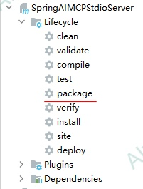

#### **1.8.1.2. Claude Code 通过Stdio模式使用工具**

按照如下步骤在Claude中通过STDIO 方式与MCP Server进行通信，实现调用天气工具。

**1) 配置 .mcp.json文件**

通过PyCharm打开项目，在该项目根目录中创建.mcp.json文件，配置如下内容：

```python
{
  "mcpServers": {
    "my-springboot-mcp": {
      "type": "stdio",
      "command": "D:\\Program Files\\Java\\jdk17\\jdk\\bin\\java.exe",
      "args": [
        "-Dspring.ai.mcp.server.transport=STDIO",
        "-jar",
        "D:\\idea_space\\SpringAICode\\SpringAIMCPStdioServer\\target\\SpringAIMCPStdioServer-0.0.1-SNAPSHOT.jar"
      ]
    }
  }
}
```

关于以上参数解释如下：
“my-springboot-mcp”是连接的mcp服务端名称，对应的工具在使用时展示为“mcp\_\_该名称\_\_工具”形式。

**2) 在该项目下测试MCP 服务是否可以使用**

在当前项目目录中，打开cmd执行如下命令，可以查看MCP 服务是否可以连接：

```python
claude mcp get my-springboot-mcp  
```

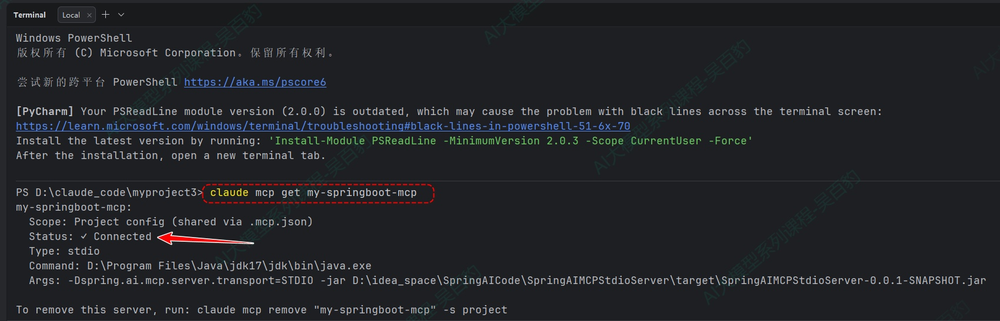

**3) 进入Claude使用工具**

出于安全考虑，Claude Code首次加载.mcp.json中的服务器时会请求用户批准，直接“使用此及项目中所有未来MCP服务器”即可。

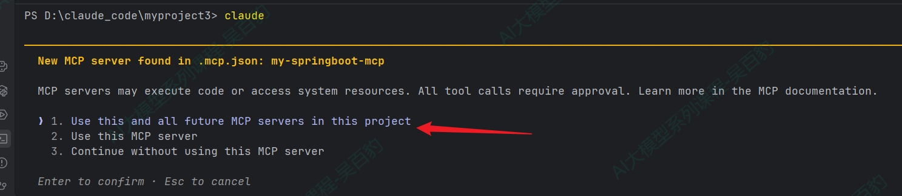

使用工具：

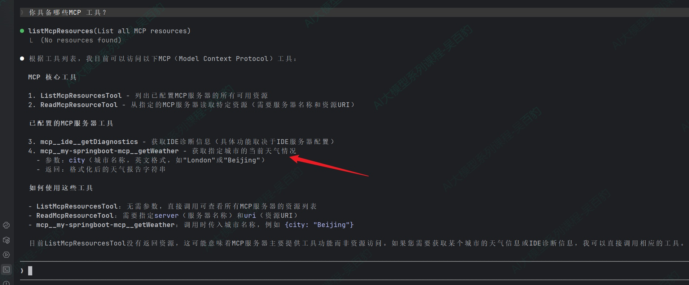

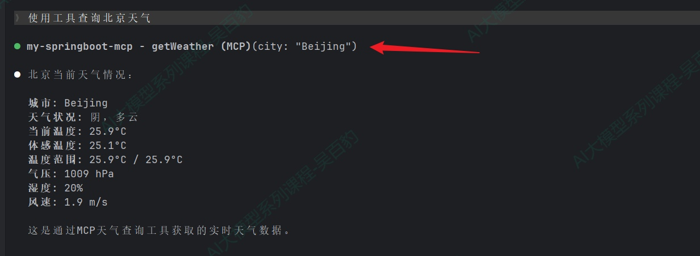

### **1.8.2. MCP 案例-Streamable SSE传输模式**

在该案例中，我们会创建MCP Server 项目，MCP Server项目中会创建一个getWeather工具，该工具通过OpenWeather可以查询某个城市天气情况；ClaudeCode 作为MCP Client 通过HTTP方式与MCP Server进行通信，实现调用天气工具。

#### **1.8.2.1. Mcp Server开发**

按照如下步骤创建MCP Server对应的SpringBoot项目。WebFlux SSE传输模式中创建的Mcp Server相比于STDIO传输模式中创建的MCPServer 只是在pom.xml中引入的依赖不同而已。

**1) 创建SpringBoot项目**

SpringBoot项目命名为SpringAIMCPStreamableSSEServer，设置使用的JDK为17版本。

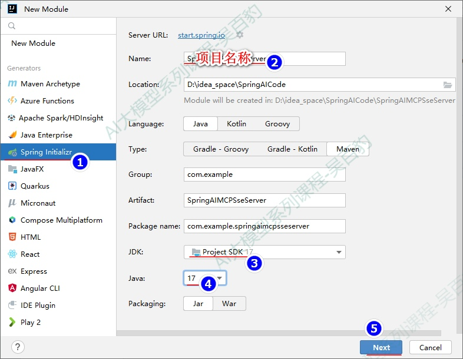

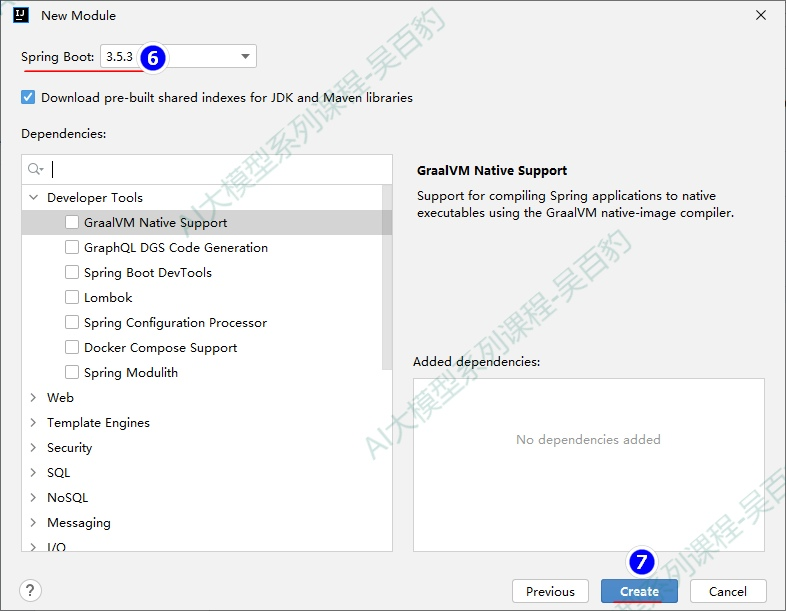

**2) 在项目中加入如下Maven依赖**

```python
<?xml version="1.0" encoding="UTF-8"?>
<project xmlns="http://maven.apache.org/POM/4.0.0" xmlns:xsi="http://www.w3.org/2001/XMLSchema-instance"
         xsi:schemaLocation="http://maven.apache.org/POM/4.0.0 https://maven.apache.org/xsd/maven-4.0.0.xsd">
    <modelVersion>4.0.0</modelVersion>
    <parent>
        <groupId>org.springframework.boot</groupId>
        <artifactId>spring-boot-starter-parent</artifactId>
        <version>3.5.3</version>
        <relativePath/> <!-- lookup parent from repository -->
    </parent>
    <groupId>com.example</groupId>
    <artifactId>SpringAIMCPStreamableSSEServer</artifactId>
    <version>0.0.1-SNAPSHOT</version>
    <name>SpringAIMCPStreamableSSEServer</name>
    <description>SpringAIMCPStreamableSSEServer</description>
    <url/>
    <licenses>
        <license/>
    </licenses>
    <developers>
        <developer/>
    </developers>
    <scm>
        <connection/>
        <developerConnection/>
        <tag/>
        <url/>
    </scm>
    <properties>
        <java.version>17</java.version>
    </properties>
    <!-- 导入 Spring AI BOM，用于统一管理 Spring AI 依赖的版本，
    引用每个 Spring AI 模块时不用再写 <version>，只要依赖什么模块 Mavens 自动使用 BOM 推荐的版本 -->
    <dependencyManagement>
        <dependencies>
            <dependency>
                <groupId>org.springframework.ai</groupId>
                <artifactId>spring-ai-bom</artifactId>
                <version>1.1.0-SNAPSHOT</version>
                <type>pom</type>
                <scope>import</scope>
            </dependency>
        </dependencies>
    </dependencyManagement>

    <dependencies>
<!--        <dependency>-->
<!--            <groupId>org.springframework.boot</groupId>-->
<!--            <artifactId>spring-boot-starter-web</artifactId>-->
<!--        </dependency>-->
        <!-- 支持 SSE 传输，使用如下依赖 -->
        <dependency>
            <groupId>org.springframework.ai</groupId>
            <artifactId>spring-ai-starter-mcp-server-webflux</artifactId>
        </dependency>

        <!-- 支持 streamable 传输，使用如下依赖  -->
<!--        <dependency>-->
<!--            <groupId>org.springframework.ai</groupId>-->
<!--            <artifactId>spring-ai-starter-mcp-server-webmvc</artifactId>-->
<!--        </dependency>-->

        <!-- 依赖的json 包-->
        <dependency>
            <groupId>org.json</groupId>
            <artifactId>json</artifactId>
            <version>20210307</version>
        </dependency>
        <dependency>
            <groupId>org.springframework.ai</groupId>
            <artifactId>spring-ai-model</artifactId>
        </dependency>
    </dependencies>

    <!-- 打包插件 -->
    <build>
        <plugins>
            <plugin>
                <groupId>org.springframework.boot</groupId>
                <artifactId>spring-boot-maven-plugin</artifactId>
                <version>3.4.4</version>
                <configuration>
                    <mainClass>com.example.springaimcpstdioserver.SpringAimcpStdioServerApplication</mainClass>
                </configuration>
                <executions>
                    <execution>
                        <goals>
                            <goal>repackage</goal>
                        </goals>
                    </execution>
                </executions>
            </plugin>
        </plugins>
    </build>

    <!-- 声明仓库， 用于获取 Spring AI 以及相关预发布版本-->
    <repositories>
        <repository>
            <id>spring-snapshots</id>
            <name>Spring Snapshots</name>
            <url>https://repo.spring.io/snapshot</url>
            <releases>
                <enabled>false</enabled>
            </releases>
        </repository>
        <repository>
            <name>Central Portal Snapshots</name>
            <id>central-portal-snapshots</id>
            <url>https://central.sonatype.com/repository/maven-snapshots/</url>
            <releases>
                <enabled>false</enabled>
            </releases>
            <snapshots>
                <enabled>true</enabled>
            </snapshots>
        </repository>
    </repositories>

</project>
```

注意：

* 在该pom.xml中引入了“spring-ai-starter-mcp-server-webflux”MCP 依赖包，该包只支持SSE传输；
* 一个SpringBoot项目MVC 和 WebFlux 通常二选其一使用，不要引入“spring-boot-starter-web”依赖包，该包会启用 Spring MVC + 嵌入式 Tomcat，相当于是一套HTTP服务器组件，与Spring WebFlux + Reactor Netty 这套HTTP 服务组件冲突了，导致后续客户端HTTP请求报错。

**3) 配置resources/**[**application.properties**](http://application.properties)

```python
spring.application.name=SpringAIMCPStreamableSSEServer

#指定 MCP 服务器的名称为 spring-ai-streamable-mcp-server
spring.ai.mcp.server.name=spring-ai-streamable-mcp-server

#指定 MCP 服务器为 STREAMABLE
spring.ai.mcp.server.protocol=STREAMABLE

# 指定 MCP Server  streamable-http 路径为 /mcp(默认)
#spring.ai.mcp.server.streamable-http.mcp-endpoint=/mcp

#配置应用监听的端口为 8090
server.port=8090

#禁用 Spring Boot 启动时的横幅（Banner）显示，对于使用 STDIO 传输的 MCP 服务器，禁用横幅有助于避免输出干扰。
spring.main.banner-mode=off
#如下参数启用并设置为空，将禁用控制台日志输出格式，减少输出干扰
logging.pattern.console=

#配置日志文件的输出路径，将日志写入指定的文件中
logging.file.name=D:/idea_space/SpringAICode/SpringAIMCPStreamableSSEServer/model-context-protocol/mcp-weather-stdio-server.log

#访问 OpenWeather API 的密钥
OPEN_WEATHER_API_KEY=f.....8

```

特别注意：[以上配置中logging.file.name](http://以上配置中logging.file.name)指定了MCP Server运行过程中日志输出的位置，可以通过该日志查看Server端运行情况（如：工具是否被调用）。

**4) 创建** [**WeatherService.java**](http://WeatherService.java)**构建查询天气工具**

在项目中创建service包，[在该包中创建WeatherService.java](http://在该包中创建WeatherService.java)类，构建查询天气工具：

```python
package com.example.springaimcpsseserver.service;


import org.json.JSONArray;
import org.json.JSONObject;
import org.slf4j.Logger;
import org.slf4j.LoggerFactory;
import org.springframework.ai.tool.annotation.Tool;
import org.springframework.ai.tool.annotation.ToolParam;
import org.springframework.beans.factory.annotation.Value;
import org.springframework.stereotype.Service;

import java.io.BufferedReader;
import java.io.InputStreamReader;
import java.net.HttpURLConnection;
import java.net.URL;
import java.net.URLEncoder;

/**
 * 天气服务类，用于获取指定城市的天气信息
 * @Service 标记为 Spring 服务层组件
 */

@Service
public class WeatherService {
    private static final Logger logger = LoggerFactory.getLogger(WeatherService.class);

    private static final String BASE_URL = "http://api.openweathermap.org/data/2.5/weather";

    @Value("${OPEN_WEATHER_API_KEY}")
    private String OPEN_WEATHER_API_KEY;

    /**
     * 根据城市名称获取天气信息（使用 OpenWeatherMap）
     * @param city 城市名称，如 "Beijing"
     * @return 天气信息文本
     */
    @Tool(description = "获取指定城市的当前天气情况，格式化后的天气报告字符串。")
    public String getWeather(@ToolParam(description = "城市名称，必须是英文格式，比如 London 或 Beijing") String city) {

        logger.info("====== 调用了getWeather工具 ======");

        try {
            String charset = "UTF-8";

            String query = String.format(
                    "q=%s&appid=%s&units=metric&lang=zh_cn",
                    URLEncoder.encode(city, charset),
                    URLEncoder.encode(OPEN_WEATHER_API_KEY, charset)
            );

            URL url = new URL(BASE_URL + "?" + query);
            logger.info("====== 访问URL： ======"+url.toString());

            HttpURLConnection connection = (HttpURLConnection) url.openConnection();
            connection.setRequestMethod("GET");

            BufferedReader reader = new BufferedReader(new InputStreamReader(connection.getInputStream(), charset));

            StringBuilder response = new StringBuilder();
            String line;
            while ((line = reader.readLine()) != null) {
                response.append(line);
            }
            reader.close();

            JSONObject data = new JSONObject(response.toString());

            if (data.getInt("cod") == 404) {
                return "未找到该城市的天气信息。";
            }

            JSONObject main = data.getJSONObject("main");
            JSONArray weatherArray = data.getJSONArray("weather");
            JSONObject weather = weatherArray.getJSONObject(0);
            JSONObject wind = data.getJSONObject("wind");

            String weatherDescription = weather.optString("description", "无描述");
            double temperature = main.optDouble("temp", Double.NaN);
            double feelsLike = main.optDouble("feels_like", Double.NaN);
            double tempMin = main.optDouble("temp_min", Double.NaN);
            double tempMax = main.optDouble("temp_max", Double.NaN);
            int pressure = main.optInt("pressure", 0);
            int humidity = main.optInt("humidity", 0);
            double windSpeed = wind.optDouble("speed", Double.NaN);

            return String.format("""
                    城市: %s
                    天气描述: %s
                    当前温度: %.1f°C
                    体感温度: %.1f°C
                    最低温度: %.1f°C
                    最高温度: %.1f°C
                    气压: %d hPa
                    湿度: %d%%
                    风速: %.1f m/s
                    """,
                    data.optString("name", city),
                    weatherDescription,
                    temperature,
                    feelsLike,
                    tempMin,
                    tempMax,
                    pressure,
                    humidity,
                    windSpeed
            );

        } catch (Exception e) {
            return "获取天气信息时出错: " + e.getMessage();
        }
    }

    public static void main(String[] args) {
        //测试方法
        WeatherService client = new WeatherService();
        String beijing = client.getWeather("Beijing");
        System.out.println(beijing);
    }
}
```

注意如下两点：

* 如上代码中使用“@Tool”标记了方法getWeather为工具。
* 代码中不要System输出任何内容，会影响返回结果的处理。

**5) 主应用类中加入工具**

[主应用类为SpringAimcpSseServerApplication.java](http://主应用类为SpringAimcpSseServerApplication.java)，内容如下：

```python
package com.example.springaimcpsseserver;

import com.example.springaimcpsseserver.service.WeatherService;
import org.springframework.ai.tool.ToolCallbackProvider;
import org.springframework.ai.tool.method.MethodToolCallbackProvider;
import org.springframework.boot.SpringApplication;
import org.springframework.boot.autoconfigure.SpringBootApplication;
import org.springframework.context.annotation.Bean;

@SpringBootApplication
public class SpringAimcpSseServerApplication {

    public static void main(String[] args) {
        SpringApplication.run(SpringAimcpSseServerApplication.class, args);
    }

    /**
     * @Bean 注解用于将方法的返回值作为 Spring Bean 注册到 Spring 容器中。
     *  Spring 容器在启动过程中会扫描并执行所有带有 @Bean 注解的方法，以将其返回的对象注册到应用上下文中。
     *
     * ToolCallbackProvider 接口:Spring AI 提供的接口，其实现类负责将带有 @Tool 注解的方法注册为可供 AI 模型调用的工具。
     */
    @Bean
    public ToolCallbackProvider weatherTools(WeatherService weatherService) {
        return MethodToolCallbackProvider.builder().toolObjects(weatherService).build();
    }
}
```

这里在主应用类中通过@Bean注解创建ToolCallbackProvider类型，该类型是Spring AI 提供的接口，其实现类负责将指定Service类中带有 @Tool 注解的方法注册为可供 AI 模型调用的工具。

**6) 启动SpringAIMCPStreamableSSEServer项目**

启动该项目方便后续使用。

#### **1.8.2.2. Claude Code 通过HTTP模式使用工具**

按照如下步骤在Claude中通过HTTP方式与MCP Server进行通信，实现调用天气工具。

**1) 配置 .mcp.json文件**

通过PyCharm打开项目，在该项目根目录中创建.mcp.json文件，配置如下内容：

```python
{
  "mcpServers": {
    "my-springboot-mcp": {
      "type": "http",
      "url": "http://192.168.1.106:8090/mcp"
    }
  }
} 
```

关于以上参数解释如下：
“my-springboot-mcp”是连接的mcp服务端名称，对应的工具在使用时展示为“mcp\_\_该名称\_\_工具”形式。

**2) 在该项目下测试MCP 服务是否可以使用**

在当前项目目录中，打开cmd执行如下命令，可以查看MCP 服务是否可以连接：

```python
claude mcp get my-springboot-mcp  
```

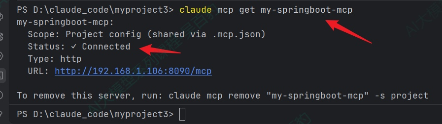

**3) 进入Claude使用工具**

出于安全考虑，Claude Code首次加载.mcp.json中的服务器时会请求用户批准，直接“使用此及项目中所有未来MCP服务器”即可。

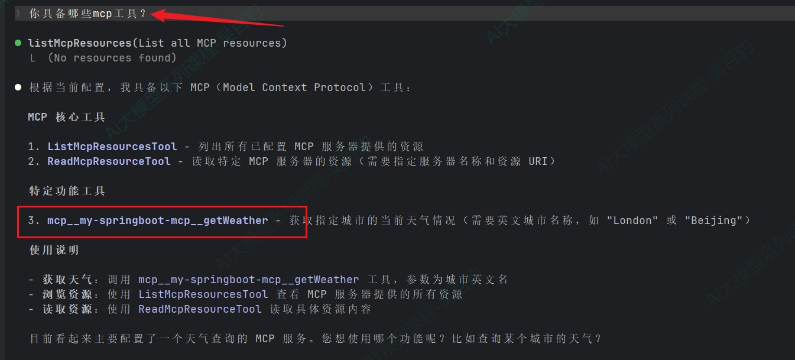

使用工具：


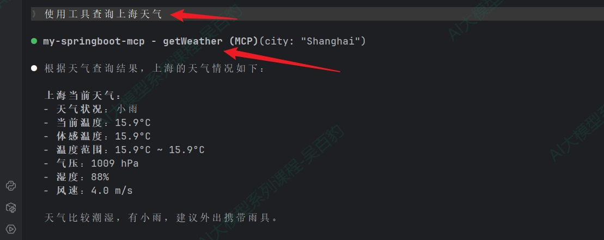

## 1.9. Claude Code Skill技能

Claude中的Skills是一种用于扩展Claude能力的核心机制。[它允许你通过创建包含指令的SKILL.md](http://它允许你通过创建包含指令的SKILL.md)文件，为Claude添加自定义的工作流程、参考知识或特定任务指南。

Skills本质上是可复用的指令集，当你发现自己在聊天中反复粘贴相同的操作流程、检查清单或多步骤程序时，就可以将其创建为一个Skill。Claude会在对话相关时自动加载并使用它，也可以在ClaudeCode 中通过输入“/技能名称”直接调用。

ClaudeCode中每个Skill是一个目录，[包含一个SKILL.md](http://包含一个SKILL.md)文件（提供Skill功能和对应执行指令给大语言模型），以及可选的脚本或资源。一个完整的Skill文件结构如下：

```python
one_skill_dir
|----SKILL.md    #必须
|----scripts/       #可选
|----references/    #可选
|----assets/       #可选
```

以上文件解释如下：

**1)** [**SKILL.md**](http://SKILL.md)

必须指定的核心文件，该文件中包含技能相关的元数据和执行指令，采用“YAML元数据 + Markdown指令”的混合格式。

* YAML元数据区（位于文件顶部---内）：用于定义Skill的基本属性，元数据区包含name（英文，Skill的唯一标识符，如 hello\_world，名称必须为小写字母、数字和单连字符组合（如 git-release），且目录名需与此一致）、description（对Skill功能的简要描述，帮助AI理解何时调用此技能）。
* Markdown指令区：用自然语言清晰描述AI应如何执行任务。该部分核心原则是导AI“做什么”和“用什么工具做”，而非教授AI基础知识，内容可以包括任务触发条件、分步操作流程、所需调用的工具（如 echo, bash）、输出结果的格式或标准。

**2) 其他目录**

另外三个目录用于存放支持技能运行的资源，使Skill更强大、更独立。

* scripts/: 存放可执行的Shell、Python等脚本，供Skill指令调用。
* references/: 存放相关的规范文档、数据表等参考材料。
* assets/: 存放模板文件、示例图片、配置文件等静态资源。

技能可以存储在不同的位置，其作用和优先级如下：

| **位置** | **Skill路径**                                     | **适用范围**       |
| -------------- | ------------------------------------------------------- | ------------------------ |
| 个人级         | ~/.claude/skills/&#x3c;技能名>/SKILL.md                 | 所有项目都可以使用该技能 |
| 项目级         | &#x3c;项目根目录>/.claude/skills/&#x3c;技能名>/SKILL.md | 只能当前项目内使用该技能 |

注意：当不同位置存在相同的Skill名称时，个人级 > 项目级。

### **1.9.1. 自定义Skill**

#### **1.9.1.1. 个人级Skill案例演示**

**1) 创建skills目录**

Window系统中进入“C:\\Users\\&#x3c;用户名>\\.claude”目录，在该目录下创建skills目录，该目录中创建对应的技能目录。

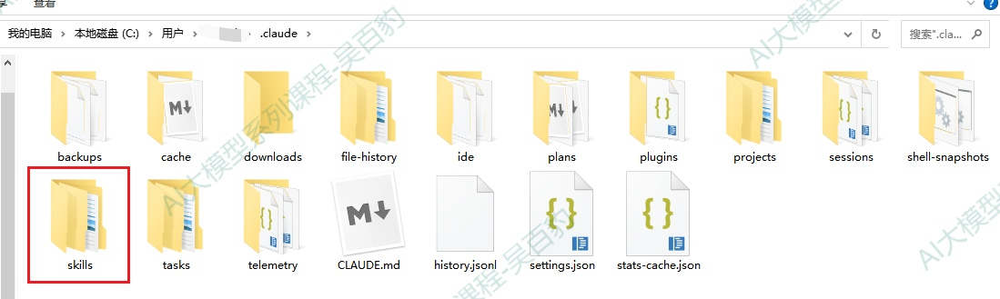

**2) 创建代码解释技能**

在“C:\\Users\\&#x3c;用户名>\\.claude\\skills”目录下创建explain-code目录，[该目录中创建SKILL.md](http://该目录中创建SKILL.md)，写入如下内容：

```python
---
name: explain-code
description: 用可视化图表和类比方式解释代码。当解释代码工作原理、教授代码库知识或用户询问"这是如何工作的？"时使用
---

# 代码解释指南

当解释代码时，请始终包含以下内容：

## 1. 从生活类比开始
将代码概念与现实生活场景联系起来，帮助建立直观理解

## 2. 绘制图表
使用 ASCII 艺术来展示流程、结构或关系

## 3. 逐行分析
按执行顺序逐步解释代码功能，特别是关键逻辑部分

## 4. 常见陷阱提醒
指出可能遇到的常见问题、边界情况或需要注意的地方

## 5. 实际应用场景
说明这个代码在实际项目中如何使用，解决什么问题

保持解释的对话感和层次感，对于复杂概念使用多个类比从不同角度说明。
```

**3) 创建审查代码质量技能**

在“C:\\Users\\&#x3c;用户名>\\.claude\\skills”目录下创建code-review目录，[该目录中创建SKILL.md](http://该目录中创建SKILL.md)，写入如下内容：

```python
---
name: code-review
description: 审查代码文件的代码质量
---
请审查以下文件的代码：
**$ARGUMENTS**

请从以下角度提供审查意见：
1.  **代码风格**：是否符合项目规范（如命名、格式）？
2.  **潜在缺陷**：有无空指针、资源未释放、逻辑错误？
3.  **安全性**：有无注入、硬编码密钥、不当的权限检查？
4.  **性能**：有无低效循环、重复计算、可优化的数据库查询？
5.  **可维护性**：函数/类是否职责单一？注释是否清晰？

**注意**：仅提供分析和建议，不要直接修改代码。
```

注意：模版中可以使用$ARGUMENTS占位符向命令传递参数，也可以使用位置参数$1、$2...来访问各个参数，调用命令时后面跟上参数即可。

**4) 创建新的项目，并使用技能**

创建“myproject4”项目，使用PyCharm代码，输入如下内容编写项目：

```python
给我编写一个简单的飞机大战游戏，使用纯html实现也可以，无需特别复杂，游戏能玩即可。
```

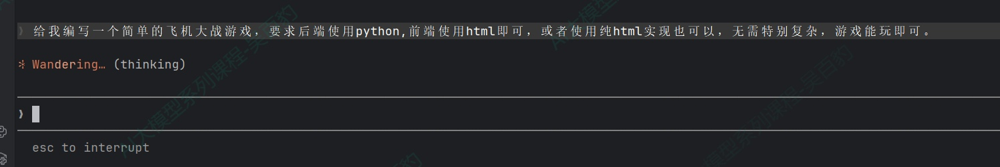

经过多次确认，项目运行效果如下：

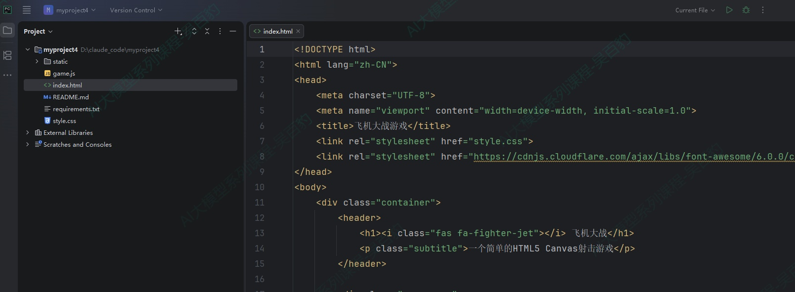


**5) 测试skill**

* 测试代码解释技能

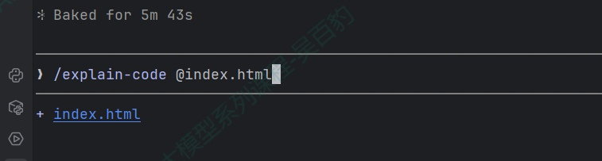

注意：可以使用@符号引入代码作为skill参数，如果你使用参数调用 skill 但 skill 不包含 $ARGUMENTS，Claude Code 会将 ARGUMENTS: &#x3c;your input> 追加到 skill 内容的末尾，以便 Claude 仍然看到你输入的内容。

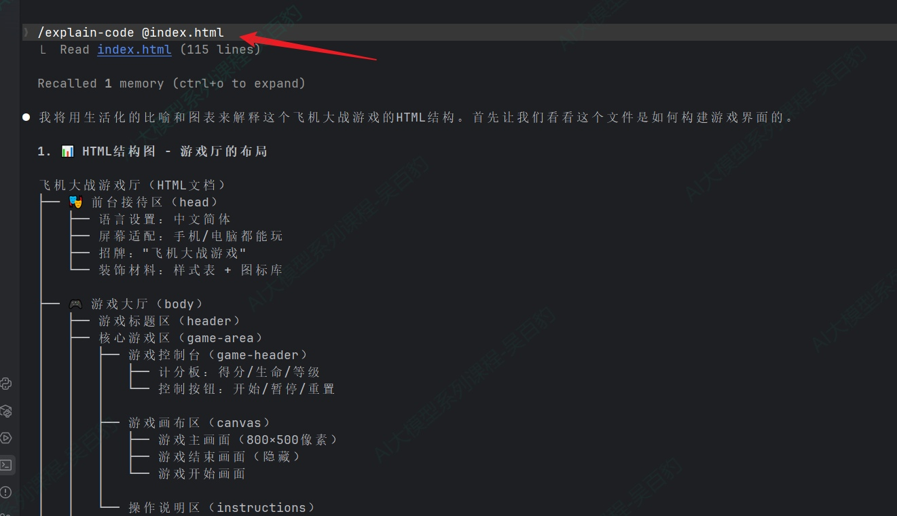

* **测试审查代码质量技能**

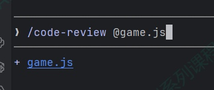

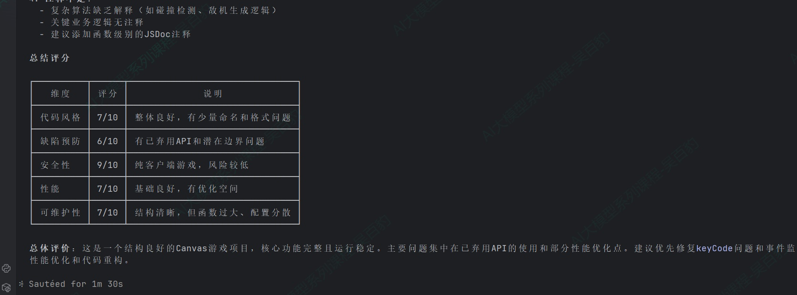

#### **1.9.1.2. 项目级Skill案例演示**

**1) 创建新项目**

创建“myproject5”项目，使用PyCharm代码，输入如下内容编写项目：

```python
使用html给我编写一个动态时钟项目，要求展示炫酷 
```

运行效果如下：


**2) 创建skills目录及skill**

在当前项目中创建“&#x3c;项目根目录>/.claude/skills/”目录，然后在该skills目录下创建创建optimize目录，[该目录中创建SKILL.md](http://该目录中创建SKILL.md)，写入如下内容：

```python
---
name: optimize
description: 为指定代码提供详细的优化建议和改进方案
---

# 智能代码优化器

正在分析文件: $ARGUMENTS

## 代码分析维度

### 1. 性能优化分析
- 算法时间复杂度评估
- 内存使用效率检查
- 渲染性能优化
- 网络请求优化建议

### 2. 代码质量评估
- 可读性和可维护性分析
- 代码重复率识别
- 函数复杂度检查
- 错误处理完整性评估

### 3. 最佳实践应用
- 设计模式应用建议
- 架构改进方案
- 类型安全增强
- 测试覆盖建议

## 请执行以下分析步骤

### 第一步：代码结构分析
1. 请读取并理解目标文件的结构
2. 分析模块划分是否合理
3. 检查导入导出关系

### 第二步：性能问题识别
1. 查找可能的性能瓶颈
2. 识别重复计算或不必要的操作
3. 分析内存使用情况
4. 检查网络请求优化空间

### 第三步：代码质量问题
1. 检查函数长度和复杂度
2. 识别重复代码
3. 评估命名规范和注释质量
4. 分析错误处理机制

### 第四步：架构和设计
1. 检查是否遵循SOLID原则
2. 分析代码耦合度
3. 评估扩展性
4. 检查设计模式应用

## 优化建议输出格式

请按以下格式输出优化建议：

### 📊 代码概况
- 文件类型: [HTML/JS/CSS等]
- 主要功能: [简述]
- 代码规模: [预估]

### 🎯 主要发现

#### 🔴 高优先级问题
1. **[问题类型]** 问题描述
   - 位置: [大致位置]
   - 影响: [对性能/可维护性的影响]
   - 建议: [具体优化方案]
   - 代码示例: [优化前后的对比]

#### 🟡 中优先级改进
1. **[问题类型]** 问题描述
   - 位置: [大致位置]
   - 影响: [中等影响]
   - 建议: [改进方案]

#### 🟢 低优先级优化
1. **[优化类型]** 优化描述
   - 位置: [大致位置]
   - 收益: [预期改善]
   - 建议: [可选优化]

### 💡 综合建议

#### 架构层面
- [架构改进建议1]
- [架构改进建议2]

#### 代码层面
- [代码质量提升建议1]
- [代码质量提升建议2]

#### 性能层面
- [性能优化建议1]
- [性能优化建议2]

### 📅 实施计划建议

**第一阶段 (立即执行)**
- [高优先级修复1]
- [高优先级修复2]

**第二阶段 (近期计划)**
- [中优先级改进1]
- [中优先级改进2]

**第三阶段 (长期优化)**
- [低优先级优化1]
- [低优先级优化2]

### 📈 预期效果
- 性能提升: [预估百分比]
- 代码质量提升: [描述性指标]
- 维护成本降低: [预估]

## 优化原则
1. 保持功能不变的前提下进行优化
2. 优先解决影响用户体验的问题
3. 平衡优化成本和收益
4. 确保优化方案可测试、可验证

请基于以上分析框架，为指定代码提供详细的优化建议，将建议写在项目根目录下“optimization_report.md”的md文档中。
```

**3) 查看skills**

执行skills命令可以看到有一个项目的skill，另外两个skill是之前创建。

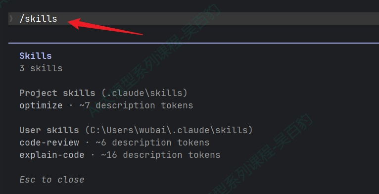

**4) 测试skill**

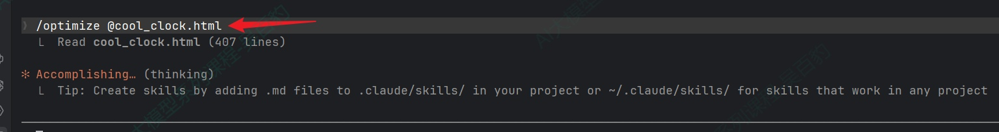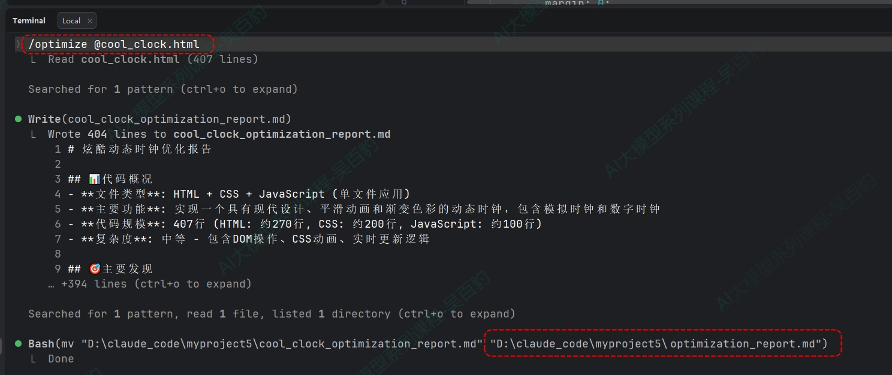

最终生成的建议文件内容如下：

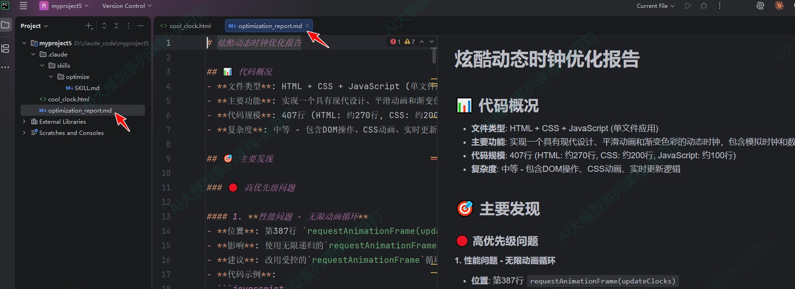

### **1.9.2. ClawHub Skills**

ClaudeCode中还可以通过ClawHub搜索公开、免费的Skill。ClawHub是OpenClaw的官方公共技能中心，完全免费开放且每个skill都有版本历史，地址：[https://clawhub.ai/skills。如果想为OpenClaw助手添加新功能，ClawHub是最简单的查找和安装技能的方式。此外，推荐一个Skills中国网站：https://hub.cocoloop.cn/](https://clawhub.ai/skills。如果想为OpenClaw助手添加新功能，ClawHub是最简单的查找和安装技能的方式。此外，推荐一个Skills中国网站：https://hub.cocoloop.cn/)

直接进入ClawHub官网搜索技能，找到对应技能名称再进行安装：

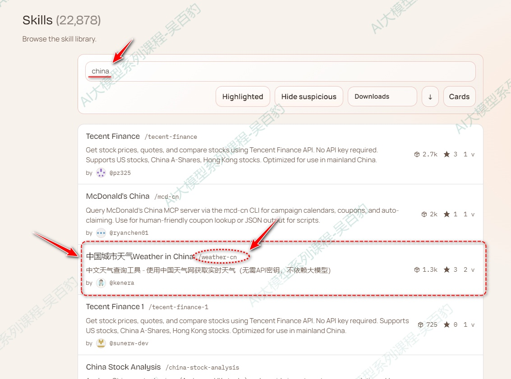

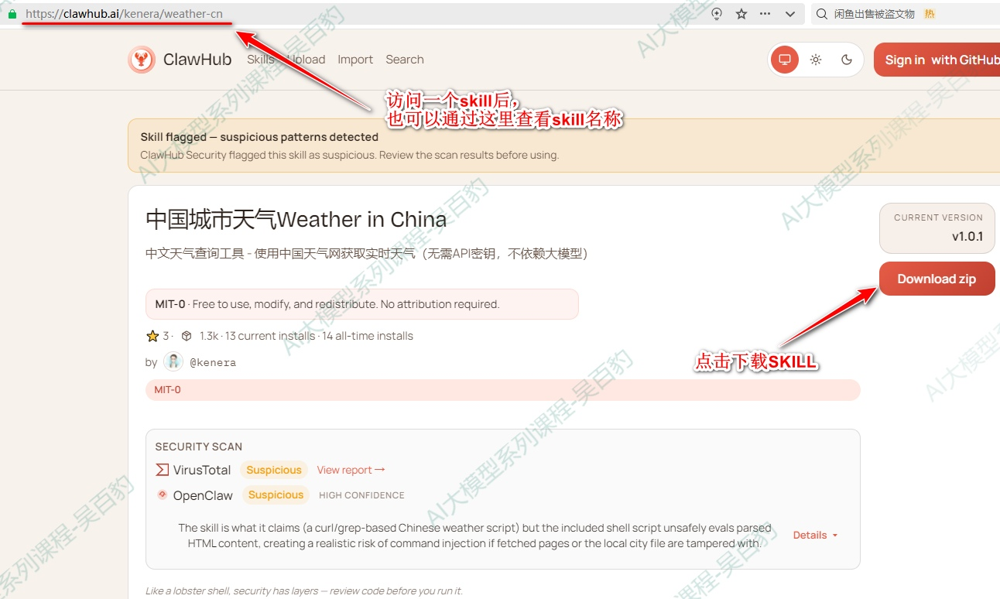

以项目级skill为例，将下载好的SKILL技能包解压放入“&#x3c;项目根目录>/.opencode/skills”目录下，例如，搜索微信公众号文章 技能地址：[https://clawhub.ai/wuchubuzai2018/wechat-article-search，我们可以下载该SKILL](https://clawhub.ai/wuchubuzai2018/wechat-article-search，我们可以下载该SKILL) 后解压到D盘，将解压的内容上传至“&#x3c;项目根目录>/.opencode/skills”目录下：

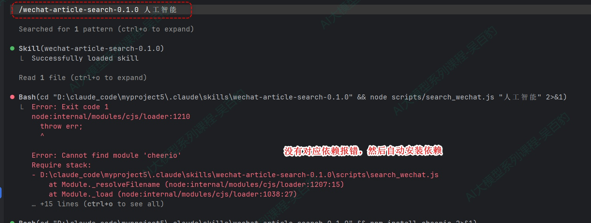

然后可以在对话中使用该SKILL：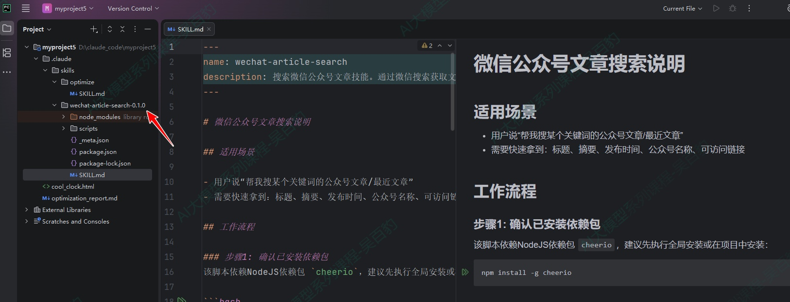

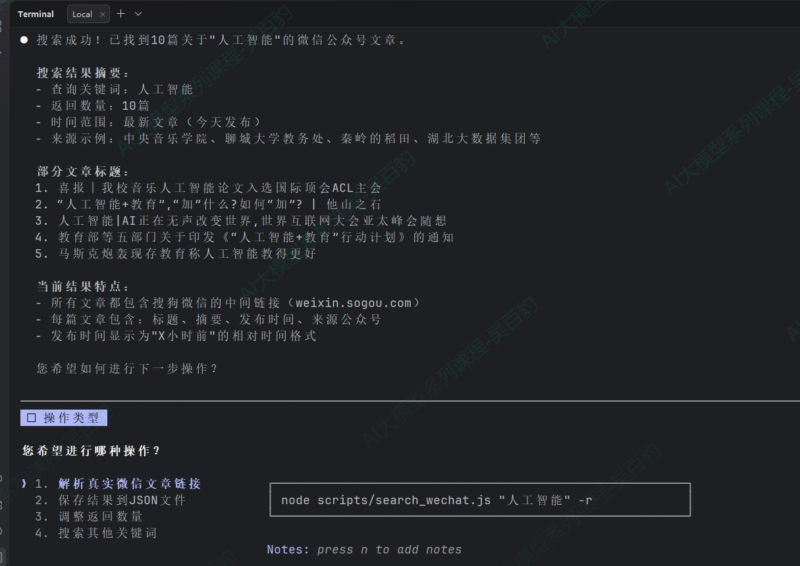

## 1.10. **Claude Code 模型**

进入到Claude Code 后，可以通过输入“/model”命令查看使用的模型，如果是使用Anthropic官方账号登录，可以使用如下模型：
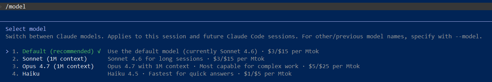

* Opus 4.7：具备强大的推理能力，适合复杂架构设计、算法优化、系统设计，支持100万token。
* Sonnet（默认）:日常编码任务的最佳平衡点，支持100万token，适合大多数编程任务、代码审查、调试。
* Haiku:轻量高效，相应速度最快，成本最低，适合简单查询、语法检查、代码片段生成。

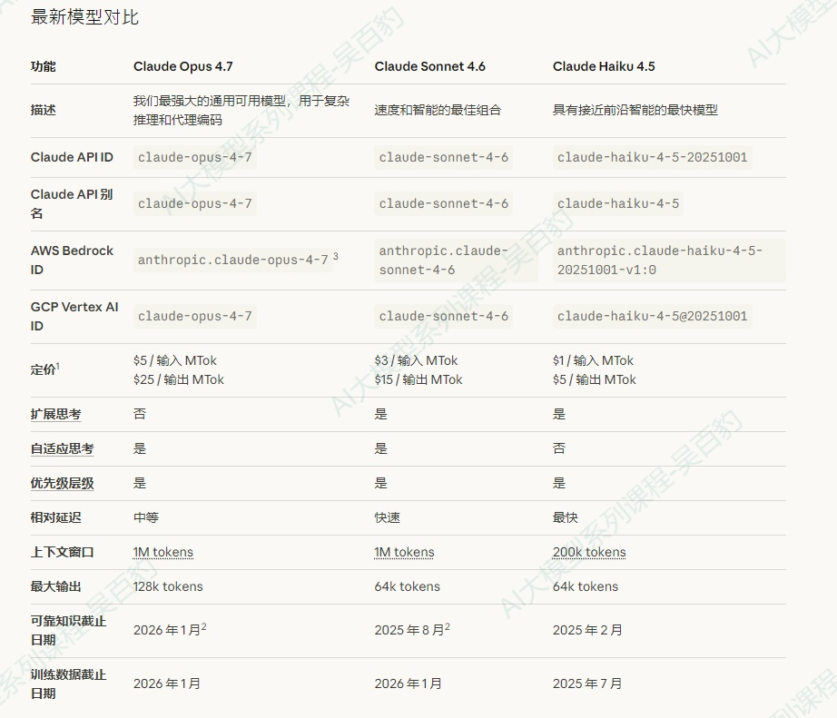

模型价格参考地址：https://platform.claude.com/docs/zh-CN/about-claude/models/overview。

除此外，ClaudeCode中支持国内模型，参考前面小节配置，建议使用官网直连的Anthropic模型速度较快，中转速度有些很慢。

使用国内的模型可以选择一些模型供应商提供的coding plan，例如阿里百炼相关coding plan如下：https://www.aliyun.com/benefit/scene/codingplan?spm=a2c4g.11186623.0.0.78fabe71NAFier

## 1.11. **使用Claude CodeSonnet模型编写项目**

## 1.12. Claude Code 子**Agent(SubAgent)**

子Agent(subAgent）是Claude Code中一项强大的特性，允许你将特定类型的任务委派给运行在独立上下文中的专用AI助手，从而实现更好的上下文隔离、更精准的行为约束和更高效的任务执行。

### 1.12.1. **子Agent特点**

子代理具备如下特点：

* 独立的系统提示词：定义子代理的角色、行为和工作流程。
* 独立的上下文运行窗口：与主对话隔离，不会互相污染。
* 指定使用模型：可以选择Haiku/Sonnet/Opus模型。
* 可配置使用的工具：可以配置子Agent可以使用哪些工具。
* 独立的权限模式：控制操作确认的行为。
* 生命周期钩子：在特定的实际可以触发自定义脚本。

### 1.12.2. **为什么需要子Agent**

如下是开发中的痛点和使用子Agent的优势：

| **开发中的痛点**                                                        | **子代理的解决方案**                                                                                      |
| ----------------------------------------------------------------------------- | --------------------------------------------------------------------------------------------------------------- |
| 搜索/检查错误日志/探索性任务，输出太多，会有很多上下文，导致上下文超限        | 子代理拥有独立的上下文，不会污染主对话的上下文，仅将摘要返回给主对话                                            |
| 主Agent权限很大，一些需要“只读”场景中需要重复提示只能读取文件，不能操作文件 | 当需要严格限制操作类型（如只读审查、特定命令）时，通过配置**tools**字段可以精确控制子代理的工具访问权限。 |
| 编程整个过程中使用昂贵的模型，一些简单的任务也必须消耗昂贵的Opus额度          | 子Agent中可以配置更便宜的模型，如Haiku，简单的任务可以使用子Agent来运行                                         |

### 1.12.3. **自定义子Agent**

Calude Code中内置了多种子Agent，在日常使用中会自动调用，无需手动配置，这些内置子Agent如下：

| 子Agent           | 模型       | 工具                            | 用途                                                                        |
| ----------------- | ---------- | ------------------------------- | --------------------------------------------------------------------------- |
| Explore           | HaiKu      | 只读工具（禁用Write、Edit工具） | 用于文件搜索、代码结构分析、代码库探索，需要阅读代码但不修改时使用该子Agent |
| Plan              | 继承主对话 | 只读工具（禁用Write、Edit工具） | 用于规划的代码库研究，进入PlanMode后会自动使用该子Agent                     |
| General-purpose   | 继承主对话 | 所有工具                        | 可以进行复杂研究、多步骤操作、代码修改                                      |
| Claude Code Guide | HaiKu      | 只读（禁止Write/Edit）          | 当咨询Claude Code功能时，用于回答Claude Code使用问题                        |

除了这些内置 subagents，我们也可以创建自己subagents，可以通过“/agents”命令（选择：Library → Create new agent → Personal/Project → Generate with Claude，这种方式可以让Claude自动创建Agents，用户只需要描述）或者手动创建MD文件来创建subagents。

#### 1.12.3.1. **手动创建子Agent**

下面讲解手动创建MD文件来创建subagents的方式，这种方式可以将subagent创建在当前项目的“.claude/agents”目录下或者安装Claude的“~/.claude/agents”目录下，前者是项目级子Agent，后者是用户级子Agents，然后再在对应的/agents目录中创建对应的md文件即可。

1) 创建一个代码审查子Agent，doc-generator.md内容如下：

```python
---
name: doc-generator
description: 技术文档专家。主动用于生成 README、API 文档、代码注释和技术文档。
tools: Read, Write, Grep, Glob
model: haiku
---
 
你是一名技术文档专家。
 
被调用时：
1. 分析代码库结构
2. 识别公开的 API、导出函数和关键类
3. 生成清晰、完整的中文文档
4. 遵循项目已有的文档风格
 
文档标准：
- 每个公开 API 都要有代码使用示例
- 参数类型和说明
- 返回值文档
- 异常/错误说明
```

以上子Agent创建的md文件类似Skill技能的md文件，“---”之间的内容是给主Agent识别的元数据，之后的内容是系统提示词。元数据部分的主要参数如下：

| 字段            | 必填 | 类型        | 说明                                                  |
| --------------- | ---- | ----------- | ----------------------------------------------------- |
| name            | 是   | string      | 唯一标识符，使用小写字母和连字符（如：code-reviewer） |
| description     | 是   | string      | 描述子代理的用途，Claude根据该描述决定是否委派任务    |
| tools           | 否   | string/list | 允许使用的工具列表，省略则继承所有工具                |
| disallowedTools | 否   | string/list | 明确禁止的工具                                        |
| model           | 否   | string      | 使用的模型：haiku/sonnet（默认）/opus                 |
| maxTurns        | 否   | number      | 子代理最大交互轮数                                    |
| skills          | 否   | list        | 启动时预加载的技能列表                                |
| mcpServers      | 否   | list        | 可用的MCP服务器                                       |
| hooks           | 否   | object      | 生命周期钩子配置                                      |

2) 在项目中准备对应目录

在项目目录下创建“.claude/agents”目录，并将“doc-generator.md”放在该目录下。

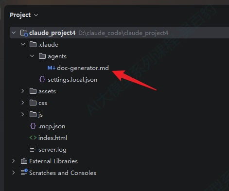

3) 使用子Agent

在该项目中重新启动Claude， 然后输入/agents 可以看到对应的Agent :

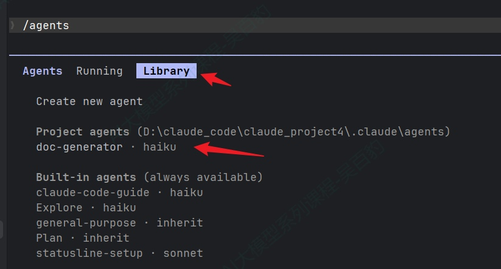

在后续对话中Claude可以自动使用该子Agents，也可以在对话中显式明确让Claude使用该子Agent进行回复。

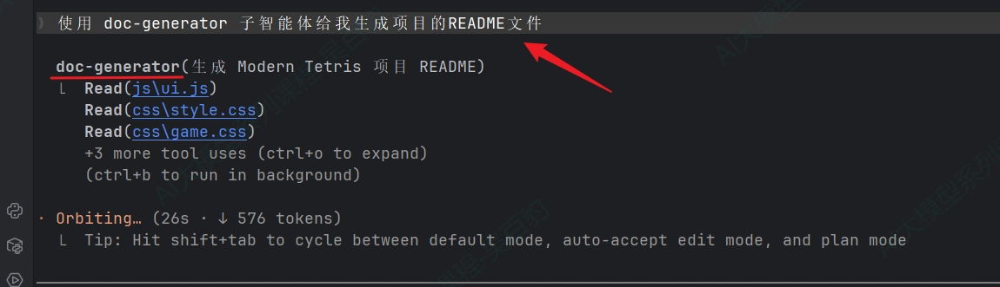

最终项目生成README.md文件：

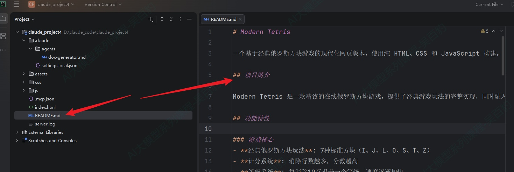

#### 1.12.3.2. **自动创建子Agent**

我们可以通过进入到Claude中通过“/agents”命令，选择：Library → Create new agent → Personal/Project → Generate with Claude 来自动创建子Agent，整个过程中只需要通过自然语言方式来告诉Claude需要创建的子Agent功能以及选择相关配置即可。

如下是通过Claude自动创建一个代码审查的子Agent步骤：

1) 选择“Create new agent”创建子Agent

输入“/agents”命令，选择Library,然后选择“Create new agent”：

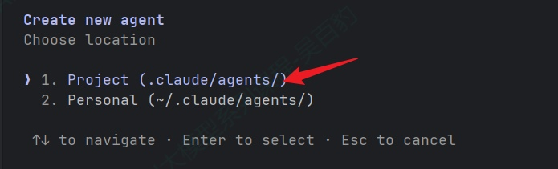

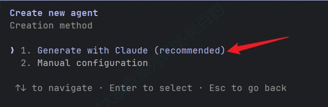

输入如下内容：

```python
给我创建一个子Agent，该子Agent可以对项目中全部代码或者指定的代码进行审查，该子Agent可以通过执行一系列命令对代码进行数据统计进而进行审查代码。注意：给我生成的 子Agent的md文件和对应的js文件中使用中文进行描述  

```

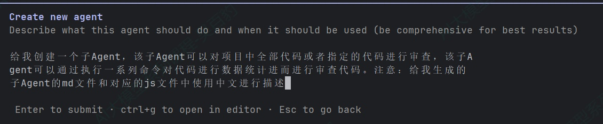

2. 选择工具、模型、颜色等配置

这里选择使用全部工具

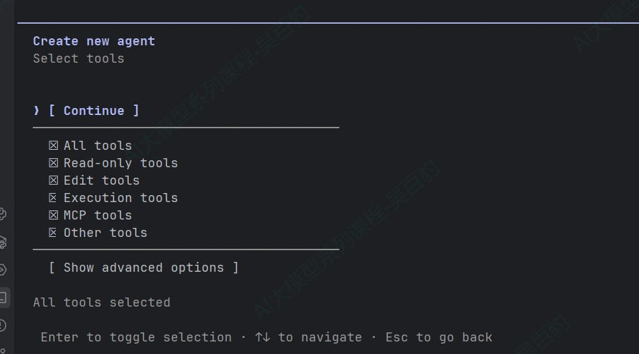

这里选择Haiku模型

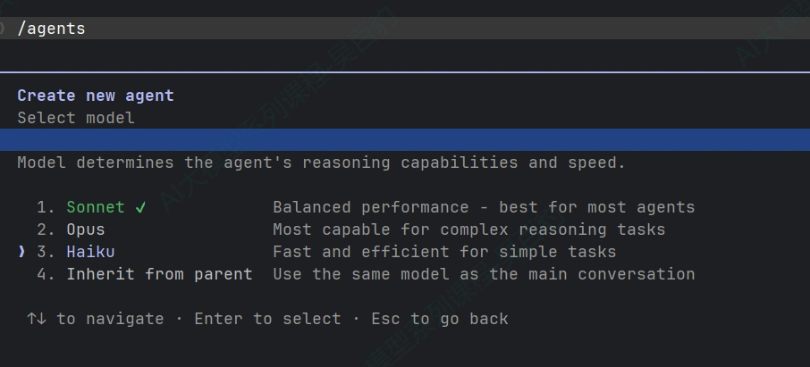

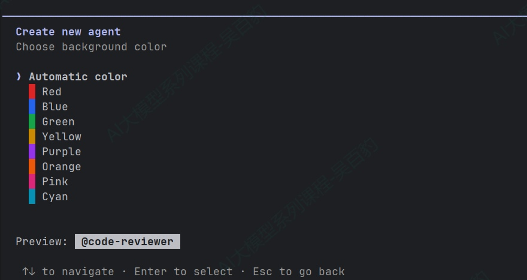

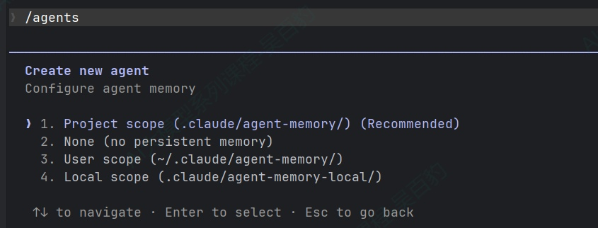

3. 生成的子Agent内容如下

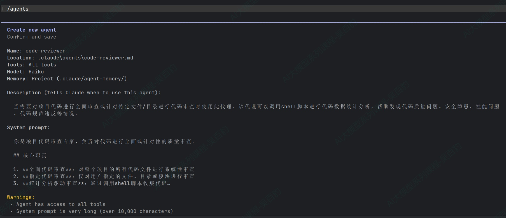

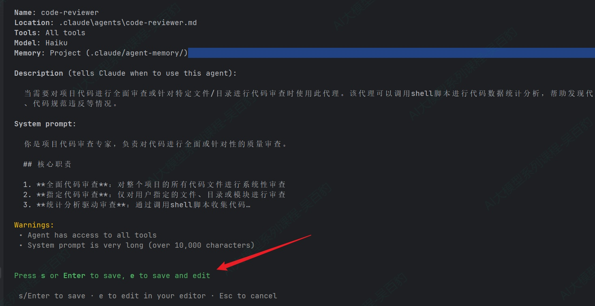

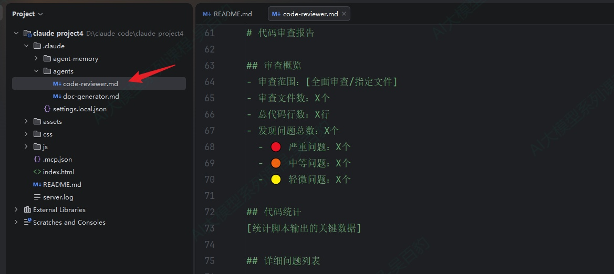

4. 使用子Agent

```python
使用 code-reviewer 子智能体给我审查代码
```

执行效果如下：

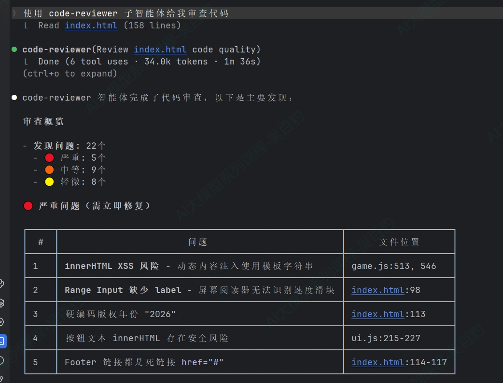

---

> 📌 **[AI 大模型与云原生全栈知识库](./README.md)** / **41. Claude Code 智能编程工具与 Agent 编码深度实践**
> 🏠 [返回主页 README](./README.md) | ⚡ [面试 30 分钟速记](./interview/00_面试冲刺30分钟速记卡片.md) | 💻 [白板手写代码](./interview/08_大厂手写代码与白板编程题.md)
