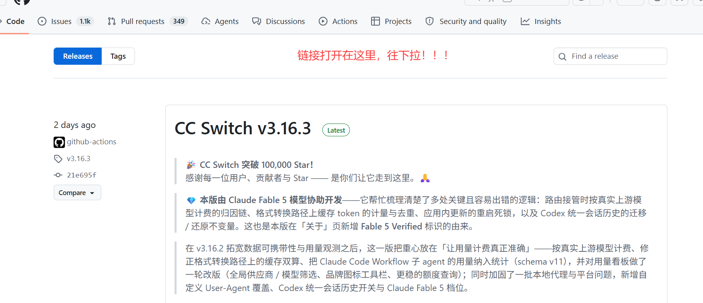
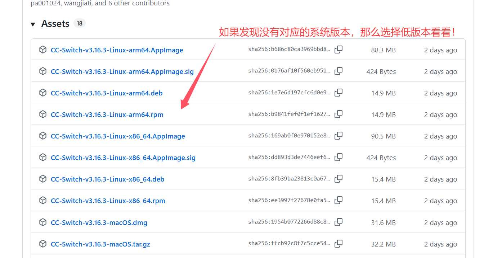
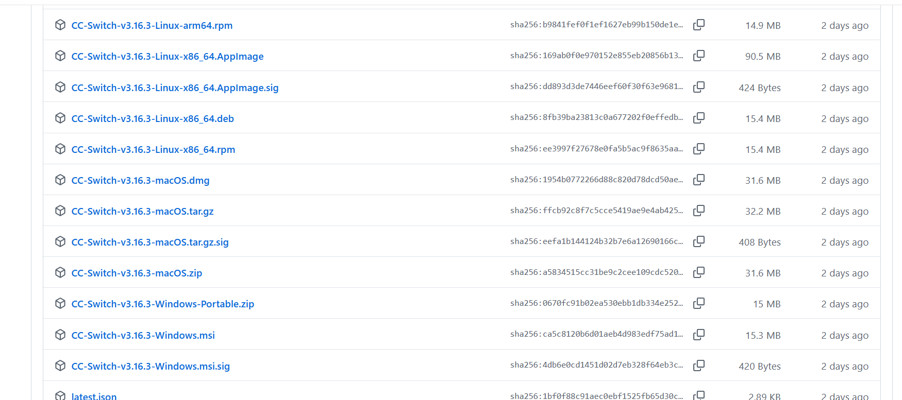
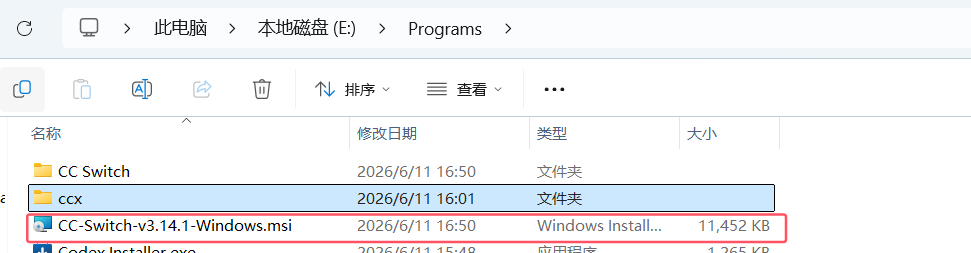
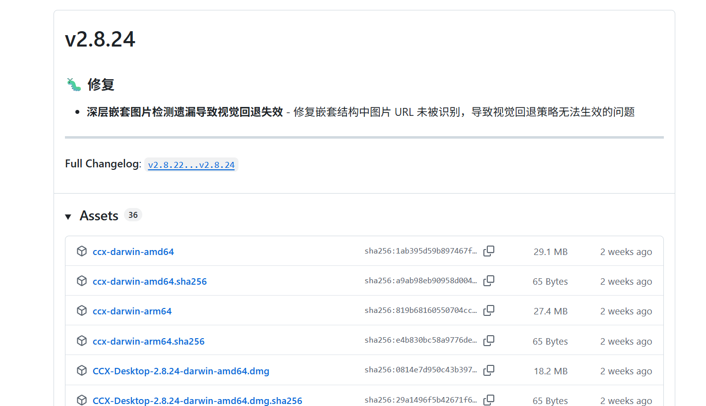
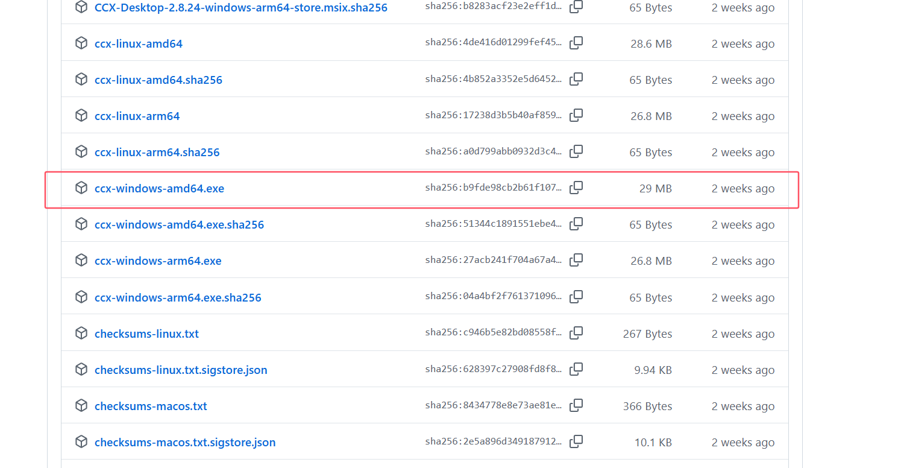
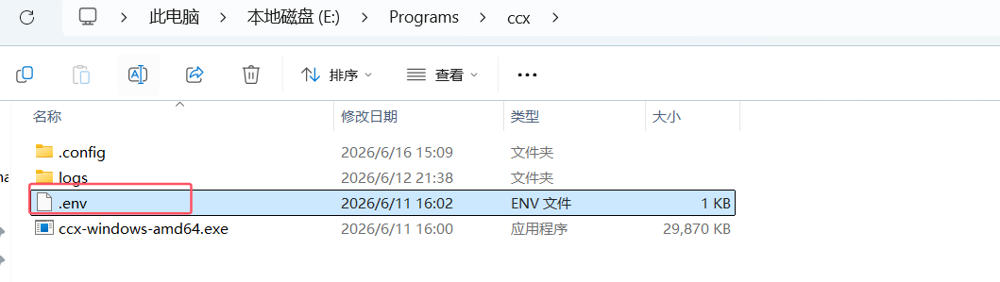
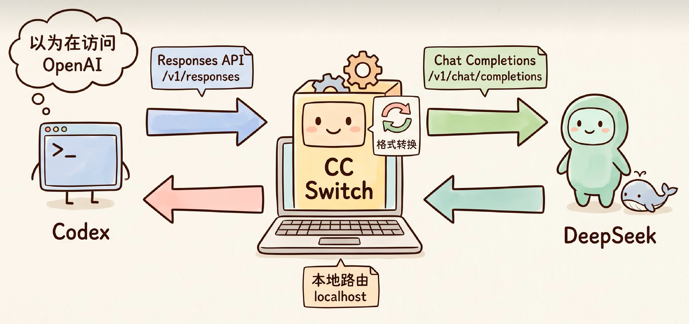

> 📌 **[AI 大模型与云原生全栈知识库](./README.md)** / **44. Codex 接入 DeepSeek-V4 模型配置与 cc-switch 实战**
> 🏠 [返回主页 README](./README.md) | ⚡ [面试 30 分钟速记](./interview/00_面试冲刺30分钟速记卡片.md) | 💻 [白板手写代码](./interview/08_大厂手写代码与白板编程题.md)

---

## 1、DeepSeek官网没有接入文档

https://api-docs.deepseek.com/zh-cn/

## 2、使用cc-switch+ccx 让Codex接入DeepSeekV4模型

### cc-switch下载地址：

（可能需要科学上网）：https://github.com/farion1231/cc-switch/releases





多找一找，比如找这个地址：https://github.com/farion1231/cc-switch/releases/tag/v3.16.3

比如我打开这个





### ccx下载地址：

（可能需要科学上网）：https://github.com/BenedictKing/ccx/releases、

比如windows没有找到，那么就找低版本的：






下载后：

1、安装CC

2、把ccx放入指定目录：

同时在同级目录下创建一个.env文件，写入以下内容：



```python
PROXY_ACCESS_KEY=123456
PORT=3000
ENABLE_WEB_UI=true
APP_UI_LANGUAGE=en
```


其他内容见视频

## 3、大致机制




1、Codex 客户端--- 发出 /v1/response(Resoponse API)

2、CC-Switch （把Codex的配置执行localhost）

3、CCX网关（后台跑着，接住请求）：进行格式转换（......）

4、DeepSeek API（云端）

5、CCX网关（后台跑着，接住响应）：进行格式转换（......）

6、Codex收到“标准化的回复”--》显示正常！

---

> 📌 **[AI 大模型与云原生全栈知识库](./README.md)** / **44. Codex 接入 DeepSeek-V4 模型配置与 cc-switch 实战**
> 🏠 [返回主页 README](./README.md) | ⚡ [面试 30 分钟速记](./interview/00_面试冲刺30分钟速记卡片.md) | 💻 [白板手写代码](./interview/08_大厂手写代码与白板编程题.md)
