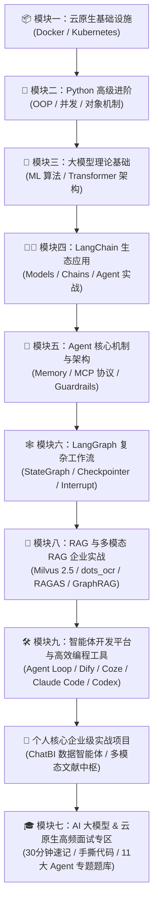

# 🤖 AI 大模型与云原生全栈知识库 (LLM & Cloud-Native Knowledge Hub)

<p align="center">
  
  
  
  
  
</p>

> 本仓库汇集了从 **云原生基础设施 (Docker/K8s)** 到 **Python 高级编程**、**机器学习/Transformer 大模型理论**，再到 **LangChain / Agent / MCP 协议**、**LangGraph 状态机图网络**、**企业级 RAG / 多模态 RAG**、**LLMOps 智能体平台与 AI 编程工具** 的全栈知识体系与真实项目落地实战总结。

> 🔄 **持续更新声明**：本仓库为个人 AI 大模型与云原生技术的**长期持续更新知识库**。后续将不断补充最新的 LLM 前沿理论、Agent 架构演进、MCP 扩展协议、LangGraph 进阶模式及生产环境踩坑总结。建议点击 **Star ⭐️** 或 **Watch 👀** 保持关注！

---

## 💡 仓库特色 (Highlights)

- 🔄 **动态演进**：作者保持长期持续更新，紧跟 AI 与云原生技术前沿，不断补充最新的技术总结与项目实战经验。
- 🧱 **全栈贯通**：涵盖底层云原生容器基础设施、Python 底层机制、大模型理论算法、上层 Agent 应用层开发与企业级 LLMOps 平台。
- 📊 **模块化分类**：将 40+ 篇核心学习文档划分为 **9 大主题模块**，循序渐进，查阅高效。
- 🌟 **自研实战项目**：包含两大完整的企业级个人实战项目沉淀（**ChatBI / Text-to-SQL 数据智能体平台** 与 **Kotaemon / OmniDoc 多模态高精文献知识中枢**），涵盖全套架构设计、代码解析与 16K-22K 面试答辩指南。
- 🎯 **深度落地**：不仅包含核心概念剖析，更包含踩坑经验、运行时上下文管理、记忆系统、人工介入与安全护栏等真实生产环境实战总结。
- 🔗 **一键跳转**：全目录支持 Markdown 相对路径跳转，在线阅读或配合 VS Code / Obsidian 本地学习无缝衔接。

---

## 🗺️ 知识体系架构 (Roadmap)



---

## 📚 目录与学习文档导航 (Table of Contents)

### 📦 模块一：容器化与云原生运维 (Cloud-Native Infrastructure)
> 构建大模型应用与微服务体系的高可用云原生基础设施。

| 序号 | 模块 / 文档名称 | 核心知识点与主要内容 | 快速跳转 |
| :---: | :--- | :--- | :---: |
| 01 | **Docker 总结与实战** | 镜像构建、容器生命周期管理、网络模式与 Volume 数据卷持久化 | [📄 阅读文档](./01Docker总结.md) |
| 02 | **Kubernetes (K8s) 总结与架构** | Pod、Deployment、Service、Ingress、ConfigMap 及 Pod 调度原理 | [📄 阅读文档](./02Kubernetes总结.md) |

---

### 🐍 模块二：Python 编程基础与进阶 (Python Core & Concurrency)
> 从语言基础到底层对象模型、异步并发与高性能编程。

| 序号 | 模块 / 文档名称 | 核心知识点与主要内容 | 快速跳转 |
| :---: | :--- | :--- | :---: |
| 03 | **Python 基础总结** | 基础数据结构、控制流、作用域与推导式常用语法 | [📄 阅读文档](./03Python基础总结.md) |
| 05 | **Python 文件流与 I/O 总结** | 文件读写、缓冲区管理、流式处理与编码转换 | [📄 阅读文档](./05Python文件流总结.md) |
| 06 | **Python 函数篇** | 闭包、高阶函数、装饰器设计模式及参数传递机制 | [📄 阅读文档](./06Python函数篇.md) |
| 07 | **Python 面向对象+模块+异常总结** | OOP 继承封装多态、模块包导入机制与异常捕获体系 | [📄 阅读文档](./07Python面向对象+模块+异常总结.md) |
| 08 | **Python 高级编程总结** | 迭代器与生成器、魔术方法 (Magic Methods)、元类与动态类型 | [📄 阅读文档](./08Python高级编程总结.md) |
| 09 | **Python `__new__` / `__init__` / `__call__` 详解** | 对象创建与初始化底层区别、单例模式应用及经典踩坑小记 | [📄 阅读文档](./09Python%20__new__、__init__、__call__%20核心区别%20+%20所有坑点小记.md) |
| 10 | **Python 网络与并发编程** | Socket 网络通信、多线程、多进程、GIL 影响与 asyncio 协程并发 | [📄 阅读文档](./10Python网络与并发编程.md) |

---

### 🧠 模块三：人工智能与大模型理论基础 (AI & LLM Fundamentals)
> 掌握大模型背后的机器学习数学基础与 Transformer 核心架构。

| 序号 | 模块 / 文档名称 | 核心知识点与主要内容 | 快速跳转 |
| :---: | :--- | :--- | :---: |
| 11 | **大模型基础之机器学习总结 (一)** | 经典监督/无监督学习算法、损失函数、梯度下降与过拟合治理 | [📄 阅读文档](./11大模型基础之机器学习总结.md) |
| 12 | **大模型基础之机器学习总结 (二)** | 模型评估指标、特征工程、集成学习与深度神经网络基础 | [📄 阅读文档](./12大模型基础之机器学习总结2.md) |
| 13 | **Transformer 架构入门** | Self-Attention 自注意力机制、Multi-Head Attention、Positional Encoding 与 Encoder-Decoder 结构 | [📄 阅读文档](./13Transformer架构入门.md) |

---

### 🦜🔗 模块四：LangChain 框架与应用开发 (LangChain Ecosystem)
> 熟悉 LangChain 框架大模型组件抽象、链式调用与智能体接入。

| 序号 | 模块 / 文档名称 | 核心知识点与主要内容 | 快速跳转 |
| :---: | :--- | :--- | :---: |
| 14.1 | **LangChain 介绍与核心概念** | LangChain 架构设计理念、组件生态与快速搭建 LLM Pipeline | [📄 阅读文档](./14.1Langchain介绍.md) |
| 14.2 | **LangChain Models 模型抽象** | LLM vs ChatModels 区别、PromptTemplate 提示词模板与 OutputParser 输出解析 | [📄 阅读文档](./14.2Models模型.md) |
| 14.3 | **LangChain Agent 智能体** | ReAct 思考框架、Tool 工具定义、AgentExecutor 执行机制 | [📄 阅读文档](./14.3Agent智能体.md) |
| 14.4 | **LangChain 实战经验与踩坑总结** | 真实项目应用落地、Token 优化、响应延迟调优与实践踩坑记录 | [📄 阅读文档](./14Langchian实战经验.md) |

---

### 🤖 模块五：Agent 核心机制与高级架构 (Agent Architecture & Protocols)
> 深入 Agent 复杂认知系统架构：记忆、人机交互、上下文与协议标准。

| 序号 | 模块 / 文档名称 | 核心知识点与主要内容 | 快速跳转 |
| :---: | :--- | :--- | :---: |
| 15 | **Agent 长短期记忆系统** | ConversationBuffer、VectorStore 检索记忆与长短期记忆结合策略 | [📄 阅读文档](./15长短期记忆.md) |
| 16 | **Agent 人机协同 (Human-in-the-Loop)** | HITL 设计模式、审批中断、人工反馈注入与智能体协同自治 | [📄 阅读文档](./16人机协同.md) |
| 17 | **Guardrails 安全护栏** | LLM 交互安全校验、提示词注入防护、结构化输出约束与合规审计 | [📄 阅读文档](./17Guardrails安全护栏.md) |
| 18 | **Agent 运行时上下文 (Runtime Context)** | 上下文窗口管理、动态 Prompt 状态流转与多轮对话 Token 剪枝 | [📄 阅读文档](./18Agent运行时上下文.md) |
| 19 | **MCP (Model Context Protocol) 协议详解** | Anthropic MCP 模型上下文协议规范、客户端与服务端交互机制 | [📄 阅读文档](./19MCP模型上下文协议.md) |

---

### 🕸️ 模块六：LangGraph 复杂 Workflow 与图状态网络 (LangGraph Deep Dive)
> 掌握基于状态图 (StateGraph) 构建可复控、可中断、高容错的先进 Agent 工作流。

| 序号 | 模块 / 文档名称 | 核心知识点与主要内容 | 快速跳转 |
| :---: | :--- | :--- | :---: |
| 20 | **LangGraph 快速入门** | StateGraph 状态图定义、Node 节点与 Edge 边条件分支构建 | [📄 阅读文档](./20LangGraph快速入门.md) |
| 21 | **LangGraph 工作模式与运行机制** | Pregel 引擎、并发节点执行、超级步 (Superstep) 与状态流转 | [📄 阅读文档](./21LangGraph工作模式与运行.md) |
| 22 | **Checkpointer 短期记忆与持久化** | 状态快照保存、会话 Resume 恢复、Time-travel 历史状态回滚 | [📄 阅读文档](./22Checkpointer短期记忆.md) |
| 23 | **Store 长期记忆管理** | 跨 Session 共享记忆、Namespace 命名空间存储与记忆检索 | [📄 阅读文档](./23Store长期记忆.md) |
| 24 | **LangGraph 容错与重试机制** | 节点级 Retry Policy 策略、Fallback 降级机制与异常图状态自愈 | [📄 阅读文档](./24LangGraph容错.md) |
| 25 | **LangGraph 流式输出 (Streaming)** | Stream Modes (`values`/`updates`/`custom`) 与大模型 Token 增量实时响应 | [📄 阅读文档](./25LangGraph流相关.md) |
| 26 | **LangGraph 人工介入 (Interrupt)** | 动态打断控制、人工输入补充、状态改写与图节点继续运行 | [📄 阅读文档](./26LangGraph人工介入.md) |
| 27 | **LangGraph 子图 (Subgraph)** | 子图嵌套机制、多 Agent 隔离编排与父子图 State 共享映射 | [📄 阅读文档](./27LangGraph%20子图.md) |
| 28 | **LangGraph 时间旅行 (Time-Travel)** | 状态快照历史回溯、Checkpoint 复用、节点分叉 (Fork) 重走 | [📄 阅读文档](./28LangGraph时间旅行.md) |
| 29 | **携程 AI 智能助手项目实战** | 携程 AI 智能助手两大架构对比分析 (自定义 Loop vs LangGraph) 与 16K-22K 面试指南 | [📄 阅读文档](./29携程AI智能助手项目_两种实现方式对比分析与面试指南.md) |
| 30 | **携程新架构方案二 (new_ctrip)** | 携程新架构方案二核心知识点、节点流转状态机与生产技术难点 | [📄 阅读文档](./30携程新方式二_new_ctrip_核心知识点与技术难点手册.md) |

---

### 🚀 模块八：RAG 企业知识库与多模态 RAG 实战项目 (Enterprise RAG & Multimodal RAG)
> 从单路文本 RAG、CRAG/Adaptive RAG 到多模态 (Vision-LLM/dots_ocr) 与 RAGAS 自动化评估的全栈工程落地与源码解析。

| 序号 | 模块 / 文档名称 | 核心知识点与主要内容 | 快速跳转 |
| :---: | :--- | :--- | :---: |
| 31 | **RAG 企业知识库与 Milvus 实战** | Milvus 向量数据库 schema 设计、Dense + BM25 混合检索、RRF 融合算法与 LangGraph 整合 | [📄 阅读文档](./31RAG+LangGraph+Milvus.md) |
| 32 | **RAG 企业知识库项目架构与源码解析** | RAG 企业知识库全套代码结构拆解、Markdown 结构化解析、Agent/CRAG 节点与 MCP 拓展 | [📄 阅读文档](./32RAG企业知识库项目_目录结构与功能解析.md) |
| 33 | **多模态 RAG 与 RAGAS 实战项目架构解析** | 工业级多模态 RAG 架构、dots_ocr 解析、Vision-LLM 图像语义化、Gradio UI 与 RAGAS 评估 | [📄 阅读文档](./33多模态RAG与RAGAS实战项目_架构与源码详解.md) |
| 34 | **多模态 RAG 与 RAGAS 全栈进阶与源码解析手册** | 纯文本与多模态两大阶段演进全景手册、42 课时源码映射大纲、数学原理与生产踩坑指南 | [📄 阅读文档](./34多模态RAG与RAGAS实战项目全栈进阶学习与源码解析手册.md) |
| 35 | **GraphRAG 与多模态 RAG+Ragas 项目开发讲义** | GraphRAG、多模态 RAG 架构及 Ragas 评估全套项目开发与实战讲义 PPT/PDF | [📄 打开 PDF](./35GraphRAG+多模态RAG+Ragas的项目开发.pdf) |
| 36 | **从 Agent 到手撕 OpenClaw 的企业实战** | OpenClaw 架构设计、自研 Agent 引擎手撕、网关与底层 API 调度实战 | [📄 阅读文档](./36从Agent到手撕OpenClaw的企业实战.md) |
| 37 | **基于 Harness Engineering 架构的企业实战项目** | Java-ERP 智能采购助手、Harness 自动化测试与评测架构、异步 Task 与跨工具行为规范 | [📄 阅读文档](./37基于Harness%20Engineering架构的企业实战项目.md) |

---

### 🛠️ 模块九：AI 智能体开发平台与高效编程工具 (LLMOps & Coding Tools)
> 掌握主流零代码/低代码 Agent 平台架构、LLMOps 运维中台与 AI 辅助编程 Agent 工具链。

| 序号 | 模块 / 文档名称 | 核心知识点与主要内容 | 快速跳转 |
| :---: | :--- | :--- | :---: |
| 38 | **Agent Loop 与循环工程 (Loop Engineering)** | Agent Loop 形式化定义、while 循环认知引擎、Loop Engineering 提示词工程与状态维持机制 | [📄 阅读文档](./38Agent%20Loop%20&%20Loop%20Engineering.md) |
| 38-B | **Dify 大模型应用开发平台** | 可视化编排、企业知识库接入、Agent 编排流程与私有化 LLMOps 运维平台实践 | [📄 阅读文档](./38Dify.md) |
| 39 | **Coze (扣子) 智能体开发平台** | 零代码/低代码 Bot 搭建、插件生态、可视化工作流与多社交/办公渠道自动化发布 | [📄 阅读文档](./39Coze.md) |
| 40 | **Coze Studio 开源智能体开发工具** | 本地离线开发环境、核心引擎源码架构、Prompt/RAG/插件一站式调试与私有部署 | [📄 阅读文档](./40CozeStudio.md) |
| 41 | **Claude Code 智能编程工具实践** | 终端命令行 Agent 编码助手、代码库语义感知、跨文件编辑与自动化工程工作流 | [📄 阅读文档](./41ClaudeCode编程工具.md) |
| 42 | **Claude Code 安装与网络代理排查** | PowerShell 临时代理配置、VPN 系统代理与终端环境冲突避坑指南 | [📄 阅读文档](./42ClaudeCode安装各种问题排查.md) |
| 43 | **Codex 编程工具讲义** | OpenAI Codex 模型底层原理与终端代码生成实战讲义 | [📄 打开 PDF](./43Codex-编程工具.pdf) |
| 44 | **Codex 接入 DeepSeek-V4 实战** | 使用 cc-switch + ccx 工具链配置反向代理，无缝让 Codex 接入 DeepSeek-V4 旗舰模型 | [📄 阅读文档](./44Codex怎么接入DeepSeekV4模型.md) |
| 45 | **混合精度训练核心原理** | FP16/BF16/FP32 精度转换、Loss Scale 缩放与显存算力优化讲义 | [📄 打开 PDF](./45混合精度训练.pdf) |
| 46 | **大模型微调 PEFT 课件** | 参数高效微调 (PEFT)、LoRA、Prefix-Tuning、Adapter 原理与实战课件 | [📄 打开 PDF](./46大模型微调PEFT课件.pdf) |
| 47 | **Prompt Tuning 经典论文** | The Power of Scale for Parameter-Efficient Prompt Tuning 原版论文课件 | [📄 打开 PDF](./47ThePowerofScaleforParameter-EfficientPromptTuning.pdf) |
| 48 | **PEFT 综述论文与架构** | Parameter-Efficient Fine-Tuning for Large Models 综述分析 | [📄 打开 PDF](./48Parameter-EfficientFine-TuningforLargeModels.pdf) |
| 49 | **DeepSeek 核心技术全景课件与架构图** | DeepSeek V1/V2/V3/R1 架构剖析、MoE 专家混合、KV Cache 与 Prefill/Decode 算力优化 | [📄 打开课件](./49Deepseek%20R1.pdf) |

---

### 🌟 个人核心企业级实战项目专区 (Personal Enterprise Projects)
> 个人独立主导与深度攻坚的 2 大工业级落地项目，覆盖 **ChatBI / Text-to-SQL 数据智能体** 与 **多模态文献深度推理知识中枢**，含系统全景架构、核心源码解析与 16K-22K 面试答辩指南。

```
个人核心项目矩阵
├── 📊 项目一：Vanna 2.0 企业级 ChatBI / Text-to-SQL 数据智能体平台 (个人项目text-to-sql)
│   ├── [项目首页] README.md (六层架构、技术亮点、量化成果)
│   ├── [架构文档] 项目架构.md (ReAct中枢、ToolRegistry鉴权、AST防删改、AgentMemory)
│   └── [面试实战] 基础版面试.md (STAR自我介绍、18道大厂高频真题标准回答)
│
└── 📑 项目二：Kotaemon & OmniDoc-Agent 多模态文献中枢与智能推理系统 (个人项目多模态RAG问答系统)
    ├── [项目首页] README.md (双层解耦、MinerU视觉解析、LightRAG、ReWOO)
    ├── [架构文档] 项目架构.md (三重存储选型、模型矩阵、异步双流思维导图、MCP)
    ├── [通用面试] 普通版面试.md (8大专题、四大工程踩坑排查、高分回答策略)
    └── [高阶指南] 企业版本面试.md (OmniDoc简历包装、十大技术壁垒、量化指标话术)
```

| 项目名称 | 核心定位与技术栈 | 核心文档索引 | 项目入口 |
| :--- | :--- | :--- | :---: |
| **Vanna 2.0 企业级 Text-to-SQL 数据智能体平台** | • **定位**：自然语言即席数据分析 (ChatBI)，将业务提问自动转为可执行 SQL 并动态生成图表与洞察。<br/>• **技术栈**：Python, FastAPI, SSE 多态 UI, ReAct 闭环自愈, AST 语法校验, ClickHouse/DuckDB, AgentMemory Few-Shot, OpenTelemetry 可观测性 | 1. [📄 架构深度解析与设计总结](./个人项目text-to-sql/项目架构.md)<br/>2. [🎓 面试实战指南 (STAR法则+18题)](./个人项目text-to-sql/基础版面试.md) | [📦 浏览项目](./个人项目text-to-sql/README.md) |
| **Kotaemon & OmniDoc 多模态文献智能中枢** | • **定位**：面向高价值复杂文献（金融研报、科研论文）的高精度多模态 RAG 与多智能体推理系统。<br/>• **技术栈**：Python, theflow, MinerU (DocLayout-YOLO+LaTeX), Chroma+LanceDB 混合检索, LightRAG/GraphRAG 双层图谱, ReWOO 多 Agent, UMAP 可视化, TruLens 护栏, MCP 协议 | 1. [📄 系统架构与技术栈全景](./个人项目多模态RAG问答系统/项目架构.md)<br/>2. [🎓 通用版核心面试指南 (8大专题)](./个人项目多模态RAG问答系统/普通版面试.md)<br/>3. [🚀 企业版高阶指南与简历包装](./个人项目多模态RAG问答系统/企业版本面试.md) | [📦 浏览项目](./个人项目多模态RAG问答系统/README.md) |

---

### 🎓 模块七：AI 大模型 & 云原生高频面试专区 (Interview Q&A)
> 汇总基础设施、Python 底层、LLM 理论算法、Agent 与 LangGraph 图网络、两大个人项目高频面试题及标准解答。

| 序号 | 专题面试名称 | 覆盖核心面试考点 | 快速跳转 |
| :---: | :--- | :--- | :---: |
| 00 | **面试前 30 分钟超级速记卡片** | 核心计算公式 (Attention, LoRA, KV Cache, RRF)、关键技术对比表、15 秒手写代码骨架与黑话 Checklist | [📄 阅读文档](./interview/00_面试冲刺30分钟速记卡片.md) |
| 01 | **云原生容器化与 Python 高频面试题** | Namespace/cgroups 隔离、Overlay2 联合挂载、K8s 架构与 Service 负载均衡、`__new__`/`__init__` 区别、GC 分代回收与 GIL 锁解决 | [📄 阅读文档](./interview/01_云原生与Python高频面试题.md) |
| 02 | **大模型基础与 Transformer 理论面试题** | RNN 串行瓶颈与 LSTM、CNN 卷积池化、Cross-Attention vs Self-Attention 区别、点积放缩推导、FlashAttention、RoPE、Pre-LN、LoRA 微调、INT4/INT8 量化 | [📄 阅读文档](./interview/02_大模型与Transformer理论面试题.md) |
| 03 | **LangChain 与 Agent 架构面试题** | LCEL 管道符原理、ReAct 智能体 Loop 流程、Agentic RAG、长短记忆协同与 Token 截断、Guardrails 安全护栏、Anthropic MCP 协议 | [📄 阅读文档](./interview/03_LangChain与Agent架构面试题.md) |
| 04 | **LangGraph 状态机与工作流面试题** | StateGraph 优势、Pregel 引擎 Superstep 机制、Checkpointer 与 Store 区别、多 Agent 3 大模式、Time-Travel 时间旅行、`interrupt()` | [📄 阅读文档](./interview/04_LangGraph高级工作流面试题.md) |
| 05 | **RAG 检索增强生成与向量检索面试题** | 递归/语义切块、BM25+Dense 双路混合检索、RRF 融合与 Cross-Encoder Rerank、HyDE 假设性嵌入、单阶段预过滤、HNSW 索引 | [📄 阅读文档](./interview/05_RAG检索增强生成与向量检索面试题.md) |
| 06 | **大模型推理加速、性能调优与评估监控面试题** | vLLM/PagedAttention 显存物理页映射、Continuous Batching、张量并行 (TP)、推测解码、TTFT/TPOT 调优、LangSmith 评估 | [📄 阅读文档](./interview/06_大模型推理加速、性能调优与评估监控面试题.md) |
| 07 | **Agent 项目实战与高频场景问答 (STAR法则)** | 16K-22K STAR 法则项目介绍模版、Agent 死循环与工具幻觉应对、模型故障降级路由、写操作 Saga 事务回滚、可观测性优化 | [📄 阅读文档](./interview/07_Agent项目实战与高频场景问答%28STAR法则%29.md) |
| 08 | **大厂手写代码与白板编程题 (Live Coding)** | 手写 Self-Attention (含 Mask & Scaling)、手写 LoRA Linear 封装层、手写 BM25+Dense RRF 融合算法、手写 ReAct Agent Loop 引擎 | [📄 阅读文档](./interview/08_大厂手写代码与白板编程题.md) |
| 09 | **面试反问与高情商沟通技巧 (16K-22K 指南)** | 尾声高级反问话术 (探寻技术瓶颈/架构)、16K-22K 薪资谈判与期望表达、高情商回答“最大的技术缺点/失败案例” | [📄 阅读文档](./interview/09_面试反问与高情商沟通技巧.md) |
| 10 | **LangChain 与 LangGraph 全量 API 函数与方法速查手册** | 全量 API 函数汇总 (`bind_tools`, `with_structured_output`, `@tool`, `astream_events`, `StateGraph`, `interrupt`, `Command`, `update_state`, `get_state_history`, `as_retriever`) | [📄 阅读文档](./interview/10_LangChain与LangGraph全量API函数与方法速查手册.md) |
| 11 | **Agent、LangChain、LangGraph 模块化精简题库套件** | 全套题库细分为 **11 大高度聚焦的子文档**（新增 DeepAgents & Harness Engineering 虚拟文件系统、多 Sub-Agent 隔离、沙箱安全、上下文压缩，及携程/RAG/多模态三大企业实战） | [📦 浏览套件](./interview/agent_suite/README.md) |
| 12 | **🌟 项目专向面试：ChatBI / Text-to-SQL 数据智能体** | ReAct 循环自愈、三层 Schema Linking 剪枝、单轮 1000 字符截断、滑动窗口+增量事实、AST 防删改只读校验、18 道高频大厂真题 | [📄 阅读文档](./个人项目text-to-sql/基础版面试.md) |
| 13 | **🌟 项目专向面试：Kotaemon & OmniDoc 多模态 RAG** | MinerU 视觉版面重构、Dense+Sparse 混合检索、LightRAG 双层图谱推理、ReWOO 多智能体、TruLens 护栏、四大踩坑排查、简历包装 | [📄 阅读文档](./个人项目多模态RAG问答系统/普通版面试.md) |

---

## 🛠️ 本地阅读与使用指南 (Getting Started)

1. **克隆仓库到本地**：
   ```bash
   git clone https://github.com/jiaweisun699999-prog/agent-notes.git
   cd agent-notes
   ```

2. **推荐阅读工具**：
   - **VS Code**: 推荐安装 `Markdown Preview Enhanced` 插件获取高品质渲染与链接跳转体感。
   - **Obsidian**: 完美支持双向链接与 Markdown 全功能图表。
   - **GitHub Web 端**: 直接点击上表中各模块的 `📄 阅读文档` 链接即可在线阅读。

---

## 🌟 贡献与反馈 (Contribution)

欢迎对本知识库提出修改建议或补充更多核心大模型实践笔记！如果觉得这些总结对你的学习有所帮助，欢迎点个 **Star ⭐️** 支持一下！
