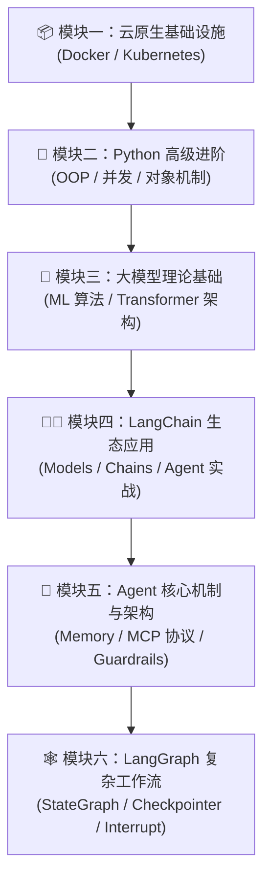

# 🤖 AI 大模型与云原生全栈知识库 (LLM & Cloud-Native Knowledge Hub)

<p align="center">
  
  
  
  
  
</p>

> 本仓库汇集了从 **云原生基础设施 (Docker/K8s)** 到 **Python 高级编程**、**机器学习/Transformer 大模型理论**，再到 **LangChain / Agent / MCP 协议** 以及 **LangGraph 状态机图网络** 的全栈知识体系与落地实战总结。

> 🔄 **持续更新声明**：本仓库为个人 AI 大模型与云原生技术的**长期持续更新知识库**。后续将不断补充最新的 LLM 前沿理论、Agent 架构演进、MCP 扩展协议、LangGraph 进阶模式及生产环境踩坑总结。建议点击 **Star ⭐️** 或 **Watch 👀** 保持关注！

---

## 💡 仓库特色 (Highlights)

- 🔄 **动态演进**：作者保持长期持续更新，紧跟 AI 与云原生技术前沿，不断补充最新的技术总结与项目实战经验。
- 🧱 **全栈贯通**：涵盖底层云原生容器基础设施、Python 底层机制、大模型理论算法与上层 Agent 应用层开发。
- 📊 **模块化分类**：将 28 篇核心学习文档划分为 6 大主题模块，循序渐进，查阅高效。
- 🎯 **深度落地**：不仅包含核心概念剖析，更包含踩坑经验、运行时上下文管理、记忆系统、人工介入与安全护栏等真实生产环境实战总结。
- 🔗 **一键跳转**：全目录支持 Markdown 相对路径跳转，在线阅读或配合 VS Code / Obsidian 本地学习无缝衔接。

---

## 🗺️ 知识体系架构 (Roadmap)



---

## 📚 目录与学习文档导航 (Table of Contents)

### 📦 模块一：容器化与云原生运维 (Cloud-Native Infrastructure)
> 构建大模型应用与微服务体系的高可用云原生基础设施。

| 序号 | 模块 / 文档名称 | 核心知识点与主要内容 | 快速跳转 |
| :---: | :--- | :--- | :---: |
| 01 | **Docker 总结与实战** | 镜像构建、容器生命周期管理、网络模式与 Volume 数据卷持久化 | [📄 阅读文档](./01Docker总结.md) |
| 02 | **Kubernetes (K8s) 总结与架构** | Pod、Deployment、Service、Ingress、ConfigMap 及 Pod 调度原理 | [📄 阅读文档](./02Kubernetes总结.md) |

---

### 🐍 模块二：Python 编程基础与进阶 (Python Core & Concurrency)
> 从语言基础到底层对象模型、异步并发与高性能编程。

| 序号 | 模块 / 文档名称 | 核心知识点与主要内容 | 快速跳转 |
| :---: | :--- | :--- | :---: |
| 03 | **Python 基础总结** | 基础数据结构、控制流、作用域与推导式常用语法 | [📄 阅读文档](./03Python基础总结.md) |
| 05 | **Python 文件流与 I/O 总结** | 文件读写、缓冲区管理、流式处理与编码转换 | [📄 阅读文档](./05Python文件流总结.md) |
| 06 | **Python 函数篇** | 闭包、高阶函数、装饰器设计模式及参数传递机制 | [📄 阅读文档](./06Python函数篇.md) |
| 07 | **Python 面向对象+模块+异常总结** | OOP 继承封装多态、模块包导入机制与异常捕获体系 | [📄 阅读文档](./07Python面向对象+模块+异常总结.md) |
| 08 | **Python 高级编程总结** | 迭代器与生成器、魔术方法 (Magic Methods)、元类与动态类型 | [📄 阅读文档](./08Python高级编程总结.md) |
| 09 | **Python `__new__` / `__init__` / `__call__` 详解** | 对象创建与初始化底层区别、单例模式应用及经典踩坑小记 | [📄 阅读文档](./09Python%20__new__%E3%80%81__init__%E3%80%81__call__%20%E6%A0%B8%E5%BF%83%E5%8C%BA%E5%88%AB%20%2B%20%E6%89%80%E6%9C%89%E5%9D%91%E7%82%B9%E5%B0%8F%E8%AE%B0.md) |
| 10 | **Python 网络与并发编程** | Socket 网络通信、多线程、多进程、GIL 影响与 asyncio 协程并发 | [📄 阅读文档](./10Python网络与并发编程.md) |

---

### 🧠 模块三：人工智能与大模型理论基础 (AI & LLM Fundamentals)
> 掌握大模型背后的机器学习数学基础与 Transformer 核心架构。

| 序号 | 模块 / 文档名称 | 核心知识点与主要内容 | 快速跳转 |
| :---: | :--- | :--- | :---: |
| 11 | **大模型基础之机器学习总结 (一)** | 经典监督/无监督学习算法、损失函数、梯度下降与过拟合治理 | [📄 阅读文档](./11大模型基础之机器学习总结.md) |
| 12 | **大模型基础之机器学习总结 (二)** | 模型评估指标、特征工程、集成学习与深度神经网络基础 | [📄 阅读文档](./12大模型基础之机器学习总结2.md) |
| 13 | **Transformer 架构入门** | Self-Attention 自注意力机制、Multi-Head Attention、Positional Encoding 与 Encoder-Decoder 结构 | [📄 阅读文档](./13Transformer架构入门.md) |

---

### 🦜🔗 模块四：LangChain 框架与应用开发 (LangChain Ecosystem)
> 熟悉 LangChain 框架大模型组件抽象、链式调用与智能体接入。

| 序号 | 模块 / 文档名称 | 核心知识点与主要内容 | 快速跳转 |
| :---: | :--- | :--- | :---: |
| 14.1 | **LangChain 介绍与核心概念** | LangChain 架构设计理念、组件生态与快速搭建 LLM Pipeline | [📄 阅读文档](./14.1Langchain介绍.md) |
| 14.2 | **LangChain Models 模型抽象** | LLM vs ChatModels 区别、PromptTemplate 提示词模板与 OutputParser 输出解析 | [📄 阅读文档](./14.2Models模型.md) |
| 14.3 | **LangChain Agent 智能体** | ReAct 思考框架、Tool 工具定义、AgentExecutor 执行机制 | [📄 阅读文档](./14.3Agent智能体.md) |
| 14.4 | **LangChain 实战经验与踩坑总结** | 真实项目应用落地、Token 优化、响应延迟调优与实践踩坑记录 | [📄 阅读文档](./14Langchian实战经验.md) |

---

### 🤖 模块五：Agent 核心机制与高级架构 (Agent Architecture & Protocols)
> 深入 Agent 复杂认知系统架构：记忆、人机交互、上下文与协议标准。

| 序号 | 模块 / 文档名称 | 核心知识点与主要内容 | 快速跳转 |
| :---: | :--- | :--- | :---: |
| 15 | **Agent 长短期记忆系统** | ConversationBuffer、VectorStore 检索记忆与长短期记忆结合策略 | [📄 阅读文档](./15长短期记忆.md) |
| 16 | **Agent 人机协同 (Human-in-the-Loop)** | HITL 设计模式、审批中断、人工反馈注入与智能体协同自治 | [📄 阅读文档](./16人机协同.md) |
| 17 | **Guardrails 安全护栏** | LLM 交互安全校验、提示词注入防护、结构化输出约束与合规审计 | [📄 阅读文档](./17Guardrails安全护栏.md) |
| 18 | **Agent 运行时上下文 (Runtime Context)** | 上下文窗口管理、动态 Prompt 状态流转与多轮对话 Token 剪枝 | [📄 阅读文档](./18Agent运行时上下文.md) |
| 19 | **MCP (Model Context Protocol) 协议详解** | Anthropic MCP 模型上下文协议规范、客户端与服务端交互机制 | [📄 阅读文档](./19MCP模型上下文协议.md) |

---

### 🕸️ 模块六：LangGraph 复杂 Workflow 与图状态网络 (LangGraph Deep Dive)
> 掌握基于状态图 (StateGraph) 构建可复控、可中断、高容错的先进 Agent 工作流。

| 序号 | 模块 / 文档名称 | 核心知识点与主要内容 | 快速跳转 |
| :---: | :--- | :--- | :---: |
| 20 | **LangGraph 快速入门** | StateGraph 状态图定义、Node 节点与 Edge 边条件分支构建 | [📄 阅读文档](./20LangGraph快速入门.md) |
| 21 | **LangGraph 工作模式与运行机制** | Pregel 引擎、并发节点执行、超级步 (Superstep) 与状态流转 | [📄 阅读文档](./21LangGraph工作模式与运行.md) |
| 22 | **Checkpointer 短期记忆与持久化** | 状态快照保存、会话 Resume 恢复、Time-travel 历史状态回滚 | [📄 阅读文档](./22Checkpointer短期记忆.md) |
| 23 | **Store 长期记忆管理** | 跨 Session 共享记忆、Namespace 命名空间存储与记忆检索 | [📄 阅读文档](./23Store长期记忆.md) |
| 24 | **LangGraph 容错与重试机制** | 节点级 Retry Policy 策略、Fallback 降级机制与异常图状态自愈 | [📄 阅读文档](./24LangGraph容错.md) |
| 25 | **LangGraph 流式输出 (Streaming)** | Stream Modes (`values`/`updates`/`custom`) 与大模型 Token 增量实时响应 | [📄 阅读文档](./25LangGraph流相关.md) |
| 26 | **LangGraph 人工介入 (Interrupt)** | 动态打断控制、人工输入补充、状态改写与图节点继续运行 | [📄 阅读文档](./26LangGraph人工介入.md) |

---

## 🛠️ 本地阅读与使用指南 (Getting Started)

1. **克隆仓库到本地**：
   ```bash
   git clone <your-github-repo-url>.git
   cd <repo-name>
   ```

2. **推荐阅读工具**：
   - **VS Code**: 推荐安装 `Markdown Preview Enhanced` 插件获取高品质渲染与链接跳转体感。
   - **Obsidian**: 完美支持双向链接与 Markdown 全功能图表。
   - **GitHub Web 端**: 直接点击上表中各模块的 `📄 阅读文档` 链接即可在线阅读。

---

## 🌟 贡献与反馈 (Contribution)

欢迎对本知识库提出修改建议或补充更多核心大模型实践笔记！如果觉得这些总结对你的学习有所帮助，欢迎点个 **Star ⭐️** 支持一下！
