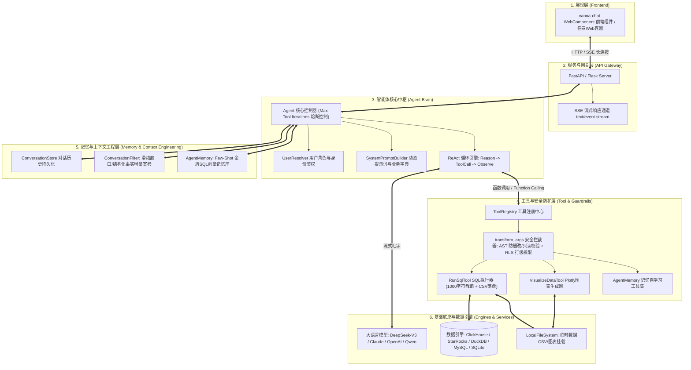

# 📊 个人核心实战项目：Vanna 2.0 企业级 ChatBI / Text-to-SQL 数据智能体平台

> 📌 **[AI 大模型与云原生全栈知识库](../README.md)** / **[个人核心项目：Text-to-SQL 数据智能体](./README.md)**
> 🏠 [返回主页 README](../README.md) | ⚡ [面试 30 分钟速记](../interview/00_面试冲刺30分钟速记卡片.md) | 💻 [白板手写代码](../interview/08_大厂手写代码与白板编程题.md)

---

## 📖 项目全景与定位 (Overview)

- **项目定位**：基于大语言模型（LLM）与 Agent 架构的企业级智能数据问答与交互分析平台（ChatBI / Text-to-SQL）。
- **核心业务价值**：打通企业大数据数仓资产与自然语言交互的最后一公里。将业务人员（运营、销售、财务）的自然语言提问自动转为精确的 SQL 语句，并在底层 OLAP 计算引擎中安全执行，最终以**交互式数据表格、Plotly 动态图表与深度商业洞察**混合流式交付。
- **个人工程定位**：大数据开发工程师 $\rightarrow$ 大模型应用开发工程师（LLM / Agent 应用架构师），主导数仓分层与语义建模、Agent ReAct 工具链编排、工业级上下文工程与纵深数据安全防线设计。

---

## 🗺️ 系统分层架构全景 (System Architecture)

---

## 📚 项目文档导航 (Documentation Matrix)

| 序号 | 文档名称 | 核心知识点与主要内容 | 快速跳转 |
| :---: | :--- | :--- | :---: |
| 01 | **项目架构深度解析与设计总结** | 6 大分层架构设计、Agent 中枢驱动、ToolRegistry 鉴权拦截、RunSqlTool 字符级熔断与隐式接力、VisualizeDataTool 动态构图、AgentMemory Few-Shot 机制、自动化回归评测框架（EX/VS） | [📄 阅读架构文档](./项目架构.md) |
| 02 | **大模型数据智能体面试实战指南** | 16K-22K STAR 法则项目自我介绍模板、ReAct 循环与防死循环熔断、SSE 多态 UI 协议、三层 Schema Linking 剪枝、单轮与多轮上下文工程、双重纵深硬防御（AST + 物理只读）、18 道高频大厂真题标准回答 | [📄 阅读面试指南](./基础版面试.md) |

---

## 🌟 核心技术亮点与攻坚创新点 (Core Highlights)

1. **ReAct 工具闭环与报错自愈（Self-Correction）**：
   - 彻底摆脱单轮 Prompt 盲猜，设计 `Reason -> Action -> Observation` 闭环。
   - 底层将 SQL 数据库执行报错信息实时反哺给模型二次推理，自动触发语法与字段纠错重写，SQL 执行准确率（EX）提升至 **85% 以上**。
2. **多态 UI 组件协议（UiComponent Protocol）与混合流式交互**：
   - 统一通过单条 SSE 长连接协议向前端推送 `SimpleTextComponent`（逐字总结）、`DataFrameComponent`（表格数据）、`PlotlyChartComponent`（动态交互图表）以及 `StatusBarUpdateComponent`（执行状态栏）。
3. **结合数仓分层的三层 Schema Linking**：
   - 针对几百张复杂物理表的 Schema 爆炸问题，收敛至 **DWS/ADS 主题宽表**；
   - 建立“元数据向量语义粗筛 + 外键血缘精排 + 数仓分层模型收敛”三层体系，每次仅向 Prompt 注入最相关的 3~5 张宽表。
4. **纵深数据安全防线（AST 语法拦截 + 物理只读 + RLS 动态重写）**：
   - 在框架层解析 SQL 抽象语法树（AST），严格限制仅允许 `SELECT/WITH`，对 `DROP/DELETE/UPDATE/ALTER` 秒级熔断；
   - 数据库连接池强制使用只读从库模式（`?mode=ro`）；
   - 在 `transform_args` 中根据用户部门与身份动态注入 `WHERE` 过滤条件，实现行级数据安全隔离。
5. **分层上下文工程与 Token 压降治理**：
   - 单轮查询对大表格实施 **1000 字符物理截断**（全量落盘 CSV），防止上下文打爆；
   - 长会话采用 `ConversationFilter` 实现**“保真滑动窗口（最近2轮） + 增量事实案卷（更早历史提取指标与维度）”**，压降 60% 以上 Token 成本。
6. **AgentMemory 行为记忆与 Few-Shot 自学习**：
   - 区别于传统非结构化文本 RAG，建立结构化 `{问题向量, 黄金SQL, 工具名, 业务域}` 案例库；
   - 前置检索高相似度历史已验证 SQL 注入 Few-Shot，实现企业核心复杂指标的严谨一致性与闭环自进化。
7. **数据驱动的自动化回归评测框架（vanna.core.evaluation）**：
   - 搭建包含 200+ 真实业务用例的黄金评测集；
   - 自动化比对**执行准确率（EX）**、**语法合法率（VS）**、工具轨迹与大模型裁判评分，为从闭源模型迁移至国产开源 DeepSeek 提供客观数据支撑。

---

> 🏠 **[返回主页 README](../README.md)** | 📚 **[项目架构文档](./项目架构.md)** | 🎓 **[大厂面试实战指南](./基础版面试.md)** | ⚡ **[面试 30 分钟速记](../interview/00_面试冲刺30分钟速记卡片.md)**
