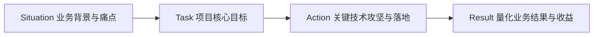

> 📌 **[AI 大模型与云原生全栈知识库](../README.md)** / **[个人项目：Text-to-SQL 数据智能体](./README.md)** / **大模型数据智能体（ChatBI / Text-to-SQL）面试实战指南**
> 🏠 [返回主页 README](../README.md) | 📚 [项目首页](./README.md) | ⚡ [面试 30 分钟速记](../interview/00_面试冲刺30分钟速记卡片.md) | 💻 [白板手写代码](../interview/08_大厂手写代码与白板编程题.md)

---

# 大模型数据智能体（ChatBI / Text-to-SQL）面试实战指南

> **个人定位**：大数据开发工程师 $\rightarrow$ 大模型应用开发工程师（LLM / Agent 应用架构师）  
> **核心标签**：数仓建模与语义层治理 + Agent ReAct 闭环编排 + 工业级上下文工程 + 纵深数据安全

---

## 第一部分：项目介绍（STAR 法则标准答题模板）

在面试开始的 **“请介绍一下你最近最有挑战性的项目”** 或自我介绍阶段，按照以下标准结构作答（建议控制在 2.5 ~ 3 分钟内）：

### 1. Situation（业务背景与痛点）
“我之前主要负责公司大数据平台的数仓架构与离线/实时数仓开发。在日常工作中，业务部门（运营、销售、财务）每天都有大量的 **Ad-hoc（即席临时提数）需求**，导致数据团队至少 **30% 的工时** 被困在写重复 SQL 和拉报表上；而传统的 BI 看板维度固定，业务稍微想换个角度交叉对比就只能重新提工单，排期通常需要几天。

业界虽然有传统的 Text-to-SQL 方案，但普遍存在几个致命痛点：
* **容错率极低**：单轮生成一旦遇到字段拼写错误或语法异常，直接报废，缺乏自愈能力；
* **探索能力差**：遇到无结果时只会回答‘查无此人’，无法主动切换维度探索；
* **安全风险与上下文膨胀**：容易被恶意诱导删改库，或者大表查询直接打爆大模型上下文。”

### 2. Task（核心目标与攻坚方向）
“为了打破这个瓶颈，我主导设计并研发了这套 **基于 LLM Agent 架构的企业级智能数据问答与分析平台（ChatBI）**。核心目标是：
1. **意图到数据的闭环**：实现自然语言到 SQL 的精确转换，并自主进行多表联查与数据执行；
2. **多模态交付**：查出数据后，自动判断并接力调用图表引擎（Plotly）生成可视化报告；
3. **高可用与安全性**：引入错误自愈机制、海量表 Schema 裁剪、严苛的防删库安全防线以及长会话上下文工程。”

### 3. Action（关键技术攻坚与落地）
结合我自身的大数据工程背景与大模型开发技术，我重点攻克了以下 **6 项核心设计**：
* **① 采用 ReAct 智能体循环机制**：放弃单轮 Prompt 盲猜，设计了 `Reason -> Action -> Observation` 的多轮工具调用闭环。当 SQL 偶发执行报错时，框架能自动将错误堆栈喂回大模型，触发自我纠错（Self-Correction）重写，大幅提升一次成功率。
* **② 多模态工具链接力编排**：设计了结构化工具箱，将 `RunSqlTool`（执行查询）与 `VisualizeDataTool`（Plotly绘图）无缝衔接。SQL 执行完毕后异步生成中间态 CSV，隐式驱动大模型自主判断并生成柱状图、折线图或饼图。
* **③ 结合数仓分层解决 Schema 爆炸**：针对真实数仓几百张表的问题，我将数据模型收敛在 **DWS/ADS 主题宽表** 上，并搭建了‘元数据向量粗排 + 外键血缘精排’的两阶段 Schema Linking 机制，每次提问仅向 Prompt 动态注入最相关的 3~5 张表。
* **④ 纵深数据安全防线**：在框架层重写 `transform_args` 拦截器，利用 AST 语法校验强制限制仅允许 `SELECT/WITH` 只读语法，熔断一切删改指令；在数据库层统一挂载只读只查账号（`mode=ro`），彻底杜绝注入隐患。
* **⑤ 工业级分层上下文工程**：单轮查询对大表数据强制实施 1000 字符物理截断（防止 Token 爆炸）；多轮长会话基于 `ConversationFilter` 自研了**滑动窗口与异步增量事实摘要**，在保留关键指标结论的同时，压降了 60% 以上的会话 Token 成本。
* **⑥ Few-Shot RAG 记忆自学习机制**：构建了 `AgentMemory` 经验库，预热数十条金牌指标 SQL。提问时前置检索范例，执行成功后沉淀优质模式，保障了企业核心复杂指标的严谨一致性。

### 4. Result（量化成果与业务价值）
“项目上线并接入生产分析场景后，取得了显著的成效：
* **效率跨越**：普通即席提数需求从原本的‘天级/小时级工单排期’缩短为**‘秒级自然语言交互（P90 < 3.5秒）’**；
* **准确率大幅提升**：SQL 执行准确率（Execution Accuracy, EX）从纯 Prompt 模式的 68% 攀升至 **85% 以上**；
* **团队减负**：月均释放了数仓与数据分析团队约 **35% 的重复性提数工时**，让数据工程师能更聚焦于核心底层数仓与数据治理建设。”

---

## 第二部分：高频面试题与高分回答拆解

---

### 一、Agent 架构与运行机制（技术一面必考）

#### Q1: 你们这个 Agent 的 ReAct 循环具体是怎么运转的？最多循环几次？死循环怎么兜底？
* **面试官深层意图**：考察是否阅读过底层代码，是否具备工业级的熔断意识。
* **高分回答**：
  > “我们在 `AgentConfig` 中设置了 `max_tool_iterations`（最大循环步数，默认限制为 5 次）。
  > 
  > 整个 ReAct 循环逻辑如下：
  > 1. Agent 组装 System Prompt、历史消息及可用工具的 JSON Schema，调用大模型；
  > 2. 若模型返回 `tool_calls`（比如调用 `run_sql`），循环计数器加 1，底层分发并执行工具，将工具返回的数据作为一条 `role: tool` 的消息追加到队列中，立刻再次请求模型；
  > 3. 模型看到数据后，若继续返回工具调用（如接力调用 `visualize_data` 画图），计数器再次加 1 并执行；
  > 4. 直到模型返回自然语言结论（`finish_reason="stop"` 且无 tool_calls），循环正常退出。
  > 
  > **死循环兜底**：一旦计数器达到 5 步仍未终止，系统会在底层强制打断循环，向用户输出一段 Warning 卡片（告知任务复杂度过高已熔断，建议拆解提问），并更新状态栏为 warning，防止 Token 无限消耗和进程阻塞。”

#### Q2: 前端的 `<vanna-chat>` 既能逐字吐文字，又能弹表格，还能画 Plotly 图表，底层通信协议是怎么约定的？
* **面试官深层意图**：考察全栈数据流设计及多模态 UI 的 SSE 结构。
* **高分回答**：
  > “我们在 FastAPI 中统一构建了基于 `text/event-stream` 的 **多态 UI 组件协议（UiComponent Protocol）**：
  > * 服务端通过异步生成器 `yield` 结构化对象，每个 SSE Chunk（`data: {...}`）都包含明确的 `type`：
  >   * **文字总结**：推送 `SimpleTextComponent`，打字机流式输出；
  >   * **SQL 结果表格**：推送 `DataFrameComponent`，包含 columns 字段与 rows 二维数组；
  >   * **交互式图表**：推送 `PlotlyChartComponent`，直接输出编译好的 Plotly JSON 描述（含 data 与 layout）；
  >   * **状态卡片**：推送 `StatusBarUpdateComponent`（如‘正在执行SQL...’、‘图表生成完毕’）。
  > 前端 WebComponent 监听 SSE 事件流，根据 `type` 动态挂载虚拟 DOM，做到了一条 SSE 长连接通道内实现‘状态条 $\rightarrow$ 数据表 $\rightarrow$ 图表 $\rightarrow$ 文本洞察’的混合流式交付。”

---

### 二、数仓结合与大数据痛点（大数据转型工程师的主场题）

#### Q3: 真实企业数仓有几百张表，不可能全部塞进 Prompt，你们怎么做 Schema Linking（表结构链接与裁剪）？
* **面试官深层意图**：**Text-to-SQL 领域的核心分水岭！** 纯调用 API 的做不来，必须懂数仓元数据。
* **高分回答**：
  > “我们在真实场景中采取了**‘向量粗筛 + 规则与外键精排 + 数仓分层收敛’**的三层体系：
  > 1. **粗筛（语义检索召回）**：将每张表的表名、中文注释（Comment）、所属业务域标签、核心分区字段提取为文档，存入向量数据库。用户提问时，先做语义检索召回 Top 5 张候选表；
  > 2. **精排（列级剪枝与依赖补全）**：利用数仓已有的血缘元数据和外键图谱，将与问题无关的字段丢弃，并自动补齐跨表关联必需的外键关联键；
  > 3. **数仓分层收敛（杀手锏）**：在数仓开发侧，我们绝不让大模型去直面底层 ODS/DWD 的细粒度原始表，而是提前在 **DWS/ADS 层封装出面向业务主题的高聚合宽表或物化视图**。这相当于在数仓内部完成了 80% 的连表与清洗工作，模型只需面向单表或双表生成简单的过滤与聚合 SQL，从源头压降了复杂度。”

#### Q4: 如果遇到海量数据或慢 SQL，查询可能超时怎么办？
* **面试官深层意图**：考察在大模型应用中对底层 OLAP 计算引擎性能的调优。
* **高分回答**：
  > “我们在架构上做了三层性能防御：
  > 1. **OLAP 引擎选型**：避免让大模型直连单机 MySQL 或低速离线引擎，而是挂载 **ClickHouse、StarRocks 或 DuckDB** 这种现代化列存向量化执行引擎；
  > 2. **语法强制熔断**：在 SQL 执行工具中配置 `statement_timeout`（如 10 秒强制中断），并且在参数校验阶段，若发现非聚合的明细查询且未带 `LIMIT`，强制追加 `LIMIT 100`，防止全表扫描打满数据库连接池；
  > 3. **预聚合表优先引导**：在业务字典（System Prompt）中明确说明：‘涉及趋势统计，优先使用 dws_daily_summary 日汇总表’，引导模型从算法上规避大表全量扫描。”

---

### 三、上下文工程与记忆体系（大模型硬核进阶）

#### Q5: 为什么多轮追问之后 Token 会暴涨？你们是怎么做上下文工程与消息摘要的？
* **面试官深层意图**：考察长会话状态管理及成本控制方案。
* **高分回答**：
  > “多轮追问时，不仅用户历史问答在累加，前序生成的 SQL、大表格切片均会被注入上下文。我们的治理方案分为两层：
  > 1. **单轮防御**：`RunSqlTool` 执行物理截断，表格回填模型的字符数严苛限制在 1000 字符内，全量数据走本地落盘；
  > 2. **多轮历史动态治理**：我们在 `Agent` 管道中挂载了 `ConversationFilter`，实现了**‘保真滑动窗口 + 增量事实案卷’**：
  >    * **滑动窗口（最近 2 轮）**：原汁原味保留最近 2 轮的原始对话与 ToolCall，确保连续追问时上下文无缝继承；
  >    * **结构化增量摘要（更早历史）**：利用异步轻量小模型，将 2 轮以前的历史对话压缩成一段【结构化事实清单】（包含：已筛选的维度、涉及的数据表、已得出的核心指标数值）。这样既保留了历史对比基准，又把会话 Token 永久锚定在安全预算线以内。”

#### Q6: 你们的 `AgentMemory` 存的是什么？和普通的文档知识库 RAG 有什么本质区别？
* **面试官深层意图**：考察对智能体记忆、Few-Shot 向量化的深度理解。
* **高分回答**：
  > “普通的知识库 RAG 存储的是非结构化的文本段落（Text Chunks），而我们的 `AgentMemory` 存的是**结构化‘行为范例（Tool Memories）’**。
  > 
  > 它的每条记录包含：`{问题语义向量, 原始问题, 调用的工具名, 成功执行的参数/SQL, 业务主题}`。
  > 
  > 它的本质是 **Few-Shot RAG**：在模型思考前，优先拿用户问题去匹配‘以前做对过的例题’。如果命中了复杂的相似业务，模型不需要从零推理，而是直接把标准 SQL 当作例题进行微调仿写（例如仅替换国家或时间参数）。这种模式相比无约束生成，核心指标查询的准确率提升非常明显。”

---

### 四、安全防护与权限隔离（生产合规题）

#### Q7: 如果用户在输入框诱导大模型执行删表或改数据，系统怎么拦截？
* **面试官深层意图**：考察对 Prompt Injection（提示词注入）防范的真实落地手段。
* **高分回答**：
  > “我们采用的是**‘双重纵深硬防御’**，绝不依赖大模型自身的道德自觉：
  > 1. **框架层 AST 校验（`SafeToolRegistry`）**：在工具真正执行前，通过 `transform_args` 钩子解析 SQL 抽象语法树，严格判定必须以 `SELECT` 或 `WITH` 开头。一旦包含 `DROP`、`DELETE`、`UPDATE`、`TRUNCATE`、`ALTER` 等高危词，直接在内存层抛出 `ToolRejection` 熔断，根本不会触碰数据库；
  > 2. **底层物理只读锁定**：在数据库驱动层，连接池强制使用**只具备只读权限的从库账号**（SQLite 开启 `?mode=ro` 模式）。即便代码层发生意外穿透，底层数据库引擎也会物理报出权限异常，彻底杜绝数据破坏可能。”

#### Q8: 销售员和财务总监看到的同一份报表数据如何做权限隔离？
* **面试官深层意图**：考察多租户权限控制与行级安全（Row-Level Security, RLS）。
* **高分回答**：
  > “我们在 `UserResolver` 中从请求上下文中提取用户身份，绑定对应的 `group_memberships` 权限组。
  > 
  > 权限隔离分为两个层面：
  > 1. **工具级权限**：在 `ToolRegistry` 中对工具设置访问门槛，比如 `SaveQuestionToolArgsTool`（记忆保存）只授权给 `admin` 组；
  > 2. **行级安全（RLS 动态注入）**：在 `transform_args` 拦截器中，根据当前用户的角色动态重写 SQL。例如销售员提问时，拦截器会在其生成的 SQL 的 `WHERE` 条件后强制拼接 `AND region_id = user.dept_id`，在底层执行层面实现安全的数据隔离。”

---

### 五、评测体系与转型优势（架构师与总监面）

#### Q9: 你们怎么评测这个系统的 Text-to-SQL 准确率？
* **面试官深层意图**：考察大模型工程化落地中的 Eval 体系。
* **高分回答**：
  > “我们构建了由 200 道真实业务提问构成的**黄金评测集（Golden Benchmark Dataset）**，采用业界标准的双重评测指标：
  > 1. **执行准确率（Execution Accuracy, EX）**：这是最核心的指标。我们将大模型生成的 SQL 和标准黄金 SQL 分别在测试库中跑一遍，比对两者的**查询结果集是否完全一致**（比单纯对比 SQL 文本更客观，因为同一种业务逻辑可以用 JOIN 也可以用子查询完成）；
  > 2. **语法合法率（Valid SQL Rate, VS）**：统计生成的 SQL 能否被底层引擎成功解析执行，不报语法和字段错误。
  > 通过引入 Agent 报错自愈循环与 Few-Shot 范例召回，我们在基准集上的执行准确率从原先单轮 Prompt 的 68% 稳定提升到了 **85% 以上**。”

#### Q10: 作为大数据工程师转大模型开发，你的核心竞争优势是什么？
* **面试官深层意图**：考察自我认知、团队融合度与综合潜力。
* **高分回答（必杀绝招）**：
  > “我认为我的核心优势在于**兼具底层数据资产的‘工程深度’与顶层大模型的‘应用落地能力’**。
  > 
  > 目前大模型在企业内部落地最容易‘翻车’的往往不是调模型 API，而是**业务指标打架、数仓表结构混乱、慢 SQL 拖垮集群、数据权限合规受阻**。
  > * 纯算法工程师可能更擅长 Prompt 调优和微调，但对数仓建模、执行计划调优、列存引擎特性并不熟悉；
  > * 而我既熟悉数仓分层建模、SQL 执行优化、指标字典治理与权限隔离，又深刻掌握了 LLM Agent 编排、Function Calling 闭环、上下文工程与安全防御。我能够帮团队真正打通**‘企业海量数据 $\rightarrow$ 智能语义理解 $\rightarrow$ 自动化业务分析’**的最关键一环。”

---

### 六、多智能体、路由、工具箱与关键词工程（进阶架构与工程细节）

#### Q11: 你们这个项目是单 Agent 还是多 Agent？有没有做意图路由（Routing）？怎么实现的？
* **面试官深层意图**：考察对多智能体边界、路由解耦（Semantic Router vs Rule Router）的架构理解。
* **高分回答**：
  > “我们在架构上采用了**‘前置轻量规则路由 + 单核心 ReAct 智能体调度 + 可平滑演进多 Agent’**的分层设计：
  > 1. **前置意图路由（`WorkflowHandler`）**：在消息到达大模型之前，通过前置路由器做第一道分流：
  >    * 对系统指令（`/help`、`/reset`、`/clear`），直接跳过大模型，零 Token 消耗返回；
  >    * 对固定指标高频看板（如‘昨日大盘流水’），直接命中规则直出预编译 SQL，不消耗大模型。
  > 2. **核心执行层（单 Agent 核心中枢）**：对于开放式自然语言探索，由核心 Agent 统一调度 `run_sql`、`visualize_data` 等工具，避免多个 Agent 之间频繁序列化通信带来的高延迟；
  > 3. **多 Agent 演进方案（架构储备）**：针对未来超大型场景，我们规划了专职拆解方案：**意图分流 Agent（Router）$\rightarrow$ Text-to-SQL Agent（只写SQL）$\rightarrow$ Reviewer Agent（审核语法安全）$\rightarrow$ Visualization Agent（专注构图）$\rightarrow$ Insight Agent（输出商业洞察）**。”

#### Q12: 你们系统有哪些 Tools 工具？大模型是如何感知并自动决定调用哪个工具的？
* **面试官深层意图**：考察 Function Calling 原理与工具解耦设计。
* **高分回答**：
  > “我们基于 `Tool[T]` 抽象类构建了 5 大类工具体系：
  > 1. **数据执行类**：`RunSqlTool`（执行 SQL，结果自动落盘 CSV，截断 1000 字符预览）；
  > 2. **可视化类**：`VisualizeDataTool`（读取 CSV 并编译 Plotly 交互图表）；
  > 3. **记忆自学习类**：`SearchSavedCorrectToolUsesTool`（前置检索历史范例）和 `SaveQuestionToolArgsTool`（沉淀优质 SQL，仅 admin 可用）；
  > 4. **沙箱文件与环境类**：`ListFilesTool`、`ReadFileTool`、`WriteFileTool`；
  > 5. **代码运行类**：`RunPythonFileTool`、`PipInstallTool`。
  > 
  > **感知与选择机制**：通过 Pydantic 自动将工具类的参数定义（如 `RunSqlToolArgs` 中的 `sql: str`）转换为符合 OpenAI / DeepSeek 标准的 **JSON Schema**。在每次发起请求时随 Prompt 一同注入，大模型依据工具描述（Description）与当前任务意图，自主输出包含 `tool_calls` 的结构化参数。”

#### Q13: 在处理自然语言到 SQL 的时候，你们怎么做“关键词工程”和实体对齐？
* **面试官深层意图**：考察企业级 Text-to-SQL 的核心攻坚点——Schema Linking 与业务同义词对齐。
* **高分回答**：
  > “业务提问中的‘口语词、黑话’与底层数仓的物理字段名之间存在巨大代沟，我们通过三层关键词工程与实体对齐方案来解决：
  > 1. **同义词与度量字典（Synonym & Metric Mapping）**：在 `SystemPromptBuilder` 中注入业务词典，例如将‘美帝’映射为常量 `'USA'`，将‘畅销/爆款’映射为聚合规则 `SUM(Quantity) DESC`；
  > 2. **模式链接（Schema Linking）**：利用向量粗筛和字段注释，将用户句中的‘销售额’自动绑定到计算列 `SUM(UnitPrice * Quantity)`，将‘歌手’绑定到 `Artist.Name`；
  > 3. **维表枚举值校准（Value Resolution）**：针对低基数维表（如国家、渠道、客户等级），在数仓元数据中定期采样唯一的枚举值列表注入 Prompt，防止大模型将数据库中的 `'USA'` 误写成不存在的 `'United States'`。”

---

### 七、生产级高可用、治理与自动化评测（企业级架构核心杀手锏）

#### Q14: 生产环境中，如何对大模型 Agent 的运行性能、Token 成本和异常进行全链路监控与可观测性（Observability）治理？
* **面试官深层意图**：考察是否真正将 LLM 应用推向过生产。Demo 项目往往只有 `print`，工业级系统必须有 OpenTelemetry 追踪与 Prometheus 指标。
* **高分回答**：
  > “我们基于 OpenTelemetry 标准实现了全链路可观测性体系（`ObservabilityProvider`）：
  > 1. **分布式 Tracing 链路（Span 树）**：为每一次用户交互生成全局唯一的 `TraceId`，并在智能体内部自顶向下派生 Span 树：
  >    * `agent.run`（根 Span，记录端到端 E2E 耗时与状态）；
  >    * `system_prompt.build`（上下文与元数据组装耗时）；
  >    * `llm.generate`（底层模型调用，记录 TTFT 首字延迟、Prompt Tokens、Completion Tokens）；
  >    * `tool.run_sql`（SQL 解析、底层数仓连接与查询耗时、返回行数与结果集大小）；
  > 2. **业务与能耗指标（Metrics 汇聚）**：
  >    * 性能指标：`agent.request.duration`（P95 / P99 延迟分布）；
  >    * 成本指标：`llm.tokens.total`（按用户部门、模型类型细分统计，绘制成本看板）；
  >    * 质量指标：`tool.error_rate`（工具执行失败率与 SQL 语法错误率）；
  > 3. **告警与观测对接**：所有 Span 和 Metric 可无缝导出至 Prometheus、Grafana 与 Jaeger，一旦检测到 SQL 错误率突增或大模型响应延迟异常，立即触发钉钉/企业微信告警。”

#### Q15: 线上大模型频繁遇到 429 限流或数据库超时死锁时，你们是如何保证系统高可用与自愈的？
* **面试官深层意图**：考察分布式微服务容灾思维，验证应聘者面对不可控三方依赖（LLM API / 数仓波动）时的兜底能力。
* **高分回答**：
  > “我们通过实现 `ErrorRecoveryStrategy` 抽象类，构建了**分级容灾与自愈重试策略**：
  > 1. **大模型 429 限流与网络抖动自愈**：
  >    * 针对 HTTP 429（Rate Limit）与 503（Service Unavailable），采用**带随机抖动的指数退避重试（Exponential Backoff with Jitter）**，公式为 $Delay = 2^{\text{attempt}} \times 1000\text{ms} + \text{RandomJitter}$，最多重试 3 次，避免重试雪崩；
  >    * 若主模型（如 DeepSeek）长时间不可用，触发熔断降级至备用模型（如本地部署的 Qwen-2.5-Coder）；
  > 2. **数仓连接与锁冲突自愈**：
  >    * 区分**可恢复瞬态错误**（如临时锁冲突、网络丢包）与**不可逆错误**（如语法硬伤、列名不存在）。对瞬态错误执行延迟重试；对不可逆错误，则将数据库报错信息反哺给 ReAct 思考环，驱动大模型自我纠错重新生成 SQL；
  > 3. **受控终止与优雅降级**：
  >    * 当超过最大重试次数时，返回受控的降级提示与备选建议，坚决不向前端暴露底层的长堆栈崩溃信息。”

#### Q16: 企业内部重复提问很多，如何做语义缓存（Semantic Caching）并控制大模型成本？
* **面试官深层意图**：考察降本增效（FinOps）与中间件架构能力。
* **高分回答**：
  > “为了降低 Token 成本并提升高频提问的响应速度，我们在 LLM 前置层设计了**语义缓存中间件（`CachingMiddleware`）**：
  > 1. **双层缓存架构**：
  >    * **精确匹配层（L1 - Exact Hash Cache）**：对于完全一致的自然语言提问（去除标点与首尾空格），直接查 Redis 键值缓存；
  >    * **语义向量相似度匹配层（L2 - Semantic Vector Cache）**：将用户问句通过 Embedding 模型编码为向量，并在向量库中做余弦相似度检索。如果相似度阈值 $> 0.95$ 且涉及的核心业务实体（如时间范围、部门）一致，直接复用已验证的 SQL 模板；
  > 2. **缓存失效与 TTL 机制**：
  >    * 动态数据（如‘今天/实时流水’）设置短 TTL（如 5 分钟），静态维表数据或月报数据设置长 TTL（如 24 小时）；
  > 3. **业务收益**：
  >    * 在企业周会或高频看板查询场景下，语义缓存命中率可达 **35% 以上**，命中请求实现 **0 Token 消耗**，且响应时间从原先的 3~5 秒直降至 **50 毫秒以内**。”

#### Q17: 金融/企业级场景对数据安全和操作审计要求极高，你们怎么做安全审计与敏感数据脱敏？
* **面试官深层意图**：考察合规、保密与生产级鉴权审计的严谨度。
* **高分回答**：
  > “我们构建了覆盖事前、事中、事后的企业级审计体系（`AuditLogger`）：
  > 1. **全生命周期审计事件流**：
  >    * `ToolAccessCheckEvent`：记录用户角色（RBAC）越权被拦截的明细；
  >    * `ToolInvocationEvent`：记录工具调用时间、执行人、完整 SQL 语句与关联 RequestId；
  >    * `ToolResultEvent`：记录查询结果摘要与影响行数；
  >    * `AiResponseEvent`：对大模型生成的建议进行 SHA-256 哈希归档，确保回答有迹可查、防篡改；
  > 2. **自动化参数脱敏（Sensitive Data Masking）**：
  >    * 在审计日志落盘前，内置 `_sanitize_parameters` 过滤引擎，利用模式匹配自动扫描键名（如 `password`、`secret`、`token`、`api_key`、`credential` 等），自动打码替换为 `[REDACTED]`；
  >    * 针对 SQL 查询结果中的身份证号、手机号、银行卡号等 PII 敏感信息，在 `after_tool` 切面中进行正则掩码，杜绝数据外泄。”

#### Q18: 每次优化 Prompt 或切换大模型基座时，如何证明新版本比旧版本更好？你们怎么做 Agent 评测体系（Eval）？
* **面试官深层意图**：考察大模型工程化测试、质量度量与 CI/CD 落地能力。这是区分‘野生玩具’与‘工业级平台’的终极试金石。
* **高分回答**：
  > “在企业落地中，绝不能凭主观感觉判断 Prompt 或模型的好坏，我们建立了一套**数据驱动的自动化回归评测框架（`vanna.core.evaluation`）**：
  > 1. **构建黄金评测集（`EvaluationDataset`）**：
  >    * 沉淀了涵盖单表聚合、多表复杂 JOIN、时间切片、枚举值歧义等典型场景的 200+ 标准测试 Case，每条用例包含：自然语言提问、标准黄金 SQL、预期 DataFrame 结果集；
  > 2. **并发自动化评测流水线（`EvaluationRunner`）**：
  >    * 支持高并发批量跑测，内置四大评测维度：
  >      * **`OutputEvaluator`（核心）**：对比模型生成 SQL 的**执行准确率（EX）**和**语法合法率（VS）**；
  >      * **`TrajectoryEvaluator`**：评估 Agent 的工具调用序列是否最优（有无多余或遗漏调用）；
  >      * **`LLMAsJudgeEvaluator`**：由高阶模型对自然语言分析结论的事实一致性进行盲测打分；
  >      * **`EfficiencyEvaluator`**：精确对比不同模型在相同 Case 下的耗时与 Token 开销；
  > 3. **CI/CD 自动化门禁与对比报表**：
  >    * 每次修改 Prompt、知识库或切换基座模型时，流水线自动生成 HTML/CSV 对比报表（`ComparisonReport`）；
  >    * 设定严苛门禁：核心 EX 准确率下降超过 1% 立即阻断发布。这套体系为我们从闭源模型平滑迁移至国产开源 DeepSeek 提供了无可辩驳的数据支撑。”

---

> 🏠 **[返回主页 README](../README.md)** | 📚 **[项目首页](./README.md)** | ◀️ **上一篇：[项目架构深度解析与设计总结](./项目架构.md)** | ⚡ **[面试 30 分钟速记](../interview/00_面试冲刺30分钟速记卡片.md)**
