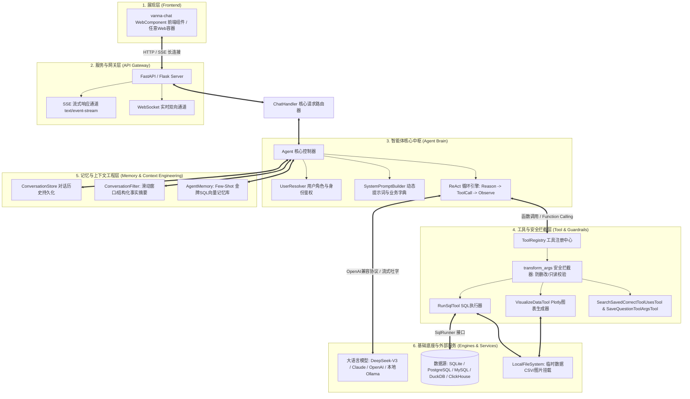
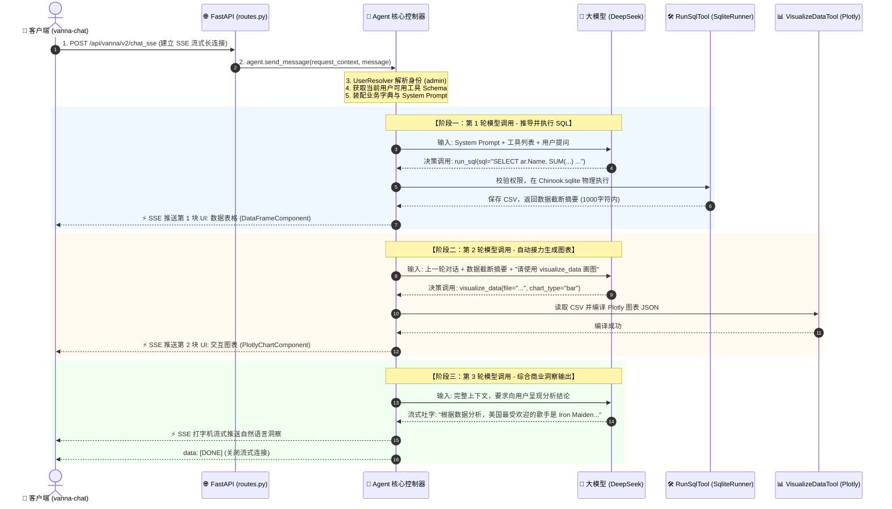
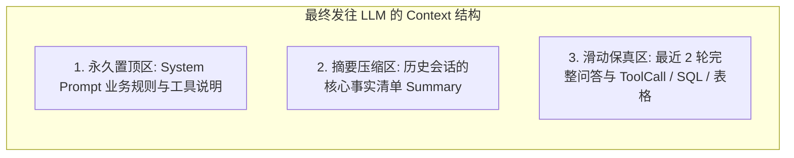
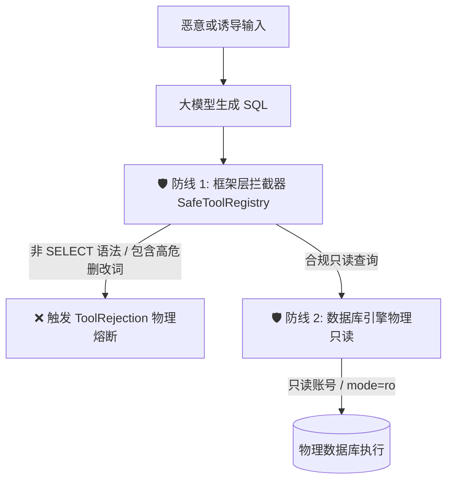
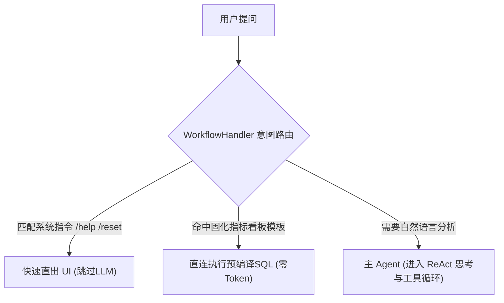
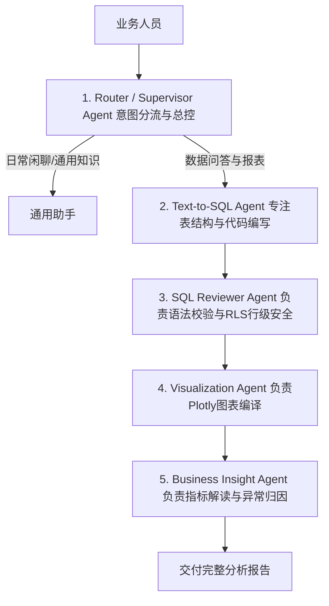
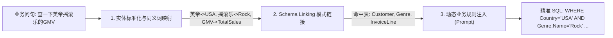
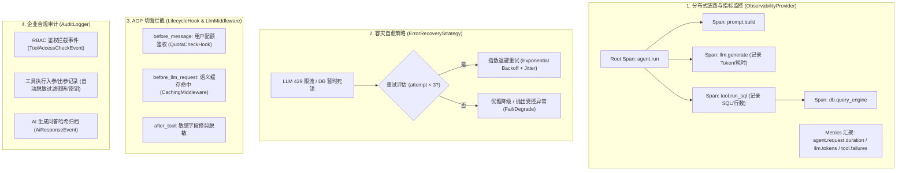
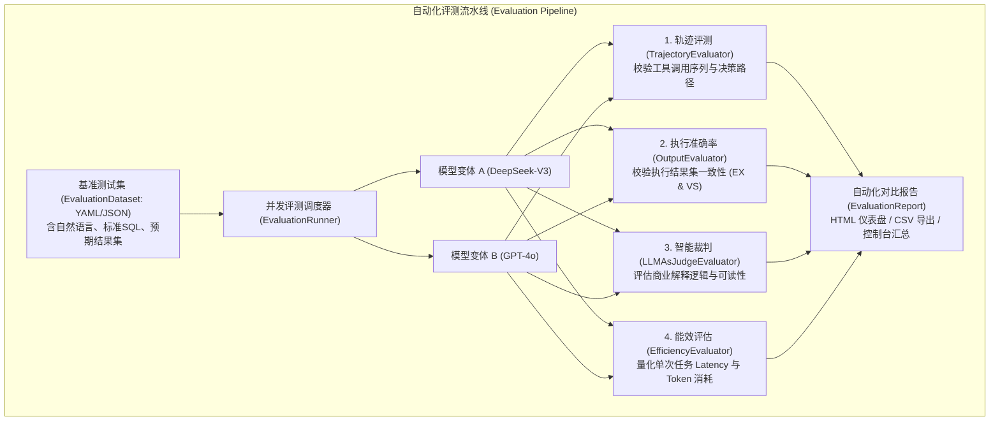

> 📌 **[AI 大模型与云原生全栈知识库](../README.md)** / **[个人项目：Text-to-SQL 数据智能体](./README.md)** / **项目架构深度解析与设计总结**
> 🏠 [返回主页 README](../README.md) | 📚 [项目首页](./README.md) | ⚡ [面试 30 分钟速记](../interview/00_面试冲刺30分钟速记卡片.md) | 💻 [白板手写代码](../interview/08_大厂手写代码与白板编程题.md)

---

# Vanna 2.0 数据智能体平台：项目架构深度解析与设计总结

> **项目定位**：基于大模型（LLM）与 Agent 架构的企业级智能数据问答与分析平台（ChatBI / Text-to-SQL）。  
> **核心使命**：将用户的自然语言问题无缝转换为精确的 SQL 语句，并在真实数据库中执行，最终以交互式表格、可视化图表（Plotly）及深度商业洞察流式交付给前端。

---

## 一、整体系统架构图（System Architecture）

系统由 **前端交互层**、**网关与流式传输层**、**智能体编排核心层**、**工具与安全防护层**、**记忆与存储层**、**底层数据与大模型基础层** 六大分层构成：

---

## 二、核心组件深度解析

### 1. 智能体核心驱动 (`Agent`)
* **源码位置**：[`src/vanna/core/agent/agent.py`](file:///d:/selfAiProject/vanna/src/vanna/core/agent/agent.py)
* **设计职责**：全系统的中枢大脑，负责状态管理、上下文调度、多轮 `while` 工具调用循环（Max Tool Iterations 熔断控制）、以及流式 UI 组件的分发。
* **ReAct 循环机制**：
  1. 组装当前 System Prompt 与历史消息；
  2. 携带可用工具的 JSON Schema 请求 LLM；
  3. 若 LLM 返回 `tool_calls`，调度对应工具执行，将执行结果注入消息队列（`role: tool`），再次请求 LLM；
  4. 直到 LLM 输出纯文本总结或满足退出条件，流式推送完成。

### 2. 工具注册与安全防线 (`ToolRegistry` & `Tool`)
* **源码位置**：[`src/vanna/core/registry.py`](file:///d:/selfAiProject/vanna/src/vanna/core/registry.py)
* **设计职责**：统一管理系统内所有可调用工具（Tools），提供权限过滤与参数校验拦截。
* **关键设计点**：
  * **角色分组鉴权（`access_groups`）**：例如将 `SaveQuestionToolArgsTool` 限制为仅 `admin` 可用，防止普通业务用户污染记忆库。
  * **执行前参数拦截（`transform_args`）**：在真实执行工具前预留的 Hook。用于拦截非 `SELECT` 危险 SQL，或者动态给 SQL 追加租户隔离条件（Row-Level Security, RLS）。

### 3. 数据查询工具与截断机制 (`RunSqlTool` & `SqlRunner`)
* **源码位置**：[`src/vanna/tools/run_sql.py`](file:///d:/selfAiProject/vanna/src/vanna/tools/run_sql.py) 与 [`src/vanna/integrations/sqlite/sql_runner.py`](file:///d:/selfAiProject/vanna/src/vanna/integrations/sqlite/sql_runner.py)
* **单轮上下文熔断保护**：
  * 当 SQL 查出数万行记录时，**严禁将全量数据回传给大模型**。
  * 系统在底层执行 `results_preview[:1000]`，将传回模型的上下文强制压缩在 **1000 字符（约 250 Tokens）** 以内。
  * 全量数据被异步落盘为 `./data_output/query_results_xxx.csv`，并通过 `DataFrameComponent` 推送给前端渲染完整交互式表格。
* **工具隐式接力契约**：
  * `RunSqlTool` 会在回包末尾注入提示词：`Results saved to file: xxx.csv. IMPORTANT: FOR VISUALIZE_DATA USE FILENAME...`，自然触发大模型调用下一步的可视化工具。

### 4. 动态图表生成器 (`VisualizeDataTool`)
* **源码位置**：[`src/vanna/tools/visualize_data.py`](file:///d:/selfAiProject/vanna/src/vanna/tools/visualize_data.py)
* **设计职责**：读取由 SQL 生成的中间 CSV 数据，利用大模型推断最适合的图表类型（对比用 Bar、趋势用 Line、占比用 Pie），调用 `PlotlyChartGenerator` 生成符合 Plotly.js 规范的完整交互式图表 JSON，流式输出至前端。

### 5. 记忆沉淀与 Few-Shot 自进化 (`AgentMemory`)
* **源码位置**：[`src/vanna/capabilities/agent_memory/`](file:///d:/selfAiProject/vanna/src/vanna/capabilities/agent_memory/)
* **工作机制**：
  * **事前检索（RAG）**：提问时优先调用 `SearchSavedCorrectToolUsesTool`，在向量库/内存索引中匹配历史相似提问；若命中，将过往正确的“金牌 SQL”以例题形式注入上下文，由模型微调复用。
  * **事后沉淀**：执行成功后，由管理员或系统触发 `SaveQuestionToolArgsTool`，把问题、工具名、成功参数打包存入记忆库，实现**越用越聪明**的闭环自学习。
  * **存储介质适配**：支持内存运行（`DemoAgentMemory`）、本地持久化（`ChromaAgentMemory`）、企业分布式向量库（`PgVector` / `Qdrant` / `Milvus`）。

### 6. 用户身份与租户感知 (`UserResolver`)
* **源码位置**：[`src/vanna/core/user/`](file:///d:/selfAiProject/vanna/src/vanna/core/user/)
* **设计职责**：从 HTTP Request（Cookie、JWT、Header）中提取用户标识，转化为具备 `id`、`email`、`group_memberships` 的 `User` 实体，贯穿整个生命周期。

---

## 三、端到端数据流转全生命周期（时序流转）

以典型查询 **“帮我查询美国最受欢迎的歌手是什么”** 为例，系统执行经历五大阶段：

---

## 四、关键架构决策与技术对比

### 1. 为什么选择 Agent 架构而非单轮 Prompt / 传统 Text-to-SQL？
* **传统 Text-to-SQL 的痛点**：单向输出，一旦 SQL 出现字段拼写错误、类型不匹配，直接崩死；无法处理“查不到数据时的替代路径探索”；输出只是生硬的数据，无法自驱画图。
* **Agent 架构的破局点**：
  * **具备自愈能力（Self-Correction）**：SQL 执行失败时，错误信息会喂回大模型，触发模型反思重写；
  * **具备多步探索常识**：查国家无果后，能自主发散查询曲风、歌手标签；
  * **工具链接力**：实现从 SQL 生成 $\rightarrow$ 物理查询 $\rightarrow$ 结果落地 $\rightarrow$ 自动化图表可视化 $\rightarrow$ 文本分析的一体化流水线。

### 2. 槽位填充（Slot-Filling）vs 端到端生成（End-to-End Generation）
| 比较维度 | 传统 SQL 槽位填充 | Vanna + LLM 端到端生成（本项目） |
| :--- | :--- | :--- |
| **底层机理** | 预置 SQL 模板，只通过 NLP 提取实体参数填空 | 大模型根据表结构、外键和业务上下文现场从零推导整条 SQL |
| **灵活性** | 极差，只能回答预设好的固定句式 | 极强，可自由应对任意未见过的 Ad-hoc 交叉多维分析 |
| **跨表复杂度** | 难以定义 5 张表以上的动态 JOIN 模板 | 大模型自主推理外键依赖链，多表联查信手拈来 |
| **维护成本** | 随着业务发展需要不断人工添加和维护大量模板 | 零模板维护，只需维护表结构 DDL 和业务字典 |

---

## 五、企业级上下文工程（Context Engineering）策略

为防止多轮会话累积引发 **Token 成本膨胀** 或 **超出模型上下文窗口**，系统采用分层上下文工程方案：

1. **单轮工具级熔断**：`RunSqlTool` 对长数据强制执行 1000 字符物理截断，阻断单次查询打爆 Token。
2. **多轮历史级治理**：通过框架底层抽象的 [`ConversationFilter`](file:///d:/selfAiProject/vanna/src/vanna/core/filter/base.py) 管道进行动态裁剪：
   * **滑动窗口截断（Sliding Window）**：剔除 3 轮以前过期的详细 SQL 工具回包，仅保留核心提示词与最近活跃交互。
   * **增量式事实摘要（Incremental Summarization）**：利用轻量级小模型在后台异步将老旧对话浓缩为“已查实体、筛选条件、核心指标数值”的结构化事实案卷，兼顾长期记忆与极低成本。

---

## 六、安全防护机制（纵深防御体系）

企业落地中，严禁将数据库安全寄托在“大模型不生成恶意 SQL”的自觉性上：

1. **第一道防线（框架层动态拦截）**：
   重写 `ToolRegistry.transform_args`，校验 SQL 必须以 `SELECT` 或 `WITH` 开头；若检测到 `DROP`、`DELETE`、`UPDATE`、`INSERT`、`ALTER`、`TRUNCATE`，直接返回 `ToolRejection`，在调用底层驱动前彻底熔断。
2. **第二道防线（数据库物理只读权限）**：
   * SQLite 挂载开启 URI 只读标志：`sqlite3.connect("file:Chinook.sqlite?mode=ro", uri=True)`；
   * MySQL / PostgreSQL 使用只具备 `SELECT` 权限的专用只读从库账号，从物理权限层面彻底杜绝数据篡改隐患。

---

## 七、大数据工程师转大模型开发落地建议

1. **语义层治理先行（Semantic Layer）**：
   不要让大模型直面杂乱无章的数仓 ODS 层。在数仓 DWS/ADS 层建立高复用度的主题宽表、规范字段注释，或建立 dbt 物化视图，将复杂的连表下沉到数仓内部。
2. **Schema 链接与列级剪枝（Schema Linking）**：
   面对数百张表的工业级数仓，引入元数据向量粗排 + 外键图精排机制，每次仅向大模型注入与问题最相关的 3~5 张表的 DDL。
3. **金牌问答库冷启动**：
   在系统上线前，由数仓开发与 DBA 梳理出公司核心的 50~100 个权威指标问答，批量灌入 `AgentMemory`，筑牢企业核心口径的确定性防线。

---

## 八、单智能体 vs 多智能体（Multi-Agent）与意图路由机制

### 1. 当前架构形态：单 Agent 编排 + 工具链解耦（Single Agent with Multi-Tools）
Vanna 2.0 核心采用的是 **单智能体中心调度（Central ReAct Agent）** 模式：
* 由一个统一的 `Agent` 控制器持有所有的工具（`RunSqlTool`、`VisualizeDataTool` 等），通过大模型的规划能力进行步进式工具接力；
* **优势**：状态集中、延迟低（无需 Agent 间多重序列化通信）、资源开销小。

### 2. 框架内置的“意图路由分流”：`WorkflowHandler`
查看源码 [`src/vanna/core/workflow/base.py`](file:///d:/selfAiProject/vanna/src/vanna/core/workflow/base.py)：
* 系统提供了前置的 **工作流路由触发器（WorkflowHandler）**，在消息发送给 LLM 之前拦截并进行意图分流：
  1. **指令分流**：识别 `/help`、`/reset`、`/clear` 等系统指令，直接跳过 LLM（`should_skip_llm=True`）快速返回；
  2. **固定报表直通**：对高频固化报表（如“昨日营收概览”），基于模式匹配直接调度预编译 SQL，不消耗大模型 Token；
  3. **配额拦截**：在进入复杂 LLM 循环前做用量守卫。

### 3. 企业级演进方向：多智能体协作（Multi-Agent Hierarchy）
在超大型企业场景中，单 Agent 挂载超过 15 个工具时容易发生意图混淆。标准的多智能体演进方案是将职能垂直拆解为 5 个专职 Agent：

---

## 九、全量 Tools 工具箱体系清单

Vanna 框架在 [`src/vanna/tools/`](file:///d:/selfAiProject/vanna/src/vanna/tools/) 中建立了模块化的工具生态，所有工具均继承自 `Tool[T]` 抽象基类并通过 Pydantic 强类型校验：

| 工具分类 | 工具类名 (`Tool Name`) | 核心职责与入参说明 | 适用权限与场景 |
| :--- | :--- | :--- | :--- |
| **核心数据查询** | `RunSqlTool` | 执行生成的 SQL 语句，并将大结果集写入本地 CSV，回传 1000 字符内预览。参数：`sql: str` | `admin`, `user`（只读分析） |
| **数据可视化** | `VisualizeDataTool` | 读取 CSV 数据，根据字段类型编译出 Plotly 交互图表 JSON。参数：`filename`, `chart_type`, `x_column`, `y_column` | `admin`, `user` |
| **记忆检索** | `SearchSavedCorrectToolUsesTool` | 在向量库中搜索过往提问的相似成功案例（Few-Shot）。参数：`question`, `limit`, `similarity_threshold` | `admin`, `user`（提问前置执行） |
| **记忆沉淀** | `SaveQuestionToolArgsTool` | 将验证正确的复杂问题与 SQL 参数持久化沉淀到向量库。参数：`question`, `tool_name`, `args` | **仅 `admin`**（防止普通用户污染） |
| **自由记忆存储** | `SaveTextMemoryTool` | 存储非结构化业务规则或术语说明。参数：`content: str` | `admin` |
| **本地文件系统** | `ListFilesTool` / `ReadFileTool` `WriteFileTool` / `SearchFilesTool` | 供高级数据分析代码在沙箱目录下读取/写入报表、中间 Parquet 文件等。 | 特殊分析场景 / 沙箱模式 |
| **Python 运行时** | `RunPythonFileTool` / `PipInstallTool` | 支持更高级的复杂数据清洗与科学计算脚本执行。 | 研发与高级调试模式 |

---

## 十、关键词工程与 Schema Linking 对齐方案

真实业务提问中，业务人员说的“黑话、简称、同义词”与数仓底层“物理表、列名”往往存在巨大鸿沟。项目中的**关键词工程与实体对齐方案**由三层构成：

1. **业务词典与同义词映射（Synonym Mapping）**：
   在 `SystemPromptBuilder` 或 `ContextEnhancer` 中注入业务词典，实现语义对齐：
   * *“美帝 / 美国 / US”* $\rightarrow$ 映射为常量值 `'USA'`
   * *“摇滚乐 / 重金属”* $\rightarrow$ 映射为流派 `'Rock'`, `'Metal'`
   * *“畅销 / 爆款”* $\rightarrow$ 映射为聚合规则 `SUM(Quantity) DESC`
2. **Schema Linking（模式链接）**：
   将自然语言关键词精准链接到数仓物理元数据：
   * 业务词“歌手” $\rightarrow$ 链接到 `Artist.Name`
   * 业务词“销售额/金额” $\rightarrow$ 链接到计算表达式 `SUM(InvoiceLine.UnitPrice * InvoiceLine.Quantity)`
   * 业务词“下单国家” $\rightarrow$ 链接到 `Customer.Country`
3. **实体枚举值校准（Value Resolution）**：
   利用 SQLite / 数仓中对维表枚举值的采样索引（如 `SELECT DISTINCT Country FROM Customer`），在组装 Prompt 时提供可选枚举值范围，防止大模型编造不存在的字符串（如把 `'USA'` 误写成 `'United States'`）。

---

## 十一、工业级高可用与运维治理（可观测性、容灾自愈、切面配额与合规审计）

为了满足金融、证券、电商等大型企业在安全合规、稳定性 SLA 以及成本控制上的严苛要求，系统在底层构建了完备的运维治理体系：

### 1. 全链路分布式 Tracing 与 Metrics 监控 (`ObservabilityProvider`)
* **Span 树设计**（兼容 OpenTelemetry 标准）：
  每个请求进入系统时分配唯一的 `TraceId`，并在智能体运行生命周期中自顶向下派生树状 `Span`（包含 `span_id`, `parent_id`, `start_time`, `end_time`, `duration_ms`, `attributes`）：
  * **LLM 调用 Span**：捕获 Prompt Tokens、Completion Tokens、模型名称、首字延迟（TTFT）；
  * **Tool 执行 Span**：记录工具名称、入参摘要、执行耗时、影响行数与报错堆栈；
* **关键指标导出（Metrics）**：
  * `agent.request.duration`：端到端用户响应耗时 P95 / P99；
  * `agent.llm.tokens.total`：每日/每租户累计 Token 开销分析；
  * `agent.tool.error_rate`：各分析工具执行失败率与熔断状态。

### 2. 外部容灾与指数退避自愈 (`ErrorRecoveryStrategy`)
调用大模型与数仓引擎在生产环境中极易遇到瞬时故障（如大模型 API 返回 HTTP 429 Too Many Requests / 503 Service Unavailable，或数据库因锁冲突导致的超短时超时）：
* **自愈机制**：通过实现 `ErrorRecoveryStrategy` 抽象类，智能拦截 `handle_llm_error` 与 `handle_tool_error`；
* **指数退避重试（Exponential Backoff with Jitter）**：
  $$Delay = 2^{\text{attempt}} \times 1000\text{ms} + \text{RandomJitter}$$
  智能区分不可逆错误（如语法硬伤、列不存在）与瞬态错误（如限流、网络抖动），避免无意义重复重试，在保证系统鲁棒性的同时降低失败率。

### 3. AOP 切面拦截与租户配额管控 (`LifecycleHook`)
在智能体执行的不同生命周期节点植入拦截切面：
* `before_message`：**多租户配额与防刷拦截（`QuotaCheckHook`）**。校验当前用户的调用频次、当日 Token 消耗限额，一旦超限立即熔断抛出异常，不再进入耗时的大模型调用；
* `before_tool` / `after_tool`：工具执行前后介入，可动态改写工具参数或对执行结果做数据裁剪、敏感字段掩蔽；
* `after_message`：异步统计会话质量并向消息队列推送业务事件。

### 4. LLM 语义缓存中间件 (`LlmMiddleware`)
* 通过实现 `before_llm_request` / `after_llm_response` 拦截器构建**语义缓存层（Semantic Cache）**；
* 当高频分析问题（如“查看本周总销售额”、“各部门人数统计”）命中语义向量缓存时，直接返回经过校验的历史响应与 SQL 模板，实现 **0 Token 开销** 与 **亚秒级（< 50ms）瞬时返回**。

### 5. 企业级合规审计与数据脱敏日志 (`AuditLogger`)
满足 ISO27001、GDPR 等信息安全与审计合规要求：
* **结构化审计事件**：全面覆盖 `ToolAccessCheckEvent`（越权拦截记录）、`ToolInvocationEvent`（工具调用参数记录）、`ToolResultEvent`（结果快照）、`AiResponseEvent`（模型输出哈希摘要）；
* **动态参数脱敏（Sanitization）**：内置 `_sanitize_parameters` 算法，利用敏感词模式（`password`、`secret`、`token`、`api_key`、`credential` 等）进行入参深层扫描，入库前自动打码替换为 `[REDACTED]`，杜绝任何密钥或隐私信息外泄。

---

## 十二、Text-to-SQL 自动化评测体系（CI/CD 评测流水线与模型对比）

在实际企业迭代中，无论是修改了 System Prompt、调整了 Few-Shot 范例库，还是将底层基座从 DeepSeek 切换到 GPT-4o，最核心的工程痛点是：**如何定量证明新方案比旧方案更准？如何防止历史 Case 发生准确率倒退？**

项目内置了一套完整的工业级自动化评测框架（`vanna.core.evaluation`）：

### 1. 四大核心评估维度（Built-in Evaluators）
1. **执行准确率评估（`OutputEvaluator`）**：
   * **Execution Accuracy (EX)**：将 Agent 生成的 SQL 与基准用例的“黄金标准 SQL”同时在隔离测试库中执行，比对两者的 **DataFrame 结果集（行、列、数值）是否完全等价**。这比单纯比对 SQL 字符串更客观，能完美接纳多种不同的等价 SQL 写法（如 JOIN 与子查询的互换）；
   * **Valid SQL Rate (VS)**：统计大模型生成的 SQL 在数仓中的编译与语法成功率，排查幻觉字段错误。
2. **决策轨迹评估（`TrajectoryEvaluator`）**：
   * 评测 Agent 的思维链（Thought Process）与工具调用顺序（`tool_calls` 轨迹）；
   * 检验 Agent 是否按照预期先检索记忆/元数据、再查 SQL、最后做可视化，防止无效冗余调用或偏离业务轨迹。
3. **大模型裁判评估（`LLMAsJudgeEvaluator`）**：
   * 针对智能体最终输出的自然语言业务结论，引入更高级裁判模型对回答的“事实一致性”、“洞察深度”、“语言得体度”进行 1-5 分的定量打分。
4. **能效与成本评估（`EfficiencyEvaluator`）**：
   * 精确统计完成单项任务所消耗的总 Token 数量、API 调用次数与端到端耗时（Latency），建立“准确率 vs 成本”的帕累托最优分析。

### 2. CI/CD 自动化回归流水线与模型选型对比
* **自动化门禁集成**：将 `EvaluationRunner` 脚本集成进 GitLab CI / GitHub Actions。每次代码提交或 Prompt 变更时，自动运行基准集测试，如果核心指标 **EX 准确率下降超过 1%** 则直接阻断合并；
* **横向对比报表（`ComparisonReport`）**：支持将多个 Agent 变体（如不同基座模型、不同温度参数、不同 Schema 注入策略）进行矩阵式横向 PK，自动生成直观的 HTML 差异报表与降级 Case 归因列表，为企业技术选型提供详实的数据支撑。

---

> 🏠 **[返回主页 README](../README.md)** | 📚 **[项目首页](./README.md)** | ▶️ **下一篇：[大模型数据智能体面试实战指南](./基础版面试.md)** | ⚡ **[面试 30 分钟速记](../interview/00_面试冲刺30分钟速记卡片.md)**
