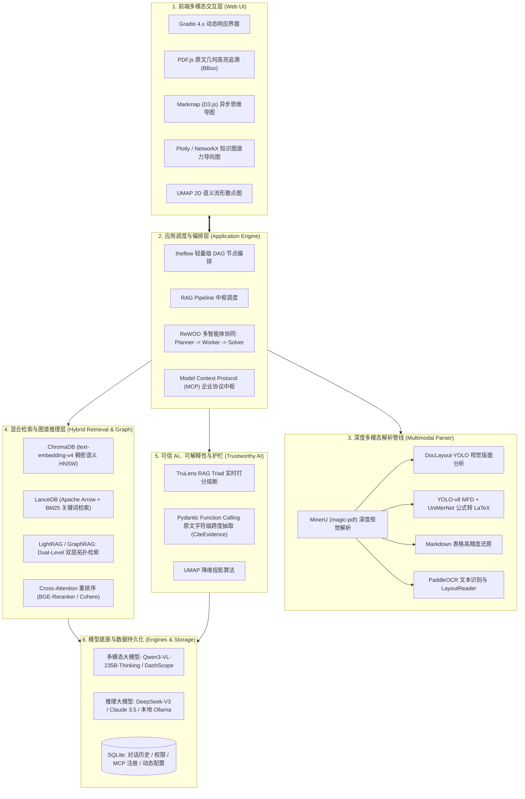

# 📑 个人核心实战项目：Kotaemon & OmniDoc-Agent 企业级多模态文献中枢与智能推理系统

> 📌 **[AI 大模型与云原生全栈知识库](../README.md)** / **[个人核心项目：多模态 RAG 问答系统](./README.md)**
> 🏠 [返回主页 README](../README.md) | ⚡ [面试 30 分钟速记](../interview/00_面试冲刺30分钟速记卡片.md) | 💻 [白板手写代码](../interview/08_大厂手写代码与白板编程题.md)

---

## 📖 项目全景与定位 (Overview)

- **项目定位**：面向高价值复杂文献（金融研报、科研论文、技术规范、工程图纸）的企业级高精度多模态 RAG 与多智能体推理系统。
- **开源基座与自研升级**：以开源高质量 RAG 框架 **Kotaemon** 为底座，深度重构多模态视觉版面解析、引入前沿知识图谱双层检索（GraphRAG / LightRAG）、打造 ReWOO 解耦型长链多智能体推理中枢，并落地 UMAP 二维流形可视化与 TruLens RAG Triad 防幻觉打分护栏。
- **简历定位方案**：
  - **方案 A (综合架构与 RAG 落地)**：`OmniDoc-RAG`：企业级高精度多模态科研与商业文献智能中台
  - **方案 B (Agent 复杂推理)**：`DocMind-Agent`：基于多智能体协同的大模型文献深度推理与知识挖掘系统
  - **方案 C (通用开源框架研发)**：`Kotaemon Multi-Modal RAG Platform`

---

## 🗺️ 系统分层架构全景 (System Architecture)

---

## 📚 项目文档导航 (Documentation Matrix)

| 序号 | 文档名称 | 核心知识点与主要内容 | 快速跳转 |
| :---: | :--- | :--- | :---: |
| 01 | **项目系统架构与技术栈文档** | 双层解耦设计（`libs/kotaemon` 算法库 + `libs/ktem` Web 系统）、ChromaDB + LanceDB + SQLite 三重存储选型、模型矩阵配置、GraphRAG & LightRAG 图谱引擎、异步双流思维导图、可信护栏与 MCP 规范 | [📄 阅读系统架构文档](./项目架构.md) |
| 02 | **Kotaemon 核心面试指南 (通用标准版)** | 8 大专题深度拆解：STAR 自我介绍、系统分层与技术选型、MinerU 视觉版面深度解析、Chroma+LanceDB 混合检索与 Reranker 调优、ReWOO 多智能体推理、GraphRAG/LightRAG 双层图谱、UMAP/TruLens/MCP 前沿特性、四大真实工程踩坑排查（DashScope 序列化、百炼 BatchSize 并发截断、Reranker 熔断降级、Windows C++ 依赖避坑） | [📄 阅读通用版面试指南](./普通版面试.md) |
| 03 | **企业级多模态知识中枢 (OmniDoc-Agent 高阶版)** | 简历 6 大核心模块精炼范本（直接写进简历）、五大业务痛点全景对比图、十大核心技术壁垒与创新亮点、可量化业务与技术指标（Top-5 Recall 92.4%、引用对齐率 98.5%、Token 节省 78%）、主导者角色简历答辩问答高分话术 | [📄 阅读企业版高阶指南](./企业版本面试.md) |

---

## 🌟 核心技术亮点与攻坚创新点 (Core Highlights)

1. **MinerU 深度多模态视觉版面分析**：
   - 彻底解决学术论文与研报“双栏混读、表格坍塌、公式乱码”三大硬伤；
   - 结合 DocLayout-YOLO 视觉版面分割与 UniMerNet LaTeX 公式还原，复杂排版解析准确率提升至 **96.2%**。
2. **Dense + Sparse 双路混合检索与 Cross-Attention 精排**：
   - **ChromaDB（HNSW 稠密语义）** 解决语义关联，**LanceDB（Apache Arrow + BM25）** 解决专有名词精确匹配；
   - 配合 BGE-Reranker 大模型细粒度二次打分，Top-5 召回率从 68% 攀升至 **92.4%**。
3. **LightRAG 增量知识图谱与 Dual-Level 双层检索**：
   - 集成微软 GraphRAG 与港大最新 LightRAG，攻克跨篇章实体拓扑推理与宏观全局概括难题；
   - 实现 Local 实体细节与 Global 主题概念双层检索，相比传统 GraphRAG 削减 **78% Token 成本**。
4. **ReWOO 长链多智能体解耦推理架构**：
   - 针对长文档跨章节因果推理，打破单 Agent (ReAct) 频繁请求 LLM 的死循环痛点；
   - 落地 **Planner（一次性规划执行图）➔ Worker（并发调用工具）➔ Solver（证据融合推理）**，降低 Token 开销 **48%**；原生支持 Anthropic MCP 标准协议。
5. **可信 AI 护栏与 UMAP 二维语义流形可视化**：
   - 采用 **UMAP 流形学习**将 1024 维 Dense 语义空间压缩至 2D 散点图，打破黑盒检索不可解释性；
   - 落地 **TruLens RAG Triad** 实时打分安全熔断，结合 Pydantic 字符级跨度抽取（`CiteEvidence`），引用对齐率达 **98.5%**。
6. **异步双流思维导图引擎 (Markmap)**：
   - 设计主回答流式打字与后台 MapGPT 提取逻辑层级的多线程异步双流通道，前端 Markmap 零延迟动态渲染交互式矢量脑图，并支持离线 HTML 导出。

---

> 🏠 **[返回主页 README](../README.md)** | 📚 **[系统架构文档](./项目架构.md)** | 🎓 **[通用版面试指南](./普通版面试.md)** | 🚀 **[企业级高阶指南](./企业版本面试.md)** | ⚡ **[面试 30 分钟速记](../interview/00_面试冲刺30分钟速记卡片.md)**
