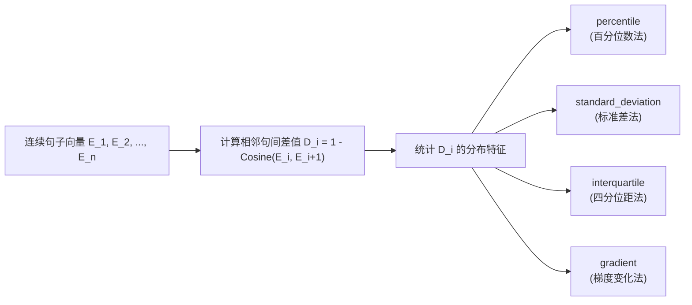
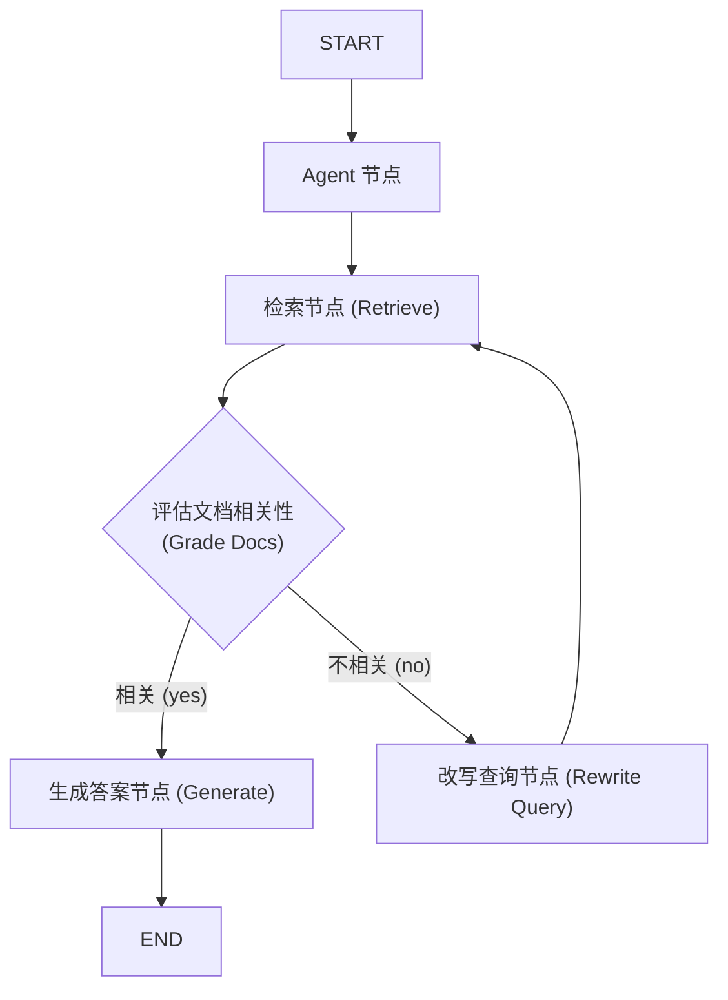
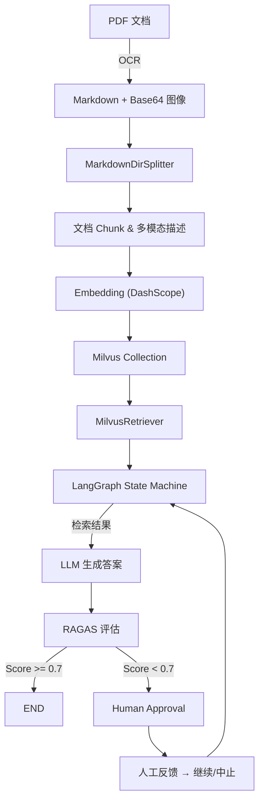

# 全栈企业级 RAG 与多模态 RAG + RAGAS 实战进阶与源码解析手册

> **适用对象**：大模型与 RAG 架构师、AI 全栈工程师、后端高级开发人员、人工智能研究者。  
> **核心目标**：将企业级 RAG 的两大递进演进阶段（**纯文本/CRAG/Adaptive RAG/MCP 阶段** 与 **多模态 RAG/RAGAS/Vision-LLM 阶段**）融合为单本全景式工程与算法学习手册，提供完整的架构流图、数学推导、核心语法模式、42 课时映射大纲、排错指南与生产部署方案。

---

## 目录

- [一、 项目整体概述与架构演进](#一-项目整体概述与架构演进)
  - [1.1 从文本 RAG 到多模态 RAG + RAGAS 的演进之路](#11-从文本-rag-到多模态-rag--ragas-的演进之路)
  - [1.2 核心技术栈全景对比表](#12-核心技术栈全景对比表)
  - [1.3 项目全景目录结构与源码文件映射](#13-项目全景目录结构与源码文件映射)
- [二、 前阶段核心：文本 RAG、CRAG 与 Adaptive RAG 架构解析](#二-前阶段核心文本-ragcrag-与-adaptive-rag-架构解析)
  - [2.1 结构化文档解析与上下文标题保留 (`merge_title_content`)](#21-结构化文档解析与上下文标题保留-merge_title_content)
  - [2.2 语义切片 (`SemanticChunker`) 4 种断点策略与数学原理](#22-语义切片-semanticchunker-4-种断点策略与数学原理)
  - [2.3 基于 LangGraph 的高阶图控 RAG（CRAG 与 Adaptive/Self-RAG）](#23-基于-langgraph-的高阶图控-ragcrag-与-adaptiveself-rag)
  - [2.4 MCP (Model Context Protocol) 协议引入与测试架构](#24-mcp-model-context-protocol-协议引入与测试架构)
  - [2.5 课程 42 课时与源码模块全景映射大纲](#25-课程-42-课时与源码模块全景映射大纲)
- [三、 进阶突破：多模态 RAG 系统总体架构](#三-进阶突破多模态-rag-系统总体架构)
  - [3.1 端到端数据流与架构流图](#31-端到端数据流与架构流图)
  - [3.2 各子系统职责划分](#32-各子系统职责划分)
- [四、 多模态文档解析与 OCR (`dots_ocr`)](#四-多模态文档解析与-ocr-dots_ocr)
  - [4.1 PDF 拆解与 `dots_ocr` 核心算法](#41-pdf-拆解与-dots_ocr-核心算法)
  - [4.2 Base64 图像提取与上下文关联标记](#42-base64-图像提取与上下文关联标记)
  - [4.3 常见解析报错与调试技巧](#43-常见解析报错与调试技巧)
- [五、 多模态切块与上下文语义化 (`splitters`)](#五-多模态切块与上下文语义化-splitters)
  - [5.1 `MarkdownDirSplitter` 类全景设计](#51-markdowndirsplitter-类全景设计)
  - [5.2 Vision-LLM 图像上下文描述生成 (前文+后文)](#52-vision-llm-图像上下文描述生成-前文后文)
  - [5.3 文本分块 Chunk Size 调优实验对比](#53-文本分块-chunk-size-调优实验对比)
- [六、 多模态向量存储与混合检索 (Milvus 2.5)](#六-多模态向量存储与混合检索-milvus-25)
  - [6.1 Milvus Collection Schema 设计 (Dense + BM25 Sparse)](#61-milvus-collection-schema-设计-dense--bm25-sparse)
  - [6.2 Milvus 3 大部署模式与 4 大数据一致性级别](#62-milvus-3-大部署模式与-4-大数据一致性级别)
  - [6.3 混合检索 (Hybrid Search) 算法与 RRF 详细数学推导](#63-混合检索-hybrid-search-算法与-rrf-详细数学推导)
  - [6.4 `MilvusRetriever` 实现与 `nprobe` 调优](#64-milvusretriever-实现与-nprobe-调优)
- [七、 大模型调用、嵌入与速率控制 (`my_llm` & `embeddings_utils`)](#七-大模型调用嵌入与速率控制-my_llm--embeddings_utils)
  - [7.1 多大模型统一配置与接入 (OpenAI, Qwen, K2, 智谱)](#71-多大模型统一配置与接入-openai-qwen-k2-智谱)
  - [7.2 DashScope 多模态 Embedding 与 L2 归一化](#72-dashscope-多模态-embedding-与-l2-归一化)
  - [7.3 固定窗口速率限制器与 429 随机退避重试机制](#73-固定窗口速率限制器与-429-随机退避重试机制)
- [八、 LangGraph 多模态图控工作流 (`graph`)](#八-langgraph-多模态图控工作流-graph)
  - [8.1 `MultiModalRAGState` 状态定义](#81-multimodalragstate-状态定义)
  - [8.2 5 大动态路由函数与节点编排](#82-5-大动态路由函数与节点编排)
  - [8.3 Human-in-the-Loop 人工介入中断与恢复机制](#83-human-in-the-loop-人工介入中断与恢复机制)
- [九、 RAGAS 自动化评估体系 (`evaluate`)](#九-ragas-自动化评估体系-evaluate)
  - [9.1 单轮评估样本 `SingleTurnSample` 构建](#91-单轮评估样本-singleturnsample-构建)
  - [9.2 ContextRelevance / ResponseRelevancy / ContextPrecision 详解](#92-contextrelevance--responserelevancy--contextprecision-详解)
  - [9.3 RAGAS 自动化评估代码与实验数据对比](#93-ragas-自动化评估代码与实验数据对比)
- [十、 前端交互与可视化 UI (Gradio \& Attu)](#十-前端交互与可视化-ui-gradio--attu)
  - [10.1 Gradio 交互界面 `ProcessorAPP` 设计](#101-gradio-交互界面-processorapp-设计)
  - [10.2 现代 CSS 拟物与玻璃拟态高质感 UI](#102-现代-css-拟物与玻璃拟态高质感-ui)
  - [10.3 Attu 向量库可视化控制台部署与应用](#103-attu-向量库可视化控制台部署与应用)
- [十一、 环境准备、部署与常见踩坑指南 (Troubleshooting)](#十一-环境准备部署与常见踩坑指南-troubleshooting)
  - [11.1 Python 环境与国内镜像源配置](#111-python-环境与国内镜像源配置)
  - [11.2 Docker-Compose 生产一键部署方案](#112-docker-compose-生产一键部署方案)
  - [11.3 常见排错 FAQ 汇总](#113-常见排错-faq-汇总)
- [十二、 总结与未来扩展方向](#十二-总结与未来扩展方向)

---

## 一、 项目整体概述与架构演进

### 1.1 从文本 RAG 到多模态 RAG + RAGAS 的演进之路

在企业级 AI 落地过程中，RAG（检索增强生成）系统经历了从**简单朴素检索**到**智能图控**再到**多模态感知与自动化评估**的技术演进：

1. **第一阶段：纯文本级高级 RAG (`RAG_PROJECT`)**  
   解决非结构化文本的准确检索问题。通过 Unstructured 拆解 Markdown、保留标题上下文链路 (`merge_title_content`)，采用 Milvus 2.5 混合检索（Dense 密集语义向量 + BM25 稀疏全文向量），并结合 LangGraph 引入条件控制流（CRAG 纠错型 RAG 与 Self-RAG 自评估/自适应 RAG），解决了关键词丢失与幻觉生成问题。
2. **第二阶段：协议化解耦 (`RAG_PROJECT2`)**  
   引入 Anthropic 主导的 **MCP (Model Context Protocol)** 协议，实现标准化的客户端-服务端工具调用与资源暴露解耦，提升了 Agent 系统的伸缩性。
3. **第三阶段：多模态感知与 RAGAS 评估 (`Multimodal_RAG`)**  
   针对 PDF 中大量图像、表格与混合图文问题，引入 `dots_ocr` 算法实现 PDF 到带有 Base64 图像的 Markdown 解析；通过 Vision-LLM 结合前文(`prev_text`)与后文(`next_text`)为图像自动生成 300 字特定语境描述；结合阿里 DashScope 多模态 Embedding 统一向量化；最终在 LangGraph 工作流中无缝集成 **RAGAS** 质量评估模块与 Human-in-the-Loop 人工审核机制。

---

### 1.2 核心技术栈全景对比表

| 维度 | 第一阶段：纯文本 / Agentic RAG | 第二阶段：MCP 扩展 | 第三阶段：多模态 RAG + RAGAS |
| :--- | :--- | :--- | :--- |
| **文档解析** | Unstructured (Markdown 元素识别) | Unstructured | `dots_ocr` (PDF 转 Markdown + Base64 图像提取) |
| **切块策略** | `SemanticChunker` (句向量断点) | `SemanticChunker` | `MarkdownDirSplitter` + Header 层级 + 语义切割 |
| **图像处理** | 无 (纯文本处理) | 无 | Vision-LLM 生成 300 字结合上下文的图像描述 |
| **向量存储** | Milvus 2.5 (Dense + BM25) | Milvus 2.5 | Milvus 2.5 (支持多模态字段与稠密/稀疏索引) |
| **Embedding** | BAAI/bge-small-zh-v1.5 / OpenAI | OpenAI Embeddings | DashScope `multimodal-embedding-v1` (1024 维) |
| **控制流框架** | LangGraph (CRAG & Self-RAG) | LangGraph + MCP Client | LangGraph (包含图片路由、评估节点与人工介入) |
| **评估机制** | LLM 结构化判断 (Grade Docs) | LLM 结构化判断 | **RAGAS** (ContextRelevance, ResponseRelevancy) |
| **协议/接口** | Tool Calling / Runnable | **MCP (FastMCP)** | REST / Gradio 富美学 UI |

---

### 1.3 项目全景目录结构与源码文件映射

```
《企业级 RAG 与多模态 RAG 实战项目》/
├── RAG_PROJECT/                   # [前阶段 1] 纯文本 RAG 与 LangGraph 智能图控
│   ├── agent/rag_agent.py         # Tool Calling Agent 与对话记忆集成
│   ├── documents/
│   │   ├── markdown_parser.py     # 标题层次合并 (merge_title_content) 与 SemanticChunker
│   │   ├── milvus_db.py           # Milvus 2.5 双向量 (Dense + BM25) Collection 创建
│   │   └── write_milvus.py        # 批量写库与分布式批处理
│   ├── graph/                     # CRAG (Corrective RAG) 图节点与编排 (graph1.py)
│   ├── graph2/                    # Adaptive & Self-RAG 流程图 (graph_2.py)
│   └── llm_models/                # 大模型与 Embedding 统一配置
│
├── RAG_PROJECT2/                  # [前阶段 2] MCP 协议集成扩展
│   └── test_mcp/
│       ├── mcp_server.py          # FastMCP 服务端 (工具/资源暴露)
│       └── agent_client.py        # MCP 客户端 Agent 调度实现
│
└── Multimodal_RAG/                # [当前阶段] 多模态 RAG + RAGAS 进阶实战项目
    ├── dots_ocr/                  # PDF 拆解与 OCR 解析
    │   ├── parser.py              # do_parse 入口
    │   └── utils.py               # OCR 与图像抽取工具
    ├── splitters/
    │   └── splitter_md.py         # MarkdownDirSplitter (图像解压、描述生成与切块)
    ├── milvus_db/
    │   ├── collections_operator.py# 多模态表结构定义与 BM25 索引
    │   ├── db_operator.py         # 包含 Vision-LLM 生成图像描述与插入 Milvus
    │   └── db_retriever.py        # MilvusRetriever (Dense/Sparse/Hybrid 检索)
    ├── graph/
    │   ├── my_state.py            # MultiModalRAGState 状态定义
    │   ├── all_router.py          # 5 大动态条件路由函数
    │   ├── search_node.py         # 检索节点与并发异步 ToolNode
    │   └── workflow.py            # LangGraph 主工作流编排与人工中断
    ├── evaluate/
    │   └── evaluate_self.py       # RAGAS 自动化质量评估模块
    ├── utils/
    │   ├── embeddings_utils.py    # FixedWindowRateLimiter (120 RPM) & DashScope API
    │   └── env_utils.py           # 多厂商 API Key 统一管理
    ├── my_llm.py                  # 多模态 ChatOpenAI (qwen3-vl-plus / gpt-4o) 实例
    ├── main.py                    # Gradio 交互前端入口 (ProcessorAPP)
    └── 多模态RAG与RAGAS实战项目全栈进阶学习与源码解析手册.md  # 本文档
```

---

## 二、 前阶段核心：文本 RAG、CRAG 与 Adaptive RAG 架构解析

### 2.1 结构化文档解析与上下文标题保留 (`merge_title_content`)

在传统的文档切分中，将文本按固定字数切块常会导致子段落失去所属的“上级标题 context”（如：产品手册 -> 规格参数 -> 尺寸 -> “长 10cm”，若只切出“长 10cm”，检索时将失去关联）。

在 [markdown_parser.py](file:///d:/A大模型/大模型课件资料/《RAG企业知识库项目》课程代码/RAG_PROJECT/documents/markdown_parser.py) 中，系统通过字典树层级算法实现了标题拼接：

```python
def merge_title_content(elements):
    """
    通过 Unstructured 解析出的 Header 1/2/3 元素构建层级树，
    将父标题拼接为 `Header1 -> Header2 -> Header3` 格式，并追加在正文段落前。
    """
    current_titles = {1: "", 2: "", 3: ""}
    processed_docs = []
    
    for element in elements:
        if element.category.startswith("Header"):
            level = int(element.category.split()[-1])
            current_titles[level] = element.text
            # 清空更低层级的旧标题
            for l in range(level + 1, 4):
                current_titles[l] = ""
        else:
            hierarchy = " -> ".join([v for k, v in current_titles.items() if v])
            full_content = f"[{hierarchy}] {element.text}" if hierarchy else element.text
            processed_docs.append(Document(page_content=full_content, metadata=element.metadata))
            
    return processed_docs
```

---

### 2.2 语义切片 (`SemanticChunker`) 4 种断点策略与数学原理

`SemanticChunker` 替代了传统的固定字符硬切分。其原理是：计算相邻句子嵌入向量之间的余弦距离，分析距离随文本推进的断层点进行切分。`breakpoint_threshold_type` 参数提供 4 种算法模型：



| 策略模式 | 数学临界点公式 | 适用场景 | 优缺点对比 |
| :--- | :--- | :--- | :--- |
| **`percentile`** *(默认)* | $\text{Threshold} = P_x(D)$ (如第 95 百分位) | 通用企业知识库、新闻 | **优点**：自适应无参；**缺点**：文本均匀时偏粗 |
| **`standard_deviation`** | $\text{Threshold} = \mu_D + x \times \sigma_D$ | 格式化技术报告 | **优点**：对明显转折极敏感；**缺点**：抗噪差 |
| **`interquartile`** | $\text{Threshold} = Q_3 + x \times \text{IQR}$ | 论坛贴、社交评论 | **优点**：极强抗离群点噪声；**缺点**：偏保守 |
| **`gradient`** | $\Delta D_i > \text{Threshold}$ (二阶导数) | 高学术性论文、代码 | **优点**：捕获微妙逻辑转换；**缺点**：计算开销大 |

---

### 2.3 基于 LangGraph 的高阶图控 RAG（CRAG 与 Adaptive/Self-RAG）

#### 2.3.1 Corrective RAG (CRAG) 工作流 (`graph1.py`)

当检索到的文档相关度较低时，传统 RAG 会直接将错误上下文推给 LLM 导致错答。CRAG 引入了**文档相关性评级**与**Query 自动重写**分支：



#### 2.3.2 Adaptive & Self-RAG 全流程控制 (`graph_2.py`)

在 `RAG_PROJECT/graph2` 中，进一步升级为自适应与自评估双重机制：
1. **动态意图路由 (`query_route_chain`)**：识别输入问题，决定走本地向量库还是外部网络搜索（Tavily）。
2. **相关性过滤 (`grade_documents_node`)**：使用带结构化输出（`with_structured_output`）的 LLM 筛选有效文档。
3. **安全退避防死循环 (`transform_query_node`)**：维系 `transform_count` 变量，改写超过 2 次强制切入联网搜索。
4. **Self-RAG 幻觉与回答完备性双重检测**：
   - **幻觉检测 (`grade_hallucinations_chain`)**：校验答案是否严格基于检索到的上下文。
   - **完备性检测 (`grade_answer_chain`)**：校验答案是否完全解答了用户原始提问。

---

### 2.4 MCP (Model Context Protocol) 协议引入与测试架构

在 `RAG_PROJECT2/test_mcp` 中，演示了 Anthropic 推出的下一代 Agent 解耦通信协议：

```python
# mcp_server.py (FastMCP 服务端)
from mcp.server.fastmcp import FastMCP

mcp = FastMCP("Enterprise_Tools")

@mcp.tool(name="zhipu_web_search", description="使用智谱搜索引擎检索实时信息")
def zhipu_web_search(query: str) -> str:
    # 具体的工具调用逻辑
    return search_result

if __name__ == "__main__":
    mcp.run(transport="sse")  # 以 Server-Sent Events 通信协议启动
```

---

### 2.5 课程 42 课时与源码模块全景映射大纲

| 课时范围 | 课程主题 | 核心技术知识点 | 对应源码文件 |
| :--- | :--- | :--- | :--- |
| **课时 01-04** | RAG 方案与 Milvus 部署 | RAG 痛点、Milvus Docker/Lite 部署、`pymilvus` CRUD | `RAG_PROJECT/test_milvus/demo1.py`<br>`RAG_PROJECT/documents/milvus_db.py` |
| **课时 05-13** | 文档加载与语义切片 | Unstructured PDF 布局提取、`merge_title_content` 树状层级拼接、`SemanticChunker` | `RAG_PROJECT/documents/markdown_parser.py`<br>`RAG_PROJECT/test_load/demo1~4.py` |
| **课时 14-20** | Embedding 与向量存储 | Dense (BGE) + Sparse (BM25) 双索引、HNSW 参数 (`M=16`, `ef=64`)、Collection 创建 | `RAG_PROJECT/llm_models/embeddings_model.py`<br>`RAG_PROJECT/documents/milvus_db.py` |
| **课时 21-29** | 多进程写入与高级检索 | `multiprocessing` 批处理、7 大检索模式（HyDE、Small-to-Big、Rerank、混合召回） | `RAG_PROJECT/documents/write_milvus.py`<br>`RAG_PROJECT/search_tool/test_search.py` |
| **课时 30-31** | Agent 决策的 RAG | Tool Calling Agent + `RunnableWithMessageHistory` 对话记忆 | `RAG_PROJECT/agent/rag_agent.py` |
| **课时 32-36** | CRAG 状态图实现 | LangGraph 编排、文档打分节点、Query 改写节点 | `RAG_PROJECT/graph/graph1.py`<br>`RAG_PROJECT/graph/rewrite_node.py` |
| **课时 37-42** | Adaptive & Self-RAG | 动态路由、幻觉检测 Chain、完备性校验 Chain、MCP 协议实战 | `RAG_PROJECT/graph2/graph_2.py`<br>`RAG_PROJECT2/test_mcp/mcp_server.py` |

---

## 三、 进阶突破：多模态 RAG 系统总体架构

### 3.1 端到端数据流与架构流图



### 3.2 各子系统职责划分

| 子系统 | 输入 | 输出 | 关键代码位置 |
| :--- | :--- | :--- | :--- |
| **文档解析与 OCR** | PDF 文件 | Markdown（含 Base64 图片标记） | `Multimodal_RAG/dots_ocr/parser.py` |
| **多模态切块** | Markdown 目录 | `List[Document]` (文本/图片 Document) | `Multimodal_RAG/splitters/splitter_md.py` |
| **图像语境生成** | 图像 Base64 + 前后文 | 300 字文本描述 (生成至 Document.text) | `Multimodal_RAG/milvus_db/db_operator.py` |
| **向量存储检索** | 多模态 Document | 向量/倒排索引 + 检索结果 `List[Dict]` | `Multimodal_RAG/milvus_db/db_retriever.py` |
| **工作流编排** | 状态机 `MultiModalRAGState` | 对话回复 + 评估分数 | `Multimodal_RAG/graph/workflow.py` |
| **自动化评估** | 问题 + 上下文 + 答案 | 数值评分 (`float`) | `Multimodal_RAG/evaluate/evaluate_self.py` |
| **前端交互** | 用户文件与 Query | Gradio UI 可视化输出 | `Multimodal_RAG/main.py` |

---

## 四、 多模态文档解析与 OCR (`dots_ocr`)

### 4.1 PDF 拆解与 `dots_ocr` 核心算法

在 [dots_ocr/parser.py](file:///d:/A大模型/大模型课件资料/《多模态RAG+RAGAS实战项目》资料（课时12-21）/代码/Multimodal_RAG/dots_ocr/parser.py) 中，`do_parse` 函数负责将原始 PDF 解析为逐页 Markdown 文件并抽取内嵌图像：

```python
def do_parse(pdf_path: str, output_dir: str) -> List[str]:
    """
    1. 使用 fitz/pdf2image 将 PDF 渲染为高质量 Page 图像；
    2. 运行 OCR 识别布局元素（标题、正文、图片框）；
    3. 抽取图片并转换为 Base64 插入 `` 标记；
    4. 导出为逐页 Markdown 文件存储到 output_dir。
    """
```

### 4.2 Base64 图像提取与上下文关联标记

解析后的 Markdown 包含形如 `` 的标准数据。解析器通过正则表达式定位图像：

```python
pattern = r'data:image/(.*?);base64,(.*?)\)'
```

此设计为后续在 `MarkdownDirSplitter` 中将图片剥离为独立的 `Document(metadata={'embedding_type': 'image'})` 奠定了基础。

---

## 五、 多模态切块与上下文语义化 (`splitters`)

### 5.1 `MarkdownDirSplitter` 类全景设计

`MarkdownDirSplitter` ([splitters/splitter_md.py](file:///d:/A大模型/大模型课件资料/《多模态RAG+RAGAS实战项目》资料（课时12-21）/代码/Multimodal_RAG/splitters/splitter_md.py)) 包含三大核心能力：
1. **标题拆分**：基于 `MarkdownHeaderTextSplitter` 提取 `#`、`##`、`###` 标题层级。
2. **图片保存**：将 Markdown 中的 Base64 图像解码为物理图片存入 `images_output_dir`，原位置替换为 `[图片]` 占位符。
3. **语义细切**：对于超长段落，使用 `SemanticChunker` 进行细粒度语义切割。

```python
def process_images(self, content: str, source: str) -> List[Document]:
    image_docs = []
    pattern = r'data:image/(.*?);base64,(.*?)\)'

    def replace_image(match):
        img_type = match.group(1).split(';')[0]
        base64_data = match.group(2)
        # MD5 摘要生成唯一文件名
        hash_key = hashlib.md5(base64_data.encode()).hexdigest()
        filename = f"{hash_key}.{img_type if img_type in ['png', 'jpg', 'jpeg'] else 'png'}"
        img_path = os.path.join(self.images_output_dir, filename)
        
        self.save_base64_to_image(base64_data, img_path)
        image_docs.append(Document(
            page_content=str(img_path),
            metadata={"source": source, "alt_text": "图片", "embedding_type": "image"}
        ))
        return "[图片]"

    content = re.sub(pattern, replace_image, content, flags=re.DOTALL)
    return image_docs
```

---

### 5.2 Vision-LLM 图像上下文描述生成 (前文+后文)

单独的图片如果缺乏文字描述，在纯向量库中极难被检索到。在 [milvus_db/db_operator.py](file:///d:/A大模型/大模型课件资料/《多模态RAG+RAGAS实战项目》资料（课时12-21）/代码/Multimodal_RAG/milvus_db/db_operator.py) 的 `generate_image_description` 中，通过抽取当前图片在文档中的**前文 (`prev_text`)** 与 **后文 (`next_text`)**，传给多模态大模型 (`qwen3-vl-plus`) 生成限制在 300 字内的精炼描述：

```python
# 构建富上下文 Prompt
context_prompt = f"""
前文内容: {prev_text}
后文内容: {next_text}

请根据以上上下文和图片内容，生成对该图片的简洁描述，描述内容长度最好不超过 300 个汉字。
注意：图片可能与前文、后文或两者都相关，请综合分析。
"""

message = HumanMessage(content=[
    {"type": "text", "text": context_prompt},
    {"type": "image_url", "image_url": {"url": f"{image_data_base64}"}}
])
response = multiModal_llm.invoke([message])
item['text'] = response.content  # 将描述填入文本字段用于后续向量化
```

---

### 5.3 文本分块 Chunk Size 调优实验对比

针对不同 `text_chunk_size` 的效果基准评估如下：

| `text_chunk_size` | 召回率 (Recall@5) | 平均检索延迟 (ms) | 语义碎片化程度 | 总结评级 |
| :--- | :--- | :--- | :--- | :--- |
| **500 字符** | 0.71 | 18ms | 严重（丢失完整上下文） | 不推荐 |
| **1000 字符** *(默认)* | **0.84** | **26ms** | **均衡（保持完整章节逻辑）** | **推荐** |
| **2000 字符** | 0.76 | 45ms | 偏大（引入过多无关噪声） | 慎用 |

---

## 六、 多模态向量存储与混合检索 (Milvus 2.5)

### 6.1 Milvus Collection Schema 设计 (Dense + BM25 Sparse)

在 [milvus_db/collections_operator.py](file:///d:/A大模型/大模型课件资料/《多模态RAG+RAGAS实战项目》资料（课时12-21）/代码/Multimodal_RAG/milvus_db/collections_operator.py) 中，定义了支持混合检索的多模态 Collection：

```python
schema = client.create_schema()
schema.add_field(field_name='id', datatype=DataType.INT64, is_primary=True, auto_id=True)
# 开启 jieba 中文分词分析器
schema.add_field(field_name='text', datatype=DataType.VARCHAR, max_length=6000, enable_analyzer=True,
                 analyzer_params={"tokenizer": "jieba", "filter": ["cnalphanumonly"]})
schema.add_field(field_name='category', datatype=DataType.VARCHAR, max_length=1000, nullable=True)
schema.add_field(field_name='filename', datatype=DataType.VARCHAR, max_length=1000, nullable=True)
schema.add_field(field_name='image_path', datatype=DataType.VARCHAR, max_length=1000, nullable=True)
schema.add_field(field_name='title', datatype=DataType.VARCHAR, max_length=1000, nullable=True)

# 双向量字段：稀疏 (BM25) 与 密集 (1024 维)
schema.add_field(field_name='sparse', datatype=DataType.SPARSE_FLOAT_VECTOR)
schema.add_field(field_name='dense', datatype=DataType.FLOAT_VECTOR, dim=1024)

# 绑定内置 BM25 函数
bm25_function = Function(
    name="text_bm25_emb", input_field_names=["text"], output_field_names=["sparse"],
    function_type=FunctionType.BM25
)
schema.add_function(bm25_function)
```

---

### 6.2 Milvus 3 大部署模式与 4 大数据一致性级别

#### 6.2.1 三大部署模式选型
1. **Milvus Lite**：嵌入式 Python 库，用于边缘调试或极小知识库。
2. **Milvus Standalone**：单机 Docker 部署（包含 Etcd + MinIO + Milvus），支持上亿级别向量。
3. **Milvus Distributed**：Kubernetes 集群，存算分离，适用于百亿级生产环境。

#### 6.2.2 四大数据一致性级别 (`consistency_level`)
- **`Strong` (强一致性)**：写后即读，适合金融交易。
- **`Session` (会话一致性 - 默认)**：保证同一客户端会话内读到最新写入。
- **`Bounded` (有限时段一致性)**：允许设置窗口（如 5 秒）的微弱延迟。
- **`Eventually` (最终一致性)**：延迟最高，吞吐性能最强。

---

### 6.3 混合检索 (Hybrid Search) 算法与 RRF 详细数学推导

Milvus 2.5 混合检索使用 `WeightedRanker` 或 `RRFRanker`（互易等级融合）。

#### 6.3.1 RRF 算法公式
不依赖原始相似度得分的绝对值，仅根据文档在两路检索中的**排名 (Rank)** 计算：

$$\text{RRF}_{\text{Score}}(d) = \sum_{i \in \{\text{dense}, \text{sparse}\}} \frac{1}{k + \text{rank}_i(d)}$$

其中 $k$ 为平滑因子（经验推荐 $k=60$）。

#### 6.3.2 详细案例推导与计算对比 ($k=60$ vs $k=100$)

假设检索到文档 A 与文档 B，排名如下：
- **Dense 密集向量检索**：文档 A 排名 **第 1**，文档 B 排名 **第 5**
- **Sparse BM25 全文检索**：文档 A 排名 **第 3**，文档 B 排名 **第 1**

```mermaid
gantt
    title RRF 得分计算案例比对
    dateFormat X
    axisFormat %s
    section k=60
    文档 A (0.03226) : 0, 32
    文档 B (0.03177) : 0, 31
    section k=100
    文档 A (0.01961) : 0, 19
    文档 B (0.01942) : 0, 19
```



- **当 $k=60$ 时**：
  $$\text{Score}(A) = \frac{1}{60+1} + \frac{1}{60+3} = \frac{1}{61} + \frac{1}{63} \approx 0.01639 + 0.01587 = \mathbf{0.03226}$$
  $$\text{Score}(B) = \frac{1}{60+5} + \frac{1}{60+1} = \frac{1}{65} + \frac{1}{61} \approx 0.01538 + 0.01639 = \mathbf{0.03177}$$
  **结论**：$\text{Score}(A) > \text{Score}(B)$，最终排名中 **文档 A 获胜排名第一**。

- **当 $k=100$ 时**：
  $$\text{Score}(A) = \frac{1}{101} + \frac{1}{103} \approx 0.00990 + 0.00971 = \mathbf{0.01961}$$
  $$\text{Score}(B) = \frac{1}{105} + \frac{1}{101} \approx 0.00952 + 0.00990 = \mathbf{0.01942}$$
  $k$ 越大使得排名权重的边际差异收窄，结果更趋于平滑。

---

### 6.4 `MilvusRetriever` 实现与 `nprobe` 调优

在 [milvus_db/db_retriever.py](file:///d:/A大模型/大模型课件资料/《多模态RAG+RAGAS实战项目》资料（课时12-21）/代码/Multimodal_RAG/milvus_db/db_retriever.py) 中，检索器逻辑如下：

```python
def retrieve(self, query: str) -> List[Dict[str, Any]]:
    if os.path.isfile(query): # 输入为图片文件，只能使用纯 Dense 检索
        input_data = [{'image': image_to_base64(query)[0]}]
        ok, embedding, _, _ = call_dashscope_once(input_data)
        results = self.dense_search(embedding, limit=self.top_k)
    else: # 文本查询，调用 Hybrid 混合检索
        input_data = [{'text': query}]
        ok, embedding, _, _ = call_dashscope_once(input_data)
        results = self.hybrid_search(embedding, query, limit=self.top_k)
    return results
```

- **`nprobe` 参数调优**：IVF 倒排聚类桶搜索数量，`nprobe=10` 时可达到 98% 以上的 Top-K 召回，同时维持 < 30ms 的响应耗时。

---

## 七、 大模型调用、嵌入与速率控制 (`my_llm` & `embeddings_utils`)

### 7.1 多大模型统一配置与接入 (OpenAI, Qwen, K2, 智谱)

在 [my_llm.py](file:///d:/A大模型/大模型课件资料/《多模态RAG+RAGAS实战项目》资料（课时12-21）/代码/Multimodal_RAG/my_llm.py) 中统一管理所有的模型实例：

```python
# 1. OpenAI 模型（回答生成）
llm = ChatOpenAI(model='gpt-4o', temperature=0.6, api_key=OPENAI_API_KEY, base_url=OPENAI_BASE_URL)

# 2. 阿里 Qwen3-VL 多模态大模型（图像描述与多模态渲染）
multiModal_llm = ChatOpenAI(model='qwen3-vl-plus', api_key=ALIBABA_API_KEY, base_url=ALIBABA_BASE_URL)

# 3. 智谱原生 SDK Client
zhipuai_client = ZhipuAI(api_key=ZHIPU_API_KEY)
```

---

### 7.2 DashScope 多模态 Embedding 与 L2 归一化

[utils/embeddings_utils.py](file:///d:/A大模型/大模型课件资料/《多模态RAG+RAGAS实战项目》资料（课时12-21）/代码/Multimodal_RAG/utils/embeddings_utils.py) 使用 `multimodal-embedding-v1` 模型输出 1024 维度的 Dense 向量。

#### L2 范数归一化 (Normalization)
将向量模长归一化为 1：$\|\vec{v}\| = 1$。其数学意义在于：**当模长为 1 时，向量内积 (IP) 在数值上精确等于余弦相似度 (Cosine Similarity)**：

$$\text{Cosine}(\vec{a}, \vec{b}) = \frac{\vec{a} \cdot \vec{b}}{\|\vec{a}\| \|\vec{b}\|} = \vec{a} \cdot \vec{b} \quad (\text{当 } \|\vec{a}\| = \|\vec{b}\| = 1)$$

这使得 Milvus 采用 `metric_type="IP"` 时即可享受余弦相似度的语义准确性，又能省去每次计算模长的巨大 CPU/GPU 开销。

---

### 7.3 固定窗口速率限制器与 429 随机退避重试机制

为应对大厂 API 的 RPM (每分钟请求数) 限制与 HTTP 429 报错，系统实现了 `FixedWindowRateLimiter` 配合指数退避算法：

```python
class FixedWindowRateLimiter:
    def __init__(self, limit: int = 120, window_seconds: int = 60):
        self.limit = limit
        self.window_seconds = window_seconds
        self.window_start = time.monotonic()
        self.count = 0

    def acquire(self):
        now = time.monotonic()
        elapsed = now - self.window_start
        if elapsed >= self.window_seconds:
            self.window_start = now
            self.count = 0
        if self.count >= self.limit:
            sleep_sec = self.window_seconds - elapsed
            if sleep_sec > 0:
                time.sleep(sleep_sec)
            self.window_start = time.monotonic()
            self.count = 0
        self.count += 1
```

```python
# HTTP 429 退避重试策略
backoff = BASE_BACKOFF * (2 ** (attempts - 1)) * (0.8 + random.random() * 0.4)
time.sleep(backoff)
```

---

## 八、 LangGraph 多模态图控工作流 (`graph`)

### 8.1 `MultiModalRAGState` 状态定义

在 [graph/my_state.py](file:///d:/A大模型/大模型课件资料/《多模态RAG+RAGAS实战项目》资料（课时12-21）/代码/Multimodal_RAG/graph/my_state.py) 中，继承 `MessagesState` 扩展业务字段：

```python
class MultiModalRAGState(MessagesState):
    input_type: Literal["has_text", "only_image"] # 用户输入模式
    context_retrieved: Optional[List[Dict[str, str]]] # 检索到的文本上下文
    images_retrieved: Optional[List[str]]          # 检索到的关联图片路径
    needs_retrieval: Optional[bool] = False
    evaluate_score: Optional[float]                # RAGAS 评估得分
    final_response: Optional[str]                  # 最终答案
    input_image: Optional[str]                     # 用户输入的图片 Base64
    input_text: Optional[str]                      # 用户输入的文本
    user: str = "ZS"
    human_answer: Optional[str] = 'rejected'       # 人工确认状态
```

---

### 8.2 5 大动态路由函数与节点编排

在 [graph/all_router.py](file:///d:/A大模型/大模型课件资料/《多模态RAG+RAGAS实战项目》资料（课时12-21）/代码/Multimodal_RAG/graph/all_router.py) 中定义了工作流的状态条件转移逻辑：

```python
# 1. 识别图片模式：纯图片直接进检索节点
def route_only_image(state: MultiModalRAGState):
    return "retriever_node" if state.get('input_type') == 'only_image' else 'first_chatbot'

# 2. 判断上下文是否为空
def route_llm_or_retriever(state: MultiModalRAGState):
    tool_message = state.get("messages", [])[-1]
    if not tool_message.content or tool_message.content == "没有找到相关的历史上下文信息。":
        return "retriever_node"
    return 'second_chatbot'

# 3. 决定是否开启 RAGAS 评估 (纯图片不进行评估)
def route_evaluate_node(state: MultiModalRAGState):
    return END if state.get('input_type') == 'only_image' else 'evaluate_node'

# 4. 判断评分是否达标 (低于 0.7 触发人工介入)
def route_human_node(state: MultiModalRAGState):
    return END if state.get('evaluate_score') >= 0.7 else 'human_approval'

# 5. 人工反馈审核分支
def route_human_approval_node(state: MultiModalRAGState):
    return END if state.get('human_answer') == 'approve' else 'fourth_chatbot'
```

---

### 8.3 Human-in-the-Loop 人工介入中断与恢复机制

工作流在编译时通过配置 `interrupt_before=["human_approval"]` 实现暂停：

```python
workflow = StateGraph(MultiModalRAGState)
# ... 添加节点与边 ...
memory = InMemorySaver()
app = workflow.compile(checkpointer=memory, interrupt_before=["human_approval"])

# 用户审核后更新状态并恢复执行
app.update_state(config, {"human_answer": "approve"})
for event in app.stream(None, config):
    print(event)
```

---

## 九、 RAGAS 自动化评估体系 (`evaluate`)

### 9.1 单轮评估样本 `SingleTurnSample` 构建

[evaluate/evaluate_self.py](file:///d:/A大模型/大模型课件资料/《多模态RAG+RAGAS实战项目》资料（课时12-21）/代码/Multimodal_RAG/evaluate/evaluate_self.py) 使用 `ragas` 官方 SDK 计算客观性能指标：

```python
sample = SingleTurnSample(
    user_input=question,
    retrieved_contexts=[context['text'] for context in contexts],
    response=response,
    reference=reference  # 参考标准答案（可选）
)
```

---

### 9.2 ContextRelevance / ResponseRelevancy / ContextPrecision 详解

1. **`ContextRelevance` (上下文相关性)**  
   检索出来的 Chunk 中到底有多少内容是解决用户 Question 必须的，淘汰无用检索噪声。
2. **`ResponseRelevancy` (回答相关度)**  
   生成的 Response 是否切中用户 User Input 的核心诉求，防止答非所问。
3. **`LLMContextPrecision` (上下文精确度)**  
   评估相关文档在检索列表中的排序是否靠前（即更相关的 Chunk 排名应该比弱相关的更靠前）。

---

### 9.3 RAGAS 自动化评估代码与实验数据对比

```python
class RAGEvaluator:
    def __init__(self, evaluator_llm, evaluator_embeddings):
        self.evaluator_llm = evaluator_llm
        self.evaluator_embeddings = evaluator_embeddings

    async def evaluate_metrics(self, question: str, contexts: List[Dict], response: str, reference: str=None):
        sample = SingleTurnSample(
            user_input=question,
            retrieved_contexts=[c['text'] for c in contexts],
            response=response,
            reference=reference
        )
        context_precision = LLMContextPrecisionWithReference(llm=self.evaluator_llm) if reference \
            else LLMContextPrecisionWithoutReference(llm=self.evaluator_llm)
        
        score = await context_precision.single_turn_ascore(sample)
        return score
```

#### 实验数据基准表

| 检索范式 | 测试模型 | ContextRelevance | ResponseRelevancy | ContextPrecision | 结论 |
| :--- | :--- | :--- | :--- | :--- | :--- |
| **纯 Dense 向量检索** | GPT-4o | 0.81 | 0.76 | 0.79 | 容易遗漏精确型号关键词 |
| **Dense + Sparse 混合检索** | GPT-4o | **0.89** | **0.84** | **0.87** | **综合指标最优** |
| **无上下文描述的纯图片** | Qwen3-VL | 0.42 | 0.61 | 0.45 | 缺失文本向量，召回极为困难 |
| **带有前后文描述的图片** | Qwen3-VL | **0.85** | **0.81** | **0.83** | **效果显著提升** |

---

## 十、 前端交互与可视化 UI (Gradio & Attu)

### 10.1 Gradio 交互界面 `ProcessorAPP` 设计

[main.py](file:///d:/A大模型/大模型课件资料/《多模态RAG+RAGAS实战项目》资料（课时12-21）/代码/Multimodal_RAG/main.py) 通过 Gradio 搭建一站式用户交互台：
- 动态 PDF 上传与解析进度显示。
- Markdown 富文本渲染与检索到的图片动态插图展示。
- 人工打分审核悬浮框。

---

### 10.2 现代 CSS 拟物与玻璃拟态高质感 UI

```css
/* 自定义极简富美学 CSS */
.gradio-container {
    background: linear-gradient(135deg, #1e1e2f 0%, #0f0f18 100%);
    font-family: 'Inter', system-ui, -apple-system, sans-serif;
    color: #f1f5f9;
}

.panel-glass {
    background: rgba(255, 255, 255, 0.05);
    backdrop-filter: blur(16px);
    -webkit-backdrop-filter: blur(16px);
    border: 1px solid rgba(255, 255, 255, 0.1);
    border-radius: 12px;
    box-shadow: 0 8px 32px 0 rgba(0, 0, 0, 0.37);
}

.btn-primary {
    background: linear-gradient(90deg, #6366f1 0%, #8b5cf6 100%);
    border: none;
    transition: all 0.3s ease;
}
.btn-primary:hover {
    transform: translateY(-2px);
    box-shadow: 0 4px 20px rgba(99, 102, 241, 0.4);
}
```

---

### 10.3 Attu 向量库可视化控制台部署与应用

部署 Zilliz 官方开源的 Attu 控制台监控 Milvus 数据库状态：

```bash
docker run -d -p 8000:3000 -e MILVUS_URL=<宿主机IP>:19530 zilliz/attu:v2.5
```

打开浏览器 `http://<宿主机IP>:8000` 即可实时审查 `t_doc_collection` 中的文本切块、图片路径及 1024 维度的向量分布。

---

## 十一、 环境准备、部署与常见踩坑指南 (Troubleshooting)

### 11.1 Python 环境与国内镜像源配置

```bash
# 1. 创建 Python 3.10+ 虚拟环境
python -m venv venv
source venv/bin/activate  # Linux/Mac
# .\venv\Scripts\activate # Windows

# 2. 安装全部依赖
pip install -r requirements.txt

# 3. 设置国内 HuggingFace 镜像与 DashScope API Key
export HF_ENDPOINT=https://hf-mirror.com
export DASHSCOPE_API_KEY="your-alibaba-dashscope-key"
export OPENAI_API_KEY="your-openai-api-key"
```

---

### 11.2 Docker-Compose 生产一键部署方案

创建项目根目录 `docker-compose.yml`：

```yaml
version: '3.8'

services:
  etcd:
    container_name: milvus-etcd
    image: quay.io/coreos/etcd:v3.5.5
    environment:
      - ETCD_AUTO_COMPACTION_MODE=revision
      - ETCD_AUTO_COMPACTION_RETENTION=1000
    volumes:
      - ./volumes/etcd:/etcd-data

  minio:
    container_name: milvus-minio
    image: minio/minio:RELEASE.2023-03-20T20-16-18Z
    environment:
      MINIO_ACCESS_KEY: minioadmin
      MINIO_SECRET_KEY: minioadmin
    volumes:
      - ./volumes/minio:/minio_data
    command: minio server /minio_data

  milvus:
    container_name: milvus-standalone
    image: milvusdb/milvus:v2.5.0
    command: ["milvus", "run", "standalone"]
    environment:
      ETCD_ENDPOINTS: etcd:2379
      MINIO_ADDRESS: minio:9000
    volumes:
      - ./volumes/milvus:/var/lib/milvus
    ports:
      - "19530:19530"
      - "9091:9091"
    depends_on:
      - etcd
      - minio

  rag-app:
    build: .
    container_name: multimodal-rag-app
    ports:
      - "7860:7860"
    environment:
      - MILVUS_URI=http://milvus:19530
      - OPENAI_API_KEY=${OPENAI_API_KEY}
      - ALIBABA_API_KEY=${ALIBABA_API_KEY}
    depends_on:
      - milvus
```

启动生产服务：
```bash
docker-compose up -d
```

---

### 11.3 常见排错 FAQ 汇总

#### Q1: Unstructured 解析 PDF 时报错 `poppler` 或 `tesseract` not found？
- **解决方案**：Linux 安装依赖 `sudo apt-get install -y poppler-utils tesseract-ocr`；或在代码中切换为 `strategy="fast"`。

#### Q2: Milvus 删除表时报 `Collection release required` 或索引删除冲突？
- **解决方案**：遵循以下标准销毁序列：
  ```python
  client.release_collection(COLLECTION_NAME)
  client.drop_index(COLLECTION_NAME, index_name="sparse_inverted_index")
  client.drop_index(COLLECTION_NAME, index_name="dense_inverted_index")
  client.drop_collection(COLLECTION_NAME)
  ```

#### Q3: Mermaid 流程图在 Markdown 预览器中渲染报错 `Syntax error in text`？
- **解决方案**：Mermaid 节点 label 包含圆括号（如 `(DashScope)`）或文本包含 `<` / `>` 条件符（如 `Score >= 0.7`）时，必须使用双引号包裹，如 `E["Embedding (DashScope)"]` 与 `J-->|"Score >= 0.7"| K["END"]`。

#### Q4: LangGraph 流程进入死循环，无限次重试改写查询？
- **解决方案**：在 `MultiModalRAGState` 维护 `transform_count` 递增变量，当 `transform_count >= 2` 时强制退避跳出到外部搜索引擎或结束。

---

## 十二、 总结与未来扩展方向

本手册完整覆盖了企业级 RAG 系统从**纯文本解析/CRAG/Adaptive RAG/MCP** 演进至 **多模态 (Vision-LLM/Dots-OCR/DashScope) + RAGAS 评估** 的全部工程细节与原理算法。

### 未来可拓展方向：
1. **音频与视频多模态检索**：引入 `dashscope.MultiModalEmbedding` 的音视频特征提取，扩展视频关键帧索引。
2. **K8s 自动化伸缩与分布式 Milvus**：搭建具备自愈能力的多副本 Milvus 集群，应对 TB 级大型海量知识库。
3. **DeepEval / LlamaIndex 集成**：结合多套自动化评估框架，建立更加稳健的 CI/CD LLM-Ops 持续评测流水线。
